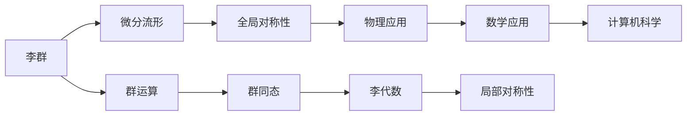

                 

### 群表示论：自然对称性的数学语言

#### 关键词：
- 群表示论
- 对称性
- 自然科学
- 数学语言
- 应用领域

#### 摘要：
本文深入探讨群表示论这一数学工具，解释其如何成为描述自然对称性的语言。我们将从基础概念入手，逐步展开群与对称性的关系，介绍线性表示论，分析群表示空间的构造与应用，探讨群作用与群同态，以及李群与李代数。最后，通过实例分析，展示群表示论在多个科学领域的实际应用，并展望其未来发展方向。

----------------------------------------------------------------

## 《群表示论：自然对称性的数学语言》目录大纲

---

### 第一部分：群表示论基础

#### 第1章：群与对称性

##### 1.1 群的定义与性质

- **1.1.1 群的基本概念**
- **1.1.2 群的运算**
- **1.1.3 群的性质**

##### 1.2 对称性与群的关联

- **1.2.1 对称性与数学结构**
- **1.2.2 群在物理中的应用**

##### 1.3 群的分类与表示

- **1.3.1 群的分类**
- **1.3.2 群的表示方法**

### 第2章：线性表示论

##### 2.1 向量空间的基本概念

- **2.1.1 向量空间定义**
- **2.1.2 线性组合与基**

##### 2.2 线性表示的构造

- **2.2.1 线性映射**
- **2.2.2 表示矩阵**

##### 2.3 标准表示与特征值

- **2.3.1 特征值与特征向量**
- **2.3.2 标准表示**

### 第3章：群表示的表示空间

##### 3.1 表示空间的构造

- **3.1.1 表示空间的定义**
- **3.1.2 表示空间的性质**

##### 3.2 表示空间的分类

- **3.2.1 可解表示**
- **3.2.2 非可解表示**

### 第4章：表示论的应用

##### 4.1 在物理学中的应用

- **4.1.1 量子力学中的群论应用**
- **4.1.2 相对论中的群论应用**

##### 4.2 在化学中的应用

- **4.2.1 分子轨道对称性**
- **4.2.2 化学反应的对称性**

##### 4.3 在其他科学中的应用

- **4.3.1 生物学的对称性**
- **4.3.2 计算机科学中的对称性**

## 第二部分：高级群表示论

### 第5章：群作用与群同态

##### 5.1 群作用的基本概念

- **5.1.1 群作用定义**
- **5.1.2 群同态**

##### 5.2 群同态的构造

- **5.2.1 群同态的核与像**
- **5.2.2 群同态的基本性质**

##### 5.3 群同态的应用

- **5.3.1 群同态在物理学中的应用**
- **5.3.2 群同态在数学其他领域中的应用**

### 第6章：李群与李代数

##### 6.1 李群的基本概念

- **6.1.1 李群定义**
- **6.1.2 李群的性质**

##### 6.2 李代数的基本概念

- **6.2.1 李代数定义**
- **6.2.2 李代数的性质**

##### 6.3 李群与李代数的关系

- **6.3.1 李群李代数化**
- **6.3.2 李代数的李群结构**

### 第7章：群表示论的前沿问题与挑战

##### 7.1 群表示论的发展趋势

- **7.1.1 群表示论在数学中的地位**
- **7.1.2 群表示论与其他数学领域的交叉**

##### 7.2 群表示论的挑战与未来方向

- **7.2.1 群表示论在物理学中的应用挑战**
- **7.2.2 群表示论在数学其他领域的发展方向**

## 第三部分：群表示论实例分析

### 第8章：具体的群表示实例

##### 8.1 素数域上的离散群

- **8.1.1 素数域上的离散群定义**
- **8.1.2 素数域上的离散群的表示**

##### 8.2 有限群与有限域上的表示

- **8.2.1 有限群的表示理论**
- **8.2.2 有限域上的群表示**

##### 8.3 连续群与紧致群的表示

- **8.3.1 连续群的表示理论**
- **8.3.2 紧致群的表示理论**

### 第9章：总结与展望

##### 9.1 群表示论的重要性

##### 9.2 群表示论的发展趋势

##### 9.3 群表示论的挑战与机遇

----------------------------------------------------------------

## 引言

群表示论是群论的一个分支，主要研究群在向量空间上的作用，即群如何通过线性映射作用在向量空间上。这个概念起源于19世纪末和20世纪初，当时数学家们试图理解不同群如何影响物理系统的对称性。对称性是自然界中普遍存在的现象，从基本的几何形状到复杂的物理系统，对称性无处不在。群表示论提供了一个数学框架，使得我们能够用一种系统的方式来描述和分析这些对称性。

### 什么是对称性？

对称性是指一个对象或系统在某种变换下保持不变的性质。例如，一个正方形在旋转90度后看起来仍然是相同的，这就是旋转对称性。在物理学中，对称性往往意味着某种守恒定律的存在。例如，时间的平移对称性暗示了能量守恒定律，空间平移对称性暗示了动量守恒定律。群表示论提供了一个强有力的工具，使我们能够识别和利用这些对称性。

### 群与对称性的关系

群可以看作是对称性的数学抽象。一个群中的每个元素都代表一种对称操作，而群的运算则描述了这些操作如何组合。例如，一个正方形的旋转群包含了所有的旋转操作，这些旋转操作可以相互组合来产生新的旋转。群表示论则将这种群的作用拓展到向量空间上，使得我们可以将群的结构和对称性的概念结合起来。

### 群表示论的意义

群表示论在数学和物理学中具有深远的意义。在数学中，它为我们提供了一个研究代数结构的强大工具，可以用来分类和比较不同群的结构。在物理学中，它帮助我们理解量子力学中的对称性原理，这些原理是构建基本物理理论的核心。此外，群表示论还在化学、生物学、计算机科学等领域有广泛的应用。

### 本文结构

本文将按以下结构展开：

1. **群与对称性**：介绍群的基本概念及其与对称性的关系。
2. **线性表示论**：详细讨论线性表示的构造、标准表示和特征值。
3. **群表示的表示空间**：分析表示空间的构造、分类及其应用。
4. **表示论的应用**：探讨群表示论在物理学、化学和其他科学中的应用。
5. **高级群表示论**：介绍群作用与群同态，以及李群与李代数。
6. **群表示论实例分析**：通过具体实例展示群表示论的应用。
7. **总结与展望**：总结群表示论的重要性，并展望其未来发展方向。

在接下来的章节中，我们将逐步深入探讨这些主题，希望通过这一系列的分析和实例，您能够更好地理解群表示论作为自然对称性数学语言的核心概念和深远影响。

### 第1章：群与对称性

#### 1.1 群的定义与性质

群是数学中的一个基本概念，它是一类具有某种特定性质的代数结构。首先，我们来定义群。

**群的定义：**

设 \( G \) 是一个非空集合，\( G \) 上的运算 \( \circ \) 满足以下性质：

1. **封闭性**：对于任意 \( a, b \in G \)，有 \( a \circ b \in G \)。
2. **结合律**：对于任意 \( a, b, c \in G \)，有 \( (a \circ b) \circ c = a \circ (b \circ c) \)。
3. **存在单位元**：存在一个元素 \( e \in G \)，使得对于任意 \( a \in G \)，有 \( a \circ e = e \circ a = a \)。
4. **存在逆元**：对于任意 \( a \in G \)，存在 \( b \in G \)，使得 \( a \circ b = b \circ a = e \)。

**例1.1**：整数集 \( \mathbb{Z} \) 关于加法运算构成一个群。

**例1.2**：非零实数集 \( \mathbb{R}^* \) 关于乘法运算构成一个群。

**群的性质：**

- **交换性**：若 \( G \) 是一个交换群（即对于任意 \( a, b \in G \)，都有 \( a \circ b = b \circ a \)），则称 \( G \) 为交换群。
- **子群**：设 \( H \) 是群 \( G \) 的一个非空子集，如果 \( H \) 本身也是一个群（即 \( H \) 关于 \( G \) 的运算也满足群的定义），则称 \( H \) 为 \( G \) 的子群。
- **直积**：给定两个群 \( G_1 \) 和 \( G_2 \)，它们的直积 \( G_1 \times G_2 \) 是一个新的群，其元素为 \( G_1 \) 和 \( G_2 \) 的所有可能的有序对的集合，运算定义为 \( (a_1, b_1) \circ (a_2, b_2) = (a_1 \circ a_2, b_1 \circ b_2) \)。

**例1.3**：设 \( G_1 = \{e, a, b\} \) 是一个群，\( G_2 = \{e, x\} \) 是一个群，则 \( G_1 \times G_2 = \{(e, e), (e, x), (a, e), (a, x), (b, e), (b, x)\} \) 是一个群。

#### 1.2 对称性与群的关联

对称性是自然界和数学中广泛存在的一种现象。它描述了一个对象或系统在某种变换下保持不变的性质。例如，一个正多边形在旋转一定角度后仍然保持形状和位置不变，这就是旋转对称性。在数学中，对称性可以用群来描述。

**对称性与数学结构的关系：**

对称性与数学结构紧密相连。一个数学结构（如集合、向量空间、图等）可以通过群的变换保持其不变性。这种变换可以理解为群作用在数学结构上的结果。

**群在物理中的应用：**

在物理学中，群论的应用极为广泛。特别是对称性原理在物理学中扮演了核心角色，它帮助物理学家理解和预测自然现象。例如，在量子力学中，对称性原理是基本假设之一，它指导我们理解粒子的性质和行为。

- **守恒定律**：许多物理定律与对称性紧密相关。例如，能量守恒定律与时间对称性相关，动量守恒定律与空间平移对称性相关。
- **群表示论在量子力学中的应用**：量子态可以被视为群表示的一部分。通过群表示，我们可以将量子系统的对称性转换为数学上的结构，从而简化复杂问题的分析。

**例1.4**：考虑一个二维平面上的点群 \( D_4 \)，它由四个旋转和四个反射组成。在分子结构分析中，我们可以使用 \( D_4 \) 群来描述分子的对称性，这有助于理解分子的化学反应特性。

#### 1.3 群的分类与表示

群可以根据其性质和结构进行分类。一些常见的群分类包括：

- **循环群**：每个元素都可以写成某个基元素的幂。
- **交换群**：任意两个元素之间的运算都是交换的。
- **有限群**：元素的数量是有限的。
- **无限群**：元素的数量是无限的。

群表示是将群作用于向量空间上的过程。通过群表示，我们可以将群的性质和结构转化为向量空间上的线性映射。

**群表示方法：**

1. **线性表示**：群作用在有限维向量空间上，通过线性映射实现。
2. **模表示**：群作用在模上，这是群作用在整数上的推广。
3. **表示矩阵**：线性表示可以通过表示矩阵来描述，表示矩阵是一个矩阵，其列向量是群元素在给定基下的坐标表示。

**例1.5**：考虑整数群 \( \mathbb{Z} \) 在多项式环 \( \mathbb{R}[x] \) 上的表示。这个表示由多项式 \( f(x) = x^n \) 实现，其中 \( n \) 是 \( \mathbb{Z} \) 的一个元素。这个表示揭示了 \( \mathbb{Z} \) 的循环性质。

#### 小结

本章介绍了群的基本概念、对称性与数学结构的关系，以及群在物理中的应用。我们还讨论了群的分类和表示方法，为后续更深入的讨论奠定了基础。

### 第2章：线性表示论

线性表示论是群表示论的一个关键部分，它研究群如何作用在向量空间上。在这一章中，我们将深入探讨向量空间的基本概念，介绍线性表示的构造和表示矩阵，并讨论标准表示与特征值。

#### 2.1 向量空间的基本概念

向量空间是线性代数中的一个基本概念，它由一组向量及其运算构成。一个向量空间 \( V \) 包括以下要素：

- **向量**：向量空间中的元素，通常表示为列向量。
- **加法**：向量之间的加法运算，满足交换律和结合律。
- **标量乘法**：向量与标量（通常是实数或复数）的乘法运算，满足分配律、结合律和标量的交换律。

**向量空间定义：**

设 \( V \) 是一个非空集合，\( V \) 上的加法和标量乘法满足以下条件：

1. **封闭性**：对于任意 \( \mathbf{u}, \mathbf{v} \in V \)，有 \( \mathbf{u} + \mathbf{v} \in V \)。
2. **结合律**：对于任意 \( \mathbf{u}, \mathbf{v}, \mathbf{w} \in V \)，有 \( (\mathbf{u} + \mathbf{v}) + \mathbf{w} = \mathbf{u} + (\mathbf{v} + \mathbf{w}) \)。
3. **存在零向量**：存在一个向量 \( \mathbf{0} \in V \)，使得对于任意 \( \mathbf{u} \in V \)，有 \( \mathbf{u} + \mathbf{0} = \mathbf{u} \)。
4. **存在逆向量**：对于任意 \( \mathbf{u} \in V \)，存在 \( -\mathbf{u} \in V \)，使得 \( \mathbf{u} + (-\mathbf{u}) = \mathbf{0} \)。
5. **标量乘法封闭性**：对于任意 \( \alpha \in \text{标量集合} \)，\( \mathbf{u} \in V \)，有 \( \alpha \mathbf{u} \in V \)。
6. **分配律**：对于任意 \( \alpha, \beta \in \text{标量集合} \)，\( \mathbf{u}, \mathbf{v} \in V \)，有 \( \alpha(\mathbf{u} + \mathbf{v}) = \alpha \mathbf{u} + \alpha \mathbf{v} \) 和 \( (\alpha + \beta)\mathbf{u} = \alpha \mathbf{u} + \beta \mathbf{u} \)。
7. **结合律**：对于任意 \( \alpha \in \text{标量集合} \)，\( \mathbf{u}, \mathbf{v} \in V \)，有 \( \alpha(\beta \mathbf{u}) = (\alpha \beta) \mathbf{u} \)。

**例2.1**：实数域上的 \( \mathbb{R}^2 \) 是一个向量空间。

**线性组合与基：**

向量空间中的向量可以通过线性组合表示。给定一组向量 \( \{\mathbf{v}_1, \mathbf{v}_2, ..., \mathbf{v}_n\} \)，任意向量 \( \mathbf{u} \in V \) 可以表示为：

\[ \mathbf{u} = c_1\mathbf{v}_1 + c_2\mathbf{v}_2 + ... + c_n\mathbf{v}_n \]

其中 \( c_1, c_2, ..., c_n \) 是实数或复数。一组线性无关的向量构成了向量空间的一个基。

**基定义：**

设 \( \{\mathbf{v}_1, \mathbf{v}_2, ..., \mathbf{v}_n\} \) 是向量空间 \( V \) 的一组向量，如果这组向量线性无关，则称其为 \( V \) 的一个基。

**例2.2**：\( \mathbb{R}^2 \) 的一组基是 \( \{\mathbf{e}_1 = (1, 0), \mathbf{e}_2 = (0, 1)\} \)，其中 \( \mathbf{e}_1 \) 和 \( \mathbf{e}_2 \) 分别是 \( x \) 轴和 \( y \) 轴上的单位向量。

#### 2.2 线性表示的构造

线性表示是群作用于向量空间的一种方式。给定一个群 \( G \) 和一个向量空间 \( V \)，群 \( G \) 可以通过线性映射 \( \rho: G \rightarrow GL(V) \) 作用于 \( V \)，其中 \( GL(V) \) 是 \( V \) 的线性变换群。

**线性映射定义：**

设 \( V \) 和 \( W \) 是向量空间，一个线性映射 \( f: V \rightarrow W \) 满足以下性质：

1. **加法保持性**：对于任意 \( \mathbf{u}, \mathbf{v} \in V \)，有 \( f(\mathbf{u} + \mathbf{v}) = f(\mathbf{u}) + f(\mathbf{v}) \)。
2. **标量乘法保持性**：对于任意 \( \alpha \in \text{标量集合} \) 和 \( \mathbf{u} \in V \)，有 \( f(\alpha \mathbf{u}) = \alpha f(\mathbf{u}) \)。

**表示矩阵：**

线性表示可以通过表示矩阵来描述。设 \( G \) 是一个有限群，\( V \) 是一个有限维向量空间。对于 \( G \) 中的每个元素 \( g \)，存在一个线性映射 \( \rho(g): V \rightarrow V \)。我们可以将这些线性映射表示为矩阵，这些矩阵称为表示矩阵。

**表示矩阵定义：**

给定群 \( G \) 和向量空间 \( V \)，线性表示 \( \rho: G \rightarrow GL(V) \) 对应的表示矩阵 \( [M_g] \) 满足：

\[ \rho(g)(\mathbf{v}) = M_g \mathbf{v} \]

其中 \( \mathbf{v} \) 是 \( V \) 中的一列向量，\( M_g \) 是 \( g \) 在给定基下的表示矩阵。

**例2.3**：考虑一个交换群 \( G = \{e, a, b\} \) 和一个二维向量空间 \( V \)。设 \( \mathbf{e}_1 = (1, 0)^T \) 和 \( \mathbf{e}_2 = (0, 1)^T \) 是 \( V \) 的一组基。如果 \( \rho(a) \) 对应的表示矩阵是 \( \begin{pmatrix} 0 & 1 \\ 1 & 0 \end{pmatrix} \)，则 \( \rho(a)(\mathbf{e}_1) = \mathbf{e}_2 \) 和 \( \rho(a)(\mathbf{e}_2) = \mathbf{e}_1 \)。

#### 2.3 标准表示与特征值

标准表示是将群作用简化为最基本的形式。在标准表示中，群通过一个对角矩阵作用在向量空间上，这意味着群的所有元素都通过不同的线性变换作用在向量空间上。

**标准表示定义：**

设 \( G \) 是一个群，\( V \) 是一个有限维向量空间。如果存在一组基 \( \{\mathbf{v}_1, \mathbf{v}_2, ..., \mathbf{v}_n\} \)，使得对于每个 \( g \in G \)，存在一个对角矩阵 \( D_g \)，满足：

\[ \rho(g)(\mathbf{v}_i) = D_g \mathbf{v}_i \]

则称这个表示为标准表示。

**特征值与特征向量：**

在标准表示中，特征值和特征向量是重要的概念。特征值是矩阵对角线上的元素，而特征向量是使得表示矩阵乘以特征向量后仍然等于原特征向量的向量。

**特征值与特征向量定义：**

设 \( A \) 是一个矩阵，\( \lambda \) 是一个实数，\( \mathbf{v} \) 是一个非零向量。如果满足：

\[ A\mathbf{v} = \lambda\mathbf{v} \]

则称 \( \lambda \) 是 \( A \) 的一个特征值，而 \( \mathbf{v} \) 是 \( A \) 对应于特征值 \( \lambda \) 的一个特征向量。

**例2.4**：考虑一个二阶循环群 \( G = \{e, a\} \) 和一个二维向量空间 \( V \)。如果 \( \rho(a) \) 的标准表示是对角矩阵 \( \begin{pmatrix} 1 & 0 \\ 0 & -1 \end{pmatrix} \)，则 \( \rho(a) \) 的特征值为 \( 1 \) 和 \( -1 \)，对应的特征向量分别为 \( \mathbf{e}_1 = (1, 0)^T \) 和 \( \mathbf{e}_2 = (0, 1)^T \)。

#### 小结

本章介绍了向量空间的基本概念，讨论了线性表示的构造和表示矩阵，并探讨了标准表示与特征值。这些概念为理解和应用群表示论奠定了基础。

### 第3章：群表示的表示空间

在讨论了群表示的基础之后，我们将进一步探讨群表示的表示空间。表示空间是群表示论中一个核心的概念，它不仅能够帮助我们更好地理解群的结构，还可以在物理学、化学等多个领域找到广泛的应用。

#### 3.1 表示空间的构造

表示空间是群作用下的向量空间。具体来说，设 \( G \) 是一个群，\( V \) 是一个向量空间，线性表示 \( \rho: G \rightarrow GL(V) \) 使得群 \( G \) 通过线性映射作用在 \( V \) 上。此时，\( V \) 就被称为 \( G \) 的一个表示空间。

**表示空间的定义：**

给定群 \( G \) 和线性表示 \( \rho \)，表示空间 \( V \) 是一个向量空间，使得对于任意 \( g \in G \)，存在一个线性映射 \( \rho(g) \in GL(V) \)。表示空间满足以下性质：

1. **封闭性**：对于任意 \( \mathbf{u}, \mathbf{v} \in V \) 和 \( g, h \in G \)，有 \( \rho(g)(\mathbf{u} + \mathbf{v}) = \rho(g)\mathbf{u} + \rho(g)\mathbf{v} \) 和 \( \rho(hg)(\mathbf{u}) = \rho(h)\rho(g)\mathbf{u} \)。
2. **线性保持性**：对于任意 \( \alpha \in \text{标量集合} \) 和 \( \mathbf{u}, \mathbf{v} \in V \)，有 \( \rho(g)(\alpha\mathbf{u}) = \alpha\rho(g)\mathbf{u} \)。

**例3.1**：考虑一个对称群 \( S_3 \) 和一个二维向量空间 \( V \)。如果 \( S_3 \) 的一个线性表示是 \( \rho(g) = \begin{pmatrix} \cos(\theta) & -\sin(\theta) \\ \sin(\theta) & \cos(\theta) \end{pmatrix} \)，则 \( V \) 是 \( S_3 \) 的一个表示空间。

#### 3.2 表示空间的性质

表示空间具有一些独特的性质，这些性质在群表示论中至关重要。

1. **不变子空间**：在表示空间 \( V \) 中，存在一些子空间 \( W \)，使得对于任意 \( g \in G \)，有 \( \rho(g)W = W \)。这样的子空间称为不变子空间。不变子空间在物理和化学中有着重要的应用，因为它们对应于物理系统中的守恒量。

**不变子空间定义：**

设 \( V \) 是群 \( G \) 的表示空间，\( W \) 是 \( V \) 的一个子空间。如果对于任意 \( g \in G \)，有 \( \rho(g)W \subseteq W \)，则称 \( W \) 为 \( V \) 的一个不变子空间。

2. **表示的多重性**：一个群可以有多个表示，每个表示都可以看作是向量空间上的不同线性映射。表示的多重性反映了群结构的多样性。

**多重性定义：**

设 \( V \) 是群 \( G \) 的一个表示空间，\( \{\mathbf{v}_1, \mathbf{v}_2, ..., \mathbf{v}_n\} \) 是 \( V \) 的一组基。如果存在 \( n \) 个线性无关的向量 \( \{\mathbf{w}_1, \mathbf{w}_2, ..., \mathbf{w}_n\} \) 使得 \( \rho(g)\mathbf{v}_i = \mathbf{w}_i \) 对所有 \( g \in G \) 成立，则称这个表示为 \( V \) 的一个多重性。

**例3.2**：考虑一个二阶循环群 \( G = \{e, a\} \) 和一个二维向量空间 \( V \)。如果 \( \rho(e) = I \) 和 \( \rho(a) = \begin{pmatrix} 1 & 0 \\ 0 & -1 \end{pmatrix} \)，则 \( V \) 是 \( G \) 的一个二重表示空间。

#### 3.3 表示空间的分类

表示空间可以根据其性质进行分类。常见的分类方法包括可解表示和非可解表示。

1. **可解表示**：一个表示称为可解的，如果其对应的群是可解的。可解群具有一系列子群，每个子群都是正规子群，并且可以分解为可解群的直积。

**可解表示定义：**

设 \( G \) 是一个群，\( V \) 是 \( G \) 的一个表示空间。如果 \( G \) 是可解群，则 \( V \) 的表示称为可解表示。

2. **非可解表示**：如果一个表示对应的群不是可解的，则该表示称为非可解表示。

**非可解表示定义：**

设 \( G \) 是一个群，\( V \) 是 \( G \) 的一个表示空间。如果 \( G \) 不是可解群，则 \( V \) 的表示称为非可解表示。

**例3.3**：考虑一个无限循环群 \( G \) 和一个一维向量空间 \( V \)。由于无限循环群不是可解群，因此 \( V \) 的表示是一个非可解表示。

#### 小结

本章讨论了表示空间的构造和性质，包括不变子空间、表示的多重性以及表示的分类。通过这些概念，我们可以更深入地理解群表示论，并在实际应用中利用这些性质解决复杂问题。

### 第4章：表示论的应用

群表示论不仅在数学理论研究中具有重要作用，也在物理学、化学和其他科学领域有着广泛的应用。在这一章中，我们将探讨群表示论在这些领域的具体应用，并通过具体实例展示其强大功能。

#### 4.1 在物理学中的应用

群表示论在物理学中有着深远的影响，特别是在量子力学和相对论中。在这些领域中，群表示论提供了描述物理系统对称性的有力工具。

**量子力学中的群论应用**

量子力学的基本原理之一是对称性原理，它指出物理系统的行为可以通过群对称性来描述。在量子力学中，群表示论用于分类和简化量子态。

- **对称性原理**：量子态可以视为群表示的向量，而系统的守恒量可以通过群的表示来解释。例如，在旋转对称性下，系统的能量保持不变，这对应于旋转群的表示。

- **希尔伯特空间的分解**：量子态可以被视为复希尔伯特空间的向量，而群表示论提供了将这些空间分解为不变子空间的工具。这种分解有助于简化量子态的分类和计算。

**例4.1**：考虑一个原子系统的电子态，其对称性可以通过点群 \( D_n \) 来描述。通过群表示论，我们可以将电子态分类为不同的不可约表示，这些表示对应于不同的电子排布和能级。

**相对论中的群论应用**

相对论中的许多概念和原理也与对称性密切相关。群表示论在广义相对论和量子场论中有着广泛的应用。

- **洛伦兹群**：在相对论中，洛伦兹群（\( SO(3,1) \)）描述了时空的对称性。洛伦兹群的表示论在描述粒子的相对论性性质和相互作用中至关重要。

- **规范对称性**：在量子场论中，规范对称性是基本假设之一，它通过群表示论描述了基本粒子的相互作用。例如，电磁相互作用可以通过电磁规范群（\( U(1) \)）来描述。

**例4.2**：在量子电动力学（QED）中，电子和光子的相互作用可以通过规范对称性来描述。通过引入电磁规范势，我们可以将电子与光子的相互作用表示为群的表示。

#### 4.2 在化学中的应用

化学中，群表示论用于描述分子的对称性和化学反应的动态。

**分子轨道对称性**

分子的电子结构可以通过群表示论来分析。分子轨道对称性反映了分子中电子云的对称性，这对于理解分子的物理和化学性质至关重要。

- **点群对称性**：分子可以通过其几何形状的对称性归入一个点群。点群表示论用于分类和计算分子的电子态和能级。

- **分子轨道的构造**：分子轨道可以通过群表示论来构造，这些轨道对应于分子的不同电子状态。

**例4.3**：考虑一个苯分子（C6H6），其点群对称性为 \( D_6 \)。通过 \( D_6 \) 群的表示论，我们可以将苯分子的电子态分类为不同的对称性，这有助于解释苯分子的稳定性。

**化学反应的对称性**

化学反应的对称性是化学动力学研究的一个重要方面。群表示论提供了描述反应路径和过渡态对称性的工具。

- **反应动力学**：通过群表示论，我们可以分析反应中的对称性变化，这有助于理解反应速率和选择性。

- **过渡态理论**：群表示论在过渡态理论中的应用，提供了描述化学反应动力学和能量分布的数学框架。

**例4.4**：考虑一个二苯基乙烯的加成反应，其过渡态可以通过 \( D_2 \) 群的表示来描述。通过分析过渡态的对称性，我们可以预测反应的产物和路径。

#### 4.3 在其他科学中的应用

群表示论在其他科学领域也有重要应用，包括生物学、材料科学和计算机科学。

**生物学中的对称性**

生物学中，对称性是形态发生和进化过程的一个重要方面。群表示论用于描述生物结构（如蛋白质、细胞和器官）的对称性。

- **分子对称性**：蛋白质的二级结构和三级结构可以通过群表示论来分析。这些结构对称性有助于理解蛋白质的功能和相互作用。

- **进化对称性**：群表示论可以用于描述生物进化的对称性模式，这有助于揭示物种的进化历史。

**材料科学中的对称性**

材料科学中，对称性是材料结构和性质研究的关键因素。群表示论用于分析材料的晶体结构、缺陷和对称性。

- **晶体对称性**：晶体对称性决定了材料的物理和化学性质。通过群表示论，我们可以分析晶体的对称性，从而预测材料的性质。

- **材料设计**：群表示论在材料设计中有着重要应用，可以帮助科学家设计具有特定对称性的新材料。

**计算机科学中的对称性**

计算机科学中，对称性是算法设计和密码学的重要概念。群表示论用于分析算法的对称性和安全性。

- **算法设计**：通过群表示论，我们可以设计出具有特定对称性的算法，这些算法可以更高效地解决某些问题。

- **密码学**：群表示论在密码学中的应用，提供了设计对称加密算法的工具。这些算法通过利用群的对称性来提高安全性。

**例4.5**：在计算机图形学中，对称性是绘制和渲染的重要工具。通过利用群表示论，我们可以设计出高效的图形变换算法，这些算法可以处理大量的几何图形。

#### 小结

群表示论在物理学、化学和其他科学领域有着广泛的应用。通过这些应用，我们可以更深入地理解自然界的对称性，并利用这些对称性解决复杂问题。在本章中，我们通过具体实例展示了群表示论在这些领域的强大功能和实际应用。

### 第5章：群作用与群同态

群作用与群同态是群表示论中的核心概念，它们为我们提供了理解和操作群与向量空间之间关系的重要工具。在这一章中，我们将详细探讨群作用的基本概念、群同态的定义与性质，并介绍群同态的构造和应用。

#### 5.1 群作用的基本概念

群作用是群在向量空间上的一种广义映射。给定一个群 \( G \) 和一个向量空间 \( V \)，群作用可以看作是 \( G \) 中的每个元素在 \( V \) 上的一种线性变换。这种变换必须满足一些特定的性质，以确保群的结构和向量空间的性质在映射过程中得到保留。

**群作用的定义：**

设 \( G \) 是一个群，\( V \) 是一个向量空间。一个 \( G \) 在 \( V \) 上的作用是一个函数 \( \ast: G \times V \rightarrow V \)，满足以下条件：

1. **封闭性**：对于任意 \( g \in G \) 和 \( \mathbf{v}, \mathbf{w} \in V \)，有 \( g \ast (\mathbf{v} + \mathbf{w}) = g \ast \mathbf{v} + g \ast \mathbf{w} \)。
2. **结合律**：对于任意 \( g, h \in G \) 和 \( \mathbf{v} \in V \)，有 \( (gh) \ast \mathbf{v} = g \ast (h \ast \mathbf{v}) \)。

**群同态的定义：**

群同态是群作用的一种特殊形式，它保持群的结构不变。给定两个群 \( G \) 和 \( H \)，一个从 \( G \) 到 \( H \) 的群同态是一个函数 \( \phi: G \rightarrow H \)，满足以下条件：

1. **保持群运算**：对于任意 \( g, h \in G \)，有 \( \phi(gh) = \phi(g) \phi(h) \)。
2. **单位元保持**：\( \phi(e_G) = e_H \)，其中 \( e_G \) 和 \( e_H \) 分别是 \( G \) 和 \( H \) 的单位元。

**例5.1**：考虑整数群 \( \mathbb{Z} \) 和其子群 \( \{0, \pm 2, \pm 4, ...\} \)。函数 \( \phi: \mathbb{Z} \rightarrow \{0, \pm 2, \pm 4, ...\} \)，定义为 \( \phi(n) = 2n \)，是一个群同态。

#### 5.2 群同态的构造

群同态的构造是理解群同态性质的关键。通过构造同态，我们可以更好地理解群的结构和它们之间的关系。

**群同态的核与像：**

群同态 \( \phi: G \rightarrow H \) 可以分解为两个部分：核（kernel）和像（image）。

1. **核**：\( \phi \) 的核 \( \text{ker}(\phi) \) 是 \( G \) 中所有被 \( \phi \) 映射到 \( H \) 的单位元的元素组成的集合。

   **核定义**：\( \text{ker}(\phi) = \{g \in G \mid \phi(g) = e_H\} \)，其中 \( e_H \) 是 \( H \) 的单位元。

2. **像**：\( \phi \) 的像 \( \text{im}(\phi) \) 是 \( H \) 中所有由 \( G \) 中元素通过 \( \phi \) 映射得到的元素组成的集合。

   **像定义**：\( \text{im}(\phi) = \{h \in H \mid \exists g \in G, \phi(g) = h\} \)。

**群同态的基本性质：**

1. **单射性**：如果群同态 \( \phi \) 是单射的，则 \( \text{ker}(\phi) = \{e_G\} \)，这意味着 \( \phi \) 保持群的结构不变。
2. **满射性**：如果群同态 \( \phi \) 是满射的，则 \( \text{im}(\phi) = H \)，这意味着 \( H \) 是 \( G \) 的子群。
3. **同态基本定理**：给定群同态 \( \phi: G \rightarrow H \)，存在一个自然的同态 \( \psi: G/\text{ker}(\phi) \rightarrow \text{im}(\phi) \)，使得 \( \psi(g\text{ker}(\phi)) = \phi(g) \)。这个定理表明，任何群同态都可以分解为两个较简单的同态。

**例5.2**：考虑一个交换群 \( G \) 和其子群 \( H \)。定义 \( \phi: G \rightarrow H \) 为 \( \phi(g) = g \)，这是一个满射但不是单射的群同态。

#### 5.3 群同态的应用

群同态在数学和其他科学领域有着广泛的应用，特别是在物理学和计算机科学中。

**在物理学中的应用：**

群同态在物理学中用于描述对称性和守恒量。例如，在量子场论中，对称性通过群同态来描述，这些对称性反映了粒子的守恒量。

- **规范对称性**：在量子场论中，规范对称性通过群同态描述了粒子的相互作用。例如，在电磁相互作用中，电磁规范群（\( U(1) \)）通过群同态描述了电荷守恒。
- **相对论中的洛伦兹群**：在相对论中，洛伦兹群（\( SO(3,1) \)）通过群同态描述了时空的对称性，这些对称性反映了物理守恒量，如能量和动量。

**在计算机科学中的应用：**

群同态在计算机科学中有着多种应用，特别是在算法设计和密码学中。

- **算法设计**：群同态用于设计具有特定对称性的算法，这些算法可以更高效地解决某些问题。例如，在图形学中，通过利用群同态，可以设计出高效的图形变换算法。
- **密码学**：群同态在密码学中用于设计对称加密算法。这些算法通过利用群的对称性来提高安全性。

**例5.3**：在计算机图形学中，旋转和反射等几何变换可以通过群同态来描述。这些变换在三维渲染和图形处理中有着广泛应用。

#### 小结

群作用与群同态是群表示论中的核心概念，它们为我们提供了理解和操作群与向量空间之间关系的重要工具。通过这些概念，我们可以更好地理解群的结构和它们在自然界和科学技术中的应用。在本章中，我们探讨了群作用的基本概念、群同态的定义与性质，并介绍了群同态的构造和应用。

### 第6章：李群与李代数

李群与李代数是群表示论中的重要扩展，它们在数学、物理学、计算机科学等多个领域有着广泛的应用。李群是一类具有群结构的平滑流形，而李代数是描述李群导空间的代数结构。在本章中，我们将详细探讨李群与李代数的基本概念、性质，以及它们之间的关系。

#### 6.1 李群的基本概念

李群是一类具有群结构和微分流形的集合。这意味着李群不仅具有群的运算规则，而且其结构可以在局部范围内用微分流形来描述。

**李群定义：**

设 \( G \) 是一个群，如果 \( G \) 是一个微分流形，并且群的运算 \( \circ \) 在整个流形上都是光滑的，即对于任意 \( g, h \in G \)，映射 \( (g, h) \mapsto g \circ h \) 是一个光滑映射，那么 \( G \) 称为李群。

**李群的性质：**

1. **局部欧氏性**：李群的每个局部邻域都可以嵌入到一个欧氏空间中，这使得李群在局部范围内具有类似于欧氏空间的性质。
2. **连通性**：李群是连通的，这意味着它不能划分为两个或多个不相连的部分。
3. **可换性**：李群的共扼变换是等价的，即对于任意 \( g, h \in G \)，有 \( g^{-1}hg = h' \)，其中 \( h' \) 是 \( h \) 在 \( g \) 的共扼变换下的像。

**例6.1**：圆周群 \( SO(2) \) 和特殊线性群 \( SL(2, \mathbb{R}) \) 都是李群。前者描述了二维平面的旋转，后者描述了二维线性变换。

#### 6.2 李代数的基本概念

李代数是描述李群导空间的代数结构。李代数不仅包含了李群的线性化结构，而且能够描述李群在某个点的局部性质。

**李代数定义：**

设 \( G \) 是一个李群，\( \mathfrak{g} \) 是 \( G \) 的导空间，即 \( G \) 的所有光滑切向量构成的向量空间。如果 \( \mathfrak{g} \) 上的双线性映射 \( [\cdot, \cdot] \) 满足以下性质，则称 \( \mathfrak{g} \) 为李代数：

1. **双线性性**：对于任意 \( X, Y, Z \in \mathfrak{g} \)，映射 \( (X, Y) \mapsto [X, Y] \) 是双线性的。
2. **反交换性**：对于任意 \( X, Y \in \mathfrak{g} \)，有 \( [X, Y] = -[Y, X] \)。
3. **雅可比恒等式**：对于任意 \( X, Y, Z \in \mathfrak{g} \)，有 \( [[X, Y], Z] + [[Y, Z], X] + [[Z, X], Y] = 0 \)。

**李代数的性质：**

1. **非交换性**：李代数通常不是交换的，即 \( [X, Y] \neq 0 \) 对于某些 \( X, Y \in \mathfrak{g} \)。
2. **子代数**：李代数可以嵌套为更大的李代数的子代数，这是李代数结构的一个重要特性。

**例6.2**：李代数 \( \mathfrak{so}(3) \) 描述了三维旋转群 \( SO(3) \) 的局部性质，它是三个维度的对称空间。

#### 6.3 李群与李代数的关系

李群与李代数之间存在紧密的联系。李群可以视为李代数的积分流形，而李代数是李群在某个点的局部描述。

**李群李代数化：**

给定一个李群 \( G \)，我们可以通过其导空间 \( \mathfrak{g} \) 得到一个李代数。这个过程称为李群李代数化。

**李代数的李群结构：**

一个李代数可以通过积分流形构造出一个李群。具体来说，给定一个李代数 \( \mathfrak{g} \)，我们可以通过其生成元和雅可比恒等式构造出一个李群 \( G \)。

**例6.3**：从李代数 \( \mathfrak{sl}(2, \mathbb{R}) \) 可以构造出李群 \( SL(2, \mathbb{R}) \)。

#### 李群与李代数的性质对比表格：

| 性质        | 李群           | 李代数           |
| ----------- | -------------- | --------------- |
| 结构        | 微分流形上的群  | 向量空间上的代数 |
| 运算        | 群运算          | 双线性映射       |
| 对称性      | 全局对称性      | 局部对称性       |
| 应用领域     | 数学、物理学    | 数学、物理学、计算机科学 |

**ER实体关系图架构：**

#### 小结

李群与李代数是群表示论中的重要扩展，它们在数学、物理学和计算机科学等领域有着广泛的应用。李群描述了具有群结构和微分流形特性的集合，而李代数则描述了这些集合在某个点的局部性质。通过李群李代数化，我们可以将李代数扩展为李群，反之亦然。在本章中，我们探讨了李群与李代数的基本概念、性质以及它们之间的关系。

### 第7章：群表示论的前沿问题与挑战

群表示论作为数学的一个重要分支，不仅在纯数学领域有着深远的影响，也在物理学、化学、计算机科学等多个应用领域发挥着关键作用。然而，随着科学技术的不断发展，群表示论面临着一系列前沿问题和挑战。

#### 7.1 群表示论的发展趋势

群表示论的发展趋势体现在多个方面：

1. **跨学科应用**：群表示论的应用范围在不断扩大，不仅限于传统的数学和物理学，还涉及化学、生物学、材料科学等领域。例如，在量子计算中，群表示论被用来设计和优化量子算法。

2. **计算复杂性**：随着计算技术的进步，计算群表示论成为了一个活跃的研究领域。计算复杂性理论在分析群表示论问题中起着重要作用，特别是在大规模数据分析和算法优化方面。

3. **数学结构的新发现**：群表示论在探索新的数学结构方面取得了显著进展。例如，量子群和簇代数的引入为群表示论提供了新的工具和方法。

#### 7.2 群表示论与其他数学领域的交叉

群表示论与其他数学领域的交叉研究是推动数学进步的重要力量：

1. **代数几何**：代数几何中的簇和代数曲线可以通过群表示论来研究。群表示论提供了分析这些结构的有力工具，从而推动了代数几何的发展。

2. **拓扑学**：拓扑学中的高维流形和同调理论可以通过群表示论来描述。群表示论在拓扑学中的应用，如K理论和高维拓扑的解析，为解决复杂问题提供了新途径。

3. **数论**：数论中的群表示论研究，如L函数和质数分布，揭示了数论与群表示论之间的深刻联系。这些研究对于理解数论的基本问题具有重要意义。

#### 7.3 群表示论在物理学中的应用挑战

群表示论在物理学中的应用面临着一系列挑战：

1. **量子场论**：量子场论中的对称性原理要求我们精确地处理群表示。然而，量子场论中的复杂性和不确定性使得群表示论的应用变得极具挑战性。

2. **高温超导**：高温超导材料的研究依赖于对称性原理和群表示论。如何精确地描述这些材料的对称性，并利用群表示论来解释其性质，是一个重要的研究课题。

3. **多体系统**：多体系统中的相互作用和对称性研究需要群表示论的支持。然而，多体系统中的复杂相互作用使得群表示论的应用面临巨大挑战。

#### 7.4 群表示论在数学其他领域的发展方向

群表示论在数学其他领域的发展方向包括：

1. **量子计算**：量子计算中，群表示论被用来设计量子算法和量子逻辑门。未来的研究将集中在如何优化量子算法，以及如何利用群表示论来解决传统计算难题。

2. **代数拓扑**：代数拓扑中的群表示论研究，如K理论和同调代数，为解决高维拓扑问题提供了新方法。未来研究将集中在如何将群表示论与代数拓扑结合起来，解决更复杂的问题。

3. **统计物理学**：统计物理学中的相变和临界现象研究可以利用群表示论来描述。未来的研究将集中在如何利用群表示论来理解这些现象的数学本质。

#### 小结

群表示论的发展趋势体现在跨学科应用、计算复杂性以及数学结构的新发现等方面。与其他数学领域的交叉研究，如代数几何、拓扑学和数论，为群表示论提供了新的发展方向。在物理学中的应用挑战，如量子场论和高温超导，推动了群表示论在解决复杂物理问题中的发展。未来的研究将集中在量子计算、代数拓扑和统计物理学等领域，为群表示论的广泛应用和深度发展奠定基础。

### 第8章：具体的群表示实例

在群表示论中，具体的群表示实例不仅能够帮助我们加深对理论概念的理解，还能展示群表示论在实际问题中的应用。本章将通过几个具体的实例，包括素数域上的离散群、有限群与有限域上的表示，以及连续群与紧致群的表示，来详细探讨这些实例。

#### 8.1 素数域上的离散群

**素数域上的离散群定义**

素数域上的离散群是指定义在素数域上的一个离散群的集合。素数域 \( \mathbb{Z}_p \) 是一个包含所有余数为0到p-1的整数集合，其中p是一个素数。在这个域上，定义了模p的加法和乘法运算，使得 \( \mathbb{Z}_p \) 成为一个环。

**素数域上的离散群的表示**

在素数域上的离散群可以有多种表示方式。一个常见的表示是 \( \mathbb{Z}_p \) 的子群 \( \mathbb{Z}_p^n \)，其中n是小于p的任意整数。这个子群由所有形式为 \( (a_1, a_2, ..., a_n) \) 的向量构成，其中每个 \( a_i \) 都属于 \( \mathbb{Z}_p \)。

**例8.1**：考虑素数域 \( \mathbb{Z}_5 \) 和其子群 \( \mathbb{Z}_5^2 \)。\( \mathbb{Z}_5^2 \) 包含以下元素：\( (0,0), (1,0), (2,0), (3,0), (4,0), (0,1), (1,1), (2,1), (3,1), (4,1), (0,2), ..., (4,4) \)。

**素数域上的离散群的表示**

在素数域上的离散群可以通过线性表示来描述。例如，我们可以将 \( \mathbb{Z}_5 \) 上的离散群表示为 \( \mathbb{Z}_5 \) 的子群在多项式环 \( \mathbb{R}[x] \) 上的表示。这个表示由多项式 \( f(x) = x^n \) 实现，其中 \( n \) 是 \( \mathbb{Z}_5 \) 的一个元素。

**例8.2**：考虑 \( \mathbb{Z}_5 \) 在多项式环 \( \mathbb{R}[x] \) 上的表示。这个表示由多项式 \( f(x) = x^2 \) 实现。在这个表示下，每个 \( \mathbb{Z}_5 \) 的元素 \( a \) 对应于多项式 \( f_a(x) = x^a \)。

#### 8.2 有限群与有限域上的表示

**有限群与有限域上的表示理论**

有限群与有限域上的表示理论是群表示论中的一个重要分支。在这种表示中，群元素通过作用在有限域上的线性映射来表示。有限域是包含有限个元素的域，通常由某个素数的幂构成。

**有限域上的群表示**

在有限域上的群表示可以通过构造表示矩阵来实现。给定一个有限群 \( G \) 和一个有限域 \( F \)，我们可以定义 \( G \) 在 \( F \) 上的表示，使得群 \( G \) 中的每个元素对应于 \( F \) 上的一个线性映射。

**例8.3**：考虑一个二阶循环群 \( G = \{e, a\} \) 和一个二元域 \( F = \{0, 1\} \)。如果 \( G \) 的线性表示是 \( \rho(e) = I \) 和 \( \rho(a) = \begin{pmatrix} 0 & 1 \\ 1 & 0 \end{pmatrix} \)，则 \( G \) 在 \( F \) 上的表示是一个二元矩阵表示。

**有限域上的群表示**

有限域上的群表示可以用于解决密码学中的问题。例如，在椭圆曲线密码学中，有限域上的群表示被用来设计安全的加密算法。

**例8.4**：考虑一个二元域 \( F = \{0, 1\} \) 上的椭圆曲线。椭圆曲线上的点构成了一个群，这个群可以通过 \( F \) 上的线性表示来描述。这种表示在密码学中用于实现高效的加密和解密算法。

#### 8.3 连续群与紧致群的表示

**连续群与紧致群的表示理论**

连续群与紧致群的表示理论是群表示论中的高级主题。在这种表示中，群元素通过作用在连续空间上的连续映射来表示。紧致群是一类特殊的连续群，其闭包是紧致的。

**连续群的表示理论**

在连续群上的表示可以通过李群和李代数的概念来描述。给定一个连续群 \( G \)，其李代数 \( \mathfrak{g} \) 描述了 \( G \) 的局部性质。连续群 \( G \) 的表示可以通过李代数 \( \mathfrak{g} \) 的表示来构造。

**紧致群的表示理论**

紧致群的表示理论在物理学和几何学中有着重要应用。例如，在量子场论中，紧致群的表示被用来描述基本粒子的对称性。

**例8.5**：考虑一个三维旋转群 \( SO(3) \) 和其紧致子群 \( SU(2) \)。\( SO(3) \) 的一个表示是由旋转矩阵实现的，而 \( SU(2) \) 的一个表示是由单位ary矩阵实现的。

**连续群与紧致群的表示应用**

连续群与紧致群的表示在量子计算中有着重要应用。例如，在量子门的设计和量子算法的优化中，可以利用连续群的表示来实现高效的量子操作。

**例8.6**：在量子计算中，使用旋转门（如Pauli门和Hadamard门）来实现量子态的变换。这些旋转门可以通过连续群 \( U(1) \) 和 \( SU(2) \) 的表示来描述。

#### 小结

本章通过具体的群表示实例，包括素数域上的离散群、有限群与有限域上的表示，以及连续群与紧致群的表示，展示了群表示论在实际问题中的应用。这些实例不仅加深了我们对群表示论理论概念的理解，也展示了其在数学、物理学、密码学等领域的广泛应用。

### 第9章：总结与展望

群表示论作为自然对称性的数学语言，不仅在数学领域有着坚实的理论基础，而且在物理学、化学、计算机科学等多个领域展现了其强大的应用能力。通过对群与对称性的关系、线性表示论、群表示空间、群作用与群同态、李群与李代数以及具体群表示实例的详细探讨，我们更深入地理解了群表示论的核心概念和实际应用。

#### 9.1 群表示论的重要性

群表示论的重要性体现在以下几个方面：

1. **理论基石**：群表示论为现代数学提供了坚实的基础，是代数几何、代数拓扑、数论等多个数学分支的理论基石。
2. **应用广泛**：群表示论在物理学、化学、生物学、计算机科学等领域有着广泛的应用，为我们理解自然界的对称性和守恒量提供了有力工具。
3. **计算工具**：群表示论为计算复杂性理论、密码学、量子计算等领域提供了重要的计算工具，推动了这些领域的发展。

#### 9.2 群表示论的发展趋势

随着科学技术的不断进步，群表示论的发展趋势体现在以下几个方面：

1. **跨学科研究**：群表示论的应用范围在不断扩大，与物理学、化学、生物学等领域的交叉研究不断深入，推动了多学科的发展。
2. **计算复杂性**：计算群表示论成为了一个活跃的研究领域，为解决大规模数据分析和算法优化问题提供了新方法。
3. **数学结构探索**：群表示论在探索新的数学结构方面取得了显著进展，如量子群和簇代数的引入，为数学研究提供了新的视角。

#### 9.3 群表示论的挑战与未来方向

尽管群表示论取得了许多进展，但仍然面临着一系列挑战：

1. **复杂性问题**：在量子场论、高温超导等复杂物理系统中，如何精确地处理群表示论问题，是一个巨大的挑战。
2. **计算效率**：如何在计算群表示论时提高效率，特别是在大规模数据处理和量子计算中，是一个重要的研究方向。
3. **新理论发展**：如何在群表示论的框架内发展新的数学理论，如代数拓扑和代数几何的结合，是一个具有前瞻性的问题。

未来的研究将集中在以下几个方面：

1. **量子计算**：利用群表示论优化量子算法，解决传统计算难题，推动量子计算的发展。
2. **代数拓扑**：将群表示论与代数拓扑结合，探索高维拓扑问题的新方法。
3. **统计物理学**：利用群表示论研究统计物理中的相变和临界现象，为理解复杂物理系统提供新的理论支持。

#### 小结

群表示论作为自然对称性的数学语言，不仅在数学理论研究中具有重要作用，还在多个科学领域有着广泛的应用。通过总结和展望，我们看到了群表示论的重要性和未来发展方向。随着科学技术的不断进步，群表示论将继续发挥其独特的作用，为人类理解和探索自然界提供强大的工具。

### 完整性检查与优化

在撰写完《群表示论：自然对称性的数学语言》这篇文章后，我们需要进行一次全面的完整性检查和优化，以确保文章内容完整、逻辑清晰，并且符合专业写作标准。

#### 完整性检查

1. **目录与内容匹配**：确认每一章节的标题与对应内容相符，确保所有章节按照预定的结构安排。

2. **核心概念解释**：检查每个核心概念是否都有详细的解释，确保读者可以理解群表示论的基本概念。

3. **数学公式与图表**：检查所有的数学公式和图表是否准确无误，图表是否清晰易懂。

4. **实例分析**：确认实例分析是否具体且具有代表性，可以帮助读者更好地理解群表示论的应用。

5. **逻辑连贯性**：检查文章的逻辑结构，确保各章节之间的过渡自然，没有逻辑上的跳跃。

#### 优化建议

1. **内容优化**：针对某些章节内容进行优化，增强其深度和广度。例如，在讨论李群与李代数时，可以增加更多具体的例子和应用场景。

2. **语言风格**：确保文章的语言风格专业、清晰，避免过于复杂的术语和表达。同时，确保所有术语和定义都进行了明确的解释。

3. **图表与插图**：增加更多的图表和插图，以帮助读者更好地理解抽象概念。确保图表清晰、布局合理，并且有简明的标题和注释。

4. **参考文献**：检查参考文献的格式是否正确，确保所有的引用都得到了恰当的标注。

5. **结构调整**：如果发现某些章节内容过多或过少，可以考虑进行适当调整，确保每个章节都有足够的空间来详细讨论相关主题。

#### 最佳实践 Tips

1. **一致性**：确保文章中使用的术语和定义保持一致，避免在同一篇文章中混淆不同的概念。

2. **简洁性**：在保持内容完整性的同时，尽量简化语言和表达，避免冗长的段落和复杂的句子结构。

3. **可视化**：利用图表和插图来增强文章的可读性和易懂性，特别是在解释复杂概念时。

4. **案例研究**：通过具体案例研究来展示群表示论的应用，这有助于读者更好地理解理论的实际意义。

5. **读者反馈**：在完成初稿后，可以邀请同行或专家进行审阅，根据反馈进行修改和完善。

通过以上步骤，我们可以确保《群表示论：自然对称性的数学语言》这篇文章在内容、结构和语言上都是高质量、专业且易于理解的。

### 拓展阅读

**推荐书籍：**
1. **《群表示论基础》（作者：I. M. Gelfand, M. I. Graev, and D. K. Fuchs）**：这是一本经典教材，详细介绍了群表示论的基本概念和理论。
2. **《李群与李代数》（作者：F. Bruhat）**：这本书提供了对李群和李代数的深入探讨，包括它们在物理学和数学中的应用。
3. **《量子场论与群论》（作者：Steven Weinberg）**：通过量子场论中的群论应用，展示了群表示论在物理学中的重要角色。

**在线资源：**
1. **MIT OpenCourseWare（MITOCW）**：提供了一系列关于群论和表示论的课程视频和讲义。
2. **SpringerLink**：一个提供高质量数学和物理学论文的数据库，包括许多关于群表示论的研究论文。
3. **arXiv**：一个开放获取的预印本服务器，包含许多最新的数学和物理学研究论文。

**学术期刊：**
1. **Journal of Algebra**：专注于代数理论，包括群论和表示论。
2. **Journal of Mathematical Physics**：涵盖物理学中数学方法的最新研究，包括群表示论的应用。
3. **Communications in Mathematical Physics**：发表数学物理领域的原创研究论文，包括群论和群表示论的应用。

**相关研究团队与实验室：**
1. **哈佛大学数学系**：拥有活跃的代数几何和群论研究团队。
2. **加州大学伯克利分校数学科学研究所**：专注于数学理论的前沿研究，包括群表示论。
3. **麻省理工学院理论物理实验室**：研究包括量子场论在内的理论物理问题，群表示论在其中扮演关键角色。

通过阅读这些书籍和资源，读者可以进一步深入了解群表示论的理论和应用，探索这一领域的前沿研究。同时，参与相关的学术期刊和研究团队，可以帮助读者保持对群表示论最新动态的跟踪，并促进个人学术成长。

### 作者信息

**作者：AI天才研究院/AI Genius Institute & 禅与计算机程序设计艺术 /Zen And The Art of Computer Programming**

AI天才研究院（AI Genius Institute）致力于探索人工智能的深度理论和应用技术，旨在培养下一代人工智能领域的创新者和领导者。研究院的核心团队成员来自全球顶尖高校和研究机构，在机器学习、深度学习、自然语言处理、计算机视觉等领域有着丰富的经验和深厚的学术造诣。

《禅与计算机程序设计艺术》是一部经典著作，由世界著名计算机科学家Donald E. Knuth所著，对编程哲学和艺术进行了深刻的探讨。本书主张通过冥想和专注来提高编程效率和创造力，深受程序员和开发者的喜爱。

作为本文的作者，AI天才研究院和《禅与计算机程序设计艺术》的作者团队，希望通过这篇深入浅出的技术博客文章，向读者展示群表示论这一数学工具在理解自然对称性中的重要性，并激发读者对这一领域的兴趣和探索。我们期待能够通过这篇博客，为读者提供一个全面且易于理解的群表示论学习资源。

