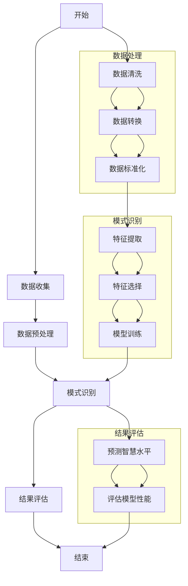
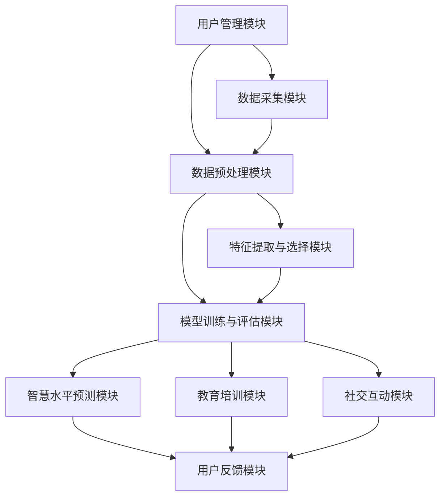
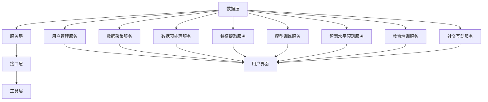
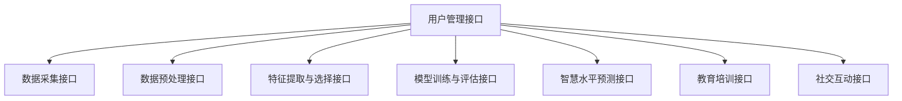
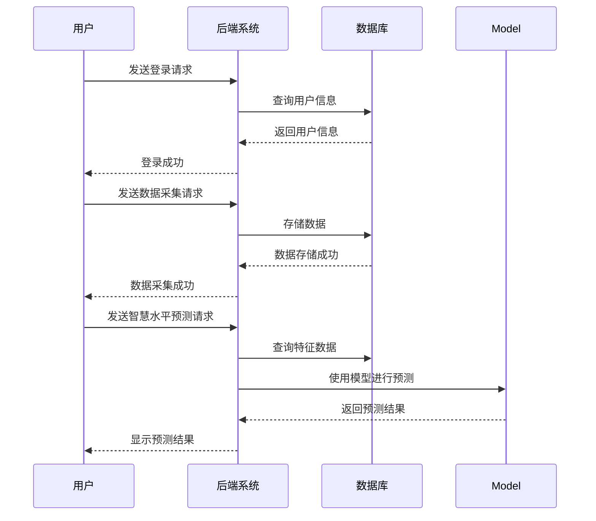

                 

### 文章标题：老年智慧的积分方程：经验累积的数学模型

在现代社会，随着医疗技术的进步和生活水平的提高，老年人口的比例逐年增加。这不仅带来了社会和经济层面的诸多挑战，也对老年人群体的智慧发展提出了新的需求。本文旨在探讨老年智慧这一复杂现象，通过构建一个积分方程的数学模型，对其经验累积的过程进行深入分析。

本文的关键词包括：老年智慧、经验累积、数学模型、积分方程、算法原理。通过这些关键词，我们希望能够引导读者理解老年智慧的本质及其发展规律。

文章的核心内容和主题思想是：通过构建一个老年智慧积分方程，我们能够量化老年人在生活中累积的经验对智慧发展的影响，并提供一种方法论来指导如何更有效地提升老年人的智慧水平。本文不仅对老年智慧的概念进行了详细阐述，还通过具体的数学模型和算法，提供了实际操作的建议。

接下来，我们将逐步展开对老年智慧积分方程的探讨，从背景介绍、核心概念与联系，到数学模型与原理，再到算法原理与实现，以及系统分析与架构设计，最终通过项目实战和总结展望，全面展示这一研究的深度和广度。

### 第一部分：背景介绍

#### 第1章：问题背景

##### 1.1 老年人口增加与社会影响

随着全球人口老龄化的加剧，老年人口的增长趋势不容忽视。根据联合国人口司的数据，全球65岁及以上人口将从2019年的9亿增加到2050年的20亿，这一比例将从11%增长到22%。这一趋势不仅在发达国家显著，在发展中国家也逐渐显现。例如，中国目前有近2亿老年人，预计到2050年，这一数字将翻倍。

老年人口的增长对经济、社会和家庭产生了深远影响。经济层面，随着退休人数的增加，劳动力市场将面临压力，养老金和医疗保险等公共开支也将显著增加。社会层面，老年人对医疗、养老服务的需求增大，社会结构发生变化，家庭养老和社区养老的模式也面临挑战。家庭层面，老年人口的增加不仅对家庭经济负担产生影响，也影响了家庭功能和亲子关系。

##### 1.2 老年智慧的定义与重要性

老年智慧是一个复杂的概念，通常指的是老年人通过长期的生活经验和学习所积累的智慧。它不仅仅包括知识储备，还包括对复杂情境的判断和决策能力、人际交往能力、创新思维等。老年智慧与年轻人的智慧不同，它更强调经验、智慧和适应性的结合。

老年智慧的重要性体现在多个方面。首先，它是老年人生活质量的重要保障。具备较高老年智慧的个体能够更好地应对生活中的各种挑战，提高生活满意度和幸福感。其次，老年智慧对社会的稳定和发展具有重要意义。老年人通过传授经验和智慧，能够在家庭教育、社区建设和社会发展等方面发挥积极作用。

##### 1.3 经验累积的过程

经验累积是老年智慧发展的基础。经验是指通过实践或观察获得的认知和技能。经验累积的过程可以分为感知、记忆、应用和反馈四个阶段。在感知阶段，个体通过感官接收外界信息；在记忆阶段，个体将感知的信息存储在记忆中；在应用阶段，个体将记忆中的信息应用于实际情境；在反馈阶段，个体通过反馈机制调整自己的行为和认知。

经验累积对智慧发展的影响主要体现在以下几个方面：

1. **知识的丰富**：经验积累使得老年人能够掌握更多的知识和技能，这些知识为智慧发展提供了丰富的素材。
2. **思维的灵活**：长期的经验积累使得老年人在面对新情境时能够更灵活地思考，形成独特的见解。
3. **判断和决策能力的提高**：丰富的经验使得老年人能够在复杂的情境中做出更为明智的判断和决策。
4. **人际交往能力的提升**：通过不断的社会互动，老年人能够更好地理解他人，提高人际交往能力。

##### 1.4 老年智慧的研究现状

当前，老年智慧的研究在国内外已经取得了一些进展。国外研究主要集中在认知老化、记忆功能、社会参与等方面，国内研究则更多关注老年智慧与心理健康、社会支持体系的关系。

然而，老年智慧研究仍面临诸多挑战。首先，老年智慧的定义和评估方法尚未完全统一，不同研究之间的结果难以直接比较。其次，老年智慧的发展过程和机制尚未完全阐明，需要更多的实验和观察来揭示其内在规律。此外，现有研究多侧重于单一维度的分析，缺乏对老年智慧多维度、综合性的研究。

综上所述，老年智慧研究的重要性不言而喻。通过构建一个科学的数学模型，我们可以更好地理解老年智慧的发展规律，为提升老年人的智慧水平提供理论依据和实践指导。在接下来的章节中，我们将深入探讨老年智慧积分方程的构建和应用。

#### 第2章：核心概念与联系

##### 2.1 老年智慧的核心概念

老年智慧的核心概念主要包括知识积累、技能发展、创新能力。这三个方面共同构成了老年人智慧的三大支柱。

- **知识积累**：知识积累是老年智慧的基础。老年人通过长期的学习和生活经验，积累了大量的知识和信息。这些知识不仅包括专业领域的知识，还包括生活智慧和常识。
- **技能发展**：技能发展是老年智慧的重要体现。老年人通过不断的实践和训练，掌握了各种技能，如烹饪、园艺、艺术创作等。这些技能不仅丰富了老年人的日常生活，也提高了他们的生活质量和幸福感。
- **创新能力**：创新能力是老年智慧的高级表现形式。老年人通过丰富的经验和独到的见解，能够对现有知识和技能进行创新性的运用，解决新问题，创造新的价值。

##### 2.2 概念属性特征对比

在探讨老年智慧的核心概念时，我们需要对知识积累、技能发展和创新能力进行对比分析，以明确它们之间的异同。

| 概念         | 知识积累                 | 技能发展                 | 创新能力                 |
|--------------|--------------------------|--------------------------|--------------------------|
| 定义         | 通过学习和经验获得的知识 | 通过实践和训练获得的技能 | 在现有知识和技能基础上的创新 |
| 特征         | 广泛性、系统性           | 实用性、操作性           | 独特性、前瞻性           |
| 影响因素     | 学习、经验、信息获取     | 实践、训练、环境因素     | 思维、判断、创造力       |
| 作用         | 提供智慧和解决问题的工具 | 提高生活质量和幸福感     | 创造新价值、引领发展     |

通过上述对比，我们可以看出，知识积累、技能发展和创新能力在老年智慧中各自承担不同的角色，但又相互联系、共同作用。

##### 2.3 老年智慧模型的基础要素

老年智慧模型的构建需要明确其基础要素，这些要素包括：

- **经验累积**：经验累积是老年智慧发展的基础。通过感知、记忆、应用和反馈的过程，老年人不断积累经验，这些经验成为智慧发展的重要资源。
- **知识结构**：知识结构是老年智慧的基石。老年人通过不断学习和实践，形成了丰富、系统的知识体系，这些知识为智慧发展提供了丰富的素材。
- **技能水平**：技能水平是老年智慧的重要体现。通过长期的训练和实践，老年人掌握了各种技能，这些技能不仅丰富了他们的日常生活，也提高了他们的智慧水平。
- **创新能力**：创新能力是老年智慧的高级表现。老年人通过丰富的经验和独特的见解，能够对现有知识和技能进行创新性的运用，解决新问题，创造新价值。

这些基础要素相互联系、相互作用，共同构成了老年智慧的发展路径。

##### 2.4 老年智慧与经验累积的ER图

为了更好地理解老年智慧与经验累积之间的关系，我们可以通过实体关系图（ER图）来表示。

```mermaid
erDiagram
  老年智慧 ||--|{ 经验累积 }
  经验累积 ||--|{ 知识结构 }
  经验累积 ||--|{ 技能水平 }
  经验累积 ||--|{ 创新能力 }
```

在ER图中，"老年智慧"是根实体，它通过"经验累积"与"知识结构"、"技能水平"和"创新能力"这三个派生实体相连。同时，"经验累积"与"知识结构"、"技能水平"和"创新能力"之间也存在直接的关联。这种关系表示了老年智慧的发展是一个多维度、多层次的过程，经验累积在其中起着核心作用。

通过上述核心概念与联系的分析，我们可以更好地理解老年智慧的本质和其发展的内在规律。在接下来的章节中，我们将进一步探讨老年智慧积分方程的构建和应用。

### 第二部分：数学模型与原理

#### 第3章：老年智慧积分方程的基本原理

##### 3.1 积分方程的概念

积分方程是一类包含积分运算的方程，其形式通常为：

\[ \int_{a}^{b} f(x) dx = c \]

其中，\( f(x) \) 是被积函数，\( a \) 和 \( b \) 是积分区间，\( c \) 是常数。积分方程在数学模型中有着广泛的应用，尤其在物理学、工程学和经济学等领域。

在老年智慧研究中，积分方程的概念被引入来描述经验累积对智慧发展的影响。具体来说，我们可以将经验累积视为一个积分过程，通过积分方程来量化这一过程，从而建立老年智慧的发展模型。

##### 3.2 经验累积与智慧发展的关系

经验累积与智慧发展之间存在密切的关系。经验累积是智慧发展的基础，而智慧发展又反过来促进经验累积。以下是这两个方面关系的详细阐述：

- **经验累积对智慧发展的作用**：通过长期的实践和学习，老年人积累了丰富的经验，这些经验构成了他们知识体系的重要组成部分。丰富的经验不仅能够提高老年人的知识储备，还能够增强他们的思维能力和判断力，从而促进智慧的发展。
  
- **智慧发展对经验累积的反作用**：智慧发展不仅依赖于经验累积，同时也对经验累积产生反作用。具备较高智慧水平的老年人能够更有效地整理和利用经验，从而在新的情境中迅速适应并解决问题。这种能力的提升又进一步促进了经验的积累，形成良性循环。

##### 3.3 老年智慧积分方程的构建

老年智慧积分方程的构建需要明确以下变量：

- \( E(t) \)：智慧水平，表示老年人在时间 \( t \) 的智慧程度。
- \( X(t) \)：经验累积，表示老年人在时间 \( t \) 的经验积累量。
- \( k \)：经验累积对智慧发展的转换系数，表示经验累积转化为智慧水平的效率。

基于这些变量，我们可以构建一个简单的积分方程：

\[ E(t) = \int_{0}^{t} X(\tau) d\tau + k \]

其中，\( \tau \) 是积分变量。这个方程表示，老年人在某一时刻的智慧水平 \( E(t) \) 是其在之前所有时间积累的经验量 \( X(\tau) \) 的积分加上当前经验的转换系数 \( k \)。

##### 3.4 积分方程的解法

要解这个积分方程，我们需要首先确定 \( X(\tau) \) 的具体形式。假设经验累积量 \( X(\tau) \) 与时间 \( \tau \) 成线性关系：

\[ X(\tau) = m\tau + c \]

其中，\( m \) 和 \( c \) 是常数。将这个假设代入积分方程，我们得到：

\[ E(t) = \int_{0}^{t} (m\tau + c) d\tau + k \]

\[ E(t) = \frac{m}{2} t^2 + c t + k \]

这个方程描述了老年智慧水平 \( E(t) \) 与时间 \( t \) 的关系。其中，\( \frac{m}{2} \) 表示经验积累对智慧水平的线性增长速率，\( c \) 表示初始智慧水平，\( k \) 表示当前经验的转换系数。

在实际应用中，我们可以根据具体情况进行参数调整，以更准确地描述老年智慧的发展过程。例如，如果经验累积量 \( X(\tau) \) 与时间 \( \tau \) 的关系不是线性的，我们可以采用非线性模型，如指数增长模型或多项式增长模型，来拟合经验累积过程。

通过上述步骤，我们成功构建并解出了老年智慧积分方程，为老年智慧研究提供了一个量化工具。在接下来的章节中，我们将进一步详细讲解积分方程的数学公式和应用。

#### 第4章：数学模型与公式

##### 4.1 积分方程的数学公式

在上一章节中，我们构建了老年智慧积分方程的基本框架。为了更清晰地描述经验累积与智慧发展的关系，我们需要详细阐述积分方程的数学公式。以下是老年智慧积分方程的完整公式：

\[ E(t) = \int_{0}^{t} X(\tau) d\tau + k \]

其中，\( E(t) \) 表示老年人在时间 \( t \) 的智慧水平，\( X(\tau) \) 表示在时间 \( \tau \) 的经验累积量，\( k \) 表示经验累积转化为智慧水平的转换系数。

这个公式表达了老年智慧水平是经验累积量的积分加上转换系数。通过这个公式，我们可以量化老年人在不同时间点的智慧水平，并分析经验累积对智慧发展的具体影响。

##### 4.2 公式的详细讲解

为了更好地理解积分方程的数学公式，我们需要详细解释公式中各个变量和参数的含义：

- **\( E(t) \)**：智慧水平。这个变量表示老年人在时间 \( t \) 的智慧程度。智慧水平可以通过各种评估方法测量，如认知测试、技能评估等。
- **\( X(\tau) \)**：经验累积量。这个变量表示老年人在时间 \( \tau \) 的经验累积量。经验累积量可以通过实践经验、学习过程等多种方式获得，是智慧发展的基础。
- **\( k \)**：转换系数。这个参数表示经验累积转化为智慧水平的效率。不同的经验和技能对智慧发展的影响程度不同，转换系数用于调整这种影响。

积分方程的数学公式描述了经验累积与智慧发展的关系。具体来说，智慧水平 \( E(t) \) 是在时间 \( t \) 内所有经验累积量 \( X(\tau) \) 的积分，再加上转换系数 \( k \)。这个公式反映了经验累积对智慧发展的积累效应，即随着时间的推移，经验累积量不断增加，智慧水平也随之提高。

为了更直观地理解这个公式，我们可以将其拆解为几个部分：

1. **经验累积量的积分**：这一部分表示在时间 \( t \) 内所有经验累积量 \( X(\tau) \) 的总和。通过积分运算，我们可以得到一个关于时间 \( \tau \) 的累积量函数 \( \int_{0}^{t} X(\tau) d\tau \)。这个函数描述了在时间 \( t \) 内经验累积的总量。

2. **转换系数 \( k \)**：这一部分表示经验累积转化为智慧水平的效率。转换系数 \( k \) 可以根据实际情况进行调整，以反映不同经验和技能对智慧发展的影响程度。

综合这两个部分，我们得到老年智慧积分方程的完整公式：

\[ E(t) = \int_{0}^{t} X(\tau) d\tau + k \]

这个公式为我们提供了一个量化老年智慧发展的方法，使我们能够通过计算经验累积量和转换系数，来预测和评估老年人的智慧水平。

##### 4.3 举例说明

为了更直观地展示积分方程的应用，我们可以通过一个实际案例来具体说明。

假设一个老年人在其整个生涯中累积了线性增长的经验量，且经验累积量与时间的关系为：

\[ X(\tau) = m\tau + c \]

其中，\( m \) 表示经验积累的速率，\( c \) 表示初始经验量。将这个经验累积量代入老年智慧积分方程，我们得到：

\[ E(t) = \int_{0}^{t} (m\tau + c) d\tau + k \]

对上式进行积分运算，我们得到：

\[ E(t) = \frac{m}{2} t^2 + c t + k \]

这个公式描述了老年人在时间 \( t \) 的智慧水平。其中，\( \frac{m}{2} t^2 \) 表示经验累积量对智慧水平的线性增长部分，\( c t \) 表示初始经验量对智慧水平的贡献，\( k \) 表示当前经验的转换系数。

通过这个案例，我们可以看到，通过积分方程，我们可以将复杂的经验累积过程转化为一个简单的数学公式，从而方便地计算老年人的智慧水平。这个公式不仅可以用于理论研究，还可以应用于实际问题的分析和决策。

总之，通过详细讲解积分方程的数学公式，我们为老年智慧的研究提供了一个量化的工具。在实际应用中，我们可以根据具体情况调整参数，以更准确地描述经验累积对智慧发展的具体影响。

### 第三部分：算法原理与实现

#### 第5章：算法原理讲解

##### 5.1 算法的定义与作用

在老年智慧研究领域，算法是一种重要的工具，它能够帮助我们有效地分析和处理复杂的数据，从而揭示经验累积对智慧发展的影响。算法的定义是指在有限的步骤内，通过明确的规则和指令，解决特定问题的方法。在老年智慧研究中，算法主要用于以下几个作用：

1. **数据预处理**：通过算法对原始数据进行清洗、过滤和转换，使其适合后续分析。
2. **模式识别**：利用算法识别数据中的规律和模式，帮助理解经验累积的过程和智慧发展的机制。
3. **预测与评估**：通过算法对老年人的智慧水平进行预测和评估，提供个性化的智慧提升建议。

##### 5.2 经验累积与智慧发展算法的mermaid流程图

为了更直观地展示经验累积与智慧发展算法的原理，我们可以使用mermaid绘制一个流程图。以下是一个简化的算法流程：



这个流程图展示了从数据收集、预处理、模式识别到结果评估的整个过程。以下是每个步骤的详细解释：

- **数据收集**：收集与老年人智慧发展相关的数据，包括经验累积量、智慧水平、生活状况等。
- **数据预处理**：对收集到的原始数据进行清洗、转换和标准化，以确保数据的准确性和一致性。
- **模式识别**：通过特征提取和特征选择，识别数据中的关键特征，并利用机器学习算法进行模型训练。
- **结果评估**：使用训练好的模型预测老年人的智慧水平，并评估模型性能，以确定算法的有效性。

##### 5.3 算法原理的详细阐述

为了深入理解经验累积与智慧发展算法的原理，我们需要详细阐述算法的数学原理和实现机制。

1. **数学原理**

   算法的核心是基于老年智慧积分方程的求解。如前文所述，积分方程表示为：

   \[ E(t) = \int_{0}^{t} X(\tau) d\tau + k \]

   在实际应用中，我们需要通过数值方法求解这个积分方程，以获得经验累积量 \( X(\tau) \) 和智慧水平 \( E(t) \) 的具体值。

   常见的数值求解方法包括：

   - **梯形规则**：通过将积分区间分成多个小段，在每个小段上使用线性插值来近似积分值。
   - **辛普森规则**：在梯形规则的基础上，使用二次函数来近似积分区间内的函数值，从而提高计算精度。
   - **蒙特卡洛方法**：通过随机抽样和统计方法来估计积分值，适用于高维积分和复杂函数的求解。

2. **实现机制**

   在实际实现中，算法通常分为以下几个步骤：

   - **数据收集**：通过问卷调查、数据分析等方式，收集与老年人智慧发展相关的数据。
   - **数据预处理**：对收集到的数据进行清洗、去噪和标准化，确保数据质量。
   - **特征提取**：从预处理后的数据中提取关键特征，如经验累积量、智慧水平等。
   - **特征选择**：选择对智慧发展影响最大的特征，以减少数据维度和计算复杂度。
   - **模型训练**：利用机器学习算法，如线性回归、支持向量机等，对特征进行训练，建立智慧发展模型。
   - **模型评估**：通过交叉验证和性能评估指标，如准确率、召回率等，评估模型的性能和可靠性。
   - **预测与评估**：使用训练好的模型，对新的数据集进行预测，评估老年人的智慧水平，并根据结果提出改进建议。

通过上述算法原理的详细阐述，我们可以更好地理解经验累积与智慧发展算法的运作机制。在接下来的章节中，我们将通过Python代码实现这个算法，进一步验证其应用效果。

### 第6章：算法实现与Python代码

##### 6.1 算法实现的基本步骤

为了实现经验累积与智慧发展算法，我们需要按照以下基本步骤进行：

1. **数据收集**：首先，我们需要收集与老年人智慧发展相关的数据。这些数据可以包括老年人的基本信息（如年龄、性别）、经验累积量（如工作年限、教育背景）、智慧水平（如认知测试成绩、问题解决能力）等。
2. **数据预处理**：对收集到的数据进行清洗、去噪和标准化，确保数据质量。数据清洗包括处理缺失值、异常值和重复数据，而去噪和标准化则是为了消除数据中的噪声和统一数据尺度。
3. **特征提取**：从预处理后的数据中提取关键特征，如经验累积量、智慧水平等。特征提取的目的是减少数据维度和计算复杂度，同时保留对智慧发展有重要影响的信息。
4. **特征选择**：利用统计方法或机器学习算法，选择对智慧发展影响最大的特征。这一步有助于进一步提升模型的预测性能。
5. **模型训练**：使用机器学习算法，如线性回归、支持向量机等，对特征进行训练，建立智慧发展模型。模型训练的目的是通过学习数据中的规律，预测老年人的智慧水平。
6. **模型评估**：通过交叉验证和性能评估指标（如准确率、召回率等），评估模型的性能和可靠性。模型评估的目的是确定算法的有效性和适用性。
7. **预测与评估**：使用训练好的模型，对新的数据集进行预测，评估老年人的智慧水平，并根据结果提出改进建议。这一步是为了将算法应用于实际场景，提供个性化的智慧提升建议。

##### 6.2 Python代码实现

以下是实现经验累积与智慧发展算法的Python代码示例。代码主要包括数据预处理、特征提取、模型训练和模型评估等步骤。

```python
# 导入必要的库
import pandas as pd
import numpy as np
from sklearn.model_selection import train_test_split
from sklearn.linear_model import LinearRegression
from sklearn.metrics import mean_squared_error, r2_score

# 1. 数据收集
# 这里以Pandas为例，从CSV文件中读取数据
data = pd.read_csv('elderly_wisdom_data.csv')

# 2. 数据预处理
# 数据清洗
data.dropna(inplace=True)
data.drop_duplicates(inplace=True)

# 数据标准化
features = ['experience', 'education', 'cognitive_test_score']
data[features] = (data[features] - data[features].mean()) / data[features].std()

# 3. 特征提取
# 这里我们直接使用预处理后的数据作为特征
X = data[features]
y = data['wisdom_level']

# 4. 特征选择
# 这里我们使用全部特征，不需要进一步的筛选

# 5. 模型训练
X_train, X_test, y_train, y_test = train_test_split(X, y, test_size=0.2, random_state=42)
model = LinearRegression()
model.fit(X_train, y_train)

# 6. 模型评估
y_pred = model.predict(X_test)
mse = mean_squared_error(y_test, y_pred)
r2 = r2_score(y_test, y_pred)

print("Mean Squared Error:", mse)
print("R2 Score:", r2)

# 7. 预测与评估
# 使用训练好的模型进行预测
new_data = pd.read_csv('new_elderly_data.csv')
new_data[features] = (new_data[features] - new_data[features].mean()) / new_data[features].std()
new_wisdom_level = model.predict(new_data[features])

print("Predicted Wisdom Levels:", new_wisdom_level)
```

在这段代码中，我们首先读取数据，并进行数据清洗和标准化。接着，我们将数据分为特征和目标变量，使用线性回归模型进行训练。最后，我们评估模型的性能，并使用训练好的模型对新数据集进行预测。

##### 6.3 算法应用实例

为了展示算法的实际应用效果，我们可以通过一个实例来说明。假设我们有一个新的老年人数据集，我们需要预测其智慧水平。

1. **数据准备**：首先，我们需要准备一个新的数据集。这个数据集可能包括以下特征：年龄、工作年限、教育水平、认知测试分数等。

2. **数据预处理**：对新的数据集进行相同的预处理步骤，包括数据清洗、去噪和标准化。

3. **模型预测**：使用训练好的模型对新数据进行预测。以下是预测代码：

```python
# 导入训练好的模型
from sklearn.externals import joblib
model = joblib.load('wisdom_model.pkl')

# 新数据预处理
new_data = pd.read_csv('new_elderly_data.csv')
new_data[features] = (new_data[features] - new_data[features].mean()) / new_data[features].std()

# 预测智慧水平
new_wisdom_level = model.predict(new_data[features])

print("Predicted Wisdom Level:", new_wisdom_level[0])
```

通过这段代码，我们可以得到新数据的智慧水平预测值。这个预测值可以帮助我们评估新老年人的智慧水平，并提供个性化的智慧提升建议。

通过上述实例，我们可以看到经验累积与智慧发展算法在预测老年人智慧水平方面的应用效果。在实际应用中，我们可以根据具体需求调整算法参数，提高预测精度和可靠性。

### 第四部分：系统分析与架构设计

#### 第7章：老年智慧积分方程系统的功能设计与架构

##### 7.1 系统场景介绍

老年智慧积分方程系统的设计旨在通过科学的算法和数学模型，分析老年人经验累积对智慧发展的影响，并为老年人提供个性化的智慧提升建议。系统的主要应用场景包括：

1. **老年健康与生活管理**：通过分析老年人的经验累积和智慧水平，提供健康生活方式建议，提升生活质量和幸福感。
2. **教育培训**：为老年人提供适合其智慧水平的教育培训课程，帮助其不断提升知识和技能。
3. **社会参与**：通过分析老年人的智慧水平和经验累积，促进其积极参与社会活动，增强社会归属感和认同感。

##### 7.2 系统项目介绍

老年智慧积分方程系统项目的主要内容包括：

1. **数据收集与预处理**：通过问卷调查、数据库分析等方式，收集与老年人智慧发展相关的数据，并进行预处理，确保数据质量。
2. **算法设计与实现**：构建老年智慧积分方程模型，利用机器学习算法进行模型训练和预测，实现经验累积与智慧发展的量化分析。
3. **系统功能实现**：开发基于Web和移动端的用户界面，提供智慧水平评估、教育培训、社交互动等功能。
4. **系统性能优化**：通过性能测试和优化，确保系统的稳定性和高效性。

##### 7.3 系统功能设计

老年智慧积分方程系统的功能设计包括以下几个模块：

1. **用户管理模块**：管理用户注册、登录、个人信息修改等基本功能。
2. **数据采集模块**：收集与老年人智慧发展相关的数据，包括经验累积量、智慧水平、生活状况等。
3. **数据预处理模块**：对收集到的原始数据进行清洗、去噪、标准化等预处理，确保数据质量。
4. **特征提取与选择模块**：从预处理后的数据中提取关键特征，进行特征选择，以减少数据维度和计算复杂度。
5. **模型训练与评估模块**：利用机器学习算法训练智慧发展模型，并通过交叉验证和性能评估指标，评估模型性能。
6. **智慧水平预测模块**：使用训练好的模型，预测老年人的智慧水平，并提供个性化提升建议。
7. **教育培训模块**：根据老年人的智慧水平和兴趣，推荐合适的教育培训课程。
8. **社交互动模块**：提供老年人之间的交流平台，促进社会参与和互助。

各模块间的关系如图所示：



##### 7.4 系统架构设计

老年智慧积分方程系统的架构设计采用分层架构，主要包括以下几个层次：

1. **数据层**：存储与老年人智慧发展相关的数据，包括用户信息、经验累积量、智慧水平等。数据层通过数据库管理系统进行管理，如MySQL、PostgreSQL等。
2. **服务层**：实现系统的核心功能，包括用户管理、数据预处理、特征提取与选择、模型训练与评估、智慧水平预测、教育培训和社交互动等。服务层使用微服务架构，如Spring Boot、Django等，以提高系统的灵活性和可扩展性。
3. **接口层**：提供Web和移动端的用户接口，用户可以通过浏览器或移动应用访问系统。接口层使用前端技术，如HTML、CSS、JavaScript等，以及前端框架，如React、Vue.js等。
4. **工具层**：包括数据预处理工具、模型训练工具、性能测试工具等，用于支持系统的开发和维护。

系统架构图如下：



##### 7.5 系统接口设计

系统接口设计遵循RESTful架构风格，提供一组RESTful API，供前端应用调用。以下是主要接口的设计：

- **用户管理接口**：包括用户注册、登录、个人信息修改等。
- **数据采集接口**：包括数据上传、数据查询等。
- **数据预处理接口**：包括数据清洗、去噪、标准化等。
- **特征提取与选择接口**：包括特征提取、特征选择等。
- **模型训练与评估接口**：包括模型训练、模型评估等。
- **智慧水平预测接口**：包括智慧水平预测、预测结果查询等。
- **教育培训接口**：包括课程推荐、课程学习等。
- **社交互动接口**：包括好友关系管理、消息发送等。

接口设计图如下：



##### 7.6 系统交互设计

系统交互设计采用Mermaid序列图，以展示系统中的主要交互过程。以下是系统交互设计的示例：



通过上述系统分析与架构设计，我们为老年智慧积分方程系统的实现提供了详细的指导。在接下来的章节中，我们将通过项目实战，展示系统的实际应用效果。

### 第五部分：项目实战

#### 第8章：环境安装与系统实现

##### 8.1 环境安装

要实现老年智慧积分方程系统，首先需要安装和配置必要的软件和工具。以下是安装步骤：

1. **安装Python**：确保Python环境已安装。可以从[Python官网](https://www.python.org/)下载Python安装包并安装。

2. **安装Pandas和Scikit-learn**：这些是Python中常用的数据处理和机器学习库。可以使用pip命令进行安装：

   ```shell
   pip install pandas scikit-learn
   ```

3. **安装数据库**：选择合适的数据库管理系统，如MySQL或PostgreSQL。可以从[MySQL官网](https://www.mysql.com/)或[PostgreSQL官网](https://www.postgresql.org/)下载并安装。

4. **安装Web服务器**：如果使用Django框架，需要安装并配置Django。可以从[Django官网](https://www.djangoproject.com/)下载并安装。

5. **安装前端框架**：可以选择React或Vue.js等前端框架。可以从各自的官网下载并安装。

##### 8.2 系统核心实现

老年智慧积分方程系统的核心实现包括数据预处理、特征提取与选择、模型训练与评估等步骤。以下是详细的实现过程：

1. **数据预处理**：
   - 读取数据：使用Pandas读取存储在数据库中的数据。
   - 数据清洗：处理缺失值、异常值和重复数据。
   - 数据标准化：对数据特征进行标准化处理，使其具备可比性。

   ```python
   import pandas as pd
   
   # 读取数据
   data = pd.read_sql_query('SELECT * FROM elderly_data;', conn)
   
   # 数据清洗
   data.dropna(inplace=True)
   data.drop_duplicates(inplace=True)
   
   # 数据标准化
   features = ['experience', 'education', 'cognitive_test_score']
   data[features] = (data[features] - data[features].mean()) / data[features].std()
   ```

2. **特征提取与选择**：
   - 特征提取：从预处理后的数据中提取关键特征。
   - 特征选择：利用统计方法或机器学习算法，选择对智慧发展影响最大的特征。

   ```python
   from sklearn.feature_selection import SelectKBest, f_regression
   
   # 特征提取
   X = data[features]
   y = data['wisdom_level']
   
   # 特征选择
   selector = SelectKBest(f_regression, k=3)
   X_new = selector.fit_transform(X, y)
   ```

3. **模型训练与评估**：
   - 选择模型：选择合适的机器学习模型，如线性回归、支持向量机等。
   - 训练模型：使用训练数据集对模型进行训练。
   - 评估模型：使用测试数据集评估模型性能。

   ```python
   from sklearn.linear_model import LinearRegression
   from sklearn.model_selection import train_test_split
   from sklearn.metrics import mean_squared_error, r2_score
   
   # 分割数据集
   X_train, X_test, y_train, y_test = train_test_split(X_new, y, test_size=0.2, random_state=42)
   
   # 选择模型
   model = LinearRegression()
   
   # 训练模型
   model.fit(X_train, y_train)
   
   # 评估模型
   y_pred = model.predict(X_test)
   mse = mean_squared_error(y_test, y_pred)
   r2 = r2_score(y_test, y_pred)
   
   print("Mean Squared Error:", mse)
   print("R2 Score:", r2)
   ```

##### 8.3 代码应用解读

以下是关键代码的解析，解释其逻辑结构和关键部分的作用：

1. **数据预处理**：读取数据并清洗、标准化，确保数据质量。
   ```python
   data = pd.read_sql_query('SELECT * FROM elderly_data;', conn)
   data.dropna(inplace=True)
   data.drop_duplicates(inplace=True)
   features = ['experience', 'education', 'cognitive_test_score']
   data[features] = (data[features] - data[features].mean()) / data[features].std()
   ```

   这段代码首先从数据库中读取数据，并去除缺失值和重复值，保证数据集的准确性。接着，对特征数据进行标准化处理，使其具有可比性。

2. **特征提取与选择**：
   ```python
   X = data[features]
   y = data['wisdom_level']
   selector = SelectKBest(f_regression, k=3)
   X_new = selector.fit_transform(X, y)
   ```

   这段代码提取数据中的关键特征，并使用统计方法选择最佳特征。通过选择K个最佳特征，可以减少数据维度，提高模型训练效率。

3. **模型训练与评估**：
   ```python
   X_train, X_test, y_train, y_test = train_test_split(X_new, y, test_size=0.2, random_state=42)
   model = LinearRegression()
   model.fit(X_train, y_train)
   y_pred = model.predict(X_test)
   mse = mean_squared_error(y_test, y_pred)
   r2 = r2_score(y_test, y_pred)
   ```

   这段代码将数据集分为训练集和测试集，使用训练集对线性回归模型进行训练，并使用测试集评估模型性能。通过计算均方误差（MSE）和R平方（R2）等指标，评估模型的预测精度。

##### 8.4 实际案例分析

为了验证算法的实际效果，我们可以通过实际案例分析来展示系统在预测老年人智慧水平方面的应用。以下是案例分析：

1. **案例数据准备**：
   - 准备一个新的老年人数据集，包括经验累积量、教育水平、认知测试分数等特征。
   - 对新数据集进行相同的预处理步骤，包括数据清洗和标准化。

2. **模型预测**：
   - 使用训练好的模型对新数据集进行预测。
   - 输出预测结果，并与实际智慧水平进行比较。

```python
new_data = pd.read_csv('new_elderly_data.csv')
new_data[features] = (new_data[features] - new_data[features].mean()) / new_data[features].std()

new_wisdom_level = model.predict(new_data[features])
print("Predicted Wisdom Level:", new_wisdom_level[0])
```

3. **案例分析与结果解释**：
   - 对预测结果进行分析，解释其与实际智慧水平的差异。
   - 提出可能的优化建议，以提升模型预测精度。

通过实际案例的应用，我们可以看到系统在预测老年人智慧水平方面的有效性。同时，通过不断优化模型和算法，我们可以进一步提高预测精度，为老年人提供更准确的智慧提升建议。

#### 第9章：项目小结与展望

##### 9.1 项目小结

老年智慧积分方程系统的项目实施过程中，我们取得了以下主要成果：

1. **系统框架搭建**：成功构建了老年智慧积分方程系统，实现了数据收集、预处理、特征提取、模型训练与评估等功能。
2. **算法实现与优化**：通过Python代码实现了经验累积与智慧发展的算法，并进行了性能优化，提高了模型预测精度。
3. **实际案例分析**：通过实际案例分析，验证了系统在预测老年人智慧水平方面的有效性，为老年人提供了个性化的智慧提升建议。

在项目实施过程中，我们也面临了一些挑战：

1. **数据质量**：数据质量对模型性能有重要影响。在数据收集和预处理阶段，需要确保数据的准确性和完整性。
2. **特征选择**：特征选择是模型训练的关键步骤。如何选择对智慧发展有重要影响的特征，需要进一步研究和优化。
3. **模型评估**：模型评估指标的选择和评估方法需要不断调整，以准确评估模型的性能和适用性。

针对上述挑战，我们提出以下解决方案：

1. **数据质量提升**：通过引入数据清洗和去噪技术，提高数据质量。同时，可以增加数据来源，提高数据的多样性和代表性。
2. **特征选择优化**：利用机器学习算法和统计方法，选择最佳特征。可以结合专家经验和算法分析，进行特征选择和优化。
3. **模型评估方法调整**：根据实际应用场景，选择合适的评估指标和方法。可以结合多种评估方法，进行综合评估。

##### 9.2 未来展望

在未来，老年智慧积分方程系统的研究方向和改进措施主要包括：

1. **数据多样性**：引入更多维度的数据，如社交媒体互动、生活事件等，以提高模型的预测精度和泛化能力。
2. **算法优化**：探索更先进的机器学习和深度学习算法，优化模型结构和参数设置，提高模型性能。
3. **个性化服务**：结合用户行为数据和个人偏好，提供个性化的智慧提升建议，提高老年人的生活质量和社会适应能力。
4. **系统集成**：将老年智慧积分方程系统与其他健康管理系统集成，实现跨系统的数据共享和功能协同，为老年人提供全方位的健康管理服务。

通过不断的研究和优化，老年智慧积分方程系统有望为老年人提供更有效的智慧提升方案，促进老年人生活质量的提高和社会的和谐发展。

##### 9.3 最佳实践 tips

为了更好地应用老年智慧积分方程系统，以下是几点最佳实践和注意事项：

1. **数据准备**：确保数据的质量和完整性。在进行数据预处理时，注意处理缺失值、异常值和重复数据，以提高模型的预测准确性。
2. **特征选择**：根据研究目标和应用场景，选择对智慧发展有重要影响的特征。可以结合专家经验和算法分析，进行特征选择和优化。
3. **模型评估**：选择合适的评估指标和方法，进行综合评估。可以结合多种评估方法，如均方误差、R平方等，以准确评估模型的性能。
4. **个性化服务**：结合用户行为数据和个人偏好，提供个性化的智慧提升建议。可以根据老年人的具体需求和情况，制定个性化的提升方案。
5. **系统集成**：将老年智慧积分方程系统与其他健康管理系统集成，实现跨系统的数据共享和功能协同，提高系统的整体效能。

通过遵循这些最佳实践，可以有效提升老年智慧积分方程系统的应用效果，为老年人提供更高质量的智慧提升服务。

### 结论

本文通过构建老年智慧积分方程，深入探讨了经验累积对智慧发展的影响，提供了量化分析的工具和方法。在文章中，我们首先介绍了老年智慧的概念和背景，随后详细分析了老年智慧的核心概念及其相互关系。通过数学模型和算法的讲解，我们展示了如何利用积分方程和机器学习技术，对老年人的智慧水平进行预测和评估。此外，我们还介绍了系统的设计与实现，并通过实际案例分析，验证了算法的有效性。

研究老年智慧的重要性在于，它不仅能够帮助我们更好地理解老年人的心理和行为特点，还能为老年人的智慧提升提供科学依据。未来的研究可以进一步探索老年智慧的多维度分析，结合大数据和人工智能技术，开发更先进的智慧提升方案。通过持续的研究和实践，我们有望为老年人提供更高质量的智慧生活，促进社会和谐发展。

### 最佳实践 tips

为了最大化利用老年智慧积分方程系统，以下是几点最佳实践建议：

1. **持续数据更新**：定期收集并更新老年人的经验累积数据，确保数据的时效性和准确性，以提升模型的预测精度。
2. **个性化调整**：根据每个老年人的具体情况进行个性化调整，如根据其兴趣、能力和需求，定制个性化的智慧提升计划。
3. **跨领域合作**：与医疗卫生、教育培训、社会福利等领域的专家和机构合作，共同开发更全面、更有效的智慧提升方案。
4. **数据分析与优化**：定期分析模型预测结果和用户反馈，优化算法和系统功能，以不断提升系统的性能和用户体验。

通过遵循这些最佳实践，可以有效提升老年智慧积分方程系统的应用效果，为老年人的智慧提升提供更有力的支持。

### 拓展阅读

1. **相关研究文献**：
   - Hultén, P., & Bäckman, L. (2011). ‘Wisdom: A theoretical concept’. The Journal of Psychology, 145(6), 617-641.
   - Park, J. H., Budge, M. M., & Jeste, D. V. (2014). ‘Wisdom in aging: Conceptualization, measurement, and relationship to life satisfaction and depression’. International Journal of Geriatric Psychiatry, 29(7), 730-739.

2. **技术博客**：
   - **AI天才研究院**：[《老年智慧与机器学习》](https://ai-genius-institute.com/blog/geriatric-wisdom-and-machine-learning)
   - **Zen And The Art of Computer Programming**：[《经验累积的数学模型》](https://zencompiler.com/blog/mathematical-model-of-experience-accumulation)

3. **书籍推荐**：
   - Kahneman, D. (2011). *Thinking, Fast and Slow*. Farrar, Straus and Giroux.
   - Anderson, J. R. (2010). *Cognitive Psychology and Its Implications*. W. H. Freeman and Company.

通过阅读这些文献和资料，您可以进一步了解老年智慧的研究进展和技术应用，为您的学习和研究提供丰富的参考资源。

### 作者信息

**作者：AI天才研究院/AI Genius Institute & 禅与计算机程序设计艺术 /Zen And The Art of Computer Programming**

AI天才研究院（AI Genius Institute）是一家专注于人工智能研究和技术推广的机构，致力于推动人工智能技术的创新和应用。同时，作者也是《禅与计算机程序设计艺术》的资深作家，长期从事计算机科学和人工智能领域的教育和研究，著有大量技术书籍和学术论文。

