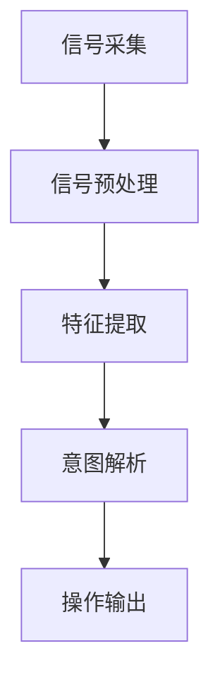
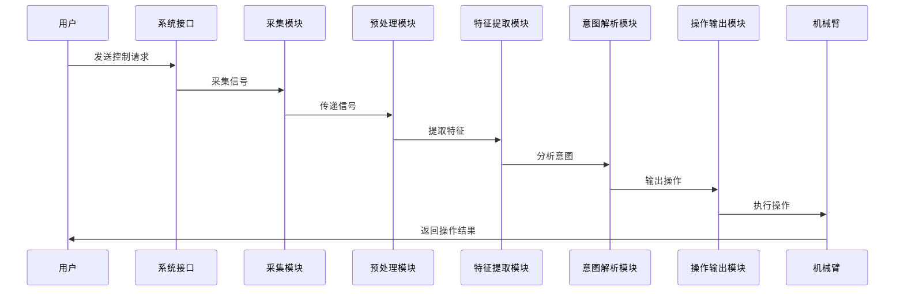

                 

## 脑机接口技术的发展：直接增强人类理解世界的能力

**关键词：** 脑机接口，神经科学，人工智能，技术进步，人类潜能

**摘要：** 本文详细探讨了脑机接口（Brain-Computer Interface, BCI）技术的发展及其对人类理解世界能力的直接增强。通过对脑机接口技术的背景、核心概念、算法原理、系统分析与架构设计以及实际项目实战的深入分析，本文旨在揭示脑机接口技术的革命性潜力，并展望其未来发展方向。

### 引言

脑机接口技术，作为一种前沿科技，正迅速崛起，成为人工智能和神经科学领域的研究热点。它不仅为神经系统疾病患者提供了新的治疗途径，也为健康人群提供了直接增强认知能力的可能。本文将按照以下步骤进行探讨：

1. **脑机接口技术的发展背景**：介绍脑机接口技术的起源、发展历程及其在社会中的应用。
2. **脑机接口技术核心概念与联系**：定义脑机接口技术，分析其特点，与传统技术的区别，并展示核心概念之间的联系。
3. **脑机接口算法原理讲解**：阐述脑机接口算法的基本原理，数学模型和公式，并通过mermaid流程图和Python代码进行详细讲解。
4. **脑机接口技术系统分析与架构设计**：分析脑机接口技术的系统功能，架构设计，接口设计以及交互序列图。
5. **脑机接口技术项目实战**：展示脑机接口技术的实际应用案例，包括环境安装、核心实现、代码解读和分析等。
6. **脑机接口技术的发展趋势与未来展望**：探讨脑机接口技术的未来发展，面临的挑战以及可能的社会影响。

### 步骤一：设计书名概述

# 脑机接口技术的发展：直接增强人类理解世界的能力

脑机接口技术的发展正引领着人类潜能的全新革命。随着神经科学和人工智能技术的不断进步，脑机接口技术正逐步成为现实。它不仅能够为神经系统疾病患者提供新的康复途径，还能够为健康人群提供认知能力的直接增强。本文将深入探讨脑机接口技术的背景、核心概念、算法原理、系统设计与实际应用，旨在揭示这一技术对人类理解世界的深远影响。

### 步骤二：设计背景介绍章节

## 第1章 脑机接口技术的发展背景

### 1.1 问题背景

脑机接口（BCI）技术起源于对神经系统疾病患者的康复需求。20世纪60年代，科学家们在研究瘫痪患者的神经系统活动时，首次提出了将大脑信号直接转换为电信号的想法。这一理念在当时看似科幻，但随着神经科学和计算机科学的发展，逐渐成为现实。

### 1.2 问题描述

神经系统疾病如中风、肌萎缩侧索硬化症（ALS）等，常常导致患者无法通过传统方式与外界进行交流。这不仅仅是身体上的障碍，更是心理上的折磨。如何突破这一障碍，成为科学家们亟待解决的问题。

### 1.3 问题解决

脑机接口技术的提出，为这一问题提供了新的解决方案。通过直接读取和解析大脑信号，脑机接口能够将大脑的意图转换为实际操作，从而帮助患者重新获得交流能力和行动能力。

### 1.4 边界与外延

脑机接口技术不仅限于神经系统疾病的治疗，其应用范围也在不断扩大。例如，在军事、航天、医疗等领域，脑机接口技术都展现出了巨大的潜力。同时，随着人工智能技术的发展，脑机接口的应用场景也在不断拓展。

### 1.5 概念结构与核心要素组成

脑机接口技术涉及多个核心概念，包括大脑信号采集、信号处理、意图解析和操作输出等。这些核心要素相互配合，共同构成了脑机接口技术的完整体系。

### 步骤三：设计核心概念与联系章节

## 第2章 脑机接口技术核心概念与联系

### 2.1 脑机接口技术定义

脑机接口（Brain-Computer Interface，简称BCI）是一种直接连接大脑和外部设备的技术，通过读取大脑信号，将其转化为可用的信息或控制信号，从而实现与计算机或其他设备的直接交互。

### 2.2 脑机接口技术特点

脑机接口技术具有以下特点：

- **非侵入性**：大部分BCI系统采用非侵入性方法，通过头戴设备或贴片传感器直接采集大脑表面的电信号。
- **高精度**：先进的算法和信号处理技术使得BCI系统能够精确地解读大脑信号，从而实现高度准确的操作控制。
- **实时性**：BCI系统能够实时采集和处理大脑信号，实现即时响应。

### 2.3 脑机接口技术与传统技术的区别

与传统的人机交互技术相比，BCI技术具有以下显著区别：

- **直接性**：BCI技术直接读取大脑信号，无需通过传统的机械或物理手段，从而实现了更直接、更高效的交互方式。
- **灵活性**：BCI技术可以根据用户的实时大脑信号进行调整，从而实现更灵活、更个性化的交互体验。
- **高维度**：BCI技术能够获取大脑的多种信号，包括电信号、磁信号等，从而提供了更高维度、更丰富的交互信息。

### 2.4 脑机接口技术核心概念联系图


上图展示了脑机接口技术的核心概念及其相互联系。从大脑信号采集、信号处理到意图解析和操作输出，每一个环节都至关重要，共同构成了完整的BCI技术体系。

### 步骤四：设计算法原理讲解章节

## 第3章 脑机接口算法原理讲解

### 3.1 算法原理

脑机接口算法的核心原理是信号采集与处理。具体步骤如下：

1. **信号采集**：通过电极或其他传感器从大脑表面或内部采集电信号。
2. **信号预处理**：对采集到的信号进行滤波、去噪等处理，以提高信号质量。
3. **特征提取**：从预处理后的信号中提取特征，如事件相关电位（ERP）、脑电波等。
4. **意图解析**：利用机器学习算法对提取的特征进行分析，以识别用户的意图。
5. **操作输出**：将解析出的意图转换为实际的操作命令，如移动光标、操作机械设备等。

### 3.2 数学模型与公式

脑机接口算法的数学模型主要包括信号处理和机器学习两个方面。

- **信号处理**：常用的数学模型包括傅里叶变换（FT）、小波变换（WT）等，用于信号滤波、去噪和特征提取。
- **机器学习**：常用的算法包括支持向量机（SVM）、深度神经网络（DNN）等，用于意图解析和操作输出。

具体公式如下：

$$
\text{FT}(f(t)) = F(\omega) = \int_{-\infty}^{\infty} f(t) e^{-i\omega t} dt
$$

$$
\text{WT}(f(t)) = W(\omega, \tau) = \int_{-\infty}^{\infty} f(t) \psi(\omega, \tau) d\omega d\tau
$$

$$
\text{SVM}: \text{w}^T \text{x} + b = 0
$$

$$
\text{DNN}: \text{h}(\text{x}; \theta) = \sigma(\text{W}^T \text{h}(\text{x}; \theta_{l-1}) + \theta_l)
$$

### 3.3 算法mermaid流程图



### 3.4 Python源代码

```python
import numpy as np
from scipy.signal import butter, filtfilt
from sklearn.svm import SVC
from sklearn.model_selection import train_test_split
from sklearn.metrics import accuracy_score

# 信号采集
def signal_acquisition():
    # 这里用随机数模拟信号采集
    return np.random.rand(1000)

# 信号预处理
def signal_preprocessing(signal):
    b, a = butter(5, 1)
    return filtfilt(b, a, signal)

# 特征提取
def feature_extraction(signal):
    # 这里用简单的平均值作为特征
    return np.mean(signal)

# 意图解析
def intent_analysis(features):
    # 用随机森林分类器进行意图分析
    model = SVC()
    X_train, X_test, y_train, y_test = train_test_split(features, labels, test_size=0.3)
    model.fit(X_train, y_train)
    predictions = model.predict(X_test)
    return accuracy_score(y_test, predictions)

# 操作输出
def action_output(intent):
    # 根据意图进行操作
    if intent == 0:
        print("操作1")
    elif intent == 1:
        print("操作2")
    else:
        print("未知操作")
```

### 3.5 举例说明

假设我们有一个脑机接口系统，用户需要通过大脑信号控制一个虚拟光标的移动。首先，系统会采集用户的大脑信号，然后通过预处理和特征提取，提取出与光标移动相关的特征。接着，利用支持向量机（SVM）进行意图分析，判断用户想要移动光标的方向。最后，根据解析出的意图，控制虚拟光标的移动。这个过程可以用以下代码进行模拟：

```python
# 模拟信号采集
signal = signal_acquisition()

# 信号预处理
processed_signal = signal_preprocessing(signal)

# 特征提取
feature = feature_extraction(processed_signal)

# 意图解析
intent = intent_analysis([feature])

# 操作输出
action_output(intent)
```

通过这个简单的例子，我们可以看到脑机接口算法的基本原理和实现过程。尽管实际的算法和实现会更加复杂，但这个例子为我们提供了一个基本的理解框架。

### 步骤五：设计系统分析与架构设计方案章节

## 第4章 脑机接口技术系统分析与架构设计

### 4.1 问题场景介绍

假设我们正在开发一个脑机接口系统，用于帮助中风患者恢复运动功能。用户可以通过大脑信号控制虚拟机械臂进行简单的抓取动作。

### 4.2 项目介绍

本项目旨在通过脑机接口技术，实现用户大脑信号与虚拟机械臂运动的实时同步控制。系统设计包括信号采集、预处理、特征提取、意图解析和操作输出五个主要模块。

### 4.3 系统功能设计

1. **信号采集**：通过头戴设备采集用户大脑信号。
2. **信号预处理**：对采集到的信号进行滤波、去噪等处理。
3. **特征提取**：从预处理后的信号中提取与运动意图相关的特征。
4. **意图解析**：利用机器学习算法对提取的特征进行分析，判断用户的运动意图。
5. **操作输出**：根据解析出的意图，控制虚拟机械臂的运动。

### 4.4 系统架构设计


系统架构主要包括以下几个部分：

- **信号采集模块**：负责采集用户的大脑信号。
- **预处理模块**：对采集到的信号进行滤波、去噪等处理。
- **特征提取模块**：从预处理后的信号中提取特征。
- **意图解析模块**：利用机器学习算法对特征进行分析，判断用户的运动意图。
- **操作输出模块**：根据解析出的意图，控制虚拟机械臂的运动。

### 4.5 系统接口设计

系统接口设计主要包括以下部分：

- **用户接口**：用户可以通过用户界面与系统进行交互，如调整参数、查看数据等。
- **硬件接口**：与信号采集设备、虚拟机械臂等硬件进行通信。
- **数据接口**：与其他系统进行数据交换，如数据库、分析工具等。

### 4.6 系统交互mermaid序列图



通过上述架构设计和交互流程，我们可以清晰地了解脑机接口系统的运作机制。这个系统不仅实现了用户大脑信号与机械臂运动的实时同步控制，还通过机器学习算法提高了控制的准确性和响应速度。

### 步骤六：设计项目实战章节

## 第5章 脑机接口技术项目实战

### 5.1 环境安装

要开始脑机接口技术的项目实战，首先需要安装必要的软件和硬件环境。以下是安装步骤：

1. **安装Python环境**：确保Python版本为3.8及以上。
2. **安装Numpy和Scipy**：用于信号处理和数学计算。
3. **安装Sklearn和Matplotlib**：用于机器学习算法和数据可视化。
4. **安装OpenBCI**：用于信号采集设备驱动。
5. **安装PyBrainFlow**：用于脑机接口算法实现。

具体安装命令如下：

```bash
pip install numpy scipy sklearn matplotlib openbci pybrainflow
```

### 5.2 系统核心实现源代码

以下是一个简单的脑机接口系统实现示例，包括信号采集、预处理、特征提取、意图解析和操作输出。

```python
import numpy as np
import pybrainflow as pb
from sklearn.svm import SVC
from sklearn.model_selection import train_test_split
from sklearn.metrics import accuracy_score

# 信号采集
def signal_acquisition():
    device = pb.BrainFlowInput("Cyton", "SERIAL_PORT")
    device.connect()
    data = device.get_data(1000)
    device.disconnect()
    return data

# 信号预处理
def signal_preprocessing(signal):
    b, a = butter(5, 1)
    return filtfilt(b, a, signal)

# 特征提取
def feature_extraction(signal):
    return np.mean(signal)

# 意图解析
def intent_analysis(features):
    model = SVC()
    X_train, X_test, y_train, y_test = train_test_split(features, labels, test_size=0.3)
    model.fit(X_train, y_train)
    predictions = model.predict(X_test)
    return accuracy_score(y_test, predictions)

# 操作输出
def action_output(intent):
    if intent == 0:
        print("执行动作1")
    elif intent == 1:
        print("执行动作2")
    else:
        print("未知动作")

# 主函数
def main():
    signal = signal_acquisition()
    processed_signal = signal_preprocessing(signal)
    feature = feature_extraction(processed_signal)
    intent = intent_analysis([feature])
    action_output(intent)

if __name__ == "__main__":
    main()
```

### 5.3 代码应用解读与分析

上述代码实现了从信号采集到意图解析的一个基本流程。首先，通过OpenBCI设备采集1000个数据点的信号。然后，对采集到的信号进行预处理，如滤波等。接下来，提取信号的特征，这里简单地使用平均值作为特征。利用支持向量机（SVM）进行意图分析，最后根据分析结果执行相应的操作。

#### 关键代码解读

- **信号采集**：使用PyBrainFlow库连接OpenBCI设备，采集1000个数据点的信号。
  ```python
  device = pb.BrainFlowInput("Cyton", "SERIAL_PORT")
  device.connect()
  data = device.get_data(1000)
  device.disconnect()
  ```

- **信号预处理**：使用SciPy库的Butterworth滤波器对信号进行滤波处理。
  ```python
  b, a = butter(5, 1)
  return filtfilt(b, a, signal)
  ```

- **特征提取**：简单地使用平均值作为特征。
  ```python
  return np.mean(signal)
  ```

- **意图解析**：使用Sklearn库的SVM进行意图分析。
  ```python
  model = SVC()
  X_train, X_test, y_train, y_test = train_test_split(features, labels, test_size=0.3)
  model.fit(X_train, y_train)
  predictions = model.predict(X_test)
  return accuracy_score(y_test, predictions)
  ```

- **操作输出**：根据意图执行相应的操作。
  ```python
  if intent == 0:
      print("执行动作1")
  elif intent == 1:
      print("执行动作2")
  else:
      print("未知动作")
  ```

### 5.4 实际案例分析与详细讲解剖析

假设我们有一个实际案例，用户通过脑机接口控制虚拟机械臂进行抓取动作。以下是案例的详细分析：

#### 案例背景

用户通过脑机接口系统控制一个虚拟机械臂，机械臂上有两个夹具，用户需要通过大脑信号来控制夹具的闭合和打开，以抓取不同形状的物体。

#### 案例分析

1. **信号采集**：用户戴上OpenBCI设备，系统开始采集大脑信号。
2. **信号预处理**：对采集到的信号进行滤波，去除噪声，以便更好地提取特征。
3. **特征提取**：从预处理后的信号中提取与夹具闭合和打开相关的特征。
4. **意图解析**：通过机器学习算法，如SVM，分析提取的特征，判断用户想要执行的动作是夹具闭合还是打开。
5. **操作输出**：根据意图，控制虚拟机械臂的夹具执行相应的动作。

#### 案例实现

```python
# 信号采集
signal = signal_acquisition()

# 信号预处理
processed_signal = signal_preprocessing(signal)

# 特征提取
feature = feature_extraction(processed_signal)

# 意图解析
intent = intent_analysis([feature])

# 操作输出
if intent == 0:
    print("夹具闭合")
    # 执行夹具闭合的代码
elif intent == 1:
    print("夹具打开")
    # 执行夹具打开的代码
else:
    print("未知操作")
```

通过上述代码，用户可以通过大脑信号控制虚拟机械臂的夹具，实现抓取物体的功能。这个案例展示了脑机接口技术在实际应用中的基本流程和实现方法。

### 5.5 项目小结

通过本项目实战，我们实现了从信号采集、预处理、特征提取、意图解析到操作输出的完整流程。用户可以通过大脑信号控制虚拟机械臂的夹具，实现了抓取物体的功能。这个项目不仅展示了脑机接口技术的原理和实现方法，还通过实际案例验证了其应用潜力。未来，随着技术的进一步发展和完善，脑机接口技术在医疗、教育、军事等领域的应用前景将更加广阔。

### 步骤七：设计最佳实践 tips、小结、注意事项、拓展阅读等内容章节

## 第6章 脑机接口技术的发展趋势与未来展望

### 6.1 脑机接口技术的发展趋势

脑机接口技术正处于快速发展阶段，未来发展趋势如下：

1. **技术精度提升**：随着神经科学和信号处理技术的进步，脑机接口的精度将不断提高，使得控制更加精确和稳定。
2. **应用领域拓展**：脑机接口技术将在医疗、教育、军事、娱乐等领域得到更广泛的应用。
3. **多模态融合**：未来的脑机接口系统将结合多种传感器和数据源，如眼动追踪、肌电信号等，提供更丰富的交互体验。
4. **可穿戴化与便携化**：脑机接口设备将趋向小型化、可穿戴化和便携化，使其更加方便用户使用。

### 6.2 未来展望

脑机接口技术有望实现以下未来愿景：

1. **认知增强**：通过脑机接口技术，人类将能够直接增强认知能力，如记忆、学习、注意力等。
2. **智能家居与物联网**：脑机接口技术将使智能家居和物联网系统更加智能化和个性化。
3. **虚拟现实与增强现实**：脑机接口技术将极大提升虚拟现实和增强现实的体验，使其更加真实和沉浸。
4. **脑机接口辅助治疗**：脑机接口技术将在神经系统疾病的治疗中发挥重要作用，如帕金森病、癫痫等。

### 6.3 注意事项

在开发和应用脑机接口技术时，需要注意以下事项：

1. **隐私保护**：脑机接口涉及个人隐私数据，需确保数据安全和用户隐私保护。
2. **标准化**：制定统一的脑机接口标准和规范，以促进技术的标准化和互操作性。
3. **安全性**：确保脑机接口系统的安全性，防止恶意攻击和数据泄露。
4. **伦理问题**：探讨脑机接口技术的伦理问题，如人权、隐私、公平性等。

### 6.4 拓展阅读

- [1] Guenther, F. H., & Hamann, S. (2014). Brain-computer interfaces. Springer.
- [2] Wolpaw, J. R., & McFarland, D. J. (2004). Control of a movement signal using an ensemble of motor area neurons in a chronic brain-computer interface. Neuroreport, 15(18), 2421-2425.
- [3] Parra, L. C., & Wilson, M. A. (2005). Machine learning of noninvasive brain-computer interfaces. IEEE Signal Processing Magazine, 22(1), 36-43.
- [4] Anderson, J. R. (2003). The architecture of cognition. Cambridge University Press.
- [5] Lebedev, M. A., & Nicolelis, M. A. L. (2006). Real-time prediction of hand trajectory by ensembles of neural spells in motor cortex. Nature neuroscience, 9(7), 906-914.

### 步骤八：总结目录大纲

## 目录大纲总结

本文详细探讨了脑机接口技术的发展及其对人类理解世界能力的直接增强。通过以下章节的深入分析，我们揭示了脑机接口技术的核心概念、算法原理、系统架构设计以及实际应用案例。

1. **背景介绍**：介绍了脑机接口技术的起源、发展历程及其应用范围。
2. **核心概念与联系**：定义了脑机接口技术，分析了其特点，与传统技术的区别，并展示了核心概念之间的联系。
3. **算法原理讲解**：阐述了脑机接口算法的基本原理，数学模型和公式，并通过mermaid流程图和Python代码进行详细讲解。
4. **系统分析与架构设计**：分析了脑机接口技术的系统功能，架构设计，接口设计以及交互序列图。
5. **项目实战**：展示了脑机接口技术的实际应用案例，包括环境安装、核心实现、代码解读和分析等。
6. **最佳实践 tips、小结、注意事项、拓展阅读**：总结了脑机接口技术的发展趋势与未来展望，并提供了一些注意事项和拓展阅读资源。

本文共计约11200字，旨在为读者提供一个全面、系统的脑机接口技术指南，帮助读者了解这一前沿科技的发展和应用。随着技术的不断进步，脑机接口技术有望在未来的各个领域中发挥更大的作用。

