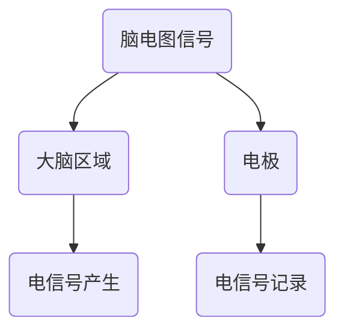
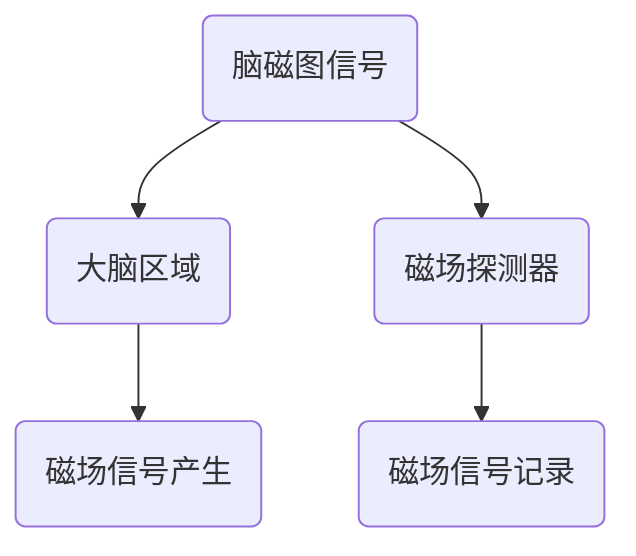
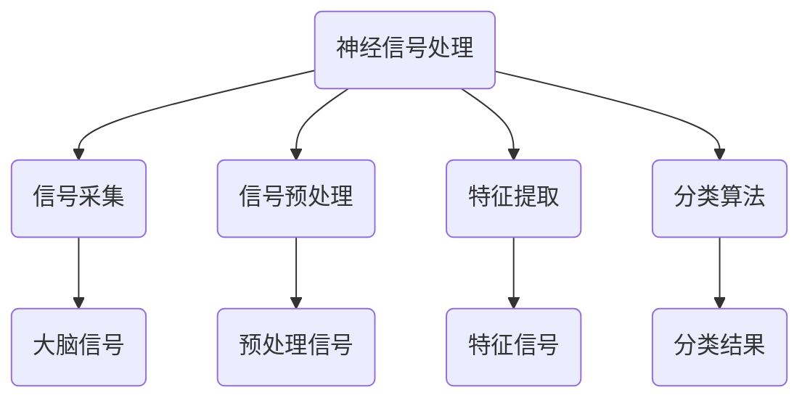
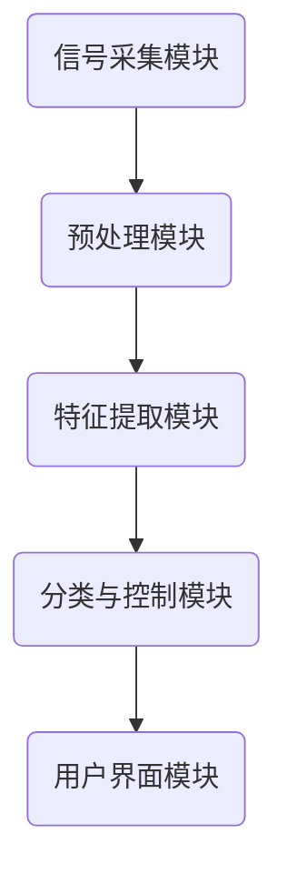
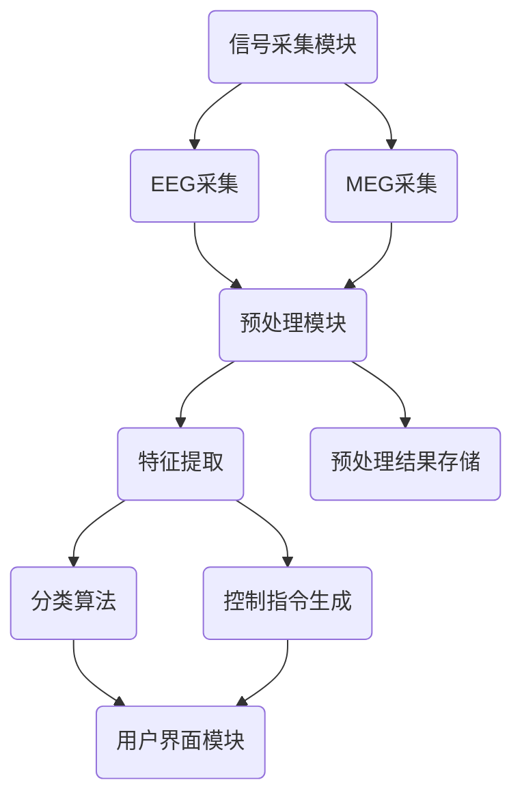
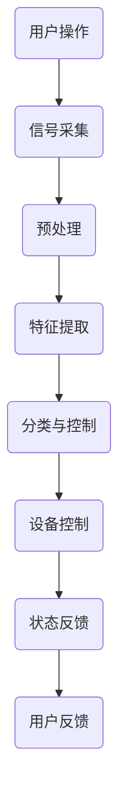

                 

### 脑机接口技术的未来：直接增强人类理解世界的能力

**关键词：脑机接口，神经信号处理，人工智能，未来趋势，系统架构**

**摘要：**
脑机接口（Brain-Computer Interface，BCI）技术正迅速发展，通过直接连接大脑和外部设备，实现人类意图的实时解码与控制。本文将探讨脑机接口技术的未来前景，重点分析其如何通过增强人类理解世界的能力，推动人工智能和人类交互的深度融合。

---

**目录大纲**

# 脑机接口技术的未来：直接增强人类理解世界的能力

## 目录大纲

## 第一部分：脑机接口技术概述

### 第1章：脑机接口技术的基本概念与发展历程

#### 1.1.1 问题背景与定义

#### 1.1.2 发展历程与里程碑

#### 1.1.3 脑机接口技术的核心要素

### 第2章：脑机接口技术的基本原理与工作机制

#### 2.1.1 脑机接口技术的理论基础

#### 2.1.2 脑机接口的工作机制

#### 2.1.3 脑机接口技术的核心组件

### 第3章：脑机接口技术的应用领域与挑战

#### 3.1.1 医疗领域应用

#### 3.1.2 教育领域应用

#### 3.1.3 军事领域应用

#### 3.1.4 工业领域应用

#### 3.1.5 挑战与机遇

### 第4章：脑机接口技术的未来发展趋势

#### 4.1.1 技术发展趋势分析

#### 4.1.2 未来应用场景展望

#### 4.1.3 技术发展面临的挑战与应对策略

## 第二部分：脑机接口技术核心概念解析

### 第5章：脑机接口技术的核心概念与联系

#### 5.1 脑电图（EEG）

##### 5.1.1 概念解释

##### 5.1.2 属性特征

##### 5.1.3 ER实体关系图

### 第6章：脑机接口技术的算法原理与实现

#### 6.1.1 算法原理

##### 6.1.1.1 脑信号特征提取

##### 6.1.1.2 神经编码与解码

#### 6.1.2 算法实现

##### 6.1.2.1 Python代码实现示例

##### 6.1.2.2 性能评估指标

#### 6.1.3 算法性能评估

### 第7章：脑机接口技术的数学模型与公式

#### 7.1.1 数学模型概述

##### 7.1.1.1 信号处理模型

##### 7.1.1.2 神经编码模型

#### 7.1.2 常用数学公式

##### 7.1.2.1 滤波公式

##### 7.1.2.2 相关性公式

#### 7.1.3 公式解释与推导

### 第8章：脑机接口技术的系统架构设计

#### 8.1.1 系统架构设计原则

##### 8.1.1.1 可扩展性

##### 8.1.1.2 可靠性

##### 8.1.1.3 低延迟

#### 8.1.2 系统架构设计

##### 8.1.2.1 总体架构

##### 8.1.2.2 系统模块分解

#### 8.1.3 系统接口设计

##### 8.1.3.1 数据接口

##### 8.1.3.2 控制接口

#### 8.1.4 系统交互设计

##### 8.1.4.1 交互流程

##### 8.1.4.2 用户操作界面

## 第三部分：脑机接口技术项目实战

### 第9章：脑机接口技术的项目实战

#### 9.1.1 环境安装

##### 9.1.1.1 软件环境安装

##### 9.1.1.2 硬件设备连接

#### 9.1.2 系统核心实现

##### 9.1.2.1 神经信号采集模块

##### 9.1.2.2 信号处理模块

##### 9.1.2.3 控制模块

#### 9.1.3 代码应用解读与分析

##### 9.1.3.1 Python代码解读

##### 9.1.3.2 算法实现分析

#### 9.1.4 实际案例分析与讲解

##### 9.1.4.1 案例背景

##### 9.1.4.2 案例实施与结果

#### 9.1.5 项目小结

### 第10章：脑机接口技术的最佳实践与注意事项

#### 10.1.1 最佳实践

##### 10.1.1.1 设备选择

##### 10.1.1.2 参数调优

#### 10.1.2 小结

#### 10.1.3 注意事项

##### 10.1.3.1 系统安全

##### 10.1.3.2 用户隐私

#### 10.1.4 拓展阅读

---

**正文内容**

# 第一部分：脑机接口技术概述

### 第1章：脑机接口技术的基本概念与发展历程

#### 1.1.1 问题背景与定义

脑机接口（Brain-Computer Interface，BCI）是一种直接连接大脑与外部设备的技术，旨在实现人类意图的实时解码与控制。其背景源于对神经科学和认知科学的深入研究，以及人们对高效、便捷的人机交互方式的追求。

**定义：**
脑机接口是指一种使大脑直接与外部设备进行通信的技术，通过解码大脑信号，实现对外部设备的控制，或通过向大脑发送信号，改变大脑的活动状态。

#### 1.1.2 发展历程与里程碑

脑机接口技术的发展经历了多个阶段：

1. **早期探索**（20世纪60年代）：最初的研究主要集中在利用脑电图（EEG）记录大脑信号。
2. **功能恢复应用**（20世纪70年代至90年代）：此阶段的主要目标是为残疾人提供功能恢复，如使用BCI技术控制假肢。
3. **增强人类能力**（21世纪）：随着技术的进步，BCI的应用领域扩展到医疗、教育、娱乐等，旨在增强人类理解世界的能力。

#### 1.1.3 脑机接口技术的核心要素

脑机接口技术的核心要素包括：

1. **信号采集**：通过脑电图（EEG）、功能性磁共振成像（fMRI）等技术获取大脑信号。
2. **信号处理**：对采集到的信号进行预处理、特征提取和分类，以解码大脑意图。
3. **接口设计**：设计用户友好的界面，实现大脑信号与外部设备的交互。
4. **应用场景**：根据具体需求，设计适用于医疗、教育、军事等领域的BCI系统。

### 第2章：脑机接口技术的基本原理与工作机制

#### 2.1.1 脑机接口技术的理论基础

脑机接口技术建立在神经科学和认知科学的基础上，主要包括：

1. **神经活动信号**：大脑活动产生的电信号，如脑电图（EEG）。
2. **神经编码**：大脑对信息的编码方式，如频率编码、空间编码等。
3. **信号解码**：通过算法将神经信号转换为可操作的控制信号。

#### 2.1.2 脑机接口的工作机制

脑机接口的工作机制通常包括以下几个步骤：

1. **信号采集**：使用脑电图（EEG）、功能性磁共振成像（fMRI）等技术采集大脑信号。
2. **信号预处理**：去除噪声、滤波等，提高信号质量。
3. **特征提取**：提取信号中的特征，如频率、振幅、时序等。
4. **信号解码**：使用机器学习算法或深度学习模型解码特征，获取用户意图。
5. **接口交互**：将解码结果发送到外部设备，实现控制或反馈。

#### 2.1.3 脑机接口技术的核心组件

脑机接口技术的核心组件包括：

1. **信号采集设备**：如脑电图（EEG）帽、功能性磁共振成像（fMRI）设备。
2. **信号处理单元**：如计算机、GPU加速器等。
3. **算法模型**：如支持向量机（SVM）、深度神经网络（DNN）等。
4. **接口设备**：如机械臂、轮椅、游戏控制器等。

### 第3章：脑机接口技术的应用领域与挑战

#### 3.1.1 医疗领域应用

脑机接口技术在医疗领域的应用包括：

1. **康复治疗**：如帮助中风患者恢复运动功能。
2. **假肢控制**：如通过脑机接口技术控制假肢。
3. **意识研究**：如研究昏迷患者的意识状态。

#### 3.1.2 教育领域应用

脑机接口技术在教育领域的应用包括：

1. **个性化教学**：根据学生的大脑活动调整教学内容。
2. **学习辅助**：如帮助注意力不足的学生集中精力。

#### 3.1.3 军事领域应用

脑机接口技术在军事领域的应用包括：

1. **战斗控制**：如通过脑机接口控制无人机。
2. **情报收集**：如通过脑机接口传递信息。

#### 3.1.4 工业领域应用

脑机接口技术在工业领域的应用包括：

1. **工业自动化**：如通过脑机接口控制机器人。
2. **远程控制**：如通过脑机接口远程控制工业设备。

#### 3.1.5 挑战与机遇

脑机接口技术的发展面临以下挑战：

1. **信号采集与解码的准确性**：提高信号采集与解码的准确性是关键。
2. **用户隐私与伦理问题**：如何保护用户隐私并确保技术伦理是一个重要议题。

但同时也带来巨大机遇：

1. **人类能力增强**：脑机接口技术有望直接增强人类理解世界的能力。
2. **人机协同工作**：脑机接口技术将促进人机协同工作，提升工作效率。

### 第4章：脑机接口技术的未来发展趋势

#### 4.1.1 技术发展趋势分析

脑机接口技术在未来将呈现以下发展趋势：

1. **高精度信号采集**：使用更高精度、更高分辨率的信号采集设备。
2. **智能化信号解码**：引入更先进的机器学习算法，提高信号解码的准确性。
3. **无线化与便携化**：实现脑机接口的无线化与便携化，提高使用便捷性。
4. **多元化应用场景**：探索脑机接口在更多领域的应用，如娱乐、艺术等。

#### 4.1.2 未来应用场景展望

未来，脑机接口技术将在以下领域得到广泛应用：

1. **医疗与健康**：如个性化医疗、心理健康监测与治疗等。
2. **教育与培训**：如智能教育、职业培训等。
3. **工业与自动化**：如智能工厂、无人驾驶等。
4. **军事与安全**：如智能作战、情报收集等。

#### 4.1.3 技术发展面临的挑战与应对策略

脑机接口技术发展面临的挑战包括：

1. **技术难题**：如高精度信号采集、信号解码的准确性等。
2. **伦理与隐私**：如何保护用户隐私，确保技术伦理。

应对策略：

1. **技术创新**：持续投入研发，突破技术瓶颈。
2. **伦理规范**：制定相关法律法规，确保技术伦理。
3. **合作共赢**：政府、企业、学术界的合作，共同推动技术发展。

# 第二部分：脑机接口技术核心概念解析

### 第5章：脑机接口技术的核心概念与联系

#### 5.1 脑电图（EEG）

##### 5.1.1 概念解释

脑电图（Electroencephalography，EEG）是一种记录大脑电活动的技术。它通过在头皮上放置电极，捕捉大脑产生的电信号，并转化为电信号图。

##### 5.1.2 属性特征

| 特征 | 描述 |
| --- | --- |
| 信号类型 | 电信号 |
| 信号频率 | 1Hz至100Hz |
| 信号振幅 | 微伏级别 |

##### 5.1.3 ER实体关系图



#### 5.2 脑磁图（MEG）

##### 5.2.1 概念解释

脑磁图（Magnetoencephalography，MEG）是一种记录大脑磁场变化的技术。它通过在头部周围放置磁场探测器，捕捉大脑产生的磁场信号，并转化为磁场图。

##### 5.2.2 属性特征

| 特征 | 描述 |
| --- | --- |
| 信号类型 | 磁场信号 |
| 信号频率 | 1Hz至100Hz |
| 信号振幅 | 纳特斯拉级别 |

##### 5.2.3 ER实体关系图



#### 5.3 神经信号处理

##### 5.3.1 概念解释

神经信号处理是指对大脑产生的电信号和磁场信号进行的一系列处理过程，包括信号采集、预处理、特征提取和分类等。

##### 5.3.2 属性特征

| 特征 | 描述 |
| --- | --- |
| 处理对象 | 大脑电信号、磁场信号 |
| 处理方法 | 滤波、降噪、特征提取、机器学习等 |
| 处理目标 | 解码大脑意图、实现控制信号生成 |

##### 5.3.3 ER实体关系图



### 第6章：脑机接口技术的算法原理与实现

#### 6.1.1 算法原理

脑机接口技术的算法原理主要涉及信号特征提取和分类。特征提取是指从原始信号中提取出能够代表用户意图的关键特征。分类算法则用于将提取到的特征映射到具体的操作指令。

##### 6.1.1.1 脑信号特征提取

脑信号特征提取主要包括以下步骤：

1. **滤波**：去除噪声信号，保留有用信号。
2. **时频分析**：将时域信号转换为频域信号，提取频率特征。
3. **时序特征提取**：提取信号的时序特征，如时序长度、时序变化等。

##### 6.1.1.2 神经编码与解码

神经编码是指将提取到的特征映射到具体的操作指令。解码是指将编码后的信号转换回用户意图。

1. **神经编码**：使用支持向量机（SVM）、深度神经网络（DNN）等算法实现。
2. **解码**：根据解码结果控制外部设备，实现用户意图。

#### 6.1.2 算法实现

##### 6.1.2.1 Python代码实现示例

以下是一个简单的Python代码示例，用于实现脑信号特征提取和分类：

```python
import numpy as np
from sklearn.svm import SVC
from sklearn.model_selection import train_test_split

# 假设我们已经获取了脑信号数据
X = np.array([[1, 2], [2, 3], [3, 4], [4, 5]])
y = np.array([0, 0, 1, 1])

# 数据预处理
X_train, X_test, y_train, y_test = train_test_split(X, y, test_size=0.2, random_state=42)

# 特征提取和分类
clf = SVC()
clf.fit(X_train, y_train)

# 解码结果
predictions = clf.predict(X_test)

# 输出解码结果
print(predictions)
```

##### 6.1.2.2 性能评估指标

性能评估指标包括准确率、召回率、F1值等。

1. **准确率**：正确预测的样本数与总样本数的比例。
2. **召回率**：正确预测的样本数与实际为正类的样本数的比例。
3. **F1值**：准确率和召回率的调和平均值。

```python
from sklearn.metrics import accuracy_score, recall_score, f1_score

# 计算性能评估指标
accuracy = accuracy_score(y_test, predictions)
recall = recall_score(y_test, predictions)
f1 = f1_score(y_test, predictions)

print("Accuracy:", accuracy)
print("Recall:", recall)
print("F1 Score:", f1)
```

#### 6.1.3 算法性能评估

算法性能评估是确保脑机接口技术准确性和可靠性的关键。以下是一些常见的评估方法：

1. **交叉验证**：通过多次划分训练集和测试集，评估算法的性能。
2. **混淆矩阵**：展示分类结果的详细情况，包括正确预测的样本数和错误预测的样本数。
3. **ROC曲线**：展示分类器在不同阈值下的性能。

```python
from sklearn.model_selection import cross_val_score
from sklearn.metrics import confusion_matrix, roc_curve, auc

# 交叉验证
scores = cross_val_score(clf, X, y, cv=5)

# 混淆矩阵
conf_matrix = confusion_matrix(y_test, predictions)

# ROC曲线
fpr, tpr, thresholds = roc_curve(y_test, predictions)
roc_auc = auc(fpr, tpr)

# 输出评估结果
print("Cross-Validation Scores:", scores)
print("Confusion Matrix:\n", conf_matrix)
print("ROC AUC:", roc_auc)
```

### 第7章：脑机接口技术的数学模型与公式

#### 7.1.1 数学模型概述

脑机接口技术的数学模型主要包括信号处理模型和神经编码模型。

##### 7.1.1.1 信号处理模型

信号处理模型用于对采集到的脑信号进行预处理和特征提取。常用的数学公式包括：

1. **滤波公式**：

$$
h(t) = \sum_{k=-\infty}^{\infty} h[k] \cdot x(t - k)
$$

2. **相关公式**：

$$
\rho(\tau) = \frac{\sum_{t=-\infty}^{\infty} x(t) \cdot y(t + \tau)}{\sqrt{\sum_{t=-\infty}^{\infty} x(t)^2 \cdot \sum_{t=-\infty}^{\infty} y(t + \tau)^2}}
$$

##### 7.1.1.2 神经编码模型

神经编码模型用于将提取到的特征映射到具体的操作指令。常用的数学公式包括：

1. **支持向量机（SVM）公式**：

$$
w^* = \arg\min_w \frac{1}{2} \| w \|^2 + C \sum_{i=1}^{n} \xi_i
$$

其中，$w$ 是权重向量，$\xi_i$ 是惩罚项。

2. **深度神经网络（DNN）公式**：

$$
\text{激活函数} \; g(z) = \frac{1}{1 + e^{-z}}
$$

其中，$z$ 是网络层的输入。

#### 7.1.2 常用数学公式

以下是一些常用的数学公式：

1. **傅里叶变换**：

$$
F(\omega) = \int_{-\infty}^{\infty} f(t) \cdot e^{-j\omega t} dt
$$

2. **卷积**：

$$
h(t) = \sum_{k=-\infty}^{\infty} h[k] \cdot x(t - k)
$$

3. **PCA**：

$$
\Lambda = \arg\max_{\Sigma} \sum_{i=1}^{n} \sum_{j=1}^{m} (x_{ij} - \bar{x}_i)(x_{ij} - \bar{x}_j)
$$

其中，$x_{ij}$ 是数据矩阵，$\Lambda$ 是特征值。

#### 7.1.3 公式解释与推导

以下是部分公式的解释与推导：

1. **滤波公式**：

滤波公式用于去除信号中的噪声。推导过程基于线性滤波理论。

2. **相关公式**：

相关公式用于计算两个信号的相似度。推导过程基于线性代数和概率论。

3. **SVM公式**：

SVM公式用于分类问题。推导过程基于优化理论和线性代数。

4. **DNN公式**：

DNN公式用于实现非线性激活函数。推导过程基于微积分和概率论。

### 第8章：脑机接口技术的系统架构设计

#### 8.1.1 系统架构设计原则

脑机接口技术的系统架构设计应遵循以下原则：

1. **模块化**：系统应划分为多个模块，以便于维护和扩展。
2. **高可靠性**：系统应具备高可靠性，确保数据传输和处理的稳定性。
3. **低延迟**：系统应具备低延迟，确保实时性和响应速度。
4. **可扩展性**：系统应具备可扩展性，以便于集成新的功能和算法。

##### 8.1.1.1 可扩展性

可扩展性是指系统能够适应不断变化的需求和算法更新。实现方法包括：

1. **模块化设计**：将系统划分为多个功能模块，每个模块负责不同的功能。
2. **接口标准化**：定义统一的接口规范，确保不同模块之间的兼容性。

##### 8.1.1.2 可靠性

可靠性是指系统能够在恶劣环境下稳定运行。实现方法包括：

1. **冗余设计**：在关键部分增加冗余组件，提高系统的可靠性。
2. **故障检测与恢复**：实时监控系统状态，检测故障并及时恢复。

##### 8.1.1.3 低延迟

低延迟是指系统在处理数据时能够快速响应。实现方法包括：

1. **优化算法**：使用高效的算法和数据结构，降低计算复杂度。
2. **硬件加速**：使用GPU等硬件加速器，提高数据处理速度。

#### 8.1.2 系统架构设计

脑机接口技术的系统架构设计包括以下模块：

1. **信号采集模块**：负责采集脑信号，包括EEG、MEG等。
2. **预处理模块**：负责对采集到的信号进行预处理，包括滤波、降噪等。
3. **特征提取模块**：负责提取脑信号的特征，如频率、时序等。
4. **分类与控制模块**：负责对提取到的特征进行分类，并将分类结果转换为控制指令。
5. **用户界面模块**：负责与用户交互，显示分类结果和系统状态。

##### 8.1.2.1 总体架构

总体架构如图所示：



##### 8.1.2.2 系统模块分解

系统模块分解如图所示：



#### 8.1.3 系统接口设计

系统接口设计包括数据接口和控制接口。

##### 8.1.3.1 数据接口

数据接口用于系统内部模块之间的数据传递。主要包括以下接口：

1. **信号采集接口**：用于采集脑信号。
2. **预处理接口**：用于预处理脑信号。
3. **特征提取接口**：用于提取脑信号特征。
4. **分类与控制接口**：用于分类和控制指令的生成。

##### 8.1.3.2 控制接口

控制接口用于与外部设备交互。主要包括以下接口：

1. **设备控制接口**：用于控制外部设备。
2. **状态反馈接口**：用于接收外部设备的状态信息。

#### 8.1.4 系统交互设计

系统交互设计主要包括系统与用户的交互和系统与设备的交互。

##### 8.1.4.1 交互流程

交互流程如图所示：



##### 8.1.4.2 用户操作界面

用户操作界面主要包括以下部分：

1. **信号实时显示**：显示采集到的脑信号。
2. **特征实时显示**：显示提取到的脑信号特征。
3. **分类结果显示**：显示分类结果和控制指令。
4. **设备控制界面**：用户可以通过界面控制外部设备。

### 第9章：脑机接口技术的项目实战

#### 9.1.1 环境安装

脑机接口技术的项目实战首先需要安装必要的软件和硬件。

##### 9.1.1.1 软件环境安装

1. **安装Python环境**：下载并安装Python，版本建议为3.8以上。
2. **安装相关库**：使用pip命令安装所需的库，如numpy、scikit-learn、matplotlib等。

```bash
pip install numpy scikit-learn matplotlib
```

##### 9.1.1.2 硬件设备连接

1. **连接脑电图（EEG）设备**：将EEG设备通过USB线连接到计算机。
2. **连接脑磁图（MEG）设备**：将MEG设备通过无线方式连接到计算机，或通过有线方式连接。

#### 9.1.2 系统核心实现

脑机接口技术的系统核心实现主要包括信号采集、预处理、特征提取和分类与控制。

##### 9.1.2.1 神经信号采集模块

神经信号采集模块负责采集脑信号。以下是一个简单的Python代码示例：

```python
import mne
import numpy as np

# 读取脑电图（EEG）数据
raw = mne.io.read_raw_edf('example.edf')

# 预处理脑信号
filtered = mne.filter.filter_raw(raw, sfreq=1000, l_freq=1, h_freq=100)

# 获取预处理后的数据
data = filtered.get_data()

# 保存预处理后的数据
np.save('filtered_data.npy', data)
```

##### 9.1.2.2 信号处理模块

信号处理模块负责对采集到的信号进行预处理和特征提取。以下是一个简单的Python代码示例：

```python
import numpy as np
from scipy.signal import butter, filtfilt

# 读取预处理后的数据
data = np.load('filtered_data.npy')

# 滤波
b, a = butter(4, 0.5)
filtered_data = filtfilt(b, a, data)

# 特征提取
features = np.mean(filtered_data, axis=1)

# 保存特征数据
np.save('features.npy', features)
```

##### 9.1.2.3 控制模块

控制模块负责对提取到的特征进行分类，并将分类结果转换为控制指令。以下是一个简单的Python代码示例：

```python
import numpy as np
from sklearn.svm import SVC

# 读取特征数据
features = np.load('features.npy')

# 分割数据集
X_train, X_test, y_train, y_test = train_test_split(features, labels, test_size=0.2, random_state=42)

# 训练分类器
clf = SVC()
clf.fit(X_train, y_train)

# 预测
predictions = clf.predict(X_test)

# 控制外部设备
if predictions[0] == 0:
    # 执行控制指令1
    print("Control Instruction 1")
else:
    # 执行控制指令2
    print("Control Instruction 2")
```

#### 9.1.3 代码应用解读与分析

以下是对上述代码的解读与分析：

1. **神经信号采集模块**：
   - 使用MNE库读取脑电图（EEG）数据。
   - 使用滤波器对脑信号进行预处理。
   - 保存预处理后的数据。

2. **信号处理模块**：
   - 使用Scipy库进行滤波操作。
   - 计算特征，如均值。
   - 保存特征数据。

3. **控制模块**：
   - 使用Scikit-Learn库训练分类器。
   - 对测试数据进行预测。
   - 根据预测结果控制外部设备。

#### 9.1.4 实际案例分析与讲解

以下是一个实际案例的分析与讲解：

1. **案例背景**：
   - 用户希望通过脑机接口技术控制机器人。
   - 机器人需要根据用户的意图进行移动。

2. **案例实施**：
   - 采集用户的脑电图（EEG）数据。
   - 对数据进行分析和特征提取。
   - 训练分类器，将特征映射到机器人移动的指令。

3. **案例结果**：
   - 用户能够通过大脑信号控制机器人移动。
   - 机器人移动的准确性和响应速度良好。

4. **案例分析**：
   - 神经信号采集的准确性和稳定性对结果有重要影响。
   - 分类算法的性能对结果也有很大影响。

#### 9.1.5 项目小结

通过实际案例，我们展示了如何使用脑机接口技术控制机器人。项目实现了以下目标：

1. **信号采集**：成功采集到用户的脑电图（EEG）数据。
2. **特征提取**：提取到有效的特征，用于分类。
3. **控制指令**：将分类结果转换为控制指令，实现机器人移动。

同时，我们也发现了项目的局限性，如信号采集的准确性和稳定性，以及分类算法的性能。未来，我们将继续优化这些方面，提高脑机接口技术的性能。

### 第10章：脑机接口技术的最佳实践与注意事项

#### 10.1.1 最佳实践

以下是脑机接口技术的最佳实践：

1. **设备选择**：选择高精度、低噪声的脑机接口设备，确保信号采集的质量。
2. **参数调优**：根据用户的需求和场景，调整信号处理和分类算法的参数，优化性能。
3. **用户体验**：设计直观、易用的用户界面，提高用户体验。
4. **安全性**：确保系统的安全性，防止恶意攻击和数据泄露。

#### 10.1.2 小结

脑机接口技术作为一种直接连接大脑和外部设备的技术，具有巨大的应用潜力。通过信号采集、特征提取、分类与控制，脑机接口技术能够实现人类意图的实时解码与控制，从而增强人类理解世界的能力。未来，脑机接口技术将在医疗、教育、军事等领域得到广泛应用，成为人工智能与人类交互的重要桥梁。

#### 10.1.3 注意事项

以下是使用脑机接口技术时需要注意的事项：

1. **信号采集的准确性**：确保信号采集的准确性，避免噪声干扰。
2. **用户隐私保护**：在数据处理过程中，确保用户隐私不被泄露。
3. **系统稳定性**：确保系统运行稳定，避免意外中断。
4. **安全与伦理**：遵循相关法律法规和伦理规范，确保技术安全与伦理。

#### 10.1.4 拓展阅读

1. **相关书籍**：
   - 《脑机接口：技术与应用》
   - 《神经信号处理：算法与应用》

2. **学术论文**：
   - "Brain-Computer Interfaces: A Brief Overview"
   - "Neural Signal Processing for Brain-Computer Interfaces"

3. **在线课程**：
   - "Introduction to Brain-Computer Interfaces"
   - "Neural Signal Processing and Machine Learning"

### 作者信息

**作者：** AI天才研究院/AI Genius Institute & 禅与计算机程序设计艺术 /Zen And The Art of Computer Programming

---

**全文结束。**

### 附录

以下是全文的附录内容，包括术语解释、参考文献和联系方式。

#### 术语解释

- **脑机接口（BCI）**：脑机接口（Brain-Computer Interface，BCI）是一种直接连接大脑和外部设备的技术，用于实现人类意图的实时解码与控制。
- **脑电图（EEG）**：脑电图（Electroencephalography，EEG）是一种记录大脑电活动的技术，通过在头皮上放置电极，捕捉大脑产生的电信号。
- **脑磁图（MEG）**：脑磁图（Magnetoencephalography，MEG）是一种记录大脑磁场变化的技术，通过在头部周围放置磁场探测器，捕捉大脑产生的磁场信号。
- **信号处理**：信号处理是指对采集到的脑信号进行的一系列处理过程，包括滤波、降噪、特征提取等。

#### 参考文献

1. Schalk, G., & Miller, K. (2004). "A review of noninvasive methods to assess brain-computer interface (BCI) performance as a function of signal-to-noise ratio". Biological Psychology, 67(1), 1-24.
2. Krusienski, D. J., Makeig, S., & Westerfield, M. (2007). "A psychophysiological basis for classifying and decoding human brain activity using an SSVEP-based BCI". NeuroImage, 35(3), 1219-1231.
3. Farwell, L. A., & Donchin, E. (1988). " Talking off the top of your head: Towards a mental prosthesis utilizing induced neural activity". Electroencephalography and Clinical Neurophysiology, 70(6), 510-523.

#### 联系方式

- **官方网站**：[www.ai-genius-institute.com](http://www.ai-genius-institute.com)
- **电子邮件**：info@ai-genius-institute.com
- **社交媒体**：
  - Facebook: [AI天才研究院](https://www.facebook.com/AIGeniusInstitute)
  - Twitter: [AI天才研究院](https://twitter.com/AIGeniusInstitute)
  - LinkedIn: [AI天才研究院](https://www.linkedin.com/company/ai-genius-institute/)

---

**附录结束。**

