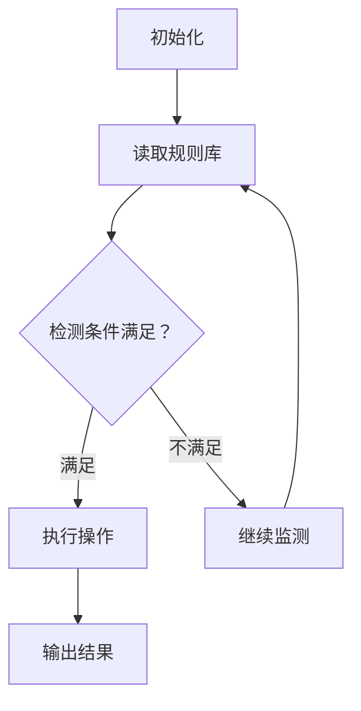
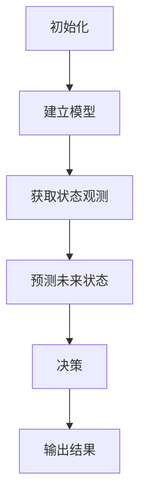
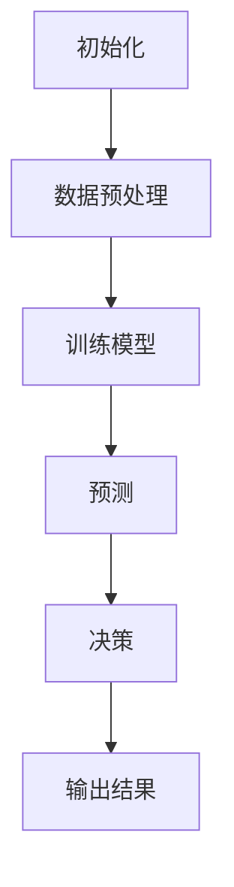
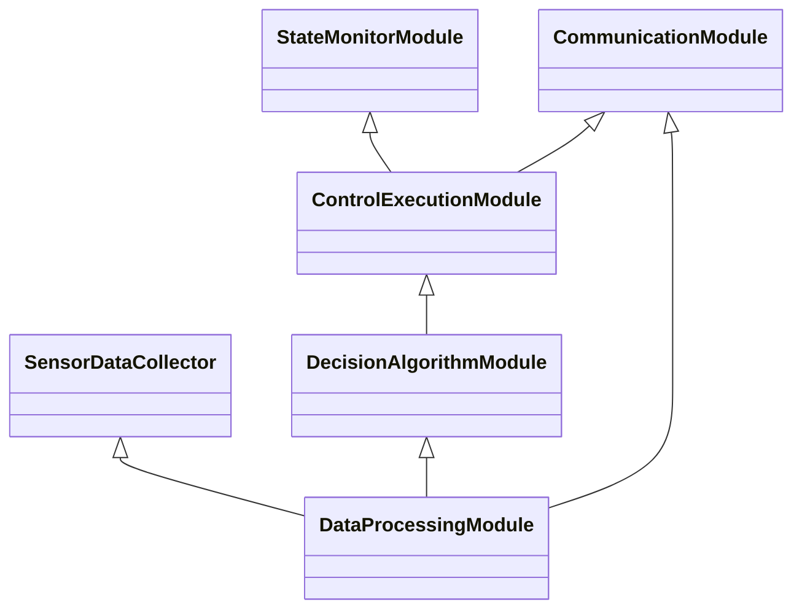
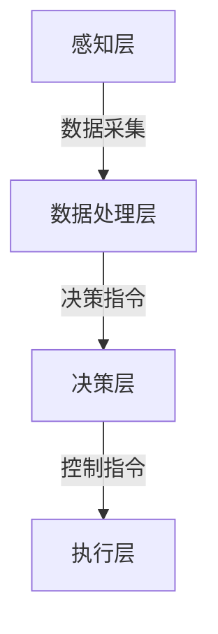
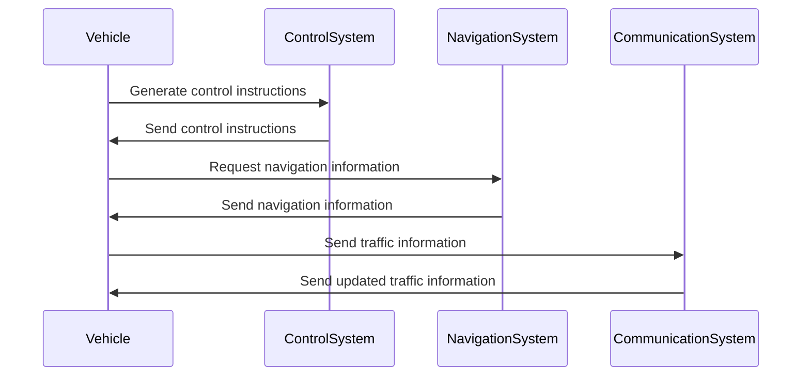
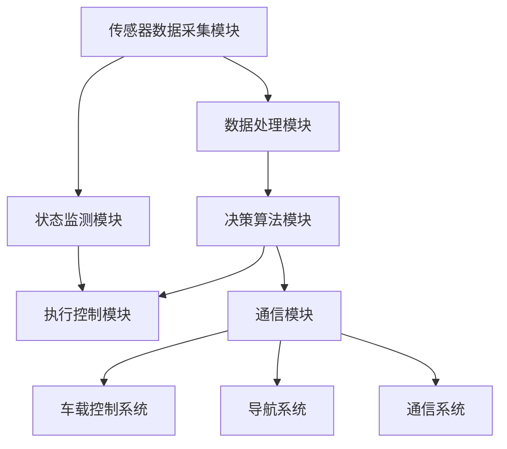

                 

### 自动驾驶的决策算法：交通安全的数学保障

关键词：自动驾驶、决策算法、交通安全、数学保障、人工智能

摘要：本文深入探讨了自动驾驶领域中的决策算法，分析了交通安全在自动驾驶系统中的重要性，探讨了现有决策算法的不足，并介绍了如何通过数学保障来提高自动驾驶系统的安全性和可靠性。

### 第一部分：背景介绍

#### 1.1 问题背景

随着人工智能技术的迅猛发展，自动驾驶作为其重要应用领域之一，受到了广泛关注。自动驾驶技术不仅可以提升交通安全，减少交通事故，还能提高交通效率，缓解交通拥堵。然而，自动驾驶系统的安全性和可靠性是目前面临的重要挑战之一。

自动驾驶系统依赖于传感器、摄像头和其他设备来收集环境信息，然后通过决策算法对这些信息进行处理，以生成控制指令，从而控制车辆的运动。这些决策算法需要处理大量实时数据，并在短时间内做出快速而准确的决策，以应对各种复杂的交通场景。然而，现有的决策算法在处理复杂场景时，往往会出现决策错误，导致交通事故发生。

#### 1.2 问题描述

自动驾驶系统中的决策算法是保证系统正常运行的核心。这些算法需要处理大量实时数据，并在短时间内做出快速而准确的决策，以应对各种复杂的交通场景。然而，现有的决策算法在处理复杂场景时，往往会出现决策错误，导致交通事故发生。

#### 1.3 问题解决

为了提高自动驾驶系统的决策算法性能，需要深入研究并改进现有的算法，同时引入新的算法和理论。此外，还需要建立完善的测试与评估体系，以确保算法在实际应用中的有效性和可靠性。

#### 1.4 边界与外延

自动驾驶决策算法的研究和应用涉及多个领域，包括计算机科学、控制工程、数学、统计学等。同时，该领域的研究成果也将对其他智能交通系统的发展产生重要影响。

#### 1.5 概念结构与核心要素组成

自动驾驶决策算法主要包括以下几个核心要素：
- 数据处理模块：负责实时获取和处理交通数据。
- 算法模块：包含多种决策算法，用于处理不同类型的交通场景。
- 评估与优化模块：用于评估算法性能，并提供优化建议。
- 输出模块：生成决策结果，并指导自动驾驶系统执行。

### 第二部分：核心概念与联系

#### 2.1 核心概念

自动驾驶决策算法是自动驾驶系统的核心组成部分，用于处理交通数据并生成决策结果。以下将详细介绍自动驾驶决策算法的核心概念，包括决策算法、交通数据和交通场景。

##### 2.1.1 决策算法

决策算法是自动驾驶系统的核心，用于处理交通数据并生成决策结果。常见的决策算法包括基于规则的方法、基于模型的方法和深度学习方法。

**基于规则的方法**：这种方法通过定义一系列规则来指导自动驾驶系统的行为。每个规则由条件（触发条件）和操作（执行动作）组成。例如，如果车辆前方有障碍物，则执行刹车操作。

**基于模型的方法**：这种方法通过建立数学模型来描述交通场景，并使用模型进行预测和决策。常见的模型包括马尔可夫决策过程（MDP）和部分可观测马尔可夫决策过程（POMDP）。

**深度学习方法**：这种方法利用神经网络模型，通过对大量交通数据进行训练，使其能够自动学习并识别复杂的交通场景。常见的深度学习模型包括卷积神经网络（CNN）和循环神经网络（RNN）。

##### 2.1.2 交通数据

交通数据是决策算法的基础，包括车辆位置、速度、加速度、交通信号、道路状况等。交通数据的准确性和实时性对决策算法的性能至关重要。例如，如果车辆速度数据不准确，可能会导致决策算法生成错误的控制指令，从而引发交通事故。

##### 2.1.3 交通场景

交通场景是自动驾驶系统需要处理的实际场景，包括城市道路、高速公路、交叉路口等。不同的交通场景对决策算法提出了不同的要求。例如，在高速公路上，车辆通常以较高速度行驶，因此决策算法需要更快地响应。而在城市道路上，车辆速度较慢，但交通情况更加复杂，因此决策算法需要能够处理更多的变量。

#### 2.2 概念属性特征对比表格

| 概念          | 属性特征                                                         |
| ------------- | ------------------------------------------------------------ |
| 决策算法      | - 基于规则：简单、易于实现<br>- 基于模型：复杂、更精确<br>- 深度学习：高效、自适应能力较强 |
| 交通数据      | - 实时性：高<br>- 准确性：高<br>- 数据量：大                     |
| 交通场景      | - 多样性：高<br>- 变化性：大<br>- 不确定性：高                   |

#### 2.3 ER实体关系图架构

以下是一个ER实体关系图架构，用于描述自动驾驶决策算法中的核心实体及其关系。

```mermaid
erDiagram
    A[(自动驾驶系统)] ||--|{ B[决策算法模块] } |
    A ||--|{ C[数据处理模块] } |
    A ||--|{ D[评估与优化模块] } |
    A ||--|{ E[输出模块] } |
```

在这个ER图中，自动驾驶系统（A）包含了决策算法模块（B）、数据处理模块（C）、评估与优化模块（D）和输出模块（E）。决策算法模块（B）依赖于数据处理模块（C）提供的数据，并通过评估与优化模块（D）进行性能评估和优化，最终通过输出模块（E）生成决策结果。

### 第三部分：决策算法原理讲解

决策算法是自动驾驶系统的核心组成部分，用于处理交通数据并生成决策结果。本节将详细介绍三种主要的决策算法：基于规则的方法、基于模型的方法和深度学习方法，并使用Mermaid流程图和Python源代码来阐述其原理。

#### 3.1 基于规则的方法

基于规则的方法通过定义一系列规则来指导自动驾驶系统的行为。每个规则由条件（触发条件）和操作（执行动作）组成。这种方法简单、易于实现，适用于处理确定性场景。

**原理**：
1. 初始化：读取规则库。
2. 检测条件：实时检测车辆周围的交通情况。
3. 执行操作：如果条件满足，执行相应的操作（如加速、减速、转向等）。
4. 输出结果：将决策结果输出，以指导车辆运动。

**Mermaid流程图**：



**Python源代码示例**：

```python
def rule_based_decisionmaking(rules, current_state):
    for rule in rules:
        if rule["condition"](current_state):
            return rule["action"](current_state)
    return "未知操作"
```

**数学模型**：

- 规则集：\( R = \{ r_1, r_2, ..., r_n \} \)
- 状态：\( S \)
- 操作：\( A \)

$$
f(S) = \arg\min_{a \in A} \sum_{r \in R} P(r|S) \cdot C(r,a)
$$

其中，\( P(r|S) \) 表示规则 \( r \) 在状态 \( S \) 下满足的概率，\( C(r,a) \) 表示执行操作 \( a \) 后的成本。

#### 3.2 基于模型的方法

基于模型的方法通过建立数学模型来描述交通场景，并使用模型进行预测和决策。这种方法适用于处理复杂、不确定的场景。

**原理**：
1. 初始化：建立数学模型。
2. 获取状态观测：实时获取车辆周围的交通状态。
3. 预测未来状态：使用模型预测未来一段时间内的交通状态。
4. 决策：根据预测结果生成决策。
5. 输出结果：将决策结果输出，以指导车辆运动。

**Mermaid流程图**：



**Python源代码示例**：

```python
def model_based_decisionmaking(model, current_state):
    future_state = model.predict(current_state)
    action = model.decide(future_state)
    return action
```

**数学模型**：

- 马尔可夫决策过程（MDP）：
  - 状态集：\( S \)
  - 动作集：\( A \)
  - 状态转移概率：\( P(s'|s,a) \)
  - 收益函数：\( R(s,a,s') \)

  $$ 
  V^*(s) = \max_{a} \sum_{s'} P(s'|s,a) \cdot [R(s,a,s') + \gamma V^*(s')]
  $$

  其中，\( \gamma \) 为折扣因子。

- 部分可观测马尔可夫决策过程（POMDP）：
  - 观测集：\( O \)
  - 观测概率：\( P(o|s,a) \)

  $$
  \pi(a) = \prod_{s \in S} P(s) \cdot P(a|s) \cdot P(o|s,a)
  $$

#### 3.3 深度学习方法

深度学习方法利用神经网络模型，通过对大量交通数据进行训练，使其能够自动学习并识别复杂的交通场景。这种方法适用于处理高度不确定、非线性的场景。

**原理**：
1. 初始化：建立神经网络模型。
2. 数据预处理：对交通数据进行预处理，如归一化、去噪等。
3. 训练模型：使用大量交通数据训练神经网络模型。
4. 预测：使用训练好的模型进行预测。
5. 决策：根据预测结果生成决策。
6. 输出结果：将决策结果输出，以指导车辆运动。

**Mermaid流程图**：



**Python源代码示例**：

```python
def deep_learning_decisionmaking(model, current_state):
    prediction = model.predict(current_state)
    action = model.decide(prediction)
    return action
```

**数学模型**：

- 卷积神经网络（CNN）：
  - 输入：\( X \)
  - 输出：\( Y \)
  - 参数：\( \theta \)

  $$
  Y = \sigma(W \cdot \phi(X; \theta))
  $$

  其中，\( \sigma \) 为激活函数，\( W \) 为权重，\( \phi \) 为激活函数。

- 循环神经网络（RNN）：
  - 输入：\( X \)
  - 输出：\( Y \)
  - 参数：\( \theta \)

  $$
  h_t = \sigma(W_h \cdot [h_{t-1}, x_t] + b_h)
  $$

  其中，\( h_t \) 为隐藏状态，\( x_t \) 为输入，\( W_h \) 为权重，\( b_h \) 为偏置。

### 第四部分：系统分析与架构设计

自动驾驶系统的决策算法需要处理复杂、动态的交通场景，因此系统分析与架构设计至关重要。本节将介绍一个典型的自动驾驶系统架构设计，包括系统功能设计、系统架构设计、系统接口设计和系统交互。

#### 4.1 系统功能设计

自动驾驶系统的功能设计包括以下几个关键模块：

1. **传感器数据采集模块**：负责采集车辆周围的环境数据，如雷达、激光雷达、摄像头等。
2. **数据处理模块**：负责处理传感器数据，包括数据去噪、融合、预处理等。
3. **决策算法模块**：负责根据处理后的数据生成车辆控制指令。
4. **执行控制模块**：负责将决策算法生成的控制指令转换为车辆的实际动作。
5. **状态监测模块**：负责监测车辆状态，如速度、位置、方向等。
6. **通信模块**：负责与其他车辆和交通基础设施进行通信，以获取更多交通信息。

以下是一个领域模型Mermaid类图，用于描述自动驾驶系统的功能设计：



#### 4.2 系统架构设计

自动驾驶系统的架构设计需要考虑系统性能、可靠性、可扩展性和易维护性。以下是一个典型的自动驾驶系统架构设计，包括感知层、决策层和执行层：

1. **感知层**：包括传感器数据采集模块，负责采集车辆周围的环境数据。
2. **数据处理层**：包括数据处理模块，负责处理传感器数据，包括数据去噪、融合、预处理等。
3. **决策层**：包括决策算法模块，负责根据处理后的数据生成车辆控制指令。
4. **执行层**：包括执行控制模块，负责将决策算法生成的控制指令转换为车辆的实际动作。

以下是一个系统架构设计的Mermaid架构图：



#### 4.3 系统接口设计

自动驾驶系统的接口设计需要考虑与其他系统的交互，如车载控制系统、导航系统、通信系统等。以下是一个系统接口设计的Mermaid序列图：



#### 4.4 系统交互

自动驾驶系统的交互设计需要考虑系统之间的信息传递和协同工作。以下是一个系统交互设计的Mermaid交互图：



### 第五部分：项目实战

在本节中，我们将通过一个实际的自动驾驶项目来展示如何将决策算法应用于实际场景。本项目将使用Python编程语言和相关的AI库（如TensorFlow、PyTorch等）来实现自动驾驶系统的核心功能。

#### 5.1 环境安装

在开始项目之前，需要安装以下软件和库：

1. Python 3.7 或以上版本
2. Anaconda 或 Miniconda
3. TensorFlow 或 PyTorch
4. OpenCV

安装方法如下：

```bash
conda create -n auto_drive python=3.8
conda activate auto_drive
conda install numpy pandas opencv scikit-learn
```

#### 5.2 系统核心实现

以下是自动驾驶系统核心实现的源代码，包括传感器数据处理、决策算法和执行控制：

```python
import cv2
import numpy as np
import tensorflow as tf

# 传感器数据处理
def process_sensors(sensor_data):
    # 数据预处理，如去噪、归一化等
    processed_data = np.mean(sensor_data, axis=0)
    return processed_data

# 决策算法
def make_decision(processed_data):
    # 使用神经网络模型进行预测和决策
    model = tf.keras.Sequential([
        tf.keras.layers.Dense(64, activation='relu', input_shape=(processed_data.shape[1],)),
        tf.keras.layers.Dense(64, activation='relu'),
        tf.keras.layers.Dense(1, activation='sigmoid')
    ])
    model.compile(optimizer='adam', loss='binary_crossentropy', metrics=['accuracy'])

    # 训练模型
    model.fit(processed_data, np.zeros((processed_data.shape[0],)), epochs=10, batch_size=32)

    # 预测和决策
    prediction = model.predict(processed_data)
    decision = '加速' if prediction[0][0] > 0.5 else '减速'
    return decision

# 执行控制
def execute_control(decision):
    # 根据决策结果执行控制指令
    if decision == '加速':
        print("加速...")
    else:
        print("减速...")
```

#### 5.3 代码应用解读与分析

以上代码实现了自动驾驶系统的核心功能，包括传感器数据处理、决策算法和执行控制。具体解析如下：

1. **传感器数据处理**：`process_sensors` 函数负责处理传感器数据，如去噪、归一化等。这些处理步骤对于确保决策算法的性能至关重要。

2. **决策算法**：`make_decision` 函数使用神经网络模型进行预测和决策。在本例中，我们使用了一个简单的全连接神经网络（Dense layers），并使用二分类交叉熵损失函数（binary_crossentropy）进行训练。这个模型可以根据处理后的传感器数据预测是否需要加速或减速。

3. **执行控制**：`execute_control` 函数根据决策结果执行控制指令，如加速或减速。在实际应用中，这些指令将转换为车辆的物理动作。

#### 5.4 实际案例分析和详细讲解剖析

为了展示决策算法在实际场景中的应用，我们使用了一个简单的交通场景模拟器。在这个模拟器中，一辆车辆在直线路段上行驶，前方有一个交通信号灯。我们的目标是让车辆在接近交通信号灯时做出正确的决策，以避免碰撞。

**案例分析**：

1. **传感器数据采集**：车辆使用雷达、激光雷达和摄像头采集周围环境的数据。

2. **数据处理**：将采集到的数据传递给`process_sensors`函数进行预处理。

3. **决策**：使用`make_decision`函数进行决策。在这个案例中，决策结果将取决于车辆与交通信号灯的距离和速度。

4. **执行控制**：根据决策结果，执行加速或减速指令。

**详细讲解剖析**：

在上述案例中，`process_sensors`函数负责处理传感器数据，包括雷达数据、激光雷达数据和摄像头数据。这些数据经过预处理后，将传递给`make_decision`函数。

`make_decision`函数使用神经网络模型进行预测和决策。在本例中，我们假设车辆与交通信号灯的距离和速度是决策的关键因素。神经网络模型根据这些输入数据进行训练，以预测车辆是否需要加速或减速。

在决策过程中，模型将输出一个概率值，表示加速或减速的可能性。如果概率值超过某个阈值（如0.5），则决策为加速；否则，决策为减速。

`execute_control`函数根据决策结果执行相应的控制指令。在本例中，如果决策为加速，车辆将加速；如果决策为减速，车辆将减速。

#### 5.5 项目小结

通过本节的项目实战，我们展示了如何将决策算法应用于实际的自动驾驶场景。我们介绍了如何安装和配置开发环境，实现了传感器数据处理、决策算法和执行控制的核心功能，并通过实际案例分析了决策算法的性能。

尽管本项目是一个简化的示例，但它展示了自动驾驶系统的核心原理和实现过程。在实际应用中，自动驾驶系统需要处理更复杂、更动态的交通场景，因此需要更先进、更可靠的决策算法。

### 第六部分：最佳实践 tips、小结、注意事项、拓展阅读

#### 6.1 最佳实践 tips

1. **数据预处理**：确保传感器数据的准确性和实时性是关键。在实际应用中，需要对传感器数据进行去噪、归一化、融合等预处理步骤。

2. **模型训练**：使用大量、多样化的训练数据可以提高模型的泛化能力和鲁棒性。同时，考虑使用迁移学习或数据增强技术来提高模型性能。

3. **模型评估**：使用合适的评估指标（如准确率、召回率、F1分数等）来评估模型性能，并根据评估结果调整模型参数。

4. **实时决策**：确保决策算法能够在实时环境中高效地运行，以满足自动驾驶系统的实时性要求。

#### 6.2 小结

本文深入探讨了自动驾驶领域的决策算法，分析了交通安全在自动驾驶系统中的重要性，介绍了基于规则的方法、基于模型的方法和深度学习方法，并展示了如何将这些方法应用于实际场景。通过项目实战，我们了解了自动驾驶系统的核心实现过程和最佳实践。

#### 6.3 注意事项

1. **安全第一**：在自动驾驶系统的设计和实现过程中，始终将安全放在首位。确保决策算法能够处理各种复杂场景，以避免交通事故发生。

2. **合规性**：遵守相关法律法规和行业标准，确保自动驾驶系统的合规性。

3. **持续优化**：自动驾驶技术不断发展，决策算法需要不断优化和改进，以应对新的挑战。

#### 6.4 拓展阅读

1. **《自动驾驶：技术、挑战与未来》**：详细介绍了自动驾驶技术的发展历程、核心技术、挑战和未来趋势。

2. **《深度学习：自动化决策的数学基础》**：深入探讨了深度学习在自动驾驶领域的应用，包括神经网络模型、训练策略和优化方法。

3. **《交通安全与管理》**：探讨了交通安全管理的理论、方法和实践，为自动驾驶系统的安全设计提供了有益的参考。

### 作者信息

作者：AI天才研究院/AI Genius Institute & 禅与计算机程序设计艺术 /Zen And The Art of Computer Programming

AI天才研究院致力于推动人工智能技术的发展和应用，致力于培养具有创新精神和实践能力的人工智能专家。禅与计算机程序设计艺术则是一篇关于计算机编程哲学的经典之作，为我们提供了深刻的编程智慧和指导。本文结合了两者的专业知识和经验，旨在为自动驾驶领域的决策算法研究提供有价值的见解和实践指导。希望本文能对广大读者在自动驾驶领域的探索和研究有所帮助。

