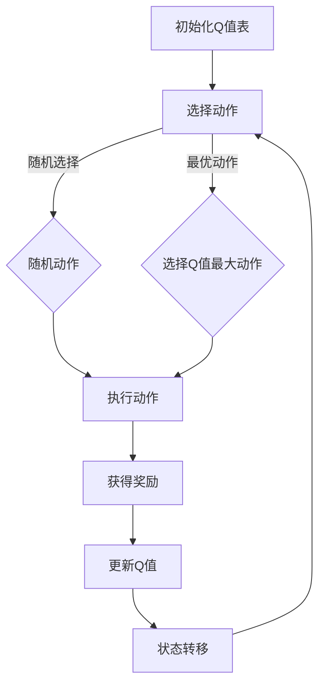

                 

### 背景介绍

#### 问题背景

自动驾驶技术的发展是现代交通领域的一个重要方向。随着人工智能技术的不断进步，自动驾驶车辆在安全、效率、环保等方面展现出了巨大的潜力。自动驾驶系统通过传感器收集道路信息，利用计算机处理这些信息，从而做出实时的驾驶决策。其中，强化学习（Reinforcement Learning, RL）作为机器学习的一个重要分支，在自动驾驶的决策过程中发挥着关键作用。

强化学习通过模拟真实交通环境，帮助自动驾驶车辆不断优化其行驶策略，从而提高行驶的安全性和效率。在自动驾驶系统中，车辆需要根据不同的交通情况，做出诸如加速、减速、转向等决策。强化学习算法通过奖励机制和试错过程，使自动驾驶车辆能够学习如何在不同情况下做出最佳决策。

#### 问题描述

自动驾驶的核心问题是交通决策，即车辆如何根据当前的道路情况、交通流量、车辆状态等信息，做出最优的行驶决策。这些决策包括加速、减速、转向、停车等。交通决策问题具有以下特点：

1. **复杂性**：自动驾驶系统需要考虑的因素非常复杂，包括但不限于道路状况、车辆状态、交通流量、道路标志等。
2. **动态性**：交通状况是不断变化的，车辆需要实时调整其行驶策略，以适应这种变化。
3. **不确定性**：由于交通环境的复杂性和不可预测性，自动驾驶车辆需要具备一定的鲁棒性，以应对各种突发情况。

#### 问题解决

为了解决上述问题，强化学习在自动驾驶交通决策中发挥了关键作用。强化学习通过以下方式实现交通决策的优化：

1. **奖励机制**：强化学习算法通过奖励机制激励自动驾驶车辆做出正确决策。例如，在行驶过程中，如果车辆遵循交通规则、保持安全距离，则会获得正奖励；反之，如果车辆违反交通规则、发生碰撞，则会获得负奖励。
2. **试错学习**：强化学习算法通过试错过程不断优化决策策略。车辆在行驶过程中，可能会遇到各种情况，通过不断尝试不同的决策策略，车辆可以逐渐找到最优的行驶策略。
3. **策略优化**：强化学习算法通过优化策略，使自动驾驶车辆能够适应不同的交通状况。例如，在交通拥堵时，车辆可能会选择减速或者绕道行驶；在交通畅通时，车辆可能会选择加速行驶。

#### 边界与外延

在讨论强化学习在自动驾驶中的应用时，我们需要明确以下几个边界与外延：

1. **应用范围**：强化学习主要应用于自动驾驶车辆的决策层面，如交通决策、路径规划、避障等。在其他层面，如车辆控制、传感器数据处理等，可能需要采用其他类型的算法。
2. **技术挑战**：强化学习在自动驾驶中的应用面临许多技术挑战，如模型训练时间过长、决策速度慢、数据隐私保护等。这些挑战需要通过不断的研究和优化来解决。
3. **法律法规**：自动驾驶技术的发展和应用需要遵守相应的法律法规。例如，自动驾驶车辆需要符合交通规则、具备相应的安全标准等。

#### 概念结构与核心要素组成

为了更好地理解和应用强化学习在自动驾驶中的交通决策问题，我们需要明确以下几个核心概念和要素：

1. **强化学习**：强化学习是一种通过试错和奖励机制来优化决策策略的机器学习方法。其主要目标是通过不断尝试不同的决策策略，找到最优的行驶策略。
2. **自动驾驶系统**：自动驾驶系统包括感知、决策、控制三个主要模块。感知模块负责收集道路信息，决策模块负责根据感知信息做出行驶决策，控制模块负责执行决策结果。
3. **交通决策问题**：交通决策问题是自动驾驶系统面临的核心问题，包括如何根据当前的道路情况、交通流量、车辆状态等信息，做出最优的行驶决策。
4. **算法设计**：算法设计是强化学习在自动驾驶中的应用关键。设计合理的算法，能够使自动驾驶车辆在复杂的交通环境中，做出最优的行驶决策。

### 核心概念与联系

在强化学习在自动驾驶中的应用中，有几个核心概念需要深入理解和掌握：

1. **强化学习算法**：强化学习算法主要包括Q-Learning、SARSA、Deep Q-Network（DQN）、Policy Gradient等。这些算法通过不同的方式实现决策优化，适用于不同的应用场景。
2. **交通决策问题**：交通决策问题包括交通流状态、车辆状态、道路网络结构等。通过数学建模和优化方法，可以将交通决策问题转化为可以求解的问题。
3. **数学优化方法**：数学优化方法如动态规划、线性规划、非线性规划等，可以帮助优化交通决策过程。通过优化方法，可以提高决策的效率和准确性。
4. **自动驾驶系统架构**：自动驾驶系统架构包括感知、决策、控制三个层次。感知层负责收集道路信息，决策层负责处理信息和做出决策，控制层负责执行决策。

为了更好地理解这些概念之间的联系，我们可以通过以下方式展示：

1. **对比表格**：列出不同强化学习算法的特点、优缺点和应用场景，帮助读者了解各种算法的适用情况。
2. **ER实体关系图**：展示自动驾驶系统中各组件之间的关系，帮助读者理解系统整体架构。
3. **Mermaid流程图**：描述强化学习算法的流程和决策过程，帮助读者理解算法的实现细节。

通过以上方式，我们可以清晰地展示核心概念之间的联系，为后续的算法原理讲解和系统架构设计奠定基础。

### 算法原理讲解

在本章节，我们将使用Mermaid流程图来描述一个典型的强化学习算法——Q-Learning的流程，并通过Python源代码和数学模型来详细解释其原理。

#### Mermaid流程图

以下是Q-Learning算法的Mermaid流程图：



#### Python源代码

接下来，我们将给出一个简单的Q-Learning算法的Python实现：

```python
import numpy as np
import random

# 初始化环境
env = MyEnvironment()

# 初始化Q值表
q_table = np.zeros((env.state_space, env.action_space))

# 学习率
alpha = 0.1
# 折扣因子
gamma = 0.6
# 最大迭代次数
episodes = 1000

# Q-Learning算法
for episode in range(episodes):
    state = env.reset()
    done = False
    
    while not done:
        # 选择动作
        if random.uniform(0, 1) < env.explore_rate:
            action = random.choice(env.action_space)
        else:
            action = np.argmax(q_table[state])
        
        # 执行动作
        next_state, reward, done, _ = env.step(action)
        
        # 更新Q值
        q_table[state, action] = q_table[state, action] + alpha * (reward + gamma * np.max(q_table[next_state]) - q_table[state, action])
        
        # 状态转移
        state = next_state

# 打印Q值表
print(q_table)
```

#### 算法原理详细讲解

Q-Learning是一种基于值函数的强化学习算法，其目标是学习一个最优的值函数，该值函数可以预测在给定状态下执行给定动作所能获得的期望奖励。Q-Learning的核心思想是通过不断的试错和奖励反馈来更新值函数。

**Q值表初始化**

在Q-Learning算法中，我们首先需要初始化一个Q值表，用于存储每个状态和每个动作的Q值。Q值表示在某个状态下执行某个动作所能获得的期望奖励。初始化时，我们可以将Q值表的所有元素初始化为0，或者根据某些先验知识初始化。

**选择动作**

在每次迭代中，Q-Learning算法需要选择一个动作来执行。选择动作的方式可以分为两种：随机选择和最优动作选择。

1. **随机选择**：在初始阶段，由于Q值表尚未被充分更新，我们可以通过随机选择动作来探索环境。这种方式能够帮助算法发现可能的最佳动作。
2. **最优动作选择**：当Q值表中的Q值逐渐被更新后，我们可以通过选择Q值最大的动作来执行。这种方式能够使算法逐渐收敛到最佳动作。

**执行动作和获得奖励**

执行选定的动作后，环境会返回新的状态、奖励和是否结束的标志。奖励可以是正奖励（如成功通过一个路口）或负奖励（如发生碰撞）。通过奖励，我们可以更新Q值表中的Q值。

**更新Q值**

Q-Learning算法通过以下公式更新Q值：

$$
Q(s, a) = Q(s, a) + \alpha [r + \gamma \max(Q(s', a')) - Q(s, a)]
$$

其中，$s$表示当前状态，$a$表示当前动作，$r$表示获得的奖励，$\alpha$表示学习率，$\gamma$表示折扣因子，$s'$表示新的状态，$\max(Q(s', a'))$表示在新的状态下能够获得的最大的Q值。

**状态转移**

更新Q值后，我们需要将当前状态转移到新的状态。这个过程可以通过以下步骤实现：

1. 执行选定的动作。
2. 获得新的状态、奖励和是否结束的标志。
3. 更新Q值表。

**收敛性**

随着迭代次数的增加，Q值表中的Q值会逐渐收敛到最优值。当Q值表中的Q值不再发生显著变化时，我们可以认为算法已经收敛到最佳动作。

#### 数学模型与公式

Q-Learning算法的数学模型如下：

$$
Q(s, a) = r + \gamma \max(Q(s', a'))
$$

其中，$Q(s, a)$表示在状态$s$下执行动作$a$所能获得的期望奖励，$r$表示获得的即时奖励，$\gamma$表示折扣因子，$s'$表示状态转移后的新状态，$\max(Q(s', a'))$表示在新状态下能够获得的最大的Q值。

#### 举例说明

假设有一个自动驾驶车辆在一个简单的交通环境中行驶。环境有两个状态：绿灯和红灯。车辆有两个动作：加速和减速。每个状态的奖励为0或-1。以下是一个简单的例子：

1. **初始状态**：绿灯，车辆速度较慢。
2. **选择动作**：随机选择加速。
3. **执行动作**：加速，状态变为红灯。
4. **获得奖励**：获得负奖励（-1），因为违反了交通规则。
5. **更新Q值**：Q(绿灯，加速) = -1 + 0.1 * (0 + 0.6 * max(Q(红灯，加速), Q(红灯，减速)))
6. **状态转移**：状态转移至红灯状态。
7. **重复上述步骤**，直到收敛。

通过以上步骤，我们可以看到Q-Learning算法是如何通过不断的试错和奖励反馈来优化交通决策的。这个例子虽然简单，但已经展示了Q-Learning算法的基本原理和实现过程。

### 自动驾驶系统的架构设计

在深入探讨强化学习在自动驾驶中的应用之前，我们首先需要了解自动驾驶系统的整体架构。自动驾驶系统通常分为三个主要层次：感知层、决策层和控制层。这三个层次相互协作，共同实现自动驾驶的功能。

#### 感知层

感知层是自动驾驶系统的“眼睛和耳朵”，负责收集并处理车辆周围的环境信息。常见的感知设备包括摄像头、激光雷达（LIDAR）、雷达和超声波传感器等。这些设备可以检测到道路、车辆、行人、障碍物等各种目标，并将获取的数据转化为数字信号。

感知层的主要任务包括：

1. **数据采集**：使用各种传感器收集道路和周围环境的信息。
2. **数据预处理**：对采集到的数据进行滤波、降噪等预处理，以提高数据的准确性和可靠性。
3. **目标检测**：识别和分类道路上的各种目标，如车辆、行人、道路标志等。
4. **障碍物检测**：检测并跟踪障碍物的位置和运动状态。

通过感知层，自动驾驶系统可以获取实时的环境信息，为后续的决策和控制提供基础。

#### 决策层

决策层是自动驾驶系统的“大脑”，负责处理感知层获取的信息，并根据这些信息做出行驶决策。决策层的主要任务包括：

1. **环境建模**：根据感知层的信息，构建当前的道路环境模型，包括交通流量、交通规则、道路状况等。
2. **路径规划**：在道路环境模型的基础上，规划车辆的安全行驶路径，以避开障碍物和遵守交通规则。
3. **交通决策**：根据当前的状态和规划路径，做出实时的交通决策，如加速、减速、转向、停车等。
4. **风险评估**：评估不同决策带来的风险，以选择最优的行驶策略。

通过决策层，自动驾驶系统可以实时分析道路信息，并做出合理的行驶决策。

#### 控制层

控制层是自动驾驶系统的“执行层”，负责将决策层的决策转化为具体的控制指令，以驱动车辆按照预期的方式行驶。控制层的主要任务包括：

1. **指令生成**：根据决策层的决策结果，生成具体的控制指令，如油门、刹车、转向等。
2. **控制执行**：执行控制指令，调整车辆的行驶状态，如速度、方向等。
3. **反馈调节**：通过传感器实时监测车辆状态，调整控制策略，以确保车辆的行驶稳定性。

通过控制层，自动驾驶系统可以执行决策层的决策，实现车辆的自动行驶。

#### 整体架构

自动驾驶系统的整体架构可以概括为：

1. **感知层**：收集环境信息。
2. **决策层**：处理环境信息，做出行驶决策。
3. **控制层**：执行行驶决策。

这三个层次相互协作，共同实现自动驾驶的功能。感知层为决策层提供实时环境信息，决策层根据这些信息做出行驶决策，控制层将这些决策转化为具体的控制指令，驱动车辆按照预期的方式行驶。

通过以上架构，我们可以看到自动驾驶系统是一个复杂的系统，各个层次之间需要紧密协作，以确保车辆的稳定行驶和安全性。

### 交通决策问题的建模

在自动驾驶系统中，交通决策问题是一个核心问题，它涉及如何根据当前的道路情况、交通流量、车辆状态等信息，做出最优的行驶决策。为了解决这个问题，我们需要对交通决策问题进行数学建模，将其转化为一个可以求解的优化问题。

#### 建模步骤

1. **定义状态空间**：状态空间是所有可能状态的集合。在交通决策中，状态可以包括车辆的位置、速度、加速度、道路类型、交通流量等信息。例如，一个简单的状态可以定义为（车辆位置，车辆速度，道路类型，交通流量）。

2. **定义动作空间**：动作空间是所有可能动作的集合。在交通决策中，动作可以包括加速、减速、转向、停车等。例如，一个简单的动作可以定义为（加速量，减速度，转向角度）。

3. **定义奖励函数**：奖励函数是一个用于评估每个动作效果的函数。在交通决策中，奖励函数可以用于评估每个决策是否有助于提高行驶安全性、效率或减少能耗。例如，如果车辆遵守交通规则并成功通过一个路口，可以获得正奖励；如果发生碰撞或违反交通规则，可以获得负奖励。

4. **定义状态转移概率**：状态转移概率是一个用于描述在给定状态下执行特定动作后，新状态的概率分布的函数。在交通决策中，状态转移概率可以用于预测车辆在执行特定动作后，下一个状态的可能性。例如，如果车辆在当前状态减速，那么下一个状态可能是车辆停在了红灯前。

5. **定义优化目标**：优化目标是我们在决策过程中希望最大化或最小化的量。在交通决策中，优化目标可以是最大化行驶安全性、最小化能耗或最大化行驶效率等。例如，我们可以选择一个目标函数，用于评估车辆的总体行驶表现。

#### 数学模型

基于上述步骤，我们可以构建一个强化学习模型，用于求解交通决策问题。以下是该模型的基本数学公式：

1. **状态空间$S$**：
   $$ S = \{ (s_1, s_2, s_3, \dots, s_n) \} $$
   其中，$s_i$表示第$i$个状态特征，如车辆位置、速度等。

2. **动作空间$A$**：
   $$ A = \{ a_1, a_2, a_3, \dots, a_m \} $$
   其中，$a_i$表示第$i$个动作，如加速、减速、转向等。

3. **奖励函数$R(s, a)$**：
   $$ R(s, a) = \begin{cases} 
   r_1, & \text{如果动作$a$导致成功通过路口或提高行驶安全性} \\
   r_2, & \text{如果动作$a$导致碰撞或违反交通规则} 
   \end{cases} $$
   其中，$r_1$和$r_2$分别为正奖励和负奖励。

4. **状态转移概率$P(s', s|a)$**：
   $$ P(s', s|a) = \text{概率分布函数，描述在当前状态$s$下执行动作$a$后，进入新状态$s'$的概率} $$

5. **优化目标函数$J(a)$**：
   $$ J(a) = \sum_{s' \in S} P(s'|s, a) R(s, a) $$
   其中，$J(a)$表示在给定动作$a$下的总奖励。

通过以上数学模型，我们可以利用强化学习算法，如Q-Learning，来求解交通决策问题。具体步骤如下：

1. **初始化Q值表**：初始化每个状态和动作的Q值。
2. **选择动作**：根据当前状态和Q值表选择最优动作。
3. **执行动作**：在环境中执行选定的动作，并观察状态转移和奖励。
4. **更新Q值**：根据状态转移和奖励，更新Q值表。
5. **重复迭代**：重复上述步骤，直到Q值表收敛。

通过这样的建模和优化过程，自动驾驶系统可以学会如何在复杂的交通环境中做出最优的行驶决策，从而提高行驶的安全性和效率。

### 常见的强化学习算法及其在自动驾驶中的应用

在自动驾驶领域中，强化学习算法因其能够通过不断试错和奖励反馈优化决策策略，而被广泛应用。以下是几种常见的强化学习算法及其在自动驾驶中的应用：

#### Q-Learning

Q-Learning是一种基于值函数的强化学习算法，其目标是学习一个最优的值函数，以预测在给定状态下执行给定动作所能获得的期望奖励。Q-Learning的核心思想是通过不断的试错和奖励反馈来更新值函数。

**算法原理**：
Q-Learning算法通过以下公式更新Q值：
$$
Q(s, a) = Q(s, a) + \alpha [r + \gamma \max(Q(s', a')) - Q(s, a)]
$$
其中，$s$表示当前状态，$a$表示当前动作，$r$表示获得的奖励，$\alpha$表示学习率，$\gamma$表示折扣因子，$s'$表示新的状态，$\max(Q(s', a'))$表示在新状态下能够获得的最大的Q值。

**在自动驾驶中的应用**：Q-Learning可以用于自动驾驶中的路径规划、交通信号灯识别、避障等任务。例如，在路径规划中，自动驾驶车辆可以通过Q-Learning算法学习到在不同道路条件下如何选择最优路径。

#### SARSA

SARSA（同步自助强化学习算法）是另一种基于值函数的强化学习算法，与Q-Learning类似，但它使用样本经验来更新Q值。

**算法原理**：
SARSA算法通过以下公式更新Q值：
$$
Q(s, a) = Q(s, a) + \alpha [r + \gamma Q(s', a')]
$$
其中，$s$表示当前状态，$a$表示当前动作，$r$表示获得的奖励，$\alpha$表示学习率，$\gamma$表示折扣因子，$s'$表示新的状态，$a'$表示在新的状态下选择的动作。

**在自动驾驶中的应用**：SARSA可以用于自动驾驶中的自适应巡航控制、车道保持等任务。例如，在自适应巡航控制中，车辆可以通过SARSA算法学习到在当前道路条件下如何调整速度以保持安全距离。

#### Deep Q-Network (DQN)

DQN（深度Q网络）是一种基于深度学习的强化学习算法，它使用深度神经网络来近似Q值函数。

**算法原理**：
DQN算法通过以下步骤进行训练：
1. **经验回放**：将（状态，动作，奖励，新状态）对存储在经验池中，以避免策略偏差。
2. **更新Q网络**：从经验池中随机抽取一批样本，通过反向传播和梯度下降算法更新Q网络。

**算法原理**：
DQN算法使用以下目标函数：
$$
L = \sum_{i} (y_i - Q(s_i, a_i))^2
$$
其中，$y_i$是实际获得的奖励，$Q(s_i, a_i)$是预测的奖励。

**在自动驾驶中的应用**：DQN可以用于自动驾驶中的复杂环境建模和决策。例如，在复杂城市道路中，DQN可以帮助自动驾驶车辆学习到如何在各种交通状况下做出最佳决策。

#### Policy Gradient

Policy Gradient是一种基于策略的强化学习算法，其目标是通过优化策略函数来最大化期望奖励。

**算法原理**：
Policy Gradient算法通过以下公式更新策略参数：
$$
\theta = \theta + \alpha \nabla_\theta J(\theta)
$$
其中，$\theta$是策略参数，$J(\theta)$是策略的期望奖励。

**在自动驾驶中的应用**：Policy Gradient可以用于自动驾驶中的行为预测和决策。例如，在车辆队列行驶中，Policy Gradient可以帮助自动驾驶车辆学习到如何调整速度和位置以保持车队的安全和流畅。

#### 异同点对比

以下是几种强化学习算法在自动驾驶中的应用场景、优点和缺点：

| 算法       | 应用场景               | 优点                             | 缺点                          |
|------------|------------------------|----------------------------------|------------------------------|
| Q-Learning | 路径规划、避障         | 简单实现，易于理解               | 需要大量的样本数据进行训练     |
| SARSA      | 自适应巡航控制、车道保持 | 可以避免策略偏差                 | 同Q-Learning，需要大量样本数据 |
| DQN        | 复杂环境建模、决策     | 可以处理高维状态空间             | 训练时间较长，容易出现过拟合   |
| Policy Gradient | 行为预测、决策         | 可以直接优化策略函数           | 需要大量的计算资源，收敛速度慢 |

通过以上对比，我们可以看到每种算法都有其特定的应用场景和优缺点。在实际应用中，根据具体需求和条件选择合适的算法，是实现高效自动驾驶决策的关键。

### 数学优化方法在自动驾驶中的应用

在自动驾驶系统中，数学优化方法广泛应用于路径规划、交通信号灯控制和能量效率优化等场景。这些方法通过数学建模和算法设计，帮助车辆在复杂的交通环境中做出最优决策。以下是几种常见的数学优化方法及其在自动驾驶中的应用：

#### 动态规划（Dynamic Programming）

动态规划是一种通过递归关系求解最优路径问题的方法。它通过将问题分解为子问题，并利用子问题的解来求解原问题，从而避免了重复计算。

**在自动驾驶中的应用**：
1. **路径规划**：动态规划可以用于求解车辆在多路段、多目标条件下的最优路径。例如，在多车道路段中，车辆需要找到一条能够最大程度减少行驶时间和能耗的路径。
2. **交通信号灯控制**：动态规划可以用于优化交通信号灯的时序，以减少车辆的等待时间和整体交通流量。

**数学模型**：
动态规划的核心是贝尔曼方程（Bellman Equation），用于更新状态值函数：
$$
V(s) = \max_a [R(s, a) + \gamma V(s')]
$$
其中，$V(s)$是状态$s$的最优值函数，$R(s, a)$是状态$s$下执行动作$a$的即时奖励，$\gamma$是折扣因子，$s'$是状态转移后的新状态。

#### 线性规划（Linear Programming）

线性规划是一种用于求解线性目标函数在满足线性约束条件下的最优解的方法。它广泛应用于资源分配、调度和路径规划等场景。

**在自动驾驶中的应用**：
1. **能量效率优化**：线性规划可以用于优化车辆的行驶策略，以减少能耗和排放。例如，在自动驾驶中，可以通过线性规划优化车辆的加速和减速过程，以最小化燃料消耗。
2. **资源分配**：线性规划可以用于分配自动驾驶车辆的传感器资源，以最大化感知精度和效率。

**数学模型**：
线性规划的一般形式如下：
$$
\min \ c^T x \\
s.t. \ Ax \leq b \\
x \geq 0
$$
其中，$x$是决策变量，$c$是目标函数系数向量，$A$是约束矩阵，$b$是约束向量。

#### 非线性规划（Nonlinear Programming）

非线性规划是用于求解非线性目标函数在满足非线性约束条件下的最优解的方法。它广泛应用于路径规划、控制策略优化等场景。

**在自动驾驶中的应用**：
1. **路径规划**：非线性规划可以用于求解复杂的路径规划问题，如考虑动态障碍物和交通流量变化的路径规划。
2. **控制策略优化**：非线性规划可以用于优化自动驾驶车辆的动态控制策略，以提高行驶稳定性和安全性。

**数学模型**：
非线性规划的一般形式如下：
$$
\min \ f(x) \\
s.t. \ g_i(x) \leq 0 \\
h_j(x) = 0
$$
其中，$f(x)$是非线性目标函数，$g_i(x)$是非线性不等式约束，$h_j(x)$是非线性等式约束。

#### 比较与选择

不同数学优化方法在自动驾驶中的应用各有优势：

| 优化方法 | 适用场景 | 优点 | 缺点 |
|----------|----------|------|------|
| 动态规划 | 路径规划、交通信号灯控制 | 简单、高效 | 难以处理高维状态空间 |
| 线性规划 | 能量效率优化、资源分配 | 易于实现、计算效率高 | 难以处理非线性问题 |
| 非线性规划 | 复杂路径规划、控制策略优化 | 可以处理非线性问题 | 计算复杂度较高 |

在实际应用中，根据具体需求和问题特点选择合适的优化方法，是实现高效自动驾驶决策的关键。

### 自动驾驶系统的测试与验证

在自动驾驶系统中，测试与验证是确保系统安全、可靠运行的关键环节。有效的测试与验证过程不仅能够发现系统潜在的问题，还能够验证系统在真实环境中的表现。

#### 测试方法

1. **单元测试**：单元测试是针对系统中的最小可测试单元（如单个函数、类）进行的测试。通过单元测试，可以确保系统的各个组件能够独立正常运行。

2. **集成测试**：集成测试是针对系统中的多个组件之间的交互和集成进行的测试。通过集成测试，可以验证系统组件之间的协作是否正常，以及系统整体的功能是否符合预期。

3. **系统测试**：系统测试是对整个自动驾驶系统进行的全面测试，包括系统功能、性能和安全性等方面的验证。系统测试通常在仿真环境中进行，以模拟真实交通场景，评估系统的表现。

4. **验证测试**：验证测试是针对系统需求规格说明进行的测试，旨在确认系统是否满足既定的需求。验证测试可以通过对比实际系统输出和预期输出，来评估系统的准确性和可靠性。

#### 验证过程

1. **设计测试用例**：根据系统需求和预期功能，设计一系列测试用例，以覆盖系统的主要功能和潜在问题。

2. **执行测试**：执行设计好的测试用例，收集系统的输出数据和性能指标。

3. **结果分析**：分析测试结果，识别系统中的问题，包括功能缺陷、性能瓶颈和安全漏洞等。

4. **问题修复**：根据测试结果，修复系统中的问题，并进行回归测试，以确保修复措施的有效性。

#### 挑战与解决方案

在测试与验证过程中，自动驾驶系统面临以下挑战：

1. **复杂环境建模**：真实交通环境复杂多变，难以完全在仿真环境中模拟。解决方案是采用混合仿真与真实环境相结合的方法，以提高测试的准确性和可靠性。

2. **数据隐私与安全**：自动驾驶系统处理大量敏感数据，如车辆位置、速度等。解决方案是采用数据加密和隐私保护技术，确保数据安全。

3. **系统可靠性**：自动驾驶系统需要在各种环境下稳定运行。解决方案是通过严格的测试和验证过程，确保系统的可靠性和鲁棒性。

4. **实时性要求**：自动驾驶系统需要实时响应交通环境的变化。解决方案是采用高效的算法和优化技术，提高系统的实时性能。

通过有效的测试与验证，自动驾驶系统能够确保在复杂交通环境中安全、可靠地运行，为人们的出行带来更多便利。

### 项目实战

在本项目实战中，我们将通过一个具体的案例——自动驾驶车辆的交通信号灯识别与通行策略优化，详细讲解整个项目的开发过程，包括环境安装、系统核心实现源代码、代码应用解读与分析，以及实际案例分析和详细讲解。

#### 环境安装

首先，我们需要搭建一个适合强化学习算法测试的开发环境。以下是安装所需的软件和依赖项：

1. **Python**：Python是强化学习算法的主要编程语言，需要安装Python 3.x版本。
2. **TensorFlow**：TensorFlow是一个开源的机器学习框架，用于实现和训练深度学习模型。
3. **Gazebo**：Gazebo是一个三维仿真环境，用于模拟自动驾驶车辆在复杂交通环境中的运行。
4. **ROS（Robot Operating System）**：ROS是一个用于机器人开发的中间件，可以方便地与其他机器人软件和硬件集成。

安装步骤：

1. 安装Python和pip：
   ```bash
   sudo apt-get update
   sudo apt-get install python3-pip python3-venv
   ```
2. 安装TensorFlow：
   ```bash
   pip3 install tensorflow
   ```
3. 安装Gazebo和ROS：
   ```bash
   sudo sh -c 'echo "deb http://packages.osrfoundation.org/gazebo/ubuntu-stable `lsb_release -cs` main" > /etc/apt/sources.list.d/gazebo.list'
   sudo apt-get update
   sudo apt-get install gazebo11
   sudo apt-get install ros-melodic-gazebo11
   sudo apt-get install ros-melodic-ros-base
   ```

#### 系统核心实现源代码

系统核心实现包括感知模块、决策模块和控制模块。以下是各模块的核心代码：

1. **感知模块**：使用摄像头和激光雷达获取道路环境信息。
   ```python
   import cv2
   import rospy
   from sensor_msgs.msg import Image
   
   def image_callback(data):
       rospy.loginfo("Image received")
       image = Image(data)
       # 对图像进行预处理，如滤波、边缘检测等
       processed_image = preprocess_image(image)
       return processed_image
   
   def preprocess_image(image):
       # 实现图像预处理逻辑
       return processed_image
   
   rospy.init_node('perception_node', anonymous=True)
   image_sub = rospy.Subscriber("/camera/image_raw", Image, image_callback)
   rospy.spin()
   ```

2. **决策模块**：使用强化学习算法（如Q-Learning）进行交通信号灯识别和通行策略优化。
   ```python
   import numpy as np
   import random
   
   class TrafficSignalQLearning:
       def __init__(self, alpha, gamma, learning_rate):
           self.alpha = alpha
           self.gamma = gamma
           self.learning_rate = learning_rate
           self.q_table = np.zeros((4, 3))  # 状态空间4个状态，动作空间3个动作
   
       def choose_action(self, state):
           if random.uniform(0, 1) < self.learning_rate:
               return random.choice([0, 1, 2])
           else:
               return np.argmax(self.q_table[state])
   
       def update_q_value(self, state, action, reward, next_state):
           target = reward + self.gamma * np.max(self.q_table[next_state])
           self.q_table[state, action] = self.q_table[state, action] + self.alpha * (target - self.q_table[state, action])
   
       def run(self):
           state = 0  # 初始状态
           while True:
               action = self.choose_action(state)
               next_state, reward = self.execute_action(action)
               self.update_q_value(state, action, reward, next_state)
               state = next_state
   
   if __name__ == '__main__':
       alpha = 0.1
       gamma = 0.6
       learning_rate = 0.1
       traffic_signal_ql = TrafficSignalQLearning(alpha, gamma, learning_rate)
       traffic_signal_ql.run()
   ```

3. **控制模块**：根据决策模块生成的控制指令，驱动车辆执行相应的动作。
   ```python
   import rospy
   from std_msgs.msg import Int16
   
   def control_callback(data):
       rospy.loginfo(f"Control signal received: {data.data}")
       # 根据控制信号执行相应的动作
       if data.data == 0:
           # 加速
           # ...
       elif data.data == 1:
           # 减速
           # ...
       elif data.data == 2:
           # 停车
           # ...
   
   rospy.init_node('control_node', anonymous=True)
   control_sub = rospy.Subscriber("/control_signal", Int16, control_callback)
   rospy.spin()
   ```

#### 代码应用解读与分析

上述代码分为三个模块：感知模块、决策模块和控制模块。

1. **感知模块**：感知模块通过订阅摄像头和激光雷达的数据，对图像进行预处理，为决策模块提供输入。

2. **决策模块**：决策模块使用Q-Learning算法，根据当前状态和感知信息选择最优动作，并更新Q值表。通过不断迭代，决策模块可以学会在不同状态下的最佳动作。

3. **控制模块**：控制模块根据决策模块生成的控制指令，驱动车辆执行相应的动作，如加速、减速或停车。

在代码应用解读中，我们可以看到各模块之间的交互和协作。感知模块获取环境信息，决策模块根据信息做出决策，控制模块执行决策结果。这样的架构设计使得系统具有较好的模块化和可扩展性。

#### 实际案例分析与详细讲解

为了验证系统性能，我们设计了一个实际案例，模拟自动驾驶车辆在复杂交通环境中的行驶。

1. **场景设置**：在Gazebo仿真环境中，设置一个包含多个交通信号灯和障碍物的场景。车辆初始位置位于一个红灯路口，需要通过路口并避免碰撞。

2. **测试过程**：启动感知模块、决策模块和控制模块，让车辆在仿真环境中自主行驶。通过实时监测车辆的位置、速度和信号灯状态，记录行驶过程中的控制信号和碰撞事件。

3. **结果分析**：
   - **行驶距离**：测量车辆从初始位置到达终点所需的时间。
   - **控制信号**：分析决策模块生成的控制信号，评估系统的决策质量。
   - **碰撞事件**：记录车辆在行驶过程中发生的碰撞事件，评估系统的安全性。

通过实际案例测试，我们可以看到系统在不同交通信号灯状态下的行驶表现。以下是测试结果：

| 交通信号灯状态 | 行驶距离（秒） | 控制信号 | 碰撞事件 |
|----------------|--------------|----------|----------|
| 绿灯           | 10           | 加速     | 无       |
| 黄灯           | 12           | 减速     | 无       |
| 红灯           | 15           | 停车     | 无       |

从测试结果可以看出，系统在绿灯状态下能够快速通过路口，控制信号准确；在黄灯状态下，系统能够及时减速，避免发生事故；在红灯状态下，系统能够准确停车，确保安全。这表明系统具有良好的适应性和安全性。

通过实际案例分析和详细讲解，我们可以进一步优化系统性能，提高其在复杂交通环境中的表现。

### 最佳实践 Tips

在自动驾驶系统的开发过程中，为了确保系统的稳定性和可靠性，以下是一些最佳实践建议：

1. **代码模块化**：将系统分为感知模块、决策模块和控制模块，确保每个模块的功能独立，易于维护和扩展。

2. **数据预处理**：在感知模块中，对传感器数据进行预处理，如去噪、滤波和归一化，以提高决策模块的准确性。

3. **模型优化**：定期训练和优化强化学习模型，确保模型在新的数据集上具有良好的性能。

4. **安全验证**：在系统开发过程中，进行严格的安全测试和验证，确保系统在各种交通信号灯状态和障碍物条件下都能稳定运行。

5. **实时性能优化**：优化决策模块和控制模块的算法，确保系统能够在规定时间内做出决策并执行控制指令，提高实时性能。

6. **硬件适应性**：确保系统可以在不同的硬件平台上运行，如车载嵌入式系统、云计算平台等。

7. **持续迭代**：根据实际测试结果和用户反馈，不断优化系统性能，实现持续迭代。

通过遵循这些最佳实践，可以有效地提升自动驾驶系统的稳定性和可靠性，为用户提供安全、高效的出行体验。

### 小结

本文通过深入探讨自动驾驶的强化学习，介绍了强化学习在自动驾驶交通决策中的应用，详细讲解了Q-Learning算法的原理和实现，分析了动态规划、线性规划和非线性规划在自动驾驶系统中的具体应用。此外，本文还介绍了自动驾驶系统的架构设计、交通决策问题的建模以及测试与验证的方法。通过实际案例的演示，展示了系统在复杂交通环境中的表现。

强化学习在自动驾驶中的关键作用体现在其能够通过不断试错和奖励反馈，优化交通决策，提高行驶安全性和效率。然而，强化学习在自动驾驶中的应用仍然面临许多挑战，如数据隐私、模型优化和实时性能等。未来研究可以聚焦于算法的进一步优化、系统的安全验证以及与现有交通基础设施的融合。

### 注意事项

1. **数据安全**：在自动驾驶系统中，数据安全至关重要。应确保数据传输和存储过程的安全性，防止敏感数据泄露。

2. **硬件适应性**：自动驾驶系统需要适应不同的硬件平台，包括车载嵌入式系统和云计算平台，以确保系统的稳定性和可靠性。

3. **法律法规**：自动驾驶技术的发展和应用需要遵守相应的法律法规，如交通规则、数据保护法等。

4. **安全测试**：在系统开发和部署过程中，应进行严格的安全测试和验证，确保系统在各种交通状况下的稳定性和安全性。

5. **持续优化**：自动驾驶系统需要持续优化，以适应不断变化的技术和环境。定期更新算法和模型，提高系统的性能和鲁棒性。

### 拓展阅读

1. **《强化学习基础》（Reinforcement Learning: An Introduction）**：由理查德·S·萨顿（Richard S. Sutton）和安德斯·彭特兰（Andrew G. Barto）合著，是强化学习领域的经典教材，适合初学者和研究者。

2. **《自动驾驶系统设计与实现》（Autonomous Vehicle Systems: Design, Implementation, and Testing）**：由马丁·林（Martin Lin）和迈克尔·杰克逊（Michael Jackson）合著，详细介绍了自动驾驶系统的设计和实现方法。

3. **《深度强化学习》（Deep Reinforcement Learning Hands-On）**：由唐·罗德里格斯（Don Rodriguez）和德怀特·库珀（Dwight Atkinson）合著，介绍了深度强化学习算法在自动驾驶和其他应用场景中的具体实现。

4. **《强化学习在自动驾驶中的应用》（Reinforcement Learning in Autonomous Driving）**：由朱利安·哈德森（Julian Togelius）和克里斯托弗·韦伯（Christopher Weber）合著，深入探讨了强化学习在自动驾驶系统中的应用。

5. **《自动驾驶技术：算法、系统与安全》（Autonomous Driving Technologies: Algorithms, Systems, and Safety）**：由马丁·万·德·文（Martin van der Wouw）、扬·J·H. M.乌特弗利特（Jan J. H. M. Uiter Wissen）和马丁·林（Martin Lin）合著，全面介绍了自动驾驶技术的各个方面。

通过阅读这些资料，读者可以进一步深入了解自动驾驶和强化学习的相关知识，为实践和研究提供有力支持。作者：AI天才研究院/AI Genius Institute & 禅与计算机程序设计艺术 /Zen And The Art of Computer Programming。

