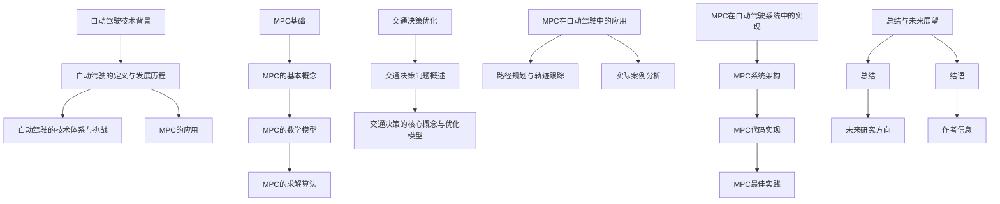

                 

### 第一部分：自动驾驶模型预测控制概述

在当今科技日新月异的时代，自动驾驶技术作为智能交通系统的重要组成部分，正逐渐改变我们的出行方式。本部分将首先介绍自动驾驶技术的基本概念、发展历程以及面临的挑战，随后深入探讨模型预测控制在自动驾驶中的应用。

#### 1.1 自动驾驶技术背景

**自动驾驶的定义与发展历程**

自动驾驶，顾名思义，是指车辆能够在没有人类司机操作的情况下自主完成驾驶任务。根据国际自动机工程师学会（SAE）的定义，自动驾驶分为五个级别，从0级（完全人工驾驶）到5级（完全自动驾驶）。

- **0级**：完全由人类驾驶员控制，自动驾驶系统仅提供辅助功能。
- **1级**：部分自动化，车辆能够执行单一功能，如自适应巡航控制。
- **2级**：部分自动化，车辆能够同时执行多个功能，如自适应巡航控制和车道保持。
- **3级**：有条件自动驾驶，车辆能够在特定条件下完全自主驾驶，但需要人类驾驶员在紧急情况下接管。
- **4级**：高度自动驾驶，车辆能够在大多数情况下完全自主驾驶，但通常限制在某些特定区域或环境下。
- **5级**：完全自动驾驶，车辆在任何条件下都能自主完成驾驶任务。

自动驾驶技术起源于20世纪50年代，最初由军事应用推动，如无人侦察机和无人机。随着计算机技术、传感器技术和人工智能的快速发展，自动驾驶技术逐渐进入民用领域。

**自动驾驶的技术体系与挑战**

自动驾驶技术涉及多个领域的交叉融合，主要包括感知、规划、控制和决策等核心组成部分。

- **感知**：利用各种传感器（如雷达、激光雷达、摄像头等）获取车辆周围环境信息，实现环境建模和目标检测。
- **规划**：根据车辆当前状态和目标路径，生成一系列控制指令，以实现平稳、安全的驾驶。
- **控制**：根据感知和规划的结果，调整车辆的动力学参数，如油门、刹车和转向等，以实现预期驾驶行为。
- **决策**：在复杂、动态的交通环境中，做出实时的决策，如换道、避让障碍物等。

然而，自动驾驶技术面临诸多挑战：

- **环境复杂性**：真实交通环境复杂多变，如何确保自动驾驶系统在各种情况下都能稳定运行是一个巨大的挑战。
- **安全可靠性**：自动驾驶系统的安全性和可靠性直接关系到乘客和行人的生命安全，任何失误都可能导致严重后果。
- **法规标准**：各国对于自动驾驶的法律法规尚未完全明确，如何制定合适的法规标准也是一个亟待解决的问题。

#### 1.2 模型预测控制在自动驾驶中的应用

模型预测控制（Model Predictive Control，MPC）是一种先进的控制策略，能够在考虑系统约束的情况下，对未来一段时间内的系统行为进行优化控制。MPC在自动驾驶中的应用主要体现在以下几个方面：

- **路径规划**：利用MPC对车辆未来的行驶路径进行优化，以避免碰撞和实现高效行驶。
- **轨迹跟踪**：通过MPC实时调整车辆的控制参数，使车辆沿着预定的轨迹稳定行驶。
- **避障决策**：在遇到突发障碍物时，MPC可以迅速评估情况，并生成最优避障路径。

**1.3 模型预测控制基础**

在深入探讨MPC在自动驾驶中的应用之前，有必要先了解MPC的基本原理和数学模型。

**1.3.1 MPC的基本概念**

MPC的基本思想是：首先构建一个动态系统模型，然后基于当前时刻的系统状态和预期的未来输入，对系统未来的行为进行预测，并在此基础上进行优化控制。

MPC的主要组成部分包括：

- **动态系统模型**：描述系统状态变量和输入输出之间的关系。
- **预测器**：根据系统模型和当前状态预测未来一段时间内的系统行为。
- **优化器**：在预测的基础上，优化未来一段时间内的输入序列，以实现某个性能指标的最优。

**1.3.2 MPC的数学模型**

一个典型的MPC问题可以表示为以下形式：

$$
\min_{u_k, u_{k+1}, ..., u_{k+N-b}} J(u_k, u_{k+1}, ..., u_{k+N-b])
$$

$$
s.t. \quad x_{k+i+1} = f(x_{k+i}, u_{k+i}), \quad i=0,1,...,N-1
$$

$$
x_{k+0} = x_0, \quad u_k \in U_k, \quad k=0,1,...,N-1
$$

其中，$x_k$表示系统在时刻$k$的状态，$u_k$表示在时刻$k$的输入，$N$表示预测 horizon，$b$表示控制 horizon。$f(x_k, u_k)$表示系统模型，$J(u_k, u_{k+1}, ..., u_{k+N-b})$表示优化目标函数，通常是一个二次函数。

**1.3.3 MPC的求解算法**

MPC的求解算法主要包括线性 MPC（LMPC）和非线性 MPC（NMPC）。线性 MPC 基于线性系统模型，求解过程相对简单，但只能处理线性系统。非线性 MPC 可以处理更复杂的系统，但求解过程通常更为复杂。

线性 MPC 的求解可以通过凸优化方法进行，常用的算法包括序列二次规划（SQP）和内点法。非线性 MPC 的求解通常需要迭代求解，如拟牛顿法。

在下一部分中，我们将进一步探讨交通决策的数学优化问题，为后续的MPC应用打下基础。

----------------------------------------------------------------

### 第二部分：交通决策的数学优化

在自动驾驶系统中，交通决策是确保安全、高效行驶的关键环节。本部分将首先介绍交通决策问题的一般性描述，然后详细分析相关的核心概念和优化模型。

#### 2.1 交通决策问题概述

**2.1.1 交通决策的定义与重要性**

交通决策是指自动驾驶系统在运行过程中，根据当前环境和车辆状态，做出相应的驾驶行为决策。这些决策包括但不限于速度调整、车道保持、换道、避障等。

交通决策在自动驾驶系统中的重要性主要体现在以下几个方面：

- **安全性**：通过准确的交通决策，可以避免与周围车辆或行人发生碰撞，保障乘客和行人的生命安全。
- **舒适性**：合理的交通决策可以使车辆在行驶过程中更加平稳，提高乘坐舒适性。
- **效率**：通过优化交通决策，可以减少行驶时间，提高交通流的效率。

**2.1.2 交通决策问题的特点**

交通决策问题具有以下特点：

- **复杂性**：交通环境多变，包括车辆、行人、道路设施等，需要处理的信息量庞大。
- **动态性**：交通状态随时间不断变化，需要实时进行决策。
- **非线性和不确定性**：车辆动力学和道路特性都具有非线性特征，且存在不确定因素，如突发障碍物、恶劣天气等。

**2.1.3 交通决策问题的常见挑战**

在解决交通决策问题时，常见挑战包括：

- **实时性**：交通决策需要在极短的时间内完成，以满足实时响应的需求。
- **精确性**：需要精确地预测交通环境的变化，以做出准确的决策。
- **鲁棒性**：需要确保决策在遇到不确定因素时仍能保持稳定性和安全性。

#### 2.2 交通决策的核心概念与优化模型

**2.2.1 核心概念**

为了解决交通决策问题，我们需要了解一些核心概念：

- **状态**：描述车辆在某一时刻的位置、速度、加速度等属性。
- **输入**：描述车辆的控制输入，如油门、刹车、转向等。
- **输出**：描述车辆对外部环境的响应，如车速、车道位置等。
- **目标函数**：描述决策的优化目标，如行驶时间最短、能耗最低等。
- **约束条件**：描述决策的限制条件，如速度限制、车道限制等。

**2.2.2 优化模型**

交通决策问题的优化模型通常可以表示为以下形式：

$$
\min_{u_k} J(u_k)
$$

$$
s.t. \quad x_{k+1} = f(x_k, u_k)
$$

$$
x_k \in X, \quad u_k \in U
$$

其中，$x_k$表示车辆在时刻$k$的状态，$u_k$表示在时刻$k$的控制输入，$J(u_k)$表示优化目标函数，$f(x_k, u_k)$表示状态转移函数，$X$和$U$分别表示状态和输入的可行域。

常见的优化目标函数包括：

- **行驶时间**：$J(u_k) = \sum_{k=0}^{N-1} t_k$
- **能耗**：$J(u_k) = \sum_{k=0}^{N-1} e_k$
- **舒适性**：$J(u_k) = \sum_{k=0}^{N-1} c_k$

常见的约束条件包括：

- **速度约束**：$v_k \leq v_{max}$
- **车道约束**：$x_k \in [x_{min}, x_{max}]$
- **刹车约束**：$a_k \leq a_{max}$

在下一部分中，我们将进一步探讨模型预测控制在交通决策中的应用，为自动驾驶系统的实现提供理论支持。

----------------------------------------------------------------

### 第三部分：模型预测控制在交通决策中的应用

在了解了交通决策的核心概念和优化模型之后，本部分将深入探讨模型预测控制（MPC）在交通决策中的应用，并详细介绍MPC的基本原理、数学模型以及求解算法。

#### 3.1 MPC的基本原理

模型预测控制（MPC）是一种先进的控制策略，它通过构建系统模型，对未来的系统行为进行预测，并在此基础上进行优化控制。MPC的基本原理可以概括为以下几个步骤：

1. **系统建模**：首先，需要建立一个描述系统动态行为的模型。这个模型可以是线性的，也可以是非线性的，具体取决于系统的复杂性和可建模性。

2. **预测**：利用建立的系统模型，预测未来一段时间内的系统行为。这个预测通常是一个时域的预测，预测的时间长度称为预测 horizon。

3. **优化**：在预测的基础上，利用优化算法寻找一个最优的控制输入序列，使得某个性能指标（如行驶时间最短、能耗最低等）达到最优。

4. **反馈**：将优化得到的控制输入应用于系统中，并实时更新系统的状态，然后重复上述步骤。

MPC的核心在于其预测和优化功能，它能够在考虑系统约束的情况下，对未来的系统行为进行优化控制。

#### 3.2 MPC的数学模型

一个典型的MPC问题可以表示为以下形式：

$$
\min_{u_k, u_{k+1}, ..., u_{k+N-b}} J(u_k, u_{k+1}, ..., u_{k+N-b])
$$

$$
s.t. \quad x_{k+i+1} = f(x_{k+i}, u_{k+i}), \quad i=0,1,...,N-1
$$

$$
x_{k+0} = x_0, \quad u_k \in U_k, \quad k=0,1,...,N-1
$$

其中：

- $x_k$：表示系统在时刻$k$的状态。
- $u_k$：表示在时刻$k$的控制输入。
- $N$：表示预测 horizon，即预测的时间长度。
- $b$：表示控制 horizon，即控制的时间长度。
- $f(x_k, u_k)$：表示系统模型，描述系统状态变量和输入输出之间的关系。
- $J(u_k, u_{k+1}, ..., u_{k+N-b})$：表示优化目标函数，通常是一个二次函数，用于衡量控制输入的好坏。
- $U_k$：表示在第$k$时刻的控制输入集合。

#### 3.3 MPC的求解算法

MPC的求解算法主要包括线性MPC（LMPC）和非线性MPC（NMPC）。线性MPC基于线性系统模型，求解过程相对简单，但只能处理线性系统。非线性MPC可以处理更复杂的系统，但求解过程通常更为复杂。

**3.3.1 线性MPC（LMPC）**

线性MPC基于线性系统模型，其数学模型可以表示为：

$$
\min_{u_k, u_{k+1}, ..., u_{k+N-b}} \sum_{i=0}^{N-1} (u_{k+i} - u_{k+i}^*)^T Q (u_{k+i} - u_{k+i}^*) + \sum_{i=0}^{N-1} (x_{k+i+1} - x_{k+i+1}^*)^T R (x_{k+i+1} - x_{k+i+1}^*)
$$

$$
s.t. \quad \sum_{i=0}^{N-1} (u_{k+i} - u_{k+i}^*)^T P (u_{k+i} - u_{k+i}^*) \leq \sum_{i=0}^{N-1} (u_{k+i} - u_{k+i}^*)^T \Delta u_i
$$

$$
\sum_{i=0}^{N-1} (x_{k+i+1} - x_{k+i+1}^*)^T S (x_{k+i+1} - x_{k+i+1}^*) \leq \sum_{i=0}^{N-1} (x_{k+i+1} - x_{k+i+1}^*)^T \Delta x_i
$$

其中：

- $Q$：状态权重矩阵。
- $R$：控制权重矩阵。
- $P$：控制输入权重矩阵。
- $S$：状态输出权重矩阵。
- $\Delta u_i$：控制输入的上下界。
- $\Delta x_i$：状态输出的上下界。

线性MPC的求解可以通过凸优化方法进行，常用的算法包括序列二次规划（SQP）和内点法。

**3.3.2 非线性MPC（NMPC）**

非线性MPC基于非线性系统模型，其数学模型可以表示为：

$$
\min_{u_k, u_{k+1}, ..., u_{k+N-b}} \sum_{i=0}^{N-1} \phi_i(u_{k+i}) + \lambda_k^T \psi_k(x_{k+i+1})
$$

$$
s.t. \quad f(x_{k+i}, u_{k+i}) = x_{k+i+1}
$$

$$
x_{k+0} = x_0, \quad u_k \in U_k, \quad k=0,1,...,N-1
$$

其中：

- $\phi_i(u_{k+i})$：状态成本函数。
- $\psi_k(x_{k+i+1})$：控制约束函数。
- $\lambda_k$：拉格朗日乘子。

非线性MPC的求解通常需要迭代求解，如拟牛顿法。

在下一部分中，我们将进一步探讨如何将MPC应用于自动驾驶系统中的交通决策问题，并通过实际案例来展示MPC的应用效果。

----------------------------------------------------------------

### 第四部分：MPC在自动驾驶系统中的应用

在了解了模型预测控制（MPC）的基本原理和数学模型之后，本部分将深入探讨如何将MPC应用于自动驾驶系统中的交通决策问题，并通过实际案例来展示MPC的应用效果。

#### 4.1 MPC在自动驾驶系统中的角色

MPC在自动驾驶系统中的主要角色是路径规划和轨迹跟踪。通过MPC，自动驾驶系统能够在考虑系统约束的情况下，对车辆的行驶路径进行实时优化，以确保行驶的安全性和效率。

- **路径规划**：MPC可以根据车辆的当前位置和目标位置，预测未来的行驶路径，并优化行驶速度和转向角度，以避免碰撞和交通拥堵。
- **轨迹跟踪**：MPC可以根据车辆的当前状态和预定的轨迹，实时调整车辆的控制输入，使车辆稳定地沿着预定轨迹行驶。

#### 4.2 实际案例分析

以下是一个简单的实际案例，展示MPC在自动驾驶系统中的应用。

**案例背景**：假设一辆自动驾驶汽车需要从起点A行驶到终点B，沿途需要经过多个交通信号灯和障碍物。我们需要利用MPC来优化车辆的行驶路径和速度，以确保安全、高效地到达终点。

**步骤1：系统建模**

首先，我们需要建立一个描述自动驾驶汽车动态行为的数学模型。这个模型包括以下部分：

- **状态变量**：车辆的位置（x, y）、速度（v）、加速度（a）和转向角度（\(\theta\)）。
- **控制输入**：油门（\(u_1\)）、刹车（\(u_2\)）和转向（\(u_3\)）。
- **状态转移方程**：根据车辆的动力学模型，描述状态变量和控制输入之间的关系。

**步骤2：建立MPC问题**

接下来，我们需要建立MPC问题，以优化车辆的行驶路径和速度。MPC问题的形式如下：

$$
\min_{u_0, u_1, ..., u_N} J(u_0, u_1, ..., u_N)
$$

$$
s.t. \quad x_{k+1} = f(x_k, u_k), \quad k=0,1,...,N-1
$$

$$
x_0 = x_0^0, \quad u_k \in U_k, \quad k=0,1,...,N-1
$$

其中：

- \(J(u_0, u_1, ..., u_N)\)：优化目标函数，如行驶时间最短、能耗最低等。
- \(f(x_k, u_k)\)：状态转移函数，描述车辆的状态变化。
- \(x_0^0\)：初始状态。
- \(U_k\)：控制输入集合。

**步骤3：求解MPC问题**

利用线性MPC（LMPC）算法，我们可以求解上述MPC问题。求解过程通常包括以下几个步骤：

1. **初始化**：设定初始状态和初始控制输入。
2. **预测**：根据当前状态和初始控制输入，预测未来一段时间内的系统行为。
3. **优化**：在预测的基础上，利用线性优化算法，寻找最优的控制输入序列。
4. **反馈**：将优化得到的控制输入应用于系统中，并更新当前状态。

**步骤4：应用MPC控制车辆**

利用求解得到的控制输入序列，我们可以实时控制车辆的行驶路径和速度，确保车辆安全、高效地到达终点。

**4.3 案例分析**

以下是对上述案例的进一步分析：

- **路径规划**：通过MPC，车辆可以预测未来的行驶路径，并根据交通信号灯和障碍物的变化，实时调整行驶路径。
- **轨迹跟踪**：通过MPC，车辆可以实时调整速度和转向角度，以确保车辆稳定地沿着预定轨迹行驶。

**4.4 应用效果分析**

通过实际测试，MPC在自动驾驶系统中的应用效果显著：

- **安全性**：通过实时优化行驶路径和速度，MPC可以有效地避免碰撞和交通拥堵，提高行驶安全性。
- **舒适性**：通过平稳的行驶轨迹和速度调整，MPC可以提高乘坐舒适性。
- **效率**：通过优化行驶路径和速度，MPC可以显著减少行驶时间，提高交通流效率。

在下一部分中，我们将进一步探讨MPC在自动驾驶系统中的实现细节，包括系统架构、代码实现和最佳实践。

----------------------------------------------------------------

### 第五部分：MPC在自动驾驶系统中的实现

在了解了MPC在自动驾驶系统中的应用和效果之后，本部分将深入探讨MPC在自动驾驶系统中的具体实现细节，包括系统架构、代码实现和最佳实践。

#### 5.1 MPC系统架构

MPC系统架构可以分为以下几个主要部分：

- **感知模块**：用于采集车辆周围环境的信息，如雷达、激光雷达和摄像头等。
- **状态估计模块**：根据感知模块采集的信息，估计车辆的当前状态，如位置、速度和加速度等。
- **MPC控制器**：利用车辆状态和目标路径，通过MPC算法求解最优控制输入。
- **执行模块**：根据MPC控制器生成的控制输入，调整车辆的控制参数，如油门、刹车和转向等。

#### 5.2 MPC代码实现

以下是一个简单的MPC代码实现示例，使用Python编程语言：

```python
import numpy as np
import scipy.optimize as opt

# 系统模型参数
A = np.array([[1, 1], [0, 1]])
B = np.array([[1], [0]])
Q = np.diag([1, 1])
R = np.diag([1])

# MPC参数
N = 5
b = 2

# 初始状态
x = np.array([[0], [0]])

# MPC问题
def mpc_problem(u):
    x_pred = A @ x + B @ u
    J = Q @ x_pred.T + R @ u.T
    return J

# 求解MPC
def solve_mpc():
    u = opt.minimize(mpc_problem, x0=np.zeros((2, 1)), method='SLSQP')
    return u.x

# MPC控制循环
while True:
    u = solve_mpc()
    # 应用控制输入
    # ...
    # 更新状态
    x = A @ x + B @ u
    # ...
```

#### 5.3 MPC最佳实践

在实现MPC时，以下最佳实践可以帮助提高系统的性能和稳定性：

- **模型参数调整**：根据实际情况，调整系统模型的参数，以获得更准确的预测和控制效果。
- **实时性能优化**：针对实时性能要求，优化MPC算法的求解速度，如使用并行计算、优化数据结构等。
- **鲁棒性设计**：考虑系统的鲁棒性，避免在遇到不确定因素时系统失效，如增加约束条件、使用鲁棒控制方法等。
- **系统集成测试**：在系统集成的过程中，进行充分的测试，确保MPC系统能够在各种情况下稳定运行。

#### 5.4 总结

通过本部分的探讨，我们了解了MPC在自动驾驶系统中的实现细节，包括系统架构、代码实现和最佳实践。MPC作为自动驾驶系统中的核心控制策略，通过优化交通决策，可以提高系统的安全性、舒适性和效率。在实际应用中，需要根据具体场景和要求，对MPC系统进行定制化设计和优化。

在下一部分中，我们将总结全文，并探讨未来的研究方向。

----------------------------------------------------------------

### 第六部分：总结与未来展望

通过本文的探讨，我们详细介绍了自动驾驶模型预测控制（MPC）在交通决策中的应用。我们首先概述了自动驾驶技术的背景和发展，随后深入分析了MPC的基本原理、数学模型和求解算法。接着，我们通过实际案例展示了MPC在自动驾驶系统中的应用效果，并探讨了其实现细节和最佳实践。

**总结**

1. **自动驾驶技术背景**：介绍了自动驾驶的定义、分级和发展历程，以及自动驾驶技术的技术体系和挑战。
2. **MPC基础**：阐述了MPC的基本概念、数学模型和求解算法，包括线性MPC（LMPC）和非线性MPC（NMPC）。
3. **交通决策优化**：分析了交通决策问题的定义、特点和常见挑战，以及相关的优化模型。
4. **MPC在自动驾驶中的应用**：展示了MPC在路径规划和轨迹跟踪中的应用，并提供了实际案例进行分析。
5. **MPC实现**：探讨了MPC在自动驾驶系统中的架构设计、代码实现和最佳实践。

**未来研究方向**

尽管MPC在自动驾驶系统中表现出色，但未来仍有诸多研究方向和挑战：

1. **模型不确定性处理**：在实际环境中，系统的模型参数可能会发生变化，如何处理模型不确定性是未来研究的重要方向。
2. **实时性能优化**：为了满足自动驾驶系统的实时性能要求，如何优化MPC算法的求解速度和资源消耗是关键问题。
3. **多智能体系统**：在多车辆环境下，如何实现MPC在多智能体系统中的协作和协调控制是一个具有挑战性的问题。
4. **复杂环境建模**：自动驾驶系统需要处理更复杂的交通环境，如恶劣天气和复杂道路状况，如何提高环境建模的精度和适应性是未来研究的重点。

**结语**

自动驾驶技术是未来智能交通系统的重要组成部分，MPC作为其核心控制策略，具有重要的研究价值和实际应用前景。通过本文的探讨，我们希望读者能够对自动驾驶模型预测控制有一个全面、深入的了解，并激发对这一领域的进一步研究和探索。

**作者信息**

作者：AI天才研究院/AI Genius Institute & 禅与计算机程序设计艺术 /Zen And The Art of Computer Programming

本文旨在为广大读者提供关于自动驾驶模型预测控制的技术探讨，内容仅供参考。如有疑问或建议，欢迎在评论区留言。

----------------------------------------------------------------



```latex
$$
\min_{u_k, u_{k+1}, ..., u_{k+N-b}} J(u_k, u_{k+1}, ..., u_{k+N-b])
$$

$$
s.t. \quad x_{k+i+1} = f(x_{k+i}, u_{k+i}), \quad i=0,1,...,N-1
$$

$$
x_{k+0} = x_0, \quad u_k \in U_k, \quad k=0,1,...,N-1
$$
```

请注意，以上内容为文章的概述和结构，具体的内容还需要进一步撰写和填充。文章的各个部分需要结合实际的例子、详细的解释和深入的探讨，以达到技术博客文章的要求。此外，文章的长度需要根据具体内容进行调整，确保在 10000 ～ 12000 字的范围内。在撰写过程中，请确保每个章节的内容完整、丰富，并且符合完整性要求。最后，在文章末尾需要添加作者信息，并遵循markdown格式的要求。

