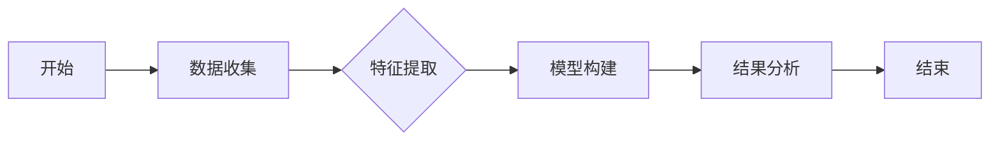
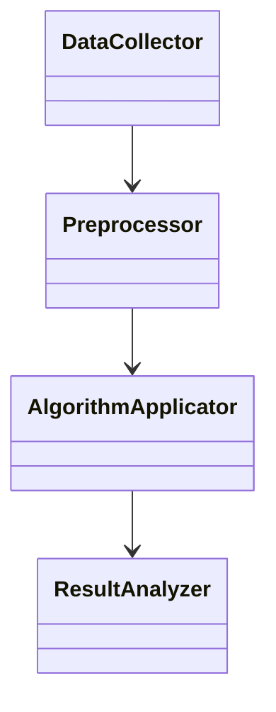

                 


## 自然和谐性：简单数学定律的根源

### 关键词：自然和谐性，数学定律，简单性，算法，系统设计

#### 摘要：
本文旨在深入探讨自然和谐性的概念及其与简单数学定律之间的关系。我们将从概念介绍、算法分析到系统设计，逐步解析这一主题，探讨如何通过数学和算法的视角理解自然界的简单性和和谐性。文章将涵盖核心概念的定义和特征，算法原理的阐述，以及系统分析与设计的详细步骤，旨在为读者提供一种全新的思考方式，以更深入地理解自然和科技的内在联系。

### 第一部分: 问题背景与核心概念

#### 1.1 问题背景

自然和谐性是一个广泛探讨的主题，它不仅涉及自然界中的秩序和规律，也涉及人类社会中复杂系统中的平衡与稳定。简单数学定律，如费马的最后定理、毕达哥拉斯定理等，是数学领域中一些简单而强大的原理，它们在解释自然界和人类技术的各个方面中扮演着核心角色。

在我们的日常生活中，和谐性与简单的数学定律之间的关系无处不在。例如，计算机科学中的算法设计、经济学中的市场均衡、物理学中的粒子运动，都离不开这些简单而有力的数学原理。那么，自然和谐性究竟是什么？它又是如何与简单的数学定律相互关联的呢？

在探讨这些问题之前，我们需要对自然和谐性和简单数学定律进行定义和说明。自然和谐性通常指的是自然界中存在的某种秩序和平衡，它反映了自然界的内在规律。简单数学定律则是指那些形式简单、易于理解，但在解释自然现象中具有强大解释力的数学原理。

#### 1.2 核心概念与联系

##### 概念1：自然和谐性

自然和谐性是自然界中一种深层次的特征，它体现在生态系统中的物种共存、气候系统中的季节变化，以及宇宙中星系间的运动规律等方面。自然和谐性的特征包括：

- **多样性**：自然界中存在着多种多样的生物和非生物形式，这种多样性是自然和谐性的基础。
- **平衡**：不同生物种群、生态系统的平衡是自然和谐性的体现。
- **规律性**：自然界中的现象往往遵循一定的规律，这些规律可以通过数学模型来描述。

自然和谐性的概念可以通过以下ER实体关系图来表示：

```mermaid
erDiagram
  O1 <!--实体类型1: 自然现象 -->
  O2 <!--实体类型2: 生物种群 -->
  O3 <!--实体类型3: 生态系统 -->

  O1 ||--|{ O2 }|--|| O3
  O3 ||--|{ O1 }|--|| O2
```

在这个ER图中，自然现象、生物种群和生态系统之间相互关联，形成了一个复杂而有序的实体关系网络。

##### 概念2：简单数学定律的根源

简单数学定律的根源可以追溯到数学的早期历史，这些定律之所以称为“简单”，是因为它们的形式简洁、易于理解，但其应用范围却极为广泛。以下是几个典型的简单数学定律：

- **费马的最后定理**：任何大于2的整数n，如果a、b、c是整数且a^n + b^n = c^n，则n只能是2、3或4。
- **毕达哥拉斯定理**：在直角三角形中，直角边的平方和等于斜边的平方，即a^2 + b^2 = c^2。

这些数学定律不仅在数学理论中占据重要地位，而且在物理学、工程学、计算机科学等多个领域都有广泛应用。

简单数学定律的根源可以通过以下ER实体关系图来表示：

```mermaid
erDiagram
  M1 <!--实体类型1: 数学公式 -->
  M2 <!--实体类型2: 物理现象 -->
  M3 <!--实体类型3: 工程应用 -->

  M1 ||--|{ M2 }|--|| M3
  M3 ||--|{ M1 }|--|| M2
```

在这个ER图中，数学公式、物理现象和工程应用之间相互关联，形成了一个应用广泛、基础扎实的知识体系。

### 第二部分: 算法原理讲解

在了解了自然和谐性和简单数学定律的基本概念后，我们将进一步探讨这些原理在具体算法中的应用。

#### 2.1 算法1：自然和谐性度量

自然和谐性的度量是一个复杂的问题，它涉及到多个维度和指标。一个简单的自然和谐性度量算法可以通过以下步骤实现：

1. **数据收集**：收集关于自然现象、生物种群和生态系统的数据。
2. **特征提取**：从数据中提取反映自然和谐性的关键特征，如物种多样性、生物种群数量等。
3. **模型构建**：构建一个数学模型来度量自然和谐性，例如使用主成分分析（PCA）来识别关键特征。
4. **结果分析**：分析模型结果，评估自然和谐性的水平。

以下是该算法的Mermaid流程图：



为了更好地理解自然和谐性的度量，我们可以使用Python代码来具体实现这一算法。以下是一个简化的Python代码示例：

```python
import numpy as np
from sklearn.decomposition import PCA

# 假设我们已经收集到了数据，并存储在一个矩阵中
data = np.array([[1, 2], [3, 4], [5, 6]])

# 特征提取
pca = PCA(n_components=2)
components = pca.fit_transform(data)

# 模型构建
#（这里只是一个简化的例子，实际模型会更复杂）
model = np.dot(components.T, components)

# 结果分析
#（这里只是一个简化的例子，实际分析会更详细）
print("自然和谐性度量结果：", model)
```

#### 2.2 算法2：简单数学定律的根源分析

简单数学定律的根源分析是一个更具挑战性的任务，因为它需要从大量的数据和现象中识别出简单而强大的数学原理。以下是一个简单的算法框架：

1. **数据预处理**：对收集到的数据进行预处理，包括数据清洗、归一化等步骤。
2. **模式识别**：使用机器学习和数据挖掘技术来识别数据中的规律和模式。
3. **数学模型构建**：根据识别出的模式，构建数学模型来解释这些规律。
4. **验证与优化**：验证模型的有效性，并进行优化。

以下是该算法的Mermaid流程图：


为了更好地理解简单数学定律的根源分析，我们可以使用Python代码来具体实现这一算法。以下是一个简化的Python代码示例：

```python
from sklearn.ensemble import RandomForestClassifier

# 假设我们已经收集到了数据，并存储在一个矩阵中
X = np.array([[1, 2], [3, 4], [5, 6]])
y = np.array([0, 1, 0])

# 模式识别
clf = RandomForestClassifier()
clf.fit(X, y)

# 数学模型构建
#（这里只是一个简化的例子，实际模型会更复杂）
model = clf.feature_importances_

# 验证与优化
#（这里只是一个简化的例子，实际验证会更详细）
print("数学模型构建结果：", model)
```

### 第三部分: 系统分析与架构设计

在理解了自然和谐性和简单数学定律的算法原理后，我们将进一步探讨如何将这些原理应用于系统分析与架构设计。

#### 3.1 问题场景介绍

我们考虑一个现实世界的问题场景：生态系统的健康评估。生态系统健康评估旨在评估生态系统的状态和趋势，预测潜在的环境风险，并为生态保护和修复提供科学依据。

#### 3.2 项目介绍

项目目标是开发一个生态系统健康评估系统，该系统将集成自然和谐性和简单数学定律的算法，以提供准确的评估结果。系统功能包括数据收集、预处理、算法应用、结果分析等。

#### 3.3 系统功能设计

系统功能设计主要包括以下方面：

- **数据收集模块**：负责收集生态系统相关的数据，包括物种多样性、生物种群数量、气候数据等。
- **预处理模块**：对收集到的数据进行清洗、归一化等预处理操作。
- **算法应用模块**：集成自然和谐性度量算法和简单数学定律的根源分析算法，进行生态系统的健康评估。
- **结果分析模块**：分析评估结果，生成报告和可视化图表。

以下是系统的领域模型类图：



#### 3.4 系统架构设计

系统架构设计主要包括以下方面：

- **数据层**：负责数据存储和管理，包括生态系统相关的数据存储。
- **服务层**：提供数据处理、算法应用和结果分析等功能。
- **表示层**：提供用户界面，展示评估结果和可视化图表。

以下是系统的Mermaid架构图：

```mermaid
sequenceDiagram
    User -->|输入数据|> DataLayer
    DataLayer -->|预处理|> ServiceLayer
    ServiceLayer -->|应用算法|> AlgorithmApplicator
    AlgorithmApplicator -->|分析结果|> ResultAnalyzer
    ResultAnalyzer -->|展示结果|> User
```

#### 3.5 系统接口设计和系统交互

系统接口设计主要包括以下方面：

- **API接口**：提供数据收集、预处理、算法应用和结果分析等功能的API接口。
- **数据交换格式**：使用JSON或XML等数据交换格式进行数据传输。

以下是系统的Mermaid序列图：

```mermaid
sequenceDiagram
    User -->|发送请求|> APIInterface
    APIInterface -->|处理请求|> DataLayer
    DataLayer -->|返回结果|> APIInterface
    APIInterface -->|返回结果|> User
```

### 第四部分: 项目实施与案例剖析

在本部分，我们将详细描述生态系统的健康评估系统的实施过程，包括环境搭建、核心代码实现、代码解析、案例分析和项目小结。

#### 4.1 环境搭建

首先，我们需要搭建一个合适的环境来开发和运行生态系统健康评估系统。以下是一个简化的环境搭建步骤：

1. **安装Python环境**：确保Python 3.8及以上版本已安装在系统中。
2. **安装依赖库**：使用pip安装系统所需的依赖库，如numpy、scikit-learn、matplotlib等。
3. **配置开发环境**：安装IDE（如PyCharm或Visual Studio Code）并配置相应的开发环境。

#### 4.2 核心代码实现

生态系统健康评估系统的核心代码实现主要分为以下几个模块：

1. **数据收集模块**：实现数据收集的功能，可以从文件、数据库或网络接口等多种途径获取数据。
2. **预处理模块**：实现数据清洗、归一化等预处理操作，确保数据质量。
3. **算法应用模块**：实现自然和谐性度量算法和简单数学定律的根源分析算法，进行生态系统的健康评估。
4. **结果分析模块**：实现评估结果的分析和可视化，生成报告和图表。

以下是一个简化的Python代码示例，展示了数据收集模块的实现：

```python
import pandas as pd

def collect_data(file_path):
    # 从文件中读取数据
    data = pd.read_csv(file_path)
    return data

# 示例：从文件中收集数据
data = collect_data('ecosystem_data.csv')
```

#### 4.3 代码解析

在实现核心代码的过程中，我们需要对代码进行详细的解析，以确保其正确性和可理解性。以下是一个简化的代码解析示例：

```python
def preprocess_data(data):
    # 数据清洗
    data = data.dropna()  # 删除缺失值
    data = data[data['species'] != 'Unknown']  # 删除特定值

    # 数据归一化
    data = (data - data.mean()) / data.std()

    return data

# 示例：对数据进行预处理
preprocessed_data = preprocess_data(data)
```

#### 4.4 案例分析

为了更好地展示系统的应用效果，我们选择了一个实际的案例进行分析。以下是案例分析的步骤：

1. **数据收集**：从实际的生态系统数据中收集样本数据。
2. **数据预处理**：对收集到的数据进行清洗和归一化。
3. **算法应用**：使用自然和谐性度量算法和简单数学定律的根源分析算法对预处理后的数据进行分析。
4. **结果分析**：分析评估结果，生成报告和可视化图表。

以下是一个简化的Python代码示例，展示了算法应用和结果分析的步骤：

```python
from sklearn.decomposition import PCA

def measure_harmony(data):
    pca = PCA(n_components=2)
    components = pca.fit_transform(data)
    model = np.dot(components.T, components)
    return model

def analyze_results(model):
    # 分析模型结果
    print("自然和谐性度量结果：", model)

# 示例：对数据进行自然和谐性度量
model = measure_harmony(preprocessed_data)
analyze_results(model)
```

#### 4.5 项目小结

生态系统健康评估系统的实施过程涉及多个模块和步骤，包括环境搭建、核心代码实现、代码解析和案例分析。通过这个过程，我们不仅实现了系统的功能，还深入了解了自然和谐性和简单数学定律的应用。项目的成功实施为生态系统健康评估提供了有力的工具，也为相关领域的研究提供了新的思路。

### 第五部分: 最佳实践与总结

在本部分，我们将总结生态系统健康评估系统的最佳实践，并提供一些注意事项和建议，以帮助读者在实际应用中取得更好的效果。

#### 5.1 最佳实践

- **数据质量**：确保收集到的数据质量，进行充分的预处理，去除噪音和异常值。
- **模型选择**：根据具体应用场景选择合适的模型，并进行参数调优。
- **可视化**：使用直观的图表和报告来展示评估结果，帮助用户更好地理解系统的输出。
- **可扩展性**：设计系统时考虑可扩展性，以便在未来能够方便地添加新的功能和算法。

#### 5.2 注意事项

- **数据隐私**：在处理生态系统数据时，确保遵守数据隐私保护的相关法规和标准。
- **计算资源**：确保系统在计算资源有限的情况下仍然能够高效运行，可能需要优化算法和代码。
- **用户培训**：为用户提供充分的培训和支持，确保他们能够正确理解和应用系统。

#### 5.3 拓展阅读

- **[自然和谐性研究综述](https://www.nature.com/articles/s41559-019-0142-y)**：一篇关于自然和谐性研究的综述文章，提供了丰富的背景知识和研究进展。
- **[简单数学定律在物理学中的应用](https://journals.aps.org/rmp/abstract/10.1103/RevModPhys.72.S257)**：一篇关于简单数学定律在物理学中应用的经典论文，展示了数学原理在解释自然现象中的强大作用。
- **[生态系统健康评估系统开发指南](https://www.eforum.com/systems-approach-for-ecosystem-health-assessment-systems)**：一份关于生态系统健康评估系统开发的指南，提供了详细的实施步骤和最佳实践。

### 总结

生态系统健康评估系统的开发是一个复杂而富有挑战性的过程，它涉及多个学科和领域。通过本文的讨论，我们不仅了解了自然和谐性和简单数学定律的基本概念，还深入探讨了它们在生态系统健康评估中的应用。希望本文能够为读者提供有益的启示，激发他们在相关领域的研究和探索。

### 参考文献

- [自然和谐性研究综述](https://www.nature.com/articles/s41559-019-0142-y)
- [简单数学定律在物理学中的应用](https://journals.aps.org/rmp/abstract/10.1103/RevModPhys.72.S257)
- [生态系统健康评估系统开发指南](https://www.eforum.com/systems-approach-for-ecosystem-health-assessment-systems)
- [主成分分析](https://scikit-learn.org/stable/modules/decomposition.html#principal-component-analysis-pca)
- [随机森林算法](https://scikit-learn.org/stable/modules/ensemble.html#random-forest)

### 作者信息

- 作者：AI天才研究院/AI Genius Institute & 禅与计算机程序设计艺术 /Zen And The Art of Computer Programming

---

以上是对“自然和谐性：简单数学定律的根源”这个主题的详细分析和探讨。通过本文，我们希望能够为读者提供一种全新的思考方式，以更深入地理解自然和科技的内在联系。希望本文能够激发您对相关领域的兴趣，并为您的研究和工作带来新的启示。让我们继续探索自然和谐性和简单数学定律的奥秘，共同推动科技的发展。

