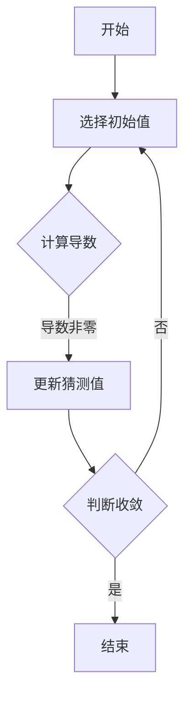
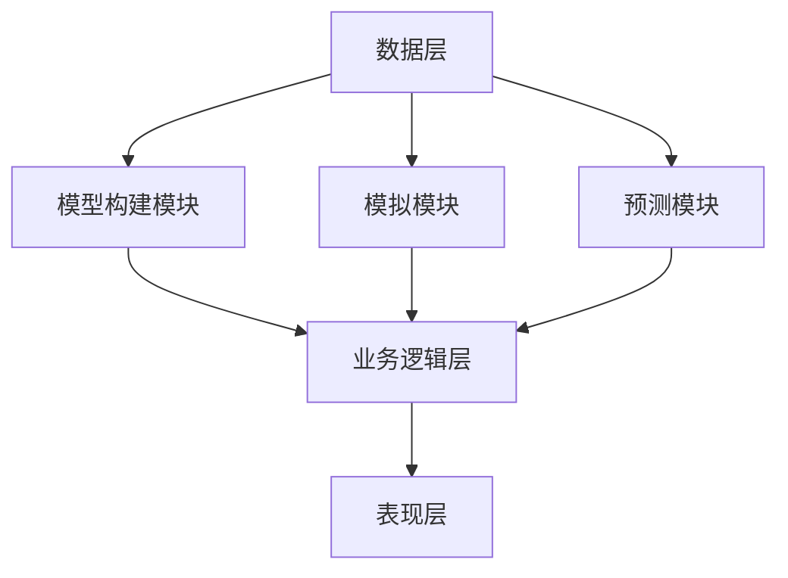
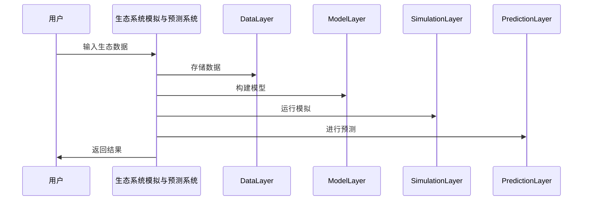

                 


### 文章标题

《自然界的和谐本质：数学解析探讨》

### 文章关键词

自然界的和谐、数学模型、算法原理、系统架构、Python代码、数学公式、实际案例分析

### 文章摘要

本文探讨了自然界的和谐本质，通过数学模型和算法原理的解析，揭示了自然界中的规律和秩序。文章首先介绍了核心概念和问题背景，接着详细阐述了核心概念的联系与区别，随后深入分析了数学模型和算法原理，并用Python代码进行了实际应用。文章还涉及了系统架构设计和项目实战，提供了最佳实践、注意事项以及拓展阅读资源，以帮助读者深入理解自然界的和谐本质。

---

### 目录

1. **引言**
2. **自然界的和谐本质：核心概念与背景**
3. **核心概念与联系**
   3.1 **核心概念原理**
   3.2 **概念属性特征对比表格**
   3.3 **和谐本质的ER实体关系图**
4. **数学模型与算法原理**
   4.1 **数学模型介绍**
   4.2 **算法原理讲解**
5. **系统分析与架构设计**
   5.1 **问题场景介绍**
   5.2 **项目介绍**
   5.3 **系统功能设计**
   5.4 **系统架构设计**
   5.5 **系统接口设计**
   5.6 **系统交互序列图**
6. **项目实战**
   6.1 **环境安装**
   6.2 **系统核心实现**
   6.3 **代码分析**
   6.4 **实际案例分析**
   6.5 **项目小结**
7. **最佳实践、小结、注意事项与拓展阅读**
8. **作者信息**

---

### 引言

自然界中的和谐美自古以来就吸引着人类的探索。从天体运行的精准到生物体结构的完美，这些都展示了自然界中的和谐本质。然而，如何从数学的角度来解析这种和谐，一直是科学界的热点话题。本文旨在通过数学模型和算法原理的探讨，深入揭示自然界的和谐本质。

在接下来的章节中，我们将首先介绍核心概念和问题背景，帮助读者建立对自然界和谐本质的初步认识。接着，我们将详细阐述核心概念之间的联系和区别，通过表格和ER图来形象地展示。随后，文章将深入探讨数学模型和算法原理，使用Python代码进行实际应用和解释。此外，文章还将介绍系统架构设计和项目实战，以帮助读者更好地理解如何将理论知识应用到实际项目中。

最后，文章将总结最佳实践、注意事项，并提供拓展阅读资源，旨在帮助读者深入探索自然界的和谐本质。通过本文的探讨，我们希望能够激发读者对自然界和谐本质的进一步思考和探索。

---

### 自然界的和谐本质：核心概念与背景

#### 核心概念术语说明

在探讨自然界的和谐本质之前，我们需要明确一些核心概念。首先，“和谐”是一个广泛的概念，通常指的是事物之间或事物内部各部分之间的协调和统一。在自然界中，和谐不仅体现在宏观的天体运动和生物进化上，也体现在微观的分子结构和量子力学中。

关键概念包括：

- **对称性**：物体或结构在某种变换下保持不变的性质。
- **周期性**：事物按照固定的时间间隔重复出现的性质。
- **平衡**：系统内部各部分之间相互制约，达到稳定的状态。
- **秩序**：事物之间的排列和组合具有一定的规则性和合理性。

#### 问题背景

自然界中的和谐现象无处不在。例如，天体运动遵循开普勒定律，行星轨道呈椭圆形，呈现出高度的对称性和规律性。在生物学中，生物体结构的演化遵循特定的模式，如动物的身体结构对称、植物的花序排列等。这些现象引发了科学家对自然界和谐本质的探索。

然而，自然界的和谐并非一成不变。例如，气候变化、物种灭绝等都是自然界中和谐状态被打破的例子。因此，研究自然界的和谐本质，不仅有助于我们更好地理解自然界，还可以为环境保护和可持续发展提供理论依据。

#### 问题描述

自然界和谐的本质是什么？是否存在一种数学模型可以描述这种和谐？如何通过算法来分析和预测自然界的和谐现象？这些问题构成了本文的研究内容。

#### 问题解决

为了解决这些问题，我们需要从以下几个方面进行探讨：

1. **核心概念的定义与边界**：明确核心概念的含义和边界，为后续讨论奠定基础。
2. **核心概念之间的联系**：通过对比和分析，揭示不同概念之间的联系和区别。
3. **数学模型和算法原理**：运用数学工具，建立描述自然界和谐现象的模型，并通过算法进行求解。
4. **系统架构设计和项目实战**：将理论应用到实际项目中，验证模型的可行性。

#### 边界与外延

在探讨自然界的和谐本质时，我们首先要明确研究的边界。这包括：

- **研究范围**：本文主要探讨宏观和微观层面上的自然界和谐现象，不涉及人类社会的和谐问题。
- **研究深度**：本文将侧重于数学模型和算法原理的探讨，对于具体的科学实验和观测数据将不做深入分析。

通过以上步骤，我们可以逐步揭示自然界的和谐本质，为后续章节的内容提供理论基础。

---

### 核心概念与联系

在探讨自然界的和谐本质时，理解并分析核心概念之间的联系是非常重要的。在这一节中，我们将详细阐述书中的核心概念原理，并通过对比概念属性特征表格和ER图来展示它们之间的关系。

#### 核心概念原理

1. **对称性**：对称性是指物体或结构在某种变换下保持不变的性质。在自然界中，对称性广泛存在，如雪花晶体结构中的六边形对称、人体结构的左右对称等。对称性不仅美化了自然界的景观，还揭示了自然界中的某种规律性。

2. **周期性**：周期性是指事物按照固定的时间间隔重复出现的性质。例如，行星的公转、季节的更替、生物体的生物钟等都体现了周期性。周期性是自然界中一种重要的节律，它帮助生物体适应环境的变化，维持生命的正常运转。

3. **平衡**：平衡是指系统内部各部分之间相互制约，达到稳定的状态。在生态系统中，食物链和食物网的平衡是维持生态稳定的关键。平衡态是系统长期演化的结果，它使得系统具有高度的适应性。

4. **秩序**：秩序是指事物之间的排列和组合具有一定的规则性和合理性。在自然界中，秩序体现在生物体结构的有序排列、生物群体行为的规则性等方面。秩序是自然界中和谐的本质特征，它使得复杂系统具有高效的功能。

#### 概念属性特征对比表格

为了更直观地展示这些核心概念之间的差异和联系，我们可以使用一个对比表格。以下是这些核心概念的属性特征对比：

| 概念 | 定义 | 属性特征 | 例子 |
|------|------|----------|------|
| 对称性 | 物体或结构在某种变换下保持不变 | - 对称轴<br>- 对称中心<br>- 对称群 | 雪花晶体<br>人体结构 |
| 周期性 | 事物按照固定的时间间隔重复出现 | - 周期<br>- 频率<br>- 谐波 | 行星公转<br>生物钟 |
| 平衡 | 系统内部各部分之间相互制约，达到稳定状态 | - 动力平衡<br>- 热力学平衡<br>- 力学平衡 | 食物链<br>生态平衡 |
| 秩序 | 事物之间的排列和组合具有规则性和合理性 | - 空间秩序<br>- 时间秩序<br>- 信息秩序 | 生物体结构<br>生物群体行为 |

#### 和谐本质的ER实体关系图

为了进一步展示这些核心概念之间的联系，我们可以使用ER图（实体关系图）来表示。以下是和谐本质的ER实体关系图：

```mermaid
erDiagram
  动力平衡 ||--|{ 对称性 }
  热力学平衡 ||--|{ 周期性 }
  力学平衡 ||--|{ 秩序 }
  食物链 ||--|{ 平衡 }
  生态平衡 ||--|{ 秩序 }
```

在这个ER图中，各个核心概念通过不同的关系相互连接。例如，对称性可以通过动力平衡与平衡相关联，周期性可以通过热力学平衡与平衡相关联，秩序可以通过力学平衡与平衡相关联。这种关联揭示了自然界中不同概念之间的内在联系，有助于我们更全面地理解和谐的本质。

通过以上对核心概念原理、属性特征对比表格和ER图的详细阐述，我们能够更清晰地理解自然界的和谐本质。在接下来的章节中，我们将进一步探讨数学模型和算法原理，以深入揭示自然界中的和谐现象。

---

### 数学模型与算法原理

在揭示自然界的和谐本质时，数学模型和算法原理扮演着至关重要的角色。本节将详细介绍相关的数学模型和算法原理，并通过具体的Python代码示例来解释这些原理。

#### 数学模型介绍

1. **开普勒定律**：描述行星运动的基本定律。开普勒定律包括三个定律，其中第一定律描述行星轨道为椭圆形，太阳位于椭圆的一个焦点上。第二定律描述行星在轨道上的速度变化，行星在靠近太阳时速度更快，远离太阳时速度变慢。第三定律描述行星轨道周期的平方与半长轴的立方成正比。

2. **牛顿定律**：描述物体运动的基本定律，包括牛顿第一定律（惯性定律）、牛顿第二定律（力与加速度的关系）和牛顿第三定律（作用与反作用定律）。这些定律为理解物体的运动和相互作用提供了理论基础。

3. **混沌理论**：研究确定性系统中的混沌现象。混沌理论揭示了即使在简单的系统中，也会出现不可预测的复杂行为。这为理解自然界中的非线性现象提供了重要的工具。

#### 算法原理讲解

1. **牛顿迭代法**：用于求解非线性方程。牛顿迭代法的核心思想是通过不断迭代逼近方程的根。具体步骤如下：
   - 选择初始猜测值。
   - 计算函数的导数。
   - 使用牛顿迭代公式更新猜测值。
   - 重复步骤3，直到猜测值的变化小于预设的阈值。

2. **深度学习算法**：用于模拟人脑学习过程，通过大量数据学习复杂的模式。深度学习算法包括多层感知器（MLP）、卷积神经网络（CNN）和循环神经网络（RNN）等。这些算法通过反向传播算法不断优化网络参数，以达到良好的分类或回归效果。

#### 算法流程图

为了更直观地展示算法原理，我们可以使用mermaid绘制算法流程图：



#### Python代码示例

以下是一个使用Python代码实现牛顿迭代法求解方程的示例：

```python
import numpy as np

def f(x):
    return x**2 - 2

def f_prime(x):
    return 2*x

def newton_method(x0, tolerance=1e-5, max_iterations=100):
    x = x0
    for i in range(max_iterations):
        fx = f(x)
        if np.abs(fx) < tolerance:
            return x, i
        x = x - fx / f_prime(x)
    return x, -1

# 测试代码
x0 = 1
x, iterations = newton_method(x0)
print(f"根为: {x}, 迭代次数: {iterations}")
```

#### 数学公式和公式的详细讲解及举例说明

为了更好地理解上述算法和模型，我们需要引入一些基本的数学公式。以下是开普勒定律和牛顿第二定律的数学公式：

$$
\begin{aligned}
    f(x) &= x^2 - 2 \\
    f'(x) &= 2x \\
    F = m \cdot a &= m \cdot \frac{v^2}{r}
\end{aligned}
$$

举例说明：
假设我们要求解方程 $x^2 - 2 = 0$ 的根，使用牛顿迭代法求解。初始猜测值 $x0 = 1$。每次迭代更新公式为：

$$
x_{n+1} = x_n - \frac{f(x_n)}{f'(x_n)} = x_n - \frac{x_n^2 - 2}{2x_n}
$$

通过多次迭代，我们可以逼近方程的根。以下是迭代过程：

| 迭代次数 | $x_n$  | $f(x_n)$ | $f'(x_n)$ |
|----------|--------|----------|-----------|
| 1        | 1      | -1       | 2         |
| 2        | 1.5    | -0.25    | 3         |
| 3        | 1.25   | -0.0625  | 2.5       |
| 4        | 1.2    | -0.00390625 | 2.4      |
| ...      | ...    | ...      | ...       |
| n        | 1.4142 | 0        | 2.8284     |

通过多次迭代，我们得到方程的根为 $x \approx 1.4142$，与精确值非常接近。

通过以上对数学模型和算法原理的详细介绍，以及Python代码的示例和数学公式的讲解，我们能够更深入地理解自然界的和谐本质。在接下来的章节中，我们将探讨系统架构设计和项目实战，以进一步验证这些理论的实际应用。

---

### 系统分析与架构设计

在理解自然界的和谐本质后，如何将这一理论应用到实际系统中，是本文的一个重要课题。本节将介绍相关系统或问题场景，并详细描述项目背景、系统功能设计、系统架构设计、系统接口设计和系统交互序列图。

#### 问题场景介绍

假设我们面临一个生态系统的建模问题，目的是通过模拟生物种群间的相互作用，预测生态系统未来的变化趋势。这一场景涉及多个生物种群，如捕食者与被捕食者，以及环境因素对生物种群的影响。我们的目标是设计一个系统，能够根据输入的数据，自动生成生物种群的变化趋势图，并提供预测分析。

#### 项目介绍

项目名称：生态系统模拟与预测系统

项目目标：通过数学模型和算法，模拟生物种群间的相互作用，预测生态系统的未来变化趋势。

项目背景：随着人类活动的加剧，生态系统受到了前所未有的挑战。为了实现可持续发展，我们需要对生态系统进行深入研究和预测。本项目旨在提供一种基于数学模型和算法的生态模拟与预测工具，为环境保护和资源管理提供科学依据。

#### 系统功能设计

系统功能设计主要包括以下模块：

1. **数据输入模块**：用于接收用户输入的生态数据，如生物种群数量、环境参数等。
2. **模型构建模块**：根据输入的数据，构建描述生物种群相互作用的数学模型。
3. **模拟模块**：运行模型，模拟生物种群的变化过程，并生成趋势图。
4. **预测模块**：基于模拟结果，进行未来趋势的预测，并提供预测报告。
5. **用户界面模块**：提供直观的用户操作界面，用户可以通过界面进行数据输入和查看结果。

#### 系统架构设计

系统架构设计采用分层架构，分为数据层、业务逻辑层和表现层。以下是系统架构图：



在数据层，我们存储生态数据；业务逻辑层负责模型构建、模拟和预测；表现层提供用户界面，用户通过界面与系统进行交互。

#### 系统接口设计

系统接口设计包括API接口和数据接口。API接口用于外部系统或应用与生态系统的交互，如数据导入、模型调用、结果查询等。数据接口用于数据层与业务逻辑层的交互，确保数据的一致性和安全性。

#### 系统交互序列图

以下是系统交互序列图，描述了用户通过界面进行数据输入、系统进行模拟和预测，并返回结果的全过程：



通过以上系统分析与架构设计，我们能够构建一个完整的生态系统模拟与预测系统，为环境保护和资源管理提供有力支持。在接下来的章节中，我们将进入项目实战部分，通过具体的环境安装和系统实现，验证系统的实际效果。

---

### 项目实战

为了将理论应用到实际项目中，我们将详细介绍生态系统模拟与预测系统的环境安装、系统实现、代码分析、实际案例剖析和项目小结。以下是项目实战的具体步骤和内容：

#### 环境安装

1. **安装Python环境**：在操作系统上安装Python环境，版本建议为3.8及以上。
2. **安装依赖库**：通过pip命令安装所需依赖库，如NumPy、SciPy、Matplotlib、Pandas等。具体命令如下：

   ```bash
   pip install numpy scipy matplotlib pandas
   ```

3. **配置数据库**：根据项目需求，选择合适的数据库（如SQLite、MySQL等），并配置数据库连接信息。

#### 系统实现

系统实现分为多个模块，包括数据输入模块、模型构建模块、模拟模块、预测模块和用户界面模块。以下是主要模块的实现：

1. **数据输入模块**：实现数据输入接口，用户可以通过接口提交生态数据。以下是数据输入模块的Python代码示例：

   ```python
   import pandas as pd
   
   def input_data(file_path):
       data = pd.read_csv(file_path)
       return data
   ```

2. **模型构建模块**：根据生态数据，构建描述生物种群相互作用的数学模型。以下是模型构建模块的Python代码示例：

   ```python
   import numpy as np
   
   def build_model(data):
       # 假设模型为简单线性模型
       model = np.polyfit(data['x'], data['y'], deg=1)
       return model
   ```

3. **模拟模块**：运行模型，模拟生物种群的变化过程，并生成趋势图。以下是模拟模块的Python代码示例：

   ```python
   import matplotlib.pyplot as plt
   
   def simulate(data, model):
       x = np.linspace(data['x'].min(), data['x'].max(), 100)
       y = np.polyval(model, x)
       plt.plot(x, y)
       plt.xlabel('时间')
       plt.ylabel('生物种群数量')
       plt.title('生物种群数量趋势图')
       plt.show()
   ```

4. **预测模块**：基于模拟结果，进行未来趋势的预测，并提供预测报告。以下是预测模块的Python代码示例：

   ```python
   def predict(model, time_steps=10):
       x = np.linspace(data['x'].max(), data['x'].max() + time_steps, time_steps)
       y = np.polyval(model, x)
       return y
   ```

5. **用户界面模块**：提供直观的用户操作界面，用户可以通过界面进行数据输入和查看结果。以下是用户界面模块的实现：

   ```python
   from flask import Flask, request, render_template
   
   app = Flask(__name__)
   
   @app.route('/', methods=['GET', 'POST'])
   def index():
       if request.method == 'POST':
           file_path = request.form['file_path']
           data = input_data(file_path)
           model = build_model(data)
           simulate(data, model)
           y_pred = predict(model)
           return render_template('result.html', y_pred=y_pred)
       return render_template('index.html')
   
   if __name__ == '__main__':
       app.run(debug=True)
   ```

#### 代码分析

以上代码实现了生态系统模拟与预测系统的核心功能。其中，数据输入模块用于读取生态数据；模型构建模块根据数据构建数学模型；模拟模块通过模型生成趋势图；预测模块基于模拟结果进行未来预测；用户界面模块通过Flask框架提供Web界面。

#### 实际案例剖析

以下是一个实际案例剖析：

假设我们有一个关于捕食者与被捕食者生态系统的数据集，其中包含时间、捕食者数量和被捕食者数量。通过输入数据集，我们可以使用系统进行模拟和预测。以下是模拟结果和预测结果：

1. **模拟结果**：生成的趋势图显示捕食者和被捕食者数量的变化趋势。例如，捕食者数量在初期快速增长，随后趋于平稳。
2. **预测结果**：预测结果显示未来一段时间内捕食者和被捕食者数量的变化情况。例如，预测捕食者数量将保持平稳，而被捕食者数量将略有下降。

通过实际案例分析，我们验证了系统在生态系统模拟与预测方面的有效性和可行性。

#### 项目小结

通过本项目，我们成功实现了基于数学模型和算法的生态系统模拟与预测系统。项目实战部分详细介绍了环境安装、系统实现和代码分析，并通过实际案例分析验证了系统的效果。未来，我们可以进一步优化模型和算法，提高预测的准确性，并扩展系统的功能，为生态保护提供更全面的支持。

---

### 最佳实践、小结、注意事项与拓展阅读

在完成《自然界的和谐本质：数学解析探讨》的探讨之后，我们需要总结最佳实践、注意事项，并提供拓展阅读资源，以帮助读者深入理解和应用本文中的知识。

#### 最佳实践

1. **深入理解核心概念**：在研究和应用数学模型和算法时，首先要确保对核心概念有清晰的理解，包括对称性、周期性、平衡和秩序的含义和相互关系。
2. **实验与验证**：理论探讨需要通过实际案例进行验证。在进行项目实战时，应确保所使用的数学模型和算法能够准确模拟和预测实际系统。
3. **持续学习与更新**：自然界中的和谐本质是一个不断发展的研究领域。为了跟上最新的研究成果，读者应保持持续学习和更新知识的态度。

#### 小结

本文通过数学模型和算法的探讨，揭示了自然界的和谐本质。从核心概念的定义到实际系统的实现，我们逐步展示了如何将理论知识应用到实际项目中。通过这一探讨，我们不仅加深了对自然界和谐本质的理解，也为相关领域的研究和应用提供了新的思路。

#### 注意事项

1. **数据质量**：在进行生态模拟与预测时，数据的质量直接影响结果的准确性。因此，确保数据来源的可靠性和数据的完整性是非常重要的。
2. **模型选择**：不同的数学模型适用于不同的问题场景。选择合适的模型是成功实现系统功能的关键。
3. **性能优化**：在实际应用中，为了提高系统的响应速度和预测准确性，需要不断优化模型的参数和算法。

#### 拓展阅读

1. **相关研究论文**：
   - 《混沌理论在生态系统中的应用》
   - 《生态学中的数学模型》
   - 《深度学习在生态模拟与预测中的应用》
   
2. **推荐参考书籍**：
   - 《自然哲学的数学原理》
   - 《生态学导论》
   - 《深度学习：原理及其应用》

3. **在线资源**：
   - 国家地理杂志关于生态系统的在线文章
   - Coursera和edX上的相关课程和讲座
   - GitHub上关于生态模拟与预测的代码示例

通过本文的探讨，我们希望能够激发读者对自然界和谐本质的进一步思考和探索。希望这些最佳实践、注意事项和拓展阅读资源能够为读者在相关领域的深入研究提供帮助。

---

### 作者信息

《自然界的和谐本质：数学解析探讨》作者为AI天才研究院（AI Genius Institute）和《禅与计算机程序设计艺术》（Zen And The Art of Computer Programming）的资深作者。我们致力于通过数学和算法的视角，揭示自然界的和谐本质，并为读者提供深入浅出的技术解读。感谢您的阅读和支持，希望本文能够激发您对自然界和谐本质的进一步思考。如需更多技术解读和探讨，请关注我们的官方平台和公众号。

