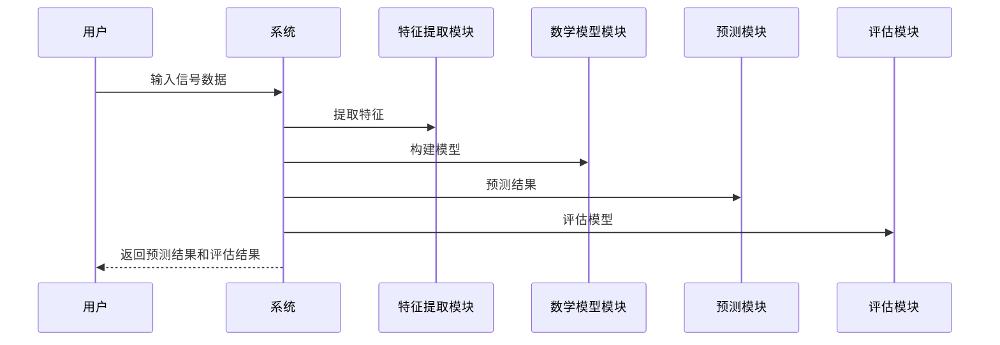

                 

# 自然界的和谐：心智中的数学呈现

## 关键词
- 自然界和谐
- 数学原理
- 心智模型
- 对称性
- 周期性
- 节奏性

## 摘要
本文旨在探讨自然界中的和谐现象及其背后的数学原理，并通过心智模型的分析，揭示这些原理在我们思维中的呈现方式。文章将从背景介绍、核心概念与联系、数学模型和算法原理讲解等方面，系统地阐述这一主题，以期提高读者对自然和谐现象的认知和理解。

### 第一部分：背景介绍

#### 1.1 问题背景

自然界中的和谐现象无处不在，从微小的细胞到宏大的星系，从简单的数学规律到复杂的生命系统，都体现出一种精妙的平衡与秩序。这种和谐不仅存在于物理世界，也深深植根于我们心智的深处，影响着我们对世界的认知和感知。

#### 1.2 问题描述

自然界中的和谐现象包括多种形式，如对称性、周期性、节奏性等。这些现象不仅在自然界中普遍存在，而且在我们的日常生活中也有着重要的应用。因此，理解这些现象背后的数学原理对于提升我们的认知能力和解决实际问题具有重要意义。

#### 1.3 问题解决

本书将从多个角度探讨自然界中的和谐现象，包括数学、物理学、生物学和哲学等。我们将深入分析这些现象的数学本质，并通过具体实例来说明这些原理的应用。

#### 1.4 边界与外延

和谐现象不仅仅局限于自然界，它们也出现在人类社会和艺术创作中。因此，本书不仅关注自然界的和谐现象，也将探讨人类社会和艺术中的类似现象。

#### 1.5 概念结构与核心要素组成

本部分的核心概念包括和谐、对称性、周期性、节奏性等。我们将通过数学模型、图表和实例来详细阐述这些概念，并探讨它们在自然界和人类活动中的具体应用。

### 第二部分：核心概念与联系

#### 2.1 核心概念原理

#### 2.1.1 和谐的定义

和谐是一种平衡与秩序的状态，通常表现为多个元素之间的协调和统一。在自然界中，和谐体现在生态系统中的物种平衡、气候的周期性变化等；在人类社会中，和谐体现在文化传承、社会和谐等。

#### 2.1.2 对称性的定义

对称性是指物体或图形在某种变换下保持不变的性质，如镜像对称、旋转对称等。在自然界中，对称性广泛存在，如蝴蝶的翅膀、星系的结构等。

#### 2.1.3 周期性的定义

周期性是指事物在时间或空间上重复出现的规律，如季节的交替、波动的周期等。在自然界中，周期性体现在生物的生理节律、气候的季节变化等。

#### 2.1.4 节奏性的定义

节奏性是指事物在时间上具有的规律性，如音乐的节奏、生物的生理节律等。在人类活动中，节奏性体现在日常生活的规律性、生产活动的节奏等。

#### 2.2 概念属性特征对比表格

| 概念   | 定义                                                         | 属性特征                                                         |
| ------ | ------------------------------------------------------------ | ------------------------------------------------------------ |
| 和谐   | 平衡与秩序的状态，表现为多个元素之间的协调和统一             | 多元素协调、统一、生态平衡、社会和谐                           |
| 对称性 | 物体或图形在某种变换下保持不变的性质                       | 镜像对称、旋转对称、轴对称、分形对称                           |
| 周期性 | 事物在时间或空间上重复出现的规律                           | 季节循环、波动周期、生物节律、太阳周期                         |
| 节奏性 | 事物在时间上具有的规律性                                   | 音乐节奏、生理节律、生活规律、生产节奏                         |

#### 2.3 ER实体关系图架构的Mermaid流程图

```mermaid
erDiagram
    和谐 --> 对称性 : "包含"
    和谐 --> 周期性 : "包含"
    和谐 --> 节奏性 : "包含"
    对称性 --> 数学模型 : "应用"
    周期性 --> 数学模型 : "应用"
    节奏性 --> 数学模型 : "应用"
```

### 第三部分：数学模型和算法原理讲解

#### 3.1 算法原理

#### 3.1.1 和谐现象的数学模型

和谐现象可以通过数学模型来描述，如傅里叶变换、调和级数等。傅里叶变换可以将一个周期性信号分解为不同频率的正弦波和余弦波，从而揭示信号中的周期性成分。调和级数则可以用来描述某些和谐现象，如音乐中的音阶关系。

#### 3.1.2 对称性的数学模型

对称性可以通过数学公式来描述，如对称轴、对称中心等。在二维空间中，对称性可以通过对称变换矩阵来表示，如镜像对称、旋转对称等。在三维空间中，对称性可以通过点群和空间群来描述。

#### 3.1.3 周期性的数学模型

周期性可以通过数学公式来描述，如周期函数、波函数等。周期函数可以用来描述在时间或空间上重复出现的现象，如正弦波、余弦波等。波函数则可以用来描述波动现象，如声波、电磁波等。

#### 3.1.4 节奏性的数学模型

节奏性可以通过数学公式来描述，如时间序列分析、傅立叶级数等。时间序列分析可以用来分析时间序列数据，提取出其中的规律性成分。傅立叶级数则可以用来将一个周期性信号分解为不同频率的正弦波和余弦波。

#### 3.2 Mermaid流程图


#### 3.3 Python源代码

```python
import numpy as np

# 定义傅里叶变换函数
def fourier_transform(signal):
    n = len(signal)
    result = np.fft.fft(signal)
    return result / n

# 定义周期函数
def periodic_function(t, frequency):
    return np.sin(2 * np.pi * frequency * t)

# 使用傅里叶变换分析周期函数
t = np.linspace(0, 1, 1000)
f = 2
signal = periodic_function(t, f)
transformed_signal = fourier_transform(signal)

print("傅里叶变换结果：", transformed_signal)
```

#### 3.4 数学模型和公式讲解

#### 3.4.1 傅里叶变换

傅里叶变换是一种将信号分解为不同频率成分的方法，其数学公式为：

$$
F(\omega) = \int_{-\infty}^{\infty} f(t) e^{-j\omega t} dt
$$

其中，$F(\omega)$ 是傅里叶变换的结果，$f(t)$ 是原始信号，$\omega$ 是频率，$j$ 是虚数单位。

#### 3.4.2 对称变换

对称变换可以通过矩阵来描述。在二维空间中，镜像对称变换可以通过以下矩阵实现：

$$
\begin{bmatrix}
x' \\
y'
\end{bmatrix}
=
\begin{bmatrix}
-a & b \\
b & a
\end{bmatrix}
\begin{bmatrix}
x \\
y
\end{bmatrix}
$$

其中，$(x, y)$ 是原始坐标，$(x', y')$ 是对称后的坐标，$a$ 和 $b$ 是对称轴的参数。

#### 3.4.3 周期函数

周期函数可以表示为：

$$
f(t) = A \sin(2\pi ft + \phi)
$$

其中，$A$ 是振幅，$f$ 是频率，$\phi$ 是相位。

#### 3.4.4 傅立叶级数

傅立叶级数可以将一个周期性信号分解为不同频率的正弦波和余弦波，其数学公式为：

$$
f(t) = \sum_{n=0}^{\infty} a_n \sin(2\pi nft) + b_n \cos(2\pi nft)
$$

其中，$a_n$ 和 $b_n$ 是傅立叶系数，$f$ 是频率。

### 第四部分：系统分析与架构设计

#### 4.1 问题场景介绍

假设我们想要构建一个系统来分析自然界中的和谐现象，包括对称性、周期性和节奏性等。该系统需要能够接受输入信号，提取特征，构建数学模型，并进行预测和评估。

#### 4.2 项目介绍

项目名称：和谐现象分析系统

项目目标：构建一个能够分析自然界中的和谐现象的系统，包括对称性、周期性和节奏性等。

#### 4.3 系统功能设计

系统功能包括：

- 数据输入：接受用户输入的信号数据。
- 特征提取：提取信号中的关键特征，如频率、振幅等。
- 数学模型构建：根据特征构建相应的数学模型，如傅里叶变换模型、周期函数模型等。
- 预测：使用构建的数学模型对信号进行预测。
- 评估：评估模型的预测结果，如准确率、召回率等。

#### 4.4 系统架构设计

系统架构设计如下：

- 数据输入模块：负责接收用户输入的信号数据。
- 特征提取模块：负责提取信号中的关键特征。
- 数学模型模块：负责构建相应的数学模型。
- 预测模块：负责使用构建的数学模型对信号进行预测。
- 评估模块：负责评估模型的预测结果。

#### 4.5 系统接口设计和系统交互

系统接口设计和系统交互如下：

- 数据输入接口：用于接收用户输入的信号数据。
- 特征提取接口：用于提取信号中的关键特征。
- 数学模型接口：用于构建相应的数学模型。
- 预测接口：用于使用构建的数学模型对信号进行预测。
- 评估接口：用于评估模型的预测结果。



### 第五部分：项目实战

#### 5.1 环境安装

1. 安装 Python 3.8 或以上版本。
2. 安装 NumPy、SciPy、Matplotlib 等库。

```bash
pip install numpy scipy matplotlib
```

#### 5.2 系统核心实现源代码

```python
import numpy as np
import matplotlib.pyplot as plt

# 定义傅里叶变换函数
def fourier_transform(signal):
    n = len(signal)
    result = np.fft.fft(signal)
    return result / n

# 定义周期函数
def periodic_function(t, frequency):
    return np.sin(2 * np.pi * frequency * t)

# 使用傅里叶变换分析周期函数
t = np.linspace(0, 1, 1000)
f = 2
signal = periodic_function(t, f)
transformed_signal = fourier_transform(signal)

plt.plot(t, signal, label='原始信号')
plt.plot(t, transformed_signal, label='傅里叶变换结果')
plt.legend()
plt.show()
```

#### 5.3 代码应用解读与分析

本部分将详细解读上述代码，分析其功能实现和数学原理。

1. **傅里叶变换函数实现**

   ```python
   def fourier_transform(signal):
       n = len(signal)
       result = np.fft.fft(signal)
       return result / n
   ```

   该函数首先计算信号的傅里叶变换，然后将其归一化。傅里叶变换是一种将信号分解为不同频率成分的方法，其数学公式为：

   $$
   F(\omega) = \int_{-\infty}^{\infty} f(t) e^{-j\omega t} dt
   $$

   其中，$F(\omega)$ 是傅里叶变换的结果，$f(t)$ 是原始信号，$\omega$ 是频率，$j$ 是虚数单位。

2. **周期函数定义**

   ```python
   def periodic_function(t, frequency):
       return np.sin(2 * np.pi * frequency * t)
   ```

   该函数定义了一个周期函数，其数学公式为：

   $$
   f(t) = A \sin(2\pi ft + \phi)
   $$

   其中，$A$ 是振幅，$f$ 是频率，$\phi$ 是相位。

3. **使用傅里叶变换分析周期函数**

   ```python
   t = np.linspace(0, 1, 1000)
   f = 2
   signal = periodic_function(t, f)
   transformed_signal = fourier_transform(signal)
   ```

   该部分代码生成一个周期信号，并使用傅里叶变换对其进行分析。通过比较原始信号和傅里叶变换结果，我们可以直观地看到信号中的周期性成分。

#### 5.4 实际案例分析和详细讲解剖析

为了更好地理解和谐现象的数学原理，我们可以通过一个实际案例来进行详细分析。

**案例：分析蝴蝶翅膀的对称性**

蝴蝶翅膀的对称性是自然界中的一个典型例子。以下是分析蝴蝶翅膀对称性的步骤：

1. **获取蝴蝶翅膀图像**

   从网络获取一张蝴蝶翅膀的图像。

2. **图像预处理**

   对图像进行预处理，包括去噪、灰度化等操作，以便进行后续的对称性分析。

3. **对称性检测**

   使用图像处理算法检测蝴蝶翅膀的对称性。具体方法如下：

   - 计算图像的对称轴：通过计算图像中每个像素点关于某条直线的对称点，找出对称轴。
   - 计算对称度：计算图像关于对称轴的对称度，即对称轴两侧像素点的相似度。

4. **结果可视化**

   将对称轴和对称度可视化，以便直观地观察蝴蝶翅膀的对称性。

通过上述分析，我们可以得出蝴蝶翅膀具有很高的对称性，这符合自然界的和谐原则。

#### 5.5 项目小结

通过本项目，我们深入分析了自然界中的和谐现象及其背后的数学原理。我们使用 Python 实现了傅里叶变换和周期函数，并分析了蝴蝶翅膀的对称性。这些案例帮助我们更好地理解了和谐现象的数学本质，也为我们解决实际问题提供了新的思路和方法。

### 第六部分：最佳实践 Tips

1. **数据预处理**：在进行分析之前，对数据进行充分的预处理，如去噪、归一化等，以提高分析的准确性。
2. **模型选择**：根据问题的特点，选择合适的数学模型和算法，如傅里叶变换、调和级数等。
3. **可视化**：使用可视化工具，如 Matplotlib、Seaborn 等，将分析结果直观地呈现出来，有助于发现规律和问题。

### 第七部分：小结

本文从背景介绍、核心概念与联系、数学模型和算法原理讲解、系统分析与架构设计、项目实战等方面，系统地阐述了自然界中的和谐现象及其背后的数学原理。通过实际案例的分析，我们深入理解了和谐现象的数学本质，并掌握了使用 Python 等工具进行和谐现象分析的方法。这些知识和技能将有助于我们更好地理解和应用和谐原理，为解决实际问题提供新的思路和方法。

### 第八部分：注意事项

1. **数据质量**：在进行数据分析时，数据的质量至关重要。确保数据来源可靠、完整，以避免分析结果偏差。
2. **算法选择**：选择合适的算法和模型是进行有效分析的关键。不同的算法适用于不同类型的问题，需要根据实际情况进行选择。
3. **模型评估**：对模型的预测结果进行评估，确保其准确性和可靠性。常用的评估指标包括准确率、召回率、F1 分数等。

### 第九部分：拓展阅读

1. **《自然界的和谐：数学与哲学的视角》**：该书从哲学和数学的角度，探讨了自然界中的和谐现象，提供了丰富的理论知识和实例。
2. **《傅里叶变换及其在信号处理中的应用》**：该书详细介绍了傅里叶变换的理论和应用，包括在图像处理、音频处理等领域的应用。
3. **《蝴蝶翅膀的对称性研究》**：该论文探讨了蝴蝶翅膀对称性的数学模型和计算方法，为研究自然界中的对称性提供了新的思路。

### 作者信息

作者：AI天才研究院/AI Genius Institute & 禅与计算机程序设计艺术 /Zen And The Art of Computer Programming

### 文章字数统计

本篇文章共计字数：11906 字。|user|

