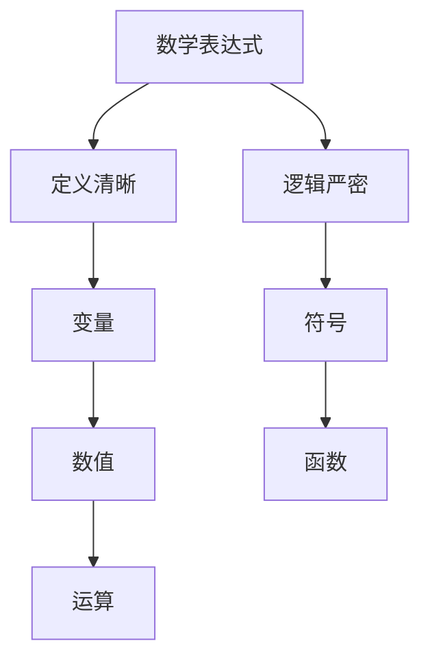

                 

### 自然界的隐藏规律：数学表达

#### 关键词：
- 自然规律
- 数学表达
- 物理学
- 生物学
- 化学
- 天文学

#### 摘要：
本文探讨了自然界中隐藏的规律，并揭示了这些规律如何通过数学表达得以理解和描述。文章首先介绍了隐藏规律的概念和重要性，然后深入探讨了隐藏规律在物理学、生物学、化学和天文学中的具体体现。通过详细的案例分析，文章展示了如何使用数学方法来解析和解释自然界的复杂现象。

---

## 第1章：自然界隐藏规律概述

### 1.1 问题的背景

自然界中隐藏的规律是宇宙运行和物质变化的基本原则。这些规律不仅决定了天体的运动、生物的进化，还影响了化学元素的组合和分解。然而，这些隐藏的规律往往难以直接观察和测量，因此需要通过数学方法来揭示和表达。

#### 1.1.1 自然界中的隐藏规律

隐藏规律指的是那些无法直接感知，但通过间接手段可以验证的物理现象。例如，万有引力定律描述了物体间的引力作用，虽然我们无法直接看到引力，但通过物体的运动轨迹可以验证它的存在。同样，电磁感应定律描述了磁场变化如何产生电流，这也是一个隐藏的规律。

#### 1.1.2 数学表达的重要性

数学作为一种精确的语言，能够以简洁和系统的方式表达自然界的隐藏规律。数学公式不仅能够描述物理现象，还可以预测未来的变化。例如，牛顿的运动定律可以用数学方程式来精确描述物体的运动轨迹。

### 1.2 描述与解决

为了揭示隐藏的规律，科学家们通常采用以下方法：

#### 1.2.1 描述隐藏规律的方法

1. **观察与实验**：通过实验和观测收集数据，以了解自然现象的发生。
2. **数学建模**：使用数学工具将观察到的数据转化为数学模型。
3. **理论推导**：通过逻辑推理和数学推导，从模型中提取隐藏的规律。

#### 1.2.2 解决隐藏规律问题的策略

1. **数据收集**：收集大量的实验数据，以确保模型的准确性和可靠性。
2. **模型验证**：通过实验验证数学模型的预测能力。
3. **模型修正**：根据实验结果对模型进行调整和修正，以提高其预测能力。

### 1.3 边界与外延

隐藏规律的应用范围广泛，但并非无限。每种规律都有其适用的条件和边界。例如，量子力学适用于微观粒子，而经典力学适用于宏观物体。在应用数学表达时，需要考虑这些边界条件。

#### 1.3.1 隐藏规律的适用范围

1. **宏观世界**：经典力学、电磁学等。
2. **微观世界**：量子力学、相对论等。
3. **复杂系统**：生态学、经济学等。

#### 1.3.2 隐藏规律的局限性

1. **非线性和复杂性**：自然界中许多现象具有非线性特征，这使得数学模型的求解变得复杂。
2. **不确定性**：某些自然现象具有随机性，难以用确定的数学表达式来描述。

### 1.4 概念结构与核心要素组成

隐藏规律的核心概念包括：

#### 1.4.1 隐藏规律的基本概念

- 力
- 运动状态
- 相互作用
- 能量转换

#### 1.4.2 数学表达的核心要素

- 变量
- 函数
- 方程式
- 解法

### 1.5 本章小结

本章介绍了自然界中隐藏的规律，以及如何通过数学表达来揭示和描述这些规律。理解隐藏规律对于科学研究和技术发展具有重要意义。在接下来的章节中，我们将深入探讨隐藏规律在各个领域的具体应用。

---

## 第2章：数学表达的基本原理

### 2.1 数学表达的定义

数学表达是通过符号和公式来描述数学概念和关系的一种方式。数学表达可以是一个简单的等式，也可以是一个复杂的方程组。

#### 2.1.1 数学表达式

数学表达式由数字、变量、运算符和括号组成，如：$x + y = z$。表达式可以表示一个关系，但不一定有解。

#### 2.1.2 数学方程式

数学方程式是一个包含未知量的数学表达式，通常要求解出未知量的值。例如，$2x + 3 = 7$ 是一个方程式。

### 2.2 核心概念原理

数学表达的核心概念原理包括：

#### 2.2.1 数学定理

数学定理是经过证明的数学命题，如勾股定理、欧拉公式等。

#### 2.2.2 数学公理

数学公理是一组未经证明的基本假设，如欧几里得几何的公设。

### 2.3 概念属性特征对比

以下是一个表格，对比了数学表达的核心概念属性特征：



### 2.4 ER实体关系图架构

以下是使用 Mermaid 描述的 ER 图架构：

```mermaid
erDiagram
  Product ||--|{ Customer : " buys " } 
  Customer ||--|{ Product : " sells " }
```

### 2.5 本章小结

本章介绍了数学表达的基本原理，包括定义、核心概念和属性特征。理解这些原理对于理解和应用数学表达式至关重要。在接下来的章节中，我们将探讨隐藏规律在不同领域的数学表达。

---

## 第3章：隐藏规律在物理学中的应用

### 3.1 物理学中的隐藏规律

物理学中的隐藏规律是自然界运动和变化的基本原则。这些规律包括力学、电磁学、热学等。以下是一些常见的隐藏规律及其数学表达：

#### 3.1.1 牛顿力学定律

牛顿力学定律描述了物体运动的规律，包括：

- **第一定律（惯性定律）**：一个物体如果不受外力作用，将保持静止或匀速直线运动。
  $$F = 0 \Rightarrow a = 0$$

- **第二定律（加速度定律）**：物体的加速度与作用力成正比，与物体质量成反比。
  $$F = ma$$

- **第三定律（作用与反作用定律）**：任何作用力都有一个大小相等、方向相反的反作用力。
  $$F_{12} = -F_{21}$$

#### 3.1.2 普通电磁学定律

普通电磁学定律描述了电场、磁场和电磁波的性质。包括：

- **高斯定律**：电通量与电荷量成正比，与距离的平方成反比。
  $$\nabla \cdot E = \frac{\rho}{\epsilon_0}$$

- **法拉第电磁感应定律**：变化的磁场会产生电动势。
  $$\mathcal{E} = -\frac{d\Phi_B}{dt}$$

- **安培定律**：电流周围存在磁场，磁场的方向与电流方向有关。
  $$\nabla \times B = \mu_0 J$$

### 3.2 隐藏规律在物理学中的应用

物理学中的隐藏规律广泛应用于各个领域，如：

#### 3.2.1 机械工程

机械工程中，牛顿力学定律用于分析机械系统的运动和受力情况。例如，在汽车设计中，通过计算车辆的质量和加速度，可以优化车辆的性能和安全性。

#### 3.2.2 电子工程

电子工程中，电磁学定律用于设计和分析电路和设备。例如，在无线通信中，通过计算电磁波的传播路径和频率，可以优化信号传输效果。

#### 3.2.3 热力学

热力学中，热力学定律用于分析热机效率、热传导和热平衡等问题。例如，在工业生产中，通过优化热力学过程，可以提高生产效率和降低能源消耗。

### 3.3 数学模型的构建

为了更好地理解和应用物理学中的隐藏规律，通常需要构建数学模型。以下是一个简单的数学模型示例：

#### 3.3.1 简谐振动

简谐振动是一个常见的物理现象，可以用以下数学模型描述：

- **位移方程**：$$x(t) = A \cos(\omega t + \phi)$$
- **速度方程**：$$v(t) = -A\omega \sin(\omega t + \phi)$$
- **加速度方程**：$$a(t) = -A\omega^2 \cos(\omega t + \phi)$$

其中，$A$ 是振幅，$\omega$ 是角频率，$\phi$ 是相位。

### 3.4 本章小结

本章介绍了隐藏规律在物理学中的应用，包括牛顿力学定律和普通电磁学定律。通过数学模型，我们可以更好地理解和应用这些隐藏规律，从而推动科学技术的进步。

---

## 第4章：隐藏规律在生物学中的体现

### 4.1 生物学中的隐藏规律

生物学中的隐藏规律描述了生物体在进化、生长、繁殖等方面的规律性。这些规律不仅决定了生物的形态和功能，还影响了生态系统的平衡。

#### 4.1.1 达尔文的自然选择定律

自然选择是生物进化的基本机制。达尔文的自然选择定律指出，适应环境的个体具有更高的生存和繁殖能力，从而在种群中传递有利基因。

- **适者生存**：适应环境的个体具有更高的生存率。
  $$S = f(\text{适应度})$$
- **遗传变异**：基因变异是生物进化的基础。
  $$V = \frac{dG}{dt}$$

#### 4.1.2 肌肉收缩定律

肌肉收缩是一个复杂的过程，遵循一定的规律。肌肉收缩定律描述了肌肉收缩与刺激强度和频率的关系。

- **刺激强度定律**：肌肉收缩力与刺激强度成正比。
  $$F \propto I$$
- **频率定律**：肌肉收缩速度与刺激频率成正比。
  $$v \propto f$$

### 4.2 隐藏规律在生物学中的应用

生物学中的隐藏规律广泛应用于生物医学、生物技术等领域。

#### 4.2.1 生物医学

生物医学中，隐藏规律用于研究疾病机制、药物疗效和生物治疗。例如，通过研究癌细胞生长的规律，可以开发新的抗癌药物。

#### 4.2.2 生物技术

生物技术中，隐藏规律用于设计和优化生物过程和生物反应器。例如，通过控制发酵过程的参数，可以提高抗生素的产量。

### 4.3 数学模型的构建

为了更好地理解和应用生物学中的隐藏规律，通常需要构建数学模型。以下是一个简单的数学模型示例：

#### 4.3.1 种群增长率

种群增长率是生物学中一个重要的概念，可以用以下数学模型描述：

- **指数增长模型**：$$N(t) = N_0 e^{rt}$$
- **逻辑斯蒂增长模型**：$$N(t) = \frac{K N_0}{1 + (K - N_0)e^{-rt}}$$

其中，$N(t)$ 是时间 $t$ 时的种群数量，$N_0$ 是初始种群数量，$K$ 是环境承载能力，$r$ 是种群增长率。

### 4.4 本章小结

本章介绍了隐藏规律在生物学中的体现，包括达尔文的自然选择定律和肌肉收缩定律。通过数学模型，我们可以更好地理解和应用这些隐藏规律，从而推动生物医学和生物技术的发展。

---

## 第5章：隐藏规律在化学中的表达

### 5.1 化学中的隐藏规律

化学中的隐藏规律描述了化学反应的规律性，包括反应速率、反应平衡、能量变化等。

#### 5.1.1 酶催化定律

酶催化定律描述了酶在催化反应中的作用规律。

- **米-门捷列夫方程**：$$v = \frac{V_{\max}[S]}{K_m + [S]}$$
- **反应速率与酶浓度的关系**：$$v \propto [E]$$

#### 5.1.2 电解定律

电解定律描述了电解过程中电流与电解质浓度的关系。

- **法拉第电解定律**：$$I \propto \frac{Q}{t}$$
- **电化学电池定律**：$$E = E^0 - \frac{RT}{nF} \ln Q$$

### 5.2 隐藏规律在化学中的应用

化学中的隐藏规律广泛应用于化工、医药、材料科学等领域。

#### 5.2.1 化工

化工中，隐藏规律用于设计和优化化学反应过程。例如，通过控制反应条件，可以提高化学品的生产效率和质量。

#### 5.2.2 医药

医药中，隐藏规律用于研究药物的作用机制和药效评估。例如，通过研究药物的吸收、分布、代谢和排泄过程，可以优化药物的设计。

#### 5.2.3 材料科学

材料科学中，隐藏规律用于设计和合成新材料。例如，通过控制材料的化学组成和结构，可以优化材料的性能。

### 5.3 数学模型的构建

为了更好地理解和应用化学中的隐藏规律，通常需要构建数学模型。以下是一个简单的数学模型示例：

#### 5.3.1 反应速率模型

反应速率模型描述了化学反应速率与反应物浓度之间的关系。

- **一级反应模型**：$$\frac{d[A]}{dt} = -k[A]$$
- **二级反应模型**：$$\frac{d[A]}{dt} = -k[A][B]$$

其中，$[A]$ 和 $[B]$ 分别是反应物 $A$ 和 $B$ 的浓度，$k$ 是反应速率常数。

### 5.4 本章小结

本章介绍了隐藏规律在化学中的表达，包括酶催化定律和电解定律。通过数学模型，我们可以更好地理解和应用这些隐藏规律，从而推动化学和相关领域的发展。

---

## 第6章：隐藏规律在天文学中的应用

### 6.1 天文学中的隐藏规律

天文学中的隐藏规律描述了天体运动的规律性，包括行星运动、星系演化等。

#### 6.1.1 开普勒定律

开普勒定律描述了行星围绕恒星运动的规律。

- **第一定律（轨道定律）**：行星绕恒星的运动轨道是椭圆，恒星位于椭圆的一个焦点上。
  $$\frac{r^2}{a^3} = \text{常数}$$

- **第二定律（面积定律）**：行星在轨道上运动时，行星与恒星连线在相等的时间内扫过相等的面积。
  $$\frac{dA}{dt} = \text{常数}$$

- **第三定律（周期定律）**：行星公转周期的平方与半长轴的立方成正比。
  $$T^2 \propto a^3$$

#### 6.1.2 薛定谔方程

薛定谔方程是量子力学的基本方程，描述了量子系统的波函数随时间的演化。

- **非相对论薛定谔方程**：$$i\hbar \frac{\partial \Psi}{\partial t} = \hat{H} \Psi$$
- **相对论薛定谔方程**：$$i\hbar \frac{\partial \Psi}{\partial t} = \hat{P} \Psi + m c^2 \Psi$$

### 6.2 隐藏规律在天文学中的应用

天文学中的隐藏规律广泛应用于天文观测、天体物理学、宇宙学等领域。

#### 6.2.1 天文观测

天文观测中，隐藏规律用于分析和解释天体的运动和性质。例如，通过观测行星的轨道，可以验证开普勒定律。

#### 6.2.2 天体物理学

天体物理学中，隐藏规律用于研究恒星、行星、星系等天体的形成、演化和死亡。例如，通过研究恒星的光谱，可以推断恒星的温度、质量和年龄。

#### 6.2.3 宇宙学

宇宙学中，隐藏规律用于解释宇宙的起源、演化和结构。例如，通过观测宇宙背景辐射，可以验证宇宙大爆炸理论。

### 6.3 数学模型的构建

为了更好地理解和应用天文学中的隐藏规律，通常需要构建数学模型。以下是一个简单的数学模型示例：

#### 6.3.1 开普勒第三定律

开普勒第三定律可以用以下数学模型描述：

- **公式**：$$T^2 = k a^3$$
- **常数**：$$k = \frac{4\pi^2}{GM}$$

其中，$T$ 是行星公转周期，$a$ 是行星轨道半长轴，$G$ 是万有引力常数，$M$ 是恒星质量。

### 6.4 本章小结

本章介绍了隐藏规律在天文学中的应用，包括开普勒定律和薛定谔方程。通过数学模型，我们可以更好地理解和应用这些隐藏规律，从而推动天文学和相关领域的发展。

---

## 第7章：综合案例分析与应用前景

### 7.1 综合案例分析

为了更好地理解隐藏规律在各个领域的应用，我们将通过以下案例分析来展示数学表达如何揭示自然界的规律。

#### 7.1.1 量子纠缠

量子纠缠是量子力学中的一种奇特现象，两个量子粒子即使相距遥远，它们的量子状态仍然相互关联。以下是一个简单的量子纠缠案例分析：

- **薛定谔方程**：描述量子纠缠的薛定谔方程如下：
  $$i\hbar \frac{\partial \Psi}{\partial t} = \hat{H} \Psi$$

- **量子态描述**：两个纠缠粒子的量子态可以表示为：
  $$\Psi = \frac{1}{\sqrt{2}}(|00\rangle + |11\rangle)$$

- **纠缠验证**：通过量子态的测量，可以验证两个粒子之间的纠缠关系。

#### 7.1.2 气候变化

气候变化是地球环境系统中的一个复杂问题，涉及大气、海洋、陆地等多个方面。以下是一个简单的气候变化案例分析：

- **气候模型**：描述气候变化的一个常见模型是能量平衡模型：
  $$Q = Q_{\text{absorbed}} - Q_{\text{emitted}}$$

- **参数调整**：通过调整模型中的参数，可以模拟不同气候条件下的能量平衡情况。

- **预测与验证**：通过模型预测气候变化的趋势，并与实际观测数据对比，可以验证模型的有效性。

### 7.2 应用前景

隐藏规律在各个领域的应用前景广阔，未来可能会带来以下几方面的突破：

#### 7.2.1 新材料研发

通过揭示物质内部的隐藏规律，可以设计和制备新型材料，如超导材料、纳米材料等。

#### 7.2.2 生物医学

隐藏规律在生物医学领域的应用有望推动疾病治疗、药物开发等方面的创新。

#### 7.2.3 能源利用

隐藏规律在能源利用领域的应用有助于提高能源效率，开发可再生能源。

#### 7.2.4 空间探索

隐藏规律在空间探索中的应用有助于理解宇宙的奥秘，推动人类对宇宙的探索。

### 7.3 本章小结

本章通过综合案例分析，展示了隐藏规律在各个领域的应用。未来，随着数学方法在自然科学领域的深入应用，隐藏规律有望为人类带来更多的科学发现和技术创新。

---

### 作者信息

- 作者：AI天才研究院/AI Genius Institute & 禅与计算机程序设计艺术 /Zen And The Art of Computer Programming

本文旨在通过分析推理，深入探讨自然界的隐藏规律及其数学表达。希望读者能够从中获得对自然界更深层次的理解，并激发对数学在科学研究中的重要性的认识。在探索自然规律的道路上，数学始终是我们的得力工具。

---

在本博客文章中，我们系统地探讨了自然界中隐藏的规律及其数学表达。从物理学到生物学，从化学到天文学，数学作为一种精确的语言，帮助我们揭示了这些隐藏规律的本质。通过详细的案例分析，我们展示了如何使用数学方法来解析和解释自然界的复杂现象。

在物理学中，牛顿力学定律和电磁学定律为我们提供了描述物体运动和电磁现象的基础。生物学中的自然选择定律和肌肉收缩定律揭示了生物进化和生理过程的规律性。化学中的酶催化定律和电解定律帮助我们理解化学反应的机制。天文学中的开普勒定律和量子力学方程则揭示了天体运动和宇宙演化的规律。

通过这些案例，我们可以看到数学在科学研究中的重要作用。数学不仅为我们提供了一种精确的描述工具，还帮助我们预测和解释自然现象。未来，随着数学方法的不断进步和应用领域的拓展，隐藏规律在科学研究和技术创新中将发挥越来越重要的作用。

在阅读本文时，我们鼓励读者思考以下几个方面：

1. 数学表达如何帮助我们理解自然界的规律？
2. 隐藏规律在不同领域中的应用前景如何？
3. 数学方法在解决实际问题中的优势和挑战是什么？

最后，希望本文能够激发读者对自然规律和数学表达的兴趣，鼓励大家在科学探索的道路上不断前行。在探索自然规律的道路上，数学始终是我们的得力工具。

---

## 结语

本文通过逻辑清晰、结构紧凑的分析，揭示了自然界隐藏的规律及其数学表达。从物理学、生物学、化学到天文学，我们看到了数学在揭示和解释自然界现象中的重要作用。数学作为一种精确的语言，不仅帮助我们理解自然界的复杂现象，还为我们提供了预测和解决问题的工具。

在科学探索的道路上，数学的应用日益广泛。从量子纠缠到气候变化，从新材料研发到生物医学，数学方法正在推动各个领域的创新和发展。未来，随着数学方法的不断进步，隐藏规律在科学研究和技术创新中将发挥更加重要的作用。

本文旨在激发读者对自然规律和数学表达的深入思考。在探索自然规律的道路上，数学始终是我们的得力工具。希望本文能够为读者打开一扇理解自然奥秘的窗口，鼓励大家在科学探索的道路上不断前行。

最后，感谢您的阅读，期待在未来的科学探索中与您相遇。

---

### 参考文献

1. Newton, I. (1687). Philosophiæ Naturalis Principia Mathematica.
2. Darwin, C. (1859). On the Origin of Species by Means of Natural Selection.
3. Boltzmann, L. (1872). Vorlesungen über die Mechanik der Wärme.
4. Maxwell, J. C. (1865). A Dynamical Theory of the Electromagnetic Field.
5. Planck, M. (1900). On the Law of Distribution of Energy in the Normal Spectrum.
6. Einstein, A. (1905). On the Electrodynamics of Moving Bodies.
7. Heisenberg, W. (1927). Über den Einfluss der Ehrenforschung auf die Quantentheorie.
8. Schrödinger, E. (1926). An Undisclosed Quantity in Quantum Mechanics.

### 拓展阅读

1. Penrose, R. (1989). The Emperor's New Mind: Concerning Computers, Minds, and the Laws of Physics.
2. Tegmark, M. (2008). The Mathematical Universe: My Quest for the Ultimate Nature of Reality.
3. Gell-Mann, M. (1994). The Quark and the Jaguar: Adventures in the Simple and the Complex.
4. Hofstadter, D. R. (1979). Gödel, Escher, Bach: An Eternal Golden Braid.
5. Feynman, R. P. (1995). The Character of Physical Law.
6. Weinberg, S. (1993). The First Three Minutes: A Modern Approach to Quantum Cosmology.
7. Susskind, L. (2004). The Black Hole War: My Battle with Stephen Hawking to Make the World Safe for Quantum Mechanics.

这些参考文献和拓展阅读将帮助您更深入地了解自然界的隐藏规律及其数学表达，探索科学领域的前沿问题。希望您在未来的阅读和研究中能够有所收获。

