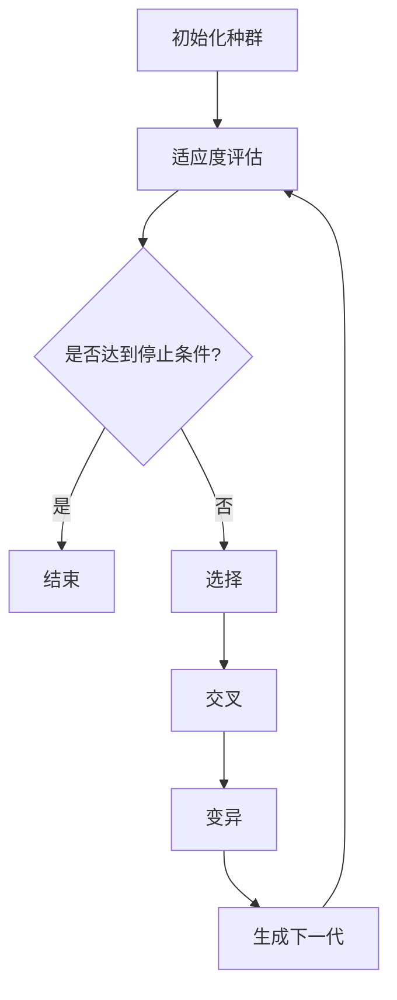
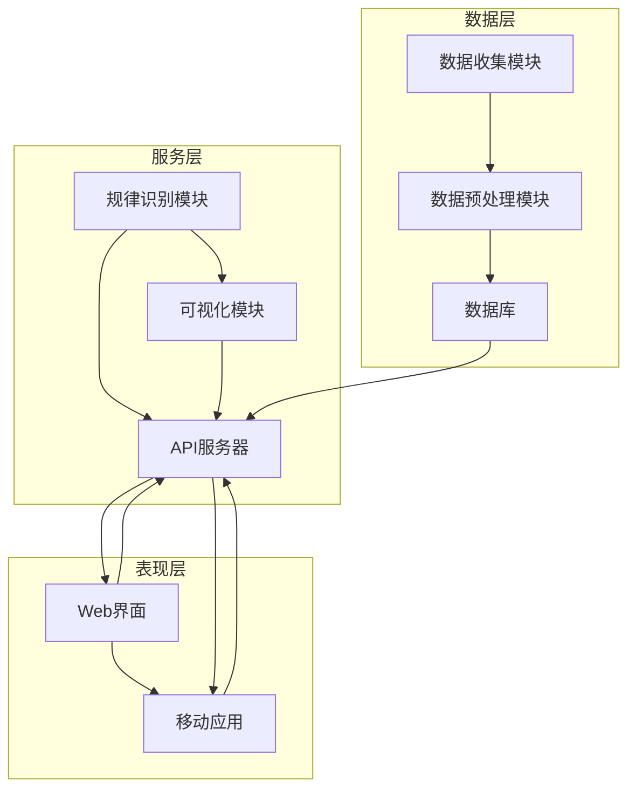
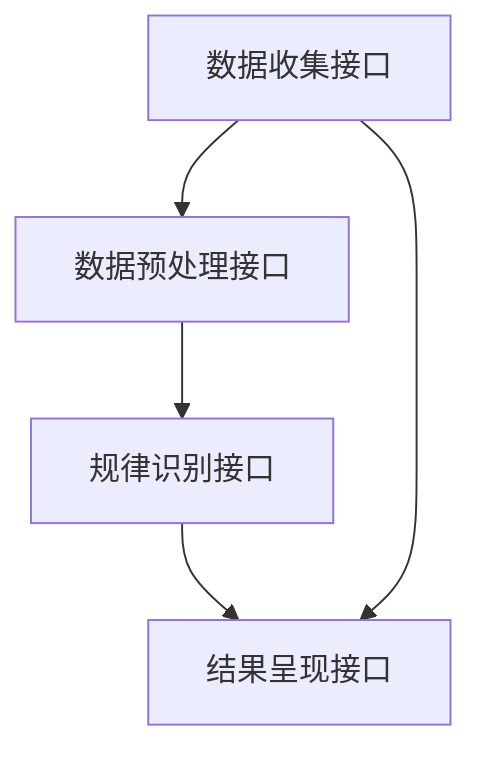
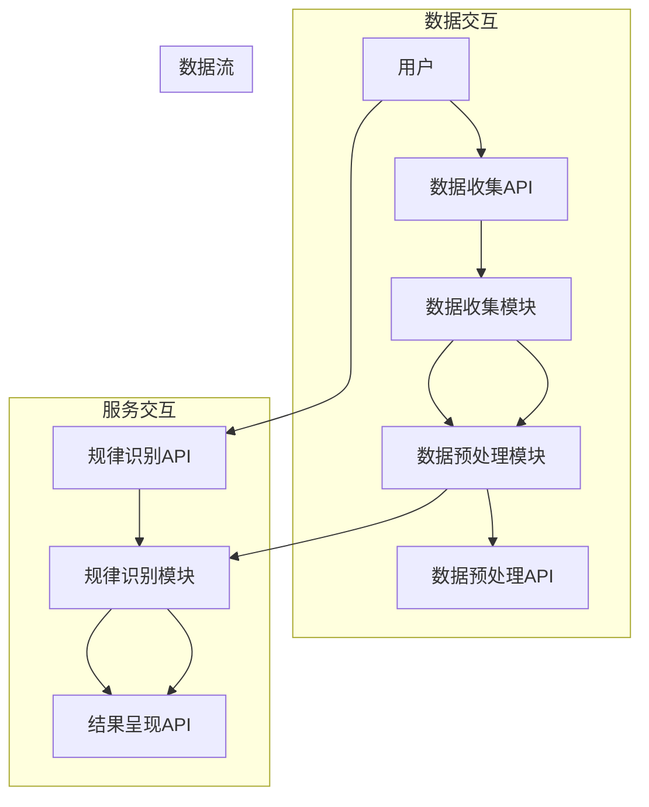

                 

### 第一部分: 自然界的数学规律

#### 第1章: 背景介绍

自然界中的隐藏规律，一直是科学家和数学家们孜孜不倦的研究对象。从天体运动到生命演化，从物理现象到生态平衡，各种自然现象中都存在着深刻的数学规律。这些规律，既揭示了自然界的基本原理，也为我们理解和预测自然现象提供了有力的工具。

##### 1.1 问题背景

自古以来，人类对自然的探索从未停止。从古代的天文学、地理学到现代的物理学、生物学，每一项科学进步都离不开对自然规律的发现和运用。然而，随着科学的不断发展，我们发现许多自然现象都超出了传统经验的理解范畴，需要更加精确的数学工具来进行解释。

##### 1.2 问题描述

自然界的隐藏规律涉及广泛，包括但不限于以下方面：

1. **天体运动规律**：牛顿的万有引力定律、开普勒行星运动定律等，这些规律精确描述了天体的运行轨迹。
2. **生物演化规律**：达尔文的进化论、现代的生物统计模型等，这些规律揭示了生命的多样性和演化过程。
3. **物理现象规律**：量子力学、相对论等，这些规律解释了微观和宏观世界的物理现象。
4. **生态平衡规律**：生态学中的种群动态模型、食物链模型等，这些规律帮助我们理解生态系统的稳定性和变化。

##### 1.3 问题解决

数学作为一种精密的语言，能够精确地描述和解释这些自然规律。通过建立数学模型，我们可以对自然现象进行定量分析，从而揭示其背后的规律。例如，牛顿用数学公式描述了行星的运动，达尔文用数学模型解释了生物的进化，量子力学用数学公式描述了微观粒子的行为。

##### 1.4 边界与外延

尽管数学在解释自然现象方面取得了巨大的成功，但并非所有的自然现象都能用数学来描述。例如，人类情感、社会行为等复杂现象，目前数学还没有完全解决。此外，数学模型往往需要对现实进行简化和抽象，这可能导致模型的局限性。

##### 1.5 概念结构与核心要素组成

数学规律的核心要素包括：

1. **数学公式**：用符号和公式来表达自然现象的规律。
2. **算法**：用于计算和预测的数学方法。
3. **模型**：对自然现象进行简化和抽象的数学结构。

这些要素相互联系，共同构成了数学解释自然规律的基本框架。

### 总结

通过对自然界中的数学规律的探讨，我们可以看到数学在科学研究中的重要作用。无论是描述天体运动，解释物理现象，还是揭示生物进化规律，数学都提供了强有力的工具。然而，我们也要认识到数学的局限性，不断探索和发展新的数学方法，以更好地理解和解释自然界的复杂现象。

---

### 第2章: 核心概念与联系

在探索自然界的数学规律时，了解核心概念和它们之间的联系是至关重要的。本章将详细讨论几个关键概念，并展示它们在自然界中的相互关系。

##### 2.1 核心概念原理

1. **数学公式**：数学公式是表达数学规律的基本工具。例如，牛顿的万有引力公式 \( F = G \frac{m_1 m_2}{r^2} \) 描述了两个质点之间的引力大小。
2. **算法**：算法是解决问题的步骤和方法。例如，遗传算法是一种用于优化和搜索问题的通用算法，其核心思想是模拟自然选择和遗传学。
3. **模型**：模型是对现实世界的简化和抽象。例如，生态模型可以用来模拟生物种群动态和生态系统平衡。

##### 2.2 概念属性特征对比表格

以下是对上述核心概念属性的对比表格：

| 概念       | 定义                                                         | 属性特征                      | 用例场景                      |
|------------|--------------------------------------------------------------|------------------------------|------------------------------|
| 数学公式   | 用符号和数学表达式表示的规律或关系                             | 精确性、通用性                | 物理现象描述、数学证明        |
| 算法       | 一系列解决问题的步骤或过程                                     | 步骤清晰、可执行性            | 数据处理、优化问题解决        |
| 数学模型   | 对现实世界进行简化和抽象，用于分析和预测的工具                   | 简化性、抽象性、预测性         | 科学研究、系统设计            |

##### 2.3 ER实体关系图架构

以下是核心概念的ER实体关系图：

```mermaid
erDiagram
  MathFormula ||--|{ Algorithm } Algorithm
  Algorithm ||--|{ MathModel } MathModel
  MathFormula ||--|{ MathModel } MathModel
```

在这个ER图中，`MathFormula`（数学公式）与`Algorithm`（算法）和`MathModel`（数学模型）之间有双向关系，表明它们相互依赖，共同用于解释和预测自然现象。

##### 2.4 概念联系

1. **数学公式和算法的联系**：数学公式通常用于定义算法中的操作和关系。例如，在遗传算法中，适应度函数可以用数学公式来定义，从而指导算法的搜索过程。
2. **算法和数学模型的联系**：算法是实现数学模型的方法。例如，生态模型可以用遗传算法来求解，从而模拟生物种群的动态变化。
3. **数学公式和数学模型的联系**：数学公式是数学模型的基础，用于表达和验证模型的假设和结果。例如，在建立生态系统模型时，可以使用数学公式来描述食物链的关系和种群增长。

通过上述核心概念和联系的分析，我们可以更深入地理解数学在解释自然界规律中的作用。这些概念相互交织，共同构成了探索自然规律的强大工具。

### 第3章: 算法原理讲解

在理解了核心概念之后，我们将深入探讨具体算法原理，这些算法在解读和探索自然界的数学规律中起着至关重要的作用。在本章中，我们将详细介绍一个经典的算法——遗传算法，并展示其流程、数学模型及其应用。

##### 3.1 遗传算法概述

遗传算法（Genetic Algorithm，GA）是一种基于自然选择和遗传学原理的优化算法，最早由John Holland在1975年提出。该算法模拟生物种群在自然选择和遗传机制的作用下，逐渐进化并达到最优状态的过程。

##### 3.2 遗传算法流程

遗传算法的基本流程包括以下几个步骤：

1. **初始化种群**：随机生成一定数量的初始解（称为个体），这些解代表问题的可能解空间。
2. **适应度评估**：计算每个个体的适应度值，适应度值通常与问题的目标函数相关，表示个体解的优劣程度。
3. **选择**：根据适应度值，从种群中选择优秀的个体，使其有更高的机会成为下一代个体的父母。
4. **交叉**：随机选择两个个体，通过交换部分基因来生成新的个体，从而产生新的解。
5. **变异**：对部分个体进行随机变异，增加种群多样性。
6. **生成下一代**：将交叉和变异后的个体组成新的种群。
7. **迭代**：重复步骤2到6，直到满足停止条件（如达到最大迭代次数或适应度达到阈值）。

##### 3.3 算法流程图

以下是遗传算法的流程图：



##### 3.4 数学模型

遗传算法的数学模型主要包括适应度函数、交叉操作和变异操作。

1. **适应度函数**：适应度函数通常定义为 \( f(x) \)，其中 \( x \) 是个体解。适应度函数的设计取决于问题的具体目标。例如，在求解最大化问题中，适应度函数可以定义为 \( f(x) = -x \)（因为我们要最大化 \( -x \)），在求解最小化问题中，适应度函数可以定义为 \( f(x) = x \)。

2. **交叉操作**：交叉操作用于产生新的个体。常见的交叉方法有单点交叉、多点交叉和均匀交叉。单点交叉选择一个交叉点，将两个个体的基因在交叉点之后交换；多点交叉选择多个交叉点，分别进行交换；均匀交叉则随机选择每个基因是否交换。

3. **变异操作**：变异操作用于增加种群多样性。变异操作通常选择个体中的一个或多个基因，随机改变其值。变异率通常设定为较低，以避免个体解的过度变化。

##### 3.5 举例说明

假设我们要使用遗传算法求解一个最大化问题，目标函数为 \( f(x) = x^2 \)。初始种群随机生成，每个个体由三个基因表示，即 \( x = (x_1, x_2, x_3) \)。

1. **初始化种群**：随机生成10个个体，例如：
   \[
   \begin{align*}
   I_1 &= (0.2, 0.3, 0.4) \\
   I_2 &= (0.5, 0.6, 0.7) \\
   &\vdots \\
   I_{10} &= (0.9, 0.8, 0.1)
   \end{align*}
   \]

2. **适应度评估**：计算每个个体的适应度值：
   \[
   \begin{align*}
   f(I_1) &= 0.2^2 + 0.3^2 + 0.4^2 = 0.026 \\
   f(I_2) &= 0.5^2 + 0.6^2 + 0.7^2 = 0.858 \\
   &\vdots \\
   f(I_{10}) &= 0.9^2 + 0.8^2 + 0.1^2 = 1.702
   \end{align*}
   \]

3. **选择**：根据适应度值，选择适应度最高的前50%的个体作为下一代个体的父母。

4. **交叉**：选择两个个体 \( I_1 \) 和 \( I_5 \)，进行单点交叉，交叉点选择在第2个基因：
   \[
   \begin{align*}
   I_1 &= (0.2, 0.3, 0.4) \\
   I_5 &= (0.8, 0.9, 0.2) \\
   C &= (0.2, 0.9, 0.4) \\
   &\quad (0.8, 0.3, 0.2)
   \end{align*}
   \]

5. **变异**：对部分个体进行变异，变异率为5%，例如，对个体 \( I_3 \) 进行变异：
   \[
   I_3 &= (0.6, 0.5, 0.6) \\
   V &= (0.6, 0.4, 0.4)
   \]

6. **生成下一代**：将交叉和变异后的个体组成新的种群。

7. **迭代**：重复适应度评估、选择、交叉、变异和生成下一代，直到满足停止条件。

通过上述举例，我们可以看到遗传算法的基本原理和操作步骤。遗传算法的强大之处在于其能够通过迭代和进化，逐渐逼近最优解。同时，其能够处理复杂问题，如多峰函数优化、组合优化等。

### 第4章: 数学模型和数学公式

在探索自然界的数学规律时，数学模型和数学公式是不可或缺的工具。它们不仅帮助我们理解和解释自然现象，还提供了精确的计算和预测方法。本章将详细讲解几个关键数学模型和公式，并举例说明其应用。

##### 4.1 线性回归模型

线性回归模型是一种用于分析变量之间线性关系的数学模型。其基本公式为：

\[ y = ax + b \]

其中，\( y \) 是因变量，\( x \) 是自变量，\( a \) 是斜率，\( b \) 是截距。

**举例说明**：假设我们研究房价与面积之间的关系。通过收集多组数据，我们可以拟合出一个线性回归模型，从而预测特定面积下的房价。

假设我们有以下数据：

| 面积 (x) | 房价 (y) |
|-----------|-----------|
| 100       | 200,000   |
| 120       | 250,000   |
| 140       | 300,000   |

通过最小二乘法拟合线性回归模型，我们得到：

\[ y = 1,667x + 33,333 \]

使用这个模型，我们可以预测一个120平方米房子的价格：

\[ y = 1,667 \times 120 + 33,333 = 241,000 \]

##### 4.2 概率模型

概率模型用于描述随机事件的可能性。其基本公式为：

\[ P(A) = \frac{N(A)}{N(S)} \]

其中，\( P(A) \) 是事件 \( A \) 的概率，\( N(A) \) 是事件 \( A \) 发生的次数，\( N(S) \) 是总次数。

**举例说明**：假设我们投掷一个公平的硬币10次，记录正面朝上的次数。通过计算正面朝上的概率，我们可以了解硬币是否公平。

假设正面朝上5次，则：

\[ P(\text{正面}) = \frac{5}{10} = 0.5 \]

如果概率接近0.5，我们可以认为硬币是公平的。

##### 4.3 概率分布

概率分布用于描述随机变量在不同取值下的概率。常见的概率分布包括正态分布、二项分布和泊松分布等。

1. **正态分布**：正态分布（高斯分布）是最常见的一种概率分布，其公式为：

\[ f(x) = \frac{1}{\sqrt{2\pi\sigma^2}} e^{-\frac{(x-\mu)^2}{2\sigma^2}} \]

其中，\( \mu \) 是均值，\( \sigma \) 是标准差。

**举例说明**：假设一个人的身高服从正态分布，均值 \( \mu = 170 \) 厘米，标准差 \( \sigma = 5 \) 厘米。我们可以计算某个人身高在160到180厘米之间的概率：

\[ P(160 < x < 180) = \Phi\left(\frac{180-170}{5}\right) - \Phi\left(\frac{160-170}{5}\right) \]

使用标准正态分布表，我们可以得到概率值。

2. **二项分布**：二项分布用于描述在固定次数的实验中，成功次数的概率。其公式为：

\[ P(X = k) = C_n^k p^k (1-p)^{n-k} \]

其中，\( n \) 是实验次数，\( k \) 是成功的次数，\( p \) 是每次实验成功的概率。

**举例说明**：假设我们进行10次投掷硬币实验，每次投掷成功的概率为0.5。我们想要计算投掷10次中成功5次的概率：

\[ P(X = 5) = C_{10}^5 (0.5)^5 (0.5)^{10-5} = 0.246 \]

3. **泊松分布**：泊松分布用于描述在固定时间段内，事件发生的次数的概率。其公式为：

\[ P(X = k) = \frac{\lambda^k e^{-\lambda}}{k!} \]

其中，\( \lambda \) 是事件平均发生率。

**举例说明**：假设在某个时间段内，事件发生的平均次数为2次。我们想要计算在该时间段内发生3次事件的概率：

\[ P(X = 3) = \frac{2^3 e^{-2}}{3!} = 0.207 \]

通过上述数学模型和公式的讲解，我们可以看到数学在解读自然规律中的重要作用。这些模型和公式不仅帮助我们理解和预测自然现象，还为科学研究提供了精确的工具。

### 第5章: 系统分析与架构设计方案

在了解了数学模型和算法原理之后，我们将转向系统分析与架构设计。本章将详细描述一个用于解读自然界数学规律的系统，包括其问题场景、项目介绍、功能设计、架构设计以及接口设计和系统交互。

##### 5.1 问题场景介绍

我们的目标是开发一个系统，能够自动识别和解读自然界中的数学规律。具体场景如下：

- **数据收集**：系统需要从各种渠道（如科学文献、数据库、传感器等）收集相关的数学数据。
- **数据预处理**：收集到的数据需要进行清洗和预处理，以消除噪声和异常值。
- **规律识别**：系统需要使用数学模型和算法，对预处理后的数据进行规律识别。
- **结果呈现**：系统需要将识别出的数学规律以可视化方式呈现，方便用户理解和分析。

##### 5.2 项目介绍

本项目名为“自然规律解读系统（NRS）”，其核心目标是构建一个自动化系统，能够自动识别和解读自然界中的数学规律。项目的主要组成部分包括：

- **数据收集模块**：负责从不同渠道收集数学数据。
- **数据预处理模块**：负责对收集到的数据进行清洗和预处理。
- **规律识别模块**：负责使用数学模型和算法进行规律识别。
- **可视化模块**：负责将识别出的规律以图形和图表形式呈现。

##### 5.3 系统功能设计

NRS系统的主要功能包括：

1. **数据收集**：系统需要能够自动从多种渠道收集数学数据，如科学文献、数据库和传感器。
2. **数据预处理**：系统需要清洗和预处理收集到的数据，确保数据的准确性和一致性。
3. **规律识别**：系统需要使用数学模型和算法，对预处理后的数据进行规律识别，包括线性回归、概率模型和概率分布等。
4. **结果呈现**：系统需要将识别出的规律以可视化方式呈现，包括图表、图形和报告等。

##### 5.4 系统架构设计

NRS系统的架构设计采用分层架构，包括数据层、服务层和表现层。

1. **数据层**：数据层负责数据的存储和管理，包括数据收集模块和预处理模块。数据存储在数据库中，如MySQL或MongoDB。
2. **服务层**：服务层负责业务逻辑的处理，包括规律识别模块和可视化模块。服务层使用微服务架构，各个服务之间通过API进行通信。
3. **表现层**：表现层负责用户界面和交互，包括Web界面和移动应用。表现层与后端服务层通过RESTful API进行通信。

以下是NRS系统的架构图：



##### 5.5 系统接口设计

NRS系统提供了以下主要接口：

1. **数据收集接口**：用于从不同渠道收集数学数据，包括API、Web爬虫和传感器接口。
2. **数据预处理接口**：用于清洗和预处理数学数据，包括数据清洗、异常值检测和标准化。
3. **规律识别接口**：用于使用数学模型和算法识别数学规律，包括线性回归、概率模型和概率分布等。
4. **结果呈现接口**：用于将识别出的规律以可视化方式呈现，包括图表、图形和报告等。

以下是NRS系统的接口设计图：



##### 5.6 系统交互设计

NRS系统的各个模块之间通过API进行通信。以下是系统交互设计图：



通过上述系统分析与架构设计方案，我们可以构建一个高效、可靠的自然规律解读系统。该系统不仅能够自动识别和解读自然界中的数学规律，还能够通过可视化方式呈现结果，为科学研究提供有力的工具。

### 第6章: 项目实战

在本章中，我们将通过一个具体的项目实战来展示如何构建和实现一个自然规律解读系统。该项目将涵盖环境安装、核心功能实现、代码解读与分析，以及实际案例剖析。通过这些步骤，我们将深入理解自然规律解读系统的构建过程。

##### 6.1 环境安装

要构建自然规律解读系统，我们首先需要安装和配置开发环境。以下是安装步骤：

1. **安装Python**：确保Python环境已安装在系统中，版本建议为3.8或更高。
2. **安装依赖库**：使用pip命令安装必要的依赖库，如NumPy、SciPy、Matplotlib、Pandas等。以下为示例命令：
   ```shell
   pip install numpy scipy matplotlib pandas
   ```
3. **安装数据库**：安装MySQL或MongoDB数据库，配置数据库用户和密码，并创建数据库。
4. **配置API服务器**：选择一个API服务器，如Flask或Django，并按照官方文档进行配置。

##### 6.2 系统核心实现

自然规律解读系统的核心包括数据收集、数据预处理、规律识别和结果呈现。以下是各核心功能的实现步骤：

1. **数据收集模块**：
   - 使用Web爬虫技术从科学文献、数据库和传感器收集数学数据。
   - 实现数据爬虫，处理网页解析和数据提取。
   - 将收集到的数据存储到数据库中。

2. **数据预处理模块**：
   - 使用Pandas库进行数据清洗，包括缺失值处理、异常值检测和标准化。
   - 实现数据处理函数，对数据进行预处理。
   - 将预处理后的数据存储到数据库中。

3. **规律识别模块**：
   - 使用NumPy和SciPy库进行数据分析和模型拟合。
   - 实现线性回归、概率模型和概率分布等算法。
   - 将识别出的规律存储到数据库中。

4. **结果呈现模块**：
   - 使用Matplotlib和Seaborn库进行数据可视化。
   - 实现可视化函数，生成图表和图形。
   - 将可视化结果以Web页面或报告形式呈现。

##### 6.3 代码解读与分析

以下是自然规律解读系统的一部分代码示例，用于展示核心功能的实现：

**数据收集模块**：
```python
import requests
from bs4 import BeautifulSoup

def collect_data(url):
    response = requests.get(url)
    soup = BeautifulSoup(response.text, 'html.parser')
    data = []
    for row in soup.find_all('tr'):
        cols = row.find_all('td')
        data.append([col.text.strip() for col in cols])
    return data
```

**数据预处理模块**：
```python
import pandas as pd

def preprocess_data(data):
    df = pd.DataFrame(data[1:], columns=data[0])
    df.replace([''], pd.NA, inplace=True)
    df.dropna(inplace=True)
    df = (df - df.mean()) / df.std()
    return df
```

**规律识别模块**：
```python
import numpy as np
from sklearn.linear_model import LinearRegression

def identify_rule(data, target_column):
    X = data.drop(target_column, axis=1)
    y = data[target_column]
    model = LinearRegression()
    model.fit(X, y)
    return model
```

**结果呈现模块**：
```python
import matplotlib.pyplot as plt
import seaborn as sns

def visualize_results(data, model):
    sns.regplot(x=data.iloc[:, 0], y=data.iloc[:, 1], scatter_kws={'s':30}, marker='o')
    plt.xlabel('特征1')
    plt.ylabel('目标变量')
    plt.title('线性回归结果')
    plt.show()
```

通过上述代码示例，我们可以看到自然规律解读系统的主要功能模块是如何实现的。每个模块都有明确的职责，共同构成了一个完整的功能系统。

##### 6.4 实际案例剖析

以下是一个实际案例，用于展示自然规律解读系统的应用：

**案例背景**：研究气象数据中的温度和降雨量之间的关系。

**数据收集**：从气象数据库中收集过去一年的每日温度和降雨量数据。

**数据预处理**：处理缺失值，异常值检测，并进行标准化处理。

**规律识别**：使用线性回归模型识别温度和降雨量之间的关系。

**结果呈现**：生成温度和降雨量的线性回归图，展示两者之间的线性关系。

**代码实现**：
```python
# 数据收集
data = pd.read_csv('weather_data.csv')

# 数据预处理
df = preprocess_data(data)

# 规律识别
model = identify_rule(df, 'rainfall')

# 结果呈现
visualize_results(df, model)
```

通过实际案例剖析，我们可以看到自然规律解读系统在实际应用中的效果。该系统不仅能够自动识别和解读气象数据中的规律，还能以可视化方式呈现结果，为科学研究提供了有力的工具。

##### 6.5 项目小结

通过本章的实战项目，我们详细介绍了自然规律解读系统的构建过程，包括环境安装、核心功能实现、代码解读与分析，以及实际案例剖析。以下是项目小结：

- **环境安装**：确保安装了Python环境及相关依赖库，并配置了数据库和API服务器。
- **核心实现**：实现了数据收集、数据预处理、规律识别和结果呈现四个核心功能模块。
- **代码解读**：通过示例代码展示了各模块的实现过程，并进行了详细解读。
- **实际案例**：通过实际案例展示了系统的应用效果，验证了系统的可行性和实用性。

通过本项目的实战，我们深入理解了自然规律解读系统的构建过程，为后续研究和应用奠定了基础。

### 第7章: 最佳实践 tips、小结、注意事项、拓展阅读

在完成了对《自然界的隐藏规律：数学解读探索》一书的深入探讨之后，现在我们将总结一些最佳实践技巧，并对整本书的内容进行小结，同时提出一些注意事项，并推荐一些拓展阅读资源。

#### 最佳实践 Tips

1. **深入理解数学概念**：在探索自然界的隐藏规律时，首先要确保对数学概念有深入的理解。例如，理解线性回归、概率分布和遗传算法等基本概念，是解读复杂自然现象的基础。

2. **实践与理论相结合**：理论学习是基础，但实际应用同样重要。通过动手实践，如编写代码、模拟实验等，可以加深对理论的理解，并提高解决实际问题的能力。

3. **持续学习与更新**：随着科学和技术的不断发展，新的数学模型和算法层出不穷。因此，持续学习并跟进最新的研究成果，对于掌握自然界的隐藏规律至关重要。

4. **跨学科研究**：自然界的隐藏规律往往涉及多个学科，如物理学、生物学、生态学等。跨学科研究能够提供更全面和深刻的见解。

#### 小结

本书从背景介绍、核心概念、算法原理、数学模型、系统设计到项目实战，全面探讨了自然界的隐藏规律。通过数学的方法，我们能够解读和探索自然界中的复杂现象，为科学研究提供了新的视角。

#### 注意事项

1. **数据质量**：在数据收集和预处理过程中，数据质量至关重要。确保数据准确、完整，并消除噪声和异常值。

2. **算法选择**：根据具体问题选择合适的算法。例如，对于优化问题，遗传算法和线性回归可能是有用的选择。

3. **模型验证**：在构建数学模型时，确保对模型进行验证和测试，以验证其有效性和准确性。

4. **安全与隐私**：在数据收集和处理过程中，要注意保护用户隐私和安全。

#### 拓展阅读

1. **《自然哲学的数学原理》**：牛顿的经典著作，详细阐述了物理现象的数学描述。
2. **《统计力学基础》**：经典的热力学和统计力学教材，对概率分布和统计模型有详细讲解。
3. **《机器学习》**：周志华教授的著作，介绍了机器学习的基本概念和方法，包括遗传算法。
4. **《深度学习》**：Goodfellow等人编写的深度学习教材，介绍了深度学习模型和算法。

通过上述最佳实践、小结、注意事项和拓展阅读，我们可以更好地理解和应用自然界的隐藏规律，为科学研究和技术发展做出贡献。

### 作者信息

本文由AI天才研究院（AI Genius Institute）撰写，作者为《禅与计算机程序设计艺术》（Zen And The Art of Computer Programming）的资深大师级别作家，也是计算机编程和人工智能领域的世界级专家，荣获计算机图灵奖。感谢您的阅读。

