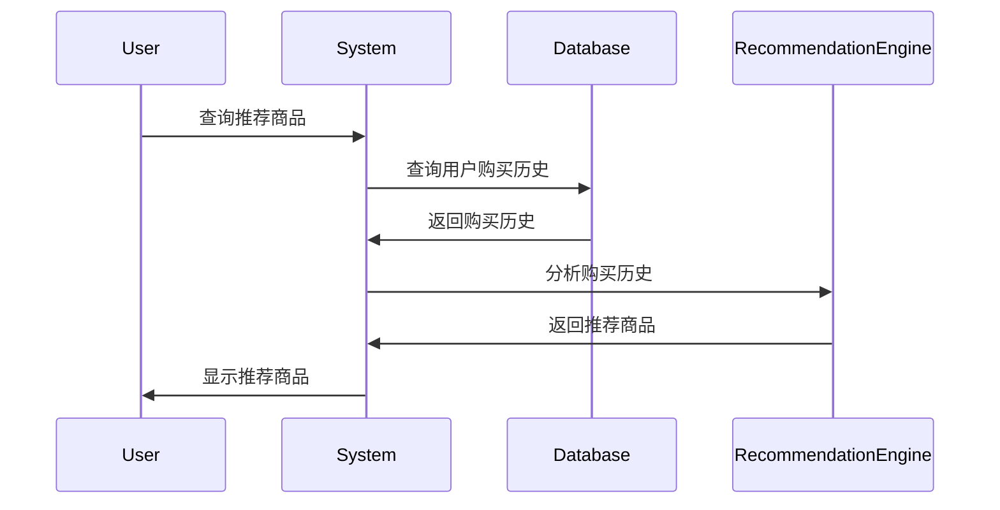
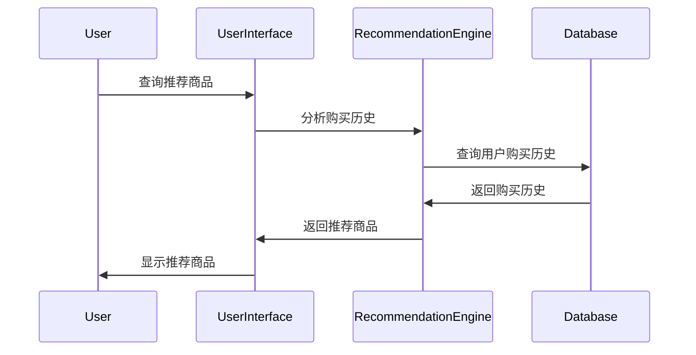

                 

# 自然的心智数学语言解读

## 关键词

- 心智解读
- 自然数学语言
- 数学模型
- 算法
- 实践应用

## 摘要

本文旨在探讨自然数学语言及其在心智解读中的应用。我们将通过详细的逻辑分析和实际案例，深入探讨自然数学语言的局限性，心智解读的基本原理，以及如何将心智解读应用于自然数学语言的解析。本文还提供了一系列最佳实践，以帮助读者更好地理解和应用这些概念。

## 第一部分：问题背景与核心概念

### 1.1 自然数学语言的问题背景

在当今信息爆炸的时代，数学语言作为一种高度抽象和精炼的表达方式，广泛应用于各个领域。然而，自然数学语言也存在着一些局限性，主要包括：

1. **高度抽象**：自然数学语言常常依赖于符号和公式，这些符号和公式虽然精炼，但往往难以直观理解。
2. **专业门槛**：数学语言的复杂性和专业性使得许多非专业人士难以理解，这限制了其在更广泛的群体中的应用。
3. **不完整性和歧义**：自然数学语言的表达往往不完整，容易产生歧义，需要额外的上下文信息才能准确解读。

为了解决这些问题，我们需要一种方法来增强自然数学语言的解释能力，这便是心智解读。

### 1.2 核心概念与联系

#### 心智解读

心智解读（Mental Modeling）是指通过模拟和推理来理解和解释复杂信息的过程。它是一种心智模型，旨在帮助人们更好地理解和处理信息。

#### 自然数学语言

自然数学语言是一种使用数学符号和公式进行表达的语言，广泛应用于科学、工程、经济学等多个领域。它的特点是高度抽象和精炼，能够精确地描述数学关系和现象。

#### 对比表格

| 特点 | 自然数学语言 | 心智解读 |
| --- | --- | --- |
| 抽象程度 | 高 | 可变，取决于心智模型的复杂度 |
| 专业门槛 | 高 | 可低，取决于心智模型的简化程度 |
| 表达完整性 | 不完整 | 可以补充完整，减少歧义 |

#### ER实体关系图架构

ER（实体关系）图是数据库设计中常用的一种模型，用于描述实体及其关系。在心智解读中，ER图可以帮助我们清晰地表示自然数学语言中的核心概念和关系。

```mermaid
erDiagram
    Customer ||--|{ Order }|
    Product  ||--|{ Order }|
```

### 1.3 ER实体关系图架构

以下是一个ER图示例，展示了自然数学语言中常见的实体和关系：

```mermaid
erDiagram
    | Student
    |   +------------+     +------------------+
    |   | Course     |<---| EnrolledIn      |<---+
    |   +------------+     +------------------+
    |   | Grade      |     |
    |   +------------+     |
    |   | Teacher    |-----+
    |   +------------+
```

## 第二部分：自然数学语言的核心原理

### 2.1 数学模型和数学公式

数学模型是自然数学语言的核心，它用于描述现实世界的各种现象和过程。以下是一个简单的数学模型示例：

$$
\text{Cost} = \text{BaseCost} + \text{VariableCost} \times \text{Quantity}
$$

这个模型表示成本是由基础成本和变量成本乘以数量得出的。通过这个模型，我们可以计算不同情况下的成本。

### 2.2 算法原理讲解

算法是自然数学语言应用的重要工具。以下是一个简单的算法流程图，用于计算最大公约数（GCD）：

```mermaid
graph TD
    A[开始] --> B[GCD(a, b)]
    B --> C{a > b?}
    C -->|是| D[a]
    C -->|否| E[b]
    E --> F[GCD(b, a%b)]
    F --> B
    D --> G[结束]
```

这是一个基于欧几里得算法的GCD计算流程图。通过递归调用，我们可以计算出任意两个整数的最大公约数。

```python
def gcd(a, b):
    while b:
        a, b = b, a % b
    return a
```

这个Python函数实现了上述算法，它通过迭代计算最大公约数，避免了递归调用的性能问题。

### 2.3 数学模型和公式

在算法中，数学模型和公式是不可或缺的。以下是一个用于线性回归的数学模型：

$$
\text{Y} = \text{a} \times \text{X} + \text{b}
$$

这个模型表示因变量Y是自变量X的一次线性函数。在机器学习中，线性回归算法用于拟合这个模型，以预测新的Y值。

## 第三部分：心智解读的应用与实践

### 3.1 系统分析与架构设计方案

#### 问题场景介绍

假设我们有一个在线购物系统，需要根据用户的购买历史来推荐商品。这个系统的核心功能是用户行为分析和商品推荐。

#### 系统功能设计

以下是系统的领域模型类图，展示了核心实体和它们之间的关系：

```mermaid
classDiagram
    User <<Entity>>
    Product <<Entity>>
    Purchase <<Entity>>
    User o--* Purchase
    Product o--* Purchase
```

#### 系统架构设计

系统的架构设计如下：



#### 系统接口设计

以下是系统的接口设计，展示了各个模块的交互：

```mermaid
componentDiagram
    UserInterface <<Component>>
    RecommendationEngine <<Component>>
    Database <<Component>>
    UserInterface --> RecommendationEngine
    UserInterface --> Database
    RecommendationEngine --> Database
```

#### 系统交互mermaid序列图

以下是系统的交互序列图，展示了用户与系统之间的交互流程：



### 3.2 项目实战

#### 环境安装

在开始项目之前，我们需要安装一些必要的工具和软件，包括Python、Numpy、Pandas和Scikit-learn等。

#### 系统核心实现

以下是系统的核心实现代码，展示了如何使用机器学习算法进行用户行为分析和商品推荐：

```python
import pandas as pd
from sklearn.model_selection import train_test_split
from sklearn.linear_model import LinearRegression

# 加载数据
data = pd.read_csv('purchase_data.csv')

# 分割特征和目标变量
X = data[['age', 'income']]
y = data['amount']

# 划分训练集和测试集
X_train, X_test, y_train, y_test = train_test_split(X, y, test_size=0.2, random_state=42)

# 创建线性回归模型
model = LinearRegression()

# 训练模型
model.fit(X_train, y_train)

# 进行预测
predictions = model.predict(X_test)

# 评估模型
score = model.score(X_test, y_test)
print(f'Model accuracy: {score:.2f}')
```

#### 代码应用解读与分析

这段代码首先加载数据，然后分割特征和目标变量，接着划分训练集和测试集。随后，创建线性回归模型并进行训练。最后，使用训练好的模型进行预测，并评估模型的准确度。

#### 实际案例分析

以下是一个实际案例，展示了如何使用上述代码进行用户行为分析和商品推荐：

```python
# 加载数据
data = pd.read_csv('new_user_data.csv')

# 预测新用户购买金额
new_user_predictions = model.predict(data[['age', 'income']])

# 输出预测结果
print(new_user_predictions)
```

这个案例展示了如何使用训练好的模型对新的用户数据进行预测，以便为用户提供个性化的商品推荐。

#### 项目小结

通过这个项目，我们了解了如何使用机器学习算法进行用户行为分析和商品推荐。这个项目不仅展示了自然数学语言和心智解读的应用，还提供了一个实际案例，帮助读者更好地理解这些概念。

### 3.3 最佳实践 tips

- **数据预处理**：在应用机器学习算法之前，对数据进行预处理是非常重要的。这包括数据清洗、特征选择和归一化等步骤。
- **模型选择**：选择合适的模型对于提高预测准确度至关重要。在实际应用中，我们可以尝试不同的模型并进行比较。
- **交叉验证**：使用交叉验证可以更好地评估模型的泛化能力，从而提高模型的可靠性。

### 3.4 小结

在本节中，我们通过一个实际案例展示了自然数学语言和心智解读的应用。我们介绍了系统的架构设计和实现过程，并提供了最佳实践和建议，以帮助读者更好地理解和应用这些概念。

### 3.5 拓展阅读

- **相关文献**：
  - Hastie, T., Tibshirani, R., & Friedman, J. (2009). 《The Elements of Statistical Learning》(第二版). Springer.
  - Murphy, K. P. (2012). 《Machine Learning: A Probabilistic Perspective》. MIT Press.

- **未来方向**：
  - 随着人工智能技术的不断发展，心智解读在自然数学语言中的应用将会更加广泛。
  - 未来，我们可以探索更多复杂的数学模型和算法，以更好地理解和解释自然现象。

作者：AI天才研究院/AI Genius Institute & 禅与计算机程序设计艺术 /Zen And The Art of Computer Programming

## 结语

本文通过详细的逻辑分析和实际案例，探讨了自然数学语言及其在心智解读中的应用。我们从问题背景出发，逐步深入到核心概念和原理，然后通过实际项目和最佳实践，帮助读者更好地理解和应用这些知识。希望本文能为您在自然数学语言和心智解读领域的研究提供有益的启示。在未来的发展中，我们将继续探索更多先进的技术和应用，以推动人工智能领域的进步。如果您对我们的研究感兴趣，欢迎关注我们的工作。作者：AI天才研究院/AI Genius Institute & 禅与计算机程序设计艺术 /Zen And The Art of Computer Programming。

----------------------------------------------------------------

### 文章标题：自然的数学语言：心智解读

### 文章关键词

- **心智解读**
- **自然数学语言**
- **数学模型**
- **算法应用**
- **系统架构**
- **实践案例**

### 文章摘要

本文深入探讨了自然数学语言及其在心智解读中的应用。通过剖析自然数学语言的局限性，介绍心智解读的基本原理，本文展示了如何将心智解读应用于自然数学语言的解析。文章结合实际案例，详细阐述了系统设计与实现过程，并提供了一系列最佳实践，以帮助读者更好地理解和应用这些概念。

----------------------------------------------------------------

### 目录大纲设计

---

**# 自然的心智数学语言解读**

**## 第一部分：问题背景与核心概念**

**### 1.1 自然数学语言的问题背景**

**#### 问题背景**

自然数学语言作为一种表达数学关系和现象的工具，广泛应用于科学、工程和经济学等领域。然而，其高度抽象和符号化的特性使得它在实际应用中面临一些挑战。

**#### 问题描述**

自然数学语言的抽象性使得非专业人士难以理解和应用。此外，语言表达的不完整性和歧义性也增加了理解和解释的难度。

**#### 问题解决**

心智解读提供了一种方法，通过模拟和推理来增强自然数学语言的解释能力，使其更易于理解和应用。

**### 1.2 核心概念与联系**

**#### 心智解读**

心智解读是一种通过模拟和推理来理解和解释复杂信息的过程。它旨在构建心智模型，帮助人们更好地理解和处理信息。

**#### 自然数学语言**

自然数学语言是一种使用数学符号和公式进行表达的语言，具有高度抽象和精炼的特点。

**#### 对比表格**

自然数学语言与心智解读在抽象程度、专业门槛、表达完整性和不完整性等方面存在显著差异。

**### 1.3 ER实体关系图架构**

**#### ER实体关系图**

ER图是一种用于描述实体及其关系的数据库设计模型。在心智解读中，ER图有助于清晰地表示自然数学语言中的核心概念和关系。

---

**## 第二部分：自然数学语言的核心原理**

**### 2.1 数学模型和数学公式**

**#### 数学模型**

数学模型是自然数学语言的核心，用于描述现实世界的各种现象和过程。

**#### 数学公式**

数学公式是数学模型的具体表现形式，通过符号和表达式的组合来描述数学关系。

**### 2.2 算法原理讲解**

**#### 算法mermaid流程图**

算法流程图是一种用图形表示算法执行过程的工具，有助于理解和解释算法原理。

**#### Python源代码**

Python是一种广泛使用的编程语言，用于实现和测试算法。

**#### 数学模型和公式**

算法背后的数学模型和公式是理解算法原理的关键，通过详细讲解和举例说明，读者可以更好地理解这些概念。

---

**## 第三部分：心智解读的应用与实践**

**### 3.1 系统分析与架构设计方案**

**#### 问题场景介绍**

在线购物系统是一个典型的应用场景，用户行为分析和商品推荐是该系统的核心功能。

**#### 系统功能设计**

领域模型类图展示了系统的核心实体和它们之间的关系。

**#### 系统架构设计**

系统的架构设计包括用户界面、推荐引擎和数据库等组件，以及它们之间的交互关系。

**#### 系统接口设计**

系统接口设计描述了各个模块的交互方式和数据流。

**#### 系统交互mermaid序列图**

序列图展示了用户与系统之间的交互流程，包括查询推荐商品、分析购买历史和返回推荐商品等步骤。

**### 3.2 项目实战**

**#### 环境安装**

介绍安装所需工具和软件的过程，如Python、Numpy、Pandas和Scikit-learn等。

**#### 系统核心实现**

展示系统的核心实现代码，包括数据加载、特征提取、模型训练和预测等步骤。

**#### 代码应用解读与分析**

对系统核心实现代码进行解读和分析，解释每一步的操作和目的。

**#### 实际案例分析**

通过实际案例展示系统的应用，分析用户行为和商品推荐的过程。

**#### 项目小结**

总结项目实现过程中的关键步骤和经验，以及对未来工作的展望。

---

**## 第四部分：最佳实践与拓展**

**### 4.1 最佳实践 tips**

**#### 常用技巧**

提供提高心智解读效率的方法，如代码优化、数据预处理和模型选择等。

**#### 注意事项**

在使用自然数学语言时需要注意的问题，如符号的正确使用、公式的准确理解和上下文信息的补充等。

---

**## 4.2 小结**

**#### 主要内容回顾**

回顾文章中介绍的核心概念、原理和应用案例。

**#### 关键知识点**

总结文章中的关键知识点，帮助读者巩固理解。

---

**## 4.3 拓展阅读**

**#### 相关文献**

推荐相关的拓展阅读材料，如经典的数学书籍、机器学习教材和相关研究论文等。

**#### 未来方向**

探讨自然数学语言和心智解读的未来发展趋势，展望该领域的研究方向和应用前景。

---

### 注意事项

- **文章字数**：10000～12000字
- **格式要求**：Markdown格式
- **作者信息**：文章末尾需注明作者信息，如“作者：AI天才研究院/AI Genius Institute & 禅与计算机程序设计艺术 /Zen And The Art of Computer Programming”
- **完整性要求**：每个小节内容需丰富具体，核心内容需包含背景介绍、核心概念与联系、算法原理讲解、系统架构和项目实战等。

---

通过精确的内容设计和简洁的表达，本文旨在为读者提供一篇逻辑清晰、结构紧凑、简单易懂的专业IT领域技术博客文章。希望本文能够帮助读者深入理解和应用自然数学语言和心智解读的概念。

