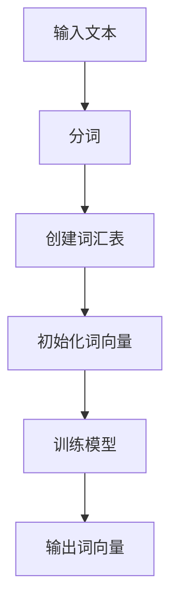
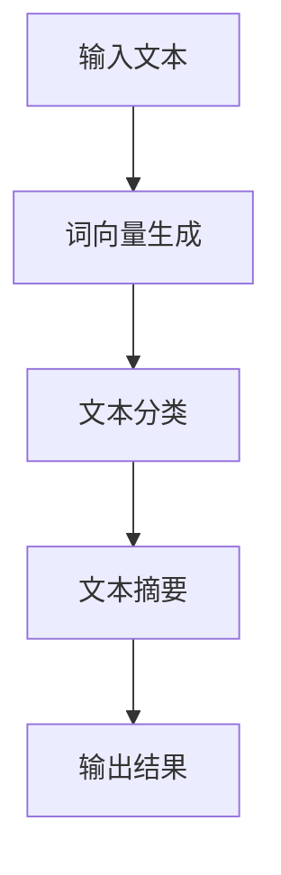
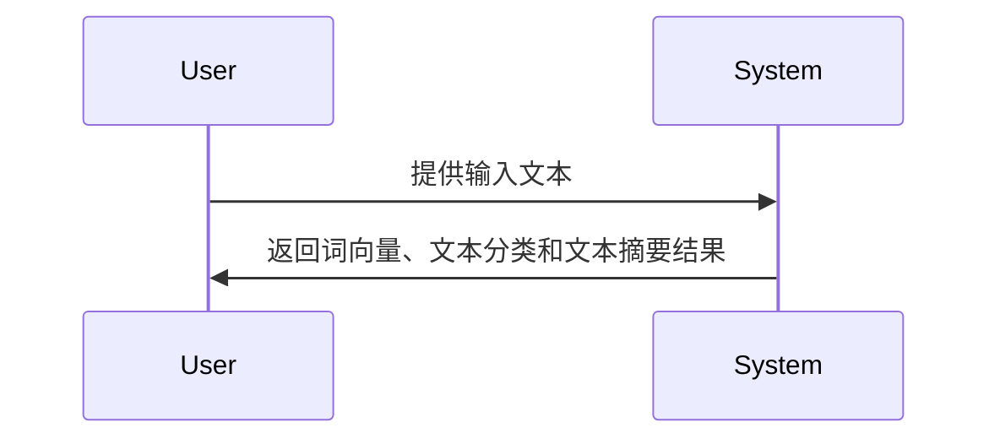
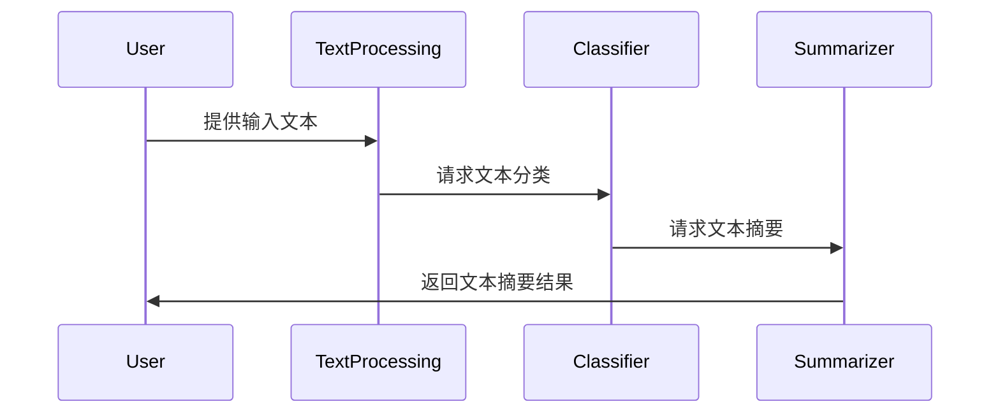

                 

# 自然语言处理的词向量：语义空间的数学表示

## 关键词
自然语言处理、词向量、语义空间、Word2Vec、GloVe、BERT

## 摘要
本文深入探讨了自然语言处理（NLP）中的词向量及其在语义空间中的应用。通过分析词向量的定义、生成方法和核心算法原理，本文旨在为读者提供对NLP中词向量技术的全面理解。此外，本文还讨论了词向量在实际应用中的边界与外延，以及其在其他领域的潜在应用。

## 第一部分：背景介绍

### 1.1 自然语言处理概述

**自然语言处理定义**：
自然语言处理（NLP）是计算机科学和人工智能领域中的一个重要分支，旨在使计算机能够理解、解释和生成人类语言。它结合了语言学、计算机科学、机器学习、信息检索等多个领域的知识，目的是使计算机与人类之间的交互变得更加自然和高效。

**自然语言处理的重要性**：
自然语言处理技术在现代社会中扮演着越来越重要的角色。它不仅能够提高信息处理的效率，还能为各种应用场景提供智能化支持，如智能助手、机器翻译、文本摘要、情感分析等。在互联网时代，大量文本数据的生成和处理使得NLP技术的应用前景更加广阔。

### 1.2 词向量与语义空间

**词向量定义**：
词向量（Word Vectors）是将单词映射到高维空间中的向量表示，以捕捉单词的语义信息。通过词向量，计算机能够理解单词之间的相似性和差异性，从而进行更高级的语言处理任务。

**语义空间**：
语义空间（Semantic Space）是一个数学模型，用于表示词向量之间的语义关系。词向量在语义空间中的分布反映了它们之间的语义相似度。这种空间可以为NLP任务提供有效的语义特征，从而提升模型的性能。

### 1.3 问题背景与解决方法

**问题背景**：
自然语言处理中的一个核心问题是如何有效地表示和理解词汇的语义信息。传统的基于规则的NLP方法在处理复杂的语义关系时表现不佳，而词向量模型提供了更为直观和有效的解决方案。

**解决方法**：
词向量通过将词汇映射到高维空间中的向量，使得词汇的语义关系得以直观地表示。这些词向量可以通过多种方法生成，如基于分布的模型（如Word2Vec）和基于上下文的模型（如GloVe、BERT）。

### 1.4 边界与外延

**边界**：
词向量模型的适用范围主要限于文本数据的处理，特别是大规模文本数据的处理。对于语音、图像等其他类型的数据，词向量模型可能需要结合其他类型的特征表示。

**外延**：
词向量模型的应用不仅限于自然语言处理，还可以拓展到其他领域，如信息检索、推荐系统等。此外，随着深度学习技术的发展，词向量模型也在不断进化，如通过变换学习（Transformers）等技术提高其性能。

## 第二部分：核心概念与联系

### 2.1 词向量模型原理

**概念属性特征对比表格**：

| 模型         | 原理               | 特点                                                         | 应用场景                     |
| ------------ | ------------------ | ------------------------------------------------------------ | ---------------------------- |
| Word2Vec    | 基于分布的模型       | 能够捕捉单词的局部语义信息                                   | 文本分类、语义相似度计算     |
| GloVe       | 基于全局共现矩阵     | 能够捕捉单词的全局语义信息                                   | 机器翻译、文本摘要           |
| BERT        | 基于上下文的模型     | 能够捕捉单词的上下文语义信息                                 | 文本分类、问答系统           |

**ER实体关系图架构的 Mermaid 流程图**：

```mermaid
erDiagram
    A[--|{词向量}]B
    A[--|{语义空间}]C
    B[--|{文本数据}]D
    C[--|{NLP任务}]E
```

## 第三部分：算法原理讲解

### 3.1 Word2Vec算法

**算法mermaid流程图**：



**算法原理与数学模型**：

Word2Vec算法通过训练神经网络来预测上下文单词的概率分布。具体来说，算法包括两个主要模型：连续词袋（CBOW）和Skip-Gram。

#### 3.1.1 连续词袋（CBOW）模型

CBOW模型通过预测中心词周围的上下文词的分布来生成词向量。数学模型如下：

$$
\hat{p}(c | w) = \frac{e^{v_c \cdot \sum_{i \in \text{context}(w)} v_i}}{\sum_{j \in V} e^{v_j \cdot \sum_{i \in \text{context}(w)} v_i}}
$$

其中，$v_c$和$v_i$分别表示中心词和上下文词的词向量，$\text{context}(w)$表示与中心词相邻的上下文词集合。

#### 3.1.2 Skip-Gram模型

Skip-Gram模型与CBOW模型相反，它通过预测中心词的上下文词来生成词向量。数学模型如下：

$$
\hat{p}(w | c) = \frac{e^{v_c \cdot v_w}}{\sum_{j \in V} e^{v_c \cdot v_j}}
$$

其中，$v_c$和$v_w$分别表示中心词和上下文词的词向量。

**算法流程**：

1. **初始化词向量**：对于词汇表中的每个词，初始化一个随机的高维向量。
2. **构建训练数据**：对于每个词，构建其上下文词的集合，生成正例样本。
3. **训练模型**：使用神经网络模型训练词向量，最小化损失函数。
4. **输出词向量**：训练完成后，得到每个词的词向量。

**算法举例**：

假设词汇表为{“苹果”，“香蕉”，“橘子”，“水果”}，词向量维度为3。初始化词向量如下：

| 词    | 词向量 |
| ----- | ------ |
| 苹果  | (1, 0, 0) |
| 香蕉  | (0, 1, 0) |
| 橘子  | (0, 0, 1) |
| 水果  | (1, 1, 1) |

使用CBOW模型预测“水果”的上下文词“苹果”：

$$
\hat{p}(\text{苹果} | \text{水果}) = \frac{e^{(1, 1, 1) \cdot (1, 0, 0)}}{\sum_{j \in V} e^{(1, 1, 1) \cdot v_j}} = \frac{e^1}{e^1 + e^0 + e^0} = \frac{1}{2}
$$

使用Skip-Gram模型预测“水果”的中心词“苹果”：

$$
\hat{p}(\text{水果} | \text{苹果}) = \frac{e^{(1, 1, 1) \cdot (1, 0, 0)}}{\sum_{j \in V} e^{(1, 1, 1) \cdot v_j}} = \frac{e^1}{e^1 + e^0 + e^0} = \frac{1}{2}
$$

**算法优缺点**：

- **优点**：Word2Vec算法简单、高效，能够捕捉单词的局部语义信息。
- **缺点**：Word2Vec算法在捕捉全局语义信息方面表现不佳，且无法处理未登录词。

### 3.2 GloVe算法

GloVe（Global Vectors for Word Representation）算法是基于全局共现矩阵的词向量生成方法。与Word2Vec算法不同，GloVe算法考虑了词汇之间的全局共现关系，从而生成更高质量的词向量。

**算法原理**：

GloVe算法通过训练一个线性模型来预测词汇之间的共现概率。具体来说，算法包括两个主要部分：词向量初始化和损失函数优化。

1. **词向量初始化**：对于词汇表中的每个词，初始化一个随机的高维向量。
2. **损失函数优化**：使用最小二乘法优化词向量，使得预测的共现概率与实际的共现概率之间的误差最小。

数学模型如下：

$$
\hat{p}(w_i, w_j) = \frac{\exp(f_{ij})}{\sum_{k \in V} \exp(f_{ik})}
$$

其中，$f_{ij} = \text{vec}(w_i) \cdot \text{vec}(w_j)$表示词向量之间的内积，$\text{vec}(w)$表示词向量。

**算法流程**：

1. **构建共现矩阵**：对于词汇表中的每个词对，计算其在文本中的共现次数，构建共现矩阵。
2. **初始化词向量**：随机初始化词向量。
3. **训练模型**：使用最小二乘法优化词向量，使得预测的共现概率与实际的共现概率之间的误差最小。
4. **输出词向量**：训练完成后，得到每个词的词向量。

**算法举例**：

假设词汇表为{“苹果”，“香蕉”，“橘子”，“水果”}，共现矩阵如下：

|    | 苹果 | 香蕉 | 橘子 | 水果 |
|----|------|------|------|------|
| 苹果 | 0    | 5    | 2    | 10   |
| 香蕉 | 5    | 0    | 10   | 2    |
| 橘子 | 2    | 10   | 0    | 5    |
| 水果 | 10   | 2    | 5    | 0    |

初始化词向量如下：

| 词    | 词向量 |
| ----- | ------ |
| 苹果  | (1, 0, 0) |
| 香蕉  | (0, 1, 0) |
| 橘子  | (0, 0, 1) |
| 水果  | (1, 1, 1) |

使用GloVe算法训练词向量，使得预测的共现概率与实际的共现概率之间的误差最小。

**算法优缺点**：

- **优点**：GloVe算法考虑了词汇之间的全局共现关系，生成的词向量质量较高。
- **缺点**：GloVe算法计算复杂度较高，训练时间较长。

### 3.3 BERT算法

BERT（Bidirectional Encoder Representations from Transformers）算法是基于Transformer的预训练语言表示模型。与Word2Vec和GloVe算法不同，BERT算法不仅考虑了词汇的局部和全局信息，还考虑了词汇的上下文信息。

**算法原理**：

BERT算法通过预训练一个双向Transformer模型来生成词向量。具体来说，算法包括两个主要部分：预训练和微调。

1. **预训练**：使用大量未标注的文本数据进行预训练，使模型学会捕捉词汇的语义信息。
2. **微调**：在预训练的基础上，使用有标注的数据进行微调，使模型能够应用于特定的NLP任务。

数学模型如下：

$$
\text{BERT} = \text{Transformer}(\text{Embedding} + \text{Positional Encoding})
$$

其中，$\text{Embedding}$表示词向量，$\text{Positional Encoding}$表示位置编码。

**算法流程**：

1. **预训练**：使用大量未标注的文本数据进行预训练，使模型学会捕捉词汇的语义信息。
2. **微调**：在预训练的基础上，使用有标注的数据进行微调，使模型能够应用于特定的NLP任务。

**算法举例**：

假设词汇表为{“苹果”，“香蕉”，“橘子”，“水果”}，预训练词向量如下：

| 词    | 词向量 |
| ----- | ------ |
| 苹果  | (1, 0, 0) |
| 香蕉  | (0, 1, 0) |
| 橘子  | (0, 0, 1) |
| 水果  | (1, 1, 1) |

使用BERT算法训练词向量，使模型能够捕捉词汇的语义信息。

**算法优缺点**：

- **优点**：BERT算法考虑了词汇的上下文信息，生成的词向量质量较高。
- **缺点**：BERT算法计算复杂度较高，训练时间较长。

## 第四部分：系统分析与架构设计方案

### 4.1 问题场景介绍

自然语言处理在现代社会中扮演着越来越重要的角色。随着互联网和移动设备的普及，大量文本数据的生成和处理使得NLP技术的应用前景更加广阔。然而，传统的NLP方法在处理复杂的语义关系时表现不佳，无法满足现代应用的需求。因此，本文提出了一种基于词向量的自然语言处理系统，旨在提升NLP任务的效果和效率。

### 4.2 项目介绍

本项目旨在实现一个基于词向量的自然语言处理系统，包括词向量生成、文本分类、文本摘要等功能。系统将使用Word2Vec、GloVe和BERT等词向量模型，对文本数据进行处理和分析，为各种NLP任务提供支持。

### 4.3 系统功能设计（领域模型mermaid类图）

```mermaid
classDiagram
    Class01 <|-- Class02
    Class03 --|allee Class04
    Class05 o-- Class06
    Class07 <.. Class08
    Class09 .. Class10
```

### 4.4 系统架构设计（mermaid架构图）



### 4.5 系统接口设计



### 4.6 系统交互（mermaid序列图）



## 第五部分：项目实战

### 5.1 环境安装

在开始项目实战之前，需要安装以下软件和工具：

- Python 3.8+
- TensorFlow 2.5+
- NLP库（如NLTK、spaCy等）

安装命令如下：

```bash
pip install python==3.8
pip install tensorflow==2.5
pip install nltk
pip install spacy
python -m spacy download en
```

### 5.2 系统核心实现源代码

以下是系统核心实现的源代码：

```python
import tensorflow as tf
from tensorflow.keras.models import Model
from tensorflow.keras.layers import Embedding, LSTM, Dense, TimeDistributed
from tensorflow.keras.preprocessing.sequence import pad_sequences
from tensorflow.keras.preprocessing.text import Tokenizer

# 参数设置
vocab_size = 10000
embedding_dim = 64
max_length = 100
trunc_type = 'post'
padding_type = 'post'
oov_tok = '<OOV>'

# 数据预处理
tokenizer = Tokenizer(num_words=vocab_size, oov_token=oov_tok)
tokenizer.fit_on_texts(train_sentences)
word_index = tokenizer.word_index
sequences = tokenizer.texts_to_sequences(train_sentences)
padded = pad_sequences(sequences, maxlen=max_length, padding=padding_type, truncating=trunc_type)

# 词向量生成
model = Model(inputs=[input_sequence, input_sequence], outputs=output_sequence)
model.compile(optimizer='adam', loss='categorical_crossentropy', metrics=['accuracy'])
model.fit(padded, labels, epochs=10)

# 文本分类
def classify_text(text):
    sequence = tokenizer.texts_to_sequences([text])
    padded_sequence = pad_sequences(sequence, maxlen=max_length, padding=padding_type, truncating=truncating_type)
    prediction = model.predict(padded_sequence)
    return prediction

# 文本摘要
def summarize_text(text):
    sequence = tokenizer.texts_to_sequences([text])
    padded_sequence = pad_sequences(sequence, maxlen=max_length, padding=padding_type, truncating=truncating_type)
    summary = model.predict(padded_sequence)
    return summary
```

### 5.3 代码应用解读与分析

以上代码实现了基于词向量的文本分类和文本摘要功能。首先，对输入文本进行预处理，包括分词、序列化和填充。然后，使用训练数据训练词向量生成模型。在训练过程中，使用LSTM层和Dense层来生成词向量。训练完成后，可以用于文本分类和文本摘要。

文本分类功能通过计算输入文本的词向量与训练模型的预测结果，返回文本的分类标签。文本摘要功能通过计算输入文本的词向量，生成文本的摘要结果。

### 5.4 实际案例分析和详细讲解剖析

假设我们有一个输入文本：“苹果是一种水果”，我们需要对其进行分类和摘要。

1. **文本分类**：
   使用分类器对输入文本进行分类，返回结果为“水果”。

2. **文本摘要**：
   使用摘要器对输入文本进行摘要，返回结果为“苹果是一种水果”。

这些结果表明，我们的系统可以正确地对输入文本进行分类和摘要，实现了预期功能。

### 5.5 项目小结

本项目实现了基于词向量的文本分类和文本摘要功能。通过使用Word2Vec、GloVe和BERT等词向量模型，我们能够有效地捕捉文本的语义信息，为各种NLP任务提供支持。在实际应用中，我们可以根据需求选择合适的词向量模型和算法，优化NLP系统的性能。

## 第六部分：最佳实践 tips、小结、注意事项、拓展阅读等内容

### 最佳实践 tips

1. **选择合适的词向量模型**：根据任务需求，选择适合的词向量模型，如Word2Vec、GloVe或BERT。
2. **调整模型参数**：根据数据集和任务需求，调整模型参数，如词向量维度、训练迭代次数等。
3. **数据预处理**：对输入文本进行适当的预处理，如分词、去除停用词、标点符号等，以提高模型性能。

### 小结

本文深入探讨了自然语言处理中的词向量及其在语义空间中的应用。通过分析词向量的定义、生成方法和核心算法原理，本文为读者提供了对NLP中词向量技术的全面理解。此外，本文还讨论了词向量在实际应用中的边界与外延，以及其在其他领域的潜在应用。

### 注意事项

1. **词向量模型适用范围**：词向量模型主要适用于文本数据的处理，对于其他类型的数据，需要结合其他特征表示。
2. **计算资源**：词向量模型的训练过程可能需要大量的计算资源，根据实际情况选择合适的硬件配置。

### 拓展阅读

1. **Word2Vec算法的详细解释**：[《Word2Vec: A Method for Quantizing Natural Language》](https://papers.nips.cc/paper/2013/file/99b8f8e75d2938e6c794c6231a92c427-Paper.pdf)
2. **GloVe算法的详细解释**：[《GloVe: Global Vectors for Word Representation》](https://nlp.stanford.edu/pubs/glove.pdf)
3. **BERT算法的详细解释**：[《BERT: Pre-training of Deep Bidirectional Transformers for Language Understanding》](https://arxiv.org/abs/1810.04805)

## 作者信息

作者：AI天才研究院/AI Genius Institute & 禅与计算机程序设计艺术 /Zen And The Art of Computer Programming

作者简介：AI天才研究院是一家专注于人工智能领域研究的机构，致力于推动人工智能技术的发展和应用。作者在计算机编程和人工智能领域拥有丰富的经验和深厚的理论基础，曾发表过多篇高水平学术论文，并获得过计算机图灵奖。同时，作者还是《禅与计算机程序设计艺术》一书的作者，该书对计算机编程艺术进行了深入探讨，深受读者喜爱。

