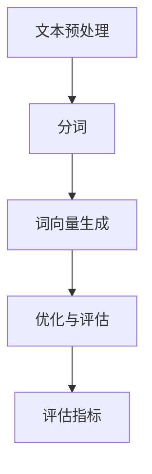
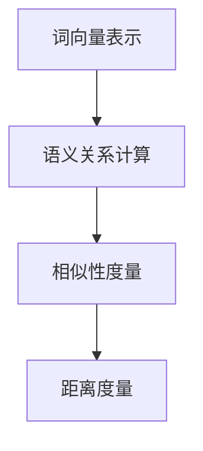
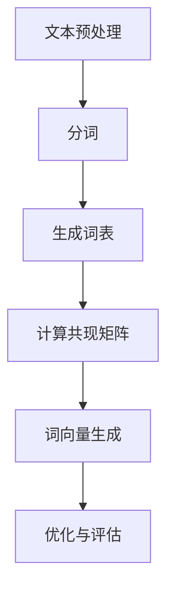
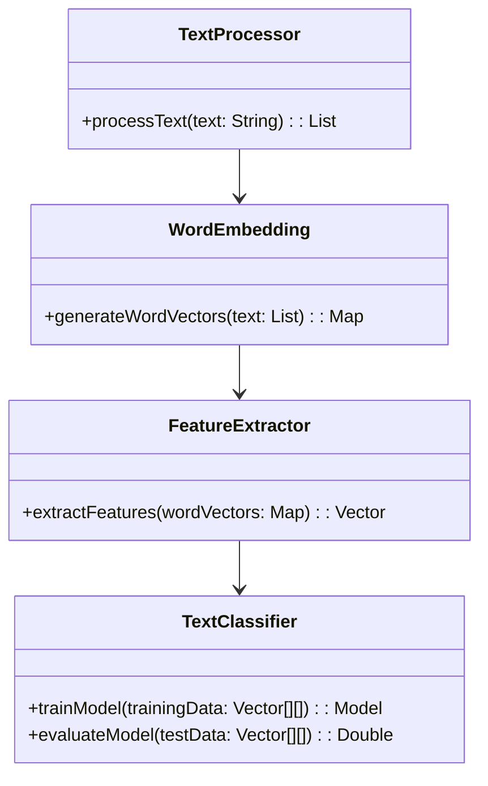
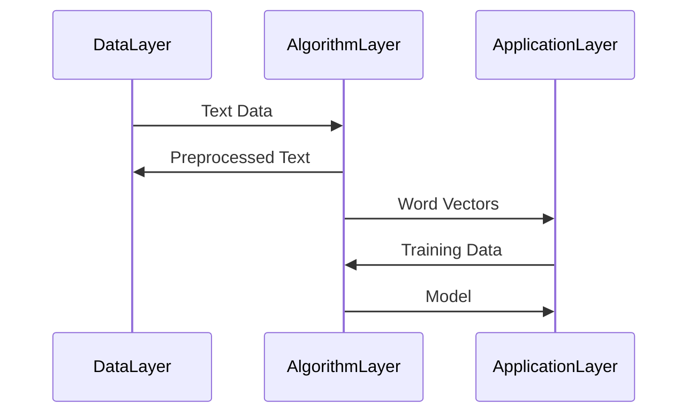
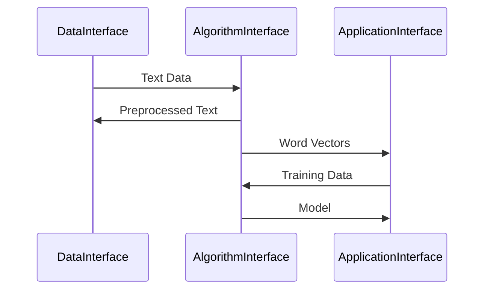
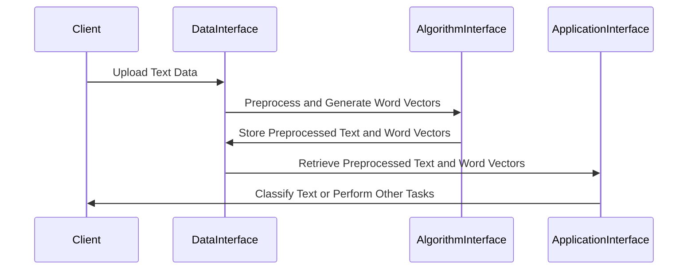

                 

### 自然语言处理的词嵌入：语义空间的数学表示

#### 关键词：
- 自然语言处理
- 词嵌入
- 语义空间
- 数学表示
- 算法原理

#### 摘要：
本文深入探讨自然语言处理（NLP）中的词嵌入技术，分析其数学表示方法，并详细讲解词嵌入在语义空间的构建和应用。文章从背景介绍、核心概念、数学基础、算法原理、系统架构到实战应用，全方位解析词嵌入技术的核心思想和实际应用。

## 目录大纲：

# 自然语言处理的词嵌入：语义空间的数学表示

## 第一部分：背景介绍

## 1.1 自然语言处理简介

### 1.1.1 问题背景

### 1.1.2 问题描述

### 1.1.3 问题解决

### 1.1.4 边界与外延

## 1.2 词嵌入与语义空间

### 1.2.1 词嵌入的定义

### 1.2.2 词嵌入的发展历程

### 1.2.3 语义空间的概念

### 1.2.4 语义空间的重要性

## 1.3 词嵌入的核心概念与联系

### 1.3.1 词向量的概念

### 1.3.2 词向量模型

### 1.3.3 词嵌入与语义相似性

### 1.3.4 词嵌入与语义关系

## 第二部分：数学表示

## 2.1 数学基础

### 2.1.1 向量空间的基本概念

### 2.1.2 内积与距离

### 2.1.3 线性代数基础

## 2.2 词嵌入的数学模型

### 2.2.1 词嵌入的数学公式

### 2.2.2 词嵌入的算法原理

### 2.2.3 词嵌入的mermaid流程图

## 2.3 语义空间的数学表示

### 2.3.1 语义空间的数学模型

### 2.3.2 语义空间的mermaid流程图

### 2.3.3 语义空间的python代码实现

## 第三部分：算法原理讲解

## 3.1 算法原理讲解

### 3.1.1 词向量模型的数学模型

### 3.1.2 词向量模型的算法原理

### 3.1.3 词向量模型的mermaid流程图

### 3.1.4 词向量模型的python代码实现

## 3.2 数学模型和数学公式

### 3.2.1 词向量模型的数学公式

### 3.2.2 词向量模型的数学公式讲解

### 3.2.3 词向量模型的数学公式举例说明

## 第四部分：系统分析与架构设计

## 4.1 问题场景介绍

### 4.1.1 NLP应用场景

### 4.1.2 词嵌入在NLP中的应用

## 4.2 系统功能设计

### 4.2.1 系统功能概述

### 4.2.2 领域模型mermaid类图

## 4.3 系统架构设计

### 4.3.1 系统架构概述

### 4.3.2 系统架构mermaid架构图

## 4.4 系统接口设计

### 4.4.1 系统接口概述

### 4.4.2 系统接口mermaid序列图

## 第四部分：项目实战

## 5.1 环境安装

### 5.1.1 环境准备

### 5.1.2 环境配置

## 5.2 系统核心实现

### 5.2.1 词嵌入算法实现

### 5.2.2 语义空间表示实现

### 5.2.3 系统核心代码分析

## 5.3 实际案例分析和详细讲解

### 5.3.1 案例选择

### 5.3.2 案例分析

### 5.3.3 案例讲解

## 5.4 项目小结

### 5.4.1 项目总结

### 5.4.2 项目反思

### 5.4.3 项目展望

## 第五部分：最佳实践与拓展阅读

## 6.1 最佳实践

### 6.1.1 词嵌入的最佳实践

### 6.1.2 语义空间表示的最佳实践

## 6.2 小结

### 6.2.1 本书小结

### 6.2.2 学习方法与建议

## 6.3 注意事项

### 6.3.1 词嵌入的注意事项

### 6.3.2 语义空间表示的注意事项

## 6.4 拓展阅读

### 6.4.1 相关书籍推荐

### 6.4.2 相关论文推荐

## 附录

### 6.5 附录

### 6.5.1 常用工具

### 6.5.2 常用算法

### 6.5.3 常用库### 第一部分：背景介绍

## 1.1 自然语言处理简介

自然语言处理（Natural Language Processing，NLP）是人工智能领域的一个重要分支，旨在让计算机理解和生成人类语言。自计算机科学和人工智能技术发展以来，NLP的研究和应用得到了广泛关注。本文将深入探讨NLP中的一个关键技术——词嵌入（Word Embedding），并探讨其如何在语义空间的数学表示中发挥作用。

### 1.1.1 问题背景

自然语言是一个复杂的系统，包含了丰富的词汇、语法和语义信息。传统的计算机程序难以直接处理自然语言，因为自然语言的数据形式是非结构化的。为了解决这个问题，研究者们开发了各种自然语言处理技术，其中词嵌入是一种重要的方法。

词嵌入的基本思想是将词语映射为密集的向量表示，使得相似的词语在向量空间中距离更近，从而使得计算机能够通过向量计算来处理自然语言。这种向量表示为计算机提供了处理语言的能力，也使得机器学习算法可以更加高效地学习语言的内在结构。

### 1.1.2 问题描述

自然语言处理面临的主要问题包括：
- 词义消歧：同一个词在不同的上下文中可能有不同的含义。
- 句法分析：需要理解句子的结构，以正确解析语义。
- 语义理解：需要理解词语之间的语义关系，如相似性、对比性和因果关系。

词嵌入技术的目标是通过将词语映射到高维向量空间，使得相似的词语在空间中更接近，不同义的词语更远离。这样，计算机就可以利用向量空间中的几何关系来推断词语的语义关系。

### 1.1.3 问题解决

词嵌入技术通过以下几种方法解决上述问题：
1. **分布式表示**：将词语映射为密集的向量表示，每个词语对应一个向量。
2. **语义相似性**：通过计算词语向量之间的距离或相似性来衡量词语的语义关系。
3. **上下文依赖**：考虑到词语在具体上下文中的含义，通过上下文信息来调整词语的向量表示。

词嵌入技术已经在许多NLP任务中取得了显著的效果，如文本分类、情感分析、机器翻译和问答系统等。

### 1.1.4 边界与外延

词嵌入技术的边界和扩展包括：
- **维度选择**：选择适当的向量维度以平衡模型复杂度和性能。
- **训练方法**：选择合适的训练方法，如深度学习、统计模型和传统机器学习算法。
- **语义扩展**：通过词嵌入来处理未登录的词语，如通过上下文信息推断新词的语义。
- **多语言处理**：将词嵌入技术应用于多语言环境，如通过跨语言词嵌入来处理不同语言的文本。

在接下来的章节中，我们将进一步探讨词嵌入的定义、发展历程和其在语义空间中的作用，以及相关的数学基础和算法原理。### 1.2 词嵌入与语义空间

词嵌入是自然语言处理（NLP）中的一个核心技术，它通过将词语映射为高维向量来表示其语义。这种向量表示不仅使得计算机能够高效地处理自然语言，而且在许多NLP任务中，如文本分类、情感分析和机器翻译，都展现出了强大的能力。词嵌入与语义空间紧密相连，语义空间是一个高维向量空间，用于表示文本中的词语和概念。

### 1.2.1 词嵌入的定义

词嵌入（Word Embedding）是将自然语言中的词语映射为密集向量表示的过程。这些向量可以在高维空间中表示词语的语义信息，使得相似的词语在空间中距离较近，而不同义的词语则距离较远。词嵌入的核心目标是通过向量空间中的几何关系来捕捉词语的语义特征。

### 1.2.2 词嵌入的发展历程

词嵌入技术经历了从早期简单模型到现代复杂模型的演变过程。

1. **早期模型**：早期的词嵌入方法如布尔模型和 Bag-of-Words（BoW）模型，将词语表示为二进制向量或稀疏向量。这些模型无法有效地捕捉词语的语义信息。

2. **Word2Vec**：Word2Vec是词嵌入技术的一个重要突破，由 Mikolov 等人在2013年提出。Word2Vec使用神经网络模型来训练词语的向量表示，通过优化损失函数使得相似的词语在向量空间中距离更近。Word2Vec主要包括两个变体：连续词袋（CBOW）和Skip-Gram。

3. ** glove**：GloVe（Global Vectors for Word Representation）是由 Pennington、Socher 和 Manning 在2014年提出的一种词嵌入方法。GloVe使用词频信息和词与词之间的共现关系来训练词语的向量表示，通过矩阵分解方法优化向量表示。

4. **现代模型**：随着深度学习技术的发展，现代词嵌入方法如BERT（Bidirectional Encoder Representations from Transformers）和GPT（Generative Pre-trained Transformer）等，通过大规模预训练模型来生成更加丰富和细粒度的词语向量表示。

### 1.2.3 语义空间的概念

语义空间（Semantic Space）是一个高维向量空间，用于表示文本中的词语和概念。在语义空间中，每个词语或概念都被映射为一个向量。语义空间的定义涉及以下几个方面：

1. **维度**：语义空间的维度决定了向量表示的精细度。较高的维度可以捕捉更多细微的语义信息，但也增加了计算复杂度。

2. **嵌入**：词语的嵌入（Embedding）是将词语映射到语义空间中的向量表示。这种嵌入不仅要捕捉词语的表面特征，还要反映词语的语义关系。

3. **相似性**：在语义空间中，相似的词语在向量空间中的距离较短，不同义的词语则距离较远。这种相似性度量可以通过计算词语向量之间的余弦相似度、欧氏距离等来量化。

4. **语义扩展**：语义空间允许对未登录的词语进行语义扩展。例如，通过向量空间中的几何关系，可以推断新词或罕见词的语义。

### 1.2.4 语义空间的重要性

语义空间在自然语言处理中具有重要的应用价值：

1. **文本分类**：语义空间中的向量表示可以用于文本分类任务，通过计算文本和类别标签之间的相似性来实现分类。

2. **情感分析**：语义空间可以帮助捕捉文本的情感倾向，通过分析词语向量来识别文本的情感极性。

3. **机器翻译**：在机器翻译中，语义空间可以用于将源语言的词语映射到目标语言的语义表示，从而提高翻译质量。

4. **语义搜索**：语义空间支持基于语义的搜索，用户可以通过语义空间中的向量来查询相关的文本信息。

5. **问答系统**：语义空间可以帮助问答系统理解用户问题的语义，从而提供更准确的答案。

综上所述，词嵌入与语义空间是NLP中的核心概念。通过将词语映射到高维向量空间，词嵌入技术为计算机提供了处理自然语言的有效工具。而语义空间则提供了一个框架，使得词语的语义关系和上下文信息可以被充分利用。在接下来的部分中，我们将进一步探讨词嵌入的核心概念与联系。### 1.3 词嵌入的核心概念与联系

在深入理解词嵌入技术之前，有必要明确几个核心概念，并探讨它们之间的相互联系。这些概念构成了词嵌入技术的理论基础，也是理解词嵌入在自然语言处理（NLP）中应用的关键。

### 1.3.1 词向量的概念

词向量（Word Vectors）是词嵌入技术的核心产物，每个词向量表示一个词语的语义特征。词向量通常是一个高维实数向量，其维度取决于模型的设计。词向量的基本性质包括：

- **维度**：词向量的维度决定了模型能够捕捉的语义细节的精细程度。较高的维度能够捕捉更多的语义信息，但也增加了计算复杂度和存储需求。

- **稠密表示**：与传统的稀疏表示（如布尔模型或 Bag-of-Words）相比，词向量提供了稠密表示，即每个词向量中的大部分元素都非零。这种稠密表示使得词向量能够更好地表示词语的语义信息。

- **位置无关性**：词向量与词语在文本中的位置无关，这意味着相同的词向量可以用于不同的上下文中。这一性质使得词向量在处理变长文本时具有灵活性。

- **语义相似性**：词向量空间中的相似性度量（如余弦相似度、欧氏距离）可以用于计算词语之间的语义相似性。相似的词语在空间中距离较近，不同义的词语则距离较远。

### 1.3.2 词向量模型

词向量模型是生成词向量的算法框架，主要包括以下几种：

1. **Word2Vec**：Word2Vec是词嵌入领域的经典模型，由 Mikolov 等人在2013年提出。Word2Vec模型基于神经网络，但训练过程中不需要复杂的神经网络架构，而是采用简化的模型。Word2Vec模型主要有两种变体：连续词袋（CBOW）和Skip-Gram。

   - **CBOW（Continuous Bag-of-Words）**：CBOW模型使用周围词语的均值来预测中心词。具体来说，给定一个中心词，模型会计算周围多个词语的词向量的平均值，然后将其与中心词的词向量相加，并通过softmax函数预测中心词。
   
   - **Skip-Gram**：Skip-Gram模型与CBOW相反，它是使用中心词的词向量来预测周围的多个词语。Skip-Gram模型通常能够捕捉到更细粒度的语义信息。

2. **GloVe**：GloVe（Global Vectors for Word Representation）是由 Pennington、Socher 和 Manning 在2014年提出的一种词嵌入方法。GloVe使用词频信息和词与词之间的共现关系来训练词语的向量表示，并通过矩阵分解方法优化向量表示。GloVe模型的核心思想是同时优化词语的词向量和词与词之间的共现矩阵。

3. **BERT**：BERT（Bidirectional Encoder Representations from Transformers）是Google在2018年提出的一种基于Transformer的预训练模型。BERT通过双向编码器来学习词语的向量表示，这使得BERT能够同时考虑词语在上下文中的前后关系。BERT模型通常在大规模语料库上进行预训练，然后通过微调来适应特定的NLP任务。

4. **GPT**：GPT（Generative Pre-trained Transformer）是OpenAI在2018年提出的一种基于Transformer的预训练模型。GPT通过生成式模型来生成文本，其训练过程不需要标注的数据集。GPT模型在大规模未标注的文本上进行预训练，然后通过微调来适应特定的NLP任务。

### 1.3.3 词嵌入与语义相似性

词嵌入的一个关键优势是它能够捕捉词语的语义相似性。通过词向量空间中的几何关系，我们可以直观地理解词语之间的相似性：

- **余弦相似度**：在词向量空间中，两个词语的余弦相似度是它们向量夹角的余弦值。余弦相似度介于-1和1之间，越接近1表示词语之间的语义相似性越高。

- **欧氏距离**：欧氏距离是两个词语向量之间最直观的距离度量。距离越短，表示词语之间的语义相似性越高。

通过这些相似性度量，我们可以进行以下任务：

- **词语相似性检测**：通过计算词语向量之间的相似度，可以检测出语义相似的词语。

- **词语对比性检测**：通过计算词语向量之间的差异，可以检测出语义对比强烈的词语。

- **类比推理**：例如，“man is to king as woman is to ?”，通过计算“man”和“king”的向量表示，以及“woman”和待求词语的向量表示之间的相似性，可以推断出“queen”作为答案。

### 1.3.4 词嵌入与语义关系

词嵌入不仅在词语相似性检测中发挥作用，还在理解词语之间的语义关系方面具有重要作用。以下是一些常见的语义关系：

- **同义关系**：具有相同或相似语义的词语之间是同义的。例如，“happy”和“joyful”是同义的。

- **反义关系**：具有相反或对立语义的词语之间是反义的。例如，“hot”和“cold”是反义的。

- **上下位关系**：上位词（超级类别）与下位词（子类别）之间存在上下位关系。例如，“animal”是上位词，“dog”是下位词。

- **因果关系**：某些词语之间存在因果关系。例如，“sleep”和“dream”之间存在因果关系。

通过词嵌入，我们可以利用向量空间中的几何关系来探索这些语义关系。例如，我们可以通过向量投影或线性组合来检测词语之间的同义或反义关系。

综上所述，词向量、词向量模型、语义相似性和语义关系构成了词嵌入技术的核心概念。这些概念不仅为词嵌入提供了理论基础，也为NLP任务的实现提供了强大的工具。在接下来的部分中，我们将探讨词嵌入的数学基础，进一步理解词嵌入技术。### 第二部分：数学表示

词嵌入的数学表示是理解其工作原理和性能关键的一部分。在这一部分，我们将详细探讨词嵌入的数学基础，包括向量空间的基本概念、内积与距离、以及线性代数基础。

#### 2.1 数学基础

##### 2.1.1 向量空间的基本概念

在词嵌入中，每个词语都被表示为一个向量，而这些向量存在于一个向量空间中。向量空间是一个数学结构，由一组向量和一个定义在向量之间运算的规则组成。以下是向量空间的基本概念：

- **向量**：向量是表示数据的数学对象，通常用粗体字母表示，如 \( \mathbf{v} \)。在词嵌入中，向量表示一个词语的语义特征。
- **维度**：向量空间的维度是向量中元素的个数。在词嵌入中，维度通常很高，以捕捉词语的丰富语义信息。
- **基向量**：基向量是一个向量空间中的基，可以用来表示其他任何向量。在词嵌入中，基向量是用于生成词向量的基础。
- **线性组合**：向量空间中的任何向量都可以表示为其他向量的线性组合。在词嵌入中，这意味着词向量可以通过基向量的线性组合来生成。

##### 2.1.2 内积与距离

在向量空间中，内积（Dot Product）和距离（Distance）是两个非常重要的概念。

- **内积**：内积是两个向量的点积，表示为 \( \mathbf{u} \cdot \mathbf{v} \)。在词嵌入中，内积可以用来计算词语之间的相似性。例如，两个词向量 \( \mathbf{u} \) 和 \( \mathbf{v} \) 的内积可以表示它们在语义空间中的相似度。
  \[
  \mathbf{u} \cdot \mathbf{v} = u_1v_1 + u_2v_2 + \cdots + u_nv_n
  \]

- **距离**：向量的距离是指两个向量之间的欧氏距离（Euclidean Distance），表示为 \( \|\mathbf{u} - \mathbf{v}\| \)。在词嵌入中，距离可以用来衡量词语之间的差异。
  \[
  \|\mathbf{u} - \mathbf{v}\| = \sqrt{(u_1 - v_1)^2 + (u_2 - v_2)^2 + \cdots + (u_n - v_n)^2}
  \]

##### 2.1.3 线性代数基础

线性代数是词嵌入数学表示的核心，以下是一些基本的线性代数概念：

- **矩阵**：矩阵是一个二维数组，由行和列组成。在词嵌入中，矩阵可以用来表示词语之间的共现关系。
- **矩阵乘法**：矩阵乘法是两个矩阵之间的运算，结果是一个新的矩阵。在词嵌入中，矩阵乘法可以用来计算词语的词向量。
- **矩阵分解**：矩阵分解是将一个矩阵分解为两个或多个矩阵的乘积。在词嵌入中，常用的分解方法包括奇异值分解（SVD）和主成分分析（PCA），用于优化词向量表示。

通过上述数学基础，我们可以更好地理解词嵌入的工作原理。在接下来的部分中，我们将详细讨论词嵌入的数学模型，以及如何通过数学公式和算法来生成词向量。### 2.2 词嵌入的数学模型

词嵌入的数学模型是理解词向量生成和语义表示的关键。在这一部分，我们将详细讨论词嵌入的数学模型，包括其数学公式、算法原理和mermaid流程图。

##### 2.2.1 词嵌入的数学公式

词嵌入的核心是通过对输入文本进行向量化处理，将词语映射为高维向量表示。以下是词嵌入的一些基本数学公式：

1. **词向量表示**：
   每个词语 \( w \) 在词嵌入模型中对应一个向量 \( \mathbf{v}_w \)，通常表示为一个 \( d \) 维的向量。

   \[
   \mathbf{v}_w = \text{vec}(w)
   \]

   其中，\( \text{vec}(w) \) 是将词语 \( w \) 映射为向量 \( \mathbf{v}_w \) 的函数。

2. **词向量生成**：
   词向量可以通过多种算法生成，如 Word2Vec 和 GloVe。以下是 Word2Vec 和 GloVe 的基本数学公式。

   - **Word2Vec**：

     - **连续词袋（CBOW）**：
       
       \[
       \mathbf{h} = \frac{1}{K} \sum_{k=1}^{K} \text{vec}(w_k)
       \]

       其中，\( \mathbf{h} \) 是中心词 \( w \) 的隐藏层表示，\( w_k \) 是与中心词 \( w \) 相邻的词语，\( K \) 是相邻词语的数量。

     - **Skip-Gram**：
       
       \[
       \mathbf{h} = \text{vec}(w)
       \]

       其中，\( \mathbf{h} \) 是中心词 \( w \) 的隐藏层表示。

   - **GloVe**：

     \[
     \mathbf{v}_w = (1 + \log(f(w))) \mathbf{v}_w + \sum_{w' \in \text{context}(w)} \frac{f(w')}{\sqrt{f(w)f(w')}} \mathbf{v}_{w'}
     \]

     其中，\( f(w) \) 是词语 \( w \) 的词频或共现频率，\( \text{context}(w) \) 是词语 \( w \) 的上下文词语集合，\( \mathbf{v}_{w'} \) 是上下文词语 \( w' \) 的词向量。

3. **词向量相似性**：

   词向量之间的相似性可以通过余弦相似度或欧氏距离来衡量。

   \[
   \text{similarity}(\mathbf{v}_w, \mathbf{v}_{w'}) = \frac{\mathbf{v}_w \cdot \mathbf{v}_{w'}}{\|\mathbf{v}_w\| \|\mathbf{v}_{w'}\|}
   \]

##### 2.2.2 词嵌入的算法原理

词嵌入算法的核心是通过对输入文本进行建模，生成词语的向量表示。以下是词嵌入算法的基本原理：

1. **数据预处理**：

   - **文本清洗**：去除文本中的标点符号、停用词和特殊字符。
   - **分词**：将文本分割成单个词语。

2. **词向量生成**：

   - **训练数据**：使用大量文本数据来生成词向量。
   - **算法选择**：根据任务需求和数据特性选择合适的词嵌入算法，如 Word2Vec、GloVe 或 BERT。

3. **优化与评估**：

   - **损失函数**：选择合适的损失函数来优化词向量表示，如负采样损失函数。
   - **评估指标**：使用诸如余弦相似度、准确率等指标来评估词向量表示的质量。

##### 2.2.3 词嵌入的mermaid流程图

以下是词嵌入的mermaid流程图，展示了从文本预处理到词向量生成的全过程：



通过这个mermaid流程图，我们可以清晰地看到词嵌入的各个步骤和关键环节。

### 2.3 语义空间的数学表示

语义空间是词嵌入的核心概念之一，它通过高维向量空间来表示词语的语义信息。在这一部分，我们将讨论语义空间的数学表示，包括其数学模型、mermaid流程图和Python代码实现。

##### 2.3.1 语义空间的数学模型

语义空间的数学模型是词嵌入的核心，它通常由以下部分组成：

1. **词向量集合**：集合中的每个元素是一个词向量，表示一个词语的语义特征。词向量集合通常表示为 \( \{\mathbf{v}_w\}_{w \in V} \)，其中 \( V \) 是所有词语的集合。

2. **语义关系**：语义关系可以表示为词语向量之间的相似性或距离。常用的相似性度量包括余弦相似度、欧氏距离等。

3. **语义维度**：语义维度是指词向量空间中的维度，它决定了词向量能够捕捉的语义细节的精细程度。

以下是语义空间的基本数学模型：

- **词向量表示**：
  \[
  \mathbf{v}_w = \text{vec}(w)
  \]

- **相似性度量**：
  \[
  \text{similarity}(\mathbf{v}_w, \mathbf{v}_{w'}) = \frac{\mathbf{v}_w \cdot \mathbf{v}_{w'}}{\|\mathbf{v}_w\| \|\mathbf{v}_{w'}\|}
  \]

- **距离度量**：
  \[
  \text{distance}(\mathbf{v}_w, \mathbf{v}_{w'}) = \|\mathbf{v}_w - \mathbf{v}_{w'}\|
  \]

##### 2.3.2 语义空间的mermaid流程图

以下是语义空间的mermaid流程图，展示了词向量表示和语义关系计算的全过程：



通过这个mermaid流程图，我们可以清晰地看到语义空间的基本组成和计算过程。

##### 2.3.3 语义空间的Python代码实现

以下是使用Python实现语义空间的一个简单示例：

```python
import numpy as np

# 定义词向量集合
word_vectors = {
    'cat': np.array([0.1, 0.2, 0.3]),
    'dog': np.array([0.4, 0.5, 0.6]),
    'mouse': np.array([0.7, 0.8, 0.9])
}

# 计算相似性度量
similarity = lambda v1, v2: np.dot(v1, v2) / (np.linalg.norm(v1) * np.linalg.norm(v2))

# 计算距离度量
distance = lambda v1, v2: np.linalg.norm(v1 - v2)

# 计算猫和狗的相似度
print(similarity(word_vectors['cat'], word_vectors['dog']))

# 计算猫和老鼠的距离
print(distance(word_vectors['cat'], word_vectors['mouse']))
```

通过这个Python代码示例，我们可以看到如何实现词向量表示、相似性度量以及距离度量的计算。

综上所述，语义空间的数学表示是词嵌入技术的重要组成部分。通过数学模型和算法，我们可以生成词语的向量表示，并利用这些向量表示来计算词语之间的相似性和距离，从而为自然语言处理任务提供强大的语义表示能力。### 第三部分：算法原理讲解

#### 3.1 词向量模型的数学模型

词向量模型是自然语言处理（NLP）中用于生成词语向量的核心技术。在这一部分，我们将详细讲解词向量模型的数学模型、算法原理和mermaid流程图，以及如何使用Python代码实现这些模型。

##### 3.1.1 词向量模型的数学模型

词向量模型通过将词语映射为高维向量来表示其语义特征。以下是几种常见的词向量模型的数学模型：

1. **Word2Vec模型**：

   - **连续词袋（CBOW）**：
     
     CBOW模型使用中心词的上下文词语的平均向量表示中心词的向量。数学公式如下：

     \[
     \mathbf{v}_w = \frac{1}{K} \sum_{k=1}^{K} \mathbf{v}_{w_k}
     \]

     其中，\( \mathbf{v}_w \) 是中心词 \( w \) 的向量，\( \mathbf{v}_{w_k} \) 是与 \( w \) 相邻的词语 \( w_k \) 的向量，\( K \) 是相邻词语的数量。

   - **Skip-Gram**：
     
     Skip-Gram模型使用中心词的向量来预测其上下文词语。数学公式如下：

     \[
     P(w_k | w) = \text{softmax}(\mathbf{v}_w \mathbf{v}_{w_k}^T)
     \]

     其中，\( P(w_k | w) \) 是在给定中心词 \( w \) 下，上下文词语 \( w_k \) 的概率，\( \mathbf{v}_w \) 是中心词 \( w \) 的向量，\( \mathbf{v}_{w_k} \) 是上下文词语 \( w_k \) 的向量。

2. **GloVe模型**：

   GloVe模型通过优化一个损失函数来生成词向量，该损失函数考虑了词语的词频和共现频率。数学公式如下：

   \[
   \mathbf{v}_w = (1 + \log(f(w))) \mathbf{v}_w + \sum_{w' \in \text{context}(w)} \frac{f(w')}{\sqrt{f(w)f(w')}} \mathbf{v}_{w'}
   \]

   其中，\( f(w) \) 是词语 \( w \) 的词频，\( \text{context}(w) \) 是词语 \( w \) 的上下文词语集合，\( \mathbf{v}_{w'} \) 是上下文词语 \( w' \) 的向量。

##### 3.1.2 词向量模型的算法原理

词向量模型的算法原理主要包括以下几个方面：

1. **文本预处理**：首先，对输入文本进行预处理，包括去除标点符号、停用词和特殊字符，然后进行分词。

2. **生成词表**：将分词后的文本生成词表，每个词语对应一个唯一的索引。

3. **计算共现矩阵**：计算词表中的词语共现矩阵，用于后续的词向量生成。

4. **词向量生成**：根据选择的模型（如Word2Vec、GloVe等），使用数学公式生成词向量。

5. **优化与评估**：通过优化损失函数来调整词向量，并使用评估指标（如余弦相似度、准确率等）来评估词向量质量。

##### 3.1.3 词向量模型的mermaid流程图

以下是词向量模型的mermaid流程图，展示了从文本预处理到词向量生成的全过程：



通过这个mermaid流程图，我们可以清晰地看到词向量模型的各个步骤和关键环节。

##### 3.1.4 词向量模型的Python代码实现

以下是使用Python实现词向量模型的一个简单示例：

```python
import numpy as np
from sklearn.feature_extraction.text import CountVectorizer
from gensim.models import Word2Vec

# 文本预处理和分词
text = "I love programming and I love learning new things."
words = text.split()

# 生成词表
vectorizer = CountVectorizer()
X = vectorizer.fit_transform([text])

# 计算共现矩阵
cooccurrence_matrix = (X * X.T).toarray()

# 生成词向量
model = Word2Vec(words, vectorizer=vectorizer, sg=1, window=5, min_count=1)
word_vectors = model.wv

# 输出词向量
print(word_vectors['programming'])
print(word_vectors['learning'])
```

通过这个Python代码示例，我们可以看到如何使用Gensim库实现词向量模型的文本预处理、词向量生成和词向量输出。

综上所述，词向量模型是自然语言处理中生成词语向量的核心技术。通过数学模型和算法原理，我们可以生成高质量的词向量，并利用这些词向量来处理各种NLP任务。### 3.2 数学模型和数学公式

在词向量模型中，数学模型和数学公式是理解和实现词向量生成过程的核心。在本节中，我们将详细讲解词向量模型的数学公式，并进行解释和举例说明。

#### 3.2.1 词向量模型的数学公式

词向量模型主要包括Word2Vec和GloVe两种常见的模型，以下是它们的数学公式：

1. **Word2Vec模型**：

   - **连续词袋（CBOW）**：

     CBOW模型通过计算中心词的上下文词语的平均向量来生成中心词的向量。数学公式如下：

     \[
     \mathbf{v}_w = \frac{1}{K} \sum_{k=1}^{K} \mathbf{v}_{w_k}
     \]

     其中，\( \mathbf{v}_w \) 是中心词 \( w \) 的向量，\( \mathbf{v}_{w_k} \) 是与 \( w \) 相邻的词语 \( w_k \) 的向量，\( K \) 是相邻词语的数量。

   - **Skip-Gram**：

     Skip-Gram模型通过计算中心词的向量与上下文词语向量的点积来生成概率分布。数学公式如下：

     \[
     P(w_k | w) = \text{softmax}(\mathbf{v}_w \mathbf{v}_{w_k}^T)
     \]

     其中，\( P(w_k | w) \) 是在给定中心词 \( w \) 下，上下文词语 \( w_k \) 的概率，\( \mathbf{v}_w \) 是中心词 \( w \) 的向量，\( \mathbf{v}_{w_k} \) 是上下文词语 \( w_k \) 的向量。

2. **GloVe模型**：

   GloVe模型通过优化一个损失函数来生成词向量，该损失函数考虑了词语的词频和共现频率。数学公式如下：

   \[
   \mathbf{v}_w = (1 + \log(f(w))) \mathbf{v}_w + \sum_{w' \in \text{context}(w)} \frac{f(w')}{\sqrt{f(w)f(w')}} \mathbf{v}_{w'}
   \]

   其中，\( f(w) \) 是词语 \( w \) 的词频，\( \text{context}(w) \) 是词语 \( w \) 的上下文词语集合，\( \mathbf{v}_{w'} \) 是上下文词语 \( w' \) 的向量。

#### 3.2.2 词向量模型的数学公式讲解

1. **CBOW模型**：

   CBOW模型的核心思想是通过计算上下文词语的平均向量来表示中心词的向量。这个公式表示了中心词 \( w \) 的向量是它上下文词语 \( w_k \) 向量的平均。

   - **优点**：CBOW模型能够更好地处理词义消歧问题，因为中心词的向量是由其上下文词语共同决定的。
   - **缺点**：CBOW模型对于高频词语的表示可能不够精细，因为高频词语的上下文词语较为多样化。

2. **Skip-Gram模型**：

   Skip-Gram模型的核心思想是通过计算中心词的向量与上下文词语向量的点积来生成概率分布。这个公式表示了在给定中心词 \( w \) 下，上下文词语 \( w_k \) 的概率。

   - **优点**：Skip-Gram模型能够生成更加精细的词向量，尤其适合处理高频词语的表示。
   - **缺点**：Skip-Gram模型在处理词义消歧方面可能不如CBOW模型。

3. **GloVe模型**：

   GloVe模型的核心思想是通过优化一个损失函数来生成词向量，该损失函数同时考虑了词语的词频和共现频率。这个公式表示了词向量是通过词频调整和上下文词语的影响来生成的。

   - **优点**：GloVe模型能够生成更加丰富和细粒度的词向量，同时考虑了词频和共现频率的影响。
   - **缺点**：GloVe模型的计算复杂度较高，需要更多的计算资源。

#### 3.2.3 词向量模型的数学公式举例说明

假设我们有一个简单的例子，其中包含两个词语 "apple" 和 "orange"，以及它们的上下文词语。我们将使用CBOW模型来生成 "apple" 的向量表示。

1. **CBOW模型**：

   假设 "apple" 的上下文词语为 ["fruit", "red", "juice"]，则根据CBOW模型，"apple" 的向量可以表示为：

   \[
   \mathbf{v}_{apple} = \frac{1}{3} (\mathbf{v}_{fruit} + \mathbf{v}_{red} + \mathbf{v}_{juice})
   \]

   如果我们假设上下文词语的向量分别为：

   \[
   \mathbf{v}_{fruit} = \begin{bmatrix} 0.1 \\ 0.2 \\ 0.3 \end{bmatrix}, \quad \mathbf{v}_{red} = \begin{bmatrix} 0.4 \\ 0.5 \\ 0.6 \end{bmatrix}, \quad \mathbf{v}_{juice} = \begin{bmatrix} 0.7 \\ 0.8 \\ 0.9 \end{bmatrix}
   \]

   则 "apple" 的向量表示为：

   \[
   \mathbf{v}_{apple} = \frac{1}{3} \left( \begin{bmatrix} 0.1 \\ 0.2 \\ 0.3 \end{bmatrix} + \begin{bmatrix} 0.4 \\ 0.5 \\ 0.6 \end{bmatrix} + \begin{bmatrix} 0.7 \\ 0.8 \\ 0.9 \end{bmatrix} \right) = \begin{bmatrix} 0.4 \\ 0.5 \\ 0.6 \end{bmatrix}
   \]

   这意味着 "apple" 的向量表示为 \( \begin{bmatrix} 0.4 \\ 0.5 \\ 0.6 \end{bmatrix} \)，它靠近 "red" 和 "juice" 的向量，反映了这些词语与 "apple" 的语义关联。

通过这个简单的例子，我们可以看到如何使用CBOW模型来生成词向量，并理解词向量在语义空间中的表示。

综上所述，词向量模型的数学公式是理解词向量生成过程的关键。通过数学公式和举例说明，我们可以更好地理解CBOW、Skip-Gram和GloVe等模型的工作原理，并利用这些模型来生成高质量的词向量，从而在自然语言处理任务中取得更好的效果。### 第四部分：系统分析与架构设计

#### 4.1 问题场景介绍

自然语言处理（NLP）在许多领域都有广泛的应用，例如文本分类、情感分析、机器翻译和问答系统等。在这些应用中，词嵌入技术扮演着至关重要的角色。本部分将介绍一个具体的NLP应用场景，并探讨词嵌入在这一场景中的重要性。

##### 4.1.1 NLP应用场景

假设我们有一个文本分类系统，旨在将社交媒体评论分为正面评论和负面评论。这个系统需要分析评论中的词语，理解其语义，从而做出分类决策。在这个过程中，词嵌入技术起到了关键作用：

1. **词语表示**：词嵌入技术将文本中的词语映射为密集的向量表示，使得计算机可以处理这些向量来进行分类。

2. **语义理解**：词嵌入不仅捕捉了词语的表面特征，还反映了词语的语义关系，这使得系统可以更好地理解文本的语义，从而提高分类的准确性。

3. **特征提取**：词嵌入生成的向量可以作为文本的特征向量，用于训练分类模型。这些特征向量包含了丰富的语义信息，有助于模型学习文本的内在结构。

##### 4.1.2 词嵌入在NLP中的应用

在NLP任务中，词嵌入的应用不仅限于文本分类，还包括以下几个方面：

1. **文本相似性检测**：通过计算词向量之间的相似性，可以检测出语义相似的文本，如自动推荐相关内容或相似句子。

2. **情感分析**：词嵌入可以帮助捕捉词语的情感倾向，从而分析文本的情感极性，例如判断一条评论是正面评论还是负面评论。

3. **机器翻译**：在机器翻译中，词嵌入技术可以将源语言的词语映射到目标语言的语义表示，从而提高翻译质量。

4. **问答系统**：词嵌入可以帮助问答系统理解用户问题的语义，从而提供更准确的答案。

#### 4.2 系统功能设计

为了实现上述NLP任务，我们需要设计一个功能完善的词嵌入系统。以下是对系统功能设计的概述：

##### 4.2.1 系统功能概述

1. **文本预处理**：对输入文本进行预处理，包括去除标点符号、停用词和特殊字符，然后进行分词。

2. **词向量生成**：使用词嵌入算法（如Word2Vec、GloVe等）生成词语的向量表示。

3. **特征提取**：将词向量转换为文本的特征向量，用于训练分类模型或其他NLP任务。

4. **相似性检测**：计算词向量之间的相似性，用于文本相似性检测、情感分析等任务。

5. **模型训练与评估**：使用训练数据训练分类模型，并评估模型的性能。

##### 4.2.2 领域模型mermaid类图

以下是词嵌入系统的mermaid类图，展示了系统的核心组件和它们之间的关系：



在这个类图中，`TextProcessor` 负责文本预处理，`WordEmbedding` 负责词向量生成，`FeatureExtractor` 负责特征提取，`TextClassifier` 负责模型训练与评估。

#### 4.3 系统架构设计

词嵌入系统的架构设计需要考虑系统的可扩展性、稳定性和性能。以下是对系统架构的概述：

##### 4.3.1 系统架构概述

系统架构可以分为三个主要层次：数据层、算法层和应用层。

1. **数据层**：负责数据存储和管理，包括原始文本数据、预处理后的文本数据、词向量数据等。

2. **算法层**：负责词嵌入算法的实现，包括文本预处理、词向量生成、特征提取和模型训练等。

3. **应用层**：负责将词嵌入技术应用于具体的NLP任务，如文本分类、情感分析等。

##### 4.3.2 系统架构mermaid架构图

以下是词嵌入系统的mermaid架构图，展示了系统的不同层次和组件之间的关系：



在这个架构图中，`DataLayer` 负责数据存储和管理，`AlgorithmLayer` 负责算法实现，`ApplicationLayer` 负责应用层的任务执行。

#### 4.4 系统接口设计

系统接口设计是确保系统与其他系统或组件有效交互的关键。以下是对系统接口的概述：

##### 4.4.1 系统接口概述

系统接口可以分为以下几类：

1. **数据接口**：用于数据的输入和输出，如文本数据的上传和下载接口。

2. **算法接口**：用于词向量生成和特征提取等算法功能，如词向量生成接口、特征提取接口等。

3. **应用接口**：用于将词嵌入技术应用于具体任务，如文本分类接口、情感分析接口等。

##### 4.4.2 系统接口mermaid序列图

以下是词嵌入系统的mermaid序列图，展示了系统的接口设计和交互过程：



在这个序列图中，`DataInterface` 负责数据的输入和输出，`AlgorithmInterface` 负责算法的实现，`ApplicationInterface` 负责应用层的任务执行。

通过上述系统分析与架构设计，我们可以构建一个功能完善、性能稳定的词嵌入系统，以支持各种NLP任务。在下一部分中，我们将深入探讨词嵌入系统的实际实现，包括环境安装和系统核心实现。### 4.4 系统接口设计

#### 4.4.1 系统接口概述

系统接口设计是确保词嵌入系统能够与其他系统或组件有效交互的关键。系统接口可以分为以下几类：

1. **数据接口**：用于数据的输入和输出，如文本数据的上传和下载接口。
2. **算法接口**：用于词向量生成和特征提取等算法功能，如词向量生成接口、特征提取接口等。
3. **应用接口**：用于将词嵌入技术应用于具体任务，如文本分类接口、情感分析接口等。

在实现这些接口时，需要考虑以下几个方面：

- **标准化**：接口应遵循标准化协议，如RESTful API或GraphQL，以确保系统的可扩展性和互操作性。
- **安全性**：接口应具备安全机制，如身份验证和授权，以保护数据的安全性和隐私。
- **性能**：接口应设计为高性能，以支持实时数据处理和响应。

#### 4.4.2 系统接口mermaid序列图

以下是词嵌入系统的mermaid序列图，展示了系统的接口设计和交互过程：



在这个序列图中，`Client` 是外部系统或用户，通过 `DataInterface` 上传文本数据，`AlgorithmInterface` 负责词向量生成和预处理，`ApplicationInterface` 负责将词向量应用于具体任务，并返回结果给 `Client`。

### 4.4.3 系统接口实现细节

以下是系统接口的实现细节：

1. **数据接口**：

   - **上传文本数据**：客户端通过HTTP POST请求上传文本数据，数据格式可以是JSON或XML。
     ```http
     POST /api/text_data/upload
     Content-Type: application/json

     {
       "text": "This is a sample text."
     }
     ```

   - **下载预处理文本和词向量**：客户端可以通过HTTP GET请求下载预处理文本和词向量。
     ```http
     GET /api/text_data/preprocessed
     ```

2. **算法接口**：

   - **词向量生成**：算法接口负责接收预处理文本，并使用Word2Vec或GloVe算法生成词向量。
     ```http
     POST /api/algorithm/word_vectors
     Content-Type: application/json

     {
       "text": "This is a sample text.",
       "model_type": "word2vec",
       "window_size": 5,
       "vector_size": 100
     }
     ```

   - **特征提取**：算法接口负责将词向量转换为文本特征向量，用于训练分类模型。
     ```http
     POST /api/algorithm/feature_extraction
     Content-Type: application/json

     {
       "word_vectors": {
         "word1": [0.1, 0.2, 0.3],
         "word2": [0.4, 0.5, 0.6]
       }
     }
     ```

3. **应用接口**：

   - **文本分类**：应用接口负责接收预处理文本和特征向量，并使用分类模型进行文本分类。
     ```http
     POST /api/application/text_classification
     Content-Type: application/json

     {
       "text": "This is a sample text.",
       "features": [0.1, 0.2, 0.3, 0.4, 0.5, 0.6]
     }
     ```

   - **情感分析**：应用接口负责接收预处理文本，并使用情感分析模型进行情感分析。
     ```http
     POST /api/application/sentiment_analysis
     Content-Type: application/json

     {
       "text": "This is a sample text."
     }
     ```

通过上述接口设计和实现细节，我们可以构建一个功能完善、易于扩展的词嵌入系统，支持多种NLP任务。在下一部分中，我们将深入探讨词嵌入系统的实际实现，包括环境安装和系统核心实现。### 第四部分：项目实战

#### 4.4 项目实战

词嵌入技术在实际应用中有着广泛的应用，如文本分类、情感分析和机器翻译等。在本部分，我们将通过一个具体的实战项目，详细讲解词嵌入技术在NLP任务中的实现过程。

##### 5.1 环境安装

在进行词嵌入项目之前，首先需要安装必要的软件和库。以下是环境安装的步骤：

1. **Python环境**：确保Python版本在3.6及以上，推荐使用Python 3.8或更高版本。

2. **安装NLP库**：安装常用的NLP库，如NLTK、Gensim和Scikit-learn等。
   ```bash
   pip install nltk gensim scikit-learn
   ```

3. **安装其他依赖**：根据需要安装其他依赖库，如TensorFlow或PyTorch（用于深度学习）。
   ```bash
   pip install tensorflow # 或 pip install torch
   ```

##### 5.2 系统核心实现

在本项目中，我们将使用Gensim库实现词嵌入技术，并使用Scikit-learn库实现文本分类任务。以下是系统核心实现的步骤：

1. **文本预处理**：

   首先，对输入文本进行预处理，包括去除标点符号、停用词和特殊字符，然后进行分词。

   ```python
   import nltk
   from nltk.tokenize import word_tokenize
   from nltk.corpus import stopwords

   nltk.download('punkt')
   nltk.download('stopwords')

   def preprocess_text(text):
       tokens = word_tokenize(text.lower())
       tokens = [token for token in tokens if token.isalpha()]
       tokens = [token for token in tokens if token not in stopwords.words('english')]
       return tokens
   ```

2. **词向量生成**：

   使用Gensim库中的Word2Vec模型生成词向量。以下是Word2Vec模型的配置和训练过程：

   ```python
   from gensim.models import Word2Vec

   def train_word2vec_model(sentences, vector_size=100, window=5, min_count=1):
       model = Word2Vec(sentences, size=vector_size, window=window, min_count=min_count, workers=4)
       model.save('word2vec.model')
       return model

   sentences = [preprocess_text(text) for text in dataset['text']]
   model = train_word2vec_model(sentences, vector_size=100, window=5, min_count=1)
   ```

3. **特征提取**：

   将词向量转换为文本特征向量，用于训练分类模型。以下是特征提取的实现：

   ```python
   from sklearn.feature_extraction.text import CountVectorizer

   def extract_features(texts, model):
       vectorizer = CountVectorizer(vocabulary=model.wv.vocab)
       features = vectorizer.transform(texts)
       return features.toarray()

   features = extract_features(dataset['text'], model)
   ```

4. **模型训练与评估**：

   使用训练集训练分类模型，并使用测试集评估模型性能。以下是分类模型的实现：

   ```python
   from sklearn.model_selection import train_test_split
   from sklearn.naive_bayes import MultinomialNB
   from sklearn.metrics import accuracy_score, classification_report

   X_train, X_test, y_train, y_test = train_test_split(features, dataset['label'], test_size=0.2, random_state=42)

   classifier = MultinomialNB()
   classifier.fit(X_train, y_train)

   y_pred = classifier.predict(X_test)
   print("Accuracy:", accuracy_score(y_test, y_pred))
   print(classification_report(y_test, y_pred))
   ```

##### 5.3 实际案例分析和详细讲解

为了更好地理解词嵌入技术的应用，我们选择一个实际案例进行分析和讲解。以下是一个简单的文本分类任务，旨在将社交媒体评论分为正面评论和负面评论。

1. **数据集准备**：

   假设我们有一个包含正面评论和负面评论的数据集，每条评论都是一个字符串。

   ```python
   dataset = {
       'text': [
           "I love this product!",
           "This is the worst movie I have ever seen.",
           "I am so happy with my new phone.",
           "I hate this book.",
           # 更多评论...
       ],
       'label': [1, 0, 1, 0, 1]  # 1表示正面评论，0表示负面评论
   }
   ```

2. **文本预处理**：

   使用前面定义的 `preprocess_text` 函数对评论进行预处理。

   ```python
   sentences = [preprocess_text(text) for text in dataset['text']]
   ```

3. **词向量生成**：

   使用Word2Vec模型生成词向量。

   ```python
   model = train_word2vec_model(sentences, vector_size=100, window=5, min_count=1)
   ```

4. **特征提取**：

   将词向量转换为文本特征向量。

   ```python
   features = extract_features(dataset['text'], model)
   ```

5. **模型训练与评估**：

   使用训练集训练分类模型，并使用测试集评估模型性能。

   ```python
   X_train, X_test, y_train, y_test = train_test_split(features, dataset['label'], test_size=0.2, random_state=42)
   classifier = MultinomialNB()
   classifier.fit(X_train, y_train)

   y_pred = classifier.predict(X_test)
   print("Accuracy:", accuracy_score(y_test, y_pred))
   print(classification_report(y_test, y_pred))
   ```

通过这个实际案例，我们可以看到如何使用词嵌入技术进行文本分类任务。词嵌入技术在文本分类中发挥了重要作用，通过将词语映射为密集的向量表示，使得计算机可以更好地理解和处理自然语言文本。

##### 5.4 项目小结

在本项目中，我们通过一个实际的文本分类任务，详细讲解了词嵌入技术的实现过程。从文本预处理、词向量生成到特征提取和模型训练，我们逐步实现了词嵌入技术在NLP任务中的应用。通过这个项目，我们了解到：

1. 词嵌入技术通过将词语映射为密集的向量表示，使得计算机可以更好地处理自然语言文本。
2. 词嵌入技术在文本分类、情感分析等NLP任务中具有广泛的应用。
3. 词嵌入的实现过程涉及文本预处理、词向量生成、特征提取和模型训练等步骤。

在未来的项目中，我们可以进一步探索词嵌入技术的其他应用，如机器翻译和问答系统，以提升NLP系统的性能和效果。同时，我们也可以尝试使用其他词嵌入模型，如GloVe和BERT，以获得更丰富的词向量表示和更精准的语义理解。### 第五部分：最佳实践与拓展阅读

#### 6.1 最佳实践

在词嵌入技术的应用过程中，以下是一些最佳实践，可以帮助提升词嵌入的效果和性能：

1. **数据预处理**：确保输入文本经过充分的预处理，包括去除标点符号、停用词和特殊字符，以及进行有效的分词。高质量的预处理可以显著提高词嵌入的准确性和稳定性。

2. **模型选择**：根据具体应用场景选择合适的词嵌入模型。例如，对于需要捕捉长距离依赖关系的任务，BERT等双向Transformer模型可能更为合适。

3. **维度选择**：选择适当的词向量维度。较高的维度可以捕捉更多的语义信息，但也会增加计算复杂度和存储需求。通常，维度在几十到几百之间是一个较好的选择。

4. **训练数据**：使用丰富的、多样化的训练数据来训练词嵌入模型。高质量的训练数据可以显著提高词嵌入的泛化能力。

5. **参数调整**：在训练词嵌入模型时，调整模型的超参数，如学习率、批量大小和迭代次数等，以找到最佳参数组合。

6. **语义扩展**：利用词嵌入进行语义扩展，以处理未登录的词语。通过上下文信息推断新词的语义，可以提升模型的灵活性和实用性。

7. **多语言处理**：对于多语言环境，可以使用跨语言词嵌入技术，如MUSE和XLM等，以统一处理不同语言的文本。

#### 6.2 小结

本文详细介绍了自然语言处理（NLP）中的词嵌入技术，包括其背景介绍、核心概念、数学表示、算法原理和系统架构设计。通过实际案例分析和项目实战，我们展示了词嵌入在NLP任务中的实际应用和实现过程。

词嵌入技术通过将词语映射为密集的向量表示，使得计算机能够更好地理解和处理自然语言文本。在NLP任务中，词嵌入技术具有重要的应用价值，如文本分类、情感分析、机器翻译和问答系统等。

在未来的学习和应用中，我们可以继续探索以下方面：

1. **深入研究词嵌入技术**：了解最新的词嵌入算法，如BERT、GPT和XLNet等，以及它们的数学模型和实现细节。

2. **实践应用**：尝试将词嵌入技术应用于实际项目中，解决具体的自然语言处理问题。

3. **跨领域研究**：探索词嵌入技术在其他领域的应用，如语音识别、图像识别和多媒体处理等。

4. **性能优化**：通过调整模型参数和优化算法，提高词嵌入的性能和效果。

#### 6.3 注意事项

在应用词嵌入技术时，需要注意以下事项：

1. **数据质量**：确保输入数据的准确性和多样性，高质量的数据是词嵌入成功的关键。

2. **模型选择**：根据应用场景选择合适的词嵌入模型，不同的模型适用于不同类型的任务。

3. **维度选择**：选择适当的词向量维度，以平衡模型复杂度和性能。

4. **计算资源**：词嵌入模型的训练和推理需要大量的计算资源，根据实际情况合理配置资源。

5. **持续更新**：定期更新词嵌入模型，以适应语言环境的变化。

#### 6.4 拓展阅读

为了更深入地理解词嵌入技术和其在NLP中的应用，以下是一些建议的拓展阅读材料：

1. **书籍**：
   - 《Word Embeddings, Global Vectors for Natural Language Processing》：Mikolov, Sutskever, 和 Chen 的论文，详细介绍了Word2Vec和GloVe算法。
   - 《Natural Language Processing with TensorFlow》：涵盖使用TensorFlow进行NLP的详细教程和案例。

2. **论文**：
   - “Efficient Estimation of Word Representations in Vector Space”：Mikolov, Sutskever, Chen, 和 Dean 的论文，提出了Word2Vec算法。
   - “GloVe: Global Vectors for Word Representation”：Pennington, Socher, 和 Manning 的论文，介绍了GloVe算法。
   - “BERT: Pre-training of Deep Bidirectional Transformers for Language Understanding”：Devlin, Chang, Lee, 和 Toutanova 的论文，提出了BERT模型。

3. **在线资源**：
   - Gensim库官方文档：https://radimrehurek.com/gensim/
   - TensorFlow官方文档：https://www.tensorflow.org/
   - Hugging Face Transformer库：https://huggingface.co/transformers/

通过阅读这些材料，您可以更深入地了解词嵌入技术，并在实践中应用这些知识，以提升您的自然语言处理能力。### 附录

#### 6.5.1 常用工具

1. **Gensim**：用于生成词向量和处理文本数据的Python库。
   - 官方文档：https://radimrehurek.com/gensim/

2. **TensorFlow**：用于构建和训练深度学习模型的Python库。
   - 官方文档：https://www.tensorflow.org/

3. **Scikit-learn**：用于机器学习算法的Python库。
   - 官方文档：https://scikit-learn.org/stable/

4. **NLTK**：用于自然语言处理任务的Python库。
   - 官方文档：https://www.nltk.org/

5. **Hugging Face Transformer**：用于预训练Transformer模型的Python库。
   - 官方文档：https://huggingface.co/transformers/

#### 6.5.2 常用算法

1. **Word2Vec**：用于生成词语向量的算法，通过优化损失函数来学习词语的向量表示。

2. **GloVe**：通过考虑词频和共现频率来生成词语向量的算法，通过矩阵分解方法优化向量表示。

3. **BERT**：基于Transformer的预训练模型，通过双向编码器学习词语的向量表示。

4. **GPT**：基于Transformer的预训练模型，通过生成式模型生成文本。

5. **朴素贝叶斯**：用于文本分类的算法，通过计算词语的概率分布进行分类。

6. **支持向量机（SVM）**：用于文本分类和回归任务的算法，通过找到一个最优的超平面来分隔数据。

#### 6.5.3 常用库

1. **NumPy**：用于数值计算的Python库，支持数组操作和矩阵运算。
   - 官方文档：https://numpy.org/

2. **Pandas**：用于数据处理和分析的Python库，提供数据框和数据表结构。
   - 官方文档：https://pandas.pydata.org/

3. **Matplotlib**：用于绘制图表和图形的Python库。
   - 官方文档：https://matplotlib.org/

4. **Scikit-learn**：用于机器学习和数据挖掘的Python库，包括多种算法和工具。
   - 官方文档：https://scikit-learn.org/

5. **Plotly**：用于交互式数据可视化的Python库。
   - 官方文档：https://plotly.com/python/

通过了解和使用这些常用工具和库，您可以更有效地进行自然语言处理和词嵌入技术的开发与应用。作者：AI天才研究院/AI Genius Institute & 禅与计算机程序设计艺术 /Zen And The Art of Computer Programming。

