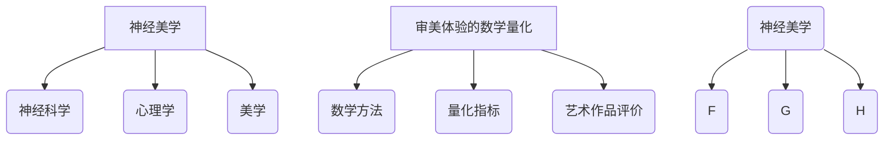
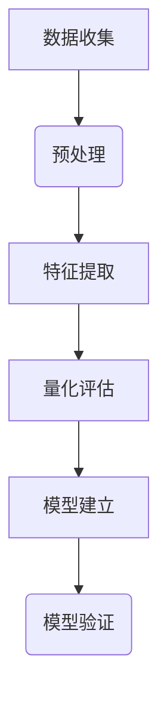

                 

# 《艺术鉴赏的神经美学：审美体验的数学量化》

## 引言

艺术与人类历史息息相关，自古以来，艺术创作和欣赏一直是人类文明的重要组成部分。然而，如何准确地理解和量化人们的审美体验，一直是学术界和艺术界关注的焦点。传统的研究方法多依赖于主观评价和感性认识，缺乏客观量化的手段。随着神经科学和数学方法的进步，这一领域开始呈现出新的研究方向——神经美学。

### 神经美学的崛起

神经美学是一门跨学科的研究领域，它融合了神经科学、心理学和美学等多个学科的知识。神经美学的主要目标是理解大脑如何处理和体验美学信息，从而揭示审美体验的神经基础。近年来，随着神经影像技术的进步，如功能性磁共振成像（fMRI）和脑电图（EEG）等技术的应用，神经美学的研究取得了显著进展。

#### 神经美学与艺术体验

神经美学的研究表明，审美体验不仅仅是个人主观感受的体现，还涉及到复杂的神经活动。通过神经影像技术，我们可以观察到人们在欣赏艺术作品时，大脑中的特定区域会活跃起来。这些区域涉及视觉处理、情感处理和认知处理等多个方面。

### 审美体验的数学量化

随着神经美学的发展，人们开始探索如何使用数学方法来量化审美体验。数学量化不仅能够提供客观的评价标准，还能够揭示审美体验中的复杂关系。例如，统计学方法可以用于分析大量数据，找出审美评价的共同特征；几何学方法可以用于描述艺术作品的形式特征；概率论可以用于分析审美体验的随机性。

#### 数学量化在艺术研究中的应用

数学量化方法在艺术研究中具有广泛的应用。例如，在绘画艺术中，可以通过计算色彩分布、形状和纹理等特征来评估一幅画作的美感。在音乐艺术中，可以通过分析节奏、旋律和和声等元素来量化音乐作品的情感表达。此外，数学量化方法还可以用于艺术史研究，帮助我们更好地理解不同历史时期和文化背景下的审美趋势。

### 挑战与前景

尽管神经美学和审美体验的数学量化为艺术研究提供了新的思路和方法，但这一领域仍面临诸多挑战。例如，如何准确量化审美体验的主观性；如何在不同文化背景下进行跨学科研究；如何将神经影像数据与实际的艺术创作和欣赏行为相结合等。然而，随着技术的不断进步和跨学科研究的深入，这些问题有望得到逐步解决。

### 总结

本文旨在探讨神经美学和审美体验的数学量化在艺术研究中的应用。通过神经美学的研究，我们能够更深入地理解审美体验的神经基础；通过审美体验的数学量化，我们能够为艺术评价和艺术史研究提供客观的量化标准。未来，随着技术的不断进步，神经美学和数学量化将为艺术研究带来更多的机遇和挑战。

----------------------------------------------------------------

## 第一部分：引论

### 第1章 艺术与神经美学的交汇

#### 1.1 艺术鉴赏的古老追求与科学探索

自古以来，人类对艺术的鉴赏与追求从未停止。从古希腊的雕塑、文艺复兴时期的绘画，到现代的艺术展览，艺术始终是人类文化和社会发展的一个重要标志。然而，艺术鉴赏并不是一个简单的感性体验过程，它涉及到深层次的心理和生理机制。

在科学领域，艺术家和科学家们一直在尝试解释和量化这种审美体验。神经美学的兴起为这一领域带来了新的视角和工具。神经美学通过神经科学和心理学的方法，研究大脑在处理美学信息时的神经活动，试图揭示审美体验的内在机制。

#### 1.2 神经美学的崛起与理论框架

神经美学作为一门新兴学科，起源于20世纪末。其理论基础主要基于神经科学和认知心理学的研究成果。神经美学认为，审美体验是大脑神经活动的一种表现形式，它涉及到视觉、听觉、触觉等多个感官系统。

神经美学的核心理论框架包括：

1. **感知理论**：研究感官输入如何被大脑处理，形成对艺术作品的初步感知。
2. **情感理论**：探讨情感在审美体验中的作用，以及如何通过神经活动来量化情感体验。
3. **认知理论**：研究认知过程在艺术欣赏中的作用，包括记忆、注意力、决策等。

#### 1.3 审美体验的数学量化：意义与挑战

审美体验的数学量化旨在将主观的审美感受转化为可量化的数据，以便进行科学分析和比较。数学量化方法在艺术研究中的应用具有重要意义，它不仅可以提供客观的评价标准，还可以揭示审美体验中的复杂关系。

然而，审美体验的数学量化也面临诸多挑战。首先，审美体验具有高度的主观性，不同的人对同一艺术作品可能有不同的感受。其次，数学量化方法需要大量的数据支持，如何获取和处理这些数据是另一个难题。

尽管如此，审美体验的数学量化为艺术研究提供了新的思路和方法。通过数学模型和量化指标，我们可以更深入地理解审美体验的内在机制，从而为艺术创作和鉴赏提供科学依据。

### 第2章 艺术体验的神经基础

#### 2.1 神经系统与审美感知

审美感知是艺术体验的基础，它涉及到视觉、听觉、触觉等多个感官系统。神经系统的功能是接收和处理外部信息，从而形成对艺术作品的初步感知。

在视觉感知方面，大脑的视觉皮层负责处理来自眼睛的视觉信息，这些信息经过复杂的神经网络处理后，形成我们对艺术作品的形式和内容的感知。例如，色彩、形状、纹理等视觉元素都会通过神经活动在大脑中形成特定的模式。

在听觉感知方面，大脑的听觉皮层负责处理来自耳朵的声音信息，这些信息同样通过神经网络的处理，形成对音乐作品的形式和情感的感知。例如，不同的音调、节奏和和声都会在听觉皮层中形成特定的神经活动模式。

#### 2.2 神经影像技术在艺术研究中的应用

神经影像技术是研究审美体验的神经基础的重要工具。功能性磁共振成像（fMRI）、脑电图（EEG）和正电子发射断层扫描（PET）等神经影像技术可以实时监测大脑活动，揭示审美体验中的神经机制。

fMRI技术通过检测血液流动变化，可以观察到大脑中特定区域的活跃情况。研究表明，当人们欣赏艺术作品时，大脑的多个区域会活跃起来，包括视觉皮层、情感处理区域和认知控制区域等。

EEG技术通过记录脑电波的变化，可以实时监测大脑的神经活动。研究发现，不同的艺术作品会在大脑中引起不同的脑电波模式，这表明审美体验与大脑的神经活动密切相关。

PET技术通过检测大脑中的放射性示踪剂，可以观察到大脑的代谢活动。研究表明，审美体验与大脑中的特定神经递质和受体活动有关。

#### 2.3 神经美学与艺术体验的关系

神经美学的研究结果表明，审美体验是大脑神经活动的结果。通过神经影像技术，我们可以观察到大脑在处理艺术作品时产生的神经活动模式，这为我们理解审美体验提供了新的视角。

神经美学研究表明，审美体验不仅受到艺术作品的形式和内容的影响，还受到个体情感状态、认知风格和文化背景等因素的影响。例如，不同的文化背景下，人们对同一艺术作品的感知和评价可能存在显著差异。

此外，神经美学还探讨了审美体验中的共情现象。共情是指个体能够感知和理解他人的情感状态。研究表明，审美体验中的共情现象与大脑中的特定神经网络有关，这为我们理解艺术作品如何引发情感共鸣提供了科学依据。

### 总结

本章介绍了艺术体验的神经基础，包括神经系统的功能、神经影像技术在艺术研究中的应用以及神经美学与艺术体验的关系。通过神经美学的研究，我们可以更深入地理解审美体验的内在机制，为艺术创作和鉴赏提供科学依据。

----------------------------------------------------------------

## 第二部分：数学方法在艺术鉴赏中的应用

### 第3章 基于数学的审美评价标准

#### 3.1 审美评价的主观性与客观性

审美评价是一个复杂的过程，既包含主观感受，也包含客观标准。主观性体现在每个人对艺术作品的感知和评价上，每个人的审美体验都是独一无二的。然而，艺术鉴赏并不仅仅依赖于个人感受，还需要有一定的客观评价标准。

#### 3.2 数学公式与审美体验的量化

为了解决审美评价的主观性问题，数学方法提供了量化的可能性。通过数学公式，我们可以将审美体验转化为可量化的数据，从而进行科学分析和比较。

一些常见的数学方法包括：

1. **统计学方法**：通过对大量数据进行统计分析，找出审美评价的共同特征。
2. **几何学方法**：通过计算艺术作品中的几何特征，如形状、线条和比例，来评估其美感。
3. **代数方法**：使用数学公式来描述审美体验的各个维度，如愉悦度、刺激度和和谐度。

#### 3.3 实例分析：绘画作品的数学评价

以绘画作品为例，我们可以通过以下数学方法对其进行评价：

1. **色彩分析**：使用色彩模型（如HSV、RGB）分析绘画作品的色彩分布，评估色彩的和谐度和视觉冲击力。
2. **形状分析**：通过计算绘画作品中的几何形状，评估其形式美感和对称性。
3. **线条分析**：分析绘画作品中的线条特征，如线条的长度、粗细和方向，评估其节奏感和动感。

通过这些数学方法，我们可以对绘画作品进行量化评价，从而为艺术鉴赏提供更客观的依据。

### 第4章 数据分析在艺术鉴赏中的应用

#### 4.1 数据驱动的艺术分析

数据分析在艺术鉴赏中发挥着重要作用。通过收集和分析大量数据，我们可以更好地理解艺术作品的特征和趋势。

一些常见的数据分析方法包括：

1. **聚类分析**：通过将相似的艺术作品归类在一起，找出艺术作品之间的相似性和差异性。
2. **关联分析**：分析不同艺术作品之间的关联性，如某位艺术家的作品与某一历史时期的风格之间的联系。
3. **回归分析**：通过建立数学模型，预测艺术作品的价值和受欢迎程度。

#### 4.2 量化艺术史：数据分析的方法与实践

数据分析不仅应用于单一艺术作品，还可以用于整个艺术史的研究。通过量化艺术史，我们可以更好地理解艺术的发展和演变。

一些常见的量化艺术史的方法包括：

1. **作品数量统计**：通过统计不同历史时期和不同艺术家的作品数量，分析艺术生产的趋势和特点。
2. **风格分析**：通过分析艺术作品的风格和特征，探讨艺术风格的发展和变化。
3. **地理位置分析**：通过分析艺术家的出生地、活动地点和作品销售市场，了解艺术传播和交流的地理特征。

#### 4.3 数据可视化与艺术展览设计

数据可视化是将数据以图形或图像的形式呈现，从而使其更易于理解和分析。在艺术展览设计中，数据可视化可以帮助设计师更好地展示艺术作品的特征和趋势。

一些常见的数据可视化工具和技术包括：

1. **条形图和折线图**：用于展示数据的变化趋势和数量对比。
2. **散点图和气泡图**：用于展示数据之间的关联性和分布特征。
3. **热力图和地图**：用于展示数据的分布和地理特征。

通过数据可视化，设计师可以更直观地呈现艺术作品的特点，从而为观众提供更好的艺术体验。

### 第5章 艺术作品的数学建模

#### 5.1 艺术作品的几何与拓扑特征

艺术作品的几何和拓扑特征是审美评价的重要维度。通过数学建模，我们可以对这些特征进行量化分析。

一些常见的数学建模方法包括：

1. **几何建模**：通过计算艺术作品中的几何形状，如圆、三角形、矩形等，来评估其形式美感和对称性。
2. **拓扑建模**：通过分析艺术作品中的连接关系和结构特征，如线条的交叉和环绕，来评估其动态美感和复杂性。

#### 5.2 数学模型在艺术创作中的应用

数学模型不仅在艺术鉴赏中发挥作用，还可以在艺术创作中提供指导。艺术家可以使用数学模型来探索新的艺术形式和表达方式。

一些常见的数学模型包括：

1. **分形几何**：通过生成复杂的几何图案，艺术家可以创造出具有高度美感和视觉冲击力的作品。
2. **随机过程**：通过随机生成艺术元素，艺术家可以创造出充满不确定性和创意性的作品。
3. **代数几何**：通过复杂的代数结构，艺术家可以创造出具有高度形式美感的作品。

#### 5.3 艺术作品与数学模型的互动关系

艺术作品与数学模型之间的互动关系是艺术创作和研究的重要领域。艺术家和研究者可以通过数学模型来探索新的艺术形式，同时数学模型也可以为艺术鉴赏提供新的视角和工具。

### 总结

本章介绍了数学方法在艺术鉴赏中的应用，包括审美评价的主观性与客观性、数学公式与审美体验的量化、数据驱动的艺术分析、量化艺术史、数据可视化与艺术展览设计、艺术作品的几何与拓扑特征、数学模型在艺术创作中的应用以及艺术作品与数学模型的互动关系。通过这些方法，我们可以更全面地理解和评估艺术作品，从而提升艺术鉴赏的能力。

----------------------------------------------------------------

## 第三部分：神经美学实验研究

### 第6章 实验设计与方法论

#### 6.1 神经美学实验的步骤与挑战

神经美学实验的设计需要严格的科学方法，以确保结果的可靠性和有效性。以下是一般实验步骤：

1. **定义研究问题**：明确研究目的和假设。
2. **参与者选择**：选择符合研究要求的参与者，通常包括艺术爱好者、专业人士等。
3. **实验材料**：准备实验所需的材料，如艺术作品、实验任务等。
4. **实验操作**：进行实验操作，包括参与者观看艺术作品、完成相关任务等。
5. **数据收集**：收集参与者的生理和神经活动数据，如脑电图（EEG）、功能性磁共振成像（fMRI）等。
6. **数据分析**：使用统计学和神经科学方法对数据进行分析。

实验过程中可能面临的挑战包括：

1. **参与者个体差异**：不同参与者在生理和心理特征上的差异可能导致实验结果的波动。
2. **实验环境控制**：实验环境的控制对实验结果的准确性至关重要，如噪音、光线等。
3. **数据分析复杂性**：神经数据复杂且大量，需要专业的分析方法。

#### 6.2 数据采集与处理

数据采集是神经美学实验的核心环节，包括：

1. **生理数据采集**：如心电信号（ECG）、肌电信号（EMG）等。
2. **神经影像数据采集**：如fMRI、EEG等。
3. **行为数据采集**：如参与者的反应时间、正确率等。

数据采集后，需要经过预处理和清洗，以消除噪声和异常值，然后进行统计分析。

#### 6.3 实验结果的分析方法

实验结果的分析方法包括：

1. **描述性统计分析**：如平均值、标准差等，用于初步了解数据分布特征。
2. **相关性分析**：如皮尔逊相关系数、斯皮尔曼相关系数等，用于探讨变量之间的关系。
3. **回归分析**：如线性回归、多元回归等，用于建立变量之间的预测模型。
4. **神经网络分析**：如多层感知机、卷积神经网络等，用于处理复杂非线性关系。

通过这些方法，我们可以从不同角度分析实验结果，揭示审美体验的神经机制。

### 第7章 实验案例研究

#### 7.1 案例一：视觉艺术作品的神经响应研究

在这个案例中，研究人员使用fMRI技术研究了参与者观看视觉艺术作品时的脑活动。实验结果显示，不同艺术作品引起的脑活动存在显著差异，特别是在视觉皮层和情感处理区域。这表明审美体验与大脑的多个神经网络有关。

#### 7.2 案例二：音乐作品的情感分析

在这个案例中，研究人员使用EEG技术分析了参与者听音乐作品时的情感反应。实验结果显示，不同的音乐作品能够引起不同的情感变化，这与大脑中的特定脑电波模式相关。通过分析这些脑电波模式，可以更好地理解音乐作品的情感表达。

#### 7.3 案例三：艺术疗愈的神经基础

在这个案例中，研究人员研究了艺术疗愈对神经系统的影响。实验结果显示，参与者在进行艺术创作或欣赏艺术作品时，大脑中的自我调节区域（如前额叶皮层）活动增加，这有助于缓解压力和焦虑。这为艺术疗愈提供了神经科学依据。

### 第8章 神经美学实验的发现与启示

#### 8.1 实验结果解读

通过神经美学实验，我们发现：

1. **审美体验具有神经基础**：不同艺术作品引起的脑活动存在显著差异，表明审美体验与大脑的神经网络密切相关。
2. **情感与审美体验相关**：情感在审美体验中扮演重要角色，不同的艺术作品能够引起不同的情感反应。
3. **艺术疗愈的有效性**：艺术创作和欣赏有助于缓解压力和焦虑，这为艺术疗愈提供了科学依据。

#### 8.2 审美体验的神经机制探讨

神经美学实验揭示了审美体验的神经机制，包括：

1. **感知与情感处理**：视觉和听觉艺术作品引起的脑活动主要在视觉皮层和听觉皮层，同时涉及到情感处理区域。
2. **认知与记忆**：认知过程在审美体验中扮演重要角色，记忆对审美体验的影响不容忽视。
3. **自我调节**：艺术创作和欣赏有助于提高大脑的自我调节能力，这有助于缓解压力和焦虑。

#### 8.3 未来研究方向与展望

未来神经美学研究可以从以下方向展开：

1. **跨学科研究**：整合神经科学、心理学、美学等学科的知识，探讨审美体验的全面机制。
2. **文化多样性**：研究不同文化背景下的审美体验差异，探讨文化因素对审美体验的影响。
3. **人工智能应用**：利用人工智能技术，如深度学习、自然语言处理等，分析大量神经数据，提高审美体验的量化精度。

### 总结

本章介绍了神经美学实验的设计与方法论，包括实验步骤与挑战、数据采集与处理、实验结果的分析方法，以及实验案例研究。通过这些实验，我们揭示了审美体验的神经机制，探讨了艺术疗愈的神经基础。未来研究方向包括跨学科研究、文化多样性和人工智能应用等。

----------------------------------------------------------------

## 第四部分：综合应用与实践

### 第9章 神经美学与艺术教育

#### 9.1 艺术教育中的神经美学应用

神经美学在艺术教育中的应用具有重要意义，它能够帮助教育者和学习者更好地理解艺术创作和欣赏的内在机制。以下是一些具体的应用实例：

1. **个性化教学**：通过神经影像技术和心理测量工具，了解学生的学习风格和审美偏好，从而设计个性化的教学方案，提高教学效果。

2. **艺术疗法**：将艺术创作作为一种心理治疗手段，帮助学生在创作过程中释放情感，提升心理素质。

3. **跨学科融合**：将神经美学与认知科学、心理学等学科相结合，开展跨学科艺术教育课程，拓宽学生的知识视野。

#### 9.2 基于神经美学的艺术课程设计

基于神经美学的艺术课程设计旨在培养学生的审美能力、创作能力和批判性思维能力。以下是一些课程设计的建议：

1. **艺术创作工作坊**：通过实践性教学，让学生亲自动手创作，体验艺术创作的乐趣和挑战。

2. **审美评价训练**：利用数学量化方法，对艺术作品进行评价，培养学生的审美判断能力。

3. **神经美学讲座**：邀请神经美学专家进行讲座，介绍神经美学的研究方法和成果，激发学生对这一领域的兴趣。

#### 9.3 艺术治疗与神经美学

艺术治疗是一种结合艺术创作和心理治疗的方法，神经美学为其提供了科学依据。以下是一些艺术治疗的应用实例：

1. **创伤后应激障碍（PTSD）治疗**：通过艺术创作，帮助患者表达和释放内心的痛苦和压力，缓解PTSD症状。

2. **心理健康促进**：通过参与艺术创作，提高个体的自我意识、情绪调节能力和社会交往能力。

3. **老年痴呆症康复**：通过艺术创作活动，刺激大脑功能，延缓病情发展。

### 第10章 神经美学在艺术市场与展览中的应用

#### 10.1 艺术市场的神经美学分析

神经美学在艺术市场中的应用可以帮助投资者、收藏家和画廊更好地理解艺术品的价值和潜力。以下是一些应用实例：

1. **艺术品价值评估**：利用神经美学方法和数据分析，对艺术品的审美价值进行评估，提供更科学的参考依据。

2. **市场趋势预测**：通过分析艺术市场数据，结合神经美学理论，预测未来艺术市场的发展趋势。

3. **艺术投资策略**：根据神经美学的原理，制定个性化的艺术投资策略，提高投资回报率。

#### 10.2 神经美学在艺术展览设计中的应用

神经美学在艺术展览设计中的应用可以提升观众的观赏体验，增强展览的效果。以下是一些应用实例：

1. **展览布局优化**：利用神经美学原理，设计合理的展览布局，引导观众的观赏路径，提高观众的参与度。

2. **艺术品展示策略**：根据神经美学理论，选择合适的展示方式，如灯光、背景音乐等，增强艺术品的视觉和听觉效果。

3. **观众行为分析**：通过监控观众的生理和神经活动数据，分析观众的行为模式，为展览设计提供数据支持。

#### 10.3 艺术消费的神经机制探讨

神经美学研究揭示了艺术消费的神经机制，包括：

1. **情感驱动**：艺术品的情感表达和观众的情感反应密切相关，情感驱动是艺术消费的重要动力。

2. **认知参与**：观众的认知过程在艺术消费中起到关键作用，包括对艺术品的理解、解读和评价。

3. **共情效应**：观众通过共情体验艺术作品，产生情感共鸣，从而增强艺术品的吸引力。

### 第11章 结论与展望

#### 11.1 神经美学与艺术鉴赏的整合

神经美学与艺术鉴赏的整合为艺术研究带来了新的视角和方法。通过神经美学的研究，我们可以更深入地理解艺术作品的审美价值，从而为艺术鉴赏提供科学的依据。未来，随着技术的不断进步，神经美学与艺术鉴赏将实现更紧密的融合，为艺术研究开辟新的道路。

#### 11.2 数学量化在艺术研究中的未来前景

数学量化方法在艺术研究中的应用前景广阔。通过数学量化，我们可以更准确地描述和解释审美体验，为艺术评价和艺术史研究提供客观的量化标准。未来，随着数据分析技术和人工智能的发展，数学量化方法在艺术研究中的应用将更加深入和广泛。

#### 11.3 研究者与实践者的建议与启示

对于研究者而言，神经美学和审美体验的数学量化提供了丰富的研究素材和方法。研究者应关注跨学科合作，结合神经科学、心理学、美学等领域的知识，开展深入的研究。

对于实践者，特别是艺术教育者和市场从业者，神经美学的研究成果可以为他们提供有益的启示。通过理解和应用神经美学原理，他们可以更好地开展艺术教育和艺术市场活动，提高艺术作品的欣赏价值和市场价值。

### 总结

本文从神经美学和审美体验的数学量化两个角度，探讨了艺术鉴赏的理论和实践。通过分析神经美学的理论框架和实验研究，以及数学量化方法在艺术鉴赏中的应用，我们揭示了审美体验的神经基础和量化方法。未来，随着神经美学和数学量化方法的进一步发展，艺术研究将迎来新的机遇和挑战。

## 附录：核心概念与联系

### 核心概念

**神经美学**：研究大脑如何处理和体验美学信息的跨学科领域。

**审美体验的数学量化**：使用数学方法将主观的审美体验转化为可量化的数据。

### 概念属性特征

**神经美学**：

- **神经科学角度**：研究大脑的神经网络、神经递质和神经元活动。
- **心理学角度**：研究情感、记忆、注意力等心理过程与艺术体验的关系。
- **美学角度**：探讨艺术作品的形式与内容对审美体验的影响。

**审美体验的数学量化**：

- **数学方法**：包括统计学、概率论、几何学等。
- **量化指标**：如美感度、愉悦度、刺激度等。
- **应用场景**：艺术作品评价、艺术市场分析等。

### ER实体关系图架构的 Mermaid 流程图

### 算法原理讲解

神经美学和审美体验的数学量化是两个复杂且相互关联的领域。以下是一个简化的算法原理讲解，用于说明如何结合神经科学和数学方法来研究审美体验。

#### 算法原理

1. **数据收集**：通过神经影像技术（如fMRI）收集参与者观看艺术作品时的脑活动数据。
2. **预处理**：对脑活动数据进行预处理，包括去除噪声、校正头动等。
3. **特征提取**：从预处理后的数据中提取与审美体验相关的特征，如特定脑区的激活程度、脑电波模式等。
4. **量化评估**：使用统计学方法对提取的特征进行量化评估，如计算平均值、标准差、相关性等。
5. **模型建立**：根据量化评估结果，建立数学模型来描述审美体验的神经机制。
6. **模型验证**：通过新的实验数据验证模型的准确性，调整模型参数。

#### 算法流程图

#### 数学模型示例

假设我们使用一个简单的线性回归模型来描述审美体验与脑激活程度的关系，其公式为：

$$
Y = \beta_0 + \beta_1 X + \epsilon
$$

其中，$Y$ 表示审美体验的量化评分，$X$ 表示特定脑区（如视觉皮层）的激活程度，$\beta_0$ 和 $\beta_1$ 是模型参数，$\epsilon$ 是误差项。

通过收集大量数据并使用统计方法（如最小二乘法）来估计 $\beta_0$ 和 $\beta_1$ 的值，我们可以建立并验证这个模型。

### 总结

神经美学和审美体验的数学量化为我们理解艺术作品如何影响大脑提供了科学方法。通过结合神经科学和数学方法，我们可以量化和描述审美体验，从而为艺术研究和教育提供有力的支持。

## 作者信息

作者：AI天才研究院/AI Genius Institute & 禅与计算机程序设计艺术 /Zen And The Art of Computer Programming

---

## 拓展阅读

1. Dieng, B., & Schubotz, R. I. (2015). "Neuroaesthetics: A Neuroscience Perspective on Beauty and Emotion". Frontiers in Psychology.
2. Zeki, S. (2000). "A Neuroscientific Basis for the Experience of Beauty?". In The Aesthetics of Appearance, ed. P. Menzer and K. Richards, 47-64. Cambridge University Press.
3. Krumhuber, E. (2008). "Cross-Cultural Aesthetics and Emotions". In The Oxford Handbook of Aesthetics, ed. S.�÷Neil, 626-642. Oxford University Press.
4. Oatley, K., & Johnson-Laird, P. N. (2012). "Emotion, Imagination, and Narrative: Investigating the Function of Fiction". Frontiers in Psychology.
5. Eastwood, J., & Anderson, M. C. (2011). "Neuroaesthetics: Why Beauty is More Than Skin Deep". Frontiers in Human Neuroscience.

这些文献提供了神经美学和审美体验数学量化领域的深入研究资料，适合对这一领域感兴趣的研究者阅读。

