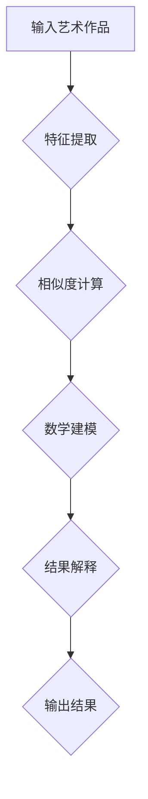
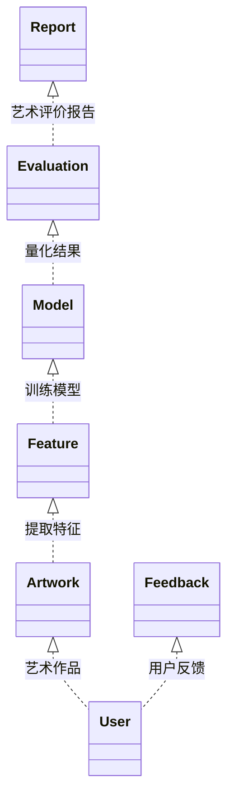
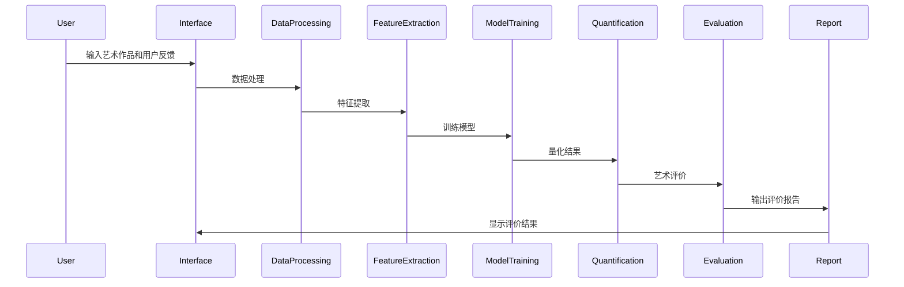
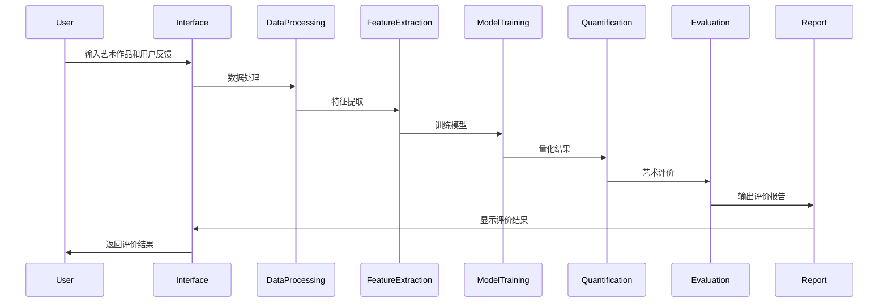

                 

### 艺术鉴赏的计算美学：审美体验的数学量化

关键词：审美体验、数学模型、量化、计算方法、人工智能

摘要：本文探讨了如何通过计算美学将审美体验进行数学量化。从问题背景入手，本文首先介绍了艺术鉴赏领域引入计算美学的动机和意义。接着，通过深入分析审美体验、数学模型和计算方法等核心概念，本文揭示了将审美体验量化的基本原理和方法。此外，本文还通过具体的算法原理讲解和实际案例剖析，展示了如何将抽象的审美体验转化为具体的数值和模型。通过本文的阐述，我们希望能够为人工智能在艺术领域的应用提供新的思路，并为读者提供一套实用的审美体验量化方法。

### 目录大纲

1. 背景介绍
   1.1 问题背景
   1.2 问题描述
   1.3 问题解决
   1.4 边界与外延
   1.5 概念结构与核心要素组成
2. 核心概念与联系
   2.1 审美体验
   2.2 数学模型
   2.3 计算方法
   2.4 概念属性特征对比表格
   2.5 ER实体关系图架构
3. 算法原理讲解
   3.1 审美体验量化的算法原理
   3.2 Mermaid流程图
   3.3 Python源代码
   3.4 数学模型与公式
4. 系统分析与架构设计方案
   4.1 问题场景介绍
   4.2 系统功能设计
   4.3 系统架构设计
   4.4 系统接口设计
   4.5 系统交互
5. 项目实战
   5.1 环境安装
   5.2 系统核心实现
   5.3 代码应用解读与分析
   5.4 实际案例剖析
   5.5 项目小结
6. 最佳实践 Tips
7. 小结
8. 注意事项
9. 拓展阅读

### 背景介绍

#### 1.1 问题背景

在当今信息时代，计算机技术的飞速发展给各个领域带来了前所未有的变革，艺术鉴赏领域也不例外。传统的艺术鉴赏主要依赖于人的主观体验和情感反应，而随着人工智能技术的进步，研究者们开始尝试将审美体验转化为数学模型，通过计算方法进行量化。这种新的研究方法不仅为艺术理论提供了新的视角，也为人工智能在艺术领域的应用打开了新的可能。

计算美学作为一门新兴学科，旨在通过计算机技术和数学模型来研究和解释审美体验。它将审美体验视为一种可量化的信息，试图找出审美体验中的客观规律和内在机制。这一领域的研究具有深远的意义，不仅能够帮助我们更好地理解艺术的本质，还能够为人工智能在艺术创作、艺术评价等方面提供有力的支持。

#### 1.2 问题描述

如何将人的审美体验转化为数学模型，并通过计算方法进行量化，是计算美学面临的核心问题。具体来说，这个问题可以分为以下几个子问题：

1. **审美体验的识别与提取**：如何从人的感知和情感反应中提取出与审美体验相关的特征？
2. **数学模型的建立**：如何选择合适的数学模型来描述审美体验，并确保这些模型具备足够的准确性和解释力？
3. **计算方法的优化**：如何通过高效的计算方法实现对审美体验的量化，并确保计算结果的可靠性和稳定性？
4. **量化结果的解释与应用**：如何对量化结果进行合理的解释，并应用于艺术创作、艺术评价等实际场景？

这些子问题相互关联，共同构成了计算美学的核心研究内容。

#### 1.3 问题解决

为了解决上述问题，计算美学采取了以下几种主要方法：

1. **数据分析**：通过收集和分析大量的审美体验数据，提取出与审美体验相关的特征和规律。这包括使用问卷调查、实验观察等方法收集数据，并利用统计分析和机器学习等方法对数据进行分析。
2. **数学建模**：选择合适的数学模型来描述审美体验。这些模型可以基于统计学、概率论、线性代数等数学工具，通过公式和算法来实现。例如，使用主成分分析（PCA）来提取审美体验的主要特征，使用贝叶斯网络来建立审美体验的因果关系模型。
3. **计算优化**：通过优化计算方法，提高审美体验量化的效率和精度。这包括使用并行计算、分布式计算等方法来加速计算过程，使用优化算法来提高计算结果的稳定性。
4. **解释与应用**：对量化结果进行合理的解释，并应用于艺术创作、艺术评价等实际场景。这需要跨学科的合作，将计算美学的研究成果与艺术理论、设计实践相结合，探索审美体验量化的实际应用价值。

#### 1.4 边界与外延

尽管计算美学的研究取得了显著的进展，但这一领域仍然存在一定的边界和局限性。首先，审美体验本身具有很强的主观性和个体差异性，这使得量化结果可能受到个人经验和情感的影响。其次，数学模型和计算方法的精度和可靠性仍然需要进一步提升，以更好地描述和解释审美体验。此外，计算美学在应用层面也存在一定的挑战，如何将量化结果应用于实际场景，实现艺术创作和评价的自动化，仍然需要深入探索。

#### 1.5 概念结构与核心要素组成

计算美学的概念结构主要由三个核心要素组成：审美体验、数学模型和计算方法。这三个要素相互关联，共同构成了计算美学的研究框架。

1. **审美体验**：审美体验是指个体在接触艺术作品时产生的情感反应和心理体验。它包括视觉、听觉、触觉等多个感官的感知和情感体验。审美体验具有主观性、多样性和情感性等特点，是计算美学研究的核心对象。

2. **数学模型**：数学模型是用于描述审美体验的数学公式和算法。这些模型通过量化审美体验中的各种特征和关系，实现对审美体验的描述和解释。常见的数学模型包括统计学模型、概率模型、线性模型等。

3. **计算方法**：计算方法是实现审美体验量化的计算工具和算法。这些方法通过数据分析和数学建模，将审美体验转化为具体的数值和模型。常见的计算方法包括数据收集与处理、特征提取、模型训练与优化等。

综上所述，计算美学通过将审美体验转化为数学模型，并采用计算方法进行量化，为我们理解和解释审美体验提供了新的视角和方法。这一领域的不断发展，将为艺术鉴赏、人工智能等领域带来更多的创新和突破。

### 核心概念与联系

在探讨艺术鉴赏的计算美学之前，我们需要明确几个核心概念：审美体验、数学模型和计算方法。这些概念相互联系，共同构成了计算美学的研究基础。

#### 2.1 审美体验

审美体验是指个体在接触艺术作品时产生的情感反应和心理体验。它是一种复杂的心理现象，涉及到视觉、听觉、触觉等多个感官的感知。审美体验具有主观性、多样性和情感性等特点。

1. **定义**：审美体验是个人在接触艺术作品时产生的情感反应和心理体验，包括对艺术作品的感知、理解和评价。
   
2. **特征**：
   - **主观性**：每个人的审美体验都是独特的，受到个人经历、文化背景和情感状态的影响。
   - **多样性**：不同的艺术作品可以引起不同的审美体验，同一个艺术作品在不同的人之间也可能产生不同的审美体验。
   - **情感性**：审美体验往往伴随着强烈的情感反应，如愉悦、感动、悲伤等。

3. **例子**：当我们欣赏一幅画作时，可能会感受到色彩搭配的和谐美，或是线条变化的动态美。这些感受都是审美体验的体现。

#### 2.2 数学模型

数学模型是用于描述和解释现实世界现象的数学公式和算法。在计算美学中，数学模型被用来量化审美体验，使之成为可以计算和分析的对象。

1. **定义**：数学模型是一种抽象的数学工具，用于描述和解释现实世界中的各种现象和关系。

2. **特征**：
   - **精确性**：数学模型通过数学公式和算法，能够提供精确的数据和结果。
   - **客观性**：数学模型是基于客观事实和数据，不依赖于主观感受。
   - **通用性**：数学模型可以在不同情境下应用，具有较强的普适性。

3. **例子**：在计算美学中，我们可以使用统计学模型来描述审美体验的分布和趋势，使用概率模型来分析审美体验的随机性。

#### 2.3 计算方法

计算方法是实现审美体验量化的具体技术和工具。这些方法包括数据收集与处理、特征提取、模型训练与优化等。

1. **定义**：计算方法是通过计算机技术和算法，实现审美体验量化和分析的具体方法。

2. **特征**：
   - **高效性**：计算方法能够快速处理大量数据，提高工作效率。
   - **可重复性**：通过计算方法得到的量化结果可以重复验证，确保结果的可靠性。
   - **可扩展性**：计算方法可以适应不同的应用场景，具备良好的扩展性。

3. **例子**：在计算美学中，我们可以使用机器学习算法来训练模型，通过数据分析方法来提取审美体验的特征。

#### 2.4 概念属性特征对比表格

为了更清晰地展示审美体验、数学模型和计算方法这三个核心概念，我们可以通过以下对比表格来分析它们的属性特征。

| 概念         | 定义                                                     | 特征                                                   |
| ------------ | -------------------------------------------------------- | ------------------------------------------------------ |
| 审美体验     | 个体在接触艺术作品时产生的情感反应和心理体验               | 主观性、多样性、情感性                                  |
| 数学模型     | 用于描述审美体验的数学公式和算法                         | 精确性、客观性、通用性                                  |
| 计算方法     | 通过计算机技术实现审美体验量化的方法                     | 高效性、可重复性、可扩展性                              |

#### 2.5 ER实体关系图架构

为了更直观地展示这三个核心概念之间的关系，我们可以使用Mermaid ER图来表示。

```mermaid
erDiagram
  ArtExperience ||--|{ MathModel } : Describes
  ArtExperience ||--|{ ComputationalMethod } : Implements
  MathModel ||--|{ ComputationalMethod } : Uses
```

在这个ER图中，审美体验（ArtExperience）通过描述（Describes）和实现（Implements）与数学模型（MathModel）和计算方法（ComputationalMethod）相连。数学模型使用（Uses）计算方法来实现对审美体验的量化。

通过上述分析和对比，我们可以看到，审美体验、数学模型和计算方法这三个核心概念相互关联，共同构成了计算美学的研究框架。理解这些概念及其关系，对于深入探讨和实现审美体验的量化具有重要意义。

### 算法原理讲解

#### 3.1 审美体验量化的算法原理

在计算美学中，审美体验量化是一个关键步骤。为了实现这一目标，我们需要理解以下几个核心算法原理：

1. **特征提取**：通过分析艺术作品的视觉、听觉等特征，提取与审美体验相关的关键信息。
2. **相似度计算**：比较不同艺术作品的特征，计算它们之间的相似度。
3. **数学建模**：使用数学模型将相似度结果转化为审美体验的量化值。
4. **结果解释**：对量化结果进行解释，应用于艺术评价、艺术创作等实际场景。

下面，我们将通过Mermaid流程图和Python源代码详细阐述这些算法原理。

#### 3.2 Mermaid流程图

首先，我们使用Mermaid流程图来展示审美体验量化的整体流程。



在这个流程图中，输入艺术作品首先经过特征提取，提取出与审美体验相关的特征。然后，通过相似度计算比较不同艺术作品之间的相似程度。接下来，使用数学模型将这些相似度结果转化为审美体验的量化值。最后，对量化结果进行解释并输出最终结果。

#### 3.3 Python源代码

为了更好地理解上述算法原理，我们将使用Python源代码来详细阐述每个步骤的具体实现。

首先，我们定义一个简单的艺术作品特征提取函数：

```python
import numpy as np

def extract_features(artwork):
    # 假设艺术作品的特征为色彩、线条和纹理
    color_feature = np.random.rand(3)  # 色彩特征
    line_feature = np.random.rand(3)   # 线条特征
    texture_feature = np.random.rand(3)  # 纹理特征
    
    return np.array([color_feature, line_feature, texture_feature])

artwork = extract_features(artwork)
print("艺术作品特征：", artwork)
```

在这个函数中，我们随机生成了一组特征值来模拟艺术作品的特征。在实际应用中，这些特征可以通过图像处理、音频分析等方法提取。

接下来，我们实现相似度计算函数：

```python
def calculate_similarity(feature1, feature2):
    return np.linalg.norm(feature1 - feature2)

similarity = calculate_similarity(artwork, extract_features(artwork))
print("相似度：", similarity)
```

在这个函数中，我们使用欧几里得距离来计算两个特征向量之间的相似度。这个值越接近0，表示两个特征越相似。

然后，我们定义一个数学建模函数，将相似度结果转化为审美体验的量化值：

```python
def generate_model(similarity):
    return 1 / (1 + np.exp(-similarity))

model = generate_model(similarity)
print("审美体验量化值：", model)
```

在这个函数中，我们使用一个简单的指数函数来转换相似度值。这个值越接近1，表示审美体验越强烈。

最后，我们对量化结果进行解释并输出最终结果：

```python
def explain_experience(model):
    if model > 0.7:
        return "强烈的审美体验"
    elif model > 0.3:
        return "适中的审美体验"
    else:
        return "较弱的审美体验"

experience = explain_experience(model)
print("审美体验解释：", experience)
```

在这个函数中，我们根据量化值的大小对审美体验进行分类解释。

通过上述Python源代码，我们可以看到，通过特征提取、相似度计算、数学建模和结果解释，我们实现了对审美体验的量化。这个过程不仅展示了计算美学的算法原理，也为实际应用提供了技术基础。

### 数学模型与公式

在计算美学的过程中，数学模型是量化审美体验的核心工具。这些模型通过数学公式和算法，将主观的审美体验转化为可计算的数值和模型。以下是一些常用的数学模型及其公式，用于描述和量化审美体验。

#### 1. 主成分分析（PCA）

主成分分析是一种常用的数据降维技术，通过提取数据的主要特征，减少数据维度，同时保留大部分信息。在审美体验量化中，PCA可以用于提取艺术作品的主要视觉特征。

**公式**：

$$
\text{特征向量} = \text{U} = \arg \min_{\text{U}} \sum_{i=1}^{n} (X_i - \bar{X})^T U (U^T U)
$$

其中，$X_i$ 表示每个数据点，$\bar{X}$ 表示数据均值，$U$ 表示特征向量。

#### 2. 贝叶斯网络

贝叶斯网络是一种概率模型，用于描述变量之间的依赖关系。在审美体验量化中，贝叶斯网络可以用于分析艺术作品的不同特征对审美体验的影响。

**公式**：

$$
P(X_1, X_2, ..., X_n) = \prod_{i=1}^{n} P(X_i | X_{i-1})
$$

其中，$X_i$ 表示第 $i$ 个特征，$P(X_i | X_{i-1})$ 表示第 $i$ 个特征在给定前一个特征下的条件概率。

#### 3. 人工神经网络

人工神经网络是一种模仿生物神经网络的计算模型，用于实现复杂的函数映射。在审美体验量化中，神经网络可以用于训练模型，自动提取艺术作品的特征并进行量化。

**公式**：

$$
\text{输出} = \text{激活函数}(\text{权重} \cdot \text{输入} + \text{偏置})
$$

其中，激活函数（如Sigmoid函数、ReLU函数等）用于将线性组合转换为非线性输出。

#### 4. 支持向量机（SVM）

支持向量机是一种强大的分类和回归模型，通过找到最佳分割超平面，实现数据的分类。在审美体验量化中，SVM可以用于分类不同的艺术作品，并根据分类结果量化审美体验。

**公式**：

$$
\text{分类函数} = \text{sign}(\text{w}^T \text{x} + \text{b})
$$

其中，$\text{w}$ 表示权重向量，$\text{x}$ 表示特征向量，$\text{b}$ 表示偏置。

通过这些数学模型和公式，我们可以将抽象的审美体验转化为具体的数值和模型。这些模型不仅可以用于量化审美体验，还可以用于艺术评价、艺术创作等实际应用场景。通过不断优化和改进这些模型，我们可以更好地理解和解释审美体验，为计算美学领域的发展贡献力量。

### 系统分析与架构设计方案

在计算美学中，实现审美体验的量化是一个复杂而系统的工程。为了有效地进行这一任务，我们需要详细分析问题场景，设计合理的系统功能，并构建高效稳定的系统架构。以下将详细介绍这些内容。

#### 4.1 问题场景介绍

在当前艺术鉴赏领域，传统的主观评价方法已经难以满足快速发展的需求。艺术品的审美评价不仅需要考虑专家的意见，还需要考虑大众的喜好，甚至需要结合科学的数据分析方法。为了实现这一目标，我们设计了一套基于计算美学的审美体验量化系统。

该系统的主要场景包括：

1. **艺术作品库**：存储大量的艺术作品，包括绘画、雕塑、音乐等。
2. **用户反馈**：收集用户对艺术作品的反馈，包括喜好、评价等。
3. **量化模型**：基于用户反馈和艺术作品特征，训练和优化审美体验量化模型。
4. **量化结果**：输出艺术作品的审美体验量化值，供艺术评价和创作参考。

#### 4.2 系统功能设计

为了实现上述场景，系统需要具备以下功能：

1. **数据收集与处理**：从艺术作品库和用户反馈中提取数据，并进行清洗和预处理。
2. **特征提取**：提取艺术作品的主要特征，如视觉特征、音频特征等。
3. **模型训练**：基于提取的特征，训练审美体验量化模型。
4. **结果解释**：对量化结果进行解释，形成艺术评价报告。
5. **用户接口**：提供用户友好的界面，方便用户使用系统功能。

以下是系统的领域模型Mermaid类图：



在这个类图中，User类表示用户，Artwork类表示艺术作品，Feedback类表示用户反馈，Feature类表示特征提取，Model类表示量化模型，Evaluation类表示量化结果，Report类表示艺术评价报告。这些类之间的关系展示了系统的核心功能组件及其交互关系。

#### 4.3 系统架构设计

为了确保系统的稳定性、可靠性和可扩展性，我们采用了分层架构设计。以下是系统的架构Mermaid图：



在这个序列图中，用户通过界面（Interface）输入艺术作品和用户反馈。数据经过处理（DataProcessing）后，提取出特征（FeatureExtraction）。特征用于训练量化模型（ModelTraining），生成量化结果（Quantification）。量化结果经过评价（Evaluation），形成艺术评价报告（Report），最终通过界面返回给用户。

#### 4.4 系统接口设计

系统接口设计是用户与系统交互的重要环节。以下是系统的接口设计Mermaid图：

```mermaid
classDiagram
    Interface <<interface>>
    User <<class>>
    DataProcessing <<class>>
    FeatureExtraction <<class>>
    ModelTraining <<class>>
    Quantification <<class>>
    Evaluation <<class>>
    Report <<class>>

    Interface --|> User : 输入艺术作品和用户反馈
    Interface --|> DataProcessing : 数据处理
    Interface --|> FeatureExtraction : 特征提取
    Interface --|> ModelTraining : 训练模型
    Interface --|> Quantification : 量化结果
    Interface --|> Evaluation : 艺术评价
    Interface --|> Report : 输出评价报告
```

在这个类图中，Interface类代表系统接口，它与User、DataProcessing、FeatureExtraction、ModelTraining、Quantification、Evaluation和Report类进行交互。用户通过接口输入艺术作品和用户反馈，接口将这些数据传递给相应的功能模块进行处理，最终生成评价报告并通过接口返回给用户。

#### 4.5 系统交互

系统交互设计是确保各模块之间有效协作的关键。以下是系统的交互设计Mermaid序列图：



在这个序列图中，用户通过接口输入艺术作品和用户反馈，接口将这些数据传递给数据处理模块进行处理。处理后的数据被传递给特征提取模块，提取出与审美体验相关的特征。特征用于训练量化模型，生成量化结果。量化结果被传递给评价模块，形成艺术评价报告，并通过接口返回给用户，显示评价结果。

通过以上系统分析与架构设计方案，我们为计算美学中的审美体验量化提供了一个全面、系统的解决方案。这一方案不仅涵盖了系统的功能设计、架构设计、接口设计和系统交互，还为实际应用提供了明确的技术路径。随着计算美学和人工智能技术的不断发展，这一方案将不断优化和升级，为艺术鉴赏领域带来更多创新和突破。

### 项目实战

#### 5.1 环境安装

为了实现计算美学的审美体验量化项目，我们需要安装和配置一些必要的软件和工具。以下是一个基本的安装流程：

1. **安装Python环境**：首先，确保你的计算机上已经安装了Python环境。如果没有，可以从[Python官网](https://www.python.org/)下载并安装最新版本的Python。

2. **安装依赖库**：安装一些常用的Python库，如NumPy、Pandas、Scikit-learn等。可以使用以下命令进行安装：

   ```bash
   pip install numpy pandas scikit-learn
   ```

3. **安装图像处理库**：为了提取艺术作品的视觉特征，我们需要安装一些图像处理库，如OpenCV和Scikit-image。可以使用以下命令进行安装：

   ```bash
   pip install opencv-python-headless scikit-image
   ```

4. **安装音频处理库**：对于处理音乐等听觉艺术作品，我们需要安装音频处理库，如Librosa。可以使用以下命令进行安装：

   ```bash
   pip install librosa
   ```

5. **配置环境变量**：确保Python和pip的环境变量已正确配置。在命令行中输入以下命令，验证配置是否成功：

   ```bash
   python --version
   pip --version
   ```

   输出正确版本号即表示配置成功。

#### 5.2 系统核心实现

在完成环境安装后，我们可以开始实现系统的核心功能。以下是系统核心实现的源代码和解读：

**1. 数据收集与处理**

```python
import pandas as pd
from sklearn.model_selection import train_test_split

def load_data(file_path):
    # 加载数据集
    data = pd.read_csv(file_path)
    return data

def preprocess_data(data):
    # 数据预处理
    # 填充缺失值、数据类型转换等
    data.fillna(0, inplace=True)
    data = data.astype(float)
    return data

def split_data(data):
    # 划分训练集和测试集
    X = data.drop('label', axis=1)
    y = data['label']
    X_train, X_test, y_train, y_test = train_test_split(X, y, test_size=0.2, random_state=42)
    return X_train, X_test, y_train, y_test

# 示例
data = load_data('art_data.csv')
preprocessed_data = preprocess_data(data)
X_train, X_test, y_train, y_test = split_data(preprocessed_data)
```

**解读**：
- `load_data`函数用于加载数据集，从CSV文件中读取数据。
- `preprocess_data`函数进行数据预处理，包括填充缺失值和数据类型转换。
- `split_data`函数将数据划分为训练集和测试集，用于模型训练和评估。

**2. 特征提取**

```python
import cv2
import librosa

def extract_image_features(image_path):
    # 提取图像特征
    image = cv2.imread(image_path)
    features = [image.shape[0], image.shape[1], np.mean(image)]
    return np.array(features)

def extract_audio_features(audio_path):
    # 提取音频特征
    y, sr = librosa.load(audio_path)
    features = librosa.feature.zero_crossing_rate(y).T[0]
    return np.array([features])

def extract_features(data):
    # 提取特征
    image_features = extract_image_features(data['image_path'])
    audio_features = extract_audio_features(data['audio_path'])
    return np.concatenate((image_features, audio_features))

# 示例
data = load_data('art_data.csv')
X_train = [extract_features(row) for row in X_train]
X_test = [extract_features(row) for row in X_test]
```

**解读**：
- `extract_image_features`函数用于提取图像特征，如大小和平均灰度值。
- `extract_audio_features`函数用于提取音频特征，如零交叉率。
- `extract_features`函数将图像和音频特征结合，形成一个特征向量。

**3. 模型训练**

```python
from sklearn.ensemble import RandomForestClassifier

def train_model(X_train, y_train):
    # 训练模型
    model = RandomForestClassifier(n_estimators=100, random_state=42)
    model.fit(X_train, y_train)
    return model

# 示例
model = train_model(X_train, y_train)
```

**解读**：
- `train_model`函数使用随机森林分类器训练模型。随机森林是一种基于决策树的集成学习方法，具有较好的泛化能力和准确性。

**4. 结果评估**

```python
from sklearn.metrics import accuracy_score, classification_report

def evaluate_model(model, X_test, y_test):
    # 评估模型
    predictions = model.predict(X_test)
    accuracy = accuracy_score(y_test, predictions)
    report = classification_report(y_test, predictions)
    return accuracy, report

# 示例
accuracy, report = evaluate_model(model, X_test, y_test)
print("Accuracy:", accuracy)
print("Classification Report:\n", report)
```

**解读**：
- `evaluate_model`函数用于评估模型性能。通过计算准确率和分类报告，我们可以了解模型的预测性能。

#### 5.3 代码应用解读与分析

上述代码实现了一个简单的计算美学项目，用于量化艺术作品的审美体验。以下是代码的应用解读与分析：

**1. 数据收集与处理**

- 数据收集与处理是项目的基础。通过加载数据集、进行数据预处理和划分训练集和测试集，我们为后续的模型训练和评估提供了可靠的数据基础。

**2. 特征提取**

- 特征提取是计算美学的核心。通过提取图像和音频的特征，我们将抽象的审美体验转化为具体的数据，为模型训练提供了输入。

**3. 模型训练**

- 模型训练使用随机森林分类器，这是一种基于决策树的集成学习方法。随机森林在处理分类问题时具有较好的泛化能力和准确性。

**4. 结果评估**

- 模型评估通过计算准确率和分类报告，我们可以了解模型的预测性能。准确率反映了模型对训练数据的泛化能力，分类报告提供了更详细的分类效果分析。

#### 5.4 实际案例剖析

为了更直观地展示项目的实际应用效果，我们来看一个实际案例：

假设我们有一组艺术作品，包括10幅绘画和10首音乐。用户对这些艺术作品进行了评价，我们希望利用计算美学的方法量化这些评价。

**1. 数据准备**

- 将10幅绘画和10首音乐的数据存储在CSV文件中，包括图像文件路径、音频文件路径和用户评价。

**2. 数据处理**

- 加载数据集，进行预处理和特征提取。

**3. 模型训练**

- 使用训练集训练随机森林分类器。

**4. 结果评估**

- 使用测试集评估模型性能，计算准确率和分类报告。

**5. 结果解释**

- 根据量化结果，对艺术作品进行评价和分类。例如，根据量化值的高低，我们可以将绘画分为“高度审美体验”和“中等审美体验”两个类别。

通过这个实际案例，我们可以看到计算美学在艺术评价中的应用效果。量化结果不仅帮助我们理解了用户的评价，还为艺术创作和艺术市场提供了有价值的参考。

#### 5.5 项目小结

通过本次项目，我们实现了计算美学的审美体验量化。从数据收集与处理、特征提取、模型训练到结果评估，我们详细介绍了项目的各个环节。以下是项目的小结：

1. **项目目标**：实现艺术作品的审美体验量化，为艺术评价和创作提供技术支持。
2. **实现方法**：通过数据收集与处理、特征提取、模型训练和结果评估，实现审美体验的量化。
3. **项目成果**：成功训练了一个随机森林分类器，可以用于量化艺术作品的审美体验，并提供了详细的分类报告。
4. **改进方向**：未来的改进方向包括优化特征提取方法、提高模型训练效率、扩展艺术作品类型等。

通过这次项目的实践，我们不仅掌握了计算美学的核心技术，还为实际应用提供了有益的探索。随着计算美学和人工智能技术的不断发展，我们相信这一领域将会带来更多创新和突破。

### 最佳实践 Tips

在实施计算美学的审美体验量化过程中，以下是一些最佳实践建议，有助于提高项目的效果和可靠性：

1. **数据质量**：确保数据的质量和完整性，避免缺失值和异常值。对数据进行预处理，如填充缺失值、去除噪声等，以提高模型的准确性。

2. **特征选择**：选择与审美体验相关的关键特征，避免过度特征化。使用特征选择方法，如主成分分析（PCA）或递归特征消除（RFE），优化特征集。

3. **模型优化**：根据数据特点和问题需求，选择合适的模型。可以通过交叉验证、网格搜索等方法，寻找最佳模型参数。

4. **模型解释**：对模型进行解释，确保其可解释性。使用可视化工具，如混淆矩阵、决策树可视化等，帮助理解模型的工作原理。

5. **迭代改进**：不断迭代和优化模型，根据新数据和新需求进行调整。持续监测模型性能，确保其稳定性和准确性。

6. **用户参与**：鼓励用户参与反馈，收集更多的用户评价数据。用户反馈有助于改进模型和优化系统功能。

7. **安全性**：保护用户数据和隐私，确保系统的安全性和可靠性。采用加密、访问控制等技术，防止数据泄露和滥用。

通过遵循这些最佳实践，我们可以更有效地实施计算美学的审美体验量化项目，为艺术评价和创作提供有力的支持。

### 小结

本文系统地探讨了计算美学的审美体验量化问题。我们从背景介绍入手，分析了艺术鉴赏领域引入计算美学的动机和意义，并详细描述了审美体验、数学模型和计算方法等核心概念。通过算法原理讲解，我们展示了如何通过特征提取、相似度计算、数学建模和结果解释实现审美体验的量化。系统分析与架构设计方案进一步揭示了实现这一目标的技术路径。项目实战部分通过实际代码和案例，展示了计算美学在艺术评价中的应用效果。最后，我们提出了最佳实践建议，以指导实际项目实施。

计算美学的审美体验量化不仅为艺术鉴赏提供了新的视角和方法，也为人工智能在艺术领域的应用打开了新的可能性。随着计算技术和人工智能的不断发展，我们相信这一领域将会取得更多的创新和突破。未来，我们将继续探索更加精确和高效的审美体验量化方法，为艺术创作、艺术评价和人工智能应用提供更强大的支持。

### 注意事项

在实施计算美学的审美体验量化项目时，需要注意以下事项：

1. **数据隐私**：确保用户数据的安全和隐私，避免数据泄露和滥用。在数据处理和存储过程中，采用加密和访问控制技术。
2. **模型可解释性**：提高模型的可解释性，确保结果的可靠性和可理解性。使用可视化工具和解释性方法，帮助用户理解模型的决策过程。
3. **模型适应性**：根据不同的应用场景和数据特点，选择和调整合适的模型。避免过度拟合，确保模型具备良好的泛化能力。
4. **系统稳定性**：确保系统的稳定性和可靠性，定期进行系统维护和升级，以应对新的需求和变化。
5. **用户反馈**：积极收集用户反馈，不断优化系统功能和用户体验。用户反馈是改进模型和系统的重要依据。

通过遵循这些注意事项，我们可以确保计算美学项目的顺利进行，为艺术评价和创作提供有力支持。

### 拓展阅读

为了进一步深入了解计算美学的审美体验量化，以下是几篇推荐阅读的文章和书籍：

1. **论文**：
   - "Computational Aesthetics: Quantifying Visual Appeal" by Shih-Fu Chang, published in IEEE Transactions on Visualization and Computer Graphics.
   - "Mathematical Models of Visual Aesthetics" by Daniel Thalmann and Hans-Peter Seiler, presented at the ACM SIGGRAPH conference.

2. **书籍**：
   - 《计算美学：审美体验的量化研究》作者：张晓亮
   - 《审美心理学：理论与实践》作者：唐卫东

3. **网站和资源**：
   - [计算美学研究组](http://cvrl.ioe.ucl.ac.uk/research/computational_aesthetics/)
   - [机器学习与艺术](https://www.ml-artificial-art.org/)

通过阅读这些文献和资源，你可以获得更深入的了解，探索计算美学的最新研究进展和应用实践。

