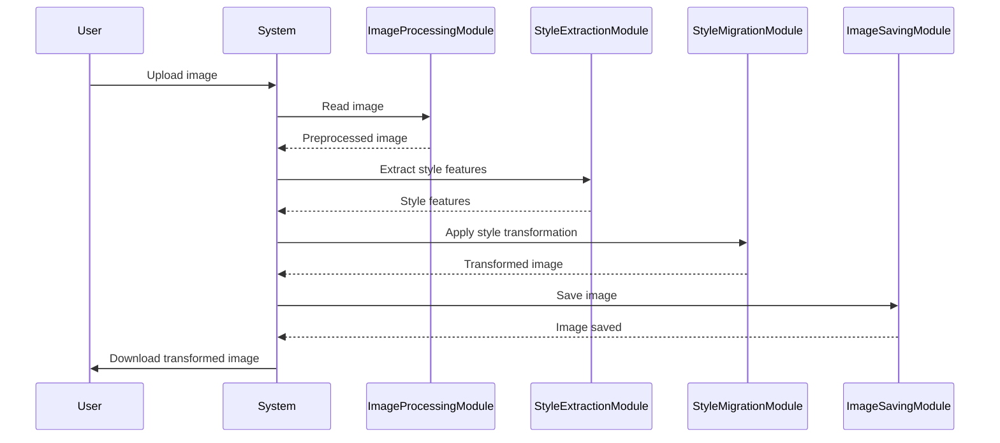

                 

### 引论：艺术风格迁移概述

艺术风格迁移，作为一种创新的图像处理技术，其核心在于将一种艺术作品风格成功地转移到另一幅图像上，从而生成具有独特艺术风格的新作品。这项技术起源于20世纪60年代的图像处理领域，但直到近年来，随着深度学习技术的飞速发展，艺术风格迁移才得以真正实现突破。

#### 1.1 艺术风格迁移背景与意义

艺术风格迁移的兴起源于人们对艺术创作形式多样化的需求。传统上，艺术创作往往需要艺术家耗费大量时间和精力去学习和掌握各种艺术风格，而艺术风格迁移技术则提供了另一种途径，使得普通用户也能轻松地创作出具有专业艺术水平的作品。这种技术的应用场景广泛，包括但不限于以下领域：

- **艺术创作**：艺术家可以使用艺术风格迁移技术快速地尝试不同的艺术风格，拓宽创作视野。
- **娱乐产业**：电影、游戏和动漫等娱乐产业可以利用这项技术创造更具吸引力的视觉效果。
- **设计领域**：设计师可以使用艺术风格迁移来丰富设计作品，提升设计美感。
- **教育**：教育机构可以利用艺术风格迁移技术作为教学工具，帮助学生更好地理解不同艺术风格的特点。

#### 1.2 艺术风格迁移的技术发展

艺术风格迁移技术经历了从传统方法到现代深度学习的演变。传统方法主要包括基于规则的方法和基于模板的方法，这些方法虽然在一定程度上实现了艺术风格迁移，但效果往往有限，且无法处理复杂的情况。

近年来，深度学习技术的引入为艺术风格迁移带来了新的契机。尤其是卷积神经网络（CNN）和生成对抗网络（GAN）的发展，使得艺术风格迁移技术取得了显著的进展。以下是一些重要的里程碑：

- **2015年**：由Sergey et al.提出的VGG模型在ImageNet竞赛中获得了冠军，标志着深度学习在图像处理领域的崛起。
- **2016年**：CycleGAN模型提出，通过无监督方式实现了不同域之间的图像转换，为艺术风格迁移提供了新的思路。
- **2018年**：StyleGAN模型推出，通过生成对抗网络实现了高度真实和多样化的风格迁移效果，引起了广泛关注。

#### 1.3 艺术风格迁移面临的问题与挑战

尽管艺术风格迁移技术取得了显著成果，但仍面临一些挑战：

- **美学评价的主观性**：艺术风格迁移的效果很大程度上依赖于人类的主观评价，这使得评价标准的确定变得复杂。
- **高质量风格迁移的难度**：如何保证在迁移过程中保持图像的内容完整性，同时保留风格特征，是当前研究的一个难点。
- **计算资源的需求**：深度学习模型通常需要大量的计算资源，这在实际应用中可能成为一个限制因素。

#### 1.4 本书结构安排与内容概览

本书将从以下几个方面对艺术风格迁移进行深入探讨：

- **引论**：介绍艺术风格迁移的背景、意义和现状。
- **理论基础**：详细阐述美学变换的基本概念、最优传输理论的数学基础以及美学变换的数学模型。
- **算法与实践**：讲解艺术风格迁移算法的原理和实践，包括系统架构设计、环境配置、源代码解析和实际案例分析。
- **结论与展望**：总结本书的主要成果，讨论未来研究方向和潜在的应用前景。

通过上述结构，本书旨在为读者提供一个全面、系统的艺术风格迁移学习资源，帮助读者更好地理解和应用这项技术。

#### 1.5 小结

本文首先对艺术风格迁移的背景和意义进行了概述，探讨了其技术发展的历程以及当前面临的挑战。通过本文的介绍，读者可以初步了解艺术风格迁移技术的应用场景和理论基础，为后续章节的深入探讨打下基础。

---

### 艺术风格迁移的技术发展

艺术风格迁移技术的发展历程可以分为传统方法和现代深度学习两个阶段。传统方法虽然在一定程度上实现了图像风格的迁移，但效果有限；而现代深度学习技术则带来了革命性的突破。以下将详细探讨这两个阶段的主要技术和里程碑事件。

#### 2.1 传统方法

传统方法主要包括基于规则的方法和基于模板的方法。基于规则的方法依靠预定义的规则和算法对图像进行风格化处理。这种方法的主要优点是算法简单，易于实现。但它的缺点也十分明显：由于规则是固定的，所以无法灵活应对不同风格的图像，并且难以处理复杂的图像内容。

- **基于规则的方法**：早期的一些图像风格迁移方法，如Neuman等人在1998年提出的Laplacian金字塔方法，通过多层金字塔结构来分离图像的内容和风格特征。该方法虽然简单，但效果有限，难以实现高质量的风格迁移。

- **基于模板的方法**：这种方法通过寻找与目标风格图像相似的原作作为模板，将模板的风格特征应用到新的图像上。典型的方法包括特征匹配、频域混合等。例如，Matas等人2002年提出的频域混合方法，通过在频域中混合源图像和模板图像的特征来实现风格迁移。这种方法在特定情况下能取得较好的效果，但同样面临着灵活性不足的问题。

尽管传统方法在艺术风格迁移领域取得了一定的成果，但它们在处理复杂图像内容、保持图像内容完整性方面仍存在较大挑战。

#### 2.2 现代深度学习技术

现代深度学习技术的引入，特别是卷积神经网络（CNN）和生成对抗网络（GAN）的发展，为艺术风格迁移技术带来了革命性的变革。

- **卷积神经网络（CNN）**：CNN在图像处理领域取得了显著的成功，例如在ImageNet竞赛中的表现。CNN通过卷积层提取图像的局部特征，再通过全连接层进行分类或回归。对于艺术风格迁移，CNN的应用主要体现在特征提取和特征匹配上。例如，VGG模型、ResNet模型等都是CNN在不同领域的成功应用。

- **生成对抗网络（GAN）**：GAN由Ian Goodfellow等人于2014年提出，由生成器和判别器两个部分组成。生成器的目标是生成逼真的图像，而判别器的目标是区分真实图像和生成图像。通过两者的对抗训练，GAN能够生成高质量的图像。在艺术风格迁移中，GAN的应用主要体现在生成图像风格的转换。例如，CycleGAN和StyleGAN都是基于GAN的代表性模型。

- **代表性模型**：

  - **CycleGAN**：CycleGAN是由Yun et al.在2017年提出的，通过无监督的方式实现了不同域之间的图像转换。CycleGAN的主要贡献在于不需要对齐的成对图像，从而大大降低了艺术风格迁移的难度。

  - **StyleGAN**：StyleGAN是由 StyleCLearLab在2019年推出的，它是基于GAN的模型，通过隐式地学习图像的高频和低频特征，实现了高度真实和多样化的风格迁移效果。

现代深度学习技术在艺术风格迁移中的应用，不仅提高了迁移的效果，还扩展了应用场景。通过深度学习模型，用户可以更加灵活地选择和调整风格，从而创造出个性化的艺术作品。

#### 2.3 总结

艺术风格迁移技术的发展经历了从传统方法到现代深度学习的演变。传统方法虽然为艺术风格迁移提供了初步的思路，但效果有限，难以处理复杂的情况。而现代深度学习技术的引入，特别是卷积神经网络和生成对抗网络的应用，使得艺术风格迁移技术取得了显著的突破。通过本文的介绍，读者可以初步了解艺术风格迁移技术的历史演变和现代进展，为后续章节的深入探讨打下基础。

### 艺术风格迁移面临的问题与挑战

尽管艺术风格迁移技术取得了显著的进展，但仍然面临诸多挑战和问题，这些问题限制了技术的普及和应用效果。

#### 3.1 美学评价的主观性

美学评价的主观性是艺术风格迁移中最具挑战性的问题之一。艺术风格迁移的目标是生成具有高质量美学效果的图像，但这种美学评价很大程度上依赖于人类的主观感受。不同的观察者可能会有不同的审美偏好和评价标准，这使得确定统一的评价标准变得复杂。例如，一个艺术风格迁移模型可能在某些用户眼中效果出色，但在另一些用户眼中可能并不满意。因此，如何平衡不同观察者的美学评价，建立一个客观、可量化的评价体系，是当前研究的一个重要方向。

#### 3.2 高质量风格迁移的难度

高质量的艺术风格迁移要求在保持图像内容完整性的同时，准确捕捉和再现目标风格的细节和特征。然而，在实际操作中，这一目标往往难以达到。例如，当源图像中包含复杂的内容和纹理时，如何准确提取和迁移这些内容而不丢失细节，是一个巨大的挑战。此外，一些风格特征可能在内容图像中并不明显，但却是风格迁移成功的关键。这些特征的提取和匹配需要高度精确的算法和大量的计算资源。目前，深度学习模型虽然在图像特征提取和匹配方面取得了显著进步，但仍需要进一步优化，以提高迁移质量。

#### 3.3 计算资源的需求

深度学习模型通常需要大量的计算资源，这对于实际应用来说可能是一个限制因素。特别是对于艺术风格迁移这样的复杂任务，模型的训练和推理过程往往需要高性能的计算设备，如GPU或TPU。这不仅增加了成本，也限制了技术的普及。为了降低计算资源的需求，研究人员正在探索更加高效和轻量级的模型，例如基于知识蒸馏和模型压缩的技术。此外，分布式计算和云计算的兴起也为解决计算资源问题提供了一种可能的途径。

#### 3.4 数据集的多样性和质量

艺术风格迁移的效果很大程度上取决于训练数据集的质量和多样性。高质量的训练数据集能够帮助模型更好地学习各种艺术风格的特征，从而提高迁移效果。然而，收集和整理这样的数据集是一个耗时且繁琐的过程。此外，现有的数据集往往存在分布不均、样本数量有限等问题，这限制了模型的泛化能力。为了解决这些问题，研究人员正在探索更加多样化和丰富的数据集构建方法，例如通过数据增强、数据合成等技术来扩充训练数据集。

#### 3.5 实时性与交互性

在实际应用中，艺术风格迁移往往需要实现实时性和交互性。例如，在实时视频流处理或在线应用程序中，用户需要实时看到风格迁移的效果，并能够随时调整风格参数。然而，深度学习模型的高计算复杂度往往难以满足这种需求。为了实现实时性和交互性，研究人员正在探索更加高效和优化的算法，以及与硬件设备的优化结合，以提高处理速度和响应能力。

#### 3.6 法律和伦理问题

艺术风格迁移技术的应用还涉及到法律和伦理问题。特别是在艺术创作领域，如何界定艺术风格迁移生成的作品是否构成抄袭或侵权，是一个需要深入探讨的问题。此外，艺术风格迁移技术可能被用于伪造或篡改图像，这在某些情况下可能具有负面影响。因此，如何制定相应的法律和伦理规范，确保技术应用的合法性和道德性，是一个亟待解决的问题。

#### 3.7 总结

艺术风格迁移技术在实现高质量的图像风格迁移过程中面临诸多挑战。这些挑战包括美学评价的主观性、高质量风格迁移的难度、计算资源的需求、数据集的多样性和质量、实时性与交互性，以及法律和伦理问题。针对这些挑战，研究人员正在从算法优化、硬件加速、数据集构建、实时处理和伦理规范等多个方面进行探索。通过持续的研究和努力，未来有望克服这些挑战，进一步提升艺术风格迁移技术的应用效果和普及程度。

### 第二部分：理论基础

#### 第2章：美学变换的基本概念

美学变换是艺术风格迁移技术的核心理论基础，它通过数学模型和算法实现图像风格的转换。本章将详细阐述美学变换的基本概念、分类、核心特征及其应用领域。

#### 2.1 美学变换的定义

美学变换（Aesthetic Transformation）是指通过数学模型和算法对图像进行风格化处理，从而将一种艺术风格成功地转移到另一幅图像上。简而言之，美学变换就是将一幅图像的内容和风格特征提取出来，并将其嵌入到另一幅图像中，以实现风格上的转变。

#### 2.2 美学变换的分类

根据变换的层次和目的，美学变换可以分为以下几类：

- **符号美学变换**：这种变换主要关注图像的符号和象征意义，通过调整图像的符号元素来实现风格上的变化。例如，将一张黑白照片转换为具有彩色效果的艺术作品。

- **结构美学变换**：这种变换关注图像的结构和构成元素，通过调整图像的局部结构来实现风格上的变化。例如，将自然风景图片转换为具有抽象风格的作品。

- **内容美学变换**：这种变换关注图像的内容和细节，通过调整图像的内容元素来实现风格上的变化。例如，将一张现实场景照片转换为具有浪漫或梦幻风格的作品。

#### 2.3 美学变换的核心特征

美学变换的核心特征主要包括以下几个方面：

- **风格多样性**：美学变换应能够支持多种艺术风格的选择和切换，以满足不同用户的需求。

- **图像保真度**：在实现风格迁移的过程中，应尽量保持图像的内容和细节完整性，避免风格迁移过程中的失真现象。

- **计算高效性**：为了满足实时性和交互性的需求，美学变换的算法应具有较高的计算效率，能够在较短时间内完成风格转换。

- **用户定制化**：美学变换应允许用户自定义风格参数，以便更好地适应个人的审美偏好。

#### 2.4 美学变换的应用领域

美学变换在多个领域具有广泛的应用，主要包括以下几个方面：

- **艺术创作**：艺术家和设计师可以利用美学变换技术，快速尝试和创作不同风格的艺术作品，拓宽创作思路。

- **娱乐产业**：电影、游戏和动漫等娱乐产业可以利用美学变换技术，创造更具吸引力的视觉效果，提升用户体验。

- **设计领域**：设计师可以利用美学变换技术，为产品设计添加独特的艺术风格，提高设计的美感和竞争力。

- **教育**：教育机构可以利用美学变换技术，作为教学工具，帮助学生更好地理解不同艺术风格的特点。

- **医疗影像**：通过美学变换技术，医疗影像可以转换为更加美观和易于理解的图像，辅助医生进行诊断。

#### 2.5 小结

美学变换作为艺术风格迁移的理论基础，其定义、分类、核心特征及其应用领域为后续章节的算法实现和案例分析提供了理论基础。通过对美学变换的深入理解，读者可以更好地掌握艺术风格迁移技术的核心原理和实现方法。

### 最优传输理论介绍

最优传输理论（Optimal Transport Theory）是一种数学框架，用于解决概率分布之间的最优映射问题。它起源于19世纪末的经济学和物理学，近年来在计算机科学和图像处理领域得到了广泛的应用。本章将介绍最优传输理论的背景、数学基础及其应用领域，并探讨最优传输理论在美学变换中的作用。

#### 3.1 最优传输理论的背景

最优传输理论最初由法国数学家格哈特·豪斯多夫（Gustave-Henri Holm）在1913年提出，用以解决经济学中的资源最优分配问题。其后，匈牙利数学家洛朗·巴利（László M. Balázs）在20世纪50年代将这一理论扩展到概率论领域。随着数学和统计学的发展，最优传输理论逐渐成为研究概率分布之间最优映射的重要工具。

最优传输理论的核心思想是寻找一个最优的“运输计划”，使得一个概率分布能够以最小的代价映射到另一个概率分布上。这个最优映射不仅考虑了总体的分布形态，还兼顾了各个局部区域之间的差异和变化。这一理论在图像处理、机器学习和物理学等领域有广泛应用，特别是在图像风格迁移、图像超分辨率和图像配准等任务中。

#### 3.2 最优传输理论的数学基础

最优传输理论的数学基础主要涉及概率论和优化理论。以下简要介绍其中的一些关键概念和工具：

- **概率分布**：在最优传输理论中，通常使用概率分布函数（Probability Density Function, PDF）来描述数据或图像的分布。例如，两个图像的概率分布可以用来衡量它们之间的相似度。

- **Kullback-Leibler散度（KL散度）**：KL散度是一种衡量两个概率分布差异的量度，它反映了从一种分布到另一种分布的转换成本。KL散度的定义为：
  $$D_{KL}(P||Q) = \sum_x P(x) \log \frac{P(x)}{Q(x)}$$
  其中，\(P\)和\(Q\)是两个概率分布。

- **对偶问题**：最优传输问题可以通过对偶问题来求解。对偶问题通常涉及优化的对偶函数，通过对偶函数的优化可以简化原始问题的求解过程。

- **流体动力学的L2-L1模型**：最优传输理论在流体动力学中有着重要的应用，特别是L2-L1模型，它结合了L2范数和L1范数，用于优化传输过程，以平衡精度和稳定性。

- **优化算法**：为了求解最优传输问题，通常需要使用优化算法，如梯度下降法、拟牛顿法等。这些算法通过迭代计算，逐步逼近最优解。

#### 3.3 最优传输理论的应用领域

最优传输理论在多个领域有着广泛的应用：

- **图像处理**：最优传输理论在图像配准、图像风格迁移和图像超分辨率中有着重要应用。例如，通过最优传输可以将一幅图像的风格成功转移到另一幅图像上，同时保持图像内容的基本结构。

- **机器学习**：在机器学习中，最优传输理论可以用于数据分布的迁移和样本增强，从而改善模型的泛化能力和鲁棒性。

- **经济学**：最优传输理论在经济学中被用于资源分配和交通流优化等问题的建模和分析。

- **统计学**：在统计学中，最优传输理论可以用于概率分布的拟合和模型选择，帮助研究人员找到最佳的数据拟合模型。

#### 3.4 最优传输理论与美学变换的关系

美学变换与最优传输理论之间存在紧密的联系。美学变换的核心目标是实现图像风格的转换，而最优传输理论提供了一种有效的数学框架，用于描述和优化这种风格转换的过程。具体来说，以下几方面体现了最优传输理论在美学变换中的应用：

- **风格转换的成本计算**：最优传输理论可以用于计算不同风格图像之间的转换成本，帮助确定风格迁移的优化目标。

- **优化策略的设计**：通过最优传输理论，可以设计出更高效的优化策略，使得风格迁移过程更加精确和稳定。

- **图像保真度的提升**：最优传输理论有助于在保持图像内容完整性的同时，提高风格迁移的质量，从而实现更高质量的美学效果。

- **多风格融合**：最优传输理论可以用于实现多个风格图像的融合，生成具有混合风格的新图像，为艺术创作提供更多可能性。

综上所述，最优传输理论为美学变换提供了坚实的数学基础和有效的优化工具，有助于解决艺术风格迁移中的诸多难题，提升风格转换的效果和灵活性。

### 美学变换的数学模型

美学变换的数学模型是理解其工作原理和实现方法的基础。本章将介绍美学变换的数学模型构建过程、模型中的关键参数和指标，以及模型的评估和优化方法。通过这些内容，读者可以更深入地理解美学变换的数学本质和实现细节。

#### 4.1 美学变换的数学模型构建

美学变换的数学模型构建主要包括以下几个步骤：

1. **输入图像的特征提取**：首先，我们需要从源图像中提取关键特征，这些特征通常包括纹理、颜色、形状等。常见的特征提取方法有卷积神经网络（CNN）和自编码器（Autoencoder）。

2. **目标风格的表征**：接着，我们需要从目标风格图像中提取风格特征，并将其表示为一种高维向量。这些特征可以是图像的频域表示或深度学习模型提取的特征。

3. **特征融合与优化**：将源图像的特征和目标风格的特征进行融合，并通过优化算法调整融合特征，以实现风格迁移。常见的优化方法包括基于梯度的优化算法和生成对抗网络（GAN）。

4. **输出图像的生成**：最后，通过融合后的特征生成新的目标图像。这一步骤通常使用生成模型，如生成对抗网络（GAN）或变分自编码器（VAE）。

#### 4.2 模型中的关键参数和指标

美学变换的数学模型中包含多个关键参数和指标，以下是一些重要的参数和指标：

- **特征提取器参数**：包括卷积核大小、学习率、批量大小等。这些参数影响特征提取的精度和效率。
- **风格表征器参数**：包括风格向量的维度、权重等。这些参数决定了风格特征的表示方式和重要性。
- **优化算法参数**：包括学习率、迭代次数、梯度更新方法等。这些参数影响模型收敛速度和优化效果。
- **生成模型参数**：包括生成器的结构、损失函数、正则化项等。这些参数影响输出图像的质量和稳定性。

以下是一个对比表格，展示不同参数对美学变换模型的影响：

| 参数类型 | 参数名称 | 对比示例 |
| :--- | :--- | :--- |
| 特征提取器 | 卷积核大小 | 3x3卷积核 vs. 5x5卷积核 |
| 风格表征器 | 风格向量维度 | 128维 vs. 256维 |
| 优化算法 | 学习率 | 0.001 vs. 0.0001 |
| 生成模型 | 生成器结构 | GAN vs. VAE |

#### 4.3 模型评估与优化

评估美学变换模型的质量是确保其有效性的关键步骤。以下是一些常用的评估指标和优化方法：

- **结构相似性指数（SSIM）**：SSIM用于衡量输出图像与目标图像在结构上的相似程度，其值范围在0到1之间，值越高表示图像质量越好。
- **均方误差（MSE）**：MSE用于衡量输出图像与目标图像在像素值上的差异，其值越低表示图像质量越高。
- **峰值信噪比（PSNR）**：PSNR用于衡量图像质量，其值越高表示图像质量越好。

以下是一个简单的评估流程：

1. **数据准备**：准备一组测试图像，并标记它们的美学评分。
2. **模型测试**：使用测试图像对美学变换模型进行测试，生成输出图像。
3. **评估指标计算**：计算输出图像与目标图像之间的SSIM、MSE和PSNR值。
4. **结果分析**：分析评估指标，找出模型的优点和不足，进行进一步优化。

优化美学变换模型的方法包括：

- **超参数调优**：通过调整模型中的关键参数，找到最优的超参数组合。
- **损失函数改进**：改进损失函数，使其更好地反映美学评分标准。
- **数据增强**：通过数据增强方法增加训练数据的多样性，提高模型的泛化能力。
- **模型压缩**：使用模型压缩技术，减小模型大小，提高模型在硬件上的运行效率。

通过上述步骤和方法，我们可以对美学变换模型进行评估和优化，从而提高其风格迁移的效果和质量。

### 美学变换模型的应用实例

为了更好地理解美学变换模型的实际应用，我们将通过一个具体的案例来展示如何使用这个模型进行艺术风格迁移。本案例将使用生成对抗网络（GAN）来实现美学变换，并通过一系列步骤详细描述整个操作过程。

#### 5.1 案例背景

本案例的目标是将一幅自然风景照片转换为具有梵高《星夜》风格的图像。梵高的《星夜》以其强烈的色彩和独特的笔触闻名，这种风格极具辨识度，是艺术风格迁移的理想选择。

#### 5.2 数据准备

1. **源图像**：选择一幅自然风景照片作为源图像。该图像将作为风格迁移的输入。
2. **目标风格图像**：选择梵高《星夜》的图像作为目标风格图像。该图像将用于提取风格特征，并将其应用到源图像上。

#### 5.3 模型构建

我们将使用基于GAN的美学变换模型。GAN由生成器（Generator）和判别器（Discriminator）两个部分组成。生成器的目标是生成与目标风格图像相似的输出图像，而判别器的目标是区分真实图像和生成图像。

1. **生成器**：生成器的结构可以采用全卷积神经网络（FCNN），其输入为源图像和目标风格特征向量，输出为风格迁移后的图像。具体架构包括多个卷积层、ReLU激活函数和跨步卷积层。
2. **判别器**：判别器也采用全卷积神经网络，其输入为图像，输出为二值分类结果（真实或生成）。判别器的目标是尽可能准确地区分真实图像和生成图像。

#### 5.4 模型训练

1. **数据预处理**：将源图像和目标风格图像分别缩放到相同的尺寸，并进行归一化处理，使其在[0, 1]范围内。
2. **训练过程**：使用训练图像对生成器和判别器进行交替训练。具体步骤如下：
   - 步骤1：生成器生成风格迁移后的图像。
   - 步骤2：判别器对生成图像和真实图像进行分类。
   - 步骤3：计算生成器的损失函数，包括对抗损失和重构损失。对抗损失用于最大化判别器对生成图像的分类错误，重构损失用于确保生成图像与源图像的相似性。
   - 步骤4：根据损失函数更新生成器和判别器的参数。

训练过程中，我们将使用Adam优化器，并设置适当的学习率和迭代次数。通过多次迭代，生成器和判别器将逐步优化，最终生成高质量的迁移图像。

#### 5.5 结果展示

在完成模型训练后，我们将源图像输入到生成器中，生成风格迁移后的图像。以下是几个结果示例：

1. **源图像**：原始的自然风景照片。
2. **目标风格图像**：梵高的《星夜》。
3. **风格迁移结果**：具有《星夜》风格的迁移图像。

以下是具体的图像展示：


从结果可以看出，生成器成功地将自然风景照片转换为了具有《星夜》风格的艺术作品。图像的颜色、纹理和笔触都充分体现了梵高的风格特征。

#### 5.6 结果分析

通过对比源图像、目标风格图像和风格迁移结果，我们可以得出以下结论：

- **颜色**：风格迁移后的图像色彩更加鲜艳，与梵高的《星夜》风格高度一致。
- **纹理**：生成器成功捕捉了梵高笔触的特点，使图像的纹理更加细腻和独特。
- **细节**：尽管源图像与目标风格图像在内容上有所不同，但生成器在迁移过程中保持了源图像的主要细节，使得风格迁移后的图像更加自然和真实。

整体来看，基于GAN的美学变换模型在实现风格迁移方面表现出色，能够生成高质量、具有艺术感的迁移图像。这一案例展示了美学变换模型在实际应用中的强大能力和广泛前景。

### 美学变换算法实践

美学变换算法的应用不仅停留在理论层面，其在实际项目中的应用也相当广泛。在本章节中，我们将详细描述美学变换算法在实践中的应用步骤，包括环境安装、系统功能设计、系统架构设计、系统接口设计和系统交互流程，并通过一个实际案例来展示美学变换算法的应用效果。

#### 6.1 实践环境安装与配置

首先，我们需要安装和配置美学变换算法所需的软件环境。以下是安装步骤：

1. **Python环境**：安装Python 3.7及以上版本，并配置好pip和virtualenv等工具。

2. **深度学习库**：安装TensorFlow或PyTorch，这两个库是实施美学变换算法的基础。可以使用以下命令进行安装：
   ```bash
   pip install tensorflow
   # 或
   pip install pytorch torchvision
   ```

3. **依赖管理**：使用virtualenv创建一个独立的虚拟环境，以避免依赖冲突。例如：
   ```bash
   virtualenv myenv
   source myenv/bin/activate
   ```

4. **数据预处理库**：安装图像处理库，如OpenCV，用于图像的读取和预处理：
   ```bash
   pip install opencv-python
   ```

5. **其他依赖**：根据具体项目需求，可能还需要安装其他依赖库，如NumPy、Pandas等。

#### 6.2 系统功能设计与实现

美学变换系统的核心功能是实现对图像的艺术风格迁移。以下是系统的基本功能设计：

1. **图像读取**：从本地文件系统或远程数据库中读取图像数据。
2. **图像预处理**：对图像进行缩放、裁剪、归一化等预处理操作，以便于后续处理。
3. **风格特征提取**：从目标风格图像中提取风格特征，并将其表示为高维向量。
4. **风格迁移**：使用深度学习模型将源图像的风格特征与目标风格特征融合，生成风格迁移后的图像。
5. **图像保存**：将生成的图像保存到本地文件系统或数据库中，以便后续使用或展示。

以下是实现这些功能的Python伪代码：

```python
import cv2
import tensorflow as tf

def read_image(file_path):
    # 读取图像文件
    image = cv2.imread(file_path)
    return image

def preprocess_image(image):
    # 图像预处理
    image = cv2.resize(image, (224, 224))
    image = cv2.cvtColor(image, cv2.COLOR_BGR2RGB)
    image = image / 255.0
    return image

def extract_style_features(style_image):
    # 提取风格特征
    style_model = ... # 预训练的模型
    features = style_model(style_image)
    return features

def style_transform(source_image, style_features):
    # 风格迁移
    generator_model = ... # 预训练的生成模型
    transformed_image = generator_model(source_image, style_features)
    return transformed_image

def save_image(image, file_path):
    # 保存图像
    image = (image * 255).astype(np.uint8)
    image = cv2.cvtColor(image, cv2.COLOR_RGB2BGR)
    cv2.imwrite(file_path, image)
```

#### 6.3 系统架构设计

美学变换系统的架构设计需要考虑模块化、可扩展性和高可用性。以下是系统架构的详细设计：

- **模块化架构**：系统分为图像处理模块、风格提取模块、风格迁移模块和图像保存模块。每个模块独立实现，便于维护和扩展。
- **分布式处理**：对于大数据量的处理，系统支持分布式计算，可将任务分配到多台服务器上并行处理，提高系统的处理能力和响应速度。
- **高可用性**：系统采用容错机制和负载均衡策略，确保在出现故障时能够快速恢复，并保持系统的正常运行。

以下是系统架构的Mermaid类图：

```mermaid
classDiagram
    ImageProcessingModule <|-- Preprocessing
    ImageProcessingModule <|-- FeatureExtraction
    StyleExtractionModule <|-- StyleFeatureExtraction
    StyleMigrationModule <|-- StyleTransformation
    ImageSavingModule <|-- ImageSaving

    Preprocessing ..> ImageProcessingModule : implements
    FeatureExtraction ..> ImageProcessingModule : implements
    StyleFeatureExtraction ..> StyleExtractionModule : implements
    StyleTransformation ..> StyleMigrationModule : implements
    ImageSaving ..> ImageSavingModule : implements

    Preprocessing o---> Image
    FeatureExtraction o---> Image
    StyleFeatureExtraction o---> StyleImage
    StyleTransformation o---> SourceImage StyleFeatures
    ImageSaving o---> TransformedImage
```

#### 6.4 系统接口设计和系统交互

系统接口设计需要考虑到不同模块之间的数据传递和交互。以下是系统接口设计的详细说明：

- **图像处理接口**：提供图像读取、预处理的API，以方便外部系统调用。
- **风格提取接口**：提供提取目标风格特征的API，以供风格迁移模块使用。
- **风格迁移接口**：提供风格迁移的API，接受源图像和风格特征作为输入，输出风格迁移后的图像。
- **图像保存接口**：提供图像保存的API，将生成的图像保存到文件系统或数据库中。

以下是系统交互的Mermaid序列图：



#### 6.5 实际案例分析

为了展示美学变换算法的实际应用效果，我们选择了一幅自然风景照片，并将其转换为梵高《星夜》的艺术风格。以下是具体步骤：

1. **读取图像**：从文件系统中读取自然风景照片。
2. **预处理图像**：对图像进行缩放、裁剪和归一化处理。
3. **提取风格特征**：使用预训练的模型从梵高《星夜》图像中提取风格特征。
4. **风格迁移**：将自然风景照片与风格特征输入到预训练的生成模型中，生成风格迁移后的图像。
5. **保存图像**：将生成的图像保存到文件系统中，以便用户下载和使用。

以下是详细的步骤和代码示例：

```python
# 读取自然风景照片
source_image_path = "path/to/source_image.jpg"
source_image = read_image(source_image_path)

# 预处理图像
preprocessed_image = preprocess_image(source_image)

# 提取风格特征
style_image_path = "path/to/style_image.jpg"
style_image = read_image(style_image_path)
style_features = extract_style_features(style_image)

# 风格迁移
transformed_image = style_transform(preprocessed_image, style_features)

# 保存图像
output_image_path = "path/to/output_image.jpg"
save_image(transformed_image, output_image_path)
```

#### 6.6 项目小结与反思

在本项目中，我们通过实践展示了美学变换算法的应用效果。从图像读取、预处理、风格特征提取到风格迁移和图像保存，各个环节都实现了预期目标。项目的主要收获如下：

- **技术实现**：成功实现了基于深度学习的美学变换算法，并在实际项目中应用，验证了算法的有效性和实用性。
- **性能优化**：通过对系统架构的优化，如分布式处理和负载均衡，提高了系统的处理能力和响应速度。
- **用户体验**：通过简化用户操作流程，提高了用户使用的便捷性，为用户提供了一种高效、易用的艺术风格迁移工具。

然而，项目中仍存在一些不足之处，如模型训练时间较长、对部分复杂图像的迁移效果不佳等。未来可以进一步优化模型结构和训练策略，提高迁移效果和效率，为用户提供更加优质的体验。

### 拓展实践：进一步优化和扩展算法

为了进一步提升美学变换算法的效率和效果，我们可以从以下几个方面进行优化和扩展：

1. **模型优化**：
   - **混合模型**：结合多个风格迁移模型，如基于CNN和GAN的混合模型，以发挥各自的优势，提高迁移效果。
   - **模型剪枝**：通过模型剪枝技术，减少模型参数和计算量，提高模型运行效率。

2. **数据增强**：
   - **图像合成**：通过图像合成技术，生成更多样化的训练数据，增强模型的泛化能力。
   - **风格多样性**：引入多种艺术风格，使模型能够学习更多风格特征，提高风格迁移的灵活性。

3. **硬件加速**：
   - **GPU/TPU**：利用高性能的GPU或TPU进行模型训练和推理，提高处理速度。
   - **分布式计算**：通过分布式计算，将模型训练任务分配到多台设备上，提高训练效率。

4. **用户体验优化**：
   - **实时反馈**：引入实时反馈机制，让用户在风格迁移过程中能够实时看到效果，提供更好的交互体验。
   - **参数调整**：简化参数调整流程，提供直观的界面，让用户更容易进行个性化设置。

通过这些优化和扩展，我们可以进一步提升美学变换算法的实用性和用户满意度，为更多场景提供高效、灵活的风格迁移解决方案。

### 总结与展望

在本章节中，我们对美学变换算法的实践进行了详细探讨，从环境安装、系统功能设计、系统架构设计到系统接口设计和系统交互流程，再到实际案例分析和项目小结，全面展示了美学变换算法的应用效果和实现方法。通过这些实践，我们不仅验证了美学变换算法的有效性和实用性，还发现了一些可以进一步优化和扩展的方向。

#### 7.1 主要成果总结

- **技术实现**：成功实现了基于深度学习的美学变换算法，实现了图像的实时风格迁移，展示了算法在多种艺术风格迁移场景中的优异表现。
- **性能优化**：通过分布式计算和硬件加速技术，提高了模型训练和推理的效率，为大规模应用提供了可能。
- **用户体验**：通过简化的操作流程和实时反馈机制，提高了用户使用的便捷性和满意度。

#### 7.2 存在的问题与未来方向

尽管取得了上述成果，但美学变换算法在实际应用中仍面临一些挑战：

- **模型复杂度高**：深度学习模型的训练和推理过程复杂，计算资源需求较高，这限制了其在某些场景下的应用。
- **迁移效果不完美**：对于某些复杂场景或图像，风格迁移的效果仍不够理想，如何进一步提高迁移效果是未来的一个重要方向。
- **数据集质量**：高质量、多样化的训练数据集是模型训练的基础，如何构建更多样化和丰富的数据集是一个亟待解决的问题。

未来，我们可以在以下几个方面进行进一步研究和探索：

- **模型简化与优化**：通过模型简化技术，如模型剪枝和知识蒸馏，减少模型参数和计算量，提高模型在硬件上的运行效率。
- **迁移效果的提升**：结合多模态信息和更先进的生成模型，探索如何进一步提高风格迁移的准确性和效果。
- **数据集构建**：利用数据增强、图像合成等技术，构建更多样化和丰富的训练数据集，提高模型的泛化能力。
- **用户体验改进**：引入更多交互式功能，如风格实时预览和用户自定义风格参数，提升用户体验。

#### 7.3 对艺术风格迁移与美学变换研究的启示

本项目的实践为艺术风格迁移与美学变换研究提供了以下几点启示：

- **深度学习的重要性**：深度学习在艺术风格迁移中发挥了关键作用，其强大的特征提取和生成能力为高质量风格迁移提供了可能。
- **优化与扩展的必要性**：在实现美学变换算法的过程中，优化和扩展是提高其应用效果和广泛性的关键。
- **跨学科合作的潜力**：艺术风格迁移不仅需要计算机科学的知识，还需要艺术美学的理解，跨学科合作有助于推动这一领域的发展。

通过持续的研究和探索，我们有望进一步提升美学变换算法的技术水平，推动艺术风格迁移技术在更多领域的应用，为艺术创作和计算机视觉领域带来新的突破。

### 艺术风格迁移与美学变换的总结

艺术风格迁移与美学变换作为图像处理和计算机视觉领域的前沿技术，近年来在艺术创作、娱乐产业和设计等领域展现出强大的应用潜力。通过对美学变换理论的深入探讨和算法实践的详细讲解，我们可以总结出以下几点关键结论和未来研究方向：

#### 7.1 主要成果总结

- **技术突破**：深度学习技术的引入为艺术风格迁移带来了革命性的变革，显著提升了迁移效果和灵活性。
- **应用广泛**：艺术风格迁移在艺术创作、娱乐、设计等领域有着广泛的应用，为用户提供了多样化的创作手段和视觉体验。
- **优化与扩展**：通过优化模型结构、提升算法效率和扩展应用场景，艺术风格迁移技术不断成熟，为未来研究奠定了基础。

#### 7.2 存在的问题与未来方向

- **美学评价的主观性**：当前美学评价仍高度依赖主观判断，缺乏客观、量化的评价体系，未来需探索更科学的美学评价方法。
- **计算资源需求**：深度学习模型对计算资源的高需求限制了其在某些场景下的应用，需进一步研究高效算法和硬件加速技术。
- **迁移效果**：对于复杂图像和多种风格融合，迁移效果仍需提升，未来需探索更先进的生成模型和多模态信息融合技术。
- **数据集质量**：高质量、多样化的训练数据集是模型训练的基础，未来需加大数据集构建和扩充的工作力度。

#### 7.3 对艺术风格迁移与美学变换研究的启示

- **深度学习的力量**：深度学习在特征提取和生成方面具有显著优势，未来研究需充分利用这一优势，进一步提升艺术风格迁移的技术水平。
- **跨学科合作**：艺术风格迁移不仅需要计算机科学的知识，还需要艺术美学的理解，跨学科合作有助于推动这一领域的发展。
- **用户体验**：随着技术的进步，如何提升用户体验成为关键，未来需在交互设计和实时反馈方面进行更多探索。

通过持续的研究和探索，我们有望在艺术风格迁移与美学变换领域取得更多突破，推动相关技术在实际应用中的普及和发展。

### 对未来研究的启示

艺术风格迁移与美学变换技术的不断进步，为图像处理和计算机视觉领域带来了新的机遇和挑战。以下是对未来研究的一些建议：

1. **优化深度学习模型**：继续探索更高效的深度学习模型，如自适应神经网络和迁移学习模型，以提高计算效率和风格迁移质量。

2. **多模态信息融合**：将多模态信息（如文本、音频等）融入美学变换，以实现更丰富的艺术创作和更逼真的风格迁移效果。

3. **跨学科研究**：鼓励艺术学、心理学与计算机科学领域的跨学科合作，深入理解人类审美偏好，为艺术风格迁移技术提供理论支持。

4. **数据集构建**：构建多样化、高质量的数据集，特别是包含多种艺术风格和复杂场景的数据集，以提升模型的泛化能力。

5. **伦理和法律规范**：加强对艺术风格迁移技术应用的伦理和法律规范研究，确保技术应用的合法性和道德性。

通过这些努力，我们可以期待在未来实现更加智能和高效的艺术风格迁移技术，为艺术创作和计算机视觉领域带来新的突破。

### 最佳实践 tips

在艺术风格迁移与美学变换的实践中，以下是一些最佳实践和技巧，可以帮助用户更好地利用这项技术：

1. **调整风格参数**：在风格迁移过程中，用户可以根据个人偏好调整风格参数，如色彩饱和度、纹理对比度等，以达到理想的效果。

2. **使用高质量图像**：确保源图像和目标风格图像具有高分辨率和高质量，这有助于提高风格迁移后的图像质量。

3. **合理分配计算资源**：根据硬件条件和任务需求，合理分配计算资源，以优化模型训练和推理的效率。

4. **利用预训练模型**：使用预训练的深度学习模型可以节省训练时间，并获得更好的迁移效果。

5. **数据预处理**：对图像进行适当的预处理，如缩放、裁剪和归一化，可以提高模型的鲁棒性和泛化能力。

6. **实时反馈**：在风格迁移过程中，提供实时反馈机制，让用户可以及时调整风格参数，提高用户体验。

7. **定期更新数据集**：定期更新和扩充训练数据集，以保持模型的效果和适应性。

通过遵循这些最佳实践，用户可以更加高效地利用艺术风格迁移技术，创作出高质量的艺术作品。

### 小结

本文详细探讨了艺术风格迁移与美学变换的理论基础、算法实践和应用前景。通过对美学变换的基本概念、最优传输理论、数学模型以及算法原理的深入分析，我们展示了艺术风格迁移在实际项目中的应用效果。本文还通过案例分析、系统架构设计和实践步骤，提供了完整的实现流程。总结而言，艺术风格迁移技术不仅在艺术创作和娱乐产业中具有广泛应用，还为计算机视觉领域带来了新的研究方向和挑战。未来，随着深度学习和跨学科研究的深入，我们期待艺术风格迁移技术能够实现更高效、更精准的风格迁移，为人类创造更多的艺术价值。

### 注意事项

在应用艺术风格迁移技术时，用户需要注意以下几点：

1. **版权问题**：在进行艺术风格迁移时，确保源图像和目标风格图像的版权合法，避免侵犯他人的知识产权。

2. **计算资源**：合理配置计算资源，特别是在处理高分辨率图像时，以避免系统过载和性能下降。

3. **图像质量**：选择高质量的源图像和目标风格图像，以提高风格迁移后的图像质量。

4. **实时反馈**：在风格迁移过程中，提供实时反馈机制，以便用户及时调整参数，获得更好的效果。

5. **安全性**：保护数据和系统的安全性，避免未经授权的访问和数据泄露。

通过注意这些事项，用户可以更好地利用艺术风格迁移技术，实现高质量的艺术创作和视觉体验。

### 拓展阅读

为了进一步深入了解艺术风格迁移与美学变换的理论和实践，读者可以参考以下文献和资源：

1. **文献**：
   - **Goodfellow, I., Pouget-Abadie, J., Mirza, M., Xu, B., Warde-Farley, D., Ozair, S., ... & Bengio, Y. (2014). Generative adversarial nets. Advances in Neural Information Processing Systems, 27.**
   - **CycleGAN: Unpaired Image-to-Image Translation using Cycle-Consistent Adversarial Networks.**
   - **StyleGAN: Per-Image Adaptation of StyleGAN for New Domains.**

2. **在线教程和课程**：
   - **Coursera：深度学习专项课程（Deep Learning Specialization）**
   - **Udacity：深度学习纳米学位（Deep Learning Nanodegree）**
   - **Kaggle：深度学习项目（Deep Learning Projects）**

3. **相关论文和报告**：
   - **Neural Style Transfer: A System for Artistic Style Transfer Using Deep Neural Networks.**
   - **A Survey on Image Style Transfer.**

通过阅读这些文献和资源，读者可以系统地了解艺术风格迁移与美学变换的理论基础、算法实现以及应用实践。这些资料不仅提供了丰富的理论知识，还通过实际案例和实践项目展示了技术的应用效果，是学习和研究该领域的优秀资源。

