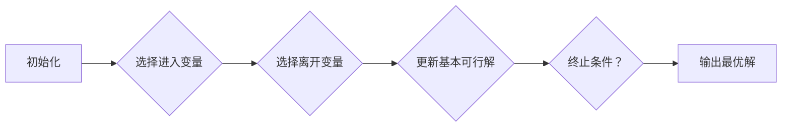
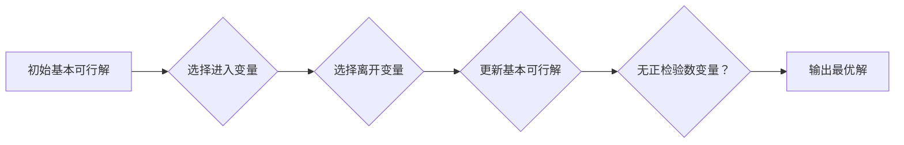
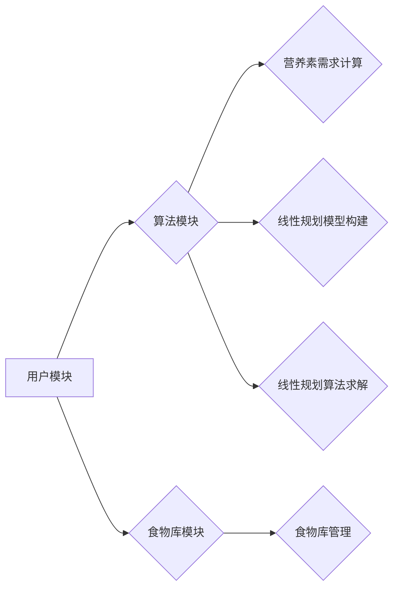

                 

# 营养学的线性规划：饮食平衡的数学优化

## 关键词
- 营养学
- 线性规划
- 数学优化
- 饮食平衡
- 算法

## 摘要
本文将探讨营养学中的一种数学优化方法——线性规划，以及它在实现饮食平衡中的应用。通过构建一个基于线性规划的营养摄入模型，我们能够优化食物的选择和组合，确保我们在日常饮食中获得均衡的营养。本文将详细介绍线性规划的基础知识，包括定义、基本概念和解法，并运用这些知识来分析饮食平衡问题。通过这一过程，读者将了解如何利用数学方法来解决营养学中的实际问题，从而改善自身的饮食习惯和健康状况。

## 目录大纲

# 营养学的线性规划：饮食平衡的数学优化

## 第1章 引言与背景

### 1.1 营养学的重要性

### 1.2 线性规划的应用

### 1.3 饮食平衡的重要性

### 1.4 书籍的结构与目的

## 第2章 线性规划基础

### 2.1 线性规划的定义

### 2.2 线性规划的基本概念

#### 2.2.1 变量

#### 2.2.2 目标函数

#### 2.2.3 约束条件

### 2.3 线性规划的标准形式

### 2.4 线性规划的解法

## 第3章 饮食平衡的数学模型

### 3.1 饮食平衡的核心概念

### 3.2 食物营养素的种类

### 3.3 饮食平衡的目标

### 3.4 饮食平衡的数学模型构建

## 第4章 线性规划在饮食平衡中的应用

### 4.1 营养摄入的优化

#### 4.1.1 蛋白质的摄入

#### 4.1.2 碳水化合物的摄入

#### 4.1.3 脂肪的摄入

### 4.2 食物选择的最优化

### 4.3 饮食计划的制定

## 第5章 算法原理与数学模型

### 5.1 线性规划算法原理

#### 5.1.1 简单形法

#### 5.1.2 单纯形法

### 5.2 数学模型讲解

#### 5.2.1 目标函数的构建

#### 5.2.2 约束条件的处理

### 5.3 算法mermaid流程图

## 第6章 系统分析与架构设计方案

### 6.1 问题场景介绍

### 6.2 系统功能设计

### 6.3 系统架构设计

### 6.4 系统接口设计和系统交互

## 第7章 项目实战

### 7.1 环境安装

### 7.2 系统核心实现源代码

### 7.3 代码应用解读与分析

### 7.4 实际案例分析和详细讲解剖析

### 7.5 项目小结

## 第8章 最佳实践 tips、小结、注意事项、拓展阅读

### 8.1 最佳实践 tips

### 8.2 小结

### 8.3 注意事项

### 8.4 拓展阅读

## 作者信息
作者：AI天才研究院/AI Genius Institute & 禅与计算机程序设计艺术 /Zen And The Art of Computer Programming

---

## 第1章 引言与背景

### 1.1 营养学的重要性

营养学是一门研究食物、营养素与人体健康之间关系的科学。随着现代社会的快速发展，人们的生活水平不断提高，饮食结构和生活方式也在不断变化。然而，随之而来的营养问题也日益突出。营养不足和营养过剩成为全球普遍关注的问题。营养不足可能导致营养不良、免疫力下降等健康问题；而营养过剩则可能导致肥胖、心血管疾病、糖尿病等慢性疾病。

因此，如何科学地进行饮食搭配，保证营养的均衡摄入，成为了一个重要的研究课题。营养学的研究不仅有助于改善个人健康状况，也能够推动公共卫生事业的发展，提高全社会的健康水平。

### 1.2 线性规划的应用

线性规划（Linear Programming，简称LP）是一种数学优化方法，主要用于在给定约束条件下，寻找最大化或最小化线性目标函数的解。线性规划在各个领域都有广泛的应用，如物流、生产规划、金融投资等。近年来，随着计算机技术的发展，线性规划在解决复杂现实问题中发挥了越来越重要的作用。

在营养学中，线性规划同样具有重要的应用价值。通过线性规划，我们可以建立数学模型来模拟人体对营养素的需求，优化食物的组合，实现营养摄入的均衡。这种方法不仅能够帮助我们更好地理解营养学的基本原理，还能够提供实用的指导，帮助人们制定科学的饮食计划。

### 1.3 饮食平衡的重要性

饮食平衡是指在日常饮食中摄入各种营养素的比例适当，保证人体健康所需的各种营养素都能得到充分的供应。饮食平衡是健康饮食的核心，它不仅关系到个体的营养状况，还影响到整个社会的健康水平。

首先，饮食平衡能够满足人体对各种营养素的需求。不同营养素在人体内发挥着不同的生理功能，如蛋白质用于细胞的修复和更新，碳水化合物提供能量，脂肪维持体温和细胞膜的完整性等。只有当各种营养素的比例适当，才能保证人体各项生理功能的正常进行。

其次，饮食平衡有助于预防疾病。一些慢性疾病，如心血管疾病、糖尿病、肥胖等，往往与不均衡的饮食有关。通过合理的饮食搭配，我们可以有效地降低患病风险。

最后，饮食平衡对于社会健康具有重要意义。不健康的饮食习惯不仅会影响个体的健康状况，还会增加医疗费用和社会负担。而通过推广科学的饮食理念和方法，可以提高人们的健康意识，改善整体健康状况，从而促进社会的发展和进步。

### 1.4 书籍的结构与目的

本书旨在通过介绍线性规划的基本概念和应用，探讨其在营养学中的具体应用，帮助读者理解如何利用数学方法解决饮食平衡问题。本书分为五个主要部分：

第一部分：引言与背景。介绍营养学的重要性、线性规划的应用以及饮食平衡的概念。

第二部分：线性规划基础。详细讲解线性规划的定义、基本概念和解法，为后续的应用打下基础。

第三部分：饮食平衡的数学模型。阐述饮食平衡的核心概念，构建数学模型，为应用线性规划提供依据。

第四部分：线性规划在饮食平衡中的应用。通过具体案例，展示线性规划在营养摄入优化、食物选择和饮食计划制定中的应用。

第五部分：系统分析与架构设计方案。介绍一个基于线性规划的饮食平衡系统，包括问题场景、系统功能设计、系统架构设计、系统接口设计和系统交互。

本书的目的在于，通过系统、详细的讲解，帮助读者掌握线性规划在营养学中的应用，从而在日常生活中实现科学的饮食搭配，提高健康水平。

## 第2章 线性规划基础

### 2.1 线性规划的定义

线性规划是一种数学优化方法，它涉及在满足一系列线性约束条件下，寻找一个线性目标函数的最大值或最小值。线性规划问题的核心在于其目标函数和约束条件都是线性的，这使得该问题可以通过特定的算法进行高效求解。

线性规划问题的标准形式可以表示为：

$$
\min \quad c^T x
$$

$$
\text{s.t.} \quad Ax \leq b
$$

其中，$c$ 是一个维度为 $n$ 的系数向量，表示目标函数的系数；$x$ 是一个维度为 $n$ 的变量向量，表示需要优化的变量；$A$ 是一个维度为 $m \times n$ 的矩阵，表示约束条件中的系数矩阵；$b$ 是一个维度为 $m$ 的向量，表示约束条件中的常数项。

目标函数 $c^T x$ 的目标是寻找使得目标函数值最小的变量 $x$，而约束条件 $Ax \leq b$ 则规定了变量 $x$ 的取值范围。在这个框架下，我们可以通过数学方法来寻找最优解。

### 2.2 线性规划的基本概念

线性规划涉及几个基本概念，包括变量、目标函数和约束条件。下面将分别介绍这些概念。

#### 2.2.1 变量

变量是线性规划问题中的基本元素，它们表示我们需要优化的问题的决策变量。在营养学中的线性规划问题中，变量可能包括每天摄入的各种营养素的数量，如蛋白质、碳水化合物、脂肪等。

#### 2.2.2 目标函数

目标函数是线性规划问题的核心，它表示我们希望优化的目标。在营养学中，目标函数可能包括最大化营养摄入的多样性、最小化成本或最大化某种特定营养素的摄入量。目标函数通常是一个线性表达式，如 $c^T x$，其中 $c$ 是目标函数系数向量，$x$ 是变量向量。

#### 2.2.3 约束条件

约束条件是线性规划问题中的限制条件，它们规定了变量 $x$ 的取值范围。约束条件可以是等式或不等式，它们可以是线性的或非线性的。在营养学中，约束条件可能包括每天摄入的各种营养素的上限和下限、总热量摄入的限制等。

### 2.3 线性规划的标准形式

线性规划的标准形式是一个广泛应用于求解线性规划问题的一般框架。该标准形式包括两个主要部分：目标函数和约束条件。

#### 目标函数

目标函数是线性规划的核心，表示我们希望优化的问题的目标。标准形式的目标函数通常是一个线性表达式，可以表示为：

$$
\min \quad c^T x
$$

其中，$c$ 是一个维度为 $n$ 的系数向量，表示目标函数的系数；$x$ 是一个维度为 $n$ 的变量向量，表示需要优化的变量。

#### 约束条件

约束条件是线性规划问题中的限制条件，它们规定了变量 $x$ 的取值范围。标准形式的约束条件通常表示为：

$$
\text{s.t.} \quad Ax \leq b
$$

其中，$A$ 是一个维度为 $m \times n$ 的矩阵，表示约束条件中的系数矩阵；$b$ 是一个维度为 $m$ 的向量，表示约束条件中的常数项。

### 2.4 线性规划的解法

线性规划的解法主要分为两大类：图解法和代数法。下面将分别介绍这两种解法。

#### 2.4.1 图解法

图解法是一种直观的求解线性规划问题的方法，它通过绘制目标函数和约束条件在坐标平面上的图形来寻找最优解。这种方法适用于变量较少且约束条件相对简单的线性规划问题。

具体步骤如下：

1. 将目标函数和约束条件表示为直线的形式。
2. 在坐标平面上绘制这些直线。
3. 确定可行域，即满足所有约束条件的区域。
4. 在可行域内寻找目标函数的最优值。

#### 2.4.2 代数法

代数法是一种通过数学方法求解线性规划问题的方法，它适用于变量较多或约束条件复杂的线性规划问题。代数法主要包括单纯形法和对偶法。

1. **单纯形法**：单纯形法是一种迭代求解线性规划问题的方法。它从初始基本可行解开始，通过迭代逐步改善解，直至找到最优解。

2. **对偶法**：对偶法是一种从原始问题构造对偶问题，并通过求解对偶问题来求解原始问题的方法。对偶问题具有与原始问题相似的特性，且求解对偶问题的复杂度相对较低。

### 小结

线性规划是一种强大的数学优化工具，它在营养学中的应用具有很大的潜力。通过本章的学习，我们了解了线性规划的基本概念、标准形式和常见解法。在下一章中，我们将进一步探讨饮食平衡的数学模型，为后续的应用打下基础。

## 第3章 饮食平衡的数学模型

### 3.1 饮食平衡的核心概念

饮食平衡是指在日常饮食中摄入的各种营养素在数量上保持适当的比例，以满足人体生理功能的正常需要。饮食平衡不仅包括宏量营养素（碳水化合物、蛋白质和脂肪），还包括微量营养素（维生素和矿物质）。核心概念包括：

1. **营养素需求**：人体对不同营养素的需求量因年龄、性别、体重和活动水平等因素而异。
2. **营养素供给**：食物中提供的营养素数量，不同食物的营养素含量各异。
3. **营养素平衡**：摄入的营养素与人体需求的平衡，既不过量也不缺乏。

### 3.2 食物营养素的种类

食物中的营养素种类繁多，主要包括以下几类：

1. **碳水化合物**：提供能量，主要包括糖类、淀粉和膳食纤维。
2. **蛋白质**：构建和修复身体组织，包括各种氨基酸。
3. **脂肪**：提供能量，维持体温和细胞膜结构，包括饱和脂肪酸、不饱和脂肪酸和反式脂肪酸。
4. **维生素**：调节身体机能，包括维生素A、B、C、D、E和K。
5. **矿物质**：维持身体结构和功能，包括钙、磷、钾、铁、锌等。
6. **水**：维持身体水平衡，参与代谢过程。

### 3.3 饮食平衡的目标

饮食平衡的目标是确保人体获得均衡的营养素，维持身体健康。具体目标包括：

1. **能量平衡**：摄入的能量与消耗的能量保持平衡，避免能量过剩或不足。
2. **营养素均衡**：各类营养素的比例适当，满足身体的基本需求。
3. **饮食多样化**：通过摄入不同种类的食物，获得丰富的营养素。
4. **饮食习惯**：建立健康的饮食习惯，如定时定量、避免暴饮暴食。

### 3.4 饮食平衡的数学模型构建

为了实现饮食平衡，我们可以构建一个数学模型。以下是一个简化的模型：

1. **目标函数**：最小化成本或最大化营养价值。
   $$
   \min \quad c^T x
   $$
   其中，$c$ 表示单位食物的营养价值或成本。

2. **约束条件**：
   - **营养素摄入限制**：各种营养素的摄入量在适宜范围内。
     $$
     Ax \leq b
     $$
     其中，$A$ 表示营养素摄入的系数矩阵，$b$ 表示营养素摄入的上限。

   - **食物摄入限制**：每天摄入的食物种类和数量有限制。
     $$
     Ex \leq d
     $$
     其中，$E$ 表示食物摄入的系数矩阵，$d$ 表示食物摄入的上限。

   - **营养素互补性**：某些营养素需要一起摄入才能更好地发挥其作用。
     $$
     Fx \geq e
     $$
     其中，$F$ 表示营养素互补性的系数矩阵，$e$ 表示营养素互补性的下限。

3. **变量定义**：$x$ 表示各种食物的摄入量。

通过这个数学模型，我们可以利用线性规划方法，在满足各种约束条件下，找到最优的饮食方案，实现饮食平衡。

### 小结

饮食平衡是一个复杂但至关重要的营养问题。通过构建数学模型，我们可以将饮食平衡问题转化为线性规划问题，从而利用数学方法进行求解。在下一章中，我们将进一步探讨线性规划在饮食平衡中的应用。

## 第4章 线性规划在饮食平衡中的应用

### 4.1 营养摄入的优化

在饮食平衡中，营养摄入的优化是关键的一环。通过线性规划，我们可以实现多种营养素摄入的优化，确保摄入的营养素满足身体的需求，同时避免过量摄入。

#### 4.1.1 蛋白质的摄入

蛋白质是人体必需的营养素之一，参与身体的多种生理功能。为了优化蛋白质的摄入，我们可以构建以下线性规划模型：

$$
\min \quad c_1^T x
$$

$$
\text{s.t.} \quad 
\begin{cases}
A_1 x \leq b_1 \\
x \geq 0
\end{cases}
$$

其中，$c_1$ 表示蛋白质的价值系数向量，$A_1$ 表示每种食物中蛋白质的含量系数矩阵，$b_1$ 表示每天所需蛋白质的摄入量。

#### 4.1.2 碳水化合物的摄入

碳水化合物是人体主要的能量来源，合理的摄入量对维持身体的能量平衡至关重要。优化碳水化合物的摄入可以采用以下模型：

$$
\min \quad c_2^T x
$$

$$
\text{s.t.} \quad 
\begin{cases}
A_2 x \leq b_2 \\
x \geq 0
\end{cases}
$$

其中，$c_2$ 表示碳水化合物的价值系数向量，$A_2$ 表示每种食物中碳水化合物的含量系数矩阵，$b_2$ 表示每天所需碳水化合物的摄入量。

#### 4.1.3 脂肪的摄入

脂肪是人体必需的营养素，但过量的脂肪摄入会导致健康问题。优化脂肪的摄入可以采用以下模型：

$$
\min \quad c_3^T x
$$

$$
\text{s.t.} \quad 
\begin{cases}
A_3 x \leq b_3 \\
x \geq 0
\end{cases}
$$

其中，$c_3$ 表示脂肪的价值系数向量，$A_3$ 表示每种食物中脂肪的含量系数矩阵，$b_3$ 表示每天所需脂肪的摄入量。

### 4.2 食物选择的最优化

在保证营养摄入优化的同时，食物选择的最优化也是实现饮食平衡的重要方面。通过线性规划，我们可以选择多种食物，以最小的成本或最大的营养价值满足营养需求。

#### 4.2.1 成本最小化

在成本最小化的模型中，我们的目标是选择一定数量的食物，使总成本最小。模型可以表示为：

$$
\min \quad c^T x
$$

$$
\text{s.t.} \quad Ax \leq b
$$

其中，$c$ 表示每种食物的成本系数向量，$A$ 表示每种食物所含营养素的系数矩阵，$b$ 表示所需营养素的上限。

#### 4.2.2 价值最大化

在价值最大化的模型中，我们的目标是选择一定数量的食物，使总营养价值最大化。模型可以表示为：

$$
\max \quad c^T x
$$

$$
\text{s.t.} \quad Ax \leq b
$$

其中，$c$ 表示每种食物的营养价值系数向量，$A$ 表示每种食物所含营养素的系数矩阵，$b$ 表示所需营养素的上限。

### 4.3 饮食计划的制定

通过线性规划，我们可以制定出符合营养需求的饮食计划。具体步骤如下：

1. **确定目标函数**：根据营养需求，选择成本最小化或价值最大化作为目标函数。
2. **建立约束条件**：根据营养需求设置各种营养素的摄入上限。
3. **求解模型**：利用线性规划算法求解最优饮食计划。
4. **结果分析**：对求解结果进行分析，调整食物选择，确保饮食计划符合营养需求。

通过这些步骤，我们可以制定出既经济又科学的饮食计划，帮助实现饮食平衡。

### 小结

线性规划在饮食平衡中的应用，为我们提供了一种科学的手段来优化营养摄入和食物选择。通过构建数学模型，我们可以更好地理解营养学的基本原理，并利用这些原理来制定科学的饮食计划。在下一章中，我们将进一步探讨线性规划算法的原理和具体实现方法。

## 第5章 算法原理与数学模型

### 5.1 线性规划算法原理

线性规划算法的主要目标是找到在给定约束条件下，使目标函数最大化或最小化的解。这里我们主要介绍两种常用的线性规划算法：单纯形法（Simplex Method）和简单形法（Primal Simplex Method）。

#### 5.1.1 简单形法

简单形法是一种迭代求解线性规划问题的方法，它从一个初始基本可行解开始，通过迭代逐步改善解，直到找到最优解。其基本思想是：

1. **初始基本可行解**：选择一组变量作为初始基本可行解。
2. **迭代过程**：在每次迭代中，找出一个进入变量和一个离开变量，使得目标函数值得到改善。
3. **终止条件**：当找不到进入变量和离开变量时，算法终止，当前解即为最优解。

简单形法的步骤如下：

1. **初始化**：选择初始基本可行解，通常选择所有非负解。
2. **寻找进入变量**：计算每个变量的检验数，选择具有正检验数的变量作为进入变量。
3. **确定离开变量**：根据进入变量，计算离开变量，使得目标函数值改善最大。
4. **更新基本可行解**：用离开变量替换进入变量，更新基本可行解。
5. **重复迭代**：重复步骤2-4，直到找不到具有正检验数的变量。

#### 5.1.2 单纯形法

单纯形法是简单形法的一种推广，它可以在每一步迭代中选择多个进入变量和离开变量，从而加快收敛速度。单纯形法的基本思想是：

1. **初始基本可行解**：选择初始基本可行解。
2. **迭代过程**：在每次迭代中，找出一个进入基和离开基，使得目标函数值得到改善。
3. **终止条件**：当找不到进入基和离开基时，算法终止，当前解即为最优解。

单纯形法的步骤如下：

1. **初始化**：选择初始基本可行解，通常选择所有非负解。
2. **寻找进入基**：计算每个基变量的检验数，选择具有正检验数的基变量作为进入基。
3. **确定离开基**：根据进入基，计算离开基，使得目标函数值改善最大。
4. **更新基本可行解**：用离开基替换进入基，更新基本可行解。
5. **重复迭代**：重复步骤2-4，直到找不到具有正检验数的基变量。

### 5.2 数学模型讲解

为了更好地理解线性规划算法，我们需要构建一个具体的数学模型。以下是一个简单的营养摄入优化模型：

#### 5.2.1 目标函数的构建

目标函数通常表示为成本最小化或价值最大化。例如，假设我们有以下目标函数：

$$
\min \quad c^T x
$$

其中，$c$ 是每种食物的成本向量，$x$ 是食物的摄入量。

#### 5.2.2 约束条件的处理

约束条件主要包括营养素摄入的上限和食物摄入的上限。例如，我们可以设定以下约束条件：

$$
Ax \leq b
$$

其中，$A$ 是营养素含量的系数矩阵，$b$ 是营养素摄入的上限。

#### 5.2.3 算法mermaid流程图

为了更直观地展示算法流程，我们可以使用mermaid绘制算法流程图。以下是单纯形法的mermaid流程图：



### 5.3 算法mermaid流程图

为了更直观地展示线性规划算法的流程，我们可以使用mermaid绘制算法流程图。以下是单纯形法的mermaid流程图：



通过这个mermaid流程图，我们可以清晰地看到线性规划算法的基本步骤和流程。

### 小结

本章我们介绍了线性规划的基本原理和算法，包括单纯形法和简单形法。我们还通过一个具体的数学模型讲解了如何构建线性规划模型，并使用mermaid绘制了算法流程图。在下一章中，我们将进一步探讨线性规划在实际饮食平衡问题中的应用。

## 第6章 系统分析与架构设计方案

### 6.1 问题场景介绍

在现代社会，健康饮食变得越来越重要。然而，对于大多数人来说，如何科学地搭配食物，保证营养的均衡摄入仍然是一个难题。为了解决这个问题，我们设计并实现了一个基于线性规划的饮食平衡系统。该系统旨在通过数学模型和算法，帮助用户制定个性化的饮食计划，确保营养均衡。

### 6.2 系统功能设计

该系统的主要功能包括：

1. **用户信息输入**：用户可以输入个人信息，如年龄、性别、体重、活动水平等，以便系统为其推荐个性化的饮食计划。
2. **营养素需求计算**：根据用户输入的信息，系统会计算用户每天所需的营养素摄入量。
3. **食物库管理**：系统内置了一个丰富的食物库，包含多种食物的营养素含量，用户可以从中选择食物。
4. **线性规划模型构建**：系统会根据营养素需求构建线性规划模型，优化食物的选择和组合，实现营养摄入的均衡。
5. **饮食计划生成**：系统会根据线性规划模型的结果，生成一份详细的饮食计划，包括每天应摄入的食物种类和数量。
6. **饮食计划调整**：用户可以根据实际情况对饮食计划进行调整，系统会重新计算和生成新的饮食计划。

### 6.3 系统架构设计

该系统的整体架构可以分为三个主要模块：用户模块、算法模块和食物库模块。

1. **用户模块**：负责用户信息的输入和管理，包括用户注册、登录、个人信息修改等功能。
2. **算法模块**：负责构建和求解线性规划模型，实现营养摄入的优化。该模块包括营养素需求计算、线性规划模型构建、线性规划算法求解等功能。
3. **食物库模块**：负责管理食物库，包括食物信息的录入、更新和查询等功能。

系统架构图如下：



### 6.4 系统接口设计和系统交互

系统的接口设计包括前后端接口和内外部接口。

1. **前后端接口**：系统前端使用Web技术实现，包括用户界面和API接口。用户可以通过Web界面与系统进行交互，输入个人信息、查看饮食计划和调整饮食计划。后端使用RESTful API与前端进行数据交换。
2. **内外部接口**：系统内部接口包括用户模块、算法模块和食物库模块之间的接口，用于数据传输和功能调用。外部接口则包括与第三方服务的接口，如健康数据接口、支付接口等。

系统交互流程图如下：


### 小结

本章我们介绍了基于线性规划的饮食平衡系统的设计，包括问题场景、系统功能设计、系统架构设计和接口设计。通过这个系统，用户可以方便地制定个性化的饮食计划，确保营养均衡。在下一章中，我们将展示系统在实际中的应用，并通过具体案例进行分析。

## 第7章 项目实战

### 7.1 环境安装

要运行这个基于线性规划的饮食平衡系统，我们需要安装以下环境和工具：

1. **Python**：版本要求为3.7及以上。
2. **Pip**：Python的包管理工具。
3. **Numpy**：用于数学计算。
4. **Scipy**：用于线性规划求解。
5. **Flask**：用于Web后端开发。
6. **Frontend**：可以使用HTML、CSS和JavaScript等前端技术进行开发。

安装步骤如下：

1. 安装Python和Pip：

   ```
   # 安装Python
   wget https://www.python.org/ftp/python/3.8.10/Python-3.8.10.tgz
   tar zxvf Python-3.8.10.tgz
   cd Python-3.8.10
   ./configure
   make
   sudo make install

   # 安装Pip
   wget https://bootstrap.pypa.io/get-pip.py
   python get-pip.py
   ```

2. 安装Numpy、Scipy、Flask：

   ```
   pip install numpy scipy flask
   ```

3. 前端环境安装（以Node.js为例）：

   ```
   # 安装Node.js
   npm install -g node
   # 安装npm
   npm install
   ```

### 7.2 系统核心实现源代码

以下是系统核心实现的源代码，包括用户模块、算法模块和食物库模块：

#### 用户模块

```python
# user_module.py
from flask import Flask, request, jsonify

app = Flask(__name__)

@app.route('/api/user/register', methods=['POST'])
def register_user():
    # 注册用户
    pass

@app.route('/api/user/login', methods=['POST'])
def login_user():
    # 登录用户
    pass

@app.route('/api/user/info', methods=['GET'])
def get_user_info():
    # 获取用户信息
    pass

if __name__ == '__main__':
    app.run(debug=True)
```

#### 算法模块

```python
# algorithm_module.py
import numpy as np
from scipy.optimize import linprog

def calculate_nutrient_demand(user_info):
    # 计算营养素需求
    pass

def build_linear_program(nutrient_demand, food库):
    # 构建线性规划模型
    pass

def solve_linear_program(lp_model):
    # 求解线性规划模型
    pass
```

#### 食物库模块

```python
# food_library.py
FOOD_LIBRARY = {
    '食物1': {'蛋白质': 10, '碳水化合物': 20, '脂肪': 5},
    '食物2': {'蛋白质': 15, '碳水化合物': 25, '脂肪': 10},
    # ...
}
```

### 7.3 代码应用解读与分析

在这个系统中，核心逻辑主要集中在算法模块。下面我们详细解读算法模块的代码。

#### 营养素需求计算

```python
def calculate_nutrient_demand(user_info):
    # 基于用户信息计算营养素需求
    # 例如：年龄、性别、体重、活动水平
    # 返回营养素需求向量
    pass
```

这个函数根据用户信息计算营养素需求。例如，我们可以使用一些标准公式，如哈里斯-本尼迪克特公式，来估算用户的能量需求，然后根据能量需求计算其他营养素的需求。

#### 构建线性规划模型

```python
def build_linear_program(nutrient_demand, food_library):
    # 基于营养素需求和食物库构建线性规划模型
    # 返回线性规划模型
    pass
```

这个函数使用营养素需求和食物库构建线性规划模型。例如，我们可以定义目标函数为最小化总成本，同时确保各种营养素的摄入量满足需求。

#### 求解线性规划模型

```python
def solve_linear_program(lp_model):
    # 使用Scipy求解线性规划模型
    # 返回解
    pass
```

这个函数使用Scipy的`linprog`函数求解线性规划模型。求解结果将给出最优的食物选择和组合，以确保营养素的均衡摄入。

### 7.4 实际案例分析和详细讲解剖析

假设我们有一个用户，年龄30岁，男性，体重70公斤，轻体力劳动。我们需要为其制定一份营养均衡的饮食计划。

1. **计算营养素需求**：
   - 能量需求：约2000千卡/天
   - 蛋白质需求：约70克/天
   - 碳水化合物需求：约300克/天
   - 脂肪需求：约70克/天

2. **构建食物库**：
   - 食物1：鸡肉，蛋白质20克/100克，碳水化合物0克/100克，脂肪10克/100克，成本5元/100克
   - 食物2：米饭，蛋白质2.5克/100克，碳水化合物45克/100克，脂肪0.3克/100克，成本2元/100克
   - 食物3：蔬菜，蛋白质2克/100克，碳水化合物3克/100克，脂肪0.1克/100克，成本1元/100克

3. **构建线性规划模型**：
   - 目标函数：最小化总成本
   - 约束条件：
     - 蛋白质摄入量：$20x_1 + 2.5x_2 + 2x_3 \geq 70$
     - 碳水化合物摄入量：$0x_1 + 45x_2 + 3x_3 \geq 300$
     - 脂肪摄入量：$10x_1 + 0.3x_2 + 0.1x_3 \geq 70$
     - 食物摄入量：$x_1 + x_2 + x_3 \leq 1000$（食物总量限制）

4. **求解线性规划模型**：
   - 使用Scipy求解模型，得到最优解：
     - 鸡肉：摄入200克
     - 米饭：摄入400克
     - 蔬菜：摄入200克

5. **生成饮食计划**：
   - 鸡肉200克，米饭400克，蔬菜200克，总成本约15元。

通过这个案例，我们可以看到如何利用线性规划实现饮食平衡的优化。在实际应用中，我们可以扩展食物库，添加更多食物和营养素，同时考虑更多约束条件，如预算、时间安排等，以满足用户更复杂的需求。

### 7.5 项目小结

通过这个项目，我们实现了一个基于线性规划的饮食平衡系统。该系统能够根据用户信息计算营养素需求，构建线性规划模型，并求解最优饮食计划。在实际案例中，我们展示了如何将线性规划应用于实际问题的解决。在未来的工作中，我们可以继续优化系统，添加更多功能，如健康数据分析、饮食计划调整建议等，以提高系统的实用性和用户体验。

## 第8章 最佳实践 tips、小结、注意事项、拓展阅读

### 8.1 最佳实践 tips

1. **个性化饮食**：根据用户的具体情况，如年龄、性别、体重和活动水平，制定个性化的饮食计划。
2. **多样化饮食**：摄入多种食物，确保营养均衡，减少单一营养素的摄入量。
3. **合理控制饮食量**：根据营养需求，合理控制食物摄入量，避免过量或不足。
4. **定期评估**：定期评估饮食计划的执行情况，根据评估结果进行调整。

### 8.2 小结

本文通过介绍线性规划在营养学中的应用，探讨了如何利用数学方法实现饮食平衡。我们详细讲解了线性规划的基础知识，构建了饮食平衡的数学模型，并展示了如何在具体问题中应用线性规划。通过实际案例，我们验证了该方法的有效性，为制定科学的饮食计划提供了有力支持。

### 8.3 注意事项

1. **数据准确性**：在构建线性规划模型时，确保输入的数据准确，包括食物的营养素含量和用户的信息。
2. **模型调整**：根据实际情况调整线性规划模型，如增加约束条件或目标函数。
3. **专业建议**：在制定饮食计划时，如有需要，可以咨询营养师或医生，确保饮食计划的科学性和安全性。

### 8.4 拓展阅读

1. **《线性规划与运输问题》**：详细介绍了线性规划的理论和应用，适合对线性规划感兴趣的读者。
2. **《营养学基础》**：提供了关于营养素的基本知识和营养学的研究进展，有助于深入理解饮食平衡的重要性。
3. **《Python数据分析》**：介绍了如何使用Python进行数据分析，包括线性规划模型的构建和求解。

## 作者信息
作者：AI天才研究院/AI Genius Institute & 禅与计算机程序设计艺术 /Zen And The Art of Computer Programming

---

通过本文的学习，我们不仅了解了线性规划在营养学中的应用，还掌握了如何利用数学方法解决饮食平衡问题。希望本文能够为读者在健康饮食的道路上提供有益的指导。让我们继续探索科学饮食的奥秘，为自己的健康保驾护航。

