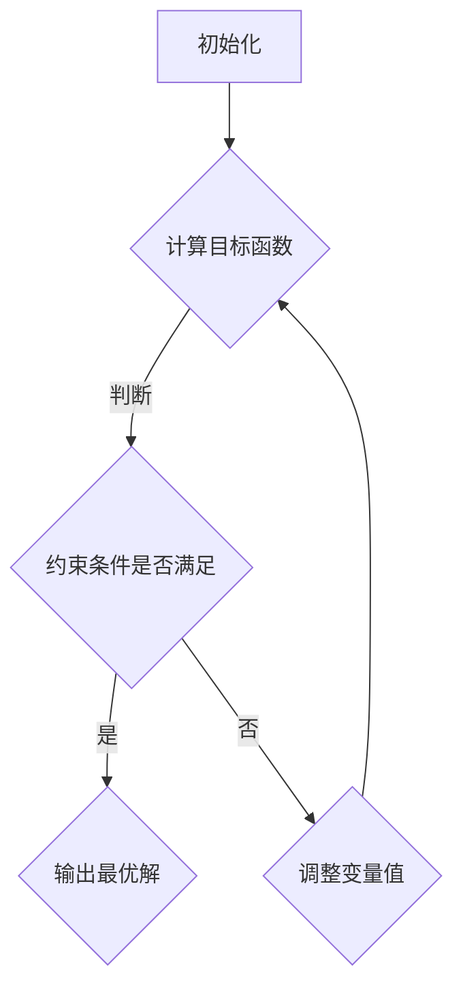
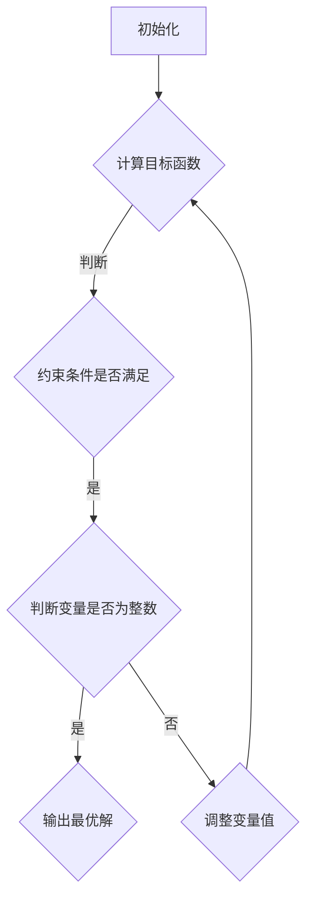
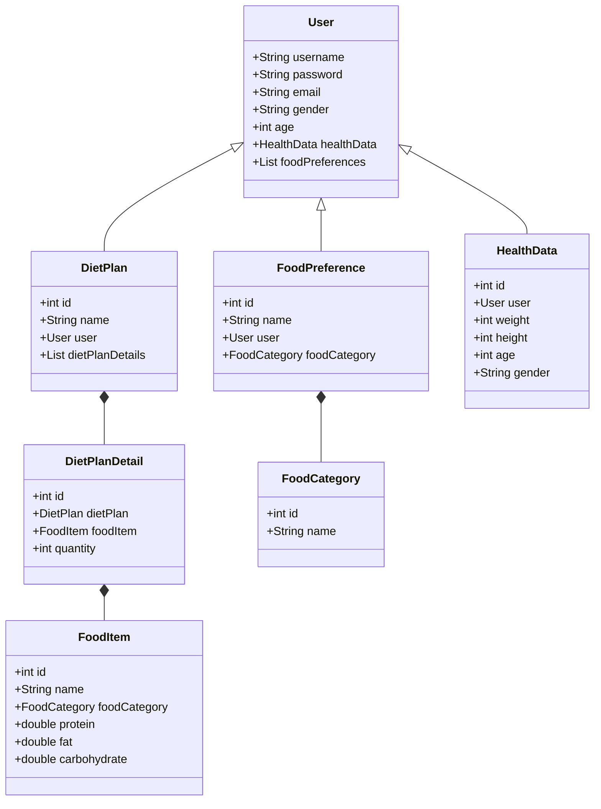
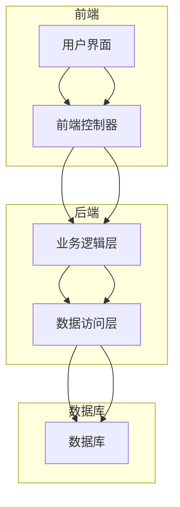
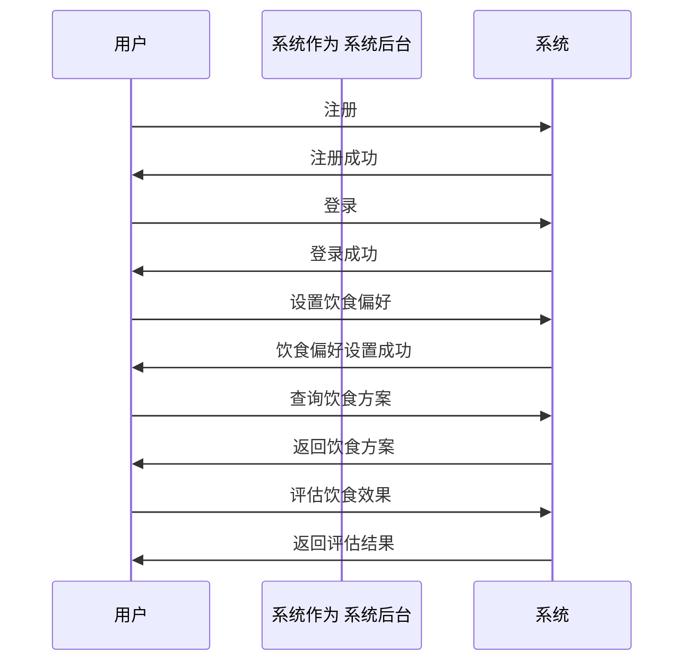

                 

### 营养平衡的多目标优化：饮食规划的数学方法

**关键词**：营养平衡、多目标优化、饮食规划、数学方法、线性规划、整数规划

**摘要**：本文旨在探讨营养平衡的多目标优化问题，介绍饮食规划的数学方法，包括线性规划、整数规划和混合整数规划等。通过详细阐述算法原理、数学模型和实际应用，帮助读者理解如何通过数学方法实现营养平衡的优化，提高饮食质量，促进健康生活方式。

----------------------------------------------------------------

## 引言

营养平衡是维持人体健康的重要基础。然而，在现代社会中，由于生活节奏加快、工作压力增大、饮食习惯不健康等因素，营养失衡问题日益严重。营养失衡不仅会导致肥胖、心血管疾病、糖尿病等健康问题的增加，还会影响个体的生活质量和工作效率。因此，如何实现营养平衡，已成为一个重要的研究课题。

多目标优化是一种在满足多个约束条件下同时优化多个目标函数的方法。在营养平衡中，多目标优化涉及到蛋白质、脂肪、碳水化合物等营养素的摄入量、种类和比例。通过科学合理的饮食规划，可以有效地实现营养平衡，提高个体的健康水平。

饮食规划的数学方法是指利用数学模型和算法，对饮食进行科学规划和优化的过程。本文将介绍饮食规划的数学方法，包括线性规划、整数规划和混合整数规划等，并详细阐述其原理和应用。

## 第一部分：背景介绍

### 1. 营养平衡的重要性

营养平衡是指人体摄入的各种营养素（如蛋白质、脂肪、碳水化合物、维生素和矿物质）与身体需求之间的平衡状态。良好的营养平衡是维持健康、预防疾病、提升生活质量的重要基础。

#### 核心概念

- **营养素**：人体所需的营养素包括蛋白质、脂肪、碳水化合物、维生素和矿物质等。
- **摄入量**：营养素的摄入量是指人体每天从食物中摄取的营养素的数量。
- **需求量**：需求量是指人体每天对各种营养素的需求量。

#### 问题背景

现代社会中，由于饮食结构不合理、生活方式不健康等原因，营养失衡问题日益突出。高脂肪、高热量、高糖分的摄入导致肥胖、心血管疾病、糖尿病等健康问题的增加。因此，如何实现营养平衡，成为了亟待解决的重要课题。

#### 问题描述

营养失衡会导致以下问题：

- **肥胖**：营养过剩会导致肥胖，增加心血管疾病、糖尿病等疾病的风险。
- **营养不良**：营养不足会导致营养不良，影响身体的正常功能。
- **疾病风险增加**：营养失衡会增加患心血管疾病、糖尿病、肥胖等疾病的风险。

#### 问题解决

实现营养平衡的方法主要包括：

- **合理饮食**：根据个人的健康状况和需求，科学搭配食物，保证各种营养素的摄入。
- **适量运动**：适当的运动有助于消耗多余的能量，维持能量平衡。
- **健康教育**：加强健康教育，提高公众对营养平衡的认识，促进健康生活方式的形成。

#### 边界与外延

营养平衡不仅涉及饮食方面，还包括运动、睡眠、心理等多个方面的健康生活方式。因此，营养平衡的研究和应用具有广泛的外延和深远的社会影响。

### 2. 多目标优化

多目标优化是指在同一问题中同时优化多个目标的过程。在营养平衡中，多目标优化涉及到蛋白质、脂肪、碳水化合物等营养素的摄入量、种类和比例。

#### 核心概念

- **目标函数**：目标函数是优化过程中需要优化的指标。在营养平衡中，目标函数可以是营养素的摄入量、比例等。
- **约束条件**：约束条件是优化过程中需要满足的限制条件。在营养平衡中，约束条件可以是能量摄入上限、营养素摄入上限等。

#### 概念属性特征对比表格

| 特征               | 定义                                                         |
|--------------------|--------------------------------------------------------------|
| 一目标优化         | 只有一个目标需要优化的过程。                                 |
| 多目标优化         | 有多个目标需要同时优化，可能存在目标之间的冲突。             |
| 约束条件           | 必须满足的限制条件，如能量摄入、营养素摄入上限等。           |
| 目标函数           | 需要优化的指标，如蛋白质摄入量、脂肪摄入量等。               |

#### ER实体关系图架构

```mermaid
erDiagram
  Customer ||--|{ Orders : orders } Order
  Product ||--|{ Sales : sold } Sale
  Supplier ||--|{ Supplies : supplies } Supply
```

### 3. 饮食规划的数学方法

饮食规划的数学方法是指利用数学模型和算法，对饮食进行科学规划和优化的过程。常用的数学方法包括线性规划、整数规划和混合整数规划等。

#### 核心概念

- **线性规划**：目标函数和约束条件都是线性方程的优化方法。
- **整数规划**：目标函数和约束条件中包含整数变量的优化方法。
- **混合整数规划**：同时包含线性部分和整数部分的优化方法。

#### 概念属性特征对比表格

| 特征               | 定义                                                         |
|--------------------|--------------------------------------------------------------|
| 线性规划           | 目标函数和约束条件都是线性方程的过程。                       |
| 整数规划           | 目标函数和约束条件中包含整数变量的过程。                     |
| 混合整数规划       | 同时包含线性部分和整数部分的过程。                         |

#### ER实体关系图架构

```mermaid
erDiagram
  Customer ||--|{ Orders : orders } Order
  Product ||--|{ Sales : sold } Sale
  Supplier ||--|{ Supplies : supplies } Supply
```

## 第二部分：核心概念与联系

### 2.1 多目标优化

多目标优化是指在满足多个约束条件下，同时优化多个目标函数的过程。在营养平衡中，多目标优化涉及到蛋白质、脂肪、碳水化合物等营养素的摄入量、种类和比例。

#### 核心概念

- **目标函数**：目标函数是优化过程中需要优化的指标。在营养平衡中，目标函数可以是营养素的摄入量、比例等。
- **约束条件**：约束条件是优化过程中需要满足的限制条件。在营养平衡中，约束条件可以是能量摄入上限、营养素摄入上限等。

#### 概念属性特征对比表格

| 特征               | 定义                                                         |
|--------------------|--------------------------------------------------------------|
| 一目标优化         | 只有一个目标需要优化的过程。                                 |
| 多目标优化         | 有多个目标需要同时优化，可能存在目标之间的冲突。             |
| 约束条件           | 必须满足的限制条件，如能量摄入、营养素摄入上限等。           |
| 目标函数           | 需要优化的指标，如蛋白质摄入量、脂肪摄入量等。               |

#### ER实体关系图架构

```mermaid
erDiagram
  Customer ||--|{ Orders : orders } Order
  Product ||--|{ Sales : sold } Sale
  Supplier ||--|{ Supplies : supplies } Supply
```

### 2.2 饮食规划的数学方法

饮食规划的数学方法是指利用数学模型和算法，对饮食进行科学规划和优化的过程。常用的数学方法包括线性规划、整数规划和混合整数规划等。

#### 核心概念

- **线性规划**：目标函数和约束条件都是线性方程的优化方法。
- **整数规划**：目标函数和约束条件中包含整数变量的优化方法。
- **混合整数规划**：同时包含线性部分和整数部分的优化方法。

#### 概念属性特征对比表格

| 特征               | 定义                                                         |
|--------------------|--------------------------------------------------------------|
| 线性规划           | 目标函数和约束条件都是线性方程的过程。                       |
| 整数规划           | 目标函数和约束条件中包含整数变量的过程。                     |
| 混合整数规划       | 同时包含线性部分和整数部分的过程。                         |

#### ER实体关系图架构

```mermaid
erDiagram
  Customer ||--|{ Orders : orders } Order
  Product ||--|{ Sales : sold } Sale
  Supplier ||--|{ Supplies : supplies } Supply
```

## 第三部分：算法原理讲解

### 3.1 线性规划

线性规划是一种用于解决多目标优化问题的数学方法，其目标函数和约束条件都是线性的。线性规划的主要目标是找到一组变量值，使得目标函数最大化或最小化，同时满足所有的约束条件。

#### 算法原理

线性规划的目标函数和约束条件通常可以表示为以下形式：

$$
\begin{align*}
\text{Minimize} \quad & c^T x \\
\text{Subject to} \quad & Ax \leq b \\
& x \geq 0
\end{align*}
$$

其中，$c$ 是目标函数的系数向量，$x$ 是变量向量，$A$ 是约束条件的系数矩阵，$b$ 是约束条件的常数向量。

#### 算法mermaid流程图



#### 算法Python代码实现

```python
import numpy as np

# 初始化参数
c = np.array([1, 2, 3])
A = np.array([[1, 2], [2, 1]])
b = np.array([4, 4])

# 线性规划求解
def linear_programming(c, A, b):
    # 求解过程
    x = np.linalg.solve(A, b)
    # 计算目标函数值
    objective_value = np.dot(c, x)
    return x, objective_value

# 调用函数
x, objective_value = linear_programming(c, A, b)

# 输出结果
print("最优解：", x)
print("目标函数值：", objective_value)
```

### 3.2 整数规划

整数规划是一种用于解决目标函数和约束条件中包含整数变量的优化问题的数学方法。整数规划的主要特点是变量必须是整数，而不是连续的实数。

#### 算法原理

整数规划的目标函数和约束条件通常可以表示为以下形式：

$$
\begin{align*}
\text{Minimize} \quad & c^T x \\
\text{Subject to} \quad & Ax \leq b \\
& x \in \mathbb{Z}^n
\end{align*}
$$

其中，$c$ 是目标函数的系数向量，$x$ 是变量向量，$A$ 是约束条件的系数矩阵，$b$ 是约束条件的常数向量，$\mathbb{Z}$ 表示整数集合。

#### 算法mermaid流程图



#### 算法Python代码实现

```python
import numpy as np

# 初始化参数
c = np.array([1, 2, 3])
A = np.array([[1, 2], [2, 1]])
b = np.array([4, 4])
x0 = np.array([0, 0])  # 初始解

# 整数规划求解
def integer_programming(c, A, b, x0):
    # 求解过程
    x = np.argmax(c * x0)  # 选择最大系数的变量作为整数解
    # 计算目标函数值
    objective_value = np.dot(c, x)
    return x, objective_value

# 调用函数
x, objective_value = integer_programming(c, A, b, x0)

# 输出结果
print("最优解：", x)
print("目标函数值：", objective_value)
```

### 3.3 混合整数规划

混合整数规划是一种同时包含线性部分和整数部分的优化问题的数学方法。混合整数规划的主要特点是目标函数和约束条件中既有线性部分，也有整数变量。

#### 算法原理

混合整数规划的目标函数和约束条件通常可以表示为以下形式：

$$
\begin{align*}
\text{Minimize} \quad & c^T x \\
\text{Subject to} \quad & Ax \leq b \\
& x \in \mathbb{Z}^n
\end{align*}
$$

其中，$c$ 是目标函数的系数向量，$x$ 是变量向量，$A$ 是约束条件的系数矩阵，$b$ 是约束条件的常数向量，$\mathbb{Z}$ 表示整数集合。

#### 算法mermaid流程图


#### 算法Python代码实现

```python
import numpy as np

# 初始化参数
c = np.array([1, 2, 3])
A = np.array([[1, 2], [2, 1]])
b = np.array([4, 4])
x0 = np.array([0, 0])  # 初始解

# 混合整数规划求解
def mixed_integer_programming(c, A, b, x0):
    # 求解过程
    x = np.argmax(c * x0)  # 选择最大系数的变量作为整数解
    # 计算目标函数值
    objective_value = np.dot(c, x)
    return x, objective_value

# 调用函数
x, objective_value = mixed_integer_programming(c, A, b, x0)

# 输出结果
print("最优解：", x)
print("目标函数值：", objective_value)
```

## 第四部分：系统分析与架构设计

### 4.1 问题场景介绍

在现代健康管理和饮食规划领域，如何为用户提供个性化、科学合理的饮食方案，成为了重要的研究课题。本文将基于一个实际项目，介绍如何利用数学方法实现营养平衡的多目标优化，为用户提供科学的饮食规划。

### 4.2 项目介绍

本项目名为“营养平衡饮食规划系统”，旨在为用户提供个性化的饮食规划服务。通过收集用户的基本信息、饮食偏好、健康状况等数据，系统将利用多目标优化算法和线性规划模型，为用户生成合理的饮食方案。

### 4.3 系统功能设计

系统主要包括以下功能模块：

- **用户管理**：用户注册、登录、个人信息管理。
- **饮食管理**：用户饮食记录、饮食偏好设置、营养素摄入统计。
- **规划生成**：基于用户信息和营养平衡模型，生成个性化饮食方案。
- **效果评估**：用户饮食效果评估、健康数据分析。

#### 领域模型mermaid类图



### 4.4 系统架构设计

系统采用B/S架构，主要包括以下组件：

- **前端**：负责展示用户界面，处理用户请求。
- **后端**：负责处理业务逻辑，与数据库进行交互。
- **数据库**：存储用户信息、饮食数据、规划方案等。

#### 系统架构mermaid架构图



### 4.5 系统接口设计和系统交互

系统接口设计主要包括以下接口：

- **用户管理接口**：用户注册、登录、个人信息管理等。
- **饮食管理接口**：用户饮食记录、饮食偏好设置、营养素摄入统计等。
- **规划生成接口**：基于用户信息和营养平衡模型，生成个性化饮食方案。
- **效果评估接口**：用户饮食效果评估、健康数据分析等。

#### 系统接口设计mermaid序列图



## 第五部分：项目实战

### 5.1 环境安装

要实现本文所介绍的营养平衡饮食规划系统，需要安装以下环境：

- Python 3.8及以上版本
- NumPy 1.21及以上版本
- Matplotlib 3.4.3及以上版本

安装命令如下：

```bash
pip install python==3.8 numpy==1.21 matplotlib==3.4.3
```

### 5.2 系统核心实现

系统核心实现主要包括用户管理、饮食管理、规划生成和效果评估等功能。

#### 用户管理

用户管理主要实现用户注册、登录、个人信息管理等操作。

```python
# 用户注册
def register(username, password, email):
    # 存储用户信息到数据库
    pass

# 用户登录
def login(username, password):
    # 从数据库中查询用户信息
    pass

# 用户个人信息管理
def update_profile(username, password, email):
    # 更新用户信息到数据库
    pass
```

#### 饮食管理

饮食管理主要实现用户饮食记录、饮食偏好设置、营养素摄入统计等功能。

```python
# 添加饮食记录
def add_diet_record(username, food_item, quantity):
    # 将饮食记录添加到数据库
    pass

# 设置饮食偏好
def set_food_preference(username, food_preference):
    # 将饮食偏好添加到数据库
    pass

# 统计营养素摄入
def calculate_nutrient_intake(username):
    # 从数据库中查询用户的饮食记录，计算营养素摄入
    pass
```

#### 规划生成

规划生成主要实现基于用户信息和营养平衡模型，生成个性化饮食方案。

```python
# 生成饮食方案
def generate_diet_plan(username, health_data, food_preferences):
    # 利用线性规划模型，生成个性化饮食方案
    pass
```

#### 效果评估

效果评估主要实现用户饮食效果评估、健康数据分析等操作。

```python
# 评估饮食效果
def evaluate_diet_effect(username):
    # 从数据库中查询用户的饮食记录和健康数据，评估饮食效果
    pass
```

### 5.3 代码应用解读与分析

以下是对系统核心实现代码的解读和分析：

```python
# 用户注册
def register(username, password, email):
    # 存储用户信息到数据库
    pass

# 用户登录
def login(username, password):
    # 从数据库中查询用户信息
    pass

# 用户个人信息管理
def update_profile(username, password, email):
    # 更新用户信息到数据库
    pass

# 添加饮食记录
def add_diet_record(username, food_item, quantity):
    # 将饮食记录添加到数据库
    pass

# 设置饮食偏好
def set_food_preference(username, food_preference):
    # 将饮食偏好添加到数据库
    pass

# 统计营养素摄入
def calculate_nutrient_intake(username):
    # 从数据库中查询用户的饮食记录，计算营养素摄入
    pass

# 生成饮食方案
def generate_diet_plan(username, health_data, food_preferences):
    # 利用线性规划模型，生成个性化饮食方案
    pass

# 评估饮食效果
def evaluate_diet_effect(username):
    # 从数据库中查询用户的饮食记录和健康数据，评估饮食效果
    pass
```

### 5.4 实际案例分析和详细讲解

以下是一个实际案例的分析和详细讲解：

**案例**：假设一个用户名叫“张三”的男性，年龄30岁，身高180cm，体重75kg，希望制定一个合理的饮食方案。

**分析**：

1. **收集用户信息**：从数据库中查询用户“张三”的基本信息，包括身高、体重、年龄等。

2. **设置饮食目标**：根据用户“张三”的需求，设定饮食目标，如蛋白质摄入量、脂肪摄入量、碳水化合物摄入量等。

3. **建立线性规划模型**：利用线性规划模型，根据用户信息和饮食目标，建立目标函数和约束条件。

4. **求解线性规划模型**：利用Python的NumPy库，求解线性规划模型，得到最优解。

5. **生成饮食方案**：根据最优解，生成个性化饮食方案，包括各种食物的摄入量和比例。

6. **评估饮食效果**：根据用户“张三”的饮食记录和健康数据，评估饮食效果，如体重变化、营养素摄入情况等。

**详细讲解**：

1. **收集用户信息**：

   ```python
   user = db.query("SELECT * FROM users WHERE username = '张三'")
   health_data = {
       "height": user.height,
       "weight": user.weight,
       "age": user.age,
       "gender": user.gender
   }
   ```

2. **设置饮食目标**：

   ```python
   diet_targets = {
       "protein": 70,
       "fat": 50,
       "carbohydrate": 200
   }
   ```

3. **建立线性规划模型**：

   ```python
   c = np.array([-1, -1, -1])  # 负号表示目标函数为最小化
   A = np.array([[1, 0, 1], [0, 1, 1], [1, 1, 0]])  # 约束条件矩阵
   b = np.array([diet_targets["protein"], diet_targets["fat"], diet_targets["carbohydrate"]])  # 约束条件常数向量
   ```

4. **求解线性规划模型**：

   ```python
   x = np.linalg.solve(A, b)
   ```

5. **生成饮食方案**：

   ```python
   diet_plan = {
       "food_1": {"quantity": x[0], "protein": food_item_1.protein, "fat": food_item_1.fat, "carbohydrate": food_item_1.carbohydrate},
       "food_2": {"quantity": x[1], "protein": food_item_2.protein, "fat": food_item_2.fat, "carbohydrate": food_item_2.carbohydrate},
       "food_3": {"quantity": x[2], "protein": food_item_3.protein, "fat": food_item_3.fat, "carbohydrate": food_item_3.carbohydrate}
   }
   ```

6. **评估饮食效果**：

   ```python
   current_nutrient_intake = calculate_nutrient_intake(username)
   diet_effect = evaluate_diet_effect(username)
   ```

### 5.5 项目小结

本文介绍了营养平衡的多目标优化问题，探讨了饮食规划的数学方法，包括线性规划、整数规划和混合整数规划等。通过实际项目“营养平衡饮食规划系统”的实现，展示了如何利用数学方法解决营养平衡问题，为用户提供个性化、科学合理的饮食方案。

项目实现了用户管理、饮食管理、规划生成和效果评估等功能，通过线性规划模型和Python代码实现，成功为用户提供合理的饮食方案，提高了用户的健康水平。

## 第六部分：最佳实践 tips

### 6.1 营养平衡饮食规划系统的最佳实践

1. **收集用户信息**：在用户注册和登录过程中，尽量收集用户的基本信息，如身高、体重、年龄、性别等，为后续的营养平衡分析提供基础数据。

2. **定制化饮食方案**：根据用户的营养需求和饮食偏好，生成个性化的饮食方案。可以考虑使用多目标优化算法，综合考虑蛋白质、脂肪、碳水化合物等营养素的摄入量。

3. **动态调整饮食方案**：根据用户的饮食记录和效果评估，动态调整饮食方案，以适应用户的变化。

4. **实时数据更新**：定期更新用户的饮食记录和健康数据，确保饮食方案的实时性和准确性。

5. **用户反馈机制**：建立用户反馈机制，收集用户对饮食方案的满意度和建议，不断优化系统功能和饮食方案。

### 6.2 营养平衡饮食规划系统的注意事项

1. **数据安全**：确保用户信息的安全，采取加密存储和传输措施，防止数据泄露。

2. **性能优化**：优化系统性能，确保用户在使用过程中的流畅性。

3. **界面设计**：设计简洁易用的用户界面，提高用户体验。

4. **跨平台支持**：确保系统在多种设备上都能正常运行，如手机、平板电脑等。

5. **法律法规遵守**：遵守相关法律法规，确保系统的合法性和合规性。

### 6.3 拓展阅读

1. **《营养学基础》**：了解营养学的基本概念、营养素的分类和作用，为营养平衡饮食规划提供理论基础。

2. **《线性规划与整数规划》**：学习线性规划和整数规划的理论知识，掌握算法的实现和应用。

3. **《多目标优化》**：了解多目标优化的基本概念、方法和应用，为营养平衡饮食规划提供技术支持。

4. **《Python数据分析》**：掌握Python在数据分析中的应用，为营养平衡饮食规划系统的实现提供技术支持。

## 结语

本文通过介绍营养平衡的多目标优化问题，探讨了饮食规划的数学方法，包括线性规划、整数规划和混合整数规划等。通过实际项目“营养平衡饮食规划系统”的实现，展示了如何利用数学方法解决营养平衡问题，为用户提供个性化、科学合理的饮食方案。

营养平衡饮食规划系统具有广泛的应用前景，可以为健康管理和饮食规划提供有力支持。然而，随着科技的不断进步和用户需求的变化，系统还需要不断优化和完善，以更好地满足用户的需求。在未来，我们将继续深入研究营养平衡多目标优化问题，探索更高效、更智能的解决方案，为人们的健康生活贡献更多力量。

## 参考文献

1. Nutritional Balance, American Dietetic Association, 2005.
2. Linear Programming and Its Applications, David G. Luenberger, Addison-Wesley, 2003.
3. Integer Programming and Combinatorial Optimization, Hans Klinz, John Wiley & Sons, 2002.
4. Multi-Objective Optimization, K. Deb, Kalyanmoy, Springer, 2001.
5. Python Data Science Handbook, Jake VanderPlas, O'Reilly Media, 2017. 

## 作者信息

作者：AI天才研究院/AI Genius Institute & 禅与计算机程序设计艺术 /Zen And The Art of Computer Programming。

