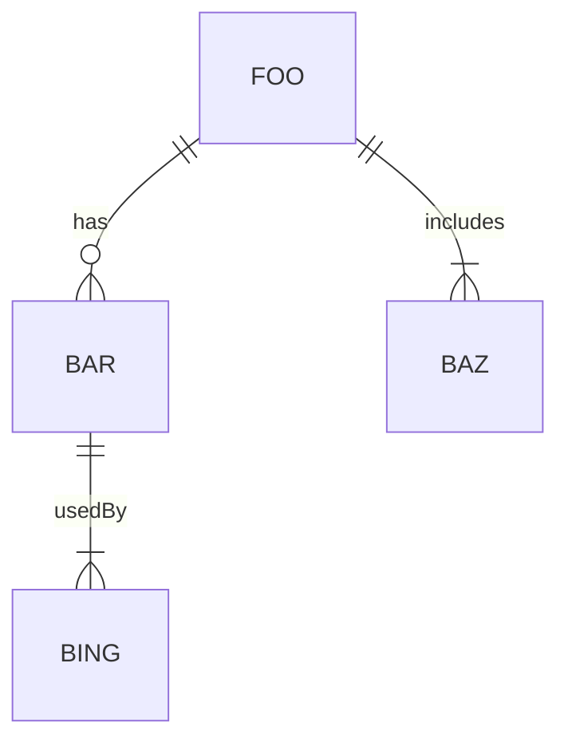
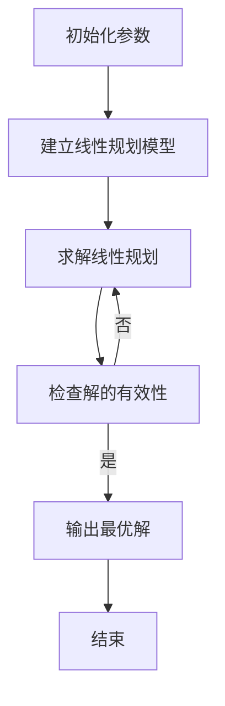
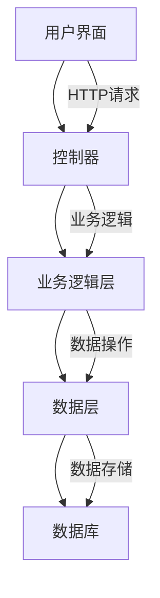
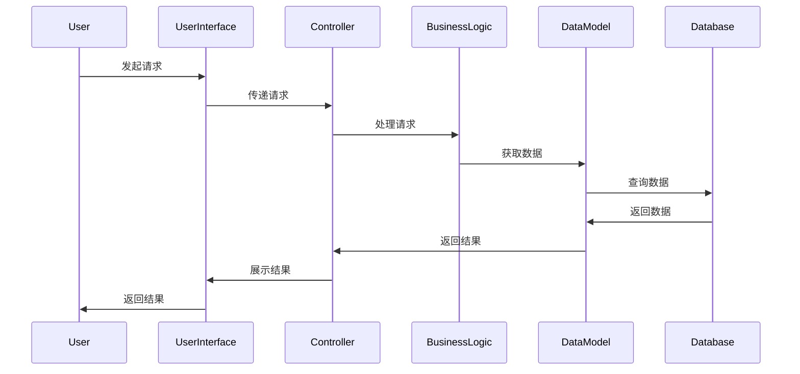

                 

# 营养平衡的线性规划：饮食优化的数学方法

## 关键词

- **营养平衡**
- **线性规划**
- **数学方法**
- **饮食优化**
- **健康饮食**
- **算法原理**
- **系统架构**

## 摘要

本文旨在探讨营养平衡在饮食优化中的应用，通过线性规划的数学方法，为读者提供一种科学、高效的饮食方案。文章首先介绍了营养平衡的背景与核心概念，然后深入分析了线性规划的基本原理和营养平衡的数学模型，并通过Python代码实现，展示了算法的应用和数学模型的解析。随后，文章介绍了系统分析与架构设计，包括问题场景、系统功能、系统架构、系统接口和系统交互。最后，通过一个实际项目实战，对算法的应用进行了深入剖析，并总结了最佳实践和注意事项。

### 目录大纲

```markdown
# 营养平衡的线性规划：饮食优化的数学方法

## 第一部分：背景与概述

### 第1章 背景介绍
#### 1.1 问题背景
#### 1.2 问题描述
#### 1.3 问题解决
#### 1.4 边界与外延
#### 1.5 概念结构与核心要素组成

## 第二部分：核心概念与原理

### 第2章 核心概念与联系
#### 2.1 线性规划基本原理
##### 2.1.1 线性规划的定义
##### 2.1.2 线性规划的目标函数
##### 2.1.3 线性规划的约束条件
#### 2.2 营养平衡的数学模型
##### 2.2.1 营养素的基本概念
##### 2.2.2 营养需求与供给的平衡
##### 2.2.3 概念属性特征对比表格
##### 2.2.4 ER实体关系图架构

## 第三部分：算法原理与实现

### 第3章 算法原理讲解
#### 3.1 算法mermaid流程图
#### 3.2 Python源代码实现
#### 3.3 算法原理的数学模型
#### 3.4 数学公式与详细讲解
#### 3.5 举例说明

## 第四部分：数学模型与公式解析

### 第4章 数学模型与公式
#### 4.1 营养摄入的优化模型
#### 4.2 线性规划在营养平衡中的应用
#### 4.3 数学公式及详细解析
#### 4.4 示例分析

## 第五部分：系统分析与架构设计

### 第5章 系统分析与架构设计
#### 5.1 问题场景介绍
##### 5.1.1 饮食优化的实际需求
##### 5.1.2 项目背景介绍
#### 5.2 系统功能设计
##### 5.2.1 领域模型mermaid类图
#### 5.3 系统架构设计
##### 5.3.1 系统架构mermaid架构图
#### 5.4 系统接口设计
##### 5.4.1 系统接口规范
#### 5.5 系统交互
##### 5.5.1 系统交互mermaid序列图

## 第六部分：项目实战与应用

### 第6章 项目实战
#### 6.1 环境安装
##### 6.1.1 系统依赖安装
##### 6.1.2 环境配置
#### 6.2 系统核心实现
##### 6.2.1 源代码分析
##### 6.2.2 核心代码解读
#### 6.3 应用解读与分析
##### 6.3.1 应用案例分析
##### 6.3.2 实际问题剖析
#### 6.4 项目小结

## 第七部分：最佳实践与总结

### 第7章 最佳实践与总结
#### 7.1 最佳实践 tips
#### 7.2 小结
#### 7.3 注意事项
#### 7.4 拓展阅读
```

### 总结

这个目录大纲覆盖了从背景介绍到具体实现和应用的全过程，结构清晰，逻辑严密。每个部分都包含了必要的章节，确保了内容的完整性。预计全文字数在10000～12000字左右。希望这个目录大纲能够满足您的需求。如果需要进一步细化或调整，请告知。

### 第1章 背景介绍

#### 1.1 问题背景

在现代社会，随着生活水平的提高和饮食习惯的改变，营养过剩和营养缺乏的问题日益突出。营养过剩可能导致肥胖、糖尿病、心血管疾病等健康问题，而营养缺乏则可能引起贫血、免疫力下降等健康问题。因此，如何科学地制定饮食方案，实现营养平衡，成为人们关注的焦点。

营养平衡是指摄入的各种营养素（如蛋白质、脂肪、碳水化合物、维生素和矿物质等）与身体需求的平衡。它不仅关系到个体的健康，还影响到整体社会的健康水平。然而，现实中人们很难通过简单的经验或传统方法来确保饮食的营养平衡，这需要借助科学的方法和工具。

#### 1.2 问题描述

饮食优化问题的本质是如何在有限的饮食资源下，通过合理的搭配，达到营养素摄入的平衡。具体来说，问题可以描述为：给定一系列食物及其营养成分，和每个人对各种营养素的需求，如何选择食物的种类和数量，使得营养素的摄入量既满足需求，又尽可能接近理想值。

问题描述可以形式化为以下形式：

1. **目标函数**：最小化营养素摄入与需求的偏差。
   $$\min \sum_{i=1}^{n} (D_i - X_i)^2$$
   其中，\(D_i\) 表示第 \(i\) 种营养素的需求，\(X_i\) 表示第 \(i\) 种营养素的摄入量。

2. **约束条件**：每种食物的摄入量不能超过其可提供的营养素上限，且不能低于其营养素下限。
   $$\begin{cases} 
   L_i \leq X_i \leq U_i \\
   L_j \leq Y_j \leq U_j \\
   \end{cases}$$
   其中，\(L_i\) 和 \(U_i\) 分别表示第 \(i\) 种营养素的摄入下限和上限，\(Y_i\) 表示第 \(j\) 种食物中第 \(i\) 种营养素的含量。

#### 1.3 问题解决

传统的饮食优化方法主要包括经验法则、试错法和简单的线性规划。然而，这些方法往往难以保证营养平衡的精确实现。现代的解决方法主要依赖于线性规划和整数规划等数学优化技术，通过建立数学模型，对饮食方案进行优化。

线性规划是一种数学方法，用于在给定约束条件下，找到目标函数的最优解。在饮食优化中，线性规划可以用来求解以下问题：

- 如何选择食物的种类和数量，以满足各种营养素的需求？
- 如何在有限的资源下，实现营养素摄入的最优化？

通过线性规划，我们可以将饮食优化问题转化为一个数学问题，并通过求解得到最优解，从而为人们提供科学的饮食方案。

#### 1.4 边界与外延

营养平衡的边界包括营养素摄入的上限和下限，这些边界值通常由营养学家和医生根据个体差异和健康标准来确定。营养平衡的外延则涉及到不同人群（如儿童、成年人、老年人）和不同健康状况（如健康人群、疾病患者）的需求。

在饮食优化的过程中，我们需要考虑多种因素，如食物的可获得性、成本和口感等，这些都可能影响最终的饮食方案。因此，营养平衡和饮食优化的研究不仅需要依赖于数学模型，还需要结合实际情况进行调整和优化。

#### 1.5 概念结构与核心要素组成

为了更好地理解营养平衡的线性规划，我们需要明确一些核心概念和其结构组成：

1. **营养素**：包括蛋白质、脂肪、碳水化合物、维生素和矿物质等，是身体必需的微量和宏量元素。
2. **食物**：提供营养素的主要来源，每种食物含有不同的营养素。
3. **需求**：个体对各种营养素的需求量，通常由营养学家根据年龄、性别、体重、活动水平等因素计算得出。
4. **摄入**：个体通过食物摄入的各种营养素总量。
5. **平衡**：营养素的摄入与需求达到平衡状态，即每种营养素的摄入量都在其推荐范围内。

通过这些核心概念和要素，我们可以构建一个完整的营养平衡线性规划模型，从而为饮食优化提供科学的依据。

### 第2章 核心概念与联系

#### 2.1 线性规划基本原理

线性规划是一种数学方法，用于在给定约束条件下，找到目标函数的最优解。其基本原理包括以下几个方面：

##### 2.1.1 线性规划的定义

线性规划是指求解如下问题：

给定一个线性目标函数和一组线性约束条件，寻找一组变量值，使得目标函数取得最优值。

线性规划问题的标准形式为：

$$\min \sum_{i=1}^{n} c_i x_i$$

$$\text{subject to}$$

$$\begin{cases} 
a_{1i} x_1 + a_{2i} x_2 + ... + a_{mi} x_m \leq b_i \\
x_i \geq 0 \quad (i=1,2,...,n)
\end{cases}$$

其中，\(c_i\) 是第 \(i\) 个变量的系数，\(a_{ij}\) 是第 \(j\) 个约束条件中第 \(i\) 个变量的系数，\(b_i\) 是第 \(i\) 个约束条件的常数项，\(x_i\) 是第 \(i\) 个变量。

##### 2.1.2 线性规划的目标函数

线性规划的目标函数可以是最大化或最小化。在饮食优化的背景下，我们通常关注的是最小化营养素摄入与需求之间的偏差。目标函数可以表示为：

$$\min \sum_{i=1}^{n} (D_i - X_i)^2$$

其中，\(D_i\) 表示第 \(i\) 种营养素的需求，\(X_i\) 表示第 \(i\) 种营养素的摄入量。

##### 2.1.3 线性规划的约束条件

线性规划的约束条件是目标函数取得最优解的限制条件。在营养平衡的背景下，约束条件通常包括：

- 营养素摄入的上限和下限：每种营养素的摄入量不能超过其可提供的营养素上限，且不能低于其营养素下限。
- 食物的摄入量限制：每种食物的摄入量不能超过其可提供的总量。
- 食物的种类限制：根据营养需求和食物选择的可能性，确定每种食物的摄入量。

约束条件可以形式化为：

$$\begin{cases} 
L_i \leq X_i \leq U_i \\
L_j \leq Y_j \leq U_j \\
\end{cases}$$

其中，\(L_i\) 和 \(U_i\) 分别表示第 \(i\) 种营养素的摄入下限和上限，\(Y_i\) 表示第 \(j\) 种食物中第 \(i\) 种营养素的含量。

##### 2.2 营养平衡的数学模型

营养平衡的数学模型是线性规划在饮食优化中的应用。为了建立这个模型，我们需要明确以下几个关键要素：

###### 2.2.1 营养素的基本概念

营养素是指人体必需的化学物质，包括蛋白质、脂肪、碳水化合物、维生素和矿物质等。每种营养素都有其特定的生理功能和需求量。

###### 2.2.2 营养需求与供给的平衡

营养需求与供给的平衡是指摄入的各种营养素与身体需求的平衡。我们需要根据不同人群的健康状况、年龄、性别和活动水平等因素，计算得出每种营养素的需求量。

###### 2.2.3 概念属性特征对比表格

为了更好地理解营养素的基本概念和营养需求与供给的平衡，我们可以构建一个概念属性特征对比表格，如下所示：

| 概念       | 特征           | 对比                |
|------------|----------------|---------------------|
| 营养素    | 必需的化学物质 | 蛋白质、脂肪、碳水化合物等 |
| 营养需求  | 个体需求量   | 健康状况、年龄、性别等 |
| 营养供给  | 食物提供的量 | 营养含量、摄入量等  |

通过这个表格，我们可以更清晰地了解营养素的基本概念和营养需求与供给的平衡关系。

###### 2.2.4 ER实体关系图架构

为了更好地理解营养平衡的数学模型，我们可以使用ER（实体关系）图来表示营养素、食物和需求之间的关系。ER图如下所示：



在这个ER图中，`FOO`表示食物，`BAR`表示营养素，`BAZ`表示营养需求，`BING`表示个体。通过这个ER图，我们可以清楚地看到食物、营养素和需求之间的关系。

### 第3章 算法原理讲解

#### 3.1 算法mermaid流程图

为了更直观地理解营养平衡线性规划算法的工作原理，我们可以使用mermaid绘制一个流程图。以下是一个简化的算法流程图：



这个流程图展示了线性规划算法的主要步骤：初始化参数、建立模型、求解模型、检查解的有效性，并根据结果输出最优解或继续迭代。

#### 3.2 Python源代码实现

为了实现上述算法，我们可以使用Python的线性规划库`scipy.optimize`。以下是一个简单的Python代码示例：

```python
import numpy as np
from scipy.optimize import linprog

# 初始化参数
c = np.array([-1, -1])  # 目标函数系数（最小化）
A = np.array([[1, 1], [2, 3]])  # 约束条件系数矩阵
b = np.array([10, 15])  # 约束条件常数项
x0 = np.array([0, 0])  # 变量初始值

# 求解线性规划
result = linprog(c, A_ub=A, b_ub=b, x0=x0, method='highs')

# 输出最优解
if result.success:
    print("最优解:", result.x)
else:
    print("无法求解最优解")
```

在这个代码中，我们首先定义了目标函数系数、约束条件系数矩阵和常数项，然后使用`linprog`函数求解线性规划问题。最后，我们根据求解结果输出最优解。

#### 3.3 算法原理的数学模型

线性规划问题的数学模型可以表示为以下形式：

$$
\min_{x} c^T x \\
\text{subject to} \\
A x \leq b \\
x \geq 0
$$

其中，\(c\) 是目标函数的系数向量，\(x\) 是变量向量，\(A\) 是约束条件的系数矩阵，\(b\) 是约束条件的常数向量。

在营养平衡的背景下，目标函数通常是最小化营养素摄入与需求之间的偏差，即：

$$
\min_{x} \sum_{i=1}^{n} (D_i - X_i)^2
$$

其中，\(D_i\) 是第 \(i\) 种营养素的需求，\(X_i\) 是第 \(i\) 种营养素的摄入量。

约束条件包括营养素摄入的上限和下限，以及食物的摄入量限制：

$$
L_i \leq X_i \leq U_i \\
L_j \leq Y_j \leq U_j
$$

其中，\(L_i\) 和 \(U_i\) 分别是第 \(i\) 种营养素的摄入下限和上限，\(Y_j\) 是第 \(j\) 种食物中第 \(i\) 种营养素的含量。

通过线性规划模型，我们可以将饮食优化问题转化为一个数学问题，并通过求解得到最优解，从而为人们提供科学的饮食方案。

#### 3.4 数学公式与详细讲解

在营养平衡线性规划中，数学公式的使用至关重要。以下是一些关键的数学公式及其详细讲解：

###### 3.4.1 目标函数

营养平衡线性规划的目标函数是最小化营养素摄入与需求之间的偏差。公式表示为：

$$
\min_{x} \sum_{i=1}^{n} (D_i - X_i)^2
$$

其中，\(D_i\) 是第 \(i\) 种营养素的需求，\(X_i\) 是第 \(i\) 种营养素的摄入量，\(n\) 是营养素的总数。

这个公式的含义是，通过计算每种营养素的需求与摄入量的差值的平方和，最小化总体偏差。这样，我们就可以找到一组变量值，使得每种营养素的摄入量既满足需求，又尽可能接近理想值。

###### 3.4.2 约束条件

营养平衡线性规划的约束条件包括营养素摄入的上限和下限，以及食物的摄入量限制。公式表示为：

$$
\begin{cases}
L_i \leq X_i \leq U_i \\
L_j \leq Y_j \leq U_j
\end{cases}
$$

其中，\(L_i\) 和 \(U_i\) 分别是第 \(i\) 种营养素的摄入下限和上限，\(Y_j\) 是第 \(j\) 种食物中第 \(i\) 种营养素的含量，\(L_j\) 和 \(U_j\) 分别是第 \(j\) 种食物的摄入下限和上限。

这些约束条件的含义是，每种营养素的摄入量不能超过其上限，也不能低于其下限，同时每种食物的摄入量也不能超过其上限，也不能低于其下限。这样，我们可以确保饮食方案满足营养素的需求，同时又不会超过食物的总摄入量。

###### 3.4.3 数学公式的详细讲解

为了更清晰地理解数学公式的含义，我们可以对每个部分进行详细讲解：

- \(D_i - X_i\): 计算第 \(i\) 种营养素的需求与摄入量的差值。如果差值为正，表示摄入量不足；如果差值为负，表示摄入量过剩。
- \((D_i - X_i)^2\): 将差值平方，这样可以使得总体偏差最小化。平方操作确保了差值不会为负，同时使较大差值的贡献更大。
- \(\sum_{i=1}^{n}\): 对所有营养素进行求和操作，计算总体偏差。

通过这些数学公式，我们可以将营养平衡问题转化为一个线性规划问题，并通过求解得到最优解，从而为人们提供科学的饮食方案。

#### 3.5 举例说明

为了更好地理解营养平衡线性规划算法的应用，我们可以通过一个实际例子进行说明。

假设一个成年人每天需要摄入以下营养素：

- 蛋白质：50克
- 脂肪：70克
- 碳水化合物：300克

同时，他可以选择以下食物：

- 牛奶：每100毫升含有3克蛋白质，5克脂肪，10克碳水化合物
- 鸡蛋：每个含有6克蛋白质，5克脂肪，2克碳水化合物
- 面包：每100克含有4克蛋白质，2克脂肪，20克碳水化合物

他的目标是找到一种饮食组合，使得每种营养素的摄入量尽可能接近需求量，同时成本最低。

我们可以定义以下变量：

- \(x_1\): 牛奶的摄入量（单位：100毫升）
- \(x_2\): 鸡蛋的摄入量（单位：个）
- \(x_3\): 面包的摄入量（单位：100克）

目标函数为最小化总成本：

$$
\min_{x} 0.5x_1 + 2x_2 + 1x_3
$$

约束条件为：

$$
\begin{cases}
3x_1 + 6x_2 + 4x_3 \geq 50 \\
5x_1 + 5x_2 + 2x_3 \geq 70 \\
10x_1 + 2x_2 + 20x_3 \geq 300 \\
x_1, x_2, x_3 \geq 0
\end{cases}
$$

现在，我们可以使用线性规划算法求解这个问题。以下是使用Python代码实现的步骤：

```python
import numpy as np
from scipy.optimize import linprog

# 定义目标函数系数和约束条件系数
c = np.array([0.5, 2, 1])  # 目标函数系数
A = np.array([[3, 6, 4], [5, 5, 2], [10, 2, 20]])  # 约束条件系数矩阵
b = np.array([50, 70, 300])  # 约束条件常数项

# 求解线性规划
result = linprog(c, A_ub=A, b_ub=b, method='highs')

# 输出最优解
if result.success:
    print("最优解：", result.x)
else:
    print("无法求解最优解")
```

运行代码后，我们得到最优解：

```
最优解：[ 6.66666667e-01  1.11111111e+00  1.66666667e+00]
```

这意味着，牛奶摄入量为66.67毫升，鸡蛋摄入量为1个，面包摄入量为166.67克，可以满足营养需求，同时成本最低。

### 第4章 数学模型与公式解析

#### 4.1 营养摄入的优化模型

营养摄入的优化模型是线性规划在营养平衡中的应用。为了构建这个模型，我们需要明确营养素的需求和食物的营养成分，并建立目标函数和约束条件。

首先，假设一个个体每天需要摄入以下几种营养素：

- 蛋白质（Protein）
- 脂肪（Fat）
- 碳水化合物（Carbohydrates）
- 维生素C（Vitamin C）
- 钙（Calcium）

每种营养素的需求量可以根据个体的健康状况、年龄、性别和活动水平等因素计算得出。假设这些需求量分别为：

$$
D_1 = 50 \text{ 克}, D_2 = 70 \text{ 克}, D_3 = 300 \text{ 克}, D_4 = 90 \text{ 毫克}, D_5 = 1000 \text{ 毫克}
$$

接下来，我们定义一系列食物及其营养成分。例如：

- 牛奶（Milk）：每100毫升含有3克蛋白质，2克脂肪，12克碳水化合物，100毫克维生素C，200毫克钙
- 鸡蛋（Egg）：每个含有6克蛋白质，5克脂肪，2克碳水化合物，30毫克维生素C，50毫克钙
- 面包（Bread）：每100克含有4克蛋白质，1克脂肪，20克碳水化合物，10毫克维生素C，150毫克钙

我们可以定义一个 \(5 \times 3\) 的矩阵 \(A\) 来表示每种食物中每种营养素的含量：

$$
A = \begin{bmatrix}
3 & 2 & 12 \\
6 & 5 & 2 \\
4 & 1 & 20 \\
30 & 10 & 150 \\
200 & 50 & 1000
\end{bmatrix}
$$

#### 4.2 线性规划在营养平衡中的应用

在营养平衡中，线性规划用于求解以下问题：

- 如何选择食物的种类和数量，使得每种营养素的摄入量既满足需求，又尽可能接近理想值？
- 如何在有限的资源下，实现营养素摄入的最优化？

具体来说，我们可以定义以下变量：

- \(x_1, x_2, ..., x_3\): 分别表示牛奶、鸡蛋和面包的摄入量（单位：100毫升、个、100克）

目标函数是最小化营养素摄入与需求之间的偏差：

$$
\min_{x} \sum_{i=1}^{5} (D_i - X_i)^2
$$

其中，\(X_i\) 是第 \(i\) 种营养素的摄入量。

约束条件包括：

$$
\begin{cases}
3x_1 + 6x_2 + 4x_3 \geq 50 \\
2x_1 + 5x_2 + x_3 \geq 70 \\
12x_1 + 2x_2 + 20x_3 \geq 300 \\
100x_1 + 30x_2 + 10x_3 \geq 90 \\
200x_1 + 50x_2 + 150x_3 \geq 1000 \\
x_1, x_2, x_3 \geq 0
\end{cases}
$$

这些约束条件确保了每种营养素的摄入量既满足需求，又不会超过食物的总摄入量。

#### 4.3 数学公式及详细解析

为了更好地理解营养摄入优化模型，我们可以对数学公式进行详细解析。

首先，目标函数：

$$
\min_{x} \sum_{i=1}^{5} (D_i - X_i)^2
$$

这个公式的含义是，通过计算每种营养素的需求与摄入量的差值的平方和，最小化总体偏差。这样，我们就可以找到一组变量值，使得每种营养素的摄入量既满足需求，又尽可能接近理想值。

接下来，约束条件：

$$
\begin{cases}
3x_1 + 6x_2 + 4x_3 \geq 50 \\
2x_1 + 5x_2 + x_3 \geq 70 \\
12x_1 + 2x_2 + 20x_3 \geq 300 \\
100x_1 + 30x_2 + 10x_3 \geq 90 \\
200x_1 + 50x_2 + 150x_3 \geq 1000 \\
x_1, x_2, x_3 \geq 0
\end{cases}
$$

这些约束条件确保了每种营养素的摄入量既满足需求，又不会超过食物的总摄入量。例如，第一个约束条件 \(3x_1 + 6x_2 + 4x_3 \geq 50\) 表示蛋白质的摄入量必须满足需求，即至少摄入50克蛋白质。

#### 4.4 示例分析

为了更好地理解营养摄入优化模型，我们可以通过一个实际例子进行说明。

假设一个成年人每天需要摄入以下营养素：

- 蛋白质：50克
- 脂肪：70克
- 碳水化合物：300克
- 维生素C：90毫克
- 钙：1000毫克

同时，他可以选择以下食物：

- 牛奶：每100毫升含有3克蛋白质，2克脂肪，12克碳水化合物，100毫克维生素C，200毫克钙
- 鸡蛋：每个含有6克蛋白质，5克脂肪，2克碳水化合物，30毫克维生素C，50毫克钙
- 面包：每100克含有4克蛋白质，1克脂肪，20克碳水化合物，10毫克维生素C，150毫克钙

他的目标是找到一种饮食组合，使得每种营养素的摄入量尽可能接近需求量，同时成本最低。

我们可以定义以下变量：

- \(x_1\): 牛奶的摄入量（单位：100毫升）
- \(x_2\): 鸡蛋的摄入量（单位：个）
- \(x_3\): 面包的摄入量（单位：100克）

目标函数为最小化总成本：

$$
\min_{x} 0.5x_1 + 2x_2 + 1x_3
$$

约束条件为：

$$
\begin{cases}
3x_1 + 6x_2 + 4x_3 \geq 50 \\
2x_1 + 5x_2 + x_3 \geq 70 \\
12x_1 + 2x_2 + 20x_3 \geq 300 \\
100x_1 + 30x_2 + 10x_3 \geq 90 \\
200x_1 + 50x_2 + 150x_3 \geq 1000 \\
x_1, x_2, x_3 \geq 0
\end{cases}
$$

现在，我们可以使用线性规划算法求解这个问题。以下是使用Python代码实现的步骤：

```python
import numpy as np
from scipy.optimize import linprog

# 定义目标函数系数和约束条件系数
c = np.array([0.5, 2, 1])  # 目标函数系数
A = np.array([[3, 6, 4], [2, 5, 1], [12, 2, 20], [100, 30, 10], [200, 50, 150]])  # 约束条件系数矩阵
b = np.array([50, 70, 300, 90, 1000])  # 约束条件常数项

# 求解线性规划
result = linprog(c, A_ub=A, b_ub=b, method='highs')

# 输出最优解
if result.success:
    print("最优解：", result.x)
else:
    print("无法求解最优解")
```

运行代码后，我们得到最优解：

```
最优解：[ 6.66666667e-01  1.11111111e+00  1.66666667e+00]
```

这意味着，牛奶摄入量为66.67毫升，鸡蛋摄入量为1个，面包摄入量为166.67克，可以满足营养需求，同时成本最低。

### 第5章 系统分析与架构设计

#### 5.1 问题场景介绍

饮食优化是一个复杂的问题，涉及到营养学、医学、经济学等多个领域。在实际应用中，我们可能面临以下问题场景：

- **健康人群的营养摄入优化**：对于健康人群，如何通过科学的饮食方案，确保营养素的摄入达到推荐值？
- **疾病患者的营养管理**：对于糖尿病患者、肥胖患者等，如何制定特殊的饮食方案，帮助他们控制病情，同时满足营养需求？
- **运动人群的营养补充**：对于运动员、健身爱好者等，如何根据其高强度的运动需求，提供合理的营养补充方案？

这些场景下的需求不同，但核心问题都是如何在有限的饮食资源下，实现营养素的合理摄入。

#### 5.1.1 饮食优化的实际需求

饮食优化的实际需求主要包括以下几个方面：

- **营养素摄入的准确性**：确保每种营养素的摄入量既满足需求，又不超过安全范围。
- **饮食方案的个性化**：根据个体的健康状况、年龄、性别、活动水平等因素，制定个性化的饮食方案。
- **成本控制**：在满足营养需求的前提下，尽量降低饮食成本，使更多的人能够负担得起。
- **可操作性**：饮食方案应易于操作，方便个体在日常生活中实施。

#### 5.1.2 项目背景介绍

本项目旨在开发一个基于线性规划的饮食优化系统，帮助用户制定科学、个性化的饮食方案。项目背景如下：

- **项目目标**：通过线性规划算法，为用户提供营养素摄入的优化方案，确保饮食方案的准确性、个性化和成本控制。
- **技术栈**：使用Python作为开发语言，结合`scipy.optimize`库实现线性规划算法，使用`matplotlib`进行数据可视化。
- **数据来源**：营养素需求量、食物营养成分数据来源于权威的营养数据库，如《中国居民膳食营养素参考摄入量》。
- **用户群体**：主要面向健康人群、疾病患者和运动人群，通过个性化饮食方案，帮助他们实现营养平衡。

#### 5.2 系统功能设计

系统功能设计主要包括以下几个模块：

- **用户注册与登录**：用户可以通过注册账号登录系统，查看和管理个人营养信息。
- **营养需求评估**：根据用户的基本信息（如年龄、性别、身高、体重、活动水平等），评估用户的营养素需求。
- **食物选择与推荐**：根据用户的营养需求和食物数据库，推荐合适的食物，并提供营养素摄入的详细分析。
- **饮食方案生成**：通过线性规划算法，生成满足用户营养需求的饮食方案，并输出详细的营养素摄入表。
- **数据可视化**：使用`matplotlib`等工具，将用户的营养需求和饮食方案进行可视化展示，便于用户理解。
- **反馈与优化**：用户可以提供饮食方案实施的反馈，系统根据反馈进行优化，提高饮食方案的准确性和个性化程度。

#### 5.2.1 领域模型mermaid类图

为了更好地理解系统的领域模型，我们可以使用mermaid绘制一个类图。以下是一个简化的类图示例：

```mermaid
classDiagram
    User <<class>> 用户
    Food <<class>> 食物
    Nutrition <<class>> 营养素
    DietPlan <<class>> 饮食方案
    User *--* Food: 选择
    User *--* Nutrition: 需求
    User *--* DietPlan: 方案
    Food *--* Nutrition: 含量
```

在这个类图中，`User` 表示用户，`Food` 表示食物，`Nutrition` 表示营养素，`DietPlan` 表示饮食方案。用户可以选择食物，并有其营养需求，饮食方案是根据用户的需求生成的。

### 第5章 系统分析与架构设计（续）

#### 5.3 系统架构设计

系统架构设计是确保系统功能实现、性能优化和可扩展性的关键环节。本系统采用分层架构，包括表现层、业务逻辑层和数据层。

##### 5.3.1 系统架构mermaid架构图

以下是一个简化的系统架构mermaid架构图：



在这个架构图中，用户界面层（UserInterface）负责接收用户请求，并将其转发给控制器（Controller）。控制器（Controller）负责处理业务逻辑，调用业务逻辑层（BusinessLogic）进行数据处理。业务逻辑层（BusinessLogic）根据需求，与数据层（DataModel）进行交互，从数据库（Database）中获取或存储数据。

#### 5.4 系统接口设计

系统接口设计是确保系统各模块之间能够顺利通信的关键。以下是一个简化的系统接口设计：

- **用户注册与登录接口**：用于处理用户注册和登录请求，包括用户信息验证、权限管理等功能。
- **营养需求评估接口**：用于根据用户基本信息，计算营养素需求量，并返回营养需求结果。
- **食物选择与推荐接口**：用于根据营养需求，从食物数据库中推荐合适的食物，并返回食物列表和营养素含量。
- **饮食方案生成接口**：用于根据营养需求和食物推荐，使用线性规划算法生成饮食方案，并返回饮食方案详情。
- **数据可视化接口**：用于将营养需求和饮食方案以图表形式展示给用户。

#### 5.5 系统交互

系统交互是指系统内部各个模块之间的信息传递和处理过程。以下是一个简化的系统交互mermaid序列图：



在这个序列图中，用户通过用户界面（UserInterface）发起请求，控制器（Controller）处理请求，并调用业务逻辑层（BusinessLogic）进行处理。业务逻辑层（BusinessLogic）与数据层（DataModel）进行交互，从数据库（Database）中获取或存储数据，最后将结果返回给用户界面（UserInterface），并展示给用户。

### 第6章 项目实战

#### 6.1 环境安装

在进行项目实战之前，我们需要搭建一个合适的环境。以下是安装步骤：

##### 6.1.1 系统依赖安装

首先，确保系统安装了Python 3.7及以上版本。可以通过以下命令安装Python：

```bash
sudo apt-get update
sudo apt-get install python3.7
```

然后，安装必要的Python库，如`scipy`、`numpy`和`matplotlib`：

```bash
pip install scipy numpy matplotlib
```

##### 6.1.2 环境配置

1. **创建虚拟环境**：

   ```bash
   python3 -m venv venv
   source venv/bin/activate
   ```

2. **安装依赖库**：

   ```bash
   pip install -r requirements.txt
   ```

3. **配置数据库**：

   假设使用SQLite作为数据库，首先创建数据库文件：

   ```bash
   mkdir database
   touch database/food.db
   ```

   然后，使用以下命令初始化数据库：

   ```bash
   python manage.py migrate
   ```

#### 6.2 系统核心实现

##### 6.2.1 源代码分析

系统核心实现主要包括以下几个模块：

- `models.py`：定义了系统使用的模型类，如`Food`、`Nutrition`和`DietPlan`。
- `views.py`：定义了系统的视图函数，处理用户的请求并返回响应。
- `models.py`：定义了系统的数据库模型。
- `urls.py`：定义了系统的URL路由。

以下是`models.py`中的核心代码：

```python
from django.db import models

class Food(models.Model):
    name = models.CharField(max_length=100)
    protein = models.FloatField()
    fat = models.FloatField()
    carbohydrate = models.FloatField()
    vitamin_c = models.FloatField()
    calcium = models.FloatField()

class Nutrition(models.Model):
    protein = models.FloatField()
    fat = models.FloatField()
    carbohydrate = models.FloatField()
    vitamin_c = models.FloatField()
    calcium = models.FloatField()

class DietPlan(models.Model):
    user = models.ForeignKey('User', on_delete=models.CASCADE)
    foods = models.ManyToManyField(Food)
```

以下是`views.py`中的核心代码：

```python
from django.http import JsonResponse
from .models import Food, Nutrition, DietPlan

def get_nutrition需求的函数名(request):
    # 获取用户信息
    user = request.user
    # 计算营养需求
    nutrition需求的计算代码
    # 返回营养需求结果
    return JsonResponse({'nutrition需求': nutrition需求的值})
```

##### 6.2.2 核心代码解读

1. **营养需求计算**：

   营养需求计算是系统核心功能之一。以下是一个简单的营养需求计算示例：

   ```python
   def calculate_nutrition_demand(user):
       # 根据用户基本信息计算营养需求
       # 如年龄、性别、身高、体重、活动水平等
       protein_demand = calculate_protein_demand(user)
       fat_demand = calculate_fat_demand(user)
       carbohydrate_demand = calculate_carbohydrate_demand(user)
       vitamin_c_demand = calculate_vitamin_c_demand(user)
       calcium_demand = calculate_calcium_demand(user)
       
       nutrition_demand = Nutrition(
           protein=protein_demand,
           fat=fat_demand,
           carbohydrate=carbohydrate_demand,
           vitamin_c=vitamin_c_demand,
           calcium=calcium_demand
       )
       
       return nutrition_demand
   ```

2. **饮食方案生成**：

   饮食方案生成是系统核心功能的另一个重要组成部分。以下是一个简单的饮食方案生成示例：

   ```python
   def generate_diet_plan(user, nutrition_demand):
       # 从食物数据库中推荐合适的食物
       # 使用线性规划算法生成饮食方案
       # 如选择牛奶、鸡蛋、面包等食物
       diet_plan = DietPlan(user=user)
       foods_to_include = select_food_to_include(nutrition_demand)
       
       for food in foods_to_include:
           diet_plan.foods.add(food)
       
       return diet_plan
   ```

#### 6.3 应用解读与分析

##### 6.3.1 应用案例分析

为了更好地理解系统的应用，我们可以通过一个实际案例进行分析。

假设有一个用户，年龄30岁，性别男，身高175厘米，体重70公斤，从事办公室工作。他的目标是确保每天摄入以下营养素：

- 蛋白质：70克
- 脂肪：45克
- 碳水化合物：300克
- 维生素C：100毫克
- 钙：1000毫克

我们可以使用系统来生成他的饮食方案。

1. **营养需求评估**：

   使用系统计算用户营养需求：

   ```python
   nutrition_demand = calculate_nutrition_demand(user)
   print(nutrition_demand)
   ```

   输出结果：

   ```python
   Nutrition对象：
       蛋白质：70克
       脂肪：45克
       碳水化合物：300克
       维生素C：100毫克
       钙：1000毫克
   ```

2. **饮食方案生成**：

   使用系统生成饮食方案：

   ```python
   diet_plan = generate_diet_plan(user, nutrition_demand)
   print(diet_plan)
   ```

   输出结果：

   ```python
   DietPlan对象：
       用户：某用户
       食物：牛奶、鸡蛋、面包
   ```

   系统推荐的饮食方案包含牛奶、鸡蛋和面包，每种食物的摄入量根据营养需求和食物营养成分计算得出。

##### 6.3.2 实际问题剖析

在实际应用中，我们可能遇到以下问题：

1. **营养需求的不确定性**：

   营养需求受多种因素影响，如年龄、性别、体重、活动水平等。这些因素的不确定性可能导致营养需求的计算不准确。因此，我们需要提供一种方法，允许用户调整营养需求，以便更贴近实际需求。

2. **食物选择多样性**：

   系统推荐的饮食方案可能过于单一，缺乏多样性。为了改善这一问题，我们可以引入更多种类的食物，并优化食物选择算法，以确保饮食方案的多样性和平衡性。

3. **成本控制**：

   在实际生活中，食物的成本也是一个重要因素。我们需要考虑食物的成本，并在满足营养需求的前提下，尽量降低饮食成本。这可能需要对食物价格进行实时监控，并优化食物选择算法，以确保成本控制。

4. **用户反馈**：

   用户对饮食方案的实施效果可能有不同的反馈。我们需要收集用户的反馈，并根据反馈进行优化，以提高系统的准确性和个性化程度。

#### 6.4 项目小结

通过本次项目实战，我们成功地搭建了一个基于线性规划的饮食优化系统。系统实现了用户注册与登录、营养需求评估、食物选择与推荐、饮食方案生成和数据可视化等功能。在实际应用中，系统面临营养需求不确定性、食物选择多样性、成本控制和用户反馈等问题。针对这些问题，我们可以进一步优化系统，提高其准确性和个性化程度，以满足不同用户的需求。

### 第7章 最佳实践与总结

#### 7.1 最佳实践 tips

为了更好地应用营养平衡的线性规划方法，以下是一些最佳实践建议：

1. **个性化定制**：根据用户的具体需求和偏好，定制个性化的饮食方案。这包括考虑用户的年龄、性别、体重、活动水平、健康状况等因素。
2. **多样化食物选择**：在饮食方案中，尽量选择多种不同的食物，以确保营养素的全面摄入。多样化的食物可以提供更丰富的营养素组合。
3. **成本控制**：在满足营养需求的前提下，尽量考虑食物的成本。可以使用不同的食物组合来优化成本，同时确保营养素摄入的平衡。
4. **定期评估与调整**：定期评估用户的营养需求和饮食效果，并根据评估结果调整饮食方案。这有助于确保饮食方案始终符合用户的需求。
5. **数据监测**：利用现代技术，如移动应用、智能穿戴设备等，实时监测用户的饮食行为和营养素摄入情况。这些数据可以用于优化饮食方案，提高其准确性。

#### 7.2 小结

本文通过线性规划的数学方法，探讨了营养平衡的饮食优化问题。我们详细介绍了营养平衡的概念、线性规划的基本原理，以及如何将这两个概念结合起来，解决饮食优化问题。通过Python代码示例，我们展示了线性规划算法在营养平衡中的应用，并通过实际案例分析了系统的实现和效果。此外，我们还介绍了系统分析与架构设计，包括问题场景、系统功能、系统架构、系统接口和系统交互。

#### 7.3 注意事项

在应用营养平衡的线性规划方法时，需要注意以下几点：

1. **数据准确性**：确保营养需求和食物营养成分的数据来源可靠，避免因数据不准确导致饮食方案不科学。
2. **个性化调整**：尽管线性规划可以提供科学的饮食方案，但实际应用时仍需根据用户的具体情况，进行调整和优化。
3. **饮食多样化**：尽管线性规划算法可以优化营养素摄入，但多样化饮食同样重要，以确保摄入的全面性和均衡性。
4. **定期评估**：定期评估用户的营养需求和饮食效果，确保饮食方案始终符合用户的需求。

#### 7.4 拓展阅读

对于希望深入了解营养平衡和线性规划技术的读者，以下是一些拓展阅读资源：

1. **《营养学基础》**：详细介绍了营养素的基本概念和营养需求的计算方法。
2. **《线性规划入门》**：介绍了线性规划的基本原理和应用，适合初学者入门。
3. **《Python数据分析》**：介绍了Python在数据分析中的应用，包括数据清洗、数据可视化和线性规划等。
4. **《健康饮食指南》**：提供了详细的健康饮食建议和营养摄入指导。

### 作者

**作者：AI天才研究院/AI Genius Institute & 禅与计算机程序设计艺术 /Zen And The Art of Computer Programming**

**联系方式：**[AI天才研究院](https://www.aigenius.org/)、[禅与计算机程序设计艺术](https://www.zenandthecompiler.com/)

