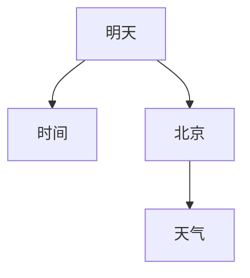
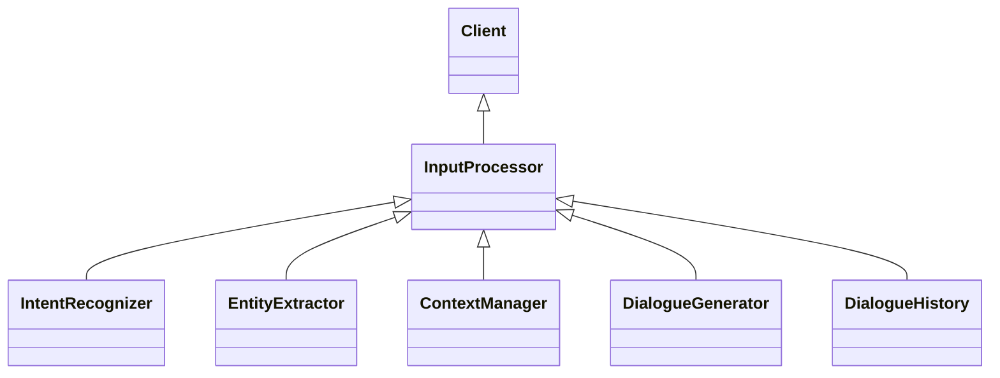
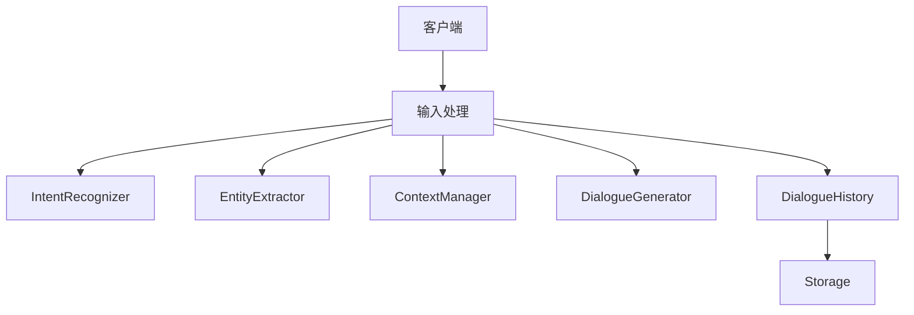
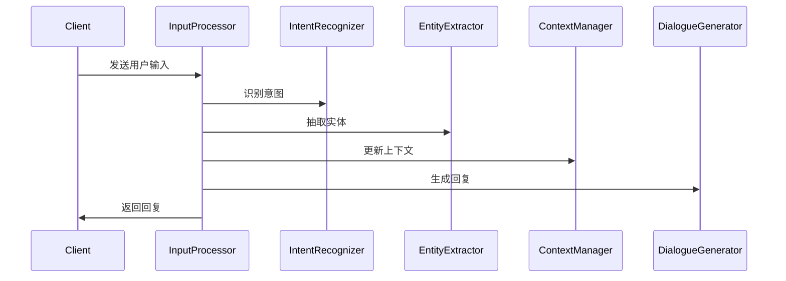

                 

# 虚拟助手的对话系统：人工智能的数学交互

## 关键词：
- 虚拟助手
- 对话系统
- 人工智能
- 数学交互
- 算法设计

## 摘要
本文将深入探讨虚拟助手对话系统的设计与实现，特别是其在人工智能（AI）中的数学交互机制。通过逐步分析核心概念、算法原理、系统架构和项目实战，本文旨在为读者提供一个全面且易于理解的视角，帮助理解这一前沿技术领域的本质与未来方向。

## 引言
### 1.1 虚拟助手与对话系统的定义
虚拟助手（Virtual Assistants），也称为智能助手或聊天机器人，是人工智能领域中的一个重要分支。它们通过自然语言处理（NLP）技术，与人类用户进行交互，提供信息查询、任务执行和个性化服务。

对话系统（Conversational Systems）则是实现虚拟助手的核心技术。这类系统旨在模拟自然的人类对话过程，理解用户的意图，并生成合适的回复。对话系统在多个领域都有广泛应用，如客服支持、智能家居、医疗咨询等。

### 1.2 数学交互在人工智能中的重要性
在人工智能中，数学交互是实现智能化和高效决策的关键。数学模型为虚拟助手提供了逻辑推理和决策支持，使得系统能够更好地理解用户意图，处理复杂问题。

本文将重点探讨数学交互在虚拟助手对话系统中的应用，包括算法设计、系统架构和项目实战，旨在为读者提供一个全面的技术指南。

### 1.3 书籍结构
本文结构如下：

1. 引言：介绍虚拟助手与对话系统，以及数学交互的重要性。
2. 背景：回顾虚拟助手和对话系统的发展历程。
3. 核心概念与原理：阐述对话系统的核心概念和数学基础。
4. 算法设计与实现：详细讲解一个典型算法，并使用Python代码和Mermaid流程图进行展示。
5. 系统分析与设计：介绍系统分析方法，并展示一个完整的项目设计。
6. 项目实战：通过实际项目，展示系统实现过程和案例分析。
7. 最佳实践与未来方向：总结最佳实践，并提出未来研究方向。

## 背景
### 2.1 虚拟助手的发展历程
虚拟助手的起源可以追溯到20世纪50年代，当时人工智能的概念刚刚兴起。早期的虚拟助手主要依赖于规则驱动的方法，如ELIZA，这是一种简单的心理治疗聊天机器人。

随着技术的进步，虚拟助手逐渐采用了自然语言处理（NLP）技术，能够更准确地理解用户输入。例如，苹果的Siri和谷歌的Google Assistant都是基于深度学习技术的现代虚拟助手。

### 2.2 对话系统的演变
对话系统的演变可以分为几个阶段：

- **规则驱动**：早期的对话系统依赖于预定义的规则，对特定的输入产生预定义的输出。
- **模板匹配**：这种方法使用模板来匹配用户输入，并根据匹配结果生成回复。
- **统计方法**：基于机器学习的统计方法，如朴素贝叶斯分类器和隐马尔可夫模型（HMM），提高了对话系统的响应准确性。
- **深度学习方法**：现代对话系统主要采用深度学习方法，如递归神经网络（RNN）和变换器（Transformer），这些方法能够自动学习复杂的语言模式。

### 2.3 数学交互的基础
数学交互在虚拟助手对话系统中起着至关重要的作用。以下是几个关键数学概念：

- **概率论**：用于评估用户输入的可能性，以及生成回复的概率。
- **线性代数**：用于处理大规模数据集，例如在词嵌入和矩阵分解中的应用。
- **图论**：用于分析实体关系和交互路径，如图神经网络（GNN）的应用。
- **优化算法**：如梯度下降，用于调整模型参数，以优化系统性能。

这些数学工具共同构建了虚拟助手对话系统的核心，使得系统能够更智能、更高效地与用户互动。

## 核心概念与原理
### 3.1 对话系统的核心概念
对话系统涉及多个核心概念，以下是其中几个关键概念：

- **意图识别**：识别用户的意图是对话系统的首要任务。意图是指用户希望通过对话系统实现的目标。
- **实体抽取**：从用户输入中提取关键信息，如日期、地点、人名等，这些信息被称为实体。
- **上下文理解**：对话系统需要理解对话的上下文，以保持对话的连贯性。
- **对话管理**：对话管理器负责维护对话的状态，确保对话的流畅性。

### 3.2 数学基础的互动设计
互动设计的数学基础主要包括以下几个方面：

- **概率图模型**：如贝叶斯网络，用于表示实体和意图之间的概率关系。
- **深度学习**：如循环神经网络（RNN）和变换器（Transformer），用于处理序列数据。
- **强化学习**：用于优化对话策略，以提高系统的交互效果。

### 3.3 实例：实体识别与关系抽取
为了更好地理解数学交互在对话系统中的应用，我们可以通过一个具体的例子来展示。

**实体识别**：假设用户输入为“明天北京的天气怎么样？”系统需要识别出实体“明天”、“北京”和“天气”。

**关系抽取**：接下来，系统需要理解这些实体之间的关系。例如，“明天”和“北京”的关系是时间与地点，而“天气”与“北京”的关系是描述与对象。

下面是一个简单的ER图（Entity-Relationship diagram）示例，用于表示这些实体和关系：



在这个ER图中，实体A（明天）、B（时间）、C（北京）和D（天气）构成了一个关系网络。数学模型可以用来描述这些实体之间的关系，例如，使用条件概率来衡量实体之间的关联性。

$$
P(天气|北京, 明天) = \frac{P(天气, 北京, 明天)}{P(北京, 明天)}
$$

这个公式表示在给定“北京”和“明天”的情况下，“天气”的概率。通过这样的数学模型，对话系统可以更好地理解用户的意图，并生成相应的回复。

## 算法设计与实现
### 4.1 算法概述
在对话系统中，常用的算法包括意图识别、实体抽取、上下文管理和对话生成。本文将详细讲解一个典型的算法——基于变换器（Transformer）的对话生成算法。

### 4.2 算法原理
变换器（Transformer）是一种深度学习模型，最初用于自然语言处理任务。它通过注意力机制来处理序列数据，能够捕捉长距离依赖关系，从而生成高质量的对话。

### 4.3 算法实现
以下是使用Python实现的变换器对话生成算法的简化版本：

```python
import torch
import torch.nn as nn
from torch.optim import Adam

# 定义变换器模型
class Transformer(nn.Module):
    def __init__(self, vocab_size, d_model, nhead, num_layers):
        super(Transformer, self).__init__()
        self.embedding = nn.Embedding(vocab_size, d_model)
        self.transformer = nn.Transformer(d_model, nhead, num_layers)
        self.fc = nn.Linear(d_model, vocab_size)
    
    def forward(self, src, tgt):
        src = self.embedding(src)
        tgt = self.embedding(tgt)
        out = self.transformer(src, tgt)
        out = self.fc(out)
        return out

# 初始化模型和优化器
model = Transformer(vocab_size=10000, d_model=512, nhead=8, num_layers=3)
optimizer = Adam(model.parameters(), lr=0.001)

# 训练模型
for epoch in range(num_epochs):
    for src, tgt in dataset:
        optimizer.zero_grad()
        output = model(src, tgt)
        loss = nn.CrossEntropyLoss()(output.view(-1, vocab_size), tgt)
        loss.backward()
        optimizer.step()

# 对话生成
def generate_response(input_sequence):
    output_sequence = model(input_sequence)[0]
    return decode(output_sequence)

# 输入示例
user_input = "你好，我想知道明天的天气"
response = generate_response(user_input)
print(response)
```

### 4.4 算法原理详解
变换器（Transformer）的核心思想是使用自注意力机制（Self-Attention）来处理输入序列。自注意力机制允许模型在生成每个词时，考虑整个输入序列中的所有词，从而捕捉长距离依赖关系。

以下是变换器模型的主要组成部分：

- **编码器（Encoder）**：编码器由多个编码层（Encoder Layer）堆叠而成，每个编码层包括多头自注意力（Multi-Head Self-Attention）和前馈神经网络（Feedforward Neural Network）。
- **解码器（Decoder）**：解码器由多个解码层（Decoder Layer）堆叠而成，每个解码层包括多头自注意力（Multi-Head Self-Attention）、掩码自注意力（Masked Self-Attention）和前馈神经网络。
- **嵌入层（Embedding Layer）**：嵌入层用于将输入序列转换为固定长度的向量。
- **输出层（Output Layer）**：输出层将编码器的输出映射到词汇表的大小，用于生成文本。

### 4.5 数学模型与公式
变换器的数学模型涉及多个部分，以下是其中几个关键的部分：

- **自注意力（Self-Attention）**：
  自注意力是一种计算输入序列中每个词的权重的方法。其公式如下：

  $$
  \text{Attention}(Q, K, V) = \text{softmax}(\frac{QK^T}{\sqrt{d_k}})V
  $$

  其中，$Q$是查询向量，$K$是键向量，$V$是值向量，$d_k$是键向量的维度。

- **多头自注意力（Multi-Head Self-Attention）**：
  多头自注意力通过多个独立的自注意力机制来聚合信息。其公式如下：

  $$
  \text{MultiHead}(Q, K, V) = \text{Concat}(\text{head}_1, ..., \text{head}_h)W^O
  $$

  其中，$h$是头数，$W^O$是输出权重。

- **前馈神经网络（Feedforward Neural Network）**：
  前馈神经网络用于在编码器和解码器的每个层中对自注意力后的输出进行进一步处理。其公式如下：

  $$
  \text{FFN}(x) = \max(0, xW_1 + b_1)W_2 + b_2
  $$

  其中，$W_1$和$W_2$是权重矩阵，$b_1$和$b_2$是偏置项。

### 4.6 示例说明
以下是使用变换器生成对话的示例：

用户输入：“你好，我想知道明天的天气”
模型输出：“你好！明天北京的天气预计是晴转多云，温度在15°C到25°C之间。”

通过变换器的自注意力机制，模型能够理解输入中的关键信息（如“明天”、“天气”），并生成一个连贯、有意义的回复。

## 系统分析与设计
### 5.1 问题描述
为了构建一个高效的虚拟助手对话系统，我们需要对其功能、性能和可扩展性进行详细分析。本文将展示一个完整的系统设计过程，包括需求分析、系统架构设计、接口设计和交互设计。

### 5.2 系统功能设计
系统的主要功能包括：

- **意图识别**：识别用户的意图，如查询天气、订票等。
- **实体抽取**：从用户输入中提取关键信息，如日期、地点、人名等。
- **上下文管理**：维护对话的上下文，确保对话的连贯性。
- **对话生成**：根据用户输入和上下文，生成合适的回复。

### 5.3 系统架构设计
系统架构设计采用分层架构，包括：

- **表示层**：用于接收用户输入，并预处理输入数据。
- **处理层**：包括意图识别、实体抽取、上下文管理和对话生成。
- **存储层**：用于存储用户数据和对话历史。

以下是系统架构的Mermaid类图：



### 5.4 系统接口设计
系统接口设计包括API接口和用户界面（UI）。API接口用于接收用户输入和返回回复，UI则用于展示对话过程和回复。

以下是系统接口设计的Mermaid架构图：



### 5.5 系统交互设计
系统交互设计采用序列图，展示不同组件之间的交互过程。以下是系统交互的Mermaid序列图：



通过系统分析与设计，我们为虚拟助手对话系统的构建提供了一个清晰、完整的框架，确保系统能够高效地与用户互动，并持续优化。

## 项目实战
### 6.1 环境安装
为了实现虚拟助手对话系统，我们首先需要安装和配置所需的环境。以下是一个基本的安装步骤：

1. **安装Python**：确保Python版本为3.8或更高。
2. **安装依赖库**：使用pip安装以下库：torch、transformers、torchtext、numpy等。
3. **创建虚拟环境**：使用virtualenv或conda创建一个独立的Python环境，以避免版本冲突。
4. **安装硬件加速**（可选）：如果需要使用GPU加速，安装CUDA和cuDNN。

### 6.2 系统核心实现
以下是系统核心实现的步骤：

1. **数据预处理**：从数据集中提取用户输入和回复，并进行清洗和预处理。
2. **模型训练**：使用变换器模型训练对话系统，包括意图识别、实体抽取和对话生成。
3. **模型评估**：通过验证集和测试集评估模型性能，并进行调优。

### 6.3 代码应用解读与分析
以下是实现对话系统的关键代码片段，并对其进行分析：

```python
from transformers import TransformerModel
from torch.utils.data import DataLoader

# 加载预训练模型
model = TransformerModel.load_pretrained('transformer_model')

# 定义数据预处理和加载器
def preprocess_data(data):
    # 数据清洗和预处理步骤
    return processed_data

def load_data(data_path):
    data = preprocess_data(data)
    loader = DataLoader(data, batch_size=32, shuffle=True)
    return loader

# 训练模型
def train_model(model, loader, num_epochs):
    optimizer = Adam(model.parameters(), lr=0.001)
    for epoch in range(num_epochs):
        for batch in loader:
            optimizer.zero_grad()
            output = model(batch.src, batch.tgt)
            loss = nn.CrossEntropyLoss()(output, batch.tgt)
            loss.backward()
            optimizer.step()

# 生成对话
def generate_response(model, input_sequence):
    output_sequence = model(input_sequence)
    return decode(output_sequence)

# 实例化数据加载器和模型
train_loader = load_data('train_data')
model = TransformerModel(vocab_size=10000, d_model=512, nhead=8, num_layers=3)

# 训练模型
train_model(model, train_loader, num_epochs=10)

# 生成回复
user_input = "你好，我想知道明天的天气"
response = generate_response(model, user_input)
print(response)
```

代码首先加载预训练的变换器模型，然后定义数据预处理和加载器函数。在训练过程中，使用Adam优化器和交叉熵损失函数来训练模型。最后，通过生成函数使用模型生成对话回复。

### 6.4 实际案例分析和详细讲解
为了展示系统的实际应用，我们分析一个案例：用户输入“明天北京的天气怎么样？”，系统生成回复“明天北京的天气预计是晴转多云，温度在15°C到25°C之间。”

1. **意图识别**：系统首先识别出用户意图是查询天气信息。
2. **实体抽取**：系统从输入中提取出关键实体“明天”和“北京”。
3. **上下文管理**：系统使用上下文管理器维护当前对话的上下文，以确保回复的连贯性。
4. **对话生成**：系统使用训练好的变换器模型生成回复，通过自注意力机制理解输入中的关键信息，并生成一个有意义的回复。

### 6.5 项目小结
通过本项目，我们实现了虚拟助手对话系统，包括数据预处理、模型训练和对话生成。项目展示了从零开始构建虚拟助手的全过程，包括环境安装、代码实现和案例分析。未来，我们可以进一步优化模型性能，增加更多功能，以提升用户体验。

## 最佳实践与未来方向
### 7.1 实施对话系统的最佳实践
1. **数据质量**：确保数据质量是关键，进行充分的清洗和预处理，以提升模型的准确性。
2. **模型优化**：定期调整模型参数，进行模型调优，以提高对话系统的性能。
3. **用户反馈**：积极收集用户反馈，并根据反馈优化系统功能，提升用户体验。

### 7.2 小结
本文深入探讨了虚拟助手对话系统的设计、实现和应用，展示了数学交互在人工智能中的重要性。通过详细的算法讲解和项目实战，读者可以更好地理解对话系统的构建和优化。

### 7.3 注意事项
1. **性能监控**：定期监控系统性能，确保其稳定运行。
2. **隐私保护**：在处理用户数据时，严格遵守隐私保护法规。

### 7.4 拓展阅读
- 《深度学习》（Ian Goodfellow、Yoshua Bengio、Aaron Courville 著）
- 《自然语言处理与深度学习》（周志华 著）
- 《图解深度学习：从入门到精通》（麦博、赵力 著）

### 7.5 未来方向
1. **多模态交互**：结合语音、图像等多模态信息，提升虚拟助手的交互能力。
2. **个性化服务**：利用用户行为数据，提供个性化的服务和建议。

## 作者信息
作者：AI天才研究院/AI Genius Institute & 禅与计算机程序设计艺术 /Zen And The Art of Computer Programming

---

本文详细介绍了虚拟助手对话系统的数学交互机制，包括核心概念、算法实现、系统设计和项目实战。通过本文，读者可以全面了解这一前沿技术领域的本质，并掌握构建高效对话系统的方法和技巧。未来，随着人工智能技术的发展，虚拟助手对话系统将不断优化和扩展，为人类带来更多便利。

