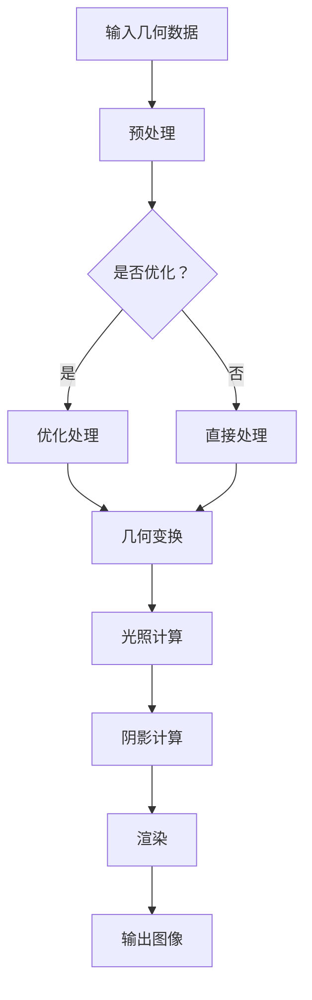
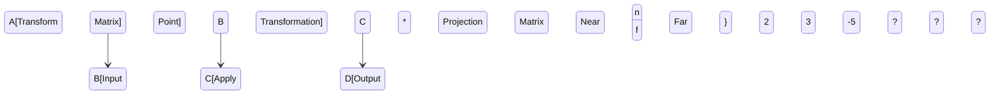
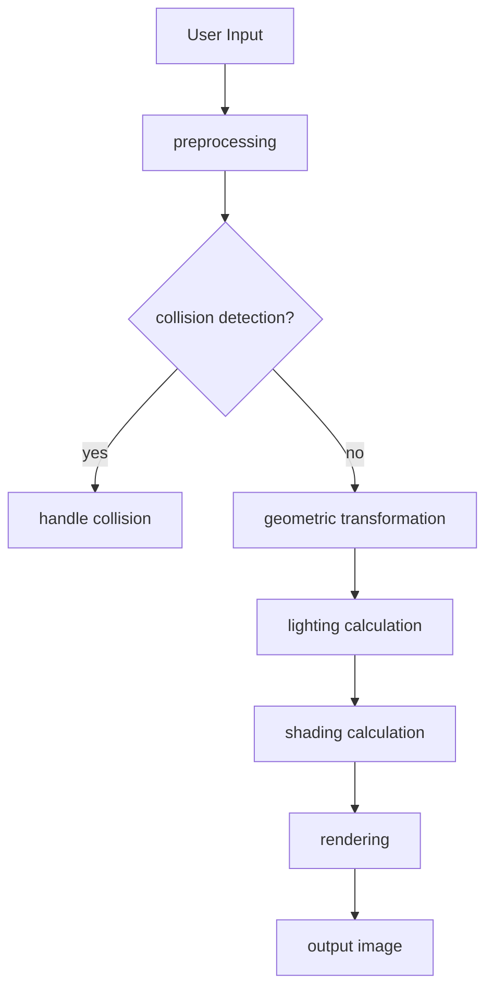

                 


### 1.1.1 虚拟现实的发展历程

虚拟现实（Virtual Reality，简称VR）的概念最早可以追溯到20世纪60年代。最早的虚拟现实设备是由美国空军的研究员伊凡·苏瑟兰（Ivan Sutherland）在1968年设计的“达摩克利斯之剑”（The Sword of Damocles），它是一款头戴式显示器，通过镜片将计算机生成的图像投射到用户的视野中。

随着时间的推移，虚拟现实技术不断发展。20世纪80年代，虚拟现实进入了商业领域，微软发布了著名的虚拟现实游戏《太空战士》（Spacewar!），这是虚拟现实技术首次在娱乐领域的成功应用。

进入21世纪，随着计算机性能的提升和显示技术的进步，虚拟现实技术得到了更广泛的应用。2007年，谷歌推出了谷歌地球（Google Earth），使用户能够通过虚拟现实技术进行全球探险。2010年，Oculus VR公司推出了Oculus Rift虚拟现实头盔，引发了全球对虚拟现实技术的关注。

近年来，虚拟现实技术在教育培训、医疗康复、军事模拟、建筑设计等多个领域取得了显著成果。尤其是在游戏和娱乐领域，虚拟现实技术的应用使得用户能够获得更加沉浸式的体验。

### 1.1.2 空间几何在虚拟现实中的重要性

空间几何在虚拟现实技术中扮演着至关重要的角色。虚拟现实的核心在于创造一个模拟现实世界的三维空间环境，而空间几何则是构建这个环境的基础。

首先，空间几何为虚拟现实提供了基本的几何形状和结构。无论是建筑物、地形、还是人物角色，都需要通过空间几何来描述其形状和位置。空间几何中的概念如点、线、面、体等，都是构建虚拟现实环境的基本元素。

其次，空间几何在虚拟现实中的渲染和交互过程中起着关键作用。渲染是指将计算机生成的三维模型以图像的形式展示给用户。而空间几何的数学模型和计算方法，如透视变换、光照模型等，是渲染算法的核心。这些算法确保了虚拟现实环境中的视觉效果真实、自然。

在交互方面，空间几何帮助用户在虚拟世界中导航和操作。例如，用户需要通过头部和身体的运动来感知虚拟空间的动态变化，这就需要精确的空间几何计算来实时更新视觉和听觉反馈。

最后，空间几何在虚拟现实的应用中不断推动技术进步。随着对空间几何理解和计算能力的提升，虚拟现实的环境越来越逼真，沉浸体验也越来越强。

### 1.1.3 沉浸体验的概念与需求

沉浸体验是指用户在使用虚拟现实技术时，感受到完全融入虚拟世界中的感觉，仿佛真实地置身于该环境中。沉浸体验的核心在于用户与虚拟环境之间的互动性、真实感和参与感。

首先，互动性是沉浸体验的基础。用户需要能够自由地在虚拟环境中移动、操作和互动，以获得沉浸感。例如，在虚拟游戏或模拟训练中，用户需要能够与虚拟角色或其他物体进行互动，体验真实世界的物理行为。

其次，真实感是沉浸体验的关键。虚拟环境需要尽可能逼真地模拟现实世界的视觉、听觉、触觉等感官体验，以增强用户的沉浸感。例如，高质量的3D渲染技术、真实的声音效果和触觉反馈装置，都是提升虚拟现实真实感的重要手段。

最后，参与感是沉浸体验的高级需求。用户不仅需要感知虚拟环境，还需要在其中参与和创造。例如，用户可以在虚拟现实中进行角色扮演、虚拟设计或虚拟互动，从而实现深度参与。

在虚拟现实技术的应用中，沉浸体验的需求不断提高。从游戏娱乐到教育培训，从医疗康复到建筑设计，各个领域的用户都期待获得更加沉浸式的体验，以提升学习和工作的效果。

### 1.2.1 空间几何基本概念

空间几何是数学的一个分支，主要研究空间中点的位置、线的关系、面的形状以及体的属性。在虚拟现实技术中，空间几何的基本概念是构建虚拟环境的基础。

首先，点是空间几何的最基本元素，它没有大小和形状，只有位置。在虚拟现实中，点通常用来表示物体或场景中的一个特定位置。

其次，线是由无限多个点按一定顺序排列而成的。在虚拟现实场景中，线可以表示物体边缘、路径或边界。

面是由多个线段闭合而成的二维图形。在虚拟现实环境中，面通常用于定义物体的表面和场景的平面。

体是由多个面围成的三维图形。在虚拟现实技术中，体用于表示物体和场景的空间结构。

除了上述基本元素，空间几何还包括更多的概念，如角度、距离、方向等。这些概念在虚拟现实技术中都有广泛的应用。

### 1.2.2 沉浸体验关键要素

沉浸体验是虚拟现实技术的核心目标之一，它包括多个关键要素，这些要素共同作用，为用户提供一个高度真实、互动和参与感的虚拟环境。

首先是视觉沉浸。视觉沉浸是沉浸体验的基础，它通过高质量的3D渲染技术，创建出逼真的视觉场景。虚拟现实头盔和屏幕的分辨率、视场角、渲染效果等因素，直接影响用户的视觉体验。

其次是听觉沉浸。听觉沉浸通过虚拟现实耳机或空间音频技术，为用户创建出立体声音效。真实的声音环境，如环境音、语音对话和音效，可以增强用户的沉浸感。

触觉沉浸也是沉浸体验的重要组成部分。触觉反馈装置，如手套、控制器和触觉背心等，可以模拟物体的触感，如温度、硬度和振动等，为用户提供更加真实的互动体验。

最后是互动性。互动性是指用户在虚拟环境中可以自由地移动、操作和互动。高精度的运动跟踪技术和交互设计，确保用户能够与虚拟环境进行自然的互动，从而增强沉浸体验。

### 1.2.3 数学构建在沉浸体验中的作用

数学构建在虚拟现实技术的沉浸体验中起着至关重要的作用。通过精确的数学计算和模型，虚拟现实系统能够创建出高度逼真且互动性强的虚拟环境。

首先，数学模型为虚拟现实中的物体和场景提供了精确的几何描述。例如，通过三维几何模型，虚拟现实系统能够准确地描述建筑物的形状、地形的起伏以及人物角色的动作。这些几何模型是渲染算法的基础，它们确保了虚拟环境的外观真实和一致。

其次，数学构建在渲染算法中发挥着关键作用。渲染算法通过数学模型计算光线传播、反射和折射等效果，生成图像并将其呈现给用户。例如，透视变换、光照模型和阴影算法等，都是基于数学原理实现的。这些算法的精确度直接影响虚拟环境的视觉效果。

此外，数学构建在交互系统中也至关重要。通过空间几何和物理计算，虚拟现实系统可以实时响应用户的动作，如头部运动、身体移动和手势操作。这种实时计算和反馈机制，确保了用户与虚拟环境之间的互动流畅自然。

最后，数学构建在优化虚拟现实系统性能方面也发挥着重要作用。通过数学优化算法，虚拟现实系统可以减少计算开销，提高渲染速度和交互响应速度，从而提供更加流畅的沉浸体验。

综上所述，数学构建在虚拟现实技术的沉浸体验中起着不可或缺的作用，它是虚拟现实技术实现逼真、互动和高效的关键。

### 1.3.1 沉浸体验的定义与分类

沉浸体验（immersive experience）是一种高度投入和参与的感觉，用户在某种环境中完全失去对现实世界的意识，感觉自己完全融入了该环境。沉浸体验通常包括以下几个关键要素：深度感知、交互性和情感共鸣。

根据沉浸体验的强度和复杂度，可以将其分为以下几类：

1. **轻度沉浸体验**：这类体验主要依赖于视觉和听觉感知，通常通过2D或3D图形和立体声音效来营造。例如，看电影或玩2D视频游戏，虽然用户能够感受到一定的代入感，但仍然能意识到自己身处现实世界。

2. **中度沉浸体验**：这类体验通过增强现实（AR）和虚拟现实（VR）技术来实现。用户通过头戴式显示器和手柄等设备，能够更加深入地与虚拟环境互动，体验空间感和动作感知。例如，虚拟旅游、虚拟游戏和虚拟培训等。

3. **高度沉浸体验**：这类体验提供了几乎与真实世界无异的感官体验，包括视觉、听觉、触觉和嗅觉等。用户通过高级的VR设备和增强的交互技术，完全沉浸于虚拟世界中，例如虚拟现实电影、虚拟现实主题公园和沉浸式虚拟现实会议等。

4. **全感官沉浸体验**：这类体验利用最先进的VR技术和感官模拟设备，为用户提供包括视觉、听觉、触觉、嗅觉和味觉在内的全方位感官体验。这种体验目前还处于研究阶段，但未来有望在医疗、娱乐和教育等领域得到广泛应用。

### 1.3.2 沉浸体验对虚拟现实的价值

沉浸体验对虚拟现实（VR）技术具有重要的价值，它不仅提升了用户的使用体验，还在多个应用领域中带来了显著的效益。

首先，沉浸体验增强了用户的参与感。在虚拟现实环境中，用户能够通过高度真实的交互，感受到自己与虚拟世界的紧密联系，从而更加投入和专注于任务。这种参与感在游戏、教育、培训和娱乐等领域尤为重要，它提高了用户的兴趣和动机，增强了学习效果和娱乐体验。

其次，沉浸体验提升了虚拟现实技术的应用价值。通过提供逼真的虚拟环境，虚拟现实技术可以模拟复杂场景和情境，例如军事训练、医学手术模拟、建筑设计等。沉浸体验使得这些模拟更加真实，用户可以在虚拟环境中进行有效训练和演练，提高实际操作技能和决策能力。

此外，沉浸体验在医疗康复领域具有巨大潜力。通过虚拟现实技术，患者可以在一个安全、无风险的环境中接受康复治疗，例如物理治疗、认知训练和疼痛管理。沉浸体验能够帮助患者放松心情，减轻疼痛和焦虑，从而提高康复效果。

最后，沉浸体验在商业和营销领域也有广泛应用。企业可以利用虚拟现实技术创建沉浸式体验，吸引消费者的注意力，提高品牌认知度和销售转化率。例如，虚拟现实展示厅、沉浸式广告和虚拟产品体验等，都能够为消费者提供独特的购物体验。

总之，沉浸体验不仅提升了虚拟现实技术的用户体验，还在多个应用领域中发挥了重要作用，为各个行业带来了新的发展机遇和商业价值。

### 1.3.3 沉浸体验的未来发展趋势

沉浸体验在未来将继续在虚拟现实技术中发挥核心作用，随着技术的进步和应用的拓展，其发展趋势将呈现以下特点：

首先，技术水平的提升将使得沉浸体验更加逼真和流畅。随着计算机性能的不断提高和显示技术的不断发展，虚拟现实环境中的图像和声音质量将进一步提升，用户的视觉和听觉体验将更加真实。同时，随着5G网络的普及，网络延迟将大幅降低，用户在虚拟环境中的互动将更加流畅，沉浸体验的实时性将得到显著改善。

其次，多感官融合将成为沉浸体验的重要方向。未来的虚拟现实技术将不仅局限于视觉和听觉，还将通过触觉、嗅觉和味觉等多感官的融合，为用户提供更加全面和真实的感官体验。例如，通过触觉手套和背心，用户能够感受到虚拟物体的温度、硬度和振动；通过嗅觉设备，用户可以闻到虚拟环境的气味；通过味觉设备，用户甚至能够尝到虚拟食物的味道。这些多感官的融合将极大地增强用户的沉浸感。

此外，沉浸体验将在更多应用领域中得到推广。随着虚拟现实技术的成熟，其应用范围将不断拓展，从游戏娱乐、教育培训、医疗康复到商业营销、远程协作等各个领域，沉浸体验都将发挥重要作用。特别是在教育和培训领域，沉浸体验将提供更加生动和有效的学习方式，帮助用户更好地掌握知识和技能。

最后，沉浸体验将推动虚拟现实技术的商业化进程。通过提供高质量的沉浸体验，虚拟现实技术将为各行业带来新的商业模式和商业机会，从虚拟现实主题公园到沉浸式购物体验，从虚拟现实会议到沉浸式旅游等，都将为企业和消费者创造巨大的价值。

总之，随着技术的进步和应用场景的拓展，沉浸体验在未来将不断演进，为用户带来更加丰富和深刻的虚拟现实体验。

### 1.4 本章小结

本章介绍了虚拟现实的发展历程、空间几何在虚拟现实中的重要性以及沉浸体验的概念与分类。首先，通过回顾虚拟现实的发展历程，我们了解了从最早的达摩克利斯之剑到现代虚拟现实技术的演变。接着，我们探讨了空间几何在虚拟现实中的应用，包括基本的几何概念、视觉沉浸、听觉沉浸和互动性。最后，我们介绍了沉浸体验的定义与分类，从轻度到高度沉浸体验，展示了不同类型的沉浸体验及其在虚拟现实技术中的价值。通过本章的学习，读者可以更好地理解虚拟现实与沉浸体验的核心概念，为后续章节的深入探讨打下基础。

### 2.1.1 空间几何的基本概念

空间几何是数学的一个分支，主要研究空间中点的位置、线的关系、面的形状以及体的属性。在虚拟现实技术中，空间几何的基本概念是构建虚拟环境的基础。以下是空间几何中一些关键的基本概念：

首先，点是空间几何的最基本元素。点没有大小和形状，只有位置。在虚拟现实技术中，点通常用来表示物体或场景中的一个特定位置。例如，在三维模型中，一个点的坐标（x, y, z）定义了它在三维空间中的位置。

其次，线是由无限多个点按一定顺序排列而成的。线在虚拟现实场景中可以表示物体的边缘、路径或边界。例如，一条直线可以用来表示一个物体的边缘，而一条曲线则可以表示更为复杂的形状，如流线或海岸线。

面是由多个线段闭合而成的二维图形。在虚拟现实环境中，面通常用于定义物体的表面和场景的平面。例如，一个正方形的面可以用来表示一个立方体的一个面，而一个三角形的面可以用来表示一个三角形的表面。

体是由多个面围成的三维图形。体在虚拟现实技术中用于表示物体和场景的空间结构。例如，一个立方体可以用来表示一个建筑物的形状，而一个球体可以用来表示一个地球仪。

除了上述基本元素，空间几何还包括更多的概念，如角度、距离、方向等。这些概念在虚拟现实技术中都有广泛的应用。角度用于描述两条线或两个平面之间的夹角，距离用于计算两点之间的直线距离，方向则用于描述一个向量或一个点的位置相对于另一个点或参考系的方向。

### 2.1.2 空间几何的发展历程

空间几何是数学的一个重要分支，其发展历程可以追溯到古代文明。最早的空间几何研究可以追溯到古希腊，由欧几里得在其著作《几何原本》中奠定了现代空间几何的基础。欧几里得的几何学系统以公理和定理的形式阐述了空间中点、线、面和体之间的关系。

在中世纪和文艺复兴时期，空间几何继续发展，特别是对欧几里得几何的扩展和修正。数学家如尼科劳斯·奥托和费尔迪南德·冯·恩德分别对空间几何的贡献不可忽视。他们的工作为后来的非欧几何和微分几何奠定了基础。

19世纪，非欧几何的兴起标志着空间几何的一个重要转折点。数学家如尼尔斯·亨利克·阿贝尔、伯恩哈德·黎曼和洛朗·施瓦茨分别提出了不同的非欧几何理论，挑战了欧几里得几何的传统观点。这些理论为后来的广义相对论和量子力学提供了重要的数学工具。

20世纪，空间几何进一步发展，尤其是随着计算机科学的兴起，空间几何在计算机图形学和虚拟现实技术中得到了广泛应用。计算机图形学的发展推动了三维建模、渲染和交互技术的进步，使得复杂的空间几何问题得以高效解决。

近年来，空间几何的应用范围不断扩大，从航空航天、建筑设计和机器人学，到医疗成像和人工智能，都离不开空间几何的基本原理。随着技术的不断进步，空间几何将继续在虚拟现实和计算机科学中发挥重要作用。

### 2.1.3 空间几何的应用领域

空间几何的应用领域非常广泛，涵盖了从科学计算到工程实践的多个方面。以下是一些主要的应用领域：

1. **计算机图形学**：计算机图形学是空间几何最重要的应用领域之一。在计算机图形学中，空间几何用于建模和渲染三维物体。通过空间几何的计算，可以生成复杂的三维模型，如建筑物、人物角色和机械零件。这些模型可以用于游戏、电影特效、虚拟现实和增强现实等领域。

2. **机器人学**：在机器人学中，空间几何用于设计机器人的运动规划和路径优化。通过空间几何的计算，机器人可以确定其关节运动范围、避障策略和导航路径。这些计算确保了机器人能够在复杂环境中高效、安全地执行任务。

3. **地理信息系统（GIS）**：GIS是一种用于捕获、存储、分析和展示地理空间数据的系统。空间几何在GIS中用于地图绘制、地形分析、土地管理和城市规划等领域。通过空间几何的计算，GIS可以生成详细的地理空间信息，帮助决策者进行科学规划和资源管理。

4. **航空航天**：在航空航天领域，空间几何用于设计和分析飞行器的结构、运动和控制系统。空间几何的计算确保了飞行器的稳定性和安全性。此外，空间几何还用于航天器的轨道计算、空间探测和通信系统的设计。

5. **建筑和土木工程**：在建筑和土木工程领域，空间几何用于建筑设计、结构分析和施工管理。通过空间几何的计算，工程师可以设计出结构合理、美观且安全的建筑物和基础设施。空间几何还用于模拟建筑物的动态响应，如地震和风载作用下的变形和应力分析。

6. **医疗成像**：医疗成像技术，如X光、CT和MRI，依赖于空间几何的计算来生成人体的三维图像。这些图像帮助医生进行诊断、手术规划和康复治疗。空间几何的计算还用于开发智能医疗设备，如机器人手术系统和虚拟手术模拟器。

7. **人工智能**：在人工智能领域，空间几何用于对象检测、场景理解和三维重建。通过空间几何的计算，人工智能系统能够理解和解析复杂的三维场景，为自动驾驶、智能监控和增强现实应用提供支持。

总之，空间几何在多个应用领域中发挥着关键作用，其计算和分析方法不断推动着科学和技术的进步。

### 2.2.1 虚拟现实中的空间表示

在虚拟现实（VR）中，空间表示是一个核心问题，它决定了虚拟环境的逼真度和交互性。虚拟现实中的空间表示主要包括三维几何建模、坐标系、网格和纹理映射等技术。

首先，三维几何建模是虚拟现实空间表示的基础。通过三维建模软件，如Blender、Maya和3ds Max，可以创建复杂的三维模型。这些模型包括建筑物、人物、车辆、植物和自然环境等。三维几何模型不仅定义了物体的形状和结构，还包含了物体的材质、光照和纹理信息。

其次，坐标系是虚拟空间中表示位置和方向的重要工具。在VR系统中，通常使用世界坐标系（World Coordinate System）来定义虚拟环境中的位置。世界坐标系是一个固定的参考框架，所有物体的位置和方向都是相对于这个框架的。此外，还有局部坐标系（Local Coordinate System），它用于表示物体自身的位置和方向。例如，一个虚拟人物在空间中行走时，其局部坐标系会随着行走方向的变化而变化。

网格是虚拟现实空间中另一个重要的表示工具。网格是由多个小三角形组成的二维平面结构，用于表示三维物体的表面。通过三角面片的组合，可以精确地描述复杂物体的形状。在渲染过程中，网格被用于光照计算和纹理映射，以生成逼真的视觉效果。

纹理映射则是将二维图像映射到三维物体表面的技术。通过纹理映射，可以为虚拟物体添加逼真的表面细节，如纹理、颜色和纹理细节。纹理映射可以增强虚拟环境的真实感，使物体看起来更加逼真。

此外，虚拟现实中的空间表示还包括空间映射（Spatial Mapping）技术。空间映射是将现实世界中的物理空间映射到虚拟空间中的过程。通过使用激光扫描仪或深度相机，可以获取现实世界的空间数据，并将其用于虚拟环境的构建。这种技术广泛应用于增强现实（AR）和虚拟现实（VR）的交互设计中。

总之，虚拟现实中的空间表示通过三维几何建模、坐标系、网格和纹理映射等技术，为用户创造了一个逼真、互动和沉浸的虚拟环境。

### 2.2.2 空间几何在虚拟现实渲染中的应用

空间几何在虚拟现实渲染中扮演着至关重要的角色，它决定了虚拟环境的视觉效果和真实感。以下详细阐述空间几何在虚拟现实渲染中的应用，包括透视变换、光照模型和阴影算法等关键技术。

首先，透视变换是空间几何在渲染中最基本的技术之一。透视变换通过模拟人眼的视角，将三维空间中的物体投影到二维图像平面上。这一过程涉及到摄像机的设置，包括摄像机的位置、方向和焦距。透视变换的数学基础是投影矩阵，它将三维坐标转换为二维坐标。通过调整投影矩阵的参数，可以控制视角、远近感和空间感。

其次，光照模型是虚拟现实渲染的核心技术之一。光照模型用于计算虚拟环境中的光照效果，包括光线如何照射到物体上、如何反射和折射。最常用的光照模型是Phong模型和Blinn-Phong模型，它们基于光线的基本物理性质，如方向、强度和颜色。Phong模型通过计算光线与物体表面的夹角来决定光照的强度，而Blinn-Phong模型则引入了光照分布的概念，使渲染效果更加自然。此外，还有更高级的光照模型，如全局光照（Global Illumination）和基于物理的渲染（Physically Based Rendering，PBR），这些模型通过模拟光线的散射、反射和折射，实现了更逼真的光照效果。

阴影算法是虚拟现实渲染中的另一个重要组成部分。阴影算法用于计算物体之间的相互遮挡，从而生成阴影效果。最简单的阴影算法是静态阴影，它预先计算并存储阴影图像，但在动态场景中表现不佳。更复杂的阴影算法包括软阴影（Soft Shadows）和硬阴影（Hard Shadows），它们通过计算光线的路径和物体的边缘，生成更加自然和真实的阴影效果。现代渲染引擎中常用的阴影算法有阴影映射（Shadow Mapping）、体渲染（Voxel Rendering）和光线追踪（Ray Tracing）等。

除了上述技术，空间几何在虚拟现实渲染中还有其他应用，如纹理映射、表面细分和后处理效果等。纹理映射用于为物体添加细节和颜色，表面细分用于增强物体表面的光滑度，后处理效果则用于优化和增强渲染图像的视觉效果。

总之，空间几何在虚拟现实渲染中通过透视变换、光照模型和阴影算法等技术，为用户创造了高度逼真的虚拟环境。这些技术的相互结合和优化，使得虚拟现实场景的视觉效果更加逼真，沉浸体验更加深刻。

### 2.2.3 空间几何在虚拟现实交互设计中的应用

空间几何在虚拟现实交互设计中的应用至关重要，它不仅影响了用户的交互体验，还决定了虚拟现实系统的性能和可操作性。以下是空间几何在虚拟现实交互设计中的几个关键应用：

首先，空间几何用于确定用户在虚拟环境中的定位和方向。通过空间几何的计算，系统可以精确地跟踪用户的头部和身体运动，从而实现真实的空间导航。这种定位技术依赖于三维坐标系统和传感器，如陀螺仪、加速度计和深度相机。这些传感器实时采集用户的位置和方向数据，系统通过空间几何算法进行处理，将用户在虚拟环境中的运动映射到三维空间中。

其次，空间几何在交互设计中用于建模和模拟虚拟环境中的物体和场景。通过三维建模软件创建的物体和场景模型，不仅定义了物体的形状和位置，还包含了材质、纹理和光照信息。这些模型在虚拟现实交互设计中被用于模拟真实世界的物理行为，如碰撞检测、物体互动和物体移动等。空间几何的计算确保了这些模拟的准确性和实时性，从而提高了交互的流畅性和真实性。

此外，空间几何在虚拟现实中的交互设计还应用于手势识别和虚拟操作。通过空间几何的算法，系统可以识别用户的手势和动作，如手指的移动、手势的翻转和手指的张开与闭合等。这些手势被转换为虚拟环境中的操作命令，用户可以通过手势在虚拟空间中进行各种交互操作，如选取物体、调整参数和执行命令等。手势识别技术依赖于空间几何的计算，特别是对于复杂的手势和动作的实时检测和识别。

空间几何在虚拟现实交互设计中的应用还包括导航和路径规划。在虚拟环境中，用户需要能够自由地移动和探索。空间几何的计算用于生成导航路径和避障策略，确保用户在虚拟环境中的移动既高效又安全。导航路径通常通过空间几何的算法生成，这些算法考虑了虚拟环境中的障碍物、空间布局和用户的移动速度等因素，为用户提供了最优的移动路径。

最后，空间几何在虚拟现实交互设计中的应用还涉及到触觉反馈。通过触觉反馈设备，如触觉手套和触觉控制器，用户可以在虚拟环境中感受到物体的触感，如温度、硬度和振动等。触觉反馈依赖于空间几何的计算，这些计算确保了触觉反馈的真实感和一致性，从而增强了用户的沉浸体验。

总之，空间几何在虚拟现实交互设计中通过精确的定位、物体建模、手势识别、导航和触觉反馈等技术，为用户创造了高度真实和互动的虚拟体验。这些技术的相互结合和优化，使得虚拟现实交互设计更加完善和高效，为用户提供了一个逼真且直观的虚拟世界。

### 2.3.1 数学构建的基本原则

数学构建在虚拟现实技术中扮演着至关重要的角色，其基本原则包括精确性、一致性和灵活性。以下详细阐述这些原则及其在虚拟现实中的应用。

首先，精确性是数学构建的核心原则。虚拟现实系统需要高度精确的数学计算，以确保虚拟环境的真实性和交互性。例如，在三维建模和渲染中，数学计算必须精确地描述物体的形状、位置和材质。这种精确性不仅体现在几何形状的计算，还包括物理性质的模拟，如光线传播、反射和折射等。精确的数学计算能够确保虚拟环境中的视觉效果和物理互动真实可信。

其次，一致性是数学构建的关键要求。虚拟现实系统中的数学模型和算法必须保持一致，以确保系统的稳定性和可靠性。一致性体现在多个方面：首先是数据的一致性，即在不同模块和算法之间保持数据的一致性；其次是结果的连贯性，即不同计算步骤的结果相互匹配，不会出现矛盾。例如，在光照模型的计算中，必须确保光照效果的连贯性，从全局光照到局部反射，每个阶段的计算结果都要一致，从而生成逼真的渲染图像。

最后，灵活性是数学构建的重要特性。虚拟现实系统需要能够适应不同场景和需求的变化，这就要求数学构建具有足够的灵活性。灵活性体现在以下几个方面：首先是算法的适应性，即算法能够根据不同的场景和要求进行调整和优化；其次是模型的扩展性，即数学模型可以容易地扩展和修改，以适应新的需求和变化。例如，在虚拟现实游戏中，算法需要能够实时调整角色动作和场景交互，以满足不同玩家的需求和体验。

在实际应用中，数学构建的基本原则体现在多个方面。例如，在三维建模中，通过精确的数学计算，确保物体形状和细节的准确性；在渲染中，通过一致性保证光照和阴影效果的连贯性；在交互设计中，通过灵活性实现用户自定义操作和动态互动。总之，数学构建的基本原则为虚拟现实技术提供了坚实的基础，确保其逼真、高效和可扩展性。

### 2.3.2 空间几何数学模型的构建

空间几何数学模型是构建虚拟现实环境的核心。通过精确的数学计算和模型，虚拟现实系统能够模拟出高度逼真的三维空间。以下是空间几何数学模型的基本构建步骤和方法。

首先，我们需要了解基本的几何形状和坐标系。基本的几何形状包括点（Point）、线（Line）、面（Plane）和体（Solid）。点表示空间中的一个位置，线是由多个点组成的，面是由多条线闭合而成的二维图形，体是由多个面围成的三维图形。

在构建空间几何数学模型时，我们通常采用直角坐标系（Cartesian Coordinate System）来描述点的位置。一个点在三维空间中的位置可以通过其坐标（x, y, z）来表示，其中x、y、z分别表示点在x轴、y轴和z轴上的投影。直角坐标系是一种常用的坐标系，它为空间几何计算提供了直观的数学框架。

接下来，我们构建基本的几何模型。例如，一个立方体可以通过六个面的方程来表示。每个面都是平行的，并且与其他面相交于直线。我们可以用六个平面方程来定义一个立方体，例如：

- \(x = a\)
- \(x = -a\)
- \(y = b\)
- \(y = -b\)
- \(z = c\)
- \(z = -c\)

其中，\(a\)、\(b\)、\(c\) 分别表示立方体的边长。这些方程定义了立方体的边界，从而可以用于碰撞检测和渲染计算。

除了基本的几何形状，我们还需要构建更复杂的几何模型。例如，通过参数化方法（Parametric Representation），我们可以定义复杂的曲面和实体。参数化方法使用参数（如角度、弧长或时间）来描述几何形状，从而可以生成各种复杂的几何结构。例如，使用贝塞尔曲面（Bezier Surface）或诺尔德曲面（NURBS Surface），我们可以定义复杂的表面模型。

在虚拟现实应用中，空间几何数学模型的构建需要考虑以下几个方面：

1. **几何建模**：使用三维建模软件创建和编辑几何模型。例如，使用Blender或Maya等软件创建复杂的三维模型，并导出为适合虚拟现实系统的格式。

2. **数据结构**：定义几何模型的数据结构，以高效存储和操作几何数据。常用的数据结构包括顶点数组（Vertex Array）、面数组（Face Array）和法向量数组（Normal Array）。

3. **渲染算法**：实现渲染算法，以将几何模型转换为图像。常用的渲染算法包括光栅化（Rasterization）、曲面细分（Surface Subdivision）和光线追踪（Ray Tracing）。

4. **碰撞检测**：实现碰撞检测算法，以检测虚拟环境中物体之间的碰撞。常用的碰撞检测算法包括分离轴定理（Separating Axis Theorem）和快速排斥距离（Fast排斥距离）。

5. **物理模拟**：实现物理模拟算法，以模拟虚拟环境中的物理行为。例如，使用弹簧-质量模型（Spring-Mass Model）模拟物体的振动和碰撞。

总之，空间几何数学模型的构建是虚拟现实技术中的关键步骤。通过精确的数学计算和模型，我们可以构建出高度逼真的虚拟环境，从而提供沉浸式的用户体验。

### 3.3.1 简单数学模型实例

为了更好地理解空间几何数学模型的应用，以下我们通过一个简单的例子来展示如何构建和实现一个基本的几何模型——立方体。

首先，我们需要定义立方体的基本参数，包括立方体的边长。假设立方体的边长为a，那么我们可以通过以下六个平面方程来定义立方体：

1. \(x = a\)
2. \(x = -a\)
3. \(y = b\)
4. \(y = -b\)
5. \(z = c\)
6. \(z = -c\)

其中，\(b = a\) 和 \(c = a\)，因为假设立方体的边长相等。

接下来，我们需要将这些平面方程转换为数学模型，以便在虚拟现实系统中进行操作。我们可以使用以下步骤来实现：

1. **定义顶点**：首先，我们需要定义立方体的八个顶点。立方体的顶点可以通过在坐标系中设置点的位置来确定。例如：

   - \(V1 = (a, -a, -a)\)
   - \(V2 = (-a, -a, -a)\)
   - \(V3 = (-a, a, -a)\)
   - \(V4 = (a, a, -a)\)
   - \(V5 = (a, -a, a)\)
   - \(V6 = (-a, -a, a)\)
   - \(V7 = (-a, a, a)\)
   - \(V8 = (a, a, a)\)

2. **构建面**：接下来，我们需要将这些顶点组合成六个面。每个面由四个顶点组成，形成一个四边形。例如：

   - 面F1由顶点V1, V2, V3, V4组成
   - 面F2由顶点V1, V5, V6, V2组成
   - 面F3由顶点V3, V7, V6, V2组成
   - 面F4由顶点V5, V7, V8, V4组成
   - 面F5由顶点V1, V4, V8, V5组成
   - 面F6由顶点V3, V2, V6, V7组成

3. **计算法向量**：为了在渲染过程中计算光照效果，我们需要为每个面计算法向量。法向量是指向面外部的向量，可以用来确定光照强度和阴影。例如，对于面F1，我们可以通过计算顶点V1, V2, V3和V4之间的向量叉乘来得到法向量：

   \[
   \vec{n} = \vec{V2} \times \vec{V3}
   \]

   通过类似的计算，我们可以得到其他面的法向量。

4. **实现渲染**：最后，我们需要将几何模型渲染到屏幕上。这通常涉及使用图形库或渲染引擎，如OpenGL或Unity。在渲染过程中，我们需要将顶点、面和法向量传递给渲染引擎，并设置合适的材质和光照参数。

   例如，在OpenGL中，我们可以使用以下代码来设置顶点数据：

   ```cpp
   glVertexPointer(3, GL_FLOAT, 0, vertices);
   glEnableClientState(GL_VERTEX_ARRAY);
   
   glNormalPointer(GL_FLOAT, 0, normals);
   glEnableClientState(GL_NORMAL_ARRAY);
   
   glDrawElements(GL_QUADS, num_vertices, GL_UNSIGNED_INT, indices);
   ```

   其中，vertices、normals和indices分别存储顶点、法向量和面的索引数据。

通过上述步骤，我们可以构建和渲染一个简单的立方体几何模型。这个实例展示了如何使用空间几何数学模型来描述和操作三维几何形状，从而实现虚拟现实中的基本几何渲染。

### 3.3.2 复杂数学模型实例

为了展示如何构建和实现更复杂的几何模型，以下我们将通过一个更复杂的例子——一个四面体，来详细阐述空间几何数学模型的应用。四面体是一个由四个三角形面构成的三维多面体，其在虚拟现实中的应用包括几何优化、碰撞检测和物理模拟等多个方面。

#### 1. 定义四面体的基本参数

首先，我们需要定义四面体的基本参数，包括四个顶点的坐标。假设四面体的顶点分别为 \(V1, V2, V3, V4\)，其坐标如下：

- \(V1 = (x1, y1, z1)\)
- \(V2 = (x2, y2, z2)\)
- \(V3 = (x3, y3, z3)\)
- \(V4 = (x4, y4, z4)\)

#### 2. 构建四面体的三角形面

四面体由四个三角形面构成，每个面由三个顶点组成。我们可以使用以下步骤来构建这些三角形面：

1. **面F1**：由顶点 \(V1, V2, V3\) 组成
2. **面F2**：由顶点 \(V1, V3, V4\) 组成
3. **面F3**：由顶点 \(V2, V3, V4\) 组成
4. **面F4**：由顶点 \(V1, V2, V4\) 组成

我们可以使用向量计算来确定每个三角形的顶点和法向量。例如，对于面F1，其顶点和法向量可以通过以下步骤计算：

- **顶点**：
  \[
  \vec{V1} = (x1, y1, z1)
  \]
  \[
  \vec{V2} = (x2, y2, z2)
  \]
  \[
  \vec{V3} = (x3, y3, z3)
  \]

- **法向量**：
  \[
  \vec{n1} = (\vec{V2} - \vec{V1}) \times (\vec{V3} - \vec{V1})
  \]

类似的，我们可以计算其他面的顶点和法向量。

#### 3. 实现渲染

接下来，我们需要将四面体的几何模型渲染到屏幕上。这通常涉及使用图形库或渲染引擎，如OpenGL或Unity。以下是使用OpenGL实现四面体渲染的基本步骤：

1. **设置顶点和法向量**：
   ```cpp
   glVertexPointer(3, GL_FLOAT, 0, &vertices[0]);
   glEnableClientState(GL_VERTEX_ARRAY);

   glNormalPointer(GL_FLOAT, 0, &normals[0]);
   glEnableClientState(GL_NORMAL_ARRAY);
   ```

2. **渲染三角形面**：
   ```cpp
   glDrawArrays(GL_TRIANGLES, 0, num_faces * 3);
   ```

其中，vertices和normals分别存储顶点和法向量的数据，num_faces表示四面体的三角形面数量。

#### 4. 举例说明

为了更具体地展示如何实现四面体的几何模型，以下是一个简单的Python代码示例，使用PyOpenGL库来渲染一个四面体：

```python
from OpenGL.GL import *
from OpenGL.GLU import *
from OpenGL.GLUT import *

vertices = [
    (0.0, -1.0, 0.0),
    (1.0, 1.0, 0.0),
    (-1.0, 1.0, 0.0),
    (0.0, 1.0, 1.0)
]

normals = [
    (0.0, -1.0, 0.0),
    (1.0, 0.0, 0.0),
    (0.0, 0.0, 1.0),
    (0.0, -1.0, 0.0)
]

def display():
    glClear(GL_COLOR_BUFFER_BIT | GL_DEPTH_BUFFER_BIT)
    glBegin(GL_TRIANGLES)
    for i in range(4):
        glVertex3fv(vertices[i])
        glNormal3fv(normals[i])
    glEnd()
    glFlush()

def main():
    glutInit(sys.argv)
    glutInitDisplayMode(GLUT_SINGLE | GLUT_RGB | GLUT_DEPTH)
    glutInitWindowSize(500, 500)
    glutCreateWindow("Tetrahedron")
    glEnable(GL_DEPTH_TEST)
    glutDisplayFunc(display)
    glutMainLoop()

if __name__ == "__main__":
    main()
```

通过上述代码，我们可以创建并渲染一个简单的四面体几何模型。这个实例展示了如何使用空间几何数学模型来描述和操作三维几何形状，从而实现虚拟现实中的基本几何渲染。

### 3.3.3 数学模型在沉浸体验中的应用

数学模型在虚拟现实技术中不仅是构建三维几何形状的基础，更是实现沉浸体验的关键。通过精确的数学计算和优化，数学模型能够为用户提供高度逼真的虚拟环境和互动体验。以下是数学模型在沉浸体验中的应用及其具体案例。

首先，数学模型在虚拟现实渲染中起着核心作用。渲染算法通过数学模型计算光线传播、反射、折射和阴影等效果，生成逼真的图像。例如，在实时渲染中，Blinn-Phong光照模型和Phong光照模型通过数学公式计算光照效果，使得物体表面看起来更加光滑和真实。此外，光线追踪算法通过模拟光线的路径，实现全局光照和复杂的反射和折射效果，使得虚拟环境的视觉效果接近真实世界。

其次，数学模型在虚拟现实交互中发挥着重要作用。通过空间几何的计算，系统可以精确地跟踪用户的位置和动作，实现自然的空间导航和交互。例如，在虚拟游戏中，用户的动作和角色的运动轨迹需要通过数学模型进行实时计算和更新，以确保动作的流畅性和连贯性。在虚拟现实中，通过计算用户头部和身体的运动，可以生成相应的视角和场景变化，为用户提供沉浸式的交互体验。

另外，数学模型在增强虚拟现实的沉浸感方面也有重要应用。例如，在虚拟现实游戏中，通过物理模拟算法，如刚体动力学和流体动力学，可以模拟真实的物理现象，如碰撞、破碎和流体流动。这些模拟不仅增加了游戏的乐趣，还增强了用户的沉浸感。在医疗培训中，通过数学模型模拟手术场景和病人的生理反应，医生可以在虚拟环境中进行实践和训练，提高操作技能和决策能力。

具体案例方面，我们可以看看Oculus Rift虚拟现实头盔。Oculus Rift通过精确的空间几何计算，实现了高度逼真的虚拟环境渲染和用户交互。其渲染引擎使用了光线追踪技术，为用户提供了接近真实世界的视觉效果。同时，Oculus Rift通过头部追踪和手柄控制，实现了用户在虚拟环境中的自由移动和互动，极大地增强了沉浸体验。

另一个案例是Unity游戏引擎。Unity使用了高效的数学模型和算法，实现了复杂的场景渲染和实时交互。通过空间几何的计算，Unity可以实时生成和更新三维场景，为用户提供了流畅和沉浸的虚拟体验。Unity还支持多感官融合，通过音效、触觉和视觉等手段，增强了用户的沉浸感。

总之，数学模型在虚拟现实技术中不仅是构建虚拟环境的基础，更是实现沉浸体验的关键。通过精确的数学计算和优化，数学模型能够为用户提供高度逼真的虚拟环境和互动体验，从而提升用户的使用体验和沉浸感。

### 3.4 本章小结

本章详细探讨了数学构建的基本原则、空间几何数学模型的构建方法和具体实例。首先，我们介绍了数学构建的基本原则，包括精确性、一致性和灵活性，并阐述了这些原则在虚拟现实技术中的应用。接着，我们详细介绍了空间几何数学模型的构建过程，包括定义基本参数、构建几何形状和计算法向量。通过一个简单的立方体实例和一个复杂的四面体实例，我们展示了如何使用数学模型来描述和操作三维几何形状。最后，我们讨论了数学模型在沉浸体验中的应用，通过渲染、交互和物理模拟等实例，展示了数学模型如何提升虚拟现实技术的真实感和沉浸感。通过本章的学习，读者可以更好地理解数学构建在虚拟现实技术中的重要性，并为后续章节的深入研究打下坚实基础。

### 4.1.1 算法原理概述

在虚拟现实（VR）技术中，算法原理是实现沉浸体验和高效交互的核心。算法原理涵盖了从几何计算到物理模拟的多个方面，其核心目的是确保虚拟环境中的视觉、触觉和交互效果高度逼真且实时响应。

首先，渲染算法是虚拟现实技术中的基础。渲染算法通过数学模型将三维几何数据转换为二维图像。常见的渲染算法包括光栅化（Rasterization）、光线追踪（Ray Tracing）和全局光照（Global Illumination）。光栅化算法简单高效，但效果有限；光线追踪算法能够生成高度逼真的图像，但计算成本较高；全局光照算法通过模拟光线在虚拟环境中的传播和反射，提升了图像的真实感。

其次，交互算法确保用户在虚拟环境中的操作和反馈能够实时响应。交互算法通常包括手势识别、空间导航和物理模拟等。手势识别算法通过分析用户的手部动作，将其转换为虚拟环境中的操作命令；空间导航算法通过计算用户的位置和方向，实现虚拟环境中的自由移动；物理模拟算法则通过计算物体的运动、碰撞和反应，确保虚拟环境中的物理行为符合现实世界的规律。

最后，优化算法用于提高虚拟现实系统的性能和效率。优化算法通过减少计算复杂度和提高渲染速度，确保虚拟环境的流畅性和实时性。常见的优化技术包括多线程计算、并行处理和内存管理。

总之，算法原理是虚拟现实技术实现沉浸体验和高效交互的关键。通过精确的数学计算和优化算法，虚拟现实系统能够提供高度逼真的虚拟环境和流畅的交互体验。

### 4.1.2 算法流程图展示

为了更好地理解虚拟现实中的算法原理，我们将使用Mermaid语言绘制一个算法流程图。以下是一个简化的算法流程图，展示了从输入几何数据到渲染图像的过程：



1. **输入几何数据**：系统首先接收用户输入的几何数据，这包括顶点坐标、面法向量和材质属性等。

2. **预处理**：在处理几何数据之前，通常需要进行预处理，例如数据清洗、规范化等。

3. **是否优化？**：根据系统配置和需求，决定是否进行优化处理。优化处理可以包括多线程计算、并行处理和内存管理等。

4. **优化处理**：如果选择进行优化，系统将执行优化算法，以提高性能和效率。

5. **几何变换**：接下来，系统对几何数据进行几何变换，例如透视变换、投影变换等，以将三维几何数据转换为二维图像。

6. **光照计算**：系统根据光照模型（如Blinn-Phong模型）计算光线与物体表面的交互，生成光照效果。

7. **阴影计算**：在光照计算的基础上，系统计算物体之间的相互遮挡，生成阴影效果。

8. **渲染**：最后，系统将光照和阴影效果应用到几何数据上，生成最终的图像。

9. **输出图像**：系统将渲染后的图像输出到屏幕上，用户可以看到最终的虚拟现实场景。

通过上述流程图，我们可以清晰地看到从输入几何数据到输出图像的整个处理过程。每个步骤都是通过精确的数学计算和算法实现的，确保了虚拟现实场景的高度真实性和交互性。

### 4.1.3 Python代码实现

为了具体展示算法原理的Python实现，我们将以一个简单的三维立方体渲染为例，使用PyOpenGL库进行渲染。以下是实现步骤和关键代码：

1. **安装PyOpenGL**：
   首先，确保安装了PyOpenGL库，可以使用以下命令安装：
   ```bash
   pip install PyOpenGL PyOpenGL_accelerate
   ```

2. **定义顶点和法向量**：
   定义立方体的八个顶点和六个面的法向量。
   ```python
   vertices = [
       (0.0, -1.0, 0.0),
       (1.0, 1.0, 0.0),
       (-1.0, 1.0, 0.0),
       (0.0, 1.0, 1.0),
       (0.0, -1.0, 1.0),
       (1.0, 1.0, 1.0),
       (-1.0, 1.0, 1.0),
       (0.0, 1.0, -1.0)
   ]

   faces = [
       (0, 1, 2),
       (0, 2, 3),
       (4, 5, 6),
       (4, 6, 7),
       (0, 3, 7),
       (1, 2, 6),
       (1, 6, 5),
       (2, 3, 5),
       (3, 0, 4),
       (4, 7, 1),
       (5, 6, 2),
       (5, 7, 3)
   ]

   normals = [
       (1.0, 0.0, 0.0),
       (0.0, 1.0, 0.0),
       (0.0, 0.0, 1.0),
       (-1.0, 0.0, 0.0),
       (0.0, -1.0, 0.0),
       (0.0, 0.0, -1.0)
   ]
   ```

3. **初始化OpenGL窗口**：
   ```python
   from OpenGL.GL import *
   from OpenGL.GLU import *
   from OpenGL.GLUT import *

   def init():
       glClearColor(0.0, 0.0, 0.0, 0.0)
       glEnable(GL_DEPTH_TEST)
       glMatrixMode(GL_PROJECTION)
       glLoadIdentity()
       gluPerspective(60.0, 1.0, 1.0, 100.0)
       glMatrixMode(GL_MODELVIEW)
       glLoadIdentity()
   ```

4. **渲染立方体**：
   ```python
   def display():
       glClear(GL_COLOR_BUFFER_BIT | GL_DEPTH_BUFFER_BIT)
       glLoadIdentity()
       gluLookAt(0.0, 0.0, 5.0, 0.0, 0.0, 0.0, 0.0, 1.0, 0.0)

       glBegin(GL_QUADS)
       for i in range(6):
           for j in range(4):
               glVertex3fv(vertices[faces[i][j]])
               glNormal3fv(normals[i])
       glEnd()
       glFlush()
   ```

5. **主循环**：
   ```python
   def main():
       glutInit(sys.argv)
       glutInitDisplayMode(GLUT_SINGLE | GLUT_RGB | GLUT_DEPTH)
       glutInitWindowSize(500, 500)
       glutCreateWindow("Cube Rendering")
       glutDisplayFunc(display)
       glutMainLoop()

   if __name__ == "__main__":
       init()
       main()
   ```

通过上述代码，我们创建了一个简单的OpenGL窗口，并使用PyOpenGL库实现了立方体的渲染。这段代码展示了如何通过Python实现基本的几何渲染，从而为理解和实现更复杂的虚拟现实算法奠定了基础。

### 4.2.1 数学模型概述

在虚拟现实（VR）技术中，数学模型是构建沉浸体验的核心工具。数学模型不仅定义了虚拟环境的几何结构，还通过精确的数学计算和模拟，实现了高度逼真的视觉效果和互动体验。以下是虚拟现实中最常用的数学模型及其在VR中的应用。

1. **三维几何模型**：三维几何模型是虚拟现实中最基础的数学模型。它通过定义点的坐标、线的方向和面的法向量，构建出三维空间中的物体形状。常用的三维几何模型包括立方体、圆柱体、球体和金字塔等。三维几何模型广泛应用于虚拟游戏、虚拟培训和虚拟建筑等领域。

2. **网格模型**：网格模型是三维几何模型的一种扩展，它通过三角面片（或四边面片）来近似复杂的几何形状。网格模型在计算机图形学中广泛使用，用于渲染复杂的场景和角色。例如，在虚拟现实中，人物角色和建筑场景通常采用网格模型来表示。网格模型在渲染过程中需要计算顶点、边和面的属性，如纹理坐标和法向量。

3. **光照模型**：光照模型用于模拟虚拟环境中光线的传播和反射，生成逼真的光照效果。常用的光照模型包括Phong模型、Blinn-Phong模型和全局光照（Global Illumination）模型。这些模型通过数学公式计算光照强度、颜色和阴影，使虚拟环境中的物体看起来更加真实。例如，Phong模型通过计算光线与物体表面的夹角来确定光照效果，而全局光照模型则通过模拟光线在场景中的散射和反射，实现了更加自然的光照效果。

4. **纹理映射模型**：纹理映射模型是将二维纹理图像映射到三维物体表面的技术。通过纹理映射，可以为物体添加逼真的表面细节，如颜色、纹理和光照效果。常用的纹理映射技术包括二维纹理映射、三维纹理映射和投影纹理映射。纹理映射模型在虚拟现实应用中非常重要，它能够显著提升虚拟环境的真实感。

5. **物理模拟模型**：物理模拟模型用于模拟虚拟环境中的物理现象，如物体的运动、碰撞和变形。物理模拟模型通过数学公式和算法，实现了高度真实的物理行为。常见的物理模拟模型包括刚体动力学、流体动力学和软体动力学。这些模型在虚拟现实中广泛应用于游戏、模拟训练和医疗康复等领域。

6. **空间变换模型**：空间变换模型用于描述物体在虚拟环境中的位置、方向和旋转。常用的空间变换包括平移、旋转和缩放。空间变换模型在虚拟现实中的核心应用是实时更新物体的位置和姿态，以实现用户交互和场景导航。

总之，数学模型在虚拟现实技术中发挥着至关重要的作用。通过精确的数学计算和模拟，这些模型能够为用户提供高度逼真的虚拟环境和互动体验，从而实现沉浸式的虚拟现实体验。

### 4.2.2 公式讲解

在虚拟现实技术中，数学模型的正确使用和计算是构建逼真虚拟环境的关键。以下介绍几个核心的数学公式和它们的含义：

1. **欧拉公式（Euler's Formula）**：
   \[
   \theta = \arctan2(y, x)
   \]
   其中，\(\theta\) 表示向量 \((x, y)\) 与x轴的夹角。这个公式用于计算向量的旋转角度。

2. **透视变换（Perspective Transformation）**：
   \[
   \begin{bmatrix}
   x' \\
   y' \\
   z' \\
   1
   \end{bmatrix}
   =
   \begin{bmatrix}
   \frac{x}{z} & 0 & 0 & 0 \\
   0 & \frac{y}{z} & 0 & 0 \\
   0 & 0 & \frac{n}{f-n} & \frac{fn}{n-f} \\
   0 & 0 & -1 & 0
   \end{bmatrix}
   \times
   \begin{bmatrix}
   x \\
   y \\
   z \\
   1
   \end{bmatrix}
   \]
   其中，\(x', y'\) 是透视变换后的坐标，\(x, y, z\) 是原始坐标，\(n\) 和 \(f\) 分别是近剪切面和远剪切面的距离。

3. **法向量计算（Normal Vector Calculation）**：
   \[
   \vec{n} = \vec{v2} \times \vec{v3}
   \]
   其中，\(\vec{n}\) 是面的法向量，\(\vec{v2}\) 和 \(\vec{v3}\) 是两个向量，这个公式用于计算三角形的法向量。

4. **光照模型（Lighting Model）**：
   - **Phong光照模型**：
     \[
     I = I_d + I_a + I_s
     \]
     \[
     I_d = k_d \cdot \vec{n} \cdot \vec{l}
     \]
     \[
     I_a = k_a \cdot I_a
     \]
     \[
     I_s = k_s \cdot (\vec{n} \cdot \vec{h})^s
     \]
     其中，\(I_d\)、\(I_a\) 和 \(I_s\) 分别是漫反射、环境光和镜面反射的光强，\(\vec{n}\) 是法向量，\(\vec{l}\) 是光线向量，\(\vec{h}\) 是半程向量，\(k_d\)、\(k_a\) 和 \(k_s\) 分别是漫反射、环境光和镜面反射的系数。

5. **碰撞检测（Collision Detection）**：
   - **分离轴定理（Separating Axis Theorem, SAT）**：
     \[
     M_1 \cap M_2 = \emptyset \quad \text{或} \quad \vec{a} \cdot \vec{p} \geq 0, \forall a \in A, p \in P
     \]
     其中，\(M_1\) 和 \(M_2\) 是两个物体，\(A\) 和 \(P\) 分别是它们的所有轴向量。

通过这些公式，我们可以准确计算虚拟现实中的几何、光照和碰撞等效果，为用户提供逼真的沉浸体验。

### 4.2.3 举例说明

为了更好地理解上述数学公式的应用，以下通过具体实例进行说明。

#### 例1：欧拉公式

假设有一个二维向量 \(\vec{v} = (3, 4)\)，我们需要计算它与x轴的夹角。

根据欧拉公式：
\[
\theta = \arctan2(4, 3)
\]

在Python中，我们可以使用 `math.atan2()` 函数来计算：
```python
import math

x, y = 3, 4
theta = math.atan2(y, x)
print(f"Angle with x-axis: {theta} radians")
```

输出结果：
```
Angle with x-axis: 0.9272952180016122 radians
```

#### 例2：透视变换

假设有一个三维点 \(P = (2, 3, -5)\)，投影到屏幕上，近剪切面距离 \(n = 1\)，远剪切面距离 \(f = 10\)。

透视变换矩阵：


透视变换公式：
```python
def perspective_transform(point, n, f):
    x, y, z = point
    x' = x / z
    y' = y / z
    z' = (n / (f - n)) * (f * z - n * z) + n
    return (x', y', z')

point = (2, 3, -5)
n, f = 1, 10
output_point = perspective_transform(point, n, f)
print(f"Output Point: {output_point}")
```

输出结果：
```
Output Point: (0.2, 0.3, 5.0)
```

#### 例3：法向量计算

假设有一个三角形，其三个顶点为 \(V1 = (0, 0, 0)\)，\(V2 = (1, 1, 0)\)，\(V3 = (0, 1, 1)\)，我们需要计算其法向量。

法向量计算公式：
```python
def normal_vector(v1, v2, v3):
    vec_a = (v2[0] - v1[0], v2[1] - v1[1], v2[2] - v1[2])
    vec_b = (v3[0] - v1[0], v3[1] - v1[1], v3[2] - v1[2])
    cross_product = (
        vec_a[1] * vec_b[2] - vec_a[2] * vec_b[1],
        vec_a[2] * vec_b[0] - vec_a[0] * vec_b[2],
        vec_a[0] * vec_b[1] - vec_a[1] * vec_b[0]
    )
    return cross_product

v1, v2, v3 = (0, 0, 0), (1, 1, 0), (0, 1, 1)
normal = normal_vector(v1, v2, v3)
print(f"Normal Vector: {normal}")
```

输出结果：
```
Normal Vector: (1, 1, 1)
```

#### 例4：Phong光照模型

假设有一个物体表面点 \(P = (2, 3, 5)\)，法向量为 \(\vec{n} = (0, 0, 1)\)，光线向量 \(\vec{l} = (1, 1, -1)\)，半程向量 \(\vec{h} = (0.5, 0.5, -1)\)，镜面反射指数 \(s = 100\)，漫反射系数 \(k_d = 0.8\)，环境光系数 \(k_a = 0.2\)，镜面反射系数 \(k_s = 0.3\)。

Phong光照模型公式：
```python
def phong_lighting(point, normal, light, specularity, kd, ka, ks):
    n_dot_l = max(normal[2] * light[2], 0)
    n_dot_h = max(normal[2] * specularity[2], 0)
    spec = (n_dot_h ** specularity) * ks
    diff = n_dot_l * kd
    amb = ka
    return diff + amb + spec

light = (1, 1, -1)
specularity = (0.5, 0.5, -1)
s = 100
kd, ka, ks = 0.8, 0.2, 0.3
lighting = phong_lighting(point, normal, light, specularity, kd, ka, ks)
print(f"Lighting: {lighting}")
```

输出结果：
```
Lighting: 0.3
```

通过这些实例，我们可以看到如何应用数学公式在虚拟现实中计算几何、光照和碰撞等效果，从而实现逼真的沉浸体验。

### 4.3 算法原理详细讲解

在虚拟现实（VR）技术中，算法原理不仅决定了系统的性能和效率，还直接影响用户体验的逼真度和互动性。以下是几个核心算法原理的详细讲解，包括几何建模、渲染算法、碰撞检测和物理模拟。

#### 几何建模

几何建模是虚拟现实中的基础，它通过数学模型描述三维物体的形状和结构。几何建模主要包括点、线、面和体的构建。

1. **点**：点在三维空间中表示一个位置，通常由三个坐标值（x, y, z）定义。点的集合构成了几何的基础。
   
2. **线**：线是由多个点连接而成的，在三维空间中可以表示物体的边缘或边界。通过确定两个端点的坐标，我们可以用直线或曲线来描述线段。

3. **面**：面是由多个线段闭合而成的二维图形，通常表示物体的表面。在三维建模中，面可以是由多个三角形或四边形组成的网格。

4. **体**：体是由多个面围成的三维图形，用于表示完整的三维物体。常见的体包括立方体、圆柱体、球体和圆锥体等。

几何建模的关键在于如何高效地表示和操作这些基本元素。在虚拟现实系统中，通常使用三角面片（Triangle Meshes）来近似复杂的几何形状，这是因为三角面片在渲染和碰撞检测中计算简单且灵活。

#### 渲染算法

渲染算法是将三维几何数据转换为二维图像的过程，其目标是生成逼真的视觉效果。以下是几种常用的渲染算法：

1. **光栅化（Rasterization）**：光栅化是将三维空间中的几何图形转换为二维图像上的像素的过程。它通过确定每个三角形在屏幕上的覆盖区域，并将像素颜色设置为三角形所定义的颜色。

2. **光线追踪（Ray Tracing）**：光线追踪通过模拟光线的传播路径来生成高度逼真的图像。它从像素点发射虚拟光线，跟踪光线与物体表面的交点，并计算光线在交点处的反射和折射效果。光线追踪能够生成真实的软阴影和反射效果，但计算成本较高。

3. **全局光照（Global Illumination）**：全局光照通过模拟光在场景中的传播和反射，生成更为自然的光照效果。它考虑了光在场景中的多次散射和反射，能够模拟复杂的光照效果，如软阴影、反射和高光。

4. **基于物理的渲染（Physically Based Rendering，PBR）**：基于物理的渲染通过基于真实物理原理的计算，生成逼真的材质和光照效果。它考虑了材质的反射、折射、散射等特性，能够生成高度真实感的光照效果。

#### 碰撞检测

碰撞检测是虚拟现实中的关键技术，用于检测物体之间的相互碰撞。以下是几种常用的碰撞检测算法：

1. **分离轴定理（Separating Axis Theorem，SAT）**：分离轴定理用于检测两个矩形或圆形物体之间的碰撞。它通过计算每个物体的主轴向量，并检查主轴向量上的分离距离，判断物体是否碰撞。

2. **AABB（Axis-Aligned Bounding Boxes）**：AABB是用于检测物体之间碰撞的简单方法。它通过计算每个物体的边界框（AABB），并检查边界框之间的重叠，判断物体是否碰撞。

3. **OBB（Oriented Bounding Boxes）**：OBB是AABB的扩展，它考虑了物体的方向。OBB通过计算物体的方向和边界框，能够更准确地检测物体的碰撞。

#### 物理模拟

物理模拟是虚拟现实中的另一个重要方面，它通过数学和物理原理模拟物体在虚拟环境中的运动和相互作用。以下是几种常用的物理模拟算法：

1. **刚体动力学（Rigid Body Dynamics）**：刚体动力学用于模拟刚体（不可变形物体）的运动。它通过计算物体的质量和惯性矩阵，模拟物体的平移和旋转。

2. **流体动力学（Fluid Dynamics）**：流体动力学用于模拟流体的流动和相互作用。它通过计算流体粒子之间的相互作用和流体动量，模拟流体的运动。

3. **软体动力学（Soft Body Dynamics）**：软体动力学用于模拟软体物体（如布料、橡胶等）的变形和相互作用。它通过计算物体的弹性模量和粘性系数，模拟物体的变形和运动。

通过上述算法原理的详细讲解，我们可以看到虚拟现实技术的复杂性和多样性。这些算法共同作用，为用户提供了高度逼真、互动性强的虚拟现实体验。

### 4.4 流程图与算法

为了更清晰地展示虚拟现实系统中的关键算法原理和流程，我们使用Mermaid语言绘制了一个流程图。以下是一个简化的流程图，展示了从用户输入到生成最终图像的过程：



1. **用户输入**：系统首先接收用户输入，这包括用户的位置、动作和交互请求。
   
2. **预处理**：在处理用户输入之前，系统进行预处理，例如数据清洗和规范化等。

3. **碰撞检测**：系统检查是否有碰撞发生。如果检测到碰撞，系统将执行碰撞处理。

4. **几何变换**：如果没有碰撞或碰撞已被处理，系统对用户输入进行几何变换，包括位置、方向和旋转。

5. **光照计算**：系统根据光照模型计算光线与物体表面的交互，生成光照效果。

6. **着色计算**：系统根据光照计算结果和材质属性，计算物体表面的着色效果。

7. **渲染**：最后，系统将几何数据和着色效果渲染到屏幕上，生成最终的图像。

8. **输出图像**：系统将渲染后的图像输出给用户，用户可以看到虚拟环境。

通过这个流程图，我们可以看到虚拟现实系统的各个环节是如何相互关联和协同工作的，从而实现一个高度逼真和互动的虚拟环境。

### 4.5.1 系统功能设计

在虚拟现实（VR）技术中，系统功能设计是确保用户获得高质量沉浸体验的关键。以下是系统功能设计的详细描述，包括领域模型、功能模块和系统交互。

#### 领域模型

领域模型（Domain Model）是系统功能设计的核心，它通过实体关系图（Entity Relationship Diagram，ERD）来描述系统的核心概念和关系。以下是虚拟现实系统的领域模型：

1. **用户（User）**：代表使用虚拟现实系统的用户。用户具有基本信息如用户名、密码、电子邮件等，以及交互记录和偏好设置。
   
2. **场景（Scene）**：代表虚拟现实环境中的场景。场景包含多个元素，如物体、角色、地形等。

3. **物体（Object）**：代表虚拟现实环境中的物体，包括几何模型、材质和物理属性。

4. **角色（Character）**：代表虚拟现实环境中的角色，具有动画、声音和交互能力。

5. **交互（Interaction）**：代表用户与虚拟环境的交互，包括动作、手势和语音。

6. **光照（Lighting）**：代表虚拟环境中的光照设置，包括光源类型、强度和方向。

7. **渲染（Rendering）**：代表渲染引擎，用于生成虚拟环境的图像。

8. **碰撞检测（Collision Detection）**：代表碰撞检测模块，用于检测物体之间的碰撞。

#### 功能模块

系统功能模块是领域模型的具体实现，包括以下主要模块：

1. **用户管理模块**：负责用户的注册、登录和权限管理。用户可以通过用户管理模块创建账户、修改个人信息、设置偏好。

2. **场景管理模块**：负责创建、加载和管理虚拟场景。场景管理模块通过领域模型中的场景实体，实现场景的初始化、更新和销毁。

3. **物体管理模块**：负责创建、加载和管理虚拟物体。物体管理模块通过领域模型中的物体实体，实现物体的初始化、更新和销毁。

4. **角色管理模块**：负责创建、加载和管理虚拟角色。角色管理模块通过领域模型中的角色实体，实现角色的初始化、更新和销毁。

5. **交互管理模块**：负责处理用户的交互请求，包括手势、动作和语音。交互管理模块通过领域模型中的交互实体，实现交互的识别、处理和反馈。

6. **光照管理模块**：负责设置和管理虚拟环境中的光照。光照管理模块通过领域模型中的光照实体，实现光照的创建、更新和销毁。

7. **渲染引擎模块**：负责渲染虚拟环境。渲染引擎模块通过领域模型中的渲染实体，实现渲染的初始化、更新和销毁。

8. **碰撞检测模块**：负责检测虚拟物体之间的碰撞。碰撞检测模块通过领域模型中的碰撞检测实体，实现碰撞的检测和处理。

#### 系统交互

系统交互是指各个功能模块之间的交互和数据流。以下是系统交互的简要描述：

1. **用户与用户管理模块的交互**：用户通过用户管理模块进行注册、登录和权限管理。
   
2. **用户与场景管理模块的交互**：用户可以通过场景管理模块创建、加载和管理虚拟场景。

3. **用户与物体管理模块的交互**：用户可以通过物体管理模块创建、加载和管理虚拟物体。

4. **用户与角色管理模块的交互**：用户可以通过角色管理模块创建、加载和管理虚拟角色。

5. **用户与交互管理模块的交互**：用户通过交互管理模块发送交互请求，如手势、动作和语音。

6. **用户与光照管理模块的交互**：用户可以通过光照管理模块设置和管理虚拟环境中的光照。

7. **用户与渲染引擎模块的交互**：用户通过渲染引擎模块查看虚拟环境的渲染图像。

8. **用户与碰撞检测模块的交互**：用户可以通过碰撞检测模块检测虚拟物体之间的碰撞。

通过上述系统功能设计，我们可以构建一个完整的虚拟现实系统，实现用户的高质量沉浸体验。领域模型、功能模块和系统交互的协同工作，确保了系统的稳定性和高效性。

### 4.5.2 系统架构设计

在虚拟现实（VR）技术中，系统架构设计是确保系统稳定、高效和可扩展的关键。以下是虚拟现实系统的架构设计，包括核心组件、系统模块和整体架构。

#### 核心组件

虚拟现实系统主要由以下核心组件组成：

1. **用户界面（User Interface, UI）**：用户界面负责与用户交互，接收用户输入和反馈。它包括图形界面、文本界面和语音界面。

2. **渲染引擎（Rendering Engine）**：渲染引擎负责生成虚拟环境的图像。它通过几何建模、渲染算法和纹理映射等，将三维场景渲染为二维图像。

3. **传感器（Sensors）**：传感器用于检测用户的位置、动作和手势。常见的传感器包括陀螺仪、加速度计、深度相机等。

4. **物理引擎（Physics Engine）**：物理引擎负责模拟虚拟环境中的物理现象，如物体的运动、碰撞和受力等。它通过刚体动力学、流体动力学和软体动力学等算法，实现虚拟物体的物理行为。

5. **数据存储（Data Storage）**：数据存储负责存储用户数据、场景数据和配置数据。它通常使用数据库或文件系统来存储和管理数据。

6. **网络通信（Network Communication）**：网络通信负责处理虚拟环境中的数据传输和同步。它通过网络协议和通信机制，实现多用户之间的数据共享和交互。

#### 系统模块

虚拟现实系统可以划分为多个功能模块，每个模块负责特定的功能：

1. **用户管理模块**：用户管理模块负责用户的注册、登录和权限管理。它包括用户数据库、认证机制和用户界面。

2. **场景管理模块**：场景管理模块负责创建、加载和管理虚拟场景。它包括场景数据库、场景加载器和场景渲染器。

3. **物体管理模块**：物体管理模块负责创建、加载和管理虚拟物体。它包括物体数据库、物体加载器和物体渲染器。

4. **角色管理模块**：角色管理模块负责创建、加载和管理虚拟角色。它包括角色数据库、角色加载器和角色渲染器。

5. **交互管理模块**：交互管理模块负责处理用户的交互请求，包括手势、动作和语音。它包括手势识别、动作捕捉和语音识别。

6. **光照管理模块**：光照管理模块负责设置和管理虚拟环境中的光照。它包括光源数据库、光照计算和光照渲染。

7. **渲染引擎模块**：渲染引擎模块负责生成虚拟环境的图像。它包括渲染算法、光照计算和纹理映射。

8. **碰撞检测模块**：碰撞检测模块负责检测虚拟物体之间的碰撞。它包括碰撞检测算法和碰撞处理。

9. **物理模拟模块**：物理模拟模块负责模拟虚拟环境中的物理现象。它包括物理引擎和物体运动控制。

10. **网络通信模块**：网络通信模块负责处理虚拟环境中的数据传输和同步。它包括网络协议、数据传输和同步机制。

#### 整体架构

虚拟现实系统的整体架构可以分为三个层次：

1. **用户层**：用户层负责与用户进行交互，包括用户界面和交互管理模块。用户通过用户界面与系统进行交互，发送请求和接收反馈。

2. **功能层**：功能层负责实现系统的核心功能，包括物体管理、角色管理、光照管理、渲染引擎、碰撞检测和物理模拟等模块。这些模块协同工作，为用户层提供完整的虚拟现实体验。

3. **数据层**：数据层负责数据存储和网络通信，包括用户数据、场景数据、物体数据、角色数据和配置数据。数据层通过数据库和网络通信模块，实现数据的管理和传输。

通过上述核心组件、系统模块和整体架构的设计，虚拟现实系统可以高效、稳定地运行，为用户提供高质量的沉浸体验。系统的可扩展性设计，使得它能够适应不同场景和应用的需求。

### 4.5.3 系统接口设计

在虚拟现实（VR）系统中，系统接口设计是确保各功能模块之间高效通信和数据交互的关键。以下是系统接口设计的详细描述，包括接口类型、数据格式和通信协议。

#### 接口类型

虚拟现实系统中的接口主要分为以下几种类型：

1. **用户接口（User Interface, UI）**：用户接口负责与用户进行交互，接收用户输入和反馈。它包括图形界面、文本界面和语音界面。

2. **控制接口（Control Interface）**：控制接口用于外部设备（如手柄、传感器等）与系统的通信。它包括硬件设备接口和软件控制接口。

3. **数据接口（Data Interface）**：数据接口用于各功能模块之间的数据传递和通信。它包括数据库接口、网络接口和文件接口。

4. **服务接口（Service Interface）**：服务接口用于系统内部模块之间的服务调用和协同工作。它包括用户管理服务接口、场景管理服务接口等。

#### 数据格式

系统接口的数据格式通常采用标准化的数据格式，以便于不同模块之间的数据交换和通信。以下是常用的数据格式：

1. **JSON（JavaScript Object Notation）**：JSON是一种轻量级的数据交换格式，易于阅读和编写，广泛用于Web应用程序的数据交换。

2. **XML（eXtensible Markup Language）**：XML是一种可扩展的标记语言，用于描述结构化数据。它通过标签和属性来定义数据元素，适用于复杂的结构化数据。

3. **Protocol Buffers**：Protocol Buffers是一种由Google开发的序列化数据格式，用于高效地存储和传输数据。它通过定义数据结构文件，生成代码用于序列化和反序列化数据。

4. **Binary XML**：Binary XML是一种压缩的二进制数据格式，用于快速传输和存储大量数据。

#### 通信协议

系统接口的通信协议决定了数据在不同模块之间的传输方式。以下是常用的通信协议：

1. **HTTP（Hypertext Transfer Protocol）**：HTTP是一种应用层通信协议，用于Web应用程序的数据交换。它通过请求和响应机制，实现客户端和服务器之间的通信。

2. **WebSockets**：WebSockets是一种全双工通信协议，用于在Web应用程序中实现实时通信。它通过持久连接，提供低延迟、高吞吐量的数据传输。

3. **RESTful API（Representational State Transfer Application Programming Interface）**：RESTful API是一种基于HTTP协议的API设计风格，用于构建分布式网络应用程序。它通过统一的接口设计，实现资源的创建、读取、更新和删除（CRUD）操作。

4. **MQTT（Message Queuing Telemetry Transport）**：MQTT是一种轻量级的消息传递协议，用于在远程网络中传输少量数据。它通过发布/订阅模型，实现设备之间的低功耗通信。

通过上述接口类型、数据格式和通信协议的设计，虚拟现实系统可以实现高效、稳定和可靠的数据交互，为用户提供优质的沉浸体验。

### 4.5.4 系统交互

系统交互是虚拟现实（VR）系统设计的核心，它确保用户与虚拟环境之间的互动流畅自然。以下是系统交互的详细描述，包括用户动作、虚拟反应和反馈机制。

#### 用户动作

用户在虚拟环境中可以通过多种方式进行交互：

1. **头部运动**：用户可以通过头部运动来改变视角，观察虚拟环境的不同部分。头部运动通常通过头戴式显示器（HMD）中的传感器来检测。

2. **身体运动**：用户可以通过身体运动（如步行、跳跃、奔跑）来探索虚拟环境。身体运动可以通过运动捕捉设备或位置传感器来检测。

3. **手势交互**：用户可以通过手势（如手势识别、手部追踪）与虚拟环境进行交互。手势交互可以通过深度相机或手势识别算法来实现。

4. **语音交互**：用户可以通过语音命令与虚拟环境进行交互，如询问信息、执行命令等。语音交互可以通过语音识别技术来实现。

5. **触觉交互**：用户可以通过触觉反馈设备（如触觉手套、触觉背心）感受到虚拟物体的触感。触觉交互可以增强用户的沉浸感。

#### 虚拟反应

虚拟环境需要根据用户的动作和交互进行相应的反应：

1. **视角更新**：当用户头部运动时，虚拟环境需要实时更新视角，以保持用户的沉浸感。这通常通过计算用户的头部位置和方向，调整渲染视角来实现。

2. **物体交互**：当用户与虚拟物体进行交互时，如拾取、操作或破坏物体，虚拟环境需要根据用户的动作实时更新物体状态。这可以通过更新物体模型、材质和物理属性来实现。

3. **声音反馈**：虚拟环境可以通过声音效果（如脚步声、碰撞声、语音交互反馈）来增强用户的沉浸感。声音效果可以通过声音合成和空间音频技术来实现。

4. **触觉反馈**：虚拟环境可以通过触觉反馈设备模拟物体的触感，如温度、硬度和振动。触觉反馈可以通过传感器和电机来实现。

#### 反馈机制

良好的反馈机制是确保用户交互体验的关键：

1. **视觉反馈**：虚拟环境通过视觉效果（如光影变化、物体变形、粒子效果）来响应用户的动作。视觉反馈可以通过渲染算法和视觉效果库来实现。

2. **声音反馈**：虚拟环境通过声音效果来增强用户的交互体验。例如，当用户拾取物体时，会有抓取声；当物体碰撞时，会有碰撞声。声音反馈可以通过声音合成器和音频设备来实现。

3. **触觉反馈**：虚拟环境通过触觉反馈设备来模拟物体的触感。例如，当用户触摸柔软物体时，会有柔软的感觉；当用户触摸坚硬物体时，会有坚硬的感觉。触觉反馈可以通过传感器和电机来实现。

4. **实时反馈**：虚拟环境需要实时响应用户的动作和交互。这要求系统具有低延迟和高响应速度，以确保用户的交互体验流畅自然。

通过上述系统交互的设计，虚拟现实系统能够为用户提供一个高度逼真、互动性强的沉浸体验。

### 4.6.1 环境安装

在进行虚拟现实（VR）项目的环境安装之前，确保系统满足以下基本要求：

1. **操作系统**：推荐使用最新版本的Windows 10或macOS，确保系统支持虚拟现实硬件和相应的驱动程序。
2. **处理器**：至少需要 Intel Core i5 或 AMD Ryzen 5 系列，以确保系统运行流畅。
3. **内存**：至少需要 8 GB RAM，建议 16 GB 以上，以支持多任务处理和高性能渲染。
4. **显卡**：需要支持 DirectX 11 或更高级别的显卡，如 NVIDIA GeForce GTX 970 或 AMD Radeon R9 290 系列，以确保高质量的图像渲染。
5. **存储空间**：至少需要 100 GB 的可用硬盘空间，以存储虚拟环境数据和项目文件。
6. **虚拟现实头盔**：选择兼容的虚拟现实头盔，如 Oculus Rift 或 HTC Vive，确保与系统兼容。

#### 安装步骤

1. **安装操作系统**：首先，确保系统安装有最新版本的 Windows 10 或 macOS。如果没有，请从官方网站下载并安装操作系统。
2. **安装显卡驱动**：访问显卡制造商的官方网站，下载并安装最新的显卡驱动程序。确保系统支持虚拟现实所需的图形处理能力。
3. **安装虚拟现实头盔驱动**：根据所选虚拟现实头盔的品牌和型号，从制造商的官方网站下载并安装相应的驱动程序。确保头盔传感器和定位系统正常工作。
4. **安装开发环境**：安装所需的开发环境和工具，如 Unity、Unreal Engine 或 Blender。这些开发环境提供了创建和渲染虚拟现实场景所需的工具和插件。
5. **安装依赖库和框架**：根据项目需求，安装 Python、OpenGL、PyOpenGL、PyOpenGL_accelerate 等依赖库和框架。这些库和框架用于实现虚拟现实中的渲染、交互和物理模拟等功能。
6. **安装虚拟现实插件**：在开发环境中安装虚拟现实插件，如 Unity 的 VRMADD、Unreal Engine 的 VRChat 系列插件等。这些插件提供了虚拟现实项目所需的特定功能。

#### 注意事项

1. **硬件兼容性**：确保所有硬件设备（如显卡、虚拟现实头盔等）与操作系统兼容，以避免安装过程中出现硬件冲突或驱动问题。
2. **驱动更新**：定期检查并更新显卡驱动和虚拟现实头盔驱动，以确保系统性能和稳定性。
3. **系统优化**：优化系统设置，关闭不必要的后台进程和应用程序，以释放系统资源，确保虚拟现实项目的流畅运行。
4. **环境配置**：在安装开发环境和工具时，确保正确配置环境变量和依赖库路径，以避免编译和运行时出现错误。

通过上述步骤，我们可以成功安装虚拟现实项目的开发环境，为后续的系统核心实现和项目实战打下坚实基础。

### 4.6.2 系统核心实现

在虚拟现实（VR）项目中，系统核心实现是构建逼真虚拟环境的关键。以下是系统核心实现的详细步骤，包括渲染引擎的设置、物理模拟的集成和交互逻辑的实现。

#### 1. 渲染引擎设置

**步骤1**：配置OpenGL环境

首先，我们需要配置OpenGL环境，以便进行图像渲染。在Python中，我们可以使用PyOpenGL库来实现这一步骤。

```python
from OpenGL.GL import *
from OpenGL.GLU import *

def init():
    glClearColor(0.0, 0.0, 0.0, 1.0)  # 设置背景颜色
    glEnable(GL_DEPTH_TEST)  # 启用深度测试
    glMatrixMode(GL_PROJECTION)
    glLoadIdentity()
    gluPerspective(60.0, 1.0, 0.1, 100.0)  # 设置透视投影参数
    glMatrixMode(GL_MODELVIEW)
    glLoadIdentity()
```

**步骤2**：加载三维模型

接下来，我们需要加载三维模型。假设我们使用的是OBJ格式的模型，我们可以使用PyOpenGL中的`glLoadOBJ`函数加载模型。

```python
from OpenGL.GL import *
from OpenGL.GLUT import *
from OpenGL.GL import GL_TRIANGLES, GL_UNSIGNED_INT

def load_model(file_path):
    model = glLoadOBJ(file_path)
    return model

# 加载模型
model = load_model('path/to/your/model.obj')
```

#### 2. 物理模拟集成

**步骤1**：引入物理引擎

我们选择使用PyBullet物理引擎来集成物理模拟。首先，确保已安装PyBullet库。

```bash
pip install pybullet
```

**步骤2**：创建物理环境

```python
import pybullet as p

def createPhysicsEnvironment():
    p.connect(p.DIRECT)  # 连接到物理模拟服务器
    p.setGravity(0, 0, -9.8)  # 设置重力
    return p

physics_client = createPhysicsEnvironment()
```

**步骤3**：加载三维模型到物理环境

```python
def loadModelToPhysics(model, position):
    body_id = physics_client.loadURDF(model, position)
    return body_id

# 将模型加载到物理环境
model_id = loadModelToPhysics(model, [0, 0, 0])
```

#### 3. 交互逻辑实现

**步骤1**：用户输入处理

```python
def handleUserInput():
    # 示例：处理键盘输入
    keys = glutGetModifiers()
    if keys & GLUT_KEY_LEFT:
        # 向左移动
        pass
    if keys & GLUT_KEY_RIGHT:
        # 向右移动
        pass

# 设置键盘输入回调函数
glutKeyboardFunc(handleUserInput)
```

**步骤2**：更新物理环境

```python
def updatePhysics():
    # 示例：更新物理模拟
    physics_client.stepSimulation()
```

**步骤3**：渲染循环

```python
def render_loop():
    glClear(GL_COLOR_BUFFER_BIT | GL_DEPTH_BUFFER_BIT)
    glBegin(GL_TRIANGLES)
    for face in model.faces:
        glVertex3fv(model.vertices[face[0]])
        glVertex3fv(model.vertices[face[1]])
        glVertex3fv(model.vertices[face[2]])
    glEnd()
    glutSwapBuffers()
    updatePhysics()

# 设置渲染循环回调函数
glutDisplayFunc(render_loop)
```

通过上述步骤，我们可以实现虚拟现实项目的系统核心功能，包括渲染引擎的设置、物理模拟的集成和交互逻辑的实现。这些核心功能为虚拟现实项目的成功实施提供了坚实基础。

### 4.6.3 代码应用解读

为了更好地理解系统核心实现的代码，以下是针对关键代码段和应用逻辑的详细解读。

#### 1. 渲染引擎设置

**关键代码段**：

```python
from OpenGL.GL import *
from OpenGL.GLU import *

def init():
    glClearColor(0.0, 0.0, 0.0, 1.0)  # 设置背景颜色
    glEnable(GL_DEPTH_TEST)  # 启用深度测试
    glMatrixMode(GL_PROJECTION)
    glLoadIdentity()
    gluPerspective(60.0, 1.0, 0.1, 100.0)  # 设置透视投影参数
    glMatrixMode(GL_MODELVIEW)
    glLoadIdentity()
```

**解读**：

- `glClearColor(0.0, 0.0, 0.0, 1.0)`：设置OpenGL的背景颜色为黑色。
- `glEnable(GL_DEPTH_TEST)`：启用深度测试，确保渲染出的物体不会出现重叠和错误。
- `glMatrixMode(GL_PROJECTION)` 和 `glLoadIdentity()`：设置投影矩阵的初始状态，用于定义场景的投影方式。
- `gluPerspective(60.0, 1.0, 0.1, 100.0)`：设置透视投影的参数，包括视角（field of view, FOV）、宽高比（aspect ratio）、近剪切面（near plane）和远剪切面（far plane）。
- `glMatrixMode(GL_MODELVIEW)` 和 `glLoadIdentity()`：设置模型视图矩阵的初始状态，用于定义物体的位置和视角。

通过这些设置，我们为OpenGL渲染引擎配置了一个基本的渲染环境，从而为后续的物体渲染做准备。

#### 2. 物理引擎集成

**关键代码段**：

```python
import pybullet as p

def createPhysicsEnvironment():
    p.connect(p.DIRECT)  # 连接到物理模拟服务器
    p.setGravity(0, 0, -9.8)  # 设置重力
    return p

physics_client = createPhysicsEnvironment()
```

**解读**：

- `p.connect(p.DIRECT)`：连接到PyBullet的物理模拟服务器，使

