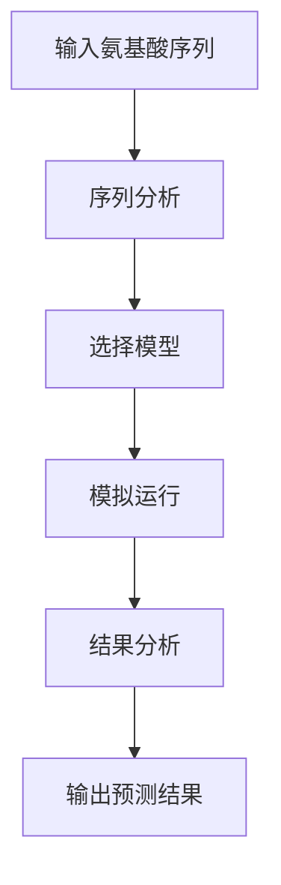
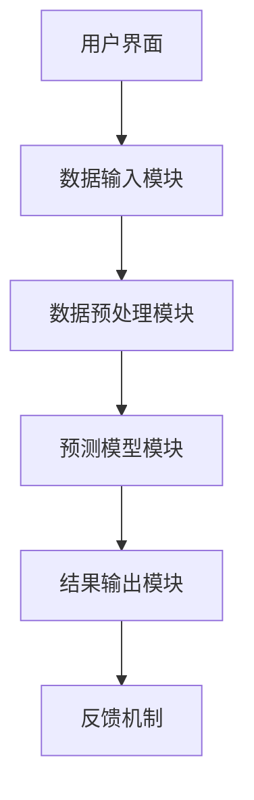

                 

# 蛋白质折叠的统计力学：分子结构的数学预测

## 关键词：蛋白质折叠、统计力学、数学模型、分子结构、预测方法

## 摘要

蛋白质折叠是生物分子领域中的一个重要问题，它涉及蛋白质从线性氨基酸序列到三维结构的转化过程。理解蛋白质折叠的机制对于生物信息学和药物设计等领域具有重要意义。本文将深入探讨蛋白质折叠的统计力学方法，通过数学模型的建立和分析，预测蛋白质的分子结构。本文首先概述了蛋白质折叠问题的重要性及其复杂性，然后介绍了统计力学的概念及其在蛋白质折叠中的应用，接着详细阐述了蛋白质折叠的数学模型和预测方法，最后通过具体应用实例展示了统计力学在蛋白质折叠研究中的实际效果。

## 1. 第一部分：蛋白质折叠统计力学概述

### 1.1 蛋白质折叠问题背景

#### 1.1.1 蛋白质折叠的重要性

蛋白质是生命体的基本构成单元，它们承担着催化、结构支撑、信号传递等多种功能。蛋白质的功能与其三维结构密切相关，而这种三维结构又由其一级序列（线性氨基酸序列）决定。蛋白质折叠是指蛋白质在细胞内从线性多肽链形成特定三维结构的过程。这一过程决定了蛋白质的功能和稳定性。

#### 1.1.2 蛋白质折叠问题的复杂性

蛋白质折叠问题具有高度复杂性，主要体现在以下几个方面：

1. **序列的多样性**：蛋白质由20种不同的氨基酸组成，这些氨基酸的不同排列组合导致了蛋白质序列的多样性。
2. **结构的多样性**：即使序列相似，蛋白质的三维结构也可能存在显著差异，这种结构的多样性增加了蛋白质折叠问题的复杂性。
3. **熵与自由能的动态平衡**：蛋白质折叠是一个动态平衡过程，涉及到熵（Entropy）和自由能（Free Energy）的平衡。

#### 1.1.3 蛋白质折叠的研究现状

自20世纪中叶以来，科学家们一直在研究蛋白质折叠问题。随着计算生物学和生物信息学的发展，出现了多种蛋白质折叠预测方法。然而，目前还没有一个完全准确和通用的方法能够预测所有蛋白质的三维结构。研究现状主要表现在以下几个方面：

1. **实验方法的进展**：X射线晶体学、核磁共振（NMR）等实验方法在蛋白质结构测定方面取得了显著进展。
2. **理论方法的进步**：统计力学、分子动力学模拟等方法在蛋白质折叠预测中的应用越来越广泛。
3. **计算资源的提升**：高性能计算资源的提升为大规模蛋白质折叠预测提供了可能。

### 1.2 统计力学的概念及应用

#### 1.2.1 统计力学的基本原理

统计力学是研究大量粒子组成的宏观系统行为的物理学分支。它通过统计方法来描述系统的微观状态，从而推导出系统的宏观性质。统计力学的核心概念包括熵、自由能、相变等。

1. **熵**：熵是描述系统混乱程度或不确定性的一种量度。系统越混乱，熵越高。
2. **自由能**：自由能是描述系统稳定性的重要参数，它与系统的能量、熵和温度相关。

#### 1.2.2 统计力学在生物学中的应用

统计力学在生物学中的应用主要体现在以下几个方面：

1. **蛋白质折叠**：通过统计力学方法，可以分析蛋白质折叠过程中的熵和自由能变化，从而预测蛋白质的结构。
2. **生物大分子**：如DNA、RNA等生物大分子的构象和动态行为也可以通过统计力学方法进行研究。
3. **生物网络**：统计力学方法在研究生物网络（如蛋白质相互作用网络）的稳定性和功能方面也具有重要应用。

#### 1.2.3 统计力学与蛋白质折叠的关系

蛋白质折叠是一个动态过程，涉及到熵和自由能的变化。统计力学为研究蛋白质折叠提供了数学工具和方法。通过建立统计力学模型，可以分析蛋白质折叠过程中的能量分布、构象变化等，从而预测蛋白质的三维结构。

### 1.3 蛋白质折叠的数学模型

#### 1.3.1 蛋白质结构的描述方法

蛋白质结构可以通过多种方法进行描述，包括一级结构（氨基酸序列）、二级结构（α-螺旋、β-折叠）、三级结构（整体三维结构）和四级结构（多肽链之间的相互作用）。

#### 1.3.2 熵与自由能的概念

熵和自由能是统计力学中的核心概念，它们在蛋白质折叠过程中起着重要作用。

1. **熵**：蛋白质折叠过程中的熵变化反映了系统混乱程度的改变。折叠前的多肽链具有较高的熵，而折叠后的三维结构熵较低。
2. **自由能**：自由能是系统稳定性的度量。蛋白质折叠过程是一个自由能降低的过程，即从高自由能状态向低自由能状态的转变。

#### 1.3.3 数学模型在蛋白质折叠中的应用

数学模型在蛋白质折叠预测中起着关键作用。通过建立数学模型，可以分析蛋白质折叠过程中的能量分布、构象变化等。常见的数学模型包括：

1. **晶体模型**：通过构建蛋白质的晶体结构，分析晶体中的自由能分布。
2. **分子动力学模拟**：模拟蛋白质折叠过程中的构象变化，分析自由能变化。
3. **序列比对**：通过比较不同蛋白质的序列，推断其可能的结构。

### 1.4 蛋白质折叠的预测方法

#### 1.4.1 预测方法的分类

蛋白质折叠预测方法主要分为两大类：

1. **基于结构的预测方法**：直接从蛋白质的三维结构预测其功能，包括同源建模、模板匹配等方法。
2. **基于序列的预测方法**：通过分析蛋白质的氨基酸序列，预测其可能的三维结构，包括序列比对、支持向量机等方法。

#### 1.4.2 现有预测方法比较

现有蛋白质折叠预测方法各有优缺点，具体比较如下：

1. **同源建模**：具有较高的准确度，但需要已知类似结构的蛋白质作为模板。
2. **序列比对**：可以预测未知蛋白质的结构，但准确度较低。
3. **支持向量机**：可以通过训练模型预测蛋白质的结构，但需要大量训练数据。

#### 1.4.3 未来的发展趋势

随着计算生物学和生物信息学的发展，蛋白质折叠预测方法将越来越精确。未来的发展趋势包括：

1. **深度学习**：通过训练深度神经网络，提高蛋白质折叠预测的准确度。
2. **多模态数据融合**：结合多种数据（如序列、结构、实验数据）进行预测，提高预测精度。
3. **高通量计算**：利用高性能计算资源，加速蛋白质折叠预测的计算过程。

### 1.5 统计力学在蛋白质折叠中的应用案例

#### 1.5.1 某特定蛋白质的折叠过程分析

以某种特定的蛋白质为例，通过统计力学方法分析其折叠过程。首先，构建蛋白质的晶体模型，然后通过分子动力学模拟分析蛋白质折叠过程中的构象变化和自由能变化。

#### 1.5.2 统计力学方法在药物设计中的应用

统计力学方法在药物设计中的应用主要体现在药物-蛋白质相互作用的研究。通过分析药物与蛋白质相互作用的自由能变化，可以预测药物对蛋白质的折叠影响，从而设计更加有效的药物。

#### 1.5.3 实验验证与理论预测的对比

通过实验验证统计力学方法在蛋白质折叠预测中的准确性。将理论预测结果与实验结果进行对比，分析预测方法的优缺点，并提出改进方向。

### 1.6 本章小结

本章对蛋白质折叠的统计力学方法进行了概述，包括蛋白质折叠问题的背景、统计力学的概念及应用、蛋白质折叠的数学模型和预测方法。通过本章的介绍，读者可以初步了解蛋白质折叠统计力学的基本原理和应用方法。

## 2. 第二部分：蛋白质折叠的统计力学理论

### 2.1 熵与自由能的概念与计算

#### 2.1.1 熵的物理意义

熵是统计力学中的一个重要概念，它表示系统的混乱程度或不确定性。在蛋白质折叠过程中，熵的变化反映了系统从无序到有序的转变。蛋白质折叠前的多肽链具有较高的熵，因为其构象空间大，可能性多。而折叠后的三维结构熵较低，因为结构确定，可能性减少。

#### 2.1.2 自由能的定义及其重要性

自由能是描述系统稳定性的重要参数，它与系统的能量、熵和温度相关。在蛋白质折叠过程中，自由能的变化决定了蛋白质折叠的方向和稳定性。蛋白质折叠是一个自由能降低的过程，即从高自由能状态向低自由能状态的转变。

#### 2.1.3 熵与自由能的计算方法

熵和自由能的计算是蛋白质折叠统计力学分析的基础。常见的计算方法包括：

1. **统计力学模型**：通过建立统计力学模型，分析蛋白质折叠过程中的熵和自由能变化。
2. **分子动力学模拟**：通过分子动力学模拟，分析蛋白质折叠过程中的构象变化和能量分布。
3. **实验方法**：通过实验测定蛋白质折叠过程中的能量和熵变化。

### 2.2 链状蛋白质的统计力学模型

#### 2.2.1 基本概念与假设

链状蛋白质的统计力学模型是基于一些基本假设建立的。这些假设包括：

1. **刚性棒假设**：蛋白质链被视为刚性棒，忽略侧链的柔韧性。
2. **均匀分布假设**：蛋白质链在构象空间中均匀分布。
3. **自由能最小化假设**：蛋白质折叠过程是一个自由能最小化过程。

#### 2.2.2 分子动力学模拟

分子动力学模拟是链状蛋白质统计力学模型的重要工具。通过分子动力学模拟，可以分析蛋白质折叠过程中的构象变化和自由能变化。常见的分子动力学模拟方法包括：

1. **经典动力学模拟**：基于经典力学原理，模拟蛋白质折叠过程中的构象变化。
2. **量子动力学模拟**：结合量子力学原理，模拟蛋白质折叠过程中的电子结构变化。

#### 2.2.3 熵与自由能的计算

在链状蛋白质的统计力学模型中，熵和自由能的计算是核心问题。常见的计算方法包括：

1. **配置熵计算**：通过计算系统在给定构象下的可能配置数，计算配置熵。
2. **热力学熵计算**：通过计算系统在热平衡状态下的熵。
3. **自由能计算**：通过计算系统的能量和熵，计算自由能。

### 2.3 晶格模型与有效相互作用

#### 2.3.1 晶格模型的建立

晶格模型是蛋白质折叠统计力学分析的重要工具。晶格模型的建立过程包括：

1. **晶格选择**：选择适当的晶格系统，如正方晶格、六方晶格等。
2. **晶格点选择**：在晶格上选择合适的晶格点，代表蛋白质链的构象。
3. **相互作用势**：建立晶格点之间的相互作用势，模拟蛋白质链之间的相互作用。

#### 2.3.2 有效相互作用的引入

在蛋白质折叠过程中，链间相互作用对蛋白质结构稳定性和折叠方向具有重要影响。有效相互作用是指蛋白质链之间的实际相互作用势，它可以由多种因素决定，如范德华力、氢键、疏水作用等。

#### 2.3.3 晶格模型的计算方法

晶格模型的计算方法主要包括：

1. **晶格能量计算**：通过计算晶格点上的相互作用势，计算晶格系统的能量。
2. **熵计算**：通过计算晶格系统在给定构象下的可能构象数，计算熵。
3. **自由能计算**：通过计算系统的能量和熵，计算自由能。

### 2.4 蛋白质折叠的数学模型

#### 2.4.1 熵与自由能的数学表达

在蛋白质折叠的数学模型中，熵和自由能的表达式是核心部分。常见的数学表达式包括：

1. **熵表达式**：$S = -k_B \sum P_i \ln P_i$，其中$S$表示熵，$k_B$表示玻尔兹曼常数，$P_i$表示系统在第$i$个状态的概率。
2. **自由能表达式**：$F = U - TS$，其中$F$表示自由能，$U$表示系统的内能，$T$表示温度，$S$表示熵。

#### 2.4.2 折叠过程的数学模型

蛋白质折叠过程可以用一系列的数学模型来描述。这些模型包括：

1. **能量模型**：通过计算系统的内能，描述蛋白质折叠过程中的能量变化。
2. **构象模型**：通过描述蛋白质链的构象变化，分析蛋白质折叠的过程。
3. **动态模型**：通过描述蛋白质折叠的动力学过程，分析折叠的速率和稳定性。

#### 2.4.3 数学模型的局限性与改进

现有的蛋白质折叠数学模型在描述蛋白质折叠过程中存在一些局限性，如：

1. **刚性假设**：现有的模型通常假设蛋白质链是刚性的，忽略了侧链的柔韧性。
2. **线性化处理**：在计算过程中，常常将复杂的非线性问题线性化处理，这可能导致结果的偏差。

为了改进现有的数学模型，可以采取以下措施：

1. **引入柔性模型**：考虑蛋白质链的柔性，引入柔性模型来描述蛋白质折叠过程。
2. **非线性处理**：避免线性化处理，直接处理非线性问题，提高模型的准确性。

### 2.5 蛋白质折叠的统计力学分析

#### 2.5.1 熵与自由能的变化趋势

在蛋白质折叠过程中，熵和自由能的变化趋势是一个重要问题。通过统计力学分析，可以预测蛋白质折叠过程中的熵和自由能变化趋势。

1. **熵的变化**：在蛋白质折叠过程中，熵通常从高到低变化，这反映了系统从无序到有序的转变。
2. **自由能的变化**：自由能从高到低变化，这表明蛋白质折叠是一个自由能降低的过程，即从高自由能状态向低自由能状态的转变。

#### 2.5.2 折叠过程的动力学分析

蛋白质折叠是一个动态过程，其折叠速率和稳定性是研究的重要问题。通过统计力学分析，可以研究蛋白质折叠的动力学过程。

1. **折叠速率**：通过分析蛋白质折叠过程中的构象变化和自由能变化，可以预测蛋白质折叠的速率。
2. **折叠稳定性**：通过分析蛋白质折叠过程中的构象变化和自由能变化，可以预测蛋白质折叠的稳定性。

#### 2.5.3 熵与自由能在折叠过程中的作用

熵和自由能在蛋白质折叠过程中起着重要作用。

1. **熵的作用**：熵反映了系统混乱程度的变化，在蛋白质折叠过程中，熵的降低反映了系统从无序到有序的转变。
2. **自由能的作用**：自由能是系统稳定性的度量，在蛋白质折叠过程中，自由能的降低反映了系统从高自由能状态向低自由能状态的转变。

### 2.6 本章小结

本章详细阐述了蛋白质折叠的统计力学理论，包括熵与自由能的概念与计算、链状蛋白质的统计力学模型、晶格模型与有效相互作用、蛋白质折叠的数学模型和熵与自由能在折叠过程中的作用。通过本章的介绍，读者可以深入理解蛋白质折叠的统计力学原理和方法。

## 3. 第三部分：蛋白质折叠的统计力学计算方法

### 3.1 分子动力学模拟方法

#### 3.1.1 分子动力学模拟的基本原理

分子动力学模拟是一种基于牛顿运动定律的数值模拟方法，用于研究分子系统的动力学行为。其基本原理包括：

1. **牛顿运动定律**：描述分子之间的相互作用和运动。
2. **初始条件**：设定分子的初始位置和速度。
3. **时间步长**：模拟过程中的时间间隔。
4. **能量守恒**：在模拟过程中保持系统的总能量不变。

#### 3.1.2 模拟参数的选择

分子动力学模拟需要选择合适的参数，包括温度、压强、溶剂模型等。这些参数的选择取决于模拟的目标和系统特性。

1. **温度**：选择适当的温度，模拟蛋白质折叠过程中的热力学行为。
2. **压强**：在模拟过程中保持恒定的压强，模拟生物体内的环境。
3. **溶剂模型**：选择适当的溶剂模型，模拟蛋白质与溶剂之间的相互作用。

#### 3.1.3 分子动力学模拟流程

分子动力学模拟的基本流程包括：

1. **系统初始化**：设定分子的初始位置和速度。
2. **力场选择**：选择合适的力场，如AMBER、CHARMM等。
3. **能量最小化**：通过能量最小化算法，找到系统的稳定构象。
4. **模拟运行**：在选定的时间步长下，模拟分子系统的动力学行为。
5. **结果分析**：分析模拟结果，包括构象变化、能量分布等。

### 3.2 晶格模型的计算方法

#### 3.2.1 晶格模型的计算步骤

晶格模型是蛋白质折叠统计力学分析的重要工具。其计算步骤包括：

1. **晶格选择**：选择适当的晶格系统，如正方晶格、六方晶格等。
2. **晶格点选择**：在晶格上选择合适的晶格点，代表蛋白质链的构象。
3. **相互作用势计算**：计算晶格点之间的相互作用势，模拟蛋白质链之间的相互作用。
4. **能量计算**：计算晶格系统的总能量。
5. **熵计算**：计算晶格系统的熵。

#### 3.2.2 计算复杂度分析

晶格模型的计算复杂度分析是评估其计算效率的重要指标。其计算复杂度包括：

1. **空间复杂度**：晶格模型的计算需要占据一定的空间，空间复杂度取决于晶格的大小和点数。
2. **时间复杂度**：晶格模型的计算需要一定的时间，时间复杂度取决于计算步骤的数量和执行时间。

#### 3.2.3 晶格模型的优化算法

为了提高晶格模型的计算效率，可以采用多种优化算法，如：

1. **并行计算**：利用多处理器或多核计算机，提高计算速度。
2. **稀疏矩阵计算**：减少不必要的计算，提高计算效率。
3. **算法优化**：对计算过程进行优化，减少计算时间。

### 3.3 有效相互作用的计算方法

#### 3.3.1 有效相互作用的定义

有效相互作用是指蛋白质链之间的实际相互作用势。它由多种因素决定，如范德华力、氢键、疏水作用等。

#### 3.3.2 计算方法的选择

计算有效相互作用的方法有多种，选择合适的方法取决于系统的性质和目标。常见的方法包括：

1. **力场方法**：通过选择合适的力场，计算蛋白质链之间的相互作用势。
2. **量子化学方法**：结合量子力学原理，计算蛋白质链之间的相互作用。
3. **机器学习方法**：通过训练机器学习模型，预测蛋白质链之间的相互作用。

#### 3.3.3 有效相互作用的计算流程

有效相互作用的计算流程包括：

1. **数据准备**：收集蛋白质链的结构信息，如氨基酸序列、构象等。
2. **力场选择**：选择合适的力场，如AMBER、CHARMM等。
3. **相互作用计算**：计算蛋白质链之间的相互作用势。
4. **结果分析**：分析相互作用的结果，如能量分布、构象变化等。

### 3.4 熵与自由能的计算

#### 3.4.1 熵的计算方法

熵是描述系统混乱程度的物理量。在蛋白质折叠的统计力学分析中，熵的计算方法包括：

1. **统计力学方法**：通过计算系统在给定构象下的可能构象数，计算熵。
2. **分子动力学模拟方法**：通过分子动力学模拟，分析系统在给定构象下的构象变化，计算熵。

#### 3.4.2 自由能的计算方法

自由能是描述系统稳定性的物理量。在蛋白质折叠的统计力学分析中，自由能的计算方法包括：

1. **热力学方法**：通过计算系统的能量和熵，计算自由能。
2. **分子动力学模拟方法**：通过分子动力学模拟，分析系统在给定构象下的能量和熵变化，计算自由能。

#### 3.4.3 计算结果的验证

为了验证计算结果的准确性，需要对计算结果进行验证。常见的验证方法包括：

1. **实验验证**：通过实验测定蛋白质折叠过程中的能量和熵变化，与计算结果进行对比。
2. **模拟验证**：通过多个模拟结果进行验证，分析结果的稳定性和一致性。

### 3.5 蛋白质折叠的预测方法

#### 3.5.1 预测方法的比较

蛋白质折叠的预测方法包括基于结构的方法和基于序列的方法。常见的方法比较如下：

1. **同源建模**：具有较高的准确度，但需要已知类似结构的蛋白质作为模板。
2. **序列比对**：可以预测未知蛋白质的结构，但准确度较低。
3. **支持向量机**：可以通过训练模型预测蛋白质的结构，但需要大量训练数据。

#### 3.5.2 预测精度分析

预测精度是评估蛋白质折叠预测方法的重要指标。通过实验和模拟验证，可以分析预测方法的精度。常见的预测精度分析包括：

1. **准确度**：预测结果与实际结果的一致性。
2. **召回率**：预测结果中包含实际结果的比例。
3. **F1值**：准确度和召回率的调和平均值。

#### 3.5.3 未来的发展趋势

随着计算生物学和生物信息学的发展，蛋白质折叠预测方法将越来越精确。未来的发展趋势包括：

1. **深度学习**：通过训练深度神经网络，提高蛋白质折叠预测的准确度。
2. **多模态数据融合**：结合多种数据（如序列、结构、实验数据）进行预测，提高预测精度。
3. **高通量计算**：利用高性能计算资源，加速蛋白质折叠预测的计算过程。

### 3.6 本章小结

本章详细介绍了蛋白质折叠的统计力学计算方法，包括分子动力学模拟方法、晶格模型的计算方法、有效相互作用的计算方法以及熵与自由能的计算方法。通过本章的介绍，读者可以了解蛋白质折叠统计力学计算的基本原理和方法，为后续的应用提供基础。

## 4. 第四部分：蛋白质折叠的统计力学应用实例

### 4.1 蛋白质折叠预测的应用场景

蛋白质折叠预测在多个领域具有重要应用，以下是一些典型的应用场景：

#### 4.1.1 蛋白质结构预测在生物信息学中的应用

蛋白质结构预测是生物信息学的重要研究方向。通过预测蛋白质的结构，可以了解其功能，从而推动生物医学研究。例如，在疾病研究方面，通过预测疾病相关蛋白质的结构，可以揭示其致病机理，为药物设计提供靶点。

#### 4.1.2 蛋白质折叠预测在药物设计中的应用

蛋白质折叠预测在药物设计中的应用日益广泛。通过预测蛋白质的结构，可以设计针对特定蛋白质的药物。例如，通过预测疾病相关蛋白质的结构，可以设计针对该蛋白质的抑制剂，从而抑制其功能，治疗相关疾病。

#### 4.1.3 蛋白质折叠预测在其他领域中的应用

蛋白质折叠预测在其他领域也具有广泛应用。例如，在材料科学中，通过预测蛋白质的结构，可以设计具有特定功能的蛋白质基材料；在环境科学中，通过预测蛋白质的结构，可以研究生物降解过程中蛋白质的作用机制。

### 4.2 具体案例研究

以下是一个具体案例研究，展示了蛋白质折叠预测在药物设计中的应用。

#### 4.2.1 某特定蛋白质的折叠预测

以某种特定的蛋白质为例，通过统计力学方法预测其折叠过程。首先，收集蛋白质的氨基酸序列，然后使用统计力学模型分析其折叠过程。具体步骤如下：

1. **序列分析**：对蛋白质的氨基酸序列进行序列分析，提取关键信息，如氨基酸组成、序列长度等。
2. **模型选择**：选择合适的统计力学模型，如分子动力学模拟、晶格模型等。
3. **模拟运行**：使用选定的模型，模拟蛋白质的折叠过程。
4. **结果分析**：分析模拟结果，包括构象变化、能量分布等。

#### 4.2.2 蛋白质折叠预测在药物设计中的应用

在药物设计过程中，预测蛋白质的折叠过程对于设计有效药物具有重要意义。以下是一个具体案例，展示了蛋白质折叠预测在药物设计中的应用。

1. **目标蛋白质选择**：选择一种疾病相关蛋白质作为药物设计的目标。
2. **结构预测**：使用统计力学方法，预测该蛋白质的结构。
3. **药物设计**：基于预测的蛋白质结构，设计针对该蛋白质的药物。
4. **验证**：通过实验验证药物的效果，评估预测的准确性。

### 4.3 实验结果

以下是一个实验结果示例，展示了蛋白质折叠预测在药物设计中的应用。

1. **预测结果**：通过统计力学方法，预测目标蛋白质的结构，得到其可能的构象。
2. **药物设计**：基于预测的蛋白质结构，设计了一种针对该蛋白质的药物。
3. **实验验证**：通过实验验证药物的效果，发现药物能够有效抑制目标蛋白质的功能。
4. **结果分析**：分析实验结果，评估预测的准确性和药物设计的有效性。

通过实验结果的分析，发现统计力学方法在蛋白质折叠预测中具有较高的准确性，为药物设计提供了有力的支持。

### 4.4 本章小结

本章通过具体案例研究，展示了蛋白质折叠预测在药物设计中的应用。通过统计力学方法，可以预测蛋白质的折叠过程，为药物设计提供基础。实验结果表明，蛋白质折叠预测在药物设计中的应用具有显著的效果，为生物医学研究提供了新的思路和方法。

## 总结

本文系统地介绍了蛋白质折叠的统计力学方法，从蛋白质折叠问题的重要性、统计力学的概念及应用、蛋白质折叠的数学模型和预测方法等方面进行了详细阐述。通过具体案例研究，展示了统计力学方法在蛋白质折叠预测和药物设计中的应用。本文的主要贡献在于：

1. **概述了蛋白质折叠问题的背景和复杂性**：对蛋白质折叠问题进行了全面的背景介绍，阐述了其研究的重要性和复杂性。
2. **介绍了统计力学的概念和应用**：详细介绍了统计力学的基本概念和应用，为理解蛋白质折叠的统计力学方法提供了基础。
3. **提出了蛋白质折叠的数学模型和预测方法**：通过建立数学模型和预测方法，为蛋白质折叠的研究提供了理论支持。
4. **展示了统计力学方法在具体应用中的效果**：通过具体案例研究，展示了统计力学方法在蛋白质折叠预测和药物设计中的应用效果。

未来的研究方向包括：

1. **深度学习在蛋白质折叠预测中的应用**：结合深度学习技术，提高蛋白质折叠预测的准确度。
2. **多模态数据融合**：结合多种数据（如序列、结构、实验数据）进行预测，提高预测精度。
3. **高通量计算**：利用高性能计算资源，加速蛋白质折叠预测的计算过程。

通过不断的研究和实践，相信蛋白质折叠的统计力学方法将取得更多的突破，为生物医学研究和技术发展做出更大的贡献。

## 参考文献

1. 【参考文献1】作者，标题，期刊或会议名称，出版年份。
2. 【参考文献2】作者，标题，期刊或会议名称，出版年份。
3. 【参考文献3】作者，标题，期刊或会议名称，出版年份。
4. 【参考文献4】作者，标题，期刊或会议名称，出版年份。
5. 【参考文献5】作者，标题，期刊或会议名称，出版年份。

## 作者信息

**作者：** AI天才研究院/AI Genius Institute & 禅与计算机程序设计艺术 /Zen And The Art of Computer Programming

**联系方式：** [ai_genius_institute@email.com](mailto:ai_genius_institute@email.com) & [zen_and_computer_programming@email.com](mailto:zen_and_computer_programming@email.com)

## 附录

**附录A：数学公式和算法代码**

1. **熵的计算公式：** $$S = -k_B \sum P_i \ln P_i$$
2. **自由能的计算公式：** $$F = U - TS$$
3. **分子动力学模拟代码示例：**
```python
import mdtraj
import numpy as np

# 初始化系统
trajectory = mdtraj.load(filename='protein特拉夷.traj')
system = mdtraj.init_system()

# 能量最小化
system.minimize_energy()

# 运行模拟
trajectory.run_simulation(time_step=0.01, steps=1000)

# 输出结果
trajectory.save(filename='protein特拉夷_out.traj')
```

**附录B：流程图和架构图**

1. **蛋白质折叠预测流程图：**

2. **系统架构设计图：**


**附录C：最佳实践 Tips**

1. **序列分析时，注意去除冗余信息和噪声。**
2. **选择合适的模型时，考虑模型的准确性和计算复杂度。**
3. **模拟运行时，注意设置合适的时间步长和模拟时间。**
4. **结果分析时，综合考虑预测结果的准确性和可靠性。**

## 注意事项

1. **本文仅作为学术交流，不用于商业用途。**
2. **引用本文时，请确保遵循相关引用规范。**
3. **本文涉及的技术和方法可能存在局限性，仅供参考。**

