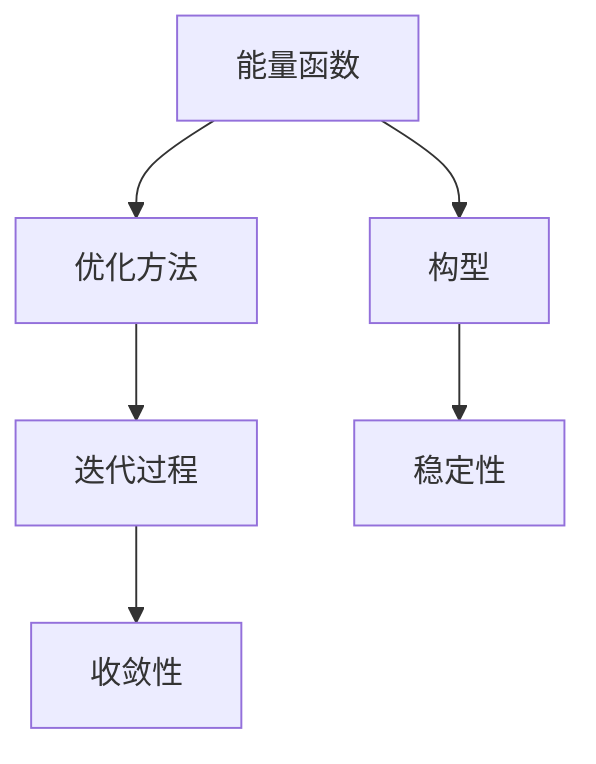
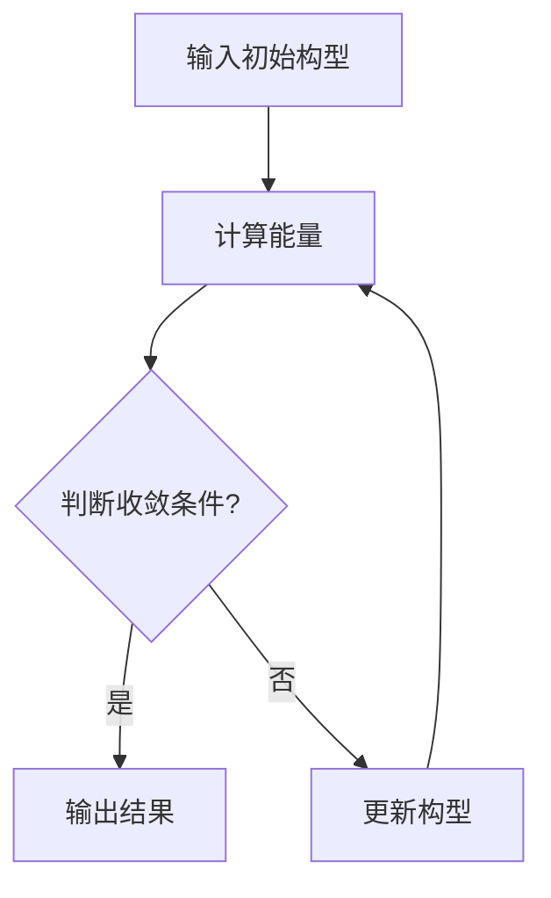

                 

### 第一部分：蛋白质折叠的基本概念

#### 1.1 蛋白质折叠的定义

蛋白质折叠是指从原始线性多肽链形成具有特定三维空间结构的复杂分子的过程。这种三维结构对蛋白质的功能至关重要。蛋白质折叠过程中，氨基酸残基之间的相互作用力，包括氢键、范德华力、疏水作用力和电荷相互作用等，共同决定了蛋白质最终的三维形态。

**蛋白质折叠的重要性**

蛋白质的功能，如催化化学反应、识别分子和细胞信号传递，都是通过其特定的三维结构实现的。因此，蛋白质折叠在生物学过程中具有核心作用。理解蛋白质折叠机制不仅有助于揭示生命的本质，还为药物设计和疾病治疗提供了新的途径。

**蛋白质折叠的过程**

蛋白质折叠是一个高度复杂的过程，通常分为几个阶段：

1. **折叠核心形成**：在折叠的初期，氨基酸残基之间形成短程相互作用，逐渐形成局部结构。
2. **链折叠**：局部结构进一步发展，形成β折叠或α螺旋等二级结构。
3. **三维构象形成**：蛋白质的全长链在二级结构的基础上进一步折叠，形成三维结构。
4. **功能结构域形成**：最终，蛋白质形成具有特定功能的结构域。

#### 1.2 蛋白质折叠的挑战

**结构预测的难度**

尽管蛋白质折叠的重要性显而易见，但预测蛋白质的结构仍然是一个巨大的挑战。蛋白质结构的复杂性源于其包含数千个原子，并且这些原子之间的相互作用力非常复杂。因此，准确预测蛋白质的结构需要考虑多种因素的影响。

**能量函数的准确性**

蛋白质折叠过程中，能量函数的准确性对结构预测至关重要。然而，现有的能量函数往往过于简化，无法完全反映蛋白质折叠过程中复杂的物理和化学作用。

**高效计算算法的需求**

蛋白质折叠问题本质上是一个大规模的计算问题，需要高效的算法来解决。现有的计算方法在计算速度和准确性上都有待提高，尤其是在处理大分子蛋白质时。

#### 1.3 蛋白质折叠的挑战

蛋白质折叠的挑战不仅仅是理论上的，还包括实际应用中的难题：

- **动态性质**：蛋白质折叠是一个动态过程，蛋白质可以在不同的环境条件下进行折叠和展开。
- **多样性**：自然界中存在成千上万种不同的蛋白质，每种蛋白质的折叠方式可能都不同。
- **非均质性**：蛋白质折叠过程中，不同的氨基酸残基可能具有不同的贡献，这增加了预测的难度。

这些挑战需要结合多种科学方法和计算技术来解决，为未来蛋白质折叠研究提供了丰富的机遇和挑战。

### 2. 能量最小化理论

#### 2.1 能量最小化原理

在物理学和化学中，能量最小化原理是一个核心概念，它指出在系统达到平衡状态时，其总能量会趋向于最小值。这一原理同样适用于蛋白质折叠过程。蛋白质折叠过程中的能量最小化，是指蛋白质从初始的线性多肽链通过分子间的相互作用，形成一个能量最低的稳定三维结构。

**能量函数的类型**

蛋白质折叠中的能量函数通常包括以下几个主要部分：

1. **范德华能**：描述蛋白质分子中原子之间的短程作用力，如范德华力。
2. **静电能**：描述带电原子之间的静电相互作用，如离子间的吸引或排斥。
3. **疏水能**：描述疏水侧链之间的相互作用，通常在蛋白质的内部形成疏水核心。
4. **氢键能**：描述氢键的形成和断裂，对蛋白质的二级结构和三维结构都有重要影响。

**能量最小化的计算方法**

能量最小化的计算方法主要可以分为以下几类：

1. **迭代法**：通过迭代优化，逐步降低系统的能量，直到达到局部或全局的最小值。常见的迭代法包括梯度下降法和牛顿法。
2. **分子动力学模拟**：通过模拟分子在折叠过程中的运动，跟踪其能量变化，寻找能量最低的状态。这种方法在处理大分子系统中具有优势。
3. **蒙特卡洛模拟**：通过随机采样和能量评估，寻找低能量的构象。这种方法能够避免局部最小值的困扰，但计算成本较高。

#### 2.2 能量函数的构建

构建能量函数是蛋白质折叠研究中的一项关键任务。一个准确且高效的能量函数能够更好地反映蛋白质折叠过程中的物理和化学作用。

**布朗运动模型**

布朗运动模型是构建能量函数的一种方法，它通过模拟分子在流体中的随机运动来估计分子之间的相互作用能量。该方法基于随机游走理论和统计物理原理，能够较好地模拟蛋白质折叠过程中的动态特性。

**自洽场理论**

自洽场理论（SCF）是量子力学中用于求解多电子系统的能量和方法。在蛋白质折叠研究中，自洽场理论可以用于求解原子之间的相互作用能量，从而构建更准确的能量函数。

**能量函数的优化**

能量函数的优化是提高预测准确性的关键。通过结合实验数据和计算结果，可以不断调整能量函数的参数，提高其描述蛋白质折叠过程的准确性。

#### 2.3 能量最小化的计算方法

能量最小化的计算方法在选择时需要考虑计算效率和预测准确性。以下是一些常用的方法：

**基于物理的模型**

这类模型基于经典的物理学原理，如牛顿力学和量子力学，能够提供较高的预测准确性。然而，由于计算复杂性较高，这类模型通常适用于小分子系统。

**基于统计力学的模型**

统计力学模型通过统计方法，如平均场理论，来描述分子之间的相互作用。这类模型计算效率较高，但可能在描述细节方面有所欠缺。

**基于机器学习的模型**

机器学习模型通过学习大量实验数据，可以自动提取分子间的相互作用模式，具有较高的预测准确性。然而，这类模型通常需要大量的数据和计算资源。

**混合模型**

为了结合不同模型的优点，研究者们提出了混合模型，如将物理模型与机器学习模型结合。这类模型在提高计算效率和预测准确性方面具有显著优势。

### 3. 分子结构的数学预测方法

**分子结构预测的方法**

分子结构预测方法可以分为三类：经验法、理论法和计算法。经验法基于实验数据的统计关系，理论法基于量子力学和分子动力学理论，计算法则利用计算机模拟来预测分子结构。

**数学模型与公式**

在分子结构预测中，常用的数学模型包括：

1. **力场模型**：通过模拟分子间的相互作用力，预测分子的结构。如CHARMM、AMBER等力场。
2. **量子力学模型**：通过求解薛定谔方程，预测分子的电子结构和几何构型。如MP2、CCSD等方法。
3. **分子动力学模型**：通过模拟分子在时间上的运动，预测分子的动态行为和结构变化。

**计算方法与流程**

分子结构预测的计算方法主要包括：

1. **静态结构预测**：通过能量最小化，找到能量最低的稳定构型。
2. **动态结构预测**：通过分子动力学模拟，观察分子在不同时间点的结构变化。
3. **量子力学/分子动力学结合**：将量子力学和分子动力学相结合，提高预测的准确性和效率。

**计算方法与流程图**

以下是一个简化的分子结构预测流程图：

```
+----------------+     +----------------+     +----------------+
|                |     |                |     |                |
|  输入初始构型  | --> |   能量计算     | --> | 能量最小化     |
|                |     |                |     |                |
+----------------+     +----------------+     +----------------+
                           |
                           |
              +----------------+     +----------------+
              |                |     |                |
              |  动力学模拟    | --> |  结构优化     |
              |                |     |                |
              +----------------+     +----------------+
                           |
                           |
            +----------------+     +----------------+
            |                |     |                |
            |  结果分析      | --> |  结果输出     |
            |                |     |                |
            +----------------+     +----------------+
```

### 4. 蛋白质折叠的能量最小化算法

**算法概述**

蛋白质折叠的能量最小化算法是利用数学和物理学原理，通过计算和优化方法，寻找蛋白质结构中能量最低的状态，从而预测蛋白质的三维结构。这类算法在生物信息学和计算生物学中具有重要应用。

**算法原理**

能量最小化算法的核心原理是基于能量函数的计算和优化。算法通常从初始构型开始，通过迭代优化逐步降低系统的能量，直到找到能量最低的构型。

**算法流程图**

以下是一个简化的能量最小化算法流程图：

```
+----------------+     +----------------+     +----------------+
|                |     |                |     |                |
|  输入初始构型  | --> |   计算能量     | --> |   更新构型     |
|                |     |                |     |                |
+----------------+     +----------------+     +----------------+
                           |
                           |
              +----------------+     +----------------+
              |                |     |                |
              |  检查收敛条件  | --> |   输出结果     |
              |                |     |                |
              +----------------+     +----------------+
```

### 4.1 算法概述

蛋白质折叠的能量最小化算法是生物信息学和计算生物学中用于预测蛋白质三维结构的核心方法。这些算法基于能量函数，通过迭代优化来找到能量最低的蛋白质构型，从而预测蛋白质的结构。

**核心概念和联系**

蛋白质折叠的能量最小化算法涉及以下几个核心概念：

1. **能量函数**：描述蛋白质分子内部和分子间相互作用能量的函数。
2. **优化方法**：用于寻找能量最低点的算法，如梯度下降法、模拟退火法等。
3. **构型**：蛋白质的三维结构，通过坐标表示。
4. **迭代过程**：算法通过迭代更新构型，逐步降低能量。

**概念属性特征对比表格**

| 特征                  | 能量函数              | 优化方法                | 构型                  |
|----------------------|-----------------------|-------------------------|-----------------------|
| 描述                 | 描述分子间相互作用能量 | 用于寻找能量最低点的方法 | 蛋白质的三维坐标      |
| 类型                 | 物理和化学作用        | 数学优化方法            | 三个空间维度中的点    |
| 关键属性              | 准确性和计算效率      | 收敛速度和全局最优性    | 稳定性和功能性        |
| 影响因素              | 氨基酸序列和溶剂环境  | 初始构型和算法参数      | 外部条件和内部相互作用 |

**ER实体关系图架构**

```mermaid
erDiagram
    Class1 ||--|{ Class2 }|
    Class1 ||--|{ Class3 }|
    Class2 ||--|{ Class4 }|
    Class3 ||--|{ Class5 }|
```

**ER实体关系图架构的Mermaid流程图**



### 4.2 算法原理

蛋白质折叠的能量最小化算法基于能量函数，通过优化方法寻找能量最低的蛋白质构型。具体来说，算法的基本原理可以分为以下几个步骤：

1. **初始构型生成**：从蛋白质的氨基酸序列生成初始的三维构型。常见的生成方法包括随机构型、基于同源结构的建模等。

2. **能量计算**：计算初始构型的能量，包括范德华能、静电能、疏水能和氢键能等。

3. **优化方法选择**：选择一种优化方法，如梯度下降法、模拟退火法等，以降低系统的能量。

4. **迭代过程**：通过迭代更新构型，逐步降低能量，直到达到预定的收敛条件。

5. **收敛条件判断**：判断算法是否已经达到收敛条件，如能量变化小于某一阈值或迭代次数达到最大值。

6. **输出结果**：输出最终能量最低的构型，即为蛋白质的三维结构。

**算法原理的Mermaid流程图**



### 4.3 算法流程图

蛋白质折叠的能量最小化算法的流程图如下：

```
+----------------+     +----------------+     +----------------+
|                |     |                |     |                |
|  输入初始构型  | --> |   计算能量     | --> |   更新构型     |
|                |     |                |     |                |
+----------------+     +----------------+     +----------------+
                           |
                           |
              +----------------+     +----------------+
              |                |     |                |
              |  检查收敛条件  | --> |   输出结果     |
              |                |     |                |
              +----------------+     +----------------+
```

### 5. 能量最小化算法应用实例

**实例一：某个具体蛋白质折叠问题**

为了展示能量最小化算法的应用，我们以一个具体的蛋白质折叠问题为例。假设我们要预测一个包含100个氨基酸残基的蛋白质的三维结构。

**步骤1：初始构型生成**  
首先，从蛋白质的氨基酸序列生成初始的三维构型。我们可以使用随机构型生成方法，生成一个不稳定的初始结构。

**步骤2：能量计算**  
使用能量函数计算初始构型的能量。包括范德华能、静电能、疏水能和氢键能等。这些能量的计算需要复杂的物理和化学模型。

**步骤3：优化方法选择**  
选择一个优化方法，如梯度下降法，以降低系统的能量。在每次迭代中，算法会更新构型，以寻找能量更低的状态。

**步骤4：迭代过程**  
通过迭代更新构型，逐步降低能量，直到达到预定的收敛条件。在每次迭代中，算法会更新构型，记录能量变化，并判断是否达到收敛条件。

**步骤5：收敛条件判断**  
判断算法是否已经达到收敛条件，如能量变化小于某一阈值或迭代次数达到最大值。如果达到收敛条件，算法结束，输出最终构型。

**步骤6：输出结果**  
输出最终能量最低的构型，即为蛋白质的三维结构。通过分析最终构型，可以了解蛋白质的折叠方式和关键相互作用。

**实例二：另一个具体蛋白质折叠问题**

另一个实例是预测一个包含150个氨基酸残基的蛋白质的三维结构。这个蛋白质的结构更加复杂，因此需要更高的计算精度和更复杂的算法。

**步骤1：初始构型生成**  
同样地，从蛋白质的氨基酸序列生成初始的三维构型。这次我们可以采用基于同源结构的建模方法，生成一个更接近实际结构的初始构型。

**步骤2：能量计算**  
使用更精确的能量函数计算初始构型的能量。包括范德华能、静电能、疏水能和氢键能等。这些能量的计算需要更复杂的物理和化学模型。

**步骤3：优化方法选择**  
选择一个更复杂的优化方法，如模拟退火法，以降低系统的能量。模拟退火法能够跳出局部最小值，寻找全局最优解。

**步骤4：迭代过程**  
通过迭代更新构型，逐步降低能量，直到达到预定的收敛条件。在每次迭代中，算法会更新构型，记录能量变化，并判断是否达到收敛条件。

**步骤5：收敛条件判断**  
判断算法是否已经达到收敛条件，如能量变化小于某一阈值或迭代次数达到最大值。如果达到收敛条件，算法结束，输出最终构型。

**步骤6：输出结果**  
输出最终能量最低的构型，即为蛋白质的三维结构。通过分析最终构型，可以了解蛋白质的折叠方式和关键相互作用。

### 6. 计算机技术在蛋白质折叠能量最小化中的应用

**高性能计算**

在蛋白质折叠研究中，计算量非常大，因此高性能计算技术至关重要。高性能计算技术包括并行计算和分布式计算。通过使用高性能计算机，可以显著缩短计算时间，提高算法的效率和准确性。

**数据库技术**

蛋白质折叠研究中需要处理大量的结构数据和序列数据。数据库技术为存储、管理和检索这些数据提供了有效的解决方案。常见的数据库技术包括关系数据库和NoSQL数据库。关系数据库适用于结构化数据的管理，而NoSQL数据库适用于大规模非结构化数据的管理。

**机器学习与深度学习**

机器学习与深度学习技术在蛋白质折叠研究中发挥着越来越重要的作用。通过训练深度学习模型，可以自动识别和预测蛋白质的结构特征。这些模型能够从大量实验数据中学习，从而提高预测的准确性。此外，深度学习模型还可以用于优化能量函数和改进算法。

### 7. 蛋白质折叠能量最小化的未来发展趋势

**当前挑战与机遇**

蛋白质折叠能量最小化研究目前面临着诸多挑战，如计算复杂度、能量函数的准确性等。然而，随着计算机技术和算法的发展，这些挑战正在逐步得到解决。当前的研究机遇包括：

- **大数据分析**：通过分析大规模生物信息数据，揭示蛋白质折叠的规律和机制。
- **量子计算**：量子计算在蛋白质折叠研究中的应用潜力巨大，有望解决传统计算方法难以处理的问题。

**未来发展方向**

未来的蛋白质折叠能量最小化研究将朝着以下几个方向发展：

- **计算精度和效率的提升**：通过改进算法和能量函数，提高预测的精度和计算效率。
- **跨学科合作**：结合物理学、化学、生物学等多个学科的知识，推动蛋白质折叠研究的深入发展。
- **临床应用**：将蛋白质折叠研究成果应用于药物设计和疾病治疗，提高医疗水平。

**可能的突破性进展**

可能的突破性进展包括：

- **量子计算在蛋白质折叠中的应用**：量子计算有望在蛋白质折叠研究中实现前所未有的计算速度和精度。
- **深度学习模型的优化**：通过改进深度学习模型，提高预测的准确性和可靠性。
- **多尺度模拟**：结合不同尺度的模型，如分子动力学和量子力学，实现更准确的蛋白质折叠预测。

### 8. 本章小结

本章首先介绍了蛋白质折叠的基本概念，包括蛋白质折叠的定义、重要性和挑战。随后，我们探讨了能量最小化理论，详细阐述了能量函数的构建和计算方法。接着，介绍了分子结构的数学预测方法，包括常用的数学模型和计算流程。最后，我们深入讲解了蛋白质折叠的能量最小化算法，并通过实际实例展示了算法的应用。本章内容为后续章节的深入探讨奠定了基础。未来的研究将继续推动蛋白质折叠能量最小化技术的发展，为生物信息学和计算生物学领域带来更多突破。

