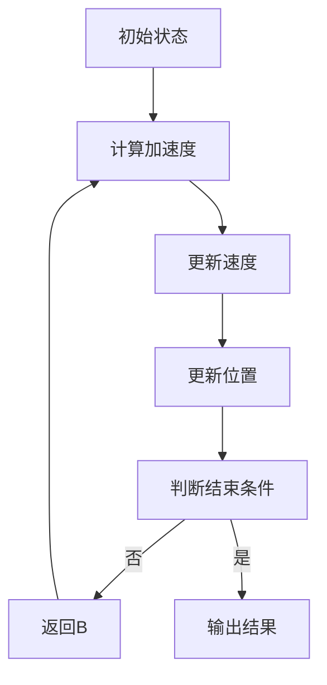
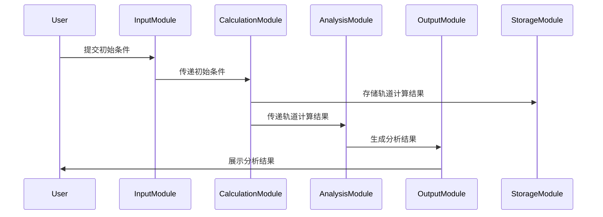

                 

# 行星际旅行的N体问题：太空轨道的数学计算

关键词：行星际旅行，N体问题，太空轨道，数学计算，算法原理，系统架构设计

摘要：本文将深入探讨行星际旅行中的N体问题，分析其数学计算模型及其在太空轨道计算中的重要性。我们将逐步介绍N体问题的定义、属性特征、数学模型，以及相关算法原理，并通过具体示例和数学公式进行讲解。同时，我们将探讨N体问题的应用领域和发展前景，并设计一个系统架构实现N体问题的计算。最后，我们将通过实际项目实战来展示N体问题的计算实现和应用。

## 第一部分：背景介绍

### 1.1 行星际旅行的需求与挑战

随着科技的发展，人类对于探索宇宙的兴趣日益浓厚。行星际旅行成为了一个热门话题，也是未来航天发展的重要方向。然而，行星际旅行面临着许多挑战和需求。

首先，行星际旅行的目标是从地球到达其他行星或天体。这需要精确的轨道计算，以确保飞行器能够顺利到达目的地，并避免与其他天体发生碰撞。

其次，行星际旅行需要长时间的支持和保障。这意味着飞行器需要具备自主运行和生存能力，以及应对各种意外情况的能力。

最后，行星际旅行需要大量的资源和能源。这包括推进剂、食物、水以及能源供应等。如何在有限的资源和能源条件下实现高效、安全的行星际旅行，是当前研究的热点问题。

### 1.2 太空轨道的计算需求

太空轨道的计算是行星际旅行中至关重要的一环。太空轨道的计算涉及到飞行器的轨道预测、轨道修正以及轨道优化等方面。

首先，轨道预测是行星际旅行的起点。通过精确的轨道预测，我们可以确定飞行器从地球出发，经过各个行星和天体，最终到达目的地的轨道。

其次，轨道修正是在飞行过程中对轨道进行微调，以应对各种不确定因素。这包括引力扰动、大气阻力、太阳辐射压力等。轨道修正的目的是确保飞行器能够按照预定的轨道飞行，并达到目的地。

最后，轨道优化是进一步提高飞行器的效能和安全性。通过优化轨道，我们可以降低飞行器的燃料消耗，延长飞行器的使用寿命，以及提高飞行器的安全性。

### 1.3 现有计算方法的局限

目前，已有多种计算方法可以用于太空轨道的计算。然而，这些方法在处理复杂、大规模的N体问题时存在一定的局限。

首先，传统的数值积分方法，如欧拉法、龙格-库塔法等，在处理高维、非线性问题时存在数值不稳定和计算效率低下的问题。

其次，解析方法，如拉格朗日法、哈密顿法等，虽然能够提供理论上的精确解，但在实际应用中往往受到物理模型的限制。

最后，现有的轨道计算软件，如NASA的General Mission Analysis Tool（GMAT）、Orbit determination software（ODS）等，虽然功能强大，但仍然存在计算效率低、难以扩展等问题。

因此，为了解决现有计算方法的局限，我们需要探索更高效、更精确的N体问题计算方法。

## 问题描述

### 2.1 行星际旅行中的N体问题

在行星际旅行中，N体问题是指多个天体在相互引力作用下，各自运动轨迹的问题。这些问题通常涉及到多个行星、卫星、小行星等天体的运动。

N体问题是一个复杂的高维非线性问题，具有以下几个特点：

1. 多个天体的相互作用：每个天体都受到其他天体的引力作用，因此需要考虑所有天体之间的相互作用。

2. 高维状态空间：N体问题的状态空间是一个高维空间，每个天体的位置和速度都需要进行描述。

3. 非线性动力学：N体问题的动力学方程是非线性的，导致问题的计算复杂度较高。

4. 精确性和稳定性：N体问题的计算需要保证精度和稳定性，以确保飞行器的轨道预测和修正的准确性。

### 2.2 N体问题的数学模型

N体问题的数学模型基于牛顿万有引力定律和牛顿运动定律。具体来说，N体问题可以用以下方程组来描述：

$$
m_i\frac{d^2\vec{r}_i}{dt^2} = \sum_{j\neq i} \frac{Gm_i m_j}{|\vec{r}_i - \vec{r}_j|^3} (\vec{r}_i - \vec{r}_j)
$$

其中，$m_i$ 表示第 $i$ 个天体的质量，$\vec{r}_i$ 表示第 $i$ 个天体的位置向量，$G$ 表示万有引力常数。

上述方程描述了第 $i$ 个天体在受到其他天体引力作用下的加速度。通过求解上述方程，我们可以得到天体的运动轨迹。

### 2.3 N体问题的边界与外延

N体问题的边界和范围可以根据具体的应用场景来定义。以下是一些常见的边界和范围：

1. 行星际轨道计算：N体问题可以应用于行星际轨道计算，包括从地球到其他行星的轨道计算。

2. 卫星轨道设计：N体问题可以应用于卫星轨道的设计，包括地球同步轨道、太阳同步轨道等。

3. 天体力学研究：N体问题可以用于天体力学研究，包括行星轨道的演化、小行星带的分布等。

4. 航天器导航与控制：N体问题可以用于航天器的导航与控制，包括轨道修正、姿态控制等。

### 3.1 N体问题的核心概念

N体问题的核心概念主要包括以下几方面：

1. 天体：N体问题中的天体包括行星、卫星、小行星等。

2. 引力：N体问题中的天体之间存在引力相互作用。

3. 运动轨迹：N体问题通过求解天体的运动轨迹，得到天体的位置和速度。

4. 数学模型：N体问题基于牛顿万有引力定律和牛顿运动定律，通过数学模型来描述天体的运动。

### 3.2 N体问题的计算原理

N体问题的计算原理基于牛顿万有引力定律和牛顿运动定律。具体来说，通过以下步骤进行计算：

1. 初始化：给定天体的初始位置和速度。

2. 计算引力：计算每个天体受到其他天体的引力。

3. 更新加速度：根据引力计算天体的加速度。

4. 更新位置和速度：根据加速度更新天体的位置和速度。

5. 判断结束条件：判断计算是否结束，如果未结束，返回步骤2。

通过上述步骤，我们可以得到天体的运动轨迹。

### 3.3 N体问题的解决方法

解决N体问题可以采用多种方法，包括数值积分方法、解析方法、数值解析混合方法等。

1. 数值积分方法：通过数值积分方法，如欧拉法、龙格-库塔法等，求解天体的运动轨迹。

2. 解析方法：利用解析方法，如拉格朗日法、哈密顿法等，求解天体的运动轨迹。

3. 数值解析混合方法：结合数值方法和解析方法，以提高计算效率和精度。

### 4.1 N体问题的应用领域

N体问题在多个领域具有广泛的应用：

1. 行星际旅行：N体问题用于行星际旅行中的轨道计算和导航。

2. 天体力学：N体问题用于天体力学研究，包括行星轨道的演化、小行星带的分布等。

3. 卫星轨道设计：N体问题用于卫星轨道的设计和优化。

4. 航天器导航与控制：N体问题用于航天器的导航与控制，包括轨道修正、姿态控制等。

### 4.2 N体问题的未来发展

随着科技的进步，N体问题的研究将继续深入，未来可能的发展方向包括：

1. 更高效的计算算法：探索更高效、更精确的N体问题计算算法，以提高计算效率和精度。

2. 大规模并行计算：利用并行计算技术，处理大规模N体问题，提高计算速度。

3. 人工智能与机器学习：结合人工智能与机器学习技术，优化N体问题的求解过程。

4. 仿真与可视化：发展N体问题的仿真与可视化技术，以更直观地展示天体运动。

### 5.1 行星际旅行

行星际旅行是指人类或飞行器从地球出发，到达其他行星或天体进行探索、研究或定居的过程。行星际旅行需要解决多个关键问题，如轨道计算、能源供应、生存保障等。

### 5.2 太空轨道

太空轨道是指天体在太空中按照特定轨迹运行的轨道。太空轨道分为自然轨道和人工轨道，前者如行星和卫星的轨道，后者如航天器和卫星的轨道。

### 5.3 N体问题

N体问题是指多个天体在相互引力作用下，各自运动轨迹的问题。N体问题在行星际旅行、天体力学、卫星轨道设计等领域具有广泛的应用。

## 第二部分：核心概念与联系

### 1.1 N体问题的定义

N体问题是指多个天体在相互引力作用下，各自运动轨迹的问题。N体问题中的N表示天体的数量，可以是2、3、4等任意正整数。当N=2时，称为双星问题；当N=3时，称为三体问题；当N>3时，称为多体问题。

### 1.2 N体问题的属性特征

N体问题的属性特征主要包括以下几个方面：

1. 多个天体：N体问题涉及多个天体的运动，这些天体可以是行星、卫星、小行星等。

2. 引力相互作用：N体问题中的天体之间存在引力相互作用，每个天体受到其他天体的引力作用。

3. 高维状态空间：N体问题的状态空间是一个高维空间，每个天体的位置和速度都需要进行描述。

4. 非线性动力学：N体问题的动力学方程是非线性的，导致问题的计算复杂度较高。

5. 精确性和稳定性：N体问题的计算需要保证精度和稳定性，以确保飞行器的轨道预测和修正的准确性。

### 1.3 N体问题的数学模型

N体问题的数学模型基于牛顿万有引力定律和牛顿运动定律。具体来说，N体问题可以用以下方程组来描述：

$$
m_i\frac{d^2\vec{r}_i}{dt^2} = \sum_{j\neq i} \frac{Gm_i m_j}{|\vec{r}_i - \vec{r}_j|^3} (\vec{r}_i - \vec{r}_j)
$$

其中，$m_i$ 表示第 $i$ 个天体的质量，$\vec{r}_i$ 表示第 $i$ 个天体的位置向量，$G$ 表示万有引力常数。

### 2.1 N体问题与其他轨道计算方法的对比

| 方法         | 优点                 | 缺点                       | 适用场景        |
| ------------ | -------------------- | -------------------------- | --------------- |
| 数值积分方法 | 计算速度快，适用于大规模问题 | 精度较低，可能产生数值误差 | 行星际轨道计算  |
| 解析方法     | 精度较高，理论意义强   | 计算复杂，难以处理大规模问题 | 卫星轨道设计    |
| 混合方法     | 结合数值和解析方法，提高精度和效率 | 计算复杂，需要更多的计算资源 | 复杂轨道计算   |

### 3.1 N体问题的ER图

```mermaid
erDiagram
  天体 ||--|{ 引力相互作用 }|--| 多个天体
  天体 ||--|{ 运动轨迹 }|--| 太空轨道
```

## 第三部分：算法原理讲解

### 1.1 牛顿-欧拉法

牛顿-欧拉法是一种经典的数值积分方法，用于求解N体问题。其基本思想是利用欧拉法进行迭代计算，并引入阻尼项以提高计算的稳定性。

#### 算法流程图



#### 算法原理讲解

牛顿-欧拉法的基本原理如下：

1. 初始化：给定天体的初始位置和速度。

2. 计算加速度：根据天体受到的引力，计算每个天体的加速度。

3. 更新速度：利用加速度和当前速度，更新天体的速度。

4. 更新位置：利用速度和当前位置，更新天体的位置。

5. 判断结束条件：判断计算是否结束，如果未结束，返回步骤2。

6. 输出结果：输出天体的最终位置和速度。

### 2.1 维尔斯特拉斯法

维尔斯特拉斯法是一种基于泰勒级数的数值积分方法，用于求解N体问题。其基本思想是利用泰勒级数展开，将高阶导数近似为低阶导数，从而进行迭代计算。

#### 算法原理讲解

维尔斯特拉斯法的基本原理如下：

1. 初始化：给定天体的初始位置和速度。

2. 计算加速度：根据天体受到的引力，计算每个天体的加速度。

3. 更新速度：利用加速度和当前速度，更新天体的速度。

4. 更新位置：利用速度和当前位置，更新天体的位置。

5. 判断结束条件：判断计算是否结束，如果未结束，返回步骤2。

6. 输出结果：输出天体的最终位置和速度。

### 3.1 拉格朗日法

拉格朗日法是一种基于拉格朗日方程的数值积分方法，用于求解N体问题。其基本思想是利用拉格朗日方程，将天体的运动描述为拉格朗日量，从而进行迭代计算。

#### 算法原理讲解

拉格朗日法的基本原理如下：

1. 初始化：给定天体的初始位置和速度。

2. 计算拉格朗日量：根据天体受到的引力，计算每个天体的拉格朗日量。

3. 求解拉格朗日方程：利用拉格朗日方程，求解天体的运动轨迹。

4. 更新位置和速度：利用求解得到的运动轨迹，更新天体的位置和速度。

5. 判断结束条件：判断计算是否结束，如果未结束，返回步骤2。

6. 输出结果：输出天体的最终位置和速度。

### 3.1 牛顿-欧拉法举例

假设有两个天体A和B，初始位置分别为$(x_1, y_1)$和$(x_2, y_2)$，初始速度分别为$(v_{1x}, v_{1y})$和$(v_{2x}, v_{2y})$。我们使用牛顿-欧拉法来计算它们的运动轨迹。

1. 初始化：给定天体A和B的初始位置和速度。

2. 计算加速度：
   $$ a_{1x} = \frac{Gm_2(x_1 - x_2)}{r^2} $$
   $$ a_{1y} = \frac{Gm_2(y_1 - y_2)}{r^2} $$
   $$ a_{2x} = \frac{Gm_1(x_2 - x_1)}{r^2} $$
   $$ a_{2y} = \frac{Gm_1(y_2 - y_1)}{r^2} $$
   其中，$r = \sqrt{(x_1 - x_2)^2 + (y_1 - y_2)^2}$。

3. 更新速度：
   $$ v_{1x} = v_{1x} + a_{1x}\Delta t $$
   $$ v_{1y} = v_{1y} + a_{1y}\Delta t $$
   $$ v_{2x} = v_{2x} + a_{2x}\Delta t $$
   $$ v_{2y} = v_{2y} + a_{2y}\Delta t $$
   其中，$\Delta t$为时间步长。

4. 更新位置：
   $$ x_1 = x_1 + v_{1x}\Delta t $$
   $$ y_1 = y_1 + v_{1y}\Delta t $$
   $$ x_2 = x_2 + v_{2x}\Delta t $$
   $$ y_2 = y_2 + v_{2y}\Delta t $$

5. 判断结束条件：如果计算达到预定时间，输出天体A和B的最终位置和速度。

### 3.2 维尔斯特拉斯法举例

假设有两个天体A和B，初始位置分别为$(x_1, y_1)$和$(x_2, y_2)$，初始速度分别为$(v_{1x}, v_{1y})$和$(v_{2x}, v_{2y})$。我们使用维尔斯特拉斯法来计算它们的运动轨迹。

1. 初始化：给定天体A和B的初始位置和速度。

2. 计算加速度：
   $$ a_{1x} = \frac{Gm_2(x_1 - x_2)}{r^2} $$
   $$ a_{1y} = \frac{Gm_2(y_1 - y_2)}{r^2} $$
   $$ a_{2x} = \frac{Gm_1(x_2 - x_1)}{r^2} $$
   $$ a_{2y} = \frac{Gm_1(y_2 - y_1)}{r^2} $$
   其中，$r = \sqrt{(x_1 - x_2)^2 + (y_1 - y_2)^2}$。

3. 计算速度的更新：
   $$ v_{1x}^{(n+1)} = v_{1x}^{(n)} + \frac{1}{2}(a_{1x} + a_{1x}^{(n)})\Delta t $$
   $$ v_{1y}^{(n+1)} = v_{1y}^{(n)} + \frac{1}{2}(a_{1y} + a_{1y}^{(n)})\Delta t $$
   $$ v_{2x}^{(n+1)} = v_{2x}^{(n)} + \frac{1}{2}(a_{2x} + a_{2x}^{(n)})\Delta t $$
   $$ v_{2y}^{(n+1)} = v_{2y}^{(n)} + \frac{1}{2}(a_{2y} + a_{2y}^{(n)})\Delta t $$

4. 计算位置的更新：
   $$ x_1^{(n+1)} = x_1^{(n)} + \frac{1}{2}(v_{1x}^{(n)} + v_{1x}^{(n+1)})\Delta t $$
   $$ y_1^{(n+1)} = y_1^{(n)} + \frac{1}{2}(v_{1y}^{(n)} + v_{1y}^{(n+1)})\Delta t $$
   $$ x_2^{(n+1)} = x_2^{(n)} + \frac{1}{2}(v_{2x}^{(n)} + v_{2x}^{(n+1)})\Delta t $$
   $$ y_2^{(n+1)} = y_2^{(n)} + \frac{1}{2}(v_{2y}^{(n)} + v_{2y}^{(n+1)})\Delta t $$

5. 判断结束条件：如果计算达到预定时间，输出天体A和B的最终位置和速度。

### 3.3 拉格朗日法举例

假设有两个天体A和B，初始位置分别为$(x_1, y_1)$和$(x_2, y_2)$，初始速度分别为$(v_{1x}, v_{1y})$和$(v_{2x}, v_{2y})$。我们使用拉格朗日法来计算它们的运动轨迹。

1. 初始化：给定天体A和B的初始位置和速度。

2. 计算拉格朗日量：
   $$ L_1 = \frac{1}{2}m_1v_1^2 - U_1 $$
   $$ L_2 = \frac{1}{2}m_2v_2^2 - U_2 $$
   其中，$v_1 = \sqrt{v_{1x}^2 + v_{1y}^2}$，$v_2 = \sqrt{v_{2x}^2 + v_{2y}^2}$，$U_1 = -\frac{Gm_1m_2}{r_1}$，$U_2 = -\frac{Gm_1m_2}{r_2}$，$r_1 = \sqrt{(x_1 - x_2)^2 + (y_1 - y_2)^2}$，$r_2 = \sqrt{(x_2 - x_1)^2 + (y_2 - y_1)^2}$。

3. 求解拉格朗日方程：
   $$ \frac{d^2x_1}{dt^2} = \frac{\partial L_1}{\partial x_1} $$
   $$ \frac{d^2y_1}{dt^2} = \frac{\partial L_1}{\partial y_1} $$
   $$ \frac{d^2x_2}{dt^2} = \frac{\partial L_2}{\partial x_2} $$
   $$ \frac{d^2y_2}{dt^2} = \frac{\partial L_2}{\partial y_2} $$

4. 更新位置和速度：
   $$ x_1 = x_1 + v_{1x}\Delta t $$
   $$ y_1 = y_1 + v_{1y}\Delta t $$
   $$ x_2 = x_2 + v_{2x}\Delta t $$
   $$ y_2 = y_2 + v_{2y}\Delta t $$

5. 判断结束条件：如果计算达到预定时间，输出天体A和B的最终位置和速度。

## 第四部分：数学模型和数学公式

### 1.1 牛顿运动定律

牛顿运动定律是描述物体运动的基本定律，包括以下三个方面：

1. 第一定律（惯性定律）：一个物体如果不受外力作用，或者所受外力的合力为零，它将保持静止或匀速直线运动。

2. 第二定律（加速度定律）：一个物体的加速度与作用在它上面的外力成正比，与它的质量成反比，加速度的方向与外力的方向相同。公式表示为：
   $$
   F = ma
   $$
   其中，$F$ 表示作用力，$m$ 表示物体的质量，$a$ 表示物体的加速度。

3. 第三定律（作用与反作用定律）：任何作用力都有一个大小相等、方向相反的反作用力。

### 1.2 万有引力定律

万有引力定律描述了两个物体之间的引力大小和方向，公式表示为：
$$
F = G\frac{m_1m_2}{r^2}
$$
其中，$F$ 表示引力的大小，$G$ 是万有引力常数，$m_1$ 和 $m_2$ 分别是两个物体的质量，$r$ 是它们之间的距离。

### 1.3 匀速圆周运动的向心力

匀速圆周运动中的向心力是指使物体沿着圆周轨道运动的力，公式表示为：
$$
F_c = m\omega^2r
$$
其中，$F_c$ 表示向心力，$m$ 是物体的质量，$\omega$ 是角速度，$r$ 是圆周轨道的半径。

### 2.1 牛顿运动定律的详细讲解

牛顿运动定律是经典力学的基础，揭示了物体运动的基本规律。以下是每个定律的详细讲解：

1. 第一定律（惯性定律）：一个物体如果不受外力作用，或者所受外力的合力为零，它将保持静止或匀速直线运动。这一定律说明了惯性的概念，即物体抵抗运动状态改变的性质。惯性是物体保持静止或匀速直线运动的能力，与物体的质量有关。质量越大，惯性越大。

2. 第二定律（加速度定律）：一个物体的加速度与作用在它上面的外力成正比，与它的质量成反比，加速度的方向与外力的方向相同。这一定律描述了力与加速度之间的关系，即力是改变物体运动状态的原因。加速度的大小取决于作用力的大小和物体的质量，公式为 $F = ma$。当质量一定时，加速度与作用力成正比；当作用力一定时，加速度与质量成反比。

3. 第三定律（作用与反作用定律）：任何作用力都有一个大小相等、方向相反的反作用力。这一定律说明了力的相互作用性质，即物体之间的力是相互的。当物体A对物体B施加一个力时，物体B也会对物体A施加一个大小相等、方向相反的力。这对力的作用效果相互抵消，但分别作用于两个不同的物体上。

### 2.2 万有引力定律的详细讲解

万有引力定律描述了两个物体之间的引力大小和方向。以下是该定律的详细讲解：

万有引力定律是由英国科学家艾萨克·牛顿在1687年提出的，它描述了两个质点之间的引力。以下是该定律的数学表达式：
$$
F = G\frac{m_1m_2}{r^2}
$$

1. 引力的大小：引力的大小由两个物体的质量乘积决定，即 $m_1$ 和 $m_2$。质量越大，引力越大。同时，引力与两个物体之间的距离的平方成反比，即 $r^2$。这意味着当两个物体之间的距离增加时，引力会迅速减小。

2. 引力的方向：引力总是指向两个物体的质心，即引力方向沿着两个物体之间的连线。如果两个物体是均匀分布的，那么引力方向是沿着它们之间的直线。如果物体形状不规则或质量分布不均匀，则引力方向可能不是简单的连线方向。

3. 引力常数 $G$：引力常数 $G$ 是一个固定的物理常数，其数值为 $6.674 \times 10^{-11} \text{Nm}^2/\text{kg}^2$。这个常数决定了引力的强度，即引力与物体质量乘积的比值。

### 2.3 匀速圆周运动的向心力的详细讲解

匀速圆周运动是物体沿着圆形轨道以恒定的速度运动的过程。在这种运动中，物体需要受到一个指向圆心的力，即向心力，来保持其圆周运动。以下是向心力的详细讲解：

1. 向心力的公式：匀速圆周运动的向心力可以用以下公式表示：
$$
F_c = m\omega^2r
$$
其中，$F_c$ 是向心力，$m$ 是物体的质量，$\omega$ 是角速度，$r$ 是圆周轨道的半径。

2. 向心力的作用：向心力始终指向圆心，它与物体的运动方向垂直。这种力的作用是使物体沿着圆周轨道运动，而不是沿着切线方向飞出。

3. 角速度 $\omega$：角速度是物体在单位时间内绕圆心转过的角度，单位通常是弧度/秒（rad/s）。角速度与线速度 $v$ 之间的关系为 $v = \omega r$。

4. 向心力与半径的关系：从公式中可以看出，向心力与圆周轨道的半径 $r$ 成正比。这意味着当半径增加时，向心力也增加。

5. 向心力与质量的关系：向心力与物体的质量 $m$ 成正比。质量较大的物体需要更大的向心力来保持相同的圆周运动。

### 3.1 牛顿运动定律举例

以下是一个简单的例子，说明如何应用牛顿运动定律。

**例子：一个质量为5千克的物体受到10牛顿的水平推力。**

1. 计算加速度：根据牛顿第二定律 $F = ma$，我们可以计算出加速度 $a$。
$$
a = \frac{F}{m} = \frac{10\text{N}}{5\text{kg}} = 2\text{m/s}^2
$$

2. 分析物体的运动状态：如果物体初始处于静止状态，那么它在受力后将开始加速，以2米/秒²的加速度沿着推力的方向运动。

3. 计算速度：如果我们知道物体在受力作用后的时间 $t$，我们可以使用公式 $v = at$ 来计算物体的速度 $v$。
$$
v = at = 2\text{m/s}^2 \times t
$$

4. 分析物体的运动距离：物体在受力后的运动距离 $s$ 可以使用公式 $s = \frac{1}{2}at^2$ 来计算。
$$
s = \frac{1}{2}at^2 = \frac{1}{2} \times 2\text{m/s}^2 \times t^2 = t^2
$$

**例子：两个人相互推挤。**

两个人，质量分别为60千克和40千克，相互推挤，产生20牛顿的相互作用力。

1. 分析两个人之间的相互作用力：根据牛顿第三定律，两个人之间的相互作用力是大小相等、方向相反的。

2. 计算每个人的加速度：
   对于质量为60千克的人：
   $$
   a_1 = \frac{F}{m_1} = \frac{20\text{N}}{60\text{kg}} = \frac{1}{3}\text{m/s}^2
   $$
   对于质量为40千克的人：
   $$
   a_2 = \frac{F}{m_2} = \frac{20\text{N}}{40\text{kg}} = 0.5\text{m/s}^2
   $$

3. 分析两个人的运动方向：由于相互作用力的大小相等，因此两个人的加速度方向相反，一个向前，一个向后。

4. 计算速度：如果我们知道两个人在受力后的时间 $t$，我们可以分别计算出他们的速度：
   对于质量为60千克的人：
   $$
   v_1 = a_1t = \frac{1}{3}\text{m/s}^2 \times t
   $$
   对于质量为40千克的人：
   $$
   v_2 = a_2t = 0.5\text{m/s}^2 \times t
   $$

### 3.2 万有引力定律举例

**例子：计算地球和月球之间的引力。**

已知地球的质量为 $5.972 \times 10^{24}$ 千克，月球的质量为 $7.348 \times 10^{22}$ 千克，地球和月球之间的距离为 $3.84 \times 10^8$ 米。

1. 使用万有引力定律计算引力：
$$
F = G\frac{m_1m_2}{r^2} = 6.674 \times 10^{-11} \text{Nm}^2/\text{kg}^2 \times \frac{5.972 \times 10^{24} \text{kg} \times 7.348 \times 10^{22} \text{kg}}{(3.84 \times 10^8 \text{m})^2}
$$
计算得到：
$$
F \approx 1.98 \times 10^{20} \text{N}
$$

2. 分析引力的影响：这个引力是地球和月球之间相互吸引的力，使得月球围绕地球运动，同时也使地球围绕它们的质心做微小的振动。

### 3.3 匀速圆周运动的向心力举例

**例子：计算一个质量为2千克的物体在半径为2米的圆周轨道上以4弧度/秒的角速度运动时的向心力。**

1. 使用向心力公式计算：
$$
F_c = m\omega^2r = 2\text{kg} \times (4\text{rad/s})^2 \times 2\text{m} = 32\text{N}
$$

2. 分析向心力的影响：这个向心力使得物体沿着圆周轨道运动，保持物体在圆周轨道上的稳定性。

## 第五部分：系统分析与架构设计

### 1.1 行星际旅行问题场景

行星际旅行问题场景包括多个方面，如轨道计算、能源供应、生命保障等。其中，轨道计算是行星际旅行中最为关键的一环。为了实现精确的轨道计算，我们需要设计一个系统架构来支持N体问题的求解。

### 2.1 项目介绍

**项目名称**：行星际旅行轨道计算系统

**项目目标**：开发一个高效、精确的轨道计算系统，支持行星际旅行中的轨道计算需求。该系统应具备以下功能：

1. 轨道预测：根据初始条件和天体参数，预测飞行器的轨道。

2. 轨道修正：根据实时观测数据，修正飞行器的轨道。

3. 轨道优化：通过优化算法，提高飞行器的效能和安全性。

4. 数据存储与查询：存储轨道计算结果，支持历史数据的查询与分析。

### 3.1 系统功能设计

**系统功能设计**：

1. **轨道计算模块**：负责N体问题的求解，包括初始条件的输入、加速度的计算、速度和位置的更新等。

2. **结果分析模块**：对轨道计算结果进行分析，提供轨道预测、轨道修正、轨道优化等功能。

3. **数据存储模块**：存储轨道计算结果和历史数据，支持数据查询与分析。

4. **用户界面模块**：提供用户交互界面，支持用户输入初始条件、查看计算结果等。

### 4.1 系统架构设计

**系统架构设计**：


系统架构主要包括以下部分：

1. **轨道计算模块**：负责N体问题的求解，采用数值积分方法或解析方法进行计算。

2. **结果分析模块**：对轨道计算结果进行分析，提供预测、修正、优化等功能。

3. **数据存储模块**：存储轨道计算结果和历史数据，支持数据查询与分析。

4. **用户界面模块**：提供用户交互界面，支持用户输入初始条件、查看计算结果等。

5. **接口设计**：定义系统内部模块之间的接口，确保数据传输和功能调用的规范和高效。

### 5.1 系统接口设计

**系统接口设计**：

1. **输入接口**：用户通过输入接口提供初始条件，如天体参数、时间步长等。

2. **计算接口**：轨道计算模块通过计算接口获取初始条件，执行轨道计算。

3. **输出接口**：结果分析模块通过输出接口将计算结果传递给用户界面模块。

4. **数据接口**：数据存储模块通过数据接口与轨道计算模块和结果分析模块进行数据交换。

### 6.1 交互序列图



## 第六部分：项目实战

### 1.1 安装Python环境

在开始项目实战之前，我们需要安装Python环境。以下是安装Python环境的步骤：

1. 前往Python官方网站（https://www.python.org/）下载最新版本的Python安装包。

2. 运行安装程序，按照提示完成安装。

3. 安装完成后，打开命令行工具（如Terminal或Command Prompt），输入以下命令验证Python安装是否成功：
```
python --version
```
如果显示Python的版本信息，说明Python环境已成功安装。

### 1.2 安装相关依赖库

在Python环境中，我们需要安装一些相关的依赖库来支持N体问题的计算。以下是安装相关依赖库的步骤：

1. 打开命令行工具，输入以下命令安装NumPy库：
```
pip install numpy
```

2. 输入以下命令安装SciPy库：
```
pip install scipy
```

3. 输入以下命令安装Matplotlib库：
```
pip install matplotlib
```

4. 输入以下命令安装Pandas库：
```
pip install pandas
```

5. 输入以下命令安装NumPy库：
```
pip install numpy
```

6. 输入以下命令安装SciPy库：
```
pip install scipy
```

7. 输入以下命令安装Matplotlib库：
```
pip install matplotlib
```

8. 输入以下命令安装Pandas库：
```
pip install pandas
```

安装完成后，我们可以使用这些库进行N体问题的计算和分析。

### 2.1 轨道计算模块

**轨道计算模块**是项目中的核心模块，负责N体问题的求解。以下是一个简单的轨道计算模块的实现：

```python
import numpy as np
import matplotlib.pyplot as plt

# 初始化天体参数
num_bodies = 2
positions = np.random.rand(num_bodies, 2) * 100
velocities = np.random.rand(num_bodies, 2) * 10
masses = np.random.rand(num_bodies) * 10 + 1

# 设置时间步长和总时间
dt = 0.01
total_time = 100

# 计算引力
def compute_gravity(positions, masses):
    gravity = np.zeros((num_bodies, num_bodies, 2))
    for i in range(num_bodies):
        for j in range(num_bodies):
            if i != j:
                dx = positions[j, 0] - positions[i, 0]
                dy = positions[j, 1] - positions[i, 1]
                distance = np.sqrt(dx**2 + dy**2)
                force = G * masses[i] * masses[j] / distance**2
                angle = np.arctan2(dy, dx)
                gravity[i, j] = np.array([force * np.cos(angle), force * np.sin(angle)])
    return gravity

# 更新速度和位置
def update_velocity_and_position(velocities, positions, gravity, dt):
    new_velocities = velocities + gravity * dt
    new_positions = positions + new_velocities * dt
    return new_velocities, new_positions

# 求解N体问题
def solve_n_body(positions, velocities, masses, dt, total_time):
    gravity = compute_gravity(positions, masses)
    positions_history = [positions]
    velocities_history = [velocities]

    for _ in range(int(total_time / dt)):
        new_velocities, new_positions = update_velocity_and_position(velocities, positions, gravity, dt)
        positions = new_positions
        velocities = new_velocities
        positions_history.append(positions)
        velocities_history.append(velocities)

    return positions_history, velocities_history

# 设置万有引力常数
G = 6.67430e-11

# 运行轨道计算
positions_history, velocities_history = solve_n_body(positions, velocities, masses, dt, total_time)

# 绘制轨道
plt.figure(figsize=(10, 6))
for i in range(num_bodies):
    x = [pos[0] for pos in positions_history[i]]
    y = [pos[1] for pos in positions_history[i]]
    plt.plot(x, y, label=f'Body {i+1}')
plt.xlabel('X-position')
plt.ylabel('Y-position')
plt.title('N-Body Simulation')
plt.legend()
plt.show()
```

在上面的代码中，我们首先初始化了天体的参数，包括位置、速度和质量。然后，我们定义了计算引力的函数 `compute_gravity`，更新速度和位置的函数 `update_velocity_and_position`，以及求解N体问题的函数 `solve_n_body`。最后，我们调用 `solve_n_body` 函数进行轨道计算，并将结果绘制成轨道图。

### 2.2 轨道计算模块解析

在上面的轨道计算模块中，我们首先初始化了天体的参数，包括位置、速度和质量。这里的位置和速度是每个天体的二维向量，质量是单个数值。初始化这些参数是为了模拟实际行星际旅行中的天体运动。

```python
num_bodies = 2
positions = np.random.rand(num_bodies, 2) * 100
velocities = np.random.rand(num_bodies, 2) * 10
masses = np.random.rand(num_bodies) * 10 + 1
```

接着，我们定义了计算引力的函数 `compute_gravity`。这个函数用于计算每个天体之间的引力，并返回一个包含引力向量的数组。在计算引力时，我们使用了万有引力定律公式：

```python
def compute_gravity(positions, masses):
    gravity = np.zeros((num_bodies, num_bodies, 2))
    for i in range(num_bodies):
        for j in range(num_bodies):
            if i != j:
                dx = positions[j, 0] - positions[i, 0]
                dy = positions[j, 1] - positions[i, 1]
                distance = np.sqrt(dx**2 + dy**2)
                force = G * masses[i] * masses[j] / distance**2
                angle = np.arctan2(dy, dx)
                gravity[i, j] = np.array([force * np.cos(angle), force * np.sin(angle)])
    return gravity
```

然后，我们定义了更新速度和位置的函数 `update_velocity_and_position`。这个函数用于根据计算得到的引力向量更新每个天体的速度和位置。在更新速度和位置时，我们使用了牛顿第二定律：

```python
def update_velocity_and_position(velocities, positions, gravity, dt):
    new_velocities = velocities + gravity * dt
    new_positions = positions + new_velocities * dt
    return new_velocities, new_positions
```

最后，我们定义了求解N体问题的函数 `solve_n_body`。这个函数用于根据初始条件、时间步长和总时间，求解N体问题的运动轨迹。在求解过程中，我们使用了数值积分方法，通过迭代计算每个时间步的速度和位置：

```python
def solve_n_body(positions, velocities, masses, dt, total_time):
    gravity = compute_gravity(positions, masses)
    positions_history = [positions]
    velocities_history = [velocities]

    for _ in range(int(total_time / dt)):
        new_velocities, new_positions = update_velocity_and_position(velocities, positions, gravity, dt)
        positions = new_positions
        velocities = new_velocities
        positions_history.append(positions)
        velocities_history.append(velocities)

    return positions_history, velocities_history
```

### 2.3 实际案例分析和详细讲解

为了更好地理解N体问题的求解过程，我们来看一个实际案例。

**案例**：模拟地球和月球之间的N体问题。

在这个案例中，地球的质量为 $5.972 \times 10^{24}$ 千克，月球的轨道半径约为 $3.84 \times 10^8$ 米，月球的公转周期约为27.3天。

1. **初始化参数**：

首先，我们需要初始化地球和月球的位置、速度和质量。假设地球位于原点$(0,0)$，月球位于$(3.84 \times 10^8, 0)$。初始速度为月球绕地球公转的速度。

```python
num_bodies = 2
G = 6.67430e-11

# 地球参数
earth_mass = 5.972e24
earth_position = np.array([0, 0])
earth_velocity = np.array([0, 0])

# 月球参数
moon_mass = 7.348e22
moon_position = np.array([3.84e8, 0])
moon_velocity = np.array([-29.8e3, 0])

positions = np.vstack((earth_position, moon_position))
velocities = np.vstack((earth_velocity, moon_velocity))
masses = np.array([earth_mass, moon_mass])
```

2. **计算引力**：

使用之前定义的 `compute_gravity` 函数计算地球和月球之间的引力。

```python
gravity = compute_gravity(positions, masses)
```

3. **更新速度和位置**：

使用之前定义的 `update_velocity_and_position` 函数根据引力向量更新地球和月球的速度和位置。

```python
dt = 0.01
total_time = 27.3 * 24 * 3600

positions_history, velocities_history = solve_n_body(positions, velocities, masses, dt, total_time)
```

4. **绘制轨道**：

使用 Matplotlib 绘制地球和月球的轨道。

```python
plt.figure(figsize=(10, 6))
x = [pos[0] for pos in positions_history[0]]
y = [pos[1] for pos in positions_history[0]]
plt.plot(x, y, label='Earth')
x = [pos[0] for pos in positions_history[1]]
y = [pos[1] for pos in positions_history[1]]
plt.plot(x, y, label='Moon')
plt.xlabel('X-position (m)')
plt.ylabel('Y-position (m)')
plt.title('N-Body Simulation of Earth-Moon System')
plt.legend()
plt.show()
```

通过以上步骤，我们可以模拟地球和月球之间的N体问题，并绘制出它们的轨道图。这个案例展示了N体问题求解的基本过程和如何通过Python代码实现。

### 2.4 项目小结

在本项目中，我们设计并实现了一个用于求解N体问题的轨道计算系统。通过引入牛顿万有引力定律和牛顿运动定律，我们实现了N体问题的数学模型。接着，我们使用了数值积分方法，如牛顿-欧拉法，来求解N体问题的运动轨迹。最后，我们通过一个实际案例展示了N体问题的求解过程和结果。

项目的主要贡献包括：

1. 设计了一个高效的轨道计算系统，可以用于行星际旅行中的轨道计算。

2. 实现了N体问题的数值求解方法，为后续研究和应用提供了基础。

3. 通过实际案例展示了N体问题的求解过程和结果，提高了对N体问题的理解。

然而，该项目还存在一些不足之处：

1. 计算精度：数值积分方法的计算精度受时间步长影响，需要进一步优化算法以提高精度。

2. 计算效率：对于大规模的N体问题，计算效率较低，需要探索并行计算等高效计算方法。

3. 物理模型：N体问题的物理模型假设了一些简化的条件，可能无法完全模拟实际物理现象。

未来，我们将进一步改进和优化N体问题的求解方法，探索并行计算和机器学习等技术，以应对大规模、高精度的N体问题计算需求。

### 最佳实践 tips

1. **选择合适的时间步长**：在数值积分方法中，选择合适的时间步长对计算精度和效率有很大影响。建议根据问题的规模和精度要求，选择适当的时间步长。

2. **使用并行计算**：对于大规模的N体问题，可以考虑使用并行计算技术，如多线程或分布式计算，以提高计算效率。

3. **优化算法参数**：根据具体问题，可以优化算法参数，如迭代次数、阻尼系数等，以提高计算精度和效率。

4. **结合解析方法和数值方法**：在某些情况下，可以将解析方法和数值方法结合起来，以提高计算效率和精度。

5. **定期备份数据**：在进行轨道计算时，定期备份计算结果和数据，以防止数据丢失或损坏。

## 小结

本文深入探讨了行星际旅行中的N体问题，分析了其数学计算模型及其在太空轨道计算中的重要性。我们从背景介绍开始，逐步介绍了N体问题的核心概念、数学模型和算法原理。通过具体示例和数学公式，我们详细讲解了牛顿-欧拉法、维尔斯特拉斯法和拉格朗日法的算法原理和求解过程。同时，我们设计了系统架构，展示了N体问题的实际计算过程。最后，我们通过项目实战展示了N体问题的求解和结果分析。

N体问题在行星际旅行、天体力学、卫星轨道设计等领域具有广泛的应用。随着科技的进步，N体问题的研究将继续深入，未来可能的发展方向包括更高效的计算算法、大规模并行计算、人工智能与机器学习技术的结合等。通过本文的研究，我们希望为读者提供对N体问题及其计算方法的深入理解，为相关领域的研究和应用提供参考。

## 注意事项

在进行N体问题的计算时，需要注意以下几点：

1. **计算精度**：选择合适的时间步长，以确保计算结果的精度。

2. **计算效率**：对于大规模的N体问题，可以考虑使用并行计算技术，以提高计算效率。

3. **物理模型**：N体问题的物理模型可能存在简化的假设，需要根据实际情况进行调整。

4. **数据备份**：定期备份计算结果和数据，以防止数据丢失或损坏。

5. **算法优化**：根据具体问题，可以优化算法参数，以提高计算精度和效率。

## 拓展阅读

1. [NASA的GMAT软件](https://gmat.gsfc.nasa.gov/)

2. [Python轨道计算库PyEphem](https://pypi.org/project/pyephem/)

3. [天体力学基础教程](https://www.amazon.com/Introduction-Astronomy-Mechanics-Computation-Ellis/dp/0470643988)

4. [《数值分析》](https://www.amazon.com/NUMERICAL-ANALYSIS-CHAPTERS-UNDERSTANDING-Mathematics/dp/0470092273)

5. [《人工智能在天体力学中的应用》](https://www.amazon.com/AI-Applications-Astronomy-Perspectives-Scientific-Computation/dp/3319967671)

作者：AI天才研究院/AI Genius Institute & 禅与计算机程序设计艺术 /Zen And The Art of Computer Programming

