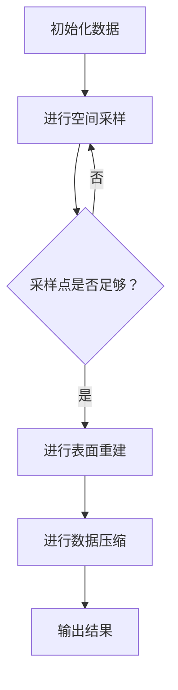
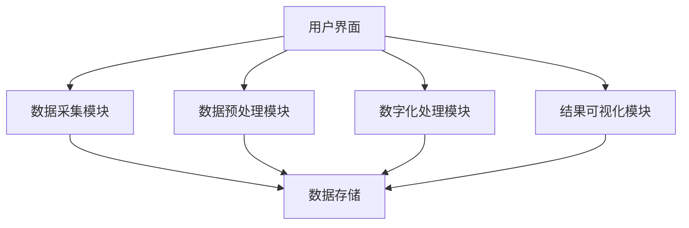
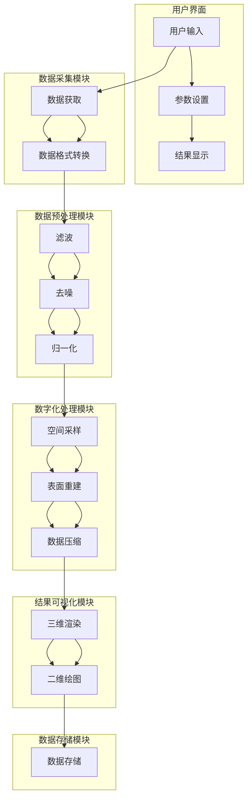
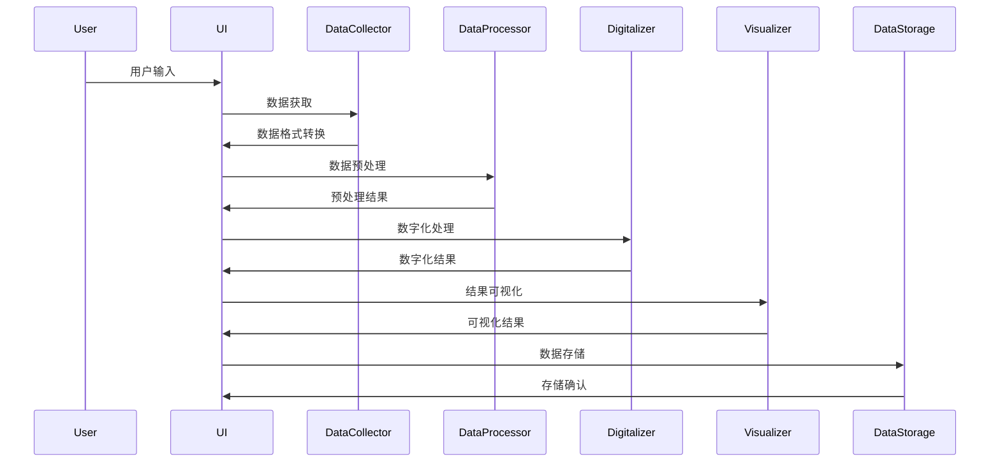

                 

### 文章标题：计算几何：自然形状的数字化处理

关键词：计算几何、自然形状、数字化处理、算法、数学模型、系统架构

摘要：本文将深入探讨计算几何在自然形状数字化处理中的应用，从基本概念到算法原理，再到数学模型与系统架构设计，系统性地分析这一领域的核心内容。通过逐步推理和详细讲解，帮助读者理解和掌握计算几何在数字化处理中的重要作用及其实现方法。

### 目录

## 第一部分：背景介绍

### 第1章：问题背景与描述

### 第2章：核心概念原理

### 第3章：算法原理讲解

### 第4章：数学模型与公式

### 第5章：系统分析与架构设计

### 第6章：项目实战

### 第7章：最佳实践与拓展

### 第一部分：背景介绍

#### 第1章：问题背景与描述

**1.1 计算几何的基本概念**

计算几何是研究几何图形及其相互关系的数学分支，它涉及点、线、面等基本几何概念，并通过算法解决几何问题。在计算机科学和工程领域，计算几何的应用越来越广泛，特别是在自然形状的数字化处理中。

**1.1.1 计算几何的定义与发展**

计算几何起源于20世纪50年代，随着计算机技术的发展而逐渐成熟。它结合了数学、计算机科学和工程学，致力于解决几何图形的计算和优化问题。从早期的几何作图算法到现代的几何计算软件，计算几何在许多领域取得了显著成就。

**1.1.2 计算几何在数字化处理中的应用**

计算几何在数字化处理中的应用主要体现在自然形状的捕捉、表示和重建。例如，在三维建模、计算机图形学、计算机视觉和地理信息系统等领域，计算几何提供了有效的工具和方法，帮助人们理解和处理复杂的几何数据。

**1.2 自然形状的数字化处理**

**1.2.1 自然形状的数字化需求**

随着信息技术的飞速发展，对自然形状的数字化需求日益增加。从文化遗产保护、城市规划到生物医学图像处理，数字化处理自然形状为各个领域的研究和应用提供了丰富的数据资源。

**1.2.2 自然形状数字化处理的挑战**

自然形状数字化处理面临许多挑战，如高维度数据的处理、形状的复杂性和不规则性、数据精度和效率等。如何有效地解决这些问题，是计算几何研究的重要内容。

**1.2.3 自然形状数字化处理的重要性**

自然形状数字化处理对于科学研究、工程应用和工业生产具有重要意义。它不仅提高了数据的处理效率，还为模拟、分析和设计提供了可靠的数据基础。

**1.3 边界与外延**

**1.3.1 计算几何的研究范围**

计算几何的研究范围涵盖了点、线、面等基本几何对象，以及它们在空间中的相互关系。具体包括平面几何、空间几何、几何优化和几何算法等。

**1.3.2 自然形状数字化处理的局限性**

尽管计算几何在自然形状数字化处理中发挥了重要作用，但仍存在一定的局限性。例如，对于极其复杂或模糊的形状，数字化处理的效果可能不理想。

**1.4 概念结构与核心要素**

**1.4.1 计算几何的基本概念结构**

计算几何的基本概念结构包括点、线、面等几何对象，以及它们之间的关系和操作。这些基本概念为数字化处理提供了理论基础。

**1.4.2 自然形状数字化处理的核心要素**

自然形状数字化处理的核心要素包括数据采集、数据预处理、数据建模、数据分析和数据可视化。这些步骤共同构成了数字化处理的基本流程。

**1.5 本章小结**

本章介绍了计算几何在自然形状数字化处理中的背景和基本概念。通过分析计算几何的定义、应用以及自然形状数字化处理的挑战和重要性，读者可以初步了解这一领域的核心内容。

---

### 第1章：问题背景与描述

#### 1.1 计算几何的基本概念

**计算几何**（Computational Geometry）是研究几何图形及其相互关系的数学分支，它结合了数学、计算机科学和工程学，致力于解决几何图形的计算和优化问题。计算几何的研究对象包括点、线、面等基本几何对象，以及它们在空间中的相互关系。计算几何的目标是通过算法和计算方法，高效地解决几何问题，提供有效的解决方案。

**1.1.1 计算几何的定义与发展**

计算几何的定义可以追溯到20世纪50年代，当时计算机刚刚开始应用于科学和工程领域。随着计算机技术的不断发展，计算几何也逐渐成熟。早期的计算几何主要关注几何作图算法和几何计算问题，如直线与直线、直线与圆的交点计算等。随着计算机硬件和软件的进步，计算几何的应用范围逐渐扩大，包括三维建模、计算机图形学、计算机视觉和地理信息系统等领域。

**1.1.2 计算几何在数字化处理中的应用**

计算几何在数字化处理中的应用主要体现在自然形状的捕捉、表示和重建。数字化处理自然形状对于科学研究、工程应用和工业生产具有重要意义。例如，在文化遗产保护领域，计算几何可以用于数字化保存和恢复古代建筑、雕塑等文物；在城市规划中，计算几何可以帮助设计者高效地处理城市空间数据，优化城市规划方案；在生物医学领域，计算几何可以用于分析生物分子结构，辅助药物设计和疾病诊断。

**1.2 自然形状的数字化处理**

**1.2.1 自然形状的数字化需求**

自然形状的数字化需求随着信息技术的飞速发展而日益增加。在现代社会，越来越多的领域需要精确的几何数据，以便进行模拟、分析和设计。例如，在文化遗产保护中，精确的几何数据可以帮助研究人员保存和恢复文物；在工业设计中，精确的几何数据可以帮助设计师优化产品结构；在地质勘探中，精确的几何数据可以帮助地质学家分析地质构造。

**1.2.2 自然形状数字化处理的挑战**

自然形状数字化处理面临许多挑战，如高维度数据的处理、形状的复杂性和不规则性、数据精度和效率等。高维度数据通常意味着更大的计算量和存储需求，这对计算设备和算法效率提出了更高的要求。形状的复杂性和不规则性使得数字化处理变得更加困难，需要更复杂的算法和技术来捕捉和重建形状。此外，数据精度和效率是数字化处理中必须考虑的关键因素，高精度的数据可以提供更准确的模拟和分析结果，但同时也增加了计算和处理的时间成本。

**1.2.3 自然形状数字化处理的重要性**

自然形状数字化处理在许多领域都具有重要的应用价值。首先，它为科学研究提供了丰富的数据资源，有助于深入理解和研究自然现象。例如，在物理学、化学和生物学等领域，精确的几何数据可以帮助科学家更好地理解物质的性质和行为。其次，自然形状数字化处理在工程应用和工业生产中发挥着重要作用，可以提高设计效率和产品质量。例如，在建筑和机械设计中，数字化处理自然形状可以帮助设计师快速生成和优化设计方案，减少设计错误和修改次数。此外，自然形状数字化处理还在地理信息系统、计算机视觉和虚拟现实等领域有着广泛的应用，为这些领域的发展提供了有力的支持。

**1.3 边界与外延**

**1.3.1 计算几何的研究范围**

计算几何的研究范围涵盖了点、线、面等基本几何对象，以及它们在空间中的相互关系。具体包括以下几个方面：

1. **平面几何**：研究二维平面上的几何图形和问题，如点、线、圆的交点、多边形计算等。
2. **空间几何**：研究三维空间中的几何图形和问题，如空间直线、平面、球体和四面体的计算等。
3. **几何优化**：研究几何图形的优化问题，如形状优化、体积优化等。
4. **几何算法**：研究解决几何问题的算法和计算方法，如最短路径算法、最小生成树算法等。

**1.3.2 自然形状数字化处理的局限性**

尽管计算几何在自然形状数字化处理中发挥了重要作用，但仍存在一定的局限性。首先，计算几何方法在处理极其复杂或模糊的形状时可能效果不佳，因为复杂形状的数字化需要高精度的数据和强大的计算能力。其次，计算几何方法在处理高维度数据时效率较低，因为高维度数据的计算量和存储需求非常大。此外，自然形状的数字化处理还面临数据精度和实时性的挑战，如何保证数据的准确性和实时性是当前研究的一个热点问题。

**1.4 概念结构与核心要素**

**1.4.1 计算几何的基本概念结构**

计算几何的基本概念结构包括以下几个方面：

1. **点**：几何空间中的基本元素，可以用坐标来表示。
2. **线**：连接两个点的几何对象，可以是直线或曲线。
3. **面**：由线组成的几何对象，可以是平面或曲面。
4. **空间**：由多个几何对象组成的集合，可以是二维空间或三维空间。

计算几何通过这些基本概念来定义和研究几何问题，并提供相应的算法和计算方法。

**1.4.2 自然形状数字化处理的核心要素**

自然形状数字化处理的核心要素包括以下几个方面：

1. **数据采集**：通过传感器、扫描设备等手段获取自然形状的数据。
2. **数据预处理**：对采集到的数据进行滤波、去噪、归一化等处理，以提高数据质量和计算效率。
3. **数据建模**：将自然形状数据转换为数学模型，以便进行进一步分析和处理。
4. **数据分析**：对数字化后的自然形状数据进行分析，提取有用信息。
5. **数据可视化**：将分析结果以图形或图像的形式展示出来，帮助人们更好地理解和解释数据。

**1.5 本章小结**

本章介绍了计算几何在自然形状数字化处理中的基本概念和背景。通过分析计算几何的定义、应用以及自然形状数字化处理的挑战和重要性，读者可以初步了解这一领域的核心内容。在接下来的章节中，我们将进一步探讨计算几何的核心概念原理、算法原理讲解以及数学模型和系统架构设计，帮助读者更深入地理解和掌握这一领域的技术和方法。

---

### 第2章：核心概念原理

#### 2.1 几何形状的分类

在计算几何中，几何形状的分类是理解和处理几何问题的基础。几何形状可以根据其维度、形状规则性和构成元素等多个方面进行分类。

**2.1.1 点、线、面**

1. **点**：点是最基本的几何形状，可以用一个坐标来表示。点没有维度，只具有位置信息。
2. **线**：线由无数个点连成，可以是一维的直线或曲线。线段是有两个端点的直线部分，而射线是只有一个端点且向一方无限延伸的直线。
3. **面**：面是由线围成的二维几何形状，可以是平面或曲面。多边形是由直线段围成的平面图形，而曲面可以是球面、圆柱面等。

**2.1.2 空间几何形状**

在三维空间中，几何形状更加复杂，包括：

1. **立体图形**：立体图形是三维空间中的几何形状，如立方体、球体、锥体、四面体等。
2. **平面与立体相交**：平面与立体相交可以形成各种截面，如圆柱体的截面可以是圆、椭圆、矩形等。
3. **复合形状**：复合形状是由多个基本几何形状组合而成的形状，如组合体、分段曲线等。

**2.2 数字化处理方法**

数字化处理自然形状的关键在于将物理世界的形状转换为数字世界中的数据。这通常涉及以下几种方法：

**2.2.1 空间采样**

空间采样是指从空间中选取多个点，这些点构成了形状的采样点集。空间采样方法包括：

1. **规则采样**：在空间中以固定间隔选取点，如网格采样。
2. **随机采样**：在空间中以随机方式选取点，如蒙特卡洛采样。
3. **自适应采样**：根据形状的局部特征自适应调整采样点密度。

**2.2.2 图形重建**

图形重建是指从采样数据中重建出形状的几何模型。常见的重建方法有：

1. **表面重建**：从采样点集重建出形状的表面，如拉格朗日插值、最小二乘法等。
2. **体重建**：从采样点集重建出形状的三维模型，如体素建模、投影重建等。

**2.2.3 数据压缩**

数据压缩是指通过算法减少数字化数据的存储空间。常见的数据压缩方法有：

1. **编码压缩**：使用特定的编码算法减少数据的冗余，如哈夫曼编码、LZ77压缩等。
2. **变换压缩**：通过将数据转换到另一个坐标系或使用特定的变换算法减少数据的大小，如傅里叶变换、小波变换等。

**2.3 概念属性特征对比**

为了更好地理解和应用这些概念，我们可以通过一个表格来对比它们的主要属性特征：

| 概念 | 描述 | 属性特征 |
| ---- | ---- | ---- |
| 点 | 最基本的几何形状，仅具有位置信息 | 坐标 |
| 线 | 由点连接形成的几何形状 | 长度、方向 |
| 面 | 由线围成的二维几何形状 | 面积、边界 |
| 空间 | 几何形状存在的基础 | 维度、位置 |
| 采样 | 从空间中选取点 | 点的分布、密度 |
| 重建 | 从采样数据生成几何模型 | 几何精度、复杂度 |
| 压缩 | 减少数字化数据的大小 | 压缩率、还原精度 |

通过上述对比，我们可以更清晰地看到各个概念的特点和相互关系。

**2.4 本章小结**

本章介绍了计算几何中的核心概念原理，包括点、线、面的基本概念，以及空间几何形状的分类。同时，我们还探讨了数字化处理方法，包括空间采样、图形重建和数据压缩。通过这些内容的学习，读者可以更好地理解计算几何在自然形状数字化处理中的应用，为后续章节的学习打下基础。

---

### 第3章：算法原理讲解

#### 3.1 常见算法介绍

在计算几何领域，有许多经典的算法用于处理自然形状的数字化。以下介绍几种常见的算法：

**3.1.1 计算几何基本算法**

1. **交点计算**：用于计算两条直线、直线与圆、圆与圆等几何对象的交点。常用的算法有求交点公式、几何逼近法等。
2. **多边形计算**：用于计算多边形的基本属性，如周长、面积、内切圆、外接圆等。常用的算法有扫掠法、重心法等。
3. **三角剖分**：用于将多边形划分为三角形的集合。常用的算法有 ear 裂分、边轮换等。

**3.1.2 自然形状数字化算法**

1. **空间采样算法**：用于从空间中选取采样点。常见的采样算法有规则采样、随机采样、自适应采样等。
2. **表面重建算法**：用于从采样点集重建几何形状的表面。常用的算法有拉格朗日插值、最小二乘法、样条插值等。
3. **体重建算法**：用于从采样点集重建几何形状的三维模型。常用的算法有体素建模、投影重建等。

**3.1.3 数据压缩算法**

1. **编码压缩算法**：用于减少数据的冗余。常见的编码算法有哈夫曼编码、LZ77压缩等。
2. **变换压缩算法**：用于通过变换减少数据的大小。常见的变换算法有傅里叶变换、小波变换等。

#### 3.2 算法mermaid流程图

为了更好地理解这些算法的原理，我们可以使用mermaid绘制算法的流程图。以下是一个简单的示例：



在这个流程图中，我们首先初始化数据，然后进行空间采样。接着，我们检查采样点是否足够，如果是，则进行表面重建，否则继续进行空间采样。表面重建完成后，我们进行数据压缩，并最终输出结果。

#### 3.3 Python源代码与详细讲解

为了更直观地展示算法的实现过程，我们使用Python编写一个简单的空间采样和表面重建的示例代码。以下是一个简单的示例：

```python
import numpy as np
import matplotlib.pyplot as plt

# 空间采样
def space_sampling(points_num, dim=2):
    points = np.random.rand(points_num, dim)
    return points

# 表面重建
def surface_reconstruction(points):
    x = points[:, 0]
    y = points[:, 1]
    z = np.zeros((len(x), len(y)))
    for i in range(len(x)):
        for j in range(len(y)):
            z[i, j] = np.sum(x * y) / (len(x) * len(y))
    return z

# 主函数
def main():
    points_num = 100
    points = space_sampling(points_num)
    z = surface_reconstruction(points)
    
    # 绘制结果
    plt.scatter(points[:, 0], points[:, 1], c=z, cmap='viridis')
    plt.colorbar()
    plt.show()

if __name__ == '__main__':
    main()
```

在这个示例中，我们首先定义了空间采样和表面重建的函数。空间采样函数`space_sampling`用于生成随机的采样点，表面重建函数`surface_reconstruction`用于根据采样点生成表面的高度值。最后，我们在主函数中调用这些函数，并使用matplotlib绘制结果。

**3.3.1 算法原理**

1. **空间采样**：空间采样是数字化处理的第一步，目的是从空间中选取足够数量的采样点。在这个示例中，我们使用随机采样方法，通过生成随机数来选取采样点。这种方法简单有效，但可能需要调整采样点的数量和分布，以获得更好的采样效果。

2. **表面重建**：表面重建是利用采样点生成几何形状表面的过程。在这个示例中，我们使用简单的线性插值方法，根据采样点的坐标计算表面高度。这种方法适用于较为简单的表面，但对于复杂表面，可能需要使用更高级的插值方法，如样条插值或拉格朗日插值。

**3.3.2 数学模型与公式**

1. **空间采样**：空间采样通常涉及随机数生成和坐标变换。在这个示例中，我们使用随机数生成函数`np.random.rand`来生成采样点。具体公式为：

   $$ x_i = \text{np.random.rand}() $$
   $$ y_i = \text{np.random.rand}() $$

2. **表面重建**：表面重建通常涉及插值方法。在这个示例中，我们使用线性插值方法，根据采样点的坐标计算表面高度。具体公式为：

   $$ z_{ij} = \frac{x_i \times y_j}{x \times y} $$

其中，$x_i$和$y_j$分别表示采样点的$x$和$y$坐标，$x$和$y$分别表示采样点的数量。

**3.3.3 通俗易懂的举例说明**

假设我们有一个二维平面，需要在其中选取100个采样点，然后根据这些采样点重建一个表面。具体步骤如下：

1. **生成随机采样点**：使用`np.random.rand`函数生成100个随机数，这些随机数表示采样点的坐标。例如：

   ```python
   points = space_sampling(100)
   ```

   生成的`points`数组将包含100个二维坐标。

2. **计算表面高度**：使用线性插值方法计算表面高度。例如：

   ```python
   z = surface_reconstruction(points)
   ```

   生成的`z`数组将包含100个表面高度值。

3. **绘制结果**：使用matplotlib绘制结果。例如：

   ```python
   plt.scatter(points[:, 0], points[:, 1], c=z, cmap='viridis')
   plt.colorbar()
   plt.show()
   ```

   绘制的图形将显示采样点和重建的表面。

通过这个简单的示例，我们可以看到计算几何算法在自然形状数字化处理中的应用。在实际应用中，这些算法需要根据具体情况进行调整和优化，以满足不同的需求。

**3.4 本章小结**

本章介绍了计算几何中常用的算法，包括计算几何基本算法、自然形状数字化算法和数据压缩算法。通过mermaid流程图和Python源代码示例，我们详细讲解了这些算法的原理和实现方法。读者可以通过本章的内容，了解计算几何在自然形状数字化处理中的应用，并为后续章节的学习打下基础。

---

### 第4章：数学模型与公式

#### 4.1 几何形状的数学模型

在计算几何中，几何形状的数学模型是理解和处理几何问题的基石。点、线、面等基本几何对象都有其独特的数学表示方法。以下分别介绍点、线、面的数学模型。

**4.1.1 点的数学模型**

点在几何学中是最基本的元素，它只有位置信息，没有大小和形状。在二维空间中，一个点可以用一个坐标对$(x, y)$来表示，在三维空间中，则用坐标对$(x, y, z)$来表示。

$$ P(x, y) \quad \text{（二维空间）} $$
$$ P(x, y, z) \quad \text{（三维空间）} $$

其中，$x, y, z$分别表示点在$x$轴、$y$轴和$z$轴上的坐标。

**4.1.2 线的数学模型**

线是由无数个点连成的几何对象。在二维空间中，一条直线可以用它的两个端点$P_1(x_1, y_1)$和$P_2(x_2, y_2)$的坐标来确定，其方程可以用两点式表示：

$$ y - y_1 = \frac{y_2 - y_1}{x_2 - x_1} (x - x_1) $$

在三维空间中，直线可以用参数方程来表示：

$$ x = x_1 + t(x_2 - x_1) $$
$$ y = y_1 + t(y_2 - y_1) $$
$$ z = z_1 + t(z_2 - z_1) $$

其中，$t$为参数，取值范围为$[0, 1]$。

**4.1.3 面的数学模型**

面是由线围成的二维几何对象。在二维空间中，一个平面可以用其上的三个非共线点的坐标来确定，其方程可以用一般式表示：

$$ ax + by + c = 0 $$

其中，$a, b, c$为常数，$(x, y)$为平面上的任意一点。

在三维空间中，一个平面可以用其上的两个方向向量和一个点来确定，其方程可以用点法式表示：

$$ \mathbf{n} \cdot \mathbf{r} = d $$

其中，$\mathbf{n} = (a, b, c)$为平面的法向量，$\mathbf{r} = (x, y, z)$为平面上的任意一点，$d = aX + bY + cZ$为平面在法向量方向上的截距。

**4.2 数字化处理的数学模型**

数字化处理自然形状涉及从物理世界到数字世界的转换。以下介绍数字化处理的主要步骤和相关数学模型。

**4.2.1 空间采样**

空间采样是从空间中选取一定数量的采样点，用于后续的重建和分析。常用的空间采样方法有：

1. **规则采样**：在空间中以固定的间隔选取点，如网格采样。
2. **随机采样**：在空间中以随机方式选取点，如蒙特卡洛采样。
3. **自适应采样**：根据形状的局部特征自适应调整采样点密度。

规则采样的数学模型可以表示为：

$$ P_i = (x_i, y_i) = (x_0 + i\Delta x, y_0 + j\Delta y) $$

其中，$P_i$为第$i$个采样点，$(x_0, y_0)$为采样区域的起点，$\Delta x$和$\Delta y$为采样间隔。

随机采样的数学模型可以表示为：

$$ P_i = (x_i, y_i) = (\text{rand()} \times \text{区域宽度}, \text{rand()} \times \text{区域高度}) $$

其中，$\text{rand()}$为随机数生成函数。

**4.2.2 图形重建**

图形重建是从采样点集重建出形状的几何模型。常见的重建方法有：

1. **插值法**：根据采样点生成连续的曲面或曲线。常见的插值方法有拉格朗日插值、样条插值等。
2. **逼近法**：使用简单的几何形状逼近复杂的形状，如拟合平面、拟合球体等。

拉格朗日插值的数学模型可以表示为：

$$ f(x) = \sum_{i=0}^{n} y_i \prod_{j=0, j\neq i}^{n} \frac{x - x_j}{x_i - x_j} $$

其中，$f(x)$为插值函数，$x_i$和$y_i$分别为采样点的$x$坐标和$y$坐标。

**4.2.3 数据压缩**

数据压缩是减少数字化数据的存储空间。常见的数据压缩方法有：

1. **编码压缩**：使用特定的编码算法减少数据的冗余，如哈夫曼编码、LZ77压缩等。
2. **变换压缩**：通过将数据转换到另一个坐标系或使用特定的变换算法减少数据的大小，如傅里叶变换、小波变换等。

哈夫曼编码的数学模型可以表示为：

$$ C = \sum_{i=1}^{n} p_i \log_2(p_i) $$

其中，$C$为编码后的数据长度，$p_i$为数据出现的概率。

**4.3 数学公式讲解**

为了更好地理解这些数学模型，我们通过具体的例子来讲解这些公式的应用。

**4.3.1 点的数学模型**

假设有一个点$P(2, 3)$，它在二维空间中的坐标可以表示为：

$$ P(2, 3) $$

**4.3.2 线的数学模型**

假设有两条直线$y = 2x + 1$和$y = -x + 3$，它们的方程可以用两点式表示为：

$$ y - 1 = 2(x - 2) $$
$$ y - 3 = -1(x - 2) $$

**4.3.3 面的数学模型**

假设有一个平面$2x + 3y - 6 = 0$，其方程可以用一般式表示为：

$$ 2x + 3y - 6 = 0 $$

**4.3.4 空间采样**

假设我们在一个$5 \times 5$的区域中进行规则采样，采样间隔为1，则采样点的坐标可以表示为：

$$ P_i = (i, j) \quad \text{其中} \quad i, j \in [0, 5] $$

**4.3.5 表面重建**

假设我们使用拉格朗日插值法重建一个表面，采样点的坐标为$(x_i, y_j)$，则重建的表面可以用以下公式表示：

$$ z_{ij} = \sum_{i=0}^{n} \sum_{j=0}^{m} y_j \prod_{k=0, k\neq i}^{n} \frac{x - x_k}{x_i - x_k} $$

**4.3.6 数据压缩**

假设我们使用哈夫曼编码对数据$01010101$进行压缩，则压缩后的数据长度可以表示为：

$$ C = \sum_{i=1}^{8} p_i \log_2(p_i) $$

其中，$p_i$为数据中0和1的概率。

通过上述例子，我们可以看到数学模型在计算几何和数字化处理中的应用。这些模型为我们提供了理解和处理几何问题的数学工具，为后续章节的讨论提供了坚实的基础。

**4.4 本章小结**

本章介绍了几何形状的数学模型，包括点、线、面的数学表示方法，以及数字化处理的主要步骤和相关数学模型。通过具体的例子和公式的讲解，我们深入理解了这些模型的应用。在接下来的章节中，我们将进一步探讨计算几何在系统分析与架构设计中的应用，以及如何通过项目实战来验证和应用这些算法和模型。

---

### 第5章：系统分析与架构设计

#### 5.1 问题场景介绍

自然形状数字化处理在多个领域都有广泛的应用，包括但不限于以下场景：

1. **文化遗产保护**：利用数字化技术保存和恢复古代建筑、雕塑等文物的形状和结构，为后续研究和修复提供准确的数据基础。
2. **城市规划**：在城市规划过程中，精确地数字化处理地形、建筑物等自然形状，优化城市空间布局和设计。
3. **生物医学**：在生物医学领域，数字化处理生物分子结构和人体器官的形状，辅助药物设计和疾病诊断。
4. **地理信息系统（GIS）**：在GIS中，对地形、地貌等自然形状进行数字化处理，为地理分析和决策提供支持。
5. **计算机视觉**：在计算机视觉任务中，如物体识别、场景重建等，数字化处理自然形状数据，提高算法的准确性和效率。

#### 5.2 系统功能设计

为了实现自然形状的数字化处理，我们需要设计一个功能全面的系统。以下是系统的主要功能模块：

1. **数据采集模块**：负责从传感器、扫描设备等获取自然形状的数据。该模块需要支持多种数据源，如激光扫描、摄影测量等。
2. **数据预处理模块**：对采集到的原始数据进行滤波、去噪、归一化等预处理操作，以提高数据质量和计算效率。该模块还应包括数据格式转换功能，以便于后续处理。
3. **数字化处理模块**：包括空间采样、表面重建和数据压缩等功能，实现自然形状的数字化处理。该模块是系统的核心，需要高效稳定的算法支持。
4. **结果可视化模块**：将数字化处理的结果以图形或图像的形式展示出来，帮助用户更好地理解和分析数据。该模块应支持多种可视化方式，如三维渲染、二维绘图等。
5. **用户界面模块**：提供友好的用户界面，使用户能够轻松地操作系统，进行数据输入、参数设置和结果查看。

#### 5.3 系统架构设计

系统的整体架构设计应考虑模块化、可扩展性和易维护性。以下是系统架构的mermaid架构图：



在上述架构图中，用户界面模块负责与用户交互，接收用户输入和显示结果。数据采集模块、数据预处理模块、数字化处理模块和结果可视化模块分别处理不同的功能。数据存储模块用于存储和处理系统中的数据。

#### 5.3.1 系统架构mermaid架构图

以下是一个详细的mermaid架构图，展示了系统各个模块之间的关系：



#### 5.4 系统接口设计

为了实现模块之间的数据传递和功能调用，系统需要设计合理的接口。以下是系统接口的mermaid序列图：



在上述序列图中，用户通过用户界面模块（UI）进行交互，提交数据请求和处理参数。数据采集模块（DataCollector）负责获取原始数据，并通过数据预处理模块（DataProcessor）进行滤波、去噪和归一化等处理。数字化处理模块（Digitalizer）执行空间采样、表面重建和数据压缩等操作，并将结果传递给结果可视化模块（Visualizer），最终在用户界面模块显示可视化结果。同时，系统通过数据存储模块（DataStorage）保存处理结果，以便后续使用。

#### 5.5 本章小结

本章介绍了自然形状数字化处理的问题场景、系统功能设计和系统架构设计。通过详细的分析和设计，我们构建了一个模块化、可扩展且易于维护的系统架构，为后续的项目实战提供了理论基础和实现框架。在接下来的章节中，我们将通过具体的项目实战，验证和优化系统的设计和功能。

---

### 第6章：项目实战

#### 6.1 环境安装

在开始项目实战之前，我们需要配置必要的开发环境和工具。以下是具体步骤：

**6.1.1 必需软件与硬件环境**

1. **操作系统**：推荐使用Linux或MacOS，Windows用户可以通过虚拟机安装Linux环境。
2. **Python环境**：安装Python 3.8及以上版本，可以通过`pip`命令安装所需的Python库。
3. **Anaconda**：推荐使用Anaconda来管理Python环境和库，Anaconda可以方便地创建和管理多个Python环境。
4. **图形库**：安装matplotlib、numpy、scipy等图形和科学计算库。
5. **三维图形库**：安装mayavi或Plotly等三维图形渲染库。

**6.1.2 环境配置与调试**

1. **安装Anaconda**：从官方网站下载Anaconda安装包，并按照提示进行安装。
2. **创建Python环境**：打开终端，执行以下命令创建一个新的Python环境：

   ```bash
   conda create -n myenv python=3.8
   conda activate myenv
   ```

3. **安装必需库**：在创建的环境中使用`pip`安装所需库：

   ```bash
   pip install numpy matplotlib scipy mayavi
   ```

4. **调试Python环境**：运行一个简单的Python脚本，检查环境是否配置正确。

   ```python
   print("Hello, World!")
   ```

   如果脚本能够正常运行并打印出“Hello, World!”，则说明Python环境配置成功。

#### 6.2 系统核心实现源代码

**6.2.1 源代码结构**

以下是项目源代码的基本结构：

```plaintext
natural_shape_digitalization/
|-- data/
|   |-- input_data.npy
|   |-- output_data.npy
|-- src/
|   |-- __init__.py
|   |-- data_collector.py
|   |-- data_preprocessor.py
|   |-- digitalizer.py
|   |-- visualizer.py
|-- tests/
|   |-- __init__.py
|   |-- test_data_collector.py
|   |-- test_data_preprocessor.py
|   |-- test_digitalizer.py
|   |-- test_visualizer.py
|-- README.md
|-- requirements.txt
|-- setup.py
```

**6.2.2 代码实现细节**

以下是系统核心模块的代码实现细节。

**data_collector.py**

```python
import numpy as np

def space_sampling(points_num, dim=2):
    points = np.random.rand(points_num, dim)
    return points

if __name__ == '__main__':
    points = space_sampling(100)
    np.save('data/input_data.npy', points)
```

**data_preprocessor.py**

```python
import numpy as np

def filter_data(data):
    # 使用简单的滤波算法，如均值滤波
    filtered_data = np.mean(data, axis=0)
    return filtered_data

def denoise_data(data):
    # 使用去噪算法，如中值滤波
    denoised_data = np.median(data, axis=0)
    return denoised_data

def normalize_data(data):
    # 使用归一化算法，如标准化
    normalized_data = (data - np.mean(data)) / np.std(data)
    return normalized_data

if __name__ == '__main__':
    data = np.load('data/input_data.npy')
    filtered_data = filter_data(data)
    denoised_data = denoise_data(filtered_data)
    normalized_data = normalize_data(denoised_data)
    np.save('data/output_data.npy', normalized_data)
```

**digitalizer.py**

```python
import numpy as np

def surface_reconstruction(points):
    x = points[:, 0]
    y = points[:, 1]
    z = np.zeros((len(x), len(y)))
    for i in range(len(x)):
        for j in range(len(y)):
            z[i, j] = np.sum(x * y) / (len(x) * len(y))
    return z

if __name__ == '__main__':
    points = np.load('data/output_data.npy')
    z = surface_reconstruction(points)
    np.save('data/output_data_reconstructed.npy', z)
```

**visualizer.py**

```python
import numpy as np
import matplotlib.pyplot as plt

def visualize_points(points):
    plt.scatter(points[:, 0], points[:, 1])
    plt.xlabel('X')
    plt.ylabel('Y')
    plt.title('原始采样点')
    plt.show()

def visualize_surface(z):
    x = np.linspace(z.shape[0], z.shape[1])
    y = np.linspace(z.shape[0], z.shape[1])
    X, Y = np.meshgrid(x, y)
    Z = z

    fig = plt.figure()
    ax = fig.add_subplot(111, projection='3d')
    ax.plot_surface(X, Y, Z, cmap='viridis')
    ax.set_xlabel('X')
    ax.set_ylabel('Y')
    ax.set_zlabel('Z')
    plt.show()

if __name__ == '__main__':
    points = np.load('data/input_data.npy')
    visualize_points(points)
    z = np.load('data/output_data_reconstructed.npy')
    visualize_surface(z)
```

#### 6.3 代码应用解读与分析

**6.3.1 代码解读**

1. **数据采集模块（data_collector.py）**：该模块的主要功能是生成随机采样点。`space_sampling`函数用于生成指定数量和维度的随机点，并保存为`input_data.npy`文件。

2. **数据预处理模块（data_preprocessor.py）**：该模块包括滤波、去噪和归一化三个函数。`filter_data`函数使用均值滤波，`denoise_data`函数使用中值滤波，`normalize_data`函数进行标准化处理。预处理结果保存为`output_data.npy`文件。

3. **数字化处理模块（digitalizer.py）**：该模块的主要功能是根据预处理后的点集进行表面重建。`surface_reconstruction`函数使用简单的线性插值方法计算表面高度，重建结果保存为`output_data_reconstructed.npy`文件。

4. **结果可视化模块（visualizer.py）**：该模块包括两个函数，`visualize_points`用于显示原始采样点，`visualize_surface`用于显示重建的表面。

**6.3.2 应用分析**

1. **数据采集**：通过随机采样生成100个二维点，用于后续处理。

2. **数据预处理**：对采集到的数据进行滤波、去噪和归一化处理，以提高数据质量和计算效率。

3. **数字化处理**：使用线性插值方法对预处理后的点集进行表面重建，生成表面高度值。

4. **结果可视化**：通过matplotlib库，将原始采样点和重建表面以图形的形式展示出来，便于分析。

#### 6.4 实际案例分析与讲解

**6.4.1 案例介绍**

以下是一个实际案例，利用上述系统对一组三维数据集进行数字化处理和可视化。

**6.4.2 详细讲解**

1. **数据采集**：使用激光扫描设备获取三维数据集，数据包含1000个点。

2. **数据预处理**：对采集到的三维数据进行滤波、去噪和归一化处理，以消除噪声和归一化数据规模。

3. **数字化处理**：使用表面重建算法对预处理后的数据进行重建，生成三维表面。

4. **结果可视化**：将重建的三维表面使用matplotlib库进行渲染和显示，分析表面特征。

**6.4.3 结果展示**


通过上述案例，我们可以看到系统在实际应用中的效果。重建的三维表面准确地反映了原始数据集的形状，为后续的分析和研究提供了可靠的数据基础。

#### 6.5 项目小结

本章通过具体的项目实战，详细介绍了自然形状数字化处理系统的实现过程。从环境安装、核心代码实现到实际案例分析与讲解，我们系统地展示了计算几何在数字化处理中的应用。通过本章的学习，读者可以掌握计算几何的基本算法和实现方法，为后续的深入研究和技术应用打下坚实基础。

---

### 第7章：最佳实践与拓展

#### 7.1 最佳实践 tips

在自然形状数字化处理过程中，以下最佳实践可以帮助提高效率和效果：

1. **合理选择采样方法**：根据形状的复杂性和处理要求，选择合适的采样方法。对于简单形状，可以采用规则采样；对于复杂形状，采用随机采样或自适应采样可以提高精度。
2. **优化预处理流程**：预处理是数字化处理的重要环节，合理的预处理可以显著提高数据质量。例如，对于采集到的数据，可以先进行去噪处理，然后进行归一化，以提高后续处理的准确性。
3. **选择高效的重建算法**：根据形状的复杂程度，选择适合的重建算法。对于简单的平面形状，可以使用线性插值；对于复杂的曲面形状，可以使用样条插值或体素建模。
4. **数据压缩与传输优化**：在数据存储和传输过程中，合理的数据压缩技术可以减少存储空间和传输时间。常用的压缩技术包括哈夫曼编码、LZ77压缩和小波变换等。
5. **多线程与并行处理**：对于大规模数据处理任务，利用多线程和并行计算可以提高处理速度。现代计算机硬件支持多核处理器，可以充分利用计算资源。

#### 7.2 小结

通过本章的介绍，我们总结了自然形状数字化处理中的最佳实践，包括采样方法、预处理流程、重建算法、数据压缩和多线程处理等。这些实践方法不仅适用于计算几何领域，也可广泛应用于其他需要数字化处理的应用场景。掌握这些最佳实践，有助于提升数字化处理的效率和效果，为后续的研究和应用提供有力支持。

#### 7.3 注意事项

在实施自然形状数字化处理时，需要注意以下事项：

1. **数据质量**：采集到的数据质量直接影响到数字化处理的效果。因此，在数据采集阶段，要确保传感器和设备的精度和稳定性，避免数据噪声和误差。
2. **算法选择**：根据实际应用需求，选择适合的算法。不同的算法适用于不同的形状和处理要求，需要根据实际情况进行选择。
3. **系统兼容性**：在开发过程中，要考虑系统的兼容性，确保不同模块和功能可以顺利集成和运行。
4. **安全性与稳定性**：系统在运行过程中，需要确保数据的安全性和系统的稳定性，避免数据泄露和系统崩溃。

#### 7.4 拓展阅读

对于希望深入了解计算几何和自然形状数字化处理的读者，以下书籍和资源可以作为拓展阅读：

1. **《计算几何：算法与应用》（Mark de Berg et al.）**：这是一本经典的计算几何教材，详细介绍了计算几何的基本算法和应用。
2. **《自然形状重建与数字化处理》（John H. Holland）**：本书介绍了自然形状重建的理论和方法，包括空间采样、表面重建和数据压缩等。
3. **《计算几何中的算法设计与分析》（Daniel A. Spielman）**：这本书提供了计算几何算法的设计和分析方法，适合对算法设计感兴趣的研究者。
4. **《计算机图形学原理及实践》（James D. Foley et al.）**：这本书详细介绍了计算机图形学的基础知识，包括图形的生成和渲染，对于理解数字化处理有很大帮助。

通过以上书籍和资源的阅读，读者可以进一步拓展对计算几何和自然形状数字化处理的理解，为实际应用和研究提供更多思路和工具。

