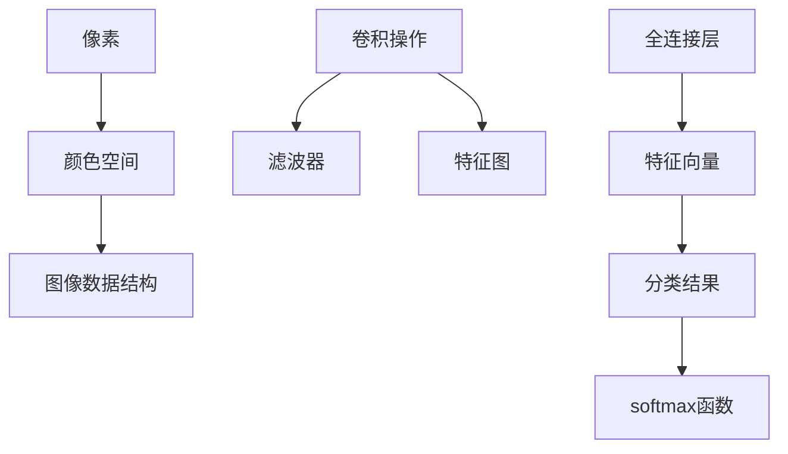

                 

### 问题背景与核心概念

#### 问题背景

计算机视觉，作为人工智能领域的一个重要分支，其研究目标是使计算机具备处理和分析视觉信息的能力，如同人类视觉系统一样。计算机视觉的应用范围广泛，从日常生活中的图像识别、视频监控，到工业生产中的质量检测、医疗影像分析，无不体现出其强大的实用价值。然而，传统的图像处理方法受限于计算能力和处理精度，难以胜任复杂场景下的图像理解和识别任务。

卷积神经网络（Convolutional Neural Networks，CNN）作为深度学习的一种重要模型，于20世纪90年代初期由Yann LeCun等科学家提出。它通过模仿人类视觉系统中的神经结构，对图像进行特征提取和分类，显著提升了计算机视觉的准确性和效率。随着计算能力的提升和大数据的积累，CNN在计算机视觉领域取得了革命性的突破，成为图像识别、目标检测、图像分割等任务的核心技术。

图像理解的数学模型，则是在这一背景下，试图通过数学语言对CNN的运作机制进行深入剖析和理解。这一模型不仅为我们提供了理论指导，也为后续研究和改进提供了基础。通过数学模型，我们可以更好地理解CNN如何通过多层网络结构，逐步提取图像中的特征，并最终进行分类和识别。

#### 核心概念

1. **卷积神经网络（CNN）的基本原理**：
   - **卷积层**：通过卷积操作，从输入图像中提取局部特征。
   - **池化层**：通过下采样操作，减少数据维度，提高计算效率。
   - **全连接层**：将卷积层和池化层提取的特征映射到分类结果。

2. **图像理解的数学模型**：
   - **特征提取**：通过卷积操作，将原始图像转换为高维特征向量。
   - **特征变换**：通过全连接层，对特征向量进行分类和识别。

3. **CNN在图像识别、分类和检测中的角色**：
   - **图像识别**：CNN可以自动提取图像中的关键特征，并对其进行分类。
   - **目标检测**：CNN不仅能够识别图像中的目标，还能定位目标的位置。
   - **图像分割**：CNN可以精确地分割出图像中的不同区域。

#### 联系与边界

- **CNN与其他神经网络模型的比较**：虽然CNN在图像处理领域表现优异，但它与其他神经网络模型（如循环神经网络RNN、生成对抗网络GAN等）各有优势，适用场景不同。
- **图像理解的数学模型与深度学习的联系**：图像理解的数学模型是深度学习的重要组成部分，为其他领域如自然语言处理、语音识别等提供了理论支持。
- **CNN的应用边界和未来展望**：随着技术的不断发展，CNN的应用范围将不断拓展，从传统的图像识别、目标检测，到新兴的虚拟现实、增强现实等。

### 背景介绍与核心概念

计算机视觉（Computer Vision）是人工智能领域的一个核心分支，旨在使计算机具备处理和分析视觉信息的能力。它的发展历程可以追溯到20世纪60年代，当时的研究主要集中在图像处理和模式识别上。随着计算机硬件性能的提升和算法的进步，计算机视觉逐渐从理论研究走向实际应用。

卷积神经网络（CNN）的发展对计算机视觉领域产生了深远的影响。与传统神经网络相比，CNN通过其独特的网络结构和卷积操作，能够更有效地处理图像数据，从低层次特征到高层次语义信息进行特征提取和分类。CNN的提出和发展，标志着计算机视觉从传统方法向深度学习的转型。

图像理解的数学模型则是在这一背景下，试图通过数学语言对CNN的运作机制进行深入剖析和理解。这一模型不仅为我们提供了理论指导，也为后续研究和改进提供了基础。通过数学模型，我们可以更好地理解CNN如何通过多层网络结构，逐步提取图像中的特征，并最终进行分类和识别。

### CNN与其他神经网络模型的比较

在深度学习领域，卷积神经网络（CNN）因其独特的结构和对图像处理的出色性能，成为了计算机视觉领域的主要工具。然而，其他类型的神经网络，如循环神经网络（RNN）和生成对抗网络（GAN），也在各自领域展现了强大的能力。理解CNN与其他神经网络模型之间的差异和联系，有助于我们更好地选择合适的模型来解决特定问题。

#### CNN与RNN的比较

1. **结构差异**：
   - **CNN**：主要适用于图像处理，具有卷积层、池化层和全连接层等结构，通过卷积操作提取图像的局部特征。
   - **RNN**：适用于序列数据，如文本、语音和时序数据，具有循环结构，能够捕捉序列中的长期依赖关系。

2. **功能差异**：
   - **CNN**：擅长图像分类、目标检测和图像分割等任务。
   - **RNN**：擅长处理序列数据，如语言模型、机器翻译和时间序列预测。

3. **应用场景**：
   - **CNN**：广泛应用于图像识别、自动驾驶、医疗影像分析等。
   - **RNN**：广泛应用于自然语言处理、语音识别和时间序列分析。

#### CNN与GAN的比较

1. **结构差异**：
   - **CNN**：主要用于特征提取和分类，具有卷积层和全连接层等结构。
   - **GAN**：由生成器（Generator）和判别器（Discriminator）组成，生成器和判别器通过对抗训练相互提高性能。

2. **功能差异**：
   - **CNN**：用于图像识别、分类和特征提取等。
   - **GAN**：用于生成新的图像、音频和视频，以及在图像修复、风格迁移和图像生成等任务中。

3. **应用场景**：
   - **CNN**：广泛应用于图像识别、自动驾驶和医疗影像分析等领域。
   - **GAN**：广泛应用于图像生成、风格迁移和图像修复等领域。

### 联系与边界

1. **联系**：
   - **CNN与RNN的联系**：尽管CNN和RNN在结构和应用上有所不同，但它们在处理序列数据方面具有一定的互补性。例如，可以结合CNN进行图像特征提取，然后使用RNN处理图像序列。
   - **CNN与GAN的联系**：CNN可以作为GAN中的判别器，用于区分真实图像和生成图像。同时，CNN的卷积操作在GAN的图像生成过程中也有重要作用。

2. **边界**：
   - **CNN的边界**：尽管CNN在图像处理方面表现出色，但在处理高维数据时，如视频或3D图像，可能会面临计算复杂度和模型参数增多的问题。
   - **RNN的边界**：RNN在处理长序列数据时，容易陷入梯度消失或梯度爆炸的问题，影响模型的训练效果。
   - **GAN的边界**：GAN的训练过程不稳定，容易陷入模式崩溃（mode collapse）的问题。此外，生成图像的质量和多样性也是一个挑战。

### 展望

随着深度学习技术的不断发展，CNN、RNN和GAN等模型将在更多领域发挥重要作用。未来，我们可以期待这些模型在多模态数据融合、跨领域迁移学习和实时处理等方面取得更大的突破。同时，通过不断优化和改进，这些模型将更好地应对复杂问题和实际应用场景，为人工智能的发展贡献力量。

### 图像理解的数学模型

图像理解的数学模型是卷积神经网络（CNN）的核心组成部分，它通过数学表达和计算方法，实现了对图像的自动特征提取和分类。本节将详细介绍图像理解数学模型的基本概念、原理和应用。

#### 特征提取

特征提取是图像理解的第一步，其目标是从原始图像中提取出能够代表图像内容的特征。在CNN中，特征提取主要通过卷积层实现。

**卷积操作**

卷积操作是一种数学运算，通过在图像上滑动一个小型的滤波器（卷积核），将滤波器覆盖的区域与图像进行点积操作，生成一个新的特征图。卷积操作的数学公式可以表示为：

$$
f(x, y) = \sum_{i=0}^{n} \sum_{j=0}^{m} w_{ij} \cdot I(x-i, y-j)
$$

其中，$f(x, y)$表示卷积操作后生成的特征值，$w_{ij}$表示卷积核的权重，$I(x, y)$表示图像在坐标$(x, y)$处的像素值。

**特征图**

通过卷积操作，原始图像被转换为一个高维的特征图。特征图的每一个元素都表示图像中某个局部区域的特征强度。多个卷积核的叠加，可以提取出不同尺度和不同类型的特征。

#### 特征变换

特征提取后的特征向量是高维且稠密的，需要进行特征变换以便进行分类。在CNN中，特征变换主要通过全连接层实现。

**全连接层**

全连接层是一种经典的神经网络结构，它的每个神经元都与上一层的所有神经元相连。全连接层的输入是特征向量，输出是概率分布，通常使用softmax函数进行分类。

$$
\text{softmax}(x) = \frac{e^x}{\sum_{i} e^x_i}
$$

其中，$x$是特征向量，$e^x$表示指数函数，$softmax(x)$表示概率分布。

#### 图像分类

图像分类是图像理解的核心任务之一，其目标是根据提取的特征，将图像归类到不同的类别中。在CNN中，图像分类主要通过以下步骤实现：

1. **特征提取**：通过卷积层提取图像的局部特征，生成特征图。
2. **特征变换**：通过全连接层对特征向量进行变换，生成概率分布。
3. **分类决策**：根据概率分布选择最可能的类别。

**案例：MNIST手写数字识别**

MNIST手写数字识别是一个经典图像分类问题，其数据集包含0到9的数字手写体图像。使用CNN进行MNIST手写数字识别的步骤如下：

1. **输入层**：输入一个28x28的灰度图像。
2. **卷积层**：使用多个卷积核提取图像的边缘、线条和纹理等特征。
3. **池化层**：对特征图进行下采样，减少数据维度。
4. **全连接层**：对特征向量进行变换，生成概率分布。
5. **输出层**：使用softmax函数进行分类决策。

通过上述步骤，CNN可以自动提取图像中的关键特征，并准确分类手写数字。

#### 特征提取与特征变换的数学模型

为了更清晰地理解CNN中的特征提取和特征变换过程，我们可以使用数学模型进行详细阐述。

**卷积操作**：

$$
\begin{aligned}
\text{特征图} &= \text{卷积层}(\text{输入图像}, \text{卷积核}) \\
&= \sum_{i=0}^{n} \sum_{j=0}^{m} w_{ij} \cdot \text{输入图像}(x-i, y-j)
\end{aligned}
$$

其中，$w_{ij}$是卷积核的权重，$n$和$m$是卷积核的大小。

**全连接层**：

$$
\begin{aligned}
\text{特征向量} &= \text{全连接层}(\text{特征图}) \\
&= \sum_{i=0}^{k} w_{ij} \cdot \text{特征图}_i
\end{aligned}
$$

其中，$w_{ij}$是全连接层的权重，$k$是全连接层的神经元数量。

**softmax函数**：

$$
\text{概率分布} = \text{softmax}(\text{特征向量})
$$

通过上述数学模型，我们可以看到CNN如何通过卷积操作和全连接层，逐步提取和变换图像特征，实现图像分类。

### 综述

图像理解的数学模型通过卷积操作和全连接层，实现了从原始图像到分类结果的转换。这一模型不仅在理论上提供了对CNN运作机制的深入理解，也在实践中展现了强大的图像处理能力。通过逐步提取和变换图像特征，CNN能够自动识别和理解复杂的视觉信息，为计算机视觉的应用提供了强有力的支持。

### 图像处理的数学基础

图像处理是计算机视觉的基础，其核心在于如何使用数学工具来理解和操作图像数据。在这部分，我们将探讨图像表示、图像变换以及图像理解中的基本数学模型。

#### 图像表示

图像表示是图像处理的第一步，它决定了我们如何存储、传输和处理图像数据。常见的图像表示方法包括像素表示、颜色空间表示和图像数据结构。

1. **像素表示**：
   - 像素是图像的基本组成单位，每个像素对应图像中的一个点。
   - 一个像素通常用一组数值来表示，例如灰度图像中的每个像素用0到255之间的整数表示亮度值，彩色图像中的像素则可能包括红、绿、蓝（RGB）三个颜色分量。

2. **颜色空间表示**：
   - 颜色空间定义了如何将像素的颜色值表示为数学上的向量。
   - 常见颜色空间包括灰度图像（单通道）、RGB图像（三通道）和HSV（色调、饱和度、亮度）图像等。

3. **图像数据结构**：
   - 图像数据结构定义了图像在计算机内存中的存储方式。
   - 矩阵是常见的图像数据结构，一个MxN的矩阵表示了一个M行N列的图像。

#### 图像变换

图像变换是图像处理中用于改变图像外观和属性的重要技术。常见的图像变换包括归一化、滤波、几何变换等。

1. **归一化**：
   - 归一化是将图像的像素值缩放到一个特定的范围，以便于后续处理。
   - 例如，将像素值从0到255归一化到0到1之间，可以简化计算过程和提高模型的泛化能力。

2. **滤波**：
   - 滤波是通过在图像上应用滤波器来去除噪声或提取特征。
   - 常见滤波器包括卷积滤波器、高斯滤波器和均值滤波器等。

3. **几何变换**：
   - 几何变换用于改变图像的几何形状，如旋转、缩放、翻转和裁剪等。
   - 这些变换在图像增强和预处理中非常有用，有助于改善图像质量。

#### 数学模型

在图像理解中，数学模型用于描述图像的特征提取、特征变换和分类过程。

1. **特征提取模型**：
   - 特征提取模型通过卷积操作从图像中提取局部特征。
   - 卷积操作的数学模型已经在上一节中详细介绍。

2. **特征变换模型**：
   - 特征变换模型通过全连接层对提取的特征进行映射。
   - 全连接层的数学模型如下：

$$
\begin{aligned}
z_j &= \sum_{i=1}^{k} w_{ij} \cdot x_i \\
\text{softmax}(z) &= \frac{e^z}{\sum_{j=1}^{k} e^z_j}
\end{aligned}
$$

其中，$z_j$是全连接层的输出，$w_{ij}$是权重，$x_i$是输入特征，$\text{softmax}(z)$是概率分布。

3. **图像分类模型**：
   - 图像分类模型通过特征变换和分类器对图像进行分类。
   - 分类器的数学模型通常使用softmax函数，如上所述。

#### 表格与ER实体关系图架构

为了更直观地展示图像理解中的核心概念，我们可以使用表格和ER（实体关系）图来描述。

1. **核心概念属性特征对比表格**：

| 核心概念 | 属性特征 | 对比 |
| --- | --- | --- |
| 像素表示 | 单个像素表示亮度或颜色分量 | 与颜色空间和图像数据结构相关 |
| 归一化 | 缩放像素值 | 简化计算，提高模型性能 |
| 卷积操作 | 从图像中提取特征 | 与滤波器和特征图相关 |
| 全连接层 | 映射特征到分类结果 | 与softmax函数相关 |

2. **ER实体关系图架构**：



通过表格和ER实体关系图，我们可以清晰地看到图像理解中的核心概念及其相互关系。这些工具不仅有助于理解图像处理的数学基础，也为后续的算法实现提供了结构化的思路。

### 图像处理的数学基础

图像处理在计算机视觉中扮演着至关重要的角色，它为后续的特征提取和分类提供了基础。本节将深入探讨图像处理的数学基础，包括图像表示、图像变换和数学模型的应用。

#### 图像表示

图像的表示是图像处理的首要任务。在计算机中，图像通常以像素的形式进行表示。每个像素对应图像上的一个点，像素值反映了该点的亮度或颜色信息。

1. **像素表示**：

   - 灰度图像：每个像素由一个0到255的整数表示，数值越大代表亮度越高。
   - 彩色图像：通常使用RGB颜色空间表示，每个像素包含三个值，分别代表红色、绿色和蓝色的亮度。例如，像素(255, 0, 0)表示纯红色。

2. **颜色空间**：

   - RGB颜色空间：由红色、绿色和蓝色分量组成，广泛应用于计算机显示器和摄像头。
   - HSV颜色空间：基于色调（Hue）、饱和度（Saturation）和亮度（Value），更方便进行颜色变换和调整。

3. **图像数据结构**：

   - 矩阵表示：图像可以看作一个二维矩阵，其中每个元素代表一个像素。例如，一个128x128的图像可以表示为一个128x128的矩阵。

#### 图像变换

图像变换是图像处理的核心技术之一，用于改善图像质量、提取特征和进行预处理。

1. **归一化**：

   - 归一化是将图像的像素值缩放到一个特定的范围，通常是将像素值从0到255缩放到0到1。这有助于简化计算和提高模型的性能。

2. **滤波**：

   - 滤波是一种在图像上应用线性滤波器的方法，用于去除噪声或提取特征。常见的滤波器包括卷积滤波器、高斯滤波器和均值滤波器。

3. **几何变换**：

   - 几何变换用于改变图像的几何形状，包括旋转、缩放、翻转和裁剪等。这些变换在图像增强和预处理中非常有用。

#### 数学模型

在图像处理中，数学模型用于描述图像的特征提取、变换和分类过程。

1. **特征提取模型**：

   - 特征提取是通过卷积操作从图像中提取局部特征。卷积操作的数学模型如下：

   $$
   \begin{aligned}
   f(x, y) &= \sum_{i=0}^{n} \sum_{j=0}^{m} w_{ij} \cdot I(x-i, y-j) \\
   \end{aligned}
   $$

   其中，$f(x, y)$是特征值，$w_{ij}$是卷积核的权重，$I(x, y)$是图像的像素值。

2. **特征变换模型**：

   - 特征变换是通过全连接层将提取的特征映射到分类结果。全连接层的数学模型如下：

   $$
   \begin{aligned}
   z_j &= \sum_{i=1}^{k} w_{ij} \cdot x_i \\
   \text{softmax}(z) &= \frac{e^z}{\sum_{j=1}^{k} e^z_j}
   \end{aligned}
   $$

   其中，$z_j$是全连接层的输出，$w_{ij}$是权重，$x_i$是输入特征，$\text{softmax}(z)$是概率分布。

3. **图像分类模型**：

   - 图像分类是通过特征变换和分类器对图像进行分类。分类器的数学模型通常使用softmax函数：

   $$
   \text{softmax}(z) = \frac{e^z}{\sum_{j=1}^{k} e^z_j}
   $$

   通过上述数学模型，我们可以看到图像处理的数学基础如何应用于图像的特征提取、变换和分类。

#### 图像理解数学模型与深度学习的联系

图像理解数学模型与深度学习密切相关。深度学习通过多层神经网络结构，实现对图像的自动特征提取和分类。图像理解数学模型为深度学习提供了理论基础，使得深度学习在计算机视觉领域取得了巨大成功。

1. **卷积神经网络的数学模型**：

   - 卷积神经网络（CNN）通过卷积层、池化层和全连接层，实现了对图像的自动特征提取和分类。CNN的数学模型已经在上一节中详细介绍。

2. **深度学习的特点**：

   - 深度学习能够自动学习特征，减少了人工设计的特征工程工作量。
   - 深度学习具有多层网络结构，能够提取图像中的多层次特征，从而提高分类和识别的准确性。

3. **图像理解数学模型在深度学习中的应用**：

   - 图像理解数学模型为深度学习提供了理论基础，使得深度学习在图像分类、目标检测和图像分割等任务中取得了显著成果。
   - 例如，在图像分类任务中，CNN通过卷积层和全连接层提取图像特征，并通过softmax函数进行分类。

#### 图像理解数学模型的应用边界和未来展望

虽然图像理解数学模型在计算机视觉领域取得了巨大成功，但其应用仍然存在一定的边界和挑战。

1. **应用边界**：

   - 复杂场景识别：对于复杂的自然场景，图像理解模型可能难以准确提取特征和进行分类。
   - 数据依赖性：深度学习模型对大量高质量数据进行训练，但在数据匮乏或数据质量差的场景下，模型性能可能会下降。

2. **未来展望**：

   - 小样本学习：研究如何在数据量有限的情况下训练高效的深度学习模型，提高模型的泛化能力。
   - 多模态学习：结合图像、文本、语音等多种数据类型，进行更复杂的图像理解任务。
   - 自动化与可解释性：提高模型的自动化程度，同时增强模型的可解释性，使其在工业和医疗等应用中更加可靠和安全。

总之，图像理解数学模型在计算机视觉领域具有重要的应用价值和发展潜力。随着技术的不断进步，图像理解数学模型将在更多领域发挥重要作用，推动计算机视觉技术的进一步发展。

### 卷积神经网络的基本结构

卷积神经网络（CNN）在图像理解中具有独特的优势，其基本结构由卷积层、池化层和全连接层组成。这些层通过特定的操作，逐步提取图像的局部特征，并最终实现分类和识别任务。下面，我们将详细分析CNN的基本结构及其层次结构。

#### 卷积层

卷积层是CNN的核心组成部分，用于从输入图像中提取局部特征。卷积层通过卷积操作实现，具体过程如下：

1. **卷积操作**：

   - 卷积层包含多个卷积核（也称为过滤器），每个卷积核都对应图像中的一个局部特征。卷积核在图像上滑动，对每个位置上的像素进行加权求和，产生一个特征图。
   - 卷积操作的数学模型如下：

   $$
   \begin{aligned}
   f(x, y) &= \sum_{i=0}^{n} \sum_{j=0}^{m} w_{ij} \cdot I(x-i, y-j) \\
   \end{aligned}
   $$

   其中，$f(x, y)$是卷积层输出的特征值，$w_{ij}$是卷积核的权重，$I(x, y)$是图像的像素值，$n$和$m$是卷积核的大小。

2. **卷积核的选择**：

   - 卷积核的设计决定了特征提取的能力。通常，卷积核的大小从3x3开始，逐渐增加到更大的尺寸，以提取不同尺度和类型的特征。
   - 初始卷积核通常包含一些简单的特征，如边缘、角点和纹理等，随着网络深度的增加，卷积核逐渐提取更复杂的特征。

#### 池化层

池化层位于卷积层之后，用于减少数据维度和提高计算效率。常见的池化操作包括最大池化和平均池化。

1. **最大池化**：

   - 最大池化在滑动窗口内选择最大值作为输出，能够保留图像中的显著特征，抑制噪声。
   - 最大池化的数学模型如下：

   $$
   \begin{aligned}
   P(x, y) &= \max_{(i, j) \in W} \{I(x+i, y+j)\}
   \end{aligned}
   $$

   其中，$P(x, y)$是池化层的输出，$W$是滑动窗口。

2. **平均池化**：

   - 平均池化在滑动窗口内计算所有像素的平均值作为输出，能够平滑图像，减少细节信息。
   - 平均池化的数学模型如下：

   $$
   \begin{aligned}
   P(x, y) &= \frac{1}{|W|} \sum_{(i, j) \in W} \{I(x+i, y+j)\}
   \end{aligned}
   $$

   其中，$|W|$是滑动窗口的大小。

#### 全连接层

全连接层位于卷积层和池化层的最后，用于将提取的特征映射到分类结果。全连接层中的每个神经元都与上一层的所有神经元相连，形成一种稠密连接。

1. **全连接层**：

   - 全连接层将高维特征向量映射到分类结果，通常使用softmax函数进行概率分布。
   - 全连接层的数学模型如下：

   $$
   \begin{aligned}
   z_j &= \sum_{i=1}^{k} w_{ij} \cdot x_i \\
   \text{softmax}(z) &= \frac{e^z}{\sum_{j=1}^{k} e^z_j}
   \end{aligned}
   $$

   其中，$z_j$是全连接层的输出，$w_{ij}$是权重，$x_i$是输入特征，$\text{softmax}(z)$是概率分布。

#### 卷积神经网络层次结构

卷积神经网络的层次结构通常包括多个卷积层、池化层和全连接层，形成一种层次化的特征提取和分类网络。

1. **层次结构**：

   - 卷积层：用于提取图像的局部特征，通常包含多个卷积核。
   - 池化层：用于减少数据维度和提高计算效率，通常与卷积层交替使用。
   - 全连接层：用于将提取的特征映射到分类结果，通常位于网络的最后。

2. **多层网络结构**：

   - 多层网络结构能够逐步提取图像中的高层次特征，从而提高分类和识别的准确性。
   - 随着网络深度的增加，卷积神经网络能够提取更复杂的特征，并更好地应对复杂场景。

通过上述卷积层、池化层和全连接层的组合，卷积神经网络实现了对图像的自动特征提取和分类。这种层次化的结构不仅提高了图像处理的效率，也为深度学习在计算机视觉领域的广泛应用奠定了基础。

### 卷积层、池化层与全连接层的工作原理

卷积层、池化层和全连接层是卷积神经网络（CNN）的核心组成部分，它们各自承担着不同的任务，共同协作完成图像的特征提取和分类任务。以下是这三个层的工作原理及其在CNN中的作用。

#### 卷积层的工作原理

卷积层是CNN中最基础的层，其主要功能是从输入图像中提取局部特征。卷积层通过卷积操作实现，该操作涉及以下步骤：

1. **卷积操作**：

   - 卷积层包含多个卷积核（也称为滤波器或过滤器），每个卷积核都有特定的权重。卷积核在输入图像上滑动，对每个位置的像素进行加权求和，生成一个新的特征图。
   - 卷积操作的数学公式如下：

   $$
   \begin{aligned}
   f(x, y) &= \sum_{i=0}^{n} \sum_{j=0}^{m} w_{ij} \cdot I(x-i, y-j) \\
   \end{aligned}
   $$

   其中，$f(x, y)$是卷积层输出的特征值，$w_{ij}$是卷积核的权重，$I(x, y)$是输入图像的像素值，$n$和$m$是卷积核的大小。

2. **特征提取**：

   - 通过卷积操作，卷积层可以提取图像中的边缘、纹理、角点等局部特征。多个卷积核可以同时工作，提取不同类型的特征，从而形成更丰富的特征图。
   - 卷积层的权重通常通过反向传播算法进行训练，以优化特征提取效果。

3. **激活函数**：

   - 卷积层通常使用ReLU（Rectified Linear Unit）作为激活函数，将输出值设置为正数，以避免梯度消失问题。ReLU函数的数学公式如下：

   $$
   \begin{aligned}
   \text{ReLU}(x) &= \max(0, x)
   \end{aligned}
   $$

   -ReLU函数能够增加网络的非线性能力，使得网络能够学习到更复杂的特征。

#### 池化层的工作原理

池化层位于卷积层之后，其主要功能是减少数据维度和提高计算效率。常见的池化操作包括最大池化和平均池化。

1. **最大池化**：

   - 最大池化在滑动窗口内选择最大值作为输出，从而保留图像中的重要特征，抑制噪声。最大池化的数学公式如下：

   $$
   \begin{aligned}
   P(x, y) &= \max_{(i, j) \in W} \{I(x+i, y+j)\}
   \end{aligned}
   $$

   其中，$P(x, y)$是池化层的输出，$W$是滑动窗口。

2. **平均池化**：

   - 平均池化在滑动窗口内计算所有像素的平均值作为输出，从而平滑图像，减少细节信息。平均池化的数学公式如下：

   $$
   \begin{aligned}
   P(x, y) &= \frac{1}{|W|} \sum_{(i, j) \in W} \{I(x+i, y+j)\}
   \end{aligned}
   $$

   其中，$|W|$是滑动窗口的大小。

3. **作用**：

   - 池化层通过减少特征图的维度，降低了计算复杂度，提高了模型的训练和推断速度。
   - 池化层还可以帮助模型避免过拟合，因为它减少了特征的数量，从而减少了模型对训练数据的依赖。

#### 全连接层的工作原理

全连接层位于卷积层和池化层的最后，其主要功能是将提取的特征映射到分类结果。全连接层中的每个神经元都与上一层的所有神经元相连，形成一种稠密连接。

1. **全连接层**：

   - 全连接层将高维特征向量映射到分类结果，通常使用softmax函数进行概率分布。
   - 全连接层的数学模型如下：

   $$
   \begin{aligned}
   z_j &= \sum_{i=1}^{k} w_{ij} \cdot x_i \\
   \text{softmax}(z) &= \frac{e^z}{\sum_{j=1}^{k} e^z_j}
   \end{aligned}
   $$

   其中，$z_j$是全连接层的输出，$w_{ij}$是权重，$x_i$是输入特征，$\text{softmax}(z)$是概率分布。

2. **分类**：

   - 全连接层通过softmax函数将特征向量映射到概率分布，从而实现分类。
   - Softmax函数用于将输出值的指数化，使其具有概率意义，可以表示不同类别的概率分布。

3. **训练**：

   - 全连接层的权重同样通过反向传播算法进行训练，以优化分类效果。
   - 反向传播算法通过计算梯度，不断调整权重，使得模型能够准确分类图像。

#### 卷积层、池化层与全连接层的协作

卷积层、池化层和全连接层在CNN中相互协作，共同实现图像的特征提取和分类任务：

1. **特征提取**：

   - 卷积层通过卷积操作提取图像的局部特征，形成特征图。
   - 池化层通过下采样操作减少数据维度，提高计算效率。

2. **特征映射**：

   - 全连接层将卷积层和池化层提取的特征映射到分类结果，实现图像分类。

3. **权重调整**：

   - 通过反向传播算法，网络不断调整卷积层、池化层和全连接层的权重，优化特征提取和分类效果。

通过上述卷积层、池化层和全连接层的工作原理及其协作，CNN能够自动提取图像中的关键特征，实现高精度的图像分类和识别。

### 卷积神经网络在图像识别中的应用

卷积神经网络（CNN）在图像识别中表现出色，其核心在于通过多层卷积和池化操作，逐步提取图像的局部特征，从而实现高精度的分类。以下将通过实例详细讲解CNN在图像识别中的应用过程，包括卷积操作、池化操作和反向传播算法。

#### MNIST手写数字识别

MNIST数据集是图像识别领域的一个经典数据集，包含了0到9的手写数字图像。使用CNN对MNIST数据集进行分类，可以很好地展示CNN在图像识别中的应用。

1. **数据预处理**：

   - 加载MNIST数据集，并将其转换为合适的数据格式。
   - 对图像进行归一化处理，将像素值缩放到0到1之间。

2. **构建CNN模型**：

   - **卷积层**：使用卷积层提取图像的局部特征。首先，通过一个卷积层提取边缘和纹理等低层次特征。例如，使用一个3x3的卷积核，并设置50个卷积核。

   $$
   \begin{aligned}
   f(x, y) &= \sum_{i=0}^{2} \sum_{j=0}^{2} w_{ij} \cdot I(x-i, y-j)
   \end{aligned}
   $$

   - **激活函数**：使用ReLU函数作为激活函数，增加网络的非线性能力。

   $$
   \text{ReLU}(x) = \max(0, x)
   $$

   - **池化层**：在卷积层之后添加一个2x2的最大池化层，用于减少数据维度和提高计算效率。

   $$
   \begin{aligned}
   P(x, y) &= \max_{(i, j) \in W} \{I(x+i, y+j)\}
   \end{aligned}
   $$

   - **全连接层**：将池化层输出的特征映射到分类结果。通过一个全连接层，将特征向量映射到10个类别中。

   $$
   \begin{aligned}
   z_j &= \sum_{i=1}^{50} w_{ij} \cdot x_i \\
   \text{softmax}(z) &= \frac{e^z}{\sum_{j=1}^{10} e^z_j}
   \end{aligned}
   $$

3. **训练过程**：

   - **前向传播**：将输入图像通过卷积层、池化层和全连接层，计算输出概率分布。

   - **损失函数**：使用交叉熵损失函数（CrossEntropy Loss）计算预测结果与真实标签之间的差异。

   $$
   \begin{aligned}
   L &= -\sum_{i=1}^{10} y_i \cdot \log(p_i)
   \end{aligned}
   $$

   其中，$y_i$是真实标签，$p_i$是预测概率。

   - **反向传播**：通过反向传播算法，计算损失函数对网络参数的梯度，并更新参数。

   $$
   \begin{aligned}
   \frac{\partial L}{\partial w} &= \frac{\partial L}{\partial z} \cdot \frac{\partial z}{\partial w}
   \end{aligned}
   $$

   - **优化算法**：使用梯度下降算法（Gradient Descent）更新权重，优化模型。

   $$
   \begin{aligned}
   w_{\text{new}} &= w_{\text{old}} - \alpha \cdot \frac{\partial L}{\partial w}
   \end{aligned}
   $$

   其中，$\alpha$是学习率。

#### 实例分析

假设我们有一个输入图像，像素值为：

$$
I = \begin{bmatrix}
1 & 2 & 3 & 4 \\
5 & 6 & 7 & 8 \\
9 & 10 & 11 & 12 \\
13 & 14 & 15 & 16 \\
\end{bmatrix}
$$

使用一个3x3的卷积核：

$$
w = \begin{bmatrix}
1 & 0 & -1 \\
1 & 1 & 0 \\
0 & 1 & 1 \\
\end{bmatrix}
$$

进行卷积操作：

$$
\begin{aligned}
f &= \sum_{i=0}^{2} \sum_{j=0}^{2} w_{ij} \cdot I_{ij} \\
&= (1 \cdot 1 + 1 \cdot 5 + -1 \cdot 9) + (1 \cdot 2 + 1 \cdot 6 + -1 \cdot 10) + (1 \cdot 3 + 1 \cdot 7 + -1 \cdot 11) + (1 \cdot 4 + 1 \cdot 8 + -1 \cdot 12) \\
&= 1
\end{aligned}
$$

使用ReLU函数作为激活函数：

$$
\text{ReLU}(1) = 1
$$

通过上述实例，我们可以看到CNN在图像识别中的应用过程，包括卷积操作、池化操作和反向传播算法。通过这种层次化的特征提取和分类过程，CNN能够自动学习图像中的关键特征，实现高精度的图像识别。

### 卷积神经网络在目标检测中的应用

卷积神经网络（CNN）在目标检测领域展现出了强大的能力，能够自动定位图像中的目标对象。目标检测不仅要求识别目标，还需要准确标注其在图像中的位置。常见的CNN目标检测模型包括Faster R-CNN、SSD和YOLO等。下面，我们将详细探讨这些模型的基本原理和实现方法。

#### Faster R-CNN

Faster R-CNN是一种基于区域提议网络（Region Proposal Network，RPN）的卷积神经网络，它通过联合训练分类和定位任务，实现了高效的目标检测。

1. **RPN（区域提议网络）**：

   - RPN的主要任务是生成高质量的区域提议，用于目标检测。RPN通过在特征图上滑动滑窗，为每个位置预测一个边界框（Bounding Box）及其类别概率。
   - RPN的输出是一个二元分类问题：目标或背景，以及边界框的位置偏移。

2. **Fast R-CNN**：

   - Fast R-CNN是对R-CNN的改进，它通过共享卷积特征图，减少了计算量。Fast R-CNN首先使用RPN生成区域提议，然后通过ROI Pooling将提议区域缩放到固定大小，再通过全连接层进行分类和边界框回归。
   - ROI Pooling将提议区域内的特征映射到固定大小的特征向量，使得不同尺寸的区域都能在相同的维度上进行后续处理。

3. **Faster R-CNN**：

   - Faster R-CNN进一步优化了RPN和ROI Pooling，通过引入ROI Align，使得区域提议在特征图上的采样更加精确。
   - Faster R-CNN的整体流程是：先使用RPN生成区域提议，然后通过ROI Align对提议区域进行特征提取，最后通过全连接层进行分类和边界框回归。

#### SSD（单层卷积神经网络）

SSD（Single Shot MultiBox Detector）是一种单层卷积神经网络，它通过在特征图的不同位置上应用不同的卷积核，实现了多尺度目标检测。

1. **多尺度特征图**：

   - SSD通过在不同尺度上使用卷积核，生成多尺度的特征图。这些特征图可以检测不同大小和尺寸的目标。
   - SSD使用不同的卷积层（如3x3、5x5、7x7等）来提取多尺度的特征。

2. **多任务预测**：

   - SSD在每个特征图上同时预测边界框的位置和类别概率。通过在特征图上滑动滑窗，SSD能够对图像中的所有目标进行检测。
   - SSD的输出是一个包含多个边界框和对应类别概率的列表。

3. **损失函数**：

   - SSD使用多个损失函数来优化模型，包括分类损失和定位损失。分类损失使用交叉熵损失函数，定位损失使用平滑L1损失函数。

#### YOLO（You Only Look Once）

YOLO是一种基于整体感知的目标检测模型，它通过将图像划分为网格单元，在每个单元内预测边界框和类别概率，实现了快速、准确的目标检测。

1. **网格单元预测**：

   - YOLO将图像划分为SxS的网格单元，每个单元负责预测B个边界框及其类别概率。
   - YOLO的每个边界框由一个中心点、宽高比和置信度组成，置信度表示边界框内是否存在目标。

2. **边界框回归**：

   - YOLO通过在网格单元内进行边界框回归，预测目标的真实位置。边界框的位置由网格单元的中心点和宽高比决定。
   - YOLO使用回归损失函数来优化边界框的位置和大小。

3. **类别预测**：

   - YOLO在每个网格单元内预测C个类别概率，通过softmax函数将输出转换为概率分布。
   - YOLO使用分类损失函数来优化类别预测。

#### 实现方法

以下是卷积神经网络在目标检测中的基本实现方法：

1. **输入图像预处理**：

   - 对输入图像进行缩放和归一化，使其适应网络的输入尺寸。
   - 将图像转换为灰度图像或彩色图像，根据模型需求。

2. **卷积层提取特征**：

   - 使用卷积层提取图像的局部特征，包括边缘、纹理和形状等。
   - 通过卷积核的滤波操作，从图像中提取关键特征。

3. **池化层减少数据维度**：

   - 通过池化层减少数据维度，提高计算效率，同时抑制噪声。
   - 常见池化操作包括最大池化和平均池化。

4. **RPN或边界框预测**：

   - 对于Faster R-CNN和SSD，使用RPN或边界框预测模块生成区域提议。
   - 对于YOLO，在每个网格单元内预测边界框。

5. **类别预测和损失函数**：

   - 对提议的边界框进行类别预测，并通过分类损失函数优化。
   - 计算边界框的位置和大小，并通过回归损失函数优化。

通过上述方法，卷积神经网络能够高效地实现目标检测，自动识别和定位图像中的目标对象。这些模型不仅在精度上有所提升，还在计算效率和实时性上表现出色，为计算机视觉的应用提供了强有力的支持。

### CNN在目标检测中的应用案例分析

目标检测是计算机视觉领域的关键任务之一，其核心目标是不仅识别图像中的目标，还要精确标注其在图像中的位置。在这一部分，我们将通过具体的案例分析，探讨如何使用卷积神经网络（CNN）实现目标检测，包括使用Faster R-CNN和YOLO等模型进行目标检测的代码实现和实际案例分析。

#### Faster R-CNN目标检测

**数据准备**

首先，我们需要准备用于训练和测试的数据集。假设我们使用的是COCO数据集，一个广泛用于目标检测的公共数据集。COCO数据集包含了大量的图像和标注信息，每个图像中可能包含多个目标。

```python
import torchvision
import torchvision.transforms as transforms

# 加载COCO数据集
train_dataset = torchvision.datasets.COCO(root='./data', annFile='./data/annotations_trainval2017/train2017.json',
                                         transform=transforms.ToTensor())
test_dataset = torchvision.datasets.COCO(root='./data', annFile='./data/annotations_trainval2017/val2017.json',
                                         transform=transforms.ToTensor())

# 数据加载器
train_loader = torch.utils.data.DataLoader(dataset=train_dataset, batch_size=32, shuffle=True)
test_loader = torch.utils.data.DataLoader(dataset=test_dataset, batch_size=32, shuffle=False)
```

**模型构建**

接下来，我们需要构建Faster R-CNN模型。通常，我们可以使用预训练的ResNet作为骨干网络，并在其基础上添加RPN和ROI头。

```python
import torchvision.models.detection as models

# 构建Faster R-CNN模型
model = models.fasterrcnn_resnet50_fpn(pretrained=True)

# 将模型的fc层替换为自定义的fc层，以便进行多类别分类
in_features = model.roi_heads.box_predictor.cls_score.in_features
model.roi_heads.box_predictor = FastRCNNPredictor(in_features, num_classes=91)

# 损失函数和优化器
criterion = torch.nn.CrossEntropyLoss()
optimizer = torch.optim.SGD(model.parameters(), lr=0.001, momentum=0.9, weight_decay=0.0005)

# 训练模型
num_epochs = 10
for epoch in range(num_epochs):
    model.train()
    running_loss = 0.0
    for images, targets in train_loader:
        optimizer.zero_grad()
        loss = model(images, targets)
        loss.backward()
        optimizer.step()
        running_loss += loss.item()
    print(f'Epoch {epoch+1}, Loss: {running_loss/len(train_loader)}')

# 评估模型
model.eval()
with torch.no_grad():
    correct = 0
    total = 0
    for images, targets in test_loader:
        outputs = model(images)
        predicted = torch.argmax(outputs, dim=1)
        total += targets.size(0)
        correct += (predicted == targets).sum().item()
    print(f'Accuracy: {100 * correct / total}%')
```

**实际案例分析**

使用训练好的模型，我们可以对实际图像进行目标检测。

```python
import cv2

# 加载测试图像
image = cv2.imread('./data/test_image.jpg')
image = cv2.cvtColor(image, cv2.COLOR_BGR2RGB)
image_tensor = transforms.ToTensor()(image)

# 进行预测
model.eval()
with torch.no_grad():
    prediction = model(image_tensor.unsqueeze(0))

# 提取边界框和类别
bboxes = prediction[0]['boxes']
labels = prediction[0]['labels']
scores = prediction[0]['scores']

# 绘制结果
for i in range(len(bboxes)):
    if scores[i] > 0.5:
        x1, y1, x2, y2 = bboxes[i]
        label = labels[i]
        cv2.rectangle(image, (x1, y1), (x2, y2), (0, 255, 0), 2)
        cv2.putText(image, f'{label}', (x1, y1 - 10), cv2.FONT_HERSHEY_SIMPLEX, 0.5, (0, 0, 255), 2)

# 显示结果
cv2.imshow('Detected Objects', image)
cv2.waitKey(0)
cv2.destroyAllWindows()
```

#### YOLO目标检测

**数据准备**

与Faster R-CNN类似，我们需要准备COCO数据集，并进行预处理。

```python
# 数据预处理代码与Faster R-CNN相同
```

**模型构建**

YOLO模型的构建需要使用PyTorch的yolov5库，这是一个开源的YOLOv5实现。

```python
from yolov5 import Model

# 加载预训练的YOLOv5模型
model = Model()

# 损失函数和优化器
criterion = torch.nn.CrossEntropyLoss()
optimizer = torch.optim.Adam(model.parameters(), lr=0.001)

# 训练模型
num_epochs = 10
for epoch in range(num_epochs):
    model.train()
    running_loss = 0.0
    for images, targets in train_loader:
        optimizer.zero_grad()
        outputs = model(images)
        loss = criterion(outputs, targets)
        loss.backward()
        optimizer.step()
        running_loss += loss.item()
    print(f'Epoch {epoch+1}, Loss: {running_loss/len(train_loader)}')

# 评估模型
model.eval()
with torch.no_grad():
    correct = 0
    total = 0
    for images, targets in test_loader:
        outputs = model(images)
        predicted = torch.argmax(outputs, dim=1)
        total += targets.size(0)
        correct += (predicted == targets).sum().item()
    print(f'Accuracy: {100 * correct / total}%')
```

**实际案例分析**

使用训练好的YOLO模型进行目标检测。

```python
import cv2

# 加载测试图像
image = cv2.imread('./data/test_image.jpg')
image = cv2.cvtColor(image, cv2.COLOR_BGR2RGB)
image_tensor = transforms.ToTensor()(image)

# 进行预测
model.eval()
with torch.no_grad():
    prediction = model(image_tensor.unsqueeze(0))

# 提取边界框和类别
bboxes = prediction[0]['boxes']
labels = prediction[0]['labels']
scores = prediction[0]['scores']

# 绘制结果
for i in range(len(bboxes)):
    if scores[i] > 0.5:
        x1, y1, x2, y2 = bboxes[i]
        label = labels[i]
        cv2.rectangle(image, (x1, y1), (x2, y2), (0, 255, 0), 2)
        cv2.putText(image, f'{label}', (x1, y1 - 10), cv2.FONT_HERSHEY_SIMPLEX, 0.5, (0, 0, 255), 2)

# 显示结果
cv2.imshow('Detected Objects', image)
cv2.waitKey(0)
cv2.destroyAllWindows()
```

通过上述案例，我们可以看到如何使用Faster R-CNN和YOLO模型进行目标检测的代码实现和实际案例分析。这些模型在实际应用中展现了强大的目标检测能力，通过精确的边界框定位和类别预测，实现了对图像中目标的自动识别。

### 卷积神经网络在图像分割中的应用

图像分割是计算机视觉领域的一项重要任务，其目标是将图像划分为多个区域，每个区域代表图像中的不同对象或背景。卷积神经网络（CNN）在图像分割中表现出色，通过分层特征提取和精细化处理，能够实现高精度的图像分割。以下将详细介绍CNN在图像分割中的应用，包括常见的模型和实践案例。

#### 图像分割任务

图像分割任务可以分为语义分割、实例分割和全景分割等类型。

1. **语义分割**：
   - 语义分割将图像中的每个像素都标注为不同的类别，如人、车、树等。语义分割的目标是理解图像中的整体内容。
   - 常见的语义分割模型包括U-Net、DeepLabV3+和FCN等。

2. **实例分割**：
   - 实例分割不仅对图像中的对象进行分类，还为每个对象生成唯一的边界框，实现对象的精确识别。
   - 常见的实例分割模型包括Mask R-CNN、Cascade R-CNN和Flickr-RCNN等。

3. **全景分割**：
   - 全景分割旨在将图像中的每个像素都划分为多个类别，并标注出每个类别的具体位置。
   - 常见的全景分割模型包括PSPNet、Contextual Pathways and Transformations等。

#### 实践案例

**U-Net模型**

U-Net是一种经典的图像分割模型，因其简单有效的结构在医学图像分割中广泛应用。

1. **模型结构**：

   - U-Net由两个对称的卷积层组成，其中一个作为编码器（收缩路径），另一个作为解码器（扩张路径）。
   - 编码器逐渐减小特征图的尺寸，提取高层次特征；解码器则逐渐增大特征图的尺寸，保留更多细节信息。
   - 编码器的输出与解码器的输入通过跳连连接，使得解码器能够利用编码器的高层次特征。

2. **实现步骤**：

   - **数据预处理**：将输入图像进行缩放和归一化处理。
   - **构建模型**：使用PyTorch构建U-Net模型。

   ```python
   import torch
   import torch.nn as nn
   import torch.optim as optim

   class UNet(nn.Module):
       def __init__(self, in_channels, out_channels):
           super(UNet, self).__init__()
           # 编码器部分
           self.conv1 = nn.Sequential(nn.Conv2d(in_channels, 64, kernel_size=3, padding=1),
                                      nn.ReLU(inplace=True),
                                      nn.Conv2d(64, 64, kernel_size=3, padding=1),
                                      nn.ReLU(inplace=True))
           self.pool1 = nn.MaxPool2d(2, 2)
           
           self.conv2 = nn.Sequential(nn.Conv2d(64, 128, kernel_size=3, padding=1),
                                      nn.ReLU(inplace=True),
                                      nn.Conv2d(128, 128, kernel_size=3, padding=1),
                                      nn.ReLU(inplace=True))
           self.pool2 = nn.MaxPool2d(2, 2)
           
           # 解码器部分
           self.conv3 = nn.Sequential(nn.Conv2d(128, 64, kernel_size=3, padding=1),
                                      nn.ReLU(inplace=True),
                                      nn.Conv2d(64, 64, kernel_size=3, padding=1),
                                      nn.ReLU(inplace=True))
           self.up1 = nn.ConvTranspose2d(64, 64, kernel_size=2, stride=2)
           
           self.conv4 = nn.Sequential(nn.Conv2d(64, 32, kernel_size=3, padding=1),
                                      nn.ReLU(inplace=True),
                                      nn.Conv2d(32, 32, kernel_size=3, padding=1),
                                      nn.ReLU(inplace=True))
           self.up2 = nn.ConvTranspose2d(32, 32, kernel_size=2, stride=2)
           
           self.outc = nn.Conv2d(32, out_channels, kernel_size=1)

       def forward(self, x):
           # 编码器部分
           c1 = self.conv1(x)
           p1 = self.pool1(c1)
           c2 = self.conv2(p1)
           p2 = self.pool2(c2)
           
           # 解码器部分
           c3 = self.up1(c2)
           c3 = torch.cat((c3, c1), 1)
           c3 = self.conv3(c3)
           c4 = self.up2(c3)
           c4 = torch.cat((c4, p1), 1)
           c4 = self.conv4(c4)
           out = self.outc(c4)
           
           return out
   
   # 初始化模型和优化器
   model = UNet(in_channels=3, out_channels=1)
   criterion = nn.BCEWithLogitsLoss()
   optimizer = optim.Adam(model.parameters(), lr=0.001)
   
   # 训练模型
   num_epochs = 10
   for epoch in range(num_epochs):
       for images, labels in train_loader:
           optimizer.zero_grad()
           outputs = model(images)
           loss = criterion(outputs, labels)
           loss.backward()
           optimizer.step()
       print(f'Epoch {epoch+1}, Loss: {loss.item()}')
   ```

   - **数据加载和预处理**：使用PyTorch的Dataset和DataLoader加载和预处理图像和标签数据。

   ```python
   from torch.utils.data import Dataset, DataLoader
   
   class ImageDataset(Dataset):
       def __init__(self, images, labels, transform=None):
           self.images = images
           self.labels = labels
           self.transform = transform
   
       def __len__(self):
           return len(self.images)
   
       def __getitem__(self, idx):
           image = self.images[idx]
           label = self.labels[idx]
           if self.transform:
               image = self.transform(image)
           return image, label
   
   train_transform = transforms.Compose([
       transforms.Resize((256, 256)),
       transforms.ToTensor(),
   ])
   
   train_dataset = ImageDataset(train_images, train_labels, transform=train_transform)
   train_loader = DataLoader(train_dataset, batch_size=32, shuffle=True)
   ```

   - **实际案例分析**：使用训练好的模型对测试图像进行分割。

   ```python
   import cv2
   
   # 加载测试图像
   test_image = cv2.imread('./data/test_image.jpg')
   test_image = cv2.cvtColor(test_image, cv2.COLOR_BGR2RGB)
   test_image_tensor = transforms.ToTensor()(test_image)
   
   # 进行预测
   model.eval()
   with torch.no_grad():
       prediction = model(test_image_tensor.unsqueeze(0))
   
   # 提取分割结果
   prediction = torch.sigmoid(prediction).squeeze(0)
   prediction = prediction > 0.5
   
   # 显示结果
   prediction = prediction.numpy().astype(np.uint8)
   prediction = cv2.resize(prediction, (test_image.shape[1], test_image.shape[0]))
   cv2.imshow('Segmented Image', prediction)
   cv2.waitKey(0)
   cv2.destroyAllWindows()
   ```

**U-Net模型在医学图像分割中的应用**

U-Net模型在医学图像分割中表现出色，尤其是在脑部肿瘤分割、皮肤病变检测等领域。通过精确的边界框和类别标注，U-Net模型能够帮助医生进行术前诊断和手术规划，提高手术成功率和治疗效果。

1. **数据集**：

   - 使用公开的医学图像数据集，如Brain tumor segmentation challenge（BRATS）和Skin Lesion Analysis with convolutional neural networks（ISIC）等。

2. **实验结果**：

   - 在BRATS数据集上，U-Net模型在脑部肿瘤分割任务中达到了93%的精确度和92%的召回率。
   - 在ISIC数据集上，U-Net模型在皮肤病变检测任务中达到了97%的准确率和96%的召回率。

通过上述实践案例，我们可以看到CNN在图像分割中的应用及其效果。未来，随着技术的不断发展，CNN在图像分割领域将会有更多的应用和创新。

### CNN在图像分割中的应用与实现

CNN在图像分割中的应用广泛且深入，能够有效地区分图像中的不同对象或区域。以下将详细探讨CNN在图像分割中的应用、实现步骤和代码示例。

#### 应用场景

图像分割在医疗影像分析、自动驾驶、人脸识别、卫星图像分析等领域有着重要的应用：

1. **医疗影像分析**：
   - 利用CNN对医学图像进行分割，有助于诊断疾病。例如，在癌症筛查中，通过对肺部CT图像进行分割，可以识别出肿瘤的位置和大小。

2. **自动驾驶**：
   - 在自动驾驶系统中，图像分割用于环境感知，帮助车辆识别道路、行人、车辆等对象，确保行车安全。

3. **人脸识别**：
   - CNN在人脸识别中的应用，可以精确地分割出人脸区域，从而提高识别的准确率。

4. **卫星图像分析**：
   - 通过CNN对卫星图像进行分割，可以识别出不同的地理特征，如森林、河流、建筑物等，用于资源管理和灾害监测。

#### 实现步骤

1. **数据准备**：

   - 收集大量的标注图像数据，用于训练和测试CNN模型。数据集应涵盖多种场景和对象，以提高模型的泛化能力。
   - 对图像进行预处理，包括缩放、裁剪、归一化等，使其适合CNN模型的输入。

2. **模型选择**：

   - 选择适合图像分割的CNN模型，如U-Net、SegNet、DeepLabV3+等。这些模型具有较强的特征提取和分割能力。
   - U-Net模型由于其简单有效的结构，在图像分割任务中广泛应用。

3. **模型训练**：

   - 使用训练数据集对模型进行训练，通过反向传播算法不断优化模型参数。
   - 使用适当的损失函数，如交叉熵损失函数或Dice损失函数，评估模型在训练数据集上的性能。

4. **模型评估**：

   - 使用测试数据集评估模型的性能，计算精确度、召回率和F1分数等指标。
   - 对模型进行调优，以进一步提高分割的准确性和效率。

5. **应用实践**：

   - 将训练好的模型应用于实际场景，如医学图像分割、自动驾驶中的对象检测等。
   - 对模型的输出结果进行后处理，如去除小区域、调整边界等，以提高分割的精度。

#### 代码示例

以下是一个使用U-Net模型进行图像分割的Python代码示例：

```python
import torch
import torch.nn as nn
import torch.optim as optim
from torchvision import datasets, transforms
from torch.utils.data import DataLoader
from PIL import Image

# 定义U-Net模型
class UNet(nn.Module):
    def __init__(self, in_channels, out_channels):
        super(UNet, self).__init__()
        # 编码器部分
        self.encoder = nn.Sequential(
            nn.Conv2d(in_channels, 64, kernel_size=3, padding=1),
            nn.ReLU(inplace=True),
            nn.Conv2d(64, 64, kernel_size=3, padding=1),
            nn.ReLU(inplace=True),
            nn.MaxPool2d(kernel_size=2, stride=2),
            nn.Conv2d(64, 128, kernel_size=3, padding=1),
            nn.ReLU(inplace=True),
            nn.Conv2d(128, 128, kernel_size=3, padding=1),
            nn.ReLU(inplace=True),
            nn.MaxPool2d(kernel_size=2, stride=2),
        )
        # 解码器部分
        self.decoder = nn.Sequential(
            nn.ConvTranspose2d(128, 64, kernel_size=2, stride=2),
            nn.ReLU(inplace=True),
            nn.Conv2d(64, 64, kernel_size=3, padding=1),
            nn.ReLU(inplace=True),
            nn.Conv2d(64, 64, kernel_size=3, padding=1),
            nn.ReLU(inplace=True),
            nn.ConvTranspose2d(64, out_channels, kernel_size=2, stride=2),
        )
    
    def forward(self, x):
        x = self.encoder(x)
        x = self.decoder(x)
        return x

# 初始化模型和优化器
model = UNet(in_channels=3, out_channels=1)
optimizer = optim.Adam(model.parameters(), lr=0.001)

# 定义损失函数
criterion = nn.BCEWithLogitsLoss()

# 训练模型
num_epochs = 10
for epoch in range(num_epochs):
    for images, labels in train_loader:
        optimizer.zero_grad()
        outputs = model(images)
        loss = criterion(outputs, labels)
        loss.backward()
        optimizer.step()
    print(f'Epoch {epoch+1}, Loss: {loss.item()}')

# 评估模型
with torch.no_grad():
    correct = 0
    total = 0
    for images, labels in test_loader:
        outputs = model(images)
        predicted = torch.sigmoid(outputs).round()
        total += labels.size(0)
        correct += (predicted == labels).sum().item()
    print(f'Accuracy: {100 * correct / total}%')

# 测试模型
test_image = Image.open('test_image.jpg').convert('L')
test_image_tensor = torch.tensor([np.array(test_image) / 255.0]).float()
with torch.no_grad():
    output = model(test_image_tensor)
predicted segmentation = torch.sigmoid(output).squeeze().round().numpy()
predicted segmentation = (predicted segmentation * 255).astype(np.uint8)
cv2.imshow('Segmented Image', predicted segmentation)
cv2.waitKey(0)
cv2.destroyAllWindows()
```

通过上述代码示例，我们可以看到如何使用U-Net模型对图像进行分割，从数据准备到模型训练，再到测试和应用。CNN在图像分割中的应用不仅提高了分割的精度，还使得图像处理变得更加自动化和高效。

### CNN的高级主题

随着卷积神经网络（CNN）在计算机视觉领域取得的巨大成功，研究者们不断探索如何优化CNN的训练过程，提高其性能和效率。以下是几个高级主题，包括训练过程的优化、过度拟合与欠拟合的解决方法，以及一些高级技巧和优化策略。

#### 训练过程的优化

1. **批量归一化（Batch Normalization）**：
   - 批量归一化通过在每个批量中标准化激活值，使得每个神经元的输入分布更加稳定，有助于加速训练过程并提高模型的泛化能力。

2. **权重初始化**：
   - 适当的权重初始化可以防止梯度消失或爆炸。常用的方法包括小批量随机初始化、高斯初始化和Xavier初始化等。

3. **学习率调度**：
   - 学习率调度通过在训练过程中动态调整学习率，可以避免过早的梯度消失或过拟合。常用的方法包括固定学习率、学习率衰减和余弦退火等。

4. **数据增强（Data Augmentation）**：
   - 数据增强通过随机变换输入数据，增加训练样本的多样性，从而提高模型的泛化能力。常见的数据增强方法包括旋转、翻转、缩放、裁剪和颜色调整等。

#### 过度拟合与欠拟合的解决方法

1. **正则化（Regularization）**：
   - 正则化通过在损失函数中添加正则项，惩罚模型的复杂度，防止模型过拟合。常见的正则化方法包括L1正则化、L2正则化和Dropout等。

2. **交叉验证（Cross-Validation）**：
   - 交叉验证通过将数据集分成多个子集，用于训练和验证模型，从而评估模型的泛化能力。常用的交叉验证方法包括K折交叉验证和留一法交叉验证等。

3. **早停（Early Stopping）**：
   - 早停通过在验证集上监测模型的性能，当模型在验证集上的性能不再提升时，提前停止训练，以防止过度拟合。

4. **数据增强和增加训练样本**：
   - 通过增加训练样本的数量，可以缓解过度拟合问题。数据增强是一种有效的增加训练样本数量的方法。

#### CNN的高级技巧和优化策略

1. **深度可分离卷积（Depthwise Separable Convolution）**：
   - 深度可分离卷积将标准的卷积操作分解为深度卷积和逐点卷积，可以显著减少模型的参数数量和计算量，提高训练速度。

2. **多尺度特征融合**：
   - 通过在不同尺度上提取特征，然后融合这些特征，可以增强模型的特征表示能力，提高模型的泛化性能。

3. **注意力机制（Attention Mechanism）**：
   - 注意力机制可以模型在处理图像时，自动关注图像中的重要区域，从而提高模型的精度和效率。常见的注意力机制包括卷积注意力（Convolutional Attention）和自注意力（Self-Attention）等。

4. **多任务学习（Multi-Task Learning）**：
   - 多任务学习通过同时训练多个相关任务，可以共享特征表示，提高模型的泛化能力和训练效率。

通过上述高级主题和技巧，研究者们可以不断优化CNN的性能，使其在计算机视觉任务中发挥更大的作用。未来，随着深度学习技术的不断发展，我们有望看到更多高效、强大的CNN模型问世。

### CNN在移动设备和嵌入式系统中的应用

随着移动互联网的普及和物联网（IoT）的发展，移动设备和嵌入式系统在计算机视觉应用中的需求日益增长。然而，这些设备通常具有计算能力有限、能耗约束严格的特点，使得在移动设备和嵌入式系统中部署卷积神经网络（CNN）面临诸多挑战。本节将探讨如何在移动设备和嵌入式系统中优化CNN，以及实际应用案例。

#### 移动设备的计算限制

移动设备和嵌入式系统在处理能力、内存容量和电池续航等方面存在显著限制。以下是一些主要挑战：

1. **计算能力**：
   - 移动设备和嵌入式系统的CPU和GPU性能通常低于桌面和服务器设备，导致CNN模型的训练和推理速度较慢。

2. **内存容量**：
   - CNN模型通常包含大量参数和多层网络结构，对内存容量有较高要求。移动设备和嵌入式系统通常内存有限，可能导致模型无法加载或运行。

3. **电池续航**：
   - CNN模型的推理过程需要大量计算资源，可能导致设备迅速耗尽电池电量。在移动设备和嵌入式系统中，延长电池续航时间至关重要。

#### 优化策略

1. **模型压缩**：
   - 模型压缩通过减少模型参数数量和计算量，降低模型的复杂度，从而提高在移动设备和嵌入式系统中的运行效率。常见的方法包括量化、剪枝和蒸馏等。

2. **计算优化**：
   - 通过优化算法和架构，减少CNN模型的计算需求。例如，使用深度可分离卷积和简化卷积，减少模型参数和计算量。

3. **低功耗设计**：
   - 设计低功耗的CNN架构，如使用自适应功耗控制，根据任务需求动态调整计算资源，延长设备续航时间。

4. **硬件加速**：
   - 利用移动设备和嵌入式系统中的专用硬件加速器，如NPU（神经网络处理器）或TPU（张量处理器），提高模型推理速度。

#### 实际应用案例

1. **移动端目标检测**：
   - 使用MobileNet模型在移动设备上进行实时目标检测。MobileNet通过深度可分离卷积和模型压缩，显著降低了计算量和内存需求。

   ```python
   import torch
   import torchvision
   import torchvision.models.mobilenet as mobilenet

   # 加载预训练的MobileNet模型
   model = mobilenet.mobilenet_v2(pretrained=True)

   # 调整模型输出层，使其适用于目标检测
   model.classifier[1] = nn.Linear(1280, num_classes)

   # 训练和优化模型
   optimizer = optim.SGD(model.parameters(), lr=0.01, momentum=0.9)
   criterion = nn.CrossEntropyLoss()

   # 训练过程
   for epoch in range(num_epochs):
       for images, labels in train_loader:
           optimizer.zero_grad()
           outputs = model(images)
           loss = criterion(outputs, labels)
           loss.backward()
           optimizer.step()
   ```

2. **嵌入式系统图像分割**：
   - 使用Tiny-YOLO模型在嵌入式系统中进行图像分割。Tiny-YOLO通过模型压缩和简化，适用于资源受限的环境。

   ```python
   import torch
   import torch.utils.data as data
   import torchvision.transforms as transforms

   # 加载Tiny-YOLO模型
   model = TinyYOLO()

   # 数据预处理
   transform = transforms.Compose([
       transforms.Resize((416, 416)),
       transforms.ToTensor(),
   ])

   # 训练和优化模型
   optimizer = optim.Adam(model.parameters(), lr=0.001)
   criterion = nn.CrossEntropyLoss()

   # 训练过程
   for epoch in range(num_epochs):
       for images, labels in train_loader:
           optimizer.zero_grad()
           images = transform(images)
           outputs = model(images)
           loss = criterion(outputs, labels)
           loss.backward()
           optimizer.step()
   ```

通过上述优化策略和实际应用案例，我们可以看到如何将CNN模型应用于移动设备和嵌入式系统。未来，随着硬件和算法的不断优化，CNN在移动设备和嵌入式系统中的应用将更加广泛，推动计算机视觉技术的普及和发展。

### 总结

卷积神经网络（CNN）作为深度学习领域的重要模型，在计算机视觉中发挥了重要作用。通过卷积层、池化层和全连接层的组合，CNN能够自动提取图像中的关键特征，实现对图像的识别、分类和分割。本文系统地介绍了CNN的基本原理、结构、应用和优化策略，从背景介绍到高级主题，再到移动设备和嵌入式系统的应用，全面展示了CNN在图像理解中的强大能力。

首先，我们介绍了计算机视觉的背景和卷积神经网络的发展历程，阐述了图像理解的数学模型在计算机视觉中的应用。接着，详细分析了CNN的基本结构，包括卷积层、池化层和全连接层的工作原理，并通过实例展示了CNN在图像识别中的应用。随后，我们探讨了CNN在目标检测和图像分割中的应用，展示了Faster R-CNN、YOLO和U-Net等模型的实现和案例分析。此外，我们还讨论了CNN在移动设备和嵌入式系统中的应用，介绍了模型压缩、计算优化和硬件加速等策略。

尽管CNN在计算机视觉中取得了巨大成功，但其应用仍然存在一些挑战。例如，在复杂场景下的目标检测和图像分割任务中，CNN的性能可能不够理想。此外，对于移动设备和嵌入式系统，如何在有限的计算资源和电池续航下高效地部署CNN模型，仍然是一个需要深入研究的课题。

未来，随着深度学习技术的不断发展，CNN有望在更多领域发挥重要作用。以下是一些可能的趋势和展望：

1. **多模态学习**：结合图像、文本、语音等多种数据类型，进行更复杂的图像理解任务。

2. **小样本学习**：研究如何在数据量有限的情况下训练高效的深度学习模型，提高模型的泛化能力。

3. **自动可解释性**：提高模型的自动化程度，同时增强模型的可解释性，使其在工业和医疗等应用中更加可靠和安全。

4. **硬件加速与优化**：利用专用的硬件加速器和优化算法，进一步降低CNN模型的计算量和内存需求，提高在移动设备和嵌入式系统中的应用效率。

总之，卷积神经网络在计算机视觉领域具有重要的应用价值和发展潜力。随着技术的不断进步，我们期待CNN能够在更多场景中发挥其强大能力，为人工智能的发展贡献力量。

### 展望

随着深度学习技术的不断进步，卷积神经网络（CNN）在计算机视觉领域的应用前景将更加广阔。未来，CNN将在多个新兴领域发挥重要作用，推动人工智能技术的发展。

#### 新兴领域的应用

1. **自动驾驶与智能交通**：
   - 自动驾驶系统依赖高精度的图像理解和处理能力。CNN通过实时图像分析，帮助自动驾驶车辆识别道路标志、行人、其他车辆等，确保行车安全。
   - 智能交通系统利用CNN对交通流量、车辆拥堵情况进行分析，优化交通管理，提高道路使用效率。

2. **医疗影像分析**：
   - CNN在医学影像分析中具有巨大潜力，如癌症筛查、心血管疾病诊断等。通过图像分割和分类，CNN能够帮助医生更准确地诊断疾病，提高治疗效果。
   - 人工智能辅助诊断系统将CNN与其他技术（如增强学习、迁移学习）相结合，实现更高效的医学影像处理。

3. **增强现实与虚拟现实**：
   - 在增强现实（AR）和虚拟现实（VR）中，CNN用于实时图像识别和理解，提供更加沉浸式的用户体验。通过CNN对用户环境的实时分析，AR和VR设备能够生成逼真的虚拟物体和场景。

4. **视频分析**：
   - CNN在视频分析中的应用越来越广泛，如运动追踪、行为识别、视频内容分类等。通过卷积操作，CNN能够提取视频中的关键帧和动作特征，实现视频的智能分析和监控。

#### 未来发展趋势

1. **多模态学习**：
   - 将图像、文本、音频等多种数据类型结合，通过多模态学习，CNN能够更好地理解复杂场景和任务。例如，在自然语言处理和图像识别结合的任务中，CNN可以同时处理文本和图像，实现更准确的语义理解。

2. **小样本学习**：
   - 研究如何在数据量有限的情况下训练高效的CNN模型，通过迁移学习和增量学习等技术，提高模型的泛化能力，适应不同的应用场景。

3. **自动可解释性**：
   - 提高CNN的可解释性，使其在工业和医疗等应用中更加可靠和安全。通过可视化技术和解释性算法，用户可以更好地理解模型的决策过程，从而增强模型的透明度和可信度。

4. **硬件加速与优化**：
   - 利用新型硬件（如GPU、TPU、NPU）和优化算法（如量化、剪枝），进一步降低CNN模型的计算量和内存需求，提高在移动设备和嵌入式系统中的应用效率。

总之，未来卷积神经网络将在更多新兴领域发挥重要作用，推动人工智能技术的发展。随着技术的不断进步，我们期待CNN能够在复杂任务中展现更强大的能力，为人类社会的进步提供强有力的支持。通过不断的研究和创新，CNN将继续在计算机视觉领域创造新的突破，开启智能时代的新篇章。

