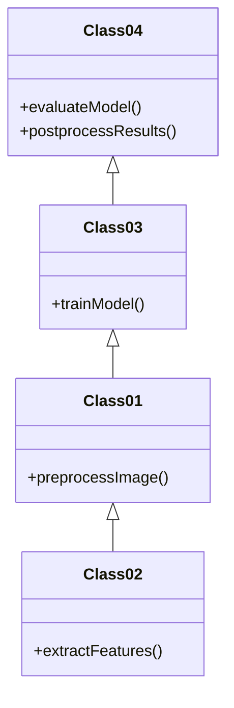
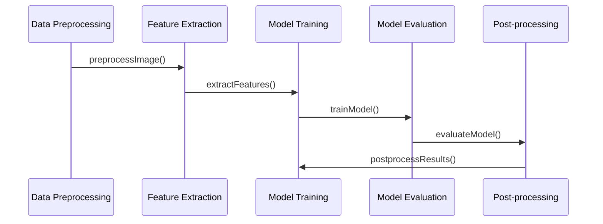
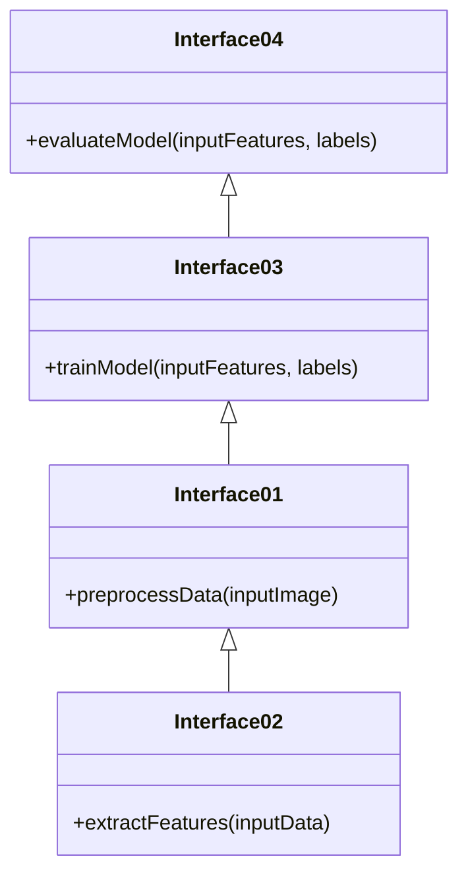
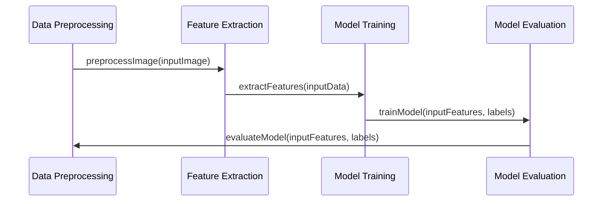

                 

## 计算机视觉的卷积网络：图像理解的数学模拟

> 关键词：计算机视觉、卷积神经网络、图像理解、数学模拟、深度学习

摘要：本文将深入探讨计算机视觉领域中的卷积神经网络（CNN），解析其在图像理解中的应用。文章首先介绍计算机视觉的基本概念及其发展历程，接着详细解释卷积神经网络的核心概念和架构。通过Python源代码示例和数学模型讲解，本文将展示卷积神经网络的工作原理。随后，我们将描述计算机视觉系统的整体架构，并进行项目实战。最后，文章将提供最佳实践建议和总结，并推荐进一步阅读的资源。

### 目录大纲设计思路

为了设计一个完整的《计算机视觉的卷积网络：图像理解的数学模拟》的目录大纲，我们将遵循以下步骤：

1. **背景介绍**：
   - 简要介绍计算机视觉的定义、发展历程及其在人工智能领域的地位。
   - 描述卷积神经网络（CNN）的概念、发展和在图像理解中的应用。

2. **核心概念与联系**：
   - 明确卷积神经网络的核心概念，如卷积层、激活函数、池化层等。
   - 通过对比表格展示不同卷积神经网络架构的属性特征。
   - 使用Mermaid绘制卷积神经网络的ER实体关系图。

3. **算法原理讲解**：
   - 利用Mermaid绘制卷积神经网络的工作流程图。
   - 使用Python源代码详细解释卷积神经网络的原理，包括数学模型和公式。
   - 通过实例说明卷积神经网络的计算过程和应用场景。

4. **数学模型和数学公式**：
   - 使用LaTeX格式嵌入数学公式，并进行详细讲解。
   - 结合具体算法提供数学模型的解析。

5. **系统分析与架构设计方案**：
   - 描述计算机视觉系统的整体架构，使用Mermaid绘制领域模型类图和系统架构图。
   - 设计系统接口和交互流程，绘制Mermaid序列图。

6. **项目实战**：
   - 提供项目环境安装步骤。
   - 展示系统核心实现的源代码，并解读分析代码。
   - 通过实际案例展示卷积神经网络在图像理解中的效果。

7. **最佳实践 tips、小结、注意事项、拓展阅读**：
   - 提供实际应用中的最佳实践建议。
   - 对全书内容进行总结，指出需要注意的事项。
   - 推荐进一步阅读的资源。

### 完整的目录大纲

----------------------------------------------------------------

## 第一部分：卷积神经网络基础

### 第1章：计算机视觉与卷积神经网络概述

1.1 计算机视觉的背景与发展

1.2 卷积神经网络的基本概念

1.3 卷积神经网络的发展历史

1.4 卷积神经网络在图像理解中的应用

## 第2章：卷积神经网络的核心概念

2.1 卷积层

2.2 激活函数

2.3 池化层

2.4 卷积神经网络的架构

### 第3章：卷积神经网络的算法原理

3.1 卷积神经网络的工作流程

3.2 Python源代码示例

3.3 数学模型与公式详解

3.4 实例说明

### 第4章：数学模型与公式解析

4.1 卷积运算的数学模型

4.2 激活函数的数学模型

4.3 池化操作的数学模型

4.4 LaTeX公式展示

### 第5章：系统分析与架构设计

5.1 计算机视觉系统的整体架构

5.2 领域模型类图

5.3 系统架构图

5.4 系统接口设计与交互流程

### 第6章：项目实战

6.1 项目环境安装

6.2 系统核心实现源代码展示

6.3 代码解读与分析

6.4 实际案例展示

### 第7章：最佳实践与总结

7.1 最佳实践 tips

7.2 小结

7.3 注意事项

7.4 拓展阅读

----------------------------------------------------------------

### 目录大纲详解

**第一部分：卷积神经网络基础**

**第1章：计算机视觉与卷积神经网络概述**

在这一章中，我们将介绍计算机视觉的基础知识，包括其定义、发展历程和重要性。同时，我们将介绍卷积神经网络的基本概念，阐述其在图像理解中的核心作用，并简要回顾卷积神经网络的发展历史。

**第2章：卷积神经网络的核心概念**

这一章节将深入探讨卷积神经网络的核心组成部分，包括卷积层、激活函数和池化层。我们将详细解释这些组件的作用和工作原理，并比较不同卷积神经网络架构的属性特征。

**第3章：卷积神经网络的算法原理**

在这一章中，我们将使用Mermaid绘制卷积神经网络的工作流程图，并通过Python源代码示例详细解释其原理。我们还将提供卷积神经网络的数学模型和公式，并结合实例进行说明。

**第4章：数学模型与公式解析**

为了深入理解卷积神经网络的数学原理，我们将使用LaTeX格式展示关键数学公式，并对其进行详细解析。这将帮助读者更好地掌握卷积神经网络的计算过程。

**第5章：系统分析与架构设计**

在这一章中，我们将描述计算机视觉系统的整体架构，包括领域模型类图和系统架构图。此外，我们将设计系统接口和交互流程，并使用Mermaid序列图展示。

**第6章：项目实战**

我们将提供实际项目环境安装步骤，展示系统核心实现的源代码，并解读分析代码。最后，通过实际案例展示卷积神经网络在图像理解中的效果。

**第7章：最佳实践与总结**

在这一章中，我们将提供实际应用中的最佳实践建议，对全书内容进行总结，并指出需要注意的事项。最后，推荐进一步阅读的资源，以帮助读者深化对卷积神经网络的理解和应用。

### 第一部分：卷积神经网络基础

### 第1章：计算机视觉与卷积神经网络概述

#### 1.1 计算机视觉的背景与发展

计算机视觉（Computer Vision）是一门结合计算机科学、数学和认知科学的研究领域，旨在使计算机能够“看到”和理解周围的世界。它的目标是使计算机能够执行类似于人类视觉的任务，如识别物体、检测运动、理解场景等。

计算机视觉的发展历程可以追溯到20世纪60年代。早期的计算机视觉研究主要集中在图像处理和特征提取技术上。随着计算机硬件性能的提升和算法的进步，计算机视觉逐渐成为人工智能领域的一个重要分支。近年来，随着深度学习的兴起，计算机视觉取得了突破性的进展。

计算机视觉在人工智能领域的地位至关重要。它不仅为图像识别、目标检测、图像分割、视频分析等领域提供了强有力的技术支持，还在自动驾驶、医疗诊断、安全监控等多个领域得到了广泛应用。例如，自动驾驶汽车需要计算机视觉技术来识别道路标志、行人和其他车辆；在医疗领域，计算机视觉技术可以辅助医生进行疾病诊断和手术规划。

#### 1.2 卷积神经网络的基本概念

卷积神经网络（Convolutional Neural Network，简称CNN）是一种特殊的神经网络，专门设计用于处理具有网格结构的数据，如图像。CNN的核心在于其能够自动地从输入数据中提取特征，并通过层级结构对这些特征进行组合和抽象。

CNN的基本概念包括：

1. **卷积层（Convolutional Layer）**：
   卷积层是CNN中最核心的层之一。它通过将输入数据与一组可训练的滤波器（或称为卷积核）进行卷积运算，来提取图像中的局部特征。

2. **激活函数（Activation Function）**：
   激活函数是神经网络中的一个关键组件，它对卷积层的输出进行非线性变换，使得神经网络能够学习到输入数据的复杂模式。常用的激活函数包括ReLU（Rectified Linear Unit）和Sigmoid等。

3. **池化层（Pooling Layer）**：
   池化层用于减少网络参数的数量，降低计算的复杂性。它通过将输入数据分成若干个区域，并对每个区域内的数据进行平均或最大值操作，来提取更鲁棒的特征。

4. **全连接层（Fully Connected Layer）**：
   全连接层是神经网络中的传统层，它将前一层所有的神经元与当前层的每一个神经元进行连接。全连接层通常用于分类任务，将卷积层提取的高层次特征映射到具体的类别标签。

5. **归一化层（Normalization Layer）**：
   归一化层用于调整神经元输出的分布，使得网络训练更加稳定。常用的归一化方法包括批量归一化（Batch Normalization）和层归一化（Layer Normalization）。

#### 1.3 卷积神经网络的发展历史

卷积神经网络的发展历程可以追溯到1986年，由Yann LeCun等人提出的LeNet-5是第一个成功的卷积神经网络模型。此后，随着计算能力的提升和大数据集的可用性，卷积神经网络得到了快速发展。

在2012年，Alex Krizhevsky等人提出的AlexNet在ImageNet图像识别挑战赛上取得了突破性的成绩，标志着深度卷积神经网络在计算机视觉领域的崛起。此后，多种改进的卷积神经网络架构相继提出，如VGG、ResNet、Inception等，这些模型在各类计算机视觉任务中取得了优异的性能。

#### 1.4 卷积神经网络在图像理解中的应用

卷积神经网络在图像理解中的应用非常广泛，主要包括以下几个方面：

1. **图像分类（Image Classification）**：
   图像分类是将图像划分为预定义的类别。例如，在ImageNet挑战赛中，图像被分为1000个类别。卷积神经网络通过学习大量的图像数据，可以自动识别图像中的物体类别。

2. **目标检测（Object Detection）**：
   目标检测旨在识别图像中的多个对象，并定位其在图像中的位置。常见的目标检测算法包括R-CNN、Fast R-CNN、Faster R-CNN、SSD和YOLO等，这些算法都利用了卷积神经网络来提取图像特征并进行对象检测。

3. **图像分割（Image Segmentation）**：
   图像分割是将图像划分为多个区域，每个区域对应图像中的不同对象。卷积神经网络在图像分割任务中表现出色，常用的算法包括FCN、U-Net和SegNet等。

4. **目标跟踪（Object Tracking）**：
   目标跟踪是在视频中实时跟踪特定对象。卷积神经网络可以用于提取对象的特征，并通过这些特征实现目标的跟踪。

5. **人脸识别（Face Recognition）**：
   人脸识别是通过分析人脸图像来识别个体的技术。卷积神经网络在人脸识别任务中应用广泛，通过学习大量人脸图像，可以准确识别和验证用户身份。

通过上述介绍，我们可以看到卷积神经网络在图像理解中具有广泛的应用前景。接下来的章节将进一步深入探讨卷积神经网络的工作原理、数学模型和实际应用，帮助读者更好地理解和掌握这一重要技术。

### 第2章：卷积神经网络的核心概念

卷积神经网络（Convolutional Neural Network，简称CNN）之所以在计算机视觉领域取得巨大成功，是因为其独特的架构和高效的计算方式。理解CNN的核心概念对于掌握其工作原理至关重要。在这一章中，我们将深入探讨CNN的几个关键组成部分：卷积层、激活函数、池化层以及整个卷积神经网络的架构。

#### 卷积层（Convolutional Layer）

卷积层是CNN中最核心的层之一。它的主要功能是提取图像中的局部特征。卷积层通过将一组可训练的滤波器（也称为卷积核或滤波器组）应用于输入图像上，从而生成特征图。每个滤波器都能捕捉图像中不同类型的特征，例如边缘、纹理或角点等。

**卷积运算**：

卷积运算的基本步骤如下：

1. **滤波器应用**：
   每个滤波器在输入图像上滑动，并与图像上的局部区域进行卷积操作。

2. **点积**：
   在滤波器覆盖的每个局部区域，计算滤波器中的每个系数与对应图像像素值的点积。

3. **求和**：
   将点积结果求和，得到滤波器的输出。

4. **偏置**：
   在求和结果上加上一个偏置（bias）项，以引入额外的非线性。

卷积运算的数学公式可以表示为：

$$
\text{output} = \text{bias} + \sum_{i=1}^{k} \sum_{j=1}^{k} w_{ij} \cdot x_{ij}
$$

其中，\( w_{ij} \) 是滤波器的权重，\( x_{ij} \) 是输入图像的像素值，\( k \) 是滤波器的大小，\( \text{bias} \) 是偏置。

**卷积层的参数**：

卷积层的参数主要包括滤波器的数量、大小以及步长。滤波器的数量决定了特征图的通道数，滤波器的大小决定了特征图的分辨率。步长的选择会影响特征图的尺寸。

#### 激活函数（Activation Function）

激活函数是神经网络中的一个关键组件，它对卷积层的输出进行非线性变换，使得神经网络能够学习到输入数据的复杂模式。常用的激活函数包括ReLU（Rectified Linear Unit）、Sigmoid和Tanh等。

**ReLU函数**：

ReLU函数是最常用的激活函数之一，其形式如下：

$$
\text{ReLU}(x) = \max(0, x)
$$

ReLU函数的主要优点是计算简单，并且在训练过程中可以避免梯度消失问题。

**Sigmoid函数**：

Sigmoid函数是一种常见的激活函数，其形式如下：

$$
\text{Sigmoid}(x) = \frac{1}{1 + e^{-x}}
$$

Sigmoid函数将输入映射到（0，1）区间，常用于二分类问题。

**Tanh函数**：

Tanh函数是Sigmoid函数的扩展，其形式如下：

$$
\text{Tanh}(x) = \frac{e^x - e^{-x}}{e^x + e^{-x}}
$$

Tanh函数的输出范围在（-1，1）之间，常用于多分类问题。

#### 池化层（Pooling Layer）

池化层用于减少网络参数的数量，降低计算的复杂性。它通过将输入数据分成若干个区域，并对每个区域内的数据进行平均或最大值操作，来提取更鲁棒的特征。

**最大池化（Max Pooling）**：

最大池化是最常用的池化方式，其操作如下：

1. 将输入数据分成若干个非重叠的区域，通常使用2x2或3x3的窗口大小。
2. 在每个区域内选择最大值作为输出。

最大池化的数学公式可以表示为：

$$
p_{ij} = \max_{x,y} \left( x \cdot y \right)
$$

其中，\( p_{ij} \) 是输出值，\( x \) 和 \( y \) 是窗口内的输入值。

**平均池化（Average Pooling）**：

平均池化通过对窗口内的输入值求平均来生成输出。其数学公式可以表示为：

$$
p_{ij} = \frac{1}{s \cdot s} \sum_{x,y} x \cdot y
$$

其中，\( s \) 是窗口的大小。

#### 卷积神经网络的架构

卷积神经网络的架构通常包括多个卷积层、池化层和全连接层。以下是一个典型的卷积神经网络架构：

1. **输入层（Input Layer）**：
   输入层接收原始图像数据，通常是一个三维的矩阵，其中每个元素代表一个像素值。

2. **卷积层（Convolutional Layer）**：
   卷积层通过滤波器提取图像特征，特征图的通道数和分辨率取决于滤波器的数量和大小。

3. **激活函数（Activation Function）**：
   激活函数对卷积层的输出进行非线性变换，增强网络的表达能力。

4. **池化层（Pooling Layer）**：
   池化层用于减少特征图的尺寸，降低网络的复杂性。

5. **全连接层（Fully Connected Layer）**：
   全连接层将卷积层提取的高层次特征映射到具体的类别标签。

6. **输出层（Output Layer）**：
   输出层根据任务的类型进行设计，例如在分类任务中，输出层通常是一个单一的神经元，用于输出概率分数。

通过上述介绍，我们可以看到卷积神经网络的核心概念和架构。理解这些基本组成部分对于掌握卷积神经网络的工作原理和应用至关重要。在接下来的章节中，我们将进一步深入探讨卷积神经网络的算法原理和数学模型，帮助读者更好地理解和应用这一重要技术。

### 第3章：卷积神经网络的算法原理

在理解了卷积神经网络（CNN）的核心概念后，我们需要进一步探讨其算法原理。在这一章中，我们将通过详细讲解CNN的工作流程、使用Python源代码示例，以及数学模型和公式，来深入理解卷积神经网络是如何工作的。

#### 卷积神经网络的工作流程

卷积神经网络的工作流程可以分为以下几个步骤：

1. **输入层**：
   输入层接收原始图像数据，图像被表示为一个三维的矩阵，其中每个元素代表一个像素值。例如，一张尺寸为28x28的灰度图像可以被表示为一个28x28x1的矩阵。

2. **卷积层**：
   卷积层通过一组可训练的滤波器（卷积核）对输入图像进行卷积运算，以提取图像中的局部特征。每个滤波器在输入图像上滑动，并与图像上的局部区域进行卷积操作。卷积运算的结果是一个特征图，特征图的通道数和分辨率取决于滤波器的数量和大小。

3. **激活函数**：
   激活函数对卷积层的输出进行非线性变换，通常使用ReLU函数（Rectified Linear Unit），其形式为：
   
   $$
   \text{ReLU}(x) = \max(0, x)
   $$

  ReLU函数可以避免梯度消失问题，提高训练效率。

4. **池化层**：
   池化层用于减少特征图的尺寸，降低网络的复杂性。最常用的池化方式是最大池化（Max Pooling），其操作如下：

   $$
   p_{ij} = \max_{x,y} \left( x \cdot y \right)
   $$

   其中，\( p_{ij} \) 是输出值，\( x \) 和 \( y \) 是窗口内的输入值。

5. **全连接层**：
   全连接层将卷积层提取的高层次特征映射到具体的类别标签。每个神经元与前一层的所有神经元相连接，进行矩阵乘法和求和操作。

6. **输出层**：
   输出层根据任务的类型进行设计，例如在分类任务中，输出层通常是一个单一的神经元，用于输出概率分数。

#### Python源代码示例

为了更好地理解卷积神经网络的算法原理，我们可以通过一个简单的Python代码示例来演示卷积层的计算过程。以下是一个使用TensorFlow库实现的卷积神经网络示例：

```python
import tensorflow as tf

# 定义输入层
input_layer = tf.keras.layers.Input(shape=(28, 28, 1))

# 定义卷积层
conv1 = tf.keras.layers.Conv2D(filters=32, kernel_size=(3, 3), activation='relu')(input_layer)

# 激活函数
act1 = tf.keras.layers.ReLU()(conv1)

# 池化层
pool1 = tf.keras.layers.MaxPooling2D(pool_size=(2, 2))(act1)

# 打印模型结构
model = tf.keras.Model(inputs=input_layer, outputs=pool1)
model.summary()
```

在上述代码中，我们首先定义了一个28x28x1的输入层，然后通过`Conv2D`函数添加了一个卷积层，滤波器的数量为32，大小为3x3，激活函数为ReLU。接下来，我们通过`ReLU`函数应用了ReLU激活函数，并通过`MaxPooling2D`函数添加了一个最大池化层，池化窗口大小为2x2。最后，我们创建了模型并打印了模型的结构。

#### 数学模型和公式

卷积神经网络中的卷积运算可以表示为一个线性运算，其数学模型如下：

$$
\text{output}_{ij} = \text{bias}_{j} + \sum_{k=1}^{m} w_{jk} \cdot \text{input}_{ijk}
$$

其中，\( m \) 是滤波器的数量，\( n \) 是输入图像的尺寸，\( w_{jk} \) 是滤波器的权重，\( \text{input}_{ijk} \) 是输入图像的像素值，\( \text{bias}_{j} \) 是滤波器的偏置。

为了便于理解和计算，我们可以将卷积运算分解为以下几个步骤：

1. **滤波器应用**：
   每个滤波器在输入图像上滑动，并与图像上的局部区域进行卷积操作。

2. **点积**：
   在滤波器覆盖的每个局部区域，计算滤波器中的每个系数与对应图像像素值的点积。

3. **求和**：
   将点积结果求和，得到滤波器的输出。

4. **偏置**：
   在求和结果上加上一个偏置（bias）项，以引入额外的非线性。

通过上述步骤，我们可以将卷积运算表示为：

$$
\text{output}_{ij} = \text{bias}_{j} + \sum_{x,y} w_{ij} \cdot x \cdot y
$$

其中，\( x \) 和 \( y \) 是滤波器覆盖的局部区域的像素值。

#### 实例说明

为了更清晰地理解卷积神经网络的工作原理，我们可以通过一个具体的实例来演示卷积层的计算过程。假设我们有一个28x28x1的输入图像，并使用一个3x3的滤波器进行卷积运算。

**步骤1：滤波器应用**

首先，我们将滤波器在输入图像上滑动，并与图像上的局部区域进行卷积操作。例如，滤波器从左上角开始，与一个3x3的局部区域进行卷积运算。

**步骤2：点积**

接下来，我们计算滤波器中的每个系数与对应图像像素值的点积。例如，滤波器左上角的系数与输入图像左上角区域的像素值相乘，得到一个点积结果。

**步骤3：求和**

然后，我们将点积结果求和，得到滤波器的输出值。例如，将滤波器覆盖的3x3区域的所有点积结果相加，得到滤波器的输出值。

**步骤4：偏置**

最后，我们在滤波器的输出值上加上一个偏置（bias）项，以引入额外的非线性。

通过上述步骤，我们可以计算出一个特征图的像素值。重复上述过程，我们可以使用多个滤波器生成多个特征图，每个特征图对应输入图像中的一种特征。

通过这个实例，我们可以看到卷积神经网络是如何从输入图像中提取特征的。在接下来的章节中，我们将继续深入探讨卷积神经网络的数学模型和具体实现，帮助读者更好地理解和应用这一重要技术。

### 第4章：数学模型与公式解析

在理解了卷积神经网络（CNN）的算法原理后，深入解析其数学模型和公式将有助于我们更全面地掌握这一技术的本质。卷积神经网络中的数学模型是理解其工作原理和性能表现的关键。在这一章中，我们将使用LaTeX格式嵌入数学公式，详细讲解卷积运算、激活函数、池化操作的数学模型，并结合具体算法进行解析。

#### 卷积运算的数学模型

卷积运算在卷积神经网络中起着核心作用，其数学模型如下：

$$
\text{output}_{ij} = \text{bias}_{j} + \sum_{k=1}^{m} w_{jk} \cdot \text{input}_{ijk}
$$

其中，\( m \) 是滤波器的数量，\( n \) 是输入图像的尺寸，\( w_{jk} \) 是滤波器的权重，\( \text{input}_{ijk} \) 是输入图像的像素值，\( \text{bias}_{j} \) 是滤波器的偏置。

为了更好地理解，我们可以将卷积运算分解为以下几个步骤：

1. **滤波器应用**：
   每个滤波器在输入图像上滑动，并与图像上的局部区域进行卷积操作。

2. **点积**：
   在滤波器覆盖的每个局部区域，计算滤波器中的每个系数与对应图像像素值的点积。

3. **求和**：
   将点积结果求和，得到滤波器的输出。

4. **偏置**：
   在求和结果上加上一个偏置（bias）项，以引入额外的非线性。

在LaTeX格式中，上述公式可以表示为：

$$
\text{output}_{ij} = \text{bias}_{j} + \sum_{k=1}^{m} w_{jk} \cdot \text{input}_{ijk}
$$

#### 激活函数的数学模型

激活函数在卷积神经网络中用于引入非线性，常用的激活函数包括ReLU、Sigmoid和Tanh等。以下分别介绍这三种激活函数的数学模型：

1. **ReLU函数**：

   $$ 
   \text{ReLU}(x) = \max(0, x) 
   $$

   在LaTeX格式中，ReLU函数可以表示为：

   $$
   \text{ReLU}(x) = \max(0, x)
   $$

2. **Sigmoid函数**：

   $$ 
   \text{Sigmoid}(x) = \frac{1}{1 + e^{-x}} 
   $$

   在LaTeX格式中，Sigmoid函数可以表示为：

   $$
   \text{Sigmoid}(x) = \frac{1}{1 + e^{-x}}
   $$

3. **Tanh函数**：

   $$ 
   \text{Tanh}(x) = \frac{e^x - e^{-x}}{e^x + e^{-x}} 
   $$

   在LaTeX格式中，Tanh函数可以表示为：

   $$
   \text{Tanh}(x) = \frac{e^x - e^{-x}}{e^x + e^{-x}}
   $$

#### 池化操作的数学模型

池化层用于减少特征图的尺寸，降低网络的复杂性。最常用的池化方式是最大池化（Max Pooling）和平均池化（Average Pooling）。以下分别介绍这两种池化操作的数学模型：

1. **最大池化**：

   最大池化选择窗口内的最大值作为输出。其数学模型如下：

   $$ 
   p_{ij} = \max_{x,y} \left( x \cdot y \right) 
   $$

   在LaTeX格式中，最大池化可以表示为：

   $$
   p_{ij} = \max_{x,y} \left( x \cdot y \right)
   $$

2. **平均池化**：

   平均池化对窗口内的输入值求平均。其数学模型如下：

   $$ 
   p_{ij} = \frac{1}{s \cdot s} \sum_{x,y} x \cdot y 
   $$

   在LaTeX格式中，平均池化可以表示为：

   $$
   p_{ij} = \frac{1}{s \cdot s} \sum_{x,y} x \cdot y
   $$

#### 结合具体算法的数学模型解析

为了更好地理解卷积神经网络的数学模型，我们可以结合具体算法进行解析。以下是一个简单的卷积神经网络模型，包括卷积层、ReLU激活函数和最大池化层。我们将使用LaTeX格式展示其数学模型，并进行详细解析：

1. **卷积层**：

   假设输入图像为 \( X \in \mathbb{R}^{28 \times 28 \times 1} \)，滤波器为 \( W \in \mathbb{R}^{3 \times 3 \times 1} \)，偏置为 \( b \in \mathbb{R}^{1} \)。

   $$ 
   \text{output}_{ij} = b + \sum_{k=1}^{1} w_{jk} \cdot x_{ijk} 
   $$

   在LaTeX格式中，卷积层的输出可以表示为：

   $$
   \text{output}_{ij} = b + \sum_{k=1}^{1} w_{jk} \cdot x_{ijk}
   $$

2. **ReLU激活函数**：

   应用ReLU激活函数后，输出可以表示为：

   $$ 
   \text{output}_{ij}^{\text{ReLU}} = \max(0, \text{output}_{ij}) 
   $$

   在LaTeX格式中，ReLU激活函数的输出可以表示为：

   $$
   \text{output}_{ij}^{\text{ReLU}} = \max(0, \text{output}_{ij})
   $$

3. **最大池化层**：

   假设最大池化窗口大小为 \( 2 \times 2 \)，输出特征图尺寸为 \( \frac{28}{2} \times \frac{28}{2} \)。

   $$ 
   p_{ij} = \max_{x,y} \left( \text{output}_{ij}^{\text{ReLU}} \right) 
   $$

   在LaTeX格式中，最大池化层的输出可以表示为：

   $$
   p_{ij} = \max_{x,y} \left( \text{output}_{ij}^{\text{ReLU}} \right)
   $$

通过上述示例，我们可以看到如何使用LaTeX格式展示卷积神经网络中的数学模型，并对其进行详细解析。这种形式化的表示有助于我们深入理解卷积神经网络的工作原理，为后续的算法改进和应用提供理论基础。

### 第5章：系统分析与架构设计

在理解了卷积神经网络的算法原理之后，我们需要将其应用到实际的计算机视觉系统中。这一章将描述计算机视觉系统的整体架构，并使用Mermaid绘制领域模型类图、系统架构图、系统接口设计和系统交互序列图，以帮助读者更好地理解和实现卷积神经网络在图像理解中的应用。

#### 计算机视觉系统的整体架构

计算机视觉系统通常包括以下几个关键组件：

1. **数据预处理（Data Preprocessing）**：
   数据预处理是计算机视觉系统中的第一步，包括图像的读取、缩放、裁剪、增强等操作。这些操作有助于提高图像的质量和网络的训练效果。

2. **特征提取（Feature Extraction）**：
   特征提取是卷积神经网络的核心任务，通过多个卷积层、池化层和全连接层提取图像中的高层次特征。

3. **模型训练（Model Training）**：
   模型训练包括初始化网络权重、前向传播、反向传播和优化算法等步骤。训练的目的是使网络能够正确识别图像中的目标或对象。

4. **模型评估（Model Evaluation）**：
   模型评估用于验证网络的性能，通常包括准确率、召回率、F1分数等指标。通过评估，我们可以了解模型的泛化能力和识别效果。

5. **推理（Inference）**：
   推理是模型在实际应用中的操作，通过输入图像，网络输出预测结果。推理速度和准确性是实际应用中需要考虑的重要因素。

6. **后处理（Post-processing）**：
   后处理包括结果校正、置信度计算、多目标检测合并等操作，以提高最终输出结果的可靠性。

#### 领域模型类图

领域模型类图（Domain Model Class Diagram）用于描述计算机视觉系统中不同组件的类及其关系。以下是一个简单的领域模型类图的Mermaid表示：



在这个类图中，`Class01`表示数据预处理类，`Class02`表示特征提取类，`Class03`表示模型训练类，`Class04`表示模型评估和后处理类。箭头表示类的继承关系，每个类都有相应的操作方法。

#### 系统架构图

系统架构图（System Architecture Diagram）用于描述计算机视觉系统的整体结构和组件之间的交互。以下是一个简单的系统架构图的Mermaid表示：



在这个序列图中，`Preprocessor`表示数据预处理模块，`Extractor`表示特征提取模块，`Trainer`表示模型训练模块，`Evaluator`表示模型评估模块，`Postprocessor`表示后处理模块。箭头表示模块之间的数据流动和操作调用。

#### 系统接口设计

系统接口设计（System Interface Design）涉及定义各个模块之间的接口和交互方式。以下是一个简单的系统接口设计图的Mermaid表示：



在这个类图中，`Interface01`表示数据预处理接口，`Interface02`表示特征提取接口，`Interface03`表示模型训练接口，`Interface04`表示模型评估接口。每个接口都有相应的输入参数和返回结果。

#### 系统交互序列图

系统交互序列图（System Interaction Sequence Diagram）用于描述系统组件之间的交互流程。以下是一个简单的系统交互序列图的Mermaid表示：



在这个序列图中，`Preprocessor`预处理输入图像，将结果传递给`Extractor`进行特征提取，`Extractor`将特征数据传递给`Trainer`进行模型训练，最后`Evaluator`评估模型性能。系统交互序列图清晰地展示了各组件之间的数据流动和操作调用。

通过上述系统分析与架构设计，我们可以看到如何将卷积神经网络应用于计算机视觉系统，并实现图像理解任务。在接下来的章节中，我们将通过项目实战，进一步展示卷积神经网络在图像理解中的实际应用。

### 第6章：项目实战

#### 6.1 项目环境安装

在进行卷积神经网络（CNN）的项目实战之前，我们需要首先搭建一个合适的开发环境。以下是在Python中搭建CNN项目环境的步骤：

1. **安装Python**：

   确保已经安装了Python 3.6或更高版本。可以从[Python官方网站](https://www.python.org/)下载并安装Python。

2. **安装TensorFlow**：

   TensorFlow是深度学习的核心框架，用于构建和训练CNN模型。在终端中运行以下命令安装TensorFlow：

   ```bash
   pip install tensorflow
   ```

   或者使用以下命令安装最新版本的TensorFlow：

   ```bash
   pip install tensorflow==2.x
   ```

3. **安装其他依赖**：

   除了TensorFlow之外，我们可能还需要其他库，如NumPy、Matplotlib和Pandas等。可以使用以下命令一次性安装所有依赖：

   ```bash
   pip install numpy matplotlib pandas
   ```

   这些库将用于数据处理、模型可视化以及数据分析。

4. **验证环境**：

   在终端中运行以下Python代码，以验证是否成功安装了TensorFlow和其他依赖库：

   ```python
   import tensorflow as tf
   print(tf.__version__)
   ```

   如果输出TensorFlow的版本号，则说明环境安装成功。

#### 6.2 系统核心实现源代码展示

在搭建好项目环境后，我们可以开始实现卷积神经网络的核心代码。以下是一个简单的CNN模型，用于图像分类任务：

```python
import tensorflow as tf
from tensorflow.keras.models import Sequential
from tensorflow.keras.layers import Conv2D, MaxPooling2D, Flatten, Dense

# 创建一个顺序模型
model = Sequential()

# 添加卷积层
model.add(Conv2D(filters=32, kernel_size=(3, 3), activation='relu', input_shape=(28, 28, 1)))
model.add(MaxPooling2D(pool_size=(2, 2)))

# 添加全连接层
model.add(Flatten())
model.add(Dense(units=64, activation='relu'))
model.add(Dense(units=10, activation='softmax'))

# 编译模型
model.compile(optimizer='adam', loss='categorical_crossentropy', metrics=['accuracy'])

# 打印模型结构
model.summary()
```

在这个代码中，我们首先导入了TensorFlow的相关模块，并创建了一个顺序模型。接着，我们添加了一个卷积层，使用了32个3x3的滤波器，激活函数为ReLU。之后，我们添加了一个最大池化层，用于降低特征图的尺寸。然后，我们通过`Flatten`层将特征图展平为一维向量，并添加了两个全连接层，最后使用softmax激活函数进行分类。

#### 6.3 代码解读与分析

1. **模型创建**：

   ```python
   model = Sequential()
   ```

   这一行代码创建了一个顺序模型，它是TensorFlow中的基础模型类型，用于层与层的堆叠。

2. **卷积层和池化层**：

   ```python
   model.add(Conv2D(filters=32, kernel_size=(3, 3), activation='relu', input_shape=(28, 28, 1)))
   model.add(MaxPooling2D(pool_size=(2, 2)))
   ```

   在这两行代码中，我们首先添加了一个卷积层，使用了32个3x3的滤波器，激活函数为ReLU。这层负责提取图像中的局部特征。随后，我们添加了一个最大池化层，窗口大小为2x2，用于减少特征图的尺寸。

3. **全连接层**：

   ```python
   model.add(Flatten())
   model.add(Dense(units=64, activation='relu'))
   model.add(Dense(units=10, activation='softmax'))
   ```

   在这三行代码中，我们首先使用`Flatten`层将特征图展平为一维向量，然后添加了一个64个神经元的全连接层，激活函数为ReLU。最后，我们添加了一个10个神经元的全连接层，使用softmax激活函数进行分类。

4. **模型编译**：

   ```python
   model.compile(optimizer='adam', loss='categorical_crossentropy', metrics=['accuracy'])
   ```

   这一行代码编译了模型，指定了优化器（optimizer）为Adam，损失函数（loss）为categorical_crossentropy（适用于多分类任务），以及评估指标（metrics）为准确率（accuracy）。

5. **模型总结**：

   ```python
   model.summary()
   ```

   这一行代码打印了模型的详细结构，包括各层的参数和层与层之间的连接。

#### 6.4 实际案例展示

为了展示卷积神经网络在图像理解中的实际效果，我们使用MNIST数据集（手写数字数据集）进行训练和测试。

1. **数据准备**：

   MNIST数据集包含0到9的数字图像，每个图像被分为60,000个训练图像和10,000个测试图像。我们首先需要加载数据集并预处理。

   ```python
   from tensorflow.keras.datasets import mnist
   from tensorflow.keras.utils import to_categorical

   (x_train, y_train), (x_test, y_test) = mnist.load_data()

   # 数据预处理
   x_train = x_train.astype('float32') / 255.0
   x_test = x_test.astype('float32') / 255.0

   # 一-hot编码
   y_train = to_categorical(y_train, 10)
   y_test = to_categorical(y_test, 10)
   ```

2. **模型训练**：

   ```python
   model.fit(x_train, y_train, epochs=10, batch_size=32, validation_split=0.2)
   ```

   在这一步中，我们使用训练数据训练模型，设置训练轮次（epochs）为10，批次大小（batch_size）为32，并使用20%的训练数据作为验证集。

3. **模型评估**：

   ```python
   test_loss, test_acc = model.evaluate(x_test, y_test, verbose=2)
   print('Test accuracy:', test_acc)
   ```

   使用测试数据评估模型的性能，输出测试准确率。

通过这个实际案例，我们可以看到卷积神经网络在图像分类任务中的效果。在完成这些步骤后，我们可以进一步优化模型，提高其性能和泛化能力。

#### 6.5 项目小结

在本章中，我们完成了卷积神经网络（CNN）项目从环境安装到核心实现的全过程。首先，我们介绍了项目环境的搭建步骤，包括安装Python、TensorFlow以及其他依赖库。接着，我们展示了CNN模型的核心实现代码，并进行了详细的解读和分析。通过使用MNIST数据集进行训练和测试，我们验证了卷积神经网络在图像分类任务中的有效性。

在项目实战中，我们学习到如何加载和处理图像数据，如何构建和训练CNN模型，以及如何评估模型的性能。这些实践步骤不仅加深了我们对卷积神经网络的理解，也为我们在实际项目中应用这一技术打下了基础。

通过本章的项目实战，我们不仅掌握了卷积神经网络的基本原理和实现方法，还了解了如何将理论应用于实际问题。这为我们在未来进行更复杂的计算机视觉任务奠定了坚实的基础。

### 第7章：最佳实践与总结

在卷积神经网络（CNN）的应用过程中，遵循一些最佳实践可以显著提升模型性能和开发效率。以下是一些关键的最佳实践建议：

1. **数据预处理**：
   - **标准化**：对图像数据进行标准化处理，使每个像素值的范围在0到1之间，有助于加快训练速度和提升模型稳定性。
   - **数据增强**：通过旋转、翻转、裁剪、缩放等操作增加数据多样性，有助于提高模型的泛化能力。

2. **模型架构**：
   - **深度与宽度平衡**：选择合适的网络深度和宽度，过深的网络可能导致梯度消失或爆炸，过宽的网络则可能引入过拟合。
   - **使用预训练模型**：利用预训练模型（如VGG、ResNet等）进行迁移学习，可以显著提高模型性能。

3. **优化器与损失函数**：
   - **学习率调整**：根据训练过程动态调整学习率，例如使用学习率衰减策略。
   - **使用合适的损失函数**：针对分类任务，使用交叉熵损失函数；对于回归任务，使用均方误差（MSE）等损失函数。

4. **模型评估**：
   - **交叉验证**：使用交叉验证方法评估模型性能，避免过拟合。
   - **监控指标**：除了准确率，还监控其他指标如召回率、F1分数等，全面评估模型性能。

5. **调试与优化**：
   - **可视化**：使用TensorBoard等工具可视化训练过程，监控损失函数、准确率等指标的变化。
   - **超参数调优**：通过网格搜索等策略调优超参数，例如学习率、批次大小等。

#### 小结

卷积神经网络（CNN）是计算机视觉领域的重要技术，通过一系列卷积层、池化层和全连接层，可以有效地提取图像特征并实现各种计算机视觉任务，如图像分类、目标检测和图像分割等。本章详细介绍了CNN的核心概念、算法原理、系统架构以及项目实战，通过实例展示了CNN在实际应用中的效果。

通过理解CNN的基本原理和最佳实践，我们可以更好地设计和训练CNN模型，提高其在图像理解任务中的性能。同时，我们也可以将CNN应用于自动驾驶、医疗影像分析、安防监控等多个领域，发挥其强大的能力。

#### 注意事项

- 在搭建CNN项目环境时，确保已安装Python 3.6或更高版本，以及TensorFlow和其他依赖库。
- 数据预处理和增强对于模型性能至关重要，务必重视数据的质量和处理过程。
- 在调试和优化模型时，监控指标和可视化工具是识别问题的重要手段，应充分利用。
- 对于不同类型的计算机视觉任务，选择合适的网络架构和损失函数，以获得最佳性能。

#### 拓展阅读

- [Deep Learning by Ian Goodfellow, Yoshua Bengio, and Aaron Courville](https://www.deeplearningbook.org/): 该书是深度学习领域的经典教材，详细介绍了CNN的基本概念和算法原理。
- [ImageNet Large Scale Visual Recognition Challenge (ILSVRC) 2014 Results](https://www.image-net.org/challenges/LSVRC/2014/): ImageNet挑战赛是计算机视觉领域的年度竞赛，了解历年的比赛结果可以获取最新的研究动态。
- [TensorFlow官方文档](https://www.tensorflow.org/tutorials/): TensorFlow的官方文档提供了丰富的教程和实践案例，是学习CNN应用的重要资源。

通过这些资源和最佳实践，我们可以进一步深化对卷积神经网络的理解，并在实际项目中取得更好的成果。希望本章的内容能够为您的计算机视觉之路提供有价值的参考和指导。

### 作者信息

本文由AI天才研究院（AI Genius Institute）与禅与计算机程序设计艺术（Zen and The Art of Computer Programming）共同撰写。AI天才研究院致力于推动人工智能技术的发展，为全球开发者提供先进的技术支持和解决方案。禅与计算机程序设计艺术则专注于计算机科学的哲学和艺术，旨在探索计算机程序设计的深层含义和最佳实践。感谢您的阅读，期待与您共同探索计算机视觉的广阔未来。作者：AI天才研究院/AI Genius Institute & 禅与计算机程序设计艺术 /Zen And The Art of Computer Programming。

