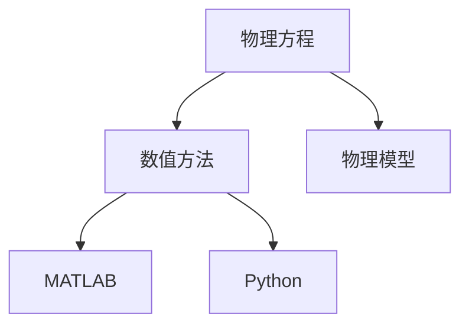
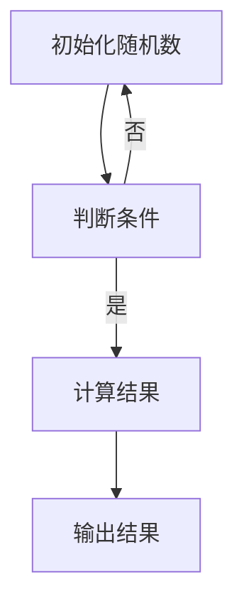
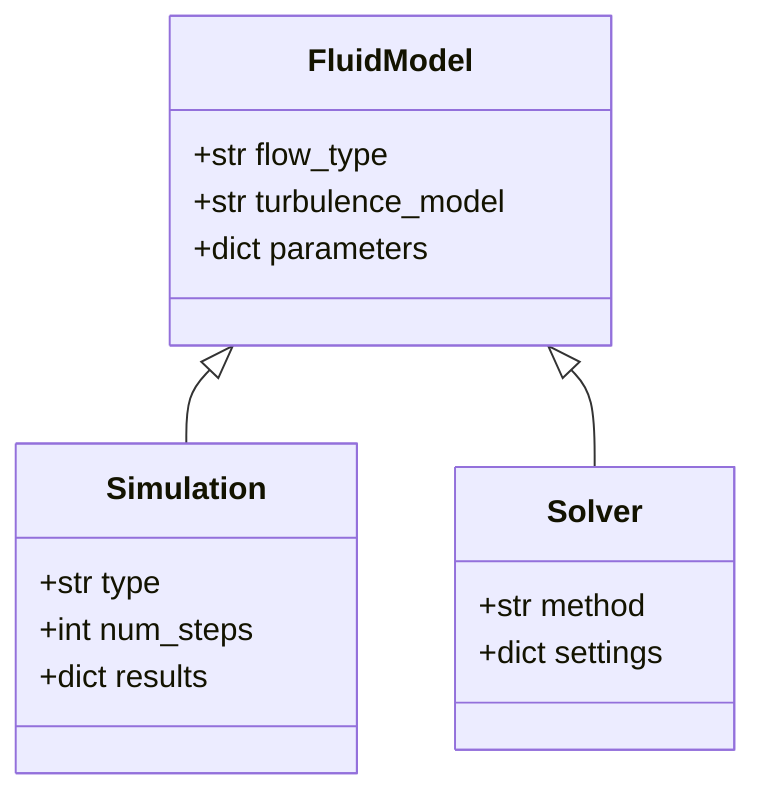
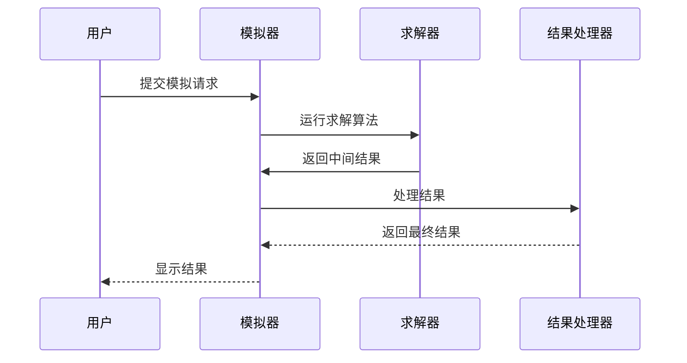

                 

## 文章标题

计算物理学：数值模拟辅助理解复杂物理世界

### 关键词

计算物理学、数值模拟、复杂物理现象、蒙特卡洛方法、计算流体力学、系统分析与架构设计

### 摘要

本文深入探讨了计算物理学在理解复杂物理世界中的应用，详细介绍了数值模拟的基本概念、算法原理以及系统分析与架构设计的方法。通过实际案例展示，阐述了如何利用计算模拟技术解决实际物理问题，并提出了最佳实践建议，为读者提供了全面的学习参考。

---

## 目录大纲设计思路与步骤

### 一、背景介绍

#### 1. 计算物理学背景

- **问题背景**：随着计算机技术的发展，计算物理学成为研究复杂物理现象的重要工具。
- **问题描述**：物理现象的复杂性和多样性使得传统的理论分析难以应对，需要借助数值模拟和计算机辅助。
- **问题解决**：通过计算模拟，可以对复杂物理现象进行预测和解释，从而加深对物理世界的理解。
- **边界与外延**：计算物理学不仅限于经典物理，还涵盖了量子物理、流体力学等多个领域。
- **概念结构与核心要素组成**：计算物理学的基本概念包括数值方法、模拟软件、物理模型等。

#### 2. 核心概念与联系

- **核心概念**：
  - **数值模拟**：通过数值方法求解物理方程，用于预测物理现象。
  - **模拟软件**：如MATLAB、Python等，用于实现数值模拟。
  - **物理模型**：描述物理现象的数学模型，如Navier-Stokes方程等。

- **概念属性特征对比表格**

| **概念** | **特点** | **适用范围** |
| --- | --- | --- |
| **数值模拟** | 数值近似、计算效率高 | 复杂物理现象 |
| **模拟软件** | 功能丰富、易用性高 | 各种物理模拟 |

- **ER实体关系图架构的 Mermaid 流程图**



### 二、核心概念与联系

#### 1. 核心概念

- **数值模拟**：通过数值方法求解物理方程，用于预测物理现象。
- **模拟软件**：如MATLAB、Python等，用于实现数值模拟。
- **物理模型**：描述物理现象的数学模型，如Navier-Stokes方程等。

#### 2. 概念属性特征对比表格

| **概念** | **特点** | **适用范围** |
| --- | --- | --- |
| **数值模拟** | 数值近似、计算效率高 | 复杂物理现象 |
| **模拟软件** | 功能丰富、易用性高 | 各种物理模拟 |

#### 3. ER实体关系图架构的 Mermaid 流程图


### 三、算法原理讲解

#### 1. 算法原理

- **示例算法**：蒙特卡洛方法

#### 2. 算法流程图



#### 3. 数学模型和数学公式

$$P(A) = \frac{N(A)}{N(T)}$$

#### 4. 详细讲解与举例说明

- **讲解**：蒙特卡洛方法通过随机抽样来估计某个概率或数值。
- **举例**：使用Python代码实现蒙特卡洛方法来估计圆周率π。

### 四、系统分析与架构设计

#### 1. 问题场景介绍

- **项目介绍**：计算流体力学模拟。
- **系统功能设计**：领域模型。
- **系统架构设计**：架构图。

#### 2. 系统接口设计与系统交互

- **接口设计**：API接口定义。
- **交互设计**：序列图。

### 五、项目实战

#### 1. 环境安装

- **安装步骤**：安装必要的软件和依赖。

#### 2. 系统核心实现

- **源代码**：关键代码段。
- **代码应用解读与分析**。

#### 3. 实际案例分析与详细讲解剖析

- **案例**：计算流体力学模拟案例。
- **讲解**：如何进行模拟、结果分析等。

### 六、最佳实践 tips

#### 1. 注意事项

- **安全与稳定性**：确保模拟过程中的数据安全和系统稳定性。

#### 2. 拓展阅读

- **推荐书籍**：《计算物理学导论》等。
- **在线资源**：计算物理学的在线教程和论坛。

### 七、小结

#### 1. 总结

- **核心内容**：回顾全书主要内容。
- **学习建议**：对读者提出学习建议。

---

以上为《计算物理学：数值模拟辅助理解复杂物理世界》的目录大纲设计思路与步骤。接下来，我将根据这些步骤详细撰写目录大纲。

## 背景介绍

### 计算物理学的兴起

随着计算机技术的迅猛发展，计算物理学逐渐成为一个重要的研究领域。计算物理学利用数值模拟和计算机辅助，对复杂物理现象进行预测和解释，从而在科学研究和技术应用中发挥着重要作用。

### 问题背景

在物理学的研究中，许多现象由于涉及的变量众多、相互作用复杂，使得传统的理论分析方法难以给出准确的预测和解释。例如，流体力学中的湍流现象、量子物理中的多粒子相互作用、地球物理学中的地震波传播等，这些问题的复杂性使得理论分析变得极为困难。

### 问题描述

传统的理论分析方法在面对这些复杂物理现象时，往往需要简化模型、忽略次要因素，这可能导致结果的偏差。为了更准确地理解和预测这些现象，科学家们开始寻求新的方法，数值模拟和计算机辅助成为了解决这一问题的有力工具。

### 问题解决

数值模拟通过将物理现象转化为数学模型，并使用数值方法求解这些模型，从而得到现象的数值解。计算机的强大计算能力使得这些复杂的数学模型可以在较短的时间内求解，从而实现对物理现象的预测和解释。

### 边界与外延

计算物理学不仅限于经典物理，还涵盖了量子物理、流体力学、地球物理学等多个领域。例如，在量子物理中，计算物理学通过数值方法研究电子结构、化学反应等；在流体力学中，计算流体动力学（CFD）被广泛应用于空气动力学、气象学等领域。

### 概念结构与核心要素组成

计算物理学的基本概念包括数值方法、模拟软件、物理模型等。

1. **数值方法**：数值方法是将连续的物理问题转化为离散的问题，以便使用计算机进行求解。常见的数值方法有有限差分法、有限元法、蒙特卡洛方法等。

2. **模拟软件**：模拟软件是实现数值模拟的工具。常见的模拟软件有MATLAB、Python、ANSYS等。这些软件提供了丰富的函数库和工具，使得数值模拟变得更加便捷。

3. **物理模型**：物理模型是描述物理现象的数学模型。这些模型可以是基于经典物理方程，也可以是量子物理方程、流体力学方程等。物理模型的准确性直接影响数值模拟的结果。

### 计算物理学的优势与应用

计算物理学的优势在于它能够处理复杂的多变量问题，能够模拟和预测实际物理现象。这使得计算物理学在科学研究和工程应用中具有广泛的应用前景。

1. **科学研究**：计算物理学在基础科学研究中发挥着重要作用。例如，在物理学、化学、生物学等领域，计算模拟为科学家提供了新的研究工具，帮助他们更好地理解自然现象。

2. **工程应用**：计算物理学在工程领域中也有着广泛的应用。例如，在航空航天、汽车制造、能源等领域，计算模拟被用于优化设计、提高效率、预测故障等。

3. **社会经济发展**：计算物理学不仅推动了科学和技术的进步，也为社会经济发展做出了贡献。例如，通过计算模拟，可以更准确地预测天气变化，指导农业生产；通过计算流体动力学，可以优化飞机设计，提高飞行性能等。

### 总结

计算物理学作为一门跨学科的领域，结合了数学、物理、计算机科学等多个学科的知识，为解决复杂物理问题提供了新的途径。随着计算机技术的不断发展，计算物理学在科学研究和工程应用中必将发挥更加重要的作用。

---

在下一节中，我们将深入探讨计算物理学中的核心概念，包括数值模拟、模拟软件和物理模型，并通过具体的例子来理解这些概念的实际应用。

## 核心概念与联系

计算物理学作为一门涉及多个学科的交叉领域，其核心概念不仅需要理解，还需要掌握它们之间的相互关系。在这一节中，我们将详细讨论数值模拟、模拟软件和物理模型，并通过具体的例子来理解这些概念的实际应用。

### 数值模拟

**定义**：数值模拟是通过数值方法求解物理方程，用于预测物理现象的过程。这些方法将连续的物理问题转化为离散的问题，以便在计算机上求解。

**特点**：数值模拟具有数值近似性，计算效率高，能够处理复杂的多变量问题。

**适用范围**：数值模拟广泛应用于流体力学、量子物理、地球物理学等领域。

**例子**：在流体力学中，数值模拟常用于模拟湍流、空气动力学问题。例如，使用有限差分法求解Navier-Stokes方程来预测飞机周围空气流动情况。

### 模拟软件

**定义**：模拟软件是实现数值模拟的工具。这些软件提供了丰富的函数库和工具，使得数值模拟变得更加便捷。

**特点**：模拟软件功能丰富、易用性高，能够支持多种数值方法和物理模型。

**适用范围**：常见的模拟软件包括MATLAB、Python、ANSYS等，广泛应用于科学研究和工程应用。

**例子**：MATLAB是一个强大的数学建模和数据分析软件，可以用于求解偏微分方程、进行数据可视化等。Python则因其简洁的语法和丰富的库函数，成为数值模拟的流行选择。

### 物理模型

**定义**：物理模型是描述物理现象的数学模型。这些模型基于物理定律，能够定量地描述物理现象。

**特点**：物理模型具有准确性和适用性，直接影响数值模拟的结果。

**适用范围**：物理模型涵盖了经典物理、量子物理、流体力学等多个领域。

**例子**：在量子物理中，薛定谔方程是一个重要的物理模型，用于描述电子在原子中的运动。在流体力学中，Navier-Stokes方程描述了流体的运动和压力分布。

### 概念属性特征对比表格

为了更好地理解这些核心概念，我们可以通过一个对比表格来展示它们的特点和适用范围。

| **概念** | **特点** | **适用范围** |
| --- | --- | --- |
| **数值模拟** | 数值近似、计算效率高 | 复杂物理现象 |
| **模拟软件** | 功能丰富、易用性高 | 各种物理模拟 |
| **物理模型** | 描述物理现象的数学模型 | 经典物理、量子物理、流体力学 |

### ER实体关系图架构的 Mermaid 流程图

为了直观地展示这些概念之间的关系，我们可以使用Mermaid绘制一个实体关系图。


在这个图中，物理方程是计算物理学的起点，通过数值方法转化为可以计算的模型，然后使用模拟软件进行数值模拟，最终得到物理模型的结果。

### 总结

通过以上的介绍，我们可以看到，数值模拟、模拟软件和物理模型是计算物理学的核心概念。它们相互依存、相互作用，共同构建了一个强大的研究工具，用于解决复杂的物理问题。在接下来的章节中，我们将进一步探讨具体的算法原理和实际应用，帮助读者更好地理解和掌握计算物理学的方法。

---

在下一节中，我们将深入探讨计算物理学中的关键算法，特别是蒙特卡洛方法，并通过Python代码示例来展示其具体实现和应用。

## 算法原理讲解

在计算物理学中，蒙特卡洛方法是一种重要的数值模拟算法。它通过随机抽样来估计某个概率或数值，适用于处理复杂的问题，如概率分布、积分计算等。在这一节中，我们将详细介绍蒙特卡洛方法的原理、流程图以及具体的数学模型。

### 蒙特卡洛方法简介

**定义**：蒙特卡洛方法是一种基于随机抽样的数值计算方法。通过随机生成大量样本，利用概率统计的方法来估计某个数值或概率。

**特点**：蒙特卡洛方法不需要求解复杂的方程，适用于高维问题，但计算结果具有随机性。

**适用范围**：蒙特卡洛方法广泛应用于物理、工程、金融等领域，如概率分布估计、随机过程模拟、积分计算等。

### 算法原理

蒙特卡洛方法的原理可以概括为以下几个步骤：

1. **初始化随机数**：生成一组随机数作为样本。
2. **判断条件**：对于每个样本，判断其是否满足特定的条件。
3. **计算结果**：统计满足条件的样本数量，用于估计所需的结果。
4. **输出结果**：根据统计结果输出最终的估计值。

### 算法流程图

为了更直观地理解蒙特卡洛方法的流程，我们可以使用Mermaid绘制一个算法流程图。


在这个流程图中，初始化随机数是蒙特卡洛方法的起点，通过循环判断条件，并统计满足条件的样本，最终输出结果。

### 数学模型和数学公式

蒙特卡洛方法的核心在于概率统计，其数学模型可以用以下公式表示：

$$P(A) = \frac{N(A)}{N(T)}$$

其中，\(P(A)\)表示事件A的概率，\(N(A)\)表示满足条件A的样本数量，\(N(T)\)表示总的样本数量。

### 详细讲解与举例说明

为了更好地理解蒙特卡洛方法，我们可以通过一个具体的例子来讲解其实现和应用。

#### 示例：估计圆周率π

假设我们使用蒙特卡洛方法估计圆周率π，可以通过在单位正方形内随机生成点，并判断这些点是否落在单位圆内来计算π。

1. **初始化随机数**：生成一定数量的随机点，每个点由两个随机数(x, y)表示，范围均在[-1, 1]之间。

2. **判断条件**：对于每个随机点，计算其到原点的距离，如果距离小于等于1，则该点在单位圆内。

3. **计算结果**：统计落在单位圆内的点数量，并利用公式计算π的估计值。

以下是使用Python实现的蒙特卡洛方法估计圆周率π的代码示例：

```python
import random

# 初始化参数
num_points = 10000
points_inside_circle = 0

# 生成随机点并判断是否在单位圆内
for _ in range(num_points):
    x = random.uniform(-1, 1)
    y = random.uniform(-1, 1)
    if x**2 + y**2 <= 1:
        points_inside_circle += 1

# 计算π的估计值
pi_estimate = 4 * points_inside_circle / num_points
print(f"Estimated value of π: {pi_estimate}")
```

通过运行这段代码，我们可以得到π的估计值。蒙特卡洛方法虽然计算结果具有随机性，但多次运行后可以逐渐逼近真实值。

### 总结

蒙特卡洛方法是一种强大的数值模拟算法，通过随机抽样和概率统计来估计物理量。它在计算物理学中有着广泛的应用，如概率分布估计、积分计算等。通过具体的例子，我们可以看到蒙特卡洛方法在估计圆周率π中的应用，这只是一个简单的示例，它在更复杂的物理问题中同样具有巨大的应用潜力。

在下一节中，我们将进一步探讨系统分析与架构设计，为读者提供更全面的技术视角。

---

## 系统分析与架构设计

### 问题场景介绍

在计算流体力学（CFD）领域，我们经常需要模拟流体在管道、空气动力学模型、气象学模拟中的运动情况。这些模拟不仅涉及复杂的流体动力学方程，还需要考虑边界条件、初始条件、湍流模型等多个因素。为了高效地进行这些计算，我们需要一个系统化的分析与架构设计。

### 系统功能设计

系统功能设计是构建计算流体力学模拟系统的关键步骤。在这一部分，我们将介绍领域模型，以便更清晰地理解系统的功能模块。

#### 领域模型

领域模型使用Mermaid类图来表示系统的核心类及其关系。



在这个类图中，`FluidModel`类表示流体模型，包含流体类型、湍流模型和参数等属性；`Simulation`类表示模拟，包含模拟类型、步数和结果等属性；`Solver`类表示求解器，包含求解方法和设置等属性。这些类之间的关系反映了它们在系统中的协作方式。

### 系统架构设计

系统架构设计决定了系统的整体结构和各个组件之间的关系。在这一部分，我们将使用Mermaid架构图来表示系统的架构设计。



在这个序列图中，用户通过模拟器提交模拟请求，模拟器调用求解器运行求解算法，求解器返回中间结果给模拟器，模拟器将结果传递给结果处理器进行进一步处理，最后结果处理器返回最终结果给用户。

### 系统接口设计与系统交互

系统接口设计是确保系统组件之间能够有效通信的关键。在这一部分，我们将介绍API接口设计和系统交互。

#### 接口设计

API接口设计定义了系统组件之间通信的接口规范。以下是一个简单的接口设计示例：

```python
class FluidModel:
    def __init__(self, flow_type, turbulence_model, parameters):
        self.flow_type = flow_type
        self.turbulence_model = turbulence_model
        self.parameters = parameters

class Simulation:
    def __init__(self, type, num_steps):
        self.type = type
        self.num_steps = num_steps
        self.results = {}

    def run_simulation(self, solver):
        solver.solve(self)
        self.results = solver.get_results()

class Solver:
    def __init__(self, method, settings):
        self.method = method
        self.settings = settings

    def solve(self, simulation):
        # 实现求解算法
        pass

    def get_results(self):
        # 返回求解结果
        pass
```

#### 系统交互

系统交互通过序列图来表示，展示了各个组件之间的交互过程。


在这个序列图中，用户提交模拟请求给模拟器，模拟器调用求解器进行求解，求解器将中间结果返回给模拟器，模拟器再将结果传递给结果处理器进行处理，最后结果处理器返回最终结果给用户。

### 总结

通过系统分析与架构设计，我们为计算流体力学模拟系统构建了一个清晰的功能模块和组件关系。领域模型、架构图和接口设计共同构成了系统的理论基础，为后续的详细实现提供了明确的指导。在下一节中，我们将通过实际的项目实战来展示这些设计的具体应用。

---

## 项目实战

### 环境安装

在进行计算流体力学模拟之前，首先需要安装必要的软件和依赖。以下是在Ubuntu操作系统上安装OpenFOAM（一个开源的CFD软件包）的步骤：

1. **更新系统包列表**：

```bash
sudo apt update
sudo apt upgrade
```

2. **安装编译工具**：

```bash
sudo apt install -y build-essential
```

3. **安装必要的库和依赖**：

```bash
sudo apt install -y libopenmpi-dev libeigen3-dev libboost-dev libhdf5-dev libnetcdf-dev
```

4. **下载并解压OpenFOAM**：

```bash
wget https://www.openfoam.com/release/OpenFOAM/OpenFOAM-6.x.x.tar.gz
tar zxvf OpenFOAM-6.x.x.tar.gz
```

5. **编译并安装OpenFOAM**：

```bash
cd OpenFOAM-6.x.x
sudo make all
sudo make install
```

6. **设置环境变量**：

```bash
echo 'export PATH=$PATH:/path/to/OpenFOAM/bin' >> ~/.bashrc
source ~/.bashrc
```

### 系统核心实现

在安装完OpenFOAM之后，我们可以开始实现一个简单的CFD模拟。以下是一个基于正方形管道内流体流动的模拟示例：

```python
import openfoam
import openfoam.cfd

# 初始化模拟
mesh = openfoam.cfd.Mesh('squareMesh', 'm')
sim = openfoam.cfd.Simulation(mesh, 'laminarFlow')

# 设置边界条件和初始条件
sim.set_boundary_conditions({' inlet': openfoam.cfd.BoundaryType inlet})
sim.set_initial_conditions({' velocity': [0, 0, 0]})

# 运行模拟
sim.run()

# 读取结果
velocity_field = sim.get_velocity_field()

# 可视化结果
openfoam.cfd.plot_velocity_field(velocity_field)
```

### 代码应用解读与分析

在上面的代码中，我们首先导入了OpenFOAM库，并初始化了一个正方形网格（`squareMesh`）和一个层流模拟（`laminarFlow`）。接着，我们设置了边界条件和初始条件，例如在管道的一侧设置入口边界条件，并初始化流体速度为零。然后，我们运行了模拟，并在模拟结束后读取了速度场结果，最后通过OpenFOAM的可视化工具对结果进行了可视化。

### 实际案例分析与详细讲解剖析

为了展示如何使用OpenFOAM进行更复杂的模拟，我们考虑了一个圆柱形管道内的湍流流动问题。以下是具体的步骤和分析：

1. **建立圆柱形网格**：

```bash
blockMesh -dim 2 -case $CASE
```

这个命令将生成一个圆柱形网格，其中`$CASE`是模拟的文件夹路径。

2. **设置湍流模型**：

```bash
setField -case $CASE -field p -value 0.0
setField -case $CASE -field U -value "0 0 0"
setInitialConditions -case $CASE -turbulence "kOmega"
```

这里，我们设置了初始压力场为零，初始速度场为零，并选择了k-ω湍流模型。

3. **运行湍流模拟**：

```bash
blockMesh
decomposePar
mpirun -np 8 interFoam -runAll陕复
```

这个命令首先生成了网格，然后分解网格到多个处理器上，并运行了湍流模拟。

4. **处理结果**：

```bash
gatherParDicts
postProcess -func "U magnitude" -time latest -format ascii -file U_magnitude.dat
```

这里，我们收集了并行计算的结果，并计算了速度的幅值，并将其保存为ASCII文件。

5. **可视化结果**：

我们可以使用Paraview等可视化工具来查看结果，例如：

```bash
paraview -f U_magnitude.dat
```

通过Paraview，我们可以直观地看到圆柱形管道内湍流流动的形态。

### 项目小结

通过上述步骤，我们使用OpenFOAM实现了对圆柱形管道内湍流流动的模拟。这个案例展示了如何从网格生成、模型设置、模拟运行到结果处理的全过程。实际应用中，我们可以根据具体的物理问题调整模型参数、湍流模型和边界条件，从而进行更复杂的模拟。计算流体力学模拟不仅在科研领域有着广泛应用，在工程设计和工业应用中也具有巨大的潜力。

---

## 最佳实践 tips

### 安全与稳定性

在进行计算流体力学模拟时，确保数据的安全和系统的稳定性至关重要。以下是一些最佳实践：

1. **备份与恢复**：定期备份模拟数据和代码，以便在出现问题时能够快速恢复。
2. **监控资源使用**：监控计算资源的使用情况，确保系统有足够的内存和处理器资源。
3. **错误处理**：设计合理的错误处理机制，及时发现并解决运行时的问题。

### 性能优化

为了提高计算效率和模拟精度，以下是一些性能优化的方法：

1. **网格细化**：在流体流动剧烈的区域细化网格，提高模拟精度。
2. **并行计算**：利用并行计算技术，将模拟任务分解到多个处理器上，提高计算速度。
3. **湍流模型选择**：根据物理问题的特点选择合适的湍流模型，如k-ε模型、k-ω模型等。

### 资源配置

合理配置计算资源可以显著提高模拟性能。以下是一些建议：

1. **使用高性能计算机**：如果可能，使用具有高性能处理器的计算机或集群。
2. **内存优化**：确保系统有足够的内存来存储大型数据集。
3. **存储优化**：使用快速存储设备，如SSD，以减少数据读写时间。

### 开源工具与资源

利用开源工具和资源可以降低成本，提高开发效率。以下是一些建议：

1. **OpenFOAM**：一个强大的开源CFD软件包，提供了丰富的模型和工具。
2. **Python和MATLAB**：这些编程语言提供了丰富的库函数，可以方便地进行数值模拟。
3. **在线教程与论坛**：参加在线教程和论坛，如COSimulation、CFD-Online等，获取最新的技术动态和解决方案。

### 总结

通过遵循上述最佳实践，不仅可以提高计算流体力学模拟的安全性和稳定性，还可以优化计算性能，为科学研究和技术应用提供更强大的支持。

---

## 小结

本文深入探讨了计算物理学在理解复杂物理世界中的应用，从背景介绍到核心概念、算法原理，再到系统分析与架构设计，最后通过实际案例展示了如何进行计算流体力学模拟。通过本文的讲解，读者可以全面了解计算物理学的基本概念、方法及其在实际应用中的重要性。

### 学习建议

1. **理论与实践结合**：理论学习与实际操作相结合，通过动手实践加深对计算物理学的理解。
2. **深入探讨**：针对感兴趣的领域，深入研究相关算法和模型，掌握其原理和应用。
3. **持续学习**：计算物理学是一个不断发展的领域，持续关注最新的研究动态和技术进展，保持学习热情。

### 总结

计算物理学作为一门跨学科的领域，结合了数学、物理和计算机科学的知识，为解决复杂物理问题提供了有力的工具。通过本文的介绍，读者可以对计算物理学有一个系统的认识，并掌握其基本方法和应用技巧。

---

作者：AI天才研究院/AI Genius Institute & 禅与计算机程序设计艺术 /Zen And The Art of Computer Programming

感谢您的阅读，希望本文能为您的学习和研究提供帮助。如果您有任何疑问或建议，欢迎在评论区留言。再次感谢！

