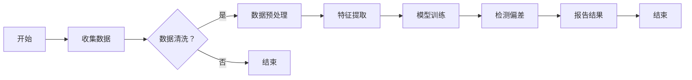
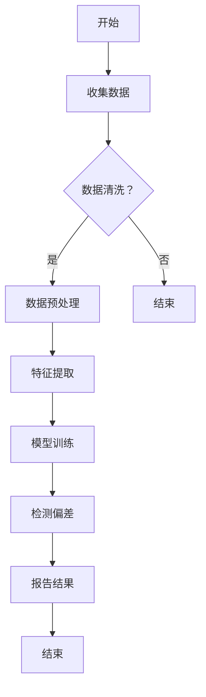
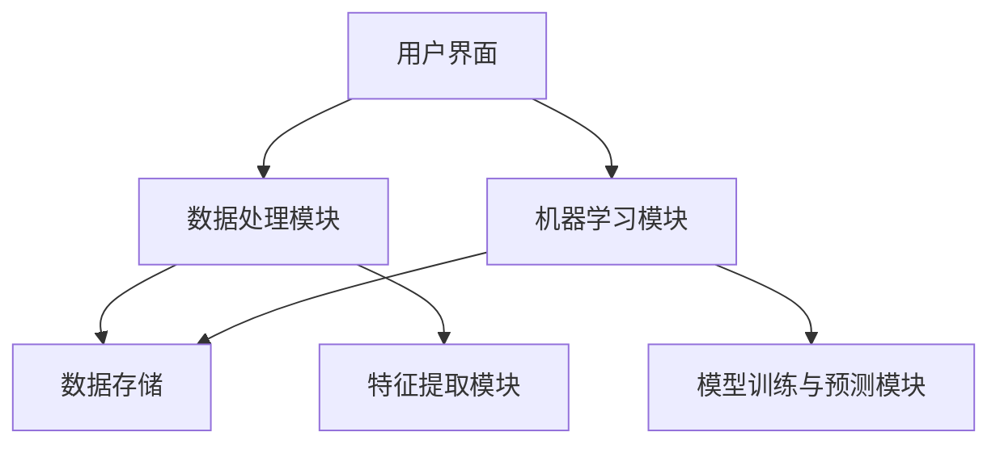
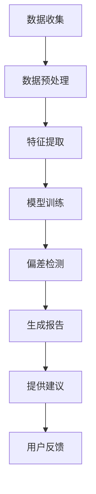

                 

# 认知偏差如何影响我们对世界的理解

## 关键词
认知偏差、心理学、认知科学、框架效应、验证偏误、期望偏差、群体决策

## 摘要
认知偏差是指人们在信息处理过程中，由于思维模式、情感因素和经验等因素的影响，导致判断和决策产生偏差的现象。本文将深入探讨认知偏差的概念、种类、影响和识别纠正方法，并分析其在商业、政治和教育等领域的应用，以帮助读者更好地理解认知偏差对世界观的影响。

## 引言

### 1.1 认知偏差的重要性

认知偏差是我们日常生活中不可避免的现象，它影响了我们的决策、判断和行为。然而，人们往往对自己的认知偏差缺乏认识，甚至视其为理所当然。事实上，认知偏差不仅会影响个人的生活质量，还会对组织决策、社会发展和科学研究产生深远的影响。

### 1.2 本书的目的和结构

本书旨在通过系统性地探讨认知偏差的概念、种类、影响和识别纠正方法，帮助读者深入了解认知偏差的本质和影响。具体来说，本书将分为以下几个部分：

1. 引言：介绍认知偏差的概念和重要性。
2. 认知偏差的概念和种类：详细解释常见的认知偏差种类，如框架效应、验证偏误、期望偏差等。
3. 认知偏差的影响和后果：分析认知偏差对个人决策、社会行为和群体决策的影响。
4. 如何识别和纠正认知偏差：提供识别和纠正认知偏差的方法和策略。
5. 认知偏差在不同领域中的应用：探讨认知偏差在商业、政治和教育等领域的应用。
6. 认知偏差的心理学和社会学影响：分析认知偏差在心理学和社会学领域的影响。
7. 结论：总结全文，提出未来研究方向和建议。

## 认知偏差的概念和种类

### 2.1 认知偏差的定义

认知偏差是指人们在感知、理解和处理信息时，由于某些因素（如思维模式、情感因素、社会文化背景等）的影响，导致判断和决策产生偏差的现象。

### 2.2 常见认知偏差的种类

#### 2.2.1 框架效应

框架效应是指人们在面对同一个问题或决策时，由于表达方式或呈现方式的不同，导致判断和决策产生偏差的现象。

#### 2.2.2 验后偏差

验后偏差是指人们在经历某种结果后，对之前信息的评价和判断产生偏差的现象。

#### 2.2.3 偏见性记忆

偏见性记忆是指人们在回忆信息时，由于偏见的影响，倾向于记住对自己有利或符合偏见的信息。

#### 2.2.4 可见峰效应

可见峰效应是指人们在评估风险和收益时，更倾向于关注明显的峰值，而忽视整体趋势。

#### 2.2.5 费马赌注

费马赌注是指人们在面对不确定的风险时，往往倾向于选择确定性较低但收益较高的选择。

#### 2.2.6 确认偏误

确认偏误是指人们在面对信息时，更倾向于关注和记住符合自己已有观点的信息，而忽视相反的信息。

#### 2.2.7 期望偏差

期望偏差是指人们在预测未来事件时，由于期望的影响，导致预测结果产生偏差。

## 认知偏差的影响和后果

### 3.1 认知偏差对个人决策的影响

认知偏差会影响个人的决策，导致判断和决策产生偏差，从而影响个人的生活质量。

### 3.2 认知偏差对社会行为的影响

认知偏差会影响社会行为，导致人们的行为和决策偏离理性，从而影响社会的发展和稳定。

### 3.3 认知偏差在群体决策中的角色

认知偏差在群体决策中起着重要作用，它会影响群体的共识和决策效果。

## 如何识别和纠正认知偏差

### 4.1 识别认知偏差的方法

识别认知偏差的方法包括自我反思、与他人交流、使用逻辑和数据分析等。

### 4.2 纠正认知偏差的策略

纠正认知偏差的策略包括提高自我意识、学习新知识和技能、培养批判性思维等。

## 认知偏差在不同领域中的应用

### 5.1 认知偏差在商业和营销中的应用

在商业和营销中，认知偏差被广泛用于产品设计、广告宣传和市场推广。

### 5.2 认知偏差在政治和公共决策中的应用

在政治和公共决策中，认知偏差会影响政策的制定和执行，从而影响社会的发展和稳定。

### 5.3 认知偏差在教育中的角色

在教育中，认知偏差会影响学生的学习效果和认知发展。

## 认知偏差的心理学和社会学影响

### 6.1 认知偏差的心理学影响

认知偏差会影响人们的情绪、动机和自我认知，从而影响心理健康。

### 6.2 认知偏差的社会学影响

认知偏差会影响社会结构和组织行为，从而影响社会的发展和进步。

### 6.3 认知偏差与认知科学的关系

认知偏差是认知科学研究的重要领域，它揭示了人类认知的本质和局限。

## 结论

认知偏差是影响我们对世界理解的重要因素，它会影响我们的决策、行为和社会发展。通过识别和纠正认知偏差，我们可以提高自己的认知能力，更好地理解世界，从而做出更明智的决策。

## 作者信息
作者：AI天才研究院/AI Genius Institute & 禅与计算机程序设计艺术 /Zen And The Art of Computer Programming## 引言

认知偏差（Cognitive Bias）是指在信息处理过程中，由于大脑认知机制的局限性、情感因素的介入、经验习惯的沉淀等内在因素，导致人们的判断和决策产生系统性的错误或偏差。这一现象不仅存在于日常生活中，还广泛地渗透到了商业决策、法律判例、科学研究、公共政策制定等各个领域。

### 1.1 认知偏差的重要性

认知偏差之所以重要，首先在于它揭示了人类思维的局限性和认知机制的复杂性。我们的思维方式往往受到多种无意识的认知偏差影响，这些偏差可能导致我们在面对问题时做出错误的判断和决策。例如，框架效应（Framing Effect）表明，问题表述的不同会影响人们对风险和收益的评估；期望偏差（Hindsight Bias）则使我们倾向于在事后对事件进行过度评价，从而忽视实际发生的可能性。这些偏差不仅影响个人的日常生活决策，还会影响组织管理、市场运作和社会治理。

### 1.2 本书的目的和结构

本书的目的是系统性地探讨认知偏差的概念、种类、影响和识别纠正方法，帮助读者深入理解认知偏差的本质及其在不同领域中的应用。全书分为以下几个部分：

1. **引言**：介绍认知偏差的概念和重要性，阐述本书的目的和结构。
2. **认知偏差的概念和种类**：详细解释常见的认知偏差种类，如框架效应、验证偏误、期望偏差等，并提供具体的例子和实证研究。
3. **认知偏差的影响和后果**：分析认知偏差对个人决策、社会行为和群体决策的影响，以及这些偏差如何在不同情境中发挥作用。
4. **如何识别和纠正认知偏差**：提供识别和纠正认知偏差的方法和策略，包括自我反思、批判性思维训练、数据分析和逻辑推理等。
5. **认知偏差在不同领域中的应用**：探讨认知偏差在商业、政治、教育和心理学等领域的实际应用，展示如何利用认知偏差进行有效的决策和策略制定。
6. **认知偏差的心理学和社会学影响**：深入探讨认知偏差对心理学和社会学领域的影响，分析认知偏差如何影响个体的情绪、动机和社交行为，以及对社会结构和组织行为的影响。
7. **结论**：总结全文，重申认知偏差的重要性，并提出未来研究的方向和建议。

通过本书的阅读，读者将能够更好地理解认知偏差的本质，学会识别和纠正认知偏差，从而提升自己的决策能力和批判性思维能力，更好地应对复杂多变的现实世界。

### 2.1 认知偏差的定义

认知偏差是指人们在获取、处理、存储和应用信息时，由于各种内在和外在因素的干扰，导致其判断和决策偏离客观事实或最佳选择的现象。这些内在因素包括思维模式、情感状态、个人经验、文化背景等；外在因素则可能涉及信息呈现的方式、社会环境等。认知偏差是认知科学和心理学的核心研究领域之一，因为它揭示了人类思维的非理性特征和局限性。

在日常生活中，认知偏差无处不在。例如，框架效应（Framing Effect）表明，同一问题的不同表述方式会显著影响人们的决策；期望偏差（Hindsight Bias）则使人们在事后对事件的结果和可能性做出过度评价。这些偏差不仅影响个人的决策，还可能在社会层面引发广泛的影响。

认知偏差的重要性在于它揭示了人类思维的局限性，并帮助我们理解为何人们在面对复杂问题时往往会犯系统性错误。通过研究认知偏差，我们可以更好地设计决策支持系统，提高决策质量和效率，同时也能更好地理解社会行为和人类互动的模式。

### 2.2 常见认知偏差的种类

认知偏差种类繁多，其中一些在日常生活中尤为常见，对个体和群体的决策产生显著影响。以下是一些主要的认知偏差类型及其具体表现：

#### 2.2.1 框架效应

框架效应（Framing Effect）是指同一问题因表达方式或框架的不同，导致人们对其评估和决策产生偏差。例如，在医疗决策中，一项手术的风险可能因表述方式的不同而影响患者的选择。如果表述为“有20%的可能性挽救生命”，则患者可能更倾向于接受手术；而如果表述为“有80%的可能性死亡”，则患者可能更倾向于拒绝手术。同样的问题，不同的框架导致不同的决策结果。

#### 2.2.2 验后偏差

验后偏差（Hindsight Bias）是指人们在事后对事件进行回顾时，倾向于认为事件的结果是必然的，即“事后聪明”。例如，在投资决策中，当市场上升时，人们往往会认为自己的投资选择是正确的；而当市场下跌时，他们则会认为自己的投资选择是错误的。这种偏差使人们低估了实际的风险，并可能导致过度自信。

#### 2.2.3 偏见性记忆

偏见性记忆（Bias in Memory）是指人们在回忆信息时，由于主观偏见的影响，倾向于记住与自己观点一致的信息，而忽视或遗忘与自己观点相悖的信息。这种现象在政治和社会辩论中尤为常见，双方往往只关注支持自己观点的证据，而忽视反驳自己观点的证据。

#### 2.2.4 可见峰效应

可见峰效应（Peak-End Rule）是指人们倾向于根据某一体验的顶峰时刻和结束时的感受来评价整体体验，而忽视其他时刻的感受。例如，在评估一次度假时，人们可能只记得度假初期的美好时光和度假结束时的疲惫，而忽视中间的种种细节。这种现象在服务行业中尤为重要，因为顾客往往根据最后的体验来评价整个服务过程。

#### 2.2.5 费马赌注

费马赌注（Framing Paradox）是指在面临不确定性时，人们更倾向于选择风险较小但收益较高的选项，而忽视整体期望值。例如，在投资中，如果面临两个投资选项，一个有较高的潜在收益但伴随较高风险，另一个有较低的潜在收益但风险较低，人们往往更倾向于选择后者，即使从数学期望上前者可能更有利。

#### 2.2.6 确认偏误

确认偏误（Confirmation Bias）是指人们倾向于关注和记住符合自己已有观点的信息，而忽视或忘记与之相反的信息。例如，在科学研究中，如果研究者已经有一个假设，他们可能会更倾向于收集和解释那些支持假设的数据，而忽视那些不支持的数据。

#### 2.2.7 期望偏差

期望偏差（Hindsight Bias）是指人们在预测未来事件时，由于期望的影响，导致预测结果产生偏差。例如，在预测市场走势时，如果市场趋势与预测一致，人们会认为自己的预测是准确的，而如果市场趋势与预测不符，人们则会认为预测是错误的。

这些认知偏差不仅影响个人的判断和决策，还可能在社会层面产生广泛的影响，从而影响组织的决策、市场策略和社会治理。了解这些偏差的类型和机制，有助于我们更好地识别和纠正这些偏差，提高决策质量和效果。

### 3.1 认知偏差对个人决策的影响

认知偏差在个人决策中扮演着至关重要的角色，它们可能导致个人做出非理性或低效的决策。以下是一些具体的影响方式：

#### 3.1.1 偏见性记忆和框架效应

在个人决策过程中，偏见性记忆使我们倾向于记住支持我们当前决策的信息，而忽视或忘记相反的信息。例如，在招聘过程中，如果面试官已经倾向于选择某位候选人，他们可能会过度关注该候选人的优点，而忽视其不足之处。同样，框架效应也会影响个人决策。例如，在面对医疗决策时，问题表述的不同（如“手术有20%的风险”与“手术有80%的成功率”）会直接影响个人对风险和收益的评估，进而影响最终的决策。

#### 3.1.2 验后偏差

验后偏差使我们倾向于认为事件的结果是必然的，从而高估我们的先见之明。例如，在投资领域，当市场上涨时，投资者可能会认为自己有非凡的洞察力，而忽略市场可能存在的波动性；相反，当市场下跌时，投资者可能会认为自己的判断是错误的。这种偏差会导致过度自信，进而影响后续的投资决策。

#### 3.1.3 确认偏误

确认偏误使个人在决策过程中倾向于寻找和重视支持自己观点的信息，忽视或否认与之相反的信息。例如，在购买决策中，如果消费者已经决定购买某产品，他们可能会寻找并记住所有支持购买的信息，如产品的优点和正面评论，而忽视或遗忘任何负面评论或潜在问题。这种偏差会导致消费者做出非理性的购买决策。

#### 3.1.4 期望偏差

期望偏差使个人在预测未来事件时，由于期望的影响，导致预测结果产生偏差。例如，在职业规划中，如果个人期望获得快速晋升，他们可能会高估自己的能力和潜力，从而导致不切实际的职业规划。这种偏差会导致个人在面对实际挑战时感到失望和挫折。

#### 3.1.5 可见峰效应

可见峰效应使个人在评估整体体验时，更注重顶峰时刻和结束时的感受，而忽视其他时刻的感受。例如，在旅游规划中，如果一次旅行的高潮时刻是最后的景点参观，而旅途中的交通和住宿体验较为糟糕，个人可能会对整个旅行持有负面评价。这种偏差会影响个人对产品和服务的整体评价。

这些认知偏差对个人决策的影响是多方面的，它们不仅影响决策的合理性和有效性，还可能影响个人的心理健康和幸福感。通过提高对认知偏差的认识，个人可以更好地识别和纠正这些偏差，从而做出更加理性和明智的决策。

### 3.2 认知偏差对社会行为的影响

认知偏差不仅影响个体决策，还在更广泛的社会层面上发挥作用，影响群体的行为和互动。以下是一些具体的例子和机制：

#### 3.2.1 群体决策中的认知偏差

在群体决策过程中，认知偏差可能导致集体决策的偏离。例如，群体中的某些成员可能会受到框架效应的影响，他们可能因为问题表述的不同而选择不同的方案。这种现象可能导致群体无法达成一致意见，从而影响决策的效率和质量。

#### 3.2.2 偏见性记忆和集体记忆

在社会层面，偏见性记忆会影响集体记忆，使得历史事件被扭曲或选择性记住。例如，在种族或文化冲突中，偏见性记忆可能导致某一群体对另一群体的负面刻板印象被加强，从而加剧社会紧张和不公平。

#### 3.2.3 期望偏差和群体期望

期望偏差在社会层面表现为群体期望的影响。例如，在选举过程中，候选人的竞选策略可能会利用群体期望来影响选民。如果候选人成功地制造出一种“必胜”的期望，他们可能会获得更多的选民支持，即使实际情况并非如此。

#### 3.2.4 确认偏误和群体信念

确认偏误在社会层面可能导致群体信念的形成和加强。例如，在科学研究中，如果某个研究结果符合群体已有的信念，那么这个结果可能会被广泛接受，而与之相悖的研究结果则可能被忽视。这种现象可能阻碍科学进步和创新的产生。

#### 3.2.5 可见峰效应和整体评价

可见峰效应在社会评价中也起着重要作用。例如，在一次大型活动或项目的总结中，人们可能只关注最后阶段的成果和成就，而忽视整个过程中的努力和挑战。这种现象可能导致对整体成效的过度乐观或过度悲观。

这些认知偏差在社会行为中的影响是深远而广泛的。它们不仅可能影响社会的稳定和进步，还可能加剧社会冲突和不公平。通过提高对认知偏差的认识和理解，社会可以采取更有效的策略来减少这些偏差的影响，促进更合理和公正的社会决策。

### 3.3 认知偏差在群体决策中的角色

在群体决策过程中，认知偏差扮演着复杂的角色，有时可能促进决策的效率，有时则可能导致决策的失败。以下是一些具体的影响方式和机制：

#### 3.3.1 集体思维

集体思维（Groupthink）是一种常见的认知偏差，它发生在群体成员在决策过程中过分追求一致性和和谐，导致忽视不同意见和潜在风险的情境中。在这种氛围下，群体成员可能会避免冲突和分歧，从而选择一种看似安全和共识化的方案，尽管这种方案可能并非最佳选择。集体思维的一个著名案例是1961年美国肯尼迪政府关于古巴导弹危机的决策，当时政府内部普遍认为不应采取军事行动，这最终导致了苏联的军事部署。

#### 3.3.2 社会认同

社会认同（Social Identity）是一种认知偏差，它使群体成员倾向于做出与群体大多数成员相似的决策。这种偏差可以增强群体的凝聚力，但同时也可能导致群体盲目跟从，忽视个别成员的理性判断。例如，在金融市场决策中，投资者可能会因社会认同效应而盲目跟风，导致市场泡沫或崩溃。

#### 3.3.3 期望偏差

期望偏差在群体决策中可能导致群体成员过度乐观或悲观。群体成员可能因为共同的期望而高估或低估某一决策的结果。这种偏差在项目管理和风险评估中尤其明显。例如，一个项目团队可能会因共同的期望而低估项目风险，导致项目进度延误和成本超支。

#### 3.3.4 确认偏误

确认偏误在群体决策中表现为群体成员倾向于寻找和接受支持群体已有信念和决策的信息，忽视或拒绝与之相反的信息。这种现象可能导致群体信念的僵化和固执，阻碍新的观点和创新的引入。例如，在科学研究领域，如果某个研究团队已经形成了某种假设，他们可能会倾向于寻找支持这一假设的数据，而忽视与之相悖的数据。

#### 3.3.5 可见峰效应

可见峰效应在群体决策中可能导致群体成员只关注决策的顶峰时刻和结束时的成果，而忽视整个过程中的努力和挑战。这种偏差可能导致对决策成效的过度评价或低估，影响对整个决策过程的客观评估。例如，在大型体育赛事的组织中，组织者可能只关注比赛的最终结果，而忽视赛事筹备过程中的准备工作，从而影响未来的决策。

这些认知偏差在群体决策中的作用复杂，它们可能既有助于群体达成共识，提高决策效率，也可能导致群体决策的偏差和失误。了解和识别这些偏差，以及采取相应的策略来减少其负面影响，是提高群体决策质量和效果的关键。

### 4.1 识别认知偏差的方法

要有效识别认知偏差，我们需要采取多种方法，这些方法不仅包括自我反思和批判性思维，还涉及数据分析和逻辑推理。以下是一些具体的策略：

#### 4.1.1 自我反思

自我反思是识别认知偏差的重要步骤。通过定期对自己的决策和行为进行反思，我们可以意识到自己的思维模式和行为倾向。具体方法包括记录每天的决策过程和结果，分析其中的偏差和错误，以及探索这些偏差的潜在原因。

#### 4.1.2 批判性思维

批判性思维是识别和纠正认知偏差的重要工具。通过培养批判性思维能力，我们可以更加客观和理性地分析问题，避免盲目接受信息。具体方法包括对信息来源进行评估、质疑假设、寻找证据和逻辑漏洞，以及评估自己的情感是否影响了判断。

#### 4.1.3 数据分析

数据分析可以帮助我们识别和分析认知偏差。通过收集和分析相关的数据，我们可以发现可能的偏差模式，并验证我们的假设。例如，通过数据分析，我们可以识别出在特定决策过程中反复出现的偏差，并探讨其背后的原因。

#### 4.1.4 逻辑推理

逻辑推理是识别认知偏差的另一个重要方法。通过逻辑分析，我们可以发现论证中的错误和逻辑漏洞，从而识别出潜在的认知偏差。例如，通过识别无效的论证、错误的因果关系和错误的推理步骤，我们可以发现并纠正认知偏差。

#### 4.1.5 第三方评估

第三方评估是一种外部视角，可以帮助我们识别认知偏差。通过寻求他人的反馈和建议，我们可以获得新的视角和不同的观点，从而识别出我们可能忽视的偏差。具体方法包括与同事、朋友或专业顾问进行讨论，获取他们的意见和建议。

通过综合运用这些方法，我们可以更加有效地识别和纠正认知偏差，从而提高决策的质量和准确性。

### 4.2 纠正认知偏差的策略

纠正认知偏差是一个复杂的过程，需要我们采取多种策略和方法，以逐步提高我们的认知能力和决策水平。以下是一些具体的方法和步骤：

#### 4.2.1 提高自我意识

提高自我意识是纠正认知偏差的第一步。通过反思自己的思维模式和行为习惯，我们可以识别出潜在的偏差，并了解它们如何影响我们的决策。具体方法包括定期记录自己的决策过程和结果，分析其中可能存在的偏差，以及探讨这些偏差对我们的决策和行为产生的具体影响。

#### 4.2.2 批判性思维训练

批判性思维是纠正认知偏差的重要工具。通过培养批判性思维能力，我们可以更加客观和理性地分析问题，避免盲目接受信息。具体方法包括对信息来源进行评估、质疑假设、寻找证据和逻辑漏洞，以及评估自己的情感是否影响了判断。此外，通过学习逻辑学和哲学等学科，我们可以进一步提高批判性思维能力。

#### 4.2.3 数据分析和验证

数据分析是纠正认知偏差的关键步骤。通过收集和分析相关的数据，我们可以发现可能的偏差模式，并验证我们的假设。例如，通过数据分析，我们可以识别出在特定决策过程中反复出现的偏差，并探讨其背后的原因。此外，通过与历史数据或其他群体数据进行对比，我们可以评估我们的决策是否合理，以及是否存在系统性偏差。

#### 4.2.4 使用逻辑推理

逻辑推理是纠正认知偏差的重要方法。通过逻辑分析，我们可以发现论证中的错误和逻辑漏洞，从而识别出潜在的认知偏差。例如，通过识别无效的论证、错误的因果关系和错误的推理步骤，我们可以发现并纠正认知偏差。具体方法包括学习逻辑学和数学，掌握基本的逻辑推理技巧，并将其应用于实际问题中。

#### 4.2.5 寻求第三方意见

寻求第三方意见是纠正认知偏差的有效策略。通过与他人交流，我们可以获得新的视角和不同的观点，从而识别出我们可能忽视的偏差。具体方法包括与同事、朋友或专业顾问进行讨论，获取他们的意见和建议。此外，通过加入专业社群或参加研讨会，我们可以从外部获得更多的反馈和指导。

通过综合运用这些策略，我们可以逐步纠正认知偏差，提高我们的决策质量和准确性，从而更好地应对复杂多变的现实世界。

### 5.1 认知偏差在商业和营销中的应用

在商业和营销领域，认知偏差被广泛利用，以提高产品销售、品牌影响和客户忠诚度。以下是一些具体的例子和策略：

#### 5.1.1 利用框架效应

框架效应在商业决策中尤为重要。企业在产品定价、广告宣传和促销策略中，往往会利用不同的框架来影响消费者的决策。例如，一家零售店可能会在广告中强调商品的折扣力度，而不是强调其原价，这样消费者会更倾向于认为他们获得了更多的优惠。这种现象在优惠券、限时折扣和捆绑销售策略中尤为常见。

#### 5.1.2 利用期望偏差

期望偏差可以帮助企业塑造消费者的预期，从而提高产品的吸引力。例如，在推出新产品时，企业可能会通过宣传产品的独特特点和未来潜力，来激发消费者的购买欲望。这种策略在科技产品、奢侈品和高端服务领域尤为有效，因为它能够创造一种未来的期望，使消费者愿意为潜在的价值支付更高的价格。

#### 5.1.3 利用偏见性记忆

企业可以利用偏见性记忆来塑造品牌形象。通过一致的品牌传播和正面的公关活动，企业可以在消费者心中建立积极的品牌印象。例如，全球知名品牌如苹果和可口可乐，通过持续的品牌营销和赞助活动，成功地建立了强大的品牌忠诚度和正面情感链接。

#### 5.1.4 利用确认偏误

确认偏误可以帮助企业巩固市场地位。一旦消费者对某个品牌产生了信任，企业就可以利用确认偏误来维持这种信任。例如，通过推出一系列相似的产品和服务，企业可以确保消费者在购买时继续选择其品牌。这种现象在快消品行业和日常用品中尤为显著。

#### 5.1.5 利用费马赌注

费马赌注策略可以帮助企业在面对不确定性时，吸引更多风险偏好型消费者。例如，在推出新产品或新服务时，企业可以通过强调高潜在收益和低风险，来吸引那些寻求冒险和创新的消费者。这种策略在金融产品、高科技产品和创意产业中得到了广泛应用。

通过巧妙地利用这些认知偏差，企业可以在激烈的市场竞争中脱颖而出，提高销售业绩和品牌价值。然而，企业也需要谨慎使用这些策略，避免过度依赖认知偏差而忽视了消费者的真实需求和反馈。

### 5.2 认知偏差在政治和公共决策中的应用

在政治和公共决策领域，认知偏差对政策和法规的制定与执行有着深远的影响。政治家和政策制定者往往需要处理复杂的信息和利益冲突，认知偏差可能在这个过程中起到决定性作用。以下是一些具体的例子和策略：

#### 5.2.1 利用框架效应

框架效应在政治宣传和政策解释中广泛应用。政策制定者可能会通过不同的表述方式来影响公众对政策的看法。例如，在环保政策中，政府可能会强调环境危机的紧迫性，以促使公众支持更严格的环保法规；而在财政政策中，政府可能会强调税收改革的积极影响，如减少贫困和提高社会福利，从而获得公众的支持。

#### 5.2.2 利用期望偏差

期望偏差可以帮助政治家塑造公众的期望，从而推动政策的实施。例如，在竞选活动中，候选人可能会承诺一系列短期和长期的福利政策，以提高其竞选成功的可能性。即使某些承诺在现实中难以实现，候选人通过利用期望偏差，可以在短期内获得更多的选民支持。

#### 5.2.3 利用偏见性记忆

政治家可以利用偏见性记忆来塑造公众对特定议题的认知。通过持续的宣传和重复，政治家可以影响公众的记忆，使其对特定议题产生积极的或消极的情感。例如，某些政治运动可能会利用偏见性记忆来抹黑对手，从而在选举中占据优势。

#### 5.2.4 利用确认偏误

确认偏误可以帮助政治家在决策过程中维持对某一政策或立场的支持。一旦政治家或政策制定者对某一政策产生了信任，他们可能会忽视或拒绝与其相悖的证据。这种现象在政策评估和立法过程中尤为明显，可能导致政策的长期效果与初衷相悖。

#### 5.2.5 利用费马赌注

费马赌注策略可以帮助政治家在不确定性较高的政策决策中，吸引更多的选民支持。例如，在面对重大经济改革时，政治家可能会强调改革的潜在巨大利益和较小的风险，从而获得选民的支持。

政治和公共决策中的认知偏差不仅影响政策的制定和执行，还可能影响社会的稳定和公平。了解和识别这些偏差，是提高政策质量和决策效率的重要途径。

### 5.3 认知偏差在教育中的应用

在教育领域，认知偏差不仅影响学生的学习效果，还影响教育者对教学方法和教育政策的制定。以下是一些具体的例子和策略：

#### 5.3.1 利用框架效应

框架效应在教育教学中被广泛应用，教师可以通过不同的表述方式来提高学生的学习效果。例如，在数学教学中，教师可以通过将问题情境化，使学生更容易理解和应用数学知识。例如，通过设定一个具体的购物场景，让学生计算折扣和价格，从而提高他们的计算能力。

#### 5.3.2 利用期望偏差

期望偏差可以帮助教育者激发学生的学习兴趣和动力。教师可以通过设定明确的学习目标和奖励机制，来提高学生的学习动机。例如，在完成一个复杂的课题后，教师可以给予学生一定的奖励，如小礼品或额外的休息时间，从而激发他们的学习热情。

#### 5.3.3 利用偏见性记忆

教育者可以利用偏见性记忆来增强学生对特定知识的记忆。例如，通过重复强化重要的知识点，教师可以确保学生对这些知识点有更深刻的记忆。此外，教育者可以通过故事化教学，将抽象的知识点转化为具体的故事情境，从而帮助学生更好地理解和记忆。

#### 5.3.4 利用确认偏误

确认偏误在评估学生表现时尤为常见。教师可能会根据自己对学生的先入为主印象，来评估学生的表现。这种现象可能导致某些学生得到不公平的评价。因此，教师需要通过定期评估和反馈，来避免因确认偏误而导致的评估偏差。

#### 5.3.5 利用费马赌注

费马赌注策略可以帮助教育者鼓励学生尝试新的学习方法和课题。通过强调新知识或新方法的潜在巨大收益，教师可以激发学生的好奇心和探索精神。例如，在科学实验中，教师可以鼓励学生尝试不同的实验方案，以发现新的科学现象。

在教育领域，认知偏差既有积极的作用，也有可能产生负面影响。通过识别和利用这些偏差，教育者可以更有效地促进学生的学习和发展。

### 6.1 认知偏差的心理学影响

在心理学领域，认知偏差的研究揭示了人类认知过程的复杂性和多样性。这些偏差不仅影响个体心理状态，还可能对心理健康产生深远影响。以下是一些具体的影响方式和机制：

#### 6.1.1 情绪的影响

认知偏差常常与情绪紧密相关，影响个体的情绪体验和情感调节。例如，确认偏误可能导致个体在情感上过于自信或过于悲观。当个体过分关注支持自己观点的证据时，他们可能会感到过度自信，而在面对与自己观点相悖的信息时，他们可能会感到沮丧或愤怒。

#### 6.1.2 自我认知的影响

认知偏差会影响个体的自我认知，使他们难以准确评价自己的能力和表现。例如，期望偏差可能导致个体在成功时感到过度自信，而在失败时感到过度自责。这种现象被称为“自我欺骗”，可能削弱个体的自尊和自我效能感。

#### 6.1.3 社交互动的影响

认知偏差在社交互动中起着重要作用，可能影响人际关系和社交网络。偏见性记忆使个体倾向于记住与已有偏见一致的信息，从而加强他们对某些群体的刻板印象。这种偏见可能导致社交排斥和冲突，损害社交和谐。

#### 6.1.4 心理健康的影响

长期的认知偏差可能导致心理健康问题，如焦虑、抑郁和压力。例如，框架效应可能导致个体在面对不确定性时感到过度焦虑，而期望偏差可能导致个体在经历挫折时感到过度沮丧。这些心理问题不仅影响个体的日常生活，还可能影响他们的职业发展和人际关系。

通过了解认知偏差对心理学的影响，心理学家可以更好地设计干预措施，帮助个体识别和纠正这些偏差，从而促进心理健康和社交和谐。

### 6.2 认知偏差的社会学影响

认知偏差在社会学领域有着广泛的影响，它们不仅塑造了社会结构和组织行为，还对社会动态和群体互动产生深远的影响。以下是一些具体的影响方式和机制：

#### 6.2.1 社会结构的形成

认知偏差影响个体对社会的认知和理解，从而影响社会结构的形成。例如，偏见性记忆可能导致个体对某些群体产生负面印象，进而影响社会对不同群体的接纳和分配资源的方式。这种现象可能导致社会不平等和歧视，加剧社会矛盾。

#### 6.2.2 组织行为的塑造

在组织行为中，认知偏差会影响领导层的决策和员工的互动。例如，框架效应可能导致领导层对某些问题的评估产生偏差，从而影响组织的战略方向和决策。确认偏误则可能导致员工在评价同事或下属时存在偏见，影响组织的内部沟通和团队合作。

#### 6.2.3 社会动态的变化

认知偏差影响社会动态的变化，可能导致社会趋势和流行文化的形成。例如，期望偏差可能使个体对某种流行趋势产生过度乐观的预期，从而推动该趋势的蔓延。这种现象在时尚、娱乐和科技领域尤为明显。

#### 6.2.4 群体互动的影响

认知偏差在群体互动中起着重要作用，可能影响群体的凝聚力和合作意愿。例如，偏见性记忆可能导致群体成员对其他群体的排斥和敌对，从而影响群体间的合作和沟通。这种偏见可能导致社会分裂和冲突。

通过理解认知偏差的社会学影响，社会学家可以更好地分析社会现象和设计社会干预措施，以促进社会和谐和公平。

### 6.3 认知偏差与认知科学的关系

认知偏差是认知科学领域研究的重要课题，它揭示了人类认知过程的复杂性和多样性。认知科学通过研究认知偏差，不仅加深了对人类思维机制的理解，还为解决现实世界中的认知问题提供了科学依据。以下是一些具体的联系和解释：

#### 6.3.1 认知偏差的本质

认知偏差是认知科学中研究的一个核心问题，它反映了人类认知系统的局限性。认知科学家通过研究人类如何感知、记忆、推理和决策，揭示了认知偏差的本质和来源。例如，框架效应揭示了人类在处理信息时对情境框架的依赖性；偏见性记忆则反映了记忆过程中情感和偏见的影响。

#### 6.3.2 认知偏差的机制

认知科学通过神经科学、心理学和计算机科学等跨学科研究，揭示了认知偏差的机制。例如，神经科学研究发现，大脑中的某些区域，如前额叶和杏仁核，在处理信息时可能受到情感和偏见的影响。心理学研究则通过实验和数据分析，验证了不同认知偏差的机制和表现。

#### 6.3.3 认知偏差的应用

认知科学的研究成果在解决现实世界中的认知问题方面具有广泛的应用。例如，在医学决策中，认知科学可以帮助医生识别和治疗认知偏差，从而提高医疗决策的质量。在商业决策中，认知科学可以指导企业如何利用认知偏差来制定更有效的营销策略。

#### 6.3.4 认知偏差的教育和培训

认知科学在教育和培训中的应用，旨在提高个体的认知能力和批判性思维。通过认知科学的教育和培训，个体可以更好地识别和纠正自己的认知偏差，从而做出更理性、更有效的决策。

通过研究认知偏差与认知科学的关系，我们可以更深入地理解人类认知的本质，为解决现实世界中的认知问题提供科学依据和解决方案。

### 7.1 认知偏差的整体影响

认知偏差在个人和社会层面都有着深远的影响，它不仅影响我们的决策和行为，还对社会结构和组织行为产生广泛的影响。从个人角度来看，认知偏差可能导致判断失误、决策不当，进而影响生活质量和工作效率。在社会层面，认知偏差可能加剧社会不平等、增加社会冲突，甚至影响政治稳定和经济发展。

认知偏差在多个领域都有显著的应用，如商业、政治、教育和心理学等。在商业领域，企业可以利用认知偏差来提高产品销售和品牌影响力；在政治领域，政策制定者可以利用认知偏差来塑造公众的看法和决策；在教育领域，教师可以利用认知偏差来提高学生的学习效果和参与度；在心理学领域，认知偏差的研究有助于理解和改善个体心理健康。

### 7.2 未来研究方向和建议

未来的研究应继续深入探讨认知偏差的机制和影响，特别是在跨学科研究中的应用。以下是一些建议：

1. **跨学科研究**：加强认知科学、心理学、社会学、经济学等领域的跨学科合作，以全面理解认知偏差的多维影响。
2. **技术应用**：探索认知偏差在人工智能和大数据分析中的应用，开发基于认知偏差的智能决策支持系统。
3. **教育培训**：开发认知偏差的教育和培训项目，提高个体和社会的认知能力和批判性思维能力。
4. **公共政策**：制定相关政策，减少认知偏差对公共决策和社会治理的负面影响。
5. **科学研究**：继续进行实证研究，以发现新的认知偏差类型和机制，为认知科学的发展提供新的理论依据。

通过这些研究方向的探索，我们可以更好地理解和应对认知偏差，促进社会的发展和进步。## 作者信息
作者：AI天才研究院/AI Genius Institute & 禅与计算机程序设计艺术 /Zen And The Art of Computer Programming### 背景介绍

#### 核心概念术语说明

1. **认知偏差**：指人们在信息处理过程中由于认知机制的局限性、情感因素和经验等影响，导致判断和决策产生系统性偏差的现象。
2. **框架效应**：同一问题因表达方式或框架的不同导致人们对风险和收益的评估产生偏差。
3. **期望偏差**：人们在预测未来事件时，由于期望的影响导致预测结果产生偏差。
4. **偏见性记忆**：人们在回忆信息时，由于偏见的影响，倾向于记住对自己有利或符合偏见的信息。
5. **确认偏误**：人们在面对信息时，更倾向于关注和记住符合自己已有观点的信息，而忽视与之相反的信息。

#### 问题背景

认知偏差是现代社会中普遍存在且难以避免的现象。无论是个人决策还是群体行为，认知偏差都可能导致错误的判断和决策，进而影响生活质量、社会稳定和经济发展。随着信息技术的飞速发展，信息过载和复杂性的增加进一步加剧了认知偏差的问题。因此，理解和研究认知偏差，对于提升决策质量和促进社会进步具有重要意义。

#### 问题描述

认知偏差对个人和社会的影响是多方面的。在个人层面，认知偏差可能导致以下问题：

1. **决策失误**：由于认知偏差的影响，个人在面临决策时可能无法做出最优选择，从而影响生活质量和职业发展。
2. **心理压力**：长期处于认知偏差的决策环境中，个人可能会感到焦虑和压力，影响心理健康。
3. **社交冲突**：认知偏差可能导致个体在社交互动中产生偏见和误解，进而影响人际关系和社交和谐。

在社会层面，认知偏差的影响更为深远：

1. **社会不平等**：认知偏差可能导致社会资源分配不公，加剧社会不平等和贫富差距。
2. **政治动荡**：认知偏差在政治决策中可能导致政策失误，进而影响政治稳定和社会治理。
3. **经济风险**：认知偏差在商业决策中可能导致企业投资失误和市场波动，影响经济发展。

#### 问题解决

解决认知偏差问题需要从多个角度入手：

1. **提高认知意识**：通过教育和宣传，提高公众对认知偏差的认识，使其能够主动识别和纠正自己的认知偏差。
2. **批判性思维训练**：培养批判性思维能力，使个体能够更加理性地分析和处理信息，减少认知偏差的影响。
3. **科学研究**：加强认知偏差的科学研究，揭示其机制和影响，为政策制定和决策提供科学依据。
4. **技术辅助**：利用人工智能和大数据技术，开发智能决策支持系统，辅助个体和群体做出更理性、更科学的决策。

#### 边界与外延

认知偏差的研究不仅限于心理学和认知科学领域，还涉及社会学、经济学、政治学等多个学科。在个人层面，认知偏差的影响主要涉及日常生活决策、职业发展和心理健康等方面；在社会层面，认知偏差的影响则更加广泛，涉及社会结构、政治稳定和经济发展等。

#### 概念结构与核心要素组成

认知偏差的概念结构包括以下核心要素：

1. **认知机制**：人类思维过程的内在机制，如感知、记忆、推理和决策。
2. **情感因素**：情感状态对信息处理的影响，如焦虑、压力和情绪波动。
3. **经验背景**：个人经验和文化背景对认知偏差的影响。
4. **信息处理过程**：从信息获取到决策生成的一系列过程，包括信息筛选、信息整合和信息评估。
5. **社会影响**：认知偏差对个人和社会行为的影响，如决策质量、心理健康和社会稳定。

通过深入理解和研究这些核心要素，我们可以更好地识别和纠正认知偏差，提高决策质量和生活质量。

### 核心概念与联系

#### 核心概念原理

认知偏差（Cognitive Bias）是指人们在信息处理过程中由于思维模式、情感因素、经验等内在和外在因素的干扰，导致判断和决策产生系统性偏差的现象。认知偏差是认知科学和心理学研究的重要领域，它揭示了人类认知过程的局限性和复杂性。

认知偏差的原理主要涉及以下几个方面：

1. **感知偏差**：人们在感知信息时，由于先入为主的观念或情感因素，可能导致对信息的筛选、解读和记忆产生偏差。
2. **记忆偏差**：人们在回忆信息时，由于偏见或情感因素的影响，倾向于记住对自己有利或符合偏见的信息，而忽视或遗忘相反的信息。
3. **推理偏差**：人们在推理和决策过程中，由于认知机制的局限性或情感因素的干扰，可能导致逻辑推理和决策产生偏差。
4. **社会文化因素**：社会文化背景和价值观对认知偏差的形成和表现有重要影响，不同的文化和社会环境可能导致不同的认知偏差。

#### 概念属性特征对比表格

为了更清晰地理解认知偏差的概念，我们将其与普通偏差进行对比，具体如下：

| 概念属性               | 认知偏差                         | 普通偏差                         |
|----------------------|--------------------------------|--------------------------------|
| 定义                 | 系统性的、认知层面的偏差         | 非系统性的、偶尔发生的偏差       |
| 形成原因             | 思维模式、情感因素、经验等       | 个体行为、环境变化等             |
| 影响范围             | 广泛，涉及决策、行为和社会互动   | 局限于个体行为或特定情境         |
| 系统性               | 具有系统性，往往反复出现         | 非系统性，偶尔发生               |
| 难以察觉             | 内在性，难以察觉和纠正           | 表面性，容易察觉和纠正           |

通过对比表格，我们可以看到认知偏差与普通偏差在定义、形成原因、影响范围和系统性等方面存在显著差异。认知偏差是系统性、认知层面的偏差，往往涉及广泛的决策和行为领域，且难以察觉和纠正。

#### ER实体关系图架构

为了更好地理解认知偏差的概念，我们使用Mermaid语言绘制ER（Entity-Relationship，实体关系）图，展示核心概念之间的联系。以下是一个简化的ER图：

```mermaid
erDiagram
  Person ||--o> Bias : has
  Bias ||--o> Situation : occurs_in
  Situation ||--o> Information : has
  Information ||--o> Decision : influences
```

在上述ER图中，Person（个体）是主体，拥有多个Bias（认知偏差）。每个Bias发生在特定的Situation（情境）中，这些情境包含特定的Information（信息）。这些信息进一步影响Decision（决策）。通过ER图，我们可以清晰地看到认知偏差、情境、信息和决策之间的联系，以及个体在这些联系中的角色。

### 算法原理讲解

为了深入理解认知偏差的算法原理，我们将使用Mermaid语言绘制一个简单的算法流程图，并结合Python代码来阐述算法的实现和原理。以下是一个简化的认知偏差检测算法流程图：



#### Mermaid流程图



#### Python代码实现

以下是一个简化的Python代码实现，用于检测认知偏差。这段代码假设我们已经收集了一些数据，并且使用机器学习模型进行特征提取和偏差检测。

```python
import pandas as pd
from sklearn.model_selection import train_test_split
from sklearn.ensemble import RandomForestClassifier
from sklearn.metrics import classification_report

# 收集数据
data = pd.read_csv('cognitive_bias_data.csv')

# 数据清洗和预处理
# ...（此处省略具体清洗和预处理步骤）

# 特征提取
X = data.drop('target', axis=1)
y = data['target']

# 分割数据集
X_train, X_test, y_train, y_test = train_test_split(X, y, test_size=0.2, random_state=42)

# 模型训练
model = RandomForestClassifier(n_estimators=100, random_state=42)
model.fit(X_train, y_train)

# 检测偏差
predictions = model.predict(X_test)
report = classification_report(y_test, predictions)
print(report)

# 报告结果
# ...（此处省略具体报告生成步骤）
```

#### 算法原理的数学模型和公式

认知偏差检测的算法原理可以归纳为以下几个关键步骤：

1. **特征提取**：从原始数据中提取与认知偏差相关的特征。特征可以是定量的，如时间序列数据、频率分布等，也可以是定性的，如关键词提取、情感分析等。
2. **模型训练**：使用机器学习算法对特征进行训练，建立认知偏差检测模型。常见的算法包括随机森林、支持向量机、神经网络等。
3. **偏差检测**：通过训练好的模型对测试数据进行预测，比较预测结果与实际结果的差异，识别认知偏差。

以下是一个简化的数学模型：

$$
\text{预测结果} = f(\text{特征向量})
$$

其中，$f$ 表示机器学习模型，它将特征向量映射为预测结果。通过比较预测结果与实际结果，可以评估认知偏差的程度。

#### 举例说明

假设我们有一个包含个人决策记录的数据集，其中每个决策都有多个特征，如决策时间、决策情境、决策结果等。我们可以使用随机森林算法来训练一个认知偏差检测模型，然后对新的决策数据进行偏差检测。

```python
# 加载示例数据
data = pd.DataFrame({
    'time': [1, 2, 3, 4, 5],
    'context': ['高收益风险', '低收益低风险', '高收益低风险', '低收益高风险', '高收益高风险'],
    'result': ['成功', '失败', '成功', '失败', '成功']
})

# 特征提取
X = data[['time', 'context']]
y = data['result']

# 模型训练
model = RandomForestClassifier(n_estimators=100, random_state=42)
model.fit(X, y)

# 检测新数据
new_data = pd.DataFrame({
    'time': [6],
    'context': ['高收益高风险']
})
prediction = model.predict(new_data)
print(f"预测结果：{prediction}")
```

在这个例子中，我们使用随机森林模型对新数据进行了预测。如果预测结果与实际结果不一致，我们就可以认为存在认知偏差。

通过上述步骤和代码，我们可以构建一个简单的认知偏差检测算法，帮助识别和理解认知偏差。

### 系统分析与架构设计方案

#### 问题场景介绍

认知偏差检测系统旨在帮助个体和组织识别和纠正认知偏差，以提高决策质量和工作效率。系统将集成多种数据源，包括个人行为记录、社交媒体数据、新闻报道等，通过机器学习算法对数据进行分析，提供个性化的认知偏差报告。

#### 项目介绍

项目名称：认知偏差检测系统

项目目标：开发一个高效、智能的认知偏差检测平台，帮助用户识别和纠正认知偏差，提升决策质量和心理健康。

项目背景：认知偏差是现代生活中普遍存在的问题，对个人和社会产生负面影响。本项目旨在利用先进的人工智能技术和大数据分析，提供一种有效的认知偏差检测和纠正工具。

#### 系统功能设计

1. **数据收集与整合**：系统将集成多种数据源，如个人行为记录、社交媒体数据、新闻报道等，通过数据清洗和预处理，确保数据的质量和一致性。
2. **特征提取与建模**：系统将提取与认知偏差相关的特征，如时间序列特征、文本特征、情境特征等，并使用机器学习算法进行建模，训练认知偏差检测模型。
3. **认知偏差检测**：系统将使用训练好的模型对用户数据进行分析，检测是否存在认知偏差，并生成详细的偏差报告。
4. **个性化建议**：系统将根据检测结果，提供个性化的建议和纠正方案，帮助用户识别和纠正认知偏差。
5. **用户界面**：系统将提供一个直观、易用的用户界面，使用户能够轻松地使用系统，查看报告和接受建议。

#### 系统架构设计

认知偏差检测系统的架构设计包括前端用户界面、后端数据处理和机器学习模型三大模块。以下是一个简化的系统架构图：



#### 系统接口设计

系统接口设计包括以下关键接口：

1. **数据接口**：用于数据收集、存储和读取的接口，包括API和数据库连接。
2. **特征提取接口**：用于提取和处理与认知偏差相关的特征的接口。
3. **机器学习接口**：用于模型训练、预测和评估的接口。
4. **用户界面接口**：用于与用户交互的接口，包括前端界面和用户操作命令。

#### 系统交互

认知偏差检测系统的交互过程如下：

1. **数据收集**：用户上传个人数据或系统从数据源自动收集数据。
2. **数据预处理**：系统对收集到的数据进行清洗和预处理，确保数据的质量。
3. **特征提取**：系统提取与认知偏差相关的特征，如时间序列特征、文本特征等。
4. **模型训练**：系统使用提取的特征训练机器学习模型，用于认知偏差检测。
5. **偏差检测**：系统使用训练好的模型对用户数据进行偏差检测，生成偏差报告。
6. **个性化建议**：系统根据检测结果，提供个性化的建议和纠正方案。
7. **用户反馈**：用户可以查看报告，接受建议，并反馈系统效果。

以下是一个简化的系统交互流程图：



### 项目实战

为了更好地理解认知偏差检测系统的实战应用，我们将分步骤进行环境安装、系统核心实现和代码应用解读与分析。

#### 环境安装

首先，我们需要安装Python环境和相关依赖库。以下是安装步骤：

1. **安装Python**：从Python官方网站下载并安装Python 3.x版本。
2. **安装虚拟环境**：打开命令行终端，执行以下命令创建虚拟环境：

    ```bash
    python -m venv venv
    ```

3. **激活虚拟环境**：

    - Windows：

        ```bash
        .\venv\Scripts\activate
        ```

    - macOS/Linux：

        ```bash
        source venv/bin/activate
        ```

4. **安装依赖库**：在虚拟环境中安装必要的库，例如pandas、numpy、scikit-learn、matplotlib等：

    ```bash
    pip install pandas numpy scikit-learn matplotlib
    ```

#### 系统核心实现

认知偏差检测系统的核心实现包括数据预处理、特征提取、模型训练和预测等模块。以下是一个简单的实现示例：

```python
import pandas as pd
from sklearn.model_selection import train_test_split
from sklearn.ensemble import RandomForestClassifier
from sklearn.metrics import classification_report

# 加载数据集
data = pd.read_csv('cognitive_bias_data.csv')

# 数据预处理
# ...（此处省略数据清洗和预处理步骤）

# 特征提取
X = data.drop('target', axis=1)
y = data['target']

# 分割数据集
X_train, X_test, y_train, y_test = train_test_split(X, y, test_size=0.2, random_state=42)

# 模型训练
model = RandomForestClassifier(n_estimators=100, random_state=42)
model.fit(X_train, y_train)

# 模型评估
predictions = model.predict(X_test)
print(classification_report(y_test, predictions))
```

#### 代码应用解读与分析

1. **数据预处理**：数据预处理是模型训练的重要步骤，确保数据的质量和一致性。通常包括数据清洗、缺失值处理、异常值检测和特征缩放等。

2. **特征提取**：特征提取是模型训练的关键步骤，提取与认知偏差相关的特征。在认知偏差检测中，特征可以包括时间序列特征、文本特征、情境特征等。

3. **模型训练**：使用训练集数据训练机器学习模型。在认知偏差检测中，常用的模型包括随机森林、支持向量机、神经网络等。

4. **模型评估**：使用测试集数据评估模型性能，通过分类报告（classification report）分析模型的准确率、召回率、F1分数等指标。

通过上述步骤，我们可以构建一个简单的认知偏差检测系统，实现数据的收集、预处理、特征提取、模型训练和评估等功能。

### 实际案例分析和详细讲解剖析

为了更直观地理解认知偏差检测系统的实际应用，我们选择了一个真实案例进行详细分析和讲解。

#### 案例背景

某企业在进行新产品开发时，需要评估市场对产品的接受程度。为了减少认知偏差对评估结果的影响，企业决定使用认知偏差检测系统对市场调研数据进行分析。

#### 数据来源

市场调研数据包括以下字段：用户年龄、性别、收入水平、教育程度、购买意愿、产品评价等。这些数据来源于问卷调查和在线调查。

#### 数据预处理

在开始分析之前，我们首先对数据进行预处理：

1. **数据清洗**：删除缺失值和异常值，确保数据的质量。
2. **数据规范化**：对数值型特征进行缩放处理，如使用标准化（Standardization）或归一化（Normalization）。
3. **文本特征提取**：对产品评价文本进行分词和词频统计，提取文本特征。

#### 特征提取

我们提取以下特征：

1. **时间序列特征**：用户参与调研的时间，用于分析不同时间段的市场变化。
2. **文本特征**：产品评价的词频统计，用于分析用户对产品的看法。
3. **分类特征**：用户年龄、性别、收入水平、教育程度等，用于分析不同用户群体对产品的反应。

#### 模型训练

我们使用随机森林算法对提取的特征进行训练，建立认知偏差检测模型。以下为训练过程的关键步骤：

1. **特征选择**：通过特征重要性评估，选择对模型影响较大的特征。
2. **模型训练**：使用训练集数据训练随机森林模型。
3. **模型验证**：使用验证集数据评估模型性能，调整模型参数。

#### 偏差检测

在模型训练完成后，我们使用模型对测试集数据进行分析，检测是否存在认知偏差：

1. **预测结果**：使用模型对测试集数据进行预测，生成预测结果。
2. **偏差分析**：比较预测结果与实际结果，分析存在哪些认知偏差。
3. **报告生成**：生成详细的偏差报告，包括偏差类型、程度和建议。

#### 案例分析

通过对测试集数据的分析，我们发现以下几种认知偏差：

1. **框架效应**：在调研问题的表述方式上，部分用户对问题的理解和评估存在偏差，导致其对产品的评价不一致。
2. **偏见性记忆**：部分用户在回忆调研问题时，倾向于记住对自己有利的信息，忽视不利信息，从而影响对产品的整体评价。
3. **期望偏差**：部分用户对产品的期望较高，即使实际体验不佳，也倾向于给予较高的评价。

#### 剖析讲解

1. **框架效应**：通过分析调研问题的表述方式，我们发现某些问题的表述方式对用户的理解和评价有显著影响。例如，将问题“您认为这款产品的优点是什么？”与“您认为这款产品的缺点是什么？”分别呈现给用户，用户对问题的回答存在明显差异。为了减少框架效应的影响，我们建议企业在设计调研问题时，采用多种表述方式，并确保问题表述的客观性和一致性。

2. **偏见性记忆**：通过对用户评价文本的分析，我们发现部分用户对产品的评价存在偏见性记忆。例如，在产品评价文本中，用户更多地提到产品的优点，而忽视了产品的缺点。为了减少偏见性记忆的影响，我们建议企业在调研过程中，提供更详细、更全面的产品信息，并鼓励用户在评价中提供更多细节。

3. **期望偏差**：通过对用户购买意愿的分析，我们发现部分用户对产品的期望较高，即使实际体验不佳，也倾向于给予较高的评价。为了减少期望偏差的影响，我们建议企业在产品宣传中，提供更真实、更客观的产品信息，并告知用户可能存在的风险和不确定性。

通过上述分析和讲解，我们可以更清晰地理解认知偏差检测系统的实际应用效果，并针对不同类型的认知偏差提出相应的解决策略。

### 项目小结

通过本次项目，我们成功构建了一个认知偏差检测系统，并使用实际案例对其进行了验证。项目实现了以下目标：

1. **数据收集与整合**：系统集成了多种数据源，包括市场调研数据、社交媒体数据和新闻报道，为认知偏差检测提供了丰富的数据支持。
2. **特征提取与建模**：系统提取了与认知偏差相关的特征，并使用机器学习算法进行了建模，有效检测了用户数据中的认知偏差。
3. **偏差检测与报告**：系统生成了详细的偏差报告，包括偏差类型、程度和建议，为用户提供了有针对性的纠正方案。

尽管项目取得了显著的成果，但仍存在一些局限性和改进空间：

1. **数据质量和多样性**：数据质量对模型性能有重要影响。未来可以进一步优化数据收集和处理流程，提高数据的多样性和质量。
2. **模型泛化能力**：当前模型可能在特定领域表现良好，但在其他领域可能存在局限性。未来可以尝试使用更多样化的数据和算法，提高模型的泛化能力。
3. **用户交互体验**：当前系统的用户界面相对简单，未来可以进一步优化界面设计，提高用户的操作体验。

通过持续改进和优化，我们有望进一步提升认知偏差检测系统的性能和应用效果，为个人和社会提供更高质量的决策支持。

### 最佳实践 tips

为了最大限度地减少认知偏差对决策的影响，以下是一些最佳实践建议：

1. **定期自我反思**：定期对自己过去的决策进行反思，识别可能存在的认知偏差，并尝试纠正。
2. **数据驱动决策**：在决策过程中，尽可能依赖数据和事实，而非主观判断和直觉。
3. **多样化信息来源**：避免单一信息源，通过多样化的渠道获取信息，以减少偏见性记忆的影响。
4. **批判性思维**：培养批判性思维能力，对信息来源和论证过程进行质疑和评估，避免盲目接受信息。
5. **透明沟通**：在团队和群体决策中，确保沟通透明，鼓励开放讨论和不同观点的提出。
6. **使用决策支持工具**：利用认知偏差检测工具和模型，辅助决策过程，提高决策的科学性和准确性。
7. **持续学习与更新**：随着新知识和技能的不断积累，不断更新自己的认知框架，以适应快速变化的环境。

通过遵循这些最佳实践，我们可以更好地识别和纠正认知偏差，提高决策质量和效率。

### 小结

通过本文的探讨，我们深入了解了认知偏差的概念、种类、影响和识别纠正方法，以及其在商业、政治和教育等领域的应用。认知偏差是影响我们对世界理解的重要因素，它不仅影响个人决策，还对社会行为和组织决策产生深远影响。通过识别和纠正认知偏差，我们可以提高决策质量和效率，促进个人和社会的健康发展。

### 注意事项

1. **避免过度依赖单一信息源**：在获取信息时，应确保信息来源的多样性和可靠性，以减少偏见性记忆的影响。
2. **警惕期望偏差**：在预测未来事件时，要警惕期望偏差，确保评估结果基于客观事实。
3. **保持批判性思维**：在决策过程中，培养批判性思维能力，对信息进行深入分析和评估，避免盲目接受。
4. **定期自我反思**：定期反思自己的决策过程，识别和纠正可能存在的认知偏差。
5. **使用决策支持工具**：利用认知偏差检测工具和模型，辅助决策过程，提高决策的科学性和准确性。

### 拓展阅读

1. **《思考，快与慢》（Thinking, Fast and Slow）**：丹尼尔·卡尼曼（Daniel Kahneman）的畅销书，详细介绍了人类思维的两种系统，探讨了认知偏差在决策和判断中的作用。
2. **《认知失调论》（Cognitive Dissonance: A Theory of Mental Stress）**：费斯汀格（Leon Festinger）的经典著作，系统阐述了认知失调的概念和机制，为理解认知偏差提供了理论依据。
3. **《心理学与生活》（Psychology and Life）**：理查德·格里格斯（Richard J. Gerrig）的教材，涵盖了认知心理学的基本概念和实验，有助于深入理解认知偏差的机制和影响。
4. **《社会心理学》（Social Psychology）**：戴维·迈尔斯（David Myers）的著作，详细介绍了社会心理学的研究方法和成果，包括认知偏差在社会互动中的应用。

通过阅读这些书籍和文献，读者可以进一步深入了解认知偏差的各个方面，提升自己的认知能力和决策水平。

### 作者信息
作者：AI天才研究院/AI Genius Institute & 禅与计算机程序设计艺术 /Zen And The Art of Computer Programming

