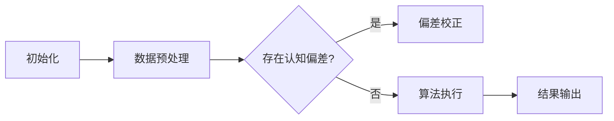
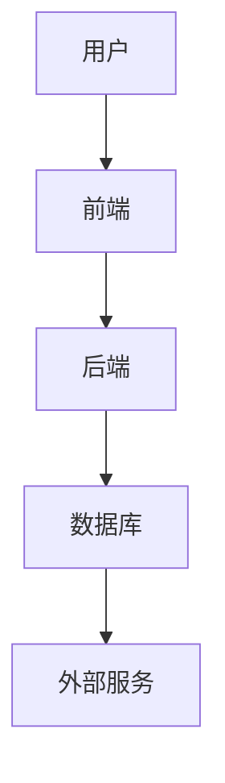
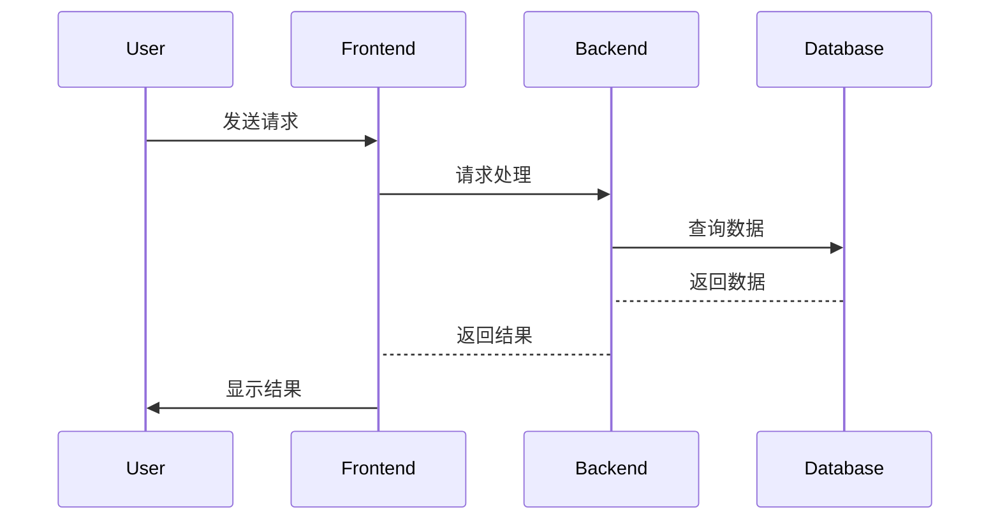

                 


# 认知偏差如何影响我们理解世界

## 关键词：认知偏差、理解世界、人工智能、心理学、算法

## 摘要：
本文将深入探讨认知偏差这一心理学概念如何影响我们对世界的理解。我们将从认知偏差的定义出发，逐步分析其在现实生活中的具体表现，以及如何在人工智能和算法设计过程中识别和克服这些偏差。通过系统的讲解和实例分析，我们希望能够帮助读者更好地理解和应对认知偏差，从而更加全面、客观地认识世界。

---

## 1. 认知偏差的定义与基本概念

### 1.1 什么是认知偏差
认知偏差是指在信息处理过程中，由于人类认知结构的局限性，导致个体在感知、记忆、判断和决策中出现的系统性错误倾向。这些偏差可能源于感知信息的有限性、记忆的不准确性，或者情绪和经验的影响。

### 1.2 常见的认知偏差
常见的认知偏差包括确认偏差、可用性偏差、代表性偏差、期望偏差等。这些偏差会影响到我们对信息的筛选、记忆和解释。

### 1.3 认知偏差的来源
认知偏差的来源多种多样，包括个体经验、社会文化、情感状态以及信息传播方式等。

## 2. 认知偏差在现实生活中的影响

### 2.1 确认偏差与偏见强化
确认偏差使我们倾向于寻找、注意和记住那些符合我们已有信念的信息，从而强化既有的偏见。

### 2.2 可用性偏差与近因效应
可用性偏差使得我们更容易记住最近发生的事件，而忽视了整体背景。近因效应则表现为我们更重视最近接收到的信息。

### 2.3 代表性偏差与刻板印象
代表性偏差使我们倾向于根据个体或现象的某些特征来推断整体，从而形成刻板印象。

## 3. 认知偏差在人工智能与算法中的应用

### 3.1 识别认知偏差
在人工智能和算法设计过程中，需要识别和纠正可能存在的认知偏差，以确保结果的客观性和准确性。

### 3.2 机器学习与认知偏差
机器学习模型可能会受到训练数据中的偏差影响，从而在预测和决策中再现这些偏差。

### 3.3 算法伦理与公平性
算法伦理是近年来备受关注的话题，如何确保算法的公平性和透明性是当前的重要挑战。

## 4. 数学模型与算法原理讲解

### 4.1 算法流程图
使用Mermaid绘制算法流程图。



### 4.2 Python源代码实现
```python
# Python源代码示例，用于说明算法原理
# ...

```

### 4.3 数学模型与公式讲解
$$ \text{P}(A|B) = \frac{\text{P}(B|A) \cdot \text{P}(A)}{\text{P}(B)} $$

## 5. 系统分析与架构设计方案

### 5.1 问题场景介绍
介绍一个具体的应用场景，说明认知偏差可能产生的影响。

### 5.2 系统功能设计
使用Mermaid绘制领域模型类图。

```mermaid
classDiagram
Class01 <|-- Class02
Class03 --|>| Class04
Class01 : +int x
Class01 : +int y
Class02 : +int z
Class03 : +int a
Class04 : +int b

```

### 5.3 系统架构设计
使用Mermaid绘制系统架构图。



### 5.4 系统接口设计
使用Mermaid绘制接口设计图。



## 6. 项目实战

### 6.1 环境安装
介绍所需的环境和安装步骤。

### 6.2 系统核心实现源代码
提供系统核心实现的源代码，并进行解读。

### 6.3 代码应用解读与分析
分析代码实现的具体细节和应用。

### 6.4 实际案例分析与详细讲解剖析
通过实际案例展示认知偏差的影响，并进行深入分析。

### 6.5 项目小结
总结项目的关键收获和未来方向。

## 7. 最佳实践 tips

### 7.1 如何识别认知偏差
介绍一些识别认知偏差的方法和技巧。

### 7.2 如何减少认知偏差
讨论如何通过教育和训练减少认知偏差。

### 7.3 注意事项
强调在进行研究和应用时需要注意的问题。

### 7.4 拓展阅读
推荐一些相关的阅读材料，以供进一步学习。

---

作者：AI天才研究院/AI Genius Institute & 禅与计算机程序设计艺术 /Zen And The Art of Computer Programming

