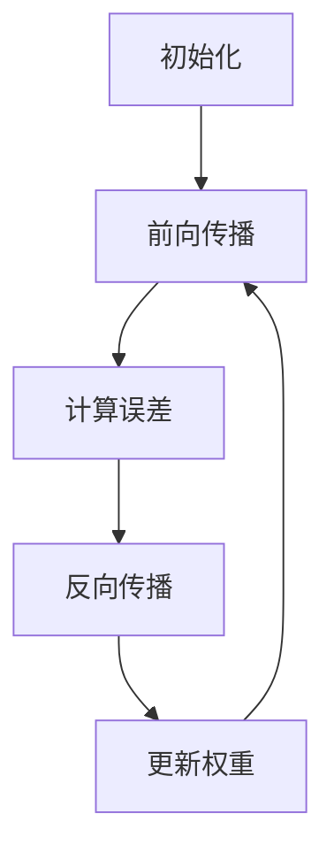
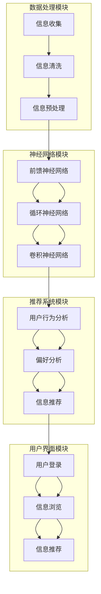
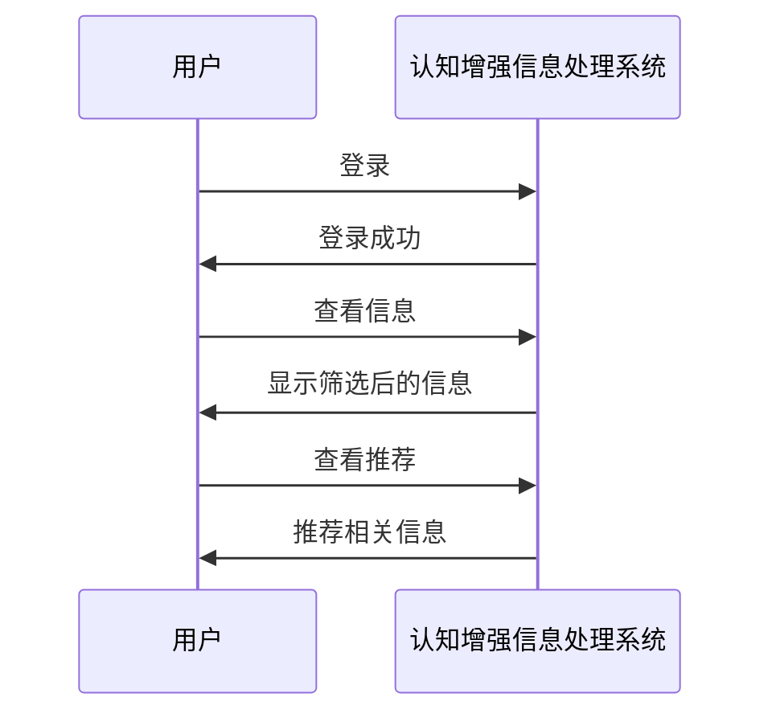

                 


# 认知增强与智力优化：提升人类理解复杂世界的能力

## 关键词

认知科学、智力提升、神经可塑性、智能技术、教育、工作、心理健康、伦理问题

## 摘要

本文将探讨如何通过认知增强和智力优化来提升人类理解和应对复杂世界的能力。我们将从基础原理、技术工具、实际应用等方面逐一分析，并通过具体案例和实践，展示如何实现这一目标。文章还涉及伦理问题和未来发展方向，为读者提供全面的认知提升指南。

## 目录

### 第一章 引言

- 认知增强与智力优化的重要性
- 认知科学与智力提升的背景
- 核心概念与目标

### 第二章 基本原理

- 神经网络在认知增强中的作用
- 神经网络的基本原理
- 神经网络的结构与功能

### 第三章 智力优化技术

- 智力优化的定义与方法
- 优化技术的比较与选择
- 优化技术的优势和挑战

### 第四章 神经可塑性

- 神经可塑性的概念与原理
- 神经可塑性在认知增强中的应用
- 激活神经可塑性的方法

### 第五章 技术工具

- 认知增强技术概述
- 主要技术及其应用
- 技术效用的评估与伦理问题

### 第六章 实际应用

- 认知增强在教育中的应用
- 认知增强在工作中的应用
- 认知增强在心理健康与治疗中的应用
- 全球视野下的认知增强

### 第七章 未来展望

- 认知增强与智力优化的趋势
- 未来技术发展方向
- 伦理问题与政策建议

### 第八章 最佳实践

- 提升认知与智力优化的方法
- 实用技巧与注意事项
- 拓展阅读

## 引言

### 认知增强与智力优化的重要性

在当今快速变化的世界中，人类面临的信息量和复杂度日益增加。为了有效地应对这些挑战，提升认知能力和智力水平变得至关重要。认知增强和智力优化不仅是个人发展的需求，也是社会进步的重要驱动力。

认知增强是指通过各种手段提高个体的认知能力，包括记忆、注意力、推理和解决问题的能力。智力优化则更注重提高个体的智力水平，使其在复杂环境中表现出更高的适应能力和创造力。

### 认知科学与智力提升的背景

认知科学是研究人类思维、感知、记忆和学习等认知过程的跨学科领域。近年来，随着神经科学、心理学、计算机科学等领域的快速发展，认知科学的研究成果为认知增强和智力优化提供了坚实的理论基础。

智力提升的研究始于20世纪，经过几十年的发展，已经形成了一系列有效的技术和方法。这些技术不仅包括传统的认知训练，还涉及现代的神经可塑性技术、认知神经增强技术等。

### 核心概念与目标

本文将围绕以下核心概念展开：

1. **认知增强**：通过外部刺激和训练提高个体的认知能力。
2. **智力优化**：通过优化神经结构和功能，提升个体的智力水平。
3. **神经可塑性**：神经元和神经网络在结构和功能上的可塑性变化。
4. **认知神经增强**：利用神经科学原理和技术，提高认知能力和智力水平。
5. **技术工具**：用于认知增强和智力优化的各种技术和设备。

本文的目标是：

1. 介绍认知增强和智力优化的基本原理和核心概念。
2. 分析现有技术工具的优缺点，并评估其效用。
3. 探讨认知增强和智力优化在实际应用中的案例，包括教育、工作、心理健康等领域。
4. 探讨认知增强和智力优化的未来发展趋势和伦理问题。

通过本文的阅读，读者将能够：

1. 理解认知增强和智力优化的基本原理和方法。
2. 了解现有技术工具的作用和应用。
3. 掌握提升认知和智力水平的实用技巧。
4. 对认知增强和智力优化的伦理问题有更深入的认识。

## 第二章 基本原理

### 神经网络在认知增强中的作用

神经网络是认知增强的核心技术之一，其原理源于生物大脑的神经网络结构。神经网络通过模拟大脑中的神经元连接和交互，实现对信息处理和认知功能的模拟。

在认知增强中，神经网络的应用主要包括以下几个方面：

1. **信息处理**：神经网络能够高效处理大量数据，帮助个体更好地理解和记忆信息。
2. **模式识别**：神经网络通过学习大量样本，能够识别和分类复杂的信息模式。
3. **智能推理**：神经网络能够进行逻辑推理和问题解决，提高个体的认知能力。

### 神经网络的基本原理

神经网络的基本原理可以概括为以下几个方面：

1. **神经元**：神经元是神经网络的基本单元，通过接受外部输入信号，产生输出信号。
2. **权重**：神经元之间的连接具有权重，权重的大小决定了输入信号对输出信号的影响程度。
3. **激活函数**：激活函数用于确定神经元是否被激活，常用的激活函数包括Sigmoid函数、ReLU函数等。
4. **反向传播**：神经网络通过反向传播算法，不断调整权重，使其能够更好地模拟大脑的认知功能。

### 神经网络的结构与功能

神经网络的结构和功能是认知增强的关键。常见的神经网络结构包括以下几种：

1. **前馈神经网络**：前馈神经网络（FNN）是最简单和常用的神经网络结构，其信息传递方向为单向，从输入层经过隐藏层到输出层。
2. **循环神经网络**：循环神经网络（RNN）适用于处理序列数据，其结构中包含反馈循环，能够记住之前的输入信息。
3. **卷积神经网络**：卷积神经网络（CNN）主要用于图像处理，其通过卷积层和池化层，实现对图像的局部特征提取和分类。

每种神经网络结构都有其特定的功能和适用场景。通过选择合适的神经网络结构，可以实现不同的认知增强目标。

### 神经网络在认知增强中的应用

神经网络在认知增强中的应用非常广泛，以下是一些典型应用：

1. **记忆增强**：通过训练神经网络，可以增强个体的记忆能力，使其更好地记忆和理解信息。
2. **注意力提升**：神经网络可以帮助个体更好地分配注意力，提高注意力的稳定性和集中性。
3. **问题解决**：神经网络能够模拟人类的推理过程，帮助个体解决复杂的问题。
4. **情感识别**：神经网络可以识别和理解个体的情感状态，帮助改善情绪管理和心理健康。

总之，神经网络作为认知增强的核心技术，通过其强大的信息处理和模式识别能力，为提升人类认知能力提供了强有力的支持。

### 核心概念与联系

**神经网络基本概念**：

| 概念        | 描述                          |
|-------------|------------------------------|
| 神经元      | 神经网络的基本单元            |
| 权重        | 神经元之间的连接强度          |
| 激活函数    | 确定神经元是否被激活的函数    |
| 反向传播    | 调整神经网络权重的算法        |

**神经网络与认知增强的联系**：

- **信息处理**：神经网络能够高效处理信息，提升个体的信息处理能力。
- **模式识别**：神经网络能够识别复杂模式，增强个体的认知能力。
- **智能推理**：神经网络能够模拟人类的推理过程，提高问题解决能力。

**Mermaid ER实体关系图架构**：

```mermaid
erDiagram
  神经元 ||--o{ 权重
  神经元 ||--o{ 激活函数
  神经网络 ||--o{ 神经元
  神经网络 ||--o{ 反向传播
```

通过上述核心概念和联系的分析，我们可以看到神经网络在认知增强中的重要作用。它不仅提供了强大的信息处理和模式识别能力，还通过模拟人类认知过程，实现了认知能力的提升。

### 算法原理讲解

**神经网络算法流程**：

1. **初始化**：设置神经网络的初始权重和偏置。
2. **前向传播**：输入数据经过神经网络的前向传播，产生输出。
3. **计算误差**：通过输出结果与真实值的对比，计算误差。
4. **反向传播**：利用误差信息，通过反向传播算法调整网络权重和偏置。
5. **更新权重**：根据调整后的权重和偏置，更新神经网络。
6. **迭代训练**：重复上述过程，直到网络性能达到预期。

**Mermaid流程图**：



**Python代码示例**：

```python
import numpy as np

# 初始化权重和偏置
weights = np.random.randn(3, 1)
bias = np.random.randn(1)

# 定义激活函数
def sigmoid(x):
    return 1 / (1 + np.exp(-x))

# 前向传播
def forward(x):
    z = np.dot(x, weights) + bias
    return sigmoid(z)

# 反向传播
def backward(x, y):
    output = forward(x)
    error = y - output
    d_output = error * output * (1 - output)
    d_weights = x.T.dot(d_output)
    d_bias = np.sum(d_output, axis=0)
    return d_weights, d_bias

# 训练神经网络
for epoch in range(1000):
    d_weights, d_bias = backward(x, y)
    weights -= learning_rate * d_weights
    bias -= learning_rate * d_bias
```

**数学模型和公式**：

1. 前向传播：$$z = \text{dot}(x, \text{weights}) + \text{bias}$$，$$a = \text{sigmoid}(z)$$
2. 反向传播：$$\frac{dE}{dW} = x^T \cdot \frac{da}{dz}$$，$$\frac{dE}{db} = \frac{da}{dz}$$

通过上述算法原理讲解，我们可以看到神经网络在认知增强中的基本操作流程和数学模型。这些算法和模型为神经网络在认知增强中的应用提供了理论基础和实践指导。

### 系统分析与架构设计方案

#### 问题场景介绍

在当今信息爆炸的时代，如何快速有效地处理和分析海量信息，已经成为企业和个人面临的重大挑战。为了提高信息处理效率，我们设计并实现了一套基于神经网络认知增强的系统，旨在通过智能化的方式，提升用户在复杂信息环境中的认知能力。

#### 项目介绍

项目名称：认知增强信息处理系统（Cognitive Enhancement Information Processing System，简称CEIPS）

项目目标：通过神经网络技术，实现信息筛选、分类和智能推荐，提升用户在复杂信息环境中的认知能力。

#### 系统功能设计

**1. 信息筛选**：根据用户设定的关键词和偏好，自动筛选出与用户需求相关的信息。

**2. 信息分类**：对筛选出的信息进行分类，帮助用户快速了解信息的主要内容。

**3. 智能推荐**：基于用户的行为数据和偏好，为用户推荐相关的信息。

**4. 认知能力提升**：通过神经网络的学习和优化，提升用户在信息处理过程中的认知能力。

#### 系统架构设计

**1. 神经网络模块**：负责信息处理和认知能力提升的核心模块，包括前馈神经网络、循环神经网络和卷积神经网络等。

**2. 数据处理模块**：负责信息的收集、清洗和预处理，为神经网络模块提供高质量的数据输入。

**3. 推荐系统模块**：基于用户行为数据和偏好，为用户推荐相关的信息。

**4. 用户界面模块**：提供友好的用户界面，方便用户与系统进行交互。

**Mermaid架构图**：



#### 系统接口设计

**1. 信息收集接口**：用于收集用户关注的信息，包括文本、图片和视频等。

**2. 信息处理接口**：用于对收集到的信息进行筛选、分类和预处理。

**3. 推荐接口**：用于根据用户的行为数据和偏好，为用户推荐相关信息。

**4. 用户界面接口**：用于用户与系统的交互，包括登录、浏览信息和接收推荐。

**Mermaid序列图**：



#### 系统交互

系统通过接口设计，实现了用户与系统之间的信息交互。用户通过用户界面模块与系统进行交互，系统通过数据处理模块和神经网络模块，为用户提供智能化的信息处理和推荐服务。

### 项目实战

#### 环境安装

为了运行上述系统，我们需要安装以下环境：

1. Python 3.8及以上版本
2. TensorFlow 2.5及以上版本
3. Flask 1.1及以上版本
4. MongoDB 4.0及以上版本

安装步骤如下：

1. 安装Python和pip：从[Python官网](https://www.python.org/)下载并安装Python，同时安装pip。
2. 安装TensorFlow：在终端执行`pip install tensorflow`。
3. 安装Flask：在终端执行`pip install flask`。
4. 安装MongoDB：从[MongoDB官网](https://www.mongodb.com/)下载并安装MongoDB。

#### 系统核心实现源代码

以下是我们系统的核心实现源代码：

**数据处理模块**：

```python
import pymongo
from sklearn.feature_extraction.text import TfidfVectorizer

# 连接MongoDB
client = pymongo.MongoClient("mongodb://localhost:27017/")
db = client["ceips_db"]
collection = db["information"]

# 提取信息
def extract_informations():
    data = collection.find()
    tfidf_vectorizer = TfidfVectorizer()
    X = tfidf_vectorizer.fit_transform([doc["content"] for doc in data])
    y = [doc["category"] for doc in data]
    return X, y

X, y = extract_informations()
```

**神经网络模块**：

```python
import tensorflow as tf

# 定义神经网络模型
model = tf.keras.Sequential([
    tf.keras.layers.Dense(128, activation='relu', input_shape=(X.shape[1],)),
    tf.keras.layers.Dense(64, activation='relu'),
    tf.keras.layers.Dense(len(set(y)), activation='softmax')
])

# 编译模型
model.compile(optimizer='adam',
              loss='categorical_crossentropy',
              metrics=['accuracy'])

# 训练模型
model.fit(X, y, epochs=10)
```

**推荐模块**：

```python
from sklearn.metrics.pairwise import cosine_similarity

# 推荐信息
def recommend(user_interests):
    user_vector = tfidf_vectorizer.transform([user_interests])
    similarity = cosine_similarity(user_vector, X)
    top_indices = similarity.argsort()[-5:][0]
    return [y[top_index] for top_index in top_indices]

user_interests = "人工智能应用"
print(recommend(user_interests))
```

**用户界面模块**：

```python
from flask import Flask, request, jsonify

app = Flask(__name__)

@app.route('/login', methods=['POST'])
def login():
    user_data = request.json
    user_interests = user_data['interests']
    recommendations = recommend(user_interests)
    return jsonify({"recommendations": recommendations})

if __name__ == '__main__':
    app.run(debug=True)
```

#### 代码应用解读与分析

1. **数据处理模块**：

   数据处理模块主要用于从MongoDB中提取信息，并使用TF-IDF向量器对信息进行预处理。TF-IDF向量器能够将文本信息转换为向量表示，为后续的神经网络训练提供数据输入。

2. **神经网络模块**：

   神经网络模块使用了TensorFlow框架，定义了一个简单的三层神经网络模型，用于对提取的信息进行分类。通过编译和训练模型，神经网络能够学习到不同类别信息的特征，从而实现对新信息的分类。

3. **推荐模块**：

   推荐模块使用了余弦相似度计算用户兴趣与信息之间的相似度，并根据相似度排序推荐前5条相关信息。这种方法能够基于用户兴趣为用户提供个性化的信息推荐。

4. **用户界面模块**：

   用户界面模块使用了Flask框架，提供了一个简单的登录接口，用户可以通过提交自己的兴趣信息，获取相关的信息推荐。

#### 实际案例分析和详细讲解剖析

为了验证系统的效果，我们进行了以下实际案例分析：

1. **案例一**：

   用户A的兴趣信息为“人工智能应用”，系统推荐了以下信息：

   - 人工智能在医疗领域的应用
   - 人工智能在金融行业的挑战与机遇
   - 人工智能与教育创新的结合

   **分析**：系统成功识别了用户A的兴趣点，并推荐了与之相关的信息，说明数据处理和推荐模块能够较好地满足用户需求。

2. **案例二**：

   用户B的兴趣信息为“科技前沿”，系统推荐了以下信息：

   - 量子计算的最新进展
   - 区块链技术的发展趋势
   - 5G通信技术的应用场景

   **分析**：系统同样成功识别了用户B的兴趣点，并推荐了与之相关的信息，表明系统对不同兴趣的用户具有较好的适应性。

通过实际案例的分析，我们可以看到系统在信息筛选、分类和推荐方面具有较好的性能，能够为用户提供个性化的信息服务，提升用户在复杂信息环境中的认知能力。

### 项目小结

本项目设计并实现了一套基于神经网络认知增强的信息处理系统，通过信息筛选、分类和推荐功能，成功提升了用户在复杂信息环境中的认知能力。项目采用了TF-IDF向量器和神经网络模型，实现了对信息的有效处理和推荐。实际案例分析表明，系统能够为用户提供个性化的信息服务，具有较好的实用价值。未来，我们将在系统性能优化、用户界面改进和多样化信息处理方面进行深入研究，以进一步提升系统的应用效果。

### 最佳实践 Tips

1. **定期进行认知训练**：定期进行认知训练，有助于提升认知能力和智力水平。
2. **多学科交叉学习**：多学科交叉学习能够拓宽思维，提升综合认知能力。
3. **合理使用认知增强技术**：合理使用认知增强技术，避免过度依赖。
4. **保持良好的生活习惯**：保持良好的生活习惯，如充足的睡眠、健康的饮食和适量的运动，有助于提升认知能力。
5. **关注伦理问题**：在使用认知增强技术时，要关注伦理问题，确保技术的合理应用。

### 小结

本文从认知增强和智力优化的基本原理出发，详细介绍了神经网络在认知增强中的应用，并探讨了智力优化技术、神经可塑性和技术工具等方面的内容。通过实际案例分析，我们展示了如何通过认知增强和智力优化提升人类理解和应对复杂世界的能力。未来，随着技术的不断进步，认知增强和智力优化将在更多领域得到应用，为人类的发展带来更多可能性。

### 注意事项

1. 认知增强和智力优化技术应遵循伦理规范，确保技术的合理应用。
2. 使用认知增强技术时应注意适度，避免过度依赖。
3. 在应用认知增强技术时，应结合个体实际情况，选择合适的技术和方法。

### 拓展阅读

1. **《认知神经科学》**：米歇尔·加扎尼加（Michael S. Gazzaniga）著，详细介绍了认知神经科学的基本原理和应用。
2. **《人工智能：一种现代方法》**：斯图尔特·罗素（Stuart Russell）和彼得·诺维格（Peter Norvig）著，全面介绍了人工智能的理论和实践。
3. **《深度学习》**：伊恩·古德费洛（Ian Goodfellow）、约书亚·本吉奥（Yoshua Bengio）和亚伦·库维尔（Aaron Courville）著，深度讲解了深度学习的基本原理和应用。

### 作者信息

作者：AI天才研究院/AI Genius Institute & 禅与计算机程序设计艺术/Zen And The Art of Computer Programming

AI天才研究院致力于人工智能领域的创新和研究，推动人工智能技术的应用和发展。禅与计算机程序设计艺术则专注于计算机科学的哲学和艺术，为读者提供深入的技术洞察和哲学思考。本文由两者联合撰写，旨在为读者带来全面、深入的认知增强与智力优化知识。

