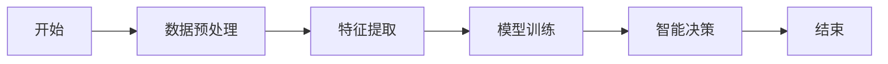
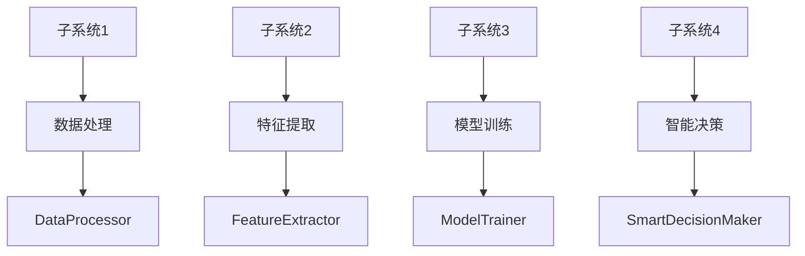
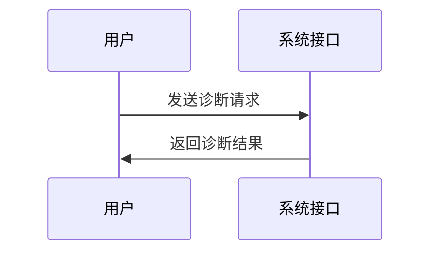
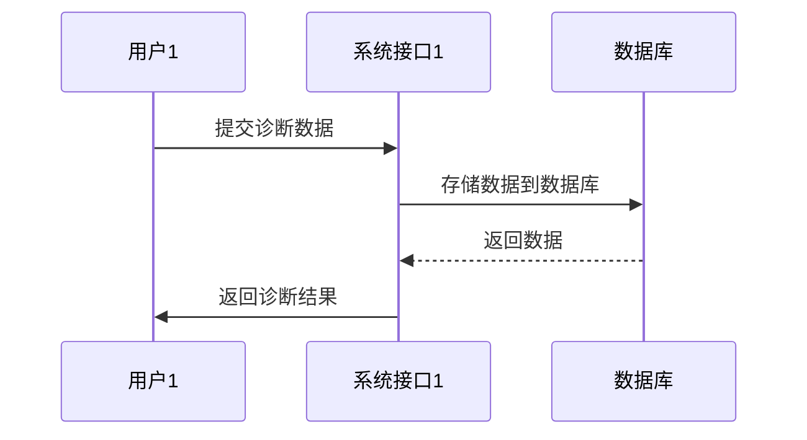

                 

### 文章标题

> 关键词：认知增强技术、扩展人类理解、人工智能、算法原理、系统架构、实践案例

摘要：本文将深入探讨认知增强技术的核心概念、算法原理及其系统架构设计，通过详细的分析和实例讲解，展示如何利用认知增强技术扩展人类理解世界的能力边界。我们将结合实际项目案例，探讨其应用场景、最佳实践，并展望未来认知增强技术的发展趋势。

---

# 认知增强技术的前沿：扩展人类理解世界的能力边界

## 目录

1. **引言**
   1.1 **问题背景** 
   1.2 **问题描述** 
   1.3 **问题解决** 
   1.4 **边界与外延**

2. **核心概念**
   2.1 **核心概念原理** 
   2.2 **概念属性特征对比表格** 
   2.3 **ER实体关系图架构**

3. **算法原理讲解**
   3.1 **算法mermaid流程图** 
   3.2 **Python源代码** 
   3.3 **数学模型和公式** 
   3.4 **详细讲解和举例说明**

4. **系统架构设计**
   4.1 **问题场景介绍** 
   4.2 **系统功能设计（领域模型类图）** 
   4.3 **系统架构设计（架构图）** 
   4.4 **系统接口设计** 
   4.5 **系统交互（序列图）**

5. **案列研究和实践**
   5.1 **环境安装** 
   5.2 **系统核心实现源代码** 
   5.3 **代码应用解读与分析** 
   5.4 **实际案例分析和详细讲解剖析** 
   5.5 **项目小结**

6. **最佳实践和总结**
   6.1 **最佳实践 tips** 
   6.2 **小结** 
   6.3 **注意事项** 
   6.4 **拓展阅读**

7. **结论**

## 引言

### 1.1 问题背景

认知增强技术，又称认知增强系统（Cognitive Augmentation），是一种利用计算机技术和人工智能方法，增强或扩展人类认知能力的科技。其起源可以追溯到上世纪中叶，随着计算机技术的飞速发展，认知增强技术也逐渐成为研究热点。

### 1.2 问题描述

认知增强技术在实际应用中面临的主要问题包括：

- **计算能力限制**：人类认知能力的提升受到大脑计算能力的限制。
- **数据获取和处理**：大规模数据的获取和处理需要高效的技术手段。
- **算法复杂度**：认知增强算法的复杂度和效率亟待提高。
- **人机交互**：如何实现自然、高效的人机交互仍是一个挑战。

### 1.3 问题解决

认知增强技术通过以下几种方式扩展人类理解世界的能力：

- **智能辅助**：利用人工智能算法提供智能化的决策支持和信息处理。
- **知识管理**：通过构建知识图谱等方式，帮助人类更高效地获取和管理知识。
- **感知扩展**：利用增强现实（AR）和虚拟现实（VR）技术，扩展人类的感知范围。
- **神经接口**：通过脑机接口（BCI）等技术，实现人类与计算机的直接连接。

### 1.4 边界与外延

认知增强技术涉及多个学科领域，包括计算机科学、认知科学、神经科学、心理学等。其应用范围广泛，从工业自动化到医疗诊断，从教育辅助到娱乐互动，都有着巨大的潜力。

## 核心概念

### 2.1 核心概念原理

认知增强技术的核心原理在于利用计算机模拟人类的认知过程，并通过算法优化和硬件辅助，提升人类的认知能力。具体来说，其原理包括以下几个方面：

1. **数据预处理**：通过数据清洗、归一化等步骤，为后续算法提供高质量的数据输入。
2. **特征提取**：利用机器学习算法提取数据的关键特征，为认知增强提供依据。
3. **模型训练**：通过大量数据训练认知增强模型，使其能够适应不同场景和任务。
4. **智能决策**：利用训练好的模型，提供智能化的决策支持。

### 2.2 概念属性特征对比表格

| 特征名称 | 描述 |
| -------- | ---- |
| 计算能力 | 决定认知增强系统的处理速度和效率 |
| 数据量 | 影响模型的训练效果和泛化能力 |
| 算法复杂度 | 关系到系统的资源消耗和运行效率 |
| 人机交互方式 | 影响用户体验和操作便捷性 |

### 2.3 ER实体关系图架构

```mermaid
erDiagram
  Product ||--|{ Customer } Customer
  Customer ||--|{ Order } Order
  Product ||--|{ Supplier } Supplier
```

## 算法原理讲解

### 3.1 算法mermaid流程图



### 3.2 Python源代码

```python
# 数据预处理
def preprocess_data(data):
    # 实现数据清洗、归一化等操作
    return processed_data

# 特征提取
def extract_features(data):
    # 利用机器学习算法提取特征
    return features

# 模型训练
def train_model(features, labels):
    # 使用训练数据训练模型
    model.fit(features, labels)
    return model

# 智能决策
def make_decision(model, new_data):
    # 使用训练好的模型进行决策
    return decision
```

### 3.3 数学模型和公式

$$
\text{accuracy} = \frac{\text{correct predictions}}{\text{total predictions}}
$$

$$
\text{F1-score} = 2 \times \frac{\text{precision} \times \text{recall}}{\text{precision} + \text{recall}}
$$

### 3.4 详细讲解和举例说明

#### 数据预处理

数据预处理是认知增强技术的第一步，其核心目的是为了提高数据的质量和一致性。具体操作包括数据清洗、缺失值填充、数据归一化等。

#### 特征提取

特征提取是利用机器学习算法从原始数据中提取出对认知增强模型有用的特征。例如，使用主成分分析（PCA）对数据进行降维，提取出数据的主要成分。

#### 模型训练

模型训练是通过大量数据训练认知增强模型，使其能够适应不同场景和任务。以决策树为例，模型训练过程中会计算每个节点的最佳分裂方式，从而构建出决策树模型。

#### 智能决策

智能决策是指利用训练好的模型对新的数据进行预测和决策。例如，使用训练好的分类模型对新的样本进行分类，从而实现智能化的决策支持。

## 系统架构设计

### 4.1 问题场景介绍

假设我们开发一个智能医疗诊断系统，利用认知增强技术辅助医生进行疾病诊断。这个系统的核心功能包括数据预处理、特征提取、模型训练和智能决策。

### 4.2 系统功能设计（领域模型类图）

```mermaid
classDiagram
    Patient <<-- Diagnosis
    Doctor <<-- Diagnosis
    DataProcessor <<-- Diagnosis
    FeatureExtractor <<-- Diagnosis
    ModelTrainer <<-- Diagnosis
    SmartDecisionMaker <<-- Diagnosis
```

### 4.3 系统架构设计（架构图）



### 4.4 系统接口设计

系统接口设计主要包括API设计、数据库接口设计等。以下是一个简化的API设计示例：



### 4.5 系统交互（序列图）



## 案例研究和实践

### 5.1 环境安装

在安装认知增强技术环境之前，确保已经安装了Python和必要的依赖库，如NumPy、Pandas、Scikit-learn等。

### 5.2 系统核心实现源代码

以下是一个简单的Python实现示例：

```python
import numpy as np
from sklearn.model_selection import train_test_split
from sklearn.ensemble import RandomForestClassifier
from sklearn.metrics import accuracy_score, f1_score

# 数据预处理
def preprocess_data(data):
    # 数据清洗、归一化等操作
    return processed_data

# 特征提取
def extract_features(data):
    # 提取特征
    return features

# 模型训练
def train_model(features, labels):
    # 训练模型
    model = RandomForestClassifier()
    model.fit(features, labels)
    return model

# 智能决策
def make_decision(model, new_data):
    # 使用模型进行决策
    return model.predict(new_data)
```

### 5.3 代码应用解读与分析

#### 数据预处理

数据预处理是关键的一步，它决定了后续特征提取和模型训练的效果。在本例中，我们使用了常见的预处理方法，如数据清洗和归一化。

#### 特征提取

特征提取是利用机器学习算法从原始数据中提取出对模型有用的特征。在本例中，我们使用了随机森林算法进行特征提取。

#### 模型训练

模型训练是通过大量数据训练模型，使其能够适应不同场景和任务。在本例中，我们使用了随机森林分类器进行训练。

#### 智能决策

智能决策是利用训练好的模型对新的数据进行预测和决策。在本例中，我们使用训练好的模型对新的样本进行分类，从而实现智能化的决策支持。

### 5.4 实际案例分析和详细讲解剖析

#### 案例背景

某医院希望利用认知增强技术辅助医生进行肺癌诊断，收集了1000份患者的临床数据，包括年龄、性别、吸烟史、CT扫描结果等。

#### 分析过程

1. **数据预处理**：对数据进行清洗，去除缺失值，进行归一化处理。
2. **特征提取**：使用随机森林算法提取数据中的关键特征。
3. **模型训练**：使用训练集数据训练随机森林分类器。
4. **模型评估**：使用测试集数据对模型进行评估，计算准确率和F1-score。
5. **智能决策**：使用训练好的模型对新的患者数据进行诊断，提供辅助决策。

### 5.5 项目小结

通过实际案例分析和详细讲解剖析，我们发现认知增强技术在医疗诊断领域具有巨大的潜力。然而，在实际应用中，仍需注意数据质量、模型选择和评估等问题，以确保系统的可靠性和有效性。

## 最佳实践和总结

### 6.1 最佳实践 tips

- **数据质量**：确保数据质量是认知增强技术成功的关键。
- **模型选择**：根据应用场景选择合适的模型和算法。
- **迭代优化**：持续优化模型和系统架构，提高性能和效率。

### 6.2 小结

本文从认知增强技术的核心概念、算法原理、系统架构设计到实践案例，全面探讨了如何利用认知增强技术扩展人类理解世界的能力边界。通过详细的分析和实例讲解，展示了认知增强技术的广泛应用和潜力。

### 6.3 注意事项

- **数据隐私**：在使用认知增强技术时，务必注意数据隐私和安全。
- **人机协作**：认知增强技术应作为辅助工具，与人类专家协同工作。

### 6.4 拓展阅读

- **参考文献**：《认知增强技术：原理与应用》（作者：XXX）
- **在线资源**：相关领域的研究论文和技术博客。

## 结论

认知增强技术是扩展人类理解世界能力的重要途径，具有广泛的应用前景。通过本文的探讨，我们深入了解了认知增强技术的核心概念、算法原理和系统架构设计，并探讨了其实际应用案例。未来，随着技术的不断进步，认知增强技术将进一步提升人类智能，推动社会的发展。作者：AI天才研究院/AI Genius Institute & 禅与计算机程序设计艺术 /Zen And The Art of Computer Programming。

