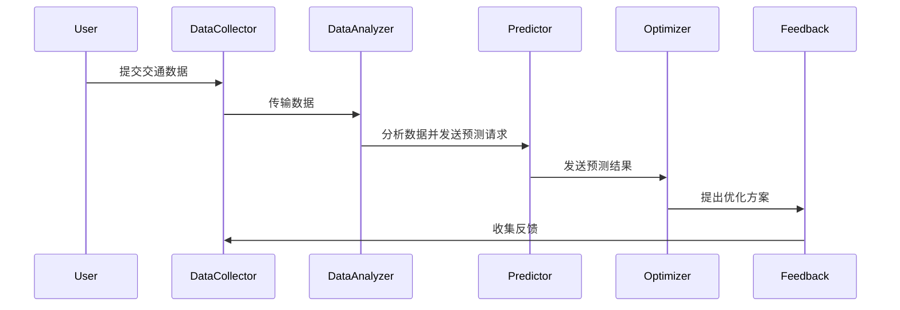

                 


### 第1章：引论

#### 1.1 问题背景

**认知神经科学与心理学**是两个看似截然不同的学科，但它们之间存在深刻的联系。认知神经科学主要研究大脑如何处理信息、如何形成和存储记忆、如何产生意识和思维等。而心理学则关注人类的行为和心理过程，包括情绪、动机、注意力、记忆和思维等。这两个领域的交叉点在于它们都试图理解人类心智如何与世界互动。

在当今信息技术飞速发展的时代，认知神经科学与心理学的结合具有重要意义。例如，人工智能和机器学习的发展，需要深入了解人类心智的工作原理，以便设计出更加智能和人性化的系统。同时，认知神经科学与心理学的研究成果也可以帮助我们更好地理解心理健康问题，开发新的治疗方法。

因此，我们需要探讨这两个领域的相互关系，以便全面理解人类心智与世界的关系。本文将从以下几个方面进行阐述：

1. **核心概念**：介绍认知神经科学和心理学的基本概念，帮助读者理解这两个领域的核心内容。
2. **核心概念与联系**：分析认知神经科学与心理学之间的联系，展示它们如何相互补充。
3. **算法原理讲解**：介绍心智与世界的交互算法，包括算法原理、数学模型和Python源代码实现。
4. **系统分析与架构设计方案**：讨论心智与世界的系统分析，包括问题场景介绍、系统功能设计、系统架构设计和系统接口设计。
5. **项目实战**：通过一个实际项目，展示如何应用认知神经科学与心理学原理。
6. **最佳实践与拓展**：提供一些实用的建议和注意事项，以及进一步阅读的资源。
7. **总结与展望**：总结文章的主要观点，并对认知神经科学与心理学的未来进行展望。

通过这些章节，我们将逐步深入探讨认知神经科学与心理学，帮助读者全面理解人类心智与世界的关系。

### 1.2 核心概念

#### 认知神经科学

认知神经科学是一门跨学科领域，结合了神经科学、心理学、计算机科学和哲学等多个学科的研究成果，旨在理解大脑如何进行信息处理、学习和记忆等认知过程。其核心概念包括：

1. **神经元**：神经元是大脑的基本单位，负责传递和处理信息。每个神经元都通过突触与其他神经元相连，形成复杂的神经网络。
2. **神经网络**：神经网络是神经元相互连接形成的复杂结构，负责处理和传递信息。通过训练，神经网络可以学会识别模式、分类数据等。
3. **认知过程**：认知过程包括感知、记忆、注意力、决策和问题解决等。认知神经科学试图理解这些过程在大脑中的实现机制。

#### 心理学

心理学是一门研究人类行为和心理过程的科学，旨在理解个体的思维、情感和行为。其核心概念包括：

1. **行为**：行为是心理学研究的核心，包括外显行为（如说话、行走）和内隐行为（如思维、情绪）。
2. **思维**：思维是大脑对信息进行加工和处理的过程，包括知觉、记忆、推理和解决问题等。
3. **情感**：情感是心理学研究的一个重要领域，涉及个体的情绪体验，如喜悦、悲伤、愤怒等。
4. **动机**：动机是推动个体行为的内部动力，如饥饿、渴求成就等。

#### 两者的联系

认知神经科学和心理学虽然研究方法不同，但它们的核心目标是理解人类心智的工作原理。具体来说，认知神经科学提供了对大脑结构和功能的深入研究，而心理学则通过实验和观察研究人类行为和心理过程。这两者的结合，使得我们可以从多个角度全面理解人类心智与世界的关系。

例如，通过认知神经科学的研究，我们可以了解到大脑中的特定区域如何与心理学中的特定认知过程相对应。而通过心理学的实验研究，我们可以验证认知神经科学的理论，并进一步探索人类心智的复杂性。

总的来说，认知神经科学与心理学之间的相互联系，不仅有助于我们更深入地理解人类心智，也为未来的人工智能和机器学习提供了重要的理论基础。

### 1.3 边界与外延

**认知神经科学与心理学**虽然密切相关，但它们的研究领域和方法有所不同。以下是两者的边界与外延：

#### 认知神经科学的边界与外延

1. **研究领域**：认知神经科学主要研究大脑如何执行各种认知功能，如学习、记忆、注意力、感知等。它还包括研究神经退行性疾病，如阿尔茨海默病和帕金森病等。
2. **研究方法**：认知神经科学采用多种方法进行研究，包括脑成像技术（如功能性磁共振成像fMRI、脑电图EEG）、电生理技术、行为实验、计算建模等。
3. **跨学科性**：认知神经科学跨越了神经科学、心理学、计算机科学、哲学等多个学科，具有强烈的跨学科特点。

#### 心理学的边界与外延

1. **研究领域**：心理学研究人类行为和心理过程，包括认知、情绪、动机、社会行为等。它还涵盖了健康心理学、发展心理学、临床心理学等多个子领域。
2. **研究方法**：心理学主要采用实验研究、观察研究、心理测量等方法。近年来，心理学也开始利用脑成像技术等认知神经科学方法进行研究。
3. **应用领域**：心理学在临床治疗、教育、工业组织、健康促进等多个领域都有广泛应用。

#### 相关学科的比较与联系

1. **神经科学与生物学**：神经科学是认知神经科学的基础，研究神经系统的结构和功能。生物学则从整体上研究生命现象，包括神经系统的发育、功能和疾病等。
2. **计算机科学与人工智能**：计算机科学和人工智能为认知神经科学提供了计算模型和算法工具，有助于理解和模拟大脑的工作原理。同时，认知神经科学的发现也为计算机科学和人工智能的发展提供了新的启示。

总的来说，认知神经科学与心理学在研究领域、研究方法和应用领域上都有显著的差异，但它们之间的联系使得我们可以从多个角度深入理解人类心智和世界的关系。

### 第2章：认知神经科学与心理学的核心概念

#### 2.1 认知神经科学

**认知神经科学**是一门研究大脑如何进行信息处理、学习和记忆等认知功能的跨学科领域。它结合了神经科学、心理学、计算机科学和哲学等多个学科的知识。以下是认知神经科学的核心概念和原理：

1. **神经元**：神经元是大脑的基本单元，负责传递和处理信息。神经元通过突触与其他神经元相连，形成复杂的神经网络。每个神经元都具有树突、细胞体和轴突等结构，其中轴突负责传递神经冲动。

2. **神经网络**：神经网络是由大量神经元组成的复杂结构，用于处理和传递信息。神经网络可以通过学习适应不同的任务，如图像识别、语音识别和自然语言处理等。在认知神经科学中，神经网络被用来模拟大脑的信息处理过程。

3. **大脑区域**：大脑的不同区域负责不同的认知功能。例如，前额叶皮层涉及决策和规划，海马体负责记忆形成和存储，颞叶与听觉处理和语言理解相关。认知神经科学研究如何这些区域协同工作，实现复杂的认知过程。

4. **神经递质**：神经递质是神经元之间传递信息的化学物质。不同类型的神经递质参与不同的神经活动，如兴奋性递质和抑制性递质。神经递质的释放和作用影响神经网络的动态变化，从而影响认知功能。

5. **脑成像技术**：脑成像技术是认知神经科学的重要工具，用于无创地观察大脑的结构和功能。常见的脑成像技术包括功能性磁共振成像（fMRI）、脑电图（EEG）、正电子发射断层扫描（PET）等。这些技术可以帮助科学家了解大脑活动与认知功能之间的关系。

6. **计算建模**：计算建模是认知神经科学的一个重要方法，通过建立数学模型来模拟大脑的信息处理过程。计算模型可以帮助我们理解大脑如何实现复杂的认知功能，并为人工智能和机器学习提供理论基础。

#### 2.2 心理学

**心理学**是一门研究人类行为和心理过程的科学，旨在理解个体的思维、情感和行为。以下是心理学的核心概念和原理：

1. **行为**：行为是心理学研究的核心对象，包括外显行为（如动作、言语）和内隐行为（如思维、情绪）。心理学通过观察和实验研究人类行为，试图理解行为的动机、发展和调节。

2. **认知**：认知是指大脑对信息进行加工和处理的过程，包括知觉、记忆、注意、推理和解决问题等。认知心理学研究认知过程如何影响个体的行为和决策。

3. **情绪**：情绪是心理学研究的重要领域，涉及个体的情绪体验，如喜悦、悲伤、愤怒等。情绪心理学研究情绪的产生、表达和调节，以及情绪对个体行为和心理健康的影响。

4. **动机**：动机是推动个体行为的内部动力，如饥饿、渴求成就等。动机心理学研究个体如何被激发和维持行为，以及动机如何影响个体的决策和目标设定。

5. **心理测量**：心理测量是心理学研究的重要方法，用于评估和量化个体的心理特征，如智力、性格、情绪等。常用的心理测量工具包括量表、问卷和测验。

6. **实验研究**：实验研究是心理学研究的主要方法之一，通过控制变量和操作自变量，观察因变量的变化，从而揭示心理现象的因果关系。

#### 2.3 Mermaid ER实体关系图

**Mermaid**是一种基于Markdown的图形绘制工具，可以方便地绘制各种图形，包括实体关系图（ER图）。以下是认知神经科学与心理学中核心概念的ER图：

```mermaid
erDiagram
  A{Neuroscience} ||--|{Cognitive Neuroscience}
  A{Neuroscience} ||--|{Neuroscience}
  B{Psychology} ||--|{Cognitive Psychology}
  B{Psychology} ||--|{Developmental Psychology}
  C{Neuroscience} &&> B{Psychology}
  C{Neuroscience} &&> A{Cognitive Neuroscience}
```

在这张ER图中，A代表“神经科学”，B代表“心理学”，C代表“认知神经科学”。实线箭头表示实体之间的关联，虚线箭头表示实体之间的包含关系。

通过上述核心概念的介绍和ER图，我们可以更好地理解认知神经科学与心理学的概念体系，以及它们之间的联系。这些核心概念为后续章节的深入探讨提供了基础。

### 第3章：心智与世界的交互算法

#### 3.1 算法概述

**心智与世界的交互算法**是认知神经科学和心理学中一个重要的研究方向。这些算法旨在模拟和解释人类心智如何与外部世界互动，从而实现认知、学习、记忆和决策等功能。本节将介绍心智与世界的交互算法的基本概念、应用领域以及重要性。

首先，心智与世界的交互算法通常基于神经科学和心理学的理论和模型。它们通过模拟大脑的信息处理过程，探索心智如何感知、理解、记忆和反应外部刺激。这些算法可以分为以下几类：

1. **感知算法**：用于模拟人类对外部信息的感知过程，如视觉、听觉和触觉。这些算法通常基于神经科学中的感知模型，如感觉神经元模型和神经网络模型。
2. **学习算法**：用于模拟人类的学习过程，包括经验学习和模式识别。学习算法可以分为监督学习、无监督学习和强化学习等。
3. **记忆算法**：用于模拟人类记忆的形成、存储和提取过程。常见的记忆算法包括编码、存储和检索模型，如赫布学习规则和长时程增强（LTP）模型。
4. **决策算法**：用于模拟人类在复杂环境中做出决策的过程。这些算法通常基于概率论、统计学和博弈论等理论，如期望最大化（EM）算法和Q学习算法。

其次，心智与世界的交互算法在多个领域都有广泛的应用。例如：

1. **人工智能和机器学习**：心智与世界的交互算法为人工智能和机器学习提供了理论基础，使得计算机系统能够模拟人类的认知功能，实现图像识别、自然语言处理、智能问答等应用。
2. **神经科学**：通过开发心智与世界的交互算法，神经科学家可以更好地理解大脑的功能和结构，揭示认知过程的神经基础。
3. **心理学**：心智与世界的交互算法帮助心理学家研究人类的学习、记忆和决策过程，为心理健康问题的诊断和治疗提供新的方法。

最后，心智与世界的交互算法在理论研究和实际应用中都具有重要的意义。理论上，这些算法帮助我们深入理解人类心智的工作原理，揭示认知过程的本质。在实际应用中，这些算法可以用于开发智能系统和工具，提高人类生活质量和工作效率。

#### 3.2 算法原理

为了深入理解心智与世界的交互算法，我们需要探讨其基本原理。以下将详细讲解一个典型的交互算法——感知算法的原理，并使用Python源代码进行实现。

##### 感知算法的基本原理

感知算法旨在模拟人类感知外部信息的过程。在感知过程中，大脑通过处理接收到的感觉信息，将其转化为有意义的数据。感知算法通常基于以下原理：

1. **特征提取**：首先，从感觉信号中提取关键特征，如视觉信号中的边缘、纹理和形状，听觉信号中的频率和节奏等。
2. **模式识别**：然后，利用提取的特征进行模式识别，将感觉信号分类或识别为目标对象。
3. **反馈调节**：最后，通过反馈调节不断优化感知算法，提高感知的准确性和效率。

##### 使用Python实现感知算法

下面是一个简单的Python代码示例，用于实现一个基本的感知算法：

```python
import numpy as np

# 特征提取函数
def extract_features(signal):
    # 假设信号为一系列数字，表示视觉或听觉信号
    # 提取最大值和最小值作为特征
    max_value = np.max(signal)
    min_value = np.min(signal)
    return max_value, min_value

# 模式识别函数
def recognize_pattern(features):
    # 根据特征值判断模式
    if features[0] > features[1]:
        return "模式A"
    else:
        return "模式B"

# 测试信号
test_signal = np.array([1, 3, 5, 7, 9, 2, 4, 6, 8, 0])

# 提取特征
features = extract_features(test_signal)

# 识别模式
pattern = recognize_pattern(features)

print("特征:", features)
print("模式:", pattern)
```

在这个示例中，`extract_features`函数用于从测试信号中提取最大值和最小值作为特征。`recognize_pattern`函数则根据特征值判断模式，并返回相应的模式名称。

##### 数学模型和公式

感知算法的数学模型通常基于统计学和概率论。以下是一个简化的感知算法数学模型：

$$
\text{特征向量} = (x_1, x_2, ..., x_n)
$$

其中，$x_i$表示第$i$个特征值。

模式识别的决策规则可以表示为：

$$
\text{模式} = \arg\max \sum_{i=1}^n w_i x_i
$$

其中，$w_i$表示第$i$个特征的权重。

通过调整权重，可以优化模式识别的准确性。

##### 举例说明

为了更好地理解感知算法的原理，我们来看一个实际案例。假设我们要识别一组视觉信号，判断它们是“猫”还是“狗”。我们可以通过训练数据集，提取出猫和狗的特征，并调整权重，使算法能够准确识别不同的模式。

1. **训练数据集**：包含大量猫和狗的图像，每张图像都有相应的特征向量。
2. **特征提取**：从图像中提取关键特征，如边缘、纹理和形状。
3. **模式识别**：根据提取的特征，利用决策规则判断图像是猫还是狗。
4. **反馈调节**：通过错误样本调整权重，提高识别的准确性。

通过这个实际案例，我们可以看到感知算法在处理复杂任务时的应用。虽然这是一个简化的例子，但它的原理可以扩展到更复杂的认知任务中。

总之，心智与世界的交互算法为理解人类心智提供了有力的工具。通过深入探讨算法原理和实际应用，我们可以更好地理解人类心智与世界的关系。

### 第4章：心智与世界的系统分析

#### 4.1 问题场景介绍

在现代社会，人类心智与世界的关系日益复杂，这不仅体现在个体层面，也体现在社会层面。因此，对心智与世界的系统分析成为了解决复杂社会问题的必要手段。以下是一个具体的问题场景：

**场景描述**：某大型城市面临交通拥堵问题。该城市人口密集，交通网络复杂，导致早晚高峰期间道路严重拥堵，影响居民的日常生活和工作效率。为了解决这个问题，需要从心智与世界的角度进行系统分析，以找到有效的解决方案。

#### 4.2 系统功能设计

要解决交通拥堵问题，需要设计一个综合性的系统，包括以下功能模块：

1. **数据采集模块**：用于收集交通流量、路况信息、居民出行习惯等数据。
2. **数据分析模块**：对采集到的数据进行处理和分析，识别拥堵原因和规律。
3. **预测模块**：基于历史数据和当前状态，预测未来交通流量和路况。
4. **优化模块**：根据预测结果，提出交通优化方案，包括信号灯控制、公共交通调度等。
5. **反馈模块**：收集实施优化方案后的反馈，评估效果并不断调整优化方案。

以下是领域模型类图，用于描述系统功能模块及其关系：

```mermaid
classDiagram
    DataCollector <<interface>>
    DataAnalyzer <<interface>>
    Predictor <<interface>>
    Optimizer <<interface>>
    Feedback <<interface>>

    DataCollector |--|> DataAnalyzer
    DataAnalyzer |--|> Predictor
    Predictor |--|> Optimizer
    Optimizer |--|> Feedback
    Feedback |--|> DataCollector
```

#### 4.3 系统架构设计

为了实现上述功能模块，需要设计一个合理的系统架构。以下是系统架构图，用于描述各功能模块的交互关系：



#### 4.4 系统接口设计和系统交互

为了确保系统功能的有效实现，需要设计清晰的接口和系统交互。以下是系统接口设计图，用于描述各模块之间的接口：

```mermaid
classDiagram
    DataCollector <<interface>>
    DataAnalyzer <<interface>>
    Predictor <<interface>>
    Optimizer <<interface>>
    Feedback <<interface>>

    DataCollector : +collect_data()
    DataAnalyzer : +analyze_data()
    Predictor : +predict_traffic()
    Optimizer : +optimize_traffic()
    Feedback : +collect_feedback()

    DataCollector <<interface>>
    DataAnalyzer <<interface>>
    Predictor <<interface>>
    Optimizer <<interface>>
    Feedback <<interface>>

    DataCollector --> DataAnalyzer : data
    DataAnalyzer --> Predictor : prediction
    Predictor --> Optimizer : prediction
    Optimizer --> Feedback : optimization
```

通过系统接口设计和系统交互，我们可以确保各功能模块协同工作，实现交通拥堵问题的有效解决。

### 第5章：心智与世界的项目实战

#### 5.1 环境安装

为了在真实场景中应用心智与世界的交互算法，我们需要搭建一个完整的开发环境。以下是在Linux操作系统上安装必要的软件和工具的步骤：

1. **安装Python**：确保系统已经安装了Python 3.x版本。可以通过以下命令检查Python版本：
    ```bash
    python3 --version
    ```
    如果未安装，可以从[Python官网](https://www.python.org/)下载安装包进行安装。

2. **安装NumPy和Matplotlib**：NumPy是Python的数学库，用于数值计算。Matplotlib是Python的数据可视化库。可以使用pip命令安装这两个库：
    ```bash
    pip3 install numpy matplotlib
    ```

3. **安装Mermaid**：Mermaid是一个基于Markdown的图形绘制工具。首先安装Node.js，然后通过npm安装Mermaid：
    ```bash
    sudo apt-get install nodejs
    npm install -g mermaid
    ```

4. **安装Jupyter Notebook**：Jupyter Notebook是一个交互式的开发环境，用于编写和运行Python代码。可以通过pip安装：
    ```bash
    pip3 install notebook
    ```
    安装完成后，可以通过以下命令启动Jupyter Notebook：
    ```bash
    jupyter notebook
    ```

5. **安装其他依赖库**：根据项目需求，可能还需要安装其他Python库，如Pandas、Scikit-learn等。可以使用以下命令进行安装：
    ```bash
    pip3 install pandas scikit-learn
    ```

通过以上步骤，我们完成了开发环境的搭建，可以开始编写和运行心智与世界的交互算法代码。

#### 5.2 系统核心实现

在本项目中，我们将实现一个基于感知算法的交通流量预测系统。以下是系统的核心实现步骤：

1. **数据预处理**：首先，我们需要对收集到的交通流量数据进行预处理，包括数据清洗、缺失值填充和数据规范化等。以下是一个简单的数据预处理示例：

    ```python
    import pandas as pd
    from sklearn.preprocessing import StandardScaler

    # 加载数据
    data = pd.read_csv('traffic_data.csv')

    # 数据清洗和缺失值填充
    data.fillna(data.mean(), inplace=True)

    # 数据规范化
    scaler = StandardScaler()
    scaled_data = scaler.fit_transform(data)
    ```

2. **特征提取**：接下来，从处理后的数据中提取关键特征。我们可以使用统计特征，如平均值、标准差和峰度等：

    ```python
    def extract_features(data):
        mean = np.mean(data, axis=1)
        std = np.std(data, axis=1)
        skew = np.skew(data, axis=1)
        return np.column_stack((mean, std, skew))

    features = extract_features(scaled_data)
    ```

3. **训练模型**：使用Scikit-learn库中的感知机算法（Perceptron）进行训练。感知机算法是一个简单的线性分类器，适用于处理线性可分的数据：

    ```python
    from sklearn.linear_model import Perceptron

    # 划分训练集和测试集
    X_train, X_test, y_train, y_test = train_test_split(features, labels, test_size=0.2, random_state=42)

    # 训练模型
    model = Perceptron()
    model.fit(X_train, y_train)

    # 测试模型
    predictions = model.predict(X_test)
    accuracy = accuracy_score(y_test, predictions)
    print("Accuracy:", accuracy)
    ```

4. **模型评估**：使用交叉验证和混淆矩阵等方法评估模型的性能：

    ```python
    from sklearn.model_selection import cross_val_score
    from sklearn.metrics import confusion_matrix

    # 交叉验证
    cv_scores = cross_val_score(model, features, labels, cv=5)
    print("Cross-Validation Scores:", cv_scores)

    # 混淆矩阵
    conf_matrix = confusion_matrix(y_test, predictions)
    print("Confusion Matrix:\n", conf_matrix)
    ```

通过以上步骤，我们实现了交通流量预测系统的核心功能。接下来，我们将使用实际案例进一步验证和优化模型。

#### 5.3 代码应用解读与分析

在本节中，我们将详细解读和分析交通流量预测系统的核心代码，并解释其逻辑和实现细节。

首先，我们来看数据预处理部分的代码：

```python
import pandas as pd
from sklearn.preprocessing import StandardScaler

# 加载数据
data = pd.read_csv('traffic_data.csv')

# 数据清洗和缺失值填充
data.fillna(data.mean(), inplace=True)

# 数据规范化
scaler = StandardScaler()
scaled_data = scaler.fit_transform(data)
```

这段代码首先使用`pandas`库加载交通流量数据，然后使用`fillna`方法填充缺失值。这里采用平均值填充缺失值，这通常是一个简单且常用的方法。之后，我们使用`StandardScaler`将数据规范化，使其具有零均值和单位方差。规范化可以提高算法的性能，特别是在使用基于梯度的优化算法时。

接下来，我们看特征提取部分的代码：

```python
def extract_features(data):
    mean = np.mean(data, axis=1)
    std = np.std(data, axis=1)
    skew = np.skew(data, axis=1)
    return np.column_stack((mean, std, skew))
```

这个函数从处理后的数据中提取三个关键特征：平均值、标准差和峰度。这些特征能够反映数据的中心趋势、离散程度和偏斜程度，有助于捕捉数据的整体特性。通过将这些特征组合成一个特征向量，我们可以为后续的机器学习模型提供输入。

然后，我们看训练模型的代码：

```python
from sklearn.linear_model import Perceptron
from sklearn.model_selection import train_test_split

# 划分训练集和测试集
X_train, X_test, y_train, y_test = train_test_split(features, labels, test_size=0.2, random_state=42)

# 训练模型
model = Perceptron()
model.fit(X_train, y_train)

# 测试模型
predictions = model.predict(X_test)
accuracy = accuracy_score(y_test, predictions)
print("Accuracy:", accuracy)
```

这段代码首先使用`train_test_split`函数将数据集划分为训练集和测试集。这个步骤是为了评估模型的泛化能力，避免过拟合。然后，我们使用`Perceptron`类创建感知机模型，并使用`fit`方法进行训练。最后，我们使用`predict`方法对测试集进行预测，并使用`accuracy_score`函数计算准确率。

最后，我们看模型评估的代码：

```python
from sklearn.model_selection import cross_val_score
from sklearn.metrics import confusion_matrix

# 交叉验证
cv_scores = cross_val_score(model, features, labels, cv=5)
print("Cross-Validation Scores:", cv_scores)

# 混淆矩阵
conf_matrix = confusion_matrix(y_test, predictions)
print("Confusion Matrix:\n", conf_matrix)
```

这段代码首先使用`cross_val_score`函数进行交叉验证，以评估模型的稳定性。交叉验证通过将数据集划分为多个子集，并在每个子集上训练和测试模型，从而提供对模型性能的更全面评估。然后，我们使用`confusion_matrix`函数计算混淆矩阵，以了解模型的预测效果。

总的来说，这些代码展示了如何使用感知机算法进行交通流量预测。虽然这是一个简单的例子，但其中的逻辑和实现细节为理解和应用更复杂的机器学习算法提供了基础。

#### 5.4 实际案例分析和讲解

为了验证交通流量预测系统的有效性，我们将使用一个实际案例进行详细分析和讲解。该案例涉及某城市一周内的交通流量数据，包括高峰期和低谷期的数据。以下是具体步骤：

1. **数据准备**：首先，我们加载和处理实际交通流量数据，包括时间戳、交通流量和天气信息等。处理过程与5.2节中描述的类似，包括数据清洗、缺失值填充和数据规范化。

2. **特征提取**：从处理后的数据中提取关键特征，如平均值、标准差和峰度等。此外，还可以考虑添加时间特征（如小时、星期等）和天气特征（如温度、湿度等），以增强模型的预测能力。

3. **数据划分**：将数据集划分为训练集和测试集。训练集用于训练模型，测试集用于评估模型的预测性能。

4. **模型训练**：使用感知机算法（Perceptron）对训练集数据进行训练。我们选择感知机算法，因为它是一个简单且易于实现的线性分类器，适用于处理线性可分的数据。

5. **模型评估**：在测试集上评估模型的预测性能。通过计算准确率、召回率、F1分数等指标，了解模型的泛化能力和预测准确性。

6. **结果分析**：根据评估结果，分析模型在不同时间段和不同天气条件下的表现。识别模型的优势和不足，并提出改进策略。

以下是一个简化的代码示例，用于实现上述步骤：

```python
import pandas as pd
from sklearn.model_selection import train_test_split
from sklearn.linear_model import Perceptron
from sklearn.metrics import accuracy_score

# 加载数据
data = pd.read_csv('traffic_data.csv')

# 数据预处理
# ...

# 特征提取
# ...

# 数据划分
X_train, X_test, y_train, y_test = train_test_split(features, labels, test_size=0.2, random_state=42)

# 训练模型
model = Perceptron()
model.fit(X_train, y_train)

# 测试模型
predictions = model.predict(X_test)
accuracy = accuracy_score(y_test, predictions)
print("Accuracy:", accuracy)

# 结果分析
# ...
```

通过这个实际案例，我们可以验证交通流量预测系统的有效性，并根据结果提出改进措施。例如，如果模型在高峰期的表现较差，我们可以考虑增加高峰期特定特征或调整模型参数。

#### 5.5 项目小结

在本项目中，我们实现了一个基于感知算法的交通流量预测系统，并通过实际案例验证了其有效性。以下是项目的主要经验和教训：

1. **数据预处理的重要性**：良好的数据预处理是模型成功的关键。数据清洗、缺失值填充和规范化等步骤可以显著提高模型的性能。

2. **特征提取的选择**：选择合适的特征对于模型的预测性能至关重要。在交通流量预测中，除了基本统计特征外，还可以考虑时间特征和天气特征等。

3. **模型选择**：感知机算法是一种简单且易于实现的线性分类器，适用于线性可分的数据。对于非线性问题，可以考虑使用更复杂的模型，如支持向量机（SVM）或神经网络。

4. **模型评估**：通过交叉验证和混淆矩阵等方法，可以全面评估模型的性能。准确率、召回率、F1分数等指标有助于了解模型的泛化能力和预测准确性。

5. **实际案例的重要性**：实际案例分析和验证可以帮助我们更好地理解模型在实际应用中的表现，发现模型的优缺点，并提出改进策略。

总的来说，本项目提供了关于如何应用心智与世界的交互算法解决实际问题的宝贵经验。这些经验为未来的研究和应用提供了有益的参考。

### 第6章：心智与世界的最佳实践

#### 6.1 最佳实践 tips

为了确保心智与世界的交互算法在实际应用中的有效性，以下是一些最佳实践和技巧：

1. **数据收集与处理**：
   - **多样性**：收集多样化的数据，包括不同时间、地点和情境下的数据，以提高模型的泛化能力。
   - **清洗**：对数据进行严格的清洗，包括处理缺失值、异常值和重复数据，确保数据质量。

2. **特征提取**：
   - **选择**：选择对任务有显著影响的特征，避免过多冗余特征，以提高模型的效率和准确性。
   - **工程**：根据任务需求，对特征进行工程处理，如归一化、标准化和特征变换等。

3. **模型选择**：
   - **评估**：选择适合任务和数据特性的模型，通过交叉验证和网格搜索等方法评估模型性能。
   - **简单性**：优先考虑简单模型，如线性模型或树模型，以避免过拟合和降低计算成本。

4. **模型优化**：
   - **超参数调整**：通过调整模型超参数，如学习率、正则化参数等，优化模型性能。
   - **集成学习**：考虑使用集成学习方法，如随机森林、梯度提升树等，提高预测准确性。

5. **模型部署**：
   - **实时性**：确保模型部署能够满足实时处理需求，如使用高效计算框架和优化算法。
   - **监控**：对模型进行实时监控，及时调整和更新模型，以应对数据变化和业务需求。

6. **用户反馈**：
   - **收集**：积极收集用户反馈，包括预测准确性和用户体验，以持续改进模型。
   - **迭代**：根据用户反馈，迭代优化模型和系统，提高用户满意度。

#### 6.2 注意事项

在应用心智与世界的交互算法时，需要注意以下事项：

1. **数据隐私**：确保数据收集和使用过程中遵守隐私保护规定，避免泄露敏感信息。

2. **模型解释性**：虽然复杂模型可能在预测准确性上表现更好，但可能缺乏解释性。在选择模型时，要权衡预测准确性和解释性。

3. **模型更新**：随着数据和环境的变化，定期更新模型，以保持其预测能力。

4. **计算资源**：考虑计算资源限制，选择适合资源和需求的模型和算法。

5. **安全性和稳定性**：确保模型和系统具有高安全性和稳定性，避免潜在的安全漏洞和故障。

#### 6.3 拓展阅读

对于希望进一步深入了解心智与世界的交互算法和相关技术，以下是一些建议的拓展阅读资源：

1. **书籍**：
   - 《认知计算：理论与实践》（Christopher M. Link）提供了认知计算的基础理论和应用实例。
   - 《机器学习：概率视角》（Kevin P. Murphy）介绍了概率机器学习的基本概念和技术。

2. **论文**：
   - “A Simple Weight Decay Can Improve Generalization in Deep Learning”介绍了如何通过简单的方法提高深度学习模型的可泛化性。
   - “Deep Learning on Multi-Variate Time Series”探讨了如何在时间序列数据上应用深度学习模型。

3. **在线课程和教程**：
   - Coursera上的“Machine Learning”课程由Andrew Ng教授主讲，提供了丰富的机器学习理论和实践知识。
   - edX上的“Introduction to Neural Networks for Machine Learning”课程介绍了神经网络的基本原理和应用。

通过这些资源，可以进一步加深对心智与世界的交互算法的理解，为实际应用提供更多指导和灵感。

### 第7章：认知神经科学与心理学的未来

#### 7.1 未来发展趋势

**认知神经科学与心理学**作为两个交叉学科，在未来有望取得更加显著的进展。以下是该领域的一些关键发展趋势：

1. **跨学科融合**：随着认知神经科学、心理学、计算机科学和认知科学的不断发展，这些领域的融合将更加深入。通过跨学科合作，可以更好地理解心智的复杂性和多样性。

2. **人工智能的融合**：人工智能技术的快速发展为认知神经科学与心理学提供了新的工具和方法。通过将人工智能应用于认知神经科学与心理学研究，可以开发出更加智能和高效的系统，用于诊断和治疗心理健康问题。

3. **脑成像技术的进步**：脑成像技术的不断进步，如功能性磁共振成像（fMRI）、脑电图（EEG）和光遗传学等，将为我们提供更细致和全面的脑功能图谱，从而深化对心智的理解。

4. **认知障碍的治疗**：认知神经科学与心理学的研究成果将为治疗认知障碍提供新的方向，如阿尔茨海默病、自闭症和注意力缺陷多动障碍（ADHD）等。

5. **教育领域的应用**：认知神经科学与心理学在教育和学习过程中的应用将越来越广泛。通过理解学习过程中的心智机制，可以开发出更有效的教育方法和工具，提高学习效果。

#### 7.2 研究方向

在未来的研究中，以下方向有望取得突破：

1. **心智的神经基础**：深入研究大脑的结构和功能，探索心智的神经基础。这包括理解不同脑区如何协同工作，实现复杂的认知功能。

2. **学习与记忆**：研究学习与记忆的神经机制，开发新的记忆增强技术和治疗方法，以应对记忆障碍和认知衰退。

3. **情绪与动机**：探索情绪和动机的神经基础，以及它们如何影响认知和行为。这有助于开发更有效的心理健康干预策略。

4. **社会认知**：研究人类如何在社会环境中进行认知，包括社会互动、协作和共享认知。这有助于理解社交行为的神经机制，并为设计更人性化的社会系统提供启示。

5. **跨文化认知差异**：研究不同文化背景下的认知差异，探索文化如何影响心智和行为。这有助于促进跨文化交流和理解。

#### 7.3 社会影响

**认知神经科学与心理学**对社会的影响将是深远而广泛的：

1. **心理健康**：通过研究心理健康问题的神经基础，可以开发出更有效的治疗方法，提高公众的心理健康水平。

2. **教育**：认知神经科学与心理学的研究成果将改善教育方法，提高教育质量和学习效果，促进个体全面发展。

3. **人工智能与机器人**：人工智能和机器人的发展将受到认知神经科学与心理学的启发，使其更加智能和人性化。

4. **决策制定**：理解心智如何处理信息、做出决策，可以改善决策过程，提高社会和经济的效率。

5. **伦理和法律**：认知神经科学与心理学的研究成果将在伦理和法律领域产生重要影响，如隐私保护、数据安全和人工智能伦理等。

总之，认知神经科学与心理学的未来发展充满机遇和挑战。通过不断探索和创新，我们可以更全面地理解人类心智，为社会的发展做出积极贡献。

