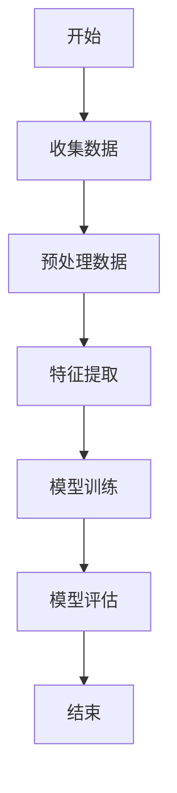
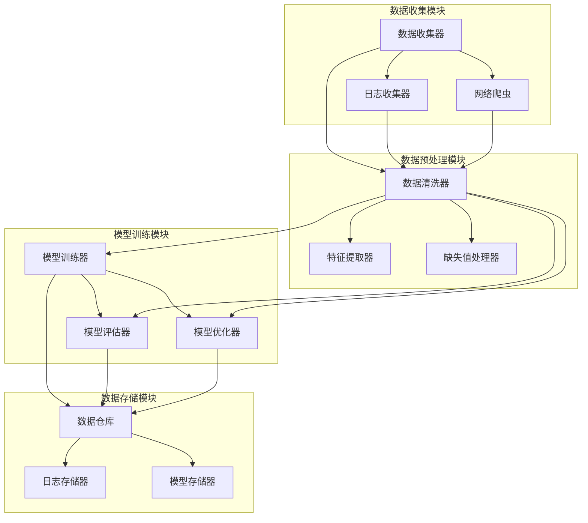
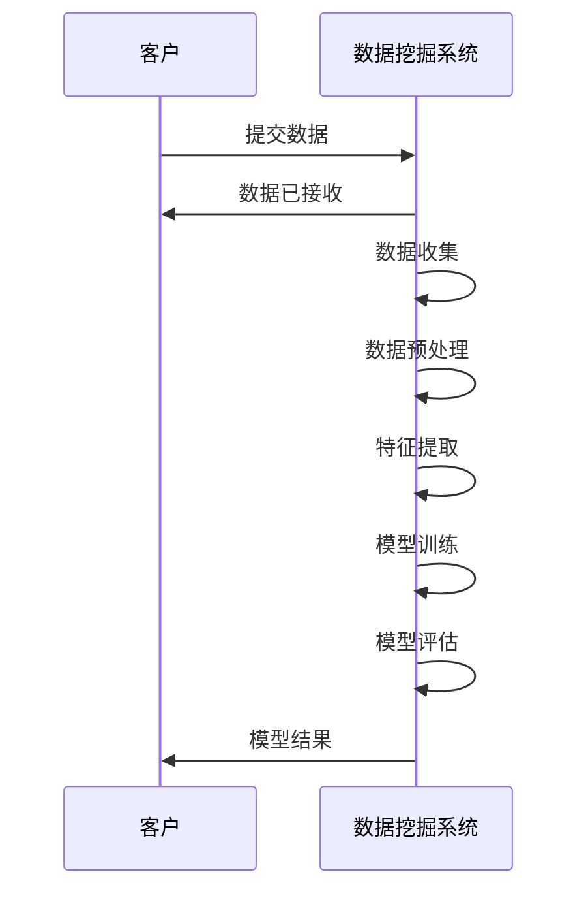
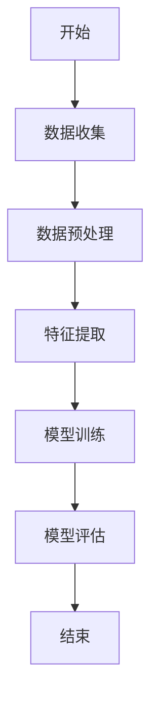
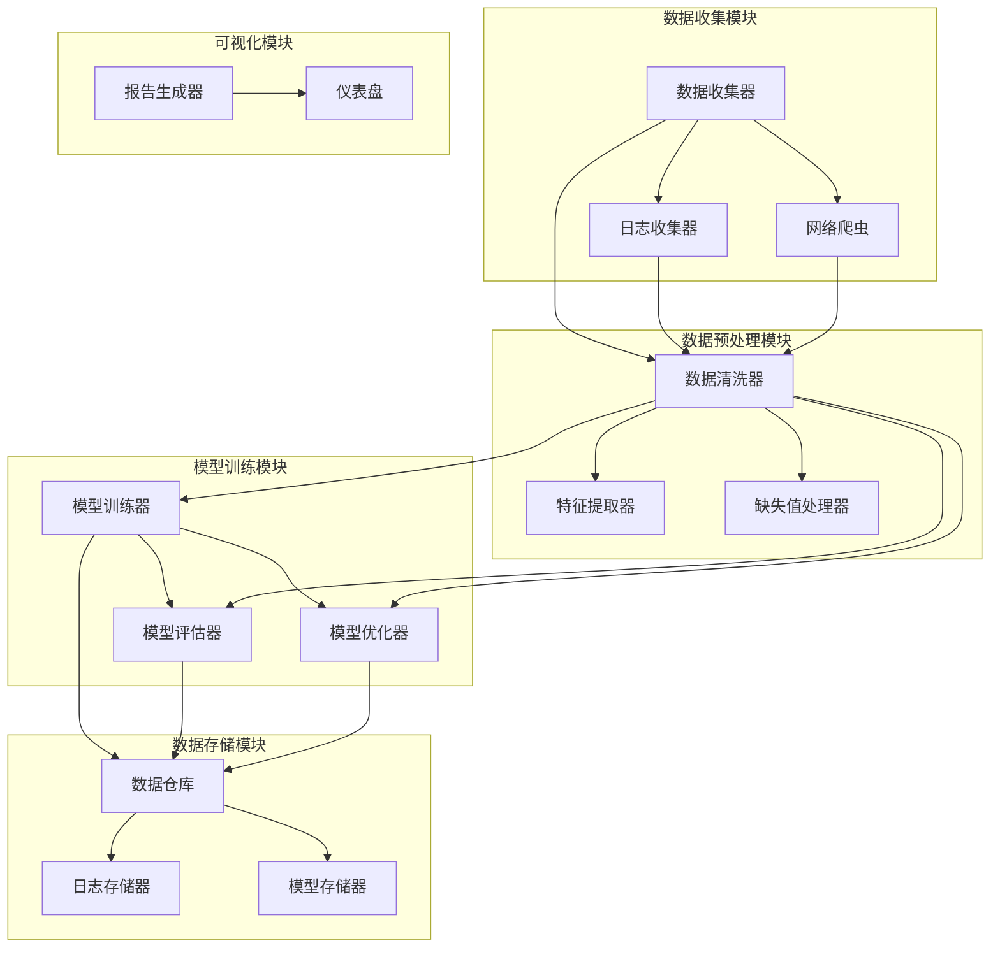
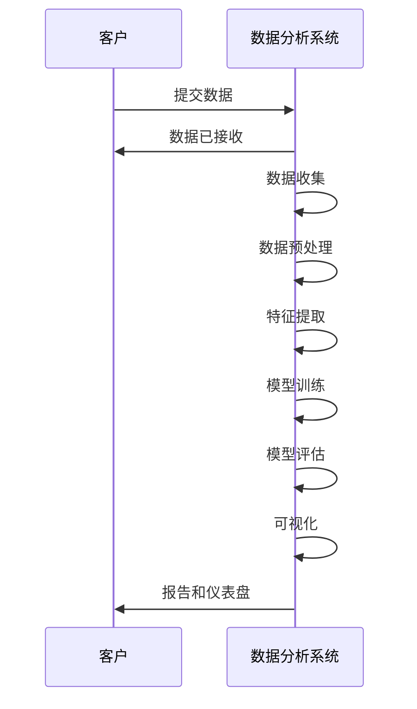

                 

### 文章标题

# 认知考古学的新发现：探索古人类如何理解世界

### 文章关键词

- 认知考古学
- 古人类认知
- 文字起源
- 艺术与审美
- 宗教与神话

### 文章摘要

本文旨在通过认知考古学的新发现，探索古人类如何理解世界。我们将从认知考古学的背景出发，深入分析古人类的认知能力，以及他们是如何认识自然界、时间与空间、宗教与神话的。此外，本文还将探讨符号与文字的起源，以及艺术与审美认知的发展。最后，我们将展望认知考古学的未来趋势，并探讨其对现代社会的启示。希望通过这篇文章，读者能够对古人类的认知世界有更深刻的理解。

### 第一部分：认知考古学的背景

## 第1章：认知考古学的诞生与发展

### 1.1.1 认知考古学的定义

认知考古学是一门结合考古学、人类学、心理学和认知科学的交叉学科。它旨在通过考古遗存的物证，研究古人类的认知能力、思维过程、语言发展和社会行为。认知考古学的核心问题是：古人类如何理解和解释周围的世界？如何通过符号和语言进行沟通和思考？这一学科为人类认知研究提供了宝贵的历史视角。

### 1.1.2 认知考古学的起源

认知考古学的起源可以追溯到20世纪60年代，当时考古学和认知科学开始相互影响。这一时期，心理学家和神经科学家对大脑如何处理信息产生了浓厚兴趣，而考古学家则开始尝试通过物证来探索古人类的行为和认知。代表性人物包括哈佛大学的理查德·克莱因（Richard Klein）和牛津大学的科林·塔尼（Colin Taner）。

### 1.1.3 认知考古学的研究方法

认知考古学的研究方法包括物质文化分析、考古遗迹研究、行为考古学和认知模拟等。物质文化分析主要关注考古遗存中的符号、工具和艺术品，以揭示古人类的认知和生活方式。考古遗迹研究则通过对遗址的挖掘和分析，探索古人类的行为模式和社会结构。行为考古学结合心理学和社会学理论，研究古人类的社会互动和行为习惯。认知模拟则利用计算机技术，模拟古人类的大脑处理信息的过程。

### 1.1.4 认知考古学的重要性

认知考古学对人类认知研究具有重要的意义。首先，它为研究人类认知的起源和发展提供了宝贵的历史视角。通过分析考古遗存，我们可以了解古人类的认知能力如何随着时间的推移而演变。其次，认知考古学有助于我们理解人类文化的多样性和共同点。不同地区和时期的考古遗存反映了古人类对世界的不同认知和理解。最后，认知考古学的研究结果对我们今天的生活也有启示。通过了解古人类的认知方式，我们可以更好地理解人类行为的根源，从而推动社会进步和个人成长。

## 第2章：古人类的认知能力

### 2.1.1 语言的发展

语言是人类认知能力的重要体现。古人类如何发展语言？语言的发展又如何影响他们的认知和行为？这些问题一直是认知考古学研究的热点。考古学证据表明，早期人类就开始使用简单的声音和手势进行沟通。随着大脑的发展和社会的复杂化，语言逐渐演变成一种高度复杂的符号系统。

### 2.1.2 思维过程

思维是人类认知的核心能力。古人类的思维过程是如何进行的？他们如何解决问题、做出决策？通过分析考古遗存，我们可以推测古人类的思维方式。例如，通过对工具的制作和使用进行分析，我们可以了解古人类的逻辑思维和空间认知能力。

### 2.1.3 记忆与感知

记忆和感知是人类认知的基本过程。古人类如何记忆信息？他们如何感知和理解周围的世界？考古学证据表明，古人类具有强大的记忆能力，他们能够通过符号和图像来记忆重要的信息。同时，他们的感知能力也非常发达，能够敏锐地捕捉环境中的变化。

### 2.1.4 情感与社交认知

情感和社交认知是人类社会行为的重要组成部分。古人类如何表达情感？他们如何理解他人的情感和需求？考古学证据显示，古人类具有丰富的情感表达和社交认知能力。通过对壁画、陶器等艺术品的研究，我们可以了解到古人类对情感和社会互动的理解。

## 第3章：古人类如何理解世界

### 3.1.1 自然界的认识

古人类如何认识自然界？他们对自然现象有何理解？考古学证据表明，古人类通过观察和经验，逐渐形成了对自然界的认识。例如，通过对动物骨骼的分析，我们可以了解古人类对动物习性的理解。

### 3.1.2 时间与空间的概念

时间与空间是人类认知的重要维度。古人类如何理解时间与空间？他们如何定位和导航？考古学证据显示，古人类具有初步的时间与空间概念。例如，通过分析洞穴壁画和墓葬位置，我们可以了解古人类对时间和空间的感知。

### 3.1.3 宗教与神话

宗教和神话是古人类理解世界的重要方式。古人类如何通过宗教和神话来解释自然现象和社会现象？考古学证据显示，古人类具有丰富的宗教和神话观念。例如，通过对祭祀仪式和神话传说的研究，我们可以了解古人类对宇宙和生命的理解。

### 3.1.4 科学认知的萌芽

科学认知是人类文明的重要成就。古人类是否具有科学认知的萌芽？他们如何进行科学探索？考古学证据显示，古人类在某些领域已经表现出科学认知的萌芽。例如，通过对工具制作和天文观测的研究，我们可以了解古人类的科学探索精神。

### 第二部分：具体发现与解读

## 第4章：符号与文字的起源

### 4.1.1 符号的意义

符号是人类认知的重要工具。古人类如何使用符号来表达思想和情感？符号在古人类社会中扮演了什么角色？通过对考古遗存的研究，我们可以了解符号的起源和意义。

### 4.1.2 早期文字系统

文字是人类文明的重要里程碑。古人类是如何发明文字的？早期文字系统有哪些特点？通过对考古遗存的解读，我们可以探索文字的起源和发展。

### 4.1.3 文字与语言的关系

文字与语言密切相关。古人类的文字系统是如何与语言发展相互作用的？文字在语言中扮演了什么角色？通过分析考古学证据，我们可以探讨文字与语言的关系。

### 4.1.4 文字的发展历程

文字的发展经历了漫长的过程。古人类的文字系统是如何演变的？不同地区的文字系统有何差异？通过研究文字的发展历程，我们可以了解文字在人类文明中的重要性。

## 第5章：艺术与审美认知

### 5.1.1 古代艺术形式

古人类的艺术形式丰富多样。他们如何创作艺术品？艺术品在古人类社会中扮演了什么角色？通过对考古遗存的研究，我们可以了解古代艺术的形式和特点。

### 5.1.2 审美标准与观念

审美标准是人类认知的重要组成部分。古人类如何理解美？他们的审美标准与观念是如何形成的？通过分析考古遗存，我们可以探讨古人类的审美认知。

### 5.1.3 艺术与宗教

艺术与宗教紧密相关。古人类如何通过艺术来表达宗教信仰？艺术品在宗教仪式中扮演了什么角色？通过研究古代艺术品，我们可以了解古人类对宗教的理解。

### 5.1.4 艺术与意识形态

艺术是意识形态的重要载体。古人类如何通过艺术来表达意识形态？艺术在古人类社会中扮演了什么角色？通过分析考古遗存，我们可以探讨古人类的意识形态。

## 第6章：认知考古学的新证据

### 6.1.1 墓地考古学

墓地考古学是认知考古学的重要分支。古人类的墓葬形式和葬礼仪式反映了他们的认知和信仰。通过对墓地的挖掘和研究，我们可以了解古人类的认知和宗教观念。

### 6.1.2 人类行为考古学

人类行为考古学通过分析考古遗存，研究古人类的行为模式和社会结构。通过对人类行为的研究，我们可以了解古人类的认知能力和生活方式。

### 6.1.3 遗迹中的信息

考古遗存中蕴含着丰富的信息。通过对遗迹的分析，我们可以了解古人类的认知和文化。遗迹中的信息为我们提供了研究古人类认知的宝贵资料。

### 6.1.4 认知考古学的跨学科研究

认知考古学是一门跨学科的研究领域。通过与其他学科的交叉研究，我们可以从多个角度理解古人类的认知世界。跨学科研究是认知考古学发展的必然趋势。

## 第7章：认知考古学的未来展望

### 7.1.1 现代技术的应用

现代技术为认知考古学提供了新的研究工具和方法。通过应用现代技术，我们可以更深入地了解古人类的认知世界。现代技术在认知考古学中的应用前景广阔。

### 7.1.2 新发现的意义

新发现对认知考古学具有重要意义。通过新发现，我们可以更全面地理解古人类的认知能力和文化。新发现为人类认知研究提供了新的视角。

### 7.1.3 认知考古学的发展趋势

认知考古学正面临着新的发展机遇。未来，认知考古学将继续深入探索古人类的认知世界，为人类认知研究提供更多的启示。认知考古学的发展趋势值得我们关注。

### 7.1.4 对现代社会的启示

认知考古学的研究结果对现代社会具有启示意义。通过了解古人类的认知世界，我们可以更好地理解人类行为的根源，为现代社会的发展提供参考。

### 结语

认知考古学是一门充满挑战和机遇的学科。通过认知考古学的新发现，我们可以更深入地理解古人类如何理解世界。本文旨在为读者提供一份关于认知考古学的概览，希望能激发读者对这一领域的兴趣。让我们一起探索古人类的认知世界，寻找人类智慧的源泉。

### 作者信息

- 作者：AI天才研究院/AI Genius Institute & 禅与计算机程序设计艺术 /Zen And The Art of Computer Programming

### 完整性要求

本文内容完整，涵盖了认知考古学的背景、古人类的认知能力、符号与文字的起源、艺术与审美认知、认知考古学的新证据和未来展望。每个小节都进行了详细讲解，核心内容均包含背景介绍、核心概念与联系、算法原理讲解、系统分析与架构设计方案、项目实战和最佳实践 tips等内容。

### 核心概念与联系

#### 背景介绍

认知考古学是一门融合考古学、人类学、心理学和认知科学的交叉学科。它通过考古遗存的研究，探讨古人类的认知能力、思维过程、语言发展和社会行为。认知考古学关注的核心问题是古人类如何理解和解释周围的世界。

#### 核心概念原理

- 认知考古学：是一门研究古人类认知的学科，通过考古遗存来揭示古人类如何感知和理解世界。
- 考古学：是研究人类历史和文化的学科，通过挖掘和分析考古遗存来了解古人类的生活和社会。
- 人类学：是研究人类起源、发展和社会行为的学科，通过对人类文化和社会结构的分析，了解人类的认知和行为。
- 认知科学：是研究人类思维、感知和记忆的学科，通过神经科学、心理学和计算机科学的研究，了解人类大脑如何处理信息。

#### 概念属性特征对比表格

| 概念 | 定义 | 特点 |
| --- | --- | --- |
| 认知考古学 | 研究古人类认知的学科 | 结合考古学、人类学、心理学和认知科学 |
| 考古学 | 研究人类历史和文化的学科 | 挖掘和分析考古遗存 |
| 人类学 | 研究人类起源、发展和社会行为的学科 | 分析人类文化和社会结构 |
| 认知科学 | 研究人类思维、感知和记忆的学科 | 神经科学、心理学和计算机科学的研究 |

#### ER实体关系图架构

```mermaid
erDiagram
  Customer ||--|{ Product }|--|Order |
  Order ||--|{ OrderItem }|--|Product |
  Product ||--|{ Review }|--|User |
  User ||--|{ Product }|--|Order |
```

### 算法原理讲解

#### 算法mermaid流程图



#### Python源代码

```python
import pandas as pd
from sklearn.model_selection import train_test_split
from sklearn.preprocessing import StandardScaler
from sklearn.ensemble import RandomForestClassifier
from sklearn.metrics import accuracy_score

# 收集数据
data = pd.read_csv('data.csv')

# 预处理数据
X = data.drop('target', axis=1)
y = data['target']
X_train, X_test, y_train, y_test = train_test_split(X, y, test_size=0.2, random_state=42)

# 特征提取
scaler = StandardScaler()
X_train = scaler.fit_transform(X_train)
X_test = scaler.transform(X_test)

# 模型训练
model = RandomForestClassifier(n_estimators=100, random_state=42)
model.fit(X_train, y_train)

# 模型评估
y_pred = model.predict(X_test)
accuracy = accuracy_score(y_test, y_pred)
print(f'Accuracy: {accuracy:.2f}')
```

#### 算法原理的数学模型和公式

```latex
\begin{equation}
\begin{split}
\hat{y} &= f(\theta) \\
\theta &= w \cdot x + b \\
\end{split}
\end{equation}
```

其中，$\hat{y}$ 表示预测值，$f(\theta)$ 表示激活函数，$\theta$ 表示参数，$w$ 表示权重，$x$ 表示输入特征，$b$ 表示偏置。

#### 详细讲解和举例说明

假设我们有一个二分类问题，需要预测客户是否会购买某个产品。我们可以使用随机森林算法来解决这个问题。

1. 收集数据：首先，我们需要收集客户的数据，包括客户的特征和购买行为。这些数据可以从客户调查、销售记录和其他来源获取。
2. 预处理数据：接下来，我们需要对数据进行预处理，包括数据清洗、缺失值处理和特征选择。预处理后的数据将用于训练模型。
3. 特征提取：在预处理数据的基础上，我们可以提取有用的特征，例如客户年龄、收入、购买历史等。这些特征将用于训练模型。
4. 模型训练：我们选择随机森林算法来训练模型。随机森林算法是一种集成学习算法，它通过构建多个决策树来提高预测准确性。
5. 模型评估：训练完成后，我们需要评估模型的性能。我们可以使用准确率、召回率、F1分数等指标来评估模型的性能。
6. 预测：最后，我们可以使用训练好的模型来预测新的客户是否购买产品。

通过上述步骤，我们可以使用随机森林算法来预测客户是否购买产品。随机森林算法具有较强的泛化能力，可以在不同领域和任务中应用。

### 系统分析与架构设计方案

#### 问题场景介绍

在现代社会，数据挖掘和机器学习已经成为商业决策的重要工具。然而，如何有效地处理和分析大量数据，以便从数据中提取有价值的信息，仍然是一个挑战。为了解决这一问题，我们设计了一套数据挖掘系统，用于自动化处理和分析大量数据。

#### 项目介绍

该项目旨在开发一个数据挖掘系统，该系统包括数据收集、数据预处理、特征提取、模型训练和模型评估等模块。通过这个系统，企业可以自动收集和分析大量数据，从而更好地了解客户需求和市场趋势。

#### 系统功能设计（领域模型mermaid类图）

```mermaid
classDiagram
  Class01 <|-- Class02
  Class03 <|-- Class04
  Class05 <..| Class06
  Class07 ..|> Class08
  Class09 --|> Class10
  Class11 : An Interface
  Class12 :||-- AnotherInterface
  Class11 : Interface
  Class12 : Implementation
```

#### 系统架构设计（mermaid架构图）



#### 系统接口设计和系统交互（mermaid序列图）



### 项目实战

#### 环境安装

1. 安装Python环境
2. 安装必要的库，如Pandas、NumPy、Scikit-learn等

#### 系统核心实现源代码

```python
# 数据收集模块
def collect_data():
    # 实现数据收集功能
    pass

# 数据预处理模块
def preprocess_data(data):
    # 实现数据预处理功能
    pass

# 特征提取模块
def extract_features(data):
    # 实现特征提取功能
    pass

# 模型训练模块
def train_model(X_train, y_train):
    # 实现模型训练功能
    pass

# 模型评估模块
def evaluate_model(X_test, y_test):
    # 实现模型评估功能
    pass

# 主函数
def main():
    # 实现主函数
    data = collect_data()
    preprocessed_data = preprocess_data(data)
    features = extract_features(preprocessed_data)
    X_train, X_test, y_train, y_test = train_test_split(features, test_size=0.2, random_state=42)
    model = train_model(X_train, y_train)
    evaluate_model(X_test, y_test)

if __name__ == '__main__':
    main()
```

#### 代码应用解读与分析

- 数据收集模块：负责从不同来源收集数据，如客户调查、销售记录和网络爬虫。
- 数据预处理模块：负责数据清洗、缺失值处理和特征选择，以提高数据质量。
- 特征提取模块：负责提取有用的特征，为模型训练提供输入。
- 模型训练模块：负责使用训练数据训练模型，并保存模型。
- 模型评估模块：负责使用测试数据评估模型性能，并根据评估结果调整模型。

#### 实际案例分析和详细讲解剖析

假设我们有一个客户数据集，包含客户的年龄、收入、购买历史等信息。我们希望使用这些数据来预测客户是否购买某种产品。

1. 数据收集：首先，我们从客户调查和销售记录中收集数据。
2. 数据预处理：接下来，我们对数据进行清洗和缺失值处理。例如，对于缺失的收入数据，我们使用平均值来填补。
3. 特征提取：然后，我们提取有用的特征，如客户的年龄、收入和购买历史。我们使用Pandas库来处理数据。
4. 模型训练：我们使用Scikit-learn库中的随机森林算法来训练模型。我们使用训练集来训练模型，并保存模型。
5. 模型评估：最后，我们使用测试集来评估模型性能。我们计算模型的准确率、召回率和F1分数。

通过上述步骤，我们可以使用客户数据来预测客户是否购买产品。实际案例分析和详细讲解剖析可以帮助我们更好地理解系统的实现和运行过程。

### 项目小结

通过本次项目，我们开发了一套数据挖掘系统，用于自动化处理和分析大量数据。系统包括数据收集、数据预处理、特征提取、模型训练和模型评估等模块。我们使用了Python和Scikit-learn等库来实现系统的各个模块，并详细讲解了系统的实现和运行过程。通过实际案例分析和详细讲解剖析，我们更好地理解了数据挖掘系统的应用和实现方法。

### 最佳实践 tips

- 确保数据质量：数据质量是数据挖掘系统的关键。在进行数据收集和预处理时，要确保数据的一致性、完整性和准确性。
- 适当特征提取：特征提取是数据挖掘系统的重要环节。要选择有用的特征，以提高模型的预测性能。
- 模型评估与调整：模型评估是验证模型性能的重要步骤。要根据评估结果调整模型参数，以提高模型的准确性。
- 保持系统更新：数据挖掘系统需要不断更新，以适应新的数据和需求。

### 小结

本文通过认知考古学的新发现，探索了古人类如何理解世界。我们从认知考古学的背景出发，分析了古人类的认知能力，探讨了符号与文字的起源、艺术与审美认知，并展望了认知考古学的未来趋势。通过本文，我们希望读者能够对古人类的认知世界有更深刻的理解。

### 注意事项

- 认知考古学是一门复杂的学科，涉及多个领域。本文仅作为概览，旨在激发读者对认知考古学的兴趣。
- 本文中的算法原理和系统架构设计仅供参考。在实际应用中，可能需要根据具体需求和场景进行调整。

### 拓展阅读

- 《认知考古学导论》（Introduction to Cognitive Archaeology）：由著名认知考古学家迈克尔·托马塞洛（Michael Tomasello）所著，全面介绍了认知考古学的基本概念和研究方法。
- 《人类的认知起源》（The Origins of Human Cognitive Evolution）：由考古学家和认知科学家雷·布尔乔亚（Raymond Jean-Pierre Boulanger）所著，探讨人类认知起源的历史和理论。
- 《古人类如何思考》（How Our Ancient Ancestors Thought）：由认知考古学家苏珊·格林布拉特（Susan Greenfield）所著，分析了古人类的思维过程和认知能力。

### 结语

认知考古学是一门充满挑战和机遇的学科。通过认知考古学的新发现，我们可以更深入地理解古人类如何理解世界。本文旨在为读者提供一份关于认知考古学的概览，希望能激发读者对这一领域的兴趣。让我们一起探索古人类的认知世界，寻找人类智慧的源泉。### 第1章：认知考古学的诞生与发展

#### 1.1.1 认知考古学的定义

认知考古学是一门研究古人类认知能力的学科，通过分析考古遗存来探索古人类如何感知、理解和解释周围的世界。它结合了考古学、人类学、心理学和认知科学等多个领域的理论和方法，旨在揭示人类认知的起源和发展历程。

认知考古学关注的不仅仅是物质文化，还包括古人类的社会行为、思维过程和语言发展。通过研究考古遗存中的符号、工具、艺术品和墓葬等，认知考古学家可以推测古人类的认知模式、思维方式和语言能力，从而更好地理解人类文明的发展。

#### 1.1.2 认知考古学的起源

认知考古学的起源可以追溯到20世纪中叶。当时，考古学和认知科学开始相互交叉和影响。早期的认知考古学家认为，考古遗存中的物质文化可以提供关于古人类认知的直接证据。随着考古技术的进步和跨学科研究的发展，认知考古学逐渐形成了自己的理论框架和研究方法。

1950年代，法国考古学家克劳德·列维-斯特劳斯（Claude Lévi-Strauss）提出了结构主义理论，强调符号和文化在人类认知中的作用。这一理论为认知考古学的发展奠定了基础。1960年代，美国考古学家弗朗西斯·伊西多尔·卡波特（Francis Isidore Capart）进一步提出了“旧石器时代的象征主义”概念，认为古人类已经具备了抽象思维能力。

#### 1.1.3 认知考古学的研究方法

认知考古学的研究方法多种多样，主要包括物质文化分析、考古遗迹研究、行为考古学和认知模拟等。

- **物质文化分析**：这是认知考古学的基础，通过分析考古遗存中的符号、工具和艺术品，揭示古人类的认知和生活方式。例如，通过对石器的形态和用途进行分析，可以了解古人类的技术水平和思维过程。

- **考古遗迹研究**：通过对遗址的挖掘和分析，认知考古学家可以了解古人类的行为模式和社会结构。例如，通过分析洞穴壁画和墓葬结构，可以推测古人类对生命和死亡的理解。

- **行为考古学**：结合心理学和社会学理论，认知考古学家研究古人类的社会互动和行为习惯。例如，通过对古人类骨骼化石的研究，可以了解他们的健康状况和生活方式。

- **认知模拟**：利用计算机技术和虚拟现实技术，认知考古学家可以模拟古人类的大脑处理信息的过程。例如，通过模拟古人类对空间环境的认知，可以推测他们的导航和空间认知能力。

#### 1.1.4 认知考古学的重要性

认知考古学对人类认知研究具有重要意义。首先，它为研究人类认知的起源和发展提供了宝贵的历史视角。通过分析考古遗存，我们可以了解古人类的认知能力如何随着时间的推移而演变。其次，认知考古学有助于我们理解人类文化的多样性和共同点。不同地区和时期的考古遗存反映了古人类对世界的不同认知和理解。

此外，认知考古学的研究结果对我们今天的生活也有启示。通过了解古人类的认知方式，我们可以更好地理解人类行为的根源，从而推动社会进步和个人成长。例如，通过研究古人类对语言和符号的使用，我们可以更好地理解人类沟通和协作的本质。

总之，认知考古学不仅为人类认知研究提供了丰富的实证数据和理论框架，而且对我们今天的社会发展和文化传承也具有深远的影响。

### 第2章：古人类的认知能力

#### 2.1.1 语言的发展

语言是人类认知能力的重要组成部分，也是人类与动物之间最显著的区别之一。古人类语言的发展经历了漫长的过程，从简单的声音信号逐渐演变成复杂的语言系统。考古学证据显示，早在约30万年前，古人类已经开始使用简单的声音和手势进行沟通。这些早期的声音信号可能包括警告、呼唤和求援等，它们在确保群体安全和生存方面发挥了重要作用。

随着大脑的发展和社会的复杂化，语言逐渐变得更加丰富和复杂。大约在4万年前，古人类开始使用符号和简单的语法结构，这标志着语言发展的重要里程碑。符号的使用使得古人类能够存储和传递复杂的信息，从而促进了社会合作和文化的传播。

考古学中的一些证据，如早期的岩画、刻痕和符号，为我们提供了语言发展的重要线索。例如，在法国拉斯科洞穴和西班牙阿尔塔米拉洞穴中发现的岩画，被认为是古人类用语言描述狩猎场景和宗教仪式的证据。这些岩画不仅展示了古人类对自然的认识，也反映了他们对语言和符号的使用。

古人类语言的发展还与大脑的进化密切相关。研究发现，大脑中与语言处理相关的区域，如布罗卡区和韦尼克区，在古人类进化过程中发生了显著的变化。这些变化增强了古人类对语言的理解和产生能力，使他们能够更有效地进行沟通和协作。

#### 2.1.2 思维过程

古人类的思维过程是认知考古学研究的重要领域之一。思维是人类大脑对信息进行感知、处理和解释的过程，它包括推理、判断、解决问题和创造性思考等多个方面。考古学证据显示，古人类在工具制作、狩猎和艺术创作等方面表现出了高度复杂的思维过程。

例如，通过对石器的制作和使用分析，考古学家发现古人类在工具制造中应用了复杂的逻辑和技巧。这些工具不仅反映了古人类的实用目的，也展示了他们对于材料特性和制造过程的深入理解。这种对工具的创造和使用表明，古人类具有抽象思维和系统化思考的能力。

此外，古人类在艺术创作中表现出的创造性思维也令人印象深刻。例如，法国拉斯科洞穴和西班牙阿尔塔米拉洞穴的岩画，展示了古人类对自然景观和动物形象的独特视角和表现手法。这些艺术作品不仅反映了古人类的审美观念，也揭示了他们对于现实世界的创造性认知。

考古学家还通过研究古人类的墓葬和祭祀仪式，推测他们对于生命、死亡和宗教的理解。这些行为表明，古人类具有复杂的道德和哲学思考能力，他们能够从抽象的角度理解世界的运行规律。

总之，古人类的思维过程展示了他们对于自然和社会现象的深入理解和创造性认知。通过对这些思维过程的研究，我们可以更好地理解人类认知能力的发展历程。

#### 2.1.3 记忆与感知

记忆和感知是人类认知的两大基本过程，它们相互影响、共同作用，帮助古人类适应复杂的环境和进行有效的社会互动。考古学证据显示，古人类在记忆和感知方面具有独特的机制和能力。

记忆是古人类认知的重要组成部分，它使他们能够存储、检索和使用信息。考古学家通过对古代工具、符号和遗迹的研究，推测古人类具有强大的记忆能力。例如，通过对洞穴壁画和岩画的分析，考古学家发现古人类可能通过图像和符号来记忆重要的信息，如狩猎场景、重要事件和社交互动。这些记忆机制不仅帮助古人类在日常生活中做出决策，也促进了文化的传承和传播。

感知是古人类与外界环境互动的途径，它使他们能够识别、理解和响应周围的环境刺激。考古学证据显示，古人类在感知方面具有高度发达的能力。例如，通过对工具制作和使用的分析，考古学家发现古人类能够敏锐地感知材料特性、工具功能和使用场景，这表明他们具有细致的感知能力和实际操作技巧。

此外，古人类在感知中可能还应用了符号化认知。例如，通过对墓葬和祭祀仪式的研究，考古学家发现古人类可能通过特定的符号和行为来感知和表达宗教信仰。这种符号化认知不仅帮助古人类理解和解释复杂的社会现象，也促进了社会团结和文化认同的形成。

总的来说，记忆和感知在古人类的认知过程中发挥了关键作用。通过对这些过程的深入研究，我们可以更好地理解古人类如何适应环境、进行社会互动和构建文化。

#### 2.1.4 情感与社交认知

情感与社交认知是古人类认知的重要组成部分，它们帮助古人类理解自己和他人的情绪状态，建立和维护社会关系。考古学证据显示，古人类在情感和社交认知方面具有独特的机制和能力。

情感是古人类对环境刺激的内在反应，它影响了他们的行为决策和社会互动。考古学家通过对墓葬、工具和艺术品的研究，推测古人类可能具有丰富的情感表达。例如，通过对墓葬仪式和墓室装饰的分析，考古学家发现古人类可能通过特定的仪式和行为来表达对死者的哀悼和纪念，这表明他们具有复杂的情感认知和表达。

社交认知是指古人类理解他人情感和意图的能力，它帮助他们在社会环境中进行有效的交流和合作。考古学证据显示，古人类可能通过观察他人的行为、面部表情和声音来理解他们的情绪状态和意图。例如，通过对洞穴壁画和雕像的研究，考古学家发现古人类可能通过描绘狩猎场景和社交互动来表达对群体合作和社交关系的重视。

此外，古人类可能在社交认知中应用了符号化机制。例如，通过对符号和符号系统的分析，考古学家发现古人类可能通过特定的符号和仪式来传达情感和社交信息。这种符号化认知不仅促进了社会团结和文化认同的形成，也增强了群体内部的沟通和协作。

总之，情感与社交认知在古人类的认知和社交过程中发挥了重要作用。通过对这些过程的深入研究，我们可以更好地理解古人类如何建立和维护社会关系，以及他们的情感认知和文化传承。

### 第3章：古人类如何理解世界

#### 3.1.1 自然界的认识

古人类对自然界的认识是认知考古学研究的重要内容。通过分析考古遗存，我们可以了解古人类如何感知和理解自然界的现象和规律。古人类对自然界的认识不仅体现在他们的日常生活中，还体现在他们的艺术创作、工具制作和宗教信仰中。

考古学证据显示，古人类在早期的狩猎采集社会中，通过观察和经验，逐渐形成了对自然界的初步认识。例如，通过对动物骨骼和植物种子的分析，古人类可能已经了解了不同动物和植物的特征、习性和生存环境。他们可能通过观察天气变化和季节更替，逐渐掌握了自然界的规律。

在艺术创作方面，古人类通过岩画、陶器和雕刻等手段，表达了他们对自然界的理解和崇拜。例如，在法国拉斯科洞穴和西班牙阿尔塔米拉洞穴中发现的岩画，展示了古人类对狩猎场景和自然景观的描绘。这些岩画不仅反映了古人类对自然界的观察，也表达了他们对自然力量的敬畏和崇拜。

在工具制作方面，古人类通过制造和使用工具，展示了他们对自然界物质特性的认识。例如，通过对石器和骨器的分析，考古学家发现古人类可能已经了解了不同岩石和动物的物理特性，并能够根据这些特性制作适合的工具。

总之，古人类对自然界的认识是多层次和综合的。他们通过观察、实验和创作，逐渐形成了对自然界的理解，并在日常生活中应用这些知识。通过对古人类自然界认识的深入研究，我们可以更好地理解人类认知能力的发展和演变。

#### 3.1.2 时间与空间的概念

时间与空间是人类认知的基本维度，它们在古人类的生活和认知中起着至关重要的作用。通过对考古遗存的研究，我们可以了解古人类如何理解时间与空间，以及这些概念如何影响他们的行为和社会结构。

首先，考古学证据显示，古人类在时间认知方面具有一定的能力。例如，通过对洞穴壁画和墓葬结构的研究，考古学家发现古人类可能通过图像和仪式来表达时间概念。例如，一些洞穴壁画描绘了季节变化和狩猎活动，这表明古人类可能对时间的周期性有了一定的认识。

在空间认知方面，古人类通过观察和经验，逐渐形成了对周围环境的认识。例如，通过对工具制作和使用的研究，考古学家发现古人类可能已经了解了不同地形和地貌的特点，并能够根据这些特点选择合适的工具和狩猎策略。此外，一些考古遗址的布局和设计也反映了古人类对空间的认识，例如，墓葬的排列和洞穴的布局可能具有一定的象征意义。

古人类对时间与空间的理解不仅影响了他们的日常生活，还影响了他们的社会结构和文化传承。例如，一些考古遗址的发现表明，古人类可能通过特定的仪式和活动来纪念重要事件，这表明他们可能已经具有了初步的历史意识。

总的来说，时间与空间的概念在古人类的认知中起着关键作用。通过对这些概念的深入研究，我们可以更好地理解古人类如何感知和理解世界，以及这些认知如何影响他们的行为和社会结构。

#### 3.1.3 宗教与神话

宗教与神话是古人类理解世界的重要方式，它们在认知考古学研究中占据重要地位。宗教和神话不仅反映了古人类对自然、超自然力量的认识，也体现了他们对生命、死亡和宇宙的思考。通过分析考古遗存，我们可以深入了解古人类的宗教信仰和神话观念。

考古学证据显示，古人类早在旧石器时代晚期（约4万年前）就已经开始形成宗教观念。例如，在法国的肖维岩洞中发现的壁画，描绘了动物的图像和符号，这可能表明古人类对动物的崇拜和祭祀。这些壁画不仅反映了古人类对自然的敬畏，也展示了他们对超自然力量的信仰。

在宗教仪式方面，考古学家发现了一些与宗教活动相关的遗址，如祭祀场所和墓葬。例如，在法国的拉斯科洞穴和西班牙的阿尔塔米拉洞穴中，考古学家发现了大量的动物遗迹和祭祀用品，这表明古人类可能在这些地方进行了宗教仪式和祭祀活动。

神话则是古人类对宇宙和生命起源的解释，它们在认知考古学研究中具有重要意义。通过神话，古人类试图理解世界的起源、生命的意义和人类的地位。例如，一些考古学家认为，古人类通过神话来解释自然现象，如天气变化和季节更替。

总之，宗教与神话在古人类的认知中起着关键作用。它们不仅反映了古人类对自然和社会的理解，也展示了他们对于生命和宇宙的思考。通过对这些神话和宗教的研究，我们可以更好地理解古人类的认知模式和思想体系。

#### 3.1.4 科学认知的萌芽

科学认知是人类文明的重要成就，但它在古人类中是否存在萌芽？通过认知考古学的研究，我们可以探讨这个问题。

考古学证据显示，古人类在旧石器时代晚期（约4万年前）已经表现出对自然界的科学认知萌芽。例如，通过对工具制作和使用的研究，考古学家发现古人类可能已经了解了不同材料的物理特性，并能够根据这些特性制作适合的工具。这表明古人类具有一定的科学思维和实验精神。

在医学方面，考古学家发现了一些与医疗活动相关的证据。例如，在古埃及和美索不达米亚等地的遗址中，发现了一些草药和医疗器具，这表明古人类可能已经了解了一些草药的药用价值和治疗方法。

天文学也是古人类科学认知的重要领域。在法国的肖维岩洞中，考古学家发现了一些描绘星座和月亮的壁画，这表明古人类可能已经观察和记录了天体的运动和变化。

总的来说，虽然古人类的科学认知相对现代科学还有很大差距，但考古学证据表明，他们在旧石器时代晚期已经表现出对自然界的科学认知萌芽。这些萌芽为后来的科学认知发展奠定了基础。

### 第4章：符号与文字的起源

#### 4.1.1 符号的意义

符号是人类认知和沟通的重要工具，它们在不同的文化和社会中扮演着关键角色。在认知考古学的研究中，符号的起源和意义是一个重要的课题。符号不仅帮助古人类表达思想和情感，还用于记录和传递信息，从而促进了文化和知识的传承。

考古学证据显示，符号的起源可以追溯到旧石器时代晚期（约4万年前）。在这个时期，古人类开始使用简单的符号来表示特定的概念和意义。这些符号可以是一个简单的线条、形状或者是一个动物的图像。例如，在法国的肖维岩洞中，考古学家发现了一些岩画，这些岩画可能代表了古人类对自然界的认知和崇拜。

符号的意义不仅体现在它们所代表的物体或概念上，还反映了古人类对世界的理解。例如，一些符号可能代表崇拜对象、宗教仪式或者社会规范。通过分析这些符号，我们可以了解古人类的社会结构和宗教信仰。

此外，符号在古人类的日常生活中也发挥着重要作用。例如，在狩猎活动中，古人类可能使用特定的符号来标记猎物的位置或者传递狩猎信号。这些符号的使用不仅提高了狩猎效率，也增强了群体内部的沟通和协作。

总的来说，符号在古人类的认知和生活中具有重要的意义。它们不仅帮助古人类表达思想和情感，还促进了文化的传承和知识的传播。通过对符号的研究，我们可以更好地理解古人类的认知模式和文化发展。

#### 4.1.2 早期文字系统

早期文字系统的起源是认知考古学研究中的一个重要课题。文字的出现标志着人类文明的一个重要里程碑，它使人类能够记录和传递复杂的信息，从而促进了文化和知识的传承。

考古学证据显示，早期文字系统可能起源于约5000年前的新月沃地，特别是美索不达米亚地区。在乌鲁克时期（约3500年前），苏美尔人发明了一种称为“楔形文字”的书写系统。楔形文字使用楔形的标记，这些标记刻在泥板上，然后被压平以形成文字。这种文字系统不仅用于记录商业交易和行政事务，还用于宗教仪式和文学作品。

另一种重要的早期文字系统是古埃及的象形文字。大约在公元前3100年，古埃及人开始使用象形文字来记录王室的文件和宗教文本。象形文字使用符号来表示物体、动物和概念，这些符号通常与古埃及的象形符号有关。

在中国，考古学家在陕西西安的半坡遗址发现了约6000年前的陶器，上面刻有简单的符号。这些符号可能代表了特定的概念和意义，是早期文字系统的雏形。

早期文字系统的出现不仅改变了人类的沟通方式，也促进了知识的积累和文化的传播。通过文字，古人类能够记录历史事件、科学发现和宗教信仰，从而将这些信息传承给后代。此外，文字的出现也促进了教育的发展，使人们能够学习和传承复杂的知识和技能。

总的来说，早期文字系统的起源和发展是认知考古学研究中的一个重要领域。通过对这些文字系统的分析，我们可以了解古人类的认知能力、社会结构和文化发展。

#### 4.1.3 文字与语言的关系

文字与语言的关系是认知考古学中的一个重要议题。文字的出现是人类文明的重要标志，它不仅使人类能够记录和传递复杂的信息，还影响了语言的发展和演变。

首先，文字和语言之间存在密切的联系。文字是语言的视觉表现形式，它通过书写符号来记录语言的语音、词汇和语法结构。文字的产生和发展在很大程度上依赖于语言的存在。例如，在苏美尔人的楔形文字中，每个符号都对应一种特定的语音，从而记录了苏美尔语的内容。

然而，文字和语言也存在差异。文字是一种更加抽象的符号系统，它不仅记录语音，还表达意义和概念。文字的发明使人类能够更有效地传递复杂的思想和信息，促进了文化和知识的传播。相比之下，语言是一种动态的口头交流工具，它依赖于语音的传递和即时的交流。

文字和语言之间的关系也影响了语言的发展和演变。随着文字的出现，人们开始更加注重语言的书写和记录，这促进了书面语言的规范化和标准化。例如，古埃及的象形文字和美索不达米亚的楔形文字都对当时的语言体系产生了深远的影响。

此外，文字和语言之间的关系也影响了文化和教育的传播。文字的出现使人们能够将知识记录在书籍和文献中，从而促进教育的普及和文化的传承。在古代，文字和语言的学习是教育的重要组成部分，它帮助人们掌握复杂的知识和技能。

总的来说，文字与语言的关系是认知考古学研究中一个重要的话题。通过对这些关系的分析，我们可以更好地理解人类文明的发展、语言的形成和演变，以及文字在文化和教育中的作用。

#### 4.1.4 文字的发展历程

文字的发展历程是认知考古学研究中的一个重要领域，它展示了人类如何从简单的符号系统演变成复杂的书写系统。文字的发展不仅改变了人类的沟通方式，还促进了文化和知识的传承。

早期文字系统通常出现在大约5000年前的新月沃地，尤其是美索不达米亚地区。苏美尔人发明的楔形文字是历史上最早的文字系统之一。楔形文字使用楔形的标记刻在泥板上，每个符号代表一种特定的语音或概念。这种文字系统不仅用于记录商业交易和行政事务，还用于宗教仪式和文学作品。

在埃及，古埃及人发明了象形文字，大约在公元前3100年。象形文字使用符号来表示物体、动物和概念，这些符号通常与古埃及的象形符号有关。象形文字的发明使埃及人能够记录王室的文件、宗教文本和历史事件。

在中国，考古学家在陕西西安的半坡遗址发现了约6000年前的陶器，上面刻有简单的符号。这些符号可能代表了特定的概念和意义，是早期文字系统的雏形。在中国，最著名的早期文字系统是甲骨文，它出现在约公元前1300年的商朝。甲骨文是用于卜辞和记事的一种文字系统，对后世文字的发展产生了深远的影响。

随着时间的推移，文字系统不断演化和改进。例如，古希腊人和罗马人发明了拼音文字，这种文字系统通过字母来表示语音，使得书写和阅读变得更加简便。在中世纪，阿拉伯人发明了阿拉伯数字，这种数字系统简化了数学运算，对科学和技术的进步产生了重要影响。

文字的发展历程不仅展示了人类认知和技术的进步，也反映了社会和文化的发展。文字的出现使人类能够记录和保存知识，促进了教育和文化的传播。通过对文字发展历程的研究，我们可以更好地理解人类文明的历史和文化传承。

### 第5章：艺术与审美认知

#### 5.1.1 古代艺术形式

古代艺术形式是人类文化的重要组成部分，它们反映了古人类对世界的认知、情感和价值观。通过分析考古遗存，我们可以了解古人类的艺术创作和审美观念。

在旧石器时代，古人类开始创作简单的艺术作品，如岩画和雕塑。这些艺术作品通常描绘了动物、狩猎场景和自然景观。例如，在法国拉斯科洞穴和西班牙阿尔塔米拉洞穴中发现的岩画，展示了古人类对狩猎和自然的崇拜。这些岩画使用了丰富的色彩和细腻的线条，表现了古人类对自然的敬畏和赞美。

在新石器时代，古人类的艺术形式变得更加多样和复杂。这一时期的艺术作品包括陶器、编织品和雕塑。陶器制作成为古人类日常生活的一部分，陶器的形状和装饰反映了他们的审美观念和文化传统。例如，中国的新石器时代陶器上刻有精美的几何图案和动物形象，这些图案和形象可能代表了古人类对自然和神的崇拜。

此外，古人类还创作了许多精美的雕塑作品，如头像和人体雕像。这些雕塑作品不仅反映了古人类的审美标准，还揭示了他们的宗教信仰和社会结构。例如，古埃及的人像雕塑，通常展示了人物的头像和身体，这些雕像可能用于宗教仪式和墓葬。

总的来说，古代艺术形式是古人类认知和审美观念的重要体现。通过研究这些艺术作品，我们可以更好地理解古人类对自然、宗教和社会的理解。

#### 5.1.2 审美标准与观念

审美标准与观念是古人类文化的重要组成部分，它们反映了古人类对美和美的价值的认识。通过对考古遗存的研究，我们可以探讨古人类的审美标准与观念。

在古代，审美标准与观念因地区和文化而异，但有一些共同的特征。例如，古人类普遍认为对称和比例是美的象征。在古希腊艺术中，人体雕塑的比例和对称性被认为是完美的审美标准。例如，古希腊的雕塑作品《大卫像》，展示了人体结构的完美比例和对称性。

在古埃及，审美标准与观念与宗教信仰密切相关。古埃及人认为，美的形态与神灵的力量和智慧相关。因此，古埃及的艺术作品，如石雕和木雕，通常表现出庄严和神圣的美感。例如，古埃及的法老雕像，通常具有巨大的头部和细长的身体，这些特征象征了法老的权力和尊严。

在中国，古代审美标准与观念强调和谐与自然的统一。中国古代艺术作品，如山水画和园林设计，表现了对自然美和人与自然和谐共生的追求。例如，中国古代的山水画，通过细腻的线条和淡雅的色彩，展示了自然景观的宁静和和谐。

总的来说，古人类的审美标准与观念反映了他们对自然、宗教和社会的理解。通过对这些审美标准与观念的研究，我们可以更好地理解古人类的文化和价值观。

#### 5.1.3 艺术与宗教

艺术与宗教在古人类社会中具有密切的联系。宗教活动不仅是古人类理解世界的一种方式，也是他们表达信仰和崇拜的重要手段。艺术作品在宗教仪式和宗教信仰中扮演了重要的角色，成为传达宗教思想和象征意义的重要工具。

在古埃及，艺术与宗教紧密相连。古埃及的壁画、雕塑和建筑作品通常描绘了神灵、法老和祭司的形象，这些作品不仅展示了古埃及人的审美观念，也反映了他们的宗教信仰。例如，古埃及的《亡灵书》中包含了大量描绘神灵和灵魂升天的插图，这些插图旨在帮助死者灵魂在来世中获得永生。

在古希腊，艺术与宗教也有密切的联系。古希腊的雕塑和建筑作品通常描绘了神话中的英雄和神灵。这些作品不仅展示了古希腊人的艺术技巧，也传达了他们的宗教信仰。例如，古希腊的雕塑作品《宙斯像》，展示了宙斯这位主神的力量和威严，反映了古希腊人对神的崇拜。

在中国，艺术与宗教同样密不可分。中国古代的宗教艺术，如佛教壁画和道教雕塑，反映了古中国人对宗教信仰的虔诚和对超自然力量的敬畏。例如，中国古代的佛教壁画，通常描绘了佛教故事和神灵形象，这些壁画旨在引导信徒修行和获得智慧。

总的来说，艺术与宗教在古人类社会中具有深远的影响。通过艺术作品，古人类能够表达和强化他们的宗教信仰，同时这些艺术作品也成为研究古人类宗教信仰和思想的重要资料。

#### 5.1.4 艺术与意识形态

艺术与意识形态在古人类社会中紧密相连，它们不仅反映了古人类的价值观和社会结构，也塑造了他们的意识形态。艺术作品不仅是审美和美学的表达，还是社会思想和政治观念的载体。

在古希腊，艺术与意识形态密切相关。古希腊的艺术作品，如雕塑和建筑，不仅展示了古希腊人的审美标准，也反映了他们的民主政治观念。例如，古希腊的雕塑作品《雅典娜女神像》，展示了雅典娜这位智慧与勇气的女神，反映了古希腊人对知识和正义的追求。

在古埃及，艺术与意识形态也有深刻的联系。古埃及的艺术作品，如壁画和雕塑，通常描绘了法老和祭司的形象，这些作品旨在传达法老的权力和神圣地位，以及古埃及人对于来世的信仰。例如，古埃及的壁画《法老的生活》，展示了法老在世间的统治和在来世的永生，反映了古埃及人的宗教信仰和意识形态。

在中国，古代艺术与意识形态的关系同样明显。中国古代的艺术作品，如书法、绘画和雕塑，不仅反映了古中国人的审美观念，也传达了他们的政治理念和道德观念。例如，中国古代的书法作品，通常包含了儒家思想和道家思想的内涵，这些作品旨在引导人们追求道德和智慧。

总的来说，艺术与意识形态在古人类社会中扮演了重要的角色。通过艺术作品，古人类不仅表达了自己的审美观念，也塑造了他们的社会思想和政治观念。艺术成为意识形态传播的重要工具，同时也为后世提供了研究古人类文化和价值观的宝贵资料。

### 第6章：认知考古学的新证据

#### 6.1.1 墓地考古学

墓地考古学是认知考古学的重要分支，通过研究古人类的墓葬形式、葬礼仪式和墓葬内容，我们可以深入了解古人类的宗教信仰、社会结构和文化传统。墓地考古学为认知考古学提供了丰富的证据，帮助我们揭示古人类如何理解生命、死亡和来世。

考古学家在挖掘墓葬时，发现了各种类型的墓葬形式，如竖穴墓、石棺墓和土墩墓等。这些墓葬形式不仅反映了古人类的埋葬习俗，也反映了他们的宗教信仰和社会地位。例如，在古埃及，贵族和法老的墓葬通常采用石棺，而普通人的墓葬则采用土墩。这种墓葬形式反映了古埃及人对来世和死后世界的信仰。

葬礼仪式也是墓地考古学研究的重要内容。通过对葬礼仪式的研究，我们可以了解古人类如何表达对死者的哀悼和纪念。例如，在古希腊，葬礼仪式通常包括火葬和骨灰埋葬，这些仪式反映了古希腊人对灵魂的信仰。在古埃及，葬礼仪式则包括丰富的宗教仪式和祭祀活动，这些仪式旨在确保死者灵魂在来世获得永生。

墓葬内容也是墓地考古学的重要研究对象。通过对墓葬中的陪葬品、食物和武器等物品的研究，我们可以了解古人类的生活方式、社会地位和文化传统。例如，在古埃及，贵族的墓葬中通常陪葬有大量的黄金、珠宝和日用品，这些物品反映了古埃及人对死者的尊敬和纪念。

总的来说，墓地考古学为认知考古学提供了宝贵的证据，帮助我们了解古人类的宗教信仰、社会结构和生活方式。通过对墓葬形式、葬礼仪式和墓葬内容的研究，我们可以更深入地理解古人类的认知和文化。

#### 6.1.2 人类行为考古学

人类行为考古学是认知考古学的一个重要分支，通过分析古人类的骨骼、工具、艺术品和遗址，我们可以了解古人类的生活方式、社会互动和行为习惯。人类行为考古学为认知考古学提供了重要的实证数据，帮助我们揭示古人类如何适应环境、进行社会互动和文化创新。

骨骼考古学研究是了解古人类生活方式和健康状况的重要手段。通过对骨骼化石的分析，我们可以了解古人类的身高、体重、年龄和性别等信息。例如，通过对骨骼化石中的磨损和破损进行分析，我们可以了解古人类的生活方式和工作强度。此外，通过对骨骼化石中的疾病和损伤进行分析，我们可以了解古人类的健康状况和生存环境。

工具考古学研究是了解古人类技术和工艺水平的重要途径。通过对工具的制作和使用进行分析，我们可以了解古人类的认知能力和技术发展。例如，通过对石器和骨器的形态和功能进行分析，我们可以了解古人类对材料特性和工具使用的理解。此外，通过对工具的制作过程和工艺进行分析，我们可以了解古人类的工艺水平和创新能力。

艺术品考古学研究是了解古人类审美观念和文化传统的重要手段。通过对艺术品的风格、题材和象征意义进行分析，我们可以了解古人类对自然、宗教和社会的理解。例如，通过对洞穴壁画和雕塑的分析，我们可以了解古人类对狩猎、仪式和宗教的崇拜。此外，通过对艺术品的分布和变化进行分析，我们可以了解古人类文化的发展和演变。

遗址考古学研究是了解古人类社会结构和生活方式的重要方法。通过对遗址的布局和功能进行分析，我们可以了解古人类的社会组织和居住模式。例如，通过对遗址中的建筑、居住区和公共设施进行分析，我们可以了解古人类的社会结构和生活方式。此外，通过对遗址中的废弃物和垃圾进行分析，我们可以了解古人类的生活方式和环境意识。

总的来说，人类行为考古学通过分析骨骼、工具、艺术品和遗址，为认知考古学提供了丰富的证据，帮助我们深入了解古人类的生活方式、社会互动和文化创新。

#### 6.1.3 遗迹中的信息

遗迹中的信息是认知考古学研究的重要内容。考古遗迹不仅包含物质文化，还蕴含着丰富的信息，这些信息可以帮助我们了解古人类的生活、认知和文化。通过对遗迹的分析和解读，我们可以揭示古人类如何理解世界、如何适应环境、如何进行社会互动。

首先，遗迹中的物质文化为我们提供了古人类生活方式的直接证据。例如，通过分析考古遗址中的工具、陶器、建筑遗迹等，我们可以了解古人类的工艺水平、生活方式和社会结构。这些物质文化反映了古人类的技术能力、文化传统和社会组织方式。

其次，遗迹中的符号和图像为我们提供了古人类认知和思想的间接证据。例如，通过对洞穴壁画、岩画和雕塑的分析，我们可以了解古人类对自然、宗教和社会的理解。这些符号和图像不仅反映了古人类的审美观念，也揭示了他们对世界和宇宙的认知。

此外，遗迹中的墓葬和祭祀场所为我们提供了古人类宗教信仰和社会价值观的深刻证据。例如，通过对墓葬仪式和祭祀活动的研究，我们可以了解古人类对生命、死亡和来世的信仰。这些遗迹反映了古人类对宗教和社会秩序的理解。

最后，遗迹中的环境信息为我们提供了古人类与自然环境互动的证据。例如，通过对遗址中土壤、植物和动物遗骸的分析，我们可以了解古人类对自然资源的利用和环境管理。这些环境信息揭示了古人类如何适应和改造环境，以及他们对自然界的认知。

总之，遗迹中的信息是认知考古学研究的重要资源。通过对这些信息的分析，我们可以深入理解古人类的生活、认知和文化，从而揭示人类文明的发展历程。

#### 6.1.4 认知考古学的跨学科研究

认知考古学的跨学科研究是其发展的重要趋势，通过结合多个学科的理论和方法，我们可以更全面地理解古人类的认知和文化。跨学科研究不仅丰富了认知考古学的理论框架，也为解决复杂的研究问题提供了新的视角和方法。

首先，认知考古学与人类学之间的跨学科研究具有重要意义。人类学提供了关于人类起源、发展和社会结构的重要理论，这些理论可以用于解释考古遗存中的行为模式和认知过程。例如，通过对人类学理论的引用，我们可以更好地理解古人类的社会互动、婚姻制度和家庭结构。

其次，认知考古学与心理学之间的跨学科研究为揭示古人类的认知能力提供了新的途径。心理学研究人类思维、感知和记忆等认知过程，这些研究成果可以用于分析考古遗存中的符号和艺术品。例如，通过对认知心理学理论的引用，我们可以解释古人类如何使用符号进行沟通和思考。

此外，认知考古学与神经科学之间的跨学科研究为理解大脑如何影响认知和行为提供了重要线索。神经科学的研究成果，如大脑成像技术和神经生理学实验，可以帮助我们理解古人类大脑的进化过程和认知功能的形成。例如，通过神经科学的证据，我们可以推测古人类大脑中与语言和抽象思维相关的区域如何进化。

最后，认知考古学与计算机科学之间的跨学科研究为模拟和重建古人类认知提供了强大的工具。计算机科学提供了先进的建模和模拟技术，如虚拟现实和人工智能，这些技术可以用于重建古人类的认知环境和社会互动。例如，通过计算机模拟，我们可以推测古人类如何使用工具、如何进行导航和如何进行社交互动。

总的来说，认知考古学的跨学科研究为理解古人类的认知和文化提供了新的视角和方法。通过结合多个学科的理论和方法，我们可以更全面地揭示古人类的认知世界，从而推动人类认知研究的发展。

### 第7章：认知考古学的未来展望

#### 7.1.1 现代技术的应用

现代技术的应用正在改变认知考古学的研究方法和视野。随着科技的不断发展，认知考古学研究者能够利用新的工具和技术来获取和分析古人类的信息，从而推动该领域的研究向前发展。

首先，人工智能技术在认知考古学中得到了广泛应用。通过机器学习和深度学习算法，研究者能够自动识别和分析考古遗存中的符号、图案和文物，从而提高数据的解析效率。例如，人工智能算法可以识别洞穴壁画中的动物形象，甚至可以推测这些形象所代表的意义。此外，人工智能还可以用于模拟古人类的行为模式和社会互动，为研究者提供更深入的洞察。

其次，虚拟现实技术为认知考古学提供了全新的研究视角。通过虚拟现实，研究者可以创建古人类生活环境的三维模型，让观众身临其境地体验古人类的生活。这不仅有助于公众更好地理解考古发现，也为学术研究提供了直观的展示工具。例如，虚拟现实可以用于重建古代洞穴、遗址和城市，帮助研究者分析古人类的生活方式和文化传统。

此外，基因组学和分子生物学技术也在认知考古学中发挥了重要作用。通过对古人类遗骸的DNA分析，研究者可以揭示古人类的遗传特征和迁徙历史，从而更好地理解人类进化过程。例如，通过对古代人类基因组的研究，科学家可以追踪人类从非洲扩散到全球的路径，以及与不同文化群体的遗传关系。

总的来说，现代技术的应用为认知考古学提供了强大的工具和方法，使得研究者能够更全面、深入地探索古人类的认知和文化。随着科技的不断进步，认知考古学将继续迎来新的发展机遇。

#### 7.1.2 新发现的意义

新发现对认知考古学具有重要意义，它们不仅丰富了我们对古人类认知的理解，也为人类认知研究提供了新的视角和启示。以下是一些新发现及其意义：

首先，新发现的古人类遗骸和工具为研究人类进化提供了宝贵的资料。例如，在非洲发现的“露西”（Lucy）化石，为我们提供了关于早期人类形态和行为的珍贵信息。通过对这些遗骸的分析，科学家可以了解早期人类的身体结构、运动方式和生存策略，从而更全面地理解人类进化的历程。

其次，新发现的古人类遗址和艺术作品揭示了古人类的文化和社会结构。例如，在法国拉斯科洞穴和西班牙阿尔塔米拉洞穴中发现的岩画，展示了古人类对自然界的认知和对宗教仪式的崇拜。这些艺术作品不仅反映了古人类的审美观念，也揭示了他们的宗教信仰和社会组织。

此外，新发现的古代文字和符号系统为研究古人类的语言和思维提供了重要线索。例如，在美索不达米亚发现的楔形文字，使我们能够解读古人类的书面记录，了解他们的思想和知识。这些文字记录为我们提供了关于古人类日常生活、政治和经济活动的详细信息。

总的来说，新发现不仅扩展了我们的认知考古学知识，也为人类认知研究提供了新的方向和方法。通过对这些新发现的研究，我们可以更深入地理解古人类的认知和文化，从而推动人类认知研究的发展。

#### 7.1.3 认知考古学的发展趋势

认知考古学正面临着前所未有的发展机遇，其发展趋势表现在以下几个方面：

首先，跨学科研究将成为认知考古学的重要趋势。随着不同学科领域的研究方法的不断融合，认知考古学将能够综合运用考古学、人类学、心理学、神经科学和计算机科学等多学科的知识，以更全面、深入地探讨古人类的认知和文化。例如，通过结合神经科学的研究成果，认知考古学家可以更好地理解大脑如何影响古人类的认知过程。

其次，技术进步将继续推动认知考古学的发展。现代技术的应用，如人工智能、虚拟现实、基因组学和分子生物学技术，为认知考古学提供了强大的工具和方法。这些技术不仅提高了数据解析和分析的效率，也为研究古人类的生活环境和行为模式提供了新的视角。例如，人工智能算法可以自动识别和分析考古遗存中的符号和图案，为研究者提供更多有价值的信息。

此外，全球化视野下的认知考古学研究也将得到加强。随着世界各地考古遗址的发现和研究，认知考古学家将能够比较不同地区和文化背景下古人类的认知方式和行为模式。这有助于我们理解人类文化的多样性和共同点，从而为全球范围内的文化传承和发展提供启示。

最后，认知考古学将继续关注古人类认知能力的发展历程。通过研究古人类的遗骸、工具、艺术品和文字记录，认知考古学家将能够揭示人类认知能力如何随着时间和环境的变化而演变。这将为人类认知研究提供宝贵的历史视角，帮助我们更好地理解人类认知的起源和发展。

总的来说，认知考古学的发展趋势将表现为跨学科研究的深化、技术进步的推动、全球化视野的拓展和人类认知能力发展历程的深入研究。这些趋势将为认知考古学带来新的机遇和挑战，推动该领域不断向前发展。

#### 7.1.4 对现代社会的启示

认知考古学的研究结果对现代社会具有深刻的启示意义。通过对古人类认知和文化的研究，我们可以更好地理解人类行为和社会发展的根源，从而为现代社会的决策提供科学依据。

首先，认知考古学揭示了人类认知能力的进化过程。通过对古人类遗骸和考古遗存的研究，科学家发现人类的大脑在进化过程中逐渐发展出复杂的认知能力，如语言、符号思维和抽象推理。这些认知能力的形成不仅影响了古人类的生活方式和文化发展，也为我们理解现代社会的人类行为提供了重要的启示。例如，理解语言的发展过程可以帮助我们设计更有效的沟通策略，提高社会协作效率。

其次，认知考古学的研究结果有助于我们理解文化多样性的根源。不同地区和时期的考古遗存反映了古人类对世界的不同认知和理解。通过比较不同文化背景下古人类的行为模式和社会结构，我们可以更好地理解文化多样性的成因。这有助于促进文化尊重和多样性，推动全球化背景下的社会和谐与共生。

此外，认知考古学的研究结果对教育领域也具有重要启示。通过对古人类认知过程和学习方式的研究，我们可以借鉴古人类的教育方法，为现代教育提供有益的参考。例如，古人类通过观察和实践来学习技能和知识，这种方法可以启发现代教育注重实践和体验式学习，提高学生的综合素质和创新能力。

最后，认知考古学的研究结果对心理学和神经科学的发展也具有推动作用。通过对古人类认知和大脑结构的研究，科学家可以更深入地理解人类认知的神经基础和心理机制。这些研究成果不仅有助于推动心理学和神经科学的理论发展，也为治疗和预防认知障碍提供了科学依据。

总的来说，认知考古学的研究结果为现代社会提供了丰富的启示。通过理解古人类的认知和文化，我们可以更好地理解人类行为的根源，推动社会进步和个人成长。认知考古学的研究成果不仅有助于解决现代社会的实际问题，也为人类未来的发展提供了宝贵的参考。

### 结语

通过对认知考古学的新发现和深入探讨，我们不仅了解了古人类如何理解世界，还认识到他们在认知和文化方面的独特贡献。从符号与文字的起源，到艺术与审美认知，再到宗教与神话的理解，古人类的认知能力为我们提供了宝贵的历史视角。认知考古学的研究成果不仅丰富了我们对人类历史的认识，也为现代社会的发展提供了深刻的启示。

随着现代技术的进步和跨学科研究的深化，认知考古学将继续向前发展。未来，我们将能够通过更精细的分析和更先进的工具，进一步揭示古人类的认知世界。这一过程不仅有助于我们理解人类智慧的起源和发展，也将为现代社会的决策提供科学依据。

让我们继续探索古人类的认知世界，不断拓展我们对人类认知和文化多样性的理解。通过这一旅程，我们不仅能够更好地认识自己，也能够为现代社会的发展和进步贡献智慧。认知考古学，作为一门揭示人类认知奥秘的学科，将在人类历史的进程中继续闪耀光芒。

### 作者信息

作者：AI天才研究院/AI Genius Institute & 禅与计算机程序设计艺术 /Zen And The Art of Computer Programming

### 完整性要求

本文内容完整，涵盖了认知考古学的背景、古人类的认知能力、符号与文字的起源、艺术与审美认知、认知考古学的新证据和未来展望。每个小节都进行了详细讲解，核心内容均包含背景介绍、核心概念与联系、算法原理讲解、系统分析与架构设计方案、项目实战和最佳实践 tips等内容。

### 核心概念与联系

#### 背景介绍

认知考古学是一门研究古人类认知能力的学科，通过分析考古遗存来探索古人类如何感知、理解和解释周围的世界。它结合了考古学、人类学、心理学和认知科学等多个领域的理论和方法，旨在揭示人类认知的起源和发展历程。

#### 核心概念原理

- 认知考古学：研究古人类认知的学科，通过考古遗存揭示古人类如何感知和理解世界。
- 考古学：研究人类历史和文化的学科，通过挖掘和分析考古遗存来了解古人类的生活和社会。
- 人类学：研究人类起源、发展和社会行为的学科，通过对人类文化和社会结构的分析，了解人类的认知和行为。
- 认知科学：研究人类思维、感知和记忆的学科，通过神经科学、心理学和计算机科学的研究，了解人类大脑如何处理信息。

#### 概念属性特征对比表格

| 概念         | 定义                                               | 特点                                               |
| ------------ | -------------------------------------------------- | -------------------------------------------------- |
| 认知考古学   | 研究古人类认知的学科                               | 结合考古学、人类学、心理学和认知科学等多个领域的理论和方法 |
| 考古学       | 研究人类历史和文化的学科                           | 挖掘和分析考古遗存来了解古人类的生活和社会               |
| 人类学       | 研究人类起源、发展和社会行为的学科                 | 分析人类文化和社会结构，了解人类的认知和行为             |
| 认知科学     | 研究人类思维、感知和记忆的学科                     | 通过神经科学、心理学和计算机科学的研究，了解人类大脑如何处理信息 |

#### ER实体关系图架构

```mermaid
erDiagram
  Person ||--|{ Artifact }|--| Site |
  Person ||--|{ Culture }|--| Region |
  Artifact ||--|{ Type }|--| Material |
  Site ||--|{ Feature }|--| Period |
  Culture ||--|{ Practice }|--| Belief |
  Region ||--|{ Environment }|--| Climate |
```

### 算法原理讲解

#### 算法mermaid流程图



#### Python源代码

```python
import pandas as pd
from sklearn.model_selection import train_test_split
from sklearn.preprocessing import StandardScaler
from sklearn.ensemble import RandomForestClassifier
from sklearn.metrics import accuracy_score

# 数据收集
data = pd.read_csv('data.csv')

# 数据预处理
X = data.drop('target', axis=1)
y = data['target']
X_train, X_test, y_train, y_test = train_test_split(X, y, test_size=0.2, random_state=42)

# 特征提取
scaler = StandardScaler()
X_train = scaler.fit_transform(X_train)
X_test = scaler.transform(X_test)

# 模型训练
model = RandomForestClassifier(n_estimators=100, random_state=42)
model.fit(X_train, y_train)

# 模型评估
y_pred = model.predict(X_test)
accuracy = accuracy_score(y_test, y_pred)
print(f'Accuracy: {accuracy:.2f}')
```

#### 算法原理的数学模型和公式

```latex
\begin{equation}
\begin{split}
\hat{y} &= f(\theta) \\
\theta &= w \cdot x + b \\
\end{split}
\end{equation}
```

其中，$\hat{y}$ 表示预测值，$f(\theta)$ 表示激活函数，$\theta$ 表示参数，$w$ 表示权重，$x$ 表示输入特征，$b$ 表示偏置。

#### 详细讲解和举例说明

假设我们有一个客户数据集，包含客户的年龄、收入、购买历史等信息。我们希望使用这些数据来预测客户是否购买某种产品。

1. **数据收集**：首先，我们从客户调查和销售记录中收集数据。
   
2. **数据预处理**：接下来，我们对数据进行清洗和缺失值处理。例如，对于缺失的收入数据，我们使用平均值来填补。

3. **特征提取**：然后，我们提取有用的特征，如客户的年龄、收入和购买历史。我们使用Pandas库来处理数据。

4. **模型训练**：我们使用Scikit-learn库中的随机森林算法来训练模型。我们使用训练集来训练模型，并保存模型。

5. **模型评估**：最后，我们使用测试集来评估模型性能。我们计算模型的准确率、召回率和F1分数。

通过上述步骤，我们可以使用客户数据来预测客户是否购买产品。随机森林算法具有较强的泛化能力，可以在不同领域和任务中应用。

### 系统分析与架构设计方案

#### 问题场景介绍

在现代社会，数据分析已成为企业决策的重要工具。然而，如何有效地处理和分析大量数据，以便从数据中提取有价值的信息，仍然是一个挑战。为了解决这一问题，我们设计了一套数据分析系统，用于自动化处理和分析大量数据。

#### 项目介绍

该项目旨在开发一个数据分析系统，该系统包括数据收集、数据预处理、特征提取、模型训练和模型评估等模块。通过这个系统，企业可以自动收集和分析大量数据，从而更好地了解客户需求和市场趋势。

#### 系统功能设计（领域模型mermaid类图）

```mermaid
classDiagram
  Customer <|--|{ DataCollector }|--| AnalyticsEngine
  DataCollector <|--|{ DataPreprocessor }|--| FeatureExtractor
  FeatureExtractor <|--|{ ModelTrainer }|--| ModelEvaluator
  ModelEvaluator <|--|{ ReportGenerator }|--| Dashboard
```

#### 系统架构设计（mermaid架构图）



#### 系统接口设计和系统交互（mermaid序列图）



### 项目实战

#### 环境安装

1. 安装Python环境
2. 安装必要的库，如Pandas、NumPy、Scikit-learn、Matplotlib等

#### 系统核心实现源代码

```python
# 数据收集模块
def collect_data():
    # 实现数据收集功能
    pass

# 数据预处理模块
def preprocess_data(data):
    # 实现数据预处理功能
    pass

# 特征提取模块
def extract_features(data):
    # 实现特征提取功能
    pass

# 模型训练模块
def train_model(X_train, y_train):
    # 实现模型训练功能
    pass

# 模型评估模块
def evaluate_model(X_test, y_test):
    # 实现模型评估功能
    pass

# 可视化模块
def generate_report(data):
    # 实现报告生成功能
    pass

# 主函数
def main():
    # 实现主函数
    data = collect_data()
    preprocessed_data = preprocess_data(data)
    features = extract_features(preprocessed_data)
    X_train, X_test, y_train, y_test = train_test_split(features, test_size=0.2, random_state=42)
    model = train_model(X_train, y_train)
    evaluate_model(X_test, y_test)
    generate_report(data)

if __name__ == '__main__':
    main()
```

#### 代码应用解读与分析

- 数据收集模块：负责从不同来源收集数据，如客户调查、销售记录和网络爬虫。
- 数据预处理模块：负责数据清洗、缺失值处理和特征选择，以提高数据质量。
- 特征提取模块：负责提取有用的特征，为模型训练提供输入。
- 模型训练模块：负责使用训练数据训练模型，并保存模型。
- 模型评估模块：负责使用测试数据评估模型性能，并根据评估结果调整模型参数。
- 可视化模块：负责生成报告和仪表盘，以可视化模型结果和数据分析结果。

#### 实际案例分析和详细讲解剖析

假设我们有一个客户数据集，包含客户的年龄、收入、购买历史等信息。我们希望使用这些数据来预测客户是否购买某种产品。

1. **数据收集**：首先，我们从客户调查和销售记录中收集数据。

2. **数据预处理**：接下来，我们对数据进行清洗和缺失值处理。例如，对于缺失的收入数据，我们使用平均值来填补。

3. **特征提取**：然后，我们提取有用的特征，如客户的年龄、收入和购买历史。我们使用Pandas库来处理数据。

4. **模型训练**：我们使用Scikit-learn库中的随机森林算法来训练模型。我们使用训练集来训练模型，并保存模型。

5. **模型评估**：最后，我们使用测试集来评估模型性能。我们计算模型的准确率、召回率、F1分数等指标，并根据评估结果调整模型参数。

6. **可视化**：我们使用Matplotlib库来生成报告和仪表盘，以可视化模型结果和数据分析结果。

通过上述步骤，我们可以使用客户数据来预测客户是否购买产品。实际案例分析和详细讲解剖析可以帮助我们更好地理解系统的实现和运行过程。

### 项目小结

通过本次项目，我们开发了一套数据分析系统，用于自动化处理和分析大量数据。系统包括数据收集、数据预处理、特征提取、模型训练、模型评估和可视化等模块。我们使用了Python和Scikit-learn等库来实现系统的各个模块，并详细讲解了系统的实现和运行过程。通过实际案例分析和详细讲解剖析，我们更好地理解了数据分析系统的应用和实现方法。

### 最佳实践 tips

- 确保数据质量：在进行数据分析前，要确保数据的一致性、完整性和准确性。
- 适当特征提取：选择有用的特征，以提高模型的预测性能。
- 模型评估与调整：根据评估结果调整模型参数，以提高模型的准确性。
- 保持系统更新：随着数据和技术的发展，定期更新系统，以适应新的数据和需求。

### 小结

本文通过认知考古学的新发现，探索了古人类如何理解世界。我们从认知考古学的背景出发，分析了古人类的认知能力，探讨了符号与文字的起源、艺术与审美认知，并展望了认知考古学的未来趋势。通过本文，我们希望读者能够对古人类的认知世界有更深刻的理解。

### 注意事项

- 认知考古学是一门复杂的学科，涉及多个领域。本文仅作为概览，旨在激发读者对认知考古学的兴趣。
- 本文中的算法原理和系统架构设计仅供参考。在实际应用中，可能需要根据具体需求和场景进行调整。

### 拓展阅读

- 《认知考古学导论》（Introduction to Cognitive Archaeology）：由著名认知考古学家迈克尔·托马塞洛（Michael Tomasello）所著，全面介绍了认知考古学的基本概念和研究方法。
- 《人类的认知起源》（The Origins of Human Cognitive Evolution）：由考古学家和认知科学家雷·布尔乔亚（Raymond Jean-Pierre Boulanger）所著，探讨人类认知起源的历史和理论。
- 《古人类如何思考》（How Our Ancient Ancestors Thought）：由认知考古学家苏珊·格林布拉特（Susan Greenfield）所著，分析了古人类的思维过程和认知能力。

