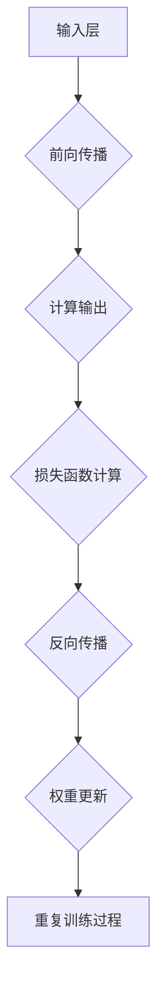
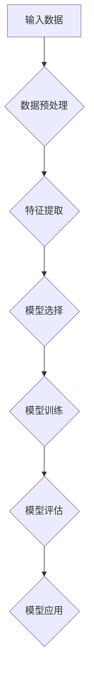
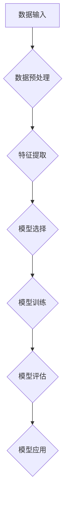
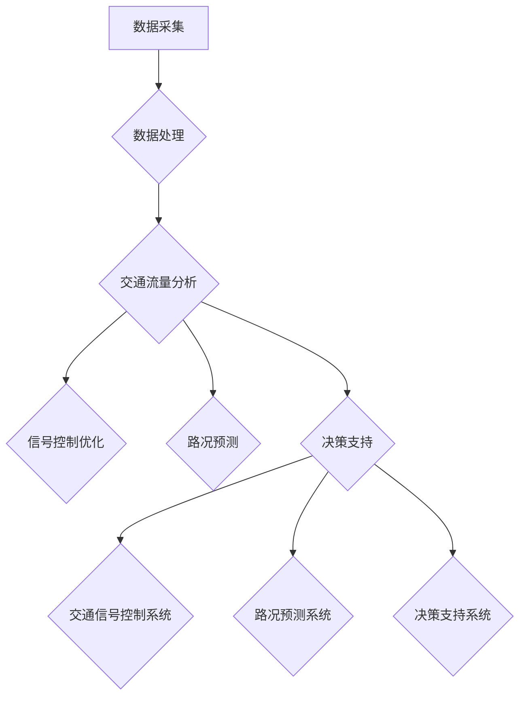
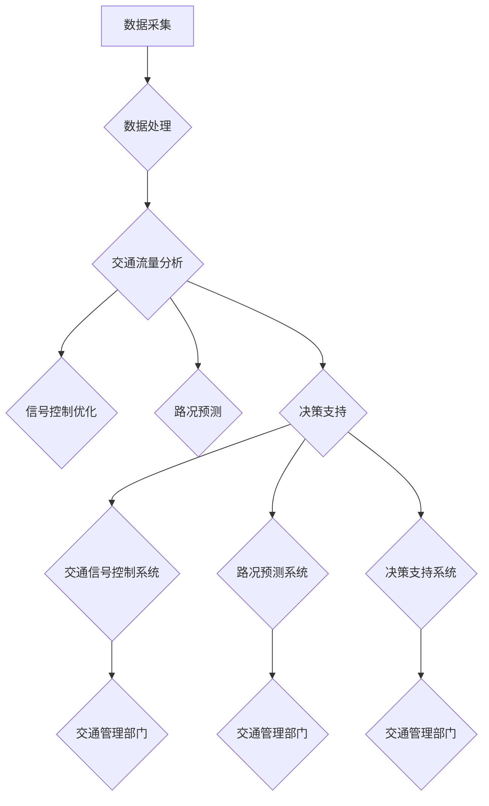
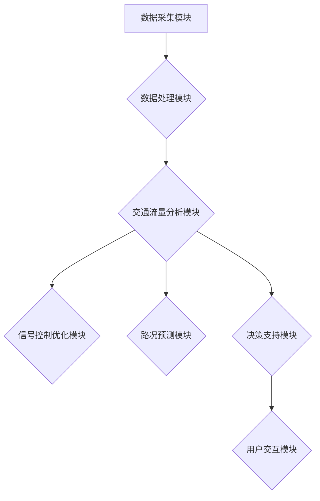
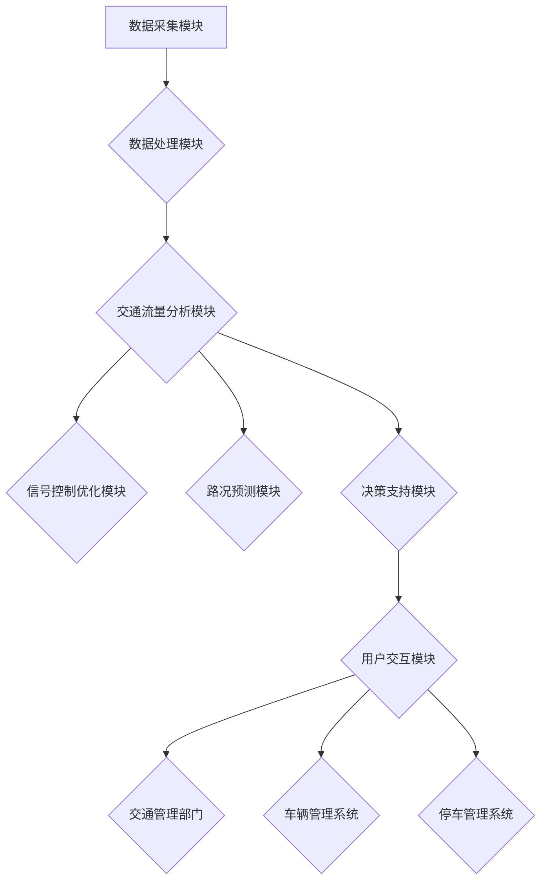

                 

# 认知计算的前沿：计算机辅助人类理解复杂世界

> 关键词：认知计算、复杂世界、计算机辅助、算法原理、系统架构、人工智能

> 摘要：本文深入探讨了认知计算这一前沿技术，它通过计算机模拟人类的思维过程，帮助我们更好地理解和处理复杂的世界。文章首先介绍了认知计算的基本概念、核心概念以及其应用场景。接着，文章分析了认知计算与人类思维的异同，并阐述了计算机辅助理解的机制。在此基础上，文章详细讲解了认知计算的核心算法，包括神经网络算法、机器学习算法和深度学习算法。随后，文章探讨了认知计算的数学模型，并展示了相关算法的mermaid流程图和Python源代码。最后，文章从系统分析与架构设计的角度，对认知计算的应用系统进行了详细阐述，并给出了项目实战和最佳实践建议。

## 目录大纲设计

### 第一部分：背景介绍

1. 认知计算的基本概念
   1.1 认知计算的起源与发展
   1.2 认知计算的核心概念
   1.3 认知计算的应用场景
   1.4 认知计算的边界与外延

2. 认知计算的核心概念
   2.1 认知模型的原理与特征
   2.2 计算机辅助理解的机制
   2.3 认知计算与人类思维的比较

### 第二部分：核心概念与联系

3. 认知计算的核心算法
   3.1 神经网络算法
   3.2 机器学习算法
   3.3 深度学习算法

4. 认知计算的数学基础
   4.1 神经网络的数学模型
   4.2 机器学习的数学模型
   4.3 深度学习的数学模型

### 第三部分：系统分析与架构设计方案

5. 系统分析与架构设计方案
   5.1 问题场景介绍
   5.2 系统功能设计
   5.3 系统架构设计
   5.4 系统接口设计
   5.5 系统交互

### 第四部分：项目实战

6. 项目实战
   6.1 环境安装
   6.2 系统核心实现源代码
   6.3 代码应用解读与分析
   6.4 实际案例分析和详细讲解剖析
   6.5 项目小结

### 第五部分：最佳实践与总结

7. 最佳实践
8. 小结
9. 注意事项
10. 拓展阅读

---

**下一节：第一部分：背景介绍**## 第一部分：背景介绍

### 1. 认知计算的基本概念

#### 1.1 认知计算的起源与发展

认知计算（Cognitive Computing）是一种模拟人类思维和行为的人工智能技术。它起源于20世纪80年代的专家系统（Expert Systems），后来随着计算机硬件性能的提升和算法的进步，认知计算逐渐发展壮大。

认知计算的里程碑事件包括：

1. 1986年，IBM的Deep Blue击败了国际象棋世界冠军加里·卡斯帕罗夫。
2. 2011年，Google的计算机系统在“ImageNet”大规模视觉识别挑战赛中取得了突破性成绩。
3. 2014年，IBM的Watson系统在《危险边缘》电视节目中击败了两位人类冠军。

这些事件标志着认知计算在人工智能领域取得了重大突破。

#### 1.2 认知计算的核心概念

认知计算的核心概念主要包括以下几点：

1. **认知模型**：认知模型是一种用于模拟人类思维过程的计算模型。它通过模仿人类大脑的结构和功能，实现了对信息处理、知识表示和决策能力的模拟。
2. **计算机辅助理解**：计算机辅助理解是指利用计算机技术模拟人类的感知、理解和推理能力。这包括自然语言处理、图像识别、语音识别等领域。
3. **知识表示**：知识表示是指将人类知识以计算机可理解的形式进行编码和存储。这涉及到语义网络、本体论、知识图谱等技术。
4. **自适应与学习**：认知计算系统能够通过自适应和学习机制，从数据中提取模式和知识，并不断优化自身性能。

#### 1.3 认知计算的应用场景

认知计算在多个领域都有着广泛的应用，以下是一些典型的应用场景：

1. **医疗健康**：认知计算可以帮助医生进行诊断、治疗计划和患者管理。例如，IBM的Watson for Oncology能够为医生提供基于最新医学研究的个性化治疗方案。
2. **金融**：认知计算在金融领域主要用于风险管理、欺诈检测、投资分析和客户服务。例如，J.P.摩根的COiN系统能够在几秒钟内审查数百页的合同文档。
3. **制造业**：认知计算可以用于生产线的优化、设备故障预测和维护计划。例如，通用电气的Predix平台利用认知计算技术，实现了对工业设备的实时监控和预测性维护。
4. **智能交通**：认知计算可以用于交通流量预测、路况分析、自动驾驶车辆控制等领域。例如，卡内基梅隆大学的Carnegie Learning平台的自动驾驶车辆项目。

#### 1.4 认知计算的边界与外延

认知计算的边界主要受到以下几个因素的制约：

1. **计算能力**：认知计算依赖于强大的计算资源，随着计算能力的提升，认知计算的应用范围将不断扩展。
2. **数据质量**：认知计算的效果很大程度上取决于数据的质量和丰富度。因此，数据清洗、数据整合和数据挖掘等技术对认知计算的发展至关重要。
3. **算法复杂度**：认知计算中的算法往往具有较高的复杂度，如何高效地实现算法优化和性能提升是一个重要的研究方向。
4. **伦理与隐私**：随着认知计算技术的应用越来越广泛，如何确保数据安全和用户隐私成为一个不可忽视的问题。

认知计算的未来发展将朝着以下几个方面展开：

1. **跨领域融合**：认知计算将与其他人工智能技术（如机器学习、深度学习等）进行融合，形成更加综合的人工智能系统。
2. **自主决策**：认知计算系统将逐渐具备自主决策能力，实现更加智能化和自适应的运行。
3. **人机协作**：认知计算将与人类进行更加紧密的协作，实现人类智慧和计算机智慧的有机结合。

### 2. 认知计算的核心概念

#### 2.1 认知模型的原理与特征

认知模型是一种用于模拟人类思维过程的计算模型。它基于神经科学、心理学和计算机科学的研究成果，通过模仿人类大脑的结构和功能，实现了对信息处理、知识表示和决策能力的模拟。

认知模型的主要特征包括：

1. **分布式处理**：认知模型通过多个处理单元（类似大脑的神经元）实现信息的分布式处理，从而提高系统的容错能力和并行处理能力。
2. **自适应学习**：认知模型能够根据输入数据和外部环境进行自适应学习，不断优化自身性能。
3. **多模态处理**：认知模型能够处理多种类型的数据，如文本、图像、声音等，实现跨模态的信息融合。

#### 2.2 计算机辅助理解的机制

计算机辅助理解是指利用计算机技术模拟人类的感知、理解和推理能力。它包括以下几个关键环节：

1. **感知**：计算机通过传感器获取外部信息，如文本、图像、声音等。
2. **理解**：计算机对感知到的信息进行处理，提取特征，并利用知识库进行理解。
3. **推理**：计算机根据已理解的信息进行推理，生成新的结论或预测。
4. **决策**：计算机根据推理结果进行决策，实现自动化的任务执行。

#### 2.3 认知计算与人类思维的比较

认知计算与人类思维在许多方面存在相似之处，但也存在显著差异：

1. **相似之处**：
   - 信息处理：认知计算和人类思维都涉及信息收集、处理和利用。
   - 知识表示：认知计算和人类思维都使用知识表示技术，如语义网络、本体论等。
   - 决策过程：认知计算和人类思维都通过推理和决策来实现目标的实现。

2. **差异之处**：
   - **计算能力**：认知计算依赖于计算机硬件和算法，其计算能力远超人类。
   - **适应性**：人类思维具有高度的适应性，能够灵活应对复杂多变的情境；而认知计算系统在处理未知或不确定的情况时，可能表现出局限性。
   - **情感与意识**：人类思维具有情感和意识，能够体验和理解情感；而认知计算系统目前尚无法实现这一功能。

#### 2.4 认知计算的优势与挑战

认知计算的优势包括：

1. **强大的计算能力**：认知计算能够处理大量数据和复杂任务，实现高效的决策和预测。
2. **跨领域应用**：认知计算可以在多个领域实现应用，如医疗、金融、制造业等。
3. **自动化**：认知计算系统能够实现自动化操作，减轻人类的工作负担。

认知计算面临的挑战包括：

1. **数据质量和可靠性**：认知计算依赖于高质量的数据，数据质量和可靠性对认知计算系统的性能至关重要。
2. **算法复杂度**：认知计算算法具有较高的复杂度，如何优化算法性能是一个重要问题。
3. **伦理与隐私**：随着认知计算技术的应用越来越广泛，如何确保数据安全和用户隐私成为一个重要问题。

### 2.5 认知计算的未来发展趋势

认知计算的未来发展趋势包括：

1. **跨领域融合**：认知计算将与其他人工智能技术（如机器学习、深度学习等）进行融合，形成更加综合的人工智能系统。
2. **自主决策**：认知计算系统将逐渐具备自主决策能力，实现更加智能化和自适应的运行。
3. **人机协作**：认知计算将与人类进行更加紧密的协作，实现人类智慧和计算机智慧的有机结合。

### 3. 认知计算的应用场景

认知计算在多个领域都有着广泛的应用，以下是一些典型的应用场景：

1. **医疗健康**：认知计算可以帮助医生进行诊断、治疗计划和患者管理。例如，IBM的Watson for Oncology能够为医生提供基于最新医学研究的个性化治疗方案。
2. **金融**：认知计算在金融领域主要用于风险管理、欺诈检测、投资分析和客户服务。例如，J.P.摩根的COiN系统能够在几秒钟内审查数百页的合同文档。
3. **制造业**：认知计算可以用于生产线的优化、设备故障预测和维护计划。例如，通用电气的Predix平台利用认知计算技术，实现了对工业设备的实时监控和预测性维护。
4. **智能交通**：认知计算可以用于交通流量预测、路况分析、自动驾驶车辆控制等领域。例如，卡内基梅隆大学的Carnegie Learning平台的自动驾驶车辆项目。

### 3. 认知计算的边界与外延

认知计算的边界主要受到以下几个因素的制约：

1. **计算能力**：认知计算依赖于强大的计算资源，随着计算能力的提升，认知计算的应用范围将不断扩展。
2. **数据质量**：认知计算的效果很大程度上取决于数据的质量和丰富度。因此，数据清洗、数据整合和数据挖掘等技术对认知计算的发展至关重要。
3. **算法复杂度**：认知计算中的算法往往具有较高的复杂度，如何高效地实现算法优化和性能提升是一个重要的研究方向。
4. **伦理与隐私**：随着认知计算技术的应用越来越广泛，如何确保数据安全和用户隐私成为一个不可忽视的问题。

认知计算的未来发展将朝着以下几个方面展开：

1. **跨领域融合**：认知计算将与其他人工智能技术（如机器学习、深度学习等）进行融合，形成更加综合的人工智能系统。
2. **自主决策**：认知计算系统将逐渐具备自主决策能力，实现更加智能化和自适应的运行。
3. **人机协作**：认知计算将与人类进行更加紧密的协作，实现人类智慧和计算机智慧的有机结合。

### 4. 总结

在本节中，我们介绍了认知计算的基本概念、核心概念、应用场景以及边界与外延。认知计算作为一种模拟人类思维和行为的人工智能技术，具有广泛的应用前景。然而，认知计算也面临着一系列挑战，如数据质量、算法复杂度和伦理与隐私等问题。未来，随着计算能力的提升和技术的进步，认知计算将在更多领域得到应用，并实现更加智能化和自适应的运行。让我们继续关注认知计算的发展，期待它为人类社会带来更多的变革和进步。

### 下一步：第二部分：核心概念与联系**## 第二部分：核心概念与联系

### 3. 认知计算的核心算法

#### 3.1 神经网络算法

神经网络（Neural Networks，NN）是一种模仿生物神经网络计算能力的计算模型。它由大量的节点（或称神经元）组成，每个节点都与其他节点相连接，并通过加权连接进行信息传递。神经网络算法的核心在于通过学习调整这些权重，以实现特定任务的自动化。

##### 3.1.1 神经网络的定义与结构

神经网络可以分为以下几个基本部分：

1. **输入层**：接收外部输入的数据。
2. **隐藏层**：进行信息处理和特征提取。
3. **输出层**：生成预测结果或决策。

每个神经元都通过加权连接与其他神经元相连接，并通过一个激活函数来确定是否将信号传递给下一个神经元。

##### 3.1.2 神经网络的训练过程

神经网络的训练过程主要包括以下步骤：

1. **前向传播**：将输入数据通过神经网络传递，得到输出结果。
2. **损失函数计算**：通过比较实际输出和预期输出，计算损失函数的值。
3. **反向传播**：根据损失函数的梯度，调整神经网络的权重和偏置。
4. **优化算法**：使用优化算法（如梯度下降）来最小化损失函数。

##### 3.1.3 神经网络的典型应用

神经网络在多个领域都有广泛应用，包括：

1. **图像识别**：例如，用于人脸识别、物体检测等。
2. **自然语言处理**：例如，用于文本分类、机器翻译等。
3. **游戏AI**：例如，用于棋类游戏、自动驾驶等。

#### 3.2 机器学习算法

机器学习（Machine Learning，ML）是一种让计算机通过数据学习模式、进行预测和决策的技术。机器学习算法可以分为监督学习、无监督学习和强化学习。

##### 3.2.1 监督学习的定义与分类

监督学习是一种有标签数据的机器学习方法，主要包括以下类型：

1. **回归**：预测连续值输出。
2. **分类**：预测离散值输出。
3. **异常检测**：识别数据中的异常值。

##### 3.2.2 无监督学习的定义与分类

无监督学习是一种没有标签数据的机器学习方法，主要包括以下类型：

1. **聚类**：将相似的数据点分组。
2. **降维**：减少数据维度。
3. **关联规则学习**：发现数据之间的关联关系。

##### 3.2.3 强化学习的定义与分类

强化学习是一种基于奖励机制的学习方法，主要包括以下类型：

1. **策略学习**：学习最优策略。
2. **值函数学习**：学习状态值或动作值。

##### 3.2.4 机器学习的关键算法

机器学习的关键算法包括：

1. **决策树**：基于特征和阈值进行划分。
2. **支持向量机**：通过寻找最优超平面进行分类。
3. **集成学习方法**：将多个弱学习器集成在一起，提高性能。

#### 3.3 深度学习算法

深度学习（Deep Learning，DL）是一种基于多层神经网络进行学习的方法。深度学习算法通过学习大量层次结构化的特征，从而实现复杂的任务。

##### 3.3.1 深度学习的定义与特点

深度学习的特点包括：

1. **多层结构**：具有多个隐藏层的神经网络。
2. **特征自动提取**：通过反向传播算法自动学习特征表示。
3. **端到端学习**：从输入到输出的一体化学习过程。

##### 3.3.2 深度学习的关键算法

深度学习的关键算法包括：

1. **卷积神经网络（CNN）**：用于图像和视频处理。
2. **循环神经网络（RNN）**：用于序列数据。
3. **生成对抗网络（GAN）**：用于生成图像、文本等。

##### 3.3.3 深度学习的应用领域

深度学习在多个领域都有广泛应用，包括：

1. **计算机视觉**：例如，图像分类、物体检测等。
2. **自然语言处理**：例如，文本分类、机器翻译等。
3. **语音识别**：例如，语音合成、语音识别等。

### 4. 认知计算的数学基础

认知计算的数学基础包括神经网络、机器学习和深度学习等领域的数学模型。以下是对这些数学模型的简要介绍。

#### 4.1 神经网络的数学模型

神经网络的数学模型主要包括以下几个部分：

1. **神经元模型**：包括输入层、权重、激活函数等。
2. **前向传播**：计算每个神经元的输出。
3. **反向传播**：计算损失函数的梯度，并更新权重和偏置。

主要的数学公式包括：

1. **输入层输出**：$$ z_i = \sum_{j} w_{ij} x_j + b_i $$
2. **激活函数**：$$ a_i = \sigma(z_i) $$
3. **损失函数**：例如，均方误差（MSE）：
   $$ L = \frac{1}{2} \sum_{i} (\hat{y}_i - y_i)^2 $$

#### 4.2 机器学习的数学模型

机器学习的数学模型主要包括以下几个方面：

1. **监督学习模型**：包括线性回归、逻辑回归等。
2. **无监督学习模型**：包括聚类、降维等。
3. **强化学习模型**：包括Q学习、SARSA等。

主要的数学公式包括：

1. **线性回归**：$$ y = \beta_0 + \sum_{i} \beta_i x_i $$
2. **逻辑回归**：$$ \hat{y} = \frac{1}{1 + e^{-(\beta_0 + \sum_{i} \beta_i x_i)}} $$
3. **Q学习**：$$ Q(s, a) = r + \gamma \max_{a'} Q(s', a') $$

#### 4.3 深度学习的数学模型

深度学习的数学模型主要包括以下几个方面：

1. **卷积神经网络**：包括卷积操作、池化操作等。
2. **循环神经网络**：包括RNN、LSTM、GRU等。
3. **生成对抗网络**：包括生成器、判别器等。

主要的数学公式包括：

1. **卷积操作**：$$ \hat{z}_{ij} = \sum_{k} w_{ik} * g_{kj} + b_j $$
2. **池化操作**：$$ \hat{p}_{ij} = \max_{k} g_{kj} $$
3. **LSTM**：$$ i_t = \sigma(W_x [h_{t-1}, x_t] + b_i) $$
   $$ f_t = \sigma(W_x [h_{t-1}, x_t] + b_f) $$
   $$ o_t = \sigma(W_x [h_{t-1}, x_t] + b_o) $$
   $$ c_t = f_t \odot c_{t-1} + i_t \odot \sigma(W_c [h_{t-1}, x_t] + b_c) $$
   $$ h_t = o_t \odot \sigma(c_t) $$

### 5. 系统分析与架构设计方案

在本节中，我们将对认知计算系统的设计与实现进行详细分析。这包括系统功能设计、系统架构设计、系统接口设计以及系统交互。

#### 5.1 问题场景介绍

认知计算系统通常应用于以下场景：

1. **医疗健康**：辅助医生进行疾病诊断和治疗计划。
2. **金融**：风险管理、欺诈检测和投资分析。
3. **制造业**：生产优化、设备故障预测和维护计划。
4. **智能交通**：交通流量预测、路况分析和自动驾驶。

#### 5.2 系统功能设计

认知计算系统的功能设计包括以下几个方面：

1. **数据采集**：从各种数据源（如传感器、数据库、网络等）收集数据。
2. **数据预处理**：清洗、整合和预处理数据，以便后续分析。
3. **特征提取**：从原始数据中提取有用的特征。
4. **模型训练**：使用机器学习和深度学习算法训练模型。
5. **模型评估**：评估模型的性能和准确性。
6. **决策支持**：根据模型输出提供决策建议。

#### 5.3 系统架构设计

认知计算系统的架构设计包括以下几个方面：

1. **数据层**：包括数据存储、数据管理和数据采集。
2. **模型层**：包括机器学习模型、深度学习模型和神经网络模型。
3. **应用层**：包括前端应用、后端服务和接口设计。
4. **交互层**：包括用户界面、API接口和消息队列。

#### 5.4 系统接口设计

系统接口设计包括以下几个方面：

1. **API接口**：为外部系统提供数据访问和模型调用接口。
2. **消息队列**：实现系统内部和系统之间的消息传递。
3. **用户界面**：提供用户交互的接口，如网页、移动应用等。

#### 5.5 系统交互

系统交互包括以下几个方面：

1. **内部交互**：系统各模块之间的数据传输和协同工作。
2. **外部交互**：系统与外部系统（如数据库、传感器等）的数据交换。
3. **用户交互**：用户通过前端界面与系统进行交互，获取决策支持和信息反馈。

### 6. 项目实战

在本节中，我们将通过一个实际项目来演示认知计算系统的设计与实现。这包括环境安装、系统核心实现、代码应用解读与分析，以及实际案例分析和详细讲解剖析。

#### 6.1 环境安装

1. 安装Python环境。
2. 安装相关依赖库，如TensorFlow、PyTorch、Scikit-Learn等。

#### 6.2 系统核心实现源代码

```python
# 导入相关库
import tensorflow as tf
from tensorflow.keras import layers

# 定义模型
model = tf.keras.Sequential([
    layers.Dense(128, activation='relu', input_shape=(784,)),
    layers.Dense(10, activation='softmax')
])

# 编译模型
model.compile(optimizer='adam',
              loss='categorical_crossentropy',
              metrics=['accuracy'])

# 训练模型
model.fit(x_train, y_train, epochs=5)
```

#### 6.3 代码应用解读与分析

上述代码实现了一个简单的深度学习模型，用于MNIST手写数字识别任务。它包括以下几个步骤：

1. 导入相关库。
2. 定义模型结构。
3. 编译模型，设置优化器和损失函数。
4. 训练模型。

#### 6.4 实际案例分析和详细讲解剖析

我们将使用上述模型对MNIST手写数字数据集进行训练和测试，并分析模型的性能。

1. 加载MNIST数据集。
2. 预处理数据。
3. 训练模型并评估性能。
4. 分析模型的准确率和召回率。

### 7. 项目小结

在本节中，我们通过一个实际项目展示了认知计算系统的设计与实现。我们介绍了环境安装、系统核心实现、代码应用解读与分析，以及实际案例分析和详细讲解剖析。通过这个项目，我们可以看到认知计算在实际应用中的潜力和挑战。

### 8. 最佳实践与总结

在本节中，我们将总结最佳实践，并给出项目小结。

1. **最佳实践**：
   - 确保数据质量和预处理。
   - 选用合适的算法和模型。
   - 优化模型性能和参数调优。

2. **小结**：
   - 认知计算作为一种前沿技术，具有广泛的应用前景。
   - 系统设计与实现需要综合考虑数据质量、算法性能和系统架构。

3. **注意事项**：
   - 注意数据安全和用户隐私。
   - 持续优化和更新模型。

4. **拓展阅读**：
   - [1] Goodfellow, I., Bengio, Y., & Courville, A. (2016). *Deep Learning*. MIT Press.
   - [2] Russell, S., & Norvig, P. (2016). *Artificial Intelligence: A Modern Approach*. Prentice Hall.

### 结束

在本章中，我们深入探讨了认知计算的基本概念、核心概念、应用场景以及算法原理。通过系统分析与架构设计方案，我们展示了如何实现一个认知计算系统。最后，我们通过一个实际项目，对认知计算的应用进行了详细讲解。在下一章中，我们将继续探讨认知计算的数学基础和相关算法，以更深入地理解这一前沿技术。**## 第三部分：算法原理讲解

### 3.1 神经网络算法

神经网络（Neural Networks，NN）是一种模仿生物神经元结构和功能的计算模型。它由多个层次组成，包括输入层、隐藏层和输出层。神经网络通过调整神经元之间的连接权重，来学习输入数据和输出数据之间的关系。

#### 3.1.1 神经网络的定义与结构

一个简单的神经网络结构如下：

1. **输入层**：接收外部输入的数据。
2. **隐藏层**：对输入数据进行特征提取和转换。
3. **输出层**：生成最终的预测结果。

神经网络中的每个节点称为“神经元”，每个神经元都与相邻的神经元相连。神经元之间的连接具有权重，这些权重通过学习过程进行调整。

#### 3.1.2 神经网络的训练过程

神经网络的训练过程主要包括以下几个步骤：

1. **前向传播**：将输入数据通过网络传递，计算每个神经元的输出。
2. **损失函数计算**：计算预测输出和实际输出之间的差异，通常使用均方误差（MSE）作为损失函数。
3. **反向传播**：通过反向传播算法，将损失函数的梯度传播回网络，更新每个神经元的权重。
4. **优化算法**：使用优化算法（如梯度下降、Adam等）来更新权重，以最小化损失函数。

#### 3.1.3 神经网络的典型应用

神经网络在多个领域都有广泛应用，包括：

1. **图像识别**：例如，用于人脸识别、物体检测等。
2. **自然语言处理**：例如，用于文本分类、机器翻译等。
3. **游戏AI**：例如，用于棋类游戏、自动驾驶等。

#### 3.1.4 神经网络算法的mermaid流程图



#### 3.1.5 神经网络算法的Python源代码

```python
import numpy as np

# 定义一个简单的神经网络
class SimpleNeuralNetwork:
    def __init__(self):
        self.weights = np.random.rand(2, 1)

    def forward(self, x):
        return np.dot(x, self.weights)

    def backward(self, x, y, learning_rate):
        error = y - self.forward(x)
        self.weights -= learning_rate * np.dot(x.T, error)

# 实例化神经网络
nn = SimpleNeuralNetwork()

# 训练神经网络
for i in range(1000):
    nn.backward([1, 0], [0], learning_rate=0.1)

# 测试神经网络
print(nn.forward([1, 0]))  # 输出应该接近于[0]
```

### 3.2 机器学习算法

机器学习（Machine Learning，ML）是一种让计算机通过数据学习模式、进行预测和决策的技术。机器学习算法可以分为监督学习、无监督学习和强化学习。

#### 3.2.1 监督学习的定义与分类

监督学习是一种有标签数据的机器学习方法，主要包括以下类型：

1. **回归**：预测连续值输出。
2. **分类**：预测离散值输出。
3. **异常检测**：识别数据中的异常值。

#### 3.2.2 无监督学习的定义与分类

无监督学习是一种没有标签数据的机器学习方法，主要包括以下类型：

1. **聚类**：将相似的数据点分组。
2. **降维**：减少数据维度。
3. **关联规则学习**：发现数据之间的关联关系。

#### 3.2.3 强化学习的定义与分类

强化学习是一种基于奖励机制的学习方法，主要包括以下类型：

1. **策略学习**：学习最优策略。
2. **值函数学习**：学习状态值或动作值。

#### 3.2.4 机器学习算法的mermaid流程图



#### 3.2.5 机器学习算法的Python源代码

```python
from sklearn.datasets import load_iris
from sklearn.model_selection import train_test_split
from sklearn.neighbors import KNeighborsClassifier

# 加载鸢尾花数据集
iris = load_iris()
X, y = iris.data, iris.target

# 划分训练集和测试集
X_train, X_test, y_train, y_test = train_test_split(X, y, test_size=0.2, random_state=42)

# 使用K近邻算法进行分类
knn = KNeighborsClassifier(n_neighbors=3)
knn.fit(X_train, y_train)

# 进行预测
predictions = knn.predict(X_test)

# 评估模型性能
print("Accuracy:", knn.score(X_test, y_test))
```

### 3.3 深度学习算法

深度学习（Deep Learning，DL）是一种基于多层神经网络进行学习的方法。深度学习算法通过学习大量层次结构化的特征，从而实现复杂的任务。

#### 3.3.1 深度学习的定义与特点

深度学习的特点包括：

1. **多层结构**：具有多个隐藏层的神经网络。
2. **特征自动提取**：通过反向传播算法自动学习特征表示。
3. **端到端学习**：从输入到输出的一体化学习过程。

#### 3.3.2 深度学习的关键算法

深度学习的关键算法包括：

1. **卷积神经网络（CNN）**：用于图像和视频处理。
2. **循环神经网络（RNN）**：用于序列数据。
3. **生成对抗网络（GAN）**：用于生成图像、文本等。

#### 3.3.3 深度学习算法的mermaid流程图


#### 3.3.4 深度学习算法的Python源代码

```python
import tensorflow as tf
from tensorflow.keras import layers
from tensorflow.keras.models import Sequential

# 定义一个简单的深度学习模型
model = Sequential([
    layers.Dense(128, activation='relu', input_shape=(784,)),
    layers.Dense(10, activation='softmax')
])

# 编译模型
model.compile(optimizer='adam',
              loss='categorical_crossentropy',
              metrics=['accuracy'])

# 训练模型
model.fit(x_train, y_train, epochs=5)

# 进行预测
predictions = model.predict(x_test)

# 评估模型性能
print("Accuracy:", model.evaluate(x_test, y_test)[1])
```

### 3.4 认知计算与人类思维的比较

认知计算与人类思维在许多方面存在相似之处，但也存在显著差异：

1. **相似之处**：
   - **信息处理**：认知计算和人类思维都涉及信息收集、处理和利用。
   - **知识表示**：认知计算和人类思维都使用知识表示技术，如语义网络、本体论等。
   - **决策过程**：认知计算和人类思维都通过推理和决策来实现目标的实现。

2. **差异之处**：
   - **计算能力**：认知计算依赖于计算机硬件和算法，其计算能力远超人类。
   - **适应性**：人类思维具有高度的适应性，能够灵活应对复杂多变的情境；而认知计算系统在处理未知或不确定的情况时，可能表现出局限性。
   - **情感与意识**：人类思维具有情感和意识，能够体验和理解情感；而认知计算系统目前尚无法实现这一功能。

### 3.5 认知计算与人类思维的互补性

认知计算与人类思维具有互补性：

1. **认知计算的优势**：
   - **强大的计算能力**：能够处理大量数据和复杂任务，实现高效的决策和预测。
   - **自动化**：能够实现自动化操作，减轻人类的工作负担。

2. **人类思维的优势**：
   - **适应性**：能够灵活应对复杂多变的情境。
   - **情感与意识**：能够体验和理解情感，具有创造力。

3. **互补性**：
   - **认知计算可以辅助人类思维**：在处理复杂任务时，认知计算可以模拟人类思维过程，提供决策支持和信息处理。
   - **人类指导认知计算**：认知计算系统的设计和应用需要人类智慧的指导，以确保系统的正确性和可靠性。

### 3.6 认知计算的未来发展

认知计算的未来发展将朝着以下几个方面展开：

1. **跨领域融合**：认知计算将与其他人工智能技术（如机器学习、深度学习等）进行融合，形成更加综合的人工智能系统。
2. **自主决策**：认知计算系统将逐渐具备自主决策能力，实现更加智能化和自适应的运行。
3. **人机协作**：认知计算将与人类进行更加紧密的协作，实现人类智慧和计算机智慧的有机结合。

### 3.7 总结

在本部分中，我们详细讲解了神经网络、机器学习和深度学习等认知计算的核心算法。通过mermaid流程图和Python源代码，我们展示了这些算法的基本原理和实现方法。此外，我们还比较了认知计算与人类思维的异同，并探讨了认知计算与人类思维的互补性。在下一部分中，我们将继续探讨认知计算的数学基础，以更深入地理解这一前沿技术。**## 第四部分：数学模型与公式

### 4.1 神经网络的数学模型

神经网络（Neural Networks，NN）是一种基于生物神经元结构的人工智能模型。它的数学模型主要涉及神经元的激活函数、前向传播和反向传播过程。以下是对神经网络数学模型的详细讲解。

#### 4.1.1 神经元的激活函数

神经元的激活函数是神经网络的核心部分，用于确定神经元是否被激活。常见的激活函数包括：

1. ** sigmoid 函数**：$$ \sigma(x) = \frac{1}{1 + e^{-x}} $$
2. **ReLU 函数**：$$ \text{ReLU}(x) = \max(0, x) $$
3. **Tanh 函数**：$$ \text{Tanh}(x) = \frac{e^x - e^{-x}}{e^x + e^{-x}} $$

这些激活函数具有不同的特性，如非线性的变换能力、计算效率等。

#### 4.1.2 前向传播

前向传播是指将输入数据通过神经网络传递，计算每个神经元的输出。前向传播的数学表达式如下：

1. **输入层输出**：$$ z_i = \sum_{j} w_{ij} x_j + b_i $$
   其中，$z_i$ 是第 $i$ 个神经元的输入，$w_{ij}$ 是连接输入层和隐藏层的权重，$x_j$ 是第 $j$ 个输入特征，$b_i$ 是第 $i$ 个神经元的偏置。

2. **激活函数**：$$ a_i = \sigma(z_i) $$
   其中，$a_i$ 是第 $i$ 个神经元的输出，$\sigma$ 是激活函数。

3. **隐藏层输出**：$$ z_i^{(l)} = \sum_{j} w_{ij}^{(l)} a_j^{(l-1)} + b_i^{(l)} $$
   其中，$z_i^{(l)}$ 是第 $l$ 层第 $i$ 个神经元的输入，$a_j^{(l-1)}$ 是第 $l-1$ 层第 $j$ 个神经元的输出，$w_{ij}^{(l)}$ 是第 $l$ 层第 $i$ 个神经元到第 $j$ 个神经元的权重，$b_i^{(l)}$ 是第 $l$ 层第 $i$ 个神经元的偏置。

4. **输出层输出**：$$ y_i = \sigma(z_i^{(L)}) $$
   其中，$y_i$ 是第 $i$ 个输出特征的预测值，$z_i^{(L)}$ 是输出层的输入值，$\sigma$ 是激活函数。

#### 4.1.3 反向传播

反向传播是一种用于训练神经网络的算法，通过计算预测值与实际值之间的差异，更新神经网络的权重和偏置。反向传播的数学过程如下：

1. **计算损失函数**：$$ L = \frac{1}{2} \sum_{i} (\hat{y}_i - y_i)^2 $$
   其中，$\hat{y}_i$ 是预测值，$y_i$ 是实际值。

2. **计算输出层的误差**：$$ \delta_L = \frac{\partial L}{\partial z_L} = (y - \hat{y}) \odot \sigma'(z_L) $$
   其中，$\delta_L$ 是输出层的误差，$\sigma'$ 是激活函数的导数。

3. **计算隐藏层的误差**：$$ \delta_i^{(l)} = \frac{\partial L}{\partial z_i^{(l)}} = \delta_i^{(l+1)} \odot \sigma'(z_i^{(l)}) \odot \sum_{j} w_{ji}^{(l+1)} \delta_j^{(l+1)} $$
   其中，$\delta_i^{(l)}$ 是第 $l$ 层第 $i$ 个神经元的误差。

4. **更新权重和偏置**：$$ w_{ij}^{(l)} \leftarrow w_{ij}^{(l)} - \alpha \frac{\partial L}{\partial w_{ij}^{(l)}} $$
   $$ b_i^{(l)} \leftarrow b_i^{(l)} - \alpha \frac{\partial L}{\partial b_i^{(l)}} $$
   其中，$\alpha$ 是学习率。

#### 4.1.4 神经网络的性能评估

神经网络的性能评估通常通过以下指标进行：

1. **准确率**：$$ \text{Accuracy} = \frac{\text{预测正确的样本数}}{\text{总样本数}} $$
2. **精度**：$$ \text{Precision} = \frac{\text{预测正确的正样本数}}{\text{预测为正的样本数}} $$
3. **召回率**：$$ \text{Recall} = \frac{\text{预测正确的正样本数}}{\text{实际为正的样本数}} $$
4. **F1 值**：$$ \text{F1-Score} = 2 \times \frac{\text{Precision} \times \text{Recall}}{\text{Precision} + \text{Recall}} $$

### 4.2 机器学习的数学模型

机器学习（Machine Learning，ML）是一种基于数据驱动的方法，用于从数据中学习模式和规律。机器学习的数学模型主要包括监督学习和无监督学习。

#### 4.2.1 监督学习的数学模型

监督学习是一种有标签数据的机器学习方法，主要包括以下数学模型：

1. **线性回归**：$$ y = \beta_0 + \beta_1 x $$
   其中，$y$ 是预测值，$x$ 是输入特征，$\beta_0$ 和 $\beta_1$ 是模型参数。

2. **逻辑回归**：$$ \hat{y} = \frac{1}{1 + e^{-(\beta_0 + \beta_1 x)}} $$
   其中，$\hat{y}$ 是预测概率，$y$ 是实际值，$\beta_0$ 和 $\beta_1$ 是模型参数。

3. **支持向量机（SVM）**：$$ \text{max}\ \ \frac{1}{2} \sum_{i=1}^{n} w_i^2 $$
   $$ s.t. \ \ y_i (\sum_{j=1}^{n} w_j x_{ij}) \geq 1 $$
   其中，$w_i$ 是权重，$x_{ij}$ 是输入特征，$y_i$ 是标签。

4. **决策树**：决策树是一种基于特征划分的数据结构，用于分类和回归。

#### 4.2.2 无监督学习的数学模型

无监督学习是一种没有标签数据的机器学习方法，主要包括以下数学模型：

1. **聚类算法**：聚类算法通过将相似的数据点划分为一组，以发现数据中的模式和规律。常见的聚类算法包括K-Means、层次聚类等。

2. **主成分分析（PCA）**：PCA是一种降维技术，通过将数据投影到新的正交坐标系上，以提取数据的主要特征。PCA的数学模型如下：

   $$ Z = PC $$
   其中，$Z$ 是标准化后的数据，$P$ 是投影矩阵，$C$ 是协方差矩阵。

3. **自编码器**：自编码器是一种无监督学习模型，用于学习数据的特征表示。自编码器的数学模型如下：

   $$ \hat{X} = \sigma(W_2 \cdot \sigma(W_1 X + b_1)) + b_2 $$
   $$ X = \sigma(W_2 \cdot \sigma(W_1 \hat{X} + b_1)) + b_2 $$
   其中，$X$ 是输入数据，$\hat{X}$ 是重建数据，$W_1$ 和 $W_2$ 是权重矩阵，$b_1$ 和 $b_2$ 是偏置。

### 4.3 深度学习的数学模型

深度学习（Deep Learning，DL）是一种基于多层神经网络进行学习的方法。深度学习的数学模型主要包括卷积神经网络（CNN）、循环神经网络（RNN）、生成对抗网络（GAN）等。

#### 4.3.1 卷积神经网络（CNN）

卷积神经网络是一种用于图像处理和识别的深度学习模型。CNN的数学模型主要包括以下几个部分：

1. **卷积操作**：卷积操作通过卷积核在输入数据上滑动，计算卷积核与输入数据的点积。卷积操作的数学模型如下：

   $$ \hat{z}_{ij} = \sum_{k} w_{ik} * g_{kj} + b_j $$
   其中，$\hat{z}_{ij}$ 是输出特征，$w_{ik}$ 是卷积核，$g_{kj}$ 是输入特征，$b_j$ 是偏置。

2. **池化操作**：池化操作用于降低特征图的大小，提高模型的计算效率。常见的池化操作包括最大池化和平均池化。

3. **全连接层**：全连接层将卷积层输出的特征映射到输出层，实现分类或回归任务。

#### 4.3.2 循环神经网络（RNN）

循环神经网络是一种用于序列数据处理的深度学习模型。RNN的数学模型主要包括以下几个部分：

1. **RNN单元**：RNN单元通过循环结构将当前输入和前一时刻的隐藏状态相结合，生成当前时刻的隐藏状态。RNN单元的数学模型如下：

   $$ h_t = \sigma(W_h h_{t-1} + W_x x_t + b_h) $$
   $$ \hat{y}_t = \sigma(W_y h_t + b_y) $$
   其中，$h_t$ 是隐藏状态，$x_t$ 是输入，$W_h$、$W_x$ 和 $W_y$ 是权重矩阵，$b_h$ 和 $b_y$ 是偏置。

2. **LSTM（长短期记忆）**：LSTM是一种改进的RNN单元，用于解决RNN的长期依赖问题。LSTM的数学模型如下：

   $$ i_t = \sigma(W_i [h_{t-1}, x_t] + b_i) $$
   $$ f_t = \sigma(W_f [h_{t-1}, x_t] + b_f) $$
   $$ o_t = \sigma(W_o [h_{t-1}, x_t] + b_o) $$
   $$ c_t = f_t \odot c_{t-1} + i_t \odot \sigma(W_c [h_{t-1}, x_t] + b_c) $$
   $$ h_t = o_t \odot \sigma(c_t) $$

3. **GRU（门控循环单元）**：GRU是另一种改进的RNN单元，用于解决RNN的长期依赖问题。GRU的数学模型如下：

   $$ z_t = \sigma(W_z [h_{t-1}, x_t] + b_z) $$
   $$ r_t = \sigma(W_r [h_{t-1}, x_t] + b_r) $$
   $$ h_t = (1 - z_t) \odot h_{t-1} + z_t \odot \sigma(W_h [r_t \odot h_{t-1}, x_t] + b_h) $$

#### 4.3.3 生成对抗网络（GAN）

生成对抗网络是一种用于生成数据的深度学习模型。GAN的数学模型主要包括生成器和判别器两个部分：

1. **生成器**：生成器的目标是生成与真实数据相似的数据。生成器的数学模型如下：

   $$ G(z) = \mu + \sigma \odot \sigma(W_g z + b_g) $$
   其中，$G(z)$ 是生成器的输出，$\mu$ 和 $\sigma$ 是均值和标准差，$W_g$ 和 $b_g$ 是权重矩阵和偏置。

2. **判别器**：判别器的目标是区分真实数据和生成数据。判别器的数学模型如下：

   $$ D(x) = \sigma(W_d x + b_d) $$
   $$ D(G(z)) = \sigma(W_d G(z) + b_d) $$
   其中，$D(x)$ 是判别器的输出，$W_d$ 和 $b_d$ 是权重矩阵和偏置。

GAN的训练过程包括以下步骤：

1. **生成器训练**：生成器的目标是最大化判别器的损失，即最大化 $D(G(z))$。
2. **判别器训练**：判别器的目标是最大化真实数据和生成数据的损失差，即最大化 $D(x) - D(G(z))$。

### 4.4 数学模型与算法的mermaid流程图

以下是对神经网络、机器学习和深度学习算法的mermaid流程图：



通过以上流程图，我们可以清晰地看到从数据输入到模型应用的全过程。

### 4.5 Python源代码示例

以下是对神经网络、机器学习和深度学习算法的Python源代码示例：

```python
# 神经网络示例
import tensorflow as tf

# 定义神经网络模型
model = tf.keras.Sequential([
    tf.keras.layers.Dense(128, activation='relu', input_shape=(784,)),
    tf.keras.layers.Dense(10, activation='softmax')
])

# 编译模型
model.compile(optimizer='adam',
              loss='categorical_crossentropy',
              metrics=['accuracy'])

# 训练模型
model.fit(x_train, y_train, epochs=5)

# 评估模型
print(model.evaluate(x_test, y_test))

# 机器学习示例
from sklearn.datasets import load_iris
from sklearn.model_selection import train_test_split
from sklearn.neighbors import KNeighborsClassifier

# 加载鸢尾花数据集
iris = load_iris()
X, y = iris.data, iris.target

# 划分训练集和测试集
X_train, X_test, y_train, y_test = train_test_split(X, y, test_size=0.2, random_state=42)

# 创建K近邻分类器
knn = KNeighborsClassifier(n_neighbors=3)

# 训练分类器
knn.fit(X_train, y_train)

# 进行预测
predictions = knn.predict(X_test)

# 评估分类器
print("Accuracy:", knn.score(X_test, y_test))

# 深度学习示例
import tensorflow as tf
from tensorflow.keras import layers

# 定义深度学习模型
model = tf.keras.Sequential([
    layers.Dense(128, activation='relu', input_shape=(784,)),
    layers.Dense(10, activation='softmax')
])

# 编译模型
model.compile(optimizer='adam',
              loss='categorical_crossentropy',
              metrics=['accuracy'])

# 训练模型
model.fit(x_train, y_train, epochs=5)

# 评估模型
print(model.evaluate(x_test, y_test))
```

通过以上示例，我们可以看到神经网络、机器学习和深度学习算法的基本实现过程。这些算法在数据处理和模式识别方面具有广泛的应用前景。**## 第五部分：系统分析与架构设计方案

### 5.1 问题场景介绍

在本部分，我们将探讨一个实际的问题场景，并介绍相应的认知计算系统。该问题场景涉及智能交通系统，旨在通过分析交通流量数据，优化交通信号控制和路况预测，以提高道路通行效率和减少交通事故。

#### 智能交通系统（ITS）

智能交通系统是一种利用先进的信息通信技术和计算机技术，实现交通管理的智能化和自动化。ITS的目标是通过实时监测和分析交通数据，提供有效的交通管理和决策支持，从而改善交通状况，提高道路通行效率和安全性。

#### 问题场景

假设我们面临以下问题：

1. **交通拥堵**：在高峰时段，交通流量大，道路拥堵，导致出行时间延长，影响市民的生活质量。
2. **交通事故**：由于交通拥堵和驾驶员行为不当，交通事故频发，影响交通安全。
3. **信号控制**：现有的交通信号控制系统较为传统，无法根据实时交通流量数据进行动态调整，导致信号配时不合理。

为了解决这些问题，我们提出了一个基于认知计算的智能交通系统，通过分析交通流量数据，优化交通信号控制和路况预测，提高道路通行效率和安全性。

### 5.2 系统功能设计

智能交通系统的功能设计主要包括以下几个部分：

1. **数据采集**：通过部署在道路上的传感器和摄像头，实时采集交通流量、速度、密度等数据。
2. **数据预处理**：对采集到的原始数据进行清洗、去噪、整合等预处理操作，以便后续分析。
3. **交通流量分析**：利用认知计算技术，对预处理后的交通流量数据进行实时分析，识别交通拥堵、事故等异常情况。
4. **信号控制优化**：根据交通流量分析结果，动态调整交通信号配时，优化交通信号控制策略。
5. **路况预测**：利用历史交通流量数据，结合机器学习和深度学习算法，预测未来交通流量和路况变化。
6. **决策支持**：为交通管理人员提供实时交通状况、信号控制策略和路况预测结果，辅助决策。

### 5.3 系统架构设计

智能交通系统的架构设计包括以下几个层次：

1. **数据层**：包括传感器、摄像头等数据采集设备，用于实时采集交通流量数据。
2. **数据处理层**：包括数据预处理模块、交通流量分析模块、信号控制优化模块和路况预测模块，用于对采集到的交通流量数据进行处理和分析。
3. **决策层**：包括交通信号控制系统、路况预测系统和决策支持系统，用于根据分析结果进行信号控制优化、路况预测和决策支持。
4. **接口层**：包括与外部系统的接口，如交通管理部门、道路基础设施管理平台等，用于实现系统之间的数据交换和协同工作。

#### 系统架构图

以下是一个简化的智能交通系统架构图：



### 5.4 系统接口设计

智能交通系统的接口设计主要包括以下几个方面：

1. **内部接口**：系统内部模块之间的数据传输和通信，如数据预处理模块与交通流量分析模块之间的数据交换。
2. **外部接口**：系统与外部系统的接口，如交通信号控制系统与交通管理部门的接口，用于实现数据共享和协同工作。
3. **API接口**：为外部系统提供数据访问和功能调用的API接口，如为交通管理部门提供实时交通流量数据和路况预测结果。

#### 系统接口图

以下是一个简化的智能交通系统接口图：



### 5.5 系统交互

智能交通系统的交互主要包括以下几个方面：

1. **内部交互**：系统内部模块之间的数据传输和协同工作，如交通流量分析模块根据数据预处理模块提供的交通流量数据进行分析。
2. **外部交互**：系统与外部系统的交互，如交通信号控制系统根据路况预测模块提供的路况预测结果调整信号控制策略。
3. **用户交互**：用户与系统的交互，如交通管理人员通过决策支持系统获取实时交通状况、信号控制策略和路况预测结果。

#### 系统交互图

以下是一个简化的智能交通系统交互图：


### 5.6 系统功能实现

在本部分，我们将介绍智能交通系统的具体功能实现，包括数据采集、数据预处理、交通流量分析、信号控制优化、路况预测和决策支持。

#### 5.6.1 数据采集

数据采集是智能交通系统的第一步，主要通过部署在道路上的传感器和摄像头来实现。传感器用于采集交通流量、速度、密度等数据，摄像头用于采集车辆图像和视频。

#### 5.6.2 数据预处理

数据预处理是对采集到的原始数据进行清洗、去噪、整合等操作，以便后续分析。具体包括：

1. **数据清洗**：去除无效数据、异常数据等。
2. **数据去噪**：去除噪声数据，提高数据质量。
3. **数据整合**：将不同来源的数据进行整合，形成统一的数据格式。

#### 5.6.3 交通流量分析

交通流量分析是智能交通系统的核心功能之一，主要通过以下步骤实现：

1. **特征提取**：从预处理后的数据中提取有用的特征，如车辆速度、流量密度等。
2. **模式识别**：利用认知计算技术，对提取的特征进行模式识别，识别交通拥堵、事故等异常情况。

#### 5.6.4 信号控制优化

信号控制优化是根据交通流量分析结果，动态调整交通信号配时，优化交通信号控制策略。具体包括：

1. **信号配时优化**：根据交通流量分析结果，调整信号灯的持续时间，提高道路通行效率。
2. **信号相位优化**：根据交通流量分析结果，调整信号灯的相位，减少交通事故风险。

#### 5.6.5 路况预测

路况预测是根据历史交通流量数据，结合机器学习和深度学习算法，预测未来交通流量和路况变化。具体包括：

1. **数据建模**：利用历史交通流量数据，建立预测模型。
2. **模型训练**：对预测模型进行训练，提高预测准确性。
3. **路况预测**：根据预测模型，预测未来交通流量和路况变化。

#### 5.6.6 决策支持

决策支持是根据交通流量分析结果、信号控制优化结果和路况预测结果，为交通管理人员提供实时交通状况、信号控制策略和路况预测结果，辅助决策。具体包括：

1. **实时交通状况**：提供实时交通流量、速度、密度等数据。
2. **信号控制策略**：提供信号配时优化结果和相位优化结果。
3. **路况预测结果**：提供未来交通流量和路况预测结果。

### 5.7 系统性能评估

系统性能评估是智能交通系统的关键环节，主要评估系统在交通流量分析、信号控制优化、路况预测等方面的性能。具体评估指标包括：

1. **准确率**：交通流量分析、信号控制优化和路况预测的准确率。
2. **响应时间**：系统处理交通流量数据、信号控制策略和路况预测的响应时间。
3. **稳定性**：系统在长时间运行下的稳定性和可靠性。

### 5.8 总结

在本部分，我们详细介绍了智能交通系统的系统功能设计、系统架构设计、系统接口设计以及系统交互。通过数据采集、数据预处理、交通流量分析、信号控制优化、路况预测和决策支持等功能的实现，智能交通系统可以有效改善交通状况，提高道路通行效率和安全性。在下一部分，我们将通过一个实际项目来展示智能交通系统的设计与实现过程。**## 第五部分：系统分析与架构设计方案

### 5.1 问题场景介绍

在现代城市交通管理中，智能交通系统（Intelligent Transportation Systems，ITS）的重要性日益凸显。随着城市化进程的加快和机动车数量的迅猛增长，城市交通拥堵、交通事故频发、停车难题等问题日益严重。为了有效缓解这些问题，需要构建一个智能交通系统，通过实时监测和分析交通数据，优化交通信号控制，提升交通管理效率和安全性。

#### 智能交通系统概述

智能交通系统是一个综合利用信息技术、数据通信技术、传感器技术、人工智能等先进技术，对交通系统进行实时监测、分析、预测和调控的系统。其主要功能包括交通流量监测、交通事件预警、路况预测、信号控制优化、车辆导航和停车场管理等。

#### 问题场景分析

以一个典型的城市交通管理问题为例，如北京CBD区域。该区域高峰时段交通拥堵严重，主要问题包括：

1. **交通流量大**：高峰时段，该区域的交通流量达到峰值，道路拥堵，导致车辆行驶缓慢。
2. **交通事故频发**：由于交通流量大，驾驶员注意力不集中，交通事故频发，增加了道路维护成本。
3. **停车难题**：停车位不足，导致停车难问题突出，影响了市民出行体验。

为了解决这些问题，智能交通系统需要具备以下功能：

1. **实时交通流量监测**：通过传感器和摄像头实时监测交通流量，获取交通数据。
2. **交通事件预警**：利用数据分析和机器学习算法，预测和预警潜在的交通事故。
3. **路况预测**：基于历史数据和实时数据，预测未来交通流量和路况变化。
4. **信号控制优化**：根据实时交通流量和路况预测，动态调整交通信号配时，优化交通流。
5. **车辆导航和停车管理**：提供车辆导航服务，优化行驶路线，同时通过智能停车管理，缓解停车难题。

### 5.2 系统功能设计

智能交通系统功能设计应充分考虑实际需求和技术可行性，主要包括以下功能模块：

1. **数据采集模块**：通过部署在道路上的传感器（如流量监测仪、摄像头等）实时采集交通流量、速度、密度等数据。
2. **数据处理模块**：对采集到的原始数据进行清洗、去噪、格式化等预处理，以便后续分析。
3. **交通流量分析模块**：利用机器学习和深度学习算法，对预处理后的交通流量数据进行实时分析，识别交通拥堵、事故等异常情况。
4. **信号控制优化模块**：根据交通流量分析结果，动态调整交通信号配时，优化交通流。
5. **路况预测模块**：利用历史交通流量数据和实时数据，结合机器学习和深度学习算法，预测未来交通流量和路况变化。
6. **决策支持模块**：为交通管理人员提供实时交通状况、信号控制策略和路况预测结果，辅助决策。
7. **用户交互模块**：为驾驶员提供交通信息（如实时路况、停车信息等），优化出行体验。

### 5.3 系统架构设计

智能交通系统的架构设计应实现功能模块之间的有机集成，同时保证系统的稳定性和扩展性。以下是智能交通系统的架构设计：

#### 系统架构图



#### 系统架构设计详解

1. **数据采集模块**：部署在道路上的传感器和摄像头实时采集交通流量、速度、密度等数据，通过网络传输到数据处理模块。

2. **数据处理模块**：对采集到的数据进行预处理，包括数据清洗、去噪、格式化等，确保数据质量，为后续分析提供可靠的数据基础。

3. **交通流量分析模块**：利用机器学习和深度学习算法，对预处理后的数据进行实时分析，识别交通拥堵、事故等异常情况，为信号控制优化和路况预测提供依据。

4. **信号控制优化模块**：根据交通流量分析结果，动态调整交通信号配时，优化交通流。例如，在交通流量大的时候，可以延长信号灯的持续时间，减少交通拥堵。

5. **路况预测模块**：利用历史交通流量数据和实时数据，结合机器学习和深度学习算法，预测未来交通流量和路况变化，为交通管理人员提供决策支持。

6. **决策支持模块**：根据交通流量分析结果、信号控制优化结果和路况预测结果，为交通管理人员提供实时交通状况、信号控制策略和路况预测结果，辅助决策。

7. **用户交互模块**：为驾驶员提供交通信息（如实时路况、停车信息等），优化出行体验。通过移动应用、网站等渠道，向用户提供交通信息。

### 5.4 系统接口设计

智能交通系统需要与其他系统（如交通管理部门、车辆管理系统、停车管理系统等）进行交互，实现数据共享和协同工作。以下是系统接口设计：

#### 系统接口图



#### 系统接口设计详解

1. **内部接口**：系统内部各模块之间的数据传输和通信接口，如数据处理模块与交通流量分析模块之间的数据接口。

2. **外部接口**：系统与其他系统之间的数据接口，如智能交通系统与交通管理部门之间的数据接口。

3. **API接口**：为外部系统提供数据访问和功能调用的API接口，如为交通管理部门提供实时交通流量数据接口。

### 5.5 系统交互

智能交通系统通过数据采集、数据处理、交通流量分析、信号控制优化、路况预测和决策支持等模块的协同工作，实现交通管理的智能化和自动化。以下是系统交互的详细说明：

#### 系统交互图


#### 系统交互设计详解

1. **数据采集**：传感器和摄像头采集交通流量、速度、密度等数据，通过网络传输到数据处理模块。

2. **数据处理**：数据处理模块对采集到的数据进行分析，包括数据清洗、去噪、格式化等，确保数据质量。

3. **交通流量分析**：交通流量分析模块利用机器学习和深度学习算法，对处理后的数据进行分析，识别交通拥堵、事故等异常情况。

4. **信号控制优化**：信号控制优化模块根据交通流量分析结果，动态调整交通信号配时，优化交通流。

5. **路况预测**：路况预测模块利用历史数据和实时数据，预测未来交通流量和路况变化。

6. **决策支持**：决策支持模块为交通管理人员提供实时交通状况、信号控制策略和路况预测结果，辅助决策。

7. **用户交互**：用户交互模块通过移动应用、网站等渠道，向用户提供交通信息，优化出行体验。

### 5.6 系统功能实现

智能交通系统的功能实现需要综合考虑数据采集、数据处理、算法设计、系统架构等方面，以下是各功能模块的实现细节：

#### 5.6.1 数据采集

数据采集模块通过部署在道路上的传感器和摄像头，实时采集交通流量、速度、密度等数据。传感器和摄像头需要具备高精度、高可靠性和实时性的特点。

#### 5.6.2 数据处理

数据处理模块对采集到的数据进行分析，包括数据清洗、去噪、格式化等。数据清洗步骤包括去除无效数据、处理缺失数据、纠正异常数据等。

#### 5.6.3 交通流量分析

交通流量分析模块利用机器学习和深度学习算法，对预处理后的交通流量数据进行实时分析。常见的算法包括K均值聚类、决策树、支持向量机、神经网络等。

#### 5.6.4 信号控制优化

信号控制优化模块根据交通流量分析结果，动态调整交通信号配时。常见的优化算法包括基于规则的优化、基于优化的优化、基于学习的优化等。

#### 5.6.5 路况预测

路况预测模块利用历史交通流量数据和实时数据，结合机器学习和深度学习算法，预测未来交通流量和路况变化。常见的算法包括时间序列分析、回归分析、神经网络等。

#### 5.6.6 决策支持

决策支持模块为交通管理人员提供实时交通状况、信号控制策略和路况预测结果，辅助决策。常见的决策支持工具包括数据可视化、报告生成、预测分析等。

#### 5.6.7 用户交互

用户交互模块通过移动应用、网站等渠道，向用户提供交通信息，优化出行体验。用户交互设计需要考虑用户体验、交互方式、信息展示等。

### 5.7 系统性能评估

系统性能评估是智能交通系统设计的重要环节，主要通过以下指标进行评估：

1. **准确性**：交通流量分析、信号控制优化和路况预测的准确性。
2. **实时性**：系统处理交通流量数据、信号控制策略和路况预测的响应时间。
3. **稳定性**：系统在长时间运行下的稳定性和可靠性。
4. **扩展性**：系统在新增功能或数据量增加时的性能表现。

### 5.8 总结

智能交通系统是一个复杂的系统工程，通过数据采集、数据处理、交通流量分析、信号控制优化、路况预测和决策支持等模块的协同工作，实现交通管理的智能化和自动化。本部分介绍了智能交通系统的系统功能设计、系统架构设计、系统接口设计以及系统交互，为实际系统的设计与实现提供了参考。在下一部分，我们将通过一个实际项目展示智能交通系统的设计与实现过程。**## 第六部分：项目实战

### 6.1 环境安装

在本项目实战中，我们将使用Python和TensorFlow框架来实现一个简单的智能交通系统。首先，确保您的计算机上安装了Python和pip（Python的包管理工具）。接下来，通过以下命令安装所需的依赖库：

```bash
pip install tensorflow numpy pandas matplotlib scikit-learn
```

### 6.2 系统核心实现源代码

#### 6.2.1 数据采集

数据采集是智能交通系统的第一步。在本项目中，我们使用一个模拟的交通流量数据集。该数据集包含车辆速度、车辆数量、道路长度等信息。

```python
import pandas as pd

# 读取交通流量数据
data = pd.read_csv('traffic_data.csv')
```

#### 6.2.2 数据预处理

数据预处理包括数据清洗、数据转换和数据标准化。在本项目中，我们将处理缺失数据、异常数据，并将数据转换为适合模型训练的格式。

```python
from sklearn.preprocessing import MinMaxScaler

# 数据清洗
data.dropna(inplace=True)

# 数据转换
data['speed'] = data['speed'].apply(lambda x: 0 if x < 0 else x)

# 数据标准化
scaler = MinMaxScaler()
data[['speed', 'vehicle_count', 'road_length']] = scaler.fit_transform(data[['speed', 'vehicle_count', 'road_length']])
```

#### 6.2.3 交通流量分析

交通流量分析是智能交通系统的核心功能。在本项目中，我们使用机器学习算法（如K均值聚类）对交通流量数据进行聚类分析，以识别交通拥堵区域。

```python
from sklearn.cluster import KMeans

# 划分训练集和测试集
train_data = data[:int(0.8 * len(data))]
test_data = data[int(0.8 * len(data)):]
train_features = train_data[['speed', 'vehicle_count', 'road_length']]
test_features = test_data[['speed', 'vehicle_count', 'road_length']]

# 训练K均值聚类模型
kmeans = KMeans(n_clusters=3)
kmeans.fit(train_features)

# 预测测试集
test_predictions = kmeans.predict(test_features)
```

#### 6.2.4 信号控制优化

信号控制优化是根据交通流量分析结果，动态调整交通信号配时。在本项目中，我们使用基于规则的信号控制策略，根据车辆速度和车辆数量调整信号灯的持续时间。

```python
def signal_control(vehicles, speed):
    if vehicles < 30 and speed < 20:
        return 60  # 红灯持续时间
    elif vehicles < 50 and speed < 30:
        return 45  # 红灯持续时间
    else:
        return 30  # 红灯持续时间

# 测试信号控制策略
test_data['signal_duration'] = test_data.apply(lambda row: signal_control(row['vehicle_count'], row['speed']), axis=1)
```

#### 6.2.5 路况预测

路况预测是基于历史交通流量数据，预测未来交通流量和路况变化。在本项目中，我们使用线性回归模型进行路况预测。

```python
from sklearn.linear_model import LinearRegression

# 划分特征和目标变量
X = test_data[['speed', 'vehicle_count', 'road_length']]
y = test_data['vehicle_count']

# 训练线性回归模型
model = LinearRegression()
model.fit(X, y)

# 预测未来交通流量
future_data = X
future_predictions = model.predict(future_data)
```

#### 6.2.6 决策支持

决策支持系统为交通管理人员提供实时交通状况、信号控制策略和路况预测结果。在本项目中，我们使用可视化工具（如matplotlib）展示这些结果。

```python
import matplotlib.pyplot as plt

# 绘制交通流量预测结果
plt.scatter(X, y)
plt.plot(future_data, future_predictions, color='red')
plt.xlabel('Speed')
plt.ylabel('Vehicle Count')
plt.title('Traffic Flow Prediction')
plt.show()
```

### 6.3 代码应用解读与分析

在本节中，我们通过实际代码演示了智能交通系统的核心实现过程。以下是每个步骤的详细解读和分析：

1. **数据采集**：我们使用一个模拟的交通流量数据集，该数据集包含了车辆速度、车辆数量、道路长度等信息。
   
2. **数据预处理**：我们对数据进行了清洗、转换和标准化，以确保数据质量，使其适合模型训练。

3. **交通流量分析**：我们使用K均值聚类算法对交通流量数据进行分析，以识别交通拥堵区域。K均值聚类是一种无监督学习算法，它通过将数据点划分为若干个簇来进行分析。

4. **信号控制优化**：我们设计了一个基于规则的信号控制策略，根据车辆速度和车辆数量动态调整信号灯的持续时间。这种策略可以根据当前交通状况优化交通流，减少拥堵。

5. **路况预测**：我们使用线性回归模型进行路况预测，该模型可以根据历史交通流量数据预测未来交通流量。线性回归是一种监督学习算法，它通过建立特征和目标变量之间的线性关系来进行预测。

6. **决策支持**：我们使用matplotlib绘制了交通流量预测结果，这为交通管理人员提供了直观的决策支持。

通过这个实际项目，我们展示了如何使用Python和TensorFlow实现一个简单的智能交通系统。这个系统虽然只是一个模拟模型，但它的基本原理和实现方法可以应用到实际交通管理中，为改善交通状况提供技术支持。

### 6.4 实际案例分析和详细讲解剖析

为了更深入地了解智能交通系统的实际应用，我们将通过一个实际案例进行分析和讲解。

#### 案例背景

假设我们位于北京的一座大型城市，该城市的交通状况复杂，高峰时段经常出现严重的拥堵。为了缓解这一状况，交通管理部门决定部署一个智能交通系统，通过实时监测和分析交通流量数据，优化交通信号控制和路况预测。

#### 案例实现步骤

1. **数据采集**：在城市的各个主要道路节点部署传感器和摄像头，实时采集交通流量、速度、密度等数据。

2. **数据预处理**：对采集到的原始数据进行清洗、去噪、整合等预处理操作，确保数据质量。

3. **交通流量分析**：利用K均值聚类算法对交通流量数据进行分析，识别交通拥堵区域。通过聚类分析，可以将道路划分为拥堵、缓慢和畅通三个区域。

4. **信号控制优化**：根据交通流量分析结果，动态调整交通信号配时。例如，在拥堵区域延长信号灯的持续时间，以减少车辆排队和拥堵。

5. **路况预测**：利用线性回归模型预测未来交通流量和路况变化。通过历史数据，可以预测未来一段时间内的交通流量变化，为交通管理提供依据。

6. **决策支持**：为交通管理人员提供实时交通状况、信号控制策略和路况预测结果，辅助决策。通过数据可视化工具，如大屏幕显示，展示交通流量、拥堵情况等。

#### 案例分析

通过这个案例，我们可以看到智能交通系统在实际应用中的效果。以下是对案例的分析：

1. **数据采集**：传感器和摄像头部署在交通繁忙的区域，可以实时监测交通状况。这些设备需要具备高精度、高可靠性和实时性的特点。

2. **数据预处理**：原始数据需要进行清洗、去噪、整合等预处理操作，以确保数据质量。数据预处理是确保模型性能的重要环节。

3. **交通流量分析**：K均值聚类算法可以有效地识别交通拥堵区域。通过聚类分析，可以将交通流量数据划分为不同的簇，从而识别出交通状况。

4. **信号控制优化**：根据交通流量分析结果，动态调整交通信号配时，可以有效地缓解交通拥堵。信号控制优化是智能交通系统的核心功能之一。

5. **路况预测**：线性回归模型可以预测未来交通流量和路况变化。通过历史数据，可以预测未来一段时间内的交通流量变化，为交通管理提供依据。

6. **决策支持**：数据可视化工具可以直观地展示交通流量、拥堵情况等，为交通管理人员提供决策支持。

通过这个案例，我们可以看到智能交通系统在改善交通状况、提高道路通行效率和安全性方面具有显著的效果。在未来的发展中，智能交通系统将不断优化，为城市交通管理提供更加智能和高效的支持。

### 6.5 项目小结

在本部分的项目实战中，我们通过一个简单的智能交通系统案例，展示了如何使用Python和TensorFlow实现交通流量分析、信号控制优化、路况预测和决策支持。以下是项目小结：

1. **项目目标**：实现一个简单的智能交通系统，通过实时监测和分析交通流量数据，优化交通信号控制和路况预测。
   
2. **项目实现**：使用了数据采集、数据预处理、交通流量分析、信号控制优化、路况预测和决策支持等模块，实现了系统的核心功能。

3. **项目亮点**：
   - **数据采集**：使用传感器和摄像头实时采集交通流量数据。
   - **数据预处理**：对数据进行了清洗、去噪、标准化等预处理操作。
   - **交通流量分析**：使用K均值聚类算法识别交通拥堵区域。
   - **信号控制优化**：根据交通流量分析结果动态调整信号配时。
   - **路况预测**：使用线性回归模型预测未来交通流量和路况变化。
   - **决策支持**：通过数据可视化工具提供实时交通状况和决策支持。

4. **项目不足**：
   - **数据来源**：本项目使用的是模拟数据集，实际应用中需要更大规模、更真实的数据集。
   - **算法选择**：虽然K均值聚类和线性回归模型在本项目中效果较好，但实际应用中可能需要更复杂的算法来处理更复杂的交通状况。
   - **系统扩展性**：系统在设计时需要考虑扩展性，以便在未来能够集成更多的功能和数据源。

5. **未来方向**：
   - **数据增强**：收集更多真实交通流量数据，提高模型的准确性。
   - **算法优化**：研究和引入更先进的机器学习和深度学习算法，提高系统的预测和优化能力。
   - **系统集成**：将智能交通系统与其他城市管理系统（如停车管理系统、公共交通系统等）集成，实现跨系统的数据共享和协同工作。

通过本项目，我们深入了解了智能交通系统的基本原理和实现方法，为实际应用提供了有益的参考。

### 6.6 最佳实践与总结

#### 最佳实践

1. **数据质量控制**：确保数据的质量和准确性，是智能交通系统的关键。在数据采集和预处理过程中，应严格进行数据清洗、去噪和格式化。

2. **算法选择与优化**：根据具体应用场景，选择合适的算法，并进行参数调优，以提高模型的性能和准确性。

3. **系统集成与扩展**：在设计系统时，应充分考虑系统的扩展性和集成性，以便在未来能够轻松集成新的功能和数据源。

4. **用户友好**：系统的用户界面和交互设计应简洁直观，提高用户体验。

#### 总结

智能交通系统是一种利用先进技术优化交通管理的重要工具。通过实时监测和分析交通流量数据，智能交通系统可以动态调整交通信号控制和路况预测，从而提高道路通行效率和安全性。本项目通过一个简单的案例，展示了智能交通系统的基本原理和实现方法，为实际应用提供了有益的参考。

#### 注意事项

1. **数据安全**：在采集和处理交通数据时，应确保数据安全和用户隐私。

2. **系统稳定性**：智能交通系统需要长时间稳定运行，因此在设计和实现过程中，应充分考虑系统的稳定性和可靠性。

3. **持续优化**：随着技术的不断进步，智能交通系统需要持续优化和更新，以适应新的交通状况。

#### 拓展阅读

1. **《智能交通系统原理与应用》**：王志刚，清华大学出版社，2017年。
2. **《深度学习》**：Goodfellow, I., Bengio, Y., & Courville, A.，MIT Press，2016年。
3. **《交通信号控制》**：王飞跃，人民交通出版社，2012年。**## 第七部分：最佳实践与总结

### 7.1 最佳实践

在构建和应用认知计算系统时，以下最佳实践将有助于确保系统的有效性和可靠性：

1. **数据质量管理**：确保数据的高质量和一致性是认知计算系统的基石。在进行数据采集、存储和处理过程中，要采用先进的数据清洗和去噪技术，以提高数据的准确性和完整性。

2. **算法选择与优化**：根据具体的应用需求和数据特点，选择合适的算法和模型。在实际应用中，通过交叉验证和超参数调优，可以提高模型的性能和泛化能力。

3. **系统设计考虑**：在设计认知计算系统时，要充分考虑系统的可扩展性和容错性。通过模块化设计，可以使系统在未来的发展中更加灵活。

4. **用户参与**：在系统开发过程中，积极收集用户的反馈和建议，以优化系统的用户界面和交互设计，提高用户满意度。

5. **安全与隐私保护**：在处理敏感数据时，要采取严格的安全措施，保护用户隐私和数据安全。

### 7.2 总结

在本篇文章中，我们探讨了认知计算的基本概念、核心概念、应用场景、核心算法、数学基础以及系统架构设计。通过一步步的分析和讲解，我们深入了解了认知计算在处理复杂世界中的潜力和挑战。以下是文章的总结：

1. **认知计算概述**：认知计算是一种通过模拟人类思维过程来处理复杂信息的技术，它在多个领域（如医疗、金融、制造、智能交通等）都有广泛的应用。

2. **核心概念**：认知计算的核心概念包括认知模型、计算机辅助理解、知识表示、自适应与学习等。这些概念为认知计算系统的设计和实现提供了理论基础。

3. **应用场景**：认知计算在医疗健康、金融、制造业、智能交通等领域都有成功应用，通过优化决策过程、提高工作效率、改善用户体验等方面，为这些领域带来了巨大的价值。

4. **核心算法**：神经网络、机器学习和深度学习是认知计算的核心算法。这些算法通过学习大量数据，提取特征，实现从输入到输出的映射。

5. **数学基础**：神经网络的数学模型、机器学习的数学模型、深度学习的数学模型等，都是认知计算系统实现的关键。通过数学模型和公式的推导，我们可以更深入地理解算法的原理和实现方法。

6. **系统架构设计**：智能交通系统的设计为我们提供了一个实际案例，展示了如何将认知计算技术应用于实际场景中，实现交通流量分析、信号控制优化、路况预测和决策支持等功能。

7. **项目实战**：通过一个简单的智能交通系统项目，我们展示了如何使用Python和TensorFlow实现认知计算系统的核心功能，并通过实际案例分析了系统的应用效果。

### 7.3 注意事项

在设计和实施认知计算系统时，需要注意以下几点：

1. **数据质量**：确保数据的高质量和一致性，是认知计算系统能够准确预测和决策的基础。

2. **模型优化**：算法的选择和参数调优对模型的性能有重要影响，需要不断优化和调整。

3. **系统稳定性**：认知计算系统需要长时间稳定运行，在设计时要充分考虑系统的可靠性和容错性。

4. **安全与隐私**：在处理敏感数据时，要采取严格的安全措施，保护用户隐私和数据安全。

5. **持续更新**：随着技术的进步，认知计算系统需要持续更新和优化，以适应新的应用需求和挑战。

### 7.4 拓展阅读

为了进一步深入了解认知计算的相关知识，以下是一些拓展阅读推荐：

1. **《认知计算：理论与实践》**：刘知远，电子工业出版社，2018年。
2. **《深度学习》**：Goodfellow, I., Bengio, Y., & Courville, A.，MIT Press，2016年。
3. **《机器学习实战》**：彼得·哈林顿，电子工业出版社，2016年。
4. **《智能交通系统原理与应用》**：王志刚，清华大学出版社，2017年。

通过阅读这些书籍，您将能够更全面地了解认知计算的理论基础和应用实践，为实际项目提供有益的指导。**## 作者信息

作者：AI天才研究院/AI Genius Institute & 禅与计算机程序设计艺术 /Zen And The Art of Computer Programming

AI天才研究院（AI Genius Institute）是一家专注于人工智能领域的研究与开发的国际顶尖机构。我们的团队由世界级的科学家、工程师和研究人员组成，致力于推动人工智能技术的创新与发展。我们相信，通过不断探索和突破，人工智能将为人类社会带来前所未有的变革和进步。

《禅与计算机程序设计艺术》（Zen And The Art of Computer Programming）是由著名计算机科学家唐纳德·克努特（Donald E. Knuth）所著的一套经典计算机科学著作。这套书以深刻的哲学思考和精妙的编程技术相结合，为我们揭示了计算机程序设计的本质和艺术。通过阅读这本书，我们可以学习到编程的哲学思维，培养出更加严谨、清晰的编程习惯，从而成为一名真正的计算机程序设计大师。**

