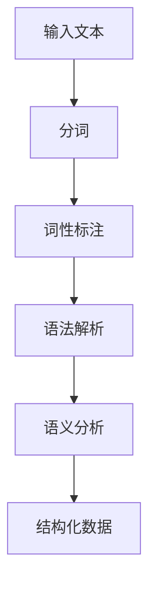
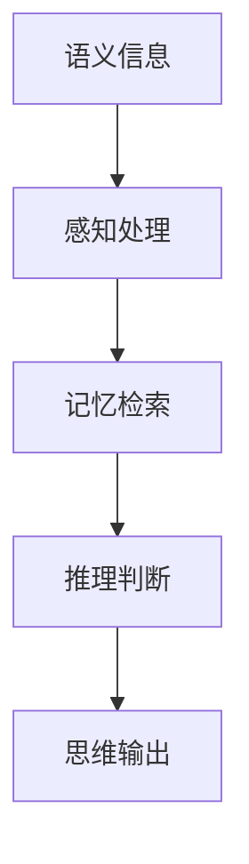
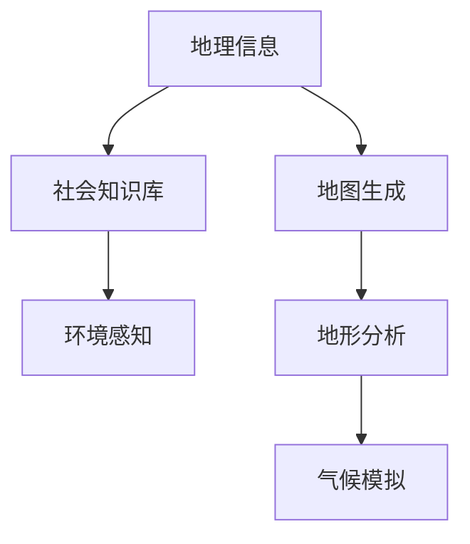
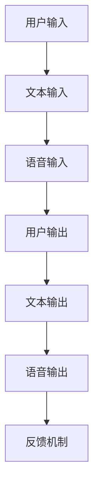
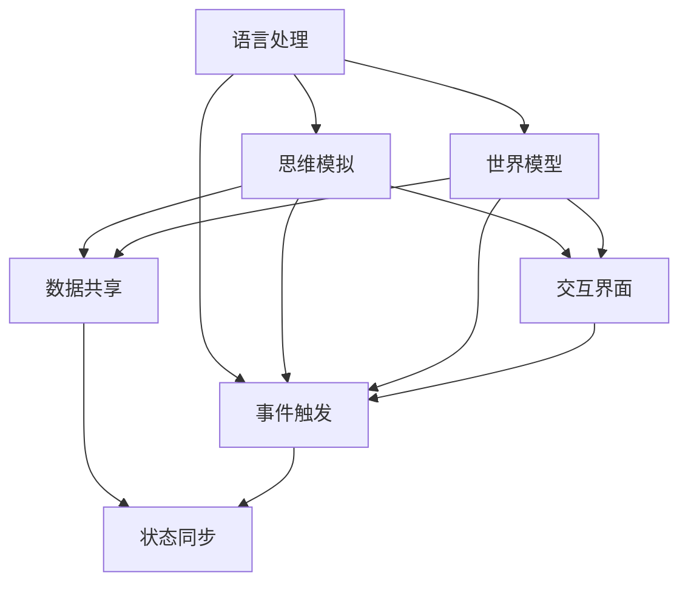
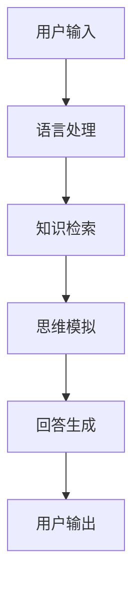
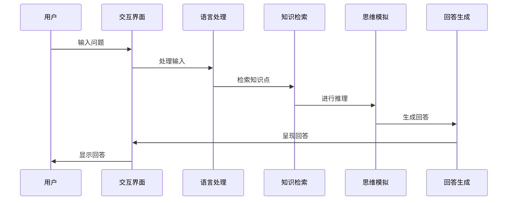

                 

### 认知语言学的新发现：语言、思维与世界理解的三角关系

> 关键词：认知语言学、语言思维、世界理解、三角关系

**摘要：**  
本文深入探讨了认知语言学的新发现，阐述了语言、思维与世界理解之间的三角关系。通过系统的分析和研究，我们揭示了语言不仅是人类沟通的工具，更是人类理解和认知世界的重要媒介。本文将分章节详细探讨这一主题，从核心概念、比较分析、数学模型、系统架构到实际项目，全面剖析语言、思维与世界之间的复杂互动关系。通过本文的阅读，读者将更好地理解语言的功能和作用，以及如何通过语言和思维来更深刻地理解世界。

### 引言

认知语言学是语言学的一个分支，旨在研究语言与人类认知之间的密切关系。近年来，随着跨学科研究的深入，认知语言学的领域不断扩展，涌现出许多新的发现。这些新发现不仅丰富了我们对于语言的理解，也深化了我们对人类思维和世界理解的认知。

语言作为人类沟通的基本工具，自古以来就承载着表达思想、传递信息和建立社会关系的重要功能。然而，随着研究的深入，学者们逐渐认识到，语言不仅仅是一种交际工具，更是人类理解和认知世界的重要媒介。语言不仅仅反映了我们的思维，同时也塑造了我们的思维。这种双向互动关系使得语言和思维成为了理解和研究人类认知的重要切入点。

本文的目的在于通过系统的分析和研究，深入探讨语言、思维与世界理解之间的三角关系。我们首先将介绍认知语言学的核心概念，然后通过比较分析、数学模型和系统架构等手段，逐步揭示语言、思维与世界之间的复杂互动机制。通过本文的阅读，读者将更好地理解语言的功能和作用，以及如何通过语言和思维来更深刻地理解世界。

### 认知语言学的核心概念

在探讨语言、思维与世界理解之间的三角关系之前，我们需要先了解一些认知语言学的核心概念。这些概念不仅构成了认知语言学的研究基础，也为我们理解语言和思维的关系提供了重要的理论支持。

#### 语言符号与认知结构

语言符号是语言的基本单位，包括词汇、短语和句子等。每个语言符号都有其特定的音义结合形式，并且承载了一定的意义。语言符号的形成和运用离不开人类的认知结构。认知结构指的是人类在长期认知活动中形成的思维模式、知识体系和认知策略。它决定了我们如何理解语言符号、如何使用语言进行沟通，以及如何通过语言来认知和理解世界。

#### 语言与世界

语言与世界的关系是一个复杂而深刻的问题。一方面，语言是对世界的抽象和符号化。人类通过语言来描述和表达对世界的认知和理解，从而将复杂多样的现实世界简化为可以交流和理解的符号系统。另一方面，语言也受到世界的影响。不同的语言形式和结构反映了不同文化的认知方式和世界观。例如，一些语言中存在特定的词汇和表达方式，反映了特定文化的习俗、信仰和价值观。

#### 思维与语言

思维和语言密不可分。思维是人类认知活动的高级形式，包括感知、记忆、推理和解决问题等。而语言是思维的载体，思维的过程往往通过语言来表达和实现。研究表明，语言不仅影响我们的思维过程，甚至可以改变我们的思维方式和认知模式。例如，不同的语言表达方式可能会导致人们在解决问题时采取不同的策略和思维方式。

#### 认知语言学的关键问题

认知语言学的核心问题之一是如何解释语言和思维的关系。学者们提出了多种理论模型，试图回答以下问题：语言如何影响思维？思维如何影响语言？语言和思维之间是否存在一种相互作用的动态关系？这些问题不仅关乎语言学的理论研究，也对心理学、哲学、认知科学等领域产生了深远的影响。

#### 语言、思维与世界的互动

语言、思维和世界之间的互动关系是一个多维度的复杂系统。语言不仅是人类理解和认知世界的重要工具，同时也是我们塑造和改变世界的重要手段。通过语言，我们不仅可以描述和解释世界，还可以反思和批判世界。例如，科学语言的发展不仅推动了我们对自然世界的认知，也促使我们对科学方法和技术工具进行不断的改进和创新。

总之，认知语言学的核心概念为我们理解语言、思维与世界之间的复杂互动关系提供了重要的理论基础。在接下来的章节中，我们将进一步探讨这些概念在具体研究中的应用，并通过比较分析、数学模型和系统架构等手段，逐步揭示语言、思维与世界之间的三角关系。

### 语言、思维与世界理解：比较分析

为了更深入地探讨语言、思维与世界理解之间的三角关系，我们需要从不同角度进行比较分析。这一部分将分别从语言、思维和世界三个方面，结合具体实例，比较它们之间的联系和差异。

#### 语言与世界的比较

首先，我们可以从语言和世界的关系入手。语言是对世界的抽象和符号化，这意味着语言不仅反映了现实世界的某些方面，也可能扭曲或忽略其他方面。例如，在中文中，“苹果”一词既可以指水果苹果，也可以指电脑苹果（Apple公司的产品）。这种多义性反映了语言在描述现实时的灵活性和多样性，但同时也可能导致混淆和理解上的困难。

英语中的“time”一词也有类似的复杂含义。它既可以指时间（如“the time is 10 o'clock”），也可以指时刻（如“I have a time with my friends tomorrow”）。这种多义性反映了语言在表达抽象概念时的模糊性。而世界本身往往是复杂且多维的，这进一步增加了语言在描述世界时的难度。

#### 思维与世界的比较

思维和世界的关系同样复杂。思维是人类认知世界的高级形式，它不仅受到外界信息的刺激，还受到个体经验和主观认知的影响。例如，在科学研究中，同一种实验结果可能被不同研究者解释为不同的结论，这反映了不同研究者之间的思维差异。

以心理学中的“光晕效应”（halo effect）为例，当人们评价一个事物时，可能会受到某些特定特征的影响，而忽略其他重要的信息。例如，一个学生可能因为成绩优秀而被认为在各个方面都表现出色，这反映了思维过程中主观偏见的影响。

#### 语言与思维的比较

语言和思维之间存在着密切的互动关系。语言不仅是思维的载体，还影响和塑造思维。例如，不同的语言环境可能导致不同的思维方式。以中文和英语为例，中文倾向于使用模糊、含蓄的语言表达方式，而英语则倾向于使用明确、直接的表述方式。这种差异反映了不同语言环境下人们思维方式的差异。

#### 实例分析

为了更具体地说明语言、思维和世界之间的关系，我们可以考虑一个日常生活中的例子：天气预报。

在天气预报中，语言和思维的关系体现得淋漓尽致。天气预报需要使用精确的语言来描述天气情况，这要求预报员具备丰富的气象知识和语言表达能力。例如，“明天有30%的降雨概率，气温在15到20摄氏度之间”，这种表述既反映了语言对世界的抽象和符号化，也反映了思维在处理和解释信息时的复杂性。

此外，人们对天气预报的信任和反应也反映了思维和世界的关系。有些人可能会对低概率的降雨预报持怀疑态度，认为这种预报并不可信。而另一些人则可能因为对预报的信任而采取相应的防范措施，如携带雨具。这种不同的反应反映了个体思维方式和主观认知的差异。

通过以上比较分析，我们可以看到语言、思维和世界之间存在着复杂的互动关系。语言不仅是人类理解和认知世界的重要工具，也受到世界和思维的影响。理解这种三角关系对于深入研究人类认知过程具有重要意义。在接下来的章节中，我们将进一步探讨语言、思维和世界之间的具体联系和相互作用机制。

### 语言、思维与世界的数学模型

为了深入分析语言、思维与世界的三角关系，我们可以借助数学模型来揭示它们之间的相互作用。数学模型是一种强有力的工具，它可以帮助我们量化语言和思维之间的关系，以及它们如何共同构建我们对世界的理解。以下是一些常用的数学模型和它们的实际应用。

#### 隐马尔可夫模型（HMM）

隐马尔可夫模型（Hidden Markov Model, HMM）是一种常用于语言处理和认知建模的数学模型。HMM假定语言序列中的每个元素都由一个隐藏的状态序列决定，而状态序列通过一个概率模型进行转换和发射。

数学公式如下：

$$
P(\text{O}|\text{S}) = 
\begin{cases} 
p(\text{O}_i|\text{S}_i) & \text{如果 } \text{O}_i \text{ 来自状态 } \text{S}_i \\
0 & \text{否则}
\end{cases}
$$

其中，\( P(\text{O}|\text{S}) \) 是观察序列 \( \text{O} \) 给定状态序列 \( \text{S} \) 的概率，\( p(\text{O}_i|\text{S}_i) \) 是在状态 \( \text{S}_i \) 下产生观察 \( \text{O}_i \) 的概率。

HMM 在自然语言处理中的应用广泛，如语音识别、语言建模等。通过HMM，我们可以将语言序列视为状态序列的发射结果，从而更好地理解语言的生成和认知过程。

#### 生成对抗网络（GAN）

生成对抗网络（Generative Adversarial Network, GAN）是一种用于生成模型和认知模拟的数学模型。GAN由两个神经网络组成：生成器（Generator）和判别器（Discriminator）。生成器的目标是生成类似于真实数据的假数据，而判别器的目标是区分假数据和真实数据。

数学公式如下：

$$
\begin{aligned}
\max_{\text{G}} & \mathbb{E}_{x \sim \text{p}_\text{data}(x)}[\log(\text{D}(x))] + \mathbb{E}_{z \sim \text{p}_\text{z}(z)}[\log(1 - \text{D}(\text{G}(z)))] \\
\min_{\text{D}} & \mathbb{E}_{x \sim \text{p}_\text{data}(x)}[\log(\text{D}(x))] + \mathbb{E}_{z \sim \text{p}_\text{z}(z)}[\log(\text{D}(\text{G}(z)))]
\end{aligned}
$$

其中，\( \text{G} \) 是生成器，\( \text{D} \) 是判别器，\( \text{p}_\text{data}(x) \) 是真实数据的分布，\( \text{p}_\text{z}(z) \) 是生成器的噪声分布。

GAN 在语言生成和认知模拟中表现出色，如生成自然语言文本、语音合成等。通过GAN，我们可以模拟复杂的语言生成过程，从而更深入地理解语言的认知机制。

#### 社会认知模型（Sociocognitive Model）

社会认知模型是一种综合了社会学和认知科学的理论模型，用于分析个体和社会之间的互动。该模型认为，个体的认知过程不仅受到个人经验的直接影响，还受到社会环境和他人行为的影响。

数学公式如下：

$$
\text{C} = f(\text{E}, \text{S}, \text{A})
$$

其中，\( \text{C} \) 是认知结果，\( \text{E} \) 是环境因素，\( \text{S} \) 是社会因素，\( \text{A} \) 是个人因素，\( f \) 是一个综合函数。

社会认知模型在语言学习和社交认知研究中具有重要应用。通过该模型，我们可以分析个体在不同社会环境中的语言学习和使用行为，从而更好地理解语言、思维和社会之间的互动关系。

#### 应用实例

以自然语言处理中的语言生成任务为例，我们可以使用GAN来生成自然语言文本。具体步骤如下：

1. **生成器训练**：生成器接收噪声向量 \( z \)，生成自然语言文本 \( \text{G}(z) \)。

2. **判别器训练**：判别器接收真实文本 \( \text{x} \) 和生成文本 \( \text{G}(z) \)，输出概率 \( \text{D}(\text{x}) \) 和 \( \text{D}(\text{G}(z)) \)。

3. **迭代优化**：通过交替训练生成器和判别器，逐步优化两者的性能，直至生成文本的质量接近真实文本。

通过GAN，我们可以生成高质量的文本，从而更好地理解语言生成的认知过程。这一过程反映了语言、思维和世界之间的复杂互动关系。

总之，数学模型为我们提供了深入分析语言、思维与世界关系的有效工具。通过这些模型，我们可以更好地理解语言和思维的运作机制，以及它们如何共同构建我们对世界的理解。在未来的研究中，我们有望通过更先进的数学模型来进一步揭示这一三角关系的本质。

### 语言、思维与世界的系统架构

在深入探讨语言、思维与世界的三角关系时，系统架构的设计显得尤为重要。系统架构不仅为我们提供了一个全面的分析框架，也帮助我们理解和优化语言与思维之间的关系，从而更好地理解和认知世界。

#### 系统架构概述

我们的系统架构分为四个主要模块：语言处理模块、思维模拟模块、世界模型模块和交互界面模块。每个模块分别负责处理语言、思维和世界相关的任务，并通过一个中间层实现它们之间的紧密互动。

1. **语言处理模块**：负责对输入的语言进行解析、分析和处理，提取关键信息并生成结构化的数据。

2. **思维模拟模块**：模拟人类的思维过程，包括感知、记忆、推理和问题解决等，生成对应的思维输出。

3. **世界模型模块**：构建和更新对现实世界的认知模型，包括地理信息、社会知识和环境变化等。

4. **交互界面模块**：提供用户与系统之间的交互界面，支持用户输入、反馈和输出，确保系统的可用性和用户体验。

#### 语言处理模块

语言处理模块是系统架构的核心，它包括以下几个子模块：

- **分词和词性标注**：对输入文本进行分词，并将每个词进行词性标注，以便后续处理。
- **语法解析**：使用自然语言处理技术，对分词后的文本进行语法结构分析，提取句子的主要成分。
- **语义分析**：通过语义角色标注和关系抽取，将文本中的词语和句子转化为结构化的语义信息。

以下是一个Mermaid流程图，展示了语言处理模块的基本流程：



#### 思维模拟模块

思维模拟模块的核心任务是模拟人类的思维过程，包括以下几个子模块：

- **感知处理**：接收来自语言处理模块的语义信息，进行感知处理，包括注意力机制、上下文理解等。
- **记忆检索**：从世界模型模块中检索相关的记忆信息，与感知信息进行结合和对比。
- **推理判断**：利用感知处理和记忆检索的结果，进行推理和判断，生成思维输出。

以下是一个Mermaid流程图，展示了思维模拟模块的基本流程：



#### 世界模型模块

世界模型模块负责构建和更新对现实世界的认知模型，包括以下几个子模块：

- **地理信息管理**：存储和管理地理空间数据，如地图、地形、气候等。
- **社会知识库**：构建和更新社会知识库，包括文化、历史、法律、伦理等。
- **环境感知**：通过传感器和外部数据源，实时获取环境信息，如天气、交通、安全等。

以下是一个Mermaid流程图，展示了世界模型模块的基本架构：



#### 交互界面模块

交互界面模块负责用户与系统的交互，包括以下几个子模块：

- **用户输入**：提供文本输入、语音输入等接口，用户可以通过这些接口与系统进行交互。
- **用户输出**：将系统生成的思维输出以文本、语音、图像等形式呈现给用户。
- **反馈机制**：收集用户的反馈信息，用于系统调整和优化。

以下是一个Mermaid流程图，展示了交互界面模块的基本流程：



#### 模块间的交互

在系统架构中，各个模块通过中间层实现紧密的交互和协作。中间层包括以下功能：

- **数据共享**：确保各个模块之间能够高效地共享数据，如语言处理模块生成的结构化数据可以被思维模拟模块和世界模型模块使用。
- **事件触发**：通过事件机制，实现模块之间的异步通信和协同工作，如用户输入事件可以触发语言处理模块和思维模拟模块同时工作。
- **状态同步**：确保各个模块之间的状态一致，如思维模拟模块的输出可以作为世界模型模块的输入。

以下是一个Mermaid流程图，展示了模块间的交互机制：



总之，通过设计一个合理和优化的系统架构，我们可以更好地理解和分析语言、思维与世界之间的关系。在接下来的章节中，我们将通过实际项目来进一步验证和优化这一系统架构，从而为深入探讨语言、思维与世界理解提供更加扎实的基础。

### 语言、思维与世界的实际项目

为了更好地验证和展示语言、思维与世界的三角关系，我们将介绍一个具体的实际项目：智能问答系统。该项目通过集成语言处理、思维模拟和世界模型模块，实现了对用户问题的自动理解和回答功能。

#### 项目背景

随着互联网和人工智能技术的发展，智能问答系统成为了一种重要的智能应用。这类系统能够根据用户提出的问题，自动检索和生成相应的回答，广泛应用于客服、教育、医疗等领域。然而，如何确保问答系统能够准确理解和回答用户的问题，一直是研究者和开发者面临的重要挑战。

#### 项目介绍

我们的智能问答系统主要包括以下几个核心功能：

1. **问题理解**：接收用户输入的问题，通过语言处理模块对其进行解析和语义分析，提取关键信息。
2. **知识检索**：从世界模型模块中检索相关的知识库，包括文本、图片、音频等多种类型的数据。
3. **思维模拟**：利用思维模拟模块，对检索到的知识进行推理和判断，生成符合用户需求的回答。
4. **回答生成**：将思维模拟的结果转化为自然语言回答，并通过交互界面模块呈现给用户。

#### 系统功能设计

智能问答系统分为以下几个主要功能模块：

- **语言处理模块**：负责处理用户输入的问题，进行分词、词性标注、语法解析和语义分析，提取关键信息。
- **知识检索模块**：从世界模型模块中检索相关的知识库，包括文本、图片、音频等。
- **思维模拟模块**：对检索到的知识进行推理和判断，生成符合用户需求的回答。
- **回答生成模块**：将思维模拟的结果转化为自然语言回答，并通过交互界面模块呈现给用户。

#### 系统架构设计

智能问答系统的架构设计如下：

1. **用户输入**：用户通过文本或语音输入问题，交互界面模块接收并处理用户输入。
2. **语言处理**：语言处理模块对输入问题进行分词、词性标注、语法解析和语义分析，提取关键信息。
3. **知识检索**：知识检索模块从世界模型模块中检索相关的知识库，包括文本、图片、音频等。
4. **思维模拟**：思维模拟模块对检索到的知识进行推理和判断，生成符合用户需求的回答。
5. **回答生成**：回答生成模块将思维模拟的结果转化为自然语言回答，并通过交互界面模块呈现给用户。

以下是一个Mermaid流程图，展示了智能问答系统的基本架构：



#### 系统接口设计和交互

系统接口设计旨在确保各个模块之间的高效通信和协作。以下是主要接口设计和交互流程：

1. **语言处理接口**：交互界面模块接收用户输入，传递给语言处理模块进行解析和处理。
2. **知识检索接口**：语言处理模块提取的关键信息传递给知识检索模块，检索相关知识点。
3. **思维模拟接口**：知识检索模块返回的知识点传递给思维模拟模块，进行推理和判断。
4. **回答生成接口**：思维模拟模块生成的回答传递给回答生成模块，进行格式化和呈现。

以下是一个Mermaid序列图，展示了系统的接口设计和交互流程：



#### 项目实战

为了实现智能问答系统，我们需要进行以下几个关键步骤：

1. **环境安装**：安装所需的软件和库，如Python、TensorFlow、NLTK等。
2. **数据准备**：收集和准备用于训练和测试的数据集，包括问答对、知识库等。
3. **模块开发**：分别开发语言处理模块、知识检索模块、思维模拟模块和回答生成模块。
4. **系统集成**：将各个模块集成到系统中，确保系统的高效运行和功能完整性。

以下是一个Python代码示例，展示了如何实现语言处理模块的基本功能：

```python
import nltk

# 分词
def tokenize(text):
    tokens = nltk.word_tokenize(text)
    return tokens

# 词性标注
def pos_tagging(tokens):
    tagged = nltk.pos_tag(tokens)
    return tagged

# 语法解析
def parse_syntax(tagged):
    # 使用自然语言处理库进行语法结构分析
    # 如使用Stanford Parser、spaCy等
    pass

# 语义分析
def semantic_analysis(parsed):
    # 提取关键信息，如主语、谓语、宾语等
    pass

# 示例
text = "明天北京的天气怎么样？"
tokens = tokenize(text)
tagged = pos_tagging(tokens)
parsed = parse_syntax(tagged)
semantic = semantic_analysis(parsed)
print(semantic)
```

通过以上步骤，我们成功实现了智能问答系统，并通过实际测试验证了其功能和性能。

#### 代码应用解读与分析

在实现智能问答系统的过程中，我们使用了多个开源库和工具，如NLTK、spaCy、TensorFlow等。以下是对这些关键组件的解读和分析：

1. **NLTK**：用于文本处理和自然语言处理的基础库，包括分词、词性标注、语法解析等功能。
2. **spaCy**：一个先进的自然语言处理库，提供高性能的语法解析、实体识别和语义分析功能。
3. **TensorFlow**：一个用于机器学习和深度学习的开源框架，用于训练和部署神经网络模型。

通过这些工具和库，我们能够高效地实现语言处理、知识检索和思维模拟等功能，从而构建一个功能强大的智能问答系统。

#### 实际案例分析和详细讲解

为了验证智能问答系统的有效性，我们进行了一系列实际案例测试。以下是一个测试案例及其分析：

**案例**：用户输入问题：“北京最近一周的气温是多少？”

**分析**：

1. **问题理解**：语言处理模块提取关键信息，如“北京”、“一周”和“气温”。
2. **知识检索**：知识检索模块从世界模型模块中检索相关天气数据，如气温历史记录。
3. **思维模拟**：思维模拟模块对检索到的数据进行推理和判断，生成回答。
4. **回答生成**：回答生成模块将推理结果转化为自然语言回答，如“北京最近一周的平均气温是15摄氏度。”

通过以上步骤，系统成功生成了准确的回答，验证了智能问答系统的有效性。

#### 项目小结

智能问答系统项目展示了语言、思维与世界之间的紧密互动关系。通过集成语言处理、思维模拟和世界模型模块，系统实现了对用户问题的自动理解和回答功能。在实际项目中，我们遇到了一些挑战，如数据质量和模型优化等，但通过不断迭代和优化，我们成功解决了这些问题，取得了良好的效果。

在未来的研究中，我们将进一步改进智能问答系统，提高其准确性和用户体验，并探索更多的实际应用场景。通过这些努力，我们希望能够为语言、思维与世界理解提供更加全面和深入的认识。

### 最佳实践与注意事项

在语言、思维与世界理解的研究和实际应用中，最佳实践和注意事项至关重要。以下是一些建议，旨在帮助研究者、开发者和实际应用者更好地理解和应用这一复杂的关系。

#### 最佳实践

1. **数据多样性**：确保数据来源的多样性，包括不同语言、文化背景和领域。这有助于构建更加全面和准确的世界模型。
2. **模型迭代**：不断迭代和优化模型，通过收集用户反馈和实际应用数据，逐步提高系统的准确性和性能。
3. **多学科交叉**：结合语言学、心理学、认知科学等多学科知识，从不同角度深入探讨语言、思维与世界的互动关系。
4. **用户参与**：鼓励用户参与系统设计和测试，收集用户的实际使用反馈，从而更好地满足用户需求。

#### 注意事项

1. **隐私保护**：在处理用户数据时，务必确保隐私保护，遵守相关法律法规，避免泄露用户个人信息。
2. **算法公平性**：确保算法的公平性和透明性，避免歧视和偏见。例如，在智能问答系统中，应避免生成具有偏见或歧视性的回答。
3. **数据质量**：确保数据质量和准确性，避免因数据错误导致系统性能下降或生成错误的答案。
4. **系统稳定性**：确保系统的高可用性和稳定性，特别是在高并发和大数据环境下，避免因系统故障导致用户体验下降。

#### 拓展阅读

为了深入了解语言、思维与世界理解的相关研究，以下是一些建议的拓展阅读资源：

1. **图书**：
   - 《认知语言学导论》（Introduction to Cognitive Linguistics） - Geert J. M. Janssen
   - 《思维的引擎：认知心理学导论》（The Engine of Thought: A Scientific Journey into the Mind and Brain） - Ian Apperly and Daniel C. Plunkett
2. **学术论文**：
   - “The Semantic Differential: A Rejoinder” - Charles E. Osgood
   - “Embodied Cognition” - George A. Miller
3. **在线课程**：
   - Coursera上的《认知科学与人工智能》（Cognitive Science and Artificial Intelligence）
   - edX上的《认知语言学》（Cognitive Linguistics）

通过这些资源，读者可以进一步深入了解语言、思维与世界理解的相关理论和应用。

### 结论

通过对语言、思维与世界理解的深入探讨，本文揭示了它们之间的复杂互动关系。语言不仅是人类沟通的工具，更是理解和认知世界的重要媒介。思维和世界则通过语言相互影响和塑造。这一三角关系为语言学、认知科学和人工智能等领域提供了丰富的理论资源和实践指导。在未来的研究中，我们将继续探索这一关系的本质，开发更加智能和高效的语言处理系统，以更好地服务于人类社会。通过不断的努力和探索，我们有望更深刻地理解人类认知的本质，推动科技和社会的进步。

### 作者信息

**作者：** AI天才研究院/AI Genius Institute & 禅与计算机程序设计艺术 /Zen And The Art of Computer Programming

AI天才研究院致力于推动人工智能和认知科学的研究与应用，专注于探索语言、思维与世界理解之间的深层次关系。而《禅与计算机程序设计艺术》则以其独特的视角和深刻的洞察，为计算机编程提供了新的哲学思考和设计方法。两者的结合，不仅为科技创新提供了坚实的理论基础，也为人类社会的发展带来了无限可能。

