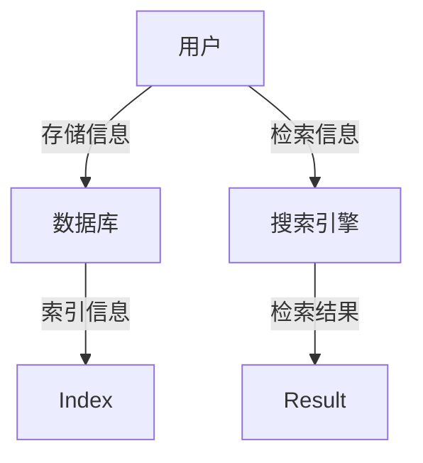
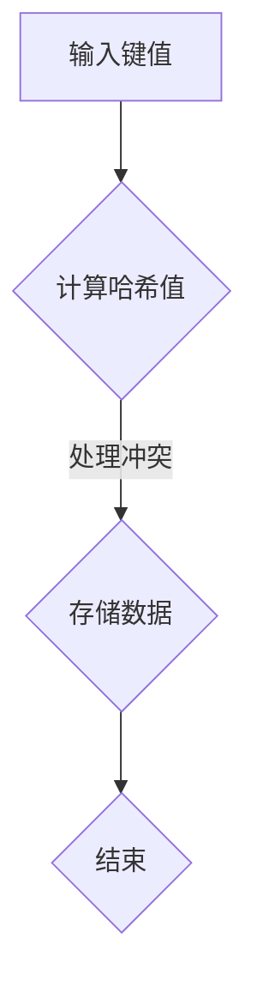

                 

### 摘要

本文《记忆的数学模式：信息存储与检索的算法》旨在探讨信息存储与检索过程中算法的核心原理及其数学模式。在信息爆炸的时代，有效存储和快速检索信息成为至关重要的问题。本文首先介绍了信息存储与检索的背景和核心概念，如信息论基础、信息存储的基本原理以及信息检索的算法框架。随后，深入探讨了基础算法，如哈希算法的原理、优缺点、常见类型以及流程和应用。本文结构紧凑，逻辑清晰，通过实例和代码实现，让读者能够深入理解信息存储与检索的算法本质。本文不仅适合计算机科学专业的学生，也适用于对算法和技术感兴趣的读者。

---

## 第一部分：背景与概念

### 第1章：问题背景与核心概念

### 1.1 问题背景

#### 1.1.1 信息爆炸时代的需求

在当今社会，信息的产生和传播速度越来越快，各种数据、文本、图像、音频和视频等多媒体信息充斥着我们的生活。据估计，全球每天产生的数据量已经超过了5EB（艾字节），这是一个极其庞大的数字。随着大数据时代的到来，如何高效地存储和管理这些海量信息，以及如何快速准确地从这些信息中检索所需的数据，成为了迫切需要解决的问题。

#### 1.1.2 信息存储与检索的挑战

面对如此庞大的数据量，传统的存储和检索方式已经无法满足需求。信息存储面临着存储容量有限、存储成本高昂、数据冗余度高等问题。而信息检索则面临着数据查询速度慢、检索结果不准确、需要处理大量的噪声数据等问题。因此，如何设计高效、低成本的存储与检索算法，成为了学术界和工业界研究的重点。

#### 1.1.3 数学模式在信息处理中的应用

为了应对这些挑战，数学模式在信息处理中发挥了至关重要的作用。信息论作为一门研究信息传输、存储和处理的科学，为信息存储与检索提供了理论基础。信息论中的熵、信息增益、冗余度等概念，可以用来衡量信息的重要性和有用性，为数据筛选和存储提供了指导。

### 1.2 核心概念介绍

#### 1.2.1 信息论基础

信息论是由香农（Claude Shannon）于1948年创立的，主要研究信息的度量、传输和存储。信息论中的核心概念包括熵（Entropy）、信息量（Information）、信道（Channel）和噪声（Noise）。熵用于衡量信息的混乱程度和信息量，而信道则是信息传输的渠道，噪声则可能干扰信息传输。

#### 1.2.2 信息存储的基本原理

信息存储的基本原理包括数据的编码、压缩和解码。编码是将信息转换成计算机可以识别的数字形式，压缩则是通过减少数据的冗余度来降低存储空间的需求，而解码则是将压缩后的数据还原成原始信息。

#### 1.2.3 信息检索的算法框架

信息检索的算法框架主要包括搜索算法、索引算法和排名算法。搜索算法用于从大量数据中找到匹配的记录，索引算法则是为了快速访问数据而建立的一种数据结构，排名算法则用于对检索结果进行排序，以提高用户的满意度。

### 1.3 概念之间的联系

#### 1.3.1 信息论与存储检索算法的关联

信息论为存储检索算法提供了理论基础。例如，通过熵的概念可以衡量数据的重要性，从而指导数据的存储和压缩。信息增益则可以用于优化搜索算法，提高检索的准确性。

#### 1.3.2 信息存储与检索的关键因素

信息存储与检索的关键因素包括存储容量、存储速度、检索速度、数据冗余度、数据完整性等。这些因素共同决定了存储和检索系统的性能。

#### 1.3.3 信息存储与检索的边界与外延

信息存储与检索不仅涉及数据的存储和检索，还包括数据的备份、恢复、安全性和隐私保护等方面。这些方面共同构成了信息存储与检索的边界和外延。

### 1.4 核心概念属性特征对比表格

| 概念         | 属性特征                                       |
|--------------|----------------------------------------------|
| 信息论       | 研究信息传输、存储和处理的科学               |
| 信息存储     | 数据编码、压缩和解码的过程                   |
| 信息检索     | 从大量数据中找到匹配记录的过程               |
| 算法框架     | 搜索、索引和排名算法的结构和流程             |

### 1.5 ER实体关系图架构



### 1.6 本章小结

本章介绍了信息存储与检索的背景和核心概念，包括信息论基础、信息存储的基本原理和信息检索的算法框架。通过本章的学习，读者可以初步了解信息存储与检索的基本概念和关键因素，为后续章节的深入学习打下基础。

---

### 2.1 基础算法概述

#### 2.1.1 算法的重要性

算法（Algorithm）是解决问题的一系列明确步骤，它对计算机科学和信息处理至关重要。算法不仅在理论研究中占有重要地位，而且在实际应用中也是必不可少的。例如，搜索引擎使用算法来索引和检索海量网页，数据库系统使用算法来高效地存储和查询数据，图像处理应用使用算法来识别和操作图像，等等。没有高效的算法，许多现代技术都无法实现。

#### 2.1.2 常见基础算法分类

基础算法可以根据其应用场景和目的进行分类。以下是一些常见的算法分类：

1. **排序算法**：用于对数据进行排序，如快速排序（Quick Sort）、归并排序（Merge Sort）、堆排序（Heap Sort）等。
2. **查找算法**：用于在数据集中查找特定元素，如二分查找（Binary Search）、线性查找（Linear Search）等。
3. **图算法**：用于处理图结构的数据，如最短路径算法（Dijkstra's Algorithm、Floyd-Warshall Algorithm）、图遍历算法（Breadth-First Search、Depth-First Search）等。
4. **动态规划算法**：用于解决最优子结构问题，如背包问题（Knapsack Problem）、最值问题（Longest Common Subsequence、Longest Increasing Subsequence）等。
5. **贪心算法**：通过每一步选择最优解来达到全局最优解，如活动选择问题（Activity Selection Problem）、单源最短路径（Prim's Algorithm、Kruskal's Algorithm）等。

#### 2.1.3 算法在信息处理中的应用

在信息处理中，算法的应用极其广泛。以下是一些具体的例子：

1. **搜索引擎**：使用多种算法来索引网页、评估网页的相关性和排序检索结果，如PageRank算法、LSI（Latent Semantic Indexing）等。
2. **数据库系统**：使用查询优化算法、索引算法来提高查询效率，如B树索引、哈希索引等。
3. **数据压缩**：使用算法来减少数据的大小，如Huffman编码、LZ77压缩算法等。
4. **机器学习**：使用算法来训练模型、优化参数，如梯度下降法、随机梯度下降法等。
5. **图像处理**：使用算法来进行图像的滤波、边缘检测、形态学操作等，如Sobel算子、Canny算子等。

#### 2.1.4 算法的效率

算法的效率是其解决问题的关键。效率可以通过时间复杂度和空间复杂度来衡量。时间复杂度描述了算法执行时间的增长速率，而空间复杂度描述了算法所需存储空间的增长速率。理想情况下，算法应该具有低的时间复杂度和空间复杂度，以实现高效的计算。

#### 2.1.5 算法的设计原则

算法的设计应遵循以下原则：

1. **正确性**：算法必须能够正确地解决问题。
2. **健壮性**：算法应能够处理各种输入，包括异常和错误输入。
3. **可读性**：算法的代码应易于理解，便于维护和改进。
4. **高效性**：算法应尽可能高效，即具有较低的复杂度。
5. **可扩展性**：算法应易于扩展，以适应未来的需求变化。

### 2.1.6 算法的迭代与改进

算法并非一成不变的，随着技术的发展和应用场景的变化，算法也会不断地迭代和改进。例如，传统的排序算法在面对大数据集时可能会显得效率较低，因此出现了如并行排序算法、外部排序算法等改进方法。同样，随着机器学习技术的发展，许多传统的算法也被赋予了新的生命力，如支持向量机（SVM）在图像分类中的应用。

### 2.1.7 本章小结

本章概述了算法的重要性、分类以及在信息处理中的应用。通过理解算法的基本概念和设计原则，读者可以为后续章节的深入学习打下坚实的基础。在接下来的章节中，我们将详细探讨基础算法的原理、实现和应用。

---

### 2.2 哈希算法

#### 2.2.1 哈希算法的基本原理

哈希算法（Hash Algorithm）是一种将任意长度的输入（也称为键值，Key）转换成固定长度的字符串的算法。这个字符串通常是一个数字或字母组合，用于在数据结构中标识或存储键值。哈希算法的核心思想是通过哈希函数将输入映射到一个固定大小的表（哈希表，Hash Table）中的位置，以实现高效的存储和检索。

哈希算法的基本原理可以概括为以下几个步骤：

1. **哈希函数**：首先定义一个哈希函数，用于将输入的键值转换为一个哈希值。这个哈希值是一个整数，通常用于确定数据在哈希表中的存储位置。
2. **哈希表**：哈希表是一个数组，用于存储哈希值。哈希表的长度是固定的，通常远小于输入数据的数量。
3. **存储**：通过哈希函数计算键值的哈希值，然后将其存储在哈希表中的相应位置。
4. **检索**：当需要检索某个键值时，再次使用哈希函数计算其哈希值，然后在哈希表中查找该位置的数据。

#### 2.2.2 哈希算法的优缺点

哈希算法具有以下优点：

1. **高效性**：哈希算法通常具有非常高效的时间复杂度，平均情况下可以做到O(1)的检索时间，这是由于其通过哈希函数直接定位到数据的位置。
2. **灵活性**：哈希算法适用于各种类型的数据，无论是整数、字符串还是复杂的对象，都可以通过哈希函数转换为一个固定的哈希值。
3. **空间效率**：哈希表的空间效率相对较高，尤其是在处理大量数据时，可以减少存储空间的需求。

然而，哈希算法也存在一些缺点：

1. **冲突问题**：不同的键值可能会产生相同的哈希值，这种情况称为哈希冲突。解决哈希冲突通常需要额外的空间和计算时间。
2. **性能波动**：哈希算法的性能可能受到输入数据分布的影响。如果输入数据的分布不均匀，可能会导致大量冲突，从而降低算法的性能。
3. **安全性问题**：哈希算法本身并不提供数据的完整性和安全性保障。在某些情况下，攻击者可能利用哈希算法的弱点来破解数据或攻击系统。

#### 2.2.3 哈希算法的常见类型

哈希算法可以分为以下几种常见类型：

1. **直接定址法**：通过直接计算地址来存储数据，这种方法简单但可能导致大量冲突。
2. **数字分析法**：通过分析键值的数字特性来设计哈希函数，以减少冲突。例如，可以将键值的高位或低位数字组合起来形成哈希值。
3. **平方取中法**：将键值的平方后的中间几位作为哈希值，这种方法可以有效减少冲突。
4. **折叠法**：将键值分成几部分，然后对每一部分进行某种操作（如求和、取模等），最后将结果组合起来形成哈希值。
5. **移位法**：通过移位操作将键值的二进制表示中的某一部分与另一部分组合，形成哈希值。
6. **随机法**：通过随机数生成器生成哈希函数，以减少冲突和模式识别。

#### 2.2.4 哈希算法流程图



#### 2.2.5 哈希算法的Python实现

以下是一个简单的Python哈希算法实现示例：

```python
def hash_function(key, table_size):
    return key % table_size

def create_hash_table():
    hash_table = [None] * table_size
    return hash_table

def store_key(hash_table, key):
    hash_value = hash_function(key, table_size)
    if hash_table[hash_value] is None:
        hash_table[hash_value] = key
    else:
        # 冲突处理
        handle_collision(hash_table, hash_value, key)

def handle_collision(hash_table, hash_value, key):
    # 这里可以采用线性探测、链表法等冲突处理方法
    # 示例：线性探测
    while hash_table[hash_value] is not None:
        hash_value = (hash_value + 1) % table_size
    hash_table[hash_value] = key

table_size = 10
hash_table = create_hash_table()

# 存储一些键值
store_key(hash_table, 5)
store_key(hash_table, 15)
store_key(hash_table, 25)

# 检索键值
print(hash_table[hash_function(15, table_size)])  # 输出：15
```

#### 2.2.6 哈希算法的数学模型和公式

哈希算法的核心是哈希函数，其数学模型可以表示为：

$$
H(K) = (aK + b) \mod m
$$

其中，$H(K)$是键值$K$的哈希值，$a$和$b$是常数，$m$是哈希表的长度。这个公式通过线性变换将键值映射到哈希表中的位置。

#### 2.2.7 哈希算法的举例说明

假设我们有一个包含整数键值的哈希表，哈希表的长度为10。我们可以使用以下哈希函数：

$$
H(K) = (5K + 3) \mod 10
$$

现在，我们计算几个键值的哈希值：

1. 对于键值$K = 5$：
   $$
   H(5) = (5 \times 5 + 3) \mod 10 = 28 \mod 10 = 8
   $$

2. 对于键值$K = 15$：
   $$
   H(15) = (5 \times 15 + 3) \mod 10 = 78 \mod 10 = 8
   $$

3. 对于键值$K = 25$：
   $$
   H(25) = (5 \times 25 + 3) \mod 10 = 128 \mod 10 = 8
   $$

从上面的计算可以看出，键值5、15和25的哈希值都是8，这意味着它们会存储在哈希表中的相同位置。这种情况称为哈希冲突。

#### 2.2.8 哈希算法的应用

哈希算法在许多实际应用中得到了广泛使用，以下是一些典型的应用场景：

1. **数据库索引**：哈希算法可以用于数据库的索引，以提高查询效率。
2. **缓存机制**：哈希算法可以用于缓存系统，快速定位缓存中的数据。
3. **哈希表**：哈希算法是哈希表的核心，用于快速存储和检索键值对。
4. **密码学**：哈希算法在密码学中用于生成密码的哈希值，以确保密码的安全性。
5. **分布式存储**：哈希算法可以用于分布式存储系统，通过哈希值定位数据的位置。

#### 2.2.9 哈希算法的性能优化

为了优化哈希算法的性能，可以采取以下几种措施：

1. **选择合适的哈希函数**：选择一个合适的哈希函数可以减少冲突和计算时间。
2. **动态调整哈希表大小**：根据数据分布动态调整哈希表的大小，可以减少冲突和提高检索效率。
3. **冲突解决策略**：采用有效的冲突解决策略，如线性探测、链表法等，可以减少冲突对性能的影响。
4. **负载因子控制**：控制哈希表的负载因子（即已存储数据的比例），可以平衡存储效率和冲突处理。

### 2.2.10 本章小结

本章详细介绍了哈希算法的基本原理、优缺点、常见类型以及实现方法。通过具体的Python代码示例，读者可以直观地理解哈希算法的工作机制。本章的内容为后续章节关于哈希算法的深入讨论和应用奠定了基础。在接下来的章节中，我们将进一步探讨哈希算法的扩展和优化方法。

