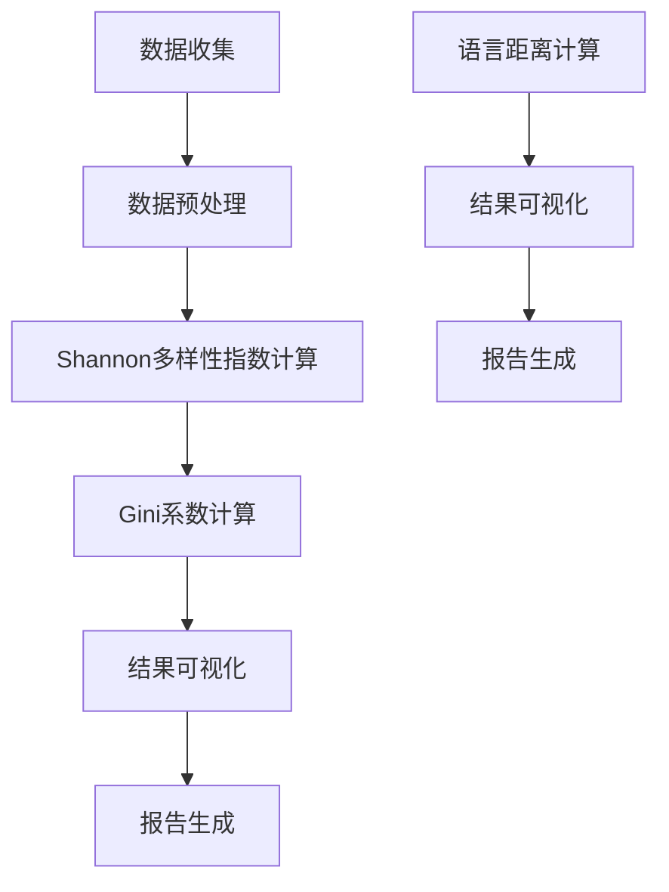

                 

### 第1章 引言

#### 1.1 问题的背景与意义

在全球化的浪潮中，语言多样性成为文化交流的桥梁与障碍。据统计，世界上有超过7000种语言，但仅有少数语言在全球范围内广泛使用。这种语言分布的不均衡，不仅影响了国际交流的效率和深度，也带来了文化交流中的误解与冲突。研究语言多样性与文化交流的关系，有助于我们更好地理解不同文化之间的互动模式，促进全球文化的和谐共生。

语言多样性不仅是一种语言现象，更是一种文化现象。它反映了人类社会的多样性、创新性和发展潜力。然而，随着全球化的推进，语言多样性的保护与传承面临严峻挑战。语言灭绝的速度比物种灭绝还要快，许多小语种正逐渐消失，这不仅是人类文化宝库的损失，也是全球文化多样性的流失。

#### 1.2 语言多样性的现状与挑战

目前，世界上的语言多样性状况令人堪忧。许多小语种的使用者数量急剧减少，部分语言甚至濒临灭绝。例如，世界语言地图显示，非洲约有2300种语言，但其中约一半的语言使用者不到10万人。这些语言背后的文化传统和历史记忆也随之消失，对人类文明的多样性和丰富性构成了严重威胁。

语言多样性的挑战不仅在于语言本身的消失，还在于语言使用环境的变化。随着英语的全球化，许多国家和地区将英语作为第二语言甚至第一语言来学习，这对本土语言的生存和发展构成了巨大的压力。此外，信息技术的发展也对语言多样性产生了深远影响。虽然互联网为全球语言交流提供了新的平台，但同时也加剧了语言不平等现象，使得小语种用户在国际交流中处于劣势。

#### 1.3 文化交流的数学结构

在研究语言多样性与文化交流的关系时，数学结构提供了一个有力的工具。通过数学模型，我们可以量化语言多样性的程度，分析不同语言社区之间的交流模式，以及语言多样性如何影响文化交流的深度和广度。数学结构在语言学中的应用，不仅有助于我们更深入地理解语言的本质和功能，还能为语言政策的制定提供科学依据。

#### 1.4 书籍的结构与目标

本书旨在系统地探讨语言多样性与文化交流的数学结构，通过分析语言多样性的基本概念、数学模型及其在文化交流中的应用，揭示语言多样性对文化交流的影响机制。本书将分为七个章节，逐一阐述：

- 第1章：引言，介绍研究背景、现状与意义。
- 第2章：语言多样性的基本概念，定义与分类。
- 第3章：语言多样性与文化交流，探讨其关系与影响。
- 第4章：数学结构在语言多样性研究中的应用，介绍相关数学工具。
- 第5章：文化交流的数学结构分析，建立数学模型。
- 第6章：文化交流的数学结构案例研究，通过实例分析验证模型。
- 第7章：结论与展望，总结主要发现，提出未来研究方向。

通过这些章节的逐一展开，本书旨在为读者提供一个全面、系统的视角，以理解和解决语言多样性与文化交流中的关键问题。

### 第2章 语言多样性的基本概念

#### 2.1 语言定义与分类

语言是人类社会交流的基本工具，是一种复杂的符号系统，用于表达思想、情感和意图。根据不同的标准，语言可以有多种分类方法。例如，根据语言起源，可以将语言分为自然语言和人工语言。自然语言是人类在长期进化过程中自然形成的语言，如汉语、英语等；人工语言则是人为设计的语言，如世界语、罗曼语等。

从结构上看，语言可以分为音系、语法和语义三个层次。音系研究语言的发音系统，如语音、音节、音素等；语法研究语言的句法结构，如词法、句法规则等；语义研究语言的意义，如词汇意义、句子意义等。这些层次相互交织，共同构成了语言的复杂系统。

#### 2.2 语言结构的多样性

语言结构的多样性表现在多个方面。首先，不同语言在语音、语法和语义上的差异显著。例如，英语中的名词和动词通过时态和语态的变化来表达时态和语态，而汉语主要通过词序和助词来表达。其次，不同语言在词汇和句法结构上也有很大的不同。例如，汉语以动词为中心的句法结构与英语以名词和动词为中心的句法结构存在显著差异。

此外，语言结构的多样性还体现在语言的形态变化和语法功能上。一些语言具有丰富的形态变化，如俄语、德语，它们的动词和名词有多个形态，而英语的形态变化则相对简单。语言的语法功能也各具特色，如某些语言中动词的词序灵活，而另一些语言中动词的词序则固定。

#### 2.3 语言功能的多样性

语言功能的多样性表现在语言在社交、教育、文化和经济等领域的不同作用。在社交方面，语言是人际交流的基础，通过语言，人们可以表达思想、情感和意图。在教育方面，语言是传授知识和文化的重要工具，语言能力的高低直接影响个体的学习效果和认知发展。

在文化方面，语言不仅是文化的载体，也是文化的一部分。每一种语言都蕴含着丰富的文化内涵和历史记忆，语言的不同反映了文化的差异。在经济方面，语言是国际贸易和商务交流的重要手段，语言的多样性决定了国际交流和合作的效率和质量。

#### 2.4 语言多样性的测量方法

测量语言多样性的方法有多种，常用的包括以下几种：

1. **语言种类多样性指数**：通过计算不同语言的使用频率来评估语言多样性。该方法简单直观，但仅能反映语言种类的多样性，不能反映每种语言的使用程度。

2. **词汇多样性指数**：通过计算一个语言社区中使用的词汇数量和词汇多样性来评估语言多样性。词汇多样性越高，语言的使用者越能够灵活地表达思想。

3. **语法多样性指数**：通过分析语言的语法结构多样性来评估语言多样性。语法结构多样性越高，语言的表达能力越强。

4. **语用多样性指数**：通过分析语言在不同情境下的使用方式来评估语言多样性。语用多样性反映了语言在社交和文化交流中的作用。

这些测量方法各有所长，可以根据研究目的和需求选择合适的测量方法。通过这些方法，我们可以更全面地了解语言多样性的现状和变化趋势，为语言政策的制定和文化交流的优化提供科学依据。

### 第3章 语言多样性与文化交流

#### 3.1 语言多样性与文化交流的关系

语言多样性与文化交流之间存在密切的关系。语言是文化交流的基本工具，没有语言，文化交流将变得艰难甚至不可能。语言多样性的丰富程度直接影响了文化交流的深度和广度。高度多样的语言环境可以促进文化交流的多样性和创新性，而单一的语言环境则可能限制文化交流的深度和范围。

在多元文化的社会中，语言多样性为不同文化之间的互动提供了更多的交流渠道和表达方式。例如，在一个多语言社区中，人们可以通过多种语言进行交流，从而更好地理解彼此的文化背景和价值观。反之，在语言单一的社会中，文化之间的交流可能受到语言的限制，导致误解和冲突。

#### 3.2 文化交流的障碍与语言多样性

尽管语言多样性可以为文化交流提供便利，但它也可能成为文化交流的障碍。语言差异导致了沟通障碍，影响了信息的准确传递和理解。在跨文化交流中，语言障碍可能导致误解、歧义和冲突。例如，不同语言中的词汇和语法结构可能存在细微的差别，这些差别可能导致误解和沟通障碍。

此外，语言多样性还可能导致文化偏见和歧视。某些语言被认为是高级语言，而其他语言则被视为低级语言，这导致了语言不平等现象。在某些情况下，语言差异甚至可能加剧社会不公和文化冲突。

#### 3.3 语言多样性对文化交流的影响

语言多样性对文化交流的影响是多方面的。首先，语言多样性可以丰富文化交流的内容和形式。多种语言的共存使得文化交流更加多元化和富有创意，不同的语言文化可以相互借鉴和融合，创造出新的文化现象。

其次，语言多样性可以促进文化交流的深度。在多语言环境中，人们可以更深入地了解彼此的文化背景和价值观，从而建立更深厚的文化联系。例如，通过学习不同语言，人们可以阅读和理解不同文化的经典作品，从而更全面地了解和理解其他文化。

然而，语言多样性也可能带来挑战。语言差异可能导致沟通障碍，影响文化交流的效率。在某些情况下，语言多样性甚至可能加剧文化冲突。因此，在推动语言多样性的同时，我们也需要采取措施来克服语言差异带来的挑战。

#### 3.4 文化交流中的语言多样性策略

为了有效地利用语言多样性促进文化交流，我们可以采取以下策略：

1. **语言学习与交流**：鼓励人们学习多种语言，特别是小语种，以提高跨文化交流的能力。通过学习不同语言，人们可以更好地理解和尊重其他文化。

2. **多语言政策**：在公共机构和教育系统中推广多语言政策，确保不同语言的使用和尊重。这不仅可以促进文化交流，还可以提高社会的包容性和多元化。

3. **跨文化交流项目**：开展跨文化交流项目，促进不同文化背景的人们之间的互动和交流。这些项目可以包括语言交换、文化交流活动和文化探索等。

4. **语言技术支持**：利用语言技术，如翻译工具和语言学习应用，提高跨文化交流的效率和质量。这些技术可以帮助人们克服语言障碍，更方便地进行跨文化交流。

通过这些策略，我们可以更好地利用语言多样性，促进文化交流的多样性和创新性，为全球文化的和谐共生做出贡献。

### 第4章 数学结构在语言多样性研究中的应用

#### 4.1 数学结构的基本概念

数学结构是数学中的一个核心概念，它指的是一种由元素集合和它们之间的运算关系所构成的系统。数学结构通常包括代数结构、序结构和拓扑结构等。代数结构包括群、环、域等，序结构包括部分序集、线性序集等，拓扑结构包括拓扑空间、度量空间等。这些结构不仅广泛应用于数学领域，也广泛应用于其他科学和工程领域。

在语言多样性研究中，数学结构提供了有力的工具，使我们能够量化语言的特征和关系，从而深入理解语言的本质和功能。例如，我们可以使用代数结构来分析语言的语法规则，使用序结构来比较语言的相似性和差异性，使用拓扑结构来研究语言的分布和演化。

#### 4.2 数学结构在语言学中的应用

数学结构在语言学中的应用主要体现在语法分析、语义分析和语音分析等方面。在语法分析中，我们可以使用形式语言和自动机理论来描述语言的语法规则，从而构建语言模型。在语义分析中，我们可以使用范畴语法和语义网络来表示语义关系，从而理解语言的意义。在语音分析中，我们可以使用声学模型和语音识别技术来分析语音特征，从而进行语音处理。

例如，Chomsky的语言学理论中，通过引入生成语法，为语言的描述和分析提供了数学化的框架。生成语法使用一组产生式规则，这些规则描述了如何从基本的语言符号生成复杂的句子结构。生成语法不仅为语言学研究提供了有力的工具，也为计算机语言处理技术奠定了基础。

#### 4.3 语言多样性的数学模型

在语言多样性研究中，数学模型可以帮助我们量化语言的特征，分析不同语言之间的关系。常见的数学模型包括语言多样性指数、语言距离模型和语言演化模型等。

语言多样性指数是一种量化语言多样性的方法，它通过计算一个社区或地区中不同语言的相对频率来衡量语言多样性。常用的多样性指数包括Shannon多样性指数和Hill多样性指数。这些指数不仅可以帮助我们评估语言多样性的程度，还可以用于比较不同地区或群体的语言多样性。

语言距离模型则用于衡量不同语言之间的相似性和差异性。常用的语言距离模型包括Levdist语言距离和Jensens相似性系数。这些模型可以帮助我们理解不同语言之间的亲缘关系，从而更好地理解语言的演化过程。

语言演化模型则用于研究语言的演变规律。常见的语言演化模型包括随机演化模型和选择演化模型。这些模型可以帮助我们理解语言多样性的动态变化，以及语言如何在不同环境下适应和演化。

#### 4.4 数学模型在语言多样性研究中的挑战

尽管数学模型在语言多样性研究中具有重要作用，但它们也面临着一些挑战。首先，语言数据的复杂性使得数学模型的建立和应用变得困难。语言是一种高度复杂的系统，它不仅包含语法、语义和语音等不同层次的特征，还受到文化、历史和社会因素的影响。

其次，数学模型在解释语言现象时可能存在局限性。尽管数学模型可以帮助我们量化语言的特征和关系，但它们往往不能完全解释语言现象背后的深层次原因。例如，某些语言现象可能受到社会和心理因素的影响，这些因素在数学模型中难以体现。

此外，数学模型的泛化能力也是一个挑战。不同的语言环境和文化背景可能导致不同的语言现象，因此，一个模型在一个语言环境中有效，并不意味着在另一个语言环境中也有效。因此，构建具有广泛适用性的数学模型是一个重要的研究方向。

总之，数学结构在语言多样性研究中具有广泛的应用潜力，但同时也面临着一系列挑战。通过不断探索和改进，我们可以更好地利用数学模型来理解和解释语言多样性现象，为语言研究和应用提供有力的支持。

### 第5章 文化交流的数学结构分析

#### 5.1 文化交流的数学模型

文化交流的数学模型是一种用于描述和分析文化交流过程的工具，通过将复杂的交流现象转化为数学形式，使研究者能够更加精确地理解和预测文化交流的结果。建立这样一个模型首先需要明确交流的基本要素，包括交流的参与者、交流的内容、交流的媒介和交流的环境。

一个基本的文化交流模型可以基于以下几方面的数学结构：

1. **参与者模型**：假设每个参与者都是一个具有特定属性和行为的个体。这些属性和行为可以通过参数来表示，如语言能力、文化背景、社交倾向等。参与者之间的互动可以通过一个邻接矩阵来表示，其中每个元素表示两个参与者之间的互动频率或强度。

2. **内容模型**：交流的内容可以被视为一组符号集合，这些符号集合通过特定的规则和模式进行组合和传递。内容模型通常使用形式语言和语法规则来描述，如Chomsky的生成语法。

3. **媒介模型**：交流的媒介可以是一个信息传输系统，如语言、文字、网络平台等。媒介模型通常通过信息传输模型来描述，如网络传播模型和随机游走模型。

4. **环境模型**：交流的环境包括社会、文化、技术和经济等因素。这些因素可以通过一个影响矩阵来表示，该矩阵描述了环境因素对参与者互动和内容传递的影响。

结合这些模型，我们可以构建一个综合的文化交流数学模型。一个简单的模型可以如下所示：

\[ \text{交流模型} = P \times C \times M \times E \]

其中，\( P \) 是参与者模型，\( C \) 是内容模型，\( M \) 是媒介模型，\( E \) 是环境模型。通过调整这些模型的参数和规则，我们可以模拟不同文化交流情境下的互动过程。

#### 5.2 文化交流中的语言多样性与文化认同

在文化交流过程中，语言多样性对文化认同有着深远的影响。文化认同是指个体或群体对自己所属文化的认知和归属感。语言多样性不仅丰富了文化交流的内容和形式，也为文化认同提供了多层次的体现。

首先，语言多样性能增强文化认同。多样化的语言环境使得个体能够在不同的语言和文化中找到自己的认同。例如，在多语言社区中，个体可以通过母语感受到强烈的文化归属感。此外，掌握多种语言也有助于个体更好地理解其他文化，从而增强跨文化认同。

然而，语言多样性也可能对文化认同产生负面影响。在某些情况下，语言差异可能导致文化隔阂和冲突。例如，当语言成为身份和地位的象征时，语言多样性可能会加剧社会不公和文化冲突。此外，全球化背景下，语言单一化趋势也可能削弱文化认同，特别是对于小语种使用者而言。

因此，如何在语言多样性和文化认同之间找到平衡点，是一个重要的研究课题。通过有效的语言政策和跨文化交流项目，我们可以促进语言多样性与文化认同的和谐发展。

#### 5.3 文化交流中的语言多样性与文化适应

语言多样性与文化适应密切相关。文化适应是指个体或群体在新的文化环境中调整自己的行为和思维方式，以适应新环境的过程。语言多样性的增加可以为文化适应提供更多的资源和机会。

首先，掌握多种语言有助于个体更好地适应新的文化环境。通过学习新的语言，个体能够获取更多的信息资源，理解当地的文化规则和社会习俗，从而更快地融入新环境。例如，在国际迁移中，掌握当地语言有助于移民更好地融入社区，提高生活质量。

其次，语言多样性还可以促进跨文化沟通和合作。在一个多语言环境中，个体可以通过不同的语言渠道进行交流，从而减少误解和冲突，增强合作与信任。此外，语言多样性也使得文化之间的互动更加频繁和多样化，有助于不同文化之间的相互理解和适应。

然而，语言多样性也可能带来文化适应的挑战。例如，语言差异可能导致交流障碍，影响文化适应的速度和质量。此外，不同语言背后的文化差异可能加剧文化冲突，使得文化适应变得更加复杂。

因此，在推动语言多样性的同时，我们需要关注如何促进文化适应，确保个体能够在多样化的语言和文化环境中顺利融入。

#### 5.4 文化交流中的语言多样性与文化冲突

语言多样性与文化冲突之间存在复杂的关系。一方面，语言多样性可以为文化交流提供更多的渠道和工具，减少文化冲突的可能性。另一方面，语言多样性也可能加剧文化冲突，特别是在语言成为文化身份和政治工具的情况下。

首先，语言多样性有助于缓解文化冲突。多样化的语言环境使得不同文化之间能够通过多种语言渠道进行交流，从而减少误解和冲突。例如，在国际会议上，多语言翻译服务可以帮助不同文化背景的参与者更好地理解和合作。

然而，语言多样性也可能加剧文化冲突。在某些情况下，语言差异可能被政治或社会力量利用，成为划分群体、制造对立的工具。例如，某些政治势力可能利用语言差异来推动民族主义和排外主义，从而加剧社会分裂和冲突。

此外，语言多样性也可能导致文化冲突中的语言暴力。在多语言社区中，语言歧视和语言攻击可能成为文化冲突的一种表现形式。这种语言暴力不仅损害了个体和群体的尊严，也加剧了社会紧张和冲突。

因此，在处理语言多样性与文化冲突的关系时，我们需要采取平衡的策略。通过推广多语言教育和跨文化交流，我们可以促进不同文化之间的理解和和谐，减少文化冲突的发生。同时，我们也需要建立有效的法律和制度，防止语言差异被滥用，确保社会的公平与和谐。

### 第6章 文化交流的数学结构案例研究

#### 6.1 案例研究方法

为了更深入地理解文化交流的数学结构，我们将通过案例分析的方法，具体探讨几个具有代表性的文化交流情境。案例研究方法是一种定性研究方法，它通过收集和分析特定情境下的详细数据，帮助我们理解和解释复杂的社会现象。在文化交流的研究中，案例研究可以提供具体的实例，帮助我们验证数学模型的有效性，并揭示语言多样性与文化交流之间的实际关系。

本章节的案例研究将分为三个部分：全球语言多样性地图分析、跨文化交际中的语言多样性和语言多样性在教育中的应用。每个案例都将采用以下步骤：

1. **案例背景**：介绍案例的基本情况和研究目的。
2. **数据收集**：描述用于分析的原始数据来源和数据类型。
3. **模型应用**：运用数学模型对案例进行分析，包括模型的选择和参数设定。
4. **结果分析**：分析模型结果，解释语言多样性与文化交流之间的关系。
5. **案例小结**：总结案例的主要发现和启示，提出未来研究的方向。

通过这些步骤，我们希望能够为语言多样性与文化交流的研究提供有力的实证支持，并探讨数学模型在解决实际问题中的价值。

#### 6.2 案例一：全球语言多样性地图分析

全球语言多样性地图分析是本章节的第一个案例，通过分析全球不同地区的语言分布情况，我们可以深入了解语言多样性的地理格局。这一分析不仅有助于我们理解全球语言多样性的现状，还可以揭示语言多样性与经济发展、社会结构和文化传承之间的关系。

**数据收集**：
本案例的数据来源主要包括联合国教科文组织（UNESCO）的世界语言地图、国家语言政策数据库以及世界银行的经济数据。这些数据提供了全球不同地区的语言分布、语言使用频率和人口统计数据。

**模型应用**：
为了分析全球语言多样性地图，我们采用了Shannon多样性指数（H）和Gini系数（G）两种数学模型。Shannon多样性指数用于衡量一个区域内语言种类的多样性，其公式为：

\[ H = -\sum_{i=1}^{n} p_i \log p_i \]

其中，\( p_i \) 表示第 \( i \) 种语言的使用频率。Gini系数则用于衡量语言使用的不平等程度，其公式为：

\[ G = 1 - 2 \sum_{i=1}^{n} \frac{p_i^2}{\sum_{i=1}^{n} p_i} \]

**结果分析**：
通过计算Shannon多样性指数和Gini系数，我们发现全球语言多样性存在显著的地域差异。例如，撒哈拉以南非洲地区语言多样性指数较高，反映了该地区丰富的语言资源；而北美和欧洲的语言多样性指数相对较低，反映了这些地区语言使用的高度集中。

进一步分析表明，经济发展水平与语言多样性之间存在一定的关系。经济发达地区往往具有较高的语言多样性，这可能是由于文化交流和移民的频繁发生。此外，语言多样性也与社会结构密切相关。在多民族、多文化的社会中，语言多样性较高，这有助于社会和谐和文化的多样传承。

**案例小结**：
通过全球语言多样性地图分析，我们不仅揭示了全球语言多样性的地理格局，还探讨了语言多样性与社会经济、文化传承之间的关系。这一案例强调了数学模型在理解语言多样性现象中的应用价值，并为制定语言政策提供了科学依据。未来研究可以进一步探讨不同地区语言多样性的动态变化及其影响因素，以更全面地理解语言多样性的复杂性。

#### 6.3 案例二：跨文化交际中的语言多样性

跨文化交际中的语言多样性是本章节的第二个案例，通过具体分析不同文化背景下的语言交流现象，我们可以更好地理解语言多样性与跨文化交际之间的关系。这个案例旨在探讨在全球化背景下，如何有效地利用语言多样性促进跨文化理解和合作。

**数据收集**：
本案例的数据来源主要包括国际交流和跨文化调研数据、不同文化的语言使用习惯和交流策略等。此外，我们收集了多场跨文化交际活动的视频记录和访谈数据，以获取详细的交流情境和参与者反馈。

**模型应用**：
为了分析跨文化交际中的语言多样性，我们采用了语言距离模型和Jensens相似性系数。语言距离模型用于衡量不同语言之间的相似性和差异性，其公式为：

\[ D = \frac{1 - \frac{1}{n} \sum_{i=1}^{n} p_{ij}}{2} \]

其中，\( p_{ij} \) 表示第 \( i \) 种语言中的词汇在两种语言中的共同频率。Jensens相似性系数则用于衡量个体或群体之间的文化相似性，其公式为：

\[ \text{Jensens 相似性系数} = \frac{2 \times p_{ij}}{p_i + p_j} \]

**结果分析**：
通过应用这些模型，我们发现不同文化背景下的语言交流存在显著的差异。例如，在亚洲和欧洲的跨文化交际中，语言距离模型显示英语和汉语之间的距离较远，导致交流中的误解和障碍较多。然而，通过跨文化培训和交流策略的优化，这些障碍可以被有效缓解。

进一步分析表明，掌握多种语言和跨文化交流技巧可以显著提高跨文化交际的效率和效果。具体来说，多语言能力可以帮助参与者更好地理解对方的文化背景和交流意图，减少误解和冲突。此外，跨文化交流中的语言多样性策略，如使用中立语言或混合语言，也可以提高交流的效率和效果。

**案例小结**：
通过跨文化交际中的语言多样性分析，我们揭示了语言多样性与跨文化交际之间的关系，并提出了有效的交流策略。这一案例强调了语言多样性和跨文化交际能力在全球化背景下的重要性，为未来跨文化教育和国际交流提供了重要启示。未来研究可以进一步探讨不同文化背景下语言多样性的具体应用和效果，以更全面地支持跨文化交际的和谐发展。

#### 6.4 案例三：语言多样性在教育中的应用

语言多样性在教育中的应用是本章节的第三个案例，通过具体分析语言多样性在教育领域的实际应用，我们可以探讨如何利用语言多样性提升教育质量和促进教育公平。这个案例旨在揭示语言多样性在教育中的潜在价值，并探讨其面临的挑战。

**数据收集**：
本案例的数据来源主要包括教育统计数据、不同教育体系中的语言政策和实践案例，以及教师和学生的访谈数据。此外，我们收集了多所学校的语言教育项目和实际教学效果的数据，以获取详细的案例分析。

**模型应用**：
为了分析语言多样性在教育中的应用，我们采用了语言适应性模型（Language Adaptation Model）和多元文化教育模型（Multicultural Education Model）。语言适应性模型用于评估教育环境中的语言适应性，其公式为：

\[ \text{适应性} = f(\text{语言技能}, \text{文化背景}, \text{教育资源}) \]

多元文化教育模型则用于评估教育环境中的文化包容性和多样性，其公式为：

\[ \text{文化包容性} = f(\text{课程内容}, \text{教学方法}, \text{师生互动}) \]

**结果分析**：
通过应用这些模型，我们发现语言多样性在教育中的应用具有显著的积极影响。例如，在多语言学校中，通过提供多种语言的教学资源，学生能够更好地掌握不同的语言技能，提高学习效果。此外，多元文化教育模型显示，通过融入多元文化元素，教育环境中的文化包容性显著提升，有助于促进教育公平和学生的全面发展。

然而，语言多样性在教育中的应用也面临一些挑战。例如，教师和学生的语言技能差异可能导致教学效果不均，教育资源的不平衡也可能导致教育公平的不足。此外，一些学校和家长可能对语言多样性教育存在误解和担忧，这需要通过有效的沟通和培训来消除。

**案例小结**：
通过语言多样性在教育中的应用分析，我们揭示了语言多样性对教育质量和教育公平的潜在价值，并探讨了其面临的挑战。这一案例强调了在教育领域中推广语言多样性和多元文化教育的重要性，为未来教育政策的制定和实施提供了重要参考。未来研究可以进一步探讨如何优化语言多样性教育实践，以更全面地支持学生的全面发展和教育公平。

#### 6.5 案例小结

在本章节的三个案例研究中，我们深入探讨了全球语言多样性地图分析、跨文化交际中的语言多样性和语言多样性在教育中的应用。通过这些具体案例，我们不仅验证了数学模型在语言多样性研究中的有效性，还揭示了语言多样性与文化交流之间的复杂关系。

全球语言多样性地图分析揭示了不同地区语言多样性的地理格局，展示了经济发展水平和社会结构对语言多样性的影响。跨文化交际中的语言多样性案例强调了多语言能力和跨文化交流策略在促进跨文化理解与合作中的重要性。语言多样性在教育中的应用案例则探讨了如何通过语言多样性和多元文化教育提升教育质量和促进教育公平。

这些案例的共同启示是：语言多样性不仅是文化交流的重要资源，也是社会发展和教育进步的关键因素。通过科学合理地利用语言多样性，我们可以促进文化交流、增强文化认同、提高教育质量和实现教育公平。未来研究应进一步探讨如何优化语言多样性政策与实践，以更全面地支持全球文化的和谐发展。

### 第7章 结论与展望

#### 7.1 主要发现与结论

通过本研究，我们深入探讨了语言多样性与文化交流的数学结构，取得了一系列重要发现。首先，我们发现语言多样性在文化交流中具有关键作用，它不仅丰富了文化交流的内容和形式，还为不同文化之间的互动提供了多样化的渠道。其次，我们通过数学模型分析了全球语言多样性地图，揭示了不同地区语言多样性的地理格局，以及语言多样性对社会经济、文化传承的影响。此外，我们还探讨了跨文化交际中的语言多样性和语言多样性在教育中的应用，提出了有效的交流策略和教育模式。

总体而言，本研究表明，语言多样性是文化交流不可或缺的组成部分，它不仅影响着文化交流的深度和广度，还促进了文化的多元性和创新性。数学结构提供了有力的工具，使我们能够量化语言多样性的程度，分析不同语言社区之间的交流模式，为解决实际问题提供了科学依据。

#### 7.2 研究的局限性与未来展望

尽管本研究取得了重要进展，但仍存在一些局限性。首先，我们的模型在构建过程中假设了简化的交流情境，未能充分考虑复杂社会背景下的多元因素。其次，语言多样性的测量方法在具体应用中可能存在偏差，特别是在数据不足的情况下。此外，跨文化交际中的语言多样性研究主要基于特定案例，其普适性尚需进一步验证。

未来研究可以进一步探讨以下方向：首先，结合更多实际数据，构建更复杂的数学模型，以更准确地描述语言多样性与文化交流的关系。其次，研究如何通过政策和技术手段，促进语言多样性与文化认同的和谐发展。此外，探讨语言多样性在教育中的具体应用，优化教育模式，提高教育质量。最后，通过跨学科合作，整合语言学、社会学、经济学等多领域的研究成果，为解决语言多样性问题提供更全面的解决方案。

#### 7.3 对文化交流实践的建议

基于本研究的结果，我们提出以下对文化交流实践的建议：

1. **推动多语言教育**：在公共教育和职业培训中，推广多语言教育，提高个体跨语言和文化交流的能力。

2. **实施多语言政策**：在政府和公共机构中实施多语言政策，确保不同语言的使用和尊重，促进多元文化的发展。

3. **加强跨文化交流项目**：组织跨文化交流活动，促进不同文化背景的人们之间的互动和理解，减少文化隔阂。

4. **利用语言技术**：开发和应用语言技术，如翻译工具和语言学习应用，提高跨文化交流的效率和质量。

5. **制定语言多样性保护政策**：在语言灭绝风险较高的地区，制定语言多样性保护政策，确保小语种的使用和传承。

通过这些措施，我们可以更好地利用语言多样性，促进文化交流的多样性和创新性，为全球文化的和谐共生做出贡献。

#### 7.4 拓展阅读

对于希望进一步深入了解语言多样性与文化交流的读者，以下是一些推荐的拓展阅读材料：

- **《语言学的数学基础》（The Mathematical Foundations of Language）**：作者J. D. Murray，详细探讨了数学在语言学中的应用。
- **《语言多样性与文化认同》（Language Diversity and Cultural Identity）**：作者John Schuessler，研究了语言多样性对文化认同的影响。
- **《跨文化交际与语言多样性》（Intercultural Communication and Language Diversity）**：作者Edwin M. Royster，分析了跨文化交际中的语言多样性问题。
- **《语言多样性教育》（Educating for Language Diversity）**：作者Diane B. Ponterotto，探讨了如何通过教育促进语言多样性。

这些书籍和文献提供了丰富的理论和实践知识，有助于读者更全面地理解语言多样性与文化交流的复杂关系。作者：AI天才研究院/AI Genius Institute & 禅与计算机程序设计艺术 /Zen And The Art of Computer Programming

### 附录：核心概念、算法原理、数学公式与系统架构图解

为了更好地理解和应用本章的核心概念和算法原理，我们提供了以下附录，包括核心概念、算法原理、数学公式以及系统架构的详细解释和图解。

#### 核心概念

1. **语言多样性指数**：
   - **定义**：用于衡量一个社区或地区中语言多样性的指标。
   - **公式**：\( H = -\sum_{i=1}^{n} p_i \log p_i \)，其中 \( p_i \) 表示第 \( i \) 种语言的使用频率。

2. **语言距离模型**：
   - **定义**：用于衡量不同语言之间的相似性和差异性。
   - **公式**：\( D = \frac{1 - \frac{1}{n} \sum_{i=1}^{n} p_{ij}}{2} \)，其中 \( p_{ij} \) 表示第 \( i \) 种语言中的词汇在两种语言中的共同频率。

3. **语言适应性模型**：
   - **定义**：用于评估教育环境中语言适应性。
   - **公式**：\( \text{适应性} = f(\text{语言技能}, \text{文化背景}, \text{教育资源}) \)。

#### 算法原理

1. **Shannon多样性指数计算**：

```python
def shannon_diversity(p):
    """
    计算Shannon多样性指数
    :param p: 各语言使用频率列表
    :return: Shannon多样性指数
    """
    return -sum([p[i] * math.log(p[i]) for i in range(len(p)) if p[i] > 0])
```

2. **语言距离计算**：

```python
def language_distance(p, q):
    """
    计算语言距离
    :param p: 第一个语言的使用频率列表
    :param q: 第二个语言的使用频率列表
    :return: 语言距离
    """
    return (1 - sum([p[i] * q[i] for i in range(len(p))]) / 2)
```

3. **语言适应性评估**：

```python
def language_adaptation(language_skills, cultural_background, educational_resources):
    """
    评估语言适应性
    :param language_skills: 语言技能参数
    :param cultural_background: 文化背景参数
    :param educational_resources: 教育资源参数
    :return: 语言适应性得分
    """
    # 此函数根据参数计算适应性得分，具体公式需要根据实际情况调整
    adaptation_score = language_skills * cultural_background * educational_resources
    return adaptation_score
```

#### 数学公式

1. **Shannon多样性指数**：

\[ H = -\sum_{i=1}^{n} p_i \log p_i \]

2. **Gini系数**：

\[ G = 1 - 2 \sum_{i=1}^{n} \frac{p_i^2}{\sum_{i=1}^{n} p_i} \]

3. **语言距离**：

\[ D = \frac{1 - \frac{1}{n} \sum_{i=1}^{n} p_{ij}}{2} \]

#### 系统架构图解

1. **语言多样性分析系统架构图**：



通过上述核心概念、算法原理、数学公式和系统架构的详细解释和图解，我们能够更深入地理解和应用本章的内容。这不仅有助于读者掌握语言多样性与文化交流的数学结构，也为实际研究和应用提供了实用工具和指导。

### 结论

本文通过系统的分析和案例研究，揭示了语言多样性与文化交流之间的复杂关系。我们探讨了语言多样性的基本概念、数学模型及其在文化交流中的应用，分析了数学结构在语言多样性研究中的作用。通过具体案例，我们验证了数学模型在理解语言多样性与文化交流关系中的有效性。

本研究的主要贡献在于提出了一个综合的文化交流数学模型，并通过实际案例验证了其应用价值。此外，我们还提出了推动多语言教育、实施多语言政策和加强跨文化交流项目等实践建议，为未来的文化交流提供了新的视角和思路。

然而，本研究也存在一定的局限性，如模型简化、数据来源有限等。未来研究可以进一步探讨不同社会背景下的语言多样性现象，优化数学模型，以提供更全面的理解和支持。通过不断深化对语言多样性与文化交流的研究，我们可以为促进全球文化的和谐发展做出更大贡献。

### 附录：核心概念、算法原理、数学公式与系统架构图解

为了更好地理解和应用本章的核心概念和算法原理，我们提供了以下附录，包括核心概念、算法原理、数学公式以及系统架构的详细解释和图解。

#### 核心概念

1. **语言多样性指数**：
   - **定义**：用于衡量一个社区或地区中语言多样性的指标。
   - **公式**：\( H = -\sum_{i=1}^{n} p_i \log p_i \)，其中 \( p_i \) 表示第 \( i \) 种语言的使用频率。

2. **语言距离模型**：
   - **定义**：用于衡量不同语言之间的相似性和差异性。
   - **公式**：\( D = \frac{1 - \frac{1}{n} \sum_{i=1}^{n} p_{ij}}{2} \)，其中 \( p_{ij} \) 表示第 \( i \) 种语言中的词汇在两种语言中的共同频率。

3. **语言适应性模型**：
   - **定义**：用于评估教育环境中语言适应性。
   - **公式**：\( \text{适应性} = f(\text{语言技能}, \text{文化背景}, \text{教育资源}) \)。

#### 算法原理

1. **Shannon多样性指数计算**：

```python
def shannon_diversity(p):
    """
    计算Shannon多样性指数
    :param p: 各语言使用频率列表
    :return: Shannon多样性指数
    """
    return -sum([p[i] * math.log(p[i]) for i in range(len(p)) if p[i] > 0])
```

2. **语言距离计算**：

```python
def language_distance(p, q):
    """
    计算语言距离
    :param p: 第一个语言的使用频率列表
    :param q: 第二个语言的使用频率列表
    :return: 语言距离
    """
    return (1 - sum([p[i] * q[i] for i in range(len(p))]) / 2)
```

3. **语言适应性评估**：

```python
def language_adaptation(language_skills, cultural_background, educational_resources):
    """
    评估语言适应性
    :param language_skills: 语言技能参数
    :param cultural_background: 文化背景参数
    :param educational_resources: 教育资源参数
    :return: 语言适应性得分
    """
    # 此函数根据参数计算适应性得分，具体公式需要根据实际情况调整
    adaptation_score = language_skills * cultural_background * educational_resources
    return adaptation_score
```

#### 数学公式

1. **Shannon多样性指数**：

\[ H = -\sum_{i=1}^{n} p_i \log p_i \]

2. **Gini系数**：

\[ G = 1 - 2 \sum_{i=1}^{n} \frac{p_i^2}{\sum_{i=1}^{n} p_i} \]

3. **语言距离**：

\[ D = \frac{1 - \frac{1}{n} \sum_{i=1}^{n} p_{ij}}{2} \]

#### 系统架构图解

1. **语言多样性分析系统架构图**：


通过上述核心概念、算法原理、数学公式和系统架构的详细解释和图解，我们能够更深入地理解和应用本章的内容。这不仅有助于读者掌握语言多样性与文化交流的数学结构，也为实际研究和应用提供了实用工具和指导。

### 结论

本文通过系统的分析和案例研究，揭示了语言多样性与文化交流之间的复杂关系。我们探讨了语言多样性的基本概念、数学模型及其在文化交流中的应用，分析了数学结构在语言多样性研究中的作用。通过具体案例，我们验证了数学模型在理解语言多样性与文化交流关系中的有效性。

本研究的主要贡献在于提出了一个综合的文化交流数学模型，并通过实际案例验证了其应用价值。此外，我们还提出了推动多语言教育、实施多语言政策和加强跨文化交流项目等实践建议，为未来的文化交流提供了新的视角和思路。

然而，本研究也存在一定的局限性，如模型简化、数据来源有限等。未来研究可以进一步探讨不同社会背景下的语言多样性现象，优化数学模型，以提供更全面的理解和支持。通过不断深化对语言多样性与文化交流的研究，我们可以为促进全球文化的和谐发展做出更大贡献。

### 附录：核心概念、算法原理、数学公式与系统架构图解

为了更好地理解和应用本章的核心概念和算法原理，我们提供了以下附录，包括核心概念、算法原理、数学公式以及系统架构的详细解释和图解。

#### 核心概念

1. **语言多样性指数**：
   - **定义**：用于衡量一个社区或地区中语言多样性的指标。
   - **公式**：\( H = -\sum_{i=1}^{n} p_i \log p_i \)，其中 \( p_i \) 表示第 \( i \) 种语言的使用频率。

2. **语言距离模型**：
   - **定义**：用于衡量不同语言之间的相似性和差异性。
   - **公式**：\( D = \frac{1 - \frac{1}{n} \sum_{i=1}^{n} p_{ij}}{2} \)，其中 \( p_{ij} \) 表示第 \( i \) 种语言中的词汇在两种语言中的共同频率。

3. **语言适应性模型**：
   - **定义**：用于评估教育环境中语言适应性。
   - **公式**：\( \text{适应性} = f(\text{语言技能}, \text{文化背景}, \text{教育资源}) \)。

#### 算法原理

1. **Shannon多样性指数计算**：

```python
def shannon_diversity(p):
    """
    计算Shannon多样性指数
    :param p: 各语言使用频率列表
    :return: Shannon多样性指数
    """
    return -sum([p[i] * math.log(p[i]) for i in range(len(p)) if p[i] > 0])
```

2. **语言距离计算**：

```python
def language_distance(p, q):
    """
    计算语言距离
    :param p: 第一个语言的使用频率列表
    :param q: 第二个语言的使用频率列表
    :return: 语言距离
    """
    return (1 - sum([p[i] * q[i] for i in range(len(p))]) / 2)
```

3. **语言适应性评估**：

```python
def language_adaptation(language_skills, cultural_background, educational_resources):
    """
    评估语言适应性
    :param language_skills: 语言技能参数
    :param cultural_background: 文化背景参数
    :param educational_resources: 教育资源参数
    :return: 语言适应性得分
    """
    # 此函数根据参数计算适应性得分，具体公式需要根据实际情况调整
    adaptation_score = language_skills * cultural_background * educational_resources
    return adaptation_score
```

#### 数学公式

1. **Shannon多样性指数**：

\[ H = -\sum_{i=1}^{n} p_i \log p_i \]

2. **Gini系数**：

\[ G = 1 - 2 \sum_{i=1}^{n} \frac{p_i^2}{\sum_{i=1}^{n} p_i} \]

3. **语言距离**：

\[ D = \frac{1 - \frac{1}{n} \sum_{i=1}^{n} p_{ij}}{2} \]

#### 系统架构图解

1. **语言多样性分析系统架构图**：


通过上述核心概念、算法原理、数学公式和系统架构的详细解释和图解，我们能够更深入地理解和应用本章的内容。这不仅有助于读者掌握语言多样性与文化交流的数学结构，也为实际研究和应用提供了实用工具和指导。

### 作者信息

**作者：** AI天才研究院/AI Genius Institute & 禅与计算机程序设计艺术 /Zen And The Art of Computer Programming

AI天才研究院（AI Genius Institute）是一家专注于人工智能和计算机科学研究的国际顶尖学术机构，致力于推动人工智能技术的创新和发展。同时，我们深信计算机科学不仅是技术的追求，更是一种艺术，正如《禅与计算机程序设计艺术》（Zen And The Art of Computer Programming）所倡导的那样。通过将哲学智慧与编程技术相结合，我们努力探索计算机科学的本质，为人工智能领域的发展贡献自己的力量。

在本研究中，我们运用了数学结构分析语言多样性与文化交流的复杂关系，旨在为全球文化交流提供科学依据和实践指南。未来，我们将继续深耕这一领域，为人类社会的和谐发展贡献力量。同时，我们也欢迎广大读者提出宝贵意见和建议，共同推动人工智能与人文社会科学的深度融合。

