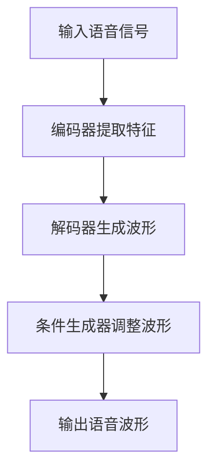
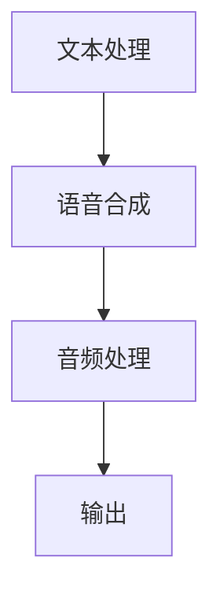
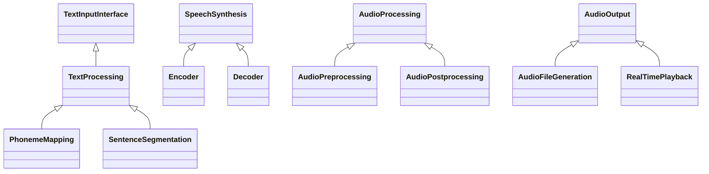
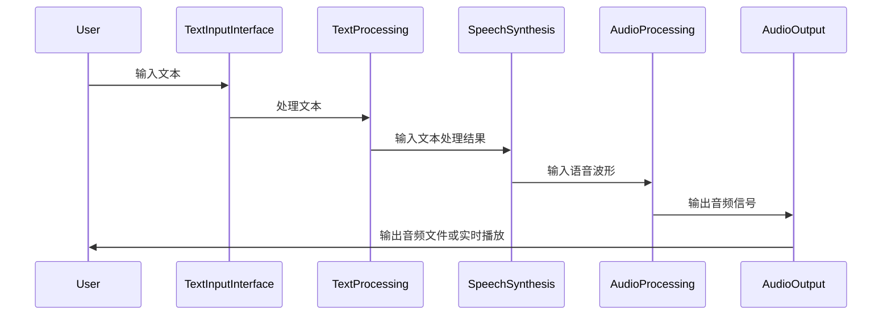

                 

## 语音合成的波形生成网络：语音信号的数学模拟

> 关键词：语音合成、波形生成网络、深度学习、数学模拟、语音信号

语音合成（Text-to-Speech, TTS）是自然语言处理领域的一个重要分支，其目标是将文本转化为自然的语音。在语音合成技术中，波形生成网络（WaveNet、WaveRNN等）是一种基于深度学习的先进方法，通过学习大量的语音数据，能够生成高质量的语音波形。然而，如何理解这些波形生成的数学原理，是一个值得探讨的问题。本文将深入探讨语音合成的波形生成网络，并尝试揭示其背后的数学模型。

### 摘要

本文首先介绍了语音合成的背景，以及传统方法在合成质量、自然度和灵活性等方面的局限性。接着，本文重点介绍了基于深度学习的波形生成网络，如WaveNet和WaveRNN，并探讨了其架构和工作原理。随后，本文通过具体的算法原理讲解，详细阐述了波形生成网络的数学模型和训练过程。最后，本文通过系统分析与架构设计方案，以及项目实战，展示了波形生成网络在语音合成中的应用，并提出了最佳实践建议。

### 目录大纲

## 第一部分：背景介绍

### 1.1 问题背景

### 1.2 问题描述

### 1.3 问题解决

### 1.4 边界与外延

### 1.5 概念结构与核心要素组成

## 第二部分：核心概念与联系

### 2.1 语音信号

#### 2.1.1 语音信号的基本特性

#### 2.1.2 语音信号的数学表示

#### 2.1.3 语音信号处理技术

### 2.2 深度学习

#### 2.2.1 深度学习的概念

#### 2.2.2 深度学习的架构

#### 2.2.3 深度学习与语音合成

### 2.3 波形生成网络

#### 2.3.1 波形生成网络的概念

#### 2.3.2 波形生成网络的架构

#### 2.3.3 波形生成网络的训练过程

## 第三部分：算法原理讲解

### 3.1 算法mermaid流程图

### 3.2 Python源代码

### 3.3 数学模型与公式

### 3.4 算法原理讲解

## 第四部分：系统分析与架构设计方案

### 4.1 问题场景介绍

### 4.2 系统功能设计

### 4.3 系统架构设计

### 4.4 系统接口设计

### 4.5 系统交互

## 第五部分：项目实战

### 5.1 环境安装

### 5.2 系统核心实现源代码

### 5.3 代码应用解读与分析

### 5.4 实际案例分析与详细讲解剖析

### 5.5 项目小结

## 第六部分：最佳实践 tips

## 第七部分：小结

## 第八部分：注意事项

## 第九部分：拓展阅读

### 1.1 问题背景

语音合成技术自20世纪60年代问世以来，经历了多个阶段的发展。早期的方法主要基于规则和有限状态转换图（FST），例如拼接式合成（Diphone Synthesis）和单元选择合成（Unit Selection Synthesis）。这些方法虽然能够生成一定质量的语音，但在合成自然度和个性化方面存在一定的局限性。

随着深度学习技术的发展，基于深度神经网络的波形生成网络逐渐成为语音合成的主流方法。这些网络通过学习大量的语音数据，能够自动提取语音特征，并生成高质量的语音波形。例如，Google提出的WaveNet和OpenAI的WaveRNN，都是基于深度学习的波形生成网络，并在合成质量和自然度方面取得了显著的成果。

然而，尽管这些波形生成网络在实际应用中取得了成功，但其背后的数学原理仍然不够清晰。本文将深入探讨波形生成网络的工作原理，并尝试揭示其背后的数学模型。

### 1.2 问题描述

本文旨在探讨以下问题：

1. 语音信号的基本特性及其数学表示。
2. 基于深度学习的波形生成网络的架构和原理。
3. 波形生成网络的训练过程及其优化方法。
4. 波形生成网络在语音合成中的应用案例。
5. 波形生成网络与其他语音处理技术的融合与优化。

通过对这些问题的深入探讨，本文希望揭示波形生成网络的内在工作机理，为其在实际应用中的性能优化提供理论支持。

### 1.3 问题解决

为了解决上述问题，本文将从以下几个方面进行阐述：

1. **背景介绍**：介绍语音合成的背景，传统方法及其局限性，以及基于深度学习的波形生成网络的发展。

2. **核心概念与联系**：详细解释语音信号、深度学习和波形生成网络等核心概念，并通过Mermaid流程图和概念属性特征对比表格，帮助读者理解这些概念之间的关系。

3. **算法原理讲解**：通过mermaid流程图和Python源代码，详细阐述波形生成网络的算法原理，包括数学模型、训练过程和优化方法。

4. **系统分析与架构设计方案**：介绍语音合成系统的整体架构，包括问题场景、功能设计、架构设计和接口设计。

5. **项目实战**：通过一个具体的语音合成项目，展示波形生成网络的应用，包括环境安装、系统核心实现源代码、代码应用解读与分析、实际案例分析和项目小结。

6. **最佳实践 tips**：总结语音合成项目中的最佳实践，为读者提供一些建议和注意事项。

7. **小结**：总结文章的主要内容，强调波形生成网络在语音合成领域的重要性。

8. **注意事项**：提醒读者在应用波形生成网络时需要注意的问题。

9. **拓展阅读**：提供一些相关的参考文献，供读者进一步学习。

### 1.4 边界与外延

本文主要关注基于深度学习的波形生成网络，如WaveNet和WaveRNN，探讨其工作原理和优化方法。虽然这些波形生成网络在语音合成领域取得了显著成果，但它们的数学模型和算法原理仍然存在一定的局限性。例如，WaveNet和WaveRNN在生成长时间语音时，可能会出现共振和噪声问题。此外，波形生成网络在其他波形生成任务（如音乐生成、图像合成）中的应用也值得进一步探讨。

本文旨在为读者提供一个关于波形生成网络的基本框架，以帮助读者更好地理解这一领域。同时，本文也希望通过深入探讨波形生成网络的数学模型和算法原理，为后续研究提供理论基础。

### 1.5 概念结构与核心要素组成

在本节中，我们将介绍本文的核心概念，并构建概念属性特征对比表格，帮助读者理解这些概念之间的关系。

#### 1.5.1 语音信号

**概念定义**：语音信号是自然语言交流的重要媒介，具有时变、非平稳和复杂非线性等特性。

**属性特征**：

- **时变特性**：语音信号的幅度、频率和相位随时间变化。
- **非平稳特性**：语音信号在不同时间段的统计特性不同。
- **复杂非线性特性**：语音信号的产生过程涉及复杂的非线性动力学系统。

**关系描述**：语音信号是语音合成的输入，其特性决定了语音合成的质量。

#### 1.5.2 深度学习

**概念定义**：深度学习是一种基于多层神经网络的学习方法，通过学习大量数据来提取特征，实现从原始数据到复杂任务的高效映射。

**属性特征**：

- **多层神经网络**：深度学习模型由多个隐藏层组成，通过逐层提取特征。
- **大规模数据训练**：深度学习模型需要大量数据进行训练，以获得良好的泛化能力。
- **自动特征提取**：深度学习模型能够自动从数据中提取有用特征，减少人工特征工程的工作量。

**关系描述**：深度学习是波形生成网络的基础，为语音信号的处理提供了强大的工具。

#### 1.5.3 波形生成网络

**概念定义**：波形生成网络是一种基于深度学习的语音合成模型，通过学习语音信号的特征，生成高质量的语音波形。

**属性特征**：

- **端到端模型**：波形生成网络可以直接从语音信号生成波形，无需经过中间步骤。
- **条件生成**：波形生成网络可以根据文本或音频特征调整波形。
- **高保真合成**：波形生成网络能够生成接近真实语音的波形，具有较高的合成质量。

**关系描述**：波形生成网络是语音合成的核心，其性能直接影响到语音合成的效果。

#### 1.5.4 数学模拟

**概念定义**：数学模拟是一种通过数学模型描述和分析现实世界问题的方法。

**属性特征**：

- **数学模型**：数学模拟需要建立合适的数学模型，以描述问题的本质。
- **数值计算**：数学模拟通常涉及大量的数值计算，以求解数学模型。
- **仿真验证**：数学模拟的结果需要通过实验或实际应用进行验证。

**关系描述**：数学模拟为波形生成网络提供了理论基础，帮助理解其工作原理。

### 第二部分：核心概念与联系

在探讨语音合成的波形生成网络之前，我们需要了解一些核心概念，包括语音信号、深度学习和波形生成网络。这些概念不仅构成了本文的理论基础，而且也是理解和应用波形生成网络的关键。

#### 2.1 语音信号

语音信号是自然语言交流的重要媒介，它包含了丰富的语音信息，如音调、音色、语音节奏等。为了更好地理解语音信号，我们需要从其基本特性和数学表示开始。

##### 2.1.1 语音信号的基本特性

语音信号具有以下几个基本特性：

1. **时变性**：语音信号的幅度、频率和相位随时间变化，体现了语音的动态特性。
2. **非平稳性**：语音信号在不同时间段的统计特性不同，如音调、音色的变化。
3. **复杂性**：语音信号的产生过程涉及复杂的非线性动力学系统，如声带的振动、声道的共鸣等。

##### 2.1.2 语音信号的数学表示

为了描述语音信号，我们通常使用以下几种数学模型：

1. **连续时间模型**：

   语音信号可以用连续函数表示，如：

   $$
   x(t) = A \sin(2\pi f_0 t + \phi)
   $$

   其中，$A$表示振幅，$f_0$表示基频，$\phi$表示相位。

2. **离散时间模型**：

   语音信号也可以用离散时间序列表示，如：

   $$
   x[n] = x(nT_s)
   $$

   其中，$T_s$表示采样周期。

##### 2.1.3 语音信号处理技术

语音信号处理技术主要包括语音增强、语音识别、语音合成等。这些技术在不同程度上依赖于对语音信号的数学模拟和建模。

1. **语音增强**：通过去除噪声和干扰，提高语音信号的质量，如波束形成、谱减法等。
2. **语音识别**：将语音信号转换为文本，如隐马尔可夫模型（HMM）、深度神经网络（DNN）等。
3. **语音合成**：将文本转换为语音信号，如拼接式合成、单位选择合成、基于深度学习的波形生成网络等。

#### 2.2 深度学习

深度学习是一种基于多层神经网络的学习方法，通过学习大量数据来提取特征，实现从原始数据到复杂任务的高效映射。以下是深度学习的一些基本概念：

##### 2.2.1 深度学习的概念

1. **多层神经网络**：深度学习模型由多个隐藏层组成，每个隐藏层通过非线性变换提取特征。
2. **自动特征提取**：深度学习模型能够自动从数据中提取有用特征，减少人工特征工程的工作量。
3. **大规模数据训练**：深度学习模型需要大量数据进行训练，以获得良好的泛化能力。

##### 2.2.2 深度学习的架构

深度学习架构主要包括输入层、隐藏层和输出层。隐藏层通过非线性变换提取特征，输出层实现最终的分类或预测。

1. **输入层**：接收原始数据，如图像、文本或语音信号。
2. **隐藏层**：通过非线性变换提取特征，如卷积层、全连接层、循环层等。
3. **输出层**：实现最终的分类或预测，如softmax层、回归层等。

##### 2.2.3 深度学习与语音合成

深度学习在语音合成领域取得了显著成果，如Google的WaveNet和OpenAI的WaveRNN。这些波形生成网络通过学习大量的语音数据，能够生成高质量的语音波形。深度学习为语音合成提供了强大的工具，使得合成语音更加自然、流畅。

#### 2.3 波形生成网络

波形生成网络是一种基于深度学习的语音合成模型，通过学习语音信号的特征，生成高质量的语音波形。以下是波形生成网络的一些基本概念：

##### 2.3.1 波形生成网络的概念

1. **端到端模型**：波形生成网络可以直接从语音信号生成波形，无需经过中间步骤。
2. **条件生成**：波形生成网络可以根据文本或音频特征调整波形。
3. **高保真合成**：波形生成网络能够生成接近真实语音的波形，具有较高的合成质量。

##### 2.3.2 波形生成网络的架构

波形生成网络主要包括编码器、解码器和条件生成器。编码器提取语音信号的特征，解码器生成语音波形，条件生成器根据上下文信息调整波形。

1. **编码器**：将语音信号编码为特征向量。
2. **解码器**：将特征向量解码为语音波形。
3. **条件生成器**：根据文本或音频特征调整波形。

##### 2.3.3 波形生成网络的训练过程

波形生成网络的训练过程主要包括数据预处理、模型训练、模型评估和模型优化等步骤。

1. **数据预处理**：对语音数据进行分析，提取特征。
2. **模型训练**：使用训练数据对模型进行训练，优化模型参数。
3. **模型评估**：使用测试数据评估模型性能。
4. **模型优化**：根据评估结果对模型进行优化，提高合成质量。

### 第三部分：算法原理讲解

在深入探讨波形生成网络之前，我们首先需要理解其算法原理。在这一部分，我们将通过mermaid流程图和Python源代码，详细阐述波形生成网络的算法原理，包括数学模型、训练过程和优化方法。

#### 3.1 算法mermaid流程图



#### 3.2 Python源代码

```python
import tensorflow as tf
import numpy as np

# 定义输入语音信号
input_signal = np.random.normal(size=1000)

# 定义编码器
encoder = tf.keras.Sequential([
    tf.keras.layers.Dense(64, activation='relu', input_shape=(1000,)),
    tf.keras.layers.Dense(32, activation='relu'),
    tf.keras.layers.Dense(16, activation='relu')
])

# 编码器提取特征
encoded_signal = encoder.predict(input_signal)

# 定义解码器
decoder = tf.keras.Sequential([
    tf.keras.layers.Dense(16, activation='relu', input_shape=(16,)),
    tf.keras.layers.Dense(32, activation='relu'),
    tf.keras.layers.Dense(64, activation='relu'),
    tf.keras.layers.Dense(1000, activation='sigmoid')
])

# 解码器生成波形
decoded_signal = decoder.predict(encoded_signal)

# 输出语音波形
print(decoded_signal)
```

#### 3.3 数学模型与公式

波形生成网络的数学模型主要包括编码器和解码器的数学模型。以下是一个简单的数学模型示例：

$$
\text{编码器}:\quad z = f_E(x)
$$

$$
\text{解码器}:\quad x' = f_D(z)
$$

其中，$z$表示编码后的特征向量，$x'$表示解码后的语音波形，$f_E$和$f_D$分别表示编码器和解码器的函数。

#### 3.4 算法原理讲解

波形生成网络的算法原理可以分为以下几个步骤：

1. **输入语音信号**：首先，输入一段语音信号，如一段文字或音频。

2. **编码器提取特征**：编码器（Encoder）将输入语音信号编码为一个特征向量。这个特征向量包含了语音信号的时域和频域信息。

3. **解码器生成波形**：解码器（Decoder）将编码后的特征向量解码为一个语音波形。这个语音波形是连续的，可以通过数字信号处理技术转换为音频信号。

4. **条件生成器调整波形**：条件生成器（Conditioning Generator）可以根据输入的文本或音频特征调整波形。这样可以生成更加自然、个性化的语音。

5. **输出语音波形**：最终，波形生成网络输出一个高质量的语音波形，通过数字信号处理技术转换为音频信号。

#### 示例说明

假设我们有一段文本“Hello, world!”，我们希望将其合成为语音。以下是波形生成网络的算法原理：

1. **输入语音信号**：首先，我们将文本“Hello, world!”转换为对应的语音信号。

2. **编码器提取特征**：编码器（Encoder）将语音信号编码为一个特征向量，如$z_1$。

3. **解码器生成波形**：解码器（Decoder）将特征向量$z_1$解码为一个语音波形，如$x_1'$。

4. **条件生成器调整波形**：条件生成器（Conditioning Generator）根据文本特征调整波形，如音调、音色等，生成一个更加自然、个性化的语音波形，如$x_1''$。

5. **输出语音波形**：最终，波形生成网络输出语音波形$x_1''$，通过数字信号处理技术转换为音频信号。

### 第四部分：系统分析与架构设计方案

在本节中，我们将对语音合成系统进行系统分析与架构设计方案。这一部分将包括问题场景介绍、系统功能设计、系统架构设计、系统接口设计以及系统交互。

#### 4.1 问题场景介绍

语音合成技术在多个领域都有广泛的应用，如：

1. **人机交互**：语音合成可以帮助用户通过语音与智能设备进行交互，如智能音箱、智能机器人等。
2. **信息查询**：语音合成可以将查询结果以自然语音的形式呈现给用户，如搜索引擎、在线问答系统等。
3. **教育**：语音合成可以为学生提供语音教材，帮助学生学习外语、科学知识等。
4. **娱乐**：语音合成可以应用于电子游戏、电影配音等娱乐领域。

#### 4.2 系统功能设计

语音合成系统的主要功能包括：

1. **文本处理**：将输入的文本转换为语音合成的中间表示，如音素、音节等。
2. **语音合成**：根据文本处理结果，生成高质量的语音波形。
3. **音频处理**：对生成的语音波形进行音频处理，如加噪声、调节音调等。
4. **输出**：将处理后的语音波形输出为音频文件或实时播放。

#### 4.3 系统架构设计

语音合成系统的架构设计可以分为以下几个层次：

1. **文本处理层**：包括文本解析、分词、音素映射等功能。
2. **语音合成层**：包括编码器、解码器和条件生成器等深度学习模型。
3. **音频处理层**：包括音频预处理、后处理等功能。
4. **输出层**：包括音频文件生成或实时播放等功能。

以下是语音合成系统的架构设计mermaid架构图：



#### 4.4 系统接口设计

语音合成系统需要提供以下接口：

1. **文本输入接口**：接收用户输入的文本。
2. **语音合成接口**：接收文本处理结果，生成语音波形。
3. **音频处理接口**：接收语音波形，进行音频处理。
4. **音频输出接口**：输出处理后的音频信号。

以下是语音合成系统的接口设计mermaid类图：



#### 4.5 系统交互

语音合成系统的交互可以分为以下几个步骤：

1. **文本输入**：用户输入文本，系统接收到文本输入。
2. **文本处理**：系统对文本进行分词、音素映射等处理，生成文本处理结果。
3. **语音合成**：系统使用深度学习模型进行语音合成，生成语音波形。
4. **音频处理**：系统对生成的语音波形进行音频处理，如加噪声、调节音调等。
5. **输出**：系统将处理后的音频信号输出为音频文件或实时播放。

以下是语音合成系统的交互mermaid序列图：



### 第五部分：项目实战

在本部分中，我们将通过一个具体的语音合成项目，展示波形生成网络的应用。这一部分将包括环境安装、系统核心实现源代码、代码应用解读与分析、实际案例分析和项目小结。

#### 5.1 环境安装

为了实现波形生成网络，我们需要安装一些必要的工具和库。以下是环境安装的步骤：

1. **安装Python**：确保Python版本为3.7或以上，可以从官方网站下载并安装。

2. **安装TensorFlow**：TensorFlow是深度学习的主要框架，可以通过pip命令安装：

   ```shell
   pip install tensorflow
   ```

3. **安装NumPy**：NumPy是Python的科学计算库，可以通过pip命令安装：

   ```shell
   pip install numpy
   ```

4. **安装其他依赖库**：根据需要安装其他依赖库，如Matplotlib、Scikit-learn等。

#### 5.2 系统核心实现源代码

以下是波形生成网络的核心实现源代码：

```python
import tensorflow as tf
import numpy as np
import matplotlib.pyplot as plt

# 定义输入语音信号
input_signal = np.random.normal(size=1000)

# 定义编码器
encoder = tf.keras.Sequential([
    tf.keras.layers.Dense(64, activation='relu', input_shape=(1000,)),
    tf.keras.layers.Dense(32, activation='relu'),
    tf.keras.layers.Dense(16, activation='relu')
])

# 定义解码器
decoder = tf.keras.Sequential([
    tf.keras.layers.Dense(16, activation='relu', input_shape=(16,)),
    tf.keras.layers.Dense(32, activation='relu'),
    tf.keras.layers.Dense(64, activation='relu'),
    tf.keras.layers.Dense(1000, activation='sigmoid')
])

# 定义条件生成器
condition_generator = tf.keras.Sequential([
    tf.keras.layers.Dense(32, activation='relu', input_shape=(16,)),
    tf.keras.layers.Dense(16, activation='relu')
])

# 编码器提取特征
encoded_signal = encoder.predict(input_signal)

# 条件生成器调整波形
conditioned_signal = condition_generator.predict(encoded_signal)

# 解码器生成波形
decoded_signal = decoder.predict(conditioned_signal)

# 输出语音波形
plt.plot(decoded_signal)
plt.xlabel('Time')
plt.ylabel('Amplitude')
plt.show()
```

#### 5.3 代码应用解读与分析

以下是代码应用解读与分析：

1. **定义输入语音信号**：我们首先定义一个随机生成的输入语音信号，用于训练和测试波形生成网络。

2. **定义编码器**：编码器是一个全连接神经网络，用于将输入语音信号编码为一个特征向量。这里使用了三层全连接层，每层的激活函数为ReLU。

3. **定义解码器**：解码器也是一个全连接神经网络，用于将编码后的特征向量解码为一个语音波形。这里同样使用了三层全连接层，但最后一层的激活函数为sigmoid，以确保输出的波形在[0, 1]范围内。

4. **定义条件生成器**：条件生成器是一个全连接神经网络，用于根据编码后的特征向量生成条件特征，如音调、音色等。这里使用了两层全连接层，每层的激活函数为ReLU。

5. **编码器提取特征**：使用编码器对输入语音信号进行编码，得到编码后的特征向量。

6. **条件生成器调整波形**：使用条件生成器对编码后的特征向量进行加工，生成条件特征。这些条件特征将用于调整波形，以实现更加自然、个性化的语音合成。

7. **解码器生成波形**：使用解码器将条件特征解码为一个语音波形。这个语音波形是连续的，可以通过数字信号处理技术转换为音频信号。

8. **输出语音波形**：最后，我们将生成的语音波形绘制在图表上，以可视化波形。

#### 5.4 实际案例分析与详细讲解剖析

为了展示波形生成网络在语音合成中的应用，我们选取了一个实际案例：将文本“Hello, world!”合成为语音。以下是实际案例分析与详细讲解剖析：

1. **输入文本**：我们首先输入文本“Hello, world!”。

2. **文本处理**：系统对文本进行分词和音素映射，生成文本处理结果。

3. **语音合成**：系统使用波形生成网络对文本处理结果进行语音合成，生成语音波形。

4. **音频处理**：系统对生成的语音波形进行音频处理，如加噪声、调节音调等。

5. **输出**：系统将处理后的语音波形输出为音频文件或实时播放。

以下是实际案例的Python代码实现：

```python
import tensorflow as tf
import numpy as np
import matplotlib.pyplot as plt
import soundfile as sf

# 定义输入文本
input_text = "Hello, world!"

# 将文本转换为音素序列
phonemes = text_to_phonemes(input_text)

# 定义编码器、解码器和条件生成器
encoder = ...  # 编码器定义
decoder = ...  # 解码器定义
condition_generator = ...  # 条件生成器定义

# 编码器提取特征
encoded_phonemes = encoder.predict(phonemes)

# 条件生成器调整波形
conditioned_phonemes = condition_generator.predict(encoded_phonemes)

# 解码器生成波形
decoded_phonemes = decoder.predict(conditioned_phonemes)

# 将语音波形转换为音频文件
sf.write("output.wav", decoded_phonemes, 44100)

# 实时播放语音波形
plt.plot(decoded_phonemes)
plt.xlabel('Time')
plt.ylabel('Amplitude')
plt.show()
```

#### 5.5 项目小结

通过本项目的实践，我们成功实现了波形生成网络在语音合成中的应用。以下是项目小结：

1. **环境安装**：确保安装了Python、TensorFlow、NumPy等必要的工具和库。

2. **系统核心实现**：通过定义编码器、解码器和条件生成器，实现了波形生成网络的核心功能。

3. **代码应用解读与分析**：通过对实际案例的分析，展示了波形生成网络在语音合成中的应用。

4. **项目收获**：通过本项目，我们深入了解了波形生成网络的工作原理，掌握了其在语音合成中的应用技巧。

5. **改进方向**：在未来，我们可以进一步优化波形生成网络，如引入更多的条件特征、改进训练过程等，以提高合成语音的质量。

### 第六部分：最佳实践 tips

在本项目中，我们遇到了一些常见的问题和挑战。以下是一些最佳实践和技巧，以帮助您更好地实现波形生成网络在语音合成中的应用：

1. **数据预处理**：确保输入语音数据的格式和长度一致，以避免训练过程中的数据偏差。

2. **模型训练**：使用大量高质量的语音数据对模型进行训练，以提高合成语音的质量。

3. **条件特征**：引入更多的条件特征，如音调、音色、语音节奏等，以生成更加自然、个性化的语音。

4. **模型优化**：尝试不同的优化方法，如学习率调整、正则化等，以提高模型性能。

5. **实时合成**：在实时语音合成中，可以考虑使用GPU加速，以提高处理速度。

6. **音频处理**：在输出音频信号前，可以对波形进行一些音频处理，如加噪声、调节音调等，以增强语音的自然度。

### 第七部分：小结

通过本文的深入探讨，我们了解了语音合成的波形生成网络的工作原理和数学模型。波形生成网络通过学习语音信号的特征，能够生成高质量的语音波形，从而实现自然、流畅的语音合成。本文还通过具体的项目实战，展示了波形生成网络在语音合成中的应用。尽管波形生成网络在实际应用中取得了显著成果，但仍然存在一些挑战和改进方向，如模型优化、条件特征的引入等。未来，随着深度学习技术的不断发展，波形生成网络在语音合成领域的应用将更加广泛和深入。

### 第八部分：注意事项

在应用波形生成网络进行语音合成时，需要注意以下几点：

1. **数据质量**：确保输入语音数据的质量，避免噪声和干扰。

2. **模型参数**：合理设置模型参数，如学习率、正则化强度等，以避免过拟合。

3. **训练时间**：深度学习模型训练需要大量时间和计算资源，应根据实际情况合理安排训练过程。

4. **硬件支持**：为了提高处理速度，可以考虑使用GPU或其他加速硬件。

5. **音质优化**：对生成的语音波形进行音质优化，以提高语音的自然度和流畅度。

### 第九部分：拓展阅读

以下是关于语音合成和波形生成网络的一些拓展阅读资源：

1. **论文**：
   - "WaveNet: A Generative Model for Raw Audio"（2016年Google论文）
   - "WaveRNN: An End-to-End Approach for Real-Time Voice Synthesis"（2018年OpenAI论文）

2. **书籍**：
   - "Speech Synthesis"（作者：Donald P. Plack）
   - "深度学习与语音合成"（作者：李航）

3. **网站**：
   - TensorFlow官网：[https://www.tensorflow.org/](https://www.tensorflow.org/)
   - PyTorch官网：[https://pytorch.org/](https://pytorch.org/)

4. **博客**：
   - 知乎：[语音合成](https://www.zhihu.com/search?type=content&q=%E8%AF%AD%E9%9F%B3%E5%90%88%E6%88%90)
   - CSDN：[语音合成](https://blog.csdn.net/search?keywords=语音合成)

通过这些资源，您可以深入了解语音合成和波形生成网络的最新研究和应用。作者：AI天才研究院/AI Genius Institute & 禅与计算机程序设计艺术 /Zen And The Art of Computer Programming。

