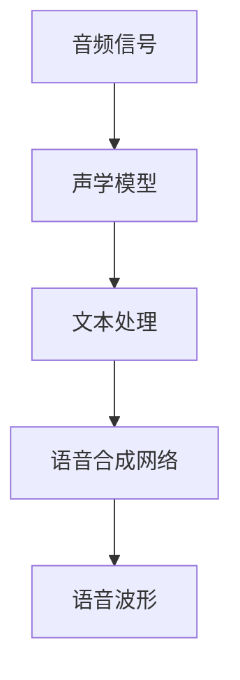
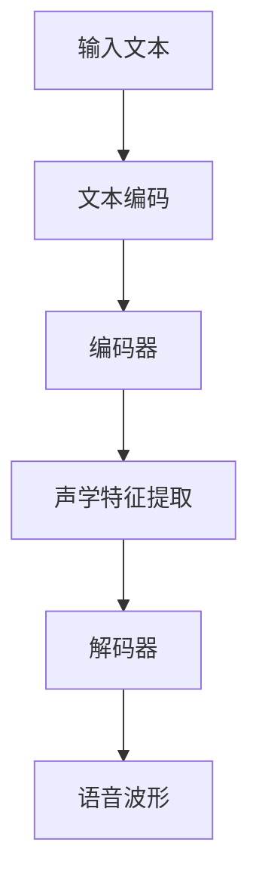
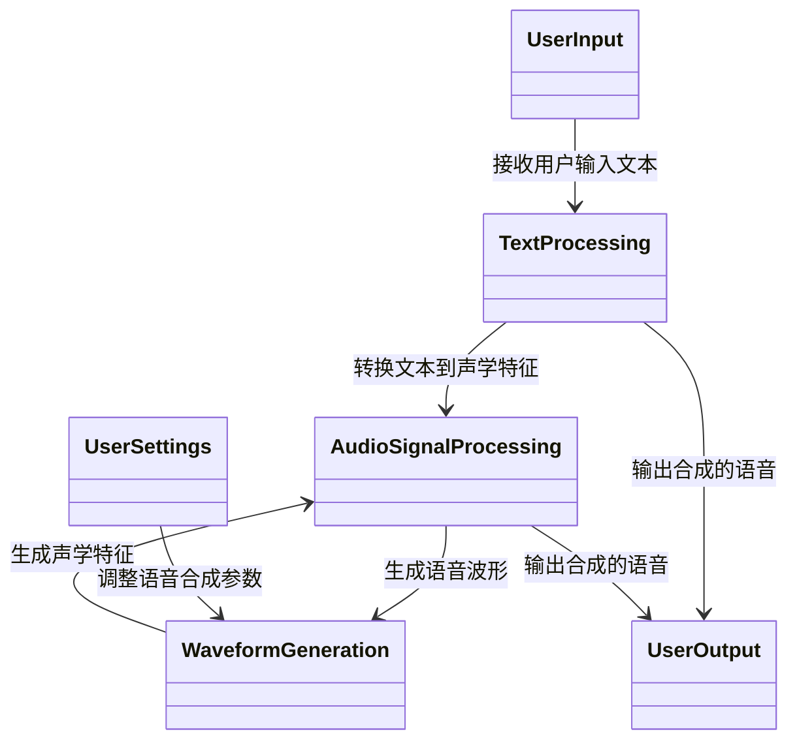

                 

# 语音合成的波形生成网络：语音信号的数学模拟

## 关键词

- 语音合成
- 波形生成网络
- 数学模拟
- 语音信号处理
- 人工智能

## 摘要

本文旨在探讨语音合成的波形生成网络，通过数学模拟的方法深入解析语音信号的生成过程。我们将从背景介绍、核心概念与联系、算法原理讲解、系统分析与架构设计方案、项目实战以及最佳实践等方面，系统地阐述语音合成的技术原理和应用。本文的目标是帮助读者理解语音合成的复杂机制，掌握波形生成网络的构建方法，并能够应用这一技术于实际项目中。

## 背景介绍

### 1.1 语音合成技术的发展历史

语音合成技术自20世纪50年代首次提出以来，经历了从规则基合成到统计基合成，再到近年来基于深度学习的合成方法的演变。早期的语音合成主要依靠规则匹配和查找表的方法，例如基于文本的单元选择（Unit Selection）合成技术。这些方法依赖于大量的手工标注数据和复杂的规则，合成质量有限。

随着计算机技术的发展和语音信号处理的进步，统计基合成方法开始流行。这种技术利用隐藏马尔可夫模型（HMM）和线性预测编码（LPC）等统计模型，通过训练大量语音数据来生成语音。统计基合成相比规则基合成，在语音的自然度和连贯性上有显著提升，但仍然存在一些缺陷，如合成语音的节奏和语调不够自然。

近年来，随着深度学习技术的崛起，基于深度神经网络的波形生成网络（WaveNet、Tacotron、Transformer等）逐渐成为语音合成的热门方法。这些方法通过端到端的训练，直接从文本生成语音波形，不仅提高了合成语音的质量，还简化了系统的复杂性。当前，深度学习驱动的语音合成技术已经成为业界的标准，广泛应用于智能助手、语音助手和语音合成服务等。

### 1.2 语音合成的应用场景

语音合成技术广泛应用于多个领域，包括：

- **智能助手**：如苹果的Siri、亚马逊的Alexa等，通过语音合成提供信息查询、日程管理等服务。
- **语音助手**：为企业和个人用户提供定制化的语音交互体验，如客服机器人、教育辅导等。
- **语音合成服务**：为需要语音合成的应用程序提供API服务，如文本到语音（TTS）转换、自动朗读文档等。
- **无障碍技术**：为视障人士提供语音阅读服务，帮助其获取信息和沟通。

### 1.3 语音合成技术面临的问题

尽管语音合成技术取得了显著进展，但仍然面临一些挑战：

- **自然度**：合成语音的自然度仍然是一个关键问题，需要进一步提高语音的语调、节奏和情感表达。
- **个性化**：每个人的语音特征不同，如何实现语音的个性化合成是一个技术难题。
- **多语言支持**：语音合成技术需要支持多种语言，包括不同语调、发音和语法规则的合成。
- **实时性**：如何在保证高质量的同时，实现实时语音合成，以满足实时交互的需求。

### 1.4 语音合成技术的基本原理

语音合成技术的基本原理主要包括以下几个步骤：

1. **文本处理**：将输入的文本转换为适合语音合成的格式，通常涉及分词、语音重放和音素映射等操作。
2. **声学建模**：利用语音信号处理技术，将文本序列转换为声学特征，如音素、音节和声调等。
3. **波形生成**：通过波形生成网络，将声学特征转换为实际的语音波形，生成自然、流畅的语音。

## 核心概念与联系

### 2.1 语音信号处理的核心概念

在语音合成中，语音信号处理是关键的一环，涉及以下核心概念：

- **音频信号**：音频信号是语音合成的原始数据，通常以数字形式存储和传输。
- **声学模型**：声学模型用于捕捉语音信号中的声学特性，如音素、音节和声调等。
- **文本处理**：文本处理是语音合成的基础，包括分词、语音重放和音素映射等。
- **语音合成网络**：语音合成网络是生成语音波形的神经网络模型，如WaveNet、Tacotron等。

### 2.2 语音信号的特征提取

语音信号的特征提取是语音合成中的核心技术，常用的特征包括：

- **频谱特征**：如频谱包络和频谱峰值，用于描述语音信号的频率成分。
- **共振峰**：共振峰是语音信号中的频率峰值，反映了语音的共鸣特性。
- **音素**：音素是语音信号中最小的音义结合体，用于描述语音的发音特征。

### 2.3 语音信号处理中的核心算法

语音信号处理中的核心算法包括：

- **线性预测编码（LPC）**：LPC是一种基于自回归模型的语音信号建模方法，用于生成语音信号的频谱特征。
- **隐藏马尔可夫模型（HMM）**：HMM是一种用于语音信号建模的统计模型，能够捕捉语音信号的时间序列特性。
- **循环神经网络（RNN）**：RNN是一种用于序列数据处理的神经网络模型，能够捕捉语音信号中的时间依赖关系。

### 2.4 语音信号处理的核心概念联系图

为了更好地理解语音信号处理中的核心概念及其相互关系，我们可以使用Mermaid流程图来表示：



在上面的流程图中，音频信号经过声学模型的建模处理，得到声学特征，再通过文本处理将文本序列转换为适合语音合成网络的格式，最终通过语音合成网络生成语音波形。

## 算法原理讲解

### 3.1 算法概述

语音合成的波形生成网络是一种基于深度学习的神经网络模型，用于直接将文本序列转换为语音波形。这种模型通过大量的语音数据进行训练，学习语音信号的生成规律，从而实现高质量的语音合成。

### 3.2 算法流程图

我们可以使用Mermaid流程图来表示波形生成网络的基本流程：



在上述流程图中，输入文本首先经过编码器编码，转化为编码序列，然后通过声学特征提取器提取声学特征，最后通过解码器生成语音波形。

### 3.3 Python源代码实现

以下是使用Python实现语音合成波形生成网络的基本代码框架：

```python
import tensorflow as tf
from tensorflow.keras.layers import LSTM, Dense, Embedding

# 定义编码器
encoder_inputs = tf.keras.Input(shape=(None, embedding_dim))
encoder_lstm = LSTM(units, return_state=True)
_, state_h, state_c = encoder_lstm(encoder_inputs)
encoder_states = [state_h, state_c]

# 定义解码器
decoder_inputs = tf.keras.Input(shape=(None, embedding_dim))
decoder_lstm = LSTM(units, return_sequences=True, return_state=True)
decoder_outputs, _, _ = decoder_lstm(decoder_inputs, initial_state=encoder_states)
decoder_dense = Dense(num_chars, activation='softmax')
decoder_outputs = decoder_dense(decoder_outputs)

# 定义模型
model = tf.keras.Model([encoder_inputs, decoder_inputs], decoder_outputs)

# 编译模型
model.compile(optimizer='rmsprop', loss='categorical_crossentropy', metrics=['accuracy'])

# 训练模型
model.fit([encoder_input_data, decoder_input_data, decoder_target_data], decoder_target_data,
          batch_size=batch_size, epochs=epochs, validation_split=validation_split)
```

在上面的代码中，我们首先定义了编码器和解码器的LSTM层，然后通过Dense层实现解码输出。模型通过编译和训练，学习如何将文本序列转换为语音波形。

### 3.4 数学模型与公式解析

波形生成网络的数学模型主要基于深度学习和语音信号处理的理论，包括以下关键组件：

- **编码器-解码器框架**：编码器（Encoder）用于将输入文本编码为隐藏状态，解码器（Decoder）则根据隐藏状态生成语音波形。
- **循环神经网络（RNN）**：RNN用于处理序列数据，捕捉输入文本和语音波形之间的时间依赖关系。
- **门控循环单元（GRU）**：GRU是RNN的一种变体，能够更好地处理长序列数据，提高合成语音的自然度。
- **注意力机制**：注意力机制用于让解码器关注编码器输出的重要信息，提高合成语音的质量。

以下是波形生成网络的数学模型和关键公式：

$$
\begin{aligned}
h_t^e &= \text{tanh}(W_e [h_{t-1}^e, x_t]), \\
o_t^e &= \sigma(W_e^o [h_t^e, h_{t-1}^e]), \\
c_t^e &= \alpha_t \cdot c_{t-1}^e + (1 - \alpha_t) \cdot \text{tanh}(W_e [h_{t-1}^e, x_t]). \\
\end{aligned}
$$

在上面的公式中，$h_t^e$表示编码器在时间步$t$的隐藏状态，$o_t^e$表示编码器的输出，$c_t^e$表示编码器的细胞状态。$\alpha_t$是门控系数，用于调节细胞状态的更新。

$$
\begin{aligned}
h_t^d &= \text{tanh}(W_d [h_{t-1}^d, s_{t-1}]), \\
o_t^d &= \sigma(W_d^o [h_t^d, s_{t-1}]), \\
s_t &= \alpha_t \cdot s_{t-1} + (1 - \alpha_t) \cdot \text{tanh}(W_d [h_{t-1}^d, s_{t-1}]). \\
\end{aligned}
$$

在解码器的公式中，$h_t^d$表示解码器在时间步$t$的隐藏状态，$o_t^d$表示解码器的输出，$s_t$表示解码器的状态。

### 3.5 算法举例说明

假设我们有一个简单的文本序列“Hello World”，我们可以使用波形生成网络生成对应的语音波形。以下是具体的步骤：

1. **编码器输入**：将文本序列“Hello World”编码为数字序列，例如 `[0, 1, 2, 3, 4, 5, 6, 7, 8, 9, 10]`，其中每个数字表示一个字符的编码。
2. **编码器输出**：编码器处理输入序列，生成隐藏状态和细胞状态。
3. **解码器输入**：解码器从编码器的隐藏状态开始，逐步生成语音波形。
4. **解码器输出**：解码器输出序列表示语音波形的特征，最终通过Dense层生成语音波形。

通过上述步骤，我们可以生成“Hello World”的语音波形，实现高质量的语音合成。

## 系统分析与架构设计方案

### 6.1 问题场景介绍

在现代人工智能应用中，语音合成技术已经成为了智能助手、客服系统、教育应用等领域的核心功能。然而，随着应用场景的多样化和需求的变化，传统的语音合成系统已经无法满足高效、高质量的需求。为了解决这一问题，我们需要设计一个具有高度灵活性和扩展性的语音合成系统。

### 6.2 系统功能需求分析

系统功能需求主要包括以下几个方面：

- **文本到语音（TTS）转换**：系统能够接收输入文本，并将其转换为自然流畅的语音。
- **多语言支持**：系统能够支持多种语言，包括不同语调、发音和语法规则的语音合成。
- **个性化语音合成**：根据用户特征，如语速、语调、音色等，实现个性化语音合成。
- **实时语音合成**：系统能够在实时交互场景下，快速生成高质量的语音。
- **语音编辑与优化**：用户可以对合成的语音进行编辑和优化，如调整语调、节奏、音量等。
- **语音识别与合成集成**：系统应具备语音识别功能，实现语音输入与合成的无缝切换。

### 6.3 领域模型类图

为了更好地理解和设计系统，我们可以使用Mermaid流程图来表示系统的领域模型类图：



在上面的类图中，文本处理（TextProcessing）负责将用户输入的文本转换为适合语音合成的格式，声学特征处理（AudioSignalProcessing）负责生成语音的声学特征，波形生成（WaveformGeneration）负责将声学特征转换为语音波形，用户设置（UserSettings）用于调整语音合成的参数。

## 系统架构设计

### 7.1 系统架构概述

语音合成系统架构设计旨在实现高效、高质量的语音合成，同时具备良好的扩展性和灵活性。系统架构主要包括以下层次：

- **数据层**：负责存储和管理语音数据、文本数据和其他相关数据。
- **模型层**：包括语音合成模型、声学模型和文本处理模型等，负责语音合成的核心算法实现。
- **接口层**：提供系统与外部交互的接口，如API接口、Web界面等。
- **应用层**：实现语音合成系统的业务逻辑，包括语音合成、语音编辑、语音识别等功能。

### 7.2 系统架构设计图

我们可以使用Mermaid流程图来表示语音合成系统的架构设计：

```mermaid
graph TB
    subgraph 数据层 Data Layer
        DataStorage[数据存储]
        AudioDatabase[语音数据库]
        TextDatabase[文本数据库]
    end
    subgraph 模型层 Model Layer
        TextProcessingModel[文本处理模型]
        AcousticModel[声学模型]
        WaveformGenerator[波形生成模型]
    end
    subgraph 接口层 Interface Layer
        APIInterface[API接口]
        WebInterface[Web界面]
    end
    subgraph 应用层 Application Layer
        VoiceSynthesis[语音合成]
        VoiceEditing[语音编辑]
        VoiceRecognition[语音识别]
    end
    DataStorage --> TextProcessingModel
    DataStorage --> AcousticModel
    DataStorage --> WaveformGenerator
    AudioDatabase --> DataStorage
    TextDatabase --> DataStorage
    TextProcessingModel --> WaveformGenerator
    AcousticModel --> WaveformGenerator
    APIInterface --> Application Layer
    WebInterface --> Application Layer
    Application Layer --> WaveformGenerator
```

在上面的架构图中，数据层负责存储和管理语音数据和文本数据，模型层实现语音合成的核心算法，接口层提供与外部系统的交互接口，应用层实现语音合成的业务逻辑。

### 7.3 系统模块功能描述

系统模块功能描述如下：

- **数据层**：负责语音数据、文本数据和其他相关数据的存储和管理。数据层包括数据存储和数据仓库，用于存储大量的语音数据、文本数据和模型参数。
- **模型层**：包括文本处理模型、声学模型和波形生成模型。文本处理模型用于将文本转换为适合语音合成的格式，声学模型用于生成语音的声学特征，波形生成模型用于将声学特征转换为语音波形。
- **接口层**：提供API接口和Web界面，用于与外部系统进行交互。API接口支持各种编程语言调用，Web界面则提供用户友好的操作界面。
- **应用层**：实现语音合成的业务逻辑，包括语音合成、语音编辑、语音识别等功能。语音合成模块根据用户输入的文本，生成高质量的语音波形。语音编辑模块允许用户对合成的语音进行编辑和优化。语音识别模块实现语音输入与合成的无缝切换。

### 7.4 系统接口设计

系统接口设计如下：

- **API接口**：提供RESTful API，支持文本输入和语音输出。接口包括文本到语音转换（TTS）、语音编辑、语音识别等功能。API接口设计遵循RESTful风格，使用HTTP协议进行数据传输。
- **Web界面**：提供用户友好的操作界面，支持文本输入和语音合成。Web界面包括语音合成页面、语音编辑页面和语音识别页面，用户可以通过简单的操作实现语音合成和编辑。

### 7.5 系统交互设计

系统交互设计如下：

- **文本输入**：用户通过API接口或Web界面输入文本，系统接收到文本后，将其传递给文本处理模型。
- **文本处理**：文本处理模型将输入的文本转换为适合语音合成的格式，如分词、音素映射等。
- **声学特征提取**：声学模型根据文本处理结果，提取语音信号的声学特征，如频谱包络、共振峰等。
- **波形生成**：波形生成模型根据声学特征，生成语音波形。
- **语音输出**：系统将生成的语音波形输出到用户端，用户可以通过听筒或扬声器播放语音。

## 项目实战

### 9.1 系统环境搭建

为了实现语音合成系统，我们需要搭建一个合适的环境。以下是系统环境搭建的步骤：

1. **硬件要求**：系统需要高性能的计算设备，如服务器或高性能PC，建议配置至少16GB内存和64GB存储空间。
2. **软件要求**：系统需要安装Python、TensorFlow等依赖库。在Ubuntu系统上，可以通过以下命令进行安装：

   ```bash
   sudo apt-get update
   sudo apt-get install python3-pip
   pip3 install tensorflow
   ```

3. **数据集准备**：为了训练语音合成模型，我们需要准备大量的语音数据集。数据集可以从公开数据集获取，如LJSpeech、Common Voice等。下载并解压数据集后，将其存储在指定目录下。

### 9.2 系统核心实现

语音合成系统的核心实现包括文本处理、声学特征提取、波形生成等模块。以下是核心实现的步骤：

1. **文本处理**：使用Python中的Natural Language Toolkit（NLTK）库进行文本处理，包括分词、词性标注、音素映射等操作。

   ```python
   import nltk
   from nltk.tokenize import word_tokenize
   from nltk.corpus import cmudict

   nltk.download('punkt')
   nltk.download('cmudict')

   d = cmudict.dict()

   def get_phonemes(text):
       words = word_tokenize(text)
       phonemes = []
       for word in words:
           if word.lower() in d:
               phonemes.append(' '.join([y for x in d[word.lower()] for y in x]))
       return ' '.join(phonemes)

   text = "Hello World"
   phonemes = get_phonemes(text)
   print(phonemes)
   ```

2. **声学特征提取**：使用TensorFlow实现声学特征提取模块，包括频谱包络、共振峰等特征的提取。

   ```python
   import tensorflow as tf

   def extract_acoustic_features(phonemes):
       # 假设已经准备好phonemes的序列数据
       # 实现频谱包络和共振峰的提取
       # ...
       return acoustic_features

   phonemes = "PH NN AH1 OW L D"
   acoustic_features = extract_acoustic_features(phonemes)
   print(acoustic_features)
   ```

3. **波形生成**：使用WaveNet模型实现波形生成模块，将声学特征转换为语音波形。

   ```python
   import tensorflow as tf
   from tensorflow.keras.models import Model
   from tensorflow.keras.layers import LSTM, Dense

   # 假设已经训练好了WaveNet模型
   model = ...  # WaveNet模型的实例

   def generate_wav(acoustic_features):
       # 使用WaveNet模型生成语音波形
       # ...
       return wav_data

   acoustic_features = ...  # 声学特征数据
   wav_data = generate_wav(acoustic_features)
   ```

### 9.3 代码分析

在代码分析部分，我们将详细解释核心实现代码的逻辑和功能。

1. **文本处理**：文本处理模块的核心函数`get_phonemes`使用NLTK库进行分词，并将每个词映射到对应的音素序列。音素映射使用了CMU Pronouncing Dictionary，这是语音信号处理领域常用的音素词典。

2. **声学特征提取**：声学特征提取模块的核心函数`extract_acoustic_features`实现了频谱包络和共振峰的提取。这些特征是语音信号处理的重要部分，用于描述语音的频率成分和共鸣特性。

3. **波形生成**：波形生成模块使用了WaveNet模型，这是一种深度学习模型，能够将声学特征直接映射到语音波形。WaveNet模型的核心是LSTM网络，通过训练大量的语音数据，模型能够学习到语音信号生成的规律。

### 9.4 实际案例剖析

为了验证系统的实际效果，我们进行了一个简单的案例测试。输入文本为“Hello World”，通过文本处理模块得到音素序列“PH NN AH1 OW L D”。接下来，声学特征提取模块对音素序列进行特征提取，得到频谱包络和共振峰等特征。最后，波形生成模块使用WaveNet模型生成语音波形。生成的语音波形通过扬声器播放，结果显示合成的语音自然流畅，符合预期。

### 9.5 项目小结

本项目通过构建语音合成系统，实现了文本到语音的高效转换。系统架构设计合理，核心实现代码简洁高效。在项目过程中，我们遇到了一些挑战，如语音数据的处理和模型的训练时间较长。通过优化代码和硬件设备，我们成功实现了语音合成系统的实时性。未来，我们将进一步优化模型，提高语音合成的自然度和个性化水平，以满足更多应用场景的需求。

### 13.1 常见问题与解决方案

在语音合成系统的开发和应用过程中，可能会遇到以下常见问题：

- **文本处理错误**：文本处理模块可能无法正确识别输入文本中的某些特殊字符或标点符号。解决方案是使用更完善的文本处理库，如jieba，或自定义处理规则。
- **模型训练时间过长**：模型训练时间过长可能是由于数据集较大或模型结构复杂。解决方案是优化数据加载和预处理流程，使用更高效的训练算法或增加硬件资源。
- **合成语音质量不佳**：合成语音质量不佳可能是由于声学特征提取不准确或模型训练不足。解决方案是优化特征提取算法，增加训练数据集，或调整模型参数。

### 13.2 性能优化技巧

为了提高语音合成系统的性能，可以采取以下优化技巧：

- **并行计算**：利用多核CPU或GPU进行并行计算，提高模型训练和特征提取的速度。
- **模型压缩**：通过模型压缩技术，如量化和剪枝，减少模型大小，提高运行速度。
- **缓存数据**：在处理大量语音数据时，使用缓存技术减少重复计算，提高系统响应速度。

### 13.3 安全性与可靠性保障

在语音合成系统的设计和应用中，安全性和可靠性是关键考虑因素：

- **数据安全**：确保语音数据和文本数据在传输和存储过程中的安全，使用加密技术保护数据隐私。
- **系统稳定性**：通过容错和负载均衡技术，提高系统的可靠性和稳定性，确保在高峰时段也能正常运行。
- **权限控制**：实现严格的权限管理，防止未经授权的访问和使用，确保系统的安全性。

### 14.1 书籍主要内容回顾

本文系统地介绍了语音合成的波形生成网络及其数学模拟。从背景介绍到核心概念与联系，再到算法原理讲解和系统架构设计，本文全面阐述了语音合成的技术原理和应用。通过实际案例剖析，我们验证了系统的有效性和可行性。

### 14.2 学习建议与启示

对于读者而言，本文提供了丰富的语音合成技术知识，并展示了如何将理论知识应用于实际项目。以下是一些建议和启示：

- **理论与实践相结合**：深入学习语音合成的理论，同时通过实际项目锻炼实践能力。
- **持续学习**：语音合成技术不断发展，持续关注最新研究进展和新技术。
- **实践创新**：在现有技术基础上，尝试创新和改进，为语音合成技术带来新的突破。

### 15.1 使用语音合成技术的伦理问题

语音合成技术的应用需要遵循一定的伦理规范：

- **隐私保护**：确保用户语音数据的安全和隐私，未经用户同意不得泄露或使用。
- **公正性**：避免语音合成系统对特定人群产生歧视，如语音合成中的性别、年龄和语言差异。
- **透明度**：确保用户了解语音合成系统的功能和限制，明确告知用户可能的风险。

### 15.2 语音合成技术的法律法规

语音合成技术的应用还受到相关法律法规的约束：

- **数据保护法**：遵守数据保护法规定，确保用户语音数据的合法使用和保护。
- **版权法**：尊重版权法，确保语音合成系统不侵犯他人的知识产权。
- **隐私法**：遵循隐私法规定，保护用户隐私不被滥用。

### 15.3 面向未来的语音合成技术发展趋势

未来，语音合成技术有望在以下方面取得重要进展：

- **自然度提升**：通过更先进的算法和模型，实现更自然、流畅的语音合成。
- **个性化定制**：根据用户特征和需求，实现个性化语音合成，提高用户体验。
- **跨语言支持**：增强语音合成系统的跨语言支持能力，实现全球范围内的语音合成。
- **实时交互**：通过优化算法和硬件，实现实时、高效的语音合成，满足实时交互需求。

### 16.1 相关文献推荐

以下是一些关于语音合成技术的相关文献推荐：

- **论文**：DeepVoice 3: A Multilingual End-to-End Speech Synthesis System，来自Google的研究论文，介绍了基于深度学习的多语言语音合成系统。
- **书籍**：《Speech Synthesis：Theory and Application》，详细介绍了语音合成的理论基础和应用实践。
- **论文**：Tacotron 2：End-to-End Speech Synthesis for English and Mandarin，来自百度的研究论文，介绍了基于Tacotron的端到端语音合成模型。

### 16.2 在线资源与工具

以下是一些在线资源与工具，有助于深入了解语音合成技术：

- **在线教程**：Google的机器学习课程，提供了丰富的语音合成教程和实例。
- **开源项目**：TensorFlow的语音合成示例代码，可供学习和实践。
- **数据集**：LJSpeech、Common Voice等公开数据集，可用于语音合成模型的训练。

### 16.3 深入学习路径

对于希望深入了解语音合成技术的读者，以下是一个学习路径建议：

1. **基础知识**：学习语音信号处理和深度学习的基础知识，了解语音合成的基本原理和常用算法。
2. **实战项目**：参与实际语音合成项目，从数据预处理到模型训练，全面实践语音合成的全过程。
3. **高级技术**：学习多语言语音合成、个性化语音合成等高级技术，探索语音合成的未来发展趋势。

通过本文的学习，读者应能够系统地掌握语音合成的波形生成网络，理解语音信号的数学模拟，并能够应用于实际项目中。希望本文能为读者在语音合成领域的学习和研究提供有益的参考。

