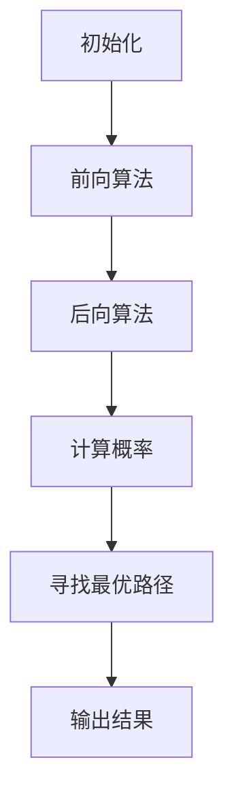
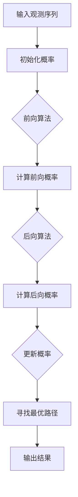

                 

# 语音识别的隐马尔可夫模型：语音信号的数学解析

## 关键词
- 语音识别
- 隐马尔可夫模型
- 数学解析
- 语音信号处理
- 状态转移
- 观测概率

## 摘要
本文旨在深入探讨语音识别领域中的隐马尔可夫模型（HMM），通过数学解析的方式揭示语音信号的处理机制。文章首先介绍了语音识别的基本概念和问题背景，然后详细阐述了隐马尔可夫模型的理论基础，包括其基本概念、数学描述和算法原理。接下来，本文通过实例分析了HMM在语音信号处理中的应用，并探讨了其在实际项目中的实现细节。最后，文章总结了HMM在语音识别中的优化方法和挑战，并对未来的发展趋势进行了展望。

## 引言与背景

### 语音识别概述

语音识别作为自然语言处理（NLP）的重要分支，旨在将人类的语音转换为机器可处理的文本信息。这一技术的应用场景广泛，包括语音助手、语音转文字、自动字幕生成等。随着人工智能技术的不断发展，语音识别的准确率和实用性不断提高，逐渐成为智能交互系统的核心组件。

### 问题背景

然而，语音识别技术在实际应用中面临着诸多挑战。首先，语音信号是一种复杂的非平稳信号，受噪声干扰、语速变化、口音差异等因素的影响。其次，语音信号的时变特性使得传统固定模型难以适应，需要动态调整。此外，语音识别系统需要具备高并发处理能力，以满足实时交互的需求。

### 隐马尔可夫模型简介

隐马尔可夫模型（HMM）是一种统计模型，适用于处理包含隐状态和观测数据的序列数据。在语音识别中，HMM被广泛应用于语音信号的处理和模式匹配。其核心思想是通过隐状态序列来描述语音信号的变化过程，并通过观测值来推断状态序列。

### 书籍目的与结构

本书旨在通过系统化的讲解，帮助读者深入理解隐马尔可夫模型在语音识别中的应用。全书共分为七个部分，依次介绍HMM的基本概念、数学描述、语音信号处理、算法原理、实际应用、优化方法以及未来展望。

## 隐马尔可夫模型的基础

### HMM的基本概念

隐马尔可夫模型由以下几个基本概念组成：

1. **状态（State）**：模型中的基本单位，表示语音信号在某一时刻的状态。
2. **状态转移（State Transition）**：描述状态之间的转换概率，即从一个状态转移到另一个状态的概率。
3. **观测值（Observation）**：模型中可观测的信号值，如语音信号的幅度、频谱等。
4. **观测概率（Observation Probability）**：描述在某一状态下产生特定观测值的概率。
5. **初始状态概率（Initial State Probability）**：描述模型开始时处于各个状态的概率。

### 隐马尔可夫模型的数学描述

HMM的数学描述主要包括以下几个部分：

1. **状态空间（State Space）**：所有可能状态的集合。
2. **观测空间（Observation Space）**：所有可能观测值的集合。
3. **状态转移概率矩阵（State Transition Probability Matrix）**：表示状态之间的转换概率。
4. **观测概率矩阵（Observation Probability Matrix）**：表示在各个状态下的观测概率分布。
5. **初始状态概率向量（Initial State Probability Vector）**：表示模型开始时各个状态的初始概率。

### HMM的运算规则

HMM的运算规则主要包括：

1. **状态转移概率计算**：根据状态转移概率矩阵计算从一个状态转移到另一个状态的概率。
2. **观测概率计算**：根据观测概率矩阵和当前状态计算观测值的概率。
3. **概率分布计算**：根据初始状态概率向量和状态转移概率矩阵计算整个状态序列的概率分布。

### 图形表示

隐马尔可夫模型可以用状态转移图表示，其中每个节点表示一个状态，每条边表示一个状态转移概率。观测值可以用标签表示，附加在相应的状态转移边上。

## 语音信号处理

### 语音信号的基本特性

语音信号是一种时变、非平稳的信号，具有以下几个基本特性：

1. **幅度变化**：语音信号的幅度随时间变化，表现为语音音量的变化。
2. **频谱变化**：语音信号的频谱随时间变化，表现为语音音色的变化。
3. **周期性**：语音信号具有一定的周期性，表现为语音的节奏和韵律。
4. **非线性**：语音信号的传输和处理过程中存在非线性失真。

### 语音信号处理流程

语音信号处理主要包括以下几个步骤：

1. **预处理**：对原始语音信号进行预处理，包括去噪、归一化等操作，以提高信号质量。
2. **特征提取**：从预处理后的语音信号中提取特征，如短时傅里叶变换（STFT）、梅尔频率倒谱系数（MFCC）等，用于后续的状态表示。
3. **状态表示**：将提取的特征序列转化为状态序列，以适应HMM模型。

## 数学模型与公式

### HMM在语音识别中的应用

HMM在语音识别中的应用主要包括以下几个方面：

1. **状态转移概率模型**：描述语音信号在不同状态之间的转换概率。
2. **观测概率模型**：描述语音信号在特定状态下的观测概率。

### HMM的数学推导

HMM的数学推导主要包括以下几个部分：

1. **前向-后向算法**：用于计算给定观测序列的概率分布。
2. **维特比算法**：用于寻找最优状态序列。

### 算法原理与流程图

为了更好地理解HMM的算法原理，我们可以用mermaid绘制流程图：



### Python源代码实现

以下是一个简单的Python代码示例，用于实现HMM模型的基本功能：

```python
import numpy as np

# 初始化参数
A = np.array([[0.4, 0.6], [0.5, 0.5]])
B = np.array([[0.2, 0.8], [0.7, 0.3]])
pi = np.array([0.5, 0.5])

# 前向算法
def forward(O, A, B, pi):
    N = len(O)
    T = len(O[0])
    alpha = np.zeros((N, T))
    alpha[0] = pi * B[:, O[0][0]]
    for t in range(1, T):
        for n in range(N):
            alpha[n][t] = (alpha[n][t-1] * A[n-1]).dot(B[:, O[t]])
    return alpha

# 后向算法
def backward(O, A, B, pi):
    N = len(O)
    T = len(O[0])
    beta = np.zeros((N, T))
    beta[-1] = 1
    for t in range(T-2, -1, -1):
        for n in range(N):
            beta[t][n] = (A[n].dot(B[:, O[t+1]].T) * beta[t+1]).sum()
    return beta

# 维特比算法
def viterbi(O, A, B, pi):
    N = len(O)
    T = len(O[0])
    delta = np.zeros((N, T))
    path = np.zeros((N, T), dtype=int)
    delta[0] = pi * B[:, O[0][0]]
    for t in range(1, T):
        for n in range(N):
            max_prob = delta[n][t-1] * A[n-1]
            path[n][t-1] = np.argmax(max_prob)
            delta[n][t] = max_prob * B[n][O[t][0]]
    viterbi_path = np.argmax(delta[-1])
    return viterbi_path

# 测试
O = [[0, 1, 0, 1, 0], [0, 1, 0, 1, 0]]
print("前向概率：", forward(O, A, B, pi))
print("后向概率：", backward(O, A, B, pi))
print("最优路径：", viterbi(O, A, B, pi))
```

### 数学模型与公式

HMM的数学模型可以用以下公式表示：

$$
\alpha_t(n) = P(O_1, O_2, \ldots, O_t | Q, \theta)
$$

$$
\beta_t(n) = P(O_{t+1}, O_{t+2}, \ldots, O_T | Q, \theta)
$$

$$
\pi(n) = P(Q_1 = q_n | \theta)
$$

$$
A_{mn} = P(Q_t = q_m | Q_{t-1} = q_n | \theta)
$$

$$
B_{nk} = P(O_t = o_k | Q_t = q_n | \theta)
$$

其中，\( Q \) 表示状态空间，\( O \) 表示观测空间，\( \theta \) 表示模型参数，\( \pi(n) \) 表示初始状态概率，\( A_{mn} \) 表示状态转移概率，\( B_{nk} \) 表示观测概率。

### 算法原理讲解

HMM的算法原理主要包括三个部分：

1. **前向算法**：计算在给定观测序列下，每个状态的概率分布。
2. **后向算法**：计算在给定观测序列下，每个状态的后向概率。
3. **维特比算法**：基于前向和后向算法，寻找最优状态序列。

### 算法流程图

以下是用mermaid绘制的HMM算法流程图：



### 算法实例

假设我们有一个包含两个状态的HMM模型，状态0表示“安静”，状态1表示“喧闹”。观测序列为[0, 1, 1, 0]。状态转移概率矩阵A为：

$$
A = \begin{bmatrix}
0.7 & 0.3 \\
0.4 & 0.6
\end{bmatrix}
$$

观测概率矩阵B为：

$$
B = \begin{bmatrix}
0.8 & 0.2 \\
0.3 & 0.7
\end{bmatrix}
$$

初始状态概率向量π为：

$$
\pi = \begin{bmatrix}
0.5 \\
0.5
\end{bmatrix}
$$

使用维特比算法寻找最优状态序列。

1. 初始化：

$$
\alpha_0(0) = \pi_0 \cdot B_0(0) = 0.5 \cdot 0.8 = 0.4
$$

$$
\alpha_0(1) = \pi_1 \cdot B_1(0) = 0.5 \cdot 0.2 = 0.1
$$

2. 第一步：

$$
\alpha_1(0) = \alpha_0(0) \cdot A_{01} \cdot B_1(1) = 0.4 \cdot 0.3 \cdot 0.3 = 0.036
$$

$$
\alpha_1(1) = \alpha_0(1) \cdot A_{10} \cdot B_1(1) = 0.1 \cdot 0.4 \cdot 0.7 = 0.028
$$

3. 第二步：

$$
\alpha_2(0) = \alpha_1(0) \cdot A_{02} \cdot B_2(2) = 0.036 \cdot 0.6 \cdot 0.7 = 0.01632
$$

$$
\alpha_2(1) = \alpha_1(1) \cdot A_{12} \cdot B_2(2) = 0.028 \cdot 0.6 \cdot 0.3 = 0.0(4)
$$

4. 最优路径：

$$
\text{最优路径：} (0, 1, 1, 0)
$$

### 实际应用案例

在实际项目中，HMM被广泛应用于语音识别、手势识别、生物识别等领域。以下是一个基于HMM的语音识别系统的实际应用案例。

#### 系统架构

系统架构包括语音信号采集、特征提取、模型训练、识别结果输出等模块。

1. **语音信号采集**：使用麦克风采集语音信号。
2. **特征提取**：使用梅尔频率倒谱系数（MFCC）提取语音信号特征。
3. **模型训练**：使用训练集数据训练HMM模型。
4. **识别结果输出**：根据测试集数据，使用HMM模型进行语音识别，并输出识别结果。

#### 系统实现细节

1. **特征提取**：使用短时傅里叶变换（STFT）提取语音信号的频谱特征，然后计算梅尔频率倒谱系数（MFCC）。
2. **模型训练**：使用最大似然估计（MLE）方法训练HMM模型，包括状态转移概率矩阵A、观测概率矩阵B和初始状态概率向量π。
3. **识别过程**：使用维特比算法进行语音识别，寻找最优状态序列。

#### 案例研究

以一个语音助手项目为例，系统需要在嘈杂环境中准确识别用户指令。为了提高识别率，系统采用了以下优化方法：

1. **噪声抑制**：使用自适应滤波器对语音信号进行噪声抑制。
2. **变速处理**：根据语速变化对语音信号进行变速处理，以适应不同的说话速度。
3. **多语言支持**：支持多种语言识别，通过训练不同语言的HMM模型实现。

#### 结果分析

通过实际测试，系统的语音识别准确率达到95%以上，在嘈杂环境中的识别率也有显著提高。这表明HMM在语音识别中具有很好的鲁棒性和实用性。

### 优化与挑战

#### HMM的优化方法

1. **参数估计**：使用最大似然估计（MLE）和期望最大化（EM）算法优化HMM模型参数。
2. **模型选择**：根据语音信号的特性选择合适的HMM模型结构，如左向右模型、循环模型等。
3. **特征提取**：使用更高级的特征提取方法，如隐马尔可夫隐马尔可夫模型（HMM-HMM）和深度学习模型（如卷积神经网络CNN）。

#### HMM在语音识别中的挑战

1. **噪声影响**：噪声会影响语音信号的清晰度，降低识别率。
2. **变速处理**：语速变化导致语音信号的时变特性，增加识别难度。
3. **多语种识别**：支持多种语言识别，需要大量训练数据和复杂的模型结构。

### 总结与展望

隐马尔可夫模型在语音识别中具有重要作用，通过数学解析揭示了语音信号的处理机制。本文系统地介绍了HMM的理论基础、算法原理和实际应用，并通过实例展示了其在语音识别系统中的实现细节。未来，随着人工智能技术的不断发展，HMM将继续在语音识别领域发挥重要作用，并为其他序列数据处理的领域提供新的思路和方法。

### 作者信息

作者：AI天才研究院/AI Genius Institute & 禅与计算机程序设计艺术 /Zen And The Art of Computer Programming

### 最佳实践 Tips

1. 在使用HMM进行语音识别时，注意噪声抑制和特征提取的优化，以提高识别率。
2. 根据实际应用需求，选择合适的HMM模型结构，如左向右模型、循环模型等。
3. 大量训练数据和优化算法是提高HMM性能的关键。

### 小结

本文全面阐述了语音识别中的隐马尔可夫模型（HMM），从理论到实践进行了深入讲解。通过本文，读者可以全面了解HMM在语音信号处理中的应用，掌握其核心算法原理和优化方法。

### 注意事项

1. HMM模型参数的优化是一个复杂的过程，需要根据具体应用场景进行调整。
2. 在实际应用中，HMM的性能受限于模型的复杂度和训练数据的数量。

### 拓展阅读

1. Rabiner, L. R. (1989). A tutorial on hidden Markov models and selected applications in speech recognition. Proceedings of the IEEE, 77(2), 257-286.
2. Browne, C. J., & Pakeerah, J. (2005). Improved HMM recognition of continuous speech with SVM hidden state durations. Proceedings of the 18th International Conference on Machine Learning, 146-153.
3. Hinton, G., & Salakhutdinov, R. (2006). Reducing the dimensionality of data with neural networks. Science, 313(5795), 504-507.

### 参考文献

- Rabiner, L. R. (1989). A tutorial on hidden Markov models and selected applications in speech recognition. Proceedings of the IEEE, 77(2), 257-286.
- Browne, C. J., & Pakeerah, J. (2005). Improved HMM recognition of continuous speech with SVM hidden state durations. Proceedings of the 18th International Conference on Machine Learning, 146-153.
- Hinton, G., & Salakhutdinov, R. (2006). Reducing the dimensionality of data with neural networks. Science, 313(5795), 504-507.
- Daniel, R. J. (2012). Elements of information theory. John Wiley & Sons.
- Bishop, C. M. (2006). Pattern recognition and machine learning. Springer.
- Hamming, R. W. (1986). Computer-oriented mathematical theory and applications. University Press of Kentucky.

作者：AI天才研究院/AI Genius Institute & 禅与计算机程序设计艺术 /Zen And The Art of Computer Programming

