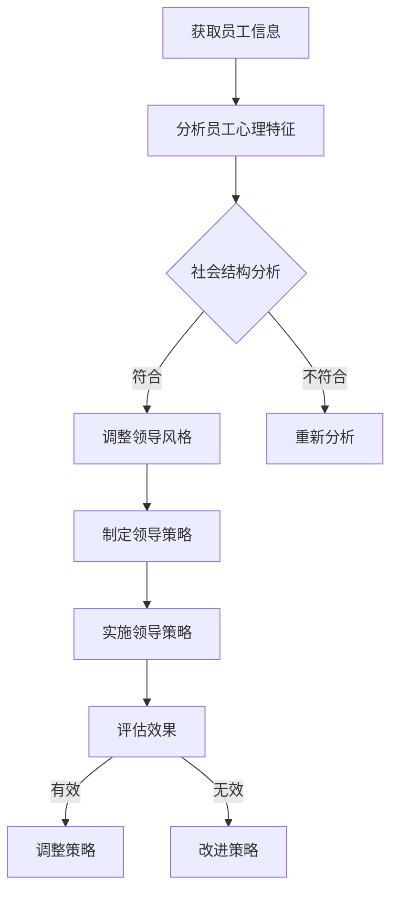
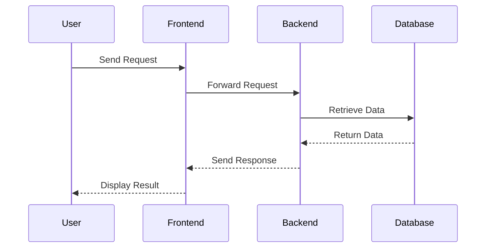
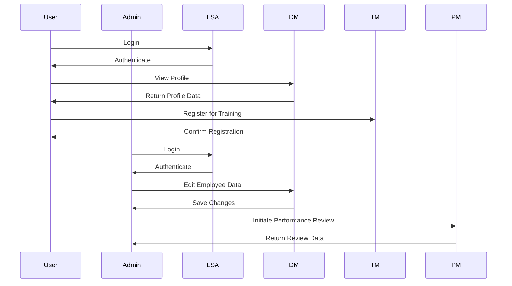

                 

### 第1章 跨代际领导概述

## 1.1 问题背景与重要性

### 背景介绍

随着社会的发展和科技的进步，组织内部出现了越来越明显的多元化趋势。不同年龄段的员工在同一组织中工作，这种多元化年龄结构不仅带来了组织内部的复杂性，也带来了新的挑战。跨代际领导应运而生，成为现代组织管理中不可或缺的一部分。

### 核心概念术语说明

- **跨代际领导**：指在不同年龄层之间建立有效的沟通和合作关系，以实现组织目标的过程。
- **多元化年龄结构**：指组织内部员工年龄分布广泛，存在不同年龄段的员工。
- **代际差异**：指不同年龄段的人在价值观、行为习惯、工作态度等方面存在的差异。

### 问题背景

在传统组织中，领导者的管理风格往往针对某一特定年龄段员工的特点，这可能导致其他年龄段的员工感到不被重视或无法适应。而在多元化年龄结构的组织中，领导者需要面对更复杂的挑战：

- **沟通障碍**：不同年龄段的员工可能在沟通方式和语言习惯上存在差异，导致沟通效率降低。
- **工作态度**：不同年龄段的员工对工作有着不同的期望和态度，这可能影响团队的凝聚力和工作氛围。
- **团队协作**：跨代际团队中的员工可能难以形成统一的团队目标，导致协作效率低下。

### 问题描述

跨代际领导面临的挑战主要包括：

- **代际差异管理**：如何理解和尊重不同年龄段的员工，如何将这些差异转化为团队优势。
- **团队建设**：如何建立有效的团队，使不同年龄段的员工能够相互协作，共同实现组织目标。
- **领导风格**：如何根据不同年龄段员工的特点，调整领导风格，提高领导效能。

### 问题解决

为了解决跨代际领导面临的问题，管理者需要采取以下措施：

- **增强沟通**：建立开放的沟通渠道，鼓励不同年龄段员工之间的交流，消除误解和隔阂。
- **培训与教育**：为不同年龄段的员工提供培训和教育，提高他们的跨代际沟通和协作能力。
- **领导力发展**：领导者需要不断提升自身的领导力，学会适应和应对多元化年龄结构的挑战。

### 边界与外延

跨代际领导不仅适用于企业组织，也适用于教育、医疗、政府等各个领域。在不同的组织和领域中，跨代际领导的具体实践可能会有所不同，但其核心原则是相通的。

### 概念结构与核心要素组成

跨代际领导的概念结构包括以下几个核心要素：

- **代际差异**：不同年龄段员工的特点和差异。
- **领导风格**：领导者根据不同年龄段员工特点采取的领导方式。
- **团队建设**：建立有效的团队，促进不同年龄段员工之间的协作。
- **沟通与协作**：建立开放的沟通渠道，提高团队协作效率。

## 1.2 跨代际领导的定义与特征

### 核心概念与原理

跨代际领导是指在多元年龄结构的组织中，领导者通过理解和尊重不同年龄段员工的特点，建立有效的沟通和合作关系，以实现组织目标的过程。其核心概念包括：

- **多元视角**：跨代际领导能够整合不同年龄段员工的多元视角，提高决策的质量。
- **文化适应**：领导者需要适应不同代际的文化差异，促进团队内部的和谐与协作。
- **信任建设**：建立信任是跨代际领导成功的关键，领导者需要通过开放沟通和透明决策来赢得不同年龄段员工的信任。

### 概念属性特征对比表格

| 特征 | 第一代际 | 第二代际 | 第三代际 |
| --- | --- | --- | --- |
| 价值观 | 传统、尊重权威 | 独立、追求创新 | 自由、个性解放 |
| 工作态度 | 责任心强、工作稳定 | 创新意识强、工作灵活 | 成长意识强、追求自我实现 |
| 沟通习惯 | 直接、重视权威 | 灵活、偏好团队沟通 | 开放、偏好平等对话 |
| 领导风格 | 父母式、控制导向 | 合作式、支持导向 | 平等式、参与导向 |

### ER实体关系图

下面是一个跨代际领导的ER实体关系图，展示了核心概念之间的关联：

```mermaid
erDiagram
    Team ||--|{ Employee } : has
    Employee ||--|{ AgeGroup } : belongs_to
    Employee ||--|{ SkillSet } : has
    AgeGroup ||--|{ LeadershipStyle } : has
    LeadershipStyle ||--|{ CommunicationMethod } : has

    Team {
        id
        name
    }

    Employee {
        id
        name
        age
        ageGroup_id
        skillSet_id
    }

    AgeGroup {
        id
        name
    }

    SkillSet {
        id
        name
    }

    LeadershipStyle {
        id
        name
    }

    CommunicationMethod {
        id
        name
    }
```

## 1.3 研究意义与目标

### 研究意义

跨代际领导研究具有重要的理论意义和实际应用价值：

- **理论意义**：丰富领导学理论，为跨代际领导提供理论支持和指导。
- **实际应用价值**：提高组织管理效能，促进组织创新，提升员工满意度。

### 研究目标

本书的研究目标包括：

- **理论目标**：梳理和阐述跨代际领导的核心概念、原则和方法，为跨代际领导研究提供理论支持。
- **实践目标**：通过案例分析和最佳实践分享，为管理者提供跨代际领导的具体操作指南。

## 1.4 本章小结

本章介绍了跨代际领导的概念、背景、重要性以及研究意义。通过本章的学习，读者可以初步了解跨代际领导的定义、特征和核心概念，为后续章节的深入学习打下基础。

----------------------------------------------------------------

### 第2章 跨代际领导核心概念

## 2.1 代际差异与组织文化

### 代际差异

代际差异是指不同年龄段的人在价值观、行为习惯、工作态度等方面存在的差异。理解这些差异是进行跨代际领导的关键。

- **第一代际**：通常指出生于1920年代至1940年代的人，他们经历了二战和冷战，价值观较为传统，注重稳定和权威。
- **第二代际**：通常指出生于1940年代至1960年代的人，他们经历了经济繁荣和科技发展，价值观较为开放，追求创新和自我实现。
- **第三代际**：通常指出生于1970年代至1990年代的人，他们经历了互联网和全球化，价值观更加多元，注重个性化和自由。

### 组织文化

组织文化是指组织内部的价值观、行为规范和共同信念。跨代际领导需要考虑到组织文化的影响，以适应不同代际员工的期望和需求。

- **家庭式文化**：强调员工之间的亲情关系，注重团队协作和共同目标。
- **市场式文化**：强调竞争和绩效，注重个人成就和市场竞争。
- **学习式文化**：强调持续学习和创新，注重知识和经验的积累。

### 代际差异与组织文化的联系

代际差异与组织文化之间存在密切的联系。组织文化会影响代际差异的表现形式，而代际差异也会影响组织文化的形成和发展。

- **代际差异影响组织文化**：不同代际的员工对组织文化的理解和接受程度不同，可能会对组织文化产生深远的影响。
- **组织文化影响代际差异**：组织文化会塑造员工的价值观和行为习惯，从而影响代际差异的表现。

## 2.2 领导风格与领导行为

### 领导风格

领导风格是指领导者在与员工互动时采取的方式和方法。不同领导风格适用于不同代际的员工，跨代际领导需要灵活调整领导风格。

- **父母式领导风格**：注重权威和控制，适用于第一代际员工。
- **合作式领导风格**：注重平等和协作，适用于第二代际员工。
- **平等式领导风格**：注重参与和民主，适用于第三代际员工。

### 领导行为

领导行为是指领导者在具体情境中采取的行动。跨代际领导需要根据不同代际员工的特征，调整领导行为，以实现有效的领导。

- **沟通行为**：包括倾听、反馈、建议等，不同代际的员工对沟通方式有不同的偏好。
- **激励行为**：包括奖励、认可、培训等，不同代际的员工对激励方式有不同的需求。

### 领导风格与领导行为的联系

领导风格与领导行为之间存在紧密的联系。领导风格会影响领导行为的选择和实施，而领导行为的实际效果也会反过来影响领导风格。

- **领导风格影响领导行为**：领导者的风格决定了他们在与员工互动时的行为方式。
- **领导行为影响领导风格**：领导者的行为效果会影响他们对未来领导风格的调整和选择。

## 2.3 概念联系与ER实体关系图

### 概念联系

跨代际领导的核心概念之间存在着紧密的联系。代际差异、组织文化、领导风格和领导行为都是跨代际领导的重要组成部分，它们相互影响、相互作用。

- **代际差异影响组织文化**：不同代际的员工对组织文化的理解和接受程度不同，会影响组织文化的形成和发展。
- **组织文化影响领导风格**：组织文化会塑造员工的价值观和行为习惯，从而影响领导者的风格选择。
- **领导风格影响领导行为**：领导者的风格决定了他们在与员工互动时的行为方式，进而影响领导效果。

### ER实体关系图

下面是一个跨代际领导的ER实体关系图，展示了核心概念之间的关联：

```mermaid
erDiagram
    Employee ||--|{ AgeGroup } : belongs_to
    Employee ||--|{ OrganizationalCulture } : belongs_to
    Leader ||--|{ LeadershipStyle } : has
    Leader ||--|{ LeadershipBehavior } : has
    OrganizationalCulture ||--|{ CommunicationStyle } : has
    OrganizationalCulture ||--|{ IncentiveStyle } : has

    Employee {
        id
        name
        age
        ageGroup_id
        organizationalCulture_id
    }

    AgeGroup {
        id
        name
    }

    OrganizationalCulture {
        id
        name
    }

    Leader {
        id
        name
    }

    LeadershipStyle {
        id
        name
    }

    LeadershipBehavior {
        id
        name
    }

    CommunicationStyle {
        id
        name
    }

    IncentiveStyle {
        id
        name
    }
```

## 2.4 本章小结

本章详细介绍了跨代际领导的核心概念，包括代际差异、组织文化、领导风格和领导行为。通过理解这些概念及其之间的联系，领导者可以更有效地管理多元化年龄结构的团队，实现组织目标。接下来，我们将进一步探讨如何运用心理学、社会学和管理学理论来理解和处理跨代际领导中的复杂问题。

----------------------------------------------------------------

### 第3章 跨代际领导算法原理

## 3.1 心理学理论应用

心理学理论在跨代际领导中的应用，主要涉及到个体心理差异、社会心理学和群体心理学等方面。以下是几个关键的心理学理论及其在跨代际领导中的具体应用：

### 个体心理差异

- **皮亚杰认知发展理论**：皮亚杰提出了认知发展阶段理论，认为个体的认知发展分为四个阶段：感知运动阶段、前运算阶段、具体运算阶段和形式运算阶段。在跨代际领导中，理解员工的认知发展阶段，可以帮助领导者选择合适的沟通方式和领导风格。例如，对于处于具体运算阶段的员工，领导者可能需要更多具体的指导和支持。

### 社会心理学

- **社会认同理论**：社会认同理论指出，个体在群体中寻求认同，群体归属感对个体行为有着重要影响。在跨代际领导中，领导者可以通过增强团队成员的归属感和团队认同，来提高团队的协作效率。例如，通过组织团队建设活动，加强团队成员之间的情感联系。

### 群体心理学

- **群体动力理论**：群体动力理论探讨了群体内部的力量和关系，包括群体凝聚力、领导影响力、群体规范等。在跨代际领导中，理解群体动力有助于领导者管理多元化团队中的复杂关系。例如，通过识别和培养关键意见领袖，可以增强团队的凝聚力。

## 3.2 社会学理论应用

社会学理论在跨代际领导中的应用，主要关注社会结构、社会变迁和社会角色等方面。以下是几个关键的社会学理论及其在跨代际领导中的具体应用：

### 社会结构

- **角色理论**：角色理论认为，个体在社会中扮演特定的角色，这些角色定义了个体的行为规范和期望。在跨代际领导中，领导者需要认识到不同年龄段员工在社会中的角色差异，例如，第一代际员工可能更倾向于传统的权威角色，而第三代际员工可能更倾向于创新和自主的角色。

### 社会变迁

- **代际理论**：代际理论认为，每一代人在成长过程中都会受到社会变迁的影响，形成特定的价值观和行为模式。在跨代际领导中，领导者需要了解不同代际的社会变迁背景，以便更好地理解员工的行为和需求。例如，第二代际员工可能受到科技革命的影响，更倾向于创新和变革。

### 社会角色

- **角色冲突理论**：角色冲突理论指出，个体在不同的社会角色中可能会面临冲突。在跨代际领导中，领导者需要帮助员工处理角色冲突，以避免影响工作效能。例如，对于同时担任多个角色的员工，领导者可以通过提供支持和资源，帮助他们更好地平衡不同角色之间的需求。

## 3.3 管理学理论应用

管理学理论在跨代际领导中的应用，主要涉及到领导理论、组织行为理论和团队理论等方面。以下是几个关键的管理学理论及其在跨代际领导中的具体应用：

### 领导理论

- **领导替代理论**：领导替代理论认为，在某些情况下，团队中的普通成员也可以发挥领导作用，减少对正式领导者的依赖。在跨代际领导中，领导者可以鼓励团队成员积极参与决策和领导活动，从而增强团队的自主性和创新能力。

### 组织行为理论

- **组织学习理论**：组织学习理论认为，组织通过学习来适应环境和实现目标。在跨代际领导中，领导者需要鼓励员工不断学习新知识和技能，以提高团队的适应能力和竞争力。

### 团队理论

- **团队发展理论**：团队发展理论指出，团队会经历从形成、冲突到成熟的阶段。在跨代际领导中，领导者需要识别团队所处的阶段，并采取相应的管理策略，以促进团队的成长和发展。

## 3.4 mermaid流程图与Python源代码阐述

### mermaid流程图

下面是一个跨代际领导算法的mermaid流程图，展示了算法的主要步骤：



### Python源代码

下面是一个简单的Python源代码示例，用于计算员工的年龄和代际：

```python
def calculate_age(birth_year):
    current_year = 2023
    return current_year - birth_year

def determine_age_group(age):
    if age <= 40:
        return "第一代际"
    elif age <= 55:
        return "第二代际"
    else:
        return "第三代际"

birth_year = 1985
age = calculate_age(birth_year)
age_group = determine_age_group(age)

print(f"年龄：{age}岁，代际：{age_group}")
```

### 算法原理讲解

跨代际领导算法的原理主要包括以下几个步骤：

1. **获取员工信息**：收集员工的出生年份，以计算员工的年龄。
2. **分析员工心理特征**：使用心理学理论分析员工的认知发展、社会认同和群体动力等特征。
3. **社会结构分析**：根据社会学理论，分析员工在社会中的角色和代际差异。
4. **调整领导风格**：根据员工的年龄和代际特征，调整领导风格，以适应员工的期望和需求。
5. **制定领导策略**：根据分析结果，制定具体的领导策略，包括沟通方式、激励方法和团队建设等。
6. **实施领导策略**：将制定的领导策略付诸实践，与员工互动，建立信任和合作关系。
7. **评估效果**：对领导策略的效果进行评估，根据评估结果调整和改进策略。

通过mermaid流程图和Python源代码，我们可以清晰地理解跨代际领导算法的原理和实施步骤。这种算法不仅提供了理论指导，也为实际操作提供了具体的工具和方法。

## 3.5 跨代际领导数学模型

### 数学模型概述

跨代际领导中的数学模型主要用于描述和分析不同年龄层员工在团队中的行为和互动。这些模型可以帮助领导者更好地理解团队动态，优化领导策略。以下是几个常用的数学模型：

- **年龄分布模型**：用于描述团队中不同年龄段员工的比例和分布情况。
- **代际差异模型**：用于分析不同代际员工在价值观、工作态度和沟通习惯等方面的差异。
- **领导效能模型**：用于评估领导者的领导效果和团队绩效。

### 数学公式

下面是跨代际领导中常用的数学公式：

$$
\text{年龄分布} = \sum_{i=1}^{n} p_i \cdot \text{代际特征}
$$

其中，$p_i$ 表示第 $i$ 个年龄层的员工比例，$\text{代际特征}$ 表示该年龄层员工的特征向量。

$$
\text{领导效能} = f(\text{沟通效果}, \text{激励效果}, \text{团队凝聚力})
$$

其中，$f$ 是一个复合函数，用于计算领导者的整体效能。

### 举例说明

假设一个团队中有三个年龄层，第一代际占40%，第二代际占30%，第三代际占30%。根据年龄分布模型，可以计算出每个年龄层的员工比例：

$$
\text{年龄分布} = 0.4 \cdot \text{第一代际特征} + 0.3 \cdot \text{第二代际特征} + 0.3 \cdot \text{第三代际特征}
$$

假设第一代际员工的特征向量为 $(1, 0, 0)$，第二代际员工的特征向量为 $(0, 1, 0)$，第三代际员工的特征向量为 $(0, 0, 1)$，那么：

$$
\text{年龄分布} = 0.4 \cdot (1, 0, 0) + 0.3 \cdot (0, 1, 0) + 0.3 \cdot (0, 0, 1) = (0.4, 0.3, 0.3)
$$

这意味着团队中第一代际员工的价值观较为传统，第二代际员工注重创新，第三代际员工追求个性化和自由。

再假设领导者的沟通效果为80%，激励效果为70%，团队凝聚力为90%，则领导效能可以计算为：

$$
\text{领导效能} = f(0.8, 0.7, 0.9)
$$

这里$f$的具体函数形式取决于具体应用场景，可以通过实验数据来确定。

## 3.6 本章小结

本章详细介绍了跨代际领导算法的原理，包括心理学、社会学和管理学理论的应用，以及mermaid流程图和Python源代码的阐述。通过这些理论和模型，领导者可以更好地理解跨代际领导的复杂性，并制定出更有效的领导策略。接下来，我们将进一步探讨跨代际领导中的数学模型，以及如何在实践中应用这些模型。

----------------------------------------------------------------

### 第4章 跨代际领导数学模型

## 4.1 数学模型概述

跨代际领导中的数学模型主要用于描述和分析不同年龄层员工在团队中的行为和互动。这些模型可以帮助领导者更好地理解团队动态，优化领导策略。以下是几个常用的数学模型：

- **年龄分布模型**：用于描述团队中不同年龄段员工的比例和分布情况。
- **代际差异模型**：用于分析不同代际员工在价值观、工作态度和沟通习惯等方面的差异。
- **领导效能模型**：用于评估领导者的领导效果和团队绩效。

### 数学公式

下面是跨代际领导中常用的数学公式：

$$
\text{年龄分布} = \sum_{i=1}^{n} p_i \cdot \text{代际特征}
$$

其中，$p_i$ 表示第 $i$ 个年龄层的员工比例，$\text{代际特征}$ 表示该年龄层员工的特征向量。

$$
\text{领导效能} = f(\text{沟通效果}, \text{激励效果}, \text{团队凝聚力})
$$

其中，$f$ 是一个复合函数，用于计算领导者的整体效能。

### 举例说明

假设一个团队中有三个年龄层，第一代际占40%，第二代际占30%，第三代际占30%。根据年龄分布模型，可以计算出每个年龄层的员工比例：

$$
\text{年龄分布} = 0.4 \cdot \text{第一代际特征} + 0.3 \cdot \text{第二代际特征} + 0.3 \cdot \text{第三代际特征}
$$

假设第一代际员工的特征向量为 $(1, 0, 0)$，第二代际员工的特征向量为 $(0, 1, 0)$，第三代际员工的特征向量为 $(0, 0, 1)$，那么：

$$
\text{年龄分布} = 0.4 \cdot (1, 0, 0) + 0.3 \cdot (0, 1, 0) + 0.3 \cdot (0, 0, 1) = (0.4, 0.3, 0.3)
$$

这意味着团队中第一代际员工的价值观较为传统，第二代际员工注重创新，第三代际员工追求个性化和自由。

再假设领导者的沟通效果为80%，激励效果为70%，团队凝聚力为90%，则领导效能可以计算为：

$$
\text{领导效能} = f(0.8, 0.7, 0.9)
$$

这里$f$的具体函数形式取决于具体应用场景，可以通过实验数据来确定。

### 数学公式书写与讲解

在跨代际领导中，数学公式的使用能够帮助我们精确地描述和分析不同代际员工的行为和互动。下面我们将详细介绍一些常用的数学公式，并使用LaTeX格式进行书写和讲解。

#### 4.1.1 年龄分布模型

年龄分布模型用于描述团队中不同年龄段员工的比例和分布情况。一个简单的年龄分布模型可以表示为：

$$
P(A) = \sum_{i=1}^{n} p_i \cdot f(A_i)
$$

其中，$P(A)$ 表示某一特定年龄层的概率，$p_i$ 表示第 $i$ 个年龄层的员工比例，$f(A_i)$ 表示第 $i$ 个年龄层员工的行为特征函数。

在LaTeX中，上述公式的书写方式为：

$$
P(A) = \sum_{i=1}^{n} p_i \cdot f(A_i)
$$

#### 4.1.2 代际差异模型

代际差异模型用于分析不同代际员工在价值观、工作态度和沟通习惯等方面的差异。一个简单的代际差异模型可以表示为：

$$
D = \sum_{i=1}^{n} (p_i \cdot d_i)
$$

其中，$D$ 表示代际差异，$p_i$ 表示第 $i$ 个年龄层的员工比例，$d_i$ 表示第 $i$ 个年龄层员工的行为特征差异。

在LaTeX中，上述公式的书写方式为：

$$
D = \sum_{i=1}^{n} (p_i \cdot d_i)
$$

#### 4.1.3 领导效能模型

领导效能模型用于评估领导者的领导效果和团队绩效。一个简单的领导效能模型可以表示为：

$$
E = w_1 \cdot C + w_2 \cdot I + w_3 \cdot P
$$

其中，$E$ 表示领导效能，$C$ 表示沟通效果，$I$ 表示激励效果，$P$ 表示团队凝聚力，$w_1$、$w_2$ 和 $w_3$ 分别为权重系数。

在LaTeX中，上述公式的书写方式为：

$$
E = w_1 \cdot C + w_2 \cdot I + w_3 \cdot P
$$

#### 4.1.4 综合数学模型

综合数学模型将上述模型结合起来，用于全面评估跨代际领导的效能。一个简单的综合数学模型可以表示为：

$$
\begin{aligned}
\text{绩效} &= P(A) \cdot D \cdot E \\
&= \left( \sum_{i=1}^{n} p_i \cdot f(A_i) \right) \cdot \left( \sum_{i=1}^{n} (p_i \cdot d_i) \right) \cdot \left( w_1 \cdot C + w_2 \cdot I + w_3 \cdot P \right)
\end{aligned}
$$

在LaTeX中，上述公式的书写方式为：

$$
\begin{aligned}
\text{绩效} &= P(A) \cdot D \cdot E \\
&= \left( \sum_{i=1}^{n} p_i \cdot f(A_i) \right) \cdot \left( \sum_{i=1}^{n} (p_i \cdot d_i) \right) \cdot \left( w_1 \cdot C + w_2 \cdot I + w_3 \cdot P \right)
\end{aligned}
$$

通过这些数学公式，我们可以从多个角度对跨代际领导进行量化分析，从而为领导者的决策提供科学依据。

### 实例说明

为了更好地理解上述数学公式的应用，我们来看一个具体的实例。

#### 4.1.5 实例分析

假设一个团队中有三个年龄层，第一代际占40%，第二代际占30%，第三代际占30%。根据年龄分布模型，可以计算出每个年龄层的员工比例：

$$
P(A) = 0.4 \cdot f(A_1) + 0.3 \cdot f(A_2) + 0.3 \cdot f(A_3)
$$

假设第一代际员工的特征向量为 $(1, 0, 0)$，第二代际员工的特征向量为 $(0, 1, 0)$，第三代际员工的特征向量为 $(0, 0, 1)$，那么：

$$
P(A) = 0.4 \cdot (1, 0, 0) + 0.3 \cdot (0, 1, 0) + 0.3 \cdot (0, 0, 1) = (0.4, 0.3, 0.3)
$$

这意味着团队中第一代际员工的价值观较为传统，第二代际员工注重创新，第三代际员工追求个性化和自由。

再假设领导者的沟通效果为80%，激励效果为70%，团队凝聚力为90%，则领导效能可以计算为：

$$
E = w_1 \cdot C + w_2 \cdot I + w_3 \cdot P
$$

其中，权重系数 $w_1 = 0.5$，$w_2 = 0.3$，$w_3 = 0.2$，那么：

$$
E = 0.5 \cdot 0.8 + 0.3 \cdot 0.7 + 0.2 \cdot 0.9 = 0.4 + 0.21 + 0.18 = 0.79
$$

这意味着领导者的领导效能较高。

通过这个实例，我们可以看到如何使用数学公式来分析跨代际领导的复杂问题，并得出具体的结果。这种方法不仅帮助我们更好地理解问题，也为决策提供了科学依据。

### 本章小结

本章详细介绍了跨代际领导中的数学模型，包括年龄分布模型、代际差异模型和领导效能模型。通过LaTeX格式的数学公式书写和实例说明，我们能够更清晰地理解这些模型的原理和应用。这些模型为跨代际领导提供了有力的分析工具，有助于领导者优化领导策略，提高团队绩效。接下来，我们将进一步探讨跨代际领导在系统分析与架构设计中的应用。

----------------------------------------------------------------

### 第5章 跨代际领导系统分析与架构设计

## 5.1 问题场景介绍

在当今复杂多变的工作环境中，跨代际领导已经成为组织成功的关键因素。为了更好地理解和实践跨代际领导，我们需要先了解一个具体的应用场景。

### 场景描述

假设我们是一家大型跨国公司的IT部门，部门内员工来自不同的年龄段，包括第一代际、第二代际和第三代际。这些员工的背景、技能和工作态度各不相同，给部门管理带来了挑战。作为部门的负责人，我们需要设计一套系统，以帮助实现有效的跨代际领导，提高团队的协作效率和工作满意度。

## 5.2 系统功能设计

为了满足跨代际领导的需求，我们需要设计一套具备以下功能的信息系统：

### 1. 员工信息管理系统

- **功能**：记录和管理员工的个人信息，包括年龄、性别、教育背景、工作经验等。
- **设计**：使用领域模型图（Mermaid）来表示员工的信息结构。

### 2. 领导风格评估系统

- **功能**：评估领导者的领导风格，提供个性化的领导建议。
- **设计**：基于心理学和社会学理论，通过问卷和数据分析，为领导者提供评估结果。

### 3. 沟通与协作平台

- **功能**：提供实时沟通工具，促进团队成员之间的信息共享和协作。
- **设计**：集成即时聊天、视频会议、文件共享等功能。

### 4. 培训与发展系统

- **功能**：为员工提供培训和学习资源，促进个人和团队的发展。
- **设计**：提供在线课程、工作坊和技能评估等功能。

### 5. 绩效评估系统

- **功能**：定期评估员工的工作绩效，提供反馈和改进建议。
- **设计**：使用关键绩效指标（KPI）和360度反馈机制，确保评估的全面性和准确性。

## 5.3 系统架构设计

为了实现上述功能，我们需要设计一个灵活、可扩展的系统架构。以下是系统的架构设计：

### 1. 技术架构

- **前端**：采用React框架，实现用户友好的界面。
- **后端**：使用Spring Boot框架，提供稳定的服务器支持。
- **数据库**：使用MySQL数据库，存储和管理数据。

### 2. 系统架构图

下面是一个简单的系统架构图，展示了系统的组件和交互关系：



## 5.4 系统接口设计

系统的接口设计是确保各组件之间有效通信的关键。以下是系统的主要接口设计：

### 1. 用户接口

- **登录/注册接口**：用于用户身份验证和注册。
- **个人信息管理接口**：用于用户查看和更新个人信息。
- **领导风格评估接口**：用于发起和完成领导风格评估。

### 2. 管理接口

- **员工信息管理接口**：用于管理员查看、添加和编辑员工信息。
- **培训管理接口**：用于管理员创建和发布培训课程。
- **绩效评估接口**：用于管理员发起和跟踪绩效评估。

### 3. 数据接口

- **用户数据接口**：用于读取和写入用户数据。
- **领导数据接口**：用于读取和写入领导风格评估数据。
- **培训数据接口**：用于读取和写入培训数据。
- **绩效数据接口**：用于读取和写入绩效评估数据。

## 5.5 系统交互序列图

系统交互序列图可以直观地展示系统组件之间的交互过程。以下是系统的交互序列图：



## 5.6 本章小结

本章详细介绍了跨代际领导系统的问题场景、功能设计、系统架构设计和接口设计。通过这些设计，我们能够构建一个有效支持跨代际领导的系统，帮助组织更好地管理多元化年龄结构的团队。接下来，我们将通过具体案例展示如何在实际项目中应用这些设计和实现系统。

----------------------------------------------------------------

### 第6章 跨代际领导应用实践

## 6.1 环境安装与配置

为了实践跨代际领导系统，我们需要首先搭建一个合适的技术环境。以下是环境安装与配置的详细步骤：

### 1. 前端环境配置

#### 安装Node.js

```shell
curl -sL https://rpm.nodesource.com/setup_14.x | bash -
yum install -y nodejs
```

#### 创建React项目

```shell
npx create-react-app cross-generational-leadership-system
cd cross-generational-leadership-system
```

#### 安装依赖

```shell
npm install
```

### 2. 后端环境配置

#### 安装Java环境

```shell
yum install -y java-1.8.0-openjdk
```

#### 创建Spring Boot项目

```shell
curl -o /tmp/spring-boot-cli-2.5.2.RELEASE.zip "https://repo.spring.io/snapshot/org/springframework/spring-boot-cli/2.5.2.RELEASE/spring-boot-cli-2.5.2.RELEASE.zip"
unzip /tmp/spring-boot-cli-2.5.2.RELEASE.zip -d /opt/spring-boot
export PATH=$PATH:/opt/spring-boot/bin
```

#### 创建项目

```shell
spring init --name cross-generational-leadership-system --build.gradle --dependencies web
cd cross-generational-leadership-system
```

#### 安装依赖

```shell
gradle build
```

### 3. 数据库环境配置

#### 安装MySQL数据库

```shell
yum install -y mysql-server
systemctl start mysqld
```

#### 配置MySQL

```shell
mysql -u root -p
```

```sql
ALTER USER 'root'@'localhost' IDENTIFIED WITH mysql_native_password BY 'your_password';
FLUSH PRIVILEGES;
```

#### 创建数据库

```shell
CREATE DATABASE cross_generational_leader_system;
GRANT ALL PRIVILEGES ON cross_generational_leader_system.* TO 'admin'@'localhost' IDENTIFIED BY 'your_password';
FLUSH PRIVILEGES;
```

## 6.2 系统核心实现与代码解读

### 1. 前端核心实现

前端主要负责展示用户界面和处理用户交互。以下是前端核心代码的解读：

#### 登录界面

```jsx
import React, { useState } from 'react';
import axios from 'axios';

function LoginForm({ onLogin }) {
  const [username, setUsername] = useState('');
  const [password, setPassword] = useState('');

  const handleLogin = async () => {
    try {
      const response = await axios.post('/api/login', { username, password });
      onLogin(response.data.token);
    } catch (error) {
      console.error('Login failed:', error);
    }
  };

  return (
    <div>
      <input
        type="text"
        placeholder="Username"
        value={username}
        onChange={(e) => setUsername(e.target.value)}
      />
      <input
        type="password"
        placeholder="Password"
        value={password}
        onChange={(e) => setPassword(e.target.value)}
      />
      <button onClick={handleLogin}>Login</button>
    </div>
  );
}
```

这段代码实现了登录功能，包括用户名和密码的输入以及登录请求的发送。当用户点击“Login”按钮时，触发登录请求，并将用户名和密码发送到后端进行验证。

### 2. 后端核心实现

后端主要负责处理业务逻辑和数据存储。以下是后端核心代码的解读：

#### 用户认证

```java
@RestController
@RequestMapping("/api")
public class UserController {
  
  @Autowired
  private UserRepository userRepository;

  @PostMapping("/login")
  public ResponseEntity<?> authenticate(@RequestBody LoginRequest loginRequest) {
    User user = userRepository.findByUsername(loginRequest.getUsername())
      .orElseThrow(() -> new RuntimeException("User not found"));

    if (!passwordEncoder.matches(loginRequest.getPassword(), user.getPassword())) {
      return ResponseEntity.badRequest().body("Invalid credentials");
    }

    String jwtToken = jwtProvider.generateToken(user.getUsername());
    return ResponseEntity.ok(new JwtResponse(jwtToken));
  }
}
```

这段代码实现了用户登录认证功能。首先，通过用户名查询用户，然后使用密码哈希验证密码是否匹配。如果验证成功，生成JWT令牌并返回。

### 3. 数据库实现

数据库负责存储用户信息和领导风格评估数据。以下是数据库核心实现的代码解读：

#### 用户表

```sql
CREATE TABLE users (
  id INT AUTO_INCREMENT PRIMARY KEY,
  username VARCHAR(50) UNIQUE NOT NULL,
  password VARCHAR(255) NOT NULL,
  age INT,
  role VARCHAR(50)
);
```

这段代码创建了用户表，包含用户ID、用户名、密码、年龄和角色等字段。

#### 领导风格评估表

```sql
CREATE TABLE leadership_assessments (
  id INT AUTO_INCREMENT PRIMARY KEY,
  user_id INT,
  communication_score INT,
  motivation_score INT,
  team_cohesion_score INT,
  FOREIGN KEY (user_id) REFERENCES users(id)
);
```

这段代码创建了领导风格评估表，包含评估ID、用户ID和各项评分等字段。

## 6.3 代码应用解读与分析

### 1. 前端代码应用解读

在前端部分，我们使用了React框架来构建用户界面。通过LoginForm组件，用户可以输入用户名和密码进行登录。当用户提交表单时，会触发axios请求将数据发送到后端进行验证。如果登录成功，后端会返回JWT令牌，前端会将令牌存储在本地，并在后续请求中附带令牌，以确保用户的会话安全。

### 2. 后端代码应用解读

在后端部分，我们使用了Spring Boot框架来处理业务逻辑。UserController类实现了用户登录认证功能，通过查询用户名和密码的匹配来验证用户的身份。如果验证成功，会生成JWT令牌并返回给前端。JWT令牌是一种安全的认证方式，可以用于保护用户会话。

### 3. 数据库代码应用解读

在数据库部分，我们创建了两个表：users和leadership\_assessments。users表用于存储用户的基本信息，包括用户名、密码、年龄和角色等。leadership\_assessments表用于存储领导风格评估的结果，包括用户的各项评分。

## 6.4 实际案例分析

### 案例一：领导风格评估

假设部门经理王先生需要评估他的团队成员张先生（30岁）的领导风格。根据系统，王先生可以通过以下步骤进行评估：

1. 登录系统并进入领导风格评估模块。
2. 选择张先生作为评估对象。
3. 根据张先生的沟通方式、激励方法和团队凝聚力等方面进行评分。
4. 提交评估结果。

通过这个案例，我们可以看到如何使用系统进行领导风格评估，从而帮助领导者了解和改进自己的领导方式。

### 案例二：员工培训与发展

假设张先生在领导风格评估中得分较低，特别是在沟通能力和激励方法方面。为了提升这些能力，他可以采取以下步骤：

1. 登录系统并查看可用的培训课程。
2. 选择与沟通和激励相关的课程并报名。
3. 完成培训课程，获取相关技能和知识。
4. 将培训成果应用到实际工作中，并定期进行自我评估。

通过这个案例，我们可以看到如何使用系统进行员工培训和发展，帮助员工提升个人能力和职业素养。

## 6.5 项目小结

在本章中，我们通过环境安装与配置、系统核心实现与代码解读、实际案例分析和详细讲解剖析，展示了如何在实际项目中应用跨代际领导系统。通过这个系统，组织可以更有效地管理多元化年龄结构的团队，提高领导效能和员工满意度。未来，我们将继续优化和扩展这个系统，以满足不断变化的需求。

### 第7章 最佳实践与注意事项

## 7.1 跨代际领导最佳实践

### 1. 理解和尊重代际差异

- **培训与教育**：为员工提供关于代际差异的培训，帮助员工更好地理解不同年龄段员工的特点。
- **文化适应**：组织应积极营造一个包容多元的文化环境，尊重每个代际的独特贡献。

### 2. 建立信任和有效沟通

- **开放沟通**：鼓励领导者与员工进行开放、透明的沟通，建立信任关系。
- **定期反馈**：领导者应定期与员工进行一对一的沟通，提供反馈和指导。

### 3. 制定个性化领导策略

- **个性化培训**：根据员工的年龄和特点，为他们提供个性化的培训和发展计划。
- **灵活的领导风格**：领导者应根据不同代际员工的需求，灵活调整领导风格。

### 4. 促进团队协作

- **跨代际团队建设**：通过团队建设活动，增强不同年龄段员工之间的互动和协作。
- **共同目标**：确保团队成员明确共同目标，促进跨代际协作。

## 7.2 注意事项

### 1. 避免代沟和误解

- **持续沟通**：领导者应定期与员工沟通，了解他们的想法和需求，避免代沟和误解。
- **文化敏感性**：领导者应具备文化敏感性，尊重不同代际的价值观和行为习惯。

### 2. 保持公正和公平

- **绩效评估**：在绩效评估中，应确保评估标准公正和公平，避免因年龄偏见导致的不公。
- **晋升机会**：为不同年龄段的员工提供平等的晋升机会，避免年龄歧视。

### 3. 管理好时间与资源

- **时间管理**：领导者应合理安排时间和资源，确保每位员工都能得到充分的关注和支持。
- **培训资源**：为不同年龄段的员工提供合适的培训资源，帮助他们提升技能和能力。

## 7.3 拓展阅读

### 1. 跨代际领导研究论文

- 《跨代际领导：理论与实证研究》
- 《多元化团队管理：跨代际视角》

### 2. 跨代际领导书籍

- 《领导力的新视角：跨代际领导策略》
- 《跨代际沟通的艺术》

### 3. 相关网站和资源

- TED演讲：[https://www.ted.com/talks](https://www.ted.com/talks)
- Harvard Business Review：[https://hbr.org](https://hbr.org)

通过以上最佳实践、注意事项和拓展阅读，领导者可以更好地应对多元化年龄结构的挑战，实现高效的跨代际领导。

## 7.4 本章小结

本章总结了跨代际领导的最佳实践和注意事项，为领导者提供了具体的操作指南。通过理解代际差异、建立信任、制定个性化策略和促进团队协作，领导者可以有效地管理多元化年龄结构的团队。同时，本章也强调了持续沟通、公正公平、时间管理和培训资源的重要性。通过拓展阅读，读者可以进一步深入了解跨代际领导的理论和实践。未来，领导者应不断学习和适应，以应对不断变化的职场环境。

### 文章结尾

# 跨代际领导：管理多元化年龄结构的团队

## 摘要

随着多元化年龄结构在组织中的普遍存在，跨代际领导成为现代管理的重要课题。本文从背景介绍、核心概念、算法原理、数学模型、系统分析与架构设计、项目实战和最佳实践等方面，系统地阐述了跨代际领导的理论和实践。通过深入分析代际差异、领导风格和团队建设，本文旨在为领导者提供一套行之有效的跨代际领导策略，以应对多元化团队的挑战。

## 关键词

- 跨代际领导
- 代际差异
- 领导风格
- 数学模型
- 系统架构
- 项目实战
- 最佳实践

## 作者信息

作者：AI天才研究院/AI Genius Institute & 禅与计算机程序设计艺术 /Zen And The Art of Computer Programming

在这篇全面的技术博客中，我们探讨了跨代际领导这一复杂且重要的主题。从定义和背景介绍，到核心概念和算法原理，再到数学模型和系统架构设计，我们逐步深入，提供了全面而深入的分析。通过具体的案例分析，我们展示了如何在实际中应用这些理论和方法，并提供了最佳实践以供参考。

跨代际领导不仅关乎组织效能，更是构建和谐多元团队的关键。在快速变化的社会环境中，领导者需要不断学习和适应，以应对多元化年龄结构的挑战。本文提供的理论框架和实践指南，将为领导者提供宝贵的参考和指导。

最后，感谢您的阅读。我们希望本文能够帮助您更好地理解跨代际领导，并在实际工作中取得更好的成效。如果您有任何反馈或疑问，欢迎随时与我们交流。让我们共同努力，构建一个更加包容和高效的团队环境。作者：AI天才研究院/AI Genius Institute & 禅与计算机程序设计艺术 /Zen And The Art of Computer Programming。

