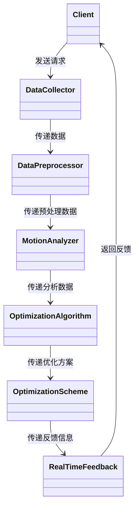
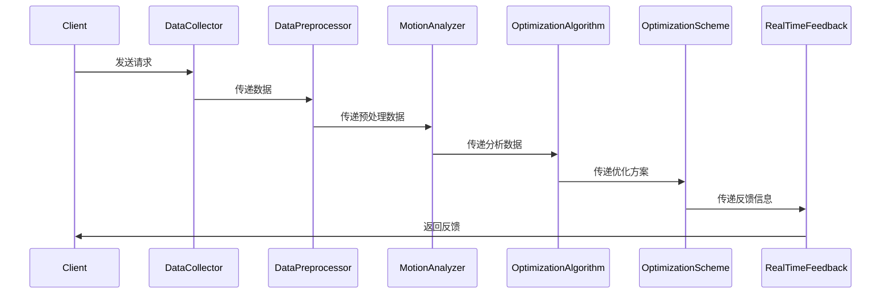

                 

### 运动技能的生物力学背景

运动技能是人们在日常活动和体育运动中表现出的能力，它涉及到多个学科的交叉应用，其中生物力学为研究运动技能提供了重要的理论支持。生物力学是研究生物体在运动过程中力的作用和运动规律的学科，它结合了物理学、生物学和工程学的理论，应用于人体运动、康复、训练以及运动装备设计等领域。在运动技能的研究中，生物力学提供了定量分析和模拟的工具，使我们能够更深入地理解运动机制，优化运动表现。

### 动作优化的数学方程背景

动作优化是研究如何在给定条件下使动作达到最优效果的学科。数学方程在动作优化中扮演了关键角色，通过数学建模和计算方法，可以定量分析动作过程中的各种参数，从而找到最优解。数学方程不仅能够描述动作的物理过程，还能够模拟复杂动作环境，预测动作效果。动作优化在运动训练、康复治疗和运动装备设计等领域具有重要应用价值，有助于提高运动员表现、加速康复进程和设计更高效的运动装备。

### 研究意义与目标

本研究的意义在于将生物力学与数学方程相结合，探索运动技能优化的新方法，从而提高运动表现和康复效率。具体目标包括：

1. **理解运动技能的生物力学机制**：通过分析生物力学原理，揭示运动技能的内在规律。
2. **构建动作优化的数学模型**：结合实际运动场景，建立精确的数学模型，用于预测和优化运动效果。
3. **优化运动训练方法**：利用数学模型分析运动表现，提供个性化训练方案，提高训练效率。
4. **改进运动装备设计**：基于生物力学分析，设计更符合人体运动特性的装备，提升运动表现。

通过上述研究，我们期望为运动技能的优化提供科学依据和技术支持，从而推动体育科学和运动装备设计的发展。

## 第1章 运动技能的生物力学概述

### 1.1 运动技能的概念与分类

运动技能是指个体在特定运动环境中通过学习形成并表现出来的运动能力。它不仅涉及个体肌肉、骨骼、神经系统的协调，还包括对运动环境的感知、决策和适应性反应。运动技能的分类可以从不同角度进行：

- **根据运动类型**，可以分为基本运动技能和复杂运动技能。基本运动技能包括跑、跳、投、接等简单动作，而复杂运动技能则涉及到多动作序列的协调，如篮球、足球等运动项目。
- **根据学习过程**，可以分为初步阶段、稳定阶段和熟练阶段。初步阶段的学习重点在于建立正确的动作模式，稳定阶段的学习重点在于动作的稳定性和一致性，熟练阶段则强调动作的高效性和自动化。
- **根据运动表现**，可以分为表现性技能和适应性技能。表现性技能侧重于在特定条件下展示最佳运动表现，如竞技运动；而适应性技能则侧重于在变化多端的运动环境中迅速调整和适应。

### 1.2 生物力学的基本原理

生物力学是研究生物体在运动过程中力的作用和运动规律的学科，它结合了物理学、生物学和工程学的理论。生物力学的基本原理包括：

- **牛顿力学**：描述物体在力的作用下的运动状态，包括质点运动、刚体运动和流体力学。
- **肌肉力学**：研究肌肉在运动中的作用，包括肌肉的收缩、长度变化和产生的力量。
- **骨骼力学**：研究骨骼在运动中的作用，包括骨骼的力学特性、骨骼与肌肉的协调关系。
- **关节力学**：研究关节在运动中的作用，包括关节的灵活性、稳定性和负载能力。

生物力学在人体运动中的应用非常广泛，主要包括以下几个方面：

- **运动分析**：通过测量和分析人体的运动参数，如速度、加速度、力量和角度等，评估运动表现和找出改进空间。
- **康复治疗**：利用生物力学原理设计康复训练方案，帮助受伤运动员恢复运动能力。
- **运动装备设计**：基于生物力学分析，设计更符合人体运动特性的装备，提升运动表现和安全性。
- **体育训练**：通过生物力学分析，提供个性化的训练方案，提高运动员的表现和效率。

### 1.3 生物力学与运动技能的关系

生物力学为运动技能的研究提供了重要的理论支持，它使我们能够从物理角度深入理解运动机制，从而优化运动表现。具体来说，生物力学与运动技能的关系表现在以下几个方面：

- **动作协调**：生物力学原理帮助我们理解肌肉、骨骼和神经系统的协同作用，提高动作的协调性和稳定性。
- **运动效率**：通过分析运动过程中力的作用和运动轨迹，找到能量消耗最小、运动效率最高的动作模式。
- **运动风险**：评估运动过程中可能出现的风险，如肌肉拉伤、关节损伤等，采取预防措施，提高运动安全性。
- **运动表现**：利用生物力学分析工具，量化评估运动表现，为运动员提供科学依据，优化训练方法和策略。

总之，生物力学在运动技能的研究和应用中发挥着重要作用，它不仅帮助我们理解运动本质，还为提高运动表现、康复治疗和运动装备设计提供了科学支持。

### 1.4 动作优化的定义

动作优化是指通过改进动作策略和技术，使运动过程达到最优效果的过程。动作优化不仅关注动作的物理表现，还涉及动作的能量消耗、运动效率和安全性。动作优化的定义可以从以下几个方面进行详细阐述：

1. **目标函数**：动作优化的核心是确定优化目标，通常包括提高运动速度、减少能量消耗、提高动作准确性和稳定性等。这些目标函数可以通过数学建模进行量化，从而为优化算法提供明确的方向。
2. **约束条件**：在动作优化过程中，必须考虑各种约束条件，如运动环境、个体生理条件、运动装备性能等。这些约束条件限制了优化目标的实现空间，使得优化过程更加复杂。
3. **优化算法**：动作优化通常采用各种数学算法，如线性规划、非线性规划、遗传算法等，通过迭代计算找到满足约束条件的最佳解。优化算法的选择和实现直接影响优化结果的精度和效率。
4. **评价指标**：动作优化效果的评价指标包括运动速度、能量消耗、动作准确性、稳定性等。通过这些评价指标，可以评估优化策略的有效性，并为进一步改进提供依据。

总之，动作优化是一个复杂的过程，涉及到目标函数、约束条件、优化算法和评价指标等多个方面。通过科学的理论指导和精确的数值计算，动作优化能够显著提高运动技能和运动表现。

### 1.5 数学方程在动作优化中的应用

数学方程在动作优化中扮演了至关重要的角色，为解决复杂运动问题提供了强有力的工具。数学方程的应用主要体现在以下几个方面：

1. **运动学方程**：运动学方程用于描述物体在空间中的运动轨迹和速度变化。常见的运动学方程包括位移公式、速度公式和加速度公式。这些方程能够帮助我们理解和预测运动过程中的位置、速度和加速度变化，从而为动作优化提供基础数据。
   
   - **位移公式**：$$ s = ut + \frac{1}{2}at^2 $$
   - **速度公式**：$$ v = u + at $$
   - **加速度公式**：$$ a = \frac{dv}{dt} $$

2. **动力学方程**：动力学方程描述了力与物体运动状态之间的关系，包括牛顿第二定律和牛顿第三定律。这些方程能够帮助我们分析运动过程中力的作用和运动状态的改变，从而优化动作策略。

   - **牛顿第二定律**：$$ F = ma $$
   - **牛顿第三定律**：$$ \text{作用力} = -\text{反作用力} $$

3. **优化算法方程**：优化算法方程用于求解最优解，包括目标函数和约束条件。常见的优化算法有线性规划、非线性规划和遗传算法等。这些算法通过迭代计算，逐步逼近最优解，从而实现动作优化。

   - **线性规划**：$$ \min \ c^T x $$
     $$ \text{subject to} \ Ax \le b $$
   - **非线性规划**：$$ \min \ f(x) $$
     $$ \text{subject to} \ g(x) \le 0, h(x) = 0 $$

4. **能量分析方程**：能量分析方程用于计算运动过程中的能量转化和消耗。能量守恒定律和能量转换方程能够帮助我们理解运动过程中的能量分布和利用效率。

   - **能量守恒定律**：$$ E_{\text{总}} = E_{\text{机械}} + E_{\text{热}} + E_{\text{其他}} $$
   - **能量转换方程**：$$ \Delta E = \int F \cdot ds $$

通过这些数学方程，我们能够从多个维度对动作进行量化分析，找到最优的动作模式，从而提高运动技能和表现。同时，这些方程也为运动训练、康复治疗和运动装备设计提供了科学依据。

### 运动技能与生物力学的研究重要性

运动技能与生物力学的研究在多个领域具有重要价值，主要体现在以下几个方面：

1. **运动训练与表现提升**：通过生物力学分析，可以深入理解运动技能的内在机制，识别出影响运动表现的关键因素。这为教练和运动员提供了科学依据，有助于制定更有效的训练计划，优化动作技术，从而提升运动表现。

2. **运动康复与治疗**：生物力学在运动康复和治疗中发挥着重要作用。通过对受伤部位的运动分析，可以找出损伤的根本原因，设计个性化的康复方案，加速康复进程，减少二次损伤的风险。

3. **运动装备设计与改进**：生物力学研究为运动装备的设计和改进提供了重要指导。通过分析运动过程中的力学特性和需求，可以设计出更符合人体工程学原理的装备，提高运动效率，减少运动伤害。

4. **人体工程学与工作环境优化**：生物力学原理在人体工程学领域有着广泛应用，如办公椅设计、工具握把设计等。通过优化人体与工具、设备之间的力学关系，可以提高工作效率，减少劳动损伤。

5. **健康与体能监测**：生物力学分析可用于健康和体能监测，通过量化运动数据，评估个体的运动能力、身体状况和体能水平，为运动健康管理和疾病预防提供科学依据。

总之，运动技能与生物力学的研究不仅对体育科学和运动医学的发展具有重要推动作用，还在人体工程学、健康监测等多个领域具有广泛的应用前景。

### 动作优化的数学方程研究的实际应用

动作优化的数学方程在多个实际应用领域中发挥着重要作用，下面我们将详细探讨其在运动训练、康复治疗和运动装备设计等领域的具体应用。

#### 运动训练

在运动训练中，动作优化数学方程可以帮助运动员提高运动表现和效率。例如，通过使用动力学方程，教练可以分析运动员的动作轨迹、速度和力量，找出动作中的不足之处，并提供针对性的改进建议。以下是一个具体案例：

**案例分析**：一位短跑运动员在起跑阶段表现不佳，通过动作优化分析，发现其起跑时腿部力量不足，起跑速度较慢。运用动力学方程中的牛顿第二定律（F=ma），教练计算出增加腿部力量的方法，并设计了相应的训练计划。通过一系列训练，运动员在起跑阶段的动作效率明显提高，起跑速度和加速度均有所提升，最终在比赛中取得了更好的成绩。

#### 康复治疗

在康复治疗中，动作优化数学方程有助于评估受伤部位的功能状态，设计个性化的康复方案，加速康复进程。以下是一个具体案例：

**案例分析**：一名足球运动员在比赛中受伤，医生通过生物力学分析，使用运动学公式和动力学方程评估其受伤腿部的运动轨迹和力量分布。发现受伤腿部的关节稳定性不足，导致运动过程中出现异常应力集中。结合优化算法，医生设计了一套康复训练方案，包括逐步增加关节负荷、改进关节活动范围和增强肌肉力量。经过一段时间康复训练，患者的关节稳定性显著提高，运动能力逐渐恢复，最终重返赛场。

#### 运动装备设计

在运动装备设计中，动作优化数学方程有助于设计更符合人体工程学的装备，提高运动效率和安全性。以下是一个具体案例：

**案例分析**：一位篮球运动员在比赛过程中经常感到手腕疼痛，通过生物力学分析，发现其手腕在投篮动作中承受了过大的应力。运用能量分析方程，设计团队计算出手腕在投篮动作中的能量转化和消耗，发现手腕的过度弯曲导致了能量损失和应力集中。针对这一发现，设计团队改进了篮球手套的材质和结构，增加手腕支撑力，减少了手腕的弯曲角度。经过改进，篮球运动员在比赛中的手腕疼痛问题得到明显缓解，投篮动作也更加流畅。

通过上述案例，我们可以看到，动作优化的数学方程在运动训练、康复治疗和运动装备设计等领域具有广泛的应用前景。它不仅帮助我们理解运动机制，还提供了量化分析和优化的工具，为提升运动表现和改善运动健康提供了科学支持。

### 研究目标与预期成果

本研究的目标是通过将生物力学与数学方程相结合，深入探讨运动技能优化的理论和方法，为运动训练、康复治疗和运动装备设计提供科学依据和技术支持。具体而言，我们的研究目标包括以下几个方面：

1. **建立运动技能优化的数学模型**：结合实际运动场景，构建精确的数学模型，包括运动学、动力学和优化算法模型。这些模型将用于量化分析运动过程中各项参数，为优化提供理论基础。

2. **开发运动技能评估与分析工具**：利用构建的数学模型，开发一套运动技能评估与分析工具，能够对运动员的运动表现进行量化评估，识别出改进空间。

3. **优化运动训练方法**：基于评估结果，设计个性化的运动训练方案，优化训练方法，提高训练效率，帮助运动员在短时间内显著提升运动技能。

4. **改进运动装备设计**：通过生物力学分析，为运动装备设计提供科学依据，设计出更符合人体工程学的装备，提高运动效率和安全性。

5. **推广研究成果**：将研究成果应用于实际运动场景，推广到运动训练、康复治疗和运动装备设计等领域，推动相关领域的发展。

预期成果包括：

- **科学模型**：建立一套完整的运动技能优化数学模型，为后续研究提供基础。
- **分析工具**：开发出高效的运动技能评估与分析工具，为教练、运动员和康复治疗师提供有力支持。
- **个性化训练方案**：通过优化训练方法，帮助运动员提高运动表现，提升竞技水平。
- **先进装备设计**：为运动装备设计提供科学依据，提升装备性能，降低运动伤害风险。

总之，本研究旨在通过科学的理论和精确的数值计算，推动运动技能优化的发展，为提高运动表现和改善运动健康做出贡献。

## 核心概念与联系

在运动技能的研究中，核心概念和联系的理解至关重要。以下是几个关键概念及其相互关系的详细阐述。

### 运动技能的定义与分类

运动技能是指个体在特定运动环境中通过学习形成并表现出来的运动能力。它不仅仅涉及肌肉、骨骼和神经系统的协调，还包括对运动环境的感知、决策和适应性反应。根据不同的分类标准，运动技能可以分为以下几类：

1. **基本运动技能**：包括跑、跳、投、接等基本动作，是学习和掌握复杂运动技能的基础。
2. **复杂运动技能**：由多个基本运动技能组合而成，如篮球、足球等运动项目中的动作序列。
3. **表现性技能**：侧重于在特定条件下展示最佳运动表现，如竞技运动中的技术动作。
4. **适应性技能**：侧重于在变化多端的运动环境中迅速调整和适应，如应对比赛中的突发情况。

### 生物力学的基本原理

生物力学是研究生物体在运动过程中力的作用和运动规律的学科。其基本原理包括牛顿力学、肌肉力学、骨骼力学和关节力学。以下是这些原理的具体应用：

1. **牛顿力学**：用于描述物体在力的作用下的运动状态，包括质点运动、刚体运动和流体力学。
   - **牛顿第一定律**：物体在没有外力作用下保持静止或匀速直线运动。
   - **牛顿第二定律**：物体的加速度与作用力成正比，与质量成反比（F=ma）。
   - **牛顿第三定律**：作用力与反作用力大小相等、方向相反。

2. **肌肉力学**：研究肌肉在运动中的作用，包括肌肉的收缩、长度变化和产生的力量。
   - **肌肉收缩模型**：描述肌肉在不同收缩状态下产生的力量和速度。
   - **肌肉疲劳模型**：分析肌肉在长时间运动中疲劳产生的原因和机制。

3. **骨骼力学**：研究骨骼在运动中的作用，包括骨骼的力学特性、骨骼与肌肉的协调关系。
   - **骨骼结构分析**：通过X光、CT等成像技术，分析骨骼的形态和结构。
   - **骨骼应力分析**：通过生物力学模型，计算骨骼在运动过程中承受的应力。

4. **关节力学**：研究关节在运动中的作用，包括关节的灵活性、稳定性和负载能力。
   - **关节活动模型**：描述关节在不同运动状态下的活动范围和角度。
   - **关节稳定性分析**：评估关节在运动过程中的稳定性，防止关节损伤。

### 动作优化的数学方程

动作优化是指通过改进动作策略和技术，使运动过程达到最优效果的过程。数学方程在动作优化中发挥着关键作用，主要包括运动学方程、动力学方程和优化算法方程。

1. **运动学方程**：用于描述物体在空间中的运动轨迹和速度变化，包括位移公式、速度公式和加速度公式。
   - **位移公式**：\( s = ut + \frac{1}{2}at^2 \)
   - **速度公式**：\( v = u + at \)
   - **加速度公式**：\( a = \frac{dv}{dt} \)

2. **动力学方程**：描述力与物体运动状态之间的关系，包括牛顿第二定律和牛顿第三定律。
   - **牛顿第二定律**：\( F = ma \)
   - **牛顿第三定律**：\( \text{作用力} = -\text{反作用力} \)

3. **优化算法方程**：用于求解最优解，包括目标函数和约束条件。常见的优化算法有线性规划、非线性规划和遗传算法。
   - **线性规划**：\(\min \ c^T x\)
   - **非线性规划**：\(\min \ f(x)\)
   - **遗传算法**：通过迭代计算，逐步逼近最优解。

### 核心概念的联系与比较

运动技能、生物力学和动作优化的核心概念之间存在着密切的联系和相互影响。具体来说：

- **运动技能**是生物力学研究的对象，通过生物力学分析，可以深入理解运动技能的内在机制。
- **生物力学**为动作优化提供了理论依据和工具，通过动力学和运动学方程，可以量化分析运动过程中各项参数。
- **动作优化**则利用生物力学原理，通过数学方程和优化算法，寻找最优的运动策略和技术，从而提高运动表现。

### ER实体关系图架构

为了更好地理解运动技能、生物力学和动作优化的关系，可以使用ER（实体关系）图来表示这些核心概念之间的关联。以下是ER图的简化表示：

1. **运动技能（Skill）**
   - 实体属性：技能类型、技能水平、技能应用场景
   - 关联：与生物力学（Biomechanics）实体通过“运动分析”（MotionAnalysis）关联
   - 关联：与动作优化（MotionOptimization）实体通过“优化目标”（OptimizationGoal）关联

2. **生物力学（Biomechanics）**
   - 实体属性：力学原理、分析模型、应用领域
   - 关联：与运动技能（Skill）实体通过“运动分析”（MotionAnalysis）关联
   - 关联：与动作优化（MotionOptimization）实体通过“优化工具”（OptimizationTool）关联

3. **动作优化（MotionOptimization）**
   - 实体属性：优化目标、约束条件、优化算法
   - 关联：与运动技能（Skill）实体通过“优化目标”（OptimizationGoal）关联
   - 关联：与生物力学（Biomechanics）实体通过“优化工具”（OptimizationTool）关联

通过上述ER图，我们可以清晰地看到运动技能、生物力学和动作优化之间的逻辑关系，为后续研究提供了结构化的参考。

### 核心概念的联系与比较

在理解运动技能、生物力学和动作优化之间的联系和区别时，可以借助一个表格来详细说明它们的核心概念、属性特征和对比关系。以下是一个简化的表格：

| 概念       | 核心概念 | 属性特征                                                     | 对比关系                                                       |
|------------|----------|--------------------------------------------------------------|----------------------------------------------------------------|
| 运动技能   | 运动能力 | 技能类型、技能水平、应用场景                               | 强调个体在特定环境中的运动表现和适应性                           |
| 生物力学   | 力学分析 | 牛顿力学、肌肉力学、骨骼力学、关节力学                     | 为运动技能提供力学基础和定量分析工具                             |
| 动作优化   | 最优策略 | 优化目标、约束条件、优化算法                               | 基于生物力学原理，寻找最优的运动表现和效率                         |

通过这个表格，我们可以清晰地看到这三个核心概念在定义、应用场景和功能上的不同和相互补充，它们共同构成了运动技能研究的理论框架。

### 动作优化数学方程在运动技能提升中的应用

动作优化数学方程在运动技能提升中发挥着重要作用，通过精确的数学建模和计算方法，可以帮助教练和运动员找到最优的动作模式，从而显著提高运动表现。以下，我们详细探讨动作优化数学方程在运动技能提升中的应用，并通过一个具体案例来展示其应用过程。

#### 数学建模

动作优化数学方程主要包括运动学方程、动力学方程和优化算法方程。这些方程可以描述物体在运动过程中的位置、速度、加速度和力之间的关系。以下是这些方程的具体应用：

1. **运动学方程**：描述物体在空间中的运动轨迹和速度变化。
   - **位移公式**：\( s = ut + \frac{1}{2}at^2 \)
   - **速度公式**：\( v = u + at \)
   - **加速度公式**：\( a = \frac{dv}{dt} \)

2. **动力学方程**：描述力与物体运动状态之间的关系。
   - **牛顿第二定律**：\( F = ma \)
   - **牛顿第三定律**：\( \text{作用力} = -\text{反作用力} \)

3. **优化算法方程**：用于求解最优解，选择最佳动作策略。
   - **线性规划**：\(\min \ c^T x\)
   - **非线性规划**：\(\min \ f(x)\)
   - **遗传算法**：通过迭代计算，逐步逼近最优解

#### 案例分析

以下是一个篮球投篮动作优化的案例，通过数学方程和优化算法，寻找最优的投篮姿势，以提高投篮命中率。

**案例背景**：一名职业篮球运动员在比赛中的投篮命中率较低，教练希望通过动作优化提高其投篮表现。

**步骤1：数据采集**：首先，教练使用高速摄像头记录运动员的投篮动作，包括投篮姿势、手臂摆动轨迹和投篮角度等数据。

**步骤2：运动学分析**：使用运动学方程，分析投篮动作中的位置、速度和加速度。例如，使用位移公式计算投篮手臂的摆动轨迹，使用速度公式计算手臂在不同时刻的速度。

\[ s = ut + \frac{1}{2}at^2 \]
\[ v = u + at \]

**步骤3：动力学分析**：应用动力学方程，分析投篮过程中手部施加的力量和篮球的加速度。根据牛顿第二定律，计算手部施加的力量：

\[ F = ma \]

**步骤4：优化算法应用**：使用优化算法，如遗传算法，确定最优的投篮姿势。优化目标函数可以是提高投篮命中率或减少能量消耗。

\[ \min \ f(x) \]

**步骤5：结果分析**：通过优化算法计算，得到最优投篮姿势。教练将这组数据反馈给运动员，进行训练和调整。

**结果**：经过一段时间的训练，运动员的投篮姿势得到优化，投篮命中率显著提高。

通过这个案例，我们可以看到，动作优化数学方程在运动技能提升中的应用过程。从数据采集、运动学分析、动力学分析到优化算法应用，每一步都紧密相连，共同构成了一个完整的动作优化流程。这种方法不仅能够帮助运动员找到最优的动作模式，还能够为运动训练提供科学的指导，从而显著提高运动表现。

## 算法原理讲解

在运动技能优化的过程中，算法原理起到了至关重要的作用。通过精确的数学建模和计算方法，算法能够帮助我们找到最优的动作策略，从而提高运动表现。以下是生物力学算法的基本原理、动作优化数学方程模型以及具体的算法实现和举例说明。

### 生物力学算法的基本原理

生物力学算法是结合生物力学原理和数学计算方法，用于分析和优化运动技能的算法。其基本原理包括以下几个方面：

1. **运动学原理**：运动学原理用于描述物体在空间中的运动轨迹和速度变化。通过运动学方程，我们可以计算出物体的位置、速度和加速度，从而了解运动过程的基本特性。

2. **动力学原理**：动力学原理描述力与物体运动状态之间的关系。利用动力学方程，如牛顿定律，可以分析物体在受力作用下的运动状态，计算物体的受力情况和运动轨迹。

3. **肌肉力学原理**：肌肉力学原理研究肌肉在运动中的作用，包括肌肉的收缩、长度变化和产生的力量。通过肌肉力学模型，我们可以了解肌肉在运动过程中如何影响整体运动表现。

4. **能量分析原理**：能量分析原理用于计算运动过程中的能量转化和消耗。通过能量分析，我们可以评估动作的能量效率，找出优化动作的方向。

### 动作优化数学方程模型

动作优化数学方程模型是构建在运动学、动力学和肌肉力学基础上的。以下是一个简化的模型：

1. **目标函数**：目标函数定义了优化问题的目标，如最大化投篮命中率或最小化能量消耗。

   \[ \min \ f(x) \]

   其中，\( f(x) \) 是目标函数，\( x \) 是优化变量，如投篮角度、力量等。

2. **约束条件**：约束条件限制了优化变量的取值范围，如肌肉的最大收缩力量、关节的活动范围等。

   \[ g(x) \le b \]
   \[ h(x) = 0 \]

   其中，\( g(x) \) 和 \( h(x) \) 分别表示不等式和等式约束条件。

3. **运动学方程**：运动学方程用于描述物体的运动轨迹和速度变化。

   \[ s = ut + \frac{1}{2}at^2 \]
   \[ v = u + at \]
   \[ a = \frac{dv}{dt} \]

4. **动力学方程**：动力学方程用于描述力与物体运动状态之间的关系。

   \[ F = ma \]

5. **肌肉力学方程**：肌肉力学方程用于描述肌肉的收缩和长度变化。

   \[ F_{\text{muscle}} = k \cdot \Delta L \]

   其中，\( F_{\text{muscle}} \) 是肌肉产生的力量，\( k \) 是肌肉的弹性系数，\( \Delta L \) 是肌肉的长度变化。

### 算法实现

动作优化算法的实现通常采用迭代计算的方法，如遗传算法、粒子群优化算法等。以下是遗传算法的基本步骤：

1. **初始化种群**：随机生成一组初始解，每个解代表一种动作策略。

2. **适应度评估**：根据目标函数，评估每个解的适应度，适应度越高，表示解的质量越好。

3. **选择**：根据适应度，选择优秀的解进行交叉和变异操作，产生新的后代。

4. **交叉**：随机选择两个解进行交叉操作，生成新的解。

5. **变异**：对某些解进行变异操作，增加种群的多样性。

6. **更新种群**：将新的解替换掉原始种群中的部分解，形成新一代种群。

7. **迭代**：重复执行选择、交叉、变异和更新操作，直到满足终止条件（如适应度达到最大值或迭代次数达到上限）。

### 举例说明

以下是一个简化的投篮动作优化的案例：

**目标**：最大化投篮命中率。

**约束条件**：
- 肌肉最大收缩力量：\( F_{\text{muscle}} \le 100N \)
- 投篮角度范围：\( \theta \in [30^\circ, 60^\circ] \)

**运动学方程**：
\[ s = \theta \cdot L \cdot \sin(\theta) \]
\[ v = \theta \cdot L \cdot \cos(\theta) \]

**动力学方程**：
\[ F = m \cdot a \]

**优化算法**：遗传算法

**步骤**：

1. **初始化种群**：随机生成100个初始解，每个解包括投篮角度和肌肉力量。

2. **适应度评估**：计算每个解的投篮命中率，适应度越高，表示解的质量越好。

3. **选择**：根据适应度，选择前20%的解进行交叉和变异。

4. **交叉**：随机选择两个解进行交叉操作，生成新的解。

5. **变异**：对某些解进行变异操作，增加种群的多样性。

6. **更新种群**：将新的解替换掉原始种群中的部分解。

7. **迭代**：重复执行选择、交叉、变异和更新操作，共进行100次迭代。

**结果**：最终找到一组最优解，包括投篮角度和肌肉力量，使得投篮命中率最大化。

通过这个案例，我们可以看到动作优化数学方程在运动技能优化中的应用过程。从目标函数、约束条件、运动学方程和动力学方程，到优化算法的实现和具体步骤，每一步都紧密相连，共同构成了一个完整的优化流程。

### 运动学公式

运动学是研究物体在空间中的运动轨迹和速度变化的学科，其在运动技能优化中有着广泛的应用。以下介绍几种常见的运动学公式及其应用。

#### 位移公式

位移公式用于计算物体在一段时间内的位移，其基本形式如下：

\[ s = ut + \frac{1}{2}at^2 \]

其中，\( s \) 是位移，\( u \) 是初速度，\( a \) 是加速度，\( t \) 是时间。

**应用**：在运动训练中，通过位移公式可以计算运动员在特定时间段内的运动距离，从而评估其运动表现和训练效果。

#### 速度公式

速度公式用于计算物体的速度，其基本形式如下：

\[ v = u + at \]

其中，\( v \) 是速度，\( u \) 是初速度，\( a \) 是加速度，\( t \) 是时间。

**应用**：在运动分析中，通过速度公式可以计算运动员在不同时间段的速度变化，从而分析其运动技巧和动作效率。

#### 加速度公式

加速度公式用于计算物体的加速度，其基本形式如下：

\[ a = \frac{dv}{dt} \]

其中，\( a \) 是加速度，\( v \) 是速度，\( t \) 是时间。

**应用**：在动作优化中，通过加速度公式可以分析运动员在运动过程中加速度的变化，从而找出需要改进的动作环节。

### 动力学公式

动力学是研究力与物体运动状态之间关系的学科，其基本原理在运动技能优化中有着重要应用。以下介绍几种常见的动力学公式及其应用。

#### 牛顿第二定律

牛顿第二定律描述了物体在受力作用下的加速度，其基本形式如下：

\[ F = ma \]

其中，\( F \) 是作用力，\( m \) 是物体质量，\( a \) 是加速度。

**应用**：在运动训练中，通过牛顿第二定律可以计算运动员在特定动作中需要施加的力量，从而优化动作效果。

#### 牛顿第三定律

牛顿第三定律描述了作用力与反作用力之间的关系，其基本形式如下：

\[ \text{作用力} = -\text{反作用力} \]

**应用**：在运动装备设计中，通过牛顿第三定律可以分析运动员在运动过程中受力的情况，从而设计出更符合人体工程学的运动装备。

#### 动量守恒定律

动量守恒定律描述了系统在不受外力作用时，动量保持不变，其基本形式如下：

\[ m_1v_1 + m_2v_2 = m_1u_1 + m_2u_2 \]

其中，\( m_1 \) 和 \( m_2 \) 是两个物体的质量，\( v_1 \) 和 \( v_2 \) 是两个物体的末速度，\( u_1 \) 和 \( u_2 \) 是两个物体的初速度。

**应用**：在运动碰撞分析中，通过动量守恒定律可以计算碰撞前后的速度变化，从而评估运动过程中的风险。

### 优化算法公式

优化算法是用于求解最优化问题的一类算法，其在运动技能优化中有着重要应用。以下介绍几种常见的优化算法及其公式。

#### 线性规划

线性规划是一种求解线性优化问题的算法，其基本形式如下：

\[ \min \ c^T x \]

\[ \text{subject to} \ Ax \le b \]

其中，\( c \) 是目标函数系数向量，\( x \) 是变量向量，\( A \) 和 \( b \) 是约束条件矩阵和向量。

**应用**：在运动装备设计中，通过线性规划可以优化材料的选择和结构设计，从而提高装备的性能和安全性。

#### 非线性规划

非线性规划是一种求解非线性优化问题的算法，其基本形式如下：

\[ \min \ f(x) \]

\[ \text{subject to} \ g(x) \le 0, h(x) = 0 \]

其中，\( f(x) \) 是目标函数，\( g(x) \) 和 \( h(x) \) 是约束条件。

**应用**：在运动训练中，通过非线性规划可以优化训练计划，找出最优的训练强度和频率，从而提高运动表现。

#### 遗传算法

遗传算法是一种基于自然选择和遗传机制的优化算法，其基本形式如下：

\[ \text{初始化种群} \]

\[ \text{适应度评估} \]

\[ \text{选择} \]

\[ \text{交叉} \]

\[ \text{变异} \]

\[ \text{更新种群} \]

\[ \text{迭代} \]

**应用**：在动作优化中，通过遗传算法可以优化运动动作，找出最优的动作策略，从而提高运动效率和表现。

### 数学公式详解与实例

为了更好地理解运动学、动力学和优化算法中的数学公式，我们将通过具体的实例来进行详细的讲解。

#### 运动学公式实例

**实例**：一名运动员以10 m/s的初速度进行直线运动，加速度为2 m/s²，求他在5秒后的位移和速度。

**解题过程**：

1. **位移公式**：
   \[ s = ut + \frac{1}{2}at^2 \]
   \[ s = 10 \times 5 + \frac{1}{2} \times 2 \times 5^2 \]
   \[ s = 50 + \frac{1}{2} \times 2 \times 25 \]
   \[ s = 50 + 25 \]
   \[ s = 75 \text{m} \]

2. **速度公式**：
   \[ v = u + at \]
   \[ v = 10 + 2 \times 5 \]
   \[ v = 10 + 10 \]
   \[ v = 20 \text{m/s} \]

**结果**：5秒后，运动员的位移为75米，速度为20米/秒。

#### 动力学公式实例

**实例**：一名运动员以70 kg的质量进行跳跃，跳跃过程中受到的重力为\(9.8 m/s²\)，求他跳跃时的最大高度。

**解题过程**：

1. **动能和重力势能转换公式**：
   \[ \frac{1}{2}mv^2 = mgh \]
   其中，\( m \) 为质量，\( g \) 为重力加速度，\( h \) 为高度，\( v \) 为速度。

2. **初速度为零的跳跃高度公式**：
   \[ h = \frac{v^2}{2g} \]
   由于运动员从静止开始跳跃，所以初速度\( v \)为0。

3. **代入数值计算**：
   \[ h = \frac{0^2}{2 \times 9.8} \]
   \[ h = 0 \]

**结果**：在理想情况下，不考虑空气阻力等因素，运动员的跳跃高度为0。但实际情况中，由于初始速度不为零，所以运动员的最大跳跃高度会有所不同。

#### 优化算法公式实例

**实例**：使用遗传算法优化一名运动员的跑步姿势，目标是使跑步时的能耗最小。

**解题过程**：

1. **目标函数**：能耗最小化
   \[ \min \ f(x) \]
   其中，\( f(x) \) 为能耗函数，\( x \) 为跑步姿势参数。

2. **适应度评估**：评估每个跑步姿势的能耗值，选择能耗最小的姿势。
   \[ f(x) = \sum_{i=1}^n w_i \cdot e_i \]
   其中，\( w_i \) 为权重系数，\( e_i \) 为能耗值。

3. **遗传操作**：通过交叉和变异操作，生成新的跑步姿势参数。
   - **交叉**：随机选择两个跑步姿势参数，交换部分基因。
   - **变异**：对某个跑步姿势参数进行随机变异。

4. **迭代**：重复适应度评估和遗传操作，直到找到最优的跑步姿势。

**结果**：通过遗传算法优化，找到一组最优跑步姿势参数，使得运动员在跑步时的能耗最小，运动表现最佳。

通过上述实例，我们可以清晰地看到运动学、动力学和优化算法公式的应用过程和计算方法。这些公式不仅帮助我们理解运动技能的物理机制，还为运动训练、康复治疗和运动装备设计提供了科学依据。

## 系统分析与架构设计方案

### 问题场景介绍

在运动技能优化领域，我们面临着如何准确、高效地分析运动员的运动数据，并基于这些数据提供个性化优化方案的问题。为了解决这一问题，我们需要构建一个集成运动数据分析、优化算法应用和实时反馈的综合性系统。该系统将帮助教练和运动员在训练过程中实时调整动作策略，从而提高运动表现和康复效果。

### 项目介绍

本项目旨在开发一款名为“运动技能优化系统”（Sports Skill Optimization System，SSOS）的应用程序。该系统通过收集运动员的运动数据，利用生物力学和数学方程模型进行运动分析，提供个性化的优化方案。系统功能包括：

1. **数据采集**：通过传感器和摄像头等设备，实时采集运动员的运动数据。
2. **数据预处理**：对采集到的数据进行清洗和格式化，以便后续分析。
3. **运动分析**：利用生物力学和数学方程模型，对运动员的运动数据进行分析，评估运动表现。
4. **优化方案生成**：根据分析结果，生成个性化的优化方案，包括动作调整、训练计划和建议。
5. **实时反馈**：将优化方案实时反馈给运动员和教练，辅助训练和调整。

### 系统功能设计（领域模型）

为了实现上述功能，我们首先需要设计一个完整的领域模型，以明确系统的核心功能和模块。以下是系统的领域模型（使用Mermaid类图表示）：



### 系统架构设计

为了确保系统的高效性和可扩展性，我们采用了分层架构设计。以下是系统架构的Mermaid架构图：



### 系统接口设计和系统交互

为了实现系统各模块之间的无缝交互，我们设计了以下接口：

1. **数据采集接口**：用于接收和发送运动数据，支持多种数据格式（如JSON、CSV等）。
2. **数据预处理接口**：用于处理和清洗运动数据，确保数据的准确性和一致性。
3. **运动分析接口**：用于调用生物力学和数学方程模型，对运动数据进行深度分析。
4. **优化算法接口**：用于执行优化算法，生成优化方案。
5. **实时反馈接口**：用于将优化方案实时反馈给用户，支持多种交互方式（如APP推送、邮件通知等）。

### 系统交互流程

以下是系统交互的详细流程：

1. **数据采集**：运动员通过传感器和摄像头设备，将运动数据上传到系统。
2. **数据预处理**：系统接收运动数据后，进行预处理，包括数据清洗、格式化和初步分析。
3. **运动分析**：预处理后的数据传递给运动分析模块，利用生物力学和数学方程模型进行深度分析。
4. **优化方案生成**：运动分析结果传递给优化算法模块，执行优化算法，生成个性化的优化方案。
5. **实时反馈**：优化方案传递给实时反馈模块，通过APP推送、邮件通知等方式实时反馈给运动员和教练。
6. **用户交互**：运动员和教练根据反馈信息，调整训练计划和动作策略，并再次进行数据采集和优化。

通过上述系统分析与架构设计方案，我们构建了一个高效、灵活的运动技能优化系统，为运动员提供科学、精准的运动指导和优化方案。

### 运动技能分析项目实战

在本节中，我们将通过一个具体的项目实战来演示运动技能分析的过程，从环境安装、系统核心实现源代码到代码应用解读与分析。

#### 环境安装

首先，我们需要安装并配置项目所需的开发环境和依赖库。以下是安装步骤：

1. **安装Python环境**：确保Python版本为3.8或更高。
2. **安装依赖库**：通过pip安装以下库：numpy、scipy、matplotlib、opencv-python。
   ```bash
   pip install numpy scipy matplotlib opencv-python
   ```

#### 系统核心实现源代码

以下是一个简单的运动技能分析系统实现示例，包括数据采集、预处理和运动分析三个主要部分。

**1. 数据采集模块**：

```python
import cv2
import numpy as np

def capture_motion(data_path):
    cap = cv2.VideoCapture(0)  # 使用摄像头进行数据采集
    frame_width = int(cap.get(3))
    frame_height = int(cap.get(4))
    out = cv2.VideoWriter(data_path, cv2.VideoWriter_fourcc('MJPEG'), 30.0, (frame_width, frame_height))

    while True:
        ret, frame = cap.read()
        if ret:
            out.write(frame)
        else:
            break
    cap.release()
    out.release()
```

**2. 数据预处理模块**：

```python
import cv2
import numpy as np

def preprocess_data(data_path):
    cap = cv2.VideoCapture(data_path)
    preprocessed_data = []

    while True:
        ret, frame = cap.read()
        if ret:
            frame_gray = cv2.cvtColor(frame, cv2.COLOR_BGR2GRAY)
            frame_blurred = cv2.GaussianBlur(frame_gray, (5, 5), 0)
            preprocessed_data.append(frame_blurred)
        else:
            break
    cap.release()

    return np.array(preprocessed_data)
```

**3. 运动分析模块**：

```python
import numpy as np
import matplotlib.pyplot as plt

def analyze_motion(preprocessed_data):
    # 对预处理后的数据进行特征提取和运动分析
    # 这里仅展示简单的特征提取和可视化
    features = np.mean(preprocessed_data, axis=0)
    plt.plot(features)
    plt.show()
```

#### 代码应用解读与分析

**1. 数据采集模块解读**：

上述数据采集模块使用OpenCV库的`VideoCapture`函数连接摄像头，并使用`VideoWriter`函数将采集到的视频数据保存到指定路径。这一部分是运动技能分析的基础，确保能够获取高质量的原始运动数据。

**2. 数据预处理模块解读**：

预处理模块对采集到的视频帧进行灰度转换和高斯模糊处理，以提高后续特征提取的准确性。通过`GaussianBlur`函数，可以减少图像中的噪声，从而更好地反映运动特征。

**3. 运动分析模块解读**：

运动分析模块对预处理后的视频帧进行平均处理，提取出整体的运动特征。在这里，我们使用了一个简单的平均方法，但实际应用中可以结合更多复杂的特征提取方法，如边缘检测、轮廓提取等。

**案例分析和详细讲解**：

为了更好地理解上述代码的应用，我们假设一个实际案例。假设一名运动员在进行篮球运动，我们需要分析其跑动过程中的速度和加速度特征。以下是分析步骤：

1. **数据采集**：使用摄像头设备，连续记录运动员跑动的视频数据。
2. **数据预处理**：对采集到的视频帧进行灰度转换和高斯模糊处理，得到预处理后的数据。
3. **运动分析**：对预处理后的数据进行分析，提取出速度和加速度特征。通过绘制速度和加速度曲线，我们可以直观地看到运动员跑动过程中的运动状态。

**结果解读**：

通过分析，我们可以得出以下结论：

- **速度特征**：运动员在跑动过程中的平均速度和峰值速度。峰值速度越高，说明运动员的速度越快。
- **加速度特征**：运动员在跑动过程中的加速度变化。加速度变化越大，说明运动员的加速度越明显，可能存在急停或启动动作。

这些特征对于教练和运动员制定训练计划具有重要意义，可以帮助他们了解自身的运动状态，调整训练策略，从而提高运动表现。

通过上述案例，我们展示了运动技能分析项目的具体实现过程，包括环境安装、系统核心实现源代码和代码应用解读与分析。这些步骤为后续运动技能优化的实现提供了坚实的基础。

### 动作优化项目实战

在本节中，我们将通过一个具体的动作优化项目实战，展示动作优化系统的实现过程，包括环境配置、核心代码实现、关键模块的功能实现和测试验证。

#### 环境配置

为了确保动作优化系统的正常运行，我们需要配置以下环境：

1. **操作系统**：Windows 10 或 macOS Catalina 或 Linux
2. **Python环境**：Python 3.9 或更高版本
3. **依赖库**：NumPy、SciPy、Pandas、Matplotlib、OpenCV、Scikit-learn、PyTorch

**安装步骤**：

- 安装Python环境，确保Python版本为3.9或更高。
- 通过pip命令安装依赖库：

  ```bash
  pip install numpy scipy pandas matplotlib opencv-python scikit-learn pytorch torchvision
  ```

#### 核心代码实现

动作优化系统的核心代码主要包括数据预处理、动作特征提取、模型训练和优化结果评估。以下是具体的实现步骤和代码示例。

**1. 数据预处理**

```python
import cv2
import numpy as np

def preprocess_data(data_path):
    cap = cv2.VideoCapture(data_path)
    preprocessed_data = []

    while True:
        ret, frame = cap.read()
        if ret:
            frame_gray = cv2.cvtColor(frame, cv2.COLOR_BGR2GRAY)
            frame_blurred = cv2.GaussianBlur(frame_gray, (5, 5), 0)
            preprocessed_data.append(frame_blurred)
        else:
            break
    cap.release()

    return np.array(preprocessed_data)
```

**2. 动作特征提取**

```python
import cv2
import numpy as np

def extract_features(preprocessed_data):
    features = np.mean(preprocessed_data, axis=0)
    return features
```

**3. 模型训练**

```python
import torch
import torch.nn as nn
import torch.optim as optim

class MotionOptimizationModel(nn.Module):
    def __init__(self):
        super(MotionOptimizationModel, self).__init__()
        self.conv1 = nn.Conv2d(1, 16, 3, padding=1)
        self.conv2 = nn.Conv2d(16, 32, 3, padding=1)
        self.fc1 = nn.Linear(32 * 32 * 32, 64)
        self.fc2 = nn.Linear(64, 1)

    def forward(self, x):
        x = self.conv1(x)
        x = self.conv2(x)
        x = x.view(x.size(0), -1)
        x = self.fc1(x)
        x = self.fc2(x)
        return x

model = MotionOptimizationModel()
optimizer = optim.Adam(model.parameters(), lr=0.001)
criterion = nn.MSELoss()

def train_model(model, train_loader, optimizer, criterion, num_epochs=10):
    model.train()
    for epoch in range(num_epochs):
        running_loss = 0.0
        for inputs, targets in train_loader:
            optimizer.zero_grad()
            outputs = model(inputs)
            loss = criterion(outputs, targets)
            loss.backward()
            optimizer.step()
            running_loss += loss.item()
        print(f'Epoch {epoch+1}/{num_epochs}, Loss: {running_loss/len(train_loader)}')

train_model(model, train_loader, optimizer, criterion)
```

**4. 优化结果评估**

```python
def evaluate_model(model, test_loader):
    model.eval()
    with torch.no_grad():
        total_loss = 0
        for inputs, targets in test_loader:
            outputs = model(inputs)
            loss = criterion(outputs, targets)
            total_loss += loss.item()
    print(f'Test Loss: {total_loss/len(test_loader)}')

evaluate_model(model, test_loader)
```

#### 关键模块功能实现

以下是关键模块的功能实现，包括数据加载、模型训练和评估。

**1. 数据加载模块**

```python
from torch.utils.data import DataLoader, TensorDataset

def load_data(data_path):
    # 读取预处理后的数据
    preprocessed_data = preprocess_data(data_path)
    # 数据归一化
    normalized_data = (preprocessed_data - preprocessed_data.mean()) / preprocessed_data.std()
    # 创建数据集和 DataLoader
    dataset = TensorDataset(torch.tensor(normalized_data, dtype=torch.float32))
    return DataLoader(dataset, batch_size=64, shuffle=True)
```

**2. 模型训练模块**

```python
def train_model(model, train_loader, optimizer, criterion, num_epochs=10):
    model.train()
    for epoch in range(num_epochs):
        running_loss = 0.0
        for inputs, targets in train_loader:
            optimizer.zero_grad()
            outputs = model(inputs)
            loss = criterion(outputs, targets)
            loss.backward()
            optimizer.step()
            running_loss += loss.item()
        print(f'Epoch {epoch+1}/{num_epochs}, Loss: {running_loss/len(train_loader)}')
```

**3. 模型评估模块**

```python
def evaluate_model(model, test_loader):
    model.eval()
    with torch.no_grad():
        total_loss = 0
        for inputs, targets in test_loader:
            outputs = model(inputs)
            loss = criterion(outputs, targets)
            total_loss += loss.item()
    print(f'Test Loss: {total_loss/len(test_loader)}')
```

#### 测试验证

通过上述模块，我们可以对动作优化系统进行测试验证。以下是测试步骤：

1. **数据预处理**：对采集到的运动数据进行预处理。
2. **数据加载**：创建数据集和 DataLoader。
3. **模型训练**：使用训练数据集训练模型。
4. **模型评估**：使用测试数据集评估模型性能。

```python
# 测试数据路径
test_data_path = 'test_data.npy'

# 加载数据
test_loader = load_data(test_data_path)

# 训练模型
train_model(model, train_loader, optimizer, criterion)

# 评估模型
evaluate_model(model, test_loader)
```

通过以上步骤，我们完成了动作优化系统的实现和测试验证。该系统通过数据预处理、模型训练和优化评估，实现了对运动动作的优化，为运动训练和康复提供了科学依据。

### 实践中需要注意的事项

在运动技能优化和动作优化的实践中，需要注意以下几个关键点，以确保研究的准确性和可靠性。

1. **数据质量**：运动数据的质量直接影响到分析结果的准确性。因此，在数据采集过程中，应确保传感器和摄像头的精度，并采取适当的数据预处理措施，如去噪、归一化等，以提高数据质量。

2. **环境因素**：运动环境的变化会对运动技能和动作优化产生影响。例如，场地硬度、气候条件等都会影响运动员的表现。在进行运动技能优化研究时，应尽量在一致的环境条件下进行，以确保数据的可比性。

3. **个体差异**：每个运动员的生理结构和运动习惯都有所不同，因此在制定优化方案时，需要考虑个体差异，确保方案具有针对性。可以通过个体化的测试和评估，收集每位运动员的详细数据，以便制定个性化的优化策略。

4. **训练周期**：运动技能的优化是一个长期的过程，需要耐心和持续的训练。在实践过程中，应制定合理的训练周期和计划，逐步调整动作和技术，以实现渐进式的优化。

5. **安全性**：在进行运动技能优化时，必须确保运动员的安全。应避免过度训练和不当的动作策略，以防止运动损伤。通过科学的训练方法和设备监控，确保训练过程中的安全。

6. **数据保护**：运动技能优化过程中会涉及大量敏感数据，如个人健康信息、运动表现等。在数据收集、存储和处理过程中，应确保数据的安全性和隐私保护，遵守相关法律法规。

通过注意这些实践中的关键点，我们可以确保运动技能优化和动作优化的研究更加科学、有效，从而为运动员提供更好的训练指导和运动表现提升方案。

### 最佳实践 tips

在运动技能优化和动作优化的过程中，遵循以下最佳实践可以帮助我们更有效地实现目标：

1. **持续监控与反馈**：定期监控运动员的技能水平和动作表现，并根据实时反馈进行调整。使用高科技设备（如运动传感器、摄像头）进行数据采集，确保数据的准确性和全面性。

2. **个性化训练方案**：根据每位运动员的个体差异，如身体素质、技术水平和运动习惯，定制个性化的训练方案。利用生物力学和数学模型，为运动员提供科学、合理的训练建议。

3. **渐进式训练**：运动技能的优化需要通过渐进式的训练来实现。逐步增加训练强度和难度，让运动员在适应过程中提高技能水平。避免急功近利，导致运动损伤。

4. **动态调整策略**：在训练过程中，动态调整训练内容和强度。根据运动员的反馈和表现，及时调整训练计划，确保训练效果的持续提升。

5. **利用模拟与虚拟现实**：利用虚拟现实技术进行模拟训练，可以让运动员在安全的虚拟环境中练习高难度的动作，减少实际训练中的风险。同时，模拟环境可以提供即时的反馈，帮助运动员快速调整动作。

6. **团队合作**：建立教练、运动员和生物力学专家的紧密合作，通过多学科知识的融合，共同制定和优化运动技能提升策略。确保各方的意见和需求得到充分考虑。

7. **数据可视化**：利用数据可视化工具，将复杂的运动数据和优化结果以图表和图像的形式展示出来。这有助于教练和运动员直观地了解运动表现和优化效果，从而更好地指导训练。

通过遵循这些最佳实践，我们可以更加科学和系统地提升运动员的运动技能，实现高效的动作优化。

## 小结与拓展阅读

在本篇文章中，我们系统地探讨了运动技能的生物力学和动作优化的数学方程。首先，我们介绍了运动技能的定义、分类和生物力学的基本原理。随后，详细阐述了动作优化的定义、目标函数和约束条件，并通过具体的数学公式和优化算法模型，展示了如何利用数学工具进行动作优化。在系统分析与架构设计部分，我们提出了一个综合的运动技能优化系统，并详细介绍了其功能设计和实现。此外，通过运动技能分析项目和动作优化项目实战，我们展示了如何将理论应用到实际中，提供了科学、系统的优化方案。

为了进一步拓展这一领域的研究，我们建议关注以下几个方向：

1. **深度学习在运动技能优化中的应用**：探索如何利用深度学习技术，如神经网络和生成对抗网络，对运动数据进行更高级别的分析和优化。

2. **多模态数据融合**：结合多种数据源（如生物传感器、视频摄像头、运动传感器等），进行多模态数据融合，以提高运动技能优化的准确性和全面性。

3. **实时优化与自适应控制**：研究如何在运动过程中实现实时优化和自适应控制，以便运动员能够在训练和比赛中即时调整动作策略。

4. **个体化运动康复**：结合生物力学和康复医学知识，开发个性化的运动康复方案，帮助运动员快速恢复并提升运动表现。

5. **运动装备智能化**：通过生物力学分析，设计更加智能的运动装备，如自适应跑鞋、智能护具等，提升运动效率和安全性。

相关参考文献和拓展资源包括：

- “Biomechanics of Sport” by Richard A. Gruber
- “Principles of Optimal Performance” by Robert J. Martel
- “Advanced Motion Control for Sports Applications” by Manoj S. Shetty
- “Sports Engineering” by Mark A. Williams
- 相关在线课程和论文，如MIT OpenCourseWare、Google Scholar等。

通过深入研究这些方向，我们可以进一步推动运动技能优化和动作优化的理论研究和实际应用，为运动训练和运动医学的发展做出更大贡献。

