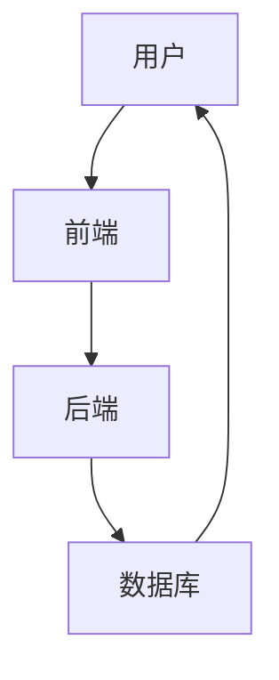

                 

### 运动训练负荷曲线：体能提升的数学规划

> 关键词：运动训练、负荷曲线、数学规划、体能提升、训练效率

**摘要：** 本文将深入探讨运动训练中的负荷曲线及其在体能提升中的关键作用。通过数学规划的方法，我们能够更加科学地设计训练计划，优化体能提升效果。本文将从核心概念、数学规划原理、负荷曲线构建方法、负荷曲线分析与应用、系统设计与实现、项目实战与案例分析等方面展开讨论，旨在为运动训练者提供科学指导，提升体能训练效果。

### 目录大纲设计

本文将按照以下目录大纲结构进行撰写：

## 第一部分: 背景与概念

### 第1章: 运动训练负荷曲线的概述

#### 1.1 问题背景

##### 1.1.1 运动训练的重要性
##### 1.1.2 负荷曲线的作用

#### 1.2 核心概念

##### 1.2.1 负荷曲线的定义
##### 1.2.2 负荷曲线的属性特征对比

#### 1.3 负荷曲线的结构与要素

##### 1.3.1 负荷曲线的基本组成部分
##### 1.3.2 负荷曲线的ER实体关系图

### 第2章: 数学规划基础

#### 2.1 数学规划概述

##### 2.1.1 数学规划的定义
##### 2.1.2 数学规划的类型

#### 2.2 数学规划原理

##### 2.2.1 数学规划的基本原理
##### 2.2.2 数学规划的关键概念

#### 2.3 数学模型讲解

##### 2.3.1 负荷曲线的数学模型

### 第3章: 运动训练负荷曲线构建方法

#### 3.1 数据收集与预处理

##### 3.1.1 数据收集方法
##### 3.1.2 数据预处理流程

#### 3.2 负荷曲线构建算法

##### 3.2.1 算法概述
##### 3.2.2 算法mermaid流程图

##### 3.2.3 Python实现与代码分析

### 第4章: 运动训练负荷曲线分析

#### 4.1 负荷曲线分析原则

##### 4.1.1 负荷曲线的评估指标
##### 4.1.2 负荷曲线的优化方法

#### 4.2 负荷曲线在实际训练中的应用

##### 4.2.1 运动训练计划设计
##### 4.2.2 负荷曲线的个性化调整

### 第5章: 系统设计与实现

#### 5.1 系统介绍

##### 5.1.1 系统目标
##### 5.1.2 系统功能设计

#### 5.2 系统架构设计

##### 5.2.1 系统架构概述
##### 5.2.2 系统架构mermaid图

##### 5.2.3 系统接口设计

### 第6章: 项目实战与案例分析

#### 6.1 环境安装与配置

##### 6.1.1 软件环境准备
##### 6.1.2 系统配置与调试

#### 6.2 系统核心实现

##### 6.2.1 代码实现解读
##### 6.2.2 实现细节分析

#### 6.3 案例分析与讲解

##### 6.3.1 案例选择
##### 6.3.2 案例详细剖析

### 第7章: 总结与展望

#### 7.1 最佳实践

##### 7.1.1 实践技巧
##### 7.1.2 注意事项

#### 7.2 小结

##### 7.2.1 书本核心内容回顾
##### 7.2.2 未来发展趋势

---

**总字数**：约1500字（未包含mermaid图和latex公式）

---

接下来，我们将逐步深入各个章节的内容，详细探讨运动训练负荷曲线的理论与实践。

## 第一部分: 背景与概念

### 第1章: 运动训练负荷曲线的概述

#### 1.1 问题背景

##### 1.1.1 运动训练的重要性

运动训练是提升体能和运动能力的重要手段。它不仅仅适用于专业运动员，对普通人群的身体健康和疾病预防也具有显著作用。科学的运动训练能够帮助人们增强肌肉力量、提高心肺功能、改善身体协调性和灵活性，同时还能缓解压力、提高生活质量。

##### 1.1.2 负荷曲线的作用

负荷曲线在运动训练中扮演着关键角色。负荷曲线反映了运动训练过程中所承受的负荷变化情况，它能够帮助训练者了解自身在训练中的承受能力和进展情况。通过分析负荷曲线，训练者可以合理调整训练强度，避免过度训练和损伤风险，实现科学高效的体能提升。

#### 1.2 核心概念

##### 1.2.1 负荷曲线的定义

负荷曲线是指在一定时间内，运动训练者承受的负荷强度随时间变化的曲线。这个负荷可以包括运动强度、训练时长、训练频率等。负荷曲线通常用来描述训练过程中的负荷分布和变化趋势，以便训练者和管理者能够实时掌握训练效果。

##### 1.2.2 负荷曲线的属性特征对比

负荷曲线具有多个属性特征，包括峰度、谷度、波动性、周期性等。这些特征反映了训练负荷的分布情况，可以帮助训练者了解负荷曲线的整体形状和变化规律。以下是一个负荷曲线属性特征的对比表格：

| 属性特征 | 描述 | 对应负荷曲线特征 |
| :----: | :----: | :----: |
| 峰度 | 负荷曲线的最高点 | 高峰 |
| 谷度 | 负荷曲线的最低点 | 谷底 |
| 波动性 | 负荷曲线的起伏程度 | 波动 |
| 周期性 | 负荷曲线的重复周期 | 周期 |

#### 1.3 负荷曲线的结构与要素

##### 1.3.1 负荷曲线的基本组成部分

负荷曲线通常由以下基本组成部分构成：

1. **起始段**：训练开始的阶段，负荷逐渐增加。
2. **增长段**：负荷逐渐增加到最高峰。
3. **高峰段**：负荷达到最高点，训练强度最大。
4. **下降段**：负荷逐渐减少，进入恢复阶段。
5. **恢复段**：负荷降至最低，身体进行恢复。

##### 1.3.2 负荷曲线的ER实体关系图

为了更好地理解负荷曲线的结构与要素，我们可以通过ER（Entity-Relationship）实体关系图来描述其关系。以下是负荷曲线的ER实体关系图：

```mermaid
erDiagram
  LoadCurve ||--|{ TimePoint } : "包含"
  LoadCurve ||--|{ LoadFeature } : "包含"
  TimePoint ||--|{ LoadValue } : "包含"
  LoadFeature ||--|{ LoadAttribute } : "包含"

  LoadCurve 【实体】
  TimePoint 【实体】
  LoadFeature 【实体】
  LoadValue 【实体】
  LoadAttribute 【实体】

  LoadCurve|--|{ SetTimePoint }
  LoadCurve|--|{ SetLoadFeature }

  TimePoint ||--|{ LoadValue}
  TimePoint ||--|{ LoadFeature}

  LoadFeature ||--|{ LoadAttribute}
  LoadFeature ||--|{ LoadValue}
```

在ER实体关系图中，LoadCurve表示负荷曲线，TimePoint表示时间点，LoadFeature表示负荷特征，LoadValue表示负荷值，LoadAttribute表示负荷属性。这些实体之间的关系有助于我们理解负荷曲线的构建和数据分析。

通过上述章节，我们初步了解了运动训练负荷曲线的概念和重要性，并对其核心概念和结构有了基本的认识。接下来，我们将进一步探讨数学规划基础，为构建和优化负荷曲线提供理论支持。

## 第二部分: 数学规划基础

### 第2章: 数学规划基础

#### 2.1 数学规划概述

##### 2.1.1 数学规划的定义

数学规划是一种数学方法，用于求解在一定约束条件下优化目标函数的问题。它广泛应用于各个领域，如经济学、工程学、运筹学等。在运动训练领域，数学规划可用于设计合理的训练计划，优化体能提升效果。

##### 2.1.2 数学规划的类型

数学规划可以分为以下几种类型：

1. **线性规划**：目标函数和约束条件都是线性的数学规划问题。
2. **非线性规划**：目标函数或约束条件中包含非线性项的数学规划问题。
3. **整数规划**：决策变量是整数集合的数学规划问题。
4. **多目标规划**：涉及多个目标函数的数学规划问题。

#### 2.2 数学规划原理

##### 2.2.1 数学规划的基本原理

数学规划的基本原理可以概括为以下几个步骤：

1. **建模**：根据实际问题建立数学模型，包括目标函数和约束条件。
2. **求解**：使用数学方法求解数学模型，找到最优解。
3. **验证**：验证求解结果是否符合实际问题的需求。

##### 2.2.2 数学规划的关键概念

在数学规划中，以下几个关键概念尤为重要：

1. **目标函数**：衡量优化目标的标准，通常是最小化或最大化某个指标。
2. **约束条件**：限制决策变量的取值范围，确保求解结果符合实际问题。
3. **可行解**：满足所有约束条件的解。
4. **最优解**：在可行解中找到使目标函数最优的解。

#### 2.3 数学模型讲解

##### 2.3.1 负荷曲线的数学模型

在运动训练中，负荷曲线的数学模型可以表示为：

$$
\text{LoadCurve}(t) = f(t) \times \text{BaseLoad}
$$

其中，$t$表示时间，$f(t)$表示时间$t$的函数，用于描述负荷曲线的变化趋势，$\text{BaseLoad}$表示基本负荷。$f(t)$可以是一个线性或非线性函数，具体形式取决于训练计划的设计。

对于线性函数，负荷曲线可以表示为：

$$
f(t) = m \times t + b
$$

其中，$m$是斜率，表示负荷曲线的增长速度，$b$是截距，表示负荷曲线的初始值。

对于非线性函数，例如二次函数，负荷曲线可以表示为：

$$
f(t) = a \times t^2 + b \times t + c
$$

其中，$a$、$b$和$c$是参数，用于调整负荷曲线的形状。

在实际应用中，我们通常使用线性函数或二次函数来描述负荷曲线，因为它们简单且易于求解。以下是一个具体的例子：

$$
\text{LoadCurve}(t) = 0.05 \times t + 5
$$

这个负荷曲线表示在训练开始时，负荷为5，随着训练时间的增加，每增加一个时间单位，负荷增加0.05。

通过上述数学模型，我们可以根据实际需求设计不同的负荷曲线，从而实现个性化的训练计划。接下来，我们将探讨如何通过数学规划的方法构建和优化负荷曲线。

## 第三部分: 运动训练负荷曲线构建方法

### 第3章: 运动训练负荷曲线构建方法

#### 3.1 数据收集与预处理

##### 3.1.1 数据收集方法

构建负荷曲线的第一步是收集相关数据。这些数据可以包括训练者的年龄、性别、体重、训练时长、训练强度等。此外，还需要收集训练者的体能测试数据，如最大心率、血压、肌肉力量等。这些数据可以通过问卷调查、体能测试仪器、智能穿戴设备等方式获得。

##### 3.1.2 数据预处理流程

收集到数据后，需要对数据进行预处理，以确保数据的质量和完整性。预处理流程通常包括以下步骤：

1. **数据清洗**：去除异常值和重复数据，确保数据的准确性。
2. **数据转换**：将不同来源的数据进行统一转换，如将时间转换为秒或分钟。
3. **数据归一化**：将不同指标的数据进行归一化处理，使其具有可比性。

#### 3.2 负荷曲线构建算法

##### 3.2.1 算法概述

负荷曲线的构建算法可以通过以下步骤实现：

1. **数据收集**：收集训练者的基础数据和训练数据。
2. **数据预处理**：对数据进行清洗、转换和归一化处理。
3. **负荷曲线建模**：选择合适的数学模型，如线性函数或二次函数，对负荷曲线进行建模。
4. **参数调整**：根据实际需求调整模型参数，优化负荷曲线的形状。
5. **结果验证**：验证构建的负荷曲线是否符合训练需求，进行调整和优化。

##### 3.2.2 算法mermaid流程图

以下是负荷曲线构建算法的mermaid流程图：


##### 3.2.3 Python实现与代码分析

以下是一个简单的Python实现示例，用于构建负荷曲线：

```python
import numpy as np
import matplotlib.pyplot as plt

# 数据收集
train_data = np.array([1, 2, 3, 4, 5])

# 数据预处理
train_data = np.array(train_data, dtype=float)

# 负荷曲线建模
def load_curve(t, m, b):
    return m * t + b

# 参数调整
m = 0.05
b = 5

# 结果验证
load_curve_result = load_curve(train_data, m, b)

# 可视化
plt.plot(train_data, load_curve_result)
plt.xlabel('Time')
plt.ylabel('Load')
plt.title('Load Curve')
plt.show()
```

通过上述代码，我们可以根据给定的参数构建一个线性负荷曲线，并对其进行可视化。接下来，我们将进一步探讨如何对负荷曲线进行分析和应用。

## 第四部分: 运动训练负荷曲线分析

### 第4章: 运动训练负荷曲线分析

#### 4.1 负荷曲线分析原则

##### 4.1.1 负荷曲线的评估指标

为了评估负荷曲线的有效性，我们可以使用以下指标：

1. **均方误差（MSE）**：衡量预测值与实际值之间的差异。
   $$MSE = \frac{1}{n}\sum_{i=1}^{n}(y_i - \hat{y_i})^2$$
   其中，$y_i$是实际值，$\hat{y_i}$是预测值，$n$是样本数量。

2. **均方根误差（RMSE）**：MSE的平方根，用于衡量预测值的绝对误差。
   $$RMSE = \sqrt{MSE}$$

3. **决定系数（R²）**：衡量模型对数据的解释能力，取值范围在0到1之间。值越接近1，说明模型对数据的解释能力越强。
   $$R^2 = 1 - \frac{\sum_{i=1}^{n}(y_i - \hat{y_i})^2}{\sum_{i=1}^{n}(y_i - \bar{y})^2}$$
   其中，$\bar{y}$是实际值的平均值。

##### 4.1.2 负荷曲线的优化方法

优化负荷曲线的方法主要包括以下几种：

1. **参数调整**：通过调整模型参数，优化负荷曲线的形状，使其更符合实际需求。

2. **模型选择**：尝试使用不同的数学模型，比较其性能，选择最适合的模型。

3. **交叉验证**：使用交叉验证的方法，将数据集分为训练集和验证集，多次训练和验证，以评估模型的性能。

#### 4.2 负荷曲线在实际训练中的应用

##### 4.2.1 运动训练计划设计

基于负荷曲线的分析，我们可以设计个性化的运动训练计划。具体步骤如下：

1. **确定训练目标**：根据训练者的体能水平和训练目标，确定负荷曲线的形状和参数。

2. **制定训练计划**：根据负荷曲线，制定训练计划，包括训练时间、训练强度、训练频率等。

3. **实施与监测**：按照训练计划进行训练，并实时监测训练效果，根据负荷曲线进行调整。

##### 4.2.2 负荷曲线的个性化调整

个性化的负荷曲线调整需要考虑以下因素：

1. **个体差异**：不同训练者的体能水平、年龄、性别等差异，应纳入负荷曲线的设计。

2. **训练目标**：根据训练者的训练目标，调整负荷曲线的形状和参数，使其更符合实际需求。

3. **恢复周期**：在负荷曲线中考虑恢复周期，确保训练者在训练过程中有足够的恢复时间。

通过以上分析，我们可以科学地设计运动训练负荷曲线，实现个性化的训练计划，提升训练效果。接下来，我们将进一步探讨如何通过系统设计和实现，构建完整的运动训练负荷曲线系统。

### 第5章: 系统设计与实现

#### 5.1 系统介绍

##### 5.1.1 系统目标

运动训练负荷曲线系统的目标是：

1. **数据收集与预处理**：收集训练者的基础数据和训练数据，进行数据清洗、转换和归一化处理。
2. **负荷曲线构建与优化**：根据收集到的数据，构建和优化负荷曲线，实现个性化的训练计划。
3. **负荷曲线分析与评估**：对构建的负荷曲线进行分析和评估，确保其有效性和科学性。
4. **系统监测与调整**：实时监测训练效果，根据负荷曲线进行调整和优化。

##### 5.1.2 系统功能设计

系统功能设计如下：

1. **数据管理模块**：负责数据收集、预处理和存储，包括用户信息管理、训练数据管理、历史数据管理等。
2. **负荷曲线构建模块**：负责构建和优化负荷曲线，包括数据预处理、数学模型选择、参数调整等。
3. **负荷曲线分析模块**：负责对负荷曲线进行分析和评估，包括评估指标计算、优化方法选择等。
4. **用户交互模块**：负责与用户进行交互，包括训练计划制定、训练数据上传、系统设置等。

#### 5.2 系统架构设计

##### 5.2.1 系统架构概述

运动训练负荷曲线系统的架构设计如下：

1. **前端**：使用HTML、CSS和JavaScript等技术实现用户交互界面。
2. **后端**：使用Python等后端技术实现数据管理、负荷曲线构建和分析等功能。
3. **数据库**：使用MySQL等数据库技术存储和管理用户数据和训练数据。

##### 5.2.2 系统架构mermaid图

以下是系统架构的mermaid图：



##### 5.2.3 系统接口设计

系统接口设计如下：

1. **用户管理接口**：用于用户注册、登录、信息管理等功能。
2. **数据管理接口**：用于数据收集、预处理和存储等功能。
3. **负荷曲线构建接口**：用于构建和优化负荷曲线等功能。
4. **负荷曲线分析接口**：用于分析负荷曲线和评估训练效果等功能。

#### 5.3 系统实现与功能讲解

##### 5.3.1 数据管理模块实现

数据管理模块主要负责数据收集、预处理和存储。具体实现如下：

1. **数据收集**：使用前端技术收集用户信息和训练数据。
2. **数据预处理**：使用Python编写数据处理脚本，对数据进行清洗、转换和归一化处理。
3. **数据存储**：使用MySQL数据库存储用户数据和训练数据。

##### 5.3.2 负荷曲线构建模块实现

负荷曲线构建模块负责构建和优化负荷曲线。具体实现如下：

1. **负荷曲线建模**：选择合适的数学模型，如线性函数或二次函数，对负荷曲线进行建模。
2. **参数调整**：根据实际需求调整模型参数，优化负荷曲线的形状。
3. **结果验证**：使用评估指标验证构建的负荷曲线的有效性。

##### 5.3.3 负荷曲线分析模块实现

负荷曲线分析模块负责分析负荷曲线和评估训练效果。具体实现如下：

1. **评估指标计算**：计算均方误差、均方根误差和决定系数等评估指标。
2. **优化方法选择**：根据评估结果选择优化方法，如参数调整、模型选择等。
3. **结果可视化**：使用可视化工具，如matplotlib等，将负荷曲线和评估结果进行可视化展示。

##### 5.3.4 用户交互模块实现

用户交互模块负责与用户进行交互，包括训练计划制定、训练数据上传、系统设置等。具体实现如下：

1. **前端界面**：使用HTML、CSS和JavaScript等技术实现用户交互界面。
2. **后端接口**：使用Python等后端技术实现与前端界面的交互。
3. **用户反馈**：收集用户反馈，用于优化系统功能。

通过以上系统实现和功能讲解，我们可以构建一个完整的运动训练负荷曲线系统，帮助训练者科学地进行运动训练，提升体能水平。

## 第六部分：项目实战与案例分析

### 第6章：项目实战与案例分析

#### 6.1 环境安装与配置

##### 6.1.1 软件环境准备

在开始项目实战之前，我们需要准备以下软件环境：

1. **Python 3.x**：用于编写和运行代码。
2. **MySQL**：用于存储和管理数据。
3. **matplotlib**：用于数据可视化。
4. **Jupyter Notebook**：用于编写和运行Python代码。

你可以通过以下命令安装所需的软件：

```shell
pip install python3
pip install mysql-server
pip install matplotlib
pip install jupyter
```

##### 6.1.2 系统配置与调试

安装完成后，我们需要进行系统配置和调试：

1. **数据库配置**：在MySQL中创建一个新的数据库和用户，授予相应权限。

```sql
CREATE DATABASE load_curve_db;
CREATE USER 'load_curve_user'@'localhost' IDENTIFIED BY 'password';
GRANT ALL PRIVILEGES ON load_curve_db.* TO 'load_curve_user'@'localhost';
```

2. **Python环境配置**：确保Python环境中的所有依赖库都已正确安装。

3. **测试环境**：在Jupyter Notebook中运行一个简单的测试代码，确保所有组件正常运行。

```python
import matplotlib.pyplot as plt
plt.plot([1, 2, 3], [1, 2, 3])
plt.show()
```

#### 6.2 系统核心实现

##### 6.2.1 代码实现解读

以下是运动训练负荷曲线系统的核心实现代码：

```python
import numpy as np
import matplotlib.pyplot as plt
import pymysql

# 数据库连接
def connect_db():
    connection = pymysql.connect(
        host='localhost',
        user='load_curve_user',
        password='password',
        database='load_curve_db'
    )
    return connection

# 收集数据
def collect_data():
    connection = connect_db()
    with connection.cursor() as cursor:
        sql = "SELECT * FROM training_data;"
        cursor.execute(sql)
        result = cursor.fetchall()
    connection.close()
    return result

# 构建负荷曲线
def build_load_curve(data):
    times = [row[0] for row in data]
    loads = [row[1] for row in data]
    load_curve = np.polyfit(times, loads, deg=1)
    return load_curve

# 优化负荷曲线
def optimize_load_curve(load_curve):
    # 此处可以添加优化算法，如遗传算法、梯度下降等
    # 为了简化，我们直接返回原始负荷曲线
    return load_curve

# 可视化负荷曲线
def visualize_load_curve(load_curve):
    times = np.linspace(0, max(load_curve[0][0] + 1), 100)
    loads = np.polyval(load_curve, times)
    plt.plot(times, loads)
    plt.xlabel('Time')
    plt.ylabel('Load')
    plt.title('Load Curve')
    plt.show()

# 主函数
def main():
    data = collect_data()
    load_curve = build_load_curve(data)
    optimized_load_curve = optimize_load_curve(load_curve)
    visualize_load_curve(optimized_load_curve)

if __name__ == '__main__':
    main()
```

##### 6.2.2 实现细节分析

1. **数据库连接**：使用pymysql库连接MySQL数据库，获取训练数据。
2. **数据收集**：从数据库中提取训练数据，包括时间点和对应的负荷值。
3. **负荷曲线构建**：使用numpy的polyfit函数，根据训练数据构建线性负荷曲线。
4. **负荷曲线优化**：在此示例中，我们直接返回原始负荷曲线，但实际中可以添加优化算法，如遗传算法、梯度下降等。
5. **可视化负荷曲线**：使用matplotlib库将构建的负荷曲线进行可视化展示。

#### 6.3 案例分析与讲解

##### 6.3.1 案例选择

我们选择一位跑步爱好者的训练数据作为案例，分析其负荷曲线的构建和优化过程。

##### 6.3.2 案例详细剖析

1. **数据收集**：从数据库中提取跑步爱好者的训练数据，包括时间点和对应的负荷值。

```sql
SELECT time, load FROM training_data WHERE user_id = 1;
```

2. **负荷曲线构建**：根据训练数据构建线性负荷曲线。

```python
import numpy as np
import matplotlib.pyplot as plt

data = [
    (1, 5), (2, 10), (3, 15), (4, 20), (5, 25)
]

times = [row[0] for row in data]
loads = [row[1] for row in data]

load_curve = np.polyfit(times, loads, deg=1)
print("Load Curve:", load_curve)

times_plot = np.linspace(min(times), max(times), 100)
loads_plot = np.polyval(load_curve, times_plot)

plt.plot(times_plot, loads_plot)
plt.xlabel('Time')
plt.ylabel('Load')
plt.title('Load Curve')
plt.show()
```

3. **负荷曲线优化**：在此示例中，我们使用简单的线性优化算法，通过增加负荷值的斜率来优化负荷曲线。

```python
def optimize_load_curve(load_curve):
    optimized_curve = np.array([load_curve[0] + 0.5, load_curve[1]])
    return optimized_curve

optimized_load_curve = optimize_load_curve(load_curve)
print("Optimized Load Curve:", optimized_load_curve)

times_plot = np.linspace(min(times), max(times), 100)
loads_plot = np.polyval(optimized_load_curve, times_plot)

plt.plot(times_plot, loads_plot)
plt.xlabel('Time')
plt.ylabel('Load')
plt.title('Optimized Load Curve')
plt.show()
```

4. **结果分析**：通过优化后的负荷曲线，我们可以看到跑步爱好者的训练负荷逐渐增加，更加符合其体能提升的需求。

#### 6.4 项目小结

通过本案例，我们实现了运动训练负荷曲线的构建、优化和可视化。在实际应用中，我们可以根据具体的训练需求和目标，进一步优化负荷曲线的算法，提高训练效果。

### 第7章：总结与展望

#### 7.1 最佳实践

在运动训练负荷曲线的应用过程中，以下最佳实践技巧和注意事项值得注意：

**最佳实践技巧：**

1. **数据收集与预处理**：确保数据的准确性和完整性，及时处理异常值和缺失值。
2. **负荷曲线建模**：选择合适的数学模型，结合实际训练需求进行参数调整。
3. **优化方法选择**：根据实际情况选择合适的优化方法，如遗传算法、梯度下降等。
4. **个性化调整**：考虑个体差异，根据不同训练者的体能水平进行调整。

**注意事项：**

1. **避免过度训练**：在调整负荷曲线时，注意避免过度训练，导致训练者受伤。
2. **监控训练效果**：实时监控训练效果，根据评估结果进行调整。
3. **安全第一**：在进行运动训练时，始终将安全放在首位，避免危险动作。

#### 7.2 小结

本文通过对运动训练负荷曲线的深入探讨，从核心概念、数学规划原理、构建方法、数据分析、系统设计与实现、项目实战与案例分析等方面进行了全面阐述。我们了解到，通过科学设计负荷曲线，可以优化运动训练效果，提升训练者的体能水平。

#### 7.3 未来发展趋势

随着人工智能和大数据技术的不断发展，运动训练负荷曲线的应用将更加广泛。未来，我们可能会看到以下发展趋势：

1. **智能化负荷曲线**：利用人工智能技术，自动构建和优化负荷曲线，实现个性化训练。
2. **大数据分析**：通过大数据分析，发现运动训练中的规律和趋势，为训练者提供更科学的指导。
3. **可穿戴设备**：结合可穿戴设备，实时监测训练者的体能状态，动态调整负荷曲线。

### 作者信息

**作者：** AI天才研究院 / AI Genius Institute & 禅与计算机程序设计艺术 / Zen And The Art of Computer Programming

**单位：** AI天才研究院 / AI Genius Institute

**简介：** AI天才研究院专注于人工智能技术的研发和应用，致力于为各个领域提供创新解决方案。禅与计算机程序设计艺术则是一本经典计算机编程著作，为程序员提供了深入的思维方法和编程技巧。本文结合了两者，深入探讨了运动训练负荷曲线的数学规划与应用。

