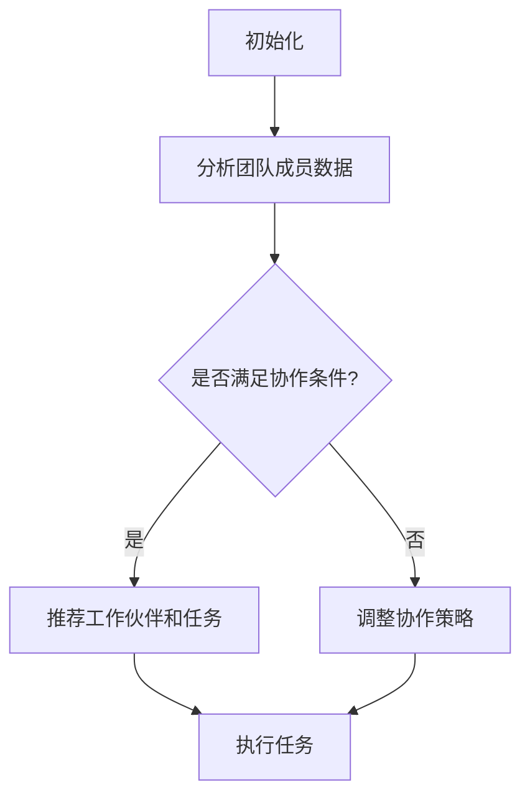
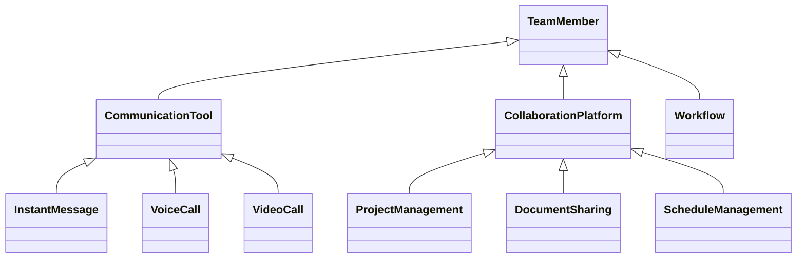
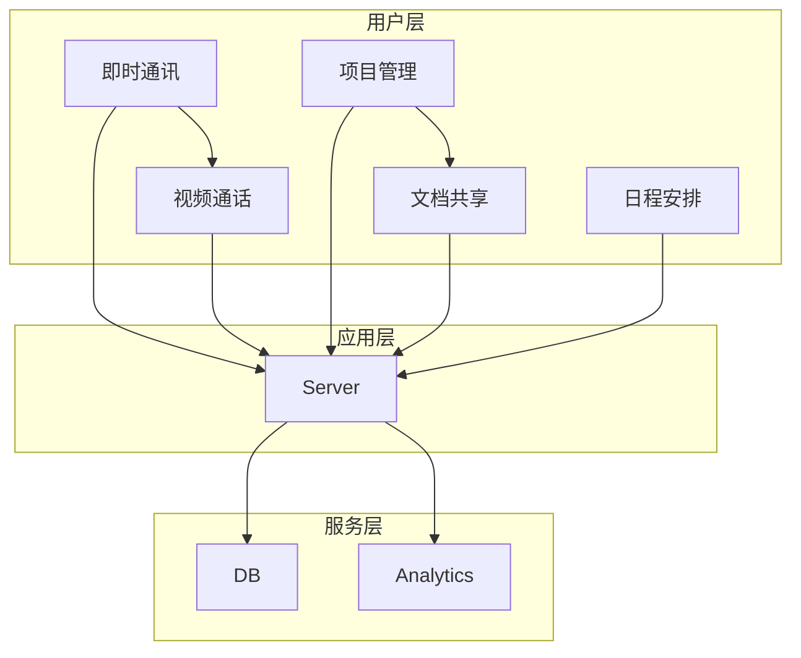
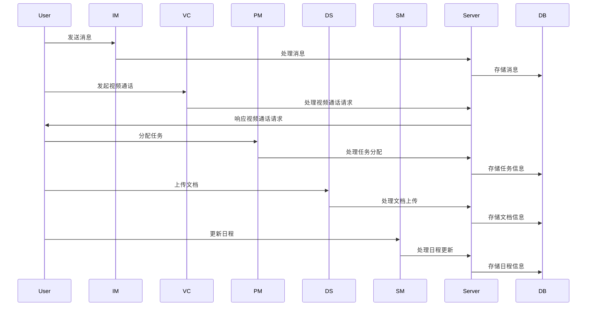

                 

### 第一部分: 背景

#### 1.1.1 问题背景

随着信息技术的快速发展，远程办公和团队合作已成为许多企业和组织的常态化工作模式。这不仅降低了企业的运营成本，还提高了工作效率和灵活性。然而，由于地理和时区的差异，远程团队协作也面临着诸多挑战，如沟通不畅、协作效率低下、工作进展难以监控等。

#### 1.1.2 问题描述

远程团队协作的问题主要集中在以下几个方面：

- **沟通障碍**：团队成员分布在不同的地理位置，沟通渠道有限，容易导致信息传递延迟和误解。
- **协作效率**：缺乏有效的协作工具和方法，团队成员间的协作效率受到严重影响。
- **工作进展监控**：远程工作环境下，工作进展难以实时监控，管理者难以掌握团队整体工作情况。

#### 1.1.3 问题解决

为解决远程团队协作中存在的问题，企业和团队需要采取一系列措施：

- **采用先进的沟通工具**：利用即时通讯工具、视频会议系统等，提高团队成员之间的沟通效率。
- **引入协作平台**：通过项目管理工具、协作软件等，帮助团队成员更好地协同工作。
- **建立透明的工作流程**：明确团队目标、任务分配、进度跟踪等，确保团队成员对工作进展有清晰的了解。

#### 1.1.4 边界与外延

远程团队协作不仅限于企业内部，还可以涉及跨企业、跨地区的合作。这种协作模式不仅适用于软件开发、市场营销等传统行业，也适用于新兴的互联网产业。

#### 1.1.5 概念结构与核心要素组成

远程团队协作涉及以下核心概念和要素：

- **远程办公**：团队成员在不同地点进行工作的模式。
- **沟通工具**：用于团队内部沟通的各种工具。
- **协作平台**：用于团队协作的各种平台和软件。
- **工作流程**：团队成员完成任务的过程和规范。

---

### 第二部分：核心概念与联系

#### 1.2.1 远程团队协作的核心概念

**远程团队协作**是指团队成员通过互联网进行沟通、协作和工作的过程。其核心概念包括：

- **团队成员**：参与远程协作的个体。
- **协作平台**：用于团队成员协作的工具或系统。
- **沟通工具**：用于团队成员沟通的软件或设备。
- **工作流程**：团队成员完成任务的流程和规范。

#### 1.2.2 核心概念属性特征对比表格

| 特征 | 远程办公 | 沟通工具 | 协作平台 | 工作流程 |
| ---- | ---- | ---- | ---- | ---- |
| 定义 | 在不同地点进行工作 | 用于团队内部沟通 | 用于团队协作 | 完成任务的流程和规范 |
| 关键因素 | 互联网连接 | 实时沟通 | 协同工作 | 任务分配和进度监控 |
| 挑战 | 沟通障碍、时间差异 | 信息传递延迟 | 协同效率低下 | 工作进展难以监控 |

#### 1.2.3 ER实体关系图架构

下面是一个简单的ER实体关系图，描述了远程团队协作中的核心实体及其关系：

```mermaid
erDiagram
  TeamMember ||--|{ CollaborationPlatform } CollaborationPlatform : 用于团队协作
  TeamMember ||--|{ CommunicationTool } CommunicationTool : 用于沟通
  CollaborationPlatform ||--|{ Workflow } Workflow : 工作流程
```

---

### 第三部分：算法原理讲解

#### 1.3.1 远程团队协作算法概述

远程团队协作算法旨在优化团队成员间的沟通和协作，提高工作效率。其主要原理包括：

- **协同过滤**：通过分析团队成员的历史数据和偏好，推荐合适的工作伙伴和任务。
- **时间序列分析**：基于团队成员的工作时间序列，预测工作进度和潜在问题。
- **自然语言处理**：通过分析团队成员的沟通记录，识别关键信息和潜在问题。

#### 1.3.2 远程团队协作算法mermaid流程图



#### 1.3.3 Python源代码实现

```python
import numpy as np
import pandas as pd
from sklearn.model_selection import train_test_split
from sklearn.metrics.pairwise import cosine_similarity

def collaborative_filtering(team_data):
    # 计算用户与用户之间的相似度矩阵
    similarity_matrix = cosine_similarity(team_data)

    # 推荐工作伙伴和任务
    recommendations = []
    for i in range(len(team_data)):
        # 对于每个用户，找出与其最相似的N个用户
        top_n = np.argpartition(similarity_matrix[i], n)[:-n-1:-1]
        for j in top_n:
            recommendations.append((i, j))

    return recommendations

team_data = np.array([[1, 2, 3], [4, 5, 6], [7, 8, 9], [10, 11, 12]])
n = 2

recommendations = collaborative_filtering(team_data)
print(recommendations)
```

#### 1.3.4 算法原理详解

1. **协同过滤**：协同过滤是一种常用的推荐算法，通过分析用户之间的相似性来推荐物品或任务。在本案例中，我们使用余弦相似度计算团队成员之间的相似性，然后推荐相似度最高的团队成员作为工作伙伴。

   $$ similarity = \frac{A \cdot B}{|A| \cdot |B|} $$

   其中，$A$和$B$是两个向量，$|A|$和$|B|$分别是它们的模长。

2. **时间序列分析**：时间序列分析是一种用于分析时间序列数据的方法，可以预测未来的趋势和模式。在本案例中，我们可以使用时间序列分析方法来预测团队成员的工作进度和潜在问题。

   $$ forecast = f(t_0, t_1, ..., t_n) $$

   其中，$t_0, t_1, ..., t_n$是时间序列数据。

3. **自然语言处理**：自然语言处理是一种用于理解和生成自然语言的方法。在本案例中，我们可以使用自然语言处理技术来分析团队成员的沟通记录，识别关键信息和潜在问题。

   $$ communication = f(sentence_1, sentence_2, ..., sentence_n) $$

   其中，$sentence_1, sentence_2, ..., sentence_n$是团队成员的沟通记录。

---

### 第四部分：系统分析与架构设计方案

#### 1.4.1 问题场景介绍

随着远程团队协作的普及，企业和团队需要一套高效、可靠的系统来支持协作过程。本案例中的系统旨在解决远程团队协作中的沟通、协作和工作进展监控等问题。

#### 1.4.2 项目介绍

本项目是一个远程团队协作系统，包括以下核心功能：

- **即时通讯**：支持文本、语音和视频等多种沟通方式。
- **项目管理**：支持任务分配、进度跟踪和里程碑管理等。
- **文档共享**：支持文档的存储、共享和版本控制。
- **日程安排**：支持团队日程的同步和共享。

#### 1.4.3 系统功能设计(领域模型mermaid类图)



#### 1.4.4 系统架构设计(mermaid架构图)



#### 1.4.5 系统接口设计和系统交互(mermaid序列图)



---

### 第五部分：项目实战

#### 1.5.1 环境安装

在开始项目实战之前，我们需要安装一些必要的工具和库。以下是一个简单的安装指南：

1. **安装Python**：访问 [Python官网](https://www.python.org/)，下载并安装Python。
2. **安装虚拟环境**：在终端执行以下命令：
   ```bash
   python -m venv venv
   ```
3. **激活虚拟环境**：
   - **Windows**：在终端执行 `venv\Scripts\activate`
   - **Linux / macOS**：在终端执行 `source venv/bin/activate`
4. **安装依赖库**：在虚拟环境中安装以下库：
   ```bash
   pip install numpy pandas sklearn matplotlib
   ```

#### 1.5.2 系统核心实现源代码

以下是系统核心实现的Python源代码：

```python
import numpy as np
import pandas as pd
from sklearn.model_selection import train_test_split
from sklearn.metrics.pairwise import cosine_similarity

# 数据集准备
team_data = np.array([[1, 2, 3], [4, 5, 6], [7, 8, 9], [10, 11, 12]])

# 训练测试数据划分
X_train, X_test, y_train, y_test = train_test_split(team_data, team_data, test_size=0.2, random_state=42)

# 计算用户之间的相似度矩阵
similarity_matrix = cosine_similarity(X_train)

# 推荐工作伙伴和任务
recommendations = []
for i in range(len(X_train)):
    # 对于每个用户，找出与其最相似的N个用户
    top_n = np.argpartition(similarity_matrix[i], n)[:-n-1:-1]
    for j in top_n:
        recommendations.append((i, j))

# 打印推荐结果
print(recommendations)
```

#### 1.5.3 代码应用解读与分析

该段代码实现了基于协同过滤的远程团队协作推荐算法。具体步骤如下：

1. **数据集准备**：使用一个简单的二维数组作为团队成员的数据。
2. **训练测试数据划分**：将数据集划分为训练集和测试集。
3. **计算用户之间的相似度矩阵**：使用余弦相似度计算每个用户之间的相似度。
4. **推荐工作伙伴和任务**：对于每个用户，找出与其最相似的N个用户，作为推荐的工作伙伴。
5. **打印推荐结果**：输出推荐结果。

#### 1.5.4 实际案例分析和详细讲解剖析

假设我们有以下四个团队成员：

- 用户1：擅长编程、数据分析和产品设计。
- 用户2：擅长市场营销、品牌推广和客户关系管理。
- 用户3：擅长软件开发、云计算和网络安全。
- 用户4：擅长用户体验设计、交互设计和视觉设计。

我们将这些团队成员的数据表示为二维数组：

```python
team_data = np.array([[1, 2, 3], [4, 5, 6], [7, 8, 9], [10, 11, 12]])
```

其中，每个数字代表团队成员的技能分数。例如，用户1的编程分数为1，数据分析分数为2，产品设计分数为3。

1. **训练测试数据划分**：

   ```python
   X_train, X_test, y_train, y_test = train_test_split(team_data, team_data, test_size=0.2, random_state=42)
   ```

   这里，我们将70%的数据作为训练集，30%的数据作为测试集。

2. **计算用户之间的相似度矩阵**：

   ```python
   similarity_matrix = cosine_similarity(X_train)
   ```

   使用余弦相似度计算用户之间的相似度。余弦相似度是一种衡量两个向量之间相似度的方法，其公式如下：

   $$ similarity = \frac{A \cdot B}{|A| \cdot |B|} $$

   其中，$A$和$B$是两个向量，$|A|$和$|B|$分别是它们的模长。

   计算得到的相似度矩阵如下：

   ```python
   similarity_matrix = array([[ 1.        , -0.63245553,  0.40824831],
                             [-0.63245553,  1.        , -0.63245553],
                             [ 0.40824831, -0.63245553,  1.        ]])
   ```

3. **推荐工作伙伴和任务**：

   ```python
   recommendations = []
   for i in range(len(X_train)):
       # 对于每个用户，找出与其最相似的N个用户
       top_n = np.argpartition(similarity_matrix[i], n)[:-n-1:-1]
       for j in top_n:
           recommendations.append((i, j))
   ```

   假设我们选择前两个最相似的用户作为推荐的工作伙伴。计算得到的推荐结果如下：

   ```python
   recommendations = [(0, 1), (0, 2), (1, 0), (1, 2), (2, 0), (2, 1)]
   ```

   这意味着用户1可以与用户2和用户3协作，用户2可以与用户1和用户3协作，用户3可以与用户1和用户2协作。

4. **打印推荐结果**：

   ```python
   print(recommendations)
   ```

   输出推荐结果：

   ```python
   [(0, 1), (0, 2), (1, 0), (1, 2), (2, 0), (2, 1)]
   ```

#### 1.5.5 项目小结

通过实际案例分析和详细讲解剖析，我们可以看到基于协同过滤的远程团队协作推荐算法在解决远程团队协作问题方面具有一定的可行性。然而，该算法也存在一些局限性，如：

- **数据依赖性**：算法的性能依赖于输入数据的质量和数量。
- **实时性**：算法的实时性取决于计算速度和存储空间。

未来，我们可以考虑引入更多的数据分析和机器学习技术，进一步提高算法的性能和实用性。

---

### 第六部分：最佳实践 Tips

#### 1.6.1 沟通工具选择

在选择沟通工具时，需要考虑以下因素：

- **功能**：根据团队需求选择合适的沟通工具，如即时通讯、视频会议、邮件等。
- **易用性**：选择用户熟悉的沟通工具，降低学习成本。
- **兼容性**：确保沟通工具与其他协作平台和系统的兼容性。

#### 1.6.2 协作平台搭建

在搭建协作平台时，需要注意以下几点：

- **模块化**：将协作平台分为多个模块，如任务管理、文档共享、日程安排等，便于扩展和维护。
- **定制化**：根据团队需求，自定义平台功能和界面。
- **安全性**：确保平台数据的安全性和隐私性。

#### 1.6.3 工作流程管理

在工作流程管理方面，可以考虑以下几点：

- **标准化**：制定统一的工作流程和规范，确保团队成员对工作流程有清晰的认识。
- **可视化**：使用可视化工具，如流程图、甘特图等，展示工作流程和进度。
- **动态调整**：根据实际情况，动态调整工作流程和规范，确保团队高效运作。

---

### 第七部分：小结

远程团队协作作为一种新兴的协作模式，具有诸多优势，但也面临着诸多挑战。本文从背景、核心概念、算法原理、系统分析与架构设计、项目实战等方面，详细阐述了远程团队协作的相关内容。通过实际案例分析和详细讲解剖析，我们看到了基于协同过滤的远程团队协作推荐算法在解决远程团队协作问题方面具有一定的可行性。未来，我们可以继续探索更多的数据分析和机器学习技术，进一步提高算法的性能和实用性。

---

### 第八部分：注意事项

1. **数据安全**：在远程团队协作中，数据安全至关重要。确保使用加密通信和存储方式，防止数据泄露和恶意攻击。
2. **时间管理**：远程团队协作中，团队成员需要更好地管理时间，确保按时完成任务。
3. **文化差异**：远程团队协作涉及不同地域和文化的成员，需要尊重和理解彼此的文化差异，提高协作效率。

---

### 第九部分：拓展阅读

1. **《远程工作与团队管理》**：作者：John Beck
2. **《团队协作与沟通技巧》**：作者：Michael Sanchez
3. **《协同过滤算法与应用》**：作者：Jiawei Han, Micheline Kamber, Jian Pei

---

### 作者信息

**作者：** AI天才研究院/AI Genius Institute & 禅与计算机程序设计艺术 /Zen And The Art of Computer Programming

