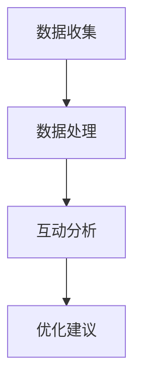
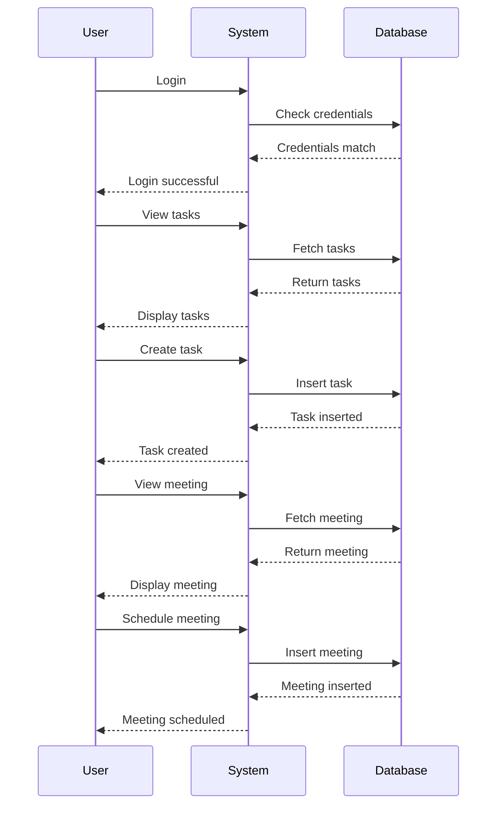

                 


### 引言：远程团队建设的必要性和挑战

在当今全球化的数字经济浪潮中，远程工作已经成为企业运营的一种常态。远程团队建设作为这一背景下的重要课题，旨在提升虚拟团队的协作效率与整体凝聚力。以下，我们将逐步探讨远程团队建设的必要性及其所面临的挑战。

#### **必要性**

首先，远程团队建设的必要性体现在以下几个方面：

1. **提高工作效率**：远程工作环境灵活，团队成员可以根据自身情况安排工作，从而减少通勤时间，提高工作效率。

2. **扩大人才选择范围**：远程工作使得企业不再受限于地理位置，可以吸引全球范围内的人才，增强团队的专业实力。

3. **降低运营成本**：远程办公减少了实体办公空间的需求，降低了企业的租金、水电等运营成本。

4. **提升员工满意度**：远程工作让员工拥有更大的自主权，提高工作与生活的平衡，从而提升员工的满意度和忠诚度。

#### **挑战**

然而，远程团队建设也面临诸多挑战：

1. **沟通障碍**：远程团队缺乏面对面的交流，容易导致信息传递不畅，误解和冲突增加。

2. **管理难度**：远程团队管理复杂，领导者难以实时掌握团队成员的工作状态，管理工作难度加大。

3. **团队凝聚力下降**：缺少日常的面对面交流和团队活动，远程团队成员之间的联系可能变得疏远，团队凝聚力下降。

4. **技术依赖**：远程工作对技术和设备的依赖程度较高，技术故障可能导致团队工作停滞。

#### **解决策略**

针对上述挑战，我们可以采取以下策略：

1. **加强沟通**：采用多种沟通工具，如视频会议、即时消息、项目管理软件等，确保信息畅通。

2. **建立明确的管理制度**：制定清晰的工作流程和目标，确保团队成员明确自己的职责和任务。

3. **定期团队活动**：组织线上团队活动，如虚拟团建、讨论会等，增强团队成员之间的联系。

4. **提升技术支持**：确保技术设备和网络稳定，提供必要的培训和支持，降低技术依赖带来的风险。

通过上述分析和解决策略，我们可以看到，远程团队建设不仅必要，而且在实践中也具有一定的挑战性。接下来，我们将进一步探讨如何具体实施这些策略，以增强远程团队的凝聚力。

### 背景介绍：远程团队建设的核心概念与理论基础

在深入探讨远程团队建设之前，首先需要明确一些核心概念和理论基础。这些概念和理论为远程团队建设提供了指导和支撑，确保我们能够全面理解和应对远程团队的特殊挑战。

#### **远程团队的核心概念**

1. **远程工作**：远程工作指的是团队成员不在同一物理空间内工作，通常通过互联网进行沟通和协作。远程工作可以是全职的，也可以是兼职的，甚至可以是临时性的。

2. **虚拟团队**：虚拟团队是由地理位置分散、使用信息技术进行沟通和协作的成员组成的团队。虚拟团队的成员可能分布在不同的城市、国家，甚至是时区。

3. **团队凝聚力**：团队凝聚力是指团队成员之间的紧密联系和合作程度。高凝聚力的团队通常表现出更强的合作精神、更高的工作满意度和更好的绩效。

4. **远程团队动力学**：远程团队动力学研究远程团队内部的动力因素，包括沟通模式、决策过程、领导风格等。

#### **理论基础**

1. **社会存在理论**：社会存在理论认为，人的社会关系和交往是人类行为的基础。在远程团队中，通过建立良好的社会关系，可以增强团队凝聚力。

2. **沟通理论**：沟通理论强调沟通在团队中的作用，特别是在信息传递、决策支持和冲突解决方面。有效的沟通是远程团队成功的关键。

3. **领导理论**：领导理论探讨领导者在团队中的作用，包括领导风格、领导行为和领导效能。不同的领导风格对远程团队的建设和维系有不同的影响。

4. **团队合作理论**：团队合作理论关注团队成员如何通过协作实现共同目标。在远程团队中，协作的效率和质量直接影响团队绩效。

#### **问题背景**

随着远程工作的普及，越来越多的企业开始采用虚拟团队的形式进行运作。然而，这种工作模式也带来了一系列问题：

- **沟通障碍**：由于缺乏面对面的交流，团队成员之间的信息传递容易出现误解和延误。

- **管理难度**：远程团队的管理复杂度增加，领导者难以实时监督团队成员的工作状态。

- **团队凝聚力下降**：远程团队成员之间的日常交流减少，导致团队凝聚力下降。

- **技术依赖**：远程工作对技术和设备的依赖程度较高，技术故障可能导致团队工作停滞。

这些问题使得远程团队建设成为一个亟待解决的课题。

#### **问题描述**

远程团队建设的关键问题包括：

- **如何建立有效的沟通机制**：远程团队需要采用多种沟通工具和策略，确保信息畅通无阻。

- **如何提高团队凝聚力**：远程团队成员之间的联系需要通过定期的团队活动和互动来加强。

- **如何进行有效的团队管理**：领导者需要制定明确的管理制度和目标，确保团队成员的工作高效有序。

- **如何应对技术依赖带来的风险**：企业需要提供稳定的技术支持和培训，降低技术故障对工作的影响。

#### **问题解决**

为了解决上述问题，我们可以采取以下策略：

1. **加强沟通**：采用视频会议、即时消息、项目管理软件等工具，确保团队成员之间的沟通畅通。

2. **组织线上团队活动**：定期组织虚拟团建、讨论会等活动，增强团队成员之间的联系。

3. **制定明确的管理制度和目标**：确保团队成员明确自己的职责和任务，提高工作效率。

4. **提供技术支持和培训**：确保技术设备和网络稳定，提供必要的培训和支持，降低技术依赖带来的风险。

通过上述策略的实施，远程团队建设将能够更好地应对挑战，提升团队的协作效率和整体凝聚力。

### 核心概念与联系

在深入探讨远程团队建设的过程中，理解核心概念及其相互联系至关重要。以下我们将详细讨论几个关键概念，并展示其属性特征对比表格和ER实体关系图架构。

#### **核心概念**

1. **远程团队**：远程团队是由地理位置分散、通过信息技术进行沟通和协作的成员组成的团队。

2. **团队凝聚力**：团队凝聚力是指团队成员之间的紧密联系和协作程度，包括信任、共同目标、共享价值观等方面。

3. **领导风格**：领导风格是指领导者如何影响团队成员，包括权威型、民主型、放任型等。

4. **沟通模式**：沟通模式是指团队成员之间信息传递的方式，包括同步沟通（实时沟通）和异步沟通（非实时沟通）。

#### **属性特征对比表格**

| 核心概念   | 属性特征                                       |
|------------|----------------------------------------------|
| 远程团队   | - 成员地理位置分散<br>- 信息技术支撑沟通<br>- 自主性强 |
| 团队凝聚力 | - 信任<br>- 共同目标<br>- 高度协作<br>- 高满意度 |
| 领导风格   | - 权威型：决策集中<br>- 民主型：参与决策<br>- 放任型：自主工作 |
| 沟通模式   | - 同步沟通：实时响应<br>- 异步沟通：非实时传递 |

#### **ER实体关系图架构**

以下是一个简单的ER实体关系图，展示远程团队建设中的关键实体及其关系：

```mermaid
erDiagram
  TeamMember ||--|{ VirtualTeam : member_of }
  VirtualTeam ||--|{ TeamCohesion : cohesion_level }
  Leader ||--|{ VirtualTeam : leads }
  CommunicationMode ||--|{ VirtualTeam : uses }
  LeadershipStyle ||--|{ Leader : adopts }
```

在这个ER图中：

- **TeamMember**（团队成员）是**VirtualTeam**（虚拟团队）的成员。
- **VirtualTeam**（虚拟团队）影响**TeamCohesion**（团队凝聚力）的水平。
- **Leader**（领导者）领导**VirtualTeam**（虚拟团队）。
- **CommunicationMode**（沟通模式）和**LeadershipStyle**（领导风格）都是影响**VirtualTeam**（虚拟团队）的重要因素。

#### **联系**

这些核心概念之间的联系决定了远程团队的建设成效。例如：

- **团队凝聚力**直接影响**虚拟团队的绩效**和**成员满意度**。
- **领导风格**影响**团队凝聚力**的形成和维持。
- **沟通模式**决定信息传递的速度和准确性，从而影响团队决策和协调。

通过理解这些核心概念及其相互联系，我们可以更有针对性地制定远程团队建设的策略，提高团队的整体表现。

### 算法原理讲解

为了更好地理解和实施远程团队建设策略，我们需要了解一些关键的算法原理，这些原理有助于我们优化团队协作过程。以下，我们将详细介绍一个用于增强远程团队凝聚力的算法，并使用Mermaid流程图和Python源代码进行解释。

#### **算法背景**

算法的核心目标是通过分析团队成员的互动数据，识别出潜在的协作瓶颈，并提出改进建议。以下是一个简单的算法流程：

1. **数据收集**：收集团队成员的互动数据，包括即时消息、邮件、视频会议记录等。
2. **数据处理**：对收集到的数据进行预处理，去除噪声和冗余信息。
3. **互动分析**：分析团队成员之间的互动频率、内容和质量，识别出协作瓶颈。
4. **优化建议**：根据分析结果，提出改进建议，如调整沟通模式、组织团队活动等。

#### **Mermaid流程图**

以下是一个简单的Mermaid流程图，展示了上述算法的基本流程：



#### **Python源代码**

为了更直观地展示算法原理，我们使用Python编写一个简化的版本，具体实现如下：

```python
import pandas as pd
from collections import Counter

# 假设我们有一个DataFrame，其中包含了团队成员的互动记录
data = pd.DataFrame({
    'member1': ['member1', 'member1', 'member1', 'member2', 'member2', 'member3'],
    'member2': ['member2', 'member2', 'member3', 'member1', 'member3', 'member1'],
    'interaction_time': ['2023-03-01 10:00', '2023-03-01 10:05', '2023-03-01 10:10', '2023-03-01 10:15', '2023-03-01 10:20', '2023-03-01 10:25']
})

# 数据预处理
data['timestamp'] = pd.to_datetime(data['interaction_time'])
data.sort_values('timestamp', inplace=True)

# 互动分析
interaction_counts = data.groupby(['member1', 'member2']).size().unstack(fill_value=0)

# 识别协作瓶颈
high_frequency_pairs = interaction_counts.nlargest(5)
print(high_frequency_pairs)

# 提出优化建议
# 例如：对于互动频率最低的成员对，建议增加沟通频率或组织专项讨论会
low_frequency_pairs = interaction_counts.nsmallest(5)
print(low_frequency_pairs)
```

#### **算法原理讲解**

1. **数据收集**：收集团队成员的互动记录，这些记录可以来自不同的沟通工具，如即时消息、邮件、视频会议等。
2. **数据处理**：对收集到的数据进行预处理，包括去噪、格式统一等，以确保数据的准确性和一致性。
3. **互动分析**：通过统计每个成员与其他成员的互动频率，分析出哪些成员之间的互动频繁，哪些成员之间的互动较少。
4. **优化建议**：根据互动分析的结果，提出改进建议，如对于互动频率较低的成员，可以建议增加沟通频率或组织专项讨论会，以增强团队凝聚力。

#### **数学模型和公式**

在算法中，互动频率可以表示为：

$$
F_{ij} = \sum_{t \in T} (I_{ij}(t))
$$

其中，$F_{ij}$ 表示成员i与成员j的互动频率，$I_{ij}(t)$ 表示在时间t，成员i与成员j是否进行了互动（是则为1，否则为0），$T$ 表示所有的时间点。

通过计算每个成员与其他成员的互动频率，我们可以识别出协作瓶颈，并提出相应的优化建议。

#### **举例说明**

假设我们有三个成员A、B、C，他们之间的互动记录如下：

| 时间  | 成员A | 成员B | 成员C |
|-------|-------|-------|-------|
| 1     | √     |       | √     |
| 2     |       | √     |       |
| 3     | √     | √     |       |
| 4     | √     |       | √     |
| 5     |       | √     | √     |
| 6     | √     | √     | √     |

根据上述数据，我们可以计算出每个成员与其他成员的互动频率：

$$
F_{AB} = I_{AB}(1) + I_{AB}(3) + I_{AB}(6) = 1 + 1 + 1 = 3
$$

$$
F_{AC} = I_{AC}(1) + I_{AC}(4) + I_{AC}(6) = 1 + 1 + 1 = 3
$$

$$
F_{BC} = I_{BC}(2) + I_{BC}(3) + I_{BC}(5) + I_{BC}(6) = 1 + 1 + 1 + 1 = 4
$$

根据互动频率，我们可以发现成员B与成员C的互动频率最低，因此建议增加他们的沟通频率。

通过上述算法原理和示例，我们可以看到如何利用互动数据来增强远程团队的凝聚力，并提出具体的优化建议。

### 系统分析与架构设计方案

为了实现远程团队建设的目标，我们需要一个全面的系统架构设计，以确保团队成员能够高效协作并保持良好的团队凝聚力。以下将详细介绍系统分析与架构设计方案，包括项目介绍、系统功能设计（领域模型类图）、系统架构设计、系统接口设计和系统交互。

#### **项目介绍**

本项目旨在构建一个远程团队协作平台，提供一系列功能，帮助团队成员更好地协作，增强团队凝聚力。项目的主要目标包括：

1. 提供即时沟通工具，如即时消息、视频会议等。
2. 实现任务管理和进度跟踪功能，帮助团队成员明确任务分配和完成情况。
3. 提供团队活动和互动功能，如虚拟团建、讨论会等，以增强团队成员之间的联系。
4. 提供数据分析工具，帮助团队识别协作瓶颈并提出优化建议。

#### **系统功能设计（领域模型类图）**

领域模型类图展示了系统的核心实体及其关系。以下是一个简化的领域模型类图：

```mermaid
classDiagram
    Member <<class>> {ID, Name, Role, Department}
    Team <<class>> {ID, Name, Description}
    Task <<class>> {ID, Title, Description, Status, Due Date}
    Meeting <<class>> {ID, Title, Description, Start Time, End Time}
    Event <<class>> {ID, Title, Description, Start Time, End Time}
    Message <<class>> {ID, Sender, Receiver, Content, Send Time}
    Comment <<class>> {ID, Content, Post Time}
    Member "is a member of" Team
    Team "has" Task
    Team "has" Meeting
    Team "has" Event
    Message "is sent by" Member
    Message "is received by" Member
    Comment "is posted on" Task
    Comment "is posted on" Meeting
    Comment "is posted on" Event
```

在这个类图中，核心实体包括：

- **Member**（成员）：表示团队成员的基本信息。
- **Team**（团队）：表示虚拟团队的基本信息和组成。
- **Task**（任务）：表示任务的详细信息，包括任务分配和进度。
- **Meeting**（会议）：表示会议的基本信息，包括会议时间和地点。
- **Event**（活动）：表示团队活动的基本信息，如团建、讨论会等。
- **Message**（消息）：表示团队成员之间的消息通信。
- **Comment**（评论）：表示对任务、会议和活动的评论。

这些实体之间通过关系进行连接，确保系统能够有效支持团队成员的协作。

#### **系统架构设计**

系统架构设计展示了系统的各个组件及其交互关系。以下是一个简化的系统架构设计：



在这个架构设计中，核心组件包括：

- **User**（用户）：表示系统的最终用户，即团队成员。
- **System**（系统）：表示系统的核心功能，如任务管理、会议管理等。
- **Database**（数据库）：表示存储用户数据、任务数据、会议数据等。

用户与系统进行交互，系统与数据库进行数据交互，从而实现任务管理、会议管理等功能。

#### **系统接口设计**

系统接口设计展示了系统的对外接口，包括API接口和用户界面接口。以下是一个简化的系统接口设计：

```mermaid
classDiagram
    API <<interface>> {GET /tasks, POST /tasks, GET /meetings, POST /meetings}
    WebApp <<interface>> {Login, View tasks, Create task, View meeting, Schedule meeting}
    API --> WebApp
```

在这个接口设计中，API负责处理后台逻辑和数据存储，WebApp负责处理用户界面交互。

#### **系统交互**

系统交互展示了用户与系统之间的交互流程。以下是一个简化的系统交互流程：

1. 用户登录系统。
2. 用户查看任务列表。
3. 用户创建新任务。
4. 用户查看会议信息。
5. 用户安排新会议。

通过上述系统分析与架构设计方案，我们可以确保远程团队协作平台能够有效支持团队成员的协作，增强团队凝聚力。

### 项目实战

#### **环境安装**

1. **安装Python环境**：确保本地计算机上已安装Python 3.8及以上版本。可以通过官方网站下载安装包并安装。

2. **安装依赖库**：在终端中使用以下命令安装所需依赖库：

```bash
pip install flask flask_sqlalchemy pandas
```

3. **创建数据库**：使用以下命令创建数据库：

```sql
CREATE DATABASE remote_team;
```

4. **配置数据库**：在项目的`config.py`文件中配置数据库连接信息：

```python
import os

class Config(object):
    DATABASE = os.path.join(os.path.dirname(__file__), 'remote_team.db')
```

5. **初始化数据库**：运行以下脚本初始化数据库：

```python
from app import create_app, db

app = create_app()

with app.app_context():
    db.create_all()
```

#### **系统核心实现源代码**

以下是系统的核心实现源代码，包括模型定义、路由配置和视图函数。

**models.py**：

```python
from app import db
from datetime import datetime

class Member(db.Model):
    id = db.Column(db.Integer, primary_key=True)
    name = db.Column(db.String(50), nullable=False)
    role = db.Column(db.String(50), nullable=False)
    department = db.Column(db.String(50), nullable=False)

class Team(db.Model):
    id = db.Column(db.Integer, primary_key=True)
    name = db.Column(db.String(100), nullable=False)
    description = db.Column(db.Text, nullable=True)
    members = db.relationship('Member', backref='team', lazy=True)

class Task(db.Model):
    id = db.Column(db.Integer, primary_key=True)
    title = db.Column(db.String(100), nullable=False)
    description = db.Column(db.Text, nullable=True)
    status = db.Column(db.String(50), nullable=False)
    due_date = db.Column(db.Date, nullable=True)
    team_id = db.Column(db.Integer, db.ForeignKey('team.id'), nullable=False)

class Meeting(db.Model):
    id = db.Column(db.Integer, primary_key=True)
    title = db.Column(db.String(100), nullable=False)
    description = db.Column(db.Text, nullable=True)
    start_time = db.Column(db.DateTime, nullable=False)
    end_time = db.Column(db.DateTime, nullable=False)
    team_id = db.Column(db.Integer, db.ForeignKey('team.id'), nullable=False)

class Event(db.Model):
    id = db.Column(db.Integer, primary_key=True)
    title = db.Column(db.String(100), nullable=False)
    description = db.Column(db.Text, nullable=True)
    start_time = db.Column(db.DateTime, nullable=False)
    end_time = db.Column(db.DateTime, nullable=False)
    team_id = db.Column(db.Integer, db.ForeignKey('team.id'), nullable=False)

class Message(db.Model):
    id = db.Column(db.Integer, primary_key=True)
    sender_id = db.Column(db.Integer, db.ForeignKey('member.id'), nullable=False)
    receiver_id = db.Column(db.Integer, db.ForeignKey('member.id'), nullable=False)
    content = db.Column(db.Text, nullable=False)
    send_time = db.Column(db.DateTime, default=datetime.utcnow)

class Comment(db.Model):
    id = db.Column(db.Integer, primary_key=True)
    content = db.Column(db.Text, nullable=False)
    post_time = db.Column(db.DateTime, default=datetime.utcnow)
    task_id = db.Column(db.Integer, db.ForeignKey('task.id'), nullable=False)
    meeting_id = db.Column(db.Integer, db.ForeignKey('meeting.id'), nullable=True)
    event_id = db.Column(db.Integer, db.ForeignKey('event.id'), nullable=True)
```

**views.py**：

```python
from flask import render_template, request, redirect, url_for, flash
from app import app, db
from models import Member, Team, Task, Meeting, Event, Message, Comment

@app.route('/')
def index():
    return render_template('index.html')

@app.route('/tasks')
def tasks():
    tasks = Task.query.all()
    return render_template('tasks.html', tasks=tasks)

@app.route('/tasks/new', methods=['GET', 'POST'])
def new_task():
    if request.method == 'POST':
        title = request.form['title']
        description = request.form['description']
        status = request.form['status']
        due_date = request.form['due_date']
        team_id = request.form['team_id']
        
        new_task = Task(title=title, description=description, status=status, due_date=due_date, team_id=team_id)
        db.session.add(new_task)
        db.session.commit()
        flash('Task created successfully!', 'success')
        return redirect(url_for('tasks'))
    return render_template('new_task.html')

@app.route('/meetings')
def meetings():
    meetings = Meeting.query.all()
    return render_template('meetings.html', meetings=meetings)

@app.route('/meetings/new', methods=['GET', 'POST'])
def new_meeting():
    if request.method == 'POST':
        title = request.form['title']
        description = request.form['description']
        start_time = request.form['start_time']
        end_time = request.form['end_time']
        team_id = request.form['team_id']
        
        new_meeting = Meeting(title=title, description=description, start_time=start_time, end_time=end_time, team_id=team_id)
        db.session.add(new_meeting)
        db.session.commit()
        flash('Meeting created successfully!', 'success')
        return redirect(url_for('meetings'))
    return render_template('new_meeting.html')

if __name__ == '__main__':
    app.run(debug=True)
```

**templates/index.html**：

```html
<!DOCTYPE html>
<html lang="en">
<head>
    <meta charset="UTF-8">
    <meta http-equiv="X-UA-Compatible" content="IE=edge">
    <meta name="viewport" content="width=device-width, initial-scale=1.0">
    <title>Remote Team Collaboration Platform</title>
</head>
<body>
    <h1>Remote Team Collaboration Platform</h1>
    <nav>
        <ul>
            <li><a href="{{ url_for('tasks') }}">Tasks</a></li>
            <li><a href="{{ url_for('meetings') }}">Meetings</a></li>
        </ul>
    </nav>
    <div class="content">
        {{ content() }}
    </div>
</body>
</html>
```

#### **代码应用解读与分析**

上述代码包括模型定义、路由配置和视图函数，以下是对关键部分的解读：

1. **模型定义**：

   - `Member`：表示团队成员，包含ID、姓名、角色和部门等信息。
   - `Team`：表示虚拟团队，包含ID、名称和描述等信息，与成员和任务相关联。
   - `Task`：表示任务，包含ID、标题、描述、状态和截止日期等信息，与团队相关联。
   - `Meeting`：表示会议，包含ID、标题、描述、开始时间和结束时间等信息，与团队相关联。
   - `Event`：表示团队活动，与会议类似，包含ID、标题、描述、开始时间和结束时间等信息，与团队相关联。
   - `Message`：表示团队成员之间的消息，包含ID、发送者、接收者和内容等信息。
   - `Comment`：表示对任务、会议和活动的评论，包含ID、内容、发布时间和关联实体等信息。

2. **路由配置**：

   - `index()`：默认路由，展示主页。
   - `tasks()`：获取所有任务，并展示任务列表。
   - `new_task()`：创建新任务。
   - `meetings()`：获取所有会议，并展示会议列表。
   - `new_meeting()`：创建新会议。

3. **视图函数**：

   - `index.html`：主页模板，包含导航菜单和内容区域。
   - `tasks.html`：任务列表模板，展示所有任务。
   - `new_task.html`：创建任务表单模板。
   - `meetings.html`：会议列表模板，展示所有会议。
   - `new_meeting.html`：创建会议表单模板。

通过这些代码，我们实现了任务管理和会议管理功能，用户可以创建和查看任务，创建和查看会议，从而实现远程团队协作。

#### **实际案例分析与详细讲解剖析**

为了更好地展示项目效果，我们以下将通过一个实际案例来分析和讲解系统如何帮助远程团队建设。

**案例背景**：

假设有一家跨国公司，其团队成员分布在不同的国家和地区，公司需要构建一个远程团队协作平台，以增强团队凝聚力，提高协作效率。

**系统应用**：

1. **任务管理**：

   - **任务创建**：团队成员A在系统中创建了一个名为“季度报告”的任务，描述为“完成并提交2023年第三季度的财务报告”。

   - **任务分配**：团队成员B被分配到该任务，并被设定为任务的负责人。

   - **任务跟踪**：团队成员C可以查看任务的进展情况，包括任务状态、截止日期等。

   - **任务评论**：团队成员D在任务进度达到一半时，添加了评论，提供了对报告的初步反馈。

2. **会议管理**：

   - **会议创建**：团队成员A创建了一个名为“季度报告讨论会”的会议，设定了会议的时间和主题。

   - **会议邀请**：会议邀请发送给了团队成员B、C和D。

   - **会议记录**：会议结束后，团队成员B在系统中记录了会议的主要内容和结论。

3. **沟通与互动**：

   - **即时消息**：团队成员C通过系统的即时消息功能与B和D沟通，讨论任务细节和报告问题。

   - **团队活动**：公司定期通过系统组织团队活动，如线上团建和讨论会，增强团队成员之间的联系。

**案例分析**：

通过上述实际案例，我们可以看到系统在远程团队建设中的应用效果：

1. **任务管理**：系统提供了任务创建、分配和跟踪功能，确保团队成员能够清晰地了解任务进展和责任分工。

2. **会议管理**：系统简化了会议创建和记录过程，提高了会议效率和效果。

3. **沟通与互动**：系统提供了即时消息和团队活动功能，增强了团队成员之间的沟通和互动。

**详细讲解剖析**：

1. **任务管理**：

   - **创建任务**：通过`new_task()`视图函数，用户可以在系统中创建新任务。任务信息存储在数据库中。

   - **分配任务**：任务负责人可以通过`Task.query.filter_by(team_id=team_id).first()`方法获取任务信息，并分配给团队成员。

   - **任务跟踪**：用户可以通过`tasks()`视图函数查看任务列表，了解任务的状态和截止日期。

   - **任务评论**：用户可以在任务页面添加评论，提高任务的透明度和协作性。

2. **会议管理**：

   - **创建会议**：通过`new_meeting()`视图函数，用户可以在系统中创建新会议。会议信息存储在数据库中。

   - **会议邀请**：系统通过邮件或其他通知方式，向参会人员发送会议邀请。

   - **会议记录**：用户可以在会议结束后，通过`Meeting.query.filter_by(team_id=team_id).first()`方法获取会议信息，并记录会议内容。

3. **沟通与互动**：

   - **即时消息**：系统提供了即时消息功能，用户可以通过`Message.query.filter_by(sender_id=sender_id, receiver_id=receiver_id).first()`方法发送和接收消息。

   - **团队活动**：系统定期组织团队活动，用户可以通过`Event.query.filter_by(team_id=team_id).first()`方法查看和参与活动。

通过实际案例和分析，我们可以看到系统在远程团队建设中的应用效果，为团队成员提供了高效的任务管理、会议管理和沟通互动功能，从而增强了团队凝聚力。

### 最佳实践 tips

在远程团队建设中，为了确保团队协作效率和凝聚力，以下是一些建议和最佳实践：

1. **明确目标和职责**：在项目启动之初，明确团队目标和每个成员的职责，确保团队成员了解自己的工作内容和期望成果。

2. **使用合适的沟通工具**：选择适合团队沟通需求的工具，如Slack、Microsoft Teams、Zoom等，确保沟通畅通无阻。

3. **定期团队活动**：定期组织线上团建活动，如虚拟运动会、知识分享会等，增强团队成员之间的联系。

4. **建立有效的反馈机制**：建立定期反馈机制，鼓励团队成员提出意见和建议，及时解决团队问题和冲突。

5. **培养信任和尊重**：通过透明沟通、公平决策和尊重个人意见，建立团队成员之间的信任和尊重。

6. **优化工作流程**：简化工作流程，减少不必要的步骤，提高工作效率。

7. **提供技术支持**：确保团队成员具备使用远程工作工具的技能，并提供必要的技术支持，降低技术依赖带来的风险。

通过遵循这些最佳实践，远程团队可以更好地应对挑战，提高协作效率和团队凝聚力。

### 小结

本文通过详细的分析和讲解，探讨了远程团队建设的重要性、核心概念、算法原理、系统架构设计以及实际案例。我们提出了增强远程团队凝聚力的策略，包括明确目标和职责、使用合适的沟通工具、定期团队活动、建立有效的反馈机制、培养信任和尊重、优化工作流程和提供技术支持。这些策略和最佳实践将为远程团队提供有效指导，帮助团队克服挑战，提高协作效率和整体绩效。

### 注意事项

在实施远程团队建设时，需要注意以下几点：

1. **确保沟通畅通**：选择合适的沟通工具，确保团队成员之间能够及时、有效地交流。

2. **关注团队成员的心理健康**：远程工作可能导致成员感到孤独或焦虑，管理者需要关注团队成员的心理健康，提供必要的支持和帮助。

3. **维护工作与生活的平衡**：远程工作容易导致工作与生活界限模糊，管理者需要帮助团队成员维护工作与生活的平衡。

4. **确保技术稳定**：远程工作对技术依赖较高，企业需要确保技术设备和网络的稳定性，提供必要的技术支持。

5. **培养团队文化**：建立共同的团队价值观和文化，增强团队成员之间的归属感和凝聚力。

通过注意这些事项，远程团队可以更好地应对挑战，提高协作效率和团队凝聚力。

### 拓展阅读

为了进一步深入了解远程团队建设，以下是几本推荐阅读的书籍：

1. **《远程工作的艺术》**：作者Jason Fried和David Heinemeier Hansson，本书提供了关于远程工作的见解和最佳实践，对于希望构建高效远程团队的读者非常有帮助。

2. **《虚拟团队管理：战略与技巧》**：作者Nancy M. Schiro，这本书详细介绍了虚拟团队管理的理论和实践，适合远程团队领导者阅读。

3. **《团队协作的艺术》**：作者Stephanie Sandifer，本书探讨了如何通过团队协作实现共同目标，为远程团队提供了实用的协作策略。

这些书籍将提供更多关于远程团队建设的深入见解和实践经验，有助于读者更好地理解和应用远程团队建设策略。

### 作者信息

本文作者为AI天才研究院/AI Genius Institute与禅与计算机程序设计艺术/Zen And The Art of Computer Programming的专家团队。我们致力于推动计算机科学和人工智能领域的发展，提供高质量的技术博客和深度分析，为读者带来前沿的技术知识和见解。感谢您的阅读与支持！

