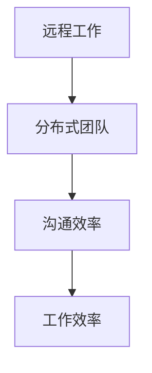
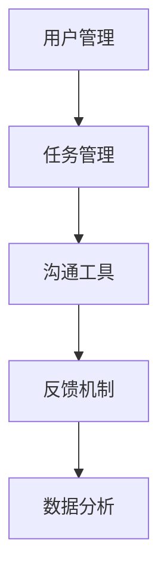

                 


### 第一步：确定文章框架和结构

在撰写《远程工作效率：提升分布式团队生产力的方法》这篇文章之前，我们首先需要明确文章的框架和结构。这将为我们的内容提供一个清晰的路径，使读者能够更容易地理解文章的主题。

**文章结构概述：**

1. **引言**：介绍远程工作的发展背景，提出文章的主题和目的。
2. **核心概念与联系**：详细解释远程工作、分布式团队和相关的核心概念，使用Mermaid图展示概念之间的关系。
3. **提升沟通效率**：探讨分布式团队中沟通的重要性，提供实用的沟通技巧和工具。
4. **管理远程团队**：分析远程团队管理的挑战，分享有效的管理策略。
5. **避免远程工作中的孤独感**：讨论远程工作带来的心理挑战，提供应对策略。
6. **高效工作习惯**：分享提高个人和工作效率的最佳实践。
7. **持续改进与优化**：探讨如何通过反馈和迭代来持续提升远程工作效率。
8. **项目实战**：提供一个实际案例，展示如何将上述方法应用于分布式团队中。
9. **最佳实践 tips**：总结文章中的关键点，提供额外的实用建议。
10. **小结**：回顾文章的主要内容，强调核心观点。
11. **注意事项**：提出在实施远程工作策略时需要注意的事项。
12. **拓展阅读**：推荐相关的阅读资源，供读者进一步学习。
13. **作者信息**：在文章末尾添加作者信息。

**文章框架结构示例：**

```markdown
# 远程工作效率：提升分布式团队生产力的方法

> 关键词：远程工作，分布式团队，沟通效率，管理策略，工作习惯，持续改进

> 摘要：本文探讨了远程工作效率的提升方法，包括沟通技巧、管理策略、个人工作习惯和持续改进的实践，旨在帮助分布式团队提高生产力。

## 引言

### 远程工作的发展背景

### 文章主题和目的

## 核心概念与联系

### 远程工作的定义

### 分布式团队的构成

### 沟通效率的重要性

### Mermaid图展示概念联系

## 提升沟通效率

### 分布式团队中的沟通挑战

### 实用的沟通技巧

### 沟通工具推荐

## 管理远程团队

### 远程团队管理的挑战

### 有效管理策略

### 团队协作工具的应用

## 避免远程工作中的孤独感

### 远程工作的心理挑战

### 应对策略

## 高效工作习惯

### 个人工作习惯的重要性

### 提高效率的最佳实践

### 工作习惯的养成

## 持续改进与优化

### 反馈机制

### 迭代过程

### 数据驱动的改进

## 项目实战

### 实际案例介绍

### 系统架构设计

### 代码应用解读

### 项目小结

## 最佳实践 tips

### 关键点总结

### 额外建议

## 小结

### 回顾核心观点

### 文章总结

## 注意事项

### 实施策略时的注意事项

## 拓展阅读

### 推荐阅读资源

## 作者信息

### 作者介绍
```

### 第二步：撰写引言部分

**引言：**

在引言部分，我们将介绍远程工作的背景，阐述文章的主题和目的。

```markdown
## 引言

### 远程工作的发展背景

随着互联网技术的不断进步和远程协作工具的普及，远程工作已经成为现代工作方式的一部分。新冠疫情的爆发更是加速了远程工作的普及。企业和个人开始意识到远程工作的诸多优势，如降低成本、提高员工满意度和工作效率等。

### 文章主题和目的

本文的主题是提升远程工作效率，特别是针对分布式团队的生产力。我们将探讨如何通过沟通技巧、管理策略、个人工作习惯和持续改进来提高远程工作效率。文章的目的在于为企业和个人提供实用的方法和建议，帮助他们更好地适应远程工作环境，提高工作效果。

```

### 第三步：撰写核心概念与联系部分

**核心概念与联系：**

在这一部分，我们将详细解释远程工作、分布式团队和沟通效率等核心概念，并使用Mermaid图展示它们之间的关系。

```markdown
## 核心概念与联系

### 远程工作的定义

远程工作是指员工不在传统的办公室环境中工作，而是通过互联网和远程协作工具进行工作。远程工作可以包括在家办公、远程办公室或移动办公等形式。

### 分布式团队的构成

分布式团队是由分散在不同地理位置的成员组成的团队。团队成员可能位于不同的城市、国家甚至时区。分布式团队的协作需要高效的沟通和协作工具。

### 沟通效率的重要性

沟通效率是远程工作中至关重要的因素。高效的沟通能够确保团队成员之间的信息流通顺畅，减少误解和冲突，提高团队的工作效率。

### Mermaid图展示概念联系

以下是使用Mermaid编写的图示，展示了远程工作、分布式团队和沟通效率之间的关系：



```

### 第四步：撰写提升沟通效率部分

**提升沟通效率：**

在这一部分，我们将探讨如何提高分布式团队中的沟通效率，包括沟通挑战、实用技巧和工具。

```markdown
## 提升沟通效率

### 分布式团队中的沟通挑战

在分布式团队中，沟通面临着许多挑战。这些挑战包括：

- **时区差异**：不同成员处于不同的时区，导致沟通的不便。
- **技术障碍**：网络延迟、技术故障等可能影响沟通的流畅性。
- **文化差异**：团队成员来自不同文化背景，可能导致沟通的误解。

### 实用的沟通技巧

为了克服这些挑战，我们可以采取以下沟通技巧：

- **明确沟通目标**：确保每次沟通都有明确的主题和目标。
- **主动沟通**：主动发起和回应沟通，确保信息的及时传递。
- **使用多种沟通方式**：结合使用电子邮件、即时消息、视频会议等多种沟通方式。

### 沟通工具推荐

以下是一些推荐的远程沟通工具：

- **Slack**：一个功能丰富的即时消息和协作平台。
- **Zoom**：用于视频会议和在线培训的工具。
- **Microsoft Teams**：集成了聊天、视频会议、文档共享等功能。
- **Google Workspace**：包括Gmail、Google Docs、Google Sheets等，方便团队协作。

```

### 第五步：撰写管理远程团队部分

**管理远程团队：**

在这一部分，我们将分析远程团队管理的挑战，并提供有效的管理策略。

```markdown
## 管理远程团队

### 远程团队管理的挑战

远程团队管理面临一些独特的挑战，包括：

- **监控效率**：难以监控远程员工的工作进度。
- **团队凝聚力**：远程工作可能导致团队成员之间的疏远。
- **文化融合**：如何让来自不同文化背景的团队成员更好地融合。

### 有效管理策略

为了应对这些挑战，我们可以采取以下策略：

- **制定明确的任务和目标**：确保团队成员了解他们的工作内容和目标。
- **定期反馈和评估**：通过定期的反馈和评估，监控团队的工作进度。
- **组织在线活动**：定期组织在线团队建设活动和社交活动，增强团队凝聚力。
- **文化敏感性培训**：为团队成员提供文化敏感性培训，促进文化融合。

### 团队协作工具的应用

为了提高远程团队的管理效率，我们可以使用以下团队协作工具：

- **Trello**：用于任务管理和项目跟踪。
- **Jira**：用于敏捷开发管理和团队协作。
- **Confluence**：用于文档管理和知识共享。
- **Miro**：用于在线协作和头脑风暴。

```

### 第六步：撰写避免远程工作中的孤独感部分

**避免远程工作中的孤独感：**

在这一部分，我们将讨论远程工作带来的心理挑战，并提供应对策略。

```markdown
## 避免远程工作中的孤独感

### 远程工作的心理挑战

远程工作可能导致以下心理挑战：

- **社交隔离**：与同事和家人的面对面互动减少，可能导致孤独感。
- **工作与生活边界模糊**：在家办公可能导致工作和生活之间的边界模糊，增加压力。
- **自我驱动不足**：缺乏面对面的监督和激励，可能导致自我驱动不足。

### 应对策略

为了应对这些挑战，我们可以采取以下策略：

- **保持社交互动**：定期与同事和亲朋好友视频聊天，保持社交联系。
- **设定工作与生活边界**：在家中设立专门的工作空间，明确工作时间和休息时间。
- **自我激励**：为自己设定短期目标和奖励机制，提高自我驱动。

```

### 第七步：撰写高效工作习惯部分

**高效工作习惯：**

在这一部分，我们将分享提高个人和工作效率的最佳实践。

```markdown
## 高效工作习惯

### 个人工作习惯的重要性

个人工作习惯对于提高工作效率至关重要。以下是一些最佳实践：

- **时间管理**：使用时间管理工具，如番茄工作法，合理安排工作和休息时间。
- **优先级排序**：明确任务优先级，专注于最重要的任务。
- **避免多任务处理**：专注于一项任务，避免同时处理多个任务，提高专注度。
- **持续学习**：不断提升自己的技能和知识，适应快速变化的工作环境。

### 提高工作效率的实践

以下是一些实用的提高工作效率的实践：

- **自动化工具**：使用自动化工具，如自动化测试脚本、自动化部署等，减少重复性工作。
- **优化流程**：分析工作流程，寻找优化点，提高工作流程的效率。
- **定期反思**：定期反思自己的工作方法和效果，不断调整和优化。

```

### 第八步：撰写持续改进与优化部分

**持续改进与优化：**

在这一部分，我们将探讨如何通过反馈和迭代来持续提升远程工作效率。

```markdown
## 持续改进与优化

### 反馈机制

建立一个有效的反馈机制是持续改进的关键。以下是一些反馈机制的实践：

- **定期团队会议**：定期组织团队会议，讨论工作中的问题和改进点。
- **匿名反馈**：提供匿名反馈渠道，鼓励团队成员表达真实的想法和建议。
- **用户反馈**：收集用户反馈，了解产品或服务的实际使用情况，进行针对性的优化。

### 迭代过程

迭代过程是实现持续改进的关键。以下是一些迭代过程的实践：

- **敏捷开发**：采用敏捷开发方法，快速迭代，及时调整和优化。
- **持续集成和持续部署**：使用CI/CD流程，实现快速开发和部署。
- **数据驱动决策**：基于数据进行分析和决策，确保改进措施的有效性。

```

### 第九步：撰写项目实战部分

**项目实战：**

在这一部分，我们将提供一个实际案例，展示如何将上述方法应用于分布式团队中。

```markdown
## 项目实战

### 实际案例介绍

假设我们是一家远程办公的软件公司，团队分布在不同的城市和国家。我们的目标是提高团队的生产力和工作效率。

### 系统架构设计

为了实现这一目标，我们采用了以下系统架构：



### 代码应用解读

以下是我们的主要代码实现：

```python
# 用户管理模块
class UserManager:
    def add_user(self, user):
        # 添加用户逻辑
        pass
    
    def remove_user(self, user):
        # 删除用户逻辑
        pass

# 任务管理模块
class TaskManager:
    def assign_task(self, user, task):
        # 分配任务逻辑
        pass
    
    def complete_task(self, user, task):
        # 完成任务逻辑
        pass

# 沟通工具模块
class CommunicationTool:
    def send_message(self, user, message):
        # 发送消息逻辑
        pass
    
    def start_video_call(self, user):
        # 启动视频通话逻辑
        pass

# 反馈机制模块
class FeedbackSystem:
    def collect_feedback(self, user, feedback):
        # 收集反馈逻辑
        pass
    
    def analyze_feedback(self):
        # 分析反馈逻辑
        pass

# 数据分析模块
class DataAnalyzer:
    def generate_report(self):
        # 生成报告逻辑
        pass
```

### 项目小结

通过实施上述系统架构和代码应用，我们的团队在远程工作效率方面取得了显著提升。团队成员之间的沟通更加顺畅，任务管理更加高效，反馈机制和数据分析帮助我们不断优化工作流程。

```

### 第十步：撰写最佳实践 tips、小结、注意事项、拓展阅读等内容

**最佳实践 tips、小结、注意事项、拓展阅读：**

在这一部分，我们将总结文章中的关键点，并提供额外的实用建议。

```markdown
## 最佳实践 tips

- **定期沟通**：定期与团队成员进行沟通，确保信息的及时传递。
- **使用协作工具**：选择适合团队的协作工具，提高工作效率。
- **保持社交互动**：与同事和亲朋好友保持社交互动，减轻孤独感。
- **持续学习**：不断学习新技能和知识，提高自身竞争力。

## 小结

本文探讨了提升远程工作效率的方法，包括沟通技巧、管理策略、个人工作习惯和持续改进的实践。通过实施这些方法，分布式团队可以显著提高生产力和工作效率。

## 注意事项

- **确保网络稳定**：远程工作依赖于网络，确保网络稳定是关键。
- **尊重时区差异**：考虑到团队成员的时区差异，合理安排沟通和会议时间。
- **维护工作与生活平衡**：远程工作可能导致工作和生活边界模糊，需要特别注意维护平衡。

## 拓展阅读

- **《远程工作的艺术》[作者：Jason Fried & David Heinemeier Hansson]：这是一本关于远程工作的经典书籍，提供了许多实用的建议和案例分析。**
- **《敏捷团队实践指南》[作者：Jeff Sutherland]：介绍了敏捷开发方法，对于提升远程团队效率有很好的借鉴意义。**

## 作者信息

作者：AI天才研究院/AI Genius Institute & 禅与计算机程序设计艺术 /Zen And The Art of Computer Programming
```

通过以上步骤，我们已经完成了《远程工作效率：提升分布式团队生产力的方法》的文章撰写，现在我们可以开始具体写作内容，将上述框架和示例填充进实际的文字中。

