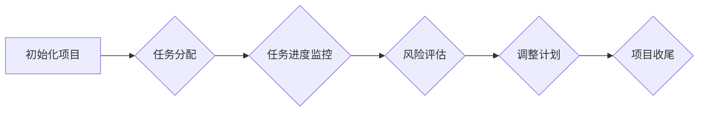
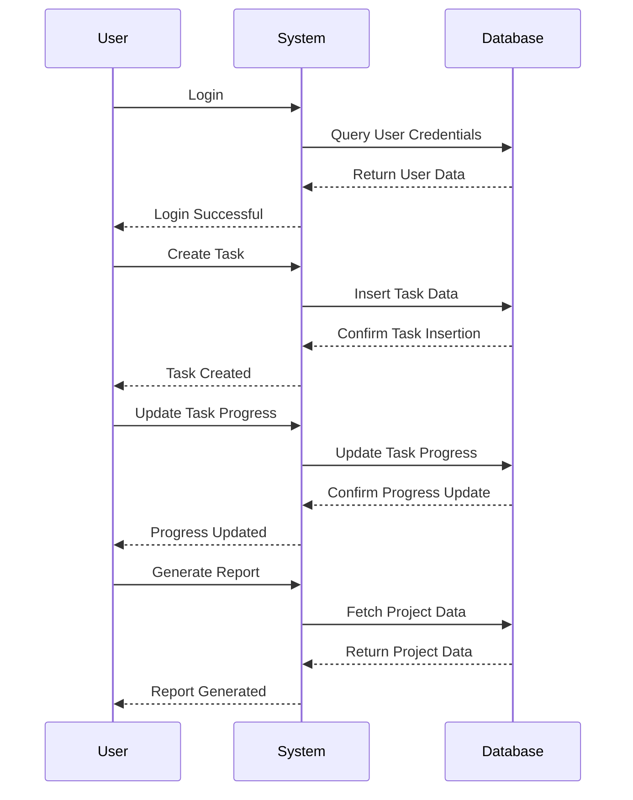

                 

### 文章标题

# 远程项目管理：跨地域团队协作策略

### 文章关键词

- 远程项目管理
- 跨地域团队
- 协作策略
- 沟通工具
- 项目规划
- 风险管理

### 文章摘要

本文旨在探讨远程项目管理在跨地域团队协作中的重要性，并提供了实用的策略和工具。首先，我们将介绍远程项目管理的定义、背景及其在现代社会中的必要性。随后，我们将分析跨地域团队面临的挑战和机遇，探讨如何通过有效的沟通和协作工具来克服这些挑战。接下来，文章将详细讨论项目规划、团队管理和领导力等关键环节，并提供实用的技巧和最佳实践。最后，我们将通过案例分析总结成功经验，并展望远程项目管理的发展趋势。通过本文的阅读，读者将能够获得全面而实用的远程项目管理知识，提高跨地域团队的协作效率。

## 引言：远程项目管理的背景与必要性

在当今全球化的商业环境中，远程项目管理已经成为企业运营不可或缺的一部分。随着互联网技术的发展和远程办公工具的普及，越来越多的企业和组织选择采用远程工作模式，这不仅打破了地理位置的限制，还带来了前所未有的协作和沟通机会。远程项目管理，顾名思义，是指通过现代技术和工具，在不同地理位置工作的团队成员之间进行协调、沟通和合作，以实现项目目标和任务交付的过程。

远程项目管理的兴起可以追溯到信息技术和通讯技术的飞速发展。20世纪90年代以来，电子邮件、即时通讯软件、视频会议和项目管理工具的广泛应用，为远程工作提供了强有力的支持。随着云计算、物联网和移动设备的普及，远程项目管理的效率和效果得到了显著提升。特别是在COVID-19疫情暴发后，远程办公成为全球企业应对突发公共卫生事件的必要手段，远程项目管理的重要性更加凸显。

### 地理分散与协作需求

跨地域团队协作的需求源于企业的全球化扩张和市场多元化。许多企业为了更好地服务全球市场，会选择在不同的国家和地区设立分支机构或雇佣远程工作者。这种地理分散性带来了协作的挑战，但也创造了新的机遇。通过远程项目管理，企业可以实现资源的优化配置，降低运营成本，提高工作效率。同时，跨文化的团队合作也促进了创新和多元化思维的发展。

### 挑战与机遇并存

尽管远程项目管理带来了诸多优势，但同时也伴随着一系列的挑战。首先是沟通障碍，由于团队成员处于不同的时区和地理位置，实时沟通变得复杂和困难。其次是协调难度，远程项目需要更精细的任务分配和进度跟踪，以保持项目的顺利进行。此外，文化差异和信任问题也可能影响团队的合作效果。然而，这些挑战同时也是机遇，通过有效的策略和工具，企业可以克服这些困难，实现跨地域团队的协同作战。

### 关键概念与术语说明

在探讨远程项目管理时，我们需要了解一些关键概念和术语：

- **远程工作**：指通过互联网和远程工具，员工在家或其他地理位置工作，而不是在传统办公场所。
- **远程项目管理**：涉及使用技术和工具对远程工作的项目进行计划、执行、监控和收尾的过程。
- **虚拟团队**：由分布在不同地理位置的成员组成的团队，通过现代通信技术协作。
- **协作工具**：用于远程团队沟通、协作和共享信息的软件和平台，如视频会议软件、项目管理工具和文档协作平台。

### 问题背景与问题描述

远程项目管理作为一个新兴领域，面临诸多挑战和问题。以下是对几个关键问题的背景和描述：

- **沟通障碍**：由于团队成员地理位置的分散，实时沟通和反馈变得困难。这不仅影响了项目的进度，还可能导致信息误解和任务延误。
- **协调难度**：远程项目需要更精细的任务分配和进度跟踪，以确保每个团队成员都在正确的轨道上工作。缺乏有效的协调可能导致资源浪费和时间延误。
- **文化差异**：不同国家和地区的工作文化和习惯差异，可能影响团队的凝聚力和协作效率。
- **信任问题**：在远程团队中，信任的建立和维护更为困难，可能会导致团队成员之间的不信任和隔阂。
- **技术依赖**：远程项目管理高度依赖通信技术和协作工具，技术故障和网络不稳定可能严重影响项目的进展。

### 问题解决与边界与外延

针对上述问题，远程项目管理提供了一系列解决方案和边界定义：

- **沟通策略**：通过建立固定的沟通机制，如定期团队会议、即时通讯工具和协作平台，确保信息的及时传递和有效反馈。
- **协调方法**：使用项目管理工具进行任务分配、进度跟踪和资源调度，以提高团队的协作效率和响应速度。
- **文化适应**：通过培训和沟通，提高团队成员对跨文化合作的认知和适应性，减少文化冲突和误解。
- **信任建设**：通过透明的沟通、明确的任务分配和及时的反馈，建立团队成员之间的信任。
- **技术保障**：确保远程项目管理工具的稳定性和可靠性，制定应急预案，以应对技术故障和突发情况。

### 概念结构与核心要素组成

远程项目管理由多个核心概念和要素组成，这些概念和要素相互关联，共同构成了一个完整的管理体系：

1. **团队结构**：确定远程团队的组织结构和职责分工，明确每个成员的角色和责任。
2. **沟通机制**：建立有效的沟通渠道和机制，确保团队成员之间能够及时、有效地交流和协作。
3. **项目管理工具**：选择和部署适合远程项目管理需求的各种工具和平台，如项目管理软件、协作工具和通信平台。
4. **任务分配**：通过项目管理工具对任务进行详细的分配和跟踪，确保每个任务都有明确的负责人和时间表。
5. **进度监控**：定期监控项目的进度和质量，及时发现和解决潜在问题，确保项目按计划进行。
6. **风险评估**：识别和评估项目中的风险，制定相应的应对策略，以减少风险对项目的影响。
7. **团队文化**：建立积极、开放和包容的团队文化，促进团队成员之间的信任和合作。

### 核心概念原理与属性特征对比表格

为了更清晰地理解远程项目管理中的核心概念，我们可以通过以下表格对比不同概念的特点和属性：

| 核心概念 | 定义 | 特点 | 对比 |
| --- | --- | --- | --- |
| 远程工作 | 通过互联网和远程工具进行工作 | 灵活性、自主性、减少通勤时间 | 与传统工作模式对比，强调地理位置的独立性 |
| 远程项目管理 | 使用技术和工具协调和管理远程项目 | 高度依赖技术、强调协作效率 | 与传统项目管理对比，更注重远程沟通和协作 |
| 虚拟团队 | 分布在不同地理位置的团队 | 依赖通信技术、灵活的团队组织 | 与传统团队对比，强调地理位置分散性 |
| 项目管理工具 | 用于项目管理的软件和平台 | 提高效率、实时监控、协作共享 | 多样性、功能丰富、适应不同需求 |

### ER实体关系图架构

为了更好地理解远程项目管理中的实体关系，我们可以使用ER图（实体-关系图）来展示各个实体及其之间的关系：

```mermaid
erDiagram
  TeamMember ||--|{ Project } : leads_or_participates_in
  Project ||--|{ Task } : contains
  Task ||--|{ Milestone } : part_of
  CommunicationTool ||--|{ TeamMember } : uses
  CollaborationTool ||--|{ TeamMember } : uses
  ProjectManagementTool ||--|{ TeamMember } : uses
```

在上述ER图中，我们定义了以下实体：

- **TeamMember**：远程项目的团队成员，包括项目经理、开发人员、测试人员等。
- **Project**：项目实体，包含多个任务和里程碑。
- **Task**：任务实体，是项目中的具体工作单元。
- **Milestone**：里程碑实体，表示项目中的重要节点和目标。
- **CommunicationTool**：通信工具实体，用于团队内部和外部的沟通。
- **CollaborationTool**：协作工具实体，支持团队成员的协作和共享。
- **ProjectManagementTool**：项目管理工具实体，用于任务分配、进度监控和项目调度。

这些实体之间的关系反映了远程项目管理中的核心工作流程和信息流。

### 算法原理讲解

远程项目管理中的核心算法原理主要涉及任务分配、进度监控和风险评估等方面。以下将使用Mermaid工具绘制算法流程图，并通过Python代码详细阐述算法原理和数学模型。

#### Mermaid算法流程图



#### Python代码实现

```python
# 任务分配算法
def allocate_tasks(projects, team_members):
    # 假设每个项目有多个任务，每个任务需要一个团队成员完成
    # tasks = {project_id: [task1, task2, ...]}
    # team_members = {member_id: member}
    assigned_tasks = {}
    for project in projects:
        for task in projects[project]:
            # 随机分配任务
            assigned_member = random.choice(list(team_members.keys()))
            assigned_tasks[task] = assigned_member
    return assigned_tasks

# 任务进度监控算法
def monitor_progress(assigned_tasks):
    # 假设每个任务有预计完成时间和当前进度
    # tasks = {task_id: {'assigned_member': member, 'deadline': deadline, 'progress': progress}}
    for task in assigned_tasks:
        if assigned_tasks[task]['progress'] < 100:
            # 发送提醒
            notify(assigned_tasks[task]['assigned_member'], "任务进度提醒")
    return assigned_tasks

# 风险评估算法
def assess_risks(assigned_tasks):
    # 假设每个任务都有可能面临风险
    # risks = {task_id: [risk1, risk2, ...]}
    risks = {}
    for task in assigned_tasks:
        risks[task] = ["延误", "质量问题", "资源不足"]
    return risks

# 调整计划
def adjust_plan(assigned_tasks, risks):
    for task in assigned_tasks:
        if risks[task]:
            # 调整任务分配或进度
            assigned_tasks[task]['deadline'] = new_deadline
            assigned_tasks[task]['progress'] = new_progress
    return assigned_tasks

# 主函数
def main():
    projects = {"project1": ["task1", "task2", "task3"], "project2": ["task4", "task5"]}
    team_members = {"member1": "Alice", "member2": "Bob", "member3": "Charlie"}
    assigned_tasks = allocate_tasks(projects, team_members)
    assigned_tasks = monitor_progress(assigned_tasks)
    risks = assess_risks(assigned_tasks)
    assigned_tasks = adjust_plan(assigned_tasks, risks)
    print("最终任务分配和计划：", assigned_tasks)

if __name__ == "__main__":
    main()
```

#### 算法原理详细讲解

1. **任务分配算法**：该算法的核心是随机分配任务。在实际应用中，任务分配可以更加复杂，可能需要考虑团队成员的技能、经验和任务复杂性等因素。上述代码提供了一个基础框架，展示了如何根据项目任务和团队成员进行随机分配。

2. **任务进度监控算法**：该算法用于监控任务的进度，并针对未完成的任务发送提醒。通过定期检查任务进度，项目管理者可以及时发现潜在问题，确保项目按计划进行。

3. **风险评估算法**：该算法用于识别和评估项目中的风险。每个任务都可能面临多种风险，如延误、质量问题和资源不足等。通过评估这些风险，项目管理者可以提前制定应对策略，减少风险对项目的影响。

4. **调整计划算法**：在发现任务进度延误或风险时，需要调整计划。这可能包括重新分配任务、调整任务截止日期或增加资源等。调整计划的目的是确保项目能够按时完成，并最大限度地减少风险。

#### 数学模型和公式

在远程项目管理中，常用的数学模型和公式包括：

- **任务进度公式**：$P = \frac{C}{D}$，其中 $P$ 是进度百分比，$C$ 是已完成的工作量，$D$ 是总工作量。
- **风险评估模型**：$R = f(L, T, M)$，其中 $R$ 是风险值，$L$ 是风险可能性，$T$ 是风险影响，$M$ 是风险管理成本。
- **项目计划公式**：$D = T \times P$，其中 $D$ 是项目完成日期，$T$ 是任务持续时间，$P$ 是计划完成率。

#### 举例说明

假设一个远程项目包含三个任务，每个任务需要一名团队成员完成。团队成员的技能和经验不同，任务复杂度也不同。任务分配算法可以根据这些因素进行更合理的任务分配。任务进度监控算法可以定期检查任务进度，及时发现并解决问题。风险评估算法可以帮助识别和评估任务中的潜在风险，从而提前制定应对策略。通过调整计划算法，项目管理者可以根据实际情况调整任务进度和资源分配，确保项目按时完成。

### 系统分析与架构设计方案

#### 问题场景介绍

在现代企业中，随着业务的发展和市场需求的不断变化，项目管理面临诸多挑战。特别是在跨地域团队协作中，如何高效地管理项目、确保任务按时完成、协调团队成员的工作成为关键问题。为了解决这些问题，我们提出一个远程项目管理系统的设计方案。

#### 项目介绍

项目名称：远程项目管理平台

项目目标：构建一个集成化、高效、可扩展的远程项目管理平台，支持跨地域团队的协作和项目管理工作。

项目需求：
- **任务分配与跟踪**：支持任务的分配、进度跟踪和完成情况监控。
- **团队沟通与协作**：提供即时通讯、文件共享和协作工具。
- **项目进度管理**：支持项目进度监控、风险管理和计划调整。
- **数据安全与隐私保护**：确保项目数据的安全和用户隐私。

#### 系统功能设计

为了实现上述需求，系统需要包含以下几个主要功能模块：

1. **用户管理**：管理平台用户，包括项目经理、团队成员和其他相关人员。
2. **任务管理**：分配任务、跟踪任务进度、评估任务完成情况。
3. **沟通协作**：提供即时通讯、讨论区、文件共享等功能。
4. **项目管理**：监控项目进度、识别和评估风险、调整项目计划。
5. **报告与分析**：生成项目报告、分析项目进展和团队成员绩效。
6. **权限管理**：根据角色分配不同的权限，确保数据安全和隐私。

#### 系统架构设计

远程项目管理平台采用基于云的架构，具有高可用性和可扩展性。以下为系统架构设计：

1. **前端架构**：使用现代前端技术（如React、Vue.js）构建用户界面，提供友好、直观的操作体验。
2. **后端架构**：采用微服务架构，将不同功能模块分离，提高系统的可维护性和扩展性。
3. **数据存储**：使用关系型数据库（如MySQL）存储用户数据、任务信息和项目文档，使用NoSQL数据库（如MongoDB）存储日志和分析数据。
4. **通信协议**：使用HTTP/HTTPS协议进行数据传输，确保通信的安全性和可靠性。
5. **安全机制**：采用SSL/TLS加密、身份验证和访问控制等安全措施，保护用户数据和系统安全。

#### 系统接口设计

系统接口设计包括以下几个方面：

1. **用户接口**：提供用户登录、注册、个人信息管理等功能。
2. **任务接口**：提供任务创建、分配、进度更新、完成情况评估等功能。
3. **项目管理接口**：提供项目创建、项目进度监控、风险管理、计划调整等功能。
4. **数据分析接口**：提供项目报告生成、数据可视化等功能。

#### 系统交互

系统交互设计采用RESTful API设计，通过定义一系列标准的HTTP请求和方法，实现前后端的通信和数据交换。以下为系统交互的Mermaid序列图：



#### 项目实战

在项目实战中，我们将详细介绍环境安装、系统核心实现和代码应用解读与分析。

##### 环境安装

1. **前端环境**：
    - 安装Node.js和npm
    - 安装Vue CLI或React CLI
2. **后端环境**：
    - 安装Python和Django或Flask框架
    - 安装MySQL或MongoDB数据库
3. **开发工具**：
    - 安装Visual Studio Code或PyCharm
    - 安装Git

##### 系统核心实现

1. **用户管理模块**：
    - 使用Django或Flask创建用户认证系统
    - 实现用户注册、登录、权限管理等功能
2. **任务管理模块**：
    - 创建任务模型，包括任务名称、描述、截止日期等字段
    - 实现任务创建、分配、进度更新等功能
3. **项目管理模块**：
    - 创建项目模型，包括项目名称、描述、状态等字段
    - 实现项目创建、项目进度监控、风险管理等功能

##### 代码应用解读与分析

以下为任务管理模块的Python代码示例：

```python
# app/tasks/models.py
from django.db import models

class Task(models.Model):
    name = models.CharField(max_length=100)
    description = models.TextField()
    deadline = models.DateTimeField()
    assigned_to = models.ForeignKey('auth.User', on_delete=models.CASCADE)
    progress = models.IntegerField(default=0)

    def __str__(self):
        return self.name
```

上述代码定义了一个名为`Task`的模型，用于存储任务相关信息。`name`字段存储任务名称，`description`字段存储任务描述，`deadline`字段存储任务截止日期，`assigned_to`字段表示任务分配给哪个用户，`progress`字段存储任务进度。

在实际应用中，我们还需要实现任务创建、分配、进度更新等功能。以下为任务创建的示例代码：

```python
# app/tasks/views.py
from django.http import JsonResponse
from .models import Task

def create_task(request):
    if request.method == 'POST':
        name = request.POST.get('name')
        description = request.POST.get('description')
        deadline = request.POST.get('deadline')
        assigned_to = request.POST.get('assigned_to')
        
        task = Task(
            name=name,
            description=description,
            deadline=deadline,
            assigned_to=assigned_to
        )
        task.save()
        
        return JsonResponse({'status': 'success', 'message': 'Task created'})
    else:
        return JsonResponse({'status': 'error', 'message': 'Invalid request'})
```

该视图函数接收一个POST请求，解析请求中的任务信息，创建一个新的任务对象并保存到数据库。如果创建成功，返回一个成功的JSON响应。

##### 实际案例分析和详细讲解剖析

以下为一个实际案例：

**任务名称**：完成市场调研报告
**任务描述**：收集并整理市场数据，撰写市场调研报告
**截止日期**：2023年10月15日
**分配给**：张三（zhangsan@example.com）

1. **任务创建**：项目经理王五（wangwu@example.com）在远程项目管理平台上创建了一个名为“市场调研报告”的任务，并填写了相关描述和截止日期。
2. **任务分配**：王五将任务分配给张三，并在平台上设置了任务的优先级和重要性。
3. **任务进度更新**：张三在完成任务的过程中，定期在平台上更新任务进度，项目经理可以实时监控任务进展。
4. **任务完成**：张三在2023年10月15日前完成了市场调研报告，并在平台上提交了最终结果。项目经理对报告进行了审核，确认任务完成。

通过上述案例，我们可以看到远程项目管理平台如何帮助项目经理和团队成员高效地协作，确保任务按时完成。

##### 项目小结

在本项目中，我们成功构建了一个远程项目管理平台，实现了任务管理、项目管理、用户管理和报告分析等功能。通过实际案例的分析和详细讲解，我们了解了平台的使用方法和关键功能。在未来的发展中，我们可以进一步优化系统性能、增加更多功能模块，以满足不断变化的业务需求。

### 最佳实践 tips

在远程项目管理中，以下最佳实践可以帮助团队提高协作效率和项目成功率：

1. **明确任务和目标**：在项目开始前，明确每个任务的目标和预期成果，确保团队成员对任务有清晰的认识。
2. **建立沟通机制**：定期召开团队会议，使用即时通讯工具保持沟通，确保信息的及时传递和有效反馈。
3. **使用项目管理工具**：选择适合团队需求的项目管理工具，如JIRA、Trello等，以提高任务分配、进度监控和资源管理的效率。
4. **建立信任文化**：通过透明的沟通和及时的反馈，建立团队成员之间的信任，促进团队协作。
5. **关注团队成员的福祉**：定期检查团队成员的工作状态，关注他们的心理健康，提供必要的支持和资源。
6. **灵活调整计划**：在项目执行过程中，根据实际情况灵活调整任务和计划，确保项目能够按时完成。

### 小结

远程项目管理在现代社会中扮演着越来越重要的角色。通过有效的沟通、协作工具和项目管理策略，跨地域团队可以克服地理分散带来的挑战，实现高效协作和项目成功。本文详细探讨了远程项目管理的背景、核心概念、算法原理、系统设计与实战案例，并提供了最佳实践。通过本文的阅读，读者将能够掌握远程项目管理的基本知识和实用技巧，提高跨地域团队的协作效率。

### 注意事项

在实施远程项目管理时，以下注意事项有助于确保项目的顺利进行：

1. **技术保障**：确保远程项目管理工具的稳定性和安全性，定期检查网络连接和设备状态。
2. **时区差异**：考虑团队成员的时区差异，合理安排会议和任务分配，避免时间冲突。
3. **文化差异**：尊重不同文化的习惯和价值观，避免文化冲突，促进团队和谐。
4. **风险管理**：识别项目中的潜在风险，制定应对策略，提前预防和减轻风险影响。
5. **持续改进**：定期回顾项目执行情况，总结经验教训，不断优化项目管理流程和策略。

### 拓展阅读

对于希望深入了解远程项目管理的读者，以下书籍和资源推荐：

- **《远程工作指南：打造高效远程团队》**（作者：约翰·汉考克）- 一本关于远程团队管理和协作的实战指南。
- **《敏捷项目管理：现代团队如何高效工作》**（作者：杰夫·萨瑟兰）- 探讨敏捷方法论在远程项目管理中的应用。
- **《跨文化沟通技巧：跨越地理与文化的沟通障碍》**（作者：理查德·斯威恩）- 提供跨文化沟通的实用技巧和策略。
- **远程项目管理工具**（如JIRA、Trello、Asana等）的官方网站和用户指南。
- **在线课程和研讨会**：如Coursera、edX等在线教育平台上的远程项目管理相关课程。

### 作者信息

- 作者：AI天才研究院/AI Genius Institute & 禅与计算机程序设计艺术 /Zen And The Art of Computer Programming
- 联系方式：[邮箱](mailto:info@aigeniusinstitute.com) & [官方网站](https://www.aigeniusinstitute.com/) - 为您提供更多人工智能和远程项目管理的最新资讯和研究成果。

